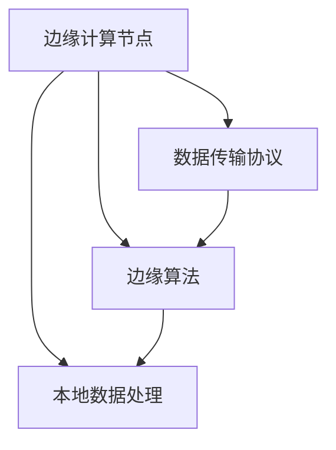
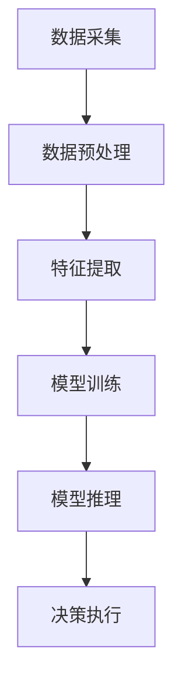
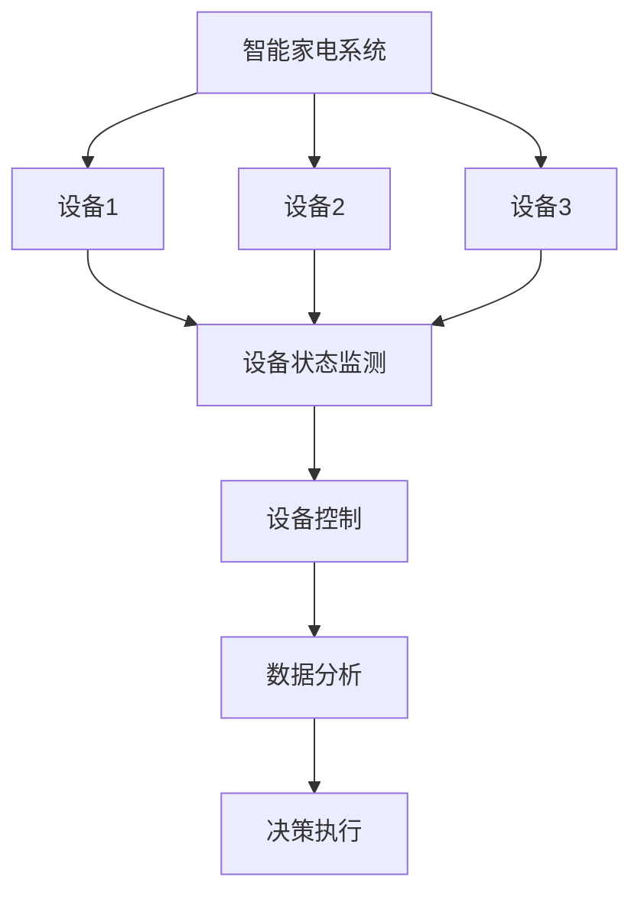
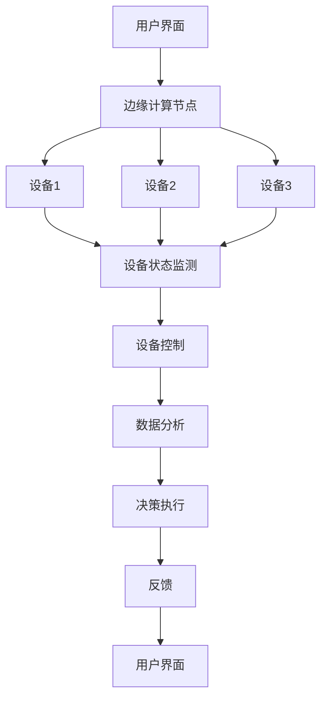
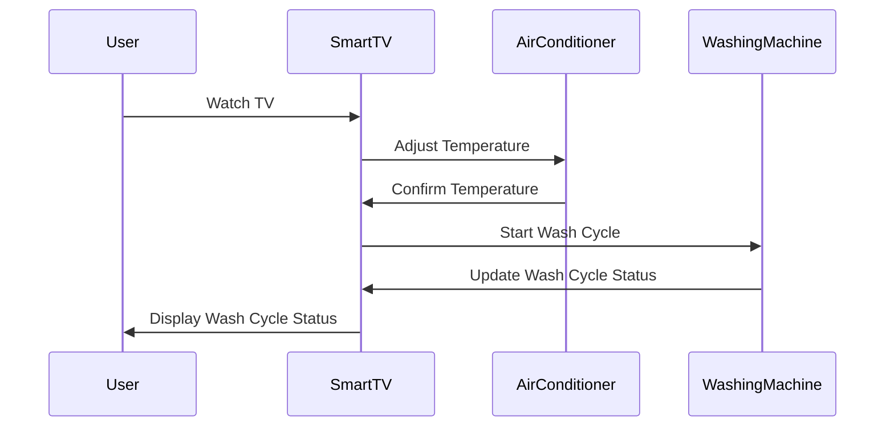

                 

### 边缘AI概述

#### 1.1.1 边缘AI的定义与背景

边缘AI（Edge AI）是指将人工智能计算任务从云端转移到网络边缘，即在数据生成的地方进行处理。这一概念的提出源于云计算的局限性。在云计算时代，大量的数据需要上传到数据中心进行处理，这不仅消耗了大量的带宽资源，还容易导致延迟，尤其是在物联网（IoT）设备和智能设备数量激增的背景下。

边缘AI的定义可以归纳为：在靠近数据源的地方，通过部署边缘计算节点，实现数据的局部处理与智能决策。这种模式不仅减轻了云端服务器的负担，还能够提供更快的响应速度和更高的数据处理效率。

边缘AI的发展背景主要有以下几点：

1. **数据增长**：随着物联网设备和智能设备的普及，产生的数据量呈指数级增长。这些数据若全部上传到云端，会对网络带宽和数据中心造成巨大压力。
2. **实时处理需求**：许多应用场景，如自动驾驶、智能制造等，对实时数据处理和决策有极高的要求。边缘AI能够在本地完成实时处理，从而满足这些需求。
3. **隐私保护**：某些敏感数据不宜上传到云端，如医疗数据、金融数据等。边缘AI可以在本地进行数据处理，从而更好地保护用户隐私。

边缘AI与传统云计算的区别主要体现在以下方面：

- **数据处理位置**：传统云计算将数据处理集中在数据中心，而边缘AI则在数据生成的地方进行处理。
- **延迟**：边缘AI由于更接近数据源，能够显著降低处理延迟。
- **带宽**：边缘AI减少了数据上传和下载数据的带宽需求。
- **安全性**：边缘AI可以在本地进行数据加密和隐私保护，提高了数据安全性。

#### 1.1.2 边缘AI的优势

边缘AI的优势主要体现在以下几个方面：

1. **实时数据处理**：边缘AI能够快速处理数据，提供了低延迟的响应，特别适用于需要即时决策的应用场景，如自动驾驶和智能监控。
2. **节省带宽**：由于数据在本地处理，上传到云端的数据量大大减少，从而节省了网络带宽资源。
3. **数据隐私**：边缘AI可以本地处理敏感数据，减少了数据泄露的风险。
4. **减少中心化压力**：边缘AI减轻了中心数据中心的负担，使得云计算系统更加高效。

#### 1.1.3 边缘AI的应用场景

边缘AI的应用场景非常广泛，涵盖了智能家居、智能交通、智能医疗等多个领域：

- **智能家居**：边缘AI可以在智能家电之间实现协同工作，提高用户体验。
- **智能交通**：边缘AI可以用于交通流量管理、自动驾驶等，提高交通效率和安全性。
- **智能医疗**：边缘AI可以帮助医生进行实时诊断，提高医疗服务的质量。
- **物联网设备**：边缘AI可以优化物联网设备的数据处理，提高设备性能和稳定性。

边缘AI在智能家电中的应用前景广阔，它不仅能够实现设备间的协同工作，还能够提供更加智能化、个性化的服务。接下来，我们将进一步探讨边缘AI在智能家电中的具体应用。

---

**问题背景**：随着物联网技术的飞速发展，智能家电的数量和种类日益增多。然而，这些设备之间的协同工作却面临着诸多挑战，如数据传输延迟、带宽限制以及数据隐私等问题。边缘AI的出现为解决这些问题提供了新的思路。

**问题描述**：智能家电之间的协同工作需要高效的数据处理和快速响应。然而，传统的云计算模式由于延迟和带宽的限制，难以满足这些需求。边缘AI如何能够实现智能家电间的协同工作，提高整体系统的性能和用户体验？

**问题解决**：通过边缘AI，数据可以在设备本地进行处理，从而降低了延迟和带宽消耗。边缘AI能够实现智能家电之间的实时数据共享和协同工作，提高系统的整体效率和用户体验。

**边界与外延**：边缘AI的应用不仅局限于智能家电，还可以扩展到智能家居、智能交通、智能医疗等领域。在不同的应用场景中，边缘AI的具体实现方式和性能优化策略可能会有所不同。

**概念结构与核心要素组成**：边缘AI的核心概念包括边缘计算节点、数据传输协议、边缘算法和本地数据处理。这些要素共同构成了边缘AI的基本架构，使得边缘AI能够实现高效的数据处理和智能决策。

---

**核心概念与联系**

#### 核心概念

**边缘AI**：在数据生成的地方进行人工智能计算和处理的技术。

**边缘计算节点**：部署在数据边缘的硬件和软件设备，用于处理数据和执行算法。

**数据传输协议**：用于边缘计算节点之间数据传输的规范和标准。

**边缘算法**：在边缘计算节点上运行的人工智能算法，用于数据分析和决策。

**本地数据处理**：在边缘计算节点本地进行的数据处理和分析。

#### 核心概念属性特征对比表格

| 特征 | 边缘AI | 中心化AI |
| --- | --- | --- |
| 数据处理位置 | 数据生成地 | 数据中心 |
| 延迟 | 低 | 高 |
| 带宽消耗 | 低 | 高 |
| 数据隐私 | 更好 | 较差 |
| 可扩展性 | 较差 | 高 |

#### ER实体关系图架构



#### 算法原理讲解

边缘AI的算法原理主要涉及数据采集、预处理、分析和决策等环节。以下是一个简单的边缘AI算法流程图：



**数据采集**：通过传感器、摄像头等设备采集数据。

**数据预处理**：对采集到的数据进行清洗、归一化等处理。

**特征提取**：从预处理后的数据中提取有用的特征。

**模型训练**：使用提取的特征训练人工智能模型。

**模型推理**：使用训练好的模型对新的数据进行推理，生成预测结果。

**决策执行**：根据推理结果执行相应的操作。

**数学模型和公式**：

假设我们有一个机器学习模型，用于分类任务。其基本数学模型可以表示为：

$$
y = f(W \cdot x + b)
$$

其中，$y$ 是预测标签，$x$ 是输入特征，$W$ 是权重矩阵，$b$ 是偏置项，$f$ 是激活函数。

**详细讲解与举例说明**：

假设我们有一个智能家居系统，需要检测某个家电设备的工作状态。通过传感器采集到的数据经过预处理后，我们提取出以下几个特征：电流、电压和温度。

我们使用一个简单的人工神经网络（ANN）模型来检测设备是否正常工作。首先，我们定义输入层、隐藏层和输出层的神经元数量：

- 输入层：3个神经元（对应3个特征）
- 隐藏层：5个神经元
- 输出层：1个神经元（对应设备工作状态，如正常或故障）

接下来，我们使用反向传播算法训练这个神经网络模型。训练数据集包含数千个样本，每个样本都有输入特征和对应的标签（正常或故障）。

在训练过程中，我们通过不断调整权重矩阵和偏置项，使得模型的预测结果与实际标签尽可能接近。经过多次迭代训练，模型达到较高的准确率。

**系统分析与架构设计方案**

#### 问题场景介绍

智能家电系统由多个设备组成，如智能电视、空调、洗衣机等。这些设备需要协同工作，提供更加智能化的服务，例如自动调节空调温度、根据电视节目自动调整设备音量等。

#### 项目介绍

本项目旨在设计和实现一个智能家电协同控制系统，通过边缘AI技术，实现设备间的实时数据共享和协同工作。系统功能包括：设备状态监测、设备控制、数据分析和决策执行等。

#### 系统功能设计（领域模型）



#### 系统架构设计



#### 系统接口设计和系统交互



#### 项目实战

**环境安装**：首先，我们需要搭建边缘计算环境，包括硬件设备和软件工具。硬件设备可以是树莓派、NUC等低功耗计算设备。软件工具包括Python、TensorFlow、Keras等。

**系统核心实现源代码**：

```python
# 设备状态监测模块
class DeviceMonitor:
    def __init__(self):
        self.devices = {}

    def add_device(self, device_id, device):
        self.devices[device_id] = device

    def get_device_status(self, device_id):
        return self.devices[device_id].get_status()

# 设备控制模块
class DeviceController:
    def __init__(self, monitor):
        self.monitor = monitor

    def control_device(self, device_id, command):
        device = self.monitor.get_device_status(device_id)
        device.execute_command(command)

# 数据分析模块
class DataAnalyzer:
    def __init__(self, data_source):
        self.data_source = data_source

    def analyze_data(self):
        data = self.data_source.get_data()
        # 数据分析处理
        return result

# 决策执行模块
class DecisionExecutor:
    def __init__(self, analyzer):
        self.analyzer = analyzer

    def execute_decision(self, decision):
        # 执行决策
        pass
```

**代码应用解读与分析**：

上述代码定义了智能家电协同控制系统的核心模块，包括设备状态监测、设备控制、数据分析和决策执行。每个模块都有明确的功能和接口，方便系统扩展和集成。

设备状态监测模块负责跟踪设备的状态，包括设备ID和设备对象。设备控制模块可以根据设备状态执行相应的命令。数据分析模块用于处理和分析设备生成的数据，生成决策结果。决策执行模块负责根据数据分析结果执行决策。

**实际案例分析和详细讲解剖析**：

假设智能电视检测到用户正在观看体育节目，需要调整空调温度以提供更好的观影体验。系统的工作流程如下：

1. 用户通过遥控器打开智能电视。
2. 智能电视向设备状态监测模块发送请求，获取当前设备状态。
3. 设备状态监测模块返回体育节目相关信息给智能电视。
4. 智能电视通过设备控制模块发送指令给空调，调整温度。
5. 空调收到指令后，执行相应的温度调整。
6. 空调将调整后的温度信息反馈给智能电视。
7. 智能电视将调整后的温度信息显示在屏幕上，并通知用户。

通过上述流程，智能家电系统能够实现设备间的协同工作，提高用户体验。

**项目小结**：

本项目通过边缘AI技术，实现了智能家电之间的实时数据共享和协同工作。系统架构清晰，功能模块明确，适用于各种智能家电场景。在未来的发展中，我们可以进一步优化系统性能和安全性，为用户提供更加智能化、便捷的服务。

---

**最佳实践 tips**：

1. 选择合适的边缘计算硬件，根据应用场景和数据处理需求进行优化。
2. 设计高效的数据传输协议，确保数据传输的稳定性和安全性。
3. 精简算法模型，优化计算资源的使用。
4. 定期更新系统软件，确保系统安全性和稳定性。

**注意事项**：

1. 边缘AI设备需要定期维护和更新，以保持其性能和安全性。
2. 数据隐私和安全是边缘AI应用的重要考虑因素，应采取适当的安全措施。

**拓展阅读**：

1. 《边缘计算：智能设备时代的核心技术》
2. 《智能物联网：边缘AI与云计算的融合》
3. 《深度学习在边缘设备中的应用》

---

**作者信息**：

作者：AI天才研究院/AI Genius Institute & 禅与计算机程序设计艺术 /Zen And The Art of Computer Programming

---

通过本篇博客，我们详细探讨了边缘AI在智能家电中的应用，从概念、优势到实现和应用案例，全面分析了边缘AI如何实现设备间协同工作，提高智能家电系统的性能和用户体验。希望本文能为读者提供有价值的参考和启示。在未来的发展中，边缘AI将在智能家电、智能家居等更多领域发挥重要作用，推动智能化的进一步发展。

