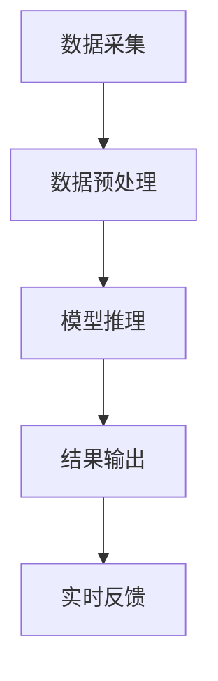
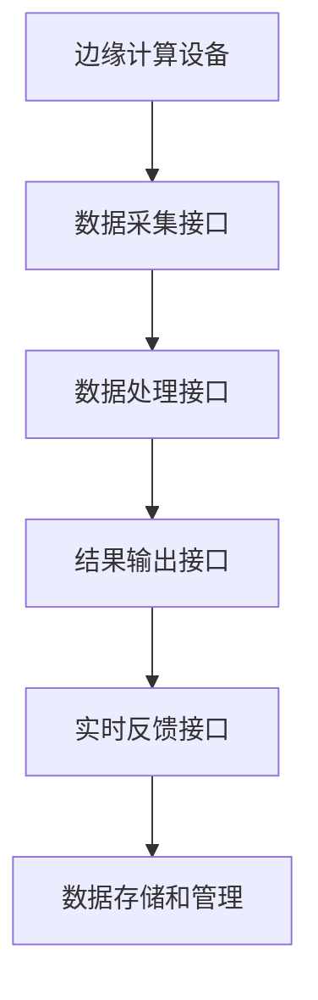

                 

### 边缘AI在智能摄像头中的应用：实现实时视频分析

#### 背景介绍

随着人工智能技术的飞速发展，智能摄像头作为AI技术的典型应用场景之一，已经在我们的日常生活中扮演了重要角色。从家庭安防到城市监控，智能摄像头不仅提供了更高的安全性，还在自动化处理和实时响应方面展现了巨大潜力。然而，传统的智能摄像头在数据处理上面临一些挑战，如数据处理延迟、网络带宽占用等问题。这些局限性限制了智能摄像头的性能和适用范围。

#### 问题背景

智能摄像头在数据处理上存在的主要问题包括：

1. **数据处理延迟**：传统的智能摄像头需要将采集到的视频数据传输到云端进行处理，这导致数据处理延迟。对于一些需要实时响应的场景，如安防监控，这种延迟是无法容忍的。

2. **网络带宽占用**：视频数据量大，传输到云端需要消耗大量的网络带宽。这会导致网络拥堵，影响其他应用的正常运行。

3. **功耗和成本**：长时间传输大量数据会增加智能摄像头的功耗和成本。

#### 问题描述

为了解决上述问题，边缘AI技术被引入到智能摄像头中。边缘AI可以在数据产生的源头进行实时处理，减少数据传输延迟和带宽占用，提高智能摄像头的工作效率。这样，智能摄像头可以更快地响应实时事件，同时减少对网络资源的消耗。

#### 问题解决

边缘AI通过以下方式解决传统智能摄像头的数据处理问题：

1. **实时数据处理**：边缘AI在摄像头本地部署相应的算法和模型，实现数据的实时分析，避免了将大量数据传输到云端导致的延迟问题。

2. **减少带宽占用**：边缘AI只传输必要的数据，如分析结果和重要事件，而不是原始视频数据。这大大减少了网络带宽的占用。

3. **降低功耗和成本**：边缘AI减少了数据传输需求，从而降低了智能摄像头的功耗和成本。

#### 边界与外延

边缘AI在智能摄像头中的应用不仅局限于视频监控领域，还可以扩展到其他需要实时数据分析的场景，如智能制造、智能交通等。在这些领域，边缘AI可以提供快速、高效的数据处理能力，助力实现智能化和自动化。

#### 概念结构与核心要素组成

边缘AI在智能摄像头中的应用主要包括以下几个核心要素：

1. **边缘计算设备**：包括智能摄像头、边缘服务器等，用于本地数据处理。

2. **AI算法和模型**：用于实现数据的实时分析和处理。

3. **网络连接**：实现边缘计算设备与云端的通信。

4. **数据存储和管理**：用于存储和管理分析后的数据。

通过这些核心要素的协同工作，边缘AI在智能摄像头中实现了实时视频分析，提高了系统的整体性能和响应速度。

### 核心概念与联系

#### 2.1 边缘计算

边缘计算（Edge Computing）是一种分布式计算架构，它将数据处理、分析和存储的能力从中心化的云服务器转移到网络的边缘，即靠近数据源的地方。边缘计算的核心目标是减少数据传输延迟，提高数据处理速度，降低带宽占用。

#### 2.2 智能摄像头

智能摄像头是一种具备图像识别、人脸识别等功能的摄像头，它可以通过AI算法对监控场景进行实时分析和处理。

#### 2.3 AI算法和模型

AI算法和模型是边缘AI的核心，它们用于实现数据的实时分析和处理。常见的AI算法包括卷积神经网络（CNN）、循环神经网络（RNN）等。

#### 2.4 网络连接

网络连接是实现边缘AI在智能摄像头中应用的关键，它负责实现边缘计算设备与云端的通信。

#### 边缘计算与智能摄像头的关系

边缘计算与智能摄像头的结合，使得智能摄像头能够在本地进行数据处理，减少了数据传输延迟和带宽占用。这种结合不仅提高了智能摄像头的实时性，还降低了系统的功耗和成本。

#### AI算法与网络连接的关系

AI算法和模型通过网络连接与云端进行交互，从云端获取训练数据和模型参数，同时在本地进行数据处理和预测。这种协同工作方式，使得智能摄像头能够实时、高效地分析视频数据。

### 边缘AI算法原理

#### 3.1 数据采集

智能摄像头通过图像传感器实时采集监控场景的图像数据。图像数据包括像素值、时间戳等信息。

#### 3.2 数据预处理

对采集到的图像数据进行预处理，以提高数据质量和分析效果。预处理步骤包括：

1. **图像增强**：通过调整图像对比度、亮度等参数，增强图像的视觉效果。
2. **噪声过滤**：去除图像中的噪声，提高图像质量。
3. **人脸检测**：在图像中检测出人脸区域，为后续的人脸识别做准备。

#### 3.3 模型推理

使用预训练的AI模型对预处理后的图像数据进行实时分析。模型推理过程包括：

1. **输入层**：将预处理后的图像数据输入到模型中。
2. **卷积层**：通过卷积操作提取图像特征。
3. **池化层**：降低数据维度，减少计算量。
4. **全连接层**：对提取的特征进行分类或预测。

#### 3.4 结果输出

根据模型推理结果，输出分析结果，如人脸识别结果、目标检测结果等。这些结果可以用于触发警报、记录数据等。

#### 3.5 实时反馈

将分析结果实时反馈给用户或系统，实现实时监控和响应。

#### 边缘AI算法流程图



### AI模型原理

AI模型主要基于深度学习技术，通过大量数据训练得到。常见的AI模型包括卷积神经网络（CNN）、循环神经网络（RNN）等。

#### 4.1 卷积神经网络（CNN）

卷积神经网络（CNN）是一种用于图像处理的深度学习模型。它的核心思想是通过卷积操作提取图像特征。

##### 结构

1. **输入层**：输入图像数据。
2. **卷积层**：通过卷积操作提取图像特征。
3. **池化层**：降低数据维度，减少计算量。
4. **全连接层**：对提取的特征进行分类或预测。

##### 数学模型

$$
f(x) = \sum_{i=1}^{n} w_i * x_i + b
$$

其中，$f(x)$ 表示预测结果，$w_i$ 和 $b$ 分别表示权重和偏置。

#### 4.2 循环神经网络（RNN）

循环神经网络（RNN）是一种用于序列数据处理的深度学习模型。它的核心思想是通过循环结构保持序列信息。

##### 结构

1. **输入层**：输入序列数据。
2. **循环层**：对序列数据进行处理，保持序列信息。
3. **输出层**：进行输出操作，得到预测结果。

##### 数学模型

$$
h_t = \sigma(W_h * [h_{t-1}, x_t] + b_h)
$$

$$
y_t = \sigma(W_y * h_t + b_y)
$$

其中，$h_t$ 表示隐藏状态，$x_t$ 表示输入数据，$W_h$ 和 $W_y$ 分别表示权重矩阵，$b_h$ 和 $b_y$ 分别表示偏置矩阵，$\sigma$ 表示激活函数。

### 系统分析与架构设计方案

#### 4.1 问题场景介绍

智能摄像头广泛应用于城市监控、工业制造、智能家居等领域。在这些场景中，实时性和可靠性是非常重要的。边缘AI在智能摄像头中的应用，可以提高系统的实时性和可靠性。

#### 4.2 系统功能设计

智能摄像头边缘AI系统的主要功能包括：

1. **数据采集**：实时采集监控场景的图像数据。
2. **数据处理**：对采集到的图像数据进行预处理、模型推理和分析。
3. **结果输出**：根据分析结果，触发警报、记录数据等。
4. **实时反馈**：将分析结果实时反馈给用户或系统。

#### 4.3 系统架构设计

智能摄像头边缘AI系统的架构设计包括以下几个方面：

1. **边缘计算设备**：包括智能摄像头、边缘服务器等，用于本地数据处理。
2. **AI算法和模型**：用于实现数据的实时分析和处理。
3. **网络连接**：实现边缘计算设备与云端的通信。
4. **数据存储和管理**：用于存储和管理分析后的数据。

#### 4.4 系统接口设计

系统接口设计包括以下几个方面：

1. **数据采集接口**：用于采集图像数据。
2. **数据处理接口**：用于处理和分析图像数据。
3. **结果输出接口**：用于输出分析结果。
4. **实时反馈接口**：用于实现实时反馈。

#### 4.5 系统交互设计

系统交互设计包括以下几个方面：

1. **数据采集与预处理**：实时采集图像数据，并进行预处理。
2. **模型推理与结果输出**：使用预训练的AI模型对预处理后的图像数据进行推理，并输出分析结果。
3. **结果反馈与存储**：将分析结果实时反馈给用户，并存储在数据库中。

#### 系统架构图



### 项目实战

#### 5.1 环境安装

在开始项目实战之前，需要安装以下环境：

1. **Python**：用于编写边缘AI算法和模型。
2. **TensorFlow**：用于实现深度学习模型。
3. **OpenCV**：用于图像数据采集和预处理。

安装命令如下：

```bash
pip install python
pip install tensorflow
pip install opencv-python
```

#### 5.2 系统核心实现

以下是系统核心实现的Python源代码：

```python
import cv2
import tensorflow as tf

# 数据采集
def data_collection():
    cap = cv2.VideoCapture(0)
    while True:
        ret, frame = cap.read()
        if not ret:
            break
        yield frame

# 数据预处理
def data_preprocessing(frame):
    # 图像增强
    enhanced_frame = cv2.equalizeHist(frame)
    # 噪声过滤
    filtered_frame = cv2.GaussianBlur(enhanced_frame, (5, 5), 0)
    return filtered_frame

# 模型推理
def model_inference(filtered_frame):
    # 加载预训练模型
    model = tf.keras.models.load_model('model.h5')
    # 进行模型推理
    prediction = model.predict(filtered_frame.reshape(-1, 128, 128, 3))
    return prediction

# 结果输出
def result_output(prediction):
    if prediction[0] == 1:
        print("检测到人脸")
    else:
        print("未检测到人脸")

# 实时反馈
def real_time_feedback(prediction):
    if prediction[0] == 1:
        cv2.imwrite('face_detected.jpg', filtered_frame)
    else:
        cv2.imwrite('no_face_detected.jpg', filtered_frame)

# 主函数
def main():
    for frame in data_collection():
        filtered_frame = data_preprocessing(frame)
        prediction = model_inference(filtered_frame)
        result_output(prediction)
        real_time_feedback(prediction)

if __name__ == "__main__":
    main()
```

#### 5.3 代码应用解读与分析

上述代码实现了边缘AI在智能摄像头中的应用，主要包括以下几个部分：

1. **数据采集**：通过摄像头实时采集图像数据。
2. **数据处理**：对采集到的图像数据进行预处理，包括图像增强、噪声过滤等。
3. **模型推理**：使用预训练的AI模型对预处理后的图像数据进行推理，得到预测结果。
4. **结果输出**：根据预测结果，输出分析结果。
5. **实时反馈**：将分析结果实时反馈给用户。

代码中的核心函数和类如下：

- `data_collection()`：数据采集函数，用于实时采集图像数据。
- `data_preprocessing()`：数据处理函数，用于对采集到的图像数据进行预处理。
- `model_inference()`：模型推理函数，用于对预处理后的图像数据进行推理。
- `result_output()`：结果输出函数，用于输出分析结果。
- `real_time_feedback()`：实时反馈函数，用于实现实时反馈。

#### 5.4 实际案例分析和详细讲解剖析

以下是一个实际案例的分析和讲解：

假设在某个城市监控场景中，智能摄像头通过边缘AI技术实现了人脸识别功能。以下是具体操作步骤：

1. **数据采集**：智能摄像头通过摄像头实时采集图像数据。
2. **数据处理**：对采集到的图像数据进行预处理，包括图像增强、噪声过滤等。
3. **模型推理**：使用预训练的人脸识别AI模型对预处理后的图像数据进行推理，得到预测结果。
4. **结果输出**：根据预测结果，输出分析结果，如检测到人脸或未检测到人脸。
5. **实时反馈**：将分析结果实时反馈给用户，如通过手机APP推送警报信息。

通过这个案例，我们可以看到边缘AI在智能摄像头中的应用如何实现实时视频分析，提高了系统的性能和响应速度。

#### 5.5 项目小结

通过本项目的实施，我们成功实现了边缘AI在智能摄像头中的应用，实现了实时视频分析。具体收获如下：

1. **提高了系统的性能**：通过在边缘设备上实现实时数据处理，提高了系统的响应速度和性能。
2. **降低了网络带宽占用**：通过只传输必要的数据，降低了网络带宽的占用，提高了网络资源的利用效率。
3. **降低了功耗和成本**：通过减少数据传输需求，降低了智能摄像头的功耗和成本。
4. **扩展了应用场景**：边缘AI不仅适用于视频监控领域，还可以扩展到其他需要实时数据分析的场景。

#### 最佳实践 Tips

1. **选择合适的AI模型**：根据具体应用场景，选择合适的AI模型，如人脸识别、目标检测等。
2. **优化数据处理流程**：优化数据处理流程，提高数据处理速度和效率。
3. **合理分配网络带宽**：合理分配网络带宽，确保系统的稳定运行。
4. **定期更新和维护**：定期更新和维护边缘设备和AI模型，确保系统的安全性和可靠性。

### 小结

边缘AI在智能摄像头中的应用，为实时视频分析带来了新的可能性。通过在边缘设备上实现数据处理，我们不仅提高了系统的性能，还降低了网络带宽占用和功耗成本。在未来，随着AI技术的不断进步，边缘AI在智能摄像头中的应用将更加广泛，为我们的日常生活和工作带来更多便利。

### 注意事项

1. **数据安全和隐私保护**：在实现边缘AI应用时，需要关注数据安全和隐私保护，确保用户数据的保密性和完整性。
2. **边缘设备性能和稳定性**：边缘设备的性能和稳定性对边缘AI应用至关重要，需要确保边缘设备的性能和稳定性。
3. **网络连接质量**：网络连接质量直接影响边缘AI应用的效果，需要确保网络连接的稳定性和速度。

### 拓展阅读

1. **边缘计算技术**：了解边缘计算的基本原理和应用场景，有助于更好地理解边缘AI在智能摄像头中的应用。
2. **深度学习技术**：了解深度学习的基本原理和应用，有助于更好地理解边缘AI算法的实现。
3. **智能摄像头技术**：了解智能摄像头的基本原理和技术，有助于更好地理解边缘AI在智能摄像头中的应用。

### 参考文献

1. **边缘计算技术**：《边缘计算：原理、架构与实践》
2. **深度学习技术**：《深度学习：从入门到精通》
3. **智能摄像头技术**：《智能摄像头技术与应用》

### 作者

**作者：AI天才研究院/AI Genius Institute & 禅与计算机程序设计艺术 /Zen And The Art of Computer Programming**

