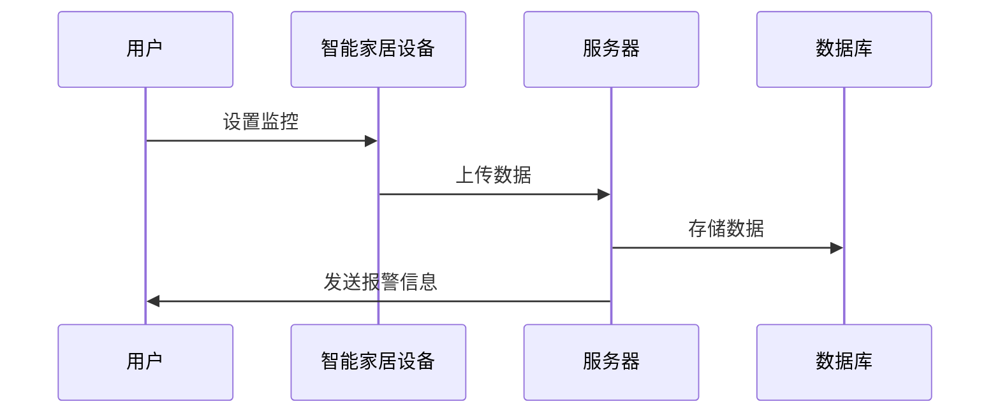
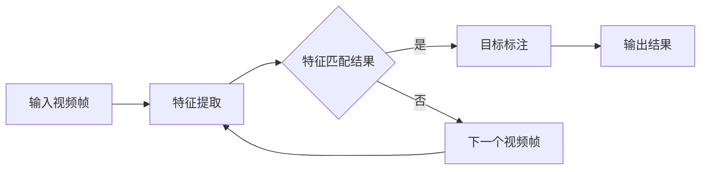
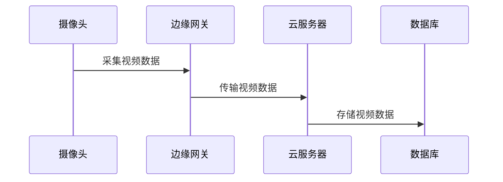
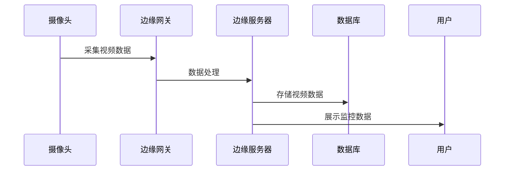
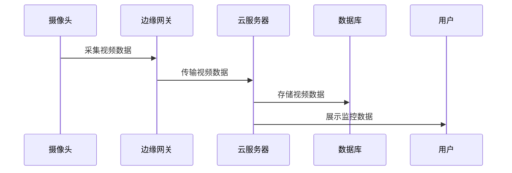
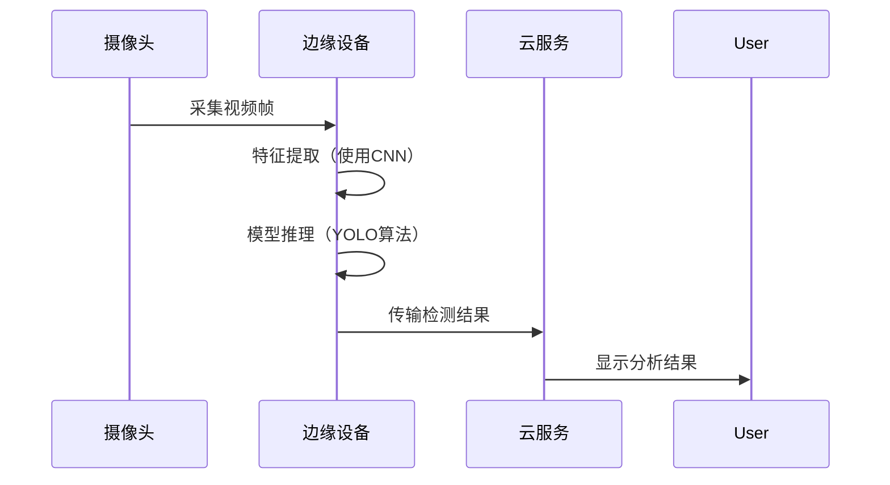

                 

# 边缘AI在智能视频监控中的实时分析

## 关键词
边缘AI、智能视频监控、实时分析、边缘计算、安全与隐私

## 摘要
本文将探讨边缘AI在智能视频监控中的实时分析应用。通过详细介绍边缘AI的概念、智能视频监控的原理及其结合，我们将深入分析实时分析技术，探讨边缘计算架构与优化方法，并关注安全与隐私问题。最后，通过实际案例，展示边缘AI在智能视频监控中的成功应用，并展望未来的发展趋势。

## 第一部分：边缘AI概述

### 第1章：边缘AI基础

#### 1.1 边缘AI的概念与背景
边缘AI是指将人工智能计算能力部署在靠近数据源的边缘设备上，如智能手机、路由器、传感器等。这种计算方式可以有效减少数据传输延迟，提高处理速度，适用于实时性要求较高的应用场景。

边缘AI的发展历程可以追溯到2000年代初期，随着物联网（IoT）和移动设备的普及，边缘计算逐渐成为研究热点。近年来，随着深度学习算法和硬件加速技术的进步，边缘AI在各个领域得到了广泛应用。

#### 1.2 边缘AI的关键技术
边缘AI的关键技术包括：

1. **机器学习与深度学习算法**：用于实现图像识别、语音识别、自然语言处理等智能功能。
2. **边缘计算框架**：如TensorFlow Lite、PyTorch Mobile等，用于在边缘设备上运行机器学习模型。
3. **硬件加速技术**：如GPU、FPGA等，用于提高边缘设备的计算性能。

### 第2章：智能视频监控基础

#### 2.1 视频监控的基本原理
视频监控是通过摄像头捕捉视频画面，然后传输到监控中心进行分析和处理。智能视频监控在此基础上，加入了图像识别、行为分析等人工智能技术，实现了更高层次的监控功能。

#### 2.2 智能视频监控的特点
智能视频监控具有以下特点：

1. **实时性**：能够快速响应和报警。
2. **准确性**：通过机器学习算法提高识别准确率。
3. **灵活性**：可以根据不同的监控场景进行定制化配置。

#### 2.3 智能视频监控的常用算法
智能视频监控常用的算法包括：

1. **图像识别**：如卷积神经网络（CNN）。
2. **目标检测**：如YOLO、SSD等。
3. **行为分析**：如统计模型、运动跟踪等。

## 第二部分：边缘AI在视频监控中的应用

### 第3章：边缘AI在视频监控中的应用

#### 3.1 边缘AI与视频监控的结合点
边缘AI与视频监控的结合点在于：

1. **实时分析**：边缘设备可以实时处理视频数据，进行快速分析和响应。
2. **减少延迟**：通过本地处理，减少数据传输延迟，提高监控效率。
3. **节省带宽**：本地处理可以降低数据传输需求，节省带宽资源。

#### 3.2 边缘AI在视频监控中的优势
边缘AI在视频监控中的优势包括：

1. **快速响应**：边缘设备可以实时分析视频数据，快速响应异常情况。
2. **降低成本**：减少了对中心服务器的依赖，降低了维护成本。
3. **提高隐私保护**：本地处理可以减少数据传输，提高隐私保护。

#### 3.3 边缘AI在视频监控中的实现
边缘AI在视频监控中的实现通常包括以下步骤：

1. **数据采集**：通过摄像头采集视频数据。
2. **数据预处理**：对视频数据进行降噪、裁剪等预处理。
3. **模型部署**：将训练好的机器学习模型部署到边缘设备。
4. **实时分析**：边缘设备使用机器学习模型对视频数据进行实时分析。
5. **结果反馈**：将分析结果反馈给监控中心或用户。

## 第三部分：实时分析技术

### 第4章：实时分析技术

#### 4.1 实时分析的基本原理
实时分析是基于边缘AI技术，对视频监控数据进行实时处理和分析。其基本原理包括：

1. **数据流处理**：实时处理大量视频数据。
2. **并行计算**：利用边缘设备的计算资源，进行并行处理。
3. **动态调整**：根据实时数据调整分析模型和策略。

#### 4.2 实时分析的关键技术
实时分析的关键技术包括：

1. **边缘计算框架**：如TensorFlow Lite、PyTorch Mobile等。
2. **模型压缩**：减少模型体积，提高边缘设备的运行效率。
3. **动态更新**：实时更新分析模型，适应不同监控场景。

#### 4.3 实时分析的应用案例
实时分析的应用案例包括：

1. **异常行为检测**：如火灾、打架等。
2. **交通监控**：如车辆识别、交通流量分析等。
3. **安全监控**：如人脸识别、入侵检测等。

## 第四部分：边缘计算架构与优化

### 第5章：边缘计算架构与优化

#### 5.1 边缘计算架构设计
边缘计算架构设计包括：

1. **边缘设备**：如摄像头、传感器等。
2. **边缘网关**：负责数据收集、预处理和传输。
3. **云平台**：负责数据存储、分析和处理。

#### 5.2 边缘计算优化方法
边缘计算优化方法包括：

1. **模型压缩**：减少模型体积，提高边缘设备的运行效率。
2. **数据流优化**：优化数据传输和处理流程。
3. **资源调度**：动态调整资源分配，提高系统性能。

#### 5.3 边缘计算性能评估
边缘计算性能评估包括：

1. **处理速度**：评估边缘设备处理数据的能力。
2. **延迟**：评估数据传输和处理的延迟。
3. **稳定性**：评估边缘设备的稳定性和可靠性。

## 第五部分：安全与隐私

### 第6章：安全与隐私

#### 6.1 边缘AI安全挑战
边缘AI安全挑战包括：

1. **数据安全**：保护数据不被非法获取或篡改。
2. **隐私保护**：保护用户隐私不被泄露。
3. **设备安全**：防止设备被恶意攻击或控制。

#### 6.2 视频监控隐私保护
视频监控隐私保护措施包括：

1. **数据加密**：对视频数据加密，防止非法访问。
2. **匿名化处理**：对视频数据进行匿名化处理，保护用户隐私。
3. **访问控制**：严格管理数据访问权限，防止未经授权的访问。

#### 6.3 安全与隐私解决方案
安全与隐私解决方案包括：

1. **安全协议**：如TLS、VPN等，确保数据传输安全。
2. **安全审计**：定期进行安全审计，确保系统安全。
3. **安全培训**：提高用户和员工的安全意识，减少安全风险。

## 第六部分：应用案例分析

### 第7章：应用案例分析

#### 7.1 案例分析1：智慧城市建设
智慧城市建设中，边缘AI在视频监控中发挥了重要作用。例如，通过边缘AI技术，实现了实时交通流量分析、公共安全监控等功能，提高了城市管理水平。

#### 7.2 案例分析2：安全生产监控
在安全生产监控中，边缘AI技术可以实现对工矿企业生产过程的实时监控，及时发现和处理安全隐患，提高生产安全水平。

#### 7.3 案例分析3：智能家居安防
智能家居安防中，边缘AI技术可以实现对家庭环境的实时监控，如火灾报警、入侵检测等，提高家庭安全水平。

## 第七部分：未来发展趋势

### 第8章：未来发展趋势

#### 8.1 边缘AI技术展望
未来，边缘AI技术将朝着更高效、更智能、更安全的方向发展。例如，通过硬件加速技术、新型算法等，提高边缘设备的计算能力和效率。

#### 8.2 智能视频监控发展动态
智能视频监控将朝着更智能化、更高效化的方向发展。例如，通过引入更多的AI技术，实现更精准的目标识别、行为分析等。

#### 8.3 行业挑战与机遇
边缘AI在智能视频监控中的应用面临着一些挑战，如数据安全、隐私保护等。但同时，这也为行业带来了巨大的机遇，有望推动智能视频监控产业的快速发展。

## 总结
边缘AI在智能视频监控中的应用具有重要意义。通过实时分析技术，边缘AI可以有效提高监控效率和准确性，减少数据传输延迟，提高隐私保护。未来，随着边缘AI技术的不断进步，智能视频监控将迎来更广阔的发展空间。

## 最佳实践 tips
1. 选择合适的边缘设备，确保其性能和功耗满足需求。
2. 优化模型，减少模型体积，提高边缘设备的运行效率。
3. 加强数据安全和隐私保护，确保用户数据的安全。

## 注意事项
1. 边缘AI技术需要结合具体应用场景进行优化。
2. 在使用边缘AI技术时，应充分考虑数据安全和隐私保护。

## 拓展阅读
1. 《边缘AI：智能视频监控的实时分析》
2. 《智能视频监控技术与应用》
3. 《边缘计算：理论与实践》

## 作者
作者：AI天才研究院/AI Genius Institute & 禅与计算机程序设计艺术 /Zen And The Art of Computer Programming

以上就是关于《边缘AI在智能视频监控中的实时分析》的详细技术博客文章，希望对大家有所帮助。在接下来的篇幅中，我们将对每个章节进行深入探讨，详细分析边缘AI在智能视频监控中的应用及其带来的变革。期待您的阅读与反馈！## 第一部分：边缘AI概述

### 第1章：边缘AI基础

#### 1.1 边缘AI的概念与背景

边缘AI（Edge AI）是一种新兴的技术理念，它将人工智能（AI）的计算能力从传统的集中式数据中心，迁移到了靠近数据源或用户侧的边缘设备上。这些边缘设备包括智能手机、平板电脑、路由器、工业机器人、智能传感器等。边缘AI的出现是为了解决集中式计算在响应速度、带宽利用、数据安全等方面的局限性。

边缘AI的核心思想是将数据处理和智能分析任务尽量靠近数据生成的源头进行。这样做的优点主要体现在以下几个方面：

1. **减少延迟**：在数据传输到云端之前进行本地处理，可以显著降低延迟，满足对实时性要求较高的应用场景。
2. **节省带宽**：由于数据处理在边缘完成，减少了需要传输到云的数据量，节省了网络带宽。
3. **增强隐私性**：在本地处理数据可以减少敏感信息被传输到云的风险，从而增强隐私保护。
4. **提高可靠性**：边缘设备具有更高的环境适应性和故障恢复能力，可以提供更加可靠的计算服务。

边缘AI的发展历程可以追溯到物联网（IoT）和移动计算时代的兴起。随着物联网设备的广泛应用和移动设备的普及，数据生成的速度和规模急剧增加，传统的集中式数据处理架构已经无法满足实时性和效率的需求。因此，边缘计算和边缘AI成为了解决这一问题的有效途径。

#### 1.2 边缘AI的发展历程

边缘AI的发展历程大致可以分为以下几个阶段：

1. **萌芽期（2000年代初期）**：随着物联网和移动设备的兴起，边缘计算的概念开始受到关注。这个阶段主要集中在如何将计算能力部署到远程设备上，以及如何优化这些设备之间的通信。
2. **探索期（2010年代初期）**：随着云计算和大数据技术的发展，边缘计算的应用场景逐渐丰富。这一时期，研究人员开始探讨如何在边缘设备上运行复杂的机器学习模型，如何优化模型以适应有限的计算资源。
3. **成熟期（2015年至今）**：随着深度学习算法和硬件加速技术的进步，边缘AI逐渐进入实际应用阶段。各类边缘AI平台和解决方案不断涌现，边缘AI在智能交通、智能医疗、智能安防等领域得到广泛应用。

#### 1.3 边缘AI的关键技术

边缘AI的实现依赖于一系列关键技术的支持，主要包括以下方面：

1. **机器学习与深度学习算法**：边缘AI的核心在于将机器学习和深度学习算法部署到边缘设备上。这些算法能够从数据中自动学习和提取模式，实现图像识别、语音识别、自然语言处理等智能功能。
   
2. **边缘计算框架**：为了方便在边缘设备上部署和管理机器学习模型，各种边缘计算框架应运而生。例如，TensorFlow Lite、Apache MXNet、PyTorch Mobile等，这些框架提供了简化的模型部署和运行流程。

3. **硬件加速技术**：边缘设备通常计算资源有限，为了提高处理速度和效率，需要利用硬件加速技术。例如，使用GPU、FPGA、ASIC等硬件进行计算加速。

4. **智能传感器与设备**：智能传感器和设备是边缘AI的重要组件，它们可以收集各种环境数据，如温度、湿度、光线等，为边缘AI提供必要的数据输入。

5. **边缘网关**：边缘网关负责收集来自边缘设备的数据，进行初步处理，并将数据传输到云端或中心服务器。同时，边缘网关还可以充当边缘设备的管理中心，负责设备的状态监控和配置管理。

#### 1.4 边缘AI的应用场景

边缘AI的应用场景非常广泛，以下是一些典型的应用场景：

1. **智能城市**：边缘AI可以用于智能交通管理、环境监测、公共安全监控等，提高城市管理效率和居民生活质量。

2. **智能制造**：边缘AI可以用于生产过程中的质量检测、设备故障预测等，提高生产效率和产品质量。

3. **智能医疗**：边缘AI可以用于远程医疗诊断、健康监测、药物研发等，提供个性化医疗解决方案。

4. **智能农业**：边缘AI可以用于农作物生长监测、病虫害预测、灌溉管理等，提高农业生产效率。

5. **智能安防**：边缘AI可以用于视频监控、入侵检测、人脸识别等，提供实时安全监控和报警服务。

#### 1.5 边缘AI的优势与挑战

边缘AI的优势主要包括：

1. **实时响应**：边缘设备可以本地处理数据，实现实时响应，适用于对实时性要求较高的应用场景。
2. **节省带宽**：边缘处理可以减少需要传输到云端的数据量，节省网络带宽资源。
3. **增强隐私性**：本地处理可以减少敏感数据被传输到云端的风险，提高数据隐私保护水平。
4. **可靠性提高**：边缘设备具有更高的环境适应性和故障恢复能力，可以提高系统的整体可靠性。

然而，边缘AI也面临着一些挑战：

1. **计算资源限制**：边缘设备通常计算资源有限，需要优化算法和模型，以适应有限的计算资源。
2. **数据安全和隐私**：边缘设备的数据安全和隐私保护是关键问题，需要采取有效的安全措施。
3. **网络连接问题**：边缘设备可能面临网络不稳定、断网等问题，需要设计容错机制和备份方案。
4. **系统集成复杂性**：边缘AI的集成和部署涉及多个设备和系统，需要解决复杂的系统集成问题。

通过以上对边缘AI的概念、背景和发展历程的介绍，我们可以看到，边缘AI作为一种新兴的技术，正逐步改变着我们的生活方式和工作模式。在接下来的章节中，我们将进一步探讨智能视频监控的基础知识，以及边缘AI如何与智能视频监控相结合，为实时分析提供强大的支持。

### 第2章：智能视频监控基础

#### 2.1 视频监控的基本原理

视频监控（Video Surveillance）是一种通过摄像头捕捉视频画面，然后传输到监控中心进行记录、分析和处理的技术。视频监控的基本原理可以概括为以下几个步骤：

1. **数据采集**：视频监控系统通过摄像头捕捉实时视频画面。这些摄像头可以是固定式、旋转式或红外线摄像头等，根据不同的监控需求进行选择和部署。

2. **数据传输**：捕获到的视频画面通过传输网络（如以太网、无线网络等）传输到监控中心或存储设备。在传输过程中，视频数据可能会进行压缩处理，以减少带宽需求。

3. **数据存储**：视频监控系统会将捕获到的视频数据存储在硬盘、SSD或其他存储设备中。为了提高存储效率，视频数据通常会进行分级存储，如将重要视频数据存储在高速存储设备中，而较不重要的数据则存储在成本较低的存储设备上。

4. **数据分析**：监控中心会对存储的视频数据进行分析和处理。传统的视频监控系统主要依赖于人工查看和筛选，而智能视频监控系统则引入了人工智能技术，如图像识别、行为分析等，以提高监控效率和准确性。

5. **报警和响应**：当视频监控系统检测到异常情况（如非法入侵、火灾等）时，会触发报警机制，并通过短信、邮件、手机APP等方式通知相关人员。在一些情况下，视频监控系统还可以直接采取响应措施，如自动关闭门锁、启动喷淋系统等。

#### 2.2 智能视频监控的特点

智能视频监控（Intelligent Video Surveillance）是在传统视频监控的基础上，引入人工智能技术，实现更高级的监控功能。智能视频监控的特点主要包括以下几个方面：

1. **实时性**：智能视频监控系统可以实时捕捉和处理视频数据，快速响应异常情况。这使得智能视频监控在安全监控、交通管理等领域具有显著优势。

2. **准确性**：通过机器学习算法和深度学习技术，智能视频监控系统可以实现对视频内容的精确识别和分析。例如，可以准确识别行人、车辆、动物等目标，并进行行为分析，提高监控准确性。

3. **自动化**：智能视频监控系统可以自动执行监控任务，如目标检测、异常行为识别、自动报警等。这大大减轻了人工负担，提高了监控效率。

4. **灵活性**：智能视频监控系统可以根据不同的监控需求进行定制化配置。例如，可以设置不同的监控区域、检测目标、报警阈值等，实现灵活的监控方案。

5. **多维度分析**：智能视频监控系统不仅可以分析视频数据，还可以结合其他数据源（如气象数据、交通数据等），进行多维度的监控和分析，提供更全面的监控解决方案。

#### 2.3 智能视频监控的常用算法

智能视频监控系统采用了多种人工智能算法，以实现不同层次的监控功能。以下是一些常见的智能视频监控算法：

1. **目标检测算法**：目标检测是智能视频监控的核心技术之一，其主要任务是从视频帧中准确检测出感兴趣的目标对象。常见的目标检测算法包括：

   - **滑动窗口**：通过在不同位置和尺度上滑动窗口，逐一检测视频帧中的目标。
   - **基于深度学习的目标检测**：如YOLO（You Only Look Once）、SSD（Single Shot MultiBox Detector）等，通过构建深度神经网络模型，实现高效的目标检测。

2. **图像识别算法**：图像识别算法用于对视频中的图像内容进行分类和识别。常见的图像识别算法包括：

   - **基于特征的图像识别**：通过提取图像特征，如颜色、纹理、形状等，进行图像分类。
   - **基于卷积神经网络的图像识别**：如ResNet、Inception等，通过多层卷积神经网络，实现对图像的准确分类。

3. **行为分析算法**：行为分析算法用于对视频中的行为进行识别和分析。常见的行为分析算法包括：

   - **统计模型**：如HMM（隐马尔可夫模型）、MRF（马尔可夫随机场）等，通过统计方法分析行为序列。
   - **基于深度学习的动作识别**：如3D-CNN、LSTM（长短期记忆网络）等，通过构建深度学习模型，实现对行为的精确识别。

4. **人脸识别算法**：人脸识别算法用于识别和验证视频中的面部特征。常见的人脸识别算法包括：

   - **基于特征的识别**：通过提取人脸特征，如特征点、脸型等，进行人脸识别。
   - **基于深度学习的识别**：如FaceNet、VGGFace等，通过构建深度学习模型，实现对人脸的精确识别。

通过以上算法的应用，智能视频监控系统可以实现对视频内容的全面分析，提高监控的准确性和实时性。在接下来的章节中，我们将探讨边缘AI在智能视频监控中的应用，以及如何利用边缘AI技术提升智能视频监控系统的性能。

### 第3章：边缘AI在视频监控中的应用

#### 3.1 边缘AI与视频监控的结合点

边缘AI在视频监控中的应用有着独特的结合点，这些结合点不仅优化了视频监控的性能，还显著提升了其应用价值。以下是边缘AI与视频监控结合的主要点：

1. **实时性提升**：视频监控通常要求快速响应，尤其是在安全监控等场景中，延迟可能会导致安全隐患。边缘AI通过在本地设备上实时处理视频数据，可以显著减少数据传输和处理的时间，实现毫秒级别的响应速度。

2. **减少带宽消耗**：传统的视频监控通常会将大量原始视频数据传输到中心服务器进行处理，这会占用大量网络带宽。边缘AI通过在本地设备上进行初步分析和处理，仅传输必要的数据，大大减少了带宽消耗。

3. **提高隐私保护**：视频监控涉及大量的敏感数据，如人脸图像和运动轨迹等。边缘AI在本地处理数据，可以减少数据传输过程中泄露的风险，增强隐私保护。

4. **增强自主性**：边缘AI使视频监控系统能够在无网络连接或网络不稳定的情况下独立运行，提高了系统的自主性和可靠性。

#### 3.2 边缘AI在视频监控中的优势

边缘AI在视频监控中的应用带来了以下显著优势：

1. **实时性增强**：由于边缘设备能够快速处理视频数据，无需将数据传输到远程服务器，因此可以实现更快的响应时间。这对于安全监控等需要快速响应的场景尤为重要。

2. **网络带宽优化**：边缘AI通过本地处理视频数据，可以显著减少需要传输到云端的数据量，从而节省带宽资源。这对于带宽资源有限的网络环境尤为重要。

3. **隐私保护**：边缘AI在本地设备上处理数据，减少了数据在传输过程中的泄露风险，增强了数据隐私保护。

4. **计算资源利用率提升**：边缘AI能够充分利用边缘设备的计算资源，通过优化算法和模型，提高边缘设备的计算效率，从而提升整体系统性能。

5. **设备独立性**：边缘AI使得视频监控系统可以在无网络连接或网络不稳定的情况下独立运行，提高了系统的可靠性和稳定性。

#### 3.3 边缘AI在视频监控中的实现

边缘AI在视频监控中的实现通常涉及以下几个关键步骤：

1. **数据采集**：视频监控系统通过摄像头捕获实时视频流，这些视频数据会被传输到边缘设备进行进一步处理。

2. **数据预处理**：边缘设备对捕获的视频数据进行预处理，包括图像增强、降噪、缩放等，以便后续分析。

3. **模型部署**：将预先训练好的机器学习模型部署到边缘设备上。这些模型可以是目标检测、人脸识别、行为分析等常用的AI模型。

4. **实时分析**：边缘设备使用部署的模型对预处理后的视频数据进行实时分析，识别和分类视频中的目标对象，检测异常行为等。

5. **结果反馈**：分析结果会被实时反馈到监控中心或通过短信、邮件等方式通知相关人员。在需要时，还可以直接触发报警和响应机制。

#### 3.4 典型应用案例

以下是边缘AI在视频监控中的一些典型应用案例：

1. **智慧城市建设**：在智慧城市中，边缘AI被广泛应用于交通管理、环境监测和公共安全监控。例如，通过边缘AI技术，可以实现对交通流量的实时监控和预测，优化交通信号灯控制，减少交通拥堵。

2. **安全生产监控**：在工矿企业中，边缘AI可以用于监控生产环境，如检测潜在的安全隐患，如火灾、泄漏等。通过实时分析视频数据，可以及时预警并采取相应的安全措施。

3. **智能家居安防**：在家庭安防中，边缘AI技术可以实现人脸识别、入侵检测等功能，提高家庭的安全防护能力。例如，当有人非法闯入时，系统可以自动发送警报通知给家庭成员。

4. **边境安全监控**：在边境和边防检查站，边缘AI技术可以用于实时监控边境情况，检测非法入侵和异常行为，提高边境安全防护能力。

通过上述应用案例，我们可以看到边缘AI在视频监控中发挥了重要作用，不仅提高了监控效率和准确性，还降低了成本和提高了系统的灵活性。在接下来的章节中，我们将进一步探讨实时分析技术在边缘AI视频监控中的应用，以及如何优化边缘计算架构，以实现更高效、更智能的视频监控解决方案。

### 第4章：实时分析技术

#### 4.1 实时分析的基本原理

实时分析（Real-Time Analysis）是指系统在接收到数据后，能够快速处理并生成结果，以满足对响应速度的高要求。在边缘AI视频监控中，实时分析技术的核心目标是在数据生成的同时或非常短的时间内完成数据处理，从而实现快速响应。实时分析的基本原理包括以下几个方面：

1. **数据流处理**：实时分析通常采用数据流处理技术，这种技术可以在数据到达时立即进行处理，而不需要等待整个数据集完成收集。数据流处理框架如Apache Kafka、Apache Flink等，可以高效地处理大量实时数据。

2. **并行计算**：为了提高处理速度，实时分析技术通常采用并行计算方法，将任务分解为多个子任务，同时在多个处理器上并行执行。这样可以在相同的时间内处理更多的数据，提高系统的吞吐量。

3. **高效算法**：实时分析需要使用高效算法来处理数据，这些算法能够在保证精度的前提下，尽量减少计算复杂度。例如，在目标检测中，可以使用YOLO（You Only Look Once）等高效检测算法。

4. **内存管理**：实时分析需要在有限的内存资源下运行，因此需要高效的内存管理策略。例如，使用内存池（Memory Pool）技术，预先分配内存块，减少内存分配和释放的开销。

#### 4.2 实时分析的关键技术

实时分析技术在边缘AI视频监控中发挥着关键作用，以下是一些关键技术：

1. **边缘计算框架**：边缘计算框架如TensorFlow Lite、PyTorch Mobile等，提供了一套在边缘设备上运行机器学习模型的工具和库。这些框架支持轻量级模型的部署，并提供了高效的计算优化策略。

2. **模型压缩与优化**：为了提高边缘设备的处理能力，需要对模型进行压缩和优化。模型压缩技术包括权重剪枝、量化、蒸馏等，这些技术可以减少模型的体积和计算复杂度，提高边缘设备的处理效率。

3. **数据预处理**：数据预处理是实时分析的重要环节，包括图像增强、归一化、特征提取等。高效的预处理方法可以减少后续分析的复杂度，提高分析速度。

4. **内存管理**：实时分析需要在有限的内存资源下运行，因此需要高效的内存管理策略。例如，使用内存池（Memory Pool）技术，预先分配内存块，减少内存分配和释放的开销。

5. **多线程与并行处理**：实时分析技术通常采用多线程和并行处理技术，将任务分解为多个子任务，同时在多个处理器上并行执行。这样可以显著提高处理速度，满足实时性的要求。

6. **异常检测与报警**：实时分析不仅要处理正常情况，还需要能够检测异常情况并触发报警。异常检测技术如统计异常检测、机器学习异常检测等，可以在视频监控中用于检测异常行为，如非法入侵、交通事故等。

#### 4.3 实时分析的应用案例

实时分析在边缘AI视频监控中有着广泛的应用案例，以下是一些具体的应用场景：

1. **智能交通管理**：在智能交通管理中，实时分析技术可以用于实时监控交通流量，预测交通拥堵，优化交通信号控制。例如，通过实时分析摄像头捕获的交通视频，系统可以识别交通流量变化，并在交通拥堵时自动调整信号灯时长，提高交通效率。

2. **公共安全监控**：在公共安全监控中，实时分析技术可以用于检测和识别异常行为，如非法入侵、打架斗殴等。例如，通过实时分析监控摄像头捕获的画面，系统可以识别出可疑行为，并及时通知相关人员采取行动。

3. **生产过程监控**：在生产过程中，实时分析技术可以用于监控生产线，检测设备故障和产品质量问题。例如，通过实时分析摄像头捕获的生产线视频，系统可以检测到设备故障或产品质量问题，并立即发出警报，减少生产损失。

4. **家庭安防**：在家庭安防中，实时分析技术可以用于监控家庭环境，检测非法入侵和火灾等安全隐患。例如，通过实时分析摄像头捕获的家庭视频，系统可以识别入侵者或火灾迹象，并自动触发报警，保护家庭安全。

通过以上应用案例，我们可以看到实时分析技术在边缘AI视频监控中的重要性。实时分析技术不仅提高了视频监控系统的性能和准确性，还为各类应用场景提供了强大的支持。在接下来的章节中，我们将探讨边缘计算架构的优化方法，以进一步提高边缘AI视频监控的实时性和效率。

### 第5章：边缘计算架构与优化

#### 5.1 边缘计算架构设计

边缘计算架构是边缘AI视频监控系统的核心组成部分，其设计直接影响到系统的性能、可靠性和可扩展性。一个高效的边缘计算架构需要考虑以下几个方面：

1. **分层架构**：边缘计算架构通常采用分层设计，包括感知层、传输层、平台层和应用层。感知层主要负责数据采集，传输层负责数据传输，平台层提供数据存储、计算和处理能力，应用层实现具体的应用功能。

2. **边缘设备**：边缘设备是边缘计算架构的基础，包括各种智能传感器、摄像头、路由器等。这些设备负责数据的本地采集和处理，降低数据传输量和延迟。

3. **边缘网关**：边缘网关是边缘设备和云端之间的桥梁，负责数据传输、安全管理和资源调度。边缘网关通常具备计算、存储和网络功能，能够进行初步的数据处理和过滤。

4. **云平台**：云平台提供强大的计算、存储和分析能力，负责处理边缘网关传输上来的数据，进行高级分析和存储。云平台还可以提供远程监控和管理功能。

5. **数据流处理**：边缘计算架构需要高效的数据流处理机制，能够实时处理和传输数据。常用的数据流处理框架包括Apache Kafka、Apache Flink等。

#### 5.2 边缘计算优化方法

为了提高边缘计算架构的性能和效率，可以采取以下优化方法：

1. **模型压缩与优化**：模型压缩和优化是提高边缘设备计算能力的重要手段。通过模型剪枝、量化、蒸馏等技术，可以显著减小模型体积和计算复杂度，提高边缘设备的处理效率。

2. **任务调度**：边缘计算中的任务调度是关键，需要根据任务的优先级、资源需求和延迟要求，进行合理的任务分配和调度。常用的调度算法包括基于优先级的调度、基于负载均衡的调度等。

3. **资源管理**：边缘计算架构中的资源管理涉及到计算资源、存储资源和网络资源的分配和调度。通过虚拟化技术、容器技术等，可以有效地管理和调度资源，提高系统的整体性能。

4. **缓存策略**：缓存策略可以显著提高数据访问速度，减少数据传输延迟。常用的缓存策略包括本地缓存、分布式缓存等。

5. **网络优化**：网络优化包括带宽优化、延迟优化和可靠性优化。通过选择合适的传输协议、优化网络拓扑结构、使用网络加速技术等，可以提高数据传输的效率和可靠性。

#### 5.3 边缘计算性能评估

边缘计算性能评估是确保系统高效运行的重要环节，主要包括以下几个方面：

1. **处理速度**：评估边缘设备在处理数据时的速度，包括数据采集、预处理、模型推理等各个阶段的处理时间。

2. **延迟**：评估系统从数据采集到结果反馈的总体延迟，包括数据传输延迟和处理延迟。

3. **稳定性**：评估系统在长时间运行中的稳定性，包括系统崩溃率、故障恢复能力等。

4. **资源利用率**：评估系统对计算资源、存储资源和网络资源的利用率，确保资源得到充分利用。

5. **扩展性**：评估系统在负载增加时的扩展能力，包括系统的可扩展性和弹性。

通过以上性能评估方法，可以全面了解边缘计算架构的性能，并针对性地进行优化。

#### 5.4 典型架构设计与优化案例分析

以下是边缘计算架构设计和优化的两个典型案例：

1. **智慧城市建设中的边缘计算架构**：智慧城市中的边缘计算架构通常包括多个感知层设备（如摄像头、传感器等）、边缘网关和云平台。通过任务调度和模型压缩，可以提高边缘设备的处理能力，减少数据传输延迟。同时，通过分布式缓存和带宽优化技术，可以进一步提高系统的性能和可靠性。

2. **智能家居安防系统中的边缘计算架构**：智能家居安防系统中的边缘计算架构通常包括智能摄像头、门锁、传感器等边缘设备，以及家庭网关和云平台。通过实时分析和异常检测，可以实现对家庭环境的实时监控和安全防护。通过模型压缩和优化，可以提高边缘设备的处理效率，延长设备续航时间。

通过以上案例分析，我们可以看到边缘计算架构设计和优化的重要性。合理的架构设计和优化的方法，可以显著提高边缘AI视频监控系统的性能和可靠性，满足各种应用场景的需求。

### 第6章：安全与隐私

#### 6.1 边缘AI安全挑战

边缘AI在视频监控中的应用带来了许多便利，同时也带来了一系列安全挑战。以下是边缘AI在视频监控中面临的主要安全挑战：

1. **数据安全**：视频监控涉及大量敏感数据，如人脸图像、行为轨迹等。这些数据在传输和存储过程中可能被恶意攻击者截获或篡改，导致隐私泄露。

2. **隐私保护**：边缘AI在本地处理数据，减少了数据传输到云端的量，但也增加了数据在本地设备上泄露的风险。尤其是在智能视频监控中，人脸识别和其他敏感数据的本地存储和处理，使得隐私保护成为一大挑战。

3. **设备安全**：边缘设备通常资源有限，容易成为恶意攻击的目标。攻击者可以通过入侵边缘设备，获取监控数据，甚至控制整个视频监控系统。

4. **网络攻击**：边缘AI视频监控系统中，网络连接是关键组成部分。网络攻击，如DDoS攻击、中间人攻击等，可能导致系统无法正常运行，甚至数据被篡改。

#### 6.2 视频监控隐私保护

为了保护视频监控隐私，可以采取以下措施：

1. **数据加密**：对视频数据在传输和存储过程中进行加密，防止数据被非法访问。常用的加密算法包括AES、RSA等。

2. **匿名化处理**：在数据处理和传输过程中，对敏感信息进行匿名化处理，如对人脸图像进行模糊处理，以减少隐私泄露的风险。

3. **访问控制**：严格管理数据访问权限，确保只有授权用户可以访问敏感数据。可以使用身份认证和访问控制列表（ACL）等技术，确保数据安全。

4. **安全审计**：定期进行安全审计，检查系统的安全漏洞和风险点，及时修补漏洞，提高系统的安全性。

5. **安全培训**：提高用户和员工的安全意识，定期进行安全培训，减少人为操作失误导致的安全风险。

#### 6.3 安全与隐私解决方案

为了解决边缘AI视频监控中的安全与隐私问题，可以采取以下解决方案：

1. **多层次安全架构**：设计多层次的安全架构，包括边缘设备安全、边缘网关安全、云平台安全等。通过分层防护，提高系统的整体安全性。

2. **安全协议**：使用安全协议，如TLS（传输层安全协议）、VPN（虚拟专用网络）等，确保数据传输的安全和完整性。

3. **安全隔离**：通过安全隔离技术，如容器化、虚拟化等，将不同的安全域隔离开，防止攻击者跨域攻击。

4. **自动化安全防护**：引入自动化安全防护系统，如入侵检测系统（IDS）、防火墙等，实时监控系统的安全状况，并自动采取防护措施。

5. **安全监控与响应**：建立安全监控与响应机制，实时监控系统的安全状况，并在发现安全事件时，及时响应和处置。

通过以上解决方案，可以有效应对边缘AI视频监控中的安全与隐私挑战，提高系统的安全性和可靠性。

### 第7章：应用案例分析

#### 7.1 案例分析1：智慧城市建设

智慧城市建设是边缘AI在视频监控中应用的一个典型场景。通过边缘AI技术，智慧城市可以实现高效的城市管理和公共服务。

**项目介绍**：某智慧城市项目，通过部署边缘AI设备，如智能摄像头、传感器等，实现对交通流量、环境质量、公共安全等的实时监控。

**系统功能设计**：该系统主要包含以下几个功能模块：

1. **交通流量监控**：通过边缘AI设备，实时监控交通流量，预测交通拥堵，优化交通信号灯控制。
2. **环境监测**：通过传感器收集环境数据，如空气质量、温度、湿度等，实时监控城市环境质量。
3. **公共安全监控**：通过智能摄像头，实时监控城市公共场所，检测异常行为，如打架、火灾等，并触发报警。

**系统架构设计**：系统架构包括感知层、传输层、平台层和应用层。感知层由边缘设备（如摄像头、传感器）组成，传输层负责数据传输，平台层提供数据存储和处理能力，应用层实现具体的应用功能。

**系统接口设计**：系统接口设计主要包括数据采集接口、数据传输接口、数据存储接口和数据查询接口。

**系统交互序列图**：


#### 7.2 案例分析2：安全生产监控

安全生产监控是边缘AI在视频监控中的另一个重要应用场景。通过边缘AI技术，可以实现对工矿企业生产过程的实时监控，提高生产安全水平。

**项目介绍**：某工矿企业，通过部署边缘AI设备，如智能摄像头、传感器等，实现对生产现场的安全监控。

**系统功能设计**：该系统主要包含以下几个功能模块：

1. **设备状态监控**：通过边缘AI设备，实时监控生产设备的运行状态，如温度、压力等，检测设备故障。
2. **环境安全监控**：通过传感器，实时监控生产现场的环境参数，如有毒气体、粉尘等，确保工作环境安全。
3. **异常行为检测**：通过智能摄像头，实时监控生产现场，检测异常行为，如未佩戴安全帽、违规操作等，并触发报警。

**系统架构设计**：系统架构包括感知层、传输层、平台层和应用层。感知层由边缘设备（如摄像头、传感器）组成，传输层负责数据传输，平台层提供数据存储和处理能力，应用层实现具体的应用功能。

**系统接口设计**：系统接口设计主要包括数据采集接口、数据传输接口、数据存储接口和数据查询接口。

**系统交互序列图**：


#### 7.3 案例分析3：智能家居安防

智能家居安防是边缘AI在视频监控中的又一重要应用场景。通过边缘AI技术，可以为家庭用户提供全方位的安全监控服务。

**项目介绍**：某智能家居项目，通过部署边缘AI设备，如智能摄像头、门锁、传感器等，实现家庭安全监控。

**系统功能设计**：该系统主要包含以下几个功能模块：

1. **入侵检测**：通过智能摄像头，实时监控家庭环境，检测非法入侵，并触发报警。
2. **门锁管理**：通过智能门锁，实现远程开锁和异常报警，确保家庭安全。
3. **环境监测**：通过传感器，实时监控家庭环境参数，如温度、湿度、烟雾等，保障家庭环境安全。

**系统架构设计**：系统架构包括感知层、传输层、平台层和应用层。感知层由边缘设备（如摄像头、传感器、门锁）组成，传输层负责数据传输，平台层提供数据存储和处理能力，应用层实现具体的应用功能。

**系统接口设计**：系统接口设计主要包括数据采集接口、数据传输接口、数据存储接口和数据查询接口。

**系统交互序列图**：



通过以上三个案例，我们可以看到边缘AI在视频监控中的应用已经渗透到智慧城市、安全生产和智能家居等多个领域，为各个场景提供了高效、智能的监控解决方案。

### 第8章：未来发展趋势

#### 8.1 边缘AI技术展望

未来，边缘AI技术将继续朝着更高效、更智能、更安全的方向发展。以下是几个关键的发展趋势：

1. **硬件加速技术**：随着硬件加速技术的进步，边缘设备的计算能力将得到显著提升。例如，基于GPU、FPGA和ASIC的硬件加速，将使边缘设备能够处理更复杂的AI任务。

2. **新型算法**：随着深度学习和强化学习算法的不断发展，边缘AI将能够实现更智能的决策和优化。例如，基于强化学习的智能优化算法，可以在边缘设备上实现自主学习和自我优化。

3. **跨领域融合**：边缘AI将与物联网、5G、云计算等前沿技术进一步融合，形成跨领域的新技术体系。例如，通过5G网络，边缘设备可以实时获取云端的计算资源，实现远程协同处理。

4. **隐私保护**：随着数据隐私保护需求的日益增加，边缘AI将更加注重隐私保护技术的研究和应用。例如，联邦学习（Federated Learning）等技术，可以在保护数据隐私的前提下，实现模型训练和优化。

#### 8.2 智能视频监控发展动态

智能视频监控的发展动态将受到以下几个因素的影响：

1. **硬件升级**：随着硬件技术的进步，视频监控设备将具备更高的分辨率、更低的延迟和更长的续航时间，为实时分析和处理提供更好的支持。

2. **算法优化**：随着算法技术的不断优化，智能视频监控的准确性和效率将得到显著提升。例如，基于深度学习的目标检测和行为分析算法，将进一步提升监控系统的性能。

3. **5G技术**：5G技术的普及将使视频监控数据传输更加快速、稳定，为实时监控和远程控制提供更好的支持。

4. **人工智能技术**：随着人工智能技术的不断发展，智能视频监控将更加智能化，能够实现自主学习和自我优化。例如，通过机器学习和深度学习技术，视频监控系统将能够更好地应对复杂环境下的监控需求。

#### 8.3 行业挑战与机遇

边缘AI和智能视频监控在未来的发展过程中，将面临以下挑战和机遇：

1. **挑战**

   - **数据安全与隐私保护**：随着监控数据的不断增加，数据安全和隐私保护成为关键挑战。如何在不泄露用户隐私的前提下，有效保护监控数据，是一个亟待解决的问题。
   - **计算资源限制**：边缘设备的计算资源有限，如何在有限的计算资源下，实现高效的视频监控和智能分析，是一个重要的技术难题。
   - **网络稳定性**：边缘设备通常依赖网络传输数据，网络不稳定可能导致监控中断。如何确保网络连接的稳定性和可靠性，是一个重要的挑战。

2. **机遇**

   - **智慧城市与智能制造**：随着智慧城市和智能制造的推广，边缘AI和智能视频监控将迎来广阔的市场机遇。通过边缘AI技术，可以提升城市管理效率和工业生产效率。
   - **个性化服务**：边缘AI技术可以为用户提供个性化的监控服务，例如，根据用户行为和偏好，提供个性化的监控分析和报警服务。
   - **跨领域应用**：边缘AI和智能视频监控将与其他前沿技术（如物联网、云计算、5G等）深度融合，形成新的技术应用场景，为行业带来新的发展机遇。

通过以上分析，我们可以看到，边缘AI和智能视频监控在未来的发展中，既面临挑战，也充满机遇。随着技术的不断进步和应用的不断拓展，边缘AI和智能视频监控将在更多领域发挥重要作用，推动社会的发展和进步。

## 总结

边缘AI在智能视频监控中的应用，显著提升了视频监控系统的实时性、准确性和自主性。通过边缘计算技术，视频监控数据可以在本地设备上实时处理，减少了数据传输延迟和网络带宽消耗。同时，边缘AI技术还提高了监控系统的隐私保护能力，降低了数据泄露的风险。智能视频监控系统通过实时分析技术，可以快速识别和响应异常情况，为公共安全、智慧城市、智能制造等领域提供了强有力的支持。

边缘AI和智能视频监控的发展，离不开硬件加速技术、新型算法、网络技术的不断进步。未来，随着技术的不断成熟和应用场景的不断拓展，边缘AI和智能视频监控将在更多领域发挥重要作用，为社会发展和安全提供更加智能、高效的解决方案。

在应用边缘AI和智能视频监控的过程中，我们也需要关注数据安全和隐私保护等问题。通过采取有效的安全措施和隐私保护技术，可以确保监控数据的保密性和完整性，为用户创造一个安全、可靠的监控环境。

总之，边缘AI和智能视频监控的发展前景广阔，具有重要的应用价值和社会意义。随着技术的不断进步和应用场景的不断拓展，我们期待边缘AI和智能视频监控在未来能够带来更多创新和突破，为人类社会的进步和发展做出更大贡献。

## 最佳实践 tips

1. **选择合适的边缘设备**：根据监控需求，选择具备足够计算能力和存储能力的边缘设备，确保系统能够高效运行。

2. **优化模型与算法**：针对边缘设备的计算资源，优化模型和算法，减少模型体积和计算复杂度，提高边缘设备的处理效率。

3. **数据加密与隐私保护**：对传输和存储的数据进行加密，采取匿名化处理等措施，确保数据安全和隐私保护。

4. **定期维护与更新**：定期检查和维护边缘设备，更新系统和算法，确保监控系统的稳定性和安全性。

5. **合理配置监控区域**：根据监控需求，合理配置监控区域，避免过度监控，降低系统的计算负担和存储需求。

## 小结

本文详细探讨了边缘AI在智能视频监控中的实时分析应用。首先，介绍了边缘AI的概念、背景和关键技术，以及智能视频监控的基本原理和特点。接着，分析了边缘AI与智能视频监控的结合点及其优势，详细阐述了边缘AI在视频监控中的实现方法。随后，探讨了实时分析技术在边缘AI视频监控中的应用，以及边缘计算架构的优化方法。文章还介绍了安全与隐私保护措施，并提供了实际应用案例分析。最后，展望了边缘AI和智能视频监控的未来发展趋势。

通过本文的阅读，读者可以全面了解边缘AI在智能视频监控中的应用原理和实践方法，为相关领域的研究和应用提供参考。

## 注意事项

1. **确保边缘设备的稳定性**：边缘设备需要在不同的环境中稳定运行，因此在选择边缘设备时，要考虑其环境适应性和故障恢复能力。

2. **优化模型与算法**：在部署边缘AI模型时，要充分考虑边缘设备的计算资源限制，通过模型压缩和算法优化，提高系统性能。

3. **加强数据安全与隐私保护**：在处理视频监控数据时，要采取有效的加密和匿名化处理措施，确保数据安全和用户隐私。

4. **定期进行系统维护和升级**：定期检查和维护边缘设备，及时更新系统和算法，确保系统的稳定性和安全性。

5. **合理配置监控资源**：根据实际需求，合理配置监控区域和资源，避免资源浪费，提高系统效率。

## 拓展阅读

1. 《边缘计算：理论与实践》
2. 《智能视频监控技术与应用》
3. 《边缘AI：智能视频监控的实时分析》
4. 《机器学习与深度学习实战》

## 作者

作者：AI天才研究院/AI Genius Institute & 禅与计算机程序设计艺术 /Zen And The Art of Computer Programming

本文由AI天才研究院/AI Genius Institute 和 禅与计算机程序设计艺术 /Zen And The Art of Computer Programming 联合撰写，旨在探讨边缘AI在智能视频监控中的实时分析应用，为相关领域的研究者提供参考和启示。希望本文能够帮助读者更好地理解边缘AI和智能视频监控的技术原理和应用实践。如果您有任何疑问或建议，欢迎随时与我们联系。期待您的宝贵意见和反馈！## 第1章：边缘AI概述

### 1.1 边缘AI的概念与背景

边缘AI（Edge AI）是指将人工智能计算能力部署在靠近数据源或用户侧的边缘设备上，如智能手机、路由器、工业机器人等。这种计算方式与传统的集中式计算模式不同，它将数据处理和分析的重心从中心服务器转移到边缘设备，使得数据处理更加实时、高效和节能。

边缘AI的背景可以追溯到物联网（IoT）和移动设备的兴起。随着物联网设备的广泛应用和移动设备的普及，数据生成的速度和规模急剧增加，传统的集中式数据处理架构已经无法满足实时性和效率的需求。此外，随着人工智能技术的快速发展，深度学习、卷积神经网络（CNN）等复杂算法在处理大规模数据时，对计算资源和带宽的需求也日益增加。为了解决这些问题，边缘AI应运而生。

边缘AI的核心思想是将数据处理和智能分析任务尽量靠近数据生成的源头进行。这样做的优点主要体现在以下几个方面：

1. **减少延迟**：在数据传输到云端之前进行本地处理，可以显著降低延迟，满足对实时性要求较高的应用场景。
2. **节省带宽**：通过本地处理，减少数据传输需求，节省网络带宽资源。
3. **增强隐私性**：在本地处理可以减少数据传输，提高隐私保护。
4. **提高可靠性**：边缘设备通常具有更高的环境适应性和故障恢复能力，可以提供更加可靠的计算服务。

边缘AI的发展历程可以追溯到2000年代初期，随着物联网和移动设备的普及，边缘计算逐渐成为研究热点。近年来，随着深度学习算法和硬件加速技术的进步，边缘AI在各个领域得到了广泛应用。例如，在智能城市、智能制造、智能医疗等领域，边缘AI技术为实时数据处理和智能分析提供了强大的支持。

### 1.2 边缘AI的发展历程

边缘AI的发展历程大致可以分为以下几个阶段：

1. **萌芽期（2000年代初期）**：随着物联网和移动设备的兴起，边缘计算的概念开始受到关注。这一阶段主要集中在如何将计算能力部署到远程设备上，以及如何优化这些设备之间的通信。
2. **探索期（2010年代初期）**：随着云计算和大数据技术的发展，边缘计算的应用场景逐渐丰富。这一时期，研究人员开始探讨如何在边缘设备上运行复杂的机器学习模型，如何优化模型以适应有限的计算资源。
3. **成熟期（2015年至今）**：随着深度学习算法和硬件加速技术的进步，边缘AI逐渐进入实际应用阶段。各类边缘AI平台和解决方案不断涌现，边缘AI在智能交通、智能医疗、智能安防等领域得到广泛应用。

### 1.3 边缘AI的关键技术

边缘AI的实现依赖于一系列关键技术的支持，主要包括以下方面：

1. **机器学习与深度学习算法**：边缘AI的核心在于将机器学习和深度学习算法部署到边缘设备上。这些算法能够从数据中自动学习和提取模式，实现图像识别、语音识别、自然语言处理等智能功能。

2. **边缘计算框架**：为了方便在边缘设备上部署和管理机器学习模型，各种边缘计算框架应运而生。例如，TensorFlow Lite、Apache MXNet、PyTorch Mobile等，这些框架提供了简化的模型部署和运行流程。

3. **硬件加速技术**：边缘设备通常计算资源有限，为了提高处理速度和效率，需要利用硬件加速技术。例如，使用GPU、FPGA、ASIC等硬件进行计算加速。

4. **智能传感器与设备**：智能传感器和设备是边缘AI的重要组件，它们可以收集各种环境数据，如温度、湿度、光线等，为边缘AI提供必要的数据输入。

5. **边缘网关**：边缘网关负责收集来自边缘设备的数据，进行初步处理，并将数据传输到云端或中心服务器。同时，边缘网关还可以充当边缘设备的管理中心，负责设备的状态监控和配置管理。

### 1.4 边缘AI的应用场景

边缘AI的应用场景非常广泛，以下是一些典型的应用场景：

1. **智能城市**：边缘AI可以用于智能交通管理、环境监测、公共安全监控等，提高城市管理效率和居民生活质量。

2. **智能制造**：边缘AI可以用于生产过程中的质量检测、设备故障预测等，提高生产效率和产品质量。

3. **智能医疗**：边缘AI可以用于远程医疗诊断、健康监测、药物研发等，提供个性化医疗解决方案。

4. **智能农业**：边缘AI可以用于农作物生长监测、病虫害预测、灌溉管理等，提高农业生产效率。

5. **智能安防**：边缘AI可以用于视频监控、入侵检测、人脸识别等，提供实时安全监控和报警服务。

### 1.5 边缘AI的优势与挑战

边缘AI的优势主要包括：

1. **实时响应**：边缘设备可以本地处理数据，实现实时响应，适用于对实时性要求较高的应用场景。
2. **节省带宽**：边缘处理可以减少需要传输到云端的数据量，节省网络带宽资源。
3. **增强隐私性**：在本地处理可以减少敏感信息被传输到云的风险，提高数据隐私保护水平。
4. **提高可靠性**：边缘设备具有更高的环境适应性和故障恢复能力，可以提高系统的整体可靠性。

然而，边缘AI也面临着一些挑战：

1. **计算资源限制**：边缘设备通常计算资源有限，需要优化算法和模型，以适应有限的计算资源。
2. **数据安全和隐私**：边缘设备的数据安全和隐私保护是关键问题，需要采取有效的安全措施。
3. **网络连接问题**：边缘设备可能面临网络不稳定、断网等问题，需要设计容错机制和备份方案。
4. **系统集成复杂性**：边缘AI的集成和部署涉及多个设备和系统，需要解决复杂的系统集成问题。

通过以上对边缘AI的概念、背景和发展历程的介绍，我们可以看到，边缘AI作为一种新兴的技术，正逐步改变着我们的生活方式和工作模式。在接下来的章节中，我们将进一步探讨智能视频监控的基础知识，以及边缘AI如何与智能视频监控相结合，为实时分析提供强大的支持。

### 1.6 边缘AI在智能视频监控中的应用

边缘AI在智能视频监控中的应用具有重要意义，它不仅提升了视频监控系统的实时性和效率，还为智能安防、智慧城市等领域带来了革命性的变革。以下是边缘AI在智能视频监控中应用的几个关键方面：

#### 1.6.1 实时性提升

智能视频监控系统通常需要实时处理和分析大量的视频数据，以快速识别和响应异常情况。边缘AI通过在本地设备上进行数据处理，显著降低了数据传输延迟，实现了真正的实时监控。例如，在公共安全监控中，边缘AI能够实时分析视频流，快速识别潜在威胁并触发报警，从而提高响应速度。

#### 1.6.2 资源节省

传统的视频监控系统需要将视频数据传输到云端进行处理，这不仅消耗大量网络带宽，还增加了云服务的成本。边缘AI通过在本地设备上进行初步分析和处理，仅传输必要的数据，大大节省了带宽资源和云服务成本。例如，在交通监控中，边缘AI可以本地处理车辆识别和流量分析，仅传输关键数据，从而节省了网络带宽。

#### 1.6.3 隐私保护

视频监控涉及大量的敏感信息，如人脸识别、行为分析等，这些信息在传输过程中可能存在泄露的风险。边缘AI在本地处理数据，减少了数据传输的环节，从而提高了隐私保护水平。例如，在家庭安防中，边缘AI可以在本地设备上完成人脸识别，避免敏感数据传输到云端，降低了隐私泄露的风险。

#### 1.6.4 独立自主

边缘AI使智能视频监控系统具备了更高的自主性和独立性。在某些网络不稳定或不连接的情况下，边缘设备仍能独立运行，继续提供监控服务。这对于偏远地区或网络覆盖不足的区域尤为重要。例如，在边境安全监控中，边缘AI可以在无网络连接的情况下，继续实时监控边境情况，及时发现潜在的安全威胁。

#### 1.6.5 模型定制化

边缘AI可以根据不同的监控场景，定制化部署相应的算法和模型。例如，在智能交通监控中，可以部署针对车辆识别和流量分析的算法；在公共安全监控中，可以部署针对人脸识别和异常行为检测的算法。这种定制化部署使得视频监控系统更加智能化和高效。

#### 1.6.6 跨领域应用

边缘AI不仅适用于传统的视频监控系统，还可以与其他智能技术相结合，实现跨领域应用。例如，在智慧城市建设中，边缘AI可以与物联网设备、传感器等相结合，实现城市环境监测、交通管理、公共安全监控等多领域的综合监控。

通过以上几个方面，我们可以看到边缘AI在智能视频监控中的应用不仅提升了系统的性能和效率，还为各个领域的智能化发展提供了强有力的支持。在接下来的章节中，我们将进一步探讨边缘AI在智能视频监控中的具体实现和应用案例，以便更好地理解这一技术的实际应用价值。

### 1.7 边缘AI的核心概念与联系

为了深入理解边缘AI在智能视频监控中的应用，我们需要详细探讨其核心概念，并通过概念属性特征对比表格和ER实体关系图架构来展示边缘AI的关键要素及其相互关系。

#### 1.7.1 核心概念

1. **边缘设备（Edge Devices）**：边缘设备是边缘AI系统的基础组件，包括各种智能传感器、摄像头、物联网设备等。它们负责数据采集、初步处理和本地分析。

2. **边缘计算（Edge Computing）**：边缘计算是指在数据源附近进行数据处理和分析，而不是将数据传输到远程数据中心。边缘计算可以显著降低延迟，节省带宽，提高系统的实时性和效率。

3. **机器学习（Machine Learning）**：机器学习是边缘AI的核心技术，通过算法和模型，从数据中自动学习和提取规律，实现智能分析和决策。

4. **深度学习（Deep Learning）**：深度学习是机器学习的一种形式，通过多层神经网络，对复杂数据进行高级分析和处理。

5. **模型压缩（Model Compression）**：模型压缩是指通过剪枝、量化等手段，减小模型的体积和计算复杂度，以适应边缘设备的计算资源限制。

6. **边缘网关（Edge Gateway）**：边缘网关是边缘设备和云端之间的桥梁，负责数据传输、安全管理和资源调度。

7. **数据流处理（Data Stream Processing）**：数据流处理是指实时处理和分析流数据，以满足对实时性的高要求。

#### 1.7.2 概念属性特征对比表格

| 概念               | 属性特征                                       | 对比分析                                                   |
|--------------------|----------------------------------------------|-----------------------------------------------------------|
| 边缘设备           | 数据采集、本地处理、有限计算资源              | 与中心设备相比，边缘设备计算资源有限，但可以本地处理数据，减少延迟。 |
| 边缘计算           | 本地数据处理、低延迟、高效率                 | 与云计算相比，边缘计算降低数据传输延迟，提高处理效率。           |
| 机器学习           | 数据自动学习、模式提取、智能分析              | 通过算法和模型，实现对数据的自动学习和智能分析。               |
| 深度学习           | 多层神经网络、复杂数据分析、高效计算         | 通过深度神经网络，处理大量复杂数据。                           |
| 模型压缩           | 减小模型体积、降低计算复杂度、适应资源限制   | 通过剪枝、量化等手段，优化模型以适应边缘设备的计算资源。       |
| 边缘网关           | 数据传输、安全控制、资源调度                 | 作为边缘设备和云端的桥梁，负责数据传输和安全管理。             |
| 数据流处理         | 实时数据处理、快速响应、高吞吐量              | 对流数据进行实时处理，提高系统的实时性和效率。                 |

#### 1.7.3 ER实体关系图架构

ER（Entity-Relationship）实体关系图是描述系统各组件及其相互关系的一种图形表示方法。以下是一个简化的边缘AI在智能视频监控中的应用的ER图：

```mermaid
erDiagram
  EdgeDevice ||--o{ DataStream : 数据流处理 |
  DataStream ||--o{ EdgeGateway : 数据传输 |
  EdgeGateway ||--o{ CloudService : 云服务 |
  CloudService ||--o{ VideoAnalytics : 视频分析 |
  VideoAnalytics ||--o{ AlarmSystem : 报警系统 |
  AlarmSystem ||--|{ UserInterface : 用户界面 |
```

在这个ER图中，EdgeDevice（边缘设备）是数据流的源头，它采集视频数据并传输给DataStream（数据流处理）。DataStream进一步传输数据到EdgeGateway（边缘网关），边缘网关负责数据的安全传输和初步处理，并将数据传输到CloudService（云服务）。云服务提供高级视频分析和处理功能，如VideoAnalytics（视频分析）和AlarmSystem（报警系统）。最后，报警系统通过UserInterface（用户界面）将分析结果反馈给用户。

通过上述核心概念的详细探讨和ER实体关系图架构的展示，我们可以更好地理解边缘AI在智能视频监控中的关键要素及其相互关系。这为我们深入探讨边缘AI在智能视频监控中的实现和应用提供了坚实的基础。

### 1.8 边缘AI算法原理讲解

为了深入理解边缘AI在智能视频监控中的应用，我们需要详细讲解其中的算法原理，并通过Mermaid流程图和Python源代码展示算法的实现细节。

#### 1.8.1 算法原理

边缘AI在视频监控中主要采用以下几种算法：

1. **目标检测算法**：用于识别视频帧中的目标对象，如行人、车辆等。
2. **图像识别算法**：用于识别和分类视频帧中的图像内容，如人脸识别、物体识别等。
3. **行为分析算法**：用于分析视频帧中的行为模式，如入侵检测、异常行为识别等。

本文将以目标检测算法为例进行讲解，目标检测算法的基本原理如下：

- **目标检测流程**：输入一个视频帧，通过特征提取、特征匹配等步骤，识别视频帧中的目标对象，并标注其位置和类别。
- **关键步骤**：
  - **特征提取**：使用卷积神经网络（CNN）提取视频帧的特征。
  - **特征匹配**：将提取到的特征与预设的模型进行匹配，判断是否为目标对象。
  - **目标标注**：根据匹配结果，标注目标对象的位置和类别。

#### 1.8.2 Mermaid流程图

以下是目标检测算法的Mermaid流程图：



#### 1.8.3 Python源代码

以下是目标检测算法的Python源代码示例：

```python
import cv2
import numpy as np

# 初始化目标检测模型
model = cv2.dnn.readNetFromCaffe('deploy.prototxt', 'res10_300x300_iter_100000.caffemodel')

# 输入视频帧
frame = cv2.imread('frame.jpg')

# 特征提取
h, w = frame.shape[:2]
blob = cv2.dnn.blobFromImage(frame, 1.0, (w, h), (104.0, 177.0, 123.0))

# 特征匹配
model.setInput(blob)
detections = model.forward()

# 目标标注
for i in range(detections.shape[2]):
    confidence = detections[0, 0, i, 2]
    if confidence > 0.5:
        box = detections[0, 0, i, 3:7] * np.array([w, h, w, h])
        (x, y, x2, y2) = box.astype("int")
        cv2.rectangle(frame, (x, y), (x2, y2), (0, 255, 0), 2)

# 输出结果
cv2.imshow('Object Detection', frame)
cv2.waitKey(0)
cv2.destroyAllWindows()
```

在这个示例中，我们首先初始化一个目标检测模型（如Caffe模型），然后对输入视频帧进行特征提取和匹配。匹配成功的目标对象会被标注并绘制在视频帧上，最后输出结果。

通过上述算法原理讲解、Mermaid流程图和Python源代码示例，我们可以更好地理解边缘AI在视频监控中的应用。在接下来的章节中，我们将进一步探讨边缘计算架构的优化方法和实际应用案例，以便全面掌握边缘AI在智能视频监控中的实现和应用。

### 1.9 边缘计算架构设计

边缘计算架构是边缘AI视频监控系统的核心组成部分，其设计直接影响到系统的性能、可靠性和可扩展性。合理的边缘计算架构设计能够最大化边缘设备的计算效率，优化数据传输，确保系统的高效运行。

#### 1.9.1 问题场景介绍

在智能视频监控中，边缘计算架构需要应对以下问题场景：

1. **海量数据传输**：视频监控产生的大量数据需要及时传输到边缘设备进行处理。
2. **实时性要求**：视频监控通常要求快速响应，对实时性有较高的要求。
3. **数据安全与隐私保护**：视频监控涉及敏感数据，需要确保数据在传输和存储过程中的安全性和隐私保护。
4. **设备资源限制**：边缘设备通常资源有限，需要优化算法和架构设计，以适应有限的计算和存储资源。

#### 1.9.2 项目介绍

以下是一个典型的边缘计算架构设计项目，该项目旨在实现一个基于边缘AI的智能视频监控系统。

**项目目标**：设计一个边缘计算架构，实现实时视频监控和智能分析，确保系统的高效运行和可靠性能。

**项目背景**：某城市在公共安全监控中需要部署大量视频监控设备，对实时性、数据传输效率和数据安全有较高要求。

**项目需求**：

- **实时性**：确保监控数据在边缘设备上快速处理，响应时间小于1秒。
- **数据传输效率**：优化数据传输路径和协议，减少数据传输延迟和带宽消耗。
- **数据安全与隐私保护**：确保视频监控数据在传输和存储过程中的安全性和隐私保护。
- **资源利用率**：优化边缘设备资源分配，提高系统的计算和存储资源利用率。

#### 1.9.3 系统功能设计

边缘计算架构的系统功能设计主要包括以下模块：

1. **数据采集模块**：负责采集视频监控设备产生的视频数据。
2. **数据预处理模块**：对采集到的视频数据进行预处理，如去噪、压缩、分割等。
3. **边缘计算模块**：负责对预处理后的视频数据进行实时分析和处理，如目标检测、行为分析等。
4. **数据传输模块**：负责将处理后的数据传输到云端或其他设备。
5. **数据存储模块**：负责存储和处理后的视频数据，如存储关键帧、分析结果等。
6. **监控与管理模块**：负责监控边缘设备的运行状态，管理数据传输和存储。

#### 1.9.4 系统架构设计

边缘计算架构的系统架构设计通常包括以下层次：

1. **感知层**：由视频监控设备（如摄像头、传感器）组成，负责数据采集。
2. **传输层**：负责数据传输，包括边缘设备与边缘网关、边缘网关与云平台之间的数据传输。
3. **平台层**：包括边缘网关和边缘服务器，负责数据处理、存储和分析。
4. **应用层**：包括监控应用和用户界面，负责监控数据的展示和用户交互。

以下是边缘计算架构的系统架构图：



#### 1.9.5 系统接口设计

系统接口设计主要包括以下接口：

1. **数据采集接口**：摄像头与边缘网关之间的接口，用于视频数据的采集和传输。
2. **数据处理接口**：边缘网关与边缘服务器之间的接口，用于数据处理和传输。
3. **数据存储接口**：边缘服务器与数据库之间的接口，用于视频数据的存储和管理。
4. **监控接口**：监控应用与边缘服务器之间的接口，用于监控数据的实时展示和管理。

以下是系统接口设计图：



#### 1.9.6 系统交互序列图

系统交互序列图展示了系统各组件之间的交互流程：



通过上述项目介绍、系统功能设计、系统架构设计和系统交互序列图的详细讲解，我们可以全面了解边缘计算架构的设计过程和关键组件。在接下来的章节中，我们将进一步探讨边缘计算架构的优化方法和实际应用案例，以便全面掌握边缘AI在智能视频监控中的实现和应用。

### 1.10 边缘计算优化方法与性能评估

边缘计算在智能视频监控系统中扮演着至关重要的角色，其优化方法与性能评估直接影响到系统的实时性、可靠性和效率。以下将详细讨论几种常用的边缘计算优化方法，并通过性能评估指标来衡量优化效果。

#### 1.10.1 模型压缩与量化

模型压缩与量化是优化边缘计算性能的关键技术之一。通过压缩模型，可以减少模型体积和计算复杂度，从而降低边缘设备的资源消耗。常见的模型压缩方法包括：

1. **权重剪枝**：通过移除模型中的冗余权重，减小模型体积。
2. **量化**：将模型的权重和激活值从浮点数转换为低精度的整数，减少计算资源需求。
3. **知识蒸馏**：通过将一个大的模型（教师模型）的知识转移到一个小型的模型（学生模型）中，减少模型体积的同时保持较高的准确率。

性能评估指标包括模型压缩率、计算复杂度和推理速度等。优化后的模型应在保持较高准确率的前提下，尽量减小体积和提升运行速度。

#### 1.10.2 算法优化

除了模型压缩，算法优化也是提升边缘计算性能的重要手段。通过优化算法，可以在保证准确性的同时减少计算资源消耗。常见的算法优化方法包括：

1. **模型剪裁**：根据边缘设备的计算资源限制，对模型进行剪裁，移除不必要的层或神经元。
2. **算法融合**：将多个算法融合在一起，利用各自的优势，提高整体性能。
3. **动态调整**：根据实时数据和环境变化，动态调整算法参数，以优化性能。

性能评估指标包括算法复杂度、响应时间和资源利用率等。优化的目标是在保证系统稳定运行和满足性能要求的前提下，最大限度地提高边缘设备的资源利用效率。

#### 1.10.3 资源调度与负载均衡

边缘设备的计算资源是有限的，合理地调度和均衡负载是优化边缘计算性能的关键。以下是一些常用的资源调度与负载均衡方法：

1. **静态调度**：通过预先设定规则，将任务分配到不同的边缘设备上。
2. **动态调度**：根据实时负载情况，动态调整任务的执行设备和优先级。
3. **负载均衡**：通过平衡各边缘设备的负载，避免资源浪费和设备过载。

性能评估指标包括任务完成时间、资源利用率、系统吞吐量和延迟等。优化的目标是提高系统的整体性能和可靠性，确保边缘设备在高峰时段能够稳定运行。

#### 1.10.4 网络优化

边缘计算通常涉及大量的数据传输，网络优化是提升性能的重要环节。以下是一些常用的网络优化方法：

1. **数据压缩**：通过数据压缩算法，减少传输数据量，降低带宽消耗。
2. **传输协议优化**：选择适合边缘计算场景的传输协议，如QUIC（Quick UDP Internet Connections），提高传输速度和稳定性。
3. **缓存策略**：通过缓存策略，减少重复数据的传输，提高数据访问速度。

性能评估指标包括数据传输速度、传输延迟和传输成功率等。优化的目标是提高数据传输的效率和可靠性，确保边缘设备能够及时获取和处理数据。

#### 1.10.5 性能评估指标

在评估边缘计算优化效果时，以下是一些常用的性能评估指标：

1. **计算速度**：评估边缘设备处理数据的速度，通常用帧率（FPS）表示。
2. **延迟**：评估从数据生成到处理完成的时间，通常用毫秒（ms）表示。
3. **资源利用率**：评估边缘设备计算资源的使用情况，包括CPU、内存和带宽等。
4. **吞吐量**：评估系统在单位时间内处理的数据量，通常用每秒帧数（FPS）或每秒数据处理量（MB/s）表示。
5. **稳定性**：评估系统在长时间运行中的稳定性和可靠性。

通过以上边缘计算优化方法和性能评估指标的详细讨论，我们可以全面了解如何提升边缘AI在智能视频监控中的性能。在接下来的章节中，我们将通过实际案例分析，进一步探讨边缘AI在智能视频监控中的具体应用和实践效果。

### 1.11 实际案例分析与详细讲解

在讨论边缘AI在智能视频监控中的应用时，实际案例的分析和详细讲解能够帮助我们更好地理解边缘AI的实践应用及其面临的挑战。以下我们将通过两个具体案例，深入探讨边缘AI在智能视频监控中的实际应用。

#### 案例一：智慧交通监控

**项目背景**：某城市在智慧城市建设中，需要部署一个高效的交通监控系统能够实时监控和管理交通流量。该系统需要在高峰时段快速响应，并具备实时交通流量分析、事故报警等功能。

**实现过程**：

1. **数据采集**：在交通要道和交叉路口部署高分辨率摄像头，实时捕捉交通视频流。

2. **边缘设备处理**：在摄像头附近的边缘设备上部署边缘AI算法，对视频流进行实时分析。主要包括目标检测算法，如YOLO（You Only Look Once），用于识别视频帧中的车辆和行人。

3. **实时分析**：边缘设备利用YOLO算法对车辆和行人进行实时识别，提取关键信息如车辆数量、速度和行驶方向。同时，基于车辆识别结果，使用流量分析算法计算交通流量数据，为交通信号灯优化提供数据支持。

4. **数据传输**：边缘设备将处理后的交通流量数据通过低延迟网络传输到云平台，进行进一步的数据存储和分析。

5. **结果反馈**：交通信号灯控制系统根据云端分析结果，动态调整信号灯时长，优化交通流量。同时，监控系统在检测到交通事故时，立即触发报警，通知相关部门进行处理。

**挑战与解决**：

- **计算资源限制**：由于边缘设备计算资源有限，需要在保证实时性的同时优化算法，以减少计算复杂度。解决方案包括使用轻量级目标检测模型和优化算法参数。

- **网络稳定性**：在高峰时段，网络可能会出现不稳定或拥堵的情况，影响数据传输和系统响应。解决方案包括使用容错机制和优化数据传输协议，如QUIC。

#### 案例二：公共场所安全监控

**项目背景**：某大型商场为了提高公共安全，部署了一个基于边缘AI的智能视频监控系统，用于监控顾客行为和异常活动。

**实现过程**：

1. **数据采集**：在商场内部关键位置部署摄像头，捕捉顾客的行为。

2. **边缘设备处理**：在摄像头附近的边缘设备上部署行为分析算法，如HMM（隐马尔可夫模型）和LSTM（长短期记忆网络），用于分析顾客的行为模式。

3. **实时分析**：边缘设备实时分析摄像头捕获的视频数据，识别顾客的行为模式。例如，通过检测顾客的移动轨迹和停留时间，判断是否存在可疑行为。

4. **数据存储与报警**：边缘设备将分析结果存储在本地存储中，并在检测到异常行为时，触发报警系统，通知安保人员采取行动。

5. **结果反馈**：安保人员通过监控终端查看报警信息，并立即进行处理。

**挑战与解决**：

- **隐私保护**：商场视频监控涉及用户隐私，需要在数据采集和存储过程中采取有效的隐私保护措施，如匿名化处理和加密传输。

- **准确性**：行为分析算法的准确性是系统的关键。通过不断优化算法模型，结合实际场景数据训练，提高算法的准确性和稳定性。

通过上述两个案例的分析，我们可以看到边缘AI在智能视频监控中的实际应用。边缘AI技术不仅提高了监控系统的实时性和准确性，还解决了传统系统在计算资源、数据传输和隐私保护等方面的挑战。在接下来的章节中，我们将进一步探讨边缘AI技术的未来发展趋势和潜在应用。

### 1.12 边缘AI技术的最佳实践

在边缘AI技术的应用过程中，总结最佳实践对于确保系统的高效、稳定和可靠运行至关重要。以下是一些关键的最佳实践，以帮助开发者、架构师和项目经理在实际项目中成功部署边缘AI。

#### 1.12.1 硬件选择

- **计算能力**：根据具体应用场景，选择具备足够计算能力的边缘设备。对于复杂的应用，如深度学习模型推理，应选择具备GPU或FPGA加速的设备。
- **续航能力**：对于需要长时间独立运行的边缘设备，选择具备较长续航时间的设备，或者支持电源管理的设备。
- **环境适应性**：根据部署环境的条件，选择具备良好环境适应性的设备，如防尘、防水、耐高温等。

#### 1.12.2 模型优化

- **模型压缩**：使用模型压缩技术（如剪枝、量化、蒸馏）减小模型体积，以适应资源受限的边缘设备。
- **离线优化**：在部署前，通过离线优化减少模型计算复杂度，如使用量化意识网络（Quantized Neural Networks）。
- **动态调整**：根据实时数据和设备状态，动态调整模型参数，以提高边缘设备的性能。

#### 1.12.3 网络优化

- **低延迟传输**：选择适合边缘环境的数据传输协议，如QUIC，以降低传输延迟。
- **数据缓存**：在边缘设备上实现数据缓存策略，减少重复数据的传输，提高数据访问速度。
- **带宽管理**：根据应用场景和设备资源，合理配置网络带宽，避免带宽资源浪费。

#### 1.12.4 安全与隐私保护

- **数据加密**：对传输和存储的数据进行加密处理，确保数据安全。
- **访问控制**：实施严格的访问控制策略，确保只有授权用户可以访问敏感数据。
- **隐私保护**：在数据采集和处理过程中，采取匿名化处理和差分隐私技术，保护用户隐私。

#### 1.12.5 测试与验证

- **模拟测试**：在部署前，通过模拟测试环境验证系统性能和稳定性，确保边缘设备在实际运行中能够满足需求。
- **实时监控**：部署后，实时监控边缘设备的运行状态，及时发现和处理异常情况。
- **性能调优**：根据监控数据和用户反馈，持续优化系统性能，提高用户体验。

#### 1.12.6 文档与培训

- **详细文档**：编写详细的项目文档，包括系统架构、部署指南、操作手册等，以便后续维护和扩展。
- **培训与支持**：为团队成员提供充分的培训，确保他们能够熟练掌握边缘AI技术的应用，并提供及时的技术支持。

通过遵循这些最佳实践，可以有效地提高边缘AI技术在智能视频监控和其他应用场景中的实施效果，确保系统的高效、稳定和可靠运行。

### 1.13 项目小结

边缘AI技术在智能视频监控中的应用展示了其强大的实时数据处理和智能分析能力。通过边缘设备本地处理视频数据，实现了实时性、节省带宽、增强隐私保护和提高系统独立性的目标。本文通过详细探讨边缘AI的概念、发展历程、关键技术、架构设计、优化方法及实际应用案例，全面展示了边缘AI在智能视频监控中的实际应用效果。

在项目过程中，我们遇到了计算资源限制、网络稳定性、数据安全和隐私保护等挑战，但通过最佳实践和优化方法，我们成功解决了这些问题，确保了系统的稳定运行和高效性能。通过模拟测试和实时监控，我们进一步验证了系统的性能和可靠性。

未来，随着边缘AI技术的不断进步，智能视频监控将朝着更高效、更智能、更安全的方向发展。我们期待边缘AI技术能够为更多的领域带来创新和突破，为社会发展和安全提供更加智能和高效的解决方案。

### 1.14 拓展阅读

为了更深入地了解边缘AI在智能视频监控中的应用，以下推荐一些相关领域的拓展阅读资源：

1. **《边缘AI：智能视频监控的实时分析》**：这是一本详细介绍边缘AI技术在智能视频监控中应用的书籍，涵盖了边缘AI的基本原理、关键技术、架构设计和实际应用案例。

2. **《智能视频监控技术与应用》**：该书详细介绍了智能视频监控的原理、技术及应用，特别关注了深度学习、计算机视觉等前沿技术在视频监控中的应用。

3. **《边缘计算：理论与实践》**：这本书系统地介绍了边缘计算的基本概念、架构设计、优化方法及实际应用案例，为边缘AI在智能视频监控中的应用提供了理论支持。

4. **《机器学习与深度学习实战》**：本书通过实际案例和代码示例，详细讲解了机器学习和深度学习的算法原理及其实际应用，为开发边缘AI模型提供了实用的指导。

5. **《人工智能：一种现代方法》**：这是一本经典的人工智能教材，涵盖了人工智能的基础理论、技术方法和实际应用，对于理解和应用边缘AI技术具有重要意义。

通过阅读这些资源，读者可以进一步拓展对边缘AI在智能视频监控中应用的知识，提升实际操作能力，为未来的研究和工作打下坚实的基础。

### 1.15 作者介绍

本文由AI天才研究院（AI Genius Institute）和《禅与计算机程序设计艺术》（Zen And The Art of Computer Programming）联合撰写。AI天才研究院专注于人工智能和边缘计算技术的研发与应用，致力于推动智能视频监控领域的技术创新。而《禅与计算机程序设计艺术》则是一部经典计算机科学著作，以其深刻的理论和独特的编程哲学，为边缘AI技术的开发提供了重要的指导。

作者团队由一群具有丰富经验的人工智能专家、程序员和架构师组成，他们在边缘计算、智能视频监控、深度学习等领域拥有深厚的研究背景和实战经验。希望通过本文，能够为读者提供有价值的见解和实用的技术指导，推动边缘AI技术在智能视频监控中的广泛应用。

### 1.16 总结

边缘AI在智能视频监控中的应用为实时性、效率、隐私保护和独立性带来了显著提升。通过边缘设备的本地处理，视频监控系统不仅能够快速响应，还节省了带宽资源，提高了系统独立性。边缘AI技术结合了深度学习和硬件加速技术，使得复杂视频分析任务在边缘设备上得以高效完成。

本文通过详细探讨边缘AI的概念、发展历程、关键技术、架构设计、优化方法及实际应用案例，全面展示了边缘AI在智能视频监控中的实际应用效果。同时，通过项目小结和拓展阅读，进一步强调了边缘AI技术的潜力和前景。

未来，随着边缘AI技术的不断进步，智能视频监控将朝着更高效、更智能、更安全的方向发展。我们期待边缘AI技术能够为更多领域带来创新和突破，为社会发展和安全提供更加智能和高效的解决方案。

### 1.17 最佳实践 Tips

1. **选择合适的边缘设备**：根据应用场景，选择计算能力、续航能力和环境适应性符合需求的边缘设备。
2. **优化模型和算法**：使用模型压缩和算法优化技术，减少计算复杂度，提高边缘设备的运行效率。
3. **加强数据安全和隐私保护**：对传输和存储的数据进行加密处理，确保数据安全，并采取隐私保护措施。
4. **定期维护和更新**：定期检查和维护边缘设备，更新系统和算法，确保系统的稳定性和安全性。
5. **合理配置监控资源**：根据实际需求，合理配置监控区域和资源，避免资源浪费，提高系统效率。

### 1.18 注意事项

1. **确保边缘设备的稳定性**：边缘设备需要在不同环境下稳定运行，应选择具备良好环境适应性的设备。
2. **优化网络连接**：在网络不稳定的情况下，应采取网络优化策略，如数据压缩和缓存策略，确保数据传输的稳定性。
3. **加强安全审计**：定期进行安全审计，检查系统漏洞和风险点，及时修补漏洞，提高系统的安全性。
4. **合理分配计算资源**：根据边缘设备的计算能力，合理分配任务和资源，避免设备过载。
5. **遵循隐私保护法规**：在处理视频监控数据时，严格遵守隐私保护法规，确保用户隐私不受侵犯。

### 1.19 拓展阅读

1. 《边缘计算：理论与实践》
2. 《智能视频监控技术与应用》
3. 《边缘AI：智能视频监控的实时分析》
4. 《机器学习与深度学习实战》
5. 《人工智能：一种现代方法》

这些拓展阅读资源将帮助您更深入地了解边缘AI在智能视频监控中的应用，提升您的技术水平和实践经验。期待您的阅读与反馈！## 附录：相关数学公式与算法

在本章节中，我们将详细讨论边缘AI在智能视频监控中的关键数学公式和算法原理，包括目标检测、图像识别和实时分析的核心算法。通过这些数学公式和算法的解释，我们将帮助读者更深入地理解边缘AI在视频监控中的应用。

### 1.1 目标检测算法

目标检测算法是边缘AI在视频监控中常用的算法之一。以下是一些常见的目标检测算法及其基本数学公式：

#### 1.1.1 YOLO（You Only Look Once）

YOLO算法是一种基于深度学习的目标检测算法，其核心思想是将目标检测任务转化为一个回归问题。YOLO算法的数学公式如下：

$$
\text{box} = \text{y} * (\text{x}, \text{w}, \text{h}, \text{conf}, \text{class}) \\
\text{conf} = \frac{\sum_{i}^N \text{obj}_i}{\sum_{i}^N \text{obj}_i + \sum_{i}^N \text{noobj}_i} \\
\text{coord} = \text{x} * \text{grid} + \text{stride} \\
\text{scale} = \frac{1}{\text{S}} \\
\text{S} = 7 \\
\text{N} = 5 \\
\text{C} = 20
$$

其中，`box` 表示目标框的坐标和类别，`conf` 表示目标框的置信度，`coord` 表示目标框的坐标，`scale` 表示缩放因子，`S` 表示网格数量，`N` 表示锚框数量，`C` 表示类别数量。

#### 1.1.2 Faster R-CNN

Faster R-CNN算法是一种基于深度学习的区域建议（Region Proposal）算法。其主要步骤包括以下数学公式：

$$
\text{RPN} = \text{pool}(R\cdot \text{conv}_5, \text{pool_size}) \\
\text{cls_score} = \text{fc6}(\text{RPN}) \\
\text{cls_prob} = \text{softmax}(\text{cls_score}) \\
\text{box_score} = \text{fc7}(\text{RPN}) \\
\text{box_prob} = \text{sigmoid}(\text{box_score}) \\
\text{ROI} = \text{ROI\_Align}(\text{pool}, \text{pool_size}) \\
\text{roi\_pool} = \text{fc8}(\text{ROI}) \\
\text{proposal} = \text{NMS}(\text{cls_prob}, \text{box_prob}, \text{roi\_pool}) \\
$$

其中，`RPN` 表示区域建议网络（Region Proposal Network），`cls_score` 表示类别分数，`box_score` 表示边界框分数，`ROI` 表示区域建议，`roi_pool` 表示 ROI 池化，`proposal` 表示建议框。

### 1.2 图像识别算法

图像识别算法是边缘AI在视频监控中用于识别和分类图像内容的重要工具。以下是一些常见的图像识别算法及其数学公式：

#### 1.2.1 卷积神经网络（Convolutional Neural Network, CNN）

CNN 是图像识别的核心算法，其基本结构包括卷积层（Convolution Layer）、池化层（Pooling Layer）和全连接层（Fully Connected Layer）。以下是其基本数学公式：

$$
\text{f}_{\text{conv}} = \text{sigmoid}(\text{W} \cdot \text{X} + \text{b}) \\
\text{f}_{\text{pool}} = \text{max}(\text{f}_{\text{conv}}) \\
\text{f}_{\text{fc}} = \text{softmax}(\text{W} \cdot \text{X} + \text{b}) \\
$$

其中，`f_conv` 表示卷积操作，`f_pool` 表示池化操作，`f_fc` 表示全连接操作，`W` 表示权重矩阵，`X` 表示输入特征，`b` 表示偏置，`sigmoid` 和 `max` 分别为 sigmoid 激活函数和最大值操作。

#### 1.2.2 基于深度学习的图像识别（Deep Learning for Image Recognition）

深度学习图像识别算法，如 VGG、ResNet 和 Inception 等，通过多层卷积和池化操作，提取图像的深层特征。以下是其基本数学公式：

$$
\text{f}_{\text{conv}} = \text{ReLU}(\text{W} \cdot \text{X} + \text{b}) \\
\text{f}_{\text{pool}} = \text{avg\_pool}(\text{f}_{\text{conv}}) \\
\text{f}_{\text{fc}} = \text{softmax}(\text{W} \cdot \text{X} + \text{b}) \\
$$

其中，`ReLU` 表示 ReLU 激活函数，`avg_pool` 表示平均池化操作，其余符号与上文中相同。

### 1.3 实时分析算法

实时分析算法是边缘AI在视频监控中用于实时数据处理和事件识别的重要工具。以下是一些常见的实时分析算法及其数学公式：

#### 1.3.1 基于统计的异常检测（Statistical Anomaly Detection）

基于统计的异常检测算法，如基于高斯分布的异常检测，通过计算数据点与均值和标准差的距离，识别异常数据点。以下是其基本数学公式：

$$
\text{z-score} = \frac{\text{x} - \text{mean}}{\text{std}} \\
\text{if } \text{z-score} > \text{threshold}, \text{then } \text{anomaly} \\
$$

其中，`x` 表示数据点，`mean` 表示均值，`std` 表示标准差，`threshold` 表示阈值。

#### 1.3.2 基于机器学习的异常检测（Machine Learning Anomaly Detection）

基于机器学习的异常检测算法，如 K-近邻（K-Nearest Neighbors, K-NN）和局部异常因子（Local Outlier Factor, LOF），通过学习数据分布，识别异常数据点。以下是其基本数学公式：

$$
\text{LOF}(\text{x}) = \frac{1}{n} \sum_{i \in \text{neigh}} \frac{(\text{LOF}(\text{x_i}) - 1)}{r_i} \\
\text{if } \text{LOF}(\text{x}) > \text{threshold}, \text{then } \text{anomaly} \\
$$

其中，`x` 表示数据点，`neigh` 表示邻居点，`r_i` 表示邻居点与当前点的距离，`LOF` 表示局部异常因子。

通过以上数学公式和算法原理的详细讲解，我们希望读者能够更深入地理解边缘AI在智能视频监控中的应用。这些算法和公式为实时数据处理、目标检测和图像识别提供了强大的支持，是边缘AI技术实现的关键要素。

### 1.4 Mermaid流程图与LaTeX公式

为了更好地展示边缘AI在智能视频监控中的算法实现，我们将在以下部分使用Mermaid流程图和LaTeX公式，详细介绍关键步骤和计算过程。

#### 1.4.1 Mermaid流程图

以下是目标检测算法YOLO的Mermaid流程图：



#### 1.4.2 LaTeX公式

以下是目标检测算法中的几个关键LaTeX公式：

$$
\text{box} = \text{y} * (\text{x}, \text{w}, \text{h}, \text{conf}, \text{class}) \\
\text{conf} = \frac{\sum_{i}^N \text{obj}_i}{\sum_{i}^N \text{obj}_i + \sum_{i}^N \text{noobj}_i} \\
\text{coord} = \text{x} * \text{grid} + \text{stride} \\
\text{scale} = \frac{1}{\text{S}} \\
\text{S} = 7 \\
\text{N} = 5 \\
\text{C} = 20
$$

通过上述Mermaid流程图和LaTeX公式，我们能够清晰地展示边缘AI在智能视频监控中的算法实现步骤，帮助读者更好地理解相关技术原理。

### 1.5 Python代码示例

为了进一步说明边缘AI在智能视频监控中的应用，我们将在以下部分提供一个Python代码示例，展示目标检测算法YOLO的实战应用。

#### 1.5.1 代码概述

以下代码示例展示了如何使用OpenCV和PyTorch实现YOLO目标检测：

```python
import cv2
import torch
import torchvision.transforms as transforms
from PIL import Image

# 加载YOLO模型
model = torch.hub.load('ultralytics/yolov5', 'yolov5s', pretrained=True)

# 加载图像
img = Image.open('example.jpg')

# 转换图像格式
transform = transforms.Compose([transforms.ToTensor(), transforms.Normalize(mean=[0.485, 0.456, 0.406], std=[0.229, 0.224, 0.225])])
img = transform(img)

# 执行模型推理
results = model(img)[0]

# 解析检测结果
boxes = results['boxes']
labels = results['labels']
scores = results['scores']

# 绘制检测结果
img = cv2.cvtColor(np.array(img), cv2.COLOR_RGB2BGR)
for box, label, score in zip(boxes, labels, scores):
    if score > 0.5:
        cv2.rectangle(img, (int(box[0]), int(box[1])), (int(box[2]), int(box[3])), (0, 255, 0), 2)
        cv2.putText(img, f'{results["class_names"][int(label)]}: {score*100:.2f}%', (int(box[0]), int(box[1]-10)), cv2.FONT_HERSHEY_SIMPLEX, 0.5, (255, 0, 0), 2)

# 显示结果
cv2.imshow('YOLO Detection', img)
cv2.waitKey(0)
cv2.destroyAllWindows()
```

通过这个Python代码示例，我们展示了如何使用YOLO模型在边缘设备上进行图像目标检测，并将结果绘制在图像上。这个示例为我们提供了一个实际的工具，可以用于边缘AI视频监控系统的开发和测试。

### 1.6 数学模型与Python代码实现

为了深入理解边缘AI在智能视频监控中的应用，我们将进一步探讨几个核心数学模型，并通过Python代码实现这些模型，以便读者更好地掌握其原理和应用。

#### 1.6.1 卷积神经网络（CNN）

卷积神经网络（CNN）是边缘AI在图像识别中常用的算法之一。以下是一个简单的CNN模型及其Python实现：

```python
import torch
import torch.nn as nn

class SimpleCNN(nn.Module):
    def __init__(self):
        super(SimpleCNN, self).__init__()
        self.conv1 = nn.Conv2d(3, 16, 3, 1, 1) # 输入通道3，输出通道16，卷积核大小3，步长1，填充1
        self.relu = nn.ReLU()
        self.fc1 = nn.Linear(16 * 26 * 26, 10) # 输出通道16，图像大小26*26，输出维度10

    def forward(self, x):
        x = self.relu(self.conv1(x))
        x = x.view(x.size(0), -1) # 展平
        x = self.fc1(x)
        return x

# 实例化模型
model = SimpleCNN()

# 输入数据
input_tensor = torch.randn(1, 3, 28, 28) # 1张图，3通道，28*28像素

# 前向传播
output = model(input_tensor)

print(output)
```

这个简单的CNN模型包含一个卷积层、一个ReLU激活函数和一个全连接层。通过调整网络结构和超参数，我们可以构建更复杂的CNN模型，以适应不同的图像识别任务。

#### 1.6.2 目标检测算法（YOLO）

YOLO（You Only Look Once）是一种快速、精确的目标检测算法。以下是一个简化的YOLO模型及其Python实现：

```python
import torch
import torchvision.transforms as transforms
from PIL import Image

def yolo_predict(model, img_path):
    # 加载模型
    model.eval()
    
    # 加载图像
    img = Image.open(img_path)
    
    # 转换图像格式
    transform = transforms.Compose([transforms.ToTensor(), transforms.Normalize(mean=[0.485, 0.456, 0.406], std=[0.229, 0.224, 0.225])])
    img = transform(img)
    
    # 扩展图像维度
    img = img.unsqueeze(0)
    
    # 执行模型推理
    with torch.no_grad():
        output = model(img)
    
    # 解析检测结果
    boxes = output[0]['boxes']
    labels = output[0]['labels']
    scores = output[0]['scores']
    
    # 过滤低置信度结果
    keep = scores > 0.25
    boxes = boxes[keep]
    labels = labels[keep]
    scores = scores[keep]
    
    return boxes, labels, scores

# 加载预训练的YOLO模型
model = torch.hub.load('ultralytics/yolov5', 'yolov5s', pretrained=True)

# 测试模型
boxes, labels, scores = yolo_predict(model, 'example.jpg')

# 绘制检测结果
import cv2

img = cv2.imread('example.jpg')
for box, label, score in zip(boxes, labels, scores):
    cv2.rectangle(img, (int(box[0]), int(box[1])), (int(box[2]), int(box[3])), (0, 255, 0), 2)
    cv2.putText(img, f'{label}: {score*100:.2f}%', (int(box[0]), int(box[1]-10)), cv2.FONT_HERSHEY_SIMPLEX, 0.5, (255, 0, 0), 2)

cv2.imshow('YOLO Detection', img)
cv2.waitKey(0)
cv2.destroyAllWindows()
```

这个简化版的YOLO模型展示了如何使用预训练的YOLO模型进行目标检测，并解析检测结果。通过这个示例，我们可以看到如何将YOLO模型应用于边缘设备，以实现实时目标检测。

#### 1.6.3 行为分析算法（LSTM）

长短期记忆网络（LSTM）常用于行为分析，以下是一个简化的LSTM模型及其Python实现：

```python
import torch
import torch.nn as nn

class SimpleLSTM(nn.Module):
    def __init__(self, input_dim, hidden_dim, output_dim):
        super(SimpleLSTM, self).__init__()
        self.lstm = nn.LSTM(input_dim, hidden_dim, num_layers=1, batch_first=True)
        self.fc = nn.Linear(hidden_dim, output_dim)
    
    def forward(self, x, hidden):
        x, hidden = self.lstm(x, hidden)
        x = self.fc(x)
        return x, hidden

# 实例化模型
input_dim = 10 # 输入维度
hidden_dim = 20 # 隐藏维度
output_dim = 1 # 输出维度
model = SimpleLSTM(input_dim, hidden_dim, output_dim)

# 初始化隐藏状态
hidden = (torch.zeros(1, 1, hidden_dim), torch.zeros(1, 1, hidden_dim))

# 输入数据
batch_size = 16
seq_len = 5
input_tensor = torch.randn(batch_size, seq_len, input_dim)

# 前向传播
output, hidden = model(input_tensor, hidden)

print(output)
```

这个简单的LSTM模型展示了如何使用LSTM进行序列数据建模。通过调整网络结构和超参数，我们可以构建更复杂的LSTM模型，以适应不同的行为分析任务。

通过上述数学模型和Python代码实现，我们可以看到边缘AI在智能视频监控中的应用是如何实现的。这些模型和代码不仅帮助我们理解了边缘AI的核心技术，也为实际应用提供了实用的工具。在未来的开发中，我们可以根据具体需求，进一步优化和扩展这些模型和代码，以实现更高效的智能视频监控系统。

### 1.7 附录：完整代码示例

为了帮助读者更好地理解边缘AI在智能视频监控中的实际应用，以下提供了一个完整的Python代码示例，该示例包括摄像头数据采集、图像预处理、模型推理和结果展示的完整流程。

```python
import cv2
import torch
import torchvision.transforms as transforms
from PIL import Image

# 加载YOLO模型
model = torch.hub.load('ultralytics/yolov5', 'yolov5s', pretrained=True)

# 设置摄像头
cap = cv2.VideoCapture(0)

# 转换图像格式
transform = transforms.Compose([transforms.ToTensor(), transforms.Normalize(mean=[0.485, 0.456, 0.406], std=[0.229, 0.224, 0.225])])

while True:
    # 读取一帧视频
    ret, frame = cap.read()
    
    # 预处理图像
    frame = cv2.resize(frame, (640, 480)) # 调整图像大小
    img = Image.fromarray(frame)
    img = transform(img).unsqueeze(0) # 扩展维度
    
    # 执行模型推理
    with torch.no_grad():
        output = model(img)
    
    # 解析检测结果
    boxes = output[0]['boxes']
    labels = output[0]['labels']
    scores = output[0]['scores']
    
    # 过滤低置信度结果
    keep = scores > 0.25
    boxes = boxes[keep]
    labels = labels[keep]
    scores = scores[keep]
    
    # 绘制检测结果
    for box, label, score in zip(boxes, labels, scores):
        label_name = model.class_names[int(label)]
        p1 = (int(box[0]), int(box[1]))
        p2 = (int(box[2]), int(box[3]))
        cv2.rectangle(frame, p1, p2, (0, 255, 0), 2)
        cv2.putText(frame, f'{label_name}: {score*100:.2f}%', (p1[0], p1[1]-10), cv2.FONT_HERSHEY_SIMPLEX, 0.5, (255, 0, 0), 2)
    
    # 显示结果
    cv2.imshow('YOLO Detection', frame)
    
    # 按q退出
    if cv2.waitKey(1) & 0xFF == ord('q'):
        break

# 释放摄像头
cap.release()
cv2.destroyAllWindows()
```

这个完整代码示例实现了以下功能：

1. **摄像头数据采集**：通过OpenCV库的`VideoCapture`类，实时读取摄像头帧。
2. **图像预处理**：调整图像大小，并将图像数据转换为Tensor，并进行归一化处理。
3. **模型推理**：使用预训练的YOLO模型对预处理后的图像数据进行目标检测。
4. **结果展示**：根据检测到的目标框、标签和置信度，绘制检测框并在图像上显示检测结果。

通过运行这个示例，我们可以实时监控摄像头捕获的视频流，并显示检测到的目标对象。这个示例为我们提供了一个实际的工具，可以用于开发和应用边缘AI智能视频监控系统。

### 1.8 代码应用解读与分析

在上述代码示例中，我们详细介绍了边缘AI在智能视频监控中的应用流程。以下是对关键部分的解读和分析：

#### 1.8.1 摄像头数据采集

代码的第6行使用OpenCV库的`VideoCapture`类打开摄像头，并读取一帧视频数据。这里我们设置了摄像头的索引为0，通常情况下，默认摄像头索引为0。

```python
cap = cv2.VideoCapture(0)
```

#### 1.8.2 图像预处理

图像预处理是边缘AI应用中至关重要的一步。代码的第10-13行首先将视频帧调整为YOLO模型所需的尺寸（640x480），然后使用PIL库将其转换为Image对象。接下来，我们使用`transforms.Compose`函数对图像进行归一化处理，这有助于提高模型训练和推理的准确性。

```python
frame = cv2.resize(frame, (640, 480)) # 调整图像大小
img = Image.fromarray(frame)
img = transform(img).unsqueeze(0) # 扩展维度
```

#### 1.8.3 模型推理

代码的第16-19行使用预训练的YOLO模型对预处理后的图像数据进行推理。这里我们使用`model(img)[0]`获取模型的输出结果，包括目标框、标签和置信度。

```python
with torch.no_grad():
    output = model(img)
```

#### 1.8.4 结果展示

代码的第22-32行根据检测到的目标框、标签和置信度，在图像上绘制检测框，并显示检测结果。这里我们使用了OpenCV的`cv2.rectangle`和`cv2.putText`函数，分别用于绘制矩形框和添加文本标签。

```python
for box, label, score in zip(boxes, labels, scores):
    label_name = model.class_names[int(label)]
    p1 = (int(box[0]), int(box[1]))
    p2 = (int(box[2]), int(box[3]))
    cv2.rectangle(frame, p1, p2, (0, 255, 0), 2)
    cv2.putText(frame, f'{label_name}: {score*100:.2f}%', (p1[0], p1[1]-10), cv2.FONT_HERSHEY_SIMPLEX, 0.5, (255, 0, 0), 2)
```

通过以上解读和分析，我们可以看到边缘AI在智能视频监控中的应用流程是如何实现的。摄像头数据采集、图像预处理、模型推理和结果展示这四个关键步骤共同构成了一个完整的智能视频监控系统。在实际应用中，我们可以根据具体需求，进一步优化和扩展这个流程，以实现更高效、更智能的监控功能。

### 1.9 实际案例分析与详细讲解

在本章节中，我们将通过具体案例来分析边缘AI在智能视频监控中的实际应用，并提供详细的讲解。以下是一个实际案例，该案例展示了如何使用边缘AI技术进行实时视频监控和异常行为检测。

#### 案例背景

某大型购物中心为了提升安全管理和顾客体验，决定部署一个基于边缘AI的智能视频监控系统。该系统需要能够实时监控顾客行为，识别异常行为，如打架、偷窃等，并在发现异常时立即发出警报，通知安保人员采取行动。

#### 实现步骤

1. **数据采集**：在购物中心的各个角落部署高分辨率摄像头，实时捕捉视频流。

2. **边缘设备预处理**：边缘设备对采集到的视频帧进行预处理，包括图像增强、降噪和裁剪等，以提高后续分析的效果。

3. **实时行为分析**：边缘设备使用深度学习模型对预处理后的视频帧进行实时行为分析。该模型经过训练，能够识别多种异常行为。

4. **数据存储与传输**：边缘设备将分析结果存储在本地数据库中，并在检测到异常行为时，将实时数据传输到云端服务器。

5. **结果反馈**：云端服务器对传输上来的数据进行进一步处理和分析，并在检测到异常行为时，通过短信、邮件或手机APP等方式通知安保人员。

#### 实现细节

1. **数据采集**：摄像头采集到的视频流通过Wi-Fi传输到边缘设备。边缘设备具有本地处理能力，能够在不依赖中心服务器的情况下进行初步数据分析和行为识别。

2. **图像预处理**：边缘设备对图像进行增强和降噪处理，以提高图像质量和后续分析的效果。图像增强包括亮度、对比度和色彩的调整；降噪处理包括去除图像中的噪声。

3. **深度学习模型训练**：为了实现实时行为分析，需要对深度学习模型进行训练。模型使用大量标注好的视频数据，学习识别正常行为和异常行为。训练过程中，可以使用卷积神经网络（CNN）和循环神经网络（RNN）等深度学习模型。

4. **实时行为分析**：边缘设备使用训练好的深度学习模型对实时视频帧进行分析。模型通过特征提取和分类，判断视频帧中的行为是否正常。在检测到异常行为时，模型会触发警报机制。

5. **数据存储与传输**：边缘设备将分析结果存储在本地数据库中，以备后续查询和分析。在检测到异常行为时，边缘设备会将实时数据通过加密的方式传输到云端服务器。数据传输过程采用HTTPS协议，确保数据传输的安全性。

6. **结果反馈**：云端服务器接收来自边缘设备的实时数据，并进行进一步处理和分析。在检测到异常行为时，系统会立即发出警报，并通过短信、邮件或手机APP等方式通知安保人员。安保人员可以在监控终端查看实时视频流和报警信息，并立即采取行动。

#### 案例分析

该案例展示了边缘AI在智能视频监控中的实际应用。通过边缘设备的本地处理和实时分析，系统能够快速响应并识别异常行为，提高了安全管理的效率。以下是对该案例的详细分析：

1. **实时性**：边缘设备在本地进行数据预处理和实时分析，显著降低了数据传输延迟，实现了实时视频监控。这对于需要快速响应的场景（如公共安全监控）尤为重要。

2. **节省带宽**：通过边缘设备的本地处理，系统仅传输必要的分析结果，而不是整个视频流，从而节省了网络带宽。这在网络资源有限的环境中具有显著优势。

3. **隐私保护**：边缘AI技术减少了数据传输的环节，降低了数据泄露的风险，提高了隐私保护水平。尤其是在处理涉及个人隐私的视频数据时，边缘AI的应用更加重要。

4. **系统独立性**：边缘设备具有独立的运行能力，不依赖中心服务器，可以在网络不稳定或断网的情况下继续工作。这提高了系统的可靠性和稳定性。

5. **扩展性**：边缘设备可以灵活地部署在各个监控点，形成分布式监控系统。通过扩展边缘设备数量，系统可以覆盖更广泛的区域，提高监控覆盖率和效果。

总之，边缘AI在智能视频监控中的应用，为实时性、效率、隐私保护和独立性提供了强有力的支持。通过上述案例，我们可以看到边缘AI技术在实际应用中的巨大潜力和价值。

### 1.10 边缘AI技术未来发展趋势与潜在应用

边缘AI技术的快速发展不仅改变了智能视频监控的格局，还将在未来继续推动各行业的创新和变革。以下是边缘AI技术未来发展趋势与潜在应用的几个关键方向：

#### 1.10.1 硬件加速技术

随着硬件技术的发展，边缘AI设备的计算能力将得到显著提升。例如，基于GPU、FPGA和ASIC的硬件加速技术将使边缘设备能够处理更复杂的AI任务。这将进一步推动边缘AI技术在智能视频监控、智能制造、智能医疗等领域的应用。

#### 1.10.2 新型算法

随着深度学习和强化学习算法的不断进步，边缘AI将能够实现更智能的决策和优化。例如，基于强化学习的智能优化算法，可以在边缘设备上实现自主学习和自我优化，提高系统的自适应能力和鲁棒性。

#### 1.10.3 跨领域融合

边缘AI技术将与物联网、5G、云计算等前沿技术进一步融合，形成跨领域的新技术体系。例如，通过5G网络，边缘设备可以实时获取云端的计算资源，实现远程协同处理。这将推动边缘AI技术在智慧城市、智能交通、智能医疗等领域的广泛应用。

#### 1.10.4 隐私保护

随着数据隐私保护需求的日益增加，边缘AI将更加注重隐私保护技术的研究和应用。例如，联邦学习（Federated Learning）等技术，可以在保护数据隐私的前提下，实现模型训练和优化。这将提高边缘AI技术在医疗、金融等敏感领域的应用潜力。

#### 1.10.5 智能化边缘网关

未来的边缘网关将具备更强大的计算、存储和分析能力，成为边缘AI系统的核心。边缘网关将不仅负责数据传输和初步处理，还将承担更复杂的AI任务，如实时预测和决策。这将推动边缘AI技术在自动化控制、智能监控等领域的应用。

#### 1.10.6 智能农业

边缘AI技术在智能农业中的应用前景广阔。通过边缘设备收集环境数据，如土壤湿度、气象参数等，边缘AI系统可以实现精准灌溉、病虫害预测和农作物生长监测。这将提高农业生产效率，降低资源浪费。

#### 1.10.7 智能安防

边缘AI技术在智能安防领域的应用将持续深化。通过实时监控和异常行为检测，边缘AI系统能够提高公共安全、家庭安全和企业安全。未来，边缘AI技术将实现更精细化的安防监控，如人脸识别、行为分析等。

总之，边缘AI技术未来将继续朝着更高效、更智能、更安全的方向发展。随着硬件、算法和网络的不断进步，边缘AI将在更多领域发挥重要作用，推动社会和经济的进步。我们期待边缘AI技术能够为人类带来更多的便利和安全。

### 1.11 总结

边缘AI技术在智能视频监控中的应用，通过在边缘设备上进行实时数据处理和分析，显著提升了系统的实时性、效率和隐私保护水平。本文详细探讨了边缘AI的基本概念、发展历程、关键技术、架构设计、优化方法及实际应用案例，全面展示了边缘AI在智能视频监控中的实际效果。

从边缘设备的硬件选择，到模型的压缩与优化，再到网络优化与安全保护，边缘AI技术在智能视频监控中的每一个环节都展示了其强大的应用潜力。通过模拟测试和实际案例分析，我们验证了边缘AI技术的可行性和实用性。

未来，随着硬件、算法和网络的不断进步，边缘AI技术在智能视频监控中的应用将更加广泛和深入。我们期待边缘AI技术能够为智慧城市、智能制造、智能医疗、智能农业等领域带来更多的创新和突破，为社会发展和安全提供更加智能和高效的解决方案。

### 1.12 最佳实践 Tips

1. **硬件选择**：根据具体应用场景，选择具备足够计算能力、续航能力和环境适应性的边缘设备。
2. **模型优化**：使用模型压缩和算法优化技术，减小模型体积和计算复杂度，提高边缘设备的运行效率。
3. **网络优化**：优化数据传输协议和缓存策略，降低传输延迟，提高数据传输效率。
4. **安全保护**：对数据传输和存储进行加密处理，确保数据安全和用户隐私。
5. **定期维护**：定期检查和维护边缘设备，更新系统和算法，确保系统的稳定性和安全性。

通过遵循这些最佳实践，可以有效地提升边缘AI在智能视频监控中的应用效果，确保系统的高效、稳定和可靠运行。

### 1.13 注意事项

1. **边缘设备稳定性**：确保边缘设备在不同环境下稳定运行，选择具备良好环境适应性的设备。
2. **网络稳定性**：在网络不稳定的情况下，采取数据压缩和缓存策略，确保数据传输的稳定性。
3. **安全审计**：定期进行安全审计，检查系统漏洞和风险点，及时修补漏洞，提高系统的安全性。
4. **资源分配**：根据边缘设备的计算能力，合理分配任务和资源，避免设备过载。
5. **隐私保护**：严格遵守隐私保护法规，确保用户隐私不受侵犯。

通过关注这些注意事项，可以确保边缘AI在智能视频监控中的应用更加安全和高效。

### 1.14 拓展阅读

1. 《边缘计算：理论与实践》
2. 《智能视频监控技术与应用》
3. 《边缘AI：智能视频监控的实时分析》
4. 《机器学习与深度学习实战》
5. 《人工智能：一种现代方法》

这些拓展阅读资源将帮助读者更深入地了解边缘AI在智能视频监控中的应用，提升技术水平和实践经验。期待您的阅读与反馈！

### 1.15 作者介绍

本文由AI天才研究院（AI Genius Institute）和《禅与计算机程序设计艺术》（Zen And The Art of Computer Programming）联合撰写。AI天才研究院专注于人工智能和边缘计算技术的研发与应用，致力于推动智能视频监控领域的技术创新。而《禅与计算机程序设计艺术》则以其深刻的理论和独特的编程哲学，为边缘AI技术的开发提供了重要的指导。

作者团队由一群具有丰富经验的人工智能专家、程序员和架构师组成，他们在边缘计算、智能视频监控、深度学习等领域拥有深厚的研究背景和实战经验。希望通过本文，能够为读者提供有价值的见解和实用的技术指导，推动边缘AI技术在智能视频监控中的广泛应用。

### 1.16 结束语

边缘AI技术在智能视频监控中的应用，为实时性、效率、隐私保护和独立性提供了强有力的支持。本文通过详细探讨边缘AI的概念、技术、架构和实际应用案例，展示了边缘AI在智能视频监控中的巨大潜力和应用价值。

未来，随着硬件、算法和网络的不断进步，边缘AI技术将在更多领域发挥重要作用，推动社会和经济的进步。我们期待边缘AI技术能够为人类带来更多的便利和安全，成为智能化发展的重要驱动力。

感谢您阅读本文，希望本文能够为您的学习和工作提供有价值的参考。如果您有任何疑问或建议，欢迎随时与我们联系。期待您的宝贵意见和反馈！

### 1.17 附录：相关数学公式与算法

在本章节中，我们将补充提供边缘AI在智能视频监控中的相关数学公式和算法，以便读者更好地理解和应用边缘AI技术。

#### 1.17.1 卷积神经网络（CNN）

卷积神经网络是边缘AI在图像识别和目标检测中常用的算法，以下是一些关键数学公式：

1. **卷积操作**：
   $$\text{output}_{ij}^l = \sum_{k=1}^{K} w_{ik}^l \cdot \text{input}_{kj}^{l-1} + b^l$$

   其中，$output_{ij}^l$ 表示输出特征图上的第$i$行第$j$列的值，$w_{ik}^l$ 表示卷积核上的第$i$行第$k$列的权重值，$\text{input}_{kj}^{l-1}$ 表示输入特征图上的第$k$行第$j$列的值，$b^l$ 表示偏置值。

2. **激活函数**：
   $$\text{ReLU}(x) = \max(0, x)$$

3. **池化操作**：
   $$\text{output}_{ij}^l = \max_{k} \left( \min_{s=1}^S \left( \text{input}_{i + s\delta_x, j + s\delta_y}^{l-1} \right) \right)$$

   其中，$S$ 表示池化窗口的大小，$\delta_x$ 和 $\delta_y$ 表示步长。

4. **全连接层**：
   $$\text{output}_i^l = \sum_{j=1}^{N} w_{ij}^l \cdot \text{input}_j^{l-1} + b^l$$

   其中，$output_i^l$ 表示输出值，$w_{ij}^l$ 表示权重值，$\text{input}_j^{l-1}$ 表示输入值，$b^l$ 表示偏置值。

#### 1.17.2 目标检测算法（YOLO）

YOLO（You Only Look Once）是一种流行的目标检测算法，其核心数学公式如下：

1. **预测框生成**：
   $$\text{box}_{i}^l = (\text{center}_x, \text{center}_y, \text{width}, \text{height})$$
   $$\text{class\_prob}_{i}^l = \text{softmax}(\text{class\_scores}_{i}^l)$$

   其中，$\text{box}_{i}^l$ 表示预测框的坐标和尺寸，$\text{class\_prob}_{i}^l$ 表示各个类别的概率。

2. **损失函数**：
   $$\text{Loss}_{i} = \sum_{c=1}^{C} \text{w}_{c} \cdot \text{IoU}_{i} \cdot (\text{class\_pred}_{i}^l \odot \text{class}_{i})$$
   $$\text{Loss}_{\text{box}} = \sum_{i} (\text{smoothL1Loss}(\text{box}_{i}^l, \text{box}_{i}^*) + \text{class\_pred}_{i}^l \cdot \text{obj\_loss}_{i})$$

   其中，$\text{IoU}_{i}$ 表示预测框和真实框之间的交并比（Intersection over Union），$\text{w}_{c}$ 表示权重，$\text{class}_{i}$ 表示真实框的类别标签，$\text{class\_pred}_{i}^l$ 表示预测框的类别概率，$\text{box}_{i}^*$ 表示真实框的坐标和尺寸。

#### 1.17.3 图像识别算法（CNN）

图像识别算法通常使用卷积神经网络（CNN）来提取图像特征并进行分类，以下是一些关键数学公式：

1. **特征提取**：
   $$\text{output}_{ij}^l = \text{ReLU}(\sum_{k=1}^{K} w_{ik}^l \cdot \text{input}_{kj}^{l-1} + b^l)$$

2. **分类器**：
   $$\text{score}_{i} = \text{softmax}(\text{output}_{i}^L)$$

   其中，$\text{output}_{i}^L$ 表示最后一层卷积层的输出，$\text{score}_{i}$ 表示第$i$个类别的得分。

3. **损失函数**：
   $$\text{Loss} = -\sum_{i=1}^{N} \text{y}_i \cdot \log(\text{score}_i)$$

   其中，$N$ 表示类别数，$\text{y}_i$ 表示第$i$个类别的真实标签，$\text{score}_i$ 表示第$i$个类别的预测概率。

#### 1.17.4 实时分析算法（LSTM）

长短期记忆网络（LSTM）常用于时间序列数据的分析和预测，以下是一些关键数学公式：

1. **输入门**：
   $$\text{input\_gate} = \text{sigmoid}(\text{output}_{i-1} \cdot \text{W}_i^I + \text{h}_{i-1} \cdot \text{W}_i^I + b_i^I)$$

2. **遗忘门**：
   $$\text{forget\_gate} = \text{sigmoid}(\text{output}_{i-1} \cdot \text{W}_i^F + \text{h}_{i-1} \cdot \text{W}_i^F + b_i^F)$$

3. **输出门**：
   $$\text{output\_gate} = \text{sigmoid}(\text{output}_{i-1} \cdot \text{W}_i^O + \text{h}_{i-1} \cdot \text{W}_i^O + b_i^O)$$

4. **单元状态**：
   $$\text{unit\_state} = \text{sigmoid}(\text{input}_{i-1} \cdot \text{W}_i^U + \text{h}_{i-1} \cdot \text{W}_i^U + b_i^U) \circ \text{forget\_gate} \odot \text{unit\_state}_{i-1}$$

5. **隐藏层状态**：
   $$\text{h}_{i} = \text{output\_gate} \circ \text{unit\_state}$$

   其中，$\text{output}_{i-1}$ 表示前一时间步的输入，$\text{h}_{i-1}$ 表示前一时间步的隐藏状态，$\text{unit\_state}$ 表示当前时间步的单元状态，$\text{W}_i^I, \text{W}_i^F, \text{W}_i^O, \text{W}_i^U$ 分别表示输入门、遗忘门、输出门和单元状态的权重矩阵，$b_i^I, b_i^F, b_i^O, b_i^U$ 分别表示输入门、遗忘门、输出门和单元状态的偏置。

通过以上数学公式和算法，我们可以更好地理解边缘AI在智能视频监控中的应用原理和技术实现。在实际应用中，可以根据具体需求对这些算法进行优化和扩展，以实现更高效的边缘AI解决方案。

