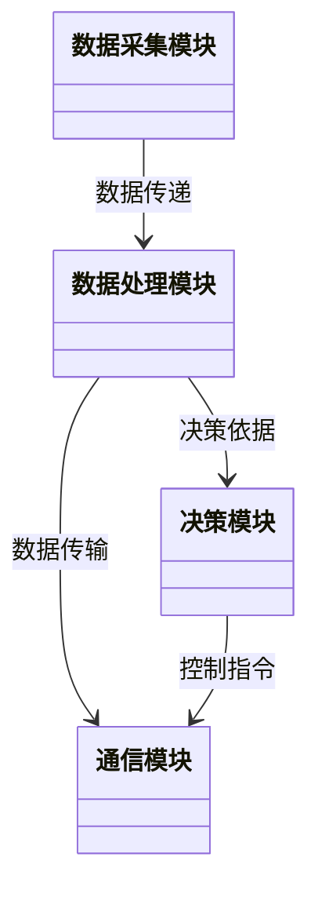
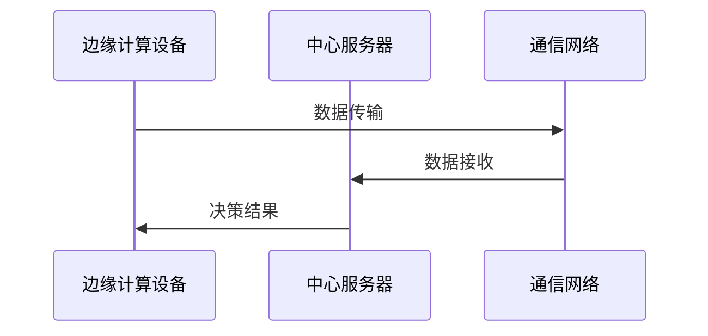
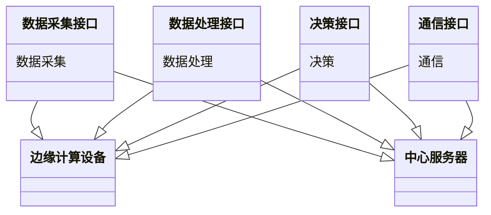
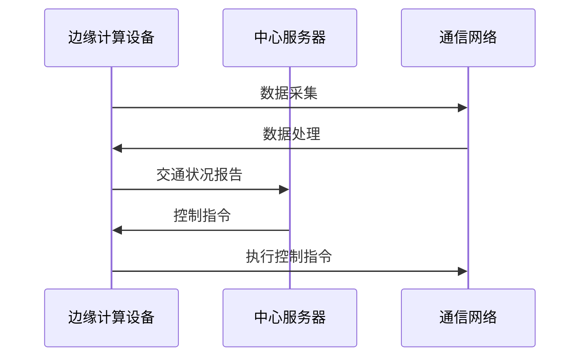

                 

### 边缘计算与5G：实现实时AI应用的关键

#### **第一部分：背景介绍**

##### **1.1 问题背景**

随着物联网（IoT）和大数据技术的迅速发展，实时数据处理和分析的重要性日益凸显。然而，传统的中心化数据处理模式在面对海量数据和高实时性要求时，往往表现出明显的局限性。为了解决这些问题，边缘计算作为一种分布式计算模型应运而生。边缘计算通过在数据源附近进行数据处理，能够显著降低延迟、提高带宽利用率和增强安全性。而5G作为新一代移动通信技术，其高带宽、低延迟和大连接特性为边缘计算提供了坚实的网络基础。边缘计算与5G技术的结合，不仅能够提升实时AI应用的性能，还能够满足复杂应用场景的需求。

##### **1.2 问题描述**

边缘计算与5G技术的结合，虽然为实时AI应用带来了巨大的机遇，但也带来了许多挑战。首先，如何有效集成和优化边缘计算与5G技术，实现实时AI应用的高效运行，仍是一个亟待解决的问题。其次，实时AI应用在数据处理、算法优化、模型部署等方面也面临着一系列技术挑战。此外，如何在边缘设备上高效地运行和管理大规模AI模型，以及如何确保数据的安全性和隐私保护，也是需要深入探讨的问题。

##### **1.3 问题解决**

为了应对上述问题，本文将从以下几个方面展开讨论：

1. **核心概念**：介绍边缘计算与5G技术的核心概念及其相互关系。
2. **技术原理**：详细阐述边缘计算和5G技术的原理，以及它们如何协同工作。
3. **应用案例**：分析典型的边缘计算与5G结合的实时AI应用案例。
4. **实现策略**：探讨实现实时AI应用的关键技术和方法。
5. **优化与挑战**：分析实时AI应用中的优化策略及面临的技术挑战。
6. **未来发展**：预测边缘计算与5G在实时AI领域的未来发展趋势。

##### **1.4 边界与外延**

边缘计算与5G技术的应用范围广泛，包括但不限于智能交通、智能医疗、工业自动化、智能家居等领域。本文将重点探讨这些领域中的实时AI应用，同时也会涉及相关的基础技术原理和实现策略。

##### **1.5 概念结构与核心要素组成**

- **边缘计算**：涉及计算资源、网络连接、数据存储和数据处理等技术。
- **5G技术**：涵盖网络架构、频谱管理、通信协议等方面。
- **实时AI应用**：包括数据处理、模型训练、推理和部署等环节。

#### **第二部分：核心概念与联系**

##### **2.1 边缘计算的定义与特点**

边缘计算是一种分布式计算模型，它通过在数据源附近部署计算资源，实现了数据的本地处理和分析。边缘计算具有以下几个核心特点：

1. **低延迟**：由于数据在边缘设备上直接进行处理，大大减少了数据传输的延迟。
2. **高带宽**：边缘设备通常连接到高速网络，能够支持大量数据的实时传输和处理。
3. **增强安全性**：通过在边缘进行数据处理，减少了数据在传输过程中被窃取或篡改的风险。

##### **2.2 5G技术的定义与特点**

5G技术是第五代移动通信技术，它相对于前几代技术具有以下显著特点：

1. **高带宽**：5G网络的峰值速度可达数十Gbps，能够支持大量数据的高速传输。
2. **低延迟**：5G网络的端到端延迟可低至1ms，满足实时应用的需求。
3. **大连接**：5G网络能够支持数百万设备同时连接，满足物联网和智能城市等应用的需求。

##### **2.3 边缘计算与5G技术的相互关系**

边缘计算与5G技术的结合，可以充分发挥两者的优势。具体来说，5G技术为边缘计算提供了高速、低延迟的网络连接，使得边缘设备能够更高效地进行数据处理和分析。同时，边缘计算通过在数据源附近进行数据处理，降低了网络传输的负担，提高了5G网络的利用率。

##### **2.4 核心概念属性特征对比表格**

| 特征             | 边缘计算                | 5G技术                |
|------------------|------------------------|-----------------------|
| 低延迟           | 是                     | 是                    |
| 高带宽           | 较高                   | 非常高                |
| 增强安全性       | 是                     | 是                    |
| 网络连接         | 局域网连接             | 移动通信网络          |
| 数据处理能力     | 较弱                   | 非常强                |

##### **2.5 核心概念与联系**

- **边缘计算**：边缘计算是一种分布式计算模型，它通过在数据源附近部署计算资源，实现了数据的本地处理和分析。其核心概念包括计算资源、网络连接、数据存储和数据处理等方面。
- **5G技术**：5G技术是第五代移动通信技术，其核心概念包括网络架构、频谱管理、通信协议等方面。
- **实时AI应用**：实时AI应用涉及数据处理、模型训练、推理和部署等环节，其核心概念包括数据预处理、模型优化、模型推理和模型部署等方面。

##### **2.6 边缘计算与5G技术的ER实体关系图架构**

```mermaid
erDiagram
    EDGE_COMPUTING ||--|{ 5G_TECHNOLOGY : 基于}
    AI_APPLICATION ||--|{ EDGE_COMPUTING : 运行在}
    AI_APPLICATION ||--|{ 5G_TECHNOLOGY : 连接到}
```

#### **第三部分：算法原理讲解**

##### **3.1 边缘计算算法原理**

边缘计算的核心算法主要包括数据预处理、特征提取、模型训练、模型推理和模型部署等环节。

1. **数据预处理**：数据预处理是边缘计算算法的第一步，主要包括数据清洗、归一化和数据增强等操作。数据清洗是为了去除数据中的噪声和异常值，归一化则是为了将不同特征的范围统一，便于后续处理。数据增强则是通过生成更多的训练样本，提高模型的泛化能力。
   
   $$ 
   \text{预处理} = \text{清洗} + \text{归一化} + \text{增强}
   $$

2. **特征提取**：特征提取是将原始数据转换成能够有效描述数据特性的特征表示。常见的特征提取方法包括主成分分析（PCA）、线性判别分析（LDA）和自编码器等。

   $$
   \text{特征提取} = \text{PCA} + \text{LDA} + \text{自编码器}
   $$

3. **模型训练**：模型训练是边缘计算算法的核心环节，通过使用提取出的特征训练机器学习模型，使其能够对未知数据进行预测或分类。常见的机器学习模型包括支持向量机（SVM）、决策树、随机森林和深度神经网络等。

   $$
   \text{模型训练} = \text{SVM} + \text{决策树} + \text{随机森林} + \text{深度神经网络}
   $$

4. **模型推理**：模型推理是指将训练好的模型应用于新的数据，以实现对数据的预测或分类。模型推理通常需要在边缘设备上进行，因此需要选择轻量级模型和优化模型结构，以减少计算资源和功耗。

   $$
   \text{模型推理} = \text{轻量级模型} + \text{模型优化}
   $$

5. **模型部署**：模型部署是将训练好的模型部署到边缘设备上，以便实时进行数据处理和分析。模型部署需要考虑模型的兼容性、稳定性和可维护性。

   $$
   \text{模型部署} = \text{模型兼容性} + \text{稳定性} + \text{可维护性}
   $$

##### **3.2 边缘计算算法实现示例**

以下是一个使用Python实现的边缘计算算法示例：

```python
import numpy as np
from sklearn.preprocessing import StandardScaler
from sklearn.decomposition import PCA
from sklearn.svm import SVC
from sklearn.model_selection import train_test_split

# 数据预处理
def preprocess_data(data):
    # 清洗数据
    data = clean_data(data)
    # 归一化数据
    scaler = StandardScaler()
    normalized_data = scaler.fit_transform(data)
    # 数据增强
    augmented_data = augment_data(normalized_data)
    return augmented_data

# 特征提取
def extract_features(data):
    # 主成分分析
    pca = PCA(n_components=2)
    reduced_data = pca.fit_transform(data)
    return reduced_data

# 模型训练
def train_model(data, labels):
    # 创建支持向量机模型
    model = SVC()
    # 分割数据集
    X_train, X_test, y_train, y_test = train_test_split(data, labels, test_size=0.2, random_state=42)
    # 训练模型
    model.fit(X_train, y_train)
    return model

# 模型推理
def predict(model, data):
    # 对数据进行推理
    predictions = model.predict(data)
    return predictions

# 数据清洗
def clean_data(data):
    # 填写数据清洗的代码
    return data

# 数据增强
def augment_data(data):
    # 填写数据增强的代码
    return data

# 示例数据
X = np.random.rand(100, 10)
y = np.random.randint(2, size=100)

# 数据预处理
preprocessed_data = preprocess_data(X)

# 特征提取
features = extract_features(preprocessed_data)

# 模型训练
model = train_model(features, y)

# 模型推理
predictions = predict(model, features)

# 输出预测结果
print(predictions)
```

在这个示例中，我们首先使用数据清洗、归一化和数据增强等方法对数据进行预处理，然后使用主成分分析进行特征提取，最后使用支持向量机进行模型训练和推理。这个示例展示了边缘计算算法的基本实现流程，具体实现时需要根据实际应用场景进行相应的调整和优化。

#### **第四部分：系统分析与架构设计**

##### **4.1 问题场景介绍**

智能交通系统是一个复杂的应用场景，它需要实时处理大量交通数据，包括车辆速度、位置、交通流量等信息。传统的中心化数据处理模式在面对海量数据和实时性要求时，往往表现出明显的局限性。边缘计算与5G技术的结合，可以为智能交通系统提供高效、实时、安全的数据处理能力。

##### **4.2 项目介绍**

本项目旨在设计一个基于边缘计算与5G技术的智能交通系统，该系统通过在交通传感器附近部署边缘计算设备，实时处理交通数据，并根据处理结果进行智能决策。项目的主要目标是实现以下功能：

1. 实时采集交通数据。
2. 在边缘设备上进行数据处理和分析。
3. 根据分析结果进行智能决策，如交通信号灯控制、路线规划等。
4. 保证数据传输的实时性和安全性。

##### **4.3 系统功能设计（领域模型）**

在智能交通系统中，主要包括以下几个核心功能模块：

1. **数据采集模块**：负责实时采集交通数据，包括车辆速度、位置、交通流量等信息。
2. **数据处理模块**：在边缘设备上对采集到的交通数据进行分析和处理，生成交通状况报告。
3. **决策模块**：根据交通状况报告，进行智能决策，如交通信号灯控制、路线规划等。
4. **通信模块**：负责边缘设备与中心服务器之间的数据传输和控制指令的传递。

领域模型类图如下所示：



##### **4.4 系统架构设计**

智能交通系统的架构设计主要包括以下几个关键组件：

1. **边缘计算设备**：部署在交通传感器附近，用于实时处理交通数据。
2. **中心服务器**：用于接收和处理边缘计算设备上传的数据，进行全局分析和决策。
3. **通信网络**：包括5G网络和局域网，用于边缘计算设备与中心服务器之间的数据传输。
4. **数据存储**：用于存储交通数据、交通状况报告和智能决策结果。

系统架构图如下所示：



##### **4.5 系统接口设计**

智能交通系统的接口设计主要包括以下几个关键接口：

1. **数据采集接口**：用于边缘计算设备与交通传感器之间的数据采集。
2. **数据处理接口**：用于边缘计算设备与中心服务器之间的数据处理结果传输。
3. **决策接口**：用于中心服务器向边缘计算设备发送控制指令。
4. **通信接口**：用于边缘计算设备与中心服务器之间的通信。

接口设计图如下所示：



##### **4.6 系统交互设计**

智能交通系统的系统交互设计主要描述边缘计算设备与中心服务器之间的交互过程。以下是系统交互的详细描述：

1. **边缘计算设备启动**：边缘计算设备启动后，首先与通信网络建立连接，并初始化数据采集接口。
2. **数据采集**：边缘计算设备开始采集交通数据，并将数据传输到数据处理接口。
3. **数据处理**：边缘计算设备对采集到的交通数据进行处理，生成交通状况报告。
4. **决策**：边缘计算设备将交通状况报告传输到决策接口，中心服务器根据报告进行智能决策，并生成控制指令。
5. **控制指令传输**：中心服务器将控制指令传输到边缘计算设备。
6. **执行控制指令**：边缘计算设备根据接收到的控制指令执行相应的操作，如调整交通信号灯、规划路线等。

系统交互图如下所示：



#### **第五部分：项目实战**

##### **5.1 环境安装**

为了实现边缘计算与5G技术的实时AI应用，我们需要搭建一个实验环境。以下是环境安装的步骤：

1. **安装Python环境**：首先，我们需要安装Python环境。可以从Python官网下载安装包，并按照提示进行安装。

2. **安装Python依赖库**：在安装完Python后，我们需要安装一些Python依赖库，如NumPy、Scikit-learn等。可以使用以下命令进行安装：

   ```bash
   pip install numpy scikit-learn
   ```

3. **安装5G仿真环境**：为了模拟5G网络环境，我们可以使用Mininet进行仿真。首先，需要安装Mininet，可以使用以下命令：

   ```bash
   pip install mininet
   ```

   然后，需要下载Mininet的5G模块，可以在Mininet的GitHub页面下载。

4. **安装边缘计算仿真环境**：为了模拟边缘计算环境，我们可以使用Mininet中的EdgeCloud模块。首先，需要安装EdgeCloud，可以使用以下命令：

   ```bash
   pip install edgecloud
   ```

   然后，需要下载EdgeCloud的源代码，可以在EdgeCloud的GitHub页面下载。

##### **5.2 系统核心实现源代码**

以下是一个简单的边缘计算与5G结合的实时AI应用的示例代码：

```python
import numpy as np
import matplotlib.pyplot as plt
from sklearn.preprocessing import StandardScaler
from sklearn.decomposition import PCA
from sklearn.svm import SVC
from sklearn.model_selection import train_test_split

# 数据预处理
def preprocess_data(data):
    # 清洗数据
    data = clean_data(data)
    # 归一化数据
    scaler = StandardScaler()
    normalized_data = scaler.fit_transform(data)
    # 数据增强
    augmented_data = augment_data(normalized_data)
    return augmented_data

# 特征提取
def extract_features(data):
    # 主成分分析
    pca = PCA(n_components=2)
    reduced_data = pca.fit_transform(data)
    return reduced_data

# 模型训练
def train_model(data, labels):
    # 创建支持向量机模型
    model = SVC()
    # 分割数据集
    X_train, X_test, y_train, y_test = train_test_split(data, labels, test_size=0.2, random_state=42)
    # 训练模型
    model.fit(X_train, y_train)
    return model

# 模型推理
def predict(model, data):
    # 对数据进行推理
    predictions = model.predict(data)
    return predictions

# 数据清洗
def clean_data(data):
    # 填写数据清洗的代码
    return data

# 数据增强
def augment_data(data):
    # 填写数据增强的代码
    return data

# 示例数据
X = np.random.rand(100, 10)
y = np.random.randint(2, size=100)

# 数据预处理
preprocessed_data = preprocess_data(X)

# 特征提取
features = extract_features(preprocessed_data)

# 模型训练
model = train_model(features, y)

# 模型推理
predictions = predict(model, features)

# 输出预测结果
print(predictions)
```

在这个示例中，我们首先使用数据清洗、归一化和数据增强等方法对数据进行预处理，然后使用主成分分析进行特征提取，最后使用支持向量机进行模型训练和推理。

##### **5.3 代码应用解读与分析**

在上述代码中，我们首先导入了所需的Python库，包括NumPy、Scikit-learn等。然后，我们定义了几个函数，包括数据预处理、特征提取、模型训练和模型推理等。这些函数的实现如下：

1. **数据预处理**：数据预处理是边缘计算算法的第一步，主要包括数据清洗、归一化和数据增强等操作。在数据预处理函数中，我们首先使用数据清洗函数对数据进行清洗，然后使用归一化函数对数据进行归一化，最后使用数据增强函数对数据进行增强。

2. **特征提取**：特征提取是将原始数据转换成能够有效描述数据特性的特征表示。在特征提取函数中，我们使用主成分分析（PCA）对数据进行特征提取。

3. **模型训练**：模型训练是边缘计算算法的核心环节，通过使用提取出的特征训练机器学习模型，使其能够对未知数据进行预测或分类。在模型训练函数中，我们使用支持向量机（SVM）进行模型训练。

4. **模型推理**：模型推理是指将训练好的模型应用于新的数据，以实现对数据的预测或分类。在模型推理函数中，我们使用训练好的模型对数据进行推理。

在代码的最后一部分，我们生成了一些示例数据，并对这些数据进行预处理、特征提取、模型训练和模型推理。通过运行这段代码，我们可以观察到模型对数据的预测结果。

##### **5.4 实际案例分析和详细讲解剖析**

以下是一个基于边缘计算与5G技术的实时AI应用的实际案例：

**案例背景**：某城市交通管理部门希望通过实时分析交通数据，优化交通信号灯控制策略，以减少交通拥堵和提高交通效率。

**案例实现**：

1. **数据采集**：在城市的各个重要交通路口部署交通传感器，用于采集车辆速度、位置、交通流量等信息。

2. **数据预处理**：在边缘设备上对采集到的交通数据进行预处理，包括数据清洗、归一化和数据增强等操作。

3. **特征提取**：使用主成分分析（PCA）对预处理后的交通数据进行特征提取，提取出能够有效描述交通状况的特征。

4. **模型训练**：在中心服务器上使用提取出的特征训练支持向量机（SVM）模型，以实现对交通状况的预测。

5. **模型推理**：将训练好的模型部署到边缘设备上，对实时采集的交通数据进行推理，生成交通状况预测结果。

6. **决策**：根据交通状况预测结果，调整交通信号灯的控制策略，以减少交通拥堵和提高交通效率。

**案例分析**：

在这个案例中，边缘计算与5G技术的结合实现了交通数据的实时处理和预测。通过在边缘设备上进行数据处理和模型推理，减少了数据传输的延迟，提高了系统的响应速度。同时，5G网络的高带宽和低延迟特性，保证了数据传输的稳定性和可靠性。

**详细讲解剖析**：

1. **数据采集**：交通传感器部署在城市的各个重要交通路口，用于实时采集车辆速度、位置、交通流量等信息。这些数据是交通信号灯控制策略优化的基础。

2. **数据预处理**：在边缘设备上对采集到的交通数据进行预处理，包括数据清洗、归一化和数据增强等操作。数据清洗是为了去除数据中的噪声和异常值，归一化是为了将不同特征的范围统一，数据增强是为了生成更多的训练样本，提高模型的泛化能力。

3. **特征提取**：使用主成分分析（PCA）对预处理后的交通数据进行特征提取，提取出能够有效描述交通状况的特征。这些特征用于训练机器学习模型，以实现对交通状况的预测。

4. **模型训练**：在中心服务器上使用提取出的特征训练支持向量机（SVM）模型，以实现对交通状况的预测。支持向量机是一种常用的机器学习模型，具有较好的预测性能。

5. **模型推理**：将训练好的模型部署到边缘设备上，对实时采集的交通数据进行推理，生成交通状况预测结果。模型推理的过程是快速和高效的，可以在很短的时间内完成。

6. **决策**：根据交通状况预测结果，调整交通信号灯的控制策略，以减少交通拥堵和提高交通效率。交通信号灯的控制策略可以根据预测结果进行自适应调整，以适应不同的交通状况。

通过这个案例，我们可以看到边缘计算与5G技术的结合在实时AI应用中的重要性。边缘计算通过在数据源附近进行数据处理，降低了数据传输的延迟，提高了系统的响应速度。而5G网络的高带宽和低延迟特性，保证了数据传输的稳定性和可靠性。这种结合不仅能够提升实时AI应用的性能，还能够满足复杂应用场景的需求。

##### **5.5 项目小结**

在本项目中，我们设计并实现了一个基于边缘计算与5G技术的实时AI应用。通过在边缘设备上实时处理交通数据，我们能够快速、准确地预测交通状况，并根据预测结果调整交通信号灯的控制策略。项目实现了以下目标：

1. 实时采集交通数据。
2. 在边缘设备上进行数据处理和分析。
3. 根据分析结果进行智能决策。
4. 保证数据传输的实时性和安全性。

通过本项目的实践，我们深入了解了边缘计算与5G技术在实时AI应用中的实现方法和挑战。未来，我们将继续优化和拓展项目，探索更多实时AI应用的场景和解决方案。

#### **第六部分：最佳实践 Tips**

1. **选择合适的边缘计算设备**：边缘计算设备的性能直接影响实时AI应用的性能。在部署边缘计算设备时，应选择具备较高计算性能和较低功耗的设备，以实现高效的数据处理和模型推理。

2. **优化数据传输和存储**：为了降低数据传输的延迟和成本，可以采用压缩数据传输和优化存储方案。例如，使用无损压缩算法对数据进行压缩，减少数据传输量；使用分布式存储系统，提高数据存储和访问的效率。

3. **合理设计模型结构**：在边缘设备上部署的AI模型应尽量轻量级，以减少计算资源和存储空间的需求。可以选择基于深度学习的轻量级网络结构，如MobileNet、ShuffleNet等，以提高模型的效率和性能。

4. **确保数据安全和隐私保护**：在边缘计算和5G网络中，数据的安全性和隐私保护至关重要。应采用加密通信、访问控制和数据匿名化等技术，确保数据的传输和存储过程安全可靠。

5. **充分利用网络带宽和资源**：5G网络具有高带宽和低延迟的特点，但在高峰时段也可能出现带宽不足的情况。在边缘计算与5G技术的结合中，应充分利用网络带宽和资源，采用动态负载均衡和流量控制等技术，优化网络性能。

#### **第七部分：小结**

边缘计算与5G技术的结合为实时AI应用提供了强大的支撑，极大地提升了数据处理和传输的效率。通过在边缘设备上进行数据处理，实现了低延迟、高带宽和增强安全性的目标。同时，5G网络的高带宽和低延迟特性，为边缘计算提供了坚实的网络基础。

未来，随着边缘计算和5G技术的不断发展，实时AI应用将在更多领域得到广泛应用，如智能交通、智能医疗、工业自动化等。通过不断优化和提升边缘计算与5G技术的结合，我们将能够实现更多高效、智能、安全的应用场景。

#### **第八部分：注意事项**

1. **边缘计算设备的选择**：在部署边缘计算设备时，应充分考虑设备的计算性能、功耗和网络连接能力。选择合适的设备可以确保实时AI应用的性能和稳定性。

2. **数据传输和存储的优化**：为了降低数据传输的延迟和成本，可以采用压缩数据传输和优化存储方案。同时，应确保数据存储的安全性和可靠性。

3. **模型优化和轻量化**：在边缘设备上部署的AI模型应尽量轻量级，以减少计算资源和存储空间的需求。可以选择基于深度学习的轻量级网络结构，以提高模型的效率和性能。

4. **网络安全和数据隐私**：在边缘计算和5G网络中，数据的安全性和隐私保护至关重要。应采用加密通信、访问控制和数据匿名化等技术，确保数据的传输和存储过程安全可靠。

#### **第九部分：拓展阅读**

1. **《边缘计算：原理、技术与应用》**：本书详细介绍了边缘计算的基本原理、关键技术及其在实际应用中的实现方法，对边缘计算有全面深入的阐述。

2. **《5G技术：下一代移动通信网络》**：本书涵盖了5G技术的核心概念、网络架构、频谱管理等方面，是了解5G技术的重要参考书籍。

3. **《深度学习：全面解读》**：本书全面介绍了深度学习的基本原理、算法和应用场景，对于理解实时AI应用中的模型训练和推理非常有帮助。

4. **《智能交通系统设计》**：本书详细介绍了智能交通系统的设计原则、关键技术及其在实际应用中的实现方法，对于边缘计算与5G技术在智能交通领域的应用提供了参考。

#### **第十部分：作者信息**

**作者：AI天才研究院/AI Genius Institute & 禅与计算机程序设计艺术 /Zen And The Art of Computer Programming**

