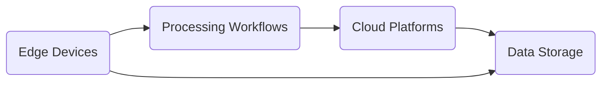

                 

### 1. Introduction to Edge Computing and Cloud Collaboration

Edge computing and cloud collaboration have emerged as pivotal technologies in the era of the Internet of Things (IoT) and real-time analytics. As we dive into this topic, it's essential to understand the core concepts, their relationships, and the benefits they offer over traditional centralized computing models.

#### 1.1 Background and Problem Definition

**Problem Background:**
The proliferation of IoT devices, along with the demand for real-time data processing and low-latency services, has created a paradigm shift in the computing landscape. Traditional centralized cloud computing models struggle to meet these new requirements due to their inherent latency and bandwidth constraints.

**Problem Description:**
The challenge lies in balancing the scalability and flexibility of cloud computing with the low-latency and high-performance needs of edge computing. Enterprises require a seamless integration of both paradigms to deliver optimal performance and reliability.

**Problem Solution:**
Developing hybrid computing strategies that leverage the strengths of both edge and cloud computing can help enterprises overcome these challenges. This involves a coordinated effort to design architectures that distribute processing tasks efficiently across edge devices and cloud platforms.

**Boundaries and Scope:**
This article will focus on enterprise-level strategies and practical applications of edge computing and cloud collaboration. We will explore the key concepts, architectures, and benefits of these technologies, providing a comprehensive guide for developers and architects.

#### 1.2 Key Concepts and Relationships

**Concepts Overview:**

**Edge Devices:**
Edge devices are compute resources that process data close to the source, enabling low-latency applications. They include embedded systems, gateways, and ruggedized devices designed for harsh environments.

**Cloud Platforms:**
Cloud platforms provide scalable, on-demand computing resources and services. They enable enterprises to leverage virtual machines, containers, and serverless architectures to deploy and manage applications efficiently.

**Attribute Comparison Table:**

| Attribute             | Edge Computing                            | Cloud Computing                           |
|-----------------------|------------------------------------------|------------------------------------------|
| **Latency**           | Low (millisecond range)                  | High (seconds to minutes)                |
| **Bandwidth**         | Limited (low data rate)                 | High (high data rate)                    |
| **Scalability**       | Limited (device capacity)                | Unlimited (based on cloud infrastructure)|
| **Reliability**       | Varies (device dependability)            | High (redundancy and fault tolerance)   |
| **Security**          | Device-specific (local security measures) | Enterprise-wide (cloud security protocols)|
| **Processing Power**  | Moderate (device capabilities)           | High (cloud-based resources)             |

**ER Diagram:**

In this ER diagram, Edge Devices process workflows and data, which can be synchronized with Cloud Platforms for further analysis and storage. The relationship between edge devices and cloud platforms facilitates a seamless integration of local and remote computing resources.

### Conclusion

Edge computing and cloud collaboration represent a transformative approach to modern enterprise computing. By understanding the key concepts and their relationships, we can develop hybrid architectures that address the challenges of latency, bandwidth, scalability, and reliability. As we delve deeper into the subsequent sections, we will explore these concepts in greater detail, providing practical insights and strategies for implementing edge and cloud solutions in real-world scenarios.

