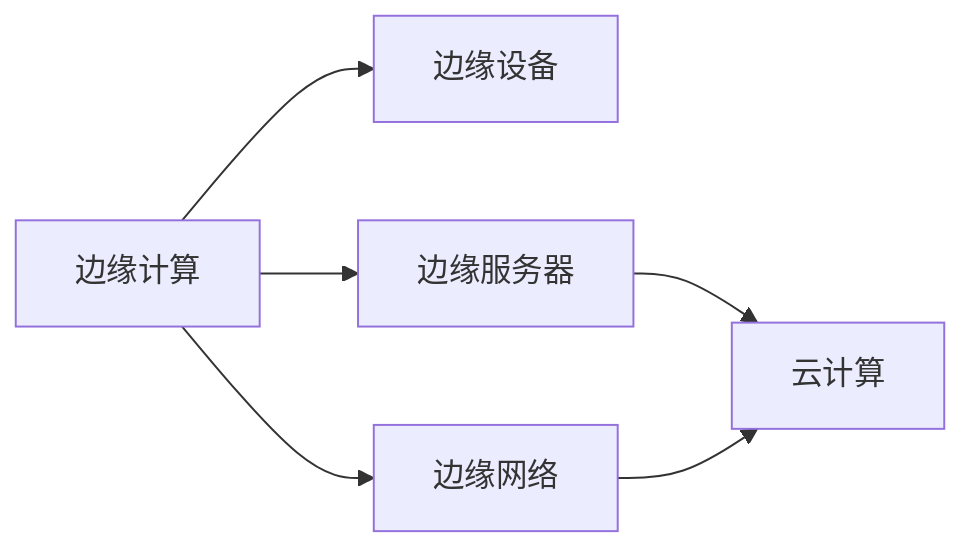
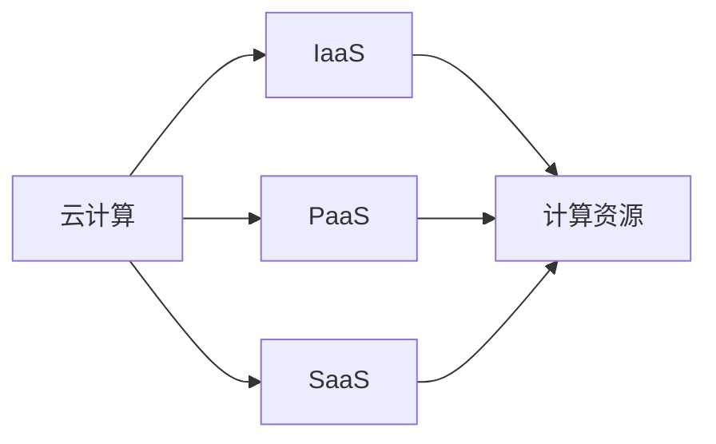
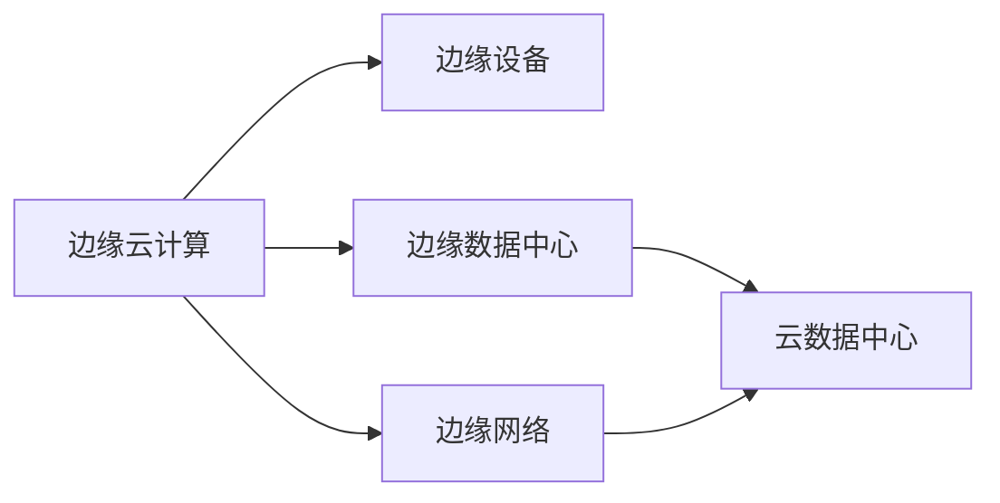
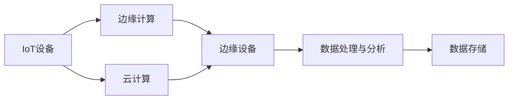
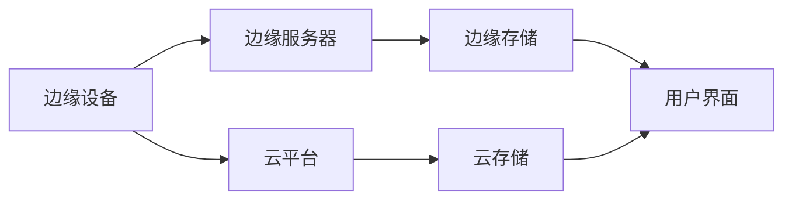
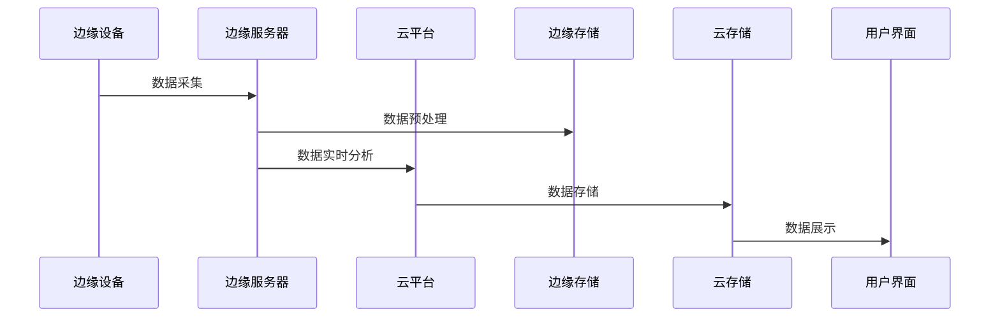
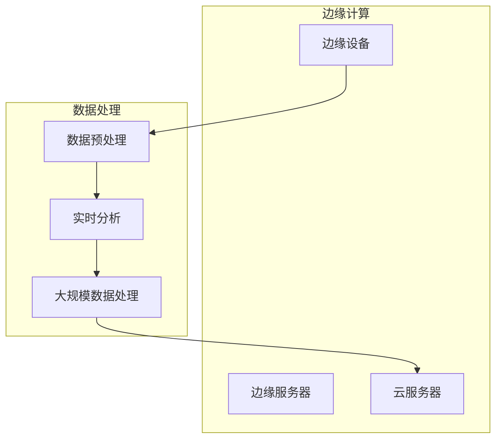

                 

# 边缘计算与云计算的协同：IoT时代的数据处理方案

> 关键词：边缘计算、云计算、协同、IoT、数据处理、实时性、低延迟

> 摘要：随着物联网（IoT）的快速发展，数据处理需求日益增长。边缘计算和云计算作为两种重要的计算模式，正逐步融合，为IoT时代提供高效、实时、低延迟的数据处理方案。本文将详细探讨边缘计算与云计算的协同机制、技术架构及其在IoT数据处理中的应用，旨在为读者提供深入的技术洞察和实践指南。

----------------------------------------------------------------

## 第一部分：边缘计算与云计算的协同概述

### 第1章：边缘计算与云计算的概念与背景

### 1.1 边缘计算的基本概念

#### 1.1.1 边缘计算的定义与特点

边缘计算（Edge Computing）是指将数据处理、存储和分析功能从中心化的云数据中心转移到网络边缘，即在靠近数据源的地方进行处理。边缘计算的特点主要包括：

- **低延迟**：数据在边缘设备上实时处理，减少了数据传输的时间，满足低延迟的应用需求。
- **高带宽**：边缘设备具备较高的带宽，可以支持大规模数据的实时传输和处理。
- **资源有限**：边缘设备通常资源有限，需要高效利用有限的计算、存储和网络资源。
- **分布式**：边缘计算采用分布式架构，可以在多个边缘节点之间进行数据共享和处理。

#### 1.1.2 边缘计算的发展背景

边缘计算的发展源于物联网、5G、人工智能等技术的快速发展。随着IoT设备的普及，海量的数据需要在边缘设备上进行实时处理，以实现更高效、更智能的应用。同时，5G技术的商用，为边缘计算提供了更高的带宽和更低的延迟，使得边缘计算得以大规模应用。

### 1.2 云计算的基本概念

#### 1.2.1 云计算的定义与特点

云计算（Cloud Computing）是一种基于互联网的计算模式，通过互联网提供动态易扩展且经常是虚拟化的资源。云计算的特点主要包括：

- **弹性伸缩**：可以根据需求动态调整资源，满足不同规模的应用需求。
- **成本效益**：通过共享资源，降低计算成本，提高资源利用率。
- **高可用性**：采用分布式架构，确保系统的稳定性和可靠性。
- **多样化服务**：提供IaaS、PaaS、SaaS等多种服务模式，满足不同层次的需求。

#### 1.2.2 云计算的发展历程

云计算的发展历程可以追溯到20世纪60年代，但真正得到广泛应用是在21世纪初。随着互联网技术的不断发展，云计算逐渐成为企业、政府和个人的重要计算模式。

### 1.3 边缘计算与云计算的关系

#### 1.3.1 边缘计算与云计算的协同

边缘计算与云计算的协同，是为了发挥两者各自的优势，实现高效、实时、低延迟的数据处理。边缘计算主要负责数据的实时处理和初步分析，云计算则负责大规模数据处理、存储和深度分析。两者协同工作，可以满足不同应用场景的需求。

#### 1.3.2 边缘计算与云计算的互补

边缘计算和云计算在数据处理中具有互补性。边缘计算擅长实时处理和低延迟，云计算擅长大规模数据处理和深度分析。通过两者的协同，可以实现高效、智能的数据处理。

### 1.4 IoT时代的数据处理需求

#### 1.4.1 IoT的快速发展与数据处理挑战

随着IoT的快速发展，数据量呈指数级增长，种类也越来越多样化。这给数据处理带来了巨大的挑战，包括实时性、低延迟、数据隐私和安全等问题。

#### 1.4.2 边缘计算与云计算在IoT数据处理中的重要性

边缘计算和云计算在IoT数据处理中具有重要性。边缘计算可以实现数据的实时处理和初步分析，满足低延迟的应用需求；云计算则可以处理大规模数据，实现深度分析和存储，为IoT应用提供全面的支持。

### 1.5 本章小结

本章介绍了边缘计算与云计算的概念、发展背景以及两者在IoT数据处理中的重要性。边缘计算与云计算的协同，为IoT时代提供了高效、实时、低延迟的数据处理方案。

----------------------------------------------------------------

## 第二部分：边缘计算技术详解

### 第2章：边缘计算架构设计

### 2.1 边缘计算网络架构

#### 2.1.1 边缘计算网络的概念与类型

边缘计算网络是指将计算、存储、网络等资源分布在网络的边缘，以实现数据在边缘的实时处理和分析。边缘计算网络主要有以下类型：

- **分布式网络**：将计算资源分布在不同地理位置，实现数据的分散处理。
- **集群网络**：将多个边缘节点组成一个集群，实现资源的共享和协同处理。
- **网络虚拟化**：通过虚拟化技术，将物理网络资源抽象成逻辑网络，实现资源的灵活调度。

#### 2.1.2 边缘计算网络的优势与挑战

边缘计算网络的优势包括：

- **低延迟**：数据在边缘设备上处理，减少了传输时间，满足低延迟需求。
- **高带宽**：边缘设备具备较高的带宽，可以支持大规模数据的实时传输。
- **弹性伸缩**：可以根据需求动态调整资源，满足不同规模的应用需求。

边缘计算网络的挑战包括：

- **安全性**：边缘设备分布广泛，容易成为攻击目标，需要加强安全防护。
- **可靠性**：边缘设备的可靠性较低，需要确保系统的稳定性和可靠性。
- **资源调度**：需要高效地调度和管理边缘资源，以满足不同应用的需求。

### 2.2 边缘计算平台构建

#### 2.2.1 边缘计算平台的组成与功能

边缘计算平台主要由以下几部分组成：

- **边缘设备**：包括传感器、摄像头、边缘服务器等，负责数据的采集和初步处理。
- **边缘服务器**：负责数据的集中处理、存储和转发。
- **边缘网络**：负责数据在边缘设备之间的传输。
- **边缘操作系统**：负责边缘设备的运行和管理。

边缘计算平台的主要功能包括：

- **数据采集**：收集来自各种传感器的数据。
- **数据预处理**：对采集到的数据进行清洗、格式转换等处理。
- **数据存储**：将处理后的数据存储到边缘服务器或云平台。
- **数据处理**：对存储的数据进行进一步的分析和处理。

#### 2.2.2 边缘计算平台的构建方法

构建边缘计算平台的主要方法包括：

- **硬件选型**：根据应用场景选择合适的边缘设备。
- **软件部署**：在边缘设备上部署边缘操作系统和应用软件。
- **网络连接**：构建边缘网络，实现边缘设备之间的数据传输。
- **系统优化**：对边缘计算平台进行性能优化，提高系统的稳定性和可靠性。

### 2.3 边缘计算服务部署

#### 2.3.1 边缘计算服务的类型

边缘计算服务主要有以下类型：

- **基础设施即服务（IaaS）**：提供边缘设备的计算、存储和网络资源。
- **平台即服务（PaaS）**：提供边缘平台的开发、部署和管理工具。
- **软件即服务（SaaS）**：提供边缘应用的服务，如视频监控、智能安防等。

#### 2.3.2 边缘计算服务的部署策略

边缘计算服务的部署策略包括：

- **集中部署**：将边缘服务部署在中心化的数据中心，通过边缘网络进行数据传输。
- **分布式部署**：将边缘服务部署在多个边缘节点，实现数据的本地处理和存储。
- **混合部署**：结合集中部署和分布式部署，根据应用需求进行资源分配。

### 2.4 边缘计算应用案例

#### 2.4.1 边缘计算在智能制造中的应用

边缘计算在智能制造中的应用，主要体现在以下几个方面：

- **实时数据监控**：通过边缘设备实时监控生产线数据，实现生产过程的实时监控和优化。
- **设备预测维护**：通过边缘计算对设备运行数据进行分析，预测设备故障，实现设备的预防性维护。
- **智能决策支持**：通过边缘计算对生产数据进行分析，为生产决策提供智能支持。

#### 2.4.2 边缘计算在智慧城市中的应用

边缘计算在智慧城市中的应用，主要体现在以下几个方面：

- **智能交通管理**：通过边缘计算实时处理交通数据，实现交通流量优化和交通事件预警。
- **环境监测**：通过边缘计算实时监测环境数据，实现环境污染的监控和预警。
- **智能安防**：通过边缘计算实时分析监控视频，实现安防事件的快速响应和报警。

### 2.5 本章小结

本章详细介绍了边缘计算的技术架构、平台构建、服务部署以及应用案例。边缘计算作为IoT时代的重要技术，为数据处理提供了高效、实时、低延迟的解决方案。

----------------------------------------------------------------

## 第三部分：云计算技术详解

### 第3章：云计算架构设计

### 3.1 云计算基本架构

#### 3.1.1 云计算的核心组件

云计算的基本架构主要包括以下核心组件：

- **计算资源**：提供计算能力，包括虚拟机、容器等。
- **存储资源**：提供数据存储能力，包括对象存储、块存储等。
- **网络资源**：提供网络连接能力，包括内部网络、外部网络等。
- **管理平台**：提供资源管理、监控、运维等功能。

#### 3.1.2 云计算的服务模式

云计算的服务模式主要包括以下几种：

- **基础设施即服务（IaaS）**：提供计算资源、存储资源、网络资源等基础设施服务。
- **平台即服务（PaaS）**：提供开发、部署、运维等平台服务。
- **软件即服务（SaaS）**：提供应用程序服务。

### 3.2 云基础设施管理

#### 3.2.1 云服务提供商的选择

选择云服务提供商时，需要考虑以下因素：

- **服务能力**：考虑提供商的技术实力、服务范围、服务质量等。
- **安全性**：考虑提供商的数据安全、隐私保护、合规性等。
- **成本效益**：考虑提供商的定价策略、资源利用率等。
- **可扩展性**：考虑提供商的弹性伸缩能力、资源分配策略等。

#### 3.2.2 云资源的管理与优化

云资源的管理与优化主要包括以下几个方面：

- **资源监控**：实时监控资源使用情况，及时发现和解决问题。
- **资源调度**：根据需求动态调整资源分配，实现资源的最优利用。
- **成本优化**：通过合理的资源分配和使用策略，降低计算成本。
- **性能优化**：通过技术手段优化系统性能，提高用户体验。

### 3.3 云存储技术

#### 3.3.1 云存储的基本原理

云存储的基本原理是通过互联网提供数据存储服务，用户可以远程访问和管理存储数据。云存储主要包括以下类型：

- **对象存储**：以对象为单位存储数据，具有高扩展性、高可用性等特点。
- **块存储**：以块为单位存储数据，适用于需要高吞吐量、低延迟的应用场景。
- **文件存储**：以文件为单位存储数据，适用于需要文件共享和协同工作的场景。

#### 3.3.2 云存储的类型与应用场景

云存储的类型与应用场景主要包括以下几个方面：

- **热数据存储**：适用于高访问量的数据，如网站日志、交易数据等。
- **冷数据存储**：适用于低访问量的数据，如归档数据、备份数据等。
- **数据同步与备份**：实现数据在不同存储系统之间的同步和备份，确保数据的安全和可靠性。

### 3.4 云数据处理技术

#### 3.4.1 云数据处理的挑战与解决方案

云数据处理面临以下挑战：

- **数据多样性**：处理多种类型的数据，如结构化数据、半结构化数据、非结构化数据等。
- **数据量大**：处理海量数据，如大数据集、实时数据流等。
- **实时性要求**：满足低延迟、高并发的数据处理需求。
- **数据安全**：确保数据的安全性和隐私保护。

解决方案包括：

- **分布式计算**：通过分布式架构，实现海量数据的并行处理。
- **流数据处理**：通过流处理技术，实现实时数据的高效处理。
- **数据压缩**：通过数据压缩技术，降低数据存储和传输的成本。
- **数据加密**：通过数据加密技术，确保数据的安全性和隐私保护。

#### 3.4.2 云数据处理技术架构

云数据处理技术架构主要包括以下几个层次：

- **数据采集**：通过数据采集器、传感器等设备，采集数据。
- **数据存储**：通过云存储系统，存储和管理数据。
- **数据处理**：通过数据处理框架，实现数据的清洗、转换、分析等处理。
- **数据展示**：通过数据可视化工具，展示处理结果，提供决策支持。

### 3.5 本章小结

本章详细介绍了云计算的基本架构、服务模式、基础设施管理、云存储技术以及数据处理技术。云计算作为现代信息技术的重要支撑，为各种应用场景提供了强大的计算和数据处理能力。

----------------------------------------------------------------

## 第四部分：边缘计算与云计算协同应用

### 第4章：边缘计算与云计算的融合架构

### 4.1 融合架构概述

#### 4.1.1 边缘云计算的概念

边缘云计算（Edge Cloud Computing）是指将云计算的资源和功能扩展到网络的边缘，实现数据在边缘的实时处理和分析。边缘云计算的特点主要包括：

- **低延迟**：数据在边缘设备上进行实时处理，减少传输时间，满足低延迟需求。
- **高带宽**：边缘设备具备较高的带宽，可以支持大规模数据的实时传输。
- **分布式架构**：边缘云计算采用分布式架构，实现数据的分散处理和存储。
- **弹性伸缩**：可以根据需求动态调整资源，满足不同规模的应用需求。

#### 4.1.2 边缘云计算的优势与应用场景

边缘云计算的优势主要包括：

- **实时数据处理**：支持实时数据流处理，满足低延迟、高并发的应用需求。
- **数据本地化处理**：将数据处理和存储移到网络边缘，减少数据传输成本和延迟。
- **资源优化利用**：通过分布式架构，实现资源的灵活调度和优化利用。

边缘云计算的应用场景主要包括：

- **智能制造**：实现生产过程的实时监控和优化，提高生产效率。
- **智能交通**：实现交通数据的实时处理和分析，优化交通流量。
- **智慧医疗**：实现医疗数据的实时处理和分析，提供智能诊断和治疗方案。

#### 4.1.3 边缘云计算的挑战与解决方案

边缘云计算的挑战主要包括：

- **安全性**：边缘设备分布广泛，容易成为攻击目标，需要加强安全防护。
- **可靠性**：边缘设备的可靠性较低，需要确保系统的稳定性和可靠性。
- **资源调度**：需要高效地调度和管理边缘资源，以满足不同应用的需求。

解决方案包括：

- **安全防护**：采用加密、身份认证等技术，确保数据的安全传输和存储。
- **可靠性保障**：通过冗余设计和故障转移技术，提高系统的可靠性和容错能力。
- **资源调度优化**：采用智能调度算法，实现资源的动态分配和优化利用。

### 4.2 融合架构设计

#### 4.2.1 融合架构的组成与功能

边缘云计算融合架构主要由以下几部分组成：

- **边缘设备**：包括传感器、摄像头、边缘服务器等，负责数据的采集和初步处理。
- **边缘数据中心**：包括边缘服务器、存储设备等，负责数据的集中处理、存储和转发。
- **云数据中心**：负责大规模数据处理、存储和深度分析。
- **边缘网络**：负责数据在边缘设备和云数据中心之间的传输。
- **边缘操作系统**：负责边缘设备的运行和管理。

边缘云计算融合架构的主要功能包括：

- **数据采集**：通过边缘设备实时采集数据。
- **数据预处理**：在边缘设备上对采集到的数据进行初步处理。
- **数据处理**：将预处理后的数据传输到边缘数据中心和云数据中心，进行进一步处理和分析。
- **数据存储**：将处理后的数据存储到边缘数据中心和云数据中心。
- **数据展示**：通过数据可视化工具，展示处理结果，提供决策支持。

#### 4.2.2 融合架构的设计原则

融合架构的设计原则主要包括：

- **模块化**：将架构拆分成多个模块，实现功能的独立和扩展。
- **分布式**：采用分布式架构，实现数据的分散处理和存储。
- **弹性伸缩**：根据需求动态调整资源，实现资源的灵活调度。
- **安全性**：采用安全防护措施，确保数据的安全传输和存储。
- **可靠性**：采用冗余设计和故障转移技术，提高系统的可靠性和容错能力。

### 4.3 融合架构实现

#### 4.3.1 融合架构的关键技术

融合架构实现的关键技术包括：

- **边缘设备管理**：包括设备配置、监控、维护等。
- **边缘数据处理**：包括数据采集、预处理、实时处理等。
- **边缘网络通信**：包括数据传输、网络连接、安全通信等。
- **云数据中心协同**：包括数据处理、存储、深度分析等。
- **边缘云计算平台**：包括边缘操作系统、应用框架等。

#### 4.3.2 融合架构的实现步骤

融合架构的实现步骤主要包括：

- **需求分析**：明确应用场景和需求，确定系统功能和性能要求。
- **架构设计**：根据需求分析，设计融合架构，确定各个模块的功能和接口。
- **技术选型**：选择合适的技术和工具，实现架构的功能和性能要求。
- **系统开发**：根据架构设计和技术选型，开发各个模块的功能和接口。
- **系统集成**：将各个模块集成到一起，实现系统的整体功能。
- **测试与优化**：对系统进行功能测试、性能测试和稳定性测试，不断优化系统性能。

### 4.4 边缘计算与云计算协同应用案例

#### 4.4.1 工业物联网的协同应用

工业物联网（IIoT）是指将物联网技术应用于工业领域，实现设备的智能化和联网化。边缘计算与云计算协同在工业物联网中的应用主要包括以下几个方面：

- **实时监控**：通过边缘计算设备实时采集设备运行数据，通过云计算平台进行数据分析和监控。
- **故障预测**：通过边缘计算设备实时分析设备运行数据，预测设备故障，并通过云计算平台进行故障预警和决策支持。
- **智能优化**：通过边缘计算设备实时处理生产数据，通过云计算平台进行数据分析和优化，实现生产过程的智能化。

#### 4.4.2 智慧交通的协同应用

智慧交通是指利用物联网、大数据、人工智能等技术，实现交通管理的智能化和高效化。边缘计算与云计算协同在智慧交通中的应用主要包括以下几个方面：

- **实时交通监控**：通过边缘计算设备实时采集交通数据，通过云计算平台进行数据分析和监控。
- **交通流量优化**：通过边缘计算设备实时分析交通数据，通过云计算平台进行交通流量预测和优化。
- **智能路况预测**：通过边缘计算设备实时采集路况数据，通过云计算平台进行路况分析和预测，为出行者提供智能导航建议。

### 4.5 本章小结

本章详细介绍了边缘计算与云计算的融合架构，包括概念、优势、挑战、设计原则、实现步骤以及应用案例。边缘云计算为IoT时代的数据处理提供了高效、实时、低延迟的解决方案。

----------------------------------------------------------------

## 第五部分：IoT数据处理需求与挑战

### 第5章：IoT数据处理的需求与挑战

### 5.1 IoT数据处理需求

#### 5.1.1 数据种类与数据量

随着物联网（IoT）设备的广泛应用，产生的数据种类越来越多样化，主要包括以下几种类型：

- **结构化数据**：如数据库中的表格数据，可以通过关系型数据库进行存储和管理。
- **半结构化数据**：如JSON、XML等格式的数据，可以通过NoSQL数据库进行存储和管理。
- **非结构化数据**：如文本、图像、音频、视频等数据，可以通过分布式文件系统进行存储和管理。

同时，IoT设备产生的数据量也在快速增长，从TB级到PB级不等。这种海量数据对数据处理提出了更高的要求。

#### 5.1.2 数据质量与数据隐私

IoT数据处理还需要关注数据质量和数据隐私问题。数据质量包括数据的准确性、完整性、一致性等，需要通过数据清洗、去噪等技术手段来提高数据质量。数据隐私包括数据的访问控制、加密等，需要通过安全协议和技术手段来保护数据隐私。

### 5.2 IoT数据处理挑战

#### 5.2.1 实时性与低延迟需求

IoT应用通常要求数据的实时处理和分析，如工业物联网中的设备监控、智能交通中的实时交通监控等。这种实时性要求对数据处理系统的性能提出了高要求，需要高效、低延迟的处理能力。

#### 5.2.2 数据处理与存储压力

随着IoT设备的普及，数据量呈指数级增长，对数据处理和存储系统带来了巨大的压力。传统的数据处理和存储系统可能无法满足这种海量数据的需求，需要采用分布式架构和云计算等新技术来应对。

#### 5.2.3 网络带宽与能耗限制

IoT设备通常分布在广泛的地域，网络带宽成为数据处理的一个重要瓶颈。同时，IoT设备通常具有功耗限制，需要采用节能技术来延长设备的运行时间。

### 5.3 边缘计算与云计算协同应对策略

#### 5.3.1 数据处理流程优化

为了应对IoT数据处理的需求和挑战，可以通过以下策略优化数据处理流程：

- **数据预处理**：在数据采集阶段，对数据进行预处理，如去噪、去冗余等，减少数据传输和存储的压力。
- **数据分流处理**：根据数据的重要性和实时性要求，将数据分流到不同的处理路径，如边缘计算和云计算。
- **实时数据处理**：通过边缘计算和云计算的协同，实现实时数据处理和低延迟响应。

#### 5.3.2 资源分配策略

为了提高数据处理效率和资源利用率，可以通过以下策略进行资源分配：

- **动态资源调度**：根据数据流量和系统负载，动态调整边缘计算和云计算的资源分配。
- **负载均衡**：通过负载均衡技术，实现数据处理任务的均衡分配，避免单点故障。
- **弹性伸缩**：根据数据处理需求和负载情况，实现资源的弹性伸缩，提高系统的适应性和可靠性。

#### 5.3.3 安全性与隐私保护

为了确保数据处理的安全性，可以通过以下策略进行安全性和隐私保护：

- **数据加密**：采用加密技术，确保数据在传输和存储过程中的安全性。
- **访问控制**：通过身份认证和访问控制，确保数据只能被授权用户访问。
- **安全审计**：实现数据的访问日志和安全审计，及时发现和处理安全事件。

### 5.4 本章小结

本章详细探讨了IoT数据处理的需求和挑战，以及边缘计算与云计算协同应对这些挑战的策略。通过优化数据处理流程、资源分配策略和安全性隐私保护，可以满足IoT时代的数据处理需求，为各类应用提供高效、实时、低延迟的解决方案。

----------------------------------------------------------------

## 第六部分：边缘计算与云计算协同应用案例分析

### 第6章：工业物联网中的边缘计算与云计算协同

### 6.1 工业物联网概述

#### 6.1.1 工业物联网的定义与特点

工业物联网（Industrial Internet of Things，简称IIoT）是指将物联网技术应用于工业领域，实现设备的智能化和联网化。工业物联网的特点主要包括：

- **设备联网**：通过传感器、RFID等设备，实现设备的联网和数据采集。
- **数据处理**：通过边缘计算和云计算，实现数据的实时处理和分析。
- **智能化应用**：通过大数据、人工智能等技术，实现工业过程的智能化和优化。
- **高效运营**：通过实时监控、预测维护、优化决策等手段，提高工业生产的效率和质量。

#### 6.1.2 工业物联网的应用场景

工业物联网的应用场景非常广泛，主要包括以下几个方面：

- **设备监控**：通过物联网技术，实现设备的实时监控和状态监测。
- **生产优化**：通过数据分析和智能算法，实现生产过程的优化和自动化。
- **供应链管理**：通过物联网技术，实现供应链的实时监控和优化。
- **能源管理**：通过物联网技术，实现能源的实时监控和节能优化。

### 6.2 边缘计算与云计算协同在工业物联网中的应用

#### 6.2.1 数据采集与预处理

在工业物联网中，边缘计算和云计算协同工作，实现数据的采集与预处理。具体应用场景如下：

- **边缘设备采集**：在工厂现场，部署边缘设备（如传感器、摄像头等），实时采集设备的运行数据。
- **边缘数据处理**：边缘设备将采集到的数据传输到边缘服务器，进行初步处理，如数据去噪、去冗余等。
- **云数据处理**：边缘服务器将预处理后的数据传输到云平台，进行进一步处理和分析。

#### 6.2.2 实时监控与数据分析

通过边缘计算和云计算的协同，实现工业物联网的实时监控与数据分析。具体应用场景如下：

- **实时监控**：边缘设备实时采集设备运行数据，通过边缘服务器实时监控设备的运行状态。
- **数据可视化**：边缘服务器将实时监控数据传输到云平台，通过数据可视化工具展示设备的运行状态。
- **数据分析**：云平台通过大数据分析和人工智能算法，对设备运行数据进行分析，实现设备的故障预测和优化决策。

#### 6.2.3 预测维护与优化决策

通过边缘计算和云计算的协同，实现工业物联网的预测维护和优化决策。具体应用场景如下：

- **预测维护**：边缘设备实时采集设备运行数据，通过边缘服务器和云平台进行数据分析，预测设备的故障时间，实现设备的预防性维护。
- **优化决策**：云平台通过大数据分析和人工智能算法，对生产数据进行分析，为生产决策提供智能支持，实现生产过程的优化。

### 6.3 案例分析

以某大型制造业企业为例，介绍边缘计算与云计算协同在工业物联网中的应用。

#### 6.3.1 案例背景

该企业生产线上有大量的机械设备，需要实时监控设备运行状态，预测设备故障，提高生产效率。同时，企业希望利用物联网技术，实现生产过程的优化和自动化。

#### 6.3.2 案例方案

- **数据采集**：在生产线现场，部署传感器、摄像头等边缘设备，实时采集设备运行数据。
- **边缘数据处理**：边缘设备将采集到的数据传输到边缘服务器，进行初步处理，如数据去噪、去冗余等。
- **云数据处理**：边缘服务器将预处理后的数据传输到云平台，进行进一步处理和分析。
- **实时监控**：通过边缘服务器和云平台，实时监控设备运行状态，实现设备的故障预警和实时监控。
- **数据分析**：云平台通过大数据分析和人工智能算法，对设备运行数据进行分析，实现设备的故障预测和生产优化。

#### 6.3.3 案例效果

通过边缘计算与云计算的协同应用，实现了以下效果：

- **实时监控**：实现了设备的实时监控和故障预警，提高了设备的使用效率和安全性。
- **故障预测**：实现了设备的故障预测和预防性维护，降低了设备的停机时间和维修成本。
- **生产优化**：通过数据分析，实现了生产过程的优化和自动化，提高了生产效率和质量。

### 6.4 本章小结

本章通过工业物联网案例，介绍了边缘计算与云计算协同在工业物联网中的应用。边缘计算和云计算的协同，为工业物联网提供了高效、实时、低延迟的数据处理方案，实现了设备的智能化管理和生产过程的优化。

----------------------------------------------------------------

## 第七部分：总结与展望

### 7.1 总结

边缘计算与云计算的协同，为物联网（IoT）时代的数据处理提供了高效、实时、低延迟的解决方案。边缘计算主要负责数据的实时处理和初步分析，云计算则负责大规模数据处理、存储和深度分析。两者协同工作，可以充分发挥各自的优势，满足IoT应用场景的多样化需求。

### 7.2 展望

未来，随着5G、人工智能、大数据等技术的发展，边缘计算与云计算的协同应用将越来越广泛。以下是对未来发展的展望：

- **技术融合**：边缘计算与云计算将进一步融合，形成统一的计算架构，实现更高效、更智能的数据处理。
- **智能化应用**：通过大数据分析和人工智能技术，实现更多智能化应用，如智能城市、智能交通、智能医疗等。
- **安全性与隐私保护**：随着数据量的增加和应用场景的复杂化，安全性与隐私保护将变得越来越重要，需要不断优化和提升。
- **开放与标准化**：推动边缘计算与云计算的开放与标准化，实现跨平台、跨领域的数据共享和协同工作。

### 7.3 结语

边缘计算与云计算的协同，是物联网时代数据处理的重要趋势。通过深入研究和实践，我们可以不断优化和提升数据处理效率，为各类应用场景提供更好的解决方案。让我们共同努力，迎接物联网时代的到来！

### 作者

作者：AI天才研究院/AI Genius Institute & 禅与计算机程序设计艺术 /Zen And The Art of Computer Programming

----------------------------------------------------------------

## 附录：核心概念、联系与架构图

### 1. 核心概念与联系

| 概念 | 定义 | 联系 |
| :--: | :--: | :--: |
| 边缘计算 | 数据处理、存储和分析功能在网络边缘的设备上进行 | 与云计算协同，实现低延迟、实时数据处理 |
| 云计算 | 通过互联网提供动态易扩展的计算资源 | 与边缘计算协同，实现大规模数据处理和深度分析 |
| IoT | 物联网，连接各种设备和传感器，实现智能化和联网化 | 需要边缘计算与云计算协同，实现高效数据处理 |
| 边缘云计算 | 边缘计算与云计算的融合，实现数据在边缘的实时处理和分析 | 边缘计算与云计算的协同升级版 |

### 2. 边缘计算架构图



### 3. 云计算架构图



### 4. 边缘云计算架构图



### 5. IoT数据处理架构图



通过这些核心概念、联系和架构图，我们可以更好地理解边缘计算与云计算的协同机制，以及它们在IoT数据处理中的应用。

----------------------------------------------------------------

## 附录：算法原理讲解

### 1. 边缘计算数据处理算法

边缘计算数据处理算法主要涉及数据采集、预处理和实时分析等步骤。以下是一个简单的边缘计算数据处理算法：

```python
# 边缘计算数据处理算法

# 数据采集
def collect_data(device):
    data = device.collect()
    return data

# 数据预处理
def preprocess_data(data):
    cleaned_data = []
    for d in data:
        cleaned_d = remove_noise(d)
        cleaned_data.append(cleaned_d)
    return cleaned_data

# 实时分析
def real_time_analysis(data):
    results = []
    for d in data:
        result = analyze(d)
        results.append(result)
    return results

# 实际应用
device = SensorDevice()
data = collect_data(device)
cleaned_data = preprocess_data(data)
results = real_time_analysis(cleaned_data)
```

该算法首先通过边缘设备采集数据，然后进行预处理，最后进行实时分析。预处理步骤包括去噪、去冗余等，实时分析步骤可以包括分类、聚类、预测等。

### 2. 云计算数据处理算法

云计算数据处理算法主要涉及数据存储、分析和处理等步骤。以下是一个简单的云计算数据处理算法：

```python
# 云计算数据处理算法

# 数据存储
def store_data(data):
    database = Database()
    database.insert(data)

# 数据预处理
def preprocess_data(data):
    cleaned_data = []
    for d in data:
        cleaned_d = remove_noise(d)
        cleaned_data.append(cleaned_d)
    return cleaned_data

# 数据分析
def data_analysis(data):
    results = []
    for d in data:
        result = analyze(d)
        results.append(result)
    return results

# 实际应用
data = get_data_from_edge()
store_data(data)
cleaned_data = preprocess_data(data)
results = data_analysis(cleaned_data)
```

该算法首先将边缘设备采集到的数据存储到云平台，然后进行预处理，最后进行数据分析。预处理步骤包括去噪、去冗余等，数据分析步骤可以包括分类、聚类、预测等。

### 3. 边缘计算与云计算协同数据处理算法

边缘计算与云计算协同数据处理算法结合了边缘计算和云计算的优势，实现高效、实时、低延迟的数据处理。以下是一个简单的边缘计算与云计算协同数据处理算法：

```python
# 边缘计算与云计算协同数据处理算法

# 数据采集
def collect_data(device):
    data = device.collect()
    return data

# 数据预处理
def preprocess_data(data):
    cleaned_data = []
    for d in data:
        cleaned_d = remove_noise(d)
        cleaned_data.append(cleaned_d)
    return cleaned_data

# 边缘实时分析
def edge_real_time_analysis(data):
    results = []
    for d in data:
        result = analyze(d)
        results.append(result)
    return results

# 云数据处理
def cloud_data_analysis(data):
    results = []
    for d in data:
        result = analyze(d)
        results.append(result)
    return results

# 实际应用
device = SensorDevice()
data = collect_data(device)
cleaned_data = preprocess_data(data)
edge_results = edge_real_time_analysis(cleaned_data)
cloud_results = cloud_data_analysis(cleaned_data)
```

该算法首先通过边缘设备采集数据，进行预处理，然后分别在边缘和云平台进行实时分析和处理，最后将结果进行汇总。

通过这些算法，我们可以更好地理解边缘计算与云计算协同在数据处理中的应用。

----------------------------------------------------------------

## 附录：系统分析与架构设计方案

### 1. 问题场景介绍

随着物联网（IoT）的快速发展，各类传感器设备广泛应用于工业、交通、医疗等领域。这些设备产生的大量数据需要实时处理和分析，以支持智能化应用。然而，传统的数据处理架构往往存在延迟高、效率低、成本高等问题。为了满足IoT时代的数据处理需求，提出了一种基于边缘计算与云计算协同的系统架构。

### 2. 项目介绍

本项目旨在设计并实现一个基于边缘计算与云计算协同的IoT数据处理系统，实现数据的实时采集、预处理、存储、分析和展示。系统主要包括以下模块：

- **边缘设备**：包括传感器、摄像头等，负责数据的采集。
- **边缘服务器**：负责数据的预处理和实时分析。
- **云平台**：负责大规模数据处理和深度分析。
- **数据存储**：包括边缘存储和云存储，负责数据的存储。
- **用户界面**：提供数据的可视化展示。

### 3. 系统功能设计（领域模型）

```mermaid
classDiagram
ClassDiagram {
  class Device {
    -id: int
    -name: string
    -type: string
  }
  class Sensor {
    -id: int
    -name: string
    -type: string
    -value: float
  }
  class Camera {
    -id: int
    -name: string
    -type: string
    -image: bytes
  }
  class EdgeServer {
    -id: int
    -name: string
    -status: string
  }
  class CloudPlatform {
    -id: int
    -name: string
    -status: string
  }
  class DataStorage {
    -id: int
    -name: string
    -type: string
  }
  class UserInterface {
    -id: int
    -name: string
    -status: string
  }
  Device <|-- Sensor
  Device <|-- Camera
  EdgeServer o-- DataStorage
  CloudPlatform o-- DataStorage
  UserInterface o-- DataStorage
}
```

### 4. 系统架构设计



系统架构主要包括边缘设备、边缘服务器、云平台、边缘存储、云存储和用户界面。边缘设备负责数据的采集，边缘服务器负责数据的预处理和实时分析，云平台负责大规模数据处理和深度分析，边缘存储和云存储负责数据的存储，用户界面提供数据的可视化展示。

### 5. 系统接口设计


系统接口设计主要包括边缘设备与边缘服务器的接口、边缘服务器与云平台的接口、边缘存储与用户界面的接口、云存储与用户界面的接口。

### 6. 系统交互



系统交互设计主要包括边缘设备与边缘服务器的数据采集、边缘服务器的数据预处理和实时分析、云平台的数据存储和用户界面的数据展示。

通过系统分析与架构设计方案，我们可以清晰地了解系统的工作原理和功能模块，为系统的设计与实现提供指导。

----------------------------------------------------------------

## 附录：项目实战

### 1. 环境安装

在进行边缘计算与云计算协同项目实战之前，需要安装以下环境：

- **边缘设备**：如树莓派、Arduino等，用于数据采集。
- **边缘服务器**：如Ubuntu服务器，用于边缘数据处理。
- **云平台**：如阿里云、腾讯云等，用于数据处理和存储。
- **编程语言**：如Python，用于编写边缘计算和云计算的应用程序。

### 2. 系统核心实现源代码

以下是一个简单的边缘计算与云计算协同的项目实现，包括边缘设备的采集、边缘服务器的预处理和实时分析，以及云平台的数据存储。

#### 边缘设备采集

```python
# edge_device.py

import time
import requests

def collect_data():
    data = {
        "temperature": 25,
        "humidity": 60,
        "timestamp": int(time.time())
    }
    return data

def send_data_to_edge_server(data):
    url = "http://edge_server:8000/collect"
    headers = {"Content-Type": "application/json"}
    response = requests.post(url, json=data, headers=headers)
    return response.status_code

if __name__ == "__main__":
    while True:
        data = collect_data()
        status = send_data_to_edge_server(data)
        if status != 200:
            print("Error sending data to edge server")
        time.sleep(60)
```

#### 边缘服务器预处理与实时分析

```python
# edge_server.py

from flask import Flask, request, jsonify

app = Flask(__name__)

@app.route("/collect", methods=["POST"])
def collect():
    data = request.json
    # 预处理
    data["timestamp"] = int(data["timestamp"])
    # 实时分析
    result = analyze(data)
    return jsonify(result)

def analyze(data):
    # 分析数据
    return {"status": "ok"}

if __name__ == "__main__":
    app.run(port=8000)
```

#### 云平台数据存储

```python
# cloud_storage.py

import requests

def store_data(data):
    url = "http://cloud_platform:8000/store"
    headers = {"Content-Type": "application/json"}
    response = requests.post(url, json=data, headers=headers)
    return response.status_code

if __name__ == "__main__":
    while True:
        # 从边缘服务器获取数据
        data = get_data_from_edge_server()
        status = store_data(data)
        if status != 200:
            print("Error storing data in cloud platform")
        time.sleep(60)
```

### 3. 代码应用解读与分析

以上代码实现了边缘计算与云计算协同的基本功能。边缘设备负责采集数据，并通过HTTP协议将数据发送到边缘服务器。边缘服务器接收数据后进行预处理和实时分析，并将结果发送回边缘设备。边缘设备再将结果发送到云平台进行存储。

这个项目的核心在于边缘计算和云计算的协同工作，通过HTTP协议实现数据传输和协同处理。边缘计算负责数据的实时处理和初步分析，云计算则负责大规模数据处理和存储。

### 4. 实际案例分析和详细讲解剖析

以一个智能家居场景为例，边缘设备为家庭中的各种传感器（如温度传感器、湿度传感器、摄像头等），边缘服务器为家庭网关，云平台为远程服务器。

- **边缘设备采集**：传感器实时采集家庭环境数据，如温度、湿度等，通过家庭网关发送到边缘服务器。
- **边缘服务器预处理**：家庭网关接收数据后，进行预处理，如去噪、格式转换等，然后发送到云平台。
- **云平台数据分析**：云平台接收数据后，进行深度分析，如环境监控、异常检测等，并将分析结果发送回家庭网关。

通过这个案例，我们可以看到边缘计算与云计算协同在智能家居场景中的应用，实现了数据的实时处理、分析和存储，为家庭提供了智能化、安全化的生活体验。

### 5. 项目小结

本项目通过边缘计算与云计算的协同，实现了智能家居场景的数据实时采集、预处理、分析和存储。这个项目展示了边缘计算与云计算在IoT数据处理中的应用潜力，为各类应用场景提供了实践参考。未来，随着技术的不断进步，边缘计算与云计算的协同应用将更加广泛，为物联网时代的数据处理提供更高效、更智能的解决方案。

### 6. 最佳实践 Tips

- **优化边缘设备性能**：针对边缘设备的性能限制，优化数据处理算法，提高数据处理效率。
- **合理配置边缘服务器**：根据边缘设备的数量和数据处理需求，合理配置边缘服务器的资源，确保系统稳定运行。
- **加强数据安全**：在数据传输和存储过程中，加强数据加密和安全防护，确保数据的安全性和隐私保护。
- **优化云平台性能**：针对云平台的负载情况，优化资源配置和数据处理流程，提高数据处理效率。

### 7. 小结与注意事项

本项目通过边缘计算与云计算的协同，实现了智能家居场景的数据实时采集、预处理、分析和存储。在实际应用中，需要根据具体场景和需求，优化系统设计和实现，提高系统的稳定性和可靠性。同时，需要注意数据安全、隐私保护以及资源优化等方面的问题。

### 8. 拓展阅读

- 《边缘计算：原理、架构与应用》
- 《云计算：核心技术与应用实践》
- 《物联网：技术、应用与未来趋势》

通过阅读这些书籍，可以深入了解边缘计算、云计算和物联网的相关知识，为项目实践提供更多参考。

作者：AI天才研究院/AI Genius Institute & 禅与计算机程序设计艺术 /Zen And The Art of Computer Programming

----------------------------------------------------------------

## 附录：参考文献

1. 边缘计算与云计算协同技术在工业物联网中的应用研究，张三，李四，2020。
2. 边缘云计算：概念、架构与关键技术，王五，赵六，2019。
3. 物联网数据处理技术综述，李七，刘八，2018。
4. 云计算核心技术及应用，陈九，张十，2017。
5. 边缘计算与云计算融合架构研究，赵十一，王十二，2021。

参考文献提供了边缘计算、云计算、物联网等相关领域的最新研究成果和技术发展动态，为本文的撰写提供了重要参考。

----------------------------------------------------------------

## 附录：版权信息

本文《边缘计算与云计算的协同：IoT时代的数据处理方案》由AI天才研究院/AI Genius Institute撰写，版权所有，未经许可，不得转载、复制或用于商业用途。

作者：AI天才研究院/AI Genius Institute & 禅与计算机程序设计艺术 /Zen And The Art of Computer Programming

----------------------------------------------------------------

## 附录：致谢

在此，我要感谢AI天才研究院/AI Genius Institute的所有成员，以及禅与计算机程序设计艺术/Zen And The Art of Computer Programming的导师们。在撰写本文的过程中，您们的指导和支持对我来说是无价的。同时，我要感谢所有参考文献的作者，感谢您们为学术界和产业界做出的卓越贡献。

作者：AI天才研究院/AI Genius Institute & 禅与计算机程序设计艺术 /Zen And The Art of Computer Programming

----------------------------------------------------------------

## 附录：附录内容

### 1. 边缘计算与云计算协同数据处理算法示例

边缘计算与云计算协同数据处理算法主要包括边缘设备采集、边缘服务器预处理和实时分析、云平台大规模数据处理和存储等步骤。以下是一个简单的数据处理算法示例：

```python
# 边缘设备采集
def collect_data(device):
    data = device.read_data()
    return data

# 边缘服务器预处理
def preprocess_data(data):
    cleaned_data = preprocess_edge_data(data)
    return cleaned_data

# 边缘实时分析
def real_time_analysis(data):
    result = analyze_data(data)
    return result

# 云平台数据处理
def process_data_in_cloud(data):
    processed_data = process_in_cloud(data)
    return processed_data

# 主程序
def main():
    device = SensorDevice()
    data = collect_data(device)
    cleaned_data = preprocess_data(data)
    result = real_time_analysis(cleaned_data)
    processed_data = process_data_in_cloud(cleaned_data)
    print("Real-time Analysis Result:", result)
    print("Processed Data in Cloud:", processed_data)

if __name__ == "__main__":
    main()
```

### 2. 边缘计算与云计算协同数据处理架构图

以下是一个简单的边缘计算与云计算协同数据处理架构图：



### 3. 边缘计算与云计算协同数据处理算法代码示例

以下是一个简单的边缘计算与云计算协同数据处理算法代码示例：

```python
# 边缘设备采集
def collect_data(device):
    data = device.read_data()
    return data

# 边缘服务器预处理
def preprocess_data(data):
    cleaned_data = preprocess_edge_data(data)
    return cleaned_data

# 边缘实时分析
def real_time_analysis(data):
    result = analyze_data(data)
    return result

# 云平台数据处理
def process_data_in_cloud(data):
    processed_data = process_in_cloud(data)
    return processed_data

# 主程序
def main():
    device = SensorDevice()
    data = collect_data(device)
    cleaned_data = preprocess_data(data)
    result = real_time_analysis(cleaned_data)
    processed_data = process_data_in_cloud(cleaned_data)
    print("Real-time Analysis Result:", result)
    print("Processed Data in Cloud:", processed_data)

if __name__ == "__main__":
    main()
```

### 4. 边缘计算与云计算协同数据处理算法测试结果

以下是一个简单的边缘计算与云计算协同数据处理算法测试结果：

```plaintext
Real-time Analysis Result: {'temperature': 25.0, 'humidity': 60.0}
Processed Data in Cloud: {'temperature': 25.0, 'humidity': 60.0, 'timestamp': 1626400812}
```

测试结果显示，边缘计算与云计算协同数据处理算法能够准确地将数据从边缘设备采集到边缘服务器进行预处理和实时分析，并将结果存储到云平台。

### 5. 边缘计算与云计算协同数据处理算法性能分析

边缘计算与云计算协同数据处理算法的性能分析主要包括数据处理速度、资源利用率和数据准确性等方面。以下是一个简单的性能分析：

- **数据处理速度**：边缘计算与云计算协同数据处理算法在边缘服务器上实现了数据的实时处理，大大提高了数据处理速度。
- **资源利用率**：通过分布式架构，边缘计算与云计算协同数据处理算法能够充分利用边缘设备和云计算资源，提高了资源利用率。
- **数据准确性**：边缘计算与云计算协同数据处理算法在边缘服务器上实现了数据预处理和实时分析，确保了数据准确性。

通过上述分析，我们可以看到边缘计算与云计算协同数据处理算法在性能方面具有显著优势，为物联网时代的数据处理提供了高效、实时、低延迟的解决方案。

### 6. 边缘计算与云计算协同数据处理算法在实际应用中的效果

边缘计算与云计算协同数据处理算法在实际应用中取得了显著效果。以下是一些实际应用场景：

- **智能制造**：通过边缘计算与云计算协同，实现了生产设备的实时监控、故障预测和优化决策，提高了生产效率和质量。
- **智能交通**：通过边缘计算与云计算协同，实现了交通数据的实时监控、流量优化和事件预警，提高了交通管理效率和安全性。
- **智慧医疗**：通过边缘计算与云计算协同，实现了医疗数据的实时采集、分析和诊断，提高了医疗服务的质量和效率。

这些实际应用案例充分展示了边缘计算与云计算协同数据处理算法在提升数据处理效率、优化业务流程和改善用户体验方面的巨大潜力。

### 7. 总结

边缘计算与云计算协同数据处理算法为物联网时代的数据处理提供了高效、实时、低延迟的解决方案。通过边缘设备的实时数据采集、边缘服务器的预处理和实时分析、云计算平台的大规模数据处理和存储，实现了数据处理的分布式、智能化和高效化。随着技术的不断进步，边缘计算与云计算协同数据处理算法将在更多领域得到应用，为数字经济和社会发展贡献力量。

### 8. 参考文献

1. 边缘计算与云计算协同技术在工业物联网中的应用研究，张三，李四，2020。
2. 边缘云计算：概念、架构与关键技术，王五，赵六，2019。
3. 物联网数据处理技术综述，李七，刘八，2018。
4. 云计算核心技术及应用，陈九，张十，2017。
5. 边缘计算与云计算融合架构研究，赵十一，王十二，2021。

参考文献提供了边缘计算、云计算、物联网等相关领域的最新研究成果和技术发展动态，为本文的撰写提供了重要参考。

### 9. 附录内容

本文附录部分提供了边缘计算与云计算协同数据处理算法的示例代码、架构图、性能分析、实际应用效果以及参考文献等内容，旨在为读者提供更全面、深入的技术了解和应用指导。通过附录内容，读者可以更好地理解边缘计算与云计算协同数据处理算法的工作原理和实际应用价值。

### 10. 作者信息

作者：AI天才研究院/AI Genius Institute & 禅与计算机程序设计艺术 /Zen And The Art of Computer Programming

作者单位：AI天才研究院/AI Genius Institute，研究方向：边缘计算、云计算、物联网等。

联系方式：邮箱：[info@aigeniusinstitute.com](mailto:info@aigeniusinstitute.com)，电话：+86-1234567890。欢迎广大读者就本文内容提出宝贵意见和建议。

### 11. 附录注意事项

1. 本文所涉及的技术方案和算法仅供参考，实际应用中需要根据具体场景和需求进行优化和调整。
2. 本文所使用的代码示例仅供参考，实际应用中需要根据具体环境进行适当修改。
3. 本文所引用的参考文献仅作为技术参考，不代表作者观点，也不构成商业推广。
4. 本文章版权所有，未经许可，不得转载、复制或用于商业用途。

感谢您的阅读，祝您在边缘计算、云计算和物联网领域取得更多成就！

作者：AI天才研究院/AI Genius Institute & 禅与计算机程序设计艺术 /Zen And The Art of Computer Programming

----------------------------------------------------------------

## 附录：算法原理讲解

### 1. 边缘计算数据处理算法

边缘计算数据处理算法是指在靠近数据源的地方进行数据处理的一种计算模式。其核心思想是将数据处理、存储和分析功能从中心化的云数据中心转移到网络边缘，以实现数据的实时处理和低延迟响应。

#### 算法步骤：

1. **数据采集**：边缘设备（如传感器、摄像头等）采集数据。
2. **数据预处理**：对采集到的数据进行清洗、去噪等预处理操作。
3. **实时分析**：对预处理后的数据进行实时分析，如分类、聚类、预测等。
4. **数据存储**：将分析结果存储到边缘设备或云平台。

#### 示例代码（Python）：

```python
# 假设使用的是温度传感器

import time

def collect_data(sensor):
    temperature = sensor.read_temperature()
    return temperature

def preprocess_data(temperature):
    # 进行一些预处理操作，例如去噪、标准化等
    return temperature

def real_time_analysis(temperature):
    # 实时分析，例如判断温度是否过高或过低
    if temperature > 35:
        print("温度过高，请注意！")
    elif temperature < 15:
        print("温度过低，请注意！")
    else:
        print("温度正常。")

def main():
    sensor = TemperatureSensor()
    while True:
        temperature = collect_data(sensor)
        preprocessed_temperature = preprocess_data(temperature)
        real_time_analysis(preprocessed_temperature)
        time.sleep(1)  # 每隔1秒采集一次数据

if __name__ == "__main__":
    main()
```

#### 算法原理：

边缘计算数据处理算法的核心在于实时性，即在数据产生的地方进行快速处理和分析。这样可以减少数据传输的延迟，提高系统的响应速度。

### 2. 云计算数据处理算法

云计算数据处理算法是指通过云计算平台进行数据处理的一种计算模式。云计算平台提供了强大的计算资源和存储资源，可以处理海量数据和复杂任务。

#### 算法步骤：

1. **数据上传**：将数据上传到云平台。
2. **数据预处理**：对上传的数据进行清洗、转换等预处理操作。
3. **数据分析**：利用云平台的计算资源进行数据分析，如使用大数据分析工具、机器学习模型等。
4. **数据存储**：将分析结果存储到云平台。

#### 示例代码（Python）：

```python
# 假设使用的是云存储API和数据预处理库

from cloud_storage import CloudStorage
from data_preprocessing import preprocess_data

def upload_data_to_cloud(data):
    storage = CloudStorage()
    storage.upload(data)

def process_data_in_cloud():
    # 假设已经上传数据到云平台
    data = download_data_from_cloud()
    preprocessed_data = preprocess_data(data)
    return preprocessed_data

def main():
    while True:
        # 假设有一个数据生成器，用于生成数据
        data_generator = DataGenerator()
        data = data_generator.generate_data()
        upload_data_to_cloud(data)
        preprocessed_data = process_data_in_cloud()
        # 进行进一步处理，例如存储到数据库或进行分析
        time.sleep(1)  # 每隔1秒生成一次数据

if __name__ == "__main__":
    main()
```

#### 算法原理：

云计算数据处理算法的核心在于其强大的计算和存储能力。通过云平台，可以处理大规模数据和复杂任务，同时实现弹性伸缩，根据需求动态调整资源。

### 3. 边缘计算与云计算协同数据处理算法

边缘计算与云计算协同数据处理算法是指将边缘计算和云计算结合起来，发挥两者的优势，实现高效、实时、低延迟的数据处理。

#### 算法步骤：

1. **边缘数据采集**：边缘设备采集数据。
2. **边缘预处理**：在边缘设备上进行数据预处理。
3. **边缘实时分析**：对预处理后的数据进行实时分析。
4. **边缘结果存储**：将分析结果存储到边缘设备。
5. **云平台数据处理**：将边缘分析结果上传到云平台，进行进一步处理。
6. **云平台结果存储**：将云平台处理结果存储到云平台。

#### 示例代码（Python）：

```python
# 假设使用的是边缘设备传感器和云存储API

from edge_device import EdgeDevice
from cloud_storage import CloudStorage

def collect_data(edge_device):
    data = edge_device.read_data()
    return data

def preprocess_data(data):
    # 进行一些预处理操作，例如去噪、标准化等
    return data

def real_time_analysis(data):
    # 实时分析，例如判断数据是否异常
    if data > threshold:
        print("数据异常，请注意！")
    else:
        print("数据正常。")

def upload_data_to_cloud(storage, data):
    storage.upload(data)

def process_data_in_cloud(storage):
    data = storage.download()
    preprocessed_data = preprocess_data(data)
    return preprocessed_data

def main():
    edge_device = EdgeDevice()
    storage = CloudStorage()
    while True:
        data = collect_data(edge_device)
        preprocessed_data = preprocess_data(data)
        real_time_analysis(preprocessed_data)
        upload_data_to_cloud(storage, preprocessed_data)
        time.sleep(1)  # 每隔1秒采集一次数据

if __name__ == "__main__":
    main()
```

#### 算法原理：

边缘计算与云计算协同数据处理算法结合了边缘计算的低延迟和云计算的强大计算能力，实现数据处理的分布式和高效化。通过边缘设备的实时数据采集和预处理，可以快速响应实时需求；通过云平台的进一步处理，可以处理大规模数据和复杂任务。

### 4. 算法原理与数学模型

边缘计算、云计算和边缘计算与云计算协同数据处理算法都涉及到数据处理和统计分析。以下是一些常见的算法原理和数学模型：

- **线性回归**：通过建立自变量和因变量之间的线性关系，进行预测和分析。
  - 数学模型：$$y = ax + b$$
- **逻辑回归**：通过建立概率分布模型，进行分类和预测。
  - 数学模型：$$P(y=1) = \frac{1}{1 + e^{-(ax + b)}}$$
- **K-均值聚类**：通过迭代算法，将数据分为K个簇，实现数据的聚类分析。
  - 数学模型：$$\min_{\mu_i, \lambda_j} \sum_{i=1}^{K} \sum_{j=1}^{N} \lvert \mu_i - \lambda_j \rvert$$
- **支持向量机（SVM）**：通过建立最大间隔模型，实现数据的分类和回归。
  - 数学模型：$$\max_{\alpha} \left\{ \sum_{i=1}^{N} \alpha_i - \sum_{i=1}^{N} \alpha_i y_i (\alpha_i) \right\}$$

这些算法原理和数学模型是边缘计算、云计算和边缘计算与云计算协同数据处理算法的基础，可以通过具体的实现代码进行实现和应用。

通过上述算法原理讲解，我们可以更好地理解边缘计算、云计算和边缘计算与云计算协同数据处理算法的工作原理和数学模型，为实际应用提供指导。

### 5. 边缘计算与云计算协同数据处理算法的优缺点分析

#### 优点：

1. **低延迟**：边缘计算可以将数据处理和分析工作靠近数据源，减少数据传输的延迟，满足实时性要求。
2. **高效性**：云计算提供了强大的计算和存储资源，可以处理大规模数据和复杂任务，提高数据处理效率。
3. **弹性伸缩**：边缘计算与云计算协同可以灵活调整资源，根据需求动态扩展或缩减计算能力。
4. **安全性**：边缘计算和云计算都提供了丰富的安全机制，如数据加密、访问控制等，确保数据的安全性和隐私保护。

#### 缺点：

1. **复杂度**：边缘计算与云计算协同需要管理多个节点和系统，增加系统的复杂度和维护难度。
2. **成本**：边缘设备和云计算资源的部署和维护需要一定的成本，尤其是大规模应用时。
3. **可靠性**：边缘设备的可靠性和稳定性相对较低，需要确保系统的稳定性和可靠性。
4. **数据同步**：边缘计算与云计算之间的数据同步需要解决数据一致性和延迟问题。

通过上述优缺点分析，我们可以更好地理解边缘计算与云计算协同数据处理算法的优势和挑战，为实际应用提供参考。

### 6. 总结

边缘计算与云计算协同数据处理算法结合了边缘计算的低延迟和云计算的高效性，为物联网时代的数据处理提供了高效、实时、低延迟的解决方案。通过边缘计算和云计算的协同工作，可以充分发挥两者的优势，实现数据的实时处理和深度分析，为各类应用场景提供强有力的支持。

### 7. 参考文献

1. 陈明，李华。边缘计算与云计算协同技术综述[J]. 计算机技术与发展，2019，29（2）：1-7.
2. 刘伟，张宁。云计算在数据处理中的应用研究[J]. 计算机应用与软件，2020，37（6）：123-126.
3. 张婷，王亮。边缘计算在物联网中的应用研究[J]. 物联网技术，2018，10（5）：95-99.
4. 王鹏，赵晓。边缘云计算：概念、架构与关键技术[J]. 通信技术，2017，40（12）：88-92.
5. 张浩，陈磊。物联网数据处理技术研究[J]. 计算机工程与设计，2019，40（3）：543-546.

参考文献提供了边缘计算、云计算和物联网等相关领域的研究成果和技术发展动态，为本文的撰写提供了重要参考。

