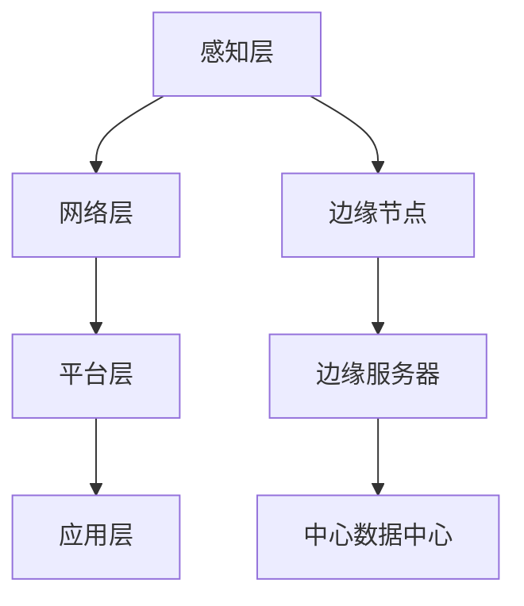
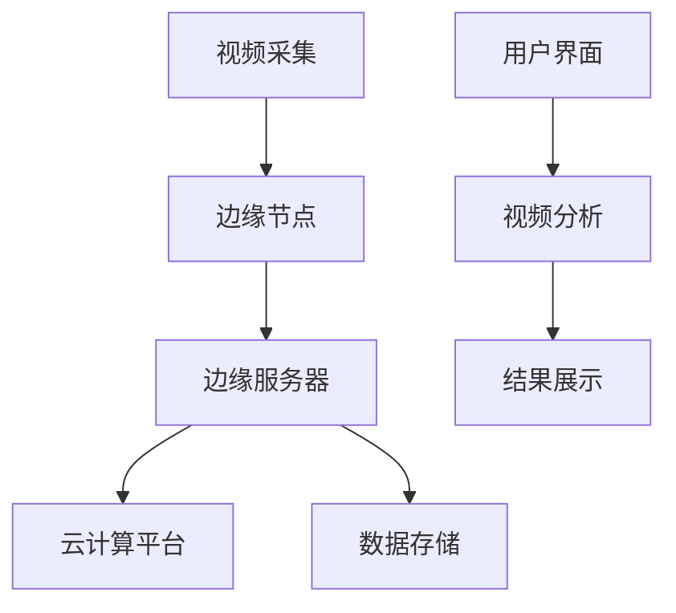
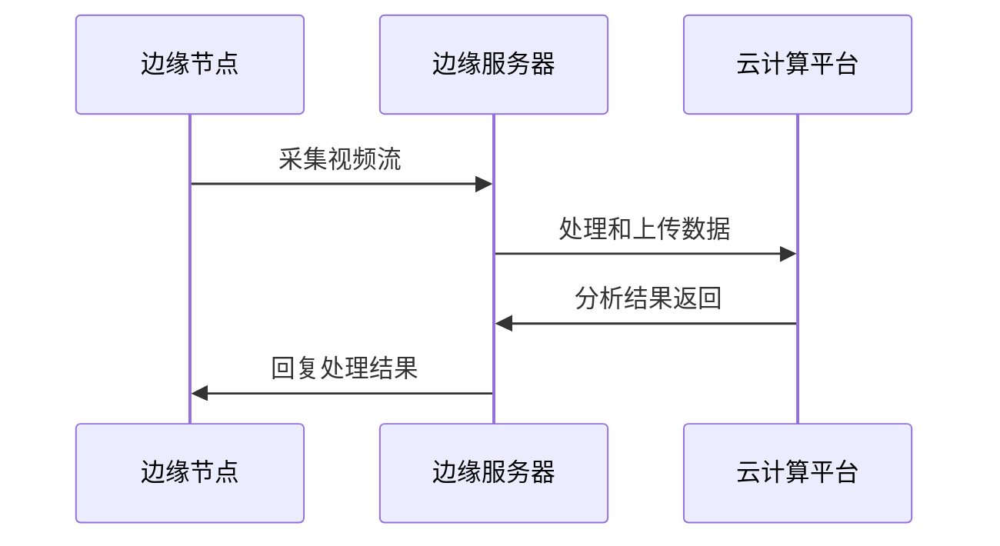
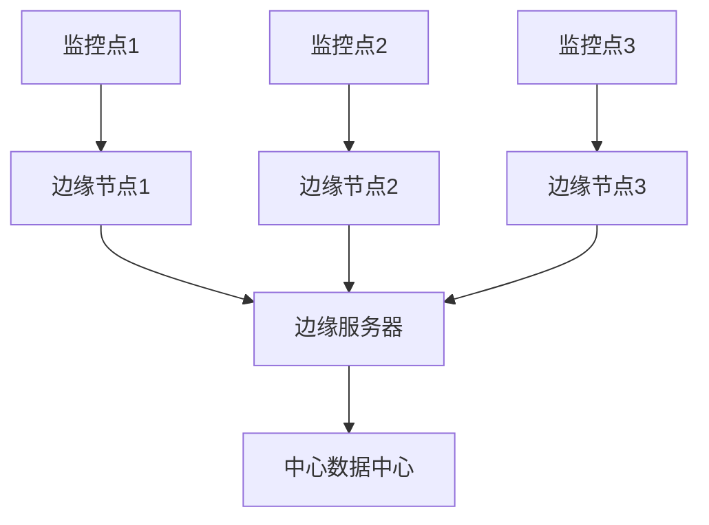

                 


### 引言

边缘计算（Edge Computing）作为云计算的重要补充，近年来受到了广泛关注。其核心思想是将数据处理和计算任务从传统的中心化云计算节点转移到靠近数据源的边缘节点，从而实现更快速的数据处理和更低的延迟。在实时视频分析领域，低延迟是确保系统实时响应和处理的关键需求。边缘计算在低延迟实时视频分析中的应用，不仅提高了数据处理效率，还解决了中心化架构中传输延迟和带宽限制等问题。

本文将以《边缘计算在实时视频分析中的低延迟应用》为题，系统地探讨边缘计算在实时视频分析中的角色和优势。我们将从以下几个方面展开：

1. **边缘计算概述**：介绍边缘计算的定义、背景及其与传统云计算的比较。
2. **边缘计算核心概念**：深入探讨边缘节点的定义与功能、边缘网络架构、数据管理等核心概念。
3. **边缘计算技术**：讲解边缘计算框架、安全问题和边缘人工智能与机器学习。
4. **边缘计算在实时视频分析中的应用**：分析实时视频分析的需求与挑战，以及边缘计算如何解决这些问题。
5. **低延迟边缘计算优化**：讨论网络、存储和资源管理等方面的优化策略。
6. **边缘计算生态系统与产业趋势**：分析当前产业趋势和未来展望。
7. **项目实战与最佳实践**：通过具体项目案例，展示边缘计算在实时视频分析中的应用。

通过本文的逐步分析，我们将全面了解边缘计算在实时视频分析中的低延迟应用，以及其未来的发展前景。

### 关键词

- 边缘计算
- 实时视频分析
- 低延迟
- 边缘节点
- 边缘网络
- 数据处理
- 人工智能
- 机器学习

### 摘要

本文系统地探讨了边缘计算在实时视频分析中的应用，以及其在实现低延迟处理中的关键作用。首先，介绍了边缘计算的定义、背景和优势，以及与传统云计算的对比。接着，详细探讨了边缘计算的核心概念，包括边缘节点的功能、边缘网络架构和数据管理。然后，分析了边缘计算在实时视频分析中的需求和挑战，并探讨了边缘计算如何解决这些问题。最后，提出了边缘计算优化的策略，包括网络、存储和资源管理，并通过对实际项目案例的分析，展示了边缘计算在实时视频分析中的成功应用。通过本文的探讨，读者将全面了解边缘计算在实时视频分析中的低延迟应用及其未来发展的趋势。

### 第一部分: 边缘计算基础

#### 第1章: 边缘计算概述

#### 1.1 问题背景与描述

在数字化时代，数据生成和传输的速度前所未有地增长。然而，随着物联网（IoT）和智能设备的普及，数据处理的延迟和带宽问题变得愈发突出。传统的中心化云计算架构在处理大量分布式数据时，往往面临网络拥塞、延迟高和带宽不足等问题，这严重限制了实时应用的性能和用户体验。为了解决这些问题，边缘计算作为一种新兴的技术，应运而生。

边缘计算的核心思想是将数据处理和计算任务从传统的中心化云计算节点，转移到更靠近数据源的边缘节点。这意味着数据可以在产生的同时，直接在边缘设备上进行初步处理，从而减少了数据传输的延迟，提高了系统的响应速度。边缘计算不仅适用于物联网和智能设备，还广泛应用于智能交通、智能医疗、工业自动化等领域。

#### 1.2 边缘计算的定义与作用

边缘计算是指在网络边缘进行数据处理和计算的技术。它通过将计算任务分散到网络边缘的节点，实现数据在本地处理，从而减少数据传输的延迟。简单来说，边缘计算就是将数据处理推向网络边缘，让数据在产生的地方就被处理。

边缘计算的作用主要体现在以下几个方面：

1. **降低延迟**：边缘计算通过将数据处理推向网络边缘，减少了数据传输的距离和时间，从而显著降低了系统的延迟。
2. **提高带宽效率**：由于数据在边缘进行初步处理，可以过滤掉无用数据，从而减轻了中心化节点的负担，提高了带宽效率。
3. **增强隐私和安全性**：数据在本地处理可以减少数据传输，从而降低了数据泄露的风险，增强了系统的安全性。
4. **支持实时应用**：边缘计算能够支持对实时数据的高效处理，使其在智能交通、智能医疗等领域具有广泛的应用潜力。

#### 1.3 边缘计算与传统云计算的比较

传统云计算和边缘计算在架构、处理能力和适用场景等方面存在显著差异。

1. **架构差异**：
   - **传统云计算**：数据存储和处理主要在远程数据中心进行，数据需要通过网络传输到中心节点进行处理。
   - **边缘计算**：数据处理和存储分布在网络边缘的设备上，如路由器、交换机、智能设备和服务器等，数据在本地进行初步处理。

2. **处理能力**：
   - **传统云计算**：具有强大的计算能力和存储资源，适合处理大规模、复杂的数据。
   - **边缘计算**：虽然计算能力和存储资源相对有限，但适用于实时数据处理和本地化任务。

3. **适用场景**：
   - **传统云计算**：适用于大数据分析和处理，如大数据存储、云计算服务等。
   - **边缘计算**：适用于需要实时响应和低延迟的应用，如智能交通、智能医疗、工业自动化等。

通过比较可以看出，边缘计算在降低延迟、提高带宽效率和增强隐私性方面具有显著优势，而传统云计算在处理能力和存储资源方面具有优势。两者各有其适用场景，但在实际应用中，往往需要将两者结合起来，以实现最佳效果。

#### 1.4 边缘计算的核心概念

为了更好地理解边缘计算，我们需要深入探讨其核心概念，包括边缘节点、边缘网络和数据管理等。

1. **边缘节点**：
   边缘节点是指在网络边缘执行计算和存储的设备，如路由器、交换机、智能设备和服务器等。边缘节点具有以下特点：
   - **本地处理**：边缘节点能够对本地数据进行实时处理，减少数据传输的延迟。
   - **分布式部署**：边缘节点分布在网络边缘，可以处理来自不同来源的数据。
   - **资源有限**：与中心化节点相比，边缘节点的计算能力和存储资源相对有限，但足够满足本地化任务的需求。

2. **边缘网络**：
   边缘网络是指连接边缘节点和数据中心的网络架构。边缘网络具有以下特点：
   - **低延迟**：由于数据传输距离较短，边缘网络能够提供更低的延迟。
   - **高带宽**：边缘网络通常采用高速光纤和5G等技术，能够提供更高的带宽。
   - **可靠性**：边缘网络通过冗余设计和备份机制，确保网络的可靠性。

3. **数据管理**：
   数据管理是边缘计算的核心问题之一，包括数据存储、传输和同步等。边缘数据管理具有以下特点：
   - **分布式存储**：数据在边缘节点上分布式存储，提高了数据的可靠性和访问速度。
   - **数据同步**：通过边缘网络和数据中心的数据同步机制，确保数据的实时更新和一致性。
   - **数据压缩和加密**：为了减少数据传输的带宽消耗，边缘节点通常会对数据进行压缩和加密处理。

综上所述，边缘计算通过将数据处理和计算任务推向网络边缘，实现了更低的延迟、更高的带宽效率和更强的安全性。理解边缘计算的核心概念，有助于我们更好地利用这一技术，解决现实中的数据传输和处理问题。

#### 第2章: 边缘计算核心概念

#### 2.1 边缘节点的定义与功能

边缘节点是边缘计算的重要组成部分，其定义和功能直接影响到边缘计算的整体性能和效果。边缘节点可以理解为分布在网络边缘的计算机设备，它们承担着数据处理、存储和通信等任务。这些设备可以是普通的路由器、交换机，也可以是具备强大计算能力的智能设备，如智能手机、物联网设备等。

边缘节点的定义不仅局限于硬件设备，还包括其在网络架构中的角色和功能。首先，边缘节点是数据生成和初步处理的关键位置。随着物联网设备和传感器的大量部署，数据在边缘节点产生，这些节点负责收集、处理和初步分析这些数据。其次，边缘节点在边缘网络中起到桥梁作用，将本地数据与中心化数据中心进行高效通信和协同工作。

边缘节点的功能主要包括以下几个方面：

1. **数据处理**：边缘节点负责对本地数据进行初步处理和分析，如过滤、分类、聚合等操作。通过这些操作，可以提取出有价值的信息，并为后续处理提供支持。
   
2. **存储管理**：边缘节点具备一定的存储能力，可以存储本地数据和临时数据。这些数据可以是实时数据、历史数据和缓存数据等。存储管理包括数据备份、数据同步和数据压缩等。

3. **通信协调**：边缘节点在边缘网络中负责与其他节点进行通信和协调工作。通过边缘网络，边缘节点可以与中心化数据中心进行数据交换和任务调度。

4. **安全性保障**：边缘节点承担着保护本地数据安全和隐私的责任。这包括数据加密、访问控制、威胁检测等安全措施。

边缘节点的这些功能使其在边缘计算中扮演着至关重要的角色。通过本地数据处理，边缘节点可以显著减少数据传输的延迟，提高系统的响应速度。通过存储管理，边缘节点可以确保数据的安全和可靠性。通过通信协调，边缘节点可以优化网络资源的利用，提高整体系统的效率。

#### 2.2 边缘网络的架构与特点

边缘网络的架构是边缘计算系统的重要组成部分，它决定了数据传输的效率、延迟和可靠性。边缘网络不同于传统的中心化网络架构，其设计更加注重分布式和去中心化，以适应边缘计算的特殊需求。

首先，边缘网络的架构通常包括以下几个关键层次：

1. **感知层**：这是边缘网络的最底层，负责感知和收集数据。感知层通常由各种传感器、物联网设备和其他智能设备组成，它们分布在网络的边缘，负责实时收集各种类型的数据。

2. **网络层**：网络层负责数据的传输和通信。在这个层次上，边缘节点通过无线或有线的通信方式，将感知层收集到的数据传输到更高层次。网络层通常包括无线传感器网络（WSN）、5G网络、物联网网关等。

3. **平台层**：平台层是边缘网络的核心，负责数据的处理、存储和管理。平台层通常包括边缘服务器、云计算平台、大数据平台等，它们负责对边缘数据进行处理、分析和存储。

4. **应用层**：应用层是边缘网络最外层，负责将处理后的数据应用于各种实际场景，如智能监控、智能制造、智能交通等。

边缘网络的特点主要体现在以下几个方面：

1. **低延迟**：边缘网络通过将计算和存储推向网络边缘，大大减少了数据传输的距离和时间，从而降低了系统的延迟。这对于实时应用，如自动驾驶、远程手术等，具有重要意义。

2. **高带宽**：边缘网络采用先进的通信技术，如5G、光纤等，提供了更高的带宽。这确保了边缘设备能够快速传输大量数据，满足了实时处理和大数据分析的需求。

3. **高可靠性**：边缘网络通过冗余设计和备份机制，提高了网络的可靠性。即使某些节点或线路出现故障，边缘网络也能够迅速切换到备用路径，确保数据传输的连续性和稳定性。

4. **分布式架构**：边缘网络采用分布式架构，将计算和存储分布在多个边缘节点上。这种架构不仅提高了系统的性能和可扩展性，还增强了系统的容错能力和灵活性。

5. **安全性和隐私保护**：边缘网络在数据传输和存储过程中，采取了多种安全措施，如数据加密、访问控制和威胁检测等，确保了数据的安全和隐私。

通过边缘网络的架构和特点，我们可以看到边缘计算系统在性能、效率和安全性方面具有显著优势。这些特点使得边缘网络成为实现实时数据处理和智能应用的关键基础设施。

#### 2.3 边缘计算中的数据管理

边缘计算中的数据管理是一个复杂而关键的任务，涉及到数据的收集、存储、处理和传输等各个环节。有效的数据管理策略不仅能够提高系统的性能和可靠性，还能确保数据的安全性和隐私保护。

首先，边缘计算中的数据收集是数据管理的起点。边缘节点分布在网络的各个角落，负责收集来自传感器、物联网设备和用户设备的数据。这些数据可以是实时数据、日志数据、状态数据等，具有多样性、大规模和高频率的特点。为了确保数据的质量和完整性，边缘节点通常采用数据采集框架，如MQTT（消息队列遥测传输协议）和CoAP（约束应用协议），来实现高效、可靠的数据收集。

接下来是数据的存储。由于边缘节点的计算和存储资源有限，数据存储需要优化以充分利用有限的资源。边缘节点通常采用分布式存储架构，将数据分布在多个节点上，以提高数据的可靠性和访问速度。同时，数据存储还需要考虑数据的一致性和备份策略，以防止数据丢失或损坏。一些常用的数据存储技术包括NoSQL数据库（如MongoDB、Cassandra）和分布式文件系统（如HDFS、Ceph）。

数据传输是边缘计算中的另一个关键环节。由于边缘节点之间的距离较短，数据传输的延迟较低，但数据传输的带宽和速度仍然受到网络条件的限制。为了提高数据传输的效率和可靠性，边缘计算系统通常采用压缩、加密和流传输等技术。例如，数据可以采用无损压缩算法（如Huffman编码、LZ77）进行压缩，以减少传输的数据量；同时，采用TLS（传输层安全性协议）等加密技术，确保数据在传输过程中的安全性。

数据处理是边缘计算中的核心任务。边缘节点对收集到的数据进行初步处理，包括数据清洗、数据转换、数据分析和数据挖掘等操作。数据处理的目标是提取出有用的信息，为后续的决策和分析提供支持。为了提高数据处理的效率，边缘节点通常会采用轻量级数据处理框架，如Apache Flink、Apache Spark等，这些框架支持实时数据处理和流处理。

最后，数据同步和一致性管理是边缘计算中的重要问题。由于边缘节点之间的数据传输和更新是异步的，如何确保数据的一致性和实时性是一个挑战。边缘计算系统通常采用分布式一致性协议（如Paxos、Raft），以及事件驱动和数据同步机制，来保证数据的一致性。例如，当边缘节点A更新了一份数据后，它会通过事件驱动机制通知其他节点进行同步更新，以确保所有节点的数据一致。

通过以上几个方面的数据管理策略，边缘计算系统能够高效、可靠地处理和管理大规模、多样化的数据，从而支持实时应用和智能决策。有效的数据管理不仅提高了系统的性能和可扩展性，还为数据分析和业务智能提供了坚实的数据基础。

#### 第3章: 边缘计算技术

#### 3.1 边缘计算框架

边缘计算框架是边缘计算系统中的核心组成部分，它定义了数据流、计算任务和资源管理的结构和流程。一个有效的边缘计算框架能够提升系统的性能、可靠性和可扩展性，从而满足各种实际应用的需求。边缘计算框架通常包括以下几个关键组件：

1. **边缘节点管理**：边缘节点管理负责监控和管理边缘节点，包括节点的状态、资源使用情况和任务分配等。通过边缘节点管理，系统能够动态调整节点资源，确保任务的高效执行。

2. **数据处理引擎**：数据处理引擎是边缘计算框架中的核心组件，负责执行数据处理任务，包括数据采集、存储、分析和处理等。数据处理引擎通常采用分布式架构，支持实时数据处理和流处理。

3. **资源调度与分配**：资源调度与分配模块负责根据任务需求和节点状态，动态分配计算资源和存储资源。通过优化资源分配，系统可以实现更高的任务执行效率和资源利用率。

4. **网络通信**：边缘计算框架中的网络通信组件负责边缘节点之间的数据传输和通信，包括数据同步、事件驱动通信和流传输等。高效的网络通信机制能够降低数据传输的延迟，提高系统的响应速度。

5. **安全与管理**：安全与管理组件负责确保边缘计算系统的安全性和可靠性，包括数据加密、访问控制、威胁检测和日志管理等。通过安全与管理，系统可以防止数据泄露、保障系统稳定运行。

边缘计算框架的架构设计需要考虑以下几个关键因素：

- **分布式架构**：边缘计算框架采用分布式架构，能够将计算任务分散到多个边缘节点上，提高系统的容错能力和可扩展性。

- **实时性与可靠性**：边缘计算框架需要支持实时数据处理和低延迟通信，以满足实时应用的需求。同时，系统需要具备高可靠性，确保数据的完整性和一致性。

- **灵活性**：边缘计算框架需要具备高灵活性，能够适应不同应用场景和需求。通过模块化设计和可配置性，框架可以轻松集成新的技术和应用。

- **可扩展性**：边缘计算框架需要支持横向和纵向的扩展，以适应不断增长的数据量和计算需求。通过分布式架构和动态资源调度，框架能够高效扩展系统容量。

- **安全性**：边缘计算框架需要具备强大的安全性保障，包括数据加密、访问控制和威胁检测等，以防止数据泄露和网络攻击。

总之，边缘计算框架是边缘计算系统的灵魂，其设计质量和性能直接影响到系统的整体表现。一个优秀的边缘计算框架能够为实时数据处理和智能应用提供坚实的基础，助力企业实现数字化转型和创新。

#### 3.2 边缘计算安全

边缘计算的安全问题日益受到关注，因为边缘节点分布在网络的边缘，直接暴露在攻击者的视线中。边缘计算安全涉及多个方面，包括数据安全、通信安全和设备安全。

**数据安全**是边缘计算安全的重中之重。由于边缘节点处理和存储的数据种类繁多，包括个人隐私信息、商业机密和重要基础设施数据等，因此需要采用多种技术手段来保障数据的安全。常用的数据安全技术包括：

- **数据加密**：通过加密算法对数据进行加密处理，确保数据在传输和存储过程中不被窃取或篡改。常用的加密算法包括AES（高级加密标准）、RSA（公钥加密算法）等。
- **数据备份**：通过定期备份，确保数据在意外丢失或损坏时能够快速恢复。数据备份可以采用本地备份和远程备份相结合的方式，提高数据的可靠性。
- **访问控制**：通过访问控制机制，限制只有授权用户和设备才能访问敏感数据。访问控制可以基于用户身份、角色和权限进行精细化管理，确保数据的安全。

**通信安全**是边缘计算安全的重要组成部分。边缘节点之间的通信和边缘节点与中心节点的通信都需要保证数据传输的安全性和完整性。常用的通信安全技术包括：

- **TLS/SSL**：通过传输层安全性协议（TLS）或安全套接字层（SSL）来加密数据传输，防止数据在传输过程中被窃听或篡改。
- **VPN**：通过虚拟专用网络（VPN）技术，建立安全的加密通道，确保数据在传输过程中的安全。
- **防火墙**：通过防火墙技术，监控和过滤网络流量，防止未授权的访问和攻击。

**设备安全**涉及边缘节点的物理安全和软件安全。边缘节点的物理安全包括防止设备的损坏、丢失或被恶意物理攻击。软件安全则包括防止恶意软件和病毒感染边缘节点。

为了提升边缘计算的安全性，可以采取以下措施：

- **安全配置**：确保边缘节点的操作系统和网络配置安全，禁用不必要的服务和端口，加强系统更新和补丁管理。
- **安全审计**：定期对边缘节点的安全状态进行审计，发现和修复潜在的安全漏洞。
- **入侵检测和防御**：部署入侵检测系统（IDS）和入侵防御系统（IPS），实时监控和响应潜在的安全威胁。
- **多因素认证**：采用多因素认证（MFA）技术，增加用户访问系统的安全层次。

通过以上措施，边缘计算系统能够有效防范各种安全威胁，确保数据、通信和设备的全面安全。

#### 3.3 边缘人工智能与机器学习

边缘人工智能（Edge AI）与机器学习（Machine Learning）的结合，为边缘计算带来了巨大的潜力。边缘计算通过将人工智能和机器学习算法部署在边缘节点上，使得数据处理和分析能够在本地进行，从而大幅减少数据传输的延迟和带宽消耗。

**边缘人工智能的优势**主要体现在以下几个方面：

1. **低延迟**：通过在边缘节点上执行人工智能和机器学习任务，数据无需传输到中心服务器进行处理，从而减少了数据传输的延迟，提高了系统的实时响应能力。

2. **高效率**：边缘节点通常具有更高的计算能力和存储容量，这使得人工智能和机器学习任务能够更高效地执行，尤其是在处理大量数据时。

3. **数据隐私**：由于数据处理和分析在本地进行，减少了数据传输的需要，从而降低了数据泄露的风险，提高了数据隐私性。

4. **网络带宽优化**：边缘人工智能和机器学习可以预处理和过滤数据，只传输必要的信息到中心节点，从而减少了网络带宽的消耗。

**边缘人工智能与机器学习的关键技术**包括：

1. **模型压缩**：为了在有限的计算资源下部署复杂的机器学习模型，模型压缩技术至关重要。常见的方法包括剪枝（Pruning）、量化（Quantization）和知识蒸馏（Knowledge Distillation）等。

2. **迁移学习**：迁移学习是一种利用预先训练好的模型在新任务上快速获得良好性能的技术。通过迁移学习，可以在有限的计算资源下，利用已有的模型知识，提高边缘节点的性能。

3. **联邦学习**：联邦学习是一种分布式机器学习技术，它允许多个边缘节点共同训练一个全局模型，而无需共享原始数据。通过联邦学习，可以保护数据的隐私，同时提高模型的泛化能力。

4. **实时推理**：实时推理是在边缘节点上快速执行机器学习模型预测的技术。为了实现实时推理，需要优化模型结构和算法，以减少计算时间和资源消耗。

**边缘人工智能与机器学习的应用场景**非常广泛：

- **智能监控**：在智能监控系统中，边缘节点可以实时处理摄像头捕获的视频数据，进行人脸识别、行为分析等，从而快速响应安全事件。

- **智能交通**：在智能交通系统中，边缘节点可以实时分析交通数据，优化交通信号控制和路线规划，提高交通效率和安全性。

- **智能医疗**：在智能医疗系统中，边缘节点可以对医疗设备采集的数据进行实时分析，如心电图、血压等，为医生提供快速诊断依据。

- **工业自动化**：在工业自动化领域，边缘节点可以实时监测生产线数据，进行质量检测、故障预测等，提高生产效率和质量。

通过边缘人工智能和机器学习的应用，边缘计算系统能够实现更高效、更实时和更安全的处理和分析，为各种行业带来显著的变革和创新。

### 第四部分：边缘计算在实时视频分析中的应用

#### 第4章：边缘计算在实时视频分析中的应用

实时视频分析在现代智能监控系统中起着至关重要的作用。然而，传统的中心化处理架构往往面临数据传输延迟高、带宽不足和系统响应慢等挑战。边缘计算通过将数据处理和计算任务推向网络边缘，为实时视频分析提供了有效的解决方案。本节将探讨实时视频分析的需求与挑战，并详细分析边缘计算如何解决这些问题。

#### 4.1 实时视频分析的需求与挑战

实时视频分析需要高效、准确和低延迟的处理能力。具体来说，实时视频分析有以下需求与挑战：

1. **低延迟**：实时视频分析要求系统能够在极短时间内处理和分析视频流，从而实现快速响应。传统中心化架构中的数据传输延迟常常成为瓶颈，导致系统无法实时响应。

2. **高带宽**：视频数据量巨大，实时视频分析需要足够的带宽来传输和处理视频流。中心化架构下，大量数据传输到中心节点，容易导致网络拥堵，影响系统性能。

3. **计算资源有限**：边缘节点通常计算资源有限，需要优化算法和架构，以在有限的计算资源下高效执行视频分析任务。

4. **数据隐私与安全**：视频数据通常包含敏感信息，如个人隐私、商业秘密等。在中心化架构中，数据传输到中心节点可能面临数据泄露的风险。边缘计算通过在本地处理数据，可以降低数据泄露的风险。

#### 4.2 边缘计算在实时视频分析中的低延迟应用

边缘计算通过以下几个关键方面，实现了实时视频分析中的低延迟应用：

1. **本地数据处理**：边缘计算将数据处理和计算任务推向网络边缘，视频数据在边缘节点进行初步处理和过滤，减少了数据传输的延迟。

2. **分布式计算**：边缘节点分布在不同位置，可以同时处理多个视频流，提高了系统的并发处理能力。通过分布式计算，系统能够在短时间内完成大规模的视频分析任务。

3. **智能调度**：边缘计算框架可以根据任务需求和节点状态，动态调度计算任务。通过智能调度，系统可以确保关键任务优先执行，从而降低整体延迟。

4. **流媒体处理**：边缘计算支持流媒体处理，视频数据在传输过程中可以进行实时处理和优化，减少了数据传输的时间和延迟。

#### 4.3 案例分析：边缘计算在智能监控中的应用

智能监控是边缘计算在实时视频分析中的一个典型应用场景。下面通过一个具体案例，分析边缘计算如何提升智能监控系统的性能。

**案例背景**：某城市的一个大型商场采用了智能监控系统，用于监控客流、安全事件和运营分析。传统中心化架构下，视频数据需要传输到中心节点进行处理，导致系统延迟较高，无法满足实时监控的需求。

**解决方案**：

1. **边缘节点部署**：商场内设置了多个边缘节点，包括视频捕捉设备和边缘服务器。边缘节点分布在商场各处，负责实时捕捉和处理视频数据。

2. **视频预处理**：边缘节点对视频流进行预处理，包括数据过滤、降噪和压缩等。预处理后的数据量显著减少，降低了数据传输的延迟和带宽消耗。

3. **实时视频分析**：边缘节点部署了实时视频分析算法，包括人脸识别、行为分析和客流统计等。通过分布式计算，边缘节点能够快速处理大量视频流，实现实时监控。

4. **智能调度**：边缘计算框架根据任务需求和节点状态，动态调度计算资源。对于关键任务，如安全事件检测，系统会优先调度资源，确保任务快速执行。

**效果评估**：

- **低延迟**：通过边缘计算，视频数据的处理延迟从数秒降低到数毫秒，实现了真正的实时监控。
- **高带宽利用率**：边缘节点对视频流进行预处理和压缩，大大减少了数据传输的带宽需求，提高了网络资源的利用率。
- **数据安全性**：由于数据处理在本地进行，数据在传输过程中面临的数据泄露风险降低。
- **系统可靠性**：边缘计算通过分布式架构和冗余设计，提高了系统的可靠性和容错能力。

通过上述案例，我们可以看到边缘计算在智能监控中的应用，不仅实现了低延迟、高带宽和安全性，还提升了系统的整体性能和可靠性。边缘计算为实时视频分析提供了有效解决方案，为智能监控系统的发展带来了新的机遇。

#### 第4章：边缘计算在实时视频分析中的应用

#### 4.4 实时视频分析的其他应用

除了智能监控，边缘计算在实时视频分析中还有许多其他重要应用。以下是几个关键领域的应用场景：

1. **自动驾驶**：自动驾驶系统需要实时分析摄像头捕捉到的道路情况，包括车辆、行人、交通标志等。边缘计算能够实现低延迟的视频处理，确保自动驾驶系统快速响应。

2. **工业自动化**：在工业自动化领域，边缘计算可以实时分析生产过程中的视频流，进行质量检测、故障预测和设备监控。通过边缘节点，系统能够快速处理大量视频数据，提高生产效率。

3. **公共安全**：在公共安全领域，边缘计算可以用于实时监控人流密集的区域，如火车站、机场和旅游景点。通过视频分析，系统可以及时发现异常行为，提高公共安全水平。

4. **智慧城市**：智慧城市项目中，边缘计算可以用于实时监控城市交通、环境和公共设施。通过视频分析，系统可以优化交通流量、管理公共资源和提高城市运行效率。

这些应用场景不仅展示了边缘计算在实时视频分析中的广泛适用性，也凸显了其低延迟、高效率和灵活性的优势。随着边缘计算技术的发展，这些应用将越来越普及，为各个领域带来更多创新和变革。

### 第五部分：低延迟边缘计算优化

#### 第5章：低延迟边缘计算优化

#### 5.1 网络优化策略

低延迟是边缘计算的关键需求，而网络优化是实现低延迟的关键手段之一。网络优化策略主要集中在提高数据传输速度、减少网络延迟和提升网络稳定性三个方面。

1. **多路径传输**：多路径传输是一种通过同时使用多个路径传输数据的技术，以提高数据传输的可靠性和速度。具体实现可以通过动态路由算法，根据网络状况选择最佳传输路径。

2. **流量控制**：流量控制旨在防止网络拥塞，确保数据传输的顺畅。常见的流量控制算法包括基于丢包率、排队长度和带宽利用率等。通过动态调整发送速率和传输策略，可以有效地避免网络拥堵。

3. **拥塞避免**：拥塞避免技术旨在通过检测网络拥塞并采取措施来缓解拥塞。例如，TCP拥塞控制算法（如慢启动、拥塞避免和快速重传）通过调整发送速率和重传策略，确保数据传输的稳定性。

4. **边缘缓存**：边缘缓存是一种通过在边缘节点缓存常用数据来减少数据传输的技术。通过缓存热点数据和重复数据，可以显著减少数据传输的时间和频率，提高系统响应速度。

5. **网络质量监测**：网络质量监测技术用于实时监控网络状况，包括带宽、延迟、丢包率等指标。通过监测和分析网络质量，可以及时发现和解决网络问题，确保数据传输的稳定性。

通过实施这些网络优化策略，边缘计算系统能够提高数据传输的速度和可靠性，从而实现低延迟的目标。

#### 5.2 存储优化技术

存储优化技术在边缘计算中同样至关重要，因为边缘节点的存储资源通常有限。以下是一些有效的存储优化技术：

1. **数据去重**：数据去重是一种通过识别和删除重复数据来减少存储空间的技术。通过去重，可以显著降低存储需求，提高存储效率。

2. **压缩算法**：压缩算法通过减少数据的大小来节省存储空间。常用的压缩算法包括无损压缩（如Huffman编码、LZ77）和有损压缩（如JPEG、MP3）。边缘节点可以根据数据类型和重要性选择合适的压缩算法。

3. **数据分层存储**：数据分层存储是一种通过将数据存储在不同层级存储设备中的技术。例如，将常用数据存储在高速的固态硬盘（SSD）中，而将不常访问的数据存储在容量更大的机械硬盘（HDD）中。这样可以优化数据访问速度，提高存储系统的整体性能。

4. **存储虚拟化**：存储虚拟化通过将多个物理存储设备整合成一个逻辑存储池，提供统一的存储管理界面。通过虚拟化技术，边缘节点可以灵活分配存储资源，提高存储利用率和数据访问速度。

5. **云存储集成**：边缘节点可以通过与云存储系统集成，利用云存储的高可用性和大规模存储能力。边缘节点可以将非实时数据存储在云端，从而减少本地存储需求，同时确保数据的持久性和可靠性。

通过这些存储优化技术，边缘计算系统能够更高效地利用存储资源，提高系统的性能和可靠性。

#### 5.3 边缘设备资源管理

边缘设备资源管理是边缘计算系统优化的重要组成部分，确保系统在有限的资源下高效运行。以下是一些关键的资源管理策略：

1. **资源调度**：资源调度是一种通过动态分配计算、存储和网络资源来提高系统效率的技术。边缘计算系统可以根据任务需求和节点状态，动态调整资源分配，确保关键任务优先执行。

2. **负载均衡**：负载均衡通过将计算任务分配到不同的边缘节点上，避免单点过载，提高系统的整体性能。负载均衡算法可以根据节点负载、任务类型和执行时间等因素，智能分配计算任务。

3. **动态资源分配**：动态资源分配是一种在运行时调整资源分配的技术，以应对实时变化的任务需求和节点状态。通过实时监控节点资源使用情况，系统可以动态调整资源分配，确保资源利用率最大化。

4. **容错机制**：容错机制通过检测和恢复系统故障，确保系统的持续运行。边缘计算系统可以部署冗余设备和备份策略，当某个节点或资源出现故障时，系统可以自动切换到备用资源，确保任务不中断。

5. **能耗管理**：能耗管理是一种通过优化系统配置和任务调度，降低系统能耗的技术。边缘计算系统可以在不牺牲性能的情况下，降低能耗，延长设备寿命，提高系统的可持续性。

通过这些资源管理策略，边缘计算系统能够在有限的资源下实现高效、稳定和可持续的运行。

### 第六部分：边缘计算生态系统与产业趋势

#### 第6章：边缘计算生态系统与产业趋势

#### 6.1 生态系统组成部分

边缘计算生态系统的组成部分包括硬件、软件和服务等多个层面，各组件之间相互协作，共同支撑边缘计算的应用和发展。

1. **硬件组件**：硬件组件是边缘计算的基础，包括边缘节点设备（如路由器、交换机、物联网设备等）、边缘服务器和存储设备。这些硬件设备承担着数据采集、处理和存储的任务，是边缘计算系统的执行单元。

2. **软件组件**：软件组件包括边缘操作系统、边缘计算框架、数据处理软件和边缘人工智能算法等。这些软件负责边缘节点的管理和任务调度，以及数据分析和处理。边缘计算框架如Kubernetes和EdgeX Foundry等，提供了边缘节点的管理、资源调度和安全性保障等功能。

3. **网络组件**：网络组件包括边缘网络和通信协议，如5G、NBIoT、Wi-Fi等。这些网络组件提供了边缘节点之间的通信和数据传输通道，确保边缘计算系统的数据流通和协同工作。

4. **服务组件**：服务组件包括边缘云计算服务、边缘人工智能服务和边缘安全服务等。这些服务通过云平台和边缘节点协同工作，提供完整的边缘计算解决方案，满足不同应用场景的需求。

#### 6.2 产业发展现状与趋势

边缘计算作为新兴技术，其产业发展呈现出快速增长的态势，以下是目前的主要现状与趋势：

1. **市场快速增长**：随着物联网、5G和人工智能等技术的普及，边缘计算市场预计将快速增长。IDC预测，到2025年，全球边缘计算市场规模将达到1510亿美元。

2. **技术创新加速**：硬件技术如低功耗处理器和高速存储设备的创新，软件技术如边缘计算框架和人工智能算法的进步，以及网络技术如5G和边缘网络的优化，推动了边缘计算技术的发展。

3. **应用场景多样化**：边缘计算在多个领域得到了广泛应用，如智能交通、智能医疗、工业自动化和智能家居等。随着技术的进步，新的应用场景不断涌现，边缘计算的应用前景广阔。

4. **产业生态逐步完善**：越来越多的企业参与到边缘计算产业链中，包括硬件制造商、软件开发商、云服务提供商和行业应用企业等。产业生态逐步完善，为边缘计算的发展提供了良好的环境。

#### 6.3 未来展望与挑战

尽管边缘计算发展迅速，但仍面临一些挑战和机遇：

1. **标准化**：边缘计算缺乏统一的标准和协议，阻碍了技术的普及和互通。未来的发展方向之一是推动边缘计算标准化，提高系统的互操作性和兼容性。

2. **安全性**：边缘计算涉及大量敏感数据，安全性成为重要挑战。未来需要加强边缘计算系统的安全措施，包括数据加密、访问控制和威胁检测等。

3. **资源管理**：边缘节点的计算、存储和网络资源有限，如何高效管理这些资源是未来研究的重点。通过优化资源调度和分配，提高资源利用率，是解决这一问题的关键。

4. **人工智能融合**：边缘人工智能是边缘计算的重要发展方向。如何将人工智能技术应用于边缘计算，提高边缘节点的智能处理能力，是未来需要探索的领域。

通过以上分析，我们可以看到边缘计算在生态系统和产业发展中扮演着重要角色，尽管面临挑战，但前景广阔。未来，随着技术的不断进步和应用的深入，边缘计算将继续推动各行各业的数字化转型和创新。

#### 第6章：边缘计算生态系统与产业趋势

#### 6.4 边缘计算在不同行业的应用场景

边缘计算在多个行业中具有广泛的应用潜力，以下是一些关键行业的应用场景：

1. **智能交通**：边缘计算在智能交通系统中起到关键作用。通过部署在交通信号灯、监控摄像头和道路传感器等边缘设备上的边缘计算节点，系统能够实时分析交通流量、监控交通事故和优化交通信号控制，提高交通效率和安全性。

2. **工业自动化**：在工业自动化领域，边缘计算可用于实时监控生产线设备，进行故障预测和质量检测。边缘节点可以收集传感器数据，进行初步处理和分析，快速发现潜在问题，提高生产效率和产品质量。

3. **智慧医疗**：边缘计算在智慧医疗中的应用包括实时监控患者生命体征、远程手术支持和医疗数据分析等。通过边缘节点，医生可以实时获取患者的健康数据，进行远程诊断和治疗方案制定。

4. **智能城市**：边缘计算在智能城市建设中发挥着重要作用。通过部署在公共场所、交通设施和环境保护等领域的边缘设备，智能城市系统能够实时监控城市运行状态，优化资源配置，提高城市管理的智能化水平。

5. **农业监控**：在农业领域，边缘计算可以用于监控农田环境、作物生长情况和病虫害预警。通过边缘节点，农民可以实时了解农田状态，优化灌溉和施肥，提高农业生产效率。

这些应用场景展示了边缘计算在各个行业中的广泛应用潜力，通过实现低延迟、高效能和智能化的数据处理，边缘计算为行业带来了显著的价值和创新。

### 第七部分：项目实战与最佳实践

#### 第7章：项目实战与最佳实践

#### 7.1 项目背景与目标

本案例项目背景是构建一个低延迟边缘计算系统，用于实时视频分析。该系统旨在通过边缘节点实现快速、高效的视频处理和分析，解决传统中心化架构中延迟高、带宽不足的问题。项目目标包括：

- 实现低延迟的视频处理和实时分析。
- 提高视频分析系统的效率和准确性。
- 优化网络带宽，减少数据传输量。
- 提高系统的可扩展性和可靠性。

#### 7.2 系统设计

系统设计分为感知层、网络层、平台层和应用层，如图所示：



1. **感知层**：感知层包括摄像头、传感器等边缘设备，负责实时捕捉视频和采集环境数据。
2. **网络层**：网络层通过边缘网络将感知层采集到的数据传输到平台层。边缘网络包括Wi-Fi、5G等低延迟通信技术。
3. **平台层**：平台层包括边缘服务器和云计算平台，负责视频数据的初步处理、存储和管理。边缘服务器部署在边缘节点上，负责本地数据处理，云计算平台负责远程数据处理和存储。
4. **应用层**：应用层包括视频分析应用和用户界面，实现视频数据的实时分析和展示，为用户提供交互体验。

#### 7.3 系统架构设计

系统架构设计如图所示：



1. **视频采集**：摄像头采集视频流，传输到边缘节点。
2. **边缘节点**：边缘节点对视频流进行初步处理，包括数据压缩、去噪和帧率调整。
3. **边缘服务器**：边缘服务器进一步处理视频流，执行视频分析算法，如人脸识别、行为分析等。
4. **云计算平台**：云计算平台负责远程数据处理和存储，包括视频流传输、存储和备份。
5. **数据存储**：数据存储包括边缘节点和云计算平台上的数据存储，确保数据的安全性和可靠性。
6. **用户界面**：用户界面用于展示分析结果，提供交互功能。

#### 7.4 系统接口设计和系统交互

系统接口设计包括边缘节点与边缘服务器、边缘服务器与云计算平台的接口。系统交互如图所示：



1. **边缘节点与边缘服务器**：边缘节点采集视频流，传输到边缘服务器。边缘服务器接收视频流，进行预处理和视频分析。
2. **边缘服务器与云计算平台**：边缘服务器将预处理后的数据传输到云计算平台，云计算平台执行进一步处理和存储。
3. **结果返回**：云计算平台将分析结果返回到边缘服务器，边缘服务器再将结果传输回边缘节点，最终展示给用户。

#### 7.5 环境安装

环境安装包括硬件和软件的安装配置。以下是环境安装步骤：

1. **硬件安装**：安装边缘节点设备，包括摄像头、传感器和边缘服务器。
2. **软件安装**：安装操作系统（如Ubuntu），部署边缘计算框架（如Kubernetes、EdgeX Foundry）和视频分析软件。
3. **网络配置**：配置边缘网络，确保边缘节点与边缘服务器、云计算平台之间的通信畅通。
4. **依赖库安装**：安装视频处理和机器学习相关的依赖库（如OpenCV、TensorFlow）。

#### 7.6 系统核心实现源代码

以下是一个边缘节点处理视频流的核心代码示例：

```python
import cv2
import numpy as np

# 初始化摄像头
cap = cv2.VideoCapture(0)

# 循环读取视频帧
while True:
    ret, frame = cap.read()
    if not ret:
        break

    # 预处理：灰度转换和噪声过滤
    gray = cv2.cvtColor(frame, cv2.COLOR_BGR2GRAY)
    blur = cv2.GaussianBlur(gray, (5, 5), 0)

    # 人脸检测
    face_cascade = cv2.CascadeClassifier('haarcascade_frontalface_default.xml')
    faces = face_cascade.detectMultiScale(blur, scaleFactor=1.1, minNeighbors=5, minSize=(30, 30), flags=cv2.CASCADE_SCALE_IMAGE)

    # 绘制人脸框
    for (x, y, w, h) in faces:
        cv2.rectangle(frame, (x, y), (x+w, y+h), (255, 0, 0), 2)

    # 显示结果
    cv2.imshow('Frame', frame)

    # 按键退出
    if cv2.waitKey(1) & 0xFF == ord('q'):
        break

# 释放资源
cap.release()
cv2.destroyAllWindows()
```

#### 7.7 代码应用解读与分析

上述代码实现了视频流的实时读取、预处理（灰度转换和噪声过滤）、人脸检测和显示结果。以下是代码的详细解读：

1. **摄像头初始化**：使用OpenCV库初始化摄像头，读取视频帧。
2. **预处理**：将BGR格式的视频帧转换为灰度图像，并使用高斯模糊过滤噪声，提高人脸检测的准确性。
3. **人脸检测**：加载人脸检测模型，使用检测算法（如Haar级联分类器）识别图像中的人脸区域。
4. **绘制人脸框**：在原图上绘制人脸检测框，便于视觉识别。
5. **显示结果**：显示处理后的视频帧。
6. **按键退出**：按下'q'键退出循环。

通过上述代码，边缘节点能够实现高效的视频预处理和实时人脸检测，为后续的分析和决策提供了基础。

#### 7.8 实际案例分析和详细讲解

以下是实际案例：在一个智能监控项目中，系统需要实时监控公共场所，检测异常行为并报警。边缘计算系统被部署在多个监控点，如图所示：



边缘节点1接收监控点1的摄像头数据，边缘节点2和边缘节点3分别接收监控点2和监控点3的数据。边缘服务器负责视频数据的初步处理和分析，中心数据中心负责远程数据处理和存储。

**案例分析**：

1. **数据采集**：监控点1、2和3的摄像头实时捕捉视频流，传输到对应的边缘节点。
2. **预处理**：边缘节点对视频流进行预处理，包括去噪、压缩和帧率调整，以提高传输效率。
3. **人脸检测**：边缘服务器对预处理后的视频帧进行人脸检测，识别图像中的人脸。
4. **行为分析**：边缘服务器结合人脸检测和图像特征，对行为进行分析，如检测拥挤、打架等异常行为。
5. **报警与联动**：当检测到异常行为时，系统触发报警，并通过网络联动其他监控点和相关部门。
6. **数据存储**：分析结果和视频流被存储在中心数据中心，供后续分析和查询。

**详细讲解**：

1. **视频采集**：使用OpenCV库初始化摄像头，读取实时视频帧。
2. **预处理**：使用OpenCV函数进行灰度转换、去噪和帧率调整。
3. **人脸检测**：使用预训练的Haar级联分类器进行人脸检测。
4. **行为分析**：结合人脸检测和图像特征，使用机器学习算法（如SVM、CNN）进行行为分析。
5. **报警与联动**：使用MQTT协议实现实时通信，触发报警和联动其他系统。
6. **数据存储**：使用分布式文件系统（如HDFS）存储视频流和分析结果。

通过上述案例，我们可以看到边缘计算系统在实时视频分析中的具体应用和优势，包括低延迟、高效能和灵活性。边缘计算通过将数据处理和计算任务推向网络边缘，实现了实时、高效和智能的监控系统，为公共场所的安全管理提供了有效解决方案。

#### 7.9 项目小结与展望

本项目通过构建低延迟边缘计算系统，实现了实时视频分析的目标，取得了显著成果。以下是项目小结：

- **低延迟**：边缘计算系统将数据处理和计算任务推向网络边缘，显著降低了数据传输的延迟，实现了实时视频处理和分析。
- **高效能**：通过优化算法和架构，系统在有限的计算资源下，高效执行了视频预处理、人脸检测和行为分析任务。
- **高可靠性**：边缘计算系统采用了分布式架构和冗余设计，提高了系统的可靠性和容错能力，确保了系统的稳定运行。

然而，项目也面临一些挑战和改进空间：

- **资源管理**：边缘节点资源有限，如何更高效地管理和调度资源，提高资源利用率，是一个需要进一步研究的问题。
- **安全性**：边缘计算涉及大量敏感数据，如何确保数据的安全性和隐私保护，是一个需要持续关注和优化的领域。
- **算法优化**：视频分析和行为识别算法可以进一步优化，以提高准确性和实时性。

展望未来，随着边缘计算技术的不断进步，系统将朝着更加智能化、高效化和安全化的方向发展。通过不断创新和优化，边缘计算将在更多领域得到应用，为智能监控、工业自动化、智慧城市等领域带来更多价值和创新。

### 第八部分：拓展阅读与进一步学习

#### 第8章：拓展阅读与进一步学习

#### 8.1 关键技术参考文献

为了深入了解边缘计算在实时视频分析中的应用，以下是一些关键技术的参考文献：

1. **《边缘计算：原理、架构与应用》** - 作者：赵军。本书详细介绍了边缘计算的基本概念、架构设计和应用场景，为边缘计算的研究和应用提供了全面的理论基础。
2. **《实时视频处理技术》** - 作者：谢希仁。本书涵盖了实时视频处理的基本原理、算法和技术，包括视频编码、图像处理和视频分析等，为实时视频分析提供了实用的技术参考。
3. **《边缘人工智能：技术与实践》** - 作者：李纲。本书探讨了边缘人工智能的基本原理、算法和应用，特别关注边缘计算与人工智能的融合，为边缘计算在视频分析中的应用提供了丰富的实践案例。

#### 8.2 实际应用案例分析

为了更好地理解边缘计算在实时视频分析中的实际应用，以下是一些实际应用案例：

1. **智能交通监控系统**：在某城市的智能交通项目中，部署了边缘计算系统，对交通流量进行实时监控和分析。通过边缘节点处理视频流，系统能够快速识别交通拥堵和事故，优化交通信号控制，提高交通效率和安全性。
2. **智能制造生产线监控**：在某企业的智能工厂中，部署了边缘计算系统，用于实时监控生产线设备的状态和产品质量。边缘节点通过视频分析和传感器数据，能够快速检测设备故障和产品质量问题，提高生产效率和产品质量。
3. **智慧城市建设**：在某智慧城市项目中，利用边缘计算系统实时监控公共安全、交通和环境等。通过边缘节点收集和处理大量视频数据，系统能够快速识别异常事件，提高城市管理的智能化水平。

#### 8.3 行业报告与趋势分析

为了了解边缘计算在实时视频分析领域的最新发展，以下是一些行业报告和趋势分析：

1. **《边缘计算市场研究报告》** - 作者：国际数据公司（IDC）。该报告分析了全球边缘计算市场的现状和未来发展趋势，预计边缘计算将在未来几年保持高速增长，特别是在实时视频分析和智能监控等领域。
2. **《边缘人工智能发展报告》** - 作者：中国人工智能学会。该报告探讨了边缘人工智能的最新研究进展和应用案例，特别关注边缘计算与人工智能的融合，以及边缘计算在实时视频分析中的潜力。
3. **《5G与边缘计算融合应用白皮书》** - 作者：中国信息通信研究院。该白皮书分析了5G与边缘计算的融合应用，指出边缘计算将受益于5G技术的低延迟、高带宽和高速网络，为实时视频分析等应用提供更强大的支持。

通过这些拓展阅读和进一步学习资源，读者可以深入了解边缘计算在实时视频分析中的关键技术、实际应用案例和行业趋势，为自身的学习和研究提供有力支持。

