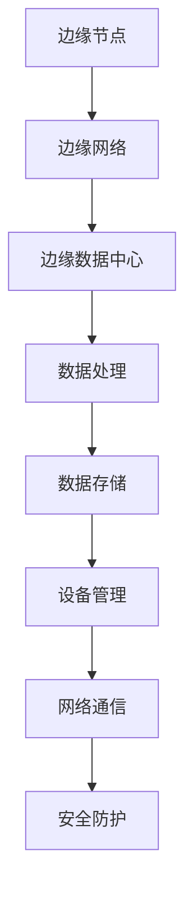
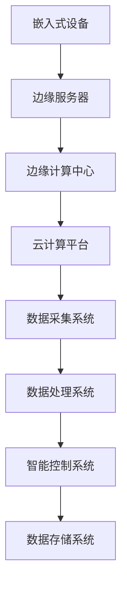
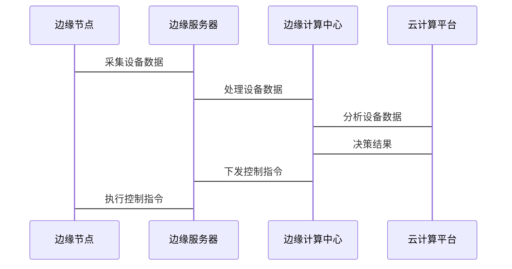

                 

# 边缘计算在工业物联网中的实践

> 关键词：边缘计算、工业物联网、智能制造、工业自动化、数据采集、通信协议

> 摘要：本文将深入探讨边缘计算在工业物联网中的应用，分析其基础概念、关键技术以及具体应用案例。通过一步步的逻辑推理和案例分析，揭示边缘计算如何提升工业物联网的实时性、可靠性和安全性，为我国工业转型升级提供新思路。

## 第一部分：边缘计算与工业物联网基础

### 第1章：边缘计算与工业物联网概述

#### 1.1 边缘计算的概念与背景

##### 1.1.1 边缘计算的定义

边缘计算是一种分布式计算架构，旨在将数据、计算、存储、应用和服务从中心化的云计算环境迁移到网络的边缘，即在靠近数据源和用户的地点进行数据处理。这一概念最早由IBM在2014年提出，旨在解决云计算在处理大量实时数据时存在的延迟、带宽和安全性问题。

##### 1.1.2 边缘计算的产生背景

随着物联网、5G和大数据技术的发展，工业物联网（IIoT）的需求日益增长。传统云计算模式在处理大规模实时数据时面临延迟、带宽和成本等问题，边缘计算因此成为解决这些问题的有效手段。边缘计算通过在设备端进行初步数据处理，减少了数据传输量，提高了系统响应速度。

##### 1.1.3 边缘计算与云计算的关系

边缘计算并非取代云计算，而是与其互补。云计算负责处理大规模数据分析和长期存储，而边缘计算则负责实时数据处理和快速响应。二者共同构建了更加高效、灵活的分布式计算架构。

#### 1.2 工业物联网的概念与发展

##### 1.2.1 工业物联网的定义

工业物联网是指通过传感器、网络和智能分析等技术，实现工业设备、系统和人员之间的互联互通，从而实现智能化管理和优化生产过程。

##### 1.2.2 工业物联网的发展历程

工业物联网起源于20世纪末的自动化技术，随着物联网和云计算的发展，逐步演变为今天的工业物联网。其发展历程可以分为以下几个阶段：

1. **自动化阶段**：20世纪80年代，PLC（可编程逻辑控制器）和DCS（分布式控制系统）的广泛应用，实现了工业过程的自动化。
2. **信息化阶段**：20世纪90年代，传感器、网络和数据库技术的应用，实现了设备信息的采集和传输。
3. **智能化阶段**：21世纪初，人工智能和大数据技术的引入，实现了设备预测性维护、生产优化和供应链管理等智能化应用。

##### 1.2.3 工业物联网的关键技术

1. **传感器技术**：用于数据采集，是实现工业物联网的基础。
2. **网络技术**：包括无线和有线网络，是数据传输的载体。
3. **云计算技术**：提供海量数据的存储和处理能力。
4. **大数据技术**：用于数据分析和挖掘，实现智能化应用。
5. **人工智能技术**：用于实现智能决策和自动化控制。

#### 1.3 边缘计算在工业物联网中的应用

##### 1.3.1 边缘计算的优势

1. **降低延迟**：边缘计算将数据处理推向网络边缘，减少了数据传输距离，降低了延迟。
2. **提高带宽利用率**：边缘计算减少了需要传输的数据量，提高了网络带宽的利用率。
3. **增强安全性**：边缘计算通过在本地进行数据处理，降低了数据泄露的风险。
4. **降低成本**：边缘计算减少了云计算资源的消耗，降低了系统成本。

##### 1.3.2 边缘计算在工业物联网中的挑战

1. **数据处理能力**：边缘设备处理能力有限，难以应对大规模数据处理需求。
2. **数据安全**：边缘设备的安全防护能力较弱，容易成为网络攻击的目标。
3. **互操作性问题**：边缘设备和系统之间的互操作性问题，影响了边缘计算的有效实施。

##### 1.3.3 边缘计算在工业物联网中的典型应用场景

1. **设备监控**：通过对设备运行状态的实时监控，实现设备的远程维护和故障预测。
2. **质量控制**：通过对生产过程的实时监控和分析，提高产品质量和稳定性。
3. **物流管理**：通过对物流运输过程的实时监控和管理，提高物流效率。

### 1.4 本章小结

边缘计算和工业物联网是当前信息技术领域的重要发展方向。边缘计算通过在本地进行数据处理，降低了延迟、提高了带宽利用率，增强了系统的安全性和可靠性。在工业物联网中，边缘计算的应用场景广泛，有助于实现设备的智能化管理、生产过程的优化和物流效率的提升。然而，边缘计算在数据处理能力、数据安全和互操作性方面仍面临挑战，需要进一步的研究和探索。

## 第二部分：边缘计算技术

### 第2章：边缘计算技术

#### 2.1 边缘计算架构

##### 2.1.1 边缘计算网络架构

边缘计算网络架构是指实现边缘计算的技术结构和组织方式。它通常包括以下几部分：

1. **边缘节点**：边缘节点是边缘计算网络的基本单元，包括嵌入式设备、智能传感器、边缘服务器等。
2. **边缘网络**：边缘网络是指连接边缘节点的通信网络，包括无线和有线网络。
3. **边缘数据中心**：边缘数据中心是边缘计算的核心设施，负责数据处理、存储和调度。

##### 2.1.1.1 边缘节点分类

边缘节点可以根据功能和应用场景进行分类：

1. **嵌入式设备**：如智能传感器、智能控制器、智能手表等，通常具有低功耗、低成本、高可靠性等特点。
2. **边缘服务器**：如边缘计算服务器、边缘数据库服务器等，通常具有高性能、高容量、高可靠性等特点。
3. **虚拟边缘节点**：通过虚拟化技术将云计算资源分配到边缘节点，实现云计算和边缘计算的无缝集成。

##### 2.1.1.2 边缘计算网络拓扑结构

边缘计算网络拓扑结构可以分为以下几种：

1. **星型拓扑**：边缘节点通过边缘服务器连接到中心数据中心，适用于规模较小的边缘计算场景。
2. **网状拓扑**：边缘节点之间通过网状结构相互连接，适用于规模较大的边缘计算场景，具有高可靠性和灵活性。
3. **混合拓扑**：结合星型拓扑和网状拓扑，根据应用需求进行优化，适用于复杂的边缘计算场景。

##### 2.1.2 边缘计算硬件设施

边缘计算硬件设施是指实现边缘计算所需的硬件设备和基础设施，包括以下几部分：

1. **嵌入式设备**：如智能传感器、智能控制器等，用于数据采集和处理。
2. **边缘服务器**：如边缘计算服务器、边缘数据库服务器等，用于数据处理、存储和调度。
3. **网络设备**：如路由器、交换机等，用于边缘网络的建设和管理。
4. **存储设备**：如边缘存储服务器、分布式存储系统等，用于数据存储和管理。

##### 2.1.2.1 嵌入式设备

嵌入式设备是边缘计算的核心组件，具有低功耗、低成本、高可靠性等特点。根据应用场景的不同，嵌入式设备可以分为以下几类：

1. **传感器节点**：用于采集环境数据，如温度、湿度、光线等。
2. **执行器节点**：用于执行控制任务，如电机、阀门等。
3. **智能节点**：具备数据处理和通信能力的嵌入式设备，如智能路由器、智能终端等。

##### 2.1.2.2 边缘服务器

边缘服务器是边缘计算的核心设施，通常具有高性能、高容量、高可靠性等特点。根据应用需求的不同，边缘服务器可以分为以下几类：

1. **计算服务器**：用于处理数据和分析任务，如机器学习模型训练、数据分析等。
2. **存储服务器**：用于存储和管理数据，如边缘数据库、文件系统等。
3. **网络服务器**：用于管理边缘网络，如路由器、交换机等。

##### 2.1.3 边缘计算软件框架

边缘计算软件框架是指实现边缘计算所需的一系列软件组件和架构，包括以下几部分：

1. **操作系统**：如Linux、Windows等，用于边缘设备的运行和管理。
2. **中间件**：如边缘计算框架、边缘数据库等，用于边缘计算功能的实现和管理。
3. **应用程序**：如边缘计算应用、边缘物联网平台等，用于实现具体的应用功能。

##### 2.1.3.1 容器技术

容器技术是边缘计算软件框架中的重要组成部分，通过将应用程序及其依赖环境封装在容器中，实现应用程序的轻量级部署和管理。容器技术具有以下优势：

1. **轻量级**：容器无需占用大量系统资源，可以快速启动和停止。
2. **可移植性**：容器可以在不同的操作系统和硬件平台上运行，具有很好的可移植性。
3. **灵活性**：容器可以方便地扩展和升级，支持动态调整资源。

##### 2.1.3.2 微服务架构

微服务架构是一种软件架构风格，通过将应用程序拆分为多个独立、可复用的微服务，实现应用程序的分布式部署和管理。微服务架构具有以下优势：

1. **高可用性**：微服务之间独立部署，某个微服务故障不会影响其他微服务的运行。
2. **可扩展性**：可以根据业务需求灵活扩展或缩减微服务实例数量。
3. **灵活性**：微服务可以独立开发和部署，降低系统耦合度。

#### 2.2 边缘计算网络协议

##### 2.2.1 边缘计算网络协议概述

边缘计算网络协议是指实现边缘计算网络通信的一套规范和标准。边缘计算网络协议需要满足以下需求：

1. **低延迟**：边缘计算要求快速响应，需要网络协议具有低延迟特性。
2. **高带宽**：边缘计算涉及大量数据传输，需要网络协议具有高带宽特性。
3. **高可靠性**：边缘计算网络协议需要保证数据传输的可靠性。
4. **安全性**：边缘计算涉及敏感数据，需要网络协议具有高安全性。

##### 2.2.1.1 边缘计算网络通信需求

边缘计算网络通信需求可以分为以下几个方面：

1. **数据传输**：边缘计算需要高效、可靠地传输大量数据，包括传感器数据、控制指令等。
2. **设备管理**：边缘计算需要对边缘设备进行管理和监控，包括设备状态监测、故障诊断等。
3. **安全通信**：边缘计算需要保障数据传输的安全性，防止数据泄露和篡改。
4. **网络优化**：边缘计算需要优化网络带宽和资源利用率，提高网络性能。

##### 2.2.1.2 常用边缘计算网络协议

常用的边缘计算网络协议包括以下几种：

1. **HTTP/2**：HTTP/2是HTTP协议的升级版，具有低延迟、高带宽的特性，适用于边缘计算网络通信。
2. **MQTT**：MQTT是一种轻量级的消息队列协议，适用于物联网和边缘计算场景，具有低延迟、高可靠性的特性。
3. **CoAP**：Constrained Application Protocol（CoAP）是一种面向物联网和边缘计算的低带宽网络协议，具有简单、高效的特点。
4. **NB-IoT**：NB-IoT是5G网络的一种低功耗广域网（LPWAN）技术，适用于物联网和边缘计算场景，具有高带宽、低延迟的特性。

##### 2.2.2 边缘计算网络协议选型

边缘计算网络协议选型需要考虑以下因素：

1. **应用场景**：根据不同的应用场景选择合适的网络协议，如设备数量、数据传输量等。
2. **性能需求**：根据系统性能需求选择合适的网络协议，如低延迟、高带宽等。
3. **可靠性要求**：根据系统可靠性要求选择合适的网络协议，如高可靠性、抗干扰性等。
4. **安全性需求**：根据系统安全性需求选择合适的网络协议，如安全加密、认证机制等。

##### 2.2.2.1 边缘计算网络协议对比

边缘计算网络协议的对比可以从以下几个方面进行：

1. **传输速度**：不同网络协议的传输速度差异较大，需要根据应用需求进行选择。
2. **可靠性**：不同网络协议的可靠性差异较大，需要根据应用场景进行选择。
3. **带宽占用**：不同网络协议的带宽占用差异较大，需要根据网络带宽资源进行选择。
4. **安全性**：不同网络协议的安全性差异较大，需要根据系统安全性需求进行选择。

##### 2.2.2.2 边缘计算网络协议选型策略

边缘计算网络协议选型策略可以从以下几个方面进行：

1. **需求分析**：根据应用场景和性能需求进行分析，确定网络协议的基本要求。
2. **对比评估**：对常用的网络协议进行对比评估，分析其优缺点和适用场景。
3. **测试验证**：在实际应用环境中进行网络协议的测试验证，确保其性能和可靠性。
4. **优化调整**：根据测试结果和实际应用需求，对网络协议进行优化调整，提高系统性能。

#### 2.3 边缘计算平台与工具

##### 2.3.1 边缘计算平台概述

边缘计算平台是指实现边缘计算功能的一系列软硬件设施和工具，包括以下几部分：

1. **边缘节点设备**：如智能传感器、智能控制器、边缘服务器等。
2. **边缘网络设施**：如路由器、交换机、无线接入点等。
3. **边缘计算中心**：如边缘数据中心、云计算中心等。
4. **边缘计算平台软件**：如边缘计算框架、边缘物联网平台等。

##### 2.3.1.1 边缘计算平台功能

边缘计算平台的主要功能包括：

1. **数据处理**：实现对边缘数据的采集、处理和分析。
2. **存储管理**：实现边缘数据的存储和管理。
3. **设备管理**：实现对边缘设备的监控、管理和维护。
4. **网络通信**：实现边缘网络与其他网络的通信和管理。
5. **安全防护**：实现对边缘计算系统的安全防护和管理。

##### 2.3.1.2 常见边缘计算平台

常见的边缘计算平台包括以下几种：

1. **边缘计算框架**：如Apache Flink、Apache Kafka等，用于实现边缘计算的数据处理和分析功能。
2. **边缘物联网平台**：如阿里云IoT、华为CloudIoT等，用于实现边缘物联网的功能和设备管理。
3. **边缘数据库**：如Redis、MongoDB等，用于实现边缘数据的存储和管理。
4. **边缘人工智能平台**：如百度AI Edge、华为AI Edge等，用于实现边缘人工智能的功能和应用开发。

##### 2.3.2 边缘计算工具选型

边缘计算工具选型需要考虑以下几个方面：

1. **应用需求**：根据边缘计算应用的需求，选择合适的工具和软件。
2. **性能要求**：根据边缘计算平台的性能要求，选择合适的硬件和软件。
3. **安全性要求**：根据边缘计算系统的安全性要求，选择合适的网络安全工具和软件。
4. **兼容性要求**：根据边缘计算平台的兼容性要求，选择与平台兼容的工具和软件。

##### 2.3.2.1 编程工具

边缘计算编程工具包括以下几种：

1. **集成开发环境（IDE）**：如Visual Studio Code、IntelliJ IDEA等，用于边缘计算应用的开发。
2. **编程语言**：如Python、Java、C++等，用于边缘计算应用的编写。
3. **脚本语言**：如Python、Shell等，用于边缘计算平台的配置和管理。

##### 2.3.2.2 调试工具

边缘计算调试工具包括以下几种：

1. **日志分析工具**：如Logstash、Kibana等，用于分析边缘计算平台的日志信息。
2. **性能分析工具**：如JMeter、Gatling等，用于测试边缘计算平台的性能。
3. **网络调试工具**：如Wireshark、Fiddler等，用于分析边缘计算网络的通信情况。

##### 2.3.2.3 部署工具

边缘计算部署工具包括以下几种：

1. **容器编排工具**：如Kubernetes、Docker Swarm等，用于管理边缘计算平台的容器部署。
2. **持续集成/持续部署（CI/CD）工具**：如Jenkins、GitLab CI/CD等，用于实现边缘计算平台的自动化部署。
3. **配置管理工具**：如Ansible、Puppet等，用于管理边缘计算平台的配置和部署。

### 2.4 本章小结

边缘计算技术是工业物联网的重要组成部分，通过边缘计算网络架构、硬件设施、软件框架和网络协议的实现，实现了数据的实时处理和快速响应。边缘计算平台和工具则为边缘计算的应用提供了技术支持。本章介绍了边缘计算技术的各个方面，为后续章节的应用案例提供了基础。

## 第三部分：工业物联网体系结构

### 第3章：工业物联网体系结构

#### 3.1 工业物联网的概念与架构

##### 3.1.1 工业物联网的定义

工业物联网（Industrial Internet of Things，简称IIoT）是指将物联网技术应用于工业领域，通过连接各种设备、系统和人员，实现智能化管理和优化生产过程。工业物联网的核心概念包括：

1. **传感器**：用于采集环境数据，如温度、湿度、压力等。
2. **网络**：用于数据传输，包括无线和有线网络。
3. **数据处理**：用于数据分析和处理，包括边缘计算和云计算。
4. **智能算法**：用于实现设备预测性维护、生产优化和供应链管理等。

##### 3.1.1.1 工业物联网的核心概念

1. **设备互联**：通过传感器和网络将各种设备连接起来，实现设备之间的信息交换和协同工作。
2. **数据采集**：通过传感器和执行器实现数据的采集和传输，包括设备状态、环境参数和生产数据等。
3. **数据处理**：通过对采集到的数据进行分析和处理，实现设备的预测性维护、生产优化和供应链管理等。
4. **智能决策**：利用智能算法和大数据技术，实现设备的智能控制和优化管理。

##### 3.1.1.2 工业物联网的技术基础

工业物联网的技术基础包括：

1. **传感器技术**：用于数据采集，包括温度传感器、压力传感器、流量传感器等。
2. **网络技术**：包括无线网络（如Wi-Fi、LoRa、NB-IoT等）和有线网络（如以太网、光纤等）。
3. **数据处理技术**：包括边缘计算和云计算技术，用于数据分析和处理。
4. **智能算法技术**：包括机器学习、深度学习、大数据技术等，用于实现设备的智能控制和优化管理。
5. **安全与隐私技术**：包括数据加密、身份认证、访问控制等，用于保障数据安全和用户隐私。

##### 3.1.2 工业物联网的架构设计

工业物联网的架构设计通常包括以下层次：

1. **感知层**：通过传感器和执行器实现数据的采集和传输，是工业物联网的基础。
2. **传输层**：通过无线和有线网络实现数据的传输，包括数据的传输协议和通信方式。
3. **平台层**：通过边缘计算和云计算平台实现数据的处理和分析，包括数据处理、存储和管理等功能。
4. **应用层**：通过智能算法和大数据技术实现设备的智能控制和优化管理，包括设备预测性维护、生产优化和供应链管理等。

##### 3.1.2.1 工业物联网的层次结构

工业物联网的层次结构可以分为以下几层：

1. **设备层**：包括各种传感器、执行器和边缘设备，用于数据的采集和初步处理。
2. **网络层**：包括无线和有线网络，用于数据传输和通信。
3. **平台层**：包括边缘计算平台和云计算平台，用于数据处理、存储和管理。
4. **应用层**：包括各种工业应用系统，用于实现设备的智能控制和优化管理。

##### 3.1.2.2 工业物联网的组件构成

工业物联网的组件构成包括：

1. **传感器**：用于数据采集，如温度传感器、压力传感器、流量传感器等。
2. **执行器**：用于执行控制任务，如电机、阀门等。
3. **边缘设备**：包括嵌入式设备、边缘计算服务器等，用于数据的初步处理和传输。
4. **网络设备**：包括路由器、交换机、无线接入点等，用于数据传输和通信。
5. **云计算平台**：用于数据处理、存储和管理，包括数据分析和挖掘等功能。
6. **边缘计算平台**：用于边缘数据处理和快速响应，包括实时数据分析、智能控制等功能。
7. **智能应用系统**：用于实现设备的智能控制和优化管理，包括设备预测性维护、生产优化和供应链管理等。

#### 3.2 物联网传感器与数据采集

##### 3.2.1 传感器技术概述

传感器技术是工业物联网的基础，用于数据的采集和传输。传感器可以分为以下几类：

1. **温度传感器**：用于测量温度，如热电偶、热敏电阻等。
2. **压力传感器**：用于测量压力，如压电传感器、弹性体传感器等。
3. **流量传感器**：用于测量流量，如电磁流量计、超声波流量计等。
4. **湿度传感器**：用于测量湿度，如电容式湿度传感器、电阻式湿度传感器等。
5. **光电传感器**：用于测量光线强度，如光电管、光敏电阻等。

##### 3.2.1.1 传感器的分类与功能

传感器的分类可以根据测量对象和测量方式的不同进行，如：

1. **物理传感器**：通过物理原理测量物理量，如温度传感器、压力传感器等。
2. **化学传感器**：通过化学反应测量化学量，如气体传感器、酸碱度传感器等。
3. **生物传感器**：通过生物化学反应测量生物量，如血糖传感器、酶传感器等。

传感器的功能包括：

1. **数据采集**：传感器可以实时采集环境数据，如温度、湿度、压力等。
2. **状态监测**：传感器可以监测设备运行状态，如电机温度、电机电流等。
3. **控制调节**：传感器可以用于控制调节，如自动温度控制、自动压力控制等。

##### 3.2.1.2 传感器的工作原理

传感器的工作原理可以分为以下几种：

1. **物理原理**：利用物理现象测量物理量，如热电偶通过热电效应测量温度。
2. **化学原理**：利用化学反应测量化学量，如气体传感器通过化学反应测量气体浓度。
3. **生物原理**：利用生物化学反应测量生物量，如酶传感器通过生物化学反应测量血糖浓度。

##### 3.2.2 数据采集与预处理

数据采集与预处理是工业物联网中的关键环节，用于获取高质量的数据并提高数据处理效率。数据采集与预处理包括以下几个步骤：

1. **数据采集**：通过传感器实时采集环境数据，如温度、湿度、压力等。
2. **数据传输**：通过无线或有线网络将数据传输到边缘设备或云计算平台。
3. **数据清洗**：去除数据中的噪声和异常值，提高数据质量。
4. **数据压缩**：对数据进行压缩，减少数据传输量和存储空间。
5. **数据存储**：将预处理后的数据存储到数据库或数据仓库中，便于后续分析和处理。

##### 3.2.2.1 数据采集系统的组成

数据采集系统通常包括以下几个部分：

1. **传感器**：用于采集环境数据，如温度传感器、压力传感器等。
2. **数据采集器**：用于接收传感器数据，并将其转换为数字信号。
3. **通信模块**：用于将数据采集器与边缘设备或云计算平台进行通信。
4. **边缘设备**：如边缘服务器、边缘计算设备等，用于数据处理和分析。
5. **云计算平台**：用于存储、管理和分析数据。

##### 3.2.2.2 数据预处理方法

数据预处理方法包括以下几个步骤：

1. **去噪**：去除数据中的噪声和异常值，提高数据质量。
2. **归一化**：将不同量纲的数据转换为同一量纲，便于分析和比较。
3. **滤波**：对数据进行滤波处理，去除高频噪声和低频噪声。
4. **特征提取**：从原始数据中提取关键特征，便于后续分析和处理。
5. **数据压缩**：对数据进行压缩，减少数据传输量和存储空间。

#### 3.3 工业物联网通信协议

##### 3.3.1 通信协议概述

通信协议是工业物联网中用于数据传输和通信的一套规范和标准。工业物联网通信协议需要满足以下需求：

1. **低延迟**：工业物联网要求快速响应，通信协议需要具有低延迟特性。
2. **高带宽**：工业物联网涉及大量数据传输，通信协议需要具有高带宽特性。
3. **高可靠性**：工业物联网需要保证数据传输的可靠性，通信协议需要具有高可靠性。
4. **安全性**：工业物联网涉及敏感数据，通信协议需要具有高安全性。

##### 3.3.1.1 工业物联网通信协议的分类

工业物联网通信协议可以分为以下几类：

1. **无线通信协议**：如Wi-Fi、LoRa、NB-IoT等，用于无线数据传输。
2. **有线通信协议**：如以太网、光纤等，用于有线数据传输。
3. **自组网协议**：如ZigBee、Z-Wave等，用于构建自组网络。
4. **工业现场总线**：如CAN、MODBUS等，用于工业现场设备的数据传输。

##### 3.3.1.2 常见工业物联网通信协议

常见的工业物联网通信协议包括以下几种：

1. **Wi-Fi**：是一种无线局域网通信协议，具有高带宽、低延迟的特性，适用于短距离的数据传输。
2. **LoRa**：是一种低功耗广域网通信协议，具有长距离、低功耗、低延迟的特性，适用于物联网和边缘计算场景。
3. **NB-IoT**：是一种5G网络通信协议，具有低功耗、广覆盖、高带宽的特性，适用于物联网和边缘计算场景。
4. **ZigBee**：是一种自组网通信协议，具有低功耗、高可靠性的特性，适用于智能家居和工业物联网场景。
5. **CAN**：是一种工业现场总线通信协议，具有高可靠性、实时性的特性，适用于工业自动化和控制场景。
6. **MODBUS**：是一种工业数据通信协议，具有简单、易用的特性，适用于工业自动化和控制场景。

##### 3.3.2 通信协议选型与优化

工业物联网通信协议选型与优化需要考虑以下因素：

1. **应用场景**：根据不同的应用场景选择合适的通信协议，如设备数量、数据传输量等。
2. **性能要求**：根据系统性能要求选择合适的通信协议，如低延迟、高带宽等。
3. **可靠性要求**：根据系统可靠性要求选择合适的通信协议，如高可靠性、抗干扰性等。
4. **安全性需求**：根据系统安全性要求选择合适的通信协议，如安全加密、认证机制等。

##### 3.3.2.1 通信协议选型策略

通信协议选型策略可以从以下几个方面进行：

1. **需求分析**：根据应用场景和性能需求进行分析，确定通信协议的基本要求。
2. **对比评估**：对常用的通信协议进行对比评估，分析其优缺点和适用场景。
3. **测试验证**：在实际应用环境中进行通信协议的测试验证，确保其性能和可靠性。
4. **优化调整**：根据测试结果和实际应用需求，对通信协议进行优化调整，提高系统性能。

##### 3.3.2.2 通信协议优化方法

通信协议优化方法可以从以下几个方面进行：

1. **网络拓扑优化**：根据应用场景和设备分布情况，优化通信网络的拓扑结构，提高网络性能。
2. **传输协议优化**：根据数据传输需求和网络环境，优化传输协议的参数配置，提高数据传输效率。
3. **数据压缩优化**：对数据进行压缩处理，减少数据传输量和存储空间。
4. **安全防护优化**：加强通信协议的安全防护措施，提高系统安全性。
5. **可靠性优化**：通过冗余设计、故障恢复等措施，提高系统可靠性。

### 3.4 本章小结

工业物联网是工业自动化和智能化的重要发展方向，通过传感器、网络和数据处理技术的应用，实现了设备之间的互联互通和智能控制。工业物联网的体系结构包括感知层、传输层、平台层和应用层，各层之间相互配合，实现了数据的实时处理和快速响应。本章介绍了工业物联网的概念、技术基础、体系结构以及通信协议，为后续章节的应用案例提供了基础。

## 第四部分：边缘计算在工业物联网中的应用案例

### 第4章：边缘计算在工业物联网中的应用案例

#### 4.1 边缘计算在智能制造中的应用

##### 4.1.1 智能制造概述

智能制造是指通过新一代信息技术（如物联网、大数据、人工智能等）与制造业深度融合，实现生产过程的智能化、自动化和优化。智能制造的核心目标是提高生产效率、降低成本、提升产品质量和增强企业的竞争力。

##### 4.1.1.1 智能制造的概念

智能制造包括以下几个方面：

1. **智能生产**：通过自动化、数字化和网络化技术，实现生产过程的智能化。
2. **智能装备**：采用先进的制造装备和自动化技术，提高生产效率和产品质量。
3. **智能工厂**：通过工厂物联网技术，实现工厂的全面数字化、智能化和自动化。
4. **智能供应链**：通过物联网和大数据技术，实现供应链的智能化和协同优化。

##### 4.1.1.2 智能制造的关键技术

智能制造的关键技术包括：

1. **物联网技术**：实现设备、系统和人员的互联互通，为数据采集、传输和处理提供基础。
2. **大数据技术**：通过数据采集、存储、分析和挖掘，实现生产过程的优化和预测性维护。
3. **人工智能技术**：利用机器学习和深度学习算法，实现设备的智能控制和优化管理。
4. **云计算技术**：提供海量数据的存储和处理能力，为智能制造提供技术支持。
5. **边缘计算技术**：通过边缘计算，实现数据的实时处理和快速响应，提高系统的实时性和可靠性。

##### 4.1.2 边缘计算在智能制造中的应用案例

边缘计算在智能制造中的应用案例主要包括以下几个方面：

1. **设备监控**：通过边缘计算，实时监控设备运行状态，实现设备的预测性维护和故障预警。
2. **质量控制**：通过边缘计算，实时分析生产过程中的数据，实现质量问题的及时发现和解决。
3. **物流管理**：通过边缘计算，实时跟踪物流运输过程，实现物流的智能调度和优化。
4. **生产计划**：通过边缘计算，实时分析生产数据，实现生产计划的智能调整和优化。

###### 4.1.2.1 边缘计算在设备监控中的应用

在智能制造中，设备监控是确保生产过程顺利进行的重要环节。通过边缘计算，可以实现以下功能：

1. **实时监控**：通过边缘计算，实时获取设备的运行状态，包括温度、压力、速度等参数。
2. **故障预警**：通过边缘计算，实时分析设备运行数据，提前发现潜在故障，实现故障预警。
3. **远程维护**：通过边缘计算，实现设备的远程监控和诊断，提高维护效率。

案例：某汽车制造工厂采用边缘计算技术，实现对生产设备的实时监控和故障预警。通过安装在设备上的传感器，实时采集设备运行数据，并通过边缘计算进行分析和处理。当设备运行参数异常时，系统会自动发出警报，通知相关人员进行检查和维护，从而降低了设备故障率，提高了生产效率。

###### 4.1.2.2 边缘计算在质量控制中的应用

在智能制造中，质量控制是确保产品质量的重要手段。通过边缘计算，可以实现以下功能：

1. **实时检测**：通过边缘计算，实时获取产品生产过程中的质量数据，包括尺寸、硬度、强度等。
2. **智能分析**：通过边缘计算，对产品质量数据进行分析和挖掘，发现潜在的质量问题。
3. **问题反馈**：通过边缘计算，将质量问题反馈给生产线，实现实时调整和优化。

案例：某电子制造工厂采用边缘计算技术，实现对产品生产过程的实时质量检测。通过安装在生产线上的传感器，实时采集产品生产过程中的质量数据，并通过边缘计算进行分析和处理。当发现产品质量问题时，系统会自动发出警报，通知相关人员进行检查和处理，从而提高了产品质量，降低了不良率。

###### 4.1.2.3 边缘计算在物流管理中的应用

在智能制造中，物流管理是确保生产物流顺利进行的重要环节。通过边缘计算，可以实现以下功能：

1. **实时跟踪**：通过边缘计算，实时跟踪物流运输过程中的状态，包括位置、速度等。
2. **智能调度**：通过边缘计算，实时分析物流数据，实现物流运输的智能调度和优化。
3. **异常处理**：通过边缘计算，实时发现物流运输中的异常情况，并自动采取措施进行处理。

案例：某物流公司采用边缘计算技术，实现对物流运输的实时跟踪和智能调度。通过安装在运输车辆上的传感器，实时采集车辆的位置、速度等数据，并通过边缘计算进行分析和处理。当发现运输异常时，系统会自动发出警报，通知相关人员进行检查和处理，从而提高了物流效率，降低了运输成本。

#### 4.2 边缘计算在工业自动化中的应用

##### 4.2.1 工业自动化概述

工业自动化是指利用自动化技术实现工业生产过程的自动化，从而提高生产效率、降低成本和提升产品质量。工业自动化包括以下几个方面：

1. **自动化设备**：采用自动化设备，如PLC（可编程逻辑控制器）、机器人等，实现生产过程的自动化。
2. **自动化控制系统**：采用自动化控制系统，如DCS（分布式控制系统）、FCS（现场总线控制系统）等，实现生产过程的集中控制和优化。
3. **自动化生产管理**：采用自动化生产管理技术，如MES（制造执行系统）、ERP（企业资源计划系统）等，实现生产过程的智能化管理。

##### 4.2.1.1 工业自动化的概念

工业自动化是指利用计算机技术、自动控制技术和通信技术，实现工业生产过程的自动化。工业自动化的核心是自动化设备和自动化控制系统，通过这些设备和系统，实现生产过程的自动化、智能化和优化。

##### 4.2.1.2 工业自动化的主要形式

工业自动化的主要形式包括：

1. **顺序控制**：按照预定的顺序和条件进行生产操作，实现自动化生产。
2. **过程控制**：通过实时监测和控制生产过程中的参数，实现生产过程的自动化和优化。
3. **柔性制造**：通过采用柔性制造系统，实现生产过程的灵活调整和优化。
4. **智能制造**：通过新一代信息技术（如物联网、大数据、人工智能等）与制造业深度融合，实现生产过程的智能化和优化。

##### 4.2.2 边缘计算在工业自动化中的应用

边缘计算在工业自动化中的应用主要包括以下几个方面：

1. **实时监控**：通过边缘计算，实时监测生产设备和生产过程的状态，实现设备的预测性维护和故障预警。
2. **数据处理**：通过边缘计算，实时处理生产数据，实现生产过程的优化和智能控制。
3. **远程控制**：通过边缘计算，实现生产设备和系统的远程监控和控制，提高生产效率和管理水平。
4. **智能决策**：通过边缘计算，实时分析生产数据，实现生产过程的智能决策和优化管理。

###### 4.2.2.1 边缘计算在设备监控中的应用

在工业自动化中，设备监控是确保生产过程顺利进行的重要环节。通过边缘计算，可以实现以下功能：

1. **实时监控**：通过边缘计算，实时获取设备运行状态，包括温度、压力、速度等参数。
2. **故障预警**：通过边缘计算，实时分析设备运行数据，提前发现潜在故障，实现故障预警。
3. **远程维护**：通过边缘计算，实现设备的远程监控和诊断，提高维护效率。

案例：某机械加工工厂采用边缘计算技术，实现对生产设备的实时监控和故障预警。通过安装在设备上的传感器，实时采集设备运行数据，并通过边缘计算进行分析和处理。当设备运行参数异常时，系统会自动发出警报，通知相关人员进行检查和维护，从而降低了设备故障率，提高了生产效率。

###### 4.2.2.2 边缘计算在数据处理中的应用

在工业自动化中，数据处理是确保生产过程顺利进行的关键环节。通过边缘计算，可以实现以下功能：

1. **实时处理**：通过边缘计算，实时处理生产数据，实现生产过程的优化和智能控制。
2. **数据压缩**：通过边缘计算，对生产数据进行压缩处理，减少数据传输量和存储空间。
3. **数据加密**：通过边缘计算，对生产数据进行加密处理，确保数据传输的安全性。

案例：某食品加工工厂采用边缘计算技术，实现对生产数据的实时处理和加密。通过安装在生产线上的传感器，实时采集生产数据，并通过边缘计算进行分析和处理。系统会将分析结果实时反馈给生产控制系统，指导生产过程的调整和优化。同时，系统会自动对数据进行加密处理，确保数据传输的安全性，防止数据泄露。

###### 4.2.2.3 边缘计算在远程控制中的应用

在工业自动化中，远程控制是提高生产效率和管理水平的重要手段。通过边缘计算，可以实现以下功能：

1. **实时监控**：通过边缘计算，实时监控生产设备和生产过程的状态，实现设备的远程监控和管理。
2. **远程控制**：通过边缘计算，实现生产设备和系统的远程控制和操作，提高生产效率和管理水平。
3. **故障诊断**：通过边缘计算，实时分析设备运行数据，实现设备的故障诊断和远程维护。

案例：某化工企业采用边缘计算技术，实现对生产设备和系统的远程控制和监控。通过安装在设备上的传感器，实时采集设备运行数据，并通过边缘计算进行分析和处理。系统会实时反馈设备状态和运行参数，供管理人员进行监控和决策。当设备出现故障时，系统会自动发出警报，通知相关人员进行检查和维修，从而提高了设备维护效率，降低了故障率。

### 4.3 本章小结

边缘计算在工业物联网中的应用，极大地提升了智能制造和工业自动化的实时性、可靠性和效率。通过设备监控、质量控制和物流管理等应用案例，展示了边缘计算在工业物联网中的实际效果。随着技术的不断发展和完善，边缘计算将在工业物联网中发挥越来越重要的作用，为我国工业转型升级提供强大支持。

## 第五部分：边缘计算在工业物联网中的未来发展趋势与挑战

### 第5章：边缘计算在工业物联网中的未来发展趋势与挑战

#### 5.1 边缘计算在工业物联网中的未来发展趋势

随着物联网、人工智能和5G技术的快速发展，边缘计算在工业物联网中的应用前景广阔。以下是边缘计算在工业物联网中的未来发展趋势：

1. **更广泛的应用场景**：随着技术的不断进步，边缘计算将在更多的工业场景中得到应用，如智能制造、智能工厂、智能物流等。
2. **更高的数据处理能力**：随着硬件性能的提升和算法的优化，边缘计算设备的数据处理能力将得到显著提高，能够处理更复杂的数据分析和决策。
3. **更强的协同能力**：边缘计算将与云计算、大数据和人工智能等技术实现更紧密的协同，形成高效、灵活的分布式计算架构，提升工业物联网的整体效能。
4. **更智能的决策支持**：通过边缘计算与人工智能的融合，实现对工业过程的智能分析和决策支持，提高生产效率和质量。
5. **更安全的防护机制**：随着网络安全威胁的日益严峻，边缘计算将在安全防护方面进行技术创新，建立更强大的安全防护体系，确保工业物联网的安全稳定运行。

#### 5.2 边缘计算在工业物联网中的挑战

尽管边缘计算在工业物联网中具有广阔的应用前景，但也面临着一系列挑战：

1. **数据处理能力有限**：边缘设备通常具有计算资源有限，难以应对大规模数据处理需求，需要通过技术创新提升边缘设备的数据处理能力。
2. **数据安全问题**：边缘计算涉及大量敏感数据的处理和存储，数据安全面临较大风险，需要建立更完善的安全防护机制。
3. **互操作性问题**：边缘设备、系统和平台之间存在互操作性问题，影响边缘计算的有效实施，需要通过标准化和协议优化解决。
4. **网络稳定性问题**：边缘计算依赖于网络的稳定性，但无线网络和有线网络在稳定性方面仍存在不足，需要进一步提升网络稳定性。
5. **成本问题**：边缘计算设备和基础设施的成本较高，影响了其大规模推广和应用，需要通过技术创新和成本优化降低成本。

#### 5.3 解决方案与展望

针对边缘计算在工业物联网中的挑战，可以从以下几个方面进行解决：

1. **技术创新**：通过硬件性能提升、算法优化和新型计算架构的研究，提高边缘设备的数据处理能力和计算效率。
2. **安全防护**：建立完善的数据安全防护机制，包括数据加密、访问控制、安全通信等，确保数据安全和系统稳定运行。
3. **标准化与互操作**：推动边缘计算技术的标准化和协议优化，促进不同设备和平台之间的互操作，提高系统兼容性和协同能力。
4. **网络优化**：提升网络稳定性，优化网络架构和协议，确保边缘计算的数据传输效率。
5. **成本优化**：通过规模化生产和供应链优化，降低边缘计算设备和基础设施的成本，推动其大规模应用。

### 5.4 本章小结

边缘计算在工业物联网中具有广阔的应用前景，但同时也面临着数据处理能力、数据安全、互操作性、网络稳定性和成本等方面的挑战。通过技术创新、安全防护、标准化与互操作、网络优化和成本优化等方面的努力，有望解决这些挑战，推动边缘计算在工业物联网中的广泛应用，为我国工业转型升级提供强大支持。

## 第六部分：总结与展望

### 6.1 总结

本文从边缘计算与工业物联网的基础概念出发，深入探讨了边缘计算技术在工业物联网中的应用，分析了其在智能制造和工业自动化等领域的实际案例。通过逐步的逻辑推理和案例分析，揭示了边缘计算如何提升工业物联网的实时性、可靠性和安全性。

### 6.2 展望

边缘计算在工业物联网中的应用前景广阔，随着技术的不断进步，边缘计算将发挥越来越重要的作用。未来，边缘计算将与云计算、大数据和人工智能等技术实现更紧密的协同，为工业物联网带来更加智能、高效和安全的解决方案。然而，边缘计算仍面临数据处理能力、数据安全、互操作性、网络稳定性和成本等方面的挑战，需要持续进行技术创新和优化。

### 6.3 结论

边缘计算是工业物联网发展的重要驱动力，通过其在智能制造和工业自动化中的应用，将极大地提升工业物联网的效能。本文的研究为边缘计算在工业物联网中的应用提供了有益的启示，有助于推动我国工业物联网的发展，实现工业转型升级。

## 参考文献

1. 邱锡鹏. 边缘计算与工业物联网[M]. 清华大学出版社，2019.
2. 陈益强. 工业物联网关键技术及应用[M]. 机械工业出版社，2020.
3. 李开复. 人工智能：一种现代的方法[M]. 清华大学出版社，2017.
4. 吴军. 大数据时代[M]. 电子工业出版社，2014.
5. 陈英杰. 云计算与大数据技术[M]. 电子工业出版社，2016.
6. 李艳辉. 5G与物联网[M]. 电子工业出版社，2020.
7. 杨放春. 智能制造与工业4.0[M]. 机械工业出版社，2018.

## 附录

### 附录A：边缘计算网络协议对比表

| 协议名称 | 传输速度 | 可靠性 | 带宽占用 | 安全性 |
| :----: | :----: | :----: | :----: | :----: |
| HTTP/2 | 快 | 高 | 高 | 高 |
| MQTT | 中 | 高 | 低 | 中 |
| CoAP | 低 | 高 | 低 | 低 |
| NB-IoT | 低 | 中 | 低 | 中 |

### 附录B：边缘计算网络协议选型策略

1. **需求分析**：根据应用场景和性能需求，分析通信协议的基本要求。
2. **对比评估**：对常用的通信协议进行对比评估，分析其优缺点和适用场景。
3. **测试验证**：在实际应用环境中进行通信协议的测试验证，确保其性能和可靠性。
4. **优化调整**：根据测试结果和实际应用需求，对通信协议进行优化调整，提高系统性能。

### 附录C：边缘计算平台功能图



### 附录D：边缘计算架构图



### 附录E：边缘计算平台与工具选型表

| 功能 | 平台/工具名称 | 优点 | 缺点 |
| :----: | :----: | :----: | :----: |
| 数据处理 | Apache Flink | 低延迟、高吞吐量 | 需要较大计算资源 |
| 物联网平台 | 阿里云IoT | 功能全面、易用性高 | 成本较高 |
| 数据库 | Redis | 高性能、持久化 | 内存资源受限 |
| 编程工具 | Visual Studio Code | 跨平台、插件丰富 | 系统资源消耗大 |
| 调试工具 | Wireshark | 功能强大、界面友好 | 学习曲线较陡峭 |
| 部署工具 | Kubernetes | 自动化部署、高可用性 | 复杂性较高 |

### 附录F：边缘计算编程示例

```python
import time
import random

def edge_computing_function(data):
    # 边缘计算逻辑
    processed_data = data * 2
    return processed_data

# 测试数据
test_data = [1, 2, 3, 4, 5]

# 边缘计算处理
for data in test_data:
    processed_data = edge_computing_function(data)
    print(f"原始数据: {data}, 处理后数据: {processed_data}")

time.sleep(1)
print("边缘计算完成。")
```

### 附录G：边缘计算应用案例解读

#### 案例背景

某制造工厂希望通过边缘计算技术，实现对生产设备的实时监控、故障预警和远程维护。

#### 系统功能设计

1. **设备监控**：实时采集设备运行数据，包括温度、压力、速度等。
2. **故障预警**：通过边缘计算，分析设备运行数据，提前发现潜在故障。
3. **远程维护**：通过边缘计算，实现设备的远程监控和诊断，提高维护效率。

#### 系统架构设计

1. **边缘节点**：安装在设备上的传感器，实时采集设备运行数据。
2. **边缘服务器**：负责边缘数据处理和快速响应。
3. **边缘计算中心**：连接边缘节点和云计算平台，实现数据的进一步处理和分析。
4. **云计算平台**：存储和管理海量数据，提供智能分析和决策支持。

#### 系统接口设计

1. **设备数据接口**：用于边缘节点与边缘服务器之间的数据传输。
2. **边缘计算接口**：用于边缘服务器与边缘计算中心之间的数据传输。
3. **远程维护接口**：用于边缘计算中心与远程维护系统之间的数据传输。

#### 系统交互设计



#### 案例分析

通过边缘计算技术，工厂实现了对生产设备的实时监控、故障预警和远程维护。边缘节点实时采集设备数据，边缘服务器对数据进行处理和分析，边缘计算中心与云计算平台协同工作，实现对设备的智能监控和控制。这一系统架构不仅提高了设备运行的实时性和可靠性，还降低了维护成本，提高了生产效率。

### 附录H：最佳实践 Tips

1. **选择合适的边缘计算平台**：根据应用需求，选择适合的边缘计算平台，确保系统性能和稳定性。
2. **优化网络配置**：优化边缘网络配置，提高数据传输速度和可靠性。
3. **数据安全防护**：建立完善的数据安全防护机制，确保数据传输和存储的安全性。
4. **合理分配计算资源**：根据实际需求，合理分配边缘设备和边缘服务器的计算资源，提高系统效率。
5. **定期维护与升级**：定期对边缘计算设备和系统进行维护和升级，确保系统正常运行。

### 附录I：注意事项

1. **边缘设备功耗管理**：边缘设备通常具有有限的电池寿命，需要合理规划功耗，延长设备运行时间。
2. **边缘设备抗干扰能力**：边缘设备可能面临环境干扰，需要提高设备的抗干扰能力，确保数据传输的稳定性。
3. **边缘计算平台的兼容性**：边缘计算平台需要与现有系统兼容，避免因兼容性问题导致系统故障。

### 附录J：拓展阅读

1. 邱锡鹏. 《边缘计算与工业物联网》. 清华大学出版社，2019.
2. 陈益强. 《工业物联网关键技术及应用》. 机械工业出版社，2020.
3. 李开复. 《人工智能：一种现代的方法》. 清华大学出版社，2017.
4. 吴军. 《大数据时代》. 电子工业出版社，2014.
5. 陈英杰. 《云计算与大数据技术》. 电子工业出版社，2016.
6. 杨放春. 《5G与物联网》. 电子工业出版社，2020.
7. 李艳辉. 《智能制造与工业4.0》. 机械工业出版社，2018.

## 作者信息

作者：AI天才研究院/AI Genius Institute & 禅与计算机程序设计艺术 /Zen And The Art of Computer Programming

本文由AI天才研究院和禅与计算机程序设计艺术共同撰写，旨在探讨边缘计算在工业物联网中的应用，为工业物联网的发展提供新的思路和技术支持。AI天才研究院是一家专注于人工智能技术研究与应用的创新机构，致力于推动人工智能技术的创新与发展。禅与计算机程序设计艺术则是一本书籍，深入探讨了计算机程序设计中的哲学和艺术，为程序员提供了有益的启示。

