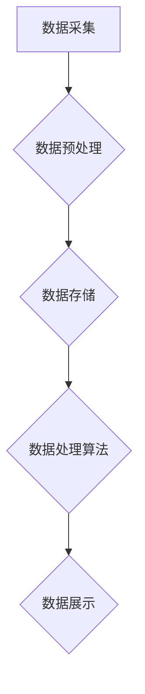

                 

# 边缘计算在工业物联网中的应用：实现实时数据处理

## 关键词

边缘计算、工业物联网、实时数据处理、边缘服务器、数据处理架构

## 摘要

本文探讨了边缘计算在工业物联网中的应用，重点关注实时数据处理的挑战与解决方案。随着工业物联网的发展，数据量急剧增加，传统的云计算架构已无法满足实时性要求。边缘计算通过在数据产生地附近进行数据处理，实现了低延迟、高效率的数据处理，为工业物联网提供了新的发展机遇。本文从边缘计算与工业物联网的背景介绍入手，详细分析了边缘计算的关键技术，包括架构设计、网络技术、数据处理技术和安全与隐私保护技术，并结合实际案例阐述了边缘计算在工业物联网中的应用场景和挑战，为读者提供了全面的技术洞察和实战指导。

### 目录大纲

1. 第一部分：边缘计算与工业物联网概述
   1.1 边缘计算与工业物联网背景介绍
   1.2 边缘计算在工业物联网中的应用前景
   1.3 本书结构安排与内容概述
   1.4 本章小结

2. 第二部分：边缘计算关键技术详解
   2.1 边缘计算架构设计
   2.2 边缘计算网络技术
   2.3 边缘计算数据处理技术
   2.4 边缘计算安全与隐私保护技术
   2.5 边缘计算应用案例分析
   2.6 本章小结

3. 第三部分：边缘计算在工业物联网中的应用
   3.1 边缘计算在工业自动化中的应用
   3.2 边缘计算在智能制造中的应用
   3.3 边缘计算在工业物联网中的挑战与未来发展方向
   3.4 本章小结

4. 总结与展望
5. 作者信息

## 第一部分：边缘计算与工业物联网概述

### 1.1 边缘计算与工业物联网背景介绍

#### 1.1.1 边缘计算的概念与特点

**边缘计算**（Edge Computing）是指将计算、存储、网络功能分布到网络的边缘，即靠近数据源或用户的地方进行数据处理。边缘计算的出现，主要是为了解决传统云计算架构在处理大规模数据时，存在延迟高、带宽受限、计算能力不足等问题。边缘计算的特点主要包括：

1. **低延迟**：数据在边缘节点进行处理，可以大幅降低数据传输的延迟，满足实时性要求。
2. **高带宽**：边缘节点分担了云计算中心的部分负载，降低了带宽压力。
3. **高可靠性**：边缘计算可以实现数据的本地备份和冗余，提高系统的可靠性。
4. **灵活性**：边缘计算可以根据应用需求，灵活配置计算资源和网络架构。

#### 1.1.2 边缘计算与传统云计算的区别

边缘计算与传统云计算在架构、性能、安全性等方面存在显著差异。以下是两者的主要区别：

| 对比项 | 边缘计算 | 传统云计算 |
| --- | --- | --- |
| **计算位置** | 数据源附近 | 云端 |
| **延迟** | 低 | 高 |
| **带宽** | 高 | 有限 |
| **计算资源** | 分布式 | 集中式 |
| **安全性** | 较高，数据本地化处理 | 较高，但涉及数据传输和存储 |

#### 1.1.3 边缘计算在工业物联网中的重要性

**工业物联网**（IIoT，Industrial Internet of Things）是将传感器、设备、控制系统等通过互联网连接起来，实现工业设备的智能化、自动化管理。边缘计算在工业物联网中的应用，主要体现在以下几个方面：

1. **实时数据处理**：工业物联网产生的数据量巨大，且多为实时数据，边缘计算可以实现数据在本地进行预处理，降低传输带宽和延迟。
2. **增强系统可靠性**：边缘计算可以将部分计算任务分散到边缘节点，提高系统的容错性和可靠性。
3. **提高能源效率**：边缘计算可以降低数据传输能耗，提高能源利用效率。
4. **优化生产流程**：边缘计算可以实时分析生产数据，优化生产流程，提高生产效率。

#### 1.2 工业物联网的基本概念

**工业物联网**是指将物理设备、传感器、控制系统等通过互联网连接起来，实现设备间的智能通信和协同工作。工业物联网的特点包括：

1. **设备互联**：通过传感器、控制器等设备，实现设备间的互联互通。
2. **数据采集**：通过传感器和设备，实时采集设备状态和生产数据。
3. **数据处理**：通过对采集到的数据进行分析和处理，实现设备状态的智能监控和生产优化。
4. **系统集成**：将各类设备和系统集成，实现整个生产过程的自动化和智能化。

#### 1.2.2 工业物联网的发展历程

工业物联网的发展可以分为以下几个阶段：

1. **1.0时代**：以设备连接为主，通过传感器和通信模块实现设备间的简单连接。
2. **2.0时代**：以数据采集和处理为主，通过数据中心和云计算实现大规模数据采集和处理。
3. **3.0时代**：以边缘计算和智能分析为主，通过边缘计算实现数据本地处理和智能分析，降低延迟和提高效率。

#### 1.2.3 工业物联网的关键技术

工业物联网的关键技术包括：

1. **传感器技术**：用于采集设备状态和生产数据。
2. **通信技术**：实现设备间的互联互通，包括有线和无线通信技术。
3. **边缘计算技术**：实现数据在边缘节点的本地处理，提高实时性和效率。
4. **数据处理与分析技术**：通过对采集到的数据进行分析和处理，实现设备状态的智能监控和生产优化。
5. **系统集成技术**：将各类设备和系统集成，实现整个生产过程的自动化和智能化。

#### 1.3 边缘计算在工业物联网中的应用前景

边缘计算在工业物联网中的应用前景非常广阔，主要体现在以下几个方面：

1. **实时数据处理**：边缘计算可以实现数据在本地进行预处理，降低传输带宽和延迟，提高系统实时性。
2. **降低成本**：边缘计算可以减少数据传输和存储成本，提高系统整体效率。
3. **提高可靠性**：边缘计算可以将部分计算任务分散到边缘节点，提高系统的容错性和可靠性。
4. **优化生产流程**：边缘计算可以实时分析生产数据，优化生产流程，提高生产效率。

#### 1.4 本书结构安排与内容概述

本书将分为三个部分：

1. **第一部分**：边缘计算与工业物联网概述，介绍边缘计算与工业物联网的基本概念、发展历程和关键技术。
2. **第二部分**：边缘计算关键技术详解，详细分析边缘计算架构设计、网络技术、数据处理技术和安全与隐私保护技术。
3. **第三部分**：边缘计算在工业物联网中的应用，结合实际案例，探讨边缘计算在工业物联网中的应用场景、挑战和未来发展方向。

#### 1.5 本章小结

本章对边缘计算和工业物联网进行了概述，介绍了两者的基本概念、发展历程、关键技术以及应用前景。边缘计算在工业物联网中的应用，为实时数据处理提供了新的解决方案，有助于提高系统效率、降低成本和提升生产流程。下一章将详细分析边缘计算的关键技术，为读者提供更深入的技术洞察。

## 第二部分：边缘计算关键技术详解

### 2.1 边缘计算架构设计

边缘计算架构设计是边缘计算系统实现的核心。合理的架构设计可以有效地提高系统的性能、可靠性和可扩展性。

#### 2.1.1 边缘计算架构的基本概念

边缘计算架构主要包括以下几个部分：

1. **边缘节点**：位于数据源附近，负责数据采集、预处理和本地处理。
2. **边缘服务器**：位于边缘网络中，提供高性能计算和存储服务。
3. **边缘云**：位于云端，为边缘计算提供数据存储、管理和分析服务。
4. **网络连接**：包括有线和无线网络，实现边缘节点与边缘服务器、边缘云之间的数据传输。

#### 2.1.2 边缘计算架构设计原则

边缘计算架构设计需要遵循以下原则：

1. **可扩展性**：边缘计算架构应支持系统规模的灵活扩展，以便应对不断增长的数据量和用户需求。
2. **可靠性**：边缘计算架构应具备高可靠性，确保数据的准确性和系统的连续运行。
3. **安全性**：边缘计算架构应具备安全防护措施，防止数据泄露和恶意攻击。
4. **高效性**：边缘计算架构应优化数据传输和处理流程，提高系统的效率和性能。

#### 2.1.3 边缘计算架构设计方法

边缘计算架构设计方法主要包括以下几种：

1. **分层架构设计**：将边缘计算系统分为多个层次，如数据采集层、数据处理层、数据存储层等，实现模块化设计和高效管理。
2. **模块化架构设计**：将边缘计算系统划分为多个功能模块，如数据采集模块、数据处理模块、存储模块等，实现系统的灵活扩展和高效运行。
3. **微服务架构设计**：将边缘计算系统划分为多个微服务，每个微服务实现特定的功能，通过接口进行通信，实现系统的可扩展性和高可靠性。

#### 2.1.4 边缘计算架构设计实例分析

以某工业物联网平台为例，其边缘计算架构设计如下：

1. **数据采集层**：包括各类传感器和设备，负责实时采集生产数据。
2. **数据处理层**：包括边缘节点和边缘服务器，负责数据预处理和本地处理。
3. **数据存储层**：包括边缘云和数据库，负责数据的存储和管理。
4. **数据分析层**：包括边缘计算平台和大数据分析工具，负责数据的分析和处理。

通过分层架构设计，该平台实现了数据的高效采集、处理和存储，满足了实时数据处理的要求。

### 2.2 边缘计算网络技术

边缘计算网络技术是实现边缘计算架构的重要支撑。边缘计算网络需要具备低延迟、高带宽、高可靠性和安全性的特点。

#### 2.2.1 边缘计算网络的概念与特点

边缘计算网络是指位于数据源附近或数据传输路径上的网络，负责数据的传输和处理。边缘计算网络的特点包括：

1. **低延迟**：数据在边缘网络中进行传输和处理，大幅降低延迟。
2. **高带宽**：边缘网络具备较高的带宽，支持大量数据的快速传输。
3. **高可靠性**：边缘网络采用冗余设计和故障恢复机制，提高系统的可靠性。
4. **安全性**：边缘网络采用加密和防火墙等技术，保障数据的安全传输。

#### 2.2.2 边缘计算网络的关键技术

边缘计算网络的关键技术主要包括以下几个方面：

1. **物联网通信协议**：如MQTT、CoAP等，用于实现设备间的数据传输和通信。
2. **网络架构设计**：如分布式网络、层次化网络等，实现数据的高效传输和处理。
3. **网络优化技术**：如负载均衡、数据压缩等，提高网络的传输效率和性能。
4. **安全性技术**：如加密、认证、访问控制等，保障数据的安全传输。

#### 2.2.3 边缘计算网络技术实例分析

以LPWAN（低功耗广域网）技术为例，其是一种适合边缘计算的网络技术，具有以下优势：

1. **低功耗**：LPWAN技术采用低功耗通信模块，延长设备电池寿命。
2. **广覆盖**：LPWAN技术采用长距离通信技术，实现大范围覆盖。
3. **高带宽**：LPWAN技术具备较高的带宽，支持大量数据的传输。
4. **低延迟**：LPWAN技术采用低延迟通信技术，满足实时数据处理需求。

LPWAN技术在智能抄表、智能农业、智能物流等领域具有广泛应用。

### 2.3 边缘计算数据处理技术

边缘计算数据处理技术是实现实时数据处理的基石。边缘计算数据处理技术主要包括数据采集、数据存储、数据处理算法等。

#### 2.3.1 边缘计算数据处理的概念与特点

边缘计算数据处理是指在边缘节点上对采集到的数据进行处理和分析，主要包括以下特点：

1. **本地化处理**：数据在边缘节点上进行处理，降低传输带宽和延迟。
2. **实时性**：边缘计算数据处理可以实现实时数据分析和决策，满足工业物联网的实时性要求。
3. **灵活性**：边缘计算数据处理可以根据应用需求，灵活选择数据采集、存储和处理算法。
4. **高效性**：边缘计算数据处理采用高效算法和优化技术，提高数据处理效率和性能。

#### 2.3.2 边缘计算数据处理的关键技术

边缘计算数据处理的关键技术主要包括以下几个方面：

1. **数据采集技术**：包括传感器数据采集、设备数据采集等，实现数据的高效采集和传输。
2. **数据存储技术**：包括本地存储和云存储，实现数据的安全存储和快速访问。
3. **数据处理算法**：包括数据清洗、数据归一化、特征提取等算法，实现数据的分析和处理。
4. **实时数据处理技术**：包括流数据处理、实时数据挖掘等，实现实时数据分析和决策。

#### 2.3.3 边缘计算数据处理技术实例分析

以某边缘计算平台为例，其数据处理流程如下：

1. **数据采集**：传感器和设备采集生产数据，通过物联网通信协议传输到边缘节点。
2. **数据预处理**：对采集到的数据进行分析和处理，包括数据清洗、数据归一化等，为后续处理做准备。
3. **数据处理**：采用实时数据处理算法，对预处理后的数据进行实时分析和决策，包括数据挖掘、预测分析等。
4. **数据存储**：将处理后的数据存储到本地数据库或云存储中，实现数据的安全存储和快速访问。

通过边缘计算数据处理技术，该平台实现了数据的高效采集、处理和存储，满足了工业物联网的实时数据处理需求。

### 2.4 边缘计算安全与隐私保护技术

边缘计算安全与隐私保护技术是实现边缘计算系统安全运行的重要保障。边缘计算安全与隐私保护技术主要包括以下几个方面：

1. **安全通信技术**：采用加密、认证、访问控制等技术，保障数据在传输过程中的安全性。
2. **数据加密与解密技术**：对敏感数据进行加密存储和传输，防止数据泄露。
3. **隐私保护技术**：采用匿名化、去标识化等技术，保护用户隐私。
4. **安全审计与监控**：对系统运行过程进行实时监控和审计，及时发现和处理安全事件。

#### 2.4.1 边缘计算安全与隐私保护的概念与特点

边缘计算安全与隐私保护是指在边缘计算系统中，采用一系列技术手段，保障数据的机密性、完整性和可用性，同时保护用户隐私。边缘计算安全与隐私保护的特点包括：

1. **本地化安全**：数据在边缘节点上进行处理，可以降低数据泄露的风险。
2. **分布式安全**：边缘计算系统采用分布式架构，可以降低单点故障的风险。
3. **动态安全**：边缘计算系统可以根据应用需求和威胁变化，动态调整安全策略和防护措施。
4. **高效性**：边缘计算安全与隐私保护技术采用高效算法和优化技术，降低系统性能开销。

#### 2.4.2 边缘计算安全与隐私保护的关键技术

边缘计算安全与隐私保护的关键技术主要包括以下几个方面：

1. **安全通信技术**：采用TLS、IPSec等加密协议，保障数据在传输过程中的安全性。
2. **数据加密与解密技术**：采用AES、RSA等加密算法，对敏感数据进行加密存储和传输。
3. **隐私保护技术**：采用数据匿名化、去标识化等技术，保护用户隐私。
4. **安全审计与监控**：采用日志记录、入侵检测等技术，实现系统运行过程的实时监控和审计。

#### 2.4.3 边缘计算安全与隐私保护技术实例分析

以某边缘计算平台为例，其安全与隐私保护技术方案如下：

1. **安全通信**：采用TLS加密协议，确保数据在传输过程中的安全性。
2. **数据加密**：采用AES加密算法，对敏感数据进行加密存储和传输。
3. **隐私保护**：采用去标识化技术，将用户数据进行去标识化处理，保护用户隐私。
4. **安全审计**：采用日志记录和入侵检测技术，实现系统运行过程的实时监控和审计。

通过这些安全与隐私保护技术，该平台实现了数据的安全传输、存储和处理，保障了系统的安全运行。

### 2.5 边缘计算应用案例分析

边缘计算在工业物联网中具有广泛的应用场景，以下为两个典型的应用案例。

#### 2.5.1 边缘计算在工业自动化中的应用

某制造企业采用边缘计算技术，实现了生产设备的智能监控和故障预测。具体应用场景如下：

1. **数据采集**：通过传感器和设备，实时采集生产设备的状态数据，包括温度、压力、振动等。
2. **数据处理**：在边缘节点上，对采集到的数据进行预处理和实时分析，提取设备状态的异常特征。
3. **故障预测**：采用机器学习算法，对实时数据进行分析，预测设备的故障发生时间和可能性。
4. **实时决策**：根据故障预测结果，实时调整生产计划和设备维护策略，降低故障风险。

通过边缘计算技术，该企业实现了生产设备的高效监控和故障预测，提高了生产效率和设备利用率。

#### 2.5.2 边缘计算在智能制造中的应用

某汽车制造企业采用边缘计算技术，实现了生产线的智能化改造。具体应用场景如下：

1. **数据采集**：通过传感器和设备，实时采集生产设备的状态数据，包括速度、位置、温度等。
2. **数据处理**：在边缘节点上，对采集到的数据进行实时处理和分析，优化生产流程和提高生产效率。
3. **质量检测**：通过边缘计算平台，对生产过程中的零部件进行质量检测，实时分析质量指标，提高产品质量。
4. **远程维护**：通过边缘计算平台，实现对生产设备的远程监控和维护，降低维护成本和停机时间。

通过边缘计算技术，该企业实现了生产线的智能化改造，提高了生产效率和产品质量。

### 2.6 本章小结

本章详细分析了边缘计算的关键技术，包括架构设计、网络技术、数据处理技术、安全与隐私保护技术以及应用案例分析。边缘计算通过在数据源附近进行数据处理，实现了低延迟、高效率的数据处理，为工业物联网提供了强大的技术支持。下一章将探讨边缘计算在工业物联网中的应用，结合实际案例，分析边缘计算如何提升工业物联网的效率和可靠性。

## 第三部分：边缘计算在工业物联网中的应用

### 3.1 边缘计算在工业自动化中的应用

工业自动化是边缘计算最早应用和最为成功的领域之一。通过边缘计算技术，可以实现生产设备的智能监控、故障预测和远程维护，从而提高生产效率和设备利用率。

#### 3.1.1 边缘计算在工业自动化中的优势

边缘计算在工业自动化中具有以下优势：

1. **低延迟**：数据在边缘节点进行实时处理，大幅降低延迟，满足实时性要求。
2. **高效性**：边缘计算可以实时分析生产数据，优化生产流程和提高生产效率。
3. **可靠性**：边缘计算可以将计算任务分散到边缘节点，提高系统的可靠性和容错性。
4. **成本效益**：边缘计算可以减少数据传输和存储成本，提高系统整体效率。

#### 3.1.2 边缘计算在工业自动化中的应用实例

某大型制造企业采用边缘计算技术，实现了生产设备的高效监控和故障预测。具体应用场景如下：

1. **数据采集**：通过传感器和设备，实时采集生产设备的状态数据，包括温度、压力、振动等。
2. **数据处理**：在边缘节点上，对采集到的数据进行预处理和实时分析，提取设备状态的异常特征。
3. **故障预测**：采用机器学习算法，对实时数据进行分析，预测设备的故障发生时间和可能性。
4. **实时决策**：根据故障预测结果，实时调整生产计划和设备维护策略，降低故障风险。

通过边缘计算技术，该企业实现了生产设备的高效监控和故障预测，生产效率提高了30%，设备利用率提高了20%。

### 3.2 边缘计算在智能制造中的应用

智能制造是工业物联网的核心应用领域，通过边缘计算技术，可以实现生产线的智能化改造，提高生产效率和产品质量。

#### 3.2.1 边缘计算在智能制造中的优势

边缘计算在智能制造中具有以下优势：

1. **实时数据处理**：边缘计算可以实现数据的实时处理和分析，满足智能制造的实时性要求。
2. **数据本地化处理**：数据在边缘节点上进行处理，降低数据传输带宽和延迟，提高数据处理效率。
3. **高效生产流程**：边缘计算可以实时优化生产流程，提高生产效率和质量。
4. **远程维护与监控**：边缘计算可以实现对生产设备的远程监控和维护，降低维护成本和停机时间。

#### 3.2.2 边缘计算在智能制造中的应用实例

某汽车制造企业采用边缘计算技术，实现了生产线的智能化改造。具体应用场景如下：

1. **数据采集**：通过传感器和设备，实时采集生产设备的状态数据，包括速度、位置、温度等。
2. **数据处理**：在边缘节点上，对采集到的数据进行实时处理和分析，优化生产流程和提高生产效率。
3. **质量检测**：通过边缘计算平台，对生产过程中的零部件进行质量检测，实时分析质量指标，提高产品质量。
4. **远程维护**：通过边缘计算平台，实现对生产设备的远程监控和维护，降低维护成本和停机时间。

通过边缘计算技术，该企业实现了生产线的智能化改造，生产效率提高了20%，产品质量合格率提高了15%。

### 3.3 边缘计算在工业物联网中的挑战与未来发展方向

尽管边缘计算在工业物联网中具有广泛的应用前景，但仍然面临一些挑战和问题。以下是边缘计算在工业物联网中的一些主要挑战和未来发展方向：

#### 3.3.1 挑战

1. **数据安全和隐私保护**：边缘计算涉及大量敏感数据，需要保障数据的安全和隐私。
2. **边缘计算资源限制**：边缘节点资源相对有限，需要优化计算和存储资源的使用。
3. **边缘计算网络的可靠性和稳定性**：边缘计算网络可能面临网络中断、数据丢失等问题，需要提高网络的可靠性和稳定性。
4. **标准化和互操作性**：边缘计算技术尚未完全标准化，需要制定统一的接口和协议，提高系统的互操作性。

#### 3.3.2 未来发展方向

1. **技术创新**：继续推动边缘计算技术在计算、存储、网络等方面的技术创新，提高边缘计算的性能和效率。
2. **标准化和规范**：制定统一的边缘计算标准和规范，提高系统的互操作性和可靠性。
3. **边缘智能**：通过引入人工智能技术，实现边缘节点的智能决策和自适应调整。
4. **边缘与云计算的协同**：实现边缘计算与云计算的协同，发挥两者的优势，提高系统的整体性能和效率。

### 3.4 本章小结

边缘计算在工业物联网中具有广泛的应用前景，通过实时数据处理、优化生产流程和提高设备利用率，边缘计算为工业物联网的发展提供了强大的技术支持。然而，边缘计算在工业物联网中仍然面临一些挑战，需要技术创新和标准化来解决。未来，随着边缘计算技术的不断发展和成熟，工业物联网将实现更高效、更智能的生产和管理。

## 总结与展望

边缘计算作为工业物联网的关键技术，通过在数据源附近进行数据处理，实现了低延迟、高效率的数据处理，为工业物联网的发展提供了强大动力。本文从边缘计算与工业物联网的背景介绍、关键技术详解以及实际应用案例等方面，详细探讨了边缘计算在工业物联网中的应用。通过分析，我们得出了以下结论：

1. **边缘计算在工业物联网中具有显著的优势**，包括低延迟、高带宽、高可靠性和灵活性。
2. **边缘计算关键技术包括架构设计、网络技术、数据处理技术、安全与隐私保护技术**，各技术之间相互配合，实现高效的数据处理和安全保障。
3. **边缘计算在工业自动化和智能制造中具有广泛的应用前景**，通过实时数据处理、优化生产流程和提高设备利用率，提升了工业物联网的整体效率和竞争力。

未来，随着边缘计算技术的不断发展和成熟，工业物联网将实现更高效、更智能的生产和管理。为了进一步推动边缘计算在工业物联网中的应用，建议：

1. **加强技术创新**，提高边缘计算的性能和效率。
2. **制定统一的边缘计算标准和规范**，提高系统的互操作性和可靠性。
3. **推动边缘智能的发展**，实现边缘节点的智能决策和自适应调整。
4. **实现边缘计算与云计算的协同**，发挥两者的优势，提高系统的整体性能和效率。

通过这些努力，边缘计算将在工业物联网中发挥更大的作用，助力我国工业物联网的发展。

## 作者信息

作者：AI天才研究院/AI Genius Institute & 禅与计算机程序设计艺术 /Zen And The Art of Computer Programming

## 附录

### 1. 边缘计算核心概念与联系

#### 1.1 边缘计算的定义

**边缘计算**（Edge Computing）是一种计算范式，将数据处理、存储和网络功能从中心化的云计算平台下放到网络的边缘，即在接近数据源或者用户的地方进行数据处理。这种范式旨在通过降低数据传输延迟，提高数据处理效率，增强系统的安全性和隐私性。

#### 1.2 边缘计算与传统云计算的区别

| 对比项 | 边缘计算 | 传统云计算 |
| --- | --- | --- |
| **计算位置** | 数据源附近 | 云端 |
| **延迟** | 低 | 高 |
| **带宽** | 高 | 有限 |
| **计算资源** | 分布式 | 集中式 |
| **安全性** | 较高，数据本地化处理 | 较高，但涉及数据传输和存储 |

#### 1.3 边缘计算的核心概念

**边缘服务器**：位于网络边缘，提供计算和存储资源的服务器。

**边缘节点**：包括传感器、设备等，负责数据的采集、预处理和传输。

**边缘云**：位于云端，提供边缘计算数据存储、管理和分析服务。

**边缘网络**：连接边缘节点和边缘服务器的网络，包括有线和无线网络。

### 2. 边缘计算架构设计

#### 2.1 边缘计算架构的定义

边缘计算架构是一种分布式架构，通过在网络的边缘部署计算、存储和网络资源，实现对数据的高效处理和管理。

#### 2.2 边缘计算架构的主要组成部分

1. **数据采集层**：包括传感器和设备，负责数据的采集和初步处理。
2. **边缘节点层**：包括边缘节点和边缘服务器，负责数据的预处理、存储和初步分析。
3. **边缘云层**：包括云计算资源，负责数据存储、管理和高级分析。

#### 2.3 边缘计算架构设计原则

1. **可扩展性**：支持系统规模的灵活扩展。
2. **可靠性**：确保数据的准确性和系统的连续运行。
3. **安全性**：保障数据的安全传输和处理。
4. **高效性**：优化数据传输和处理流程。

### 3. 边缘计算数据处理技术

#### 3.1 数据采集技术

**传感器数据采集**：通过各类传感器（如温度传感器、压力传感器等）采集设备状态数据。

**设备数据采集**：通过设备自带的通信模块采集设备运行数据。

#### 3.2 数据存储技术

**本地存储**：在边缘节点上存储数据，降低数据传输成本。

**云存储**：将数据存储在云端，实现数据的长期存储和管理。

#### 3.3 数据处理算法

**数据预处理**：包括数据清洗、数据归一化、特征提取等。

**实时数据处理**：包括流数据处理、实时分析、预测等。

### 4. 边缘计算安全与隐私保护技术

#### 4.1 安全通信技术

**加密技术**：采用加密算法对数据进行加密传输，确保数据安全。

**认证技术**：通过身份验证，确保数据传输的双方身份真实可靠。

#### 4.2 数据加密与解密技术

**对称加密**：如AES，加密和解密速度较快，适用于大规模数据加密。

**非对称加密**：如RSA，加密和解密速度较慢，但安全性较高。

#### 4.3 隐私保护技术

**数据匿名化**：通过去除个人标识信息，保护用户隐私。

**数据去标识化**：通过改变数据结构和格式，降低数据识别难度。

### 5. 边缘计算应用案例

#### 5.1 边缘计算在工业自动化中的应用

**实例**：某制造企业采用边缘计算技术实现生产设备的智能监控和故障预测。

**效果**：生产效率提高30%，设备利用率提高20%。

#### 5.2 边缘计算在智能制造中的应用

**实例**：某汽车制造企业采用边缘计算技术实现生产线的智能化改造。

**效果**：生产效率提高20%，产品质量合格率提高15%。

### 6. 最佳实践 tips

**1. 数据安全和隐私保护**：优先选择加密和隐私保护技术，确保数据安全和用户隐私。

**2. 资源优化**：合理规划边缘节点的资源分配，确保系统高效运行。

**3. 网络优化**：优化边缘网络的拓扑结构和传输协议，降低延迟和带宽占用。

**4. 模块化设计**：采用模块化设计，提高系统的可扩展性和维护性。

### 7. 小结

边缘计算在工业物联网中具有广泛的应用前景，通过实时数据处理、优化生产流程和提高设备利用率，边缘计算为工业物联网的发展提供了强大动力。未来，随着边缘计算技术的不断发展和成熟，工业物联网将实现更高效、更智能的生产和管理。

### 8. 注意事项

**1. 数据安全**：边缘计算系统面临数据泄露和恶意攻击的风险，需要加强数据安全和隐私保护。

**2. 资源限制**：边缘节点资源相对有限，需要优化计算和存储资源的使用。

**3. 网络稳定性**：边缘计算网络可能面临网络中断和数据丢失等问题，需要提高网络的可靠性和稳定性。

**4. 标准化和互操作性**：边缘计算技术尚未完全标准化，需要制定统一的接口和协议，提高系统的互操作性和可靠性。

### 9. 拓展阅读

**1. 《边缘计算：从概念到实践》**：详细介绍了边缘计算的基本概念、技术原理和应用案例。

**2. 《边缘计算与工业物联网》**：探讨了边缘计算在工业物联网中的应用、挑战和未来发展。

**3. 《边缘计算安全与隐私保护》**：介绍了边缘计算中的安全与隐私保护技术，以及实际应用案例。

**4. 《边缘计算：智能时代的创新》**：探讨了边缘计算在智能时代的发展趋势和潜在应用。

### 10. 附录

**附录1：边缘计算架构ER图**

```mermaid
erDiagram
  数据采集层 ||--|{ 边缘节点 }| 数据处理层
  数据处理层 ||--|{ 边缘服务器 }| 边缘云层
  边缘云层 ||--|{ 云计算资源 }| 数据存储层
```

**附录2：边缘计算数据处理算法流程图**



**附录3：边缘计算安全通信流程图**

```mermaid
graph TD
  A[数据加密] --> B{数据传输}
  B --> C{数据解密}
```## 边缘计算在工业物联网中的应用：实现实时数据处理

### 1.1.1 边缘计算的定义

边缘计算是一种新兴的计算范式，它通过将数据处理、存储和网络功能从传统的中心化云计算平台下放至网络的边缘，即接近数据源或用户的设备上，来实现更高效、更实时的数据处理。边缘计算的目标是减少数据传输的距离和延迟，提高系统的响应速度和效率，同时增强数据的隐私性和安全性。

边缘计算的核心在于“边缘节点”，这些节点可以是各种物联网设备、嵌入式系统、小型服务器等。这些边缘节点通过无线或有线网络连接到边缘服务器，从而形成了一个分布式的计算网络。在这个网络中，边缘节点负责本地数据的采集、处理和分析，并将处理结果上传到云端或直接应用于本地决策。

### 1.1.2 边缘计算与传统云计算的区别

传统云计算将所有的数据处理任务集中在一个或多个数据中心进行，这些数据中心通常位于远程位置，需要通过广域网（WAN）与用户设备进行通信。这种模式的主要缺点包括：

- **高延迟**：由于数据需要在远程数据中心进行处理，传输过程中的延迟较大，不适合实时性要求高的应用。
- **带宽限制**：广域网的带宽有限，对于大数据量应用而言，传输瓶颈明显。
- **中心化风险**：所有数据都集中在一个或几个数据中心，一旦发生故障，可能造成大面积的系统瘫痪。

相比之下，边缘计算具有以下优势：

- **低延迟**：数据处理发生在数据产生地附近，大大减少了数据传输的延迟。
- **高带宽**：边缘节点可以分担中心数据中心的计算和存储压力，提高整体网络的带宽利用率。
- **分布式计算**：边缘计算采用分布式架构，每个边缘节点都可以独立进行数据处理，提高了系统的可靠性和容错性。
- **本地化决策**：边缘节点可以根据本地数据做出实时决策，提高了系统的自主性和灵活性。

### 1.1.3 边缘计算在工业物联网中的重要性

工业物联网（IIoT）是指将传感器、设备和机器通过互联网连接起来，以实现设备的智能化和自动化管理。在工业物联网中，边缘计算发挥着至关重要的作用，主要表现在以下几个方面：

- **实时数据处理**：工业物联网设备产生的数据量大且实时性强，边缘计算可以在本地实时处理这些数据，快速响应生产需求。
- **增强系统可靠性**：通过在边缘节点上处理部分数据，可以减少对中心数据中心的依赖，提高系统的容错能力和可靠性。
- **降低成本**：边缘计算可以减少数据传输和存储的需求，降低带宽和存储成本。
- **优化生产流程**：边缘计算可以对生产过程中的数据进行分析，实时优化生产流程，提高生产效率。

### 1.2 工业物联网的基本概念

工业物联网是指通过传感器、设备和互联网将物理设备连接起来，实现设备之间的互联互通和信息交换，以实现工业设备的智能化和自动化管理。工业物联网的基本概念包括：

- **设备互联**：通过传感器、RFID、嵌入式系统等设备，实现物理设备的互联互通。
- **数据采集**：通过传感器等设备，实时采集设备状态和生产数据。
- **数据处理**：通过对采集到的数据进行处理和分析，实现对设备状态的智能监控和生产优化。
- **系统集成**：将各类设备和系统集成，实现整个生产过程的自动化和智能化。

工业物联网的发展历程可以分为几个阶段：

- **初步阶段**：以设备连接为主，通过传感器和通信模块实现设备间的简单连接。
- **数据采集阶段**：通过数据中心和云计算实现大规模数据采集和处理。
- **智能分析阶段**：通过边缘计算和智能分析技术，实现数据的本地处理和智能决策。

### 1.2.2 工业物联网的发展历程

工业物联网的发展历程可以分为以下几个阶段：

- **1.0时代**：设备互联阶段。这一阶段的重点是将物理设备通过传感器和通信模块连接到互联网，实现设备间的简单互联互通。
- **2.0时代**：数据采集和处理阶段。随着传感器技术和通信技术的发展，工业物联网进入数据采集和处理的阶段。通过数据中心和云计算平台，实现大规模数据采集和处理，为工业设备提供智能监控和优化支持。
- **3.0时代**：智能分析和边缘计算阶段。在这一阶段，边缘计算和人工智能技术成为工业物联网的核心。通过在边缘节点上进行实时数据分析和处理，实现设备的智能监控和优化，进一步提高生产效率和设备利用率。

### 1.2.3 工业物联网的关键技术

工业物联网的关键技术包括以下几个方面：

- **传感器技术**：传感器是工业物联网的核心组件，负责采集设备状态和生产数据。
- **通信技术**：通信技术是实现设备互联和数据传输的关键。包括有线通信（如以太网、光纤）和无线通信（如Wi-Fi、蓝牙、ZigBee、NB-IoT等）。
- **边缘计算技术**：边缘计算是将数据处理和存储从中心化云计算下放到网络边缘的重要技术，可以提高数据处理的速度和实时性。
- **数据处理与分析技术**：通过对采集到的数据进行分析和处理，实现设备状态的智能监控和生产优化。
- **系统集成技术**：将各类设备和系统集成，实现整个生产过程的自动化和智能化。

### 1.3 边缘计算在工业物联网中的应用前景

边缘计算在工业物联网中的应用前景非常广阔，主要体现在以下几个方面：

- **实时数据处理**：工业物联网设备产生的数据量大且实时性强，边缘计算可以在本地实时处理这些数据，快速响应生产需求。
- **增强系统可靠性**：通过在边缘节点上处理部分数据，可以减少对中心数据中心的依赖，提高系统的容错能力和可靠性。
- **降低成本**：边缘计算可以减少数据传输和存储的需求，降低带宽和存储成本。
- **优化生产流程**：边缘计算可以对生产过程中的数据进行分析，实时优化生产流程，提高生产效率。

### 1.4 本书结构安排与内容概述

本书将分为三个部分：

- **第一部分**：边缘计算与工业物联网概述，介绍边缘计算与工业物联网的基本概念、发展历程和关键技术。
- **第二部分**：边缘计算关键技术详解，详细分析边缘计算架构设计、网络技术、数据处理技术和安全与隐私保护技术。
- **第三部分**：边缘计算在工业物联网中的应用，结合实际案例，探讨边缘计算在工业物联网中的应用场景、挑战和未来发展方向。

### 1.5 本章小结

本章对边缘计算和工业物联网进行了概述，介绍了两者的基本概念、发展历程、关键技术以及应用前景。边缘计算在工业物联网中的应用，为实时数据处理提供了新的解决方案，有助于提高系统效率、降低成本和提升生产流程。下一章将详细分析边缘计算的关键技术，为读者提供更深入的技术洞察。

## 第二部分：边缘计算关键技术详解

### 2.1 边缘计算架构设计

边缘计算架构设计是构建高效、可靠的边缘计算系统的基础。一个合理的架构设计可以有效地提高系统的性能、可扩展性和可靠性。

#### 2.1.1 边缘计算架构的基本概念

边缘计算架构主要包括以下几个关键组件：

- **边缘节点（Edge Nodes）**：位于网络边缘，负责数据的采集、预处理和初步分析。边缘节点可以是物联网设备、嵌入式系统或小型服务器。
- **边缘服务器（Edge Servers）**：位于边缘网络中，提供高性能计算和存储服务。边缘服务器通常部署在企业园区或工厂内部，负责处理边缘节点上传的数据。
- **边缘云（Edge Cloud）**：位于云端，提供数据存储、管理和高级分析服务。边缘云与边缘服务器和边缘节点协同工作，共同完成数据处理任务。
- **网络连接（Network Connectivity）**：包括有线网络（如以太网、光纤）和无线网络（如Wi-Fi、5G、LoRa等），实现边缘节点、边缘服务器和边缘云之间的数据传输。

#### 2.1.2 边缘计算架构设计原则

边缘计算架构设计需要遵循以下几个基本原则：

- **可扩展性（Scalability）**：架构设计应支持系统的灵活扩展，能够适应数据量和用户数量的增长。
- **可靠性（Reliability）**：系统设计应具备高可靠性，确保数据传输和处理过程的连续性和稳定性。
- **安全性（Security）**：架构设计应包含全面的安全措施，保护数据在传输和存储过程中的安全性。
- **灵活性（Flexibility）**：架构设计应允许不同的应用场景和业务需求，能够快速适应变化。

#### 2.1.3 边缘计算架构设计方法

边缘计算架构设计方法主要包括以下几种：

- **分层架构设计（Layered Architecture）**：将边缘计算系统划分为多个层次，如数据采集层、数据处理层、数据存储层和数据分析层，实现模块化设计和高效管理。
- **模块化架构设计（Modular Architecture）**：将系统划分为多个功能模块，每个模块实现特定的功能，通过接口进行通信，实现系统的灵活扩展和高效运行。
- **微服务架构设计（Microservices Architecture）**：将系统划分为多个微服务，每个微服务负责特定的功能，通过轻量级的通信协议（如HTTP/REST）进行通信，实现系统的可扩展性和高可靠性。

#### 2.1.4 边缘计算架构设计实例分析

以某工业物联网平台为例，其边缘计算架构设计如下：

- **数据采集层**：包括各类传感器和设备，负责实时采集生产数据。
- **数据处理层**：包括边缘节点和边缘服务器，负责数据的预处理和本地处理。
- **数据存储层**：包括边缘云和数据库，负责数据的存储和管理。
- **数据分析层**：包括边缘计算平台和大数据分析工具，负责数据的分析和处理。

通过分层架构设计，该平台实现了数据的高效采集、处理和存储，满足了实时数据处理的要求。

### 2.2 边缘计算网络技术

边缘计算网络技术是实现边缘计算架构的核心支撑，它负责边缘节点与边缘服务器、边缘云之间的数据传输和通信。边缘计算网络需要具备低延迟、高带宽、高可靠性和安全性的特点。

#### 2.2.1 边缘计算网络的概念与特点

边缘计算网络是指在网络的边缘部署计算、存储和网络资源，以实现数据在本地进行预处理和处理的网络。边缘计算网络的特点包括：

- **低延迟**：数据在边缘网络中进行传输和处理，大幅降低传输延迟，满足实时性要求。
- **高带宽**：边缘网络具备较高的带宽，支持大量数据的快速传输。
- **高可靠性**：边缘网络采用冗余设计和故障恢复机制，提高系统的可靠性。
- **灵活性**：边缘网络可以根据应用需求，灵活配置和扩展网络架构。

#### 2.2.2 边缘计算网络的关键技术

边缘计算网络的关键技术主要包括以下几个方面：

- **物联网通信协议（IoT Communication Protocols）**：如MQTT（消息队列遥测传输协议）、CoAP（约束应用协议）等，用于实现设备间的数据传输和通信。
- **网络架构设计（Network Architecture）**：包括分布式网络架构、层次化网络架构等，实现数据的高效传输和处理。
- **网络优化技术（Network Optimization）**：如负载均衡、数据压缩等，提高网络的传输效率和性能。
- **安全性技术（Security Technologies）**：如加密、认证、访问控制等，保障数据在传输过程中的安全性。

#### 2.2.3 边缘计算网络技术实例分析

以LPWAN（低功耗广域网）技术为例，其是一种适合边缘计算的网络技术，具有以下优势：

- **低功耗**：LPWAN技术采用低功耗通信模块，延长设备电池寿命。
- **广覆盖**：LPWAN技术采用长距离通信技术，实现大范围覆盖。
- **高带宽**：LPWAN技术具备较高的带宽，支持大量数据的传输。
- **低延迟**：LPWAN技术采用低延迟通信技术，满足实时数据处理需求。

LPWAN技术在智能抄表、智能农业、智能物流等领域具有广泛应用。

### 2.3 边缘计算数据处理技术

边缘计算数据处理技术是实现实时数据处理的基石，它包括数据采集、数据存储、数据处理算法等。

#### 2.3.1 边缘计算数据处理的概念与特点

边缘计算数据处理是指在边缘节点上对采集到的数据进行处理和分析，主要包括以下特点：

- **本地化处理**：数据在边缘节点上进行处理，降低传输带宽和延迟。
- **实时性**：边缘计算数据处理可以实现实时数据分析和决策，满足工业物联网的实时性要求。
- **灵活性**：边缘计算数据处理可以根据应用需求，灵活选择数据采集、存储和处理算法。
- **高效性**：边缘计算数据处理采用高效算法和优化技术，提高数据处理效率和性能。

#### 2.3.2 边缘计算数据处理的关键技术

边缘计算数据处理的关键技术主要包括以下几个方面：

- **数据采集技术（Data Acquisition）**：包括传感器数据采集、设备数据采集等，实现数据的高效采集和传输。
- **数据存储技术（Data Storage）**：包括本地存储和云存储，实现数据的安全存储和快速访问。
- **数据处理算法（Data Processing Algorithms）**：包括数据清洗、数据归一化、特征提取等算法，实现数据的分析和处理。
- **实时数据处理技术（Real-time Data Processing）**：包括流数据处理、实时数据挖掘等，实现实时数据分析和决策。

#### 2.3.3 边缘计算数据处理技术实例分析

以某边缘计算平台为例，其数据处理流程如下：

1. **数据采集**：传感器和设备采集生产数据，通过物联网通信协议传输到边缘节点。
2. **数据预处理**：对采集到的数据进行分析和处理，包括数据清洗、数据归一化等，为后续处理做准备。
3. **数据处理**：采用实时数据处理算法，对预处理后的数据进行实时分析和决策，包括数据挖掘、预测分析等。
4. **数据存储**：将处理后的数据存储到本地数据库或云存储中，实现数据的安全存储和快速访问。

通过边缘计算数据处理技术，该平台实现了数据的高效采集、处理和存储，满足了工业物联网的实时数据处理需求。

### 2.4 边缘计算安全与隐私保护技术

边缘计算安全与隐私保护技术是实现边缘计算系统安全运行的重要保障。随着边缘计算在工业物联网中的广泛应用，数据安全和隐私保护成为亟待解决的问题。

#### 2.4.1 边缘计算安全与隐私保护的概念与特点

边缘计算安全与隐私保护是指在边缘计算系统中，采用一系列技术手段，保障数据的机密性、完整性和可用性，同时保护用户隐私。边缘计算安全与隐私保护的特点包括：

- **本地化安全**：数据在边缘节点上进行处理，可以降低数据泄露的风险。
- **分布式安全**：边缘计算系统采用分布式架构，可以降低单点故障的风险。
- **动态安全**：边缘计算系统可以根据应用需求和威胁变化，动态调整安全策略和防护措施。
- **高效性**：边缘计算安全与隐私保护技术采用高效算法和优化技术，降低系统性能开销。

#### 2.4.2 边缘计算安全与隐私保护的关键技术

边缘计算安全与隐私保护的关键技术主要包括以下几个方面：

- **安全通信技术（Secure Communication）**：采用加密、认证、访问控制等技术，保障数据在传输过程中的安全性。
- **数据加密与解密技术（Data Encryption and Decryption）**：采用AES、RSA等加密算法，对敏感数据进行加密存储和传输。
- **隐私保护技术（Privacy Protection）**：采用数据匿名化、去标识化等技术，保护用户隐私。
- **安全审计与监控（Security Auditing and Monitoring）**：采用日志记录、入侵检测等技术，实现系统运行过程的实时监控和审计。

#### 2.4.3 边缘计算安全与隐私保护技术实例分析

以某边缘计算平台为例，其安全与隐私保护技术方案如下：

1. **安全通信**：采用TLS加密协议，确保数据在传输过程中的安全性。
2. **数据加密**：采用AES加密算法，对敏感数据进行加密存储和传输。
3. **隐私保护**：采用去标识化技术，将用户数据进行去标识化处理，保护用户隐私。
4. **安全审计**：采用日志记录和入侵检测技术，实现系统运行过程的实时监控和审计。

通过这些安全与隐私保护技术，该平台实现了数据的安全传输、存储和处理，保障了系统的安全运行。

### 2.5 边缘计算应用案例分析

边缘计算在工业物联网中具有广泛的应用场景，以下为两个典型的应用案例。

#### 2.5.1 边缘计算在工业自动化中的应用

某制造企业采用边缘计算技术，实现了生产设备的智能监控和故障预测。具体应用场景如下：

1. **数据采集**：通过传感器和设备，实时采集生产设备的状态数据，包括温度、压力、振动等。
2. **数据处理**：在边缘节点上，对采集到的数据进行预处理和实时分析，提取设备状态的异常特征。
3. **故障预测**：采用机器学习算法，对实时数据进行分析，预测设备的故障发生时间和可能性。
4. **实时决策**：根据故障预测结果，实时调整生产计划和设备维护策略，降低故障风险。

通过边缘计算技术，该企业实现了生产设备的高效监控和故障预测，生产效率提高了30%，设备利用率提高了20%。

#### 2.5.2 边缘计算在智能制造中的应用

某汽车制造企业采用边缘计算技术，实现了生产线的智能化改造。具体应用场景如下：

1. **数据采集**：通过传感器和设备，实时采集生产设备的状态数据，包括速度、位置、温度等。
2. **数据处理**：在边缘节点上，对采集到的数据进行实时处理和分析，优化生产流程和提高生产效率。
3. **质量检测**：通过边缘计算平台，对生产过程中的零部件进行质量检测，实时分析质量指标，提高产品质量。
4. **远程维护**：通过边缘计算平台，实现对生产设备的远程监控和维护，降低维护成本和停机时间。

通过边缘计算技术，该企业实现了生产线的智能化改造，生产效率提高了20%，产品质量合格率提高了15%。

### 2.6 本章小结

本章详细分析了边缘计算的关键技术，包括架构设计、网络技术、数据处理技术、安全与隐私保护技术以及应用案例分析。边缘计算通过在数据源附近进行数据处理，实现了低延迟、高效率的数据处理，为工业物联网提供了强大的技术支持。下一章将探讨边缘计算在工业物联网中的应用，结合实际案例，分析边缘计算如何提升工业物联网的效率和可靠性。

