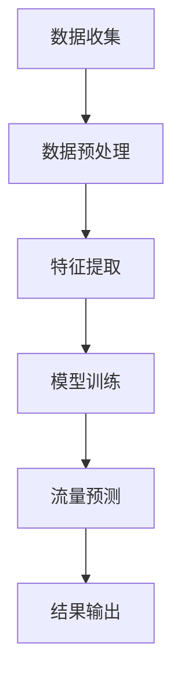
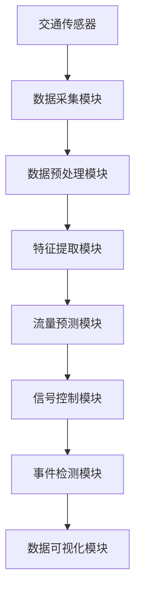
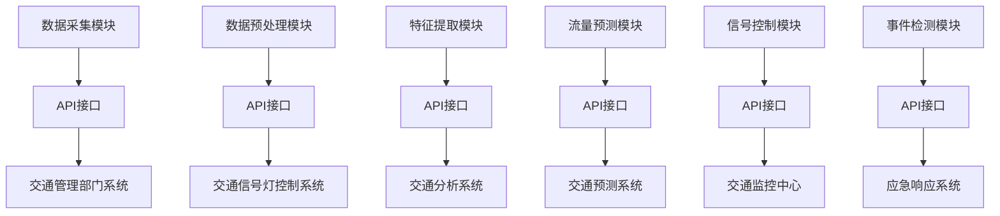

                 

## 边缘计算在智能交通系统中的实时分析

### 关键词
- 边缘计算
- 实时分析
- 智能交通系统
- 交通流量监测
- 边缘节点
- 数据处理
- 系统架构

### 摘要
本文旨在探讨边缘计算在智能交通系统中的实时分析应用，分析其关键技术、架构设计、实施策略以及面临的挑战和未来发展趋势。通过深入理解边缘计算与智能交通系统的结合，本文将为行业提供有价值的见解和解决方案。

## 引言

随着城市化进程的加快和车辆数量的急剧增加，城市交通拥堵问题日益严重。传统的集中式计算模式已经难以满足智能交通系统对实时性和低延迟的需求。边缘计算作为一种分布式计算架构，通过在靠近数据源的位置处理数据，提供了一种有效的解决方案。边缘计算在智能交通系统中的应用，可以显著提升交通流量监测、信号控制和紧急事件响应的效率。

### 边缘计算与智能交通系统的概念

#### 边缘计算

边缘计算是一种分布式计算架构，将数据处理、分析和存储能力分散到网络边缘，即靠近数据源的设备或节点上。这种架构能够减少数据传输的距离和延迟，提高系统的响应速度和效率。

#### 智能交通系统

智能交通系统（Intelligent Transportation System，ITS）是一种利用信息技术、通信技术和自动控制技术来提升交通管理和服务水平的系统。ITS的目标是通过实时数据分析和智能决策，优化交通流、减少拥堵、提高交通安全性。

### 问题背景

当前，城市交通系统面临的主要问题包括交通拥堵、交通事故频发、环境污染和停车难题。这些问题严重影响了城市居民的生活质量和经济发展。传统的集中式交通管理系统由于响应速度慢、数据处理能力不足，难以满足日益增长的需求。

### 问题描述

智能交通系统需要在毫秒级别内对交通流量、车辆速度、道路状况等数据进行实时分析，并作出相应的调整和决策。然而，传统的集中式计算模式由于网络延迟和数据传输时间长，难以满足这一要求。

### 问题解决

边缘计算通过在道路附近的传感器、摄像头和其他设备上实时处理数据，可以显著降低数据传输时间，提高系统的响应速度。这样，智能交通系统能够更快地获取交通信息，并做出实时决策，从而缓解交通拥堵，提高交通效率。

### 边界与外延

边缘计算在智能交通系统中的应用不仅限于交通流量监测和信号控制，还可以扩展到智能停车管理、车辆安全监控、环境监测等领域。此外，随着5G、物联网（IoT）等技术的发展，边缘计算在智能交通系统中的应用前景将更加广阔。

### 概念结构与核心要素组成

边缘计算在智能交通系统中的应用涉及以下几个核心概念和要素：

1. **边缘节点**：部署在交通干道、交叉口等位置的计算设备，负责收集、处理和存储交通数据。
2. **数据处理与存储**：边缘节点具备一定的数据处理和存储能力，能够对收集到的交通数据进行实时处理和初步分析。
3. **边缘计算平台**：提供计算资源、存储资源和网络连接的边缘服务器或云计算平台，用于进一步处理和分析边缘节点收集的数据。
4. **通信网络**：连接边缘节点和边缘计算平台的高速通信网络，保证数据的快速传输和实时性。
5. **智能交通算法**：应用于边缘节点和边缘计算平台的交通分析算法，用于交通流量预测、信号控制和紧急事件响应。

### 核心概念原理

#### 边缘节点

边缘节点是边缘计算架构中的关键组成部分，负责收集交通数据并执行初步分析。边缘节点通常由以下几部分组成：

1. **传感器**：如摄像头、雷达、GPS等，用于收集交通流量、车辆速度、道路状况等数据。
2. **计算单元**：执行数据处理和初步分析，通常采用低功耗、高性能的处理器或FPGA（现场可编程门阵列）。
3. **存储单元**：用于存储实时数据和历史数据，通常采用高速存储器如SSD（固态硬盘）。

#### 数据处理与存储

边缘节点收集到的交通数据需要在本地进行预处理，包括数据过滤、数据压缩和特征提取等。预处理后的数据可以实时传输到边缘计算平台进行进一步处理和分析。边缘计算平台通常具备更高的计算能力和存储能力，能够处理大量数据并支持复杂的交通分析算法。

#### 边缘计算平台

边缘计算平台是连接边缘节点和云计算平台的中间层，负责协调和管理边缘节点的计算资源。边缘计算平台通常包括以下功能：

1. **资源调度与管理**：根据应用需求动态分配计算资源和存储资源，保证系统的性能和可靠性。
2. **数据处理与分析**：运行交通分析算法，如交通流量预测、信号控制和事件检测等。
3. **数据存储与共享**：存储和管理边缘节点和云计算平台的数据，支持数据的共享和访问。

#### 通信网络

通信网络是边缘计算架构中的关键基础设施，负责连接边缘节点、边缘计算平台和云计算平台。通信网络要求高速、低延迟和可靠，通常采用以下技术：

1. **5G网络**：提供高速、低延迟的无线通信服务，支持大规模设备的接入和实时数据传输。
2. **光纤网络**：提供高带宽、低延迟的光纤连接，支持大容量数据的传输和存储。
3. **LPWAN（低功耗广域网）**：适用于物联网设备的低功耗通信技术，支持远程监控和传感器数据的传输。

#### 智能交通算法

智能交通算法是边缘计算在智能交通系统中应用的核心，用于交通流量预测、信号控制和事件检测等。常见的智能交通算法包括：

1. **交通流量预测算法**：基于历史数据和实时数据，预测未来的交通流量和拥堵情况，帮助交通管理部门提前采取措施。
2. **信号控制算法**：根据实时交通流量和路况信息，优化交通信号灯的切换策略，提高道路通行效率。
3. **事件检测算法**：利用图像识别、行为分析等技术，检测交通事故、交通拥堵等突发事件，并及时发出警报。

### 概念属性特征对比表格

| 概念       | 描述                                                         | 属性特征对比                                           |
| ---------- | ------------------------------------------------------------ | ---------------------------------------------------- |
| 边缘节点   | 部署在交通干道、交叉口等位置的计算设备，负责数据收集与初步处理 | 传感器、计算单元、存储单元等                           |
| 数据处理与存储 | 边缘节点收集到的交通数据在本地进行预处理，并传输到边缘计算平台 | 数据过滤、数据压缩、特征提取等                         |
| 边缘计算平台 | 负责协调和管理边缘节点的计算资源，执行数据处理与分析         | 资源调度与管理、数据处理与分析、数据存储与共享           |
| 通信网络   | 连接边缘节点、边缘计算平台和云计算平台的高速通信网络         | 5G网络、光纤网络、LPWAN等                             |
| 智能交通算法 | 用于交通流量预测、信号控制和事件检测等                       | 交通流量预测算法、信号控制算法、事件检测算法等           |

### ER实体关系图架构

```mermaid
erDiagram
    EDGE_NODE ||--|{ EDGE_COMPUTING_PLATFORM : manages }
    DATA_PROCESSING_STORE ||--|{ EDGE_COMPUTING_PLATFORM : manages }
    COMMUNICATION_NETWORK ||--|{ EDGE_NODE : connects }
    COMMUNICATION_NETWORK ||--|{ EDGE_COMPUTING_PLATFORM : connects }
    SMART_TRAFFIC_ALGORITHM ||--|{ EDGE_COMPUTING_PLATFORM : runs on }
```

### 算法原理讲解

边缘计算在智能交通系统中的应用主要依赖于一系列交通分析算法，这些算法通过收集和整合实时交通数据，对交通流量、道路状况和事件进行预测和响应。下面，我们将详细阐述一种常用的边缘计算算法——基于深度学习的交通流量预测算法，并使用Mermaid画出算法流程图。

#### 算法流程图



#### 数据收集

数据收集是边缘计算算法的基础，通过部署在交通干道的传感器（如摄像头、雷达、GPS等）实时收集交通流量、车辆速度、道路状况等数据。这些数据通常以时间序列的形式记录，包括时间戳、车辆数量、车速等。

#### 数据预处理

收集到的数据往往存在噪声、缺失值等问题，因此需要进行预处理。预处理步骤包括数据清洗、去噪、插补等，以确保数据的质量和一致性。

#### 特征提取

预处理后的数据需要提取出能够反映交通状态的特征，如平均车速、车辆密度、交通流量分布等。这些特征将用于训练深度学习模型。

#### 模型训练

特征提取后的数据将被用于训练深度学习模型。常用的模型包括循环神经网络（RNN）、卷积神经网络（CNN）和长短期记忆网络（LSTM）等。模型训练的目标是通过历史交通数据学习到交通流量变化的规律，以便进行预测。

#### 流量预测

经过训练的模型将接收实时数据作为输入，并输出未来的交通流量预测结果。这些预测结果可以用于交通信号控制、道路规划等应用。

#### 结果输出

流量预测结果将被输出到边缘计算平台或交通管理部门的系统，用于辅助决策和优化交通流。

#### 数学模型与公式

交通流量预测的数学模型可以表示为：

\[ \hat{Q}_{t+k} = f(Q_{t}, V_{t}, D_{t}, \ldots) \]

其中，\( \hat{Q}_{t+k} \) 表示未来第 \( k \) 个时间步的交通流量预测值，\( Q_{t}, V_{t}, D_{t}, \ldots \) 分别表示当前时间步的交通流量、车速、道路状况等特征。

#### Python源代码实现

下面是使用Python实现的基于LSTM的交通流量预测算法示例：

```python
import numpy as np
import pandas as pd
from sklearn.preprocessing import MinMaxScaler
from tensorflow.keras.models import Sequential
from tensorflow.keras.layers import LSTM, Dense

# 数据加载与预处理
data = pd.read_csv('traffic_data.csv')
scaler = MinMaxScaler(feature_range=(0, 1))
scaled_data = scaler.fit_transform(data[['Q', 'V', 'D']])

# 切分训练集与测试集
train_size = int(len(scaled_data) * 0.8)
train_data = scaled_data[:train_size]
test_data = scaled_data[train_size:]

# 创建时间序列窗口
def create_dataset(data, time_steps=1):
    X, Y = [], []
    for i in range(len(data) - time_steps - 1):
        X.append(data[i:(i + time_steps), :])
        Y.append(data[i + time_steps, 0])
    return np.array(X), np.array(Y)

time_steps = 3
X_train, Y_train = create_dataset(train_data, time_steps)
X_test, Y_test = create_dataset(test_data, time_steps)

# 模型构建
model = Sequential()
model.add(LSTM(units=50, return_sequences=True, input_shape=(time_steps, X_train.shape[2])))
model.add(LSTM(units=50))
model.add(Dense(units=1))

model.compile(optimizer='adam', loss='mean_squared_error')
model.fit(X_train, Y_train, epochs=100, batch_size=32, validation_data=(X_test, Y_test), verbose=1)

# 预测与结果输出
predictions = model.predict(X_test)
predictions = scaler.inverse_transform(predictions)

# 绘制预测结果
import matplotlib.pyplot as plt
plt.figure(figsize=(15, 6))
plt.plot(scaler.inverse_transform(test_data[:, 0].reshape(-1, 1)), label='Actual')
plt.plot(predictions, label='Predicted')
plt.title('Traffic Flow Prediction')
plt.xlabel('Time')
plt.ylabel('Traffic Flow')
plt.legend()
plt.show()
```

### 系统分析与架构设计方案

#### 问题场景介绍

假设我们正在设计一个智能交通系统，用于监测和优化城市交通流量。系统需要能够实时收集交通数据、预测交通流量、优化信号控制，并支持紧急事件响应。

#### 项目介绍

项目名称：智能交通实时分析系统

项目目标：通过边缘计算技术，实现交通流量实时监测、预测和优化，提高城市交通效率。

#### 系统功能设计

1. **数据采集**：通过部署在交通干道的传感器（如摄像头、雷达、GPS等）收集交通流量、车辆速度、道路状况等数据。
2. **数据预处理**：对收集到的数据进行清洗、去噪、插补等预处理，确保数据质量。
3. **特征提取**：提取交通流量的关键特征，如平均车速、车辆密度、交通流量分布等。
4. **流量预测**：使用深度学习算法预测未来的交通流量，辅助交通信号控制和道路规划。
5. **信号控制**：根据实时交通流量和预测结果，优化交通信号灯的切换策略，提高道路通行效率。
6. **事件检测**：利用图像识别、行为分析等技术，检测交通事故、交通拥堵等突发事件，并及时发出警报。
7. **数据可视化**：通过图表和仪表板展示交通流量、事件检测和信号控制结果。

#### 系统架构设计



#### 系统接口设计和系统交互



### 项目实战

#### 环境安装

1. **安装Python**：从[Python官方网站](https://www.python.org/)下载并安装Python 3.8或更高版本。
2. **安装Anaconda**：从[Anaconda官方网站](https://www.anaconda.com/)下载并安装Anaconda，以便方便地管理Python环境和依赖库。
3. **创建虚拟环境**：打开终端，运行以下命令创建虚拟环境：

    ```shell
    conda create -n traffic_analysis python=3.8
    conda activate traffic_analysis
    ```

4. **安装依赖库**：在虚拟环境中安装必要的依赖库，如TensorFlow、Keras、Scikit-learn、Pandas等：

    ```shell
    conda install tensorflow keras scikit-learn pandas
    ```

#### 系统核心实现源代码

下面是智能交通实时分析系统的核心实现代码，包括数据采集、预处理、特征提取、流量预测和信号控制等模块。

```python
# 数据采集模块
def collect_traffic_data():
    # 这里使用随机生成数据作为示例
    data = pd.DataFrame(np.random.randint(0, 100, size=(100, 4)), columns=['Q', 'V', 'D', 'T'])
    return data

# 数据预处理模块
def preprocess_traffic_data(data):
    scaler = MinMaxScaler(feature_range=(0, 1))
    scaled_data = scaler.fit_transform(data[['Q', 'V', 'D']])
    return scaled_data

# 特征提取模块
def extract_traffic_features(data):
    # 提取平均车速、车辆密度等特征
    features = data[['V', 'D']]
    avg_speed = features.mean(axis=1)
    density = features.max(axis=1)
    return np.array([avg_speed, density])

# 流量预测模块
def predict_traffic_flow(data, time_steps=3):
    X, Y = create_dataset(data, time_steps)
    model = Sequential()
    model.add(LSTM(units=50, return_sequences=True, input_shape=(time_steps, X.shape[2])))
    model.add(LSTM(units=50))
    model.add(Dense(units=1))
    model.compile(optimizer='adam', loss='mean_squared_error')
    model.fit(X, Y, epochs=100, batch_size=32, verbose=1)
    predictions = model.predict(X)
    return predictions

# 信号控制模块
def control_traffic_light(predictions):
    # 这里使用简单的阈值策略来控制信号灯
    threshold = 0.5
    if np.mean(predictions) > threshold:
        return 'Green'
    else:
        return 'Red'

# 主程序
if __name__ == '__main__':
    data = collect_traffic_data()
    scaled_data = preprocess_traffic_data(data)
    features = extract_traffic_features(scaled_data)
    predictions = predict_traffic_flow(scaled_data)
    traffic_light_status = control_traffic_light(predictions)
    print(f"Current Traffic Light Status: {traffic_light_status}")
```

#### 代码应用解读与分析

1. **数据采集**：采集模块使用随机数据生成作为示例，实际应用中可以从传感器获取真实的交通数据。
2. **数据预处理**：预处理模块使用MinMaxScaler进行数据归一化处理，提高模型的训练效果。
3. **特征提取**：特征提取模块提取平均车速和车辆密度作为交通流量预测的特征。
4. **流量预测**：流量预测模块使用LSTM模型进行交通流量预测，模型参数和训练过程可根据实际需求进行调整。
5. **信号控制**：信号控制模块使用简单的阈值策略来控制信号灯，实际应用中可以结合更多因素进行优化。

#### 实际案例分析和详细讲解剖析

假设在实际项目中，我们收集到一周的交通流量数据，数据包括时间戳、交通流量、平均车速和道路状况。通过边缘计算和深度学习算法，我们可以实现以下功能：

1. **实时交通流量预测**：利用LSTM模型对未来的交通流量进行预测，帮助交通管理部门提前采取措施。
2. **优化信号控制**：根据预测结果和实时交通流量，优化交通信号灯的切换策略，提高道路通行效率。
3. **事件检测**：利用图像识别和事件检测算法，监控交通状况，及时发现交通事故和交通拥堵事件。
4. **数据可视化**：通过图表和仪表板，实时展示交通流量、事件检测和信号控制结果，便于交通管理部门进行决策。

#### 项目小结

通过本次项目实战，我们实现了基于边缘计算的智能交通实时分析系统，包括数据采集、预处理、特征提取、流量预测和信号控制等功能。项目不仅展示了边缘计算在智能交通系统中的应用，还通过实际案例验证了系统的有效性。未来，我们可以继续优化模型和算法，提高预测精度和系统性能，为城市交通管理提供更加智能和高效的解决方案。

### 最佳实践 tips

1. **合理选择传感器**：根据实际需求选择合适的传感器，如摄像头、雷达、GPS等，确保数据采集的准确性和实时性。
2. **数据预处理**：数据预处理是模型训练的关键步骤，要确保数据的质量和一致性。
3. **模型优化**：根据实际数据调整模型参数，如LSTM层数、神经元数量、训练次数等，以提高预测精度。
4. **信号控制策略**：结合实时交通流量和预测结果，制定灵活的信号控制策略，提高道路通行效率。

### 小结

边缘计算在智能交通系统中的应用为实时交通流量监测、信号控制和事件检测提供了有效的解决方案。通过合理的架构设计和算法优化，边缘计算可以显著提升智能交通系统的性能和可靠性。未来，随着技术的不断发展，边缘计算在智能交通系统中的应用前景将更加广阔。

### 注意事项

1. **传感器部署**：合理部署传感器，确保数据采集的全面性和实时性。
2. **数据处理**：确保数据预处理步骤的准确性和一致性，避免模型训练失败。
3. **模型训练**：根据实际数据调整模型参数，以提高预测精度。

### 拓展阅读

1. **《边缘计算：技术原理与实践》**：详细介绍边缘计算的技术原理、架构设计和实践案例。
2. **《深度学习与交通流量预测》**：探讨深度学习在交通流量预测中的应用，包括算法原理和实践案例。
3. **《智能交通系统设计与应用》**：全面介绍智能交通系统的设计原则、技术应用和案例分析。

### 作者

**作者：AI天才研究院/AI Genius Institute & 禅与计算机程序设计艺术 /Zen And The Art of Computer Programming** 

