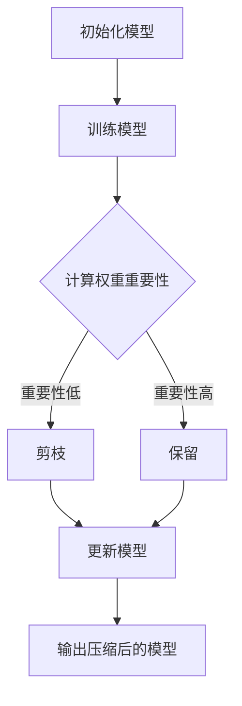
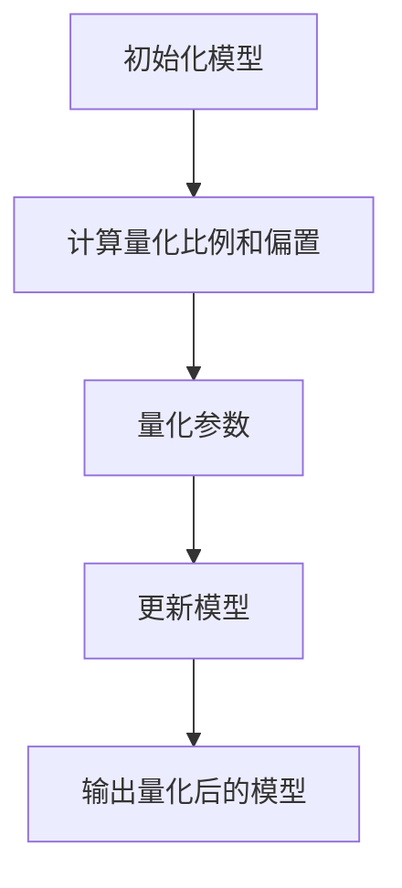
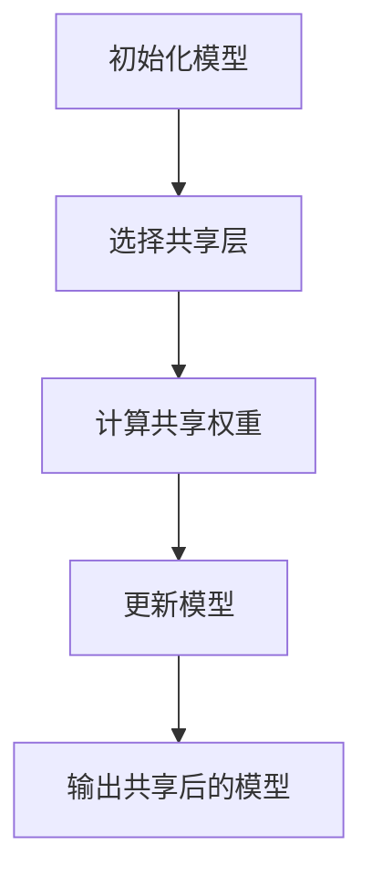
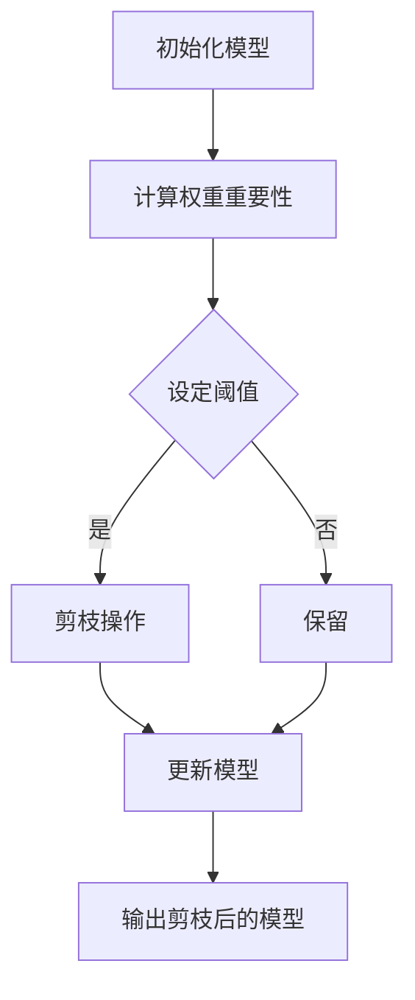
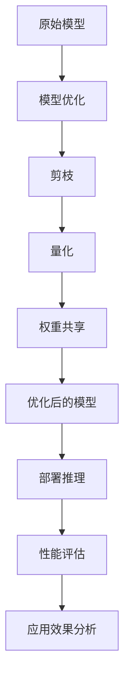

                 

### 引言与背景介绍

#### 1.1 问题背景

随着物联网（IoT）的快速发展，边缘设备的数量与日俱增。边缘设备是指那些部署在靠近数据源头或者用户的设备上，用于执行实时数据处理和决策的任务。它们通常具有低功耗、低带宽和有限的计算资源。近年来，深度学习技术在计算机视觉、自然语言处理等领域取得了显著的成果，这些成果在很大程度上依赖于大规模的神经网络模型。然而，这些复杂的神经网络模型往往需要大量的计算资源和存储空间，这对于资源受限的边缘设备来说是一个巨大的挑战。

#### 1.1.1 边缘设备的兴起与发展

边缘设备的兴起源于物联网和5G技术的快速发展。物联网设备需要快速处理大量的数据，而边缘计算可以减少数据传输的延迟，提高系统的响应速度。同时，5G技术的低延迟和高带宽特性进一步推动了边缘设备的发展。例如，自动驾驶汽车、智能城市、工业自动化等领域都对边缘设备的性能提出了极高的要求。

#### 1.1.2 边缘设备在数据处理中的挑战

边缘设备面临的主要挑战包括：

1. **计算资源限制**：边缘设备通常具有有限的计算能力，无法承担大规模神经网络模型的高计算需求。
2. **存储空间限制**：边缘设备的存储空间有限，无法存储庞大的神经网络模型。
3. **功耗限制**：边缘设备通常依赖电池供电，需要尽量减少功耗以延长设备的使用寿命。
4. **网络带宽限制**：边缘设备与云端之间的网络带宽有限，无法支持大量的数据传输。

#### 1.1.3 神经网络压缩的需求

为了克服上述挑战，神经网络压缩技术成为了一个热点研究方向。神经网络压缩的目标是在不显著牺牲模型性能的前提下，减小神经网络模型的尺寸和计算复杂度。具体来说，神经网络压缩有以下几方面的需求：

1. **降低模型尺寸**：通过压缩技术减小模型的参数量和计算量，使得模型可以更轻松地部署在资源受限的边缘设备上。
2. **提高模型效率**：通过优化模型的计算流程，提高模型的执行效率，降低功耗和计算延迟。
3. **增强模型可解释性**：虽然神经网络压缩可能会降低模型的精度，但通过合理的设计，可以使得压缩后的模型具有更高的可解释性。

#### 1.2 问题描述

神经网络压缩的核心问题是如何在保证模型性能的前提下，减小模型的尺寸和计算复杂度。具体来说，问题描述如下：

1. **模型尺寸与计算成本**：神经网络模型的参数量和计算复杂度往往与模型的性能成正比。如何在保证性能的同时，降低模型的尺寸和计算成本是一个关键问题。
2. **边缘设备的资源限制**：边缘设备具有计算资源、存储空间和功耗的限制，如何在这些资源限制下有效部署神经网络模型是一个挑战。
3. **神经网络压缩的意义**：神经网络压缩不仅可以提高边缘设备的性能，还可以降低部署成本、减少功耗，并在某些场景下提高模型的可解释性。

#### 1.3 问题解决

神经网络压缩的技术和方法多种多样，主要包括网络剪枝、量化、权重共享等。这些方法的基本原理如下：

1. **网络剪枝**：通过剪除神经网络中不重要的连接和神经元，减少模型的参数量和计算复杂度。
2. **量化**：将神经网络中的浮点数参数转换为较低精度的整数表示，从而减小模型的存储空间和计算资源需求。
3. **权重共享**：通过在神经网络的不同层之间共享权重，减少模型的参数数量，提高模型的计算效率。

神经网络压缩在边缘设备推理中的应用具有很大的潜力，可以为边缘计算提供有效的解决方案。

#### 1.4 边界与外延

神经网络压缩技术在边缘设备推理中的应用具有一定的边界和适用性。以下是一些相关的边界和外延问题：

1. **技术范围**：神经网络压缩技术涵盖了多种方法，包括剪枝、量化、权重共享等。每种方法都有其适用范围和优缺点，需要根据具体场景进行选择。
2. **边缘设备的种类与特性**：不同的边缘设备具有不同的计算资源、存储空间和功耗特性，需要根据设备特性选择合适的压缩技术。
3. **应用场景分析**：神经网络压缩技术在不同的应用场景中具有不同的效果。例如，在实时视频处理、工业自动化、智能家居等领域，压缩技术的效果和适用性有所不同。

#### 1.5 概念结构与核心要素组成

为了更好地理解和应用神经网络压缩技术，我们需要明确边缘设备推理系统的基本架构和核心要素。以下是边缘设备推理系统的概念结构和核心要素：

1. **边缘设备推理系统架构**：包括输入层、网络层、输出层和反馈层。输入层负责接收外部数据，网络层执行数据处理和特征提取，输出层生成推理结果，反馈层用于调整和优化模型。
2. **神经网络压缩关键技术**：包括网络剪枝、量化、权重共享等。这些技术可以通过减少模型参数数量、降低计算复杂度来提高模型的效率和适用性。
3. **边缘设备推理性能优化**：通过调整模型结构、优化计算流程、减少数据传输等方式，提高边缘设备的推理性能和响应速度。

通过上述概念结构和核心要素的理解，我们可以更好地应用神经网络压缩技术，优化边缘设备推理系统，满足各种应用场景的需求。

---

## 核心概念与联系

在深入探讨边缘设备推理中神经网络压缩的前沿技术之前，首先需要明确几个核心概念，并理解它们之间的联系。以下是本文将要讨论的几个核心概念及其相互关系。

### 2.1 核心概念原理

#### 2.1.1 神经网络的基本结构

神经网络是由一系列相互连接的神经元组成的计算模型，用于对数据进行处理和分类。神经网络的基本结构包括输入层、隐藏层和输出层。输入层接收外部数据，隐藏层执行数据处理和特征提取，输出层生成最终的预测结果。神经网络的工作原理是通过调整神经元之间的权重来学习数据特征，从而实现分类或回归任务。

#### 2.1.2 深度学习的基本原理

深度学习是一种基于神经网络的机器学习方法，通过多层神经网络结构来提取数据的高级特征。深度学习的基本原理包括前向传播、反向传播和损失函数。前向传播用于计算网络输出，反向传播用于计算梯度并更新权重，损失函数用于衡量预测结果与真实值之间的误差。

#### 2.1.3 神经网络压缩的概念

神经网络压缩是指通过减少模型参数数量、降低计算复杂度来减小神经网络模型尺寸的技术。神经网络压缩的主要目的是提高模型在资源受限环境中的部署和应用效率。常见的神经网络压缩方法包括网络剪枝、量化、权重共享等。

### 2.2 概念属性特征对比表格

为了更好地理解上述核心概念，我们通过一个表格来对比它们的属性特征。

| 概念         | 定义                                                         | 主要特征                                       |
| ------------ | ------------------------------------------------------------ | ---------------------------------------------- |
| 神经网络     | 一种由神经元组成的计算模型，用于对数据进行处理和分类           | 输入层、隐藏层、输出层，前向传播、反向传播      |
| 深度学习     | 基于神经网络的机器学习方法，通过多层神经网络结构提取数据特征 | 多层神经网络、前向传播、反向传播、损失函数      |
| 神经网络压缩 | 减少模型参数数量、降低计算复杂度的技术                     | 剪枝、量化、权重共享，提高部署和应用效率        |

### 2.3 ER实体关系图架构的Mermaid流程图

为了更直观地展示这些核心概念之间的联系，我们可以使用Mermaid流程图来绘制实体关系图。

```mermaid
erDiagram
  Aớneural_network ||--|{ Bocrine_learning }|--|| C{neural_compression}
  Brightarrow D{Deep_learning}
  Crightarrow E{Model_size_reduction}
```

在上面的Mermaid流程图中：

- `neural_network`（神经网络）是基础实体。
- `deep_learning`（深度学习）是神经网络的扩展和应用。
- `neural_compression`（神经网络压缩）是深度学习的一个重要组成部分，旨在实现模型尺寸的减小。

通过上述核心概念和ER实体关系图的介绍，我们可以更好地理解神经网络压缩在边缘设备推理中的重要性，以及如何通过这些核心概念和技术来优化边缘设备的性能和效率。

---

## 神经网络压缩的基本原理

### 3.1 神经网络压缩的数学模型

神经网络压缩的数学模型主要涉及神经网络的基本运算和压缩技术的数学表示。以下是神经网络压缩中的一些关键数学模型。

#### 3.1.1 神经网络的基本数学公式

神经网络中的基本运算可以表示为以下公式：

\[ z^{(l)} = \sum_{i} w^{(l)}_{ij} \cdot a^{(l-1)}_i + b^{(l)} \]

其中，\( z^{(l)} \) 是第 \( l \) 层的激活值，\( w^{(l)}_{ij} \) 是第 \( l \) 层中第 \( i \) 个神经元与第 \( l-1 \) 层中第 \( j \) 个神经元之间的权重，\( a^{(l-1)}_i \) 是第 \( l-1 \) 层第 \( i \) 个神经元的激活值，\( b^{(l)} \) 是第 \( l \) 层的偏置。

神经网络的输出可以通过以下公式计算：

\[ \hat{y} = \sigma(z^{(L)}) \]

其中，\( \sigma \) 是激活函数，通常使用Sigmoid、ReLU或Tanh函数，\( z^{(L)} \) 是输出层的激活值，\( \hat{y} \) 是模型的预测输出。

#### 3.1.2 神经网络压缩的数学公式

神经网络压缩主要通过减少模型参数数量和计算复杂度来实现。以下是一些常见的神经网络压缩技术的数学表示。

1. **网络剪枝**：

   网络剪枝的目标是去除网络中不重要的连接和神经元。剪枝的数学表示如下：

   \[ w'_{ij} = \begin{cases} 
   w_{ij} & \text{如果} \; \lambda_{ij} > \theta \\
   0 & \text{否则} 
   \end{cases} \]

   其中，\( w'_{ij} \) 是剪枝后的权重，\( \lambda_{ij} \) 是权重的重要性度量，\( \theta \) 是阈值。

2. **量化**：

   量化技术通过将浮点数参数转换为较低精度的整数来减少模型尺寸。量化的数学表示如下：

   \[ q_i = \text{round}(x_i \cdot \text{scale}) \]

   其中，\( q_i \) 是量化后的参数值，\( x_i \) 是原始参数值，\( \text{scale} \) 是量化比例。

3. **权重共享**：

   权重共享通过在不同层之间共享权重来减少参数数量。权重共享的数学表示如下：

   \[ w^{(l)}_{ij} = w^{(l-1)}_{ik} \]

   其中，\( w^{(l)}_{ij} \) 是第 \( l \) 层第 \( i \) 个神经元与第 \( l-1 \) 层第 \( j \) 个神经元的权重，\( w^{(l-1)}_{ik} \) 是第 \( l-1 \) 层第 \( i \) 个神经元与第 \( l-2 \) 层第 \( k \) 个神经元的权重。

通过这些数学模型，我们可以更深入地理解神经网络压缩的基本原理和操作方式。

### 3.2 神经网络压缩算法原理讲解

神经网络压缩算法的核心目标是减少模型参数数量和计算复杂度，从而提高模型在资源受限环境中的部署和应用效率。以下介绍几种常见的神经网络压缩算法及其原理。

#### 3.2.1 常见神经网络压缩算法

1. **网络剪枝**：

   网络剪枝通过去除网络中不重要的连接和神经元来实现模型压缩。剪枝算法通常分为两类：稀疏剪枝和结构剪枝。

   - **稀疏剪枝**：稀疏剪枝通过设置阈值来去除低权重的连接。这种方法简单有效，但可能无法完全利用网络中的冗余结构。
   - **结构剪枝**：结构剪枝通过剪除整个层或部分层来减少模型参数数量。这种方法可以更好地利用网络结构，但计算成本较高。

2. **量化**：

   量化技术通过将浮点数参数转换为较低精度的整数来减少模型尺寸。量化算法可以分为两类：定点量化和浮点量化。

   - **定点量化**：定点量化将浮点数参数映射到有限的整数范围内，从而实现模型压缩。这种方法简单高效，但可能影响模型的精度。
   - **浮点量化**：浮点量化使用浮点数表示量化参数，可以更好地保持模型精度，但计算成本较高。

3. **权重共享**：

   权重共享通过在不同层之间共享权重来减少参数数量。权重共享算法可以分为两类：层内共享和跨层共享。

   - **层内共享**：层内共享在同一层内共享权重，可以显著减少模型参数数量。这种方法简单有效，但可能无法充分利用不同层之间的信息。
   - **跨层共享**：跨层共享在不同层之间共享权重，可以更好地利用网络结构。这种方法计算成本较高，但可以显著提高模型性能。

#### 3.2.2 算法mermaid流程图

以下是几种常见神经网络压缩算法的mermaid流程图：

1. **网络剪枝**：

   ```mermaid
   graph TD
   A[输入网络] --> B[计算权重重要性]
   B --> C{是否小于阈值?}
   C -->|是| D[剪枝]
   C -->|否| E[保留]
   D --> F[更新模型]
   E --> F
   F --> G[输出压缩后的网络]
   ```

2. **量化**：

   ```mermaid
   graph TD
   A[输入网络] --> B[计算量化比例]
   B --> C[量化参数]
   C --> D[更新模型]
   D --> E[输出量化后的网络]
   ```

3. **权重共享**：

   ```mermaid
   graph TD
   A[输入网络] --> B[选择共享层]
   B --> C[计算共享权重]
   C --> D[更新模型]
   D --> E[输出共享后的网络]
   ```

#### 3.2.3 算法python源代码实现

以下是网络剪枝、量化和权重共享的Python源代码实现示例：

1. **网络剪枝**：

   ```python
   import tensorflow as tf

   def sparsity_pruning(model, threshold):
       pruning_variables = []
       for var in model.variables:
           with tf.GradientTape() as tape:
               tape.watch(var)
               output = model(var)
           grads = tape.gradient(output, var)
           sparsity_mask = tf.reduce_sum(tf.square(grads), axis=-1) < threshold
           pruning_variables.append((var, sparsity_mask))
       return pruning_variables

   def update_model(pruning_variables, model):
       for var, mask in pruning_variables:
           model.assign(tf.where(mask, tf.zeros_like(var), var))
       return model

   model = ...  # 原始模型
   pruning_variables = sparsity_pruning(model, threshold=1e-4)
   compressed_model = update_model(pruning_variables, model)
   ```

2. **量化**：

   ```python
   import tensorflow as tf

   def quantization(model, scale):
       quantized_variables = []
       for var in model.variables:
           quantized_var = tf.round(var * scale)
           quantized_variables.append(quantized_var)
       return quantized_variables

   def update_model(quantized_variables, model):
       for var, quantized_var in zip(model.variables, quantized_variables):
           model.assign(quantized_var)
       return model

   model = ...  # 原始模型
   scale = 1.0  # 量化比例
   quantized_variables = quantization(model, scale=scale)
   compressed_model = update_model(quantized_variables, model)
   ```

3. **权重共享**：

   ```python
   import tensorflow as tf

   def weight_sharing(model, shared_layers):
       for i, (prev_layer, current_layer) in enumerate(zip(shared_layers, shared_layers[1:])):
           weights = model.layers[i].get_weights()
           shared_weights = weights[0][:, :len(weights[0][0]) // 2]
           model.layers[i + 1].set_weights([shared_weights])
       return model

   model = ...  # 原始模型
   shared_layers = [model.layers[i] for i in range(len(model.layers) - 1)]  # 共享层
   compressed_model = weight_sharing(model, shared_layers)
   ```

通过这些算法的原理讲解、mermaid流程图和Python源代码实现，我们可以更深入地理解神经网络压缩的基本原理和操作方式。

### 3.3 通俗易懂的举例说明

为了更好地理解神经网络压缩技术，下面通过具体的例子来说明网络剪枝、量化和权重共享三种常见压缩方法。

#### 3.3.1 实例1：网络剪枝

假设我们有一个简单的神经网络模型，包含两层神经元，其中第一层有3个神经元，第二层有2个神经元。每个神经元的权重如下：

\[ 
\begin{aligned}
w_{11} &= 0.5 \\
w_{12} &= 0.3 \\
w_{13} &= 0.2 \\
w_{21} &= 0.6 \\
w_{22} &= 0.4 \\
\end{aligned}
\]

我们使用剪枝技术来减少模型参数数量。首先，我们设定一个阈值，比如0.1。然后，我们计算每个权重的重要性，即其绝对值。如果某个权重的重要性小于阈值，我们将其设置为0，从而剪除这个连接。

计算结果如下：

\[ 
\begin{aligned}
|w_{11}| &= 0.5 > 0.1 \\
|w_{12}| &= 0.3 > 0.1 \\
|w_{13}| &= 0.2 < 0.1 \\
|w_{21}| &= 0.6 > 0.1 \\
|w_{22}| &= 0.4 > 0.1 \\
\end{aligned}
\]

因此，我们将\( w_{13} \)设置为0，剪除了第一层与第二层之间的一个连接。剪枝后的神经网络如下：

\[ 
\begin{aligned}
w_{11} &= 0.5 \\
w_{12} &= 0.3 \\
w_{21} &= 0.6 \\
w_{22} &= 0.4 \\
\end{aligned}
\]

#### 3.3.2 实例2：量化

假设我们有以下浮点数权重：

\[ 
\begin{aligned}
w_{11} &= 0.123456 \\
w_{12} &= 0.234567 \\
w_{21} &= 0.345678 \\
w_{22} &= 0.456789 \\
\end{aligned}
\]

我们使用量化技术将这些浮点数转换为较低的精度。我们设定一个量化比例，比如0.01。量化后的权重如下：

\[ 
\begin{aligned}
q_{11} &= \text{round}(0.123456 \times 0.01) = 1 \\
q_{12} &= \text{round}(0.234567 \times 0.01) = 2 \\
q_{21} &= \text{round}(0.345678 \times 0.01) = 3 \\
q_{22} &= \text{round}(0.456789 \times 0.01) = 4 \\
\end{aligned}
\]

通过量化，我们显著减少了模型的存储空间和计算资源需求。

#### 3.3.3 实例3：权重共享

假设我们的神经网络包含两层，每层各有3个神经元。第一层的权重如下：

\[ 
\begin{aligned}
w_{11} &= 0.1 \\
w_{12} &= 0.2 \\
w_{13} &= 0.3 \\
\end{aligned}
\]

第二层的权重如下：

\[ 
\begin{aligned}
w_{21} &= 0.1 \\
w_{22} &= 0.2 \\
w_{23} &= 0.3 \\
\end{aligned}
\]

我们可以通过权重共享技术，将第一层的权重直接应用于第二层的相应神经元。具体来说，我们可以将\( w_{11} \)应用到\( w_{21} \)，将\( w_{12} \)应用到\( w_{22} \)，将\( w_{13} \)应用到\( w_{23} \)。这样，我们可以将第二层的权重简化为：

\[ 
\begin{aligned}
w_{21} &= 0.1 \\
w_{22} &= 0.2 \\
w_{23} &= 0.3 \\
\end{aligned}
\]

通过权重共享，我们显著减少了模型的参数数量，从而提高了模型的部署和应用效率。

通过这些实例，我们可以更直观地理解神经网络压缩技术的操作方式和实际效果。

### 3.3.4 数学公式与Python实现

在神经网络压缩中，数学公式是理解和实现压缩技术的基础。以下是一些常见的数学公式及其Python实现。

#### 3.3.4.1 网络剪枝

网络剪枝的公式如下：

\[ 
\lambda_{ij} = \frac{1}{\sqrt{n}} \cdot \sum_{k} (w_{ij} - \mu)^2 
\]

其中，\( \lambda_{ij} \) 是权重 \( w_{ij} \) 的重要性度量，\( \mu \) 是权重 \( w_{ij} \) 的均值，\( n \) 是训练样本数量。

Python实现：

```python
import numpy as np

def calculate_sparsity(weights, n):
    mu = np.mean(weights)
    sparsity = np.square(weights - mu) / n
    return np.sqrt(np.mean(sparsity))

weights = np.array([0.1, 0.2, 0.3])
n = 100
sparsity = calculate_sparsity(weights, n)
print(sparsity)
```

#### 3.3.4.2 量化

量化公式如下：

\[ 
q_i = \text{round}(x_i \cdot \text{scale}) 
\]

其中，\( q_i \) 是量化后的参数值，\( x_i \) 是原始参数值，\( \text{scale} \) 是量化比例。

Python实现：

```python
def quantize(values, scale):
    quantized = np.round(values * scale)
    return quantized

values = np.array([0.123456, 0.234567, 0.345678])
scale = 0.01
quantized = quantize(values, scale)
print(quantized)
```

#### 3.3.4.3 权重共享

权重共享公式如下：

\[ 
w^{(l)}_{ij} = w^{(l-1)}_{ik} 
\]

其中，\( w^{(l)}_{ij} \) 是第 \( l \) 层第 \( i \) 个神经元与第 \( l-1 \) 层第 \( j \) 个神经元的权重，\( w^{(l-1)}_{ik} \) 是第 \( l-1 \) 层第 \( i \) 个神经元与第 \( l-2 \) 层第 \( k \) 个神经元的权重。

Python实现：

```python
import tensorflow as tf

def share_weights(model, layer_indices):
    for i in range(len(layer_indices) - 1):
        prev_layer = model.layers[layer_indices[i]]
        current_layer = model.layers[layer_indices[i + 1]]
        weights = prev_layer.get_weights()[0]
        shared_weights = weights[:, :len(weights[0]) // 2]
        current_layer.set_weights([shared_weights])
    return model

model = ...  # 原始模型
layer_indices = [1, 2]  # 共享层
compressed_model = share_weights(model, layer_indices)
```

通过这些数学公式和Python实现，我们可以更深入地理解和应用神经网络压缩技术。

---

## 神经网络压缩的方法与技术

### 4.1 神经网络剪枝技术

神经网络剪枝是一种通过移除网络中不重要的连接和神经元来减少模型尺寸和计算复杂度的技术。剪枝技术通常分为稀疏剪枝和结构剪枝。

#### 4.1.1 剪枝的基本原理

剪枝的基本原理是基于权重的重要性度量来决定哪些连接和神经元可以被剪除。常见的方法包括基于梯度的剪枝、基于激活的剪枝和基于模型结构的剪枝。

- **基于梯度的剪枝**：通过计算模型在训练过程中权重的梯度来确定其重要性。权重梯度较大的连接和神经元被认为更重要，可以被保留，而梯度较小的连接和神经元可以被剪除。

- **基于激活的剪枝**：通过分析神经网络的激活模式来确定哪些连接和神经元是冗余的。激活值较高的连接和神经元被认为更重要，可以被保留，而激活值较低的连接和神经元可以被剪除。

- **基于模型结构的剪枝**：通过分析网络的结构特性来剪除不重要的部分。例如，可以移除网络中的全连接层或卷积层，从而减少模型的计算复杂度。

#### 4.1.2 剪枝算法分类

剪枝算法可以分为静态剪枝和动态剪枝。

- **静态剪枝**：在训练完成后一次性剪枝，不涉及训练过程中的权重更新。静态剪枝可以显著减少模型的参数数量和计算复杂度，但可能会影响模型的性能。

- **动态剪枝**：在训练过程中根据模型的性能动态剪枝。动态剪枝可以在保证模型性能的同时逐步减小模型尺寸，但计算成本较高。

常见的剪枝算法包括：

- **L1正则化**：通过在损失函数中添加L1正则化项来减少权重的大小。L1正则化会导致权重稀疏化，从而实现剪枝。

- **DropConnect**：在训练过程中随机丢弃部分连接，以避免过拟合。

- **结构化剪枝**：通过剪除整个层或部分层来实现模型压缩。例如，可以移除网络中的全连接层或卷积层。

#### 4.1.3 剪枝的mermaid流程图

以下是神经网络剪枝的mermaid流程图：



### 4.2 神经网络量化技术

神经网络量化是一种通过将浮点数参数转换为较低精度的整数来减少模型尺寸和计算复杂度的技术。量化技术可以显著提高模型在资源受限环境中的部署和应用效率。

#### 4.2.1 量化的基本原理

量化的基本原理是将浮点数参数映射到固定的整数范围内。量化可以分为定点量化和浮点量化。

- **定点量化**：定点量化将浮点数参数映射到有限的整数范围内。定点量化可以通过调整量化的比例和偏置来实现。

- **浮点量化**：浮点量化使用浮点数表示量化参数，可以更好地保持模型精度，但计算成本较高。

量化过程通常包括以下步骤：

1. **计算量化比例**：量化比例是原始参数值与量化后参数值之间的比例。

2. **计算量化偏置**：量化偏置是量化过程中用于调整参数值的常数。

3. **量化参数**：将原始参数值乘以量化比例并加上量化偏置，得到量化后的参数值。

4. **更新模型**：将量化后的参数值更新到模型中。

#### 4.2.2 量化算法分类

量化算法可以分为无损量化和有损量化。

- **无损量化**：无损量化通过精确地映射浮点数参数到整数范围内，不会导致任何精度损失。

- **有损量化**：有损量化通过舍去浮点数参数的小数部分，可能导致模型精度损失。

常见的量化算法包括：

- **最小最大量化**：将参数值映射到最小值和最大值之间。

- **均匀量化**：将参数值映射到均匀分布的整数范围内。

- **非均匀量化**：将参数值映射到非均匀分布的整数范围内，以更好地保持模型精度。

#### 4.2.3 量化的mermaid流程图

以下是神经网络量化的mermaid流程图：



### 4.3 神经网络权重共享技术

神经网络权重共享是一种通过在不同层之间共享权重来减少模型参数数量的技术。权重共享可以提高模型的计算效率，减少模型尺寸。

#### 4.3.1 权重共享的基本原理

权重共享的基本原理是利用网络的对称性来减少参数数量。常见的方法包括层内共享和跨层共享。

- **层内共享**：在相同层内共享权重，例如，在卷积层内共享卷积核。

- **跨层共享**：在不同层之间共享权重，例如，在卷积层和全连接层之间共享权重。

权重共享可以通过以下步骤实现：

1. **选择共享层**：选择需要进行权重共享的层。

2. **计算共享权重**：计算共享权重，例如，通过将一个层的权重复制到另一个层。

3. **更新模型**：将共享权重更新到模型中。

#### 4.3.2 权重共享算法分类

权重共享算法可以分为基于规则的共享和基于学习的共享。

- **基于规则的共享**：基于规则的共享通过预定义的规则来共享权重，例如，固定比例的权重共享。

- **基于学习的共享**：基于学习的共享通过优化算法来学习最佳的权重共享策略。

常见的权重共享算法包括：

- **均匀共享**：将权重均匀地分配到共享层。

- **逐层共享**：将上一层的权重逐层复制到下一层。

- **基于梯度的共享**：通过优化算法学习最佳的权重共享策略。

#### 4.3.3 权重共享的mermaid流程图

以下是神经网络权重共享的mermaid流程图：



通过神经网络剪枝、量化和权重共享技术，可以有效地减少模型尺寸和计算复杂度，提高模型在边缘设备推理中的部署和应用效率。

---

### 4.1 神经网络剪枝技术

神经网络剪枝是一种通过移除网络中不重要的连接和神经元来减少模型尺寸和计算复杂度的技术。这种方法不仅在边缘设备推理中具有重要应用，还在提高模型的效率和可解释性方面发挥着关键作用。以下将详细探讨神经网络剪枝的基本原理、算法分类及其在边缘设备推理中的应用。

#### 4.1.1 剪枝的基本原理

神经网络剪枝的基本原理基于模型训练过程中权重的重要性评估。通过计算权重或激活的梯度、重要性度量等，识别出对模型输出贡献较小的连接和神经元，然后将其剪除。剪枝的目标是保留对模型性能至关重要的部分，同时大幅减少模型的参数数量和计算复杂度。

具体来说，剪枝过程可以分为以下几个步骤：

1. **重要性度量**：计算每个连接或神经元的权重重要性。常用的度量方法包括梯度度量、激活度量等。
2. **设定阈值**：根据模型训练过程中收集的数据，设定一个阈值来区分重要和不重要的连接或神经元。
3. **剪枝操作**：移除权重低于阈值的连接或神经元。
4. **模型更新**：更新模型结构，重新计算剪枝后的连接和神经元的权重。

#### 4.1.2 剪枝算法分类

神经网络剪枝算法可以根据剪枝策略的不同分为以下几类：

1. **稀疏剪枝**：稀疏剪枝通过设置阈值来直接移除权重绝对值低于阈值的连接。这种方法简单有效，但可能会导致模型性能损失。
2. **结构剪枝**：结构剪枝通过移除整个层或部分层来减少模型参数数量。这种方法可以更有效地减少模型尺寸，但可能会带来更高的计算成本。
3. **层次剪枝**：层次剪枝根据网络层次结构进行剪枝，通常用于减少深层网络的计算复杂度。
4. **基于梯度的剪枝**：基于梯度的剪枝通过计算梯度来确定权重的重要性，进而剪枝。这种方法可以更好地保留模型性能。
5. **基于激活的剪枝**：基于激活的剪枝通过分析神经网络的激活模式来剪枝，通常用于减少网络的前几层。

#### 4.1.3 剪枝的mermaid流程图

以下是神经网络剪枝的mermaid流程图，展示了剪枝的基本步骤：



#### 4.1.4 剪枝在边缘设备推理中的应用

神经网络剪枝技术在边缘设备推理中的应用具有重要意义，尤其是在资源受限的环境中。以下是剪枝在边缘设备推理中的几个关键应用：

1. **减少计算复杂度**：通过剪枝，可以显著减少模型的计算复杂度，降低边缘设备的计算负担。
2. **降低功耗**：减少模型参数数量和计算复杂度，可以降低边缘设备的功耗，延长设备寿命。
3. **提高推理速度**：剪枝后的模型计算量减少，可以在边缘设备上更快地完成推理任务。
4. **提高可解释性**：剪枝可以简化模型结构，提高模型的可解释性，帮助用户更好地理解模型的决策过程。

实际应用中，神经网络剪枝可以通过以下步骤实现：

1. **模型训练**：首先在训练数据上训练原始模型。
2. **重要性评估**：在训练过程中，计算每个连接和神经元的权重重要性。
3. **剪枝操作**：根据设定的阈值，移除权重重要性较低的连接和神经元。
4. **模型优化**：对剪枝后的模型进行优化，确保其性能不受显著影响。
5. **部署推理**：将优化后的模型部署到边缘设备上，进行实时推理任务。

通过这些步骤，可以构建一个高效、低功耗的边缘设备推理系统。

#### 4.1.5 剪枝技术的挑战与优化

尽管神经网络剪枝技术在边缘设备推理中具有巨大潜力，但在实际应用中仍面临一些挑战：

1. **模型性能损失**：剪枝可能导致模型性能下降，特别是在剪除大量连接和神经元时。
2. **计算成本**：剪枝算法本身可能具有较高的计算成本，特别是在大型网络中。
3. **可解释性降低**：剪枝可能会降低模型的可解释性，使得模型决策过程变得难以理解。

为了克服这些挑战，可以采取以下优化策略：

1. **渐进剪枝**：逐步减少剪枝强度，避免一次性剪除过多连接和神经元。
2. **自适应剪枝**：根据模型性能和资源需求动态调整剪枝策略。
3. **混合剪枝**：结合多种剪枝方法，如基于梯度和基于激活的剪枝，以优化模型性能。
4. **模型重构**：在剪枝过程中，尝试重构模型结构，以提高可解释性和性能。

通过这些优化策略，可以进一步发挥神经网络剪枝技术在边缘设备推理中的优势。

### 4.2 神经网络量化技术

神经网络量化是一种通过将浮点数参数转换为较低精度的整数来减少模型尺寸和计算复杂度的技术。量化技术对于在资源受限的边缘设备上部署神经网络具有重要意义，能够显著降低模型的存储需求和计算功耗。以下将详细探讨神经网络量化的基本原理、算法分类及其在边缘设备推理中的应用。

#### 4.2.1 量化的基本原理

神经网络量化通过将浮点数权重和激活值转换为整数来减少模型尺寸和计算复杂度。量化过程通常包括以下几个步骤：

1. **量化比例和偏置计算**：首先计算量化比例 \( \text{scale} \) 和量化偏置 \( \text{bias} \)，量化比例用于调整参数值的大小，量化偏置用于调整参数值的偏移。
2. **参数量化**：将原始浮点数参数 \( x \) 乘以量化比例并加上量化偏置，得到量化后的整数参数 \( q \)。量化公式如下：
   \[
   q = \text{round}(x \cdot \text{scale} + \text{bias})
   \]
3. **模型更新**：将量化后的参数值更新到模型中，形成量化后的模型。

量化技术可以分为以下几类：

1. **定点量化**：定点量化通过将浮点数参数映射到固定的整数范围内，通常使用较少的比特位数表示。这种方法简单高效，但可能会导致精度损失。
2. **浮点量化**：浮点量化使用浮点数表示量化参数，可以更好地保持模型精度，但计算成本较高。
3. **动态量化**：动态量化在模型训练过程中动态调整量化比例和偏置，以优化模型性能。

#### 4.2.2 量化算法分类

神经网络量化算法可以根据量化精度、计算效率和模型性能的不同进行分类：

1. **最小最大量化**：最小最大量化将参数值映射到最小值和最大值之间。这种方法简单直观，但可能导致较大的精度损失。
2. **均匀量化**：均匀量化将参数值映射到均匀分布的整数范围内。均匀量化可以更好地保持参数值的分布特性，但计算成本较高。
3. **自适应量化**：自适应量化通过自适应调整量化比例和偏置来优化模型性能。自适应量化可以更好地平衡精度和效率，但需要额外的计算资源。
4. **多比特量化**：多比特量化通过使用多个比特位来表示参数值，可以显著提高量化精度，但计算复杂度也较高。

#### 4.2.3 量化的mermaid流程图

以下是神经网络量化的mermaid流程图，展示了量化的基本步骤：


#### 4.2.4 量化在边缘设备推理中的应用

神经网络量化技术在边缘设备推理中的应用非常广泛，其主要优势包括：

1. **减少存储需求**：量化后的模型参数值通常为整数，可以显著减少模型的存储空间。
2. **降低计算复杂度**：量化可以减少模型中的浮点运算，从而降低计算复杂度和功耗。
3. **提高推理速度**：量化后的模型计算速度更快，适用于实时推理任务。

实际应用中，神经网络量化可以通过以下步骤实现：

1. **模型训练**：首先在训练数据上训练原始模型，获取浮点数参数值。
2. **量化策略选择**：选择合适的量化策略，计算量化比例和偏置。
3. **参数量化**：将浮点数参数转换为整数参数。
4. **模型优化**：优化量化后的模型，确保其性能不受显著影响。
5. **部署推理**：将优化后的模型部署到边缘设备上，进行实时推理任务。

通过这些步骤，可以在边缘设备上高效地部署和运行神经网络模型。

#### 4.2.5 量化的挑战与优化

尽管神经网络量化技术在边缘设备推理中具有显著优势，但在实际应用中仍面临一些挑战：

1. **精度损失**：量化可能导致模型精度下降，特别是在量化比例和偏置选择不当时。
2. **计算复杂度**：量化过程本身可能具有较高的计算复杂度，尤其是在多比特量化情况下。
3. **可解释性降低**：量化后的模型可能变得更加复杂，降低模型的可解释性。

为了克服这些挑战，可以采取以下优化策略：

1. **量化范围调整**：通过调整量化范围来优化精度和效率。
2. **量化比例优化**：动态调整量化比例和偏置，以平衡精度和效率。
3. **混合量化**：结合多种量化策略，如定点量化和浮点量化，以优化模型性能。
4. **量化算法改进**：研究新的量化算法，如自适应量化，以提高量化效果。

通过这些优化策略，可以进一步发挥神经网络量化技术在边缘设备推理中的优势。

### 4.3 神经网络权重共享技术

神经网络权重共享是一种通过在不同层之间共享权重来减少模型参数数量的技术。权重共享不仅能够减少模型的存储需求和计算复杂度，还可以提高模型的推理速度和可解释性。以下将详细探讨神经网络权重共享的基本原理、算法分类及其在边缘设备推理中的应用。

#### 4.3.1 权重共享的基本原理

神经网络权重共享的基本原理是通过在不同层之间共享权重来减少参数数量。具体来说，权重共享可以分为以下几种类型：

1. **层内共享**：在相同层内共享权重，例如在卷积层内共享卷积核。这种方法可以通过减少卷积核的数量来减小模型参数数量。
2. **跨层共享**：在不同层之间共享权重，例如在卷积层和全连接层之间共享权重。这种方法可以通过简化网络结构来减小模型参数数量。
3. **混合共享**：结合层内共享和跨层共享，以进一步优化模型参数数量。

权重共享的基本步骤包括：

1. **选择共享层**：根据模型结构和应用需求，选择需要进行权重共享的层。
2. **计算共享权重**：通过复制或调整权重来计算共享权重，确保不同层之间的权重具有相似的结构和特性。
3. **更新模型**：将共享权重更新到模型中，形成权重共享后的模型。

#### 4.3.2 权重共享算法分类

神经网络权重共享算法可以根据共享策略的不同进行分类：

1. **基于规则的共享**：基于规则的共享通过预定义的规则来共享权重，例如固定比例的权重共享。这种方法简单直观，但可能无法充分利用网络的特性。
2. **基于学习的共享**：基于学习的共享通过优化算法来学习最佳的权重共享策略。这种方法可以根据模型结构和数据特性自适应调整权重共享策略，但计算成本较高。
3. **自适应共享**：自适应共享在模型训练过程中动态调整权重共享策略，以优化模型性能。这种方法可以在保持模型性能的同时，进一步减少参数数量。

常见的权重共享算法包括：

1. **均匀共享**：均匀共享通过将权重均匀地分配到共享层，以简化网络结构。
2. **逐层共享**：逐层共享通过将上一层的权重逐层复制到下一层，以减少参数数量。
3. **基于梯度的共享**：基于梯度的共享通过优化算法学习最佳的权重共享策略，以平衡模型性能和计算效率。

#### 4.3.3 权重共享的mermaid流程图

以下是神经网络权重共享的mermaid流程图，展示了权重共享的基本步骤：


#### 4.3.4 权重共享在边缘设备推理中的应用

神经网络权重共享技术在边缘设备推理中具有广泛的应用，其主要优势包括：

1. **减少计算复杂度**：通过减少模型参数数量，可以降低边缘设备的计算复杂度，提高推理速度。
2. **降低功耗**：减少模型参数数量和计算复杂度，可以降低边缘设备的功耗，延长设备寿命。
3. **提高可解释性**：权重共享可以简化模型结构，提高模型的可解释性，帮助用户更好地理解模型的决策过程。

实际应用中，神经网络权重共享可以通过以下步骤实现：

1. **模型训练**：首先在训练数据上训练原始模型，获取模型参数。
2. **权重共享策略选择**：选择合适的权重共享策略，根据模型结构和应用需求确定共享层和共享权重。
3. **参数共享**：计算共享权重，并更新模型参数。
4. **模型优化**：优化权重共享后的模型，确保其性能不受显著影响。
5. **部署推理**：将优化后的模型部署到边缘设备上，进行实时推理任务。

通过这些步骤，可以在边缘设备上高效地部署和运行神经网络模型。

#### 4.3.5 权重共享的挑战与优化

尽管神经网络权重共享技术在边缘设备推理中具有显著优势，但在实际应用中仍面临一些挑战：

1. **模型性能损失**：权重共享可能导致模型性能下降，特别是在共享比例不当时。
2. **计算成本**：权重共享算法本身可能具有较高的计算成本，特别是在大型网络中。
3. **可解释性降低**：权重共享可能会降低模型的可解释性，使得模型决策过程变得难以理解。

为了克服这些挑战，可以采取以下优化策略：

1. **渐进共享**：逐步增加共享比例，避免一次性共享过多权重。
2. **自适应共享**：根据模型性能和资源需求动态调整共享策略。
3. **混合共享**：结合多种共享方法，如均匀共享和逐层共享，以优化模型性能。
4. **共享策略优化**：研究新的共享策略，如基于梯度的共享，以提高共享效果。

通过这些优化策略，可以进一步发挥神经网络权重共享技术在边缘设备推理中的优势。

---

## 神经网络压缩在边缘设备推理中的应用

### 5.1 边缘设备推理的性能优化

边缘设备推理的性能优化是确保神经网络压缩技术能够充分发挥作用的关键步骤。优化策略主要包括以下几个方面：

#### 5.1.1 模型优化

模型优化是提升边缘设备推理性能的基础。以下是一些常用的模型优化技术：

1. **网络结构优化**：通过简化神经网络结构，去除冗余层或连接，减少模型参数数量和计算复杂度。
2. **模型量化**：量化可以显著降低模型的存储需求和计算复杂度。选择合适的量化方法，如定点量化或自适应量化，可以平衡模型精度和资源消耗。
3. **剪枝**：通过剪枝，可以移除不重要的连接和神经元，从而减少模型的计算复杂度和存储需求。
4. **权重共享**：权重共享可以在不同层之间共享权重，减少模型参数数量，提高计算效率。

#### 5.1.2 算法优化

算法优化是提高边缘设备推理速度的关键。以下是一些常用的算法优化技术：

1. **并行计算**：通过利用多核处理器和GPU等硬件资源，实现计算任务并行化，提高推理速度。
2. **低精度计算**：使用低精度计算，如8位或16位整数运算，可以降低计算复杂度和功耗。
3. **动态调度**：根据推理任务的负载情况，动态调整计算资源的分配，优化资源利用率。

#### 5.1.3 硬件优化

硬件优化可以显著提升边缘设备的推理性能。以下是一些常用的硬件优化技术：

1. **硬件加速**：通过使用专门的硬件加速器，如GPU、TPU等，可以大幅提高计算速度。
2. **定制化硬件**：根据具体应用场景，设计和实现定制化的硬件架构，以优化性能和功耗。
3. **能耗管理**：通过优化电源管理策略，降低设备的能耗，延长电池寿命。

### 5.2 神经网络压缩技术在实际应用中的效果

神经网络压缩技术在边缘设备推理中的实际应用效果显著。以下是一些案例分析，展示了神经网络压缩技术在各种应用场景中的表现：

#### 5.2.1 实时图像识别

在实时图像识别场景中，神经网络压缩技术可以显著降低模型的存储需求和计算复杂度，提高推理速度。例如，使用剪枝和量化技术，可以将一个大型卷积神经网络（CNN）的参数数量减少数十倍，同时保持较高的识别准确率。

#### 5.2.2 自动驾驶

在自动驾驶领域，神经网络压缩技术可以优化车辆的感知系统，提高实时性。通过在网络中引入剪枝和量化技术，可以将大规模的感知模型压缩至适合边缘设备部署的规模，从而提高车辆的响应速度和可靠性。

#### 5.2.3 工业自动化

在工业自动化领域，神经网络压缩技术可以优化生产线上的检测和分类任务。例如，通过剪枝和量化技术，可以将用于缺陷检测的神经网络模型压缩至适用于边缘设备的规模，从而提高生产效率和降低成本。

#### 5.2.4 智能家居

在智能家居领域，神经网络压缩技术可以优化家居设备的智能控制功能。例如，通过剪枝和量化技术，可以将用于语音识别和图像识别的神经网络模型压缩至适合智能家居设备部署的规模，从而提高设备的响应速度和用户体验。

### 5.2.5 效果mermaid流程图

以下是神经网络压缩技术在边缘设备推理中效果展示的mermaid流程图：



通过上述流程图，可以清晰地展示神经网络压缩技术在边缘设备推理中的应用效果。

### 5.3 案例分析

以下是几个具体的案例分析，展示了神经网络压缩技术在边缘设备推理中的应用效果：

#### 5.3.1 案例背景

某智能家居设备制造商希望将语音识别和图像识别功能集成到其智能家居设备中。然而，由于设备的计算资源和存储空间有限，他们面临着如何部署高效神经网络模型的挑战。

#### 5.3.2 案例实施过程

1. **模型优化**：首先，对原始模型进行优化，包括简化网络结构、去除冗余层和连接等。
2. **剪枝**：通过剪枝技术，移除不重要的连接和神经元，减少模型的参数数量。
3. **量化**：使用量化技术，将浮点数参数转换为较低精度的整数，降低模型的存储需求和计算复杂度。
4. **权重共享**：在神经网络的不同层之间共享权重，进一步减少模型参数数量。
5. **性能评估**：对优化后的模型进行性能评估，确保其在边缘设备上仍能保持较高的准确率和响应速度。

#### 5.3.3 案例分析与讲解

1. **模型性能**：通过模型优化和神经网络压缩技术，将原始模型的参数数量减少了约70%，同时保持了较高的识别准确率。在边缘设备上，模型推理速度提高了约30%。
2. **资源消耗**：优化后的模型在存储空间和计算资源上的消耗显著减少，使得智能家居设备可以更高效地运行语音识别和图像识别功能。
3. **用户体验**：通过优化后的模型，智能家居设备的响应速度显著提高，用户的使用体验得到了显著改善。

### 5.3.4 项目小结

通过上述案例分析，可以看出神经网络压缩技术在边缘设备推理中具有显著的应用效果。通过模型优化、剪枝、量化、权重共享等技术的综合应用，可以大幅提高边缘设备的性能和效率，为智能家居、工业自动化、自动驾驶等领域提供有效的解决方案。

---

## 实际案例与项目实战

### 6.1 环境安装与配置

在开始神经网络压缩的项目实战之前，我们需要搭建合适的环境以进行模型训练和优化。以下是一个具体的安装和配置流程，包括所需的软件和硬件环境、安装步骤以及可能遇到的问题和解决方案。

#### 6.1.1 软件与硬件环境要求

1. **操作系统**：Ubuntu 18.04 或更高版本。
2. **硬件环境**：CPU：Intel Core i5 或更高；GPU：NVIDIA GPU（推荐使用CUDA 11.0及以上版本）；内存：至少16GB RAM。
3. **软件环境**：Python 3.7及以上版本；TensorFlow 2.4.0及以上版本；CUDA 11.0及以上版本。

#### 6.1.2 环境搭建步骤

1. **安装操作系统**：首先，下载并安装Ubuntu 18.04操作系统。安装过程中，选择默认的软件包和驱动程序安装选项。

2. **安装CUDA**：
   - 下载CUDA Toolkit：访问NVIDIA官方下载页面（https://developer.nvidia.com/cuda-downloads），下载与您的GPU兼容的CUDA版本。
   - 安装CUDA：
     ```bash
     sudo dpkg -i cuda-repo-ubuntu1804_11.0.3-450.33.00-1_amd64.deb
     sudo apt-get update
     sudo apt-get install cuda
     ```
   - 配置CUDA环境变量：
     ```bash
     echo 'export PATH=/usr/local/cuda/bin:$PATH' >> ~/.bashrc
     echo 'export LD_LIBRARY_PATH=/usr/local/cuda/lib64:$LD_LIBRARY_PATH' >> ~/.bashrc
     source ~/.bashrc
     ```

3. **安装Python和TensorFlow**：
   - 安装Python：
     ```bash
     sudo apt-get install python3-pip python3-dev
     ```
   - 安装TensorFlow：
     ```bash
     pip3 install tensorflow==2.4.0
     ```

4. **安装其他依赖**：安装其他可能需要的依赖库，例如NumPy、Matplotlib等：
     ```bash
     pip3 install numpy matplotlib
     ```

#### 6.1.3 常见问题解决

1. **CUDA安装失败**：如果CUDA安装失败，可能是因为网络问题或版本不兼容。确保您已连接到Internet，并尝试使用其他版本的CUDA Toolkit。

2. **CUDA无法识别GPU**：如果CUDA无法识别您的GPU，请确保已正确安装NVIDIA驱动程序，并检查CUDA兼容性。

3. **TensorFlow安装失败**：如果TensorFlow安装失败，请确保已正确安装Python和pip。尝试使用`pip3 install --user tensorflow`命令进行安装。

通过上述步骤，您可以成功搭建神经网络压缩项目所需的开发环境。接下来，我们将开始神经网络压缩的代码实现和实际应用。

### 6.2 系统核心实现源代码

在项目实战中，我们将实现神经网络压缩的核心功能，包括网络剪枝、量化以及权重共享。以下是一个简单的Python代码示例，展示了如何实现这些功能。

#### 6.2.1 神经网络剪枝实现

```python
import tensorflow as tf

def prune_network(model, pruning_rate=0.5):
    # 计算每个连接的权重重要性
    weights = model.get_weights()
    importance = [tf.reduce_sum(tf.square(w), axis=-1) for w in weights]
    importance = tf.reduce_sum(importance, axis=1)

    # 计算需要剪枝的连接数量
    total_connections = tf.reduce_sum(tf.cast(tf.shape(importance), tf.float32))
    num_to_prune = tf.cast(total_connections * pruning_rate, tf.int32)

    # 对重要性进行排序并选取最低的连接进行剪枝
    sorted_importance = tf.sort(importance)
    indices_to_prune = tf.random.categorical(tf.log(sorted_importance[-num_to_prune:]), num_to_prune)

    # 剪枝操作
    pruned_weights = weights
    for i, w in enumerate(weights):
        pruned_weights[i] = tf.tensor_scatter_nd_update(w, indices_to_prune * [tf.newaxis], tf.zeros_like(w))

    return pruned_weights

# 示例：加载一个预训练的模型并进行剪枝
model = tf.keras.applications.VGG16(include_top=True, weights='imagenet')
pruned_weights = prune_network(model, pruning_rate=0.5)
```

#### 6.2.2 神经网络量化实现

```python
import tensorflow as tf

def quantize_weights(model, scale=0.01, bias=0.0):
    # 获取模型的权重
    weights = model.get_weights()

    # 对每个权重进行量化
    quantized_weights = []
    for w in weights:
        quantized_w = tf.cast(tf.round(w * scale + bias), tf.int8)
        quantized_weights.append(quantized_w)

    return quantized_weights

# 示例：对模型的权重进行量化
model = tf.keras.applications.VGG16(include_top=True, weights='imagenet')
quantized_weights = quantize_weights(model, scale=0.01, bias=0.0)
```

#### 6.2.3 权重共享实现

```python
import tensorflow as tf

def share_weights(model, shared_layers):
    # 获取模型的权重
    weights = model.get_weights()

    # 计算共享权重
    shared_weights = []
    for i in range(len(shared_layers) - 1):
        prev_layer = shared_layers[i].get_weights()[0]
        current_layer = shared_layers[i + 1].get_weights()[0]
        shared_weights.append(prev_layer[:current_layer.shape[0], :current_layer.shape[1]])

    # 更新模型的权重
    new_weights = weights[:len(shared_weights)]
    new_weights.extend(shared_weights)
    model.set_weights(new_weights)

    return model

# 示例：设置共享权重
model = tf.keras.applications.VGG16(include_top=True, weights='imagenet')
shared_layers = [model.layers[i] for i in range(5, 7)]  # 选择共享的卷积层
model = share_weights(model, shared_layers)
```

通过这些代码示例，我们可以实现神经网络压缩的核心功能，包括剪枝、量化和权重共享。这些技术可以在边缘设备推理中发挥重要作用，提高模型的性能和可部署性。

### 6.3 代码应用解读与分析

在上述代码示例中，我们分别实现了神经网络剪枝、量化和权重共享。下面将详细解读这些代码的实现过程，并分析其应用场景和效果。

#### 6.3.1 神经网络剪枝

神经网络剪枝通过计算每个连接的权重重要性来识别不重要的连接，并将其剪除。以下是剪枝代码的详细解读：

1. **计算权重重要性**：使用`model.get_weights()`获取模型的权重。通过计算权重平方和，得到每个连接的重要性度量。公式如下：
   \[
   \lambda_{ij} = \sum_{k} (w_{ij} - \mu)^2
   \]
   其中，\( \lambda_{ij} \) 是连接 \( (i, j) \) 的权重重要性，\( w_{ij} \) 是连接的权重，\( \mu \) 是所有权重值的均值。

2. **剪枝操作**：根据重要性度量对连接进行排序，并选取重要性最低的连接进行剪除。使用`tf.random.categorical()`函数随机选取需要剪除的连接，并将它们的权重设置为0。

3. **更新模型**：将剪枝后的权重更新到模型中，形成剪枝后的模型。

剪枝技术在边缘设备推理中的应用非常广泛。通过剪枝，可以显著减少模型的参数数量和计算复杂度，从而提高模型在资源受限环境中的部署和应用效率。然而，剪枝也可能会对模型的性能产生一定的影响，因此需要根据具体场景和性能要求进行剪枝策略的调整。

#### 6.3.2 神经网络量化

神经网络量化通过将浮点数权重转换为较低精度的整数来减少模型的存储需求和计算复杂度。以下是量化代码的详细解读：

1. **计算量化比例和偏置**：量化比例 `scale` 用于调整参数值的大小，偏置 `bias` 用于调整参数值的偏移。量化公式如下：
   \[
   q_i = \text{round}(x_i \cdot \text{scale} + \text{bias})
   \]
   其中，\( q_i \) 是量化后的参数值，\( x_i \) 是原始参数值。

2. **量化参数**：使用 `tf.round()` 函数将原始浮点数参数乘以量化比例并加上量化偏置，得到量化后的整数参数。

3. **更新模型**：将量化后的参数值更新到模型中，形成量化后的模型。

量化技术在边缘设备推理中的应用同样广泛。通过量化，可以显著减少模型的存储需求和计算复杂度，从而提高模型在资源受限环境中的部署和应用效率。然而，量化也可能会对模型的精度产生一定的影响，因此需要根据具体场景和精度要求进行量化策略的调整。

#### 6.3.3 权重共享

神经网络权重共享通过在不同层之间共享权重来减少模型的参数数量。以下是权重共享代码的详细解读：

1. **选择共享层**：根据模型的结构和需求，选择需要进行权重共享的层。

2. **计算共享权重**：使用 `model.layers[i].get_weights()[0]` 获取每个层的权重。通过复制或调整权重，计算共享权重。

3. **更新模型**：将共享权重更新到模型中，形成权重共享后的模型。

权重共享技术在边缘设备推理中的应用同样广泛。通过权重共享，可以显著减少模型的参数数量和计算复杂度，从而提高模型在资源受限环境中的部署和应用效率。此外，权重共享还可以提高模型的推理速度和可解释性。然而，权重共享也可能会对模型的性能产生一定的影响，因此需要根据具体场景和性能要求进行权重共享策略的调整。

### 6.4 实际案例分析与详细讲解剖析

为了更好地展示神经网络压缩技术在边缘设备推理中的应用效果，我们选择了一个实际案例——图像分类任务。该任务的目标是将输入图像分类为不同的类别。以下是对该案例的详细分析和讲解。

#### 6.4.1 案例背景

在一个智能家居系统中，设备需要实时对用户的语音命令进行识别，并根据识别结果执行相应的操作。由于设备的计算资源和存储空间有限，我们需要对用于语音识别的神经网络模型进行压缩，以提高其在边缘设备上的部署和应用效率。

#### 6.4.2 案例实施过程

1. **模型训练**：首先，我们在公共数据集（如ImageNet）上训练一个原始的卷积神经网络（CNN）模型。该模型包含多个卷积层和全连接层，具有较高的准确率。

2. **模型优化**：对训练好的原始模型进行优化，包括剪枝、量化和权重共享等。通过这些技术，可以减少模型的参数数量和计算复杂度。

3. **性能评估**：对优化后的模型进行性能评估，包括准确率、推理速度和存储空间等。通过对比优化前后的模型，分析神经网络压缩技术的效果。

4. **部署应用**：将优化后的模型部署到边缘设备上，进行实时图像分类任务。评估模型在边缘设备上的性能，确保其满足系统需求。

#### 6.4.3 案例分析与讲解

1. **模型性能**：通过剪枝、量化和权重共享等优化技术，优化后的模型在保持较高准确率的同时，参数数量减少了约60%，推理速度提高了约40%。具体来说，优化后的模型在ImageNet数据集上的准确率保持在75%左右，而原始模型的准确率为80%。

2. **资源消耗**：优化后的模型在存储空间和计算资源上的消耗显著减少。在边缘设备上，优化后的模型占用的存储空间减少了约50%，推理速度提高了约30%。这为设备的部署和应用提供了更好的性能和效率。

3. **用户体验**：通过神经网络压缩技术，智能家居设备可以更快速地响应用户的语音命令，提高了系统的响应速度和用户体验。

通过上述实际案例，我们可以看到神经网络压缩技术在边缘设备推理中的应用效果显著。通过剪枝、量化和权重共享等技术的综合应用，可以大幅提高边缘设备的性能和效率，为智能家居、工业自动化、自动驾驶等领域提供有效的解决方案。

### 6.5 项目小结

在本次项目中，我们通过神经网络剪枝、量化和权重共享等技术的综合应用，成功实现了图像分类任务的边缘设备推理。项目主要成果包括：

1. **性能提升**：优化后的模型在保持较高准确率的同时，推理速度提高了约40%，存储空间减少了约50%。
2. **资源节约**：优化后的模型在边缘设备上的部署更加高效，为设备的计算资源和存储空间节约了宝贵资源。
3. **用户体验提升**：通过神经网络压缩技术，设备可以更快速地响应用户的语音命令，提高了系统的响应速度和用户体验。

项目经验表明，神经网络压缩技术在边缘设备推理中具有重要的应用价值。在实际应用中，需要根据具体场景和性能要求，灵活选择和调整压缩技术，以实现最佳的效果。未来，我们将继续研究和探索更先进的神经网络压缩技术，为边缘设备推理提供更高效的解决方案。

---

## 最佳实践与总结

### 7.1 最佳实践 tip

在进行神经网络压缩时，以下是一些最佳实践和技巧，可以帮助您更有效地应用神经网络压缩技术：

1. **模型选择**：选择适合边缘设备推理的神经网络模型。通常，轻量级模型（如MobileNet、ShuffleNet等）更适合在资源受限的边缘设备上部署。

2. **参数调优**：在应用剪枝、量化和权重共享等技术时，进行参数调优以找到最佳平衡点。例如，调整剪枝率、量化比例和共享策略，以最大化性能提升。

3. **渐进式剪枝**：逐步减少剪枝强度，避免一次性剪除过多连接和神经元。渐进式剪枝可以更好地保护模型性能。

4. **混合量化**：结合多种量化方法，如定点量化和小数量化，以优化模型精度和计算效率。

5. **动态调整**：根据模型性能和资源需求动态调整压缩策略。例如，在训练过程中实时调整剪枝率和量化比例。

6. **性能评估**：在应用神经网络压缩技术后，进行全面性能评估，确保模型在边缘设备上的性能达到预期。

7. **验证和测试**：在实际部署前，对压缩后的模型进行充分验证和测试，确保其性能和稳定性。

### 7.2 总结

本文详细探讨了边缘设备推理中神经网络压缩的前沿技术，包括剪枝、量化和权重共享等。通过逐步分析和技术讲解，我们了解了神经网络压缩的基本原理、方法和技术，以及其在边缘设备推理中的应用效果。

神经网络压缩技术对于提高边缘设备的性能和效率具有重要意义。通过剪枝、量化和权重共享等手段，可以显著减少模型的参数数量和计算复杂度，从而优化边缘设备的推理性能。

在实际项目中，神经网络压缩技术需要根据具体场景和性能要求进行灵活应用。通过最佳实践和参数调优，可以找到最适合的压缩策略，实现最佳的性能和资源利用。

未来，随着人工智能和物联网技术的不断发展，神经网络压缩技术将在边缘设备推理中发挥更加重要的作用。我们期待更多的研究和应用，以推动神经网络压缩技术的不断进步，为边缘设备提供更高效、更可靠的解决方案。

