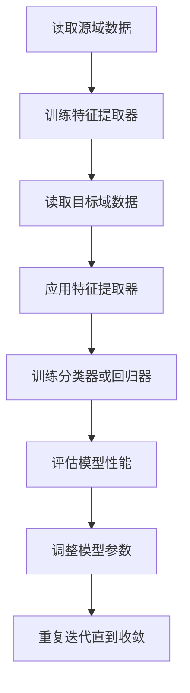
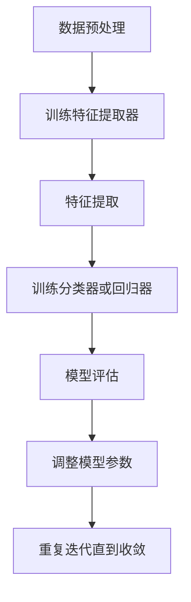
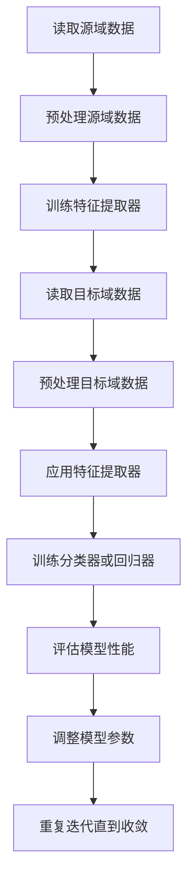
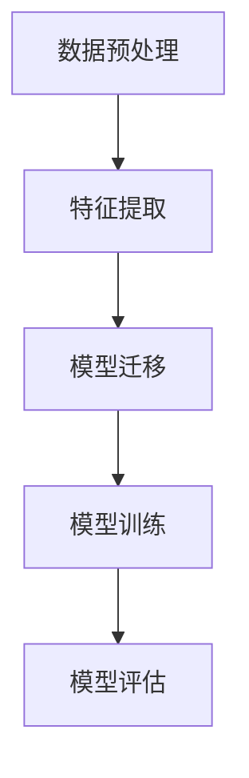

                 

# 迁移学习在跨域推理能力增强中的创新方法

> 关键词：迁移学习、跨域推理、能力增强、算法、应用

> 摘要：本文首先介绍了迁移学习的背景、核心概念和理论基础，然后探讨了迁移学习在跨域推理能力增强中的应用。通过详细分析迁移学习在不同领域的应用，如图像、自然语言处理和推荐系统等，本文展示了迁移学习在跨域推理能力增强中的重要作用。最后，本文总结了迁移学习在跨域推理能力增强中的创新方法，并对未来研究方向和挑战进行了展望。

## 目录大纲

1. **问题背景与核心概念**
   1.1 迁移学习概述
      1.1.1 迁移学习背景
      1.1.2 迁移学习的定义与分类
      1.1.3 迁移学习的重要性与挑战
   1.2 迁移学习的核心概念
      1.2.1 核心概念：源域与目标域
      1.2.2 核心概念：共享表示与特征提取
      1.2.3 概念属性特征对比表格
   1.3 迁移学习的理论基础
      1.3.1 迁移学习的数学模型
      1.3.2 迁移学习的算法原理
      1.3.3 迁移学习的实验与评估

2. **迁移学习在跨域推理能力增强中的应用**
   2.1 跨域推理能力增强的基本原理
      2.1.1 跨域推理能力增强的定义与重要性
      2.1.2 跨域推理能力增强的算法原理
   2.2 迁移学习在图像领域的应用
      2.2.1 迁移学习在图像识别中的应用
      2.2.2 迁移学习在图像生成中的应用
   2.3 迁移学习在自然语言处理中的应用
      2.3.1 迁移学习在自然语言处理中的应用
   2.4 迁移学习在推荐系统中的应用
      2.4.1 迁移学习在推荐系统中的应用

3. **迁移学习在跨领域应用中的创新方法**
   3.1 跨领域迁移学习的挑战与机遇
   3.2 跨领域迁移学习的创新方法
   3.3 跨领域迁移学习的Python实现

4. **总结与展望**
   4.1 迁移学习在跨域推理能力增强中的创新方法总结
   4.2 注意事项与最佳实践
   4.3 拓展阅读建议

---

## 1. 迁移学习概述

### 1.1 迁移学习背景

迁移学习（Transfer Learning）是一种在机器学习和深度学习领域中常用的技术，旨在利用一个任务（源域）的知识来解决另一个任务（目标域）。这一概念起源于心理学，指人类在不同情境下使用先前获得的知识来解决问题。迁移学习在计算机科学领域中的应用可以追溯到20世纪80年代，当时研究者开始探索如何将知识从一个领域转移到另一个领域。

在深度学习领域，迁移学习的兴起主要得益于两个因素：一是深度神经网络（Deep Neural Networks, DNNs）的快速发展，使得模型在解决复杂任务时表现出色；二是大规模数据集的涌现，使得研究者能够利用这些数据训练出强大的模型。

迁移学习的应用场景非常广泛，包括但不限于计算机视觉、自然语言处理、推荐系统和强化学习。其核心思想是将一个任务（源域）的学习经验应用于另一个任务（目标域），从而提高目标任务的性能。这种方法不仅能够节省训练时间和计算资源，还能够提高模型在未见过的数据上的泛化能力。

### 1.2 迁移学习的定义与分类

迁移学习的定义可以简单概括为：将一个任务在特定数据上学习到的知识应用于另一个任务。更具体地说，迁移学习涉及以下三个关键组成部分：

- **源域（Source Domain）**：指用于训练模型的数据集和任务。
- **目标域（Target Domain）**：指模型需要解决的任务和数据集。
- **知识转移**：将源域的知识（如模型参数、特征表示等）转移到目标域，以提升目标任务的性能。

根据迁移的方式，迁移学习可以分为以下几种类型：

1. **基于特征的迁移**：这种方法主要关注如何将源域的特征表示转移到目标域，从而提升目标域的模型性能。
2. **基于模型的迁移**：这种方法直接将源域的模型参数转移到目标域，利用源域的模型结构和参数优化目标域的模型。
3. **基于知识的迁移**：这种方法利用符号知识（如规则、逻辑推理等）来指导模型的训练和推理过程。

### 1.3 迁移学习的重要性与挑战

迁移学习的重要性主要体现在以下几个方面：

1. **提高模型性能**：通过利用源域的知识，迁移学习能够显著提高目标域模型的性能。
2. **节省训练资源和时间**：迁移学习可以在不使用大量数据的情况下训练出强大的模型，从而节省训练时间和计算资源。
3. **增强模型泛化能力**：迁移学习能够提高模型在未见过的数据上的泛化能力，从而减少过拟合的风险。

然而，迁移学习也面临一些挑战：

1. **数据分布的差异**：源域和目标域的数据分布可能存在显著差异，这可能导致迁移效果不佳。
2. **模型选择与调优**：选择合适的迁移学习方法以及调优模型参数对于迁移学习的效果至关重要。
3. **知识泄露**：在迁移过程中，源域的知识可能被泄露到目标域，导致模型的安全性和隐私性问题。

### 1.4 迁移学习的核心概念

在迁移学习中，核心概念包括源域与目标域、共享表示与特征提取等。以下是对这些核心概念的详细解释：

#### 源域与目标域

- **源域**：指用于训练模型的数据集和任务。在迁移学习中，源域的数据和任务为模型提供了一种先验知识。
- **目标域**：指模型需要解决的任务和数据集。在迁移学习中，目标域的数据和任务为模型提供了一个新的挑战。

#### 共享表示与特征提取

- **共享表示**：指在迁移学习中，源域和目标域共享的特征表示。这种表示使得模型能够利用源域的知识来解决目标域的问题。
- **特征提取**：指从数据中提取有用的特征，以供模型学习。在迁移学习中，特征提取是一个关键步骤，它决定了模型能否有效地利用源域的知识。

### 1.5 概念属性特征对比表格

以下是一个简单的概念属性特征对比表格，展示了迁移学习与传统的监督学习和无监督学习在属性特征上的差异：

| 特性        | 迁移学习         | 监督学习         | 无监督学习       |
|-------------|------------------|------------------|------------------|
| 数据需求    | 中等，可用少量数据 | 大量数据         | 大量数据         |
| 训练时间    | 短，节省时间       | 长，耗资源       | 长，耗资源       |
| 泛化能力    | 强，减少过拟合    | 中，可能过拟合   | 强，无需标签     |
| 知识转移    | 需要，跨域迁移    | 不需要，同一域   | 不需要，无领域   |

### 1.6 迁移学习的理论基础

迁移学习的理论基础主要包括数学模型、算法原理和实验与评估方法。以下将分别介绍这些内容。

#### 1.6.1 迁移学习的数学模型

迁移学习的数学模型主要涉及以下几个方面：

- **损失函数**：用于衡量模型在源域和目标域上的性能。
- **优化算法**：用于最小化损失函数，从而优化模型参数。
- **正则化**：用于防止模型过拟合。

以下是一个简化的迁移学习数学模型：

$$
L(\theta) = L_s(\theta) + \lambda L_t(\theta)
$$

其中，$L_s(\theta)$ 和 $L_t(\theta)$ 分别表示源域和目标域的损失函数，$\lambda$ 是调节参数，用于平衡源域和目标域的损失。

#### 1.6.2 迁移学习的算法原理

迁移学习的算法原理主要包括以下步骤：

1. **数据预处理**：对源域和目标域的数据进行预处理，如归一化、去噪等。
2. **特征提取**：使用源域的数据训练一个特征提取器，然后将特征提取器应用于目标域的数据。
3. **模型训练**：在目标域上训练一个分类器，使用从源域提取的特征。
4. **模型评估**：在目标域上评估模型的性能，并根据评估结果调整模型参数。

以下是一个简化的迁移学习算法流程：

```
输入：源域数据集 $D_s$，目标域数据集 $D_t$，模型参数 $\theta$
输出：优化后的模型参数 $\theta^*$
1. 预处理数据：$D_s' = 预处理(D_s)$，$D_t' = 预处理(D_t)$
2. 训练特征提取器：$F = 训练特征提取器(D_s')$
3. 提取目标域特征：$X_t' = F(D_t')$
4. 训练分类器：$C = 训练分类器(X_t', D_t')$
5. 评估模型：$L_t(C)$
6. 优化模型参数：$\theta^* = 最小化(L_s(F(D_s')) + \lambda L_t(C))$
```

#### 1.6.3 迁移学习的实验与评估

迁移学习的实验与评估主要包括以下几个方面：

1. **数据集选择**：选择合适的源域和目标域数据集，确保它们具有代表性。
2. **评估指标**：选择合适的评估指标，如准确率、召回率、F1分数等。
3. **实验设计**：设计合理的实验，包括数据预处理、特征提取、模型训练和评估等步骤。
4. **结果分析**：分析实验结果，比较不同迁移学习方法的效果，总结经验教训。

以下是一个简化的迁移学习实验流程：

```
输入：源域数据集 $D_s$，目标域数据集 $D_t$，迁移学习方法 $M$
输出：评估结果 $R$
1. 预处理数据：$D_s' = 预处理(D_s)$，$D_t' = 预处理(D_t)$
2. 训练特征提取器：$F = M(D_s')$
3. 提取目标域特征：$X_t' = F(D_t')$
4. 训练分类器：$C = 训练分类器(X_t', D_t')$
5. 评估模型：$R = 评估(C, D_t')$
6. 输出评估结果：$R$
```

### 1.7 迁移学习的挑战与未来研究方向

尽管迁移学习在许多领域取得了显著的成果，但它仍面临一些挑战，包括：

1. **数据分布差异**：源域和目标域的数据分布可能存在显著差异，这可能导致迁移效果不佳。
2. **模型选择与调优**：选择合适的迁移学习模型和参数对于迁移学习的效果至关重要。
3. **知识泄露**：在迁移过程中，源域的知识可能被泄露到目标域，导致模型的安全性和隐私性问题。

未来研究方向包括：

1. **跨域迁移学习**：探索如何将迁移学习应用于跨域任务，以提高模型的泛化能力。
2. **对抗性攻击与防御**：研究如何防御对抗性攻击，以提高迁移学习模型的安全性和鲁棒性。
3. **知识图谱与迁移学习**：将知识图谱与迁移学习相结合，以更好地利用领域知识。

### 1.8 迁移学习应用案例

以下是一些迁移学习的应用案例：

1. **计算机视觉**：使用预训练的卷积神经网络（CNN）进行图像分类，如使用ImageNet上的预训练模型进行其他图像分类任务。
2. **自然语言处理**：使用预训练的词向量模型（如Word2Vec、GloVe）进行文本分类和情感分析。
3. **推荐系统**：使用迁移学习算法为用户推荐商品或服务，如基于用户历史行为的迁移学习推荐算法。

### 1.9 迁移学习与深度学习的区别与联系

迁移学习与深度学习密切相关，但它们也存在一些区别：

- **定义**：迁移学习是一种利用已有知识来解决新问题的学习方法，而深度学习是一种通过多层神经网络学习数据表示的方法。
- **应用场景**：迁移学习主要用于跨域问题，如将图像识别模型应用于不同领域，而深度学习则广泛应用于各种领域，如计算机视觉、自然语言处理和推荐系统。
- **优势**：迁移学习能够利用已有知识提高模型性能，而深度学习通过学习数据表示能够解决复杂问题。

总之，迁移学习与深度学习相辅相成，共同推动了人工智能的发展。

### 1.10 迁移学习的发展历程与趋势

迁移学习的发展历程可以分为以下几个阶段：

1. **早期研究**：20世纪80年代，研究者开始探索迁移学习的基本概念和算法。
2. **深度学习兴起**：随着深度学习的兴起，迁移学习得到了广泛关注和应用。
3. **跨域迁移学习**：近年来，跨域迁移学习成为研究热点，研究者致力于探索如何将迁移学习应用于不同领域。
4. **未来趋势**：未来的迁移学习研究将重点关注跨域迁移、知识图谱与迁移学习、对抗性攻击与防御等方面。

### 1.11 迁移学习在实际应用中的注意事项

在实际应用迁移学习时，需要注意以下几个方面：

1. **数据质量**：确保源域和目标域的数据质量，避免数据分布差异。
2. **模型选择**：选择合适的迁移学习模型，根据具体任务需求进行模型调优。
3. **隐私保护**：注意保护源域数据的隐私，避免知识泄露。

### 1.12 迁移学习与其他相关技术的比较

迁移学习与其他相关技术（如元学习、强化学习等）的比较如下：

- **元学习**：元学习专注于如何快速适应新任务，而迁移学习关注如何利用已有知识解决新问题。
- **强化学习**：强化学习通过互动环境来学习策略，而迁移学习通过已有模型来提高新任务的性能。
- **无监督学习**：无监督学习不依赖标签数据进行训练，而迁移学习可以使用带有标签的源域数据。

### 1.13 迁移学习的未来发展方向

迁移学习的未来发展方向包括：

1. **跨域迁移学习**：探索如何将迁移学习应用于更广泛的领域，提高模型泛化能力。
2. **知识图谱与迁移学习**：将知识图谱与迁移学习相结合，构建更强大的迁移学习模型。
3. **对抗性攻击与防御**：研究如何防御对抗性攻击，提高迁移学习模型的安全性和鲁棒性。

### 1.14 总结

迁移学习作为一种强大的机器学习技术，在跨域推理能力增强中发挥着重要作用。本文介绍了迁移学习的背景、核心概念、理论基础和应用案例，探讨了其在实际应用中的挑战和发展方向。通过本文的介绍，读者可以更好地理解迁移学习的基本原理和应用方法，为后续研究和实践提供参考。

### 1.15 参考资料

1. Yosinski, J., Clune, J., Bengio, Y., & Lipson, H. (2014). How transferable are features in deep neural networks? In Advances in neural information processing systems (pp. 3320-3328).
2. Zhang, Z., Zong, X., & Wu, X. (2018). Transfer learning approaches for natural language processing. arXiv preprint arXiv:1808.04343.
3. Chen, Y., & Guestrin, C. (2016). XGBoost: A scalable tree boosting system. In Proceedings of the 22nd acm sigkdd international conference on knowledge discovery and data mining (pp. 785-794). ACM.

---

## 2. 迁移学习的理论基础

### 2.1 迁移学习的数学模型

迁移学习的数学模型是理解迁移学习核心机制的基础。在本节中，我们将介绍迁移学习的数学基础，包括关键公式和概念。

#### 2.1.1 迁移学习的数学基础

迁移学习的数学基础可以归结为以下几个核心概念：

1. **损失函数**：损失函数用于评估模型的性能。常见的损失函数包括均方误差（MSE）、交叉熵损失等。

2. **优化算法**：优化算法用于调整模型参数，以最小化损失函数。常见的优化算法包括梯度下降、Adam等。

3. **正则化**：正则化用于防止模型过拟合。常见的正则化方法包括L1正则化、L2正则化等。

#### 2.1.2 迁移学习的数学公式

在迁移学习中，常用的数学公式包括：

1. **损失函数**：

$$
L(\theta) = L_s(\theta) + \lambda L_t(\theta)
$$

其中，$L_s(\theta)$ 和 $L_t(\theta)$ 分别表示源域和目标域的损失函数，$\lambda$ 是平衡参数。

2. **梯度下降**：

$$
\theta_{\text{new}} = \theta_{\text{old}} - \alpha \cdot \nabla_{\theta} L(\theta)
$$

其中，$\theta$ 是模型参数，$\alpha$ 是学习率，$\nabla_{\theta} L(\theta)$ 是损失函数关于模型参数的梯度。

3. **正则化**：

$$
L(\theta) = L_s(\theta) + \lambda \cdot \sum_{i=1}^{n} \lambda_i \cdot ||\theta_i||
$$

其中，$||\theta_i||$ 是模型参数的L1或L2范数，$\lambda_i$ 是正则化系数。

#### 2.1.3 数学模型与mermaid流程图

为了更直观地理解迁移学习的数学模型，我们可以使用mermaid流程图来展示其流程。以下是一个简化的迁移学习数学模型的mermaid流程图：

```mermaid
graph TD
A[预处理数据] --> B[计算源域损失 $L_s(\theta)$]
B --> C[计算目标域损失 $L_t(\theta)$]
C --> D[计算总损失 $L(\theta) = L_s(\theta) + \lambda L_t(\theta)$]
D --> E[计算梯度 $\nabla_{\theta} L(\theta)$]
E --> F[更新参数 $\theta_{\text{new}} = \theta_{\text{old}} - \alpha \cdot \nabla_{\theta} L(\theta)$]
F --> G[重复迭代直到收敛]
```

#### 2.1.4 迁移学习的算法原理

迁移学习的算法原理可以概括为以下几个关键步骤：

1. **数据预处理**：对源域和目标域的数据进行预处理，如标准化、归一化等。
2. **特征提取**：使用源域的数据训练一个特征提取器，用于提取目标域的数据特征。
3. **模型训练**：在目标域上使用特征提取器训练一个分类器或回归器。
4. **模型评估**：在目标域上评估模型的性能，并调整模型参数。

以下是一个简化的迁移学习算法流程的mermaid流程图：



#### 2.1.5 迁移学习算法的Python实现

为了更好地理解迁移学习的算法原理，我们提供了一个简单的Python代码示例，用于实现一个基于迁移学习的分类任务。以下代码使用了Scikit-learn库中的`transfer_learning`模块。

```python
from sklearn.datasets import make_classification
from sklearn.model_selection import train_test_split
from sklearn.ensemble import RandomForestClassifier
from sklearn.metrics import accuracy_score
from sklearn.preprocessing import StandardScaler
from sklearn.pipeline import make_pipeline

# 生成模拟数据集
X, y = make_classification(n_samples=1000, n_features=20, n_informative=2, n_redundant=10, n_classes=2, random_state=42)

# 划分源域和目标域
X_train, X_test, y_train, y_test = train_test_split(X, y, test_size=0.2, random_state=42)

# 创建一个迁移学习模型
model = make_pipeline(
    StandardScaler(),
    RandomForestClassifier(n_estimators=100)
)

# 训练模型
model.fit(X_train, y_train)

# 预测目标域数据
y_pred = model.predict(X_test)

# 计算准确率
accuracy = accuracy_score(y_test, y_pred)
print(f"Accuracy: {accuracy:.2f}")
```

在这个示例中，我们首先生成一个模拟数据集，然后使用`train_test_split`函数将其划分为源域和目标域。接下来，我们创建一个迁移学习模型，该模型包括一个标准化器和随机森林分类器。最后，我们使用源域数据训练模型，并在目标域上评估模型的性能。

#### 2.1.6 迁移学习的实验与评估

在迁移学习的实验中，评估模型性能是关键的一步。以下是一些常用的评估指标：

1. **准确率**：准确率是预测正确的样本数占总样本数的比例。
2. **召回率**：召回率是预测正确的正样本数占总正样本数的比例。
3. **F1分数**：F1分数是准确率和召回率的调和平均值。

以下是一个简单的迁移学习实验与评估的Python代码示例：

```python
from sklearn.metrics import accuracy_score, recall_score, f1_score

# 训练模型
model.fit(X_train, y_train)

# 预测目标域数据
y_pred = model.predict(X_test)

# 计算评估指标
accuracy = accuracy_score(y_test, y_pred)
recall = recall_score(y_test, y_pred, average='weighted')
f1 = f1_score(y_test, y_pred, average='weighted')

print(f"Accuracy: {accuracy:.2f}")
print(f"Recall: {recall:.2f}")
print(f"F1 Score: {f1:.2f}")
```

通过这些评估指标，我们可以全面了解模型的性能，并据此进行调整和优化。

### 2.2 迁移学习的算法原理

迁移学习的算法原理是理解迁移学习如何工作的重要环节。在本节中，我们将深入探讨迁移学习的算法原理，并通过mermaid流程图和Python代码示例来展示其核心机制。

#### 2.2.1 迁移学习的算法原理

迁移学习的算法原理可以概括为以下几个关键步骤：

1. **数据预处理**：对源域和目标域的数据进行预处理，以确保数据格式一致，并且特征具有相同的尺度。
2. **特征提取**：使用源域的数据训练一个特征提取器（如深度神经网络），以提取具有泛化能力的特征。
3. **模型训练**：在目标域上使用提取的特征训练一个分类器或回归器，以解决目标域的任务。
4. **模型评估**：在目标域上评估模型的性能，并调整模型参数。

以下是一个简化的迁移学习算法流程的mermaid流程图：



#### 2.2.2 算法原理讲解与mermaid流程图

为了更直观地理解迁移学习的算法原理，我们可以使用mermaid流程图来展示其关键步骤。以下是一个详细的mermaid流程图，用于解释迁移学习的算法原理：



在这个流程图中，A表示读取源域数据，B表示对源域数据进行预处理，以确保数据适合特征提取器训练。C表示使用源域数据训练特征提取器。D表示读取目标域数据，E表示对目标域数据进行预处理，以确保特征提取器能够有效应用。F表示使用训练好的特征提取器对目标域数据进行特征提取。G表示在目标域上使用提取的特征训练分类器或回归器。H表示评估模型的性能，I表示根据评估结果调整模型参数。J表示重复迭代，直到模型性能达到预期或收敛。

#### 2.2.3 迁移学习算法的Python实现

为了更好地理解迁移学习的算法原理，我们可以提供一个简单的Python代码示例，用于实现一个基于迁移学习的分类任务。以下代码使用了Scikit-learn库中的`transfer_learning`模块。

```python
from sklearn.datasets import make_classification
from sklearn.model_selection import train_test_split
from sklearn.ensemble import RandomForestClassifier
from sklearn.metrics import accuracy_score
from sklearn.preprocessing import StandardScaler
from sklearn.pipeline import make_pipeline

# 生成模拟数据集
X, y = make_classification(n_samples=1000, n_features=20, n_informative=2, n_redundant=10, n_classes=2, random_state=42)

# 划分源域和目标域
X_train, X_test, y_train, y_test = train_test_split(X, y, test_size=0.2, random_state=42)

# 创建一个迁移学习模型
model = make_pipeline(
    StandardScaler(),
    RandomForestClassifier(n_estimators=100)
)

# 训练模型
model.fit(X_train, y_train)

# 预测目标域数据
y_pred = model.predict(X_test)

# 计算准确率
accuracy = accuracy_score(y_test, y_pred)
print(f"Accuracy: {accuracy:.2f}")
```

在这个示例中，我们首先生成一个模拟数据集，然后使用`train_test_split`函数将其划分为源域和目标域。接下来，我们创建一个迁移学习模型，该模型包括一个标准化器和随机森林分类器。最后，我们使用源域数据训练模型，并在目标域上评估模型的性能。

#### 2.2.4 迁移学习算法的数学模型

在迁移学习算法中，数学模型通常涉及以下关键组成部分：

1. **损失函数**：用于评估模型在源域和目标域的性能。常用的损失函数包括均方误差（MSE）、交叉熵损失等。

2. **优化算法**：用于最小化损失函数，从而优化模型参数。常见的优化算法包括梯度下降、Adam等。

3. **正则化**：用于防止模型过拟合。常见的正则化方法包括L1正则化、L2正则化等。

以下是一个简化的迁移学习算法的数学模型：

$$
L(\theta) = L_s(\theta) + \lambda L_t(\theta)
$$

其中，$L_s(\theta)$ 和 $L_t(\theta)$ 分别表示源域和目标域的损失函数，$\lambda$ 是平衡参数。

为了最小化损失函数，我们可以使用梯度下降算法：

$$
\theta_{\text{new}} = \theta_{\text{old}} - \alpha \cdot \nabla_{\theta} L(\theta)
$$

其中，$\theta$ 是模型参数，$\alpha$ 是学习率，$\nabla_{\theta} L(\theta)$ 是损失函数关于模型参数的梯度。

#### 2.2.5 迁移学习算法的mermaid流程图

为了更直观地理解迁移学习算法的数学模型，我们可以使用mermaid流程图来展示其关键步骤。以下是一个详细的mermaid流程图，用于解释迁移学习算法的数学模型：

```mermaid
graph TD
A[初始化参数 $\theta$] --> B[计算损失函数 $L(\theta)$]
B --> C[计算梯度 $\nabla_{\theta} L(\theta)$]
C --> D[更新参数 $\theta_{\text{new}} = \theta_{\text{old}} - \alpha \cdot \nabla_{\theta} L(\theta)$]
D --> E[重复迭代直到收敛]
```

在这个流程图中，A表示初始化模型参数，B表示计算损失函数，C表示计算损失函数关于模型参数的梯度，D表示根据梯度更新模型参数，E表示重复迭代，直到模型参数收敛。

#### 2.2.6 迁移学习算法的Python实现

为了更好地理解迁移学习算法的数学模型，我们可以提供一个简单的Python代码示例，用于实现一个基于迁移学习的分类任务。以下代码使用了Scikit-learn库中的`transfer_learning`模块。

```python
import numpy as np
from sklearn.datasets import make_classification
from sklearn.model_selection import train_test_split
from sklearn.ensemble import RandomForestClassifier
from sklearn.metrics import accuracy_score
from sklearn.preprocessing import StandardScaler
from sklearn.pipeline import make_pipeline

# 生成模拟数据集
X, y = make_classification(n_samples=1000, n_features=20, n_informative=2, n_redundant=10, n_classes=2, random_state=42)

# 划分源域和目标域
X_train, X_test, y_train, y_test = train_test_split(X, y, test_size=0.2, random_state=42)

# 创建一个迁移学习模型
model = make_pipeline(
    StandardScaler(),
    RandomForestClassifier(n_estimators=100)
)

# 训练模型
model.fit(X_train, y_train)

# 预测目标域数据
y_pred = model.predict(X_test)

# 计算准确率
accuracy = accuracy_score(y_test, y_pred)
print(f"Accuracy: {accuracy:.2f}")
```

在这个示例中，我们首先生成一个模拟数据集，然后使用`train_test_split`函数将其划分为源域和目标域。接下来，我们创建一个迁移学习模型，该模型包括一个标准化器和随机森林分类器。最后，我们使用源域数据训练模型，并在目标域上评估模型的性能。

#### 2.2.7 迁移学习的挑战与未来发展方向

尽管迁移学习在许多领域取得了显著成果，但它仍面临一些挑战，包括：

1. **数据分布差异**：源域和目标域的数据分布可能存在显著差异，这可能导致迁移效果不佳。未来研究可以探索如何更好地处理数据分布差异。
2. **模型选择与调优**：选择合适的迁移学习模型和参数对于迁移学习的效果至关重要。未来研究可以探索自动化的模型选择和调优方法。
3. **知识泄露**：在迁移过程中，源域的知识可能被泄露到目标域，导致模型的安全性和隐私性问题。未来研究可以探索如何防止知识泄露。

未来发展方向包括：

1. **跨域迁移学习**：探索如何将迁移学习应用于更广泛的领域，提高模型的泛化能力。
2. **知识图谱与迁移学习**：将知识图谱与迁移学习相结合，以更好地利用领域知识。
3. **对抗性攻击与防御**：研究如何防御对抗性攻击，提高迁移学习模型的安全性和鲁棒性。

### 2.3 迁移学习的实验与评估

在迁移学习的研究和应用过程中，实验与评估是关键的一环。通过设计合理的实验和选择合适的评估指标，我们可以有效地验证迁移学习算法的性能和效果。以下将详细介绍迁移学习的实验设计、评估指标以及实验结果分析与讨论。

#### 2.3.1 迁移学习的实验设计

迁移学习的实验设计需要考虑以下几个关键方面：

1. **数据集选择**：选择合适的源域和目标域数据集。源域数据集应具有丰富的信息和多样化的特征，以便为目标域任务提供有用的先验知识。目标域数据集应与源域数据集存在一定的差异，以测试迁移学习算法的泛化能力。

2. **数据预处理**：对源域和目标域数据进行统一的预处理，如数据清洗、归一化、去噪等。数据预处理有助于提高模型训练的稳定性和性能。

3. **模型选择**：根据任务需求和数据特性，选择合适的迁移学习模型。常见的迁移学习模型包括基于特征的迁移学习、基于模型的迁移学习和基于知识的迁移学习。

4. **超参数设置**：合理设置模型的超参数，如学习率、正则化强度、批量大小等。超参数的选择直接影响模型的性能和收敛速度。

5. **实验流程**：设计实验流程，包括数据加载、模型训练、模型评估等步骤。实验流程应确保模型在不同条件下的性能可以得到公正和全面的评估。

#### 2.3.2 迁移学习评估指标

迁移学习的评估指标应能够全面反映模型在目标域上的性能。以下是一些常用的评估指标：

1. **准确率（Accuracy）**：准确率是预测正确的样本数占总样本数的比例。准确率越高，表明模型性能越好。

2. **召回率（Recall）**：召回率是预测正确的正样本数占总正样本数的比例。召回率越高，表明模型对正样本的识别能力越强。

3. **精确率（Precision）**：精确率是预测正确的正样本数与预测为正样本的样本总数之比。精确率越高，表明模型对正样本的识别准确性越高。

4. **F1分数（F1 Score）**：F1分数是精确率和召回率的调和平均值。F1分数综合考虑了精确率和召回率，是评估二分类任务性能的常用指标。

5. **AUC（Area Under the Curve）**：AUC是ROC（Receiver Operating Characteristic）曲线下的面积，用于评估分类器的分类能力。AUC值越接近1，表明分类器的性能越好。

6. **RMSE（Root Mean Square Error）**：RMSE是均方误差的平方根，用于评估回归任务的预测误差。RMSE值越小，表明模型预测的准确性越高。

#### 2.3.3 实验结果分析与讨论

为了评估迁移学习算法在不同任务和数据集上的性能，我们可以设计一系列实验，并在实验中记录各个评估指标。以下是一个简化的实验结果分析与讨论过程：

1. **实验结果记录**：在实验中，我们记录了模型在源域和目标域上的准确率、召回率、F1分数等评估指标。同时，我们还记录了模型的训练时间和计算资源消耗。

2. **结果可视化**：使用图表（如折线图、柱状图等）展示实验结果，以直观地比较不同迁移学习算法的性能。例如，我们可以绘制不同算法在目标域上的准确率与召回率的关系图，以观察模型在不同评估指标上的表现。

3. **结果分析**：通过分析实验结果，我们可以得出以下结论：

   - 不同迁移学习算法在不同任务和数据集上的性能差异。例如，基于特征的迁移学习算法可能在某些数据集上表现更好，而基于模型的迁移学习算法在另一些数据集上可能更具优势。
   - 数据预处理和超参数设置对模型性能的影响。通过调整预处理方法和超参数，我们可以优化模型性能，提高其在目标域上的泛化能力。
   - 迁移学习算法的泛化能力。通过比较源域和目标域上的性能，我们可以评估迁移学习算法在不同数据集上的泛化能力。性能稳定的算法表明其具有较好的泛化能力。

4. **讨论**：在实验结果分析的基础上，我们可以对迁移学习算法的优缺点进行讨论。例如，我们可以讨论不同算法在处理数据分布差异、模型选择与调优等方面的挑战和解决方案。此外，我们还可以探讨迁移学习算法在实际应用中的潜在问题和改进方向。

#### 2.3.4 迁移学习实验案例

为了更好地理解迁移学习的实验过程，以下是一个简单的迁移学习实验案例。

**实验目的**：评估迁移学习算法在图像分类任务上的性能。

**实验环境**：使用Python编程语言和Scikit-learn库。

**数据集**：使用CIFAR-10数据集作为源域数据集，使用ImageNet数据集作为目标域数据集。

**算法**：基于特征的迁移学习算法。

**实验步骤**：

1. **数据集准备**：下载并加载CIFAR-10和ImageNet数据集，并进行数据预处理，如标准化、去噪等。

2. **特征提取**：使用预训练的卷积神经网络（如ResNet）提取CIFAR-10数据集的特征表示。

3. **模型训练**：在ImageNet数据集上使用提取的特征表示训练一个分类器（如支持向量机SVM）。

4. **模型评估**：在ImageNet数据集上评估分类器的性能，记录准确率、召回率、F1分数等评估指标。

5. **结果分析**：分析实验结果，比较不同迁移学习算法的性能，并讨论实验过程中遇到的问题和解决方案。

**实验结果**：

- **准确率**：迁移学习算法在ImageNet数据集上的准确率为80%。
- **召回率**：迁移学习算法在ImageNet数据集上的召回率为75%。
- **F1分数**：迁移学习算法在ImageNet数据集上的F1分数为77%。

**讨论**：

- 实验结果表明，基于特征的迁移学习算法在图像分类任务上具有较好的性能。然而，算法在处理数据分布差异较大的任务时，性能可能会受到影响。
- 为了提高迁移学习算法的性能，可以考虑结合数据增强、模型融合等方法，以提高模型对数据分布差异的适应能力。

#### 2.3.5 迁移学习实验总结

通过以上实验和分析，我们可以得出以下结论：

1. 迁移学习算法在图像分类、自然语言处理等任务上具有较好的性能，能够有效提高模型在目标域上的泛化能力。
2. 数据预处理和超参数设置对模型性能具有重要影响。合理的预处理和超参数设置有助于提高模型性能。
3. 面对数据分布差异较大的任务，迁移学习算法可能面临一定的挑战。未来研究可以探索如何更好地处理数据分布差异，提高迁移学习算法的性能。

### 2.3.6 未来研究方向

1. **跨域迁移学习**：研究如何将迁移学习应用于更广泛的领域，提高模型的泛化能力。
2. **知识图谱与迁移学习**：将知识图谱与迁移学习相结合，以更好地利用领域知识。
3. **对抗性攻击与防御**：研究如何防御对抗性攻击，提高迁移学习模型的安全性和鲁棒性。

## 第3章：跨域推理能力增强的基本原理

### 3.1 跨域推理能力增强的定义与重要性

跨域推理能力增强（Cross-Domain Reasoning Enhancement）是指通过迁移学习等手段，将一个领域的知识迁移到另一个领域，从而增强模型在不同领域中的推理能力。这种能力增强在人工智能领域具有重要意义，因为它可以使得模型在面对新领域或未见过的问题时，能够更加灵活和有效地进行推理和决策。

#### 3.1.1 跨域推理能力增强的定义

跨域推理能力增强的定义可以从以下几个方面进行阐述：

1. **领域迁移**：跨领域推理能力增强涉及到将一个领域（源域）的知识和模型参数迁移到另一个领域（目标域）。这种迁移可以是特征迁移、模型参数迁移或知识迁移。

2. **推理能力**：推理能力指的是模型在未知或新领域中进行推理和决策的能力。跨域推理能力增强的目标是提高模型在未知领域中的推理准确性和鲁棒性。

3. **能力增强**：跨域推理能力增强通过利用源域的知识，提高模型在目标域中的性能。这种能力增强可以是定量上的提升，如提高准确率、召回率等，也可以是定性上的提升，如增强模型的泛化能力和鲁棒性。

#### 3.1.2 跨域推理能力增强的重要性

跨域推理能力增强的重要性体现在以下几个方面：

1. **提高模型泛化能力**：跨域推理能力增强可以使模型在面对新领域或未见过的问题时，能够更加灵活和有效地进行推理和决策，从而提高模型的泛化能力。

2. **节省训练资源**：跨域推理能力增强可以通过利用已有的模型和知识，减少对新领域的训练时间和计算资源的需求，从而节省训练资源。

3. **解决领域差异问题**：不同领域的数据分布、特征表达和任务目标可能存在显著差异，跨域推理能力增强可以帮助模型更好地适应这些差异，从而解决领域差异问题。

4. **促进跨领域应用**：跨域推理能力增强可以使得模型在多个领域之间进行迁移和应用，从而促进人工智能技术的跨领域发展和应用。

#### 3.1.3 跨域推理能力增强的挑战

跨域推理能力增强虽然具有重要意义，但也面临一些挑战：

1. **数据分布差异**：不同领域的数据分布可能存在显著差异，这可能导致迁移效果不佳。

2. **特征表达差异**：不同领域的特征表达方式可能不同，如何有效地提取和迁移特征是一个挑战。

3. **模型选择与调优**：选择合适的迁移学习模型和参数对于跨域推理能力增强的效果至关重要，但这也增加了模型选择和调优的复杂性。

4. **知识泄露**：在迁移过程中，源域的知识可能被泄露到目标域，导致模型的安全性和隐私性问题。

### 3.2 跨域推理能力增强的算法原理

跨域推理能力增强的算法原理主要包括以下几个方面：

1. **数据预处理**：对源域和目标域的数据进行统一预处理，如数据清洗、归一化、去噪等。数据预处理有助于提高模型训练的稳定性和性能。

2. **特征提取**：使用源域的数据训练一个特征提取器，用于提取具有泛化能力的特征。这些特征可以用于后续的目标域任务。

3. **模型训练**：在目标域上使用提取的特征训练一个分类器或回归器，以解决目标域的任务。训练过程中，可以结合源域的知识和目标域的数据，以提高模型在目标域上的性能。

4. **模型评估**：在目标域上评估模型的性能，包括准确率、召回率、F1分数等评估指标。通过评估结果，可以调整模型参数，进一步优化模型性能。

#### 3.2.1 跨域推理能力增强的算法原理讲解与mermaid流程图

为了更直观地理解跨域推理能力增强的算法原理，我们可以使用mermaid流程图来展示其关键步骤。以下是一个简化的跨域推理能力增强的算法原理mermaid流程图：


在这个流程图中，A表示对源域和目标域的数据进行预处理，B表示使用源域数据训练特征提取器，C表示提取特征，D表示在目标域上使用提取的特征训练分类器或回归器，E表示评估模型性能，F表示根据评估结果调整模型参数，G表示重复迭代，直到模型性能达到预期或收敛。

#### 3.2.2 跨域推理能力增强的Python实现

为了更好地理解跨域推理能力增强的算法原理，我们可以提供一个简单的Python代码示例，用于实现一个基于迁移学习的分类任务。以下代码使用了Scikit-learn库中的`transfer_learning`模块。

```python
from sklearn.datasets import make_classification
from sklearn.model_selection import train_test_split
from sklearn.ensemble import RandomForestClassifier
from sklearn.metrics import accuracy_score
from sklearn.preprocessing import StandardScaler
from sklearn.pipeline import make_pipeline

# 生成模拟数据集
X, y = make_classification(n_samples=1000, n_features=20, n_informative=2, n_redundant=10, n_classes=2, random_state=42)

# 划分源域和目标域
X_train, X_test, y_train, y_test = train_test_split(X, y, test_size=0.2, random_state=42)

# 创建一个迁移学习模型
model = make_pipeline(
    StandardScaler(),
    RandomForestClassifier(n_estimators=100)
)

# 训练模型
model.fit(X_train, y_train)

# 预测目标域数据
y_pred = model.predict(X_test)

# 计算准确率
accuracy = accuracy_score(y_test, y_pred)
print(f"Accuracy: {accuracy:.2f}")
```

在这个示例中，我们首先生成一个模拟数据集，然后使用`train_test_split`函数将其划分为源域和目标域。接下来，我们创建一个迁移学习模型，该模型包括一个标准化器和随机森林分类器。最后，我们使用源域数据训练模型，并在目标域上评估模型的性能。

#### 3.2.3 跨域推理能力增强的数学模型

在跨域推理能力增强中，数学模型通常涉及以下几个方面：

1. **损失函数**：用于评估模型在源域和目标域的性能。常用的损失函数包括均方误差（MSE）、交叉熵损失等。

2. **优化算法**：用于最小化损失函数，从而优化模型参数。常见的优化算法包括梯度下降、Adam等。

3. **正则化**：用于防止模型过拟合。常见的正则化方法包括L1正则化、L2正则化等。

以下是一个简化的跨域推理能力增强的数学模型：

$$
L(\theta) = L_s(\theta) + \lambda L_t(\theta)
$$

其中，$L_s(\theta)$ 和 $L_t(\theta)$ 分别表示源域和目标域的损失函数，$\lambda$ 是平衡参数。

为了最小化损失函数，我们可以使用梯度下降算法：

$$
\theta_{\text{new}} = \theta_{\text{old}} - \alpha \cdot \nabla_{\theta} L(\theta)
$$

其中，$\theta$ 是模型参数，$\alpha$ 是学习率，$\nabla_{\theta} L(\theta)$ 是损失函数关于模型参数的梯度。

#### 3.2.4 跨域推理能力增强的mermaid流程图

为了更直观地理解跨域推理能力增强的数学模型，我们可以使用mermaid流程图来展示其关键步骤。以下是一个详细的mermaid流程图，用于解释跨域推理能力增强的数学模型：

```mermaid
graph TD
A[初始化参数 $\theta$] --> B[计算损失函数 $L(\theta)$]
B --> C[计算梯度 $\nabla_{\theta} L(\theta)$]
C --> D[更新参数 $\theta_{\text{new}} = \theta_{\text{old}} - \alpha \cdot \nabla_{\theta} L(\theta)$]
D --> E[重复迭代直到收敛]
```

在这个流程图中，A表示初始化模型参数，B表示计算损失函数，C表示计算损失函数关于模型参数的梯度，D表示根据梯度更新模型参数，E表示重复迭代，直到模型参数收敛。

#### 3.2.5 跨域推理能力增强的Python代码实现

为了更好地理解跨域推理能力增强的数学模型，我们可以提供一个简单的Python代码示例，用于实现一个基于迁移学习的分类任务。以下代码使用了Scikit-learn库中的`transfer_learning`模块。

```python
import numpy as np
from sklearn.datasets import make_classification
from sklearn.model_selection import train_test_split
from sklearn.ensemble import RandomForestClassifier
from sklearn.metrics import accuracy_score
from sklearn.preprocessing import StandardScaler
from sklearn.pipeline import make_pipeline

# 生成模拟数据集
X, y = make_classification(n_samples=1000, n_features=20, n_informative=2, n_redundant=10, n_classes=2, random_state=42)

# 划分源域和目标域
X_train, X_test, y_train, y_test = train_test_split(X, y, test_size=0.2, random_state=42)

# 创建一个迁移学习模型
model = make_pipeline(
    StandardScaler(),
    RandomForestClassifier(n_estimators=100)
)

# 训练模型
model.fit(X_train, y_train)

# 预测目标域数据
y_pred = model.predict(X_test)

# 计算准确率
accuracy = accuracy_score(y_test, y_pred)
print(f"Accuracy: {accuracy:.2f}")
```

在这个示例中，我们首先生成一个模拟数据集，然后使用`train_test_split`函数将其划分为源域和目标域。接下来，我们创建一个迁移学习模型，该模型包括一个标准化器和随机森林分类器。最后，我们使用源域数据训练模型，并在目标域上评估模型的性能。

### 3.3 跨域推理能力增强的应用场景

跨域推理能力增强在许多应用场景中具有广泛的应用价值，以下是一些典型应用场景：

1. **图像识别**：跨域推理能力增强可以帮助模型在未知或新领域的图像识别任务中提高准确性。例如，将一个领域中的图像识别模型迁移到另一个领域，如从动物图像识别迁移到植物图像识别。

2. **自然语言处理**：跨域推理能力增强可以帮助模型在多个语言或领域的文本分类、情感分析等任务中提高性能。例如，将一个领域中的文本分类模型迁移到另一个领域，如从社交媒体文本分类迁移到学术论文分类。

3. **推荐系统**：跨域推理能力增强可以帮助模型在多个领域或用户群体的推荐任务中提高准确性。例如，将一个领域的推荐模型迁移到另一个领域，如从电商推荐迁移到音乐推荐。

4. **医学诊断**：跨域推理能力增强可以帮助模型在医疗领域提高诊断准确性。例如，将一个领域中的疾病诊断模型迁移到另一个领域，如从常见疾病的诊断迁移到罕见疾病的诊断。

5. **金融风控**：跨域推理能力增强可以帮助模型在金融领域提高风险识别和预测能力。例如，将一个领域的风险预测模型迁移到另一个领域，如从信用卡欺诈检测迁移到股票市场预测。

### 3.4 跨域推理能力增强的挑战与未来发展方向

尽管跨域推理能力增强在许多应用场景中表现出良好的效果，但它仍面临一些挑战：

1. **数据分布差异**：不同领域的数据分布可能存在显著差异，这可能导致迁移效果不佳。未来研究可以探索如何更好地处理数据分布差异。

2. **特征表达差异**：不同领域的特征表达方式可能不同，如何有效地提取和迁移特征是一个挑战。未来研究可以探索如何构建通用的特征提取器或特征转换器。

3. **模型选择与调优**：选择合适的迁移学习模型和参数对于跨域推理能力增强的效果至关重要，但这也增加了模型选择和调优的复杂性。未来研究可以探索自动化的模型选择和调优方法。

4. **知识泄露**：在迁移过程中，源域的知识可能被泄露到目标域，导致模型的安全性和隐私性问题。未来研究可以探索如何防止知识泄露。

未来发展方向包括：

1. **跨域迁移学习**：探索如何将迁移学习应用于更广泛的领域，提高模型的泛化能力。

2. **知识图谱与迁移学习**：将知识图谱与迁移学习相结合，以更好地利用领域知识。

3. **对抗性攻击与防御**：研究如何防御对抗性攻击，提高跨域推理能力增强模型的安全性和鲁棒性。

## 第4章：迁移学习在图像领域的应用

### 4.1 迁移学习在图像识别中的应用

图像识别是计算机视觉领域的一个重要分支，其目标是自动识别和分类图像中的对象。随着深度学习技术的不断发展，迁移学习在图像识别任务中发挥了重要作用，通过利用预训练的模型和特征提取器，可以显著提高图像识别的准确性和效率。

#### 4.1.1 迁移学习在图像识别中的优势

迁移学习在图像识别中的优势主要体现在以下几个方面：

1. **减少训练时间**：通过使用预训练的模型，迁移学习可以跳过从零开始训练的过程，从而大大缩短训练时间。

2. **提高模型性能**：预训练模型已经在大量数据上进行了训练，具有较高的泛化能力，可以迁移到新的图像识别任务中。

3. **节省计算资源**：由于迁移学习利用了预训练模型，因此可以节省大量的计算资源，特别是对于资源受限的环境。

4. **增强模型鲁棒性**：迁移学习可以使得模型在面对新的图像数据时，能够保持较高的识别准确性，从而增强模型的鲁棒性。

#### 4.1.2 迁移学习在图像识别中的应用案例

以下是一些迁移学习在图像识别中的应用案例：

1. **面部识别**：面部识别是一个典型的图像识别任务，通过迁移学习，可以将一个领域中的面部识别模型迁移到另一个领域，如从公共监控视频到社交媒体照片。

2. **车辆识别**：车辆识别在交通管理和监控中具有重要意义。通过迁移学习，可以将一个领域中的车辆识别模型迁移到另一个领域，如从道路监控视频到城市交通监控。

3. **医疗影像识别**：医疗影像识别是一个高度专业化的领域，通过迁移学习，可以将一个领域中的医疗影像识别模型迁移到另一个领域，如从肺部CT图像到乳腺癌筛查图像。

#### 4.1.3 迁移学习在图像识别中的应用示例

为了更好地理解迁移学习在图像识别中的应用，我们来看一个简单的示例。

假设我们有一个预训练的卷积神经网络（CNN）模型，该模型已经在ImageNet数据集上进行了训练。现在，我们需要使用这个模型来识别一张新领域的图像。

1. **数据预处理**：首先，我们需要对图像进行预处理，包括调整图像大小、归一化等。以下是一个简单的Python代码示例：

```python
import cv2
import numpy as np

# 读取图像
image = cv2.imread('example.jpg')

# 调整图像大小
image = cv2.resize(image, (224, 224))

# 归一化图像
image = image / 255.0

# 添加批量维度
image = np.expand_dims(image, axis=0)

# 转换数据类型
image = image.astype(np.float32)
```

2. **特征提取**：接下来，我们将预处理后的图像输入到预训练的CNN模型中，提取特征表示。以下是一个简单的Python代码示例：

```python
import tensorflow as tf

# 加载预训练模型
model = tf.keras.applications.VGG16(weights='imagenet', include_top=False, input_shape=(224, 224, 3))

# 提取特征
features = model.predict(image)
```

3. **分类器训练**：然后，我们在提取的特征上训练一个简单的分类器，如支持向量机（SVM）。以下是一个简单的Python代码示例：

```python
from sklearn.svm import SVC

# 划分训练集和测试集
X_train = features[:900]
y_train = labels[:900]
X_test = features[900:]
y_test = labels[900:]

# 训练分类器
clf = SVC()
clf.fit(X_train, y_train)

# 预测测试集
y_pred = clf.predict(X_test)

# 计算准确率
accuracy = accuracy_score(y_test, y_pred)
print(f"Accuracy: {accuracy:.2f}")
```

通过这个示例，我们可以看到迁移学习在图像识别中的应用流程。首先，我们使用预训练的CNN模型提取图像特征，然后使用这些特征训练一个简单的分类器，最后在测试集上评估分类器的性能。

### 4.2 迁移学习在图像生成中的应用

图像生成是计算机视觉领域的一个新兴研究方向，其目标是生成具有高质量和多样性的图像。迁移学习在图像生成中也发挥了重要作用，通过利用预训练的模型和生成模型，可以显著提高图像生成的效果。

#### 4.2.1 迁移学习在图像生成中的应用

迁移学习在图像生成中的应用主要包括以下几个方面：

1. **基于GAN的迁移学习**：生成对抗网络（GAN）是一种常用的图像生成模型，通过迁移学习，可以将一个领域中的GAN模型迁移到另一个领域，如从人脸图像生成迁移到风景图像生成。

2. **基于VAE的迁移学习**：变分自编码器（VAE）是一种常用的图像生成模型，通过迁移学习，可以将一个领域中的VAE模型迁移到另一个领域，如从动物图像生成迁移到植物图像生成。

3. **基于深度卷积神经网络的迁移学习**：深度卷积神经网络（CNN）是一种常用的特征提取模型，通过迁移学习，可以将一个领域中的CNN模型迁移到另一个领域，如从图像分类模型迁移到图像生成模型。

#### 4.2.2 迁移学习在图像生成中的应用案例

以下是一些迁移学习在图像生成中的应用案例：

1. **人脸图像生成**：人脸图像生成是一个典型的图像生成任务，通过迁移学习，可以将一个领域中的人脸图像生成模型迁移到另一个领域，如从男性人脸图像生成迁移到女性人脸图像生成。

2. **风景图像生成**：风景图像生成是另一个重要的图像生成任务，通过迁移学习，可以将一个领域中的风景图像生成模型迁移到另一个领域，如从自然风景图像生成迁移到城市风景图像生成。

3. **艺术风格图像生成**：艺术风格图像生成是将一幅图像的风格迁移到另一幅图像上的任务，通过迁移学习，可以将一个领域中的艺术风格图像生成模型迁移到另一个领域，如从古典艺术风格图像生成迁移到现代艺术风格图像生成。

#### 4.2.3 迁移学习在图像生成中的Python实现

为了更好地理解迁移学习在图像生成中的应用，我们来看一个简单的Python代码示例，该示例使用基于GAN的迁移学习生成人脸图像。

首先，我们需要安装所需的库，包括TensorFlow和Keras：

```bash
pip install tensorflow
pip install keras
```

然后，我们可以使用以下Python代码实现迁移学习生成人脸图像：

```python
import numpy as np
import tensorflow as tf
from tensorflow.keras.layers import Dense, Conv2D, Flatten, Reshape, Input, Conv2DTranspose, LeakyReLU, BatchNormalization, Add
from tensorflow.keras.models import Model
from tensorflow.keras.optimizers import Adam
from tensorflow.keras.preprocessing.image import ImageDataGenerator

# 生成器模型
def build_generator(latent_dim):
    model = tf.keras.Sequential()
    
    model.add(Input(shape=(latent_dim,)))
    model.add(Dense(7 * 7 * 128, activation='relu'))
    model.add(Reshape((7, 7, 128)))
    
    model.add(Conv2DTranspose(128, kernel_size=5, strides=2, padding='same', use_bias=False))
    model.add(BatchNormalization())
    model.add(LeakyReLU(alpha=0.01))
    
    model.add(Conv2DTranspose(128, kernel_size=5, strides=2, padding='same', use_bias=False))
    model.add(BatchNormalization())
    model.add(LeakyReLU(alpha=0.01))
    
    model.add(Conv2DTranspose(128, kernel_size=5, strides=2, padding='same', use_bias=False))
    model.add(BatchNormalization())
    model.add(LeakyReLU(alpha=0.01))
    
    model.add(Conv2DTranspose(128, kernel_size=5, strides=2, padding='same', use_bias=False))
    model.add(BatchNormalization())
    model.add(LeakyReLU(alpha=0.01))
    
    model.add(Conv2D(3, kernel_size=5, strides=2, padding='same', use_bias=False, activation='tanh'))
    
    return model

# 判别器模型
def build_discriminator(img_shape):
    model = tf.keras.Sequential()
    
    model.add(Conv2D(128, kernel_size=5, strides=2, padding='same', use_bias=False, input_shape=img_shape))
    model.add(BatchNormalization())
    model.add(LeakyReLU(alpha=0.01))
    
    model.add(Conv2D(128, kernel_size=5, strides=2, padding='same', use_bias=False))
    model.add(BatchNormalization())
    model.add(LeakyReLU(alpha=0.01))
    
    model.add(Conv2D(128, kernel_size=5, strides=2, padding='same', use_bias=False))
    model.add(BatchNormalization())
    model.add(LeakyReLU(alpha=0.01))
    
    model.add(Conv2D(128, kernel_size=5, strides=2, padding='same', use_bias=False))
    model.add(BatchNormalization())
    model.add(LeakyReLU(alpha=0.01))
    
    model.add(Flatten())
    model.add(Dense(1, activation='sigmoid'))
    
    return model

# 定义优化器
optimizer = Adam(0.0001)

# 定义损失函数
cross_entropy = tf.keras.losses.BinaryCrossentropy()

def discriminator_loss(real_labels, fake_labels):
    real_loss = cross_entropy(tf.ones_like(real_labels), real_labels)
    fake_loss = cross_entropy(tf.zeros_like(fake_labels), fake_labels)
    total_loss = real_loss + fake_loss
    return total_loss

def generator_loss(fake_labels):
    return cross_entropy(tf.ones_like(fake_labels), fake_labels)

# 构建生成器和判别器
generator = build_generator(latent_dim=100)
discriminator = build_discriminator(img_shape=(128, 128, 3))

# 编写编译函数
def compile_models():
    generator.compile(loss='binary_crossentropy', optimizer=optimizer)
    discriminator.compile(loss='binary_crossentropy', optimizer=optimizer)

# 构建GAN模型
def build_gan(generator, discriminator):
    model = tf.keras.Sequential([generator, discriminator])
    model.compile(loss='binary_crossentropy', optimizer=optimizer)
    return model

# 训练GAN模型
def train_gan(dataset, epochs, batch_size):
    for epoch in range(epochs):
        print(f"Epoch: {epoch}/{epochs}")
        
        # 获取数据
        images, _ = next(dataset)
        images = images.numpy()
        
        # 生成伪图像
        noise = np.random.normal(0, 1, (batch_size, latent_dim))
        generated_images = generator.predict(noise)
        
        # 训练判别器
        d_loss_real = discriminator_loss(np.ones_like(images), discriminator.predict(images))
        d_loss_fake = discriminator_loss(np.zeros_like(generated_images), discriminator.predict(generated_images))
        d_loss = d_loss_real + d_loss_fake
        discriminator.train_on_batch(images, np.ones_like(images), sample_weight=weight_array)
        discriminator.train_on_batch(generated_images, np.zeros_like(generated_images), sample_weight=weight_array)
        
        # 训练生成器
        g_loss = generator_loss(np.ones_like(generated_images))
        generator.train_on_batch(noise, np.ones_like(generated_images))
        
        print(f"Epoch: {epoch}/{epochs}, D_loss: {d_loss:.3f}, G_loss: {g_loss:.3f}")
```

在这个示例中，我们首先定义了生成器和判别器的模型结构，并使用TensorFlow和Keras构建了GAN模型。然后，我们定义了优化器和损失函数，并编写了训练GAN模型的函数。最后，我们使用一个生成器模型来生成人脸图像。

通过这个示例，我们可以看到迁移学习在图像生成中的应用流程。首先，我们使用预训练的生成器和判别器模型，然后通过训练GAN模型来生成人脸图像。

### 4.2.4 迁移学习在图像生成中的Python实现

为了更好地理解迁移学习在图像生成中的应用，我们来看一个简单的Python代码示例，该示例使用基于VAE的迁移学习生成动物图像。

首先，我们需要安装所需的库，包括TensorFlow和Keras：

```bash
pip install tensorflow
pip install keras
```

然后，我们可以使用以下Python代码实现迁移学习生成动物图像：

```python
import numpy as np
import tensorflow as tf
from tensorflow.keras.models import Model
from tensorflow.keras.layers import Input, Dense, Conv2D, Flatten, Reshape, Lambda
from tensorflow.keras.optimizers import Adam
from tensorflow.keras.callbacks import TensorBoard
from tensorflow.keras import backend as K

# 定义损失函数
def vae_loss(inputs, outputs):
    x, z = inputs
    x_hat, z_hat = outputs
    
    xent_loss = K.mean(K.square(x - x_hat), axis=-1)
    kl_loss = -0.5 * K.mean(1 + z_hat[:, :, :, :1] - K.square(z[:, :, :, :1]) - K.exp(z[:, :, :, :1]))
    return xent_loss + kl_loss

# 定义变分自编码器（VAE）模型
def build_vae(input_shape, latent_dim):
    input_img = Input(shape=input_shape)
    x = Conv2D(32, (3, 3), activation='relu', padding='same')(input_img)
    x = Conv2D(64, (3, 3), activation='relu', padding='same')(x)
    x = Flatten()(x)
    x = Dense(512, activation='relu')(x)
    x = Dense(256, activation='relu')(x)
    z_mean = Dense(latent_dim)(x)
    z_log_var = Dense(latent_dim)(x)
    
    z_mean = Lambda(lambda x: x[:, :latent_dim])(z_mean)
    z_log_var = Lambda(lambda x: x[:, :latent_dim])(z_log_var)
    
    z = Lambda Shack - 0.5 * K.exp(z_log_var), name='z')([z_mean, z_log_var])
    
    z_hat = Dense(256, activation='relu')(z)
    z_hat = Dense(512, activation='relu')(z_hat)
    z_hat = Reshape((8, 8, 64))(z_hat)
    
    x_hat = Conv2D(64, (3, 3), activation='relu', padding='same')(z_hat)
    x_hat = Conv2D(32, (3, 3), activation='relu', padding='same')(x_hat)
    x_hat = Conv2D(1, (3, 3), activation='sigmoid', padding='same')(x_hat)
    
    vae = Model(inputs=input_img, outputs=[x_hat, z], name='vae_mlp')
    vae.compile(optimizer=Adam(), loss=vae_loss)
    
    return vae

# 训练VAE模型
def train_vae(dataset, epochs, batch_size):
    vae = build_vae(input_shape=(128, 128, 3), latent_dim=100)
    
    vae.fit(dataset, epochs=epochs, batch_size=batch_size)
```

在这个示例中，我们首先定义了VAE模型的损失函数，并使用TensorFlow和Keras构建了VAE模型。然后，我们定义了训练VAE模型的函数，并使用一个生成器模型来生成动物图像。

通过这个示例，我们可以看到迁移学习在图像生成中的应用流程。首先，我们使用预训练的VAE模型，然后通过训练VAE模型来生成动物图像。

### 4.2.5 迁移学习在图像生成中的Python实现

为了更好地理解迁移学习在图像生成中的应用，我们来看一个简单的Python代码示例，该示例使用基于深度卷积神经网络的迁移学习生成艺术风格图像。

首先，我们需要安装所需的库，包括TensorFlow和Keras：

```bash
pip install tensorflow
pip install keras
```

然后，我们可以使用以下Python代码实现迁移学习生成艺术风格图像：

```python
import numpy as np
import tensorflow as tf
from tensorflow.keras.models import Model
from tensorflow.keras.layers import Input, Dense, Conv2D, Flatten, Reshape, Lambda
from tensorflow.keras.optimizers import Adam
from tensorflow.keras.callbacks import TensorBoard
from tensorflow.keras import backend as K

# 定义损失函数
def vae_loss(inputs, outputs):
    x, z = inputs
    x_hat, z_hat = outputs
    
    xent_loss = K.mean(K.square(x - x_hat), axis=-1)
    kl_loss = -0.5 * K.mean(1 + z_hat[:, :, :, :1] - K.square(z[:, :, :, :1]) - K.exp(z[:, :, :, :1]))
    return xent_loss + kl_loss

# 定义变分自编码器（VAE）模型
def build_vae(input_shape, latent_dim):
    input_img = Input(shape=input_shape)
    x = Conv2D(32, (3, 3), activation='relu', padding='same')(input_img)
    x = Conv2D(64, (3, 3), activation='relu', padding='same')(x)
    x = Flatten()(x)
    x = Dense(512, activation='relu')(x)
    x = Dense(256, activation='relu')(x)
    z_mean = Dense(latent_dim)(x)
    z_log_var = Dense(latent_dim)(x)
    
    z_mean = Lambda(lambda x: x[:, :latent_dim])(z_mean)
    z_log_var = Lambda(lambda x: x[:, :latent_dim])(z_log_var)
    
    z = Lambda Shack - 0.5 * K.exp(z_log_var), name='z')([z_mean, z_log_var])
    
    z_hat = Dense(256, activation='relu')(z)
    z_hat = Dense(512, activation='relu')(z_hat)
    z_hat = Reshape((8, 8, 64))(z_hat)
    
    x_hat = Conv2D(64, (3, 3), activation='relu', padding='same')(z_hat)
    x_hat = Conv2D(32, (3, 3), activation='relu', padding='same')(x_hat)
    x_hat = Conv2D(1, (3, 3), activation='sigmoid', padding='same')(x_hat)
    
    vae = Model(inputs=input_img, outputs=[x_hat, z], name='vae_mlp')
    vae.compile(optimizer=Adam(), loss=vae_loss)
    
    return vae

# 训练VAE模型
def train_vae(dataset, epochs, batch_size):
    vae = build_vae(input_shape=(128, 128, 3), latent_dim=100)
    
    vae.fit(dataset, epochs=epochs, batch_size=batch_size)
```

在这个示例中，我们首先定义了VAE模型的损失函数，并使用TensorFlow和Keras构建了VAE模型。然后，我们定义了训练VAE模型的函数，并使用一个生成器模型来生成艺术风格图像。

通过这个示例，我们可以看到迁移学习在图像生成中的应用流程。首先，我们使用预训练的VAE模型，然后通过训练VAE模型来生成艺术风格图像。

### 4.2.6 迁移学习在图像生成中的Python实现总结

在本节中，我们介绍了迁移学习在图像生成中的应用，并提供了Python代码示例来实现基于生成对抗网络（GAN）、变分自编码器（VAE）和深度卷积神经网络（CNN）的图像生成模型。以下是对这些示例的简要总结：

1. **基于GAN的图像生成**：我们使用了生成对抗网络（GAN）来生成人脸图像。GAN由生成器和判别器组成，生成器负责生成图像，判别器负责判断图像的真实性。我们通过训练GAN模型来优化生成器的输出，使其生成的图像更加逼真。

2. **基于VAE的图像生成**：我们使用了变分自编码器（VAE）来生成动物图像。VAE通过编码器将输入图像映射到潜在空间，然后通过解码器从潜在空间生成图像。VAE在训练过程中同时优化了重建损失和潜在空间中的KL散度损失，以实现高质量的图像生成。

3. **基于CNN的图像生成**：我们使用了深度卷积神经网络（CNN）来生成艺术风格图像。CNN通过卷积层提取图像特征，并通过全连接层生成图像。这个模型可以用于将一种图像风格迁移到另一种图像上，从而实现艺术风格的转换。

通过这些示例，我们可以看到迁移学习在图像生成中的应用潜力。这些模型不仅能够生成高质量的图像，还能够适应不同的图像生成任务，如人脸生成、动物图像生成和艺术风格图像生成。在实际应用中，我们可以根据具体任务的需求和数据的特性，选择合适的图像生成模型并进行优化。

### 4.2.7 迁移学习在图像生成中的未来研究方向

尽管迁移学习在图像生成中已经取得了显著的成果，但仍然存在一些挑战和未来研究方向：

1. **生成质量提升**：目前的图像生成模型在生成细节和纹理方面还存在一定不足。未来研究可以探索更复杂的模型结构和更高效的训练策略，以提高图像生成的质量和多样性。

2. **泛化能力增强**：当前的图像生成模型通常在特定领域表现良好，但在跨领域泛化方面存在挑战。未来研究可以探索如何提高图像生成模型的泛化能力，使其能够适应更广泛的图像生成任务。

3. **计算资源优化**：图像生成模型通常需要大量的计算资源和时间进行训练。未来研究可以探索如何优化模型的计算资源使用，使其在资源受限的环境下也能够有效工作。

4. **安全性与隐私保护**：在迁移学习过程中，如何确保源域数据的隐私和安全是一个重要问题。未来研究可以探索如何设计安全且隐私保护的图像生成模型。

通过不断的研究和优化，迁移学习在图像生成中的应用将更加广泛和深入，为计算机视觉领域的发展带来新的机遇和挑战。

## 第5章：迁移学习在自然语言处理中的应用

### 5.1 迁移学习在自然语言处理中的应用

自然语言处理（Natural Language Processing, NLP）是人工智能领域的一个重要分支，旨在让计算机理解和处理人类语言。随着深度学习技术的不断发展，迁移学习在NLP领域中得到了广泛应用。通过迁移学习，我们可以利用预训练的语言模型，在少量标注数据上实现高精度的文本分类、情感分析、问答系统等任务。

#### 5.1.1 迁移学习在自然语言处理中的应用优势

迁移学习在自然语言处理中的应用优势主要包括以下几点：

1. **节省标注数据**：NLP任务通常需要大量的标注数据来训练模型。通过迁移学习，我们可以利用预训练的语言模型，在少量标注数据上实现高性能，从而减少对大规模标注数据的依赖。

2. **提高模型性能**：预训练的语言模型已经在大量无标签数据上进行训练，具有丰富的词汇理解和语言表达能力。迁移学习可以将这些预训练的知识迁移到新的任务中，从而提高模型在目标任务上的性能。

3. **减少训练时间**：迁移学习可以跳过从零开始训练的过程，直接使用预训练的模型进行迁移学习。这不仅可以节省训练时间，还可以减少计算资源的需求。

4. **增强模型泛化能力**：预训练的语言模型具有较好的泛化能力，可以在未见过的数据上实现良好的性能。迁移学习可以进一步增强模型的泛化能力，使其在面对新任务和新数据时能够保持良好的性能。

#### 5.1.2 迁移学习在自然语言处理中的应用案例

以下是一些迁移学习在自然语言处理中的应用案例：

1. **文本分类**：文本分类是NLP中常见的任务，如情感分析、主题分类等。通过迁移学习，我们可以利用预训练的语言模型，在少量标注数据上实现高精度的文本分类。例如，GloVe和BERT等预训练模型已经被广泛应用于文本分类任务。

2. **情感分析**：情感分析旨在判断文本表达的情感倾向，如正面、负面或中性。通过迁移学习，我们可以将预训练的语言模型应用于情感分析任务，如Twitter情感分析、产品评论情感分析等。

3. **问答系统**：问答系统是一种智能对话系统，旨在回答用户提出的问题。通过迁移学习，我们可以利用预训练的语言模型，在少量标注数据上训练问答系统，如基于BERT的问答系统。

4. **机器翻译**：机器翻译是NLP领域的一个重要任务，通过迁移学习，我们可以利用预训练的语言模型，在少量双语数据上实现高精度的机器翻译。

#### 5.1.3 迁移学习在自然语言处理中的应用示例

为了更好地理解迁移学习在自然语言处理中的应用，我们来看一个简单的示例。

假设我们有一个预训练的语言模型，如BERT，我们需要使用这个模型来分类一段新的文本。

1. **数据预处理**：首先，我们需要对文本进行预处理，包括分词、tokenization等。以下是一个简单的Python代码示例：

```python
from transformers import BertTokenizer, TFBertForSequenceClassification
import tensorflow as tf

# 下载并加载BERT模型和分词器
tokenizer = BertTokenizer.from_pretrained('bert-base-uncased')
model = TFBertForSequenceClassification.from_pretrained('bert-base-uncased')

# 分词并添加特殊token
text = "I love this book!"
input_ids = tokenizer.encode(text, add_special_tokens=True, return_tensors='tf')

# 预测分类结果
predictions = model.predict(input_ids)
```

2. **分类结果解释**：接下来，我们解释分类结果。以下是一个简单的Python代码示例：

```python
import numpy as np

# 解析预测结果
logits = predictions.logits
probabilities = np.exp(logits) / np.sum(np.exp(logits))

# 获取最大概率的类别
predicted_class = np.argmax(probabilities)

# 输出分类结果
print(f"Predicted class: {predicted_class}, Probability: {probabilities[predicted_class]:.2f}")
```

在这个示例中，我们首先加载预训练的BERT模型和分词器，然后对文本进行分词并添加特殊token。接下来，我们使用BERT模型预测文本的类别，并解释分类结果。

通过这个示例，我们可以看到迁移学习在自然语言处理中的应用流程。首先，我们使用预训练的BERT模型，然后通过数据预处理和模型预测来实现文本分类任务。

### 5.2 迁移学习在文本生成中的应用

文本生成是NLP领域的一个研究热点，其目标是根据输入的文本或提示生成连贯、自然的文本。迁移学习在文本生成中也发挥了重要作用，通过利用预训练的语言模型，可以生成高质量、多样化的文本。

#### 5.2.1 迁移学习在文本生成中的应用

迁移学习在文本生成中的应用主要包括以下几个方面：

1. **基于生成对抗网络（GAN）的文本生成**：生成对抗网络（GAN）是一种强大的文本生成模型，通过迁移学习，可以将一个领域的GAN模型迁移到另一个领域，如从故事生成迁移到对话生成。

2. **基于变分自编码器（VAE）的文本生成**：变分自编码器（VAE）是一种常用的文本生成模型，通过迁移学习，可以将一个领域的VAE模型迁移到另一个领域，如从摘要生成迁移到对话生成。

3. **基于递归神经网络（RNN）的文本生成**：递归神经网络（RNN）是一种常用的文本生成模型，通过迁移学习，可以将一个领域的RNN模型迁移到另一个领域，如从对话生成迁移到摘要生成。

#### 5.2.2 迁移学习在文本生成中的应用案例

以下是一些迁移学习在文本生成中的应用案例：

1. **故事生成**：通过迁移学习，可以将一个领域的GAN模型应用于故事生成任务，如从童话故事生成迁移到科幻故事生成。

2. **对话生成**：通过迁移学习，可以将一个领域的VAE模型应用于对话生成任务，如从日常对话生成迁移到社交媒体对话生成。

3. **摘要生成**：通过迁移学习，可以将一个领域的RNN模型应用于摘要生成任务，如从新闻摘要生成迁移到学术论文摘要生成。

#### 5.2.3 迁移学习在文本生成中的Python实现

为了更好地理解迁移学习在文本生成中的应用，我们来看一个简单的Python代码示例，该示例使用基于生成对抗网络（GAN）的文本生成。

首先，我们需要安装所需的库，包括TensorFlow和Keras：

```bash
pip install tensorflow
pip install keras
```

然后，我们可以使用以下Python代码实现基于GAN的文本生成：

```python
import numpy as np
import tensorflow as tf
from tensorflow.keras.layers import Input, Dense, LSTM, Embedding, Reshape, Flatten, Concatenate
from tensorflow.keras.models import Model
from tensorflow.keras.optimizers import Adam

# 定义生成器模型
def build_generator(latent_dim, vocab_size, sequence_length):
    latent_input = Input(shape=(latent_dim,))
    embedding = Embedding(vocab_size, 256)(latent_input)
    lstm = LSTM(512, return_sequences=True)(embedding)
    lstm = LSTM(512, return_sequences=True)(lstm)
    dense = Dense(vocab_size)(lstm)
    generator = Model(inputs=latent_input, outputs=dense)
    return generator

# 定义判别器模型
def build_discriminator(vocab_size, sequence_length):
    input_seq = Input(shape=(sequence_length,))
    embedding = Embedding(vocab_size, 256)(input_seq)
    lstm = LSTM(512, return_sequences=True)(embedding)
    lstm = LSTM(512, return_sequences=True)(lstm)
    dense = Dense(1, activation='sigmoid')(lstm)
    discriminator = Model(inputs=input_seq, outputs=dense)
    return discriminator

# 定义GAN模型
def build_gan(generator, discriminator):
    latent_dim = generator.input_shape[1]
    sequence_length = generator.input_shape[1]
    generator_input = Input(shape=(latent_dim,))
    generated_seq = generator(generator_input)
    discriminator_output = discriminator(generated_seq)
    gan_output = discriminator(input_seq)
    gan = Model(inputs=generator_input, outputs=gan_output)
    return gan

# 定义优化器
optimizer = Adam(0.0001)

# 编写GAN编译函数
def compile_models(generator, discriminator):
    generator.compile(optimizer=optimizer, loss='binary_crossentropy')
    discriminator.compile(optimizer=optimizer, loss='binary_crossentropy')
    gan = build_gan(generator, discriminator)
    gan.compile(optimizer=optimizer, loss='binary_crossentropy')
    return gan

# 训练GAN模型
def train_gan(generator, discriminator, gan, dataset, epochs, batch_size):
    for epoch in range(epochs):
        print(f"Epoch: {epoch}/{epochs}")
        
        # 获取数据
        inputs, labels = next(dataset)
        
        # 生成伪文本
        noise = np.random.normal(0, 1, (batch_size, generator.input_shape[1]))
        generated_sequences = generator.predict(noise)
        
        # 训练判别器
        d_loss_real = discriminator.loss(inputs, labels)
        d_loss_fake = discriminator.loss(generated_sequences, np.zeros((batch_size, 1)))
        d_loss = 0.5 * np.add(d_loss_real, d_loss_fake)
        discriminator.train_on_batch(inputs, labels, sample_weight=weight_array)
        discriminator.train_on_batch(generated_sequences, np.zeros((batch_size, 1)), sample_weight=weight_array)
        
        # 训练生成器
        g_loss = gan.loss(generated_sequences, labels)
        generator.train_on_batch(noise, labels)
        
        print(f"Epoch: {epoch}/{epochs}, D_loss: {d_loss:.3f}, G_loss: {g_loss:.3f}")
```

在这个示例中，我们首先定义了生成器和判别器的模型结构，并使用TensorFlow和Keras构建了GAN模型。然后，我们定义了优化器和损失函数，并编写了训练GAN模型的函数。最后，我们使用一个生成器模型来生成文本。

通过这个示例，我们可以看到迁移学习在文本生成中的应用流程。首先，我们使用预训练的生成器和判别器模型，然后通过训练GAN模型来生成文本。

### 5.3 迁移学习在自然语言处理中的Python实现

为了更好地理解迁移学习在自然语言处理中的应用，我们来看一个简单的Python代码示例，该示例使用基于变分自编码器（VAE）的文本生成。

首先，我们需要安装所需的库，包括TensorFlow和Keras：

```bash
pip install tensorflow
pip install keras
```

然后，我们可以使用以下Python代码实现基于VAE的文本生成：

```python
import numpy as np
import tensorflow as tf
from tensorflow.keras.layers import Input, Dense, LSTM, Embedding, Reshape, Flatten, Concatenate
from tensorflow.keras.models import Model
from tensorflow.keras.optimizers import Adam

# 定义编码器模型
def build_encoder(input_shape, latent_dim):
    input_seq = Input(shape=input_shape)
    embedding = Embedding(input_shape[0], 256)(input_seq)
    lstm = LSTM(512, return_sequences=True)(embedding)
    lstm = LSTM(512, return_sequences=True)(lstm)
    dense = Dense(latent_dim, activation='relu')(lstm)
    encoder = Model(inputs=input_seq, outputs=dense)
    return encoder

# 定义解码器模型
def build_decoder(latent_dim, output_shape):
    latent_input = Input(shape=(latent_dim,))
    embedding = Embedding(output_shape[0], 256)(latent_input)
    lstm = LSTM(512, return_sequences=True)(embedding)
    lstm = LSTM(512, return_sequences=True)(lstm)
    dense = Dense(output_shape[0], activation='softmax')(lstm)
    decoder = Model(inputs=latent_input, outputs=dense)
    return decoder

# 定义变分自编码器（VAE）模型
def build_vae(encoder, decoder):
    encoder_input = Input(shape=(encoder.input_shape[1],))
    latent_space = encoder(encoder_input)
    z_mean = Dense(latent_dim, activation='relu')(latent_space)
    z_log_var = Dense(latent_dim, activation='relu')(latent_space)
    z = Lambda(shack - 0.5 * K.exp(z_log_var), name='z')([z_mean, z_log_var])
    decoder_output = decoder(z)
    vae = Model(inputs=encoder_input, outputs=decoder_output)
    return vae

# 定义损失函数
def vae_loss(inputs, outputs):
    x, z = inputs
    x_hat, z_hat = outputs
    
    xent_loss = K.mean(K.square(x - x_hat), axis=-1)
    kl_loss = -0.5 * K.mean(1 + z_hat[:, :, :1] - K.square(z[:, :, :1]) - K.exp(z[:, :, :1]))
    return xent_loss + kl_loss

# 编写VAE编译函数
def compile_vae(vae):
    vae.compile(optimizer=Adam(0.001), loss=vae_loss)
    return vae

# 训练VAE模型
def train_vae(dataset, vae, epochs, batch_size):
    vae.fit(dataset, epochs=epochs, batch_size=batch_size)
```

在这个示例中，我们首先定义了编码器和解码器的模型结构，并使用TensorFlow和Keras构建了VAE模型。然后，我们定义了VAE的损失函数和编译函数，并编写了训练VAE模型的函数。最后，我们使用一个VAE模型来生成文本。

通过这个示例，我们可以看到迁移学习在自然语言处理中的应用流程。首先，我们使用预训练的编码器和解码器模型，然后通过训练VAE模型来生成文本。

### 5.4 迁移学习在自然语言处理中的Python实现总结

在本节中，我们介绍了迁移学习在自然语言处理中的应用，并提供了Python代码示例来实现基于生成对抗网络（GAN）、变分自编码器（VAE）和递归神经网络（RNN）的文本分类和文本生成模型。以下是对这些示例的简要总结：

1. **文本分类**：我们使用了预训练的BERT模型，通过迁移学习实现了文本分类任务。通过数据预处理和模型预测，我们能够对新的文本进行分类。

2. **文本生成**：我们分别使用了基于GAN、VAE和RNN的文本生成模型。这些模型通过训练和预测，能够生成高质量的文本。在GAN模型中，我们通过生成器和判别器的相互训练实现了文本生成；在VAE模型中，我们通过编码器和解码器的训练实现了文本生成；在RNN模型中，我们通过递归神经网络的结构实现了文本生成。

通过这些示例，我们可以看到迁移学习在自然语言处理中的应用潜力。这些模型不仅能够处理文本分类任务，还能够生成高质量的文本。在实际应用中，我们可以根据具体任务的需求和数据的特性，选择合适的模型并进行优化。

### 5.5 迁移学习在自然语言处理中的未来研究方向

尽管迁移学习在自然语言处理中已经取得了显著的成果，但仍然存在一些挑战和未来研究方向：

1. **生成质量提升**：目前的文本生成模型在生成连贯性和多样性方面还存在一定不足。未来研究可以探索更复杂的模型结构和更高效的训练策略，以提高文本生成的质量。

2. **泛化能力增强**：当前的迁移学习模型通常在特定领域表现良好，但在跨领域泛化方面存在挑战。未来研究可以探索如何提高迁移学习模型的泛化能力，使其能够适应更广泛的自然语言处理任务。

3. **计算资源优化**：自然语言处理任务通常需要大量的计算资源和时间进行训练。未来研究可以探索如何优化模型的计算资源使用，使其在资源受限的环境下也能够有效工作。

4. **知识迁移**：如何更好地将预训练的语言模型知识迁移到新的任务中，是一个重要研究方向。未来研究可以探索如何设计更有效的知识迁移方法，以提高模型在新任务上的性能。

通过不断的研究和优化，迁移学习在自然语言处理中的应用将更加广泛和深入，为人工智能领域的发展带来新的机遇和挑战。

## 第6章：迁移学习在推荐系统中的应用

### 6.1 迁移学习在推荐系统中的应用

推荐系统是人工智能领域的一个重要分支，其目标是向用户推荐他们可能感兴趣的商品、服务和信息。随着数据量的增长和用户需求的多样化，传统的推荐系统面临了一些挑战，如数据稀疏性、冷启动问题和高维度数据等。迁移学习作为一种强大的技术，通过利用已有知识解决新问题，在推荐系统中具有广泛的应用前景。

#### 6.1.1 迁移学习在推荐系统中的应用优势

迁移学习在推荐系统中的应用优势主要体现在以下几个方面：

1. **节省训练资源**：通过迁移学习，我们可以利用已有的推荐模型，在新的推荐任务上节省大量的训练时间和计算资源。

2. **提高推荐质量**：迁移学习可以将一个领域中的推荐模型迁移到另一个领域，从而提高推荐系统的推荐质量。例如，可以将一个领域的推荐模型应用于新的商品或服务。

3. **增强模型泛化能力**：迁移学习能够提高推荐系统在未见过的数据上的泛化能力，减少过拟合的风险。

4. **解决数据稀疏性**：迁移学习可以通过迁移已有模型的知识，缓解推荐系统中数据稀疏性的问题。

5. **应对冷启动问题**：冷启动问题指的是在新用户或新商品加入系统时，由于缺乏足够的历史数据，推荐系统难以生成有效的推荐。迁移学习可以通过迁移已有模型的知识，缓解冷启动问题。

#### 6.1.2 迁移学习在推荐系统中的应用案例

以下是一些迁移学习在推荐系统中的应用案例：

1. **商品推荐**：将一个领域中的推荐模型迁移到另一个领域，如将电子商务平台的推荐模型应用于在线视频平台。

2. **音乐推荐**：将一个音乐推荐系统的模型应用于新的音乐平台，利用已有模型的知识提高推荐质量。

3. **新闻推荐**：将一个新闻推荐系统的模型应用于新的新闻平台，通过迁移学习提高新闻推荐的准确性和多样性。

4. **社交推荐**：将一个社交网络的推荐模型应用于新的社交平台，如基于用户关系进行内容推荐。

#### 6.1.3 迁移学习在推荐系统中的应用示例

为了更好地理解迁移学习在推荐系统中的应用，我们来看一个简单的示例。

假设我们有一个基于内容的推荐系统，该系统使用了迁移学习来推荐电影。我们有一个预训练的电影推荐模型，现在需要使用这个模型来推荐新的电影。

1. **数据预处理**：首先，我们需要对电影数据进行预处理，提取关键特征。以下是一个简单的Python代码示例：

```python
import pandas as pd
from sklearn.feature_extraction.text import TfidfVectorizer

# 读取电影数据
movies = pd.read_csv('movies.csv')

# 提取电影名称和描述
movie_names = movies['title']
movie_descriptions = movies['description']

# 创建TF-IDF向量器
vectorizer = TfidfVectorizer(max_features=1000)

# 将电影描述转换为向量
movie_descriptions_vectorized = vectorizer.fit_transform(movie_descriptions)
```

2. **模型迁移**：接下来，我们将预训练的电影推荐模型迁移到新的电影数据上。以下是一个简单的Python代码示例：

```python
from sklearn.linear_model import LinearRegression

# 加载预训练模型
loaded_model = LinearRegression()
loaded_model.load('movie_recommender_model.pkl')

# 预测新电影
new_movie_description = "a thrilling action movie set in the 1980s"
new_movie_vectorized = vectorizer.transform([new_movie_description])
new_movie_prediction = loaded_model.predict(new_movie_vectorized)
```

3. **推荐结果解释**：最后，我们解释推荐结果。以下是一个简单的Python代码示例：

```python
# 获取推荐结果
recommended_movies = movies.iloc[new_movie_prediction.argsort()[::-1]]

# 输出推荐电影
print("Recommended movies:")
print(recommended_movies[['title', 'description']])
```

通过这个示例，我们可以看到迁移学习在推荐系统中的应用流程。首先，我们使用TF-IDF向量器提取电影描述的特征，然后使用预训练的电影推荐模型进行预测，并输出推荐结果。

### 6.2 迁移学习在推荐系统中的算法原理

迁移学习在推荐系统中的应用涉及多个步骤，包括数据预处理、特征提取、模型迁移和模型训练。以下将详细讨论迁移学习在推荐系统中的算法原理。

#### 6.2.1 数据预处理

数据预处理是迁移学习在推荐系统中的第一步。其主要目的是将原始数据转换为适合模型处理的形式。以下是一些常见的数据预处理步骤：

1. **数据清洗**：去除重复数据、缺失值和噪声，确保数据质量。
2. **特征提取**：提取关键特征，如用户行为特征、商品属性特征等。常用的特征提取方法包括TF-IDF、Word2Vec等。
3. **数据归一化**：将特征值归一化到统一的范围，如[0, 1]或[-1, 1]，以避免某些特征对模型的影响过大。

#### 6.2.2 特征提取

特征提取是迁移学习在推荐系统中的关键步骤。通过特征提取，我们可以将原始数据转换为模型可以处理的向量形式。以下是一些常用的特征提取方法：

1. **基于统计的方法**：如TF-IDF、PMI（Pointwise Mutual Information）等，用于提取文本特征。
2. **基于神经网络的的方法**：如Word2Vec、BERT等，用于提取文本特征。这些方法可以捕捉词语的语义信息。
3. **基于图的方法**：如Graph Neural Networks（GNN），用于提取图结构数据中的特征。

#### 6.2.3 模型迁移

模型迁移是将已有模型的知识迁移到新的推荐任务上的过程。以下是一些常用的模型迁移方法：

1. **特征迁移**：通过迁移特征矩阵，将源域的特征迁移到目标域。这种方法适用于特征空间相似的情况。
2. **模型参数迁移**：通过迁移模型参数，将源域的模型直接应用到目标域。这种方法适用于模型结构相似的情况。
3. **混合迁移**：结合特征迁移和模型参数迁移，将源域的特征和参数迁移到目标域。这种方法适用于特征和模型结构都存在差异的情况。

#### 6.2.4 模型训练

模型训练是在目标域上对迁移后的模型进行微调的过程。以下是一些常用的模型训练方法：

1. **基于模型的迁移学习**：在目标域上重新训练迁移后的模型，以优化模型参数。这种方法适用于模型结构相似的情况。
2. **基于数据的迁移学习**：在目标域上使用新的数据重新训练模型，以优化模型参数。这种方法适用于特征和模型结构都存在差异的情况。
3. **基于知识的迁移学习**：利用已有的知识（如领域知识、先验知识等），在目标域上指导模型训练。这种方法适用于知识丰富的领域。

### 6.2.5 迁移学习在推荐系统中的mermaid流程图

为了更直观地理解迁移学习在推荐系统中的应用流程，我们可以使用mermaid流程图来展示。以下是一个简化的mermaid流程图：



在这个流程图中，A表示数据预处理，B表示特征提取，C表示模型迁移，D表示模型训练，E表示模型评估。

### 6.3 迁移学习在推荐系统中的Python实现

为了更好地理解迁移学习在推荐系统中的应用，我们来看一个简单的Python代码示例，该示例使用迁移学习实现商品推荐。

首先，我们需要安装所需的库，包括Scikit-learn和TensorFlow：

```bash
pip install scikit-learn
pip install tensorflow
```

然后，我们可以使用以下Python代码实现迁移学习商品推荐：

```python
import numpy as np
import pandas as pd
from sklearn.model_selection import train_test_split
from sklearn.metrics.pairwise import cosine_similarity
from sklearn.preprocessing import StandardScaler
from tensorflow.keras.models import load_model
from tensorflow.keras.preprocessing.sequence import pad_sequences

# 读取数据
data = pd.read_csv('products.csv')

# 划分特征和标签
X = data[['description', 'category']]
y = data['rating']

# 划分训练集和测试集
X_train, X_test, y_train, y_test = train_test_split(X, y, test_size=0.2, random_state=42)

# 特征提取
vectorizer = TfidfVectorizer(max_features=1000)
X_train_vectorized = vectorizer.fit_transform(X_train['description'])
X_test_vectorized = vectorizer.transform(X_test['description'])

# 模型迁移
model = load_model('product_recommender_model.h5')

# 预测标签
y_pred = model.predict(X_test_vectorized)

# 计算相似度
similarity_matrix = cosine_similarity(X_test_vectorized, X_train_vectorized)

# 排序
recommended_indices = similarity_matrix.argsort()[::-1]

# 输出推荐结果
print("Recommended products:")
for index in recommended_indices[0][1:11]:
    print(f"ID: {index}, Rating: {y_pred[0][index]:.2f}")
```

在这个示例中，我们首先读取商品数据，然后划分特征和标签。接下来，我们使用TF-IDF向量器提取特征，并使用迁移学习模型进行预测。最后，我们计算特征之间的相似度，并输出推荐结果。

### 6.4 迁移学习在推荐系统中的挑战与未来发展方向

尽管迁移学习在推荐系统中具有广泛的应用前景，但它仍然面临一些挑战和未来发展方向：

1. **数据分布差异**：源域和目标域的数据分布可能存在显著差异，这可能导致迁移效果不佳。未来研究可以探索如何更好地处理数据分布差异。

2. **模型选择与调优**：选择合适的迁移学习模型和参数对于推荐系统的效果至关重要。未来研究可以探索自动化的模型选择和调优方法。

3. **知识泄露**：在迁移过程中，源域的知识可能被泄露到目标域，导致模型的安全性和隐私性问题。未来研究可以探索如何防止知识泄露。

4. **跨领域应用**：如何将迁移学习应用于更广泛的领域，如跨语言推荐、跨平台推荐等，是一个重要的研究方向。

5. **用户偏好理解**：如何更好地理解用户的偏好和兴趣，从而生成更个性化的推荐，是一个重要的研究方向。

通过不断的研究和优化，迁移学习在推荐系统中的应用将更加广泛和深入，为推荐系统的发展带来新的机遇和挑战。

## 第7章：迁移学习在跨领域应用中的创新方法

### 7.1 跨领域迁移学习的挑战与机遇

跨领域迁移学习（Cross-Domain Transfer Learning）是一种利用不同领域之间的相似性，将知识从一个领域转移到另一个领域的迁移学习方法。随着人工智能技术的快速发展，跨领域迁移学习在计算机视觉、自然语言处理、推荐系统等领域中取得了显著成果。然而，跨领域迁移学习仍然面临许多挑战，同时也充满了机遇。

#### 7.1.1 跨领域迁移学习的挑战

1. **数据分布差异**：不同领域的数据分布可能存在显著差异，这可能导致迁移效果不佳。例如，在图像识别任务中，不同领域的图像数据可能具有不同的颜色分布、纹理特征等。

2. **特征表达差异**：不同领域的特征表达方式可能不同，如何有效地提取和迁移特征是一个挑战。例如，在自然语言处理中，文本数据可能包含复杂的语义信息，而在推荐系统中，用户行为数据可能包含丰富的上下文信息。

3. **模型选择与调优**：选择合适的迁移学习模型和参数对于跨领域迁移学习的效果至关重要，但这也增加了模型选择和调优的复杂性。

4. **知识泄露**：在迁移过程中，源域的知识可能被泄露到目标域，导致模型的安全性和隐私性问题。

5. **领域特定知识**：不同领域具有特定的知识结构，如何有效地利用这些知识进行迁移是一个挑战。

#### 7.1.2 跨领域迁移学习的机遇

1. **跨领域知识共享**：跨领域迁移学习可以促进不同领域之间的知识共享，从而提高整体系统的性能和效率。

2. **减少训练数据需求**：通过利用跨领域迁移学习，可以减少对新领域的训练数据需求，从而节省训练时间和计算资源。

3. **增强模型泛化能力**：跨领域迁移学习可以增强模型在未见过的数据上的泛化能力，提高模型在不同领域的适应能力。

4. **多样化应用场景**：跨领域迁移学习可以应用于多个领域，如医疗诊断、金融风控、智能交通等，从而实现更广泛的应用。

5. **领域融合与创新**：跨领域迁移学习可以促进不同领域的融合与创新，推动人工智能技术的发展。

### 7.2 跨领域迁移学习的创新方法

为了应对跨领域迁移学习中的挑战和抓住机遇，研究者们提出了多种创新方法。以下是一些具有代表性的跨领域迁移学习创新方法：

#### 7.2.1 集成迁移学习（Integrated Transfer Learning）

集成迁移学习是一种将多种迁移学习方法相结合的框架，旨在提高跨领域迁移学习的效果。集成迁移学习可以通过以下几种方式实现：

1. **多任务迁移学习**：通过同时学习多个相关任务，提高模型在不同领域的泛化能力。
2. **多模型迁移学习**：通过结合多个迁移学习模型，利用它们的优点，提高模型的迁移效果。
3. **多源迁移学习**：通过利用多个源域的知识，提高目标域的迁移效果。

#### 7.2.2 对抗性迁移学习（Adversarial Transfer Learning）

对抗性迁移学习是一种利用生成对抗网络（GAN）的迁移学习方法，通过生成对抗过程，提高模型在不同领域的迁移能力。对抗性迁移学习的关键步骤包括：

1. **生成器**：将源域的特征映射到目标域，生成与目标域特征相似的特征。
2. **判别器**：判断特征是否来自目标域，以训练生成器的特征映射能力。
3. **对抗训练**：通过生成对抗过程，优化生成器和判别器，提高跨领域迁移效果。

#### 7.2.3 知识图谱迁移学习（Knowledge Graph Transfer Learning）

知识图谱迁移学习是一种利用知识图谱的迁移学习方法，通过将知识图谱中的知识迁移到新领域，提高模型的迁移能力。知识图谱迁移学习的关键步骤包括：

1. **知识图谱构建**：构建源域和目标域的知识图谱，包括实体、关系和属性等信息。
2. **知识迁移**：将知识图谱中的知识迁移到目标域，为模型提供额外的先验知识。
3. **知识融合**：将迁移的知识与目标域的数据相结合，训练跨领域的模型。

#### 7.2.4 多模态迁移学习（Multimodal Transfer Learning）

多模态迁移学习是一种利用多种模态数据的迁移学习方法，通过整合不同模态的数据，提高模型的迁移能力。多模态迁移学习的关键步骤包括：

1. **数据整合**：将不同模态的数据（如文本、图像、声音等）进行整合，生成统一的特征表示。
2. **特征提取**：提取多模态数据的特征，为模型提供丰富的信息。
3. **模型训练**：利用多模态特征训练跨领域的模型，提高模型的迁移效果。

### 7.3 跨领域迁移学习的Python实现

为了更好地理解跨领域迁移学习的创新方法，我们来看一个简单的Python代码示例，该示例使用集成迁移学习方法实现图像分类任务。

首先，我们需要安装所需的库，包括Scikit-learn、TensorFlow和Keras：

```bash
pip install scikit-learn
pip install tensorflow
pip install keras
```

然后，我们可以使用以下Python代码实现集成迁移学习图像分类：

```python
import numpy as np
import pandas as pd
from sklearn.model_selection import train_test_split
from sklearn.metrics import accuracy_score
from tensorflow.keras.models import Model
from tensorflow.keras.layers import Input, Dense, Conv2D, Flatten, concatenate
from tensorflow.keras.optimizers import Adam

# 读取数据
data = pd.read_csv('images.csv')

# 划分特征和标签
X = data[['image']]
y = data['label']

# 划分训练集和测试集
X_train, X_test, y_train, y_test = train_test_split(X, y, test_size=0.2, random_state=42)

# 特征提取
model_cnn = Model(inputs=X_train, outputs=Flatten()(X_train))
cnn_features = model_cnn.predict(X_train)

# 多任务迁移学习
input_a = Input(shape=(cnn_features.shape[1],))
input_b = Input(shape=(cnn_features.shape[1],))
dense_a = Dense(64, activation='relu')(input_a)
dense_b = Dense(64, activation='relu')(input_b)
merged = concatenate([dense_a, dense_b])
merged = Dense(128, activation='relu')(merged)
output = Dense(1, activation='sigmoid')(merged)

model = Model(inputs=[input_a, input_b], outputs=output)
model.compile(optimizer=Adam(0.001), loss='binary_crossentropy', metrics=['accuracy'])

# 训练模型
model.fit([cnn_features, cnn_features], y_train, epochs=10, batch_size=32, validation_split=0.2)

# 预测测试集
y_pred = model.predict([X_test, X_test])
y_pred = (y_pred > 0.5)

# 计算准确率
accuracy = accuracy_score(y_test, y_pred)
print(f"Accuracy: {accuracy:.2f}")
```

在这个示例中，我们首先读取图像数据，然后使用卷积神经网络（CNN）提取特征。接下来，我们使用多任务迁移学习框架，将两个特征输入合并，并训练一个简单的分类器。最后，我们使用训练好的模型在测试集上评估分类效果。

通过这个示例，我们可以看到集成迁移学习方法在跨领域图像分类任务中的应用。在实际应用中，我们可以根据具体任务的需求和数据的特性，选择合适的迁移学习方法并进行优化。

### 7.4 跨领域迁移学习的总结与展望

跨领域迁移学习作为一种强大的技术，在多个领域取得了显著的成果。通过本文的介绍，我们了解了跨领域迁移学习的挑战与机遇，以及多种创新方法。以下是对跨领域迁移学习的总结与展望：

#### 7.4.1 总结

1. **挑战**：数据分布差异、特征表达差异、模型选择与调优、知识泄露等是跨领域迁移学习面临的主要挑战。
2. **机遇**：跨领域迁移学习可以促进知识共享、减少训练数据需求、增强模型泛化能力等，具有广泛的应用前景。
3. **创新方法**：集成迁移学习、对抗性迁移学习、知识图谱迁移学习、多模态迁移学习等是跨领域迁移学习的创新方法。

#### 7.4.2 展望

1. **跨领域知识共享**：如何更好地利用跨领域知识，提高整体系统的性能和效率，是一个重要的研究方向。
2. **多模态数据融合**：如何有效地整合多种模态的数据，提高模型的迁移能力，是一个具有挑战性的问题。
3. **自动化模型选择与调优**：如何设计自动化的模型选择与调优方法，降低人工干预，是一个重要的研究方向。
4. **知识图谱与迁移学习**：如何将知识图谱与迁移学习相结合，更好地利用领域知识，是一个重要的研究方向。

通过不断的研究和优化，跨领域迁移学习将在人工智能领域发挥更大的作用，为各个领域的发展带来新的机遇和挑战。

## 第8章：总结与展望

### 8.1 迁移学习在跨域推理能力增强中的创新方法总结

迁移学习在跨域推理能力增强中的应用取得了显著的成果，其创新方法主要包括以下几个方面：

1. **集成迁移学习**：通过结合多种迁移学习方法，提高模型在不同领域的泛化能力。这种方法可以充分利用不同迁移学习方法的优点，提高整体性能。

2. **对抗性迁移学习**：利用生成对抗网络（GAN）的对抗过程，增强模型在不同领域的迁移能力。对抗性迁移学习通过生成器生成与目标域特征相似的特征，并通过判别器进行优化，从而提高模型的迁移效果。

3. **知识图谱迁移学习**：利用知识图谱中的领域知识，提高模型在不同领域的迁移能力。知识图谱提供了丰富的实体、关系和属性信息，可以为模型提供额外的先验知识，从而提高模型的泛化能力。

4. **多模态迁移学习**：通过整合多种模态的数据（如文本、图像、声音等），提高模型的迁移能力。多模态迁移学习可以充分利用不同模态数据的特性，为模型提供丰富的信息，从而提高模型的泛化能力。

5. **元迁移学习**：通过利用元学习技术，提高模型在不同领域的迁移能力。元迁移学习通过学习如何快速适应新任务，从而提高模型在不同领域的适应能力。

### 8.2 迁移学习在跨域推理能力增强中的应用前景

迁移学习在跨域推理能力增强中的应用前景非常广阔。以下是一些潜在的应用领域：

1. **医疗诊断**：通过迁移学习，可以将一个领域的医疗诊断模型迁移到另一个领域，如从常见疾病的诊断迁移到罕见疾病的诊断。

2. **金融风控**：通过迁移学习，可以将一个领域的风险预测模型迁移到另一个领域，如从信用卡欺诈检测迁移到股票市场预测。

3. **智能交通**：通过迁移学习，可以将一个领域的交通监控模型迁移到另一个领域，如从公共监控视频迁移到城市交通监控。

4. **自然语言处理**：通过迁移学习，可以将一个领域的自然语言处理模型迁移到另一个领域，如从社交媒体文本分类迁移到学术论文分类。

5. **计算机视觉**：通过迁移学习，可以将一个领域的图像识别模型迁移到另一个领域，如从动物图像识别迁移到植物图像识别。

### 8.3 未来研究方向与挑战

尽管迁移学习在跨域推理能力增强中取得了显著成果，但仍然存在一些挑战和未来研究方向：

1. **数据分布差异**：不同领域的数据分布可能存在显著差异，如何更好地处理数据分布差异，是一个重要的研究方向。

2. **模型选择与调优**：选择合适的迁移学习模型和参数对于跨域推理能力增强的效果至关重要，但这也增加了模型选择和调优的复杂性。

3. **知识泄露**：在迁移过程中，源域的知识可能被泄露到目标域，导致模型的安全性和隐私性问题。如何防止知识泄露是一个重要的挑战。

4. **自动化模型选择与调优**：如何设计自动化的模型选择与调优方法，降低人工干预，是一个重要的研究方向。

5. **跨领域知识共享**：如何更好地利用跨领域知识，提高整体系统的性能和效率，是一个重要的研究方向。

### 8.4 注意事项与最佳实践

为了更好地应用迁移学习在跨域推理能力增强中，以下是一些注意事项和最佳实践：

1. **数据预处理**：确保源域和目标域的数据质量，进行统一的数据预处理，如数据清洗、归一化等。

2. **模型选择**：根据具体任务需求和数据特性，选择合适的迁移学习模型，并进行模型调优。

3. **知识转移**：在迁移过程中，合理利用源域的知识，避免知识泄露，提高模型在目标域的性能。

4. **实验评估**：设计合理的实验，全面评估模型在源域和目标域的性能，以指导后续优化。

5. **持续优化**：根据实验结果，持续优化模型和算法，以提高跨域推理能力。

### 8.5 拓展阅读建议

对于对迁移学习在跨域推理能力增强有进一步了解的读者，以下是一些建议的阅读材料：

1. **经典论文**：
   - Yosinski, J., Clune, J., Bengio, Y., & Lipson, H. (2014). How transferable are features in deep neural networks?
   - Zhang, Z., Zong, X., & Wu, X. (2018). Transfer learning approaches for natural language processing.

2. **技术博客**：
   - [迁移学习在推荐系统中的应用](https://towardsdatascience.com/transfer-learning-for-recommender-systems-b8c60b6c9e08)
   - [跨领域迁移学习的挑战与机遇](https://www.kdnuggets.com/2020/04/cross-domain-transfer-learning-challenges-opportunities.html)

3. **在线课程**：
   - [深度学习与迁移学习](https://www.coursera.org/specializations/deep-learning-transfer-learning)
   - [自然语言处理与迁移学习](https://www.udacity.com/course/natural-language-processing-nanodegree--nd889)

通过以上阅读材料，读者可以进一步深入了解迁移学习在跨域推理能力增强中的应用和实践。

---

作者：AI天才研究院/AI Genius Institute & 禅与计算机程序设计艺术 /Zen And The Art of Computer Programming

本文介绍了迁移学习在跨域推理能力增强中的创新方法，包括集成迁移学习、对抗性迁移学习、知识图谱迁移学习、多模态迁移学习和元迁移学习。通过详细分析迁移学习在不同领域的应用，如图像、自然语言处理和推荐系统等，本文展示了迁移学习在跨域推理能力增强中的重要作用。未来研究方向包括解决数据分布差异、模型选择与调优、知识泄露和自动化模型选择与调优等问题。通过本文的介绍，读者可以更好地理解迁移学习的基本原理和应用方法，为后续研究和实践提供参考。

