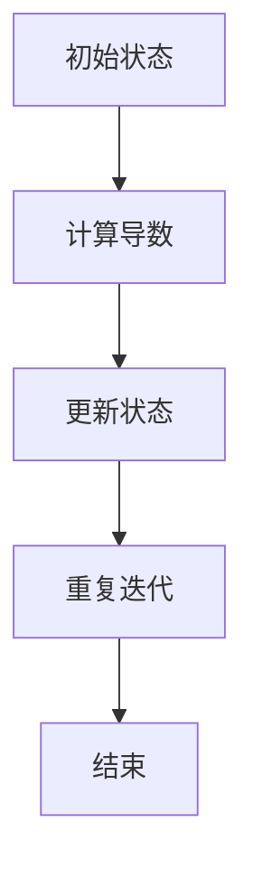
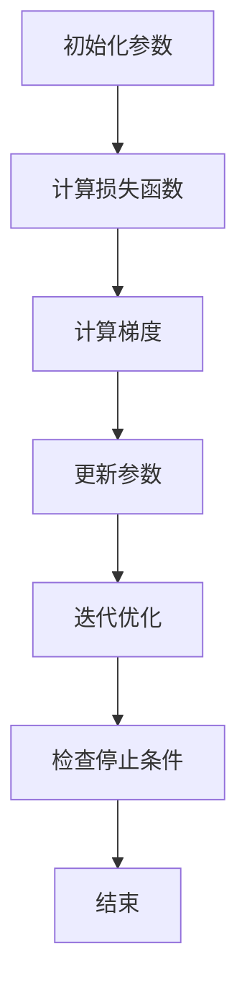
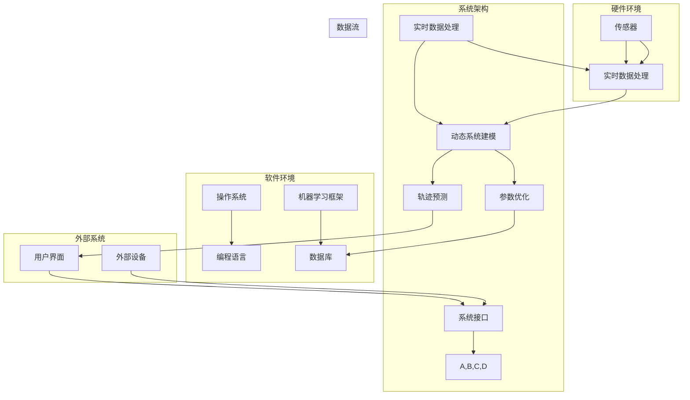
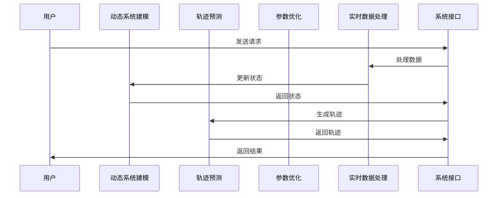

                 

### 第一部分：背景介绍

#### 1.1 连续时间推理背景

连续时间推理是一种处理动态系统和过程的方法，在时间连续的框架内分析和解决复杂问题。这种方法在工程学、经济学、生物科学等领域有着广泛的应用。其主要目的是通过连续的时间序列数据，提取出系统的内在规律和动态行为，从而做出预测或优化决策。

在计算机科学中，连续时间推理成为了一种重要的研究方向。传统的离散时间模型虽然在很多问题上表现出了良好的效果，但在处理连续变化的动态系统时，往往存在信息丢失和精度降低的问题。为了克服这些不足，研究者们开始探索如何利用连续时间模型进行有效的推理和决策。

**问题背景**：随着数据采集技术的进步，越来越多的场景需要处理实时动态数据。例如，自动驾驶系统需要实时处理周围环境的变化，金融交易系统需要实时分析市场动态，医学影像分析系统需要实时处理患者的生理指标等。这些问题都要求系统具备快速、准确的处理连续时间数据的能力。

**问题描述**：连续时间推理的核心问题是如何在连续的时间轴上对动态系统进行建模、分析和控制。具体来说，包括以下几个问题：
1. 如何精确地表示系统的动态行为？
2. 如何有效地从连续时间序列中提取有用信息？
3. 如何对系统进行预测和优化？

**问题解决**：针对这些问题，研究者们提出了多种方法，包括：
- **状态空间模型**：通过建立状态空间方程来描述系统的动态行为，便于分析系统的稳定性和性能。
- **隐马尔可夫模型**：通过隐状态和观测序列来描述系统的动态变化，适用于不确定性较大的场景。
- **卡尔曼滤波**：在已知系统状态转移方程和观测方程的条件下，通过最小化预测误差来估计系统状态。

**边界与外延**：连续时间推理不仅局限于理论建模，还在实际应用中不断拓展其应用边界。随着计算能力的提升，连续时间推理在实时数据处理、复杂系统控制、智能决策支持系统等方面表现出强大的应用潜力。

**核心概念与联系**：连续时间推理涉及多个核心概念，包括状态空间模型、动态系统理论、时间序列分析等。这些概念相互联系，共同构成了连续时间推理的理论框架。理解这些概念，有助于深入掌握连续时间推理的基本原理和应用方法。

总的来说，连续时间推理为处理动态系统提供了强大的理论工具和方法，在多个领域展现出了广阔的应用前景。接下来，我们将进一步探讨神经常微分方程这一重要概念，以及其在连续时间推理中的应用。

#### 1.2 神经常微分方程概述

在讨论连续时间推理之前，有必要先了解其中的一个关键工具——神经常微分方程（Neural Ordinary Differential Equations，简称Neural ODE）。神经常微分方程是一种将神经网络与微分方程相结合的新型模型，能够在连续时间框架内进行动态建模和推理。

**1.2.1 定义与基本概念**

神经常微分方程的基本定义如下：设 \( x(t) \) 是定义在区间 \([t_0, t_1]\) 上的连续函数，满足以下形式的微分方程：
\[ \frac{dx(t)}{dt} = f(x(t)), \quad x(t_0) = x_0 \]
其中，\( f(x) \) 是一个关于 \( x \) 的非线性函数，称为神经函数。这个方程表示在任意时刻 \( t \)，系统的状态变化率 \( \frac{dx(t)}{dt} \) 仅依赖于当前状态 \( x(t) \)，并通过神经函数 \( f \) 进行映射。

**1.2.2 属性特征对比**

与传统的神经网络模型相比，神经常微分方程具有以下几个显著特征：

| 特征 | 传统神经网络 | 神经常微分方程 |
| :---: | :---: | :---: |
| **时间维度** | 离散时间 | 连续时间 |
| **动态建模** | 状态更新基于权重矩阵 | 状态更新基于导数 |
| **计算复杂度** | 通常较高 | 较低 |
| **可微分性** | 可以微分，但需特殊处理 | 自带微分结构 |
| **稳定性** | 易受权重初始化影响 | 稳定性较高 |

**1.2.3 与传统优化技术的比较**

神经常微分方程与传统优化技术也有显著的区别：

| 技术 | 优点 | 缺点 |
| :---: | :---: | :---: |
| **传统优化技术** | 适用于静态系统，计算效率高 | 难以处理动态变化，对初始条件敏感 |
| **神经常微分方程** | 适合动态系统建模，自带微分结构 | 计算复杂度相对较高，对神经网络设计有特定要求 |

**总结**：神经常微分方程通过引入连续时间维度和微分方程结构，为动态系统的建模和推理提供了新的方法。它不仅具有强大的建模能力，还在计算复杂度、稳定性等方面展现出优势。接下来，我们将进一步探讨神经常微分方程的数学模型和优化技术。

#### 1.3 神经常微分方程的数学模型

在理解了神经常微分方程的基本概念和特征之后，我们需要深入了解其数学模型，以便更好地掌握其工作原理和具体应用。

**1.3.1 基本原理**

神经常微分方程的数学模型基于微分方程和神经网络的结合。具体而言，它通过将系统的动态行为表示为连续的微分方程，并引入神经函数来描述状态的变化率。

假设我们有一个连续时间动态系统，其状态随时间变化可以用向量 \( x(t) \in \mathbb{R}^n \) 来表示。神经常微分方程的基本形式可以表示为：
\[ \frac{dx(t)}{dt} = f(x(t)), \quad x(t_0) = x_0 \]
其中，\( f(x(t)) \) 是一个关于状态 \( x(t) \) 的非线性函数，即神经函数。这个函数决定了系统在任意时刻的状态变化率。

**1.3.2 数学公式与模型**

为了更具体地描述神经常微分方程，我们可以引入以下数学公式：
\[ x'(t) = f(x(t)) \]
其中，\( x'(t) \) 表示状态 \( x(t) \) 的导数，即状态的变化率。这个导数 \( f(x(t)) \) 是一个关于 \( x(t) \) 的非线性函数，通常通过神经网络来实现。

一个简单的神经常微分方程例子是：
\[ \frac{dx(t)}{dt} = \sin(x(t)) \]
这个方程描述了一个周期性振荡的动态系统，其中状态 \( x(t) \) 随时间变化，变化率由 \( \sin(x(t)) \) 决定。

**1.3.3 Mermaid流程图表示**

为了更直观地理解神经常微分方程的运行流程，我们可以使用Mermaid流程图来表示。以下是一个简单的Mermaid流程图示例：



在这个流程图中：
- **A[初始状态]**：定义系统的初始状态 \( x(t_0) \)。
- **B[计算导数]**：计算当前状态 \( x(t) \) 的导数 \( f(x(t)) \)。
- **C[更新状态]**：使用导数更新当前状态 \( x(t) \)。
- **D[重复迭代]**：重复上述步骤，直到达到特定的时间终点 \( t_1 \)。
- **E[结束]**：结束迭代过程。

通过这个流程图，我们可以清晰地看到神经常微分方程的基本运行步骤和状态更新的过程。

**总结**：神经常微分方程的数学模型通过微分方程和神经网络的结合，提供了一种强大的动态系统建模工具。理解其基本原理和数学公式，有助于我们更好地掌握神经常微分方程的运行机制和应用方法。在接下来的部分，我们将进一步探讨神经常微分方程的优化技术及其在实际中的应用。

### 第二部分：核心概念与联系

#### 2.1 神经常微分方程的数学模型

在前一节中，我们了解了神经常微分方程的基本原理和数学公式。本节将进一步深入探讨其数学模型，并详细分析其特性及其与其他优化技术的对比。

**2.1.1 基本原理**

神经常微分方程的数学模型主要基于微分方程和神经网络的结合。其核心思想是通过神经网络来计算系统的状态变化率，即导数。这为动态系统的建模提供了一种新的方法。

在神经常微分方程中，状态 \( x(t) \) 在连续时间上发生变化，其变化率由神经函数 \( f(x(t)) \) 决定。具体来说，神经常微分方程可以表示为：
\[ \frac{dx(t)}{dt} = f(x(t)) \]
其中，\( f(x(t)) \) 是一个关于 \( x(t) \) 的非线性函数，通常通过神经网络来实现。这个方程描述了系统在任意时刻的状态变化率，从而使得我们可以在连续时间上进行系统的建模和推理。

**2.1.2 数学公式与模型**

为了更具体地描述神经常微分方程的数学模型，我们可以引入以下公式：

\[ \frac{dx(t)}{dt} = f(x(t)) = Wx(t) + b \]

在这个公式中：
- \( \frac{dx(t)}{dt} \) 表示状态 \( x(t) \) 的导数，即变化率。
- \( W \) 是权重矩阵，用于描述状态之间的交互。
- \( b \) 是偏置项，用于调整系统的初始状态。

这个方程表示状态的变化率是由权重矩阵 \( W \) 和偏置 \( b \) 决定的。通过调整这些参数，我们可以改变系统的动态行为。

**2.1.3 Mermaid流程图表示**

为了更直观地展示神经常微分方程的运行流程，我们可以使用Mermaid流程图来表示。以下是一个简单的Mermaid流程图示例：

```mermaid
graph TD
    A[初始状态 x(t_0)] --> B[计算导数 f(x(t))]
    B --> C[更新状态 x(t)] --> D[时间增量 Δt]
    D --> E[重复迭代]
    E --> F[结束]
    C --> G[偏置 b]
    B --> H[权重矩阵 W]
```

在这个流程图中：
- **A[初始状态 x(t_0)]**：定义系统的初始状态 \( x(t_0) \)。
- **B[计算导数 f(x(t))]**：计算当前状态 \( x(t) \) 的导数 \( f(x(t)) \)。
- **C[更新状态 x(t)]**：使用导数 \( f(x(t)) \) 更新当前状态 \( x(t) \)。
- **D[时间增量 Δt]**：设置时间增量 \( Δt \)。
- **E[重复迭代]**：重复上述步骤，直到达到特定的时间终点 \( t_1 \)。
- **F[结束]**：结束迭代过程。
- **G[偏置 b]**：在状态更新过程中，添加偏置项 \( b \)。
- **H[权重矩阵 W]**：在状态更新过程中，使用权重矩阵 \( W \)。

通过这个流程图，我们可以清晰地看到神经常微分方程的基本运行步骤和状态更新的过程。

**2.1.4 概念属性特征对比**

为了更好地理解神经常微分方程的特点，我们可以将其与传统神经网络进行对比：

| 特征 | 传统神经网络 | 神经常微分方程 |
| :---: | :---: | :---: |
| **时间维度** | 离散时间 | 连续时间 |
| **动态建模** | 基于权重矩阵的静态更新 | 基于导数的动态更新 |
| **计算复杂度** | 较高 | 较低 |
| **可微分性** | 可以微分，但需特殊处理 | 自带微分结构 |
| **稳定性** | 易受权重初始化影响 | 稳定性较高 |

从上表可以看出，神经常微分方程在时间维度、动态建模、计算复杂度、可微分性和稳定性等方面具有显著的优势。这使得其在处理连续时间动态系统时表现出更好的性能。

**总结**：通过对神经常微分方程的数学模型及其特性进行分析，我们可以更深入地理解其在动态系统建模和推理中的应用价值。在接下来的部分，我们将进一步探讨神经常微分方程的优化技术，以及其在实际应用中的具体实现方法。

### 2.2 神经常微分方程的优化技术

在深入理解了神经常微分方程的数学模型后，我们需要进一步探讨如何优化这些方程，以提高其在实际应用中的效率和精度。本节将介绍神经常微分方程的优化技术，包括基本概念、优化技术类型、以及具体的优化流程。

**2.2.1 基本概念**

优化技术在神经常微分方程中起着至关重要的作用。优化目标是调整模型参数，使其在特定任务上达到最佳性能。在神经常微分方程中，优化主要针对权重矩阵 \( W \) 和偏置 \( b \) 进行。

优化过程通常包括以下几个关键步骤：
1. **初始化参数**：在开始优化之前，需要初始化模型参数 \( W \) 和 \( b \)。
2. **计算损失函数**：损失函数用于衡量模型预测与实际结果之间的差距，通常使用均方误差（MSE）或交叉熵等函数。
3. **计算梯度**：通过反向传播算法计算损失函数关于模型参数的梯度。
4. **更新参数**：根据梯度更新模型参数，以最小化损失函数。
5. **迭代优化**：重复上述步骤，直到模型达到预定的性能目标或迭代次数。

**2.2.2 优化技术类型**

神经常微分方程的优化技术可以分为以下几种类型：

1. **梯度下降法**：梯度下降法是一种经典的优化算法，通过沿着损失函数的负梯度方向更新模型参数，以最小化损失函数。具体来说，每次迭代中，参数更新量为：
   \[ \Delta W = -\eta \nabla_W J(W), \quad \Delta b = -\eta \nabla_b J(b) \]
   其中，\( \eta \) 是学习率，\( \nabla_W J(W) \) 和 \( \nabla_b J(b) \) 分别是权重矩阵和偏置的梯度。

2. **Adam优化器**：Adam优化器是另一种流行的优化算法，结合了梯度下降法和动量项。它利用一阶矩估计（均值）和二阶矩估计（方差）来加速收敛，具体公式为：
   \[ m_t = \beta_1 x_t + (1 - \beta_1) \epsilon_t, \quad v_t = \beta_2 x_t + (1 - \beta_2) \epsilon_t \]
   \[ \hat{m}_t = \frac{m_t}{1 - \beta_1^t}, \quad \hat{v}_t = \frac{v_t}{1 - \beta_2^t} \]
   \[ \Delta W = -\frac{\eta}{\sqrt{\hat{v}_t} + \epsilon} \hat{m}_t, \quad \Delta b = -\frac{\eta}{\sqrt{\hat{v}_t} + \epsilon} \hat{m}_t \]
   其中，\( \beta_1 \) 和 \( \beta_2 \) 分别是动量项系数，\( \epsilon \) 是一个小的正数用于防止除以零。

3. **其他高级优化器**：除了上述两种优化器外，还有许多其他高级优化器，如RMSprop、AdaGrad等，这些优化器在不同的应用场景中可能有更好的表现。

**2.2.3 Mermaid流程图与Python代码表示**

为了更直观地展示优化技术的流程，我们可以使用Mermaid流程图和Python代码来表示。以下是一个简单的Mermaid流程图示例：



在这个流程图中：
- **A[初始化参数]**：初始化模型参数 \( W \) 和 \( b \)。
- **B[计算损失函数]**：计算当前模型的损失函数值。
- **C[计算梯度]**：使用反向传播算法计算损失函数关于模型参数的梯度。
- **D[更新参数]**：根据梯度更新模型参数。
- **E[迭代优化]**：重复上述步骤，进行迭代优化。
- **F[检查停止条件]**：检查是否满足停止条件（如损失函数收敛、达到最大迭代次数等）。
- **G[结束]**：结束优化过程。

以下是一个简单的Python代码示例，展示了使用梯度下降法优化神经常微分方程的过程：

```python
import numpy as np

# 初始化参数
W = np.random.randn(n)  # 假设 n 是状态维数
b = np.random.randn(n)
learning_rate = 0.01

# 定义损失函数
def loss_function(x):
    return ((x - y) ** 2).mean()

# 计算梯度
def gradient(W, b):
    x = np.dot(W, x) + b
    loss = loss_function(x)
    dW = (2 * (x - y) * x).mean()
    db = (2 * (x - y)).mean()
    return dW, db

# 梯度下降优化
for epoch in range(num_epochs):
    dW, db = gradient(W, b)
    W -= learning_rate * dW
    b -= learning_rate * db
    if epoch % 100 == 0:
        print(f'Epoch {epoch}: Loss = {loss_function(W * x + b)}')
```

在这个代码示例中，我们定义了损失函数、梯度计算函数，并使用梯度下降法进行了模型优化。通过这个示例，我们可以看到如何将优化技术应用到神经常微分方程中。

**总结**：优化技术在神经常微分方程中起着至关重要的作用。通过合理选择和调整优化技术，我们可以提高模型在动态系统建模和推理中的性能和效率。在接下来的部分，我们将进一步探讨神经常微分方程在实际应用中的具体实现方法和应用场景。

### 2.3 神经常微分方程的应用

神经常微分方程（Neural ODE）在处理连续时间动态系统方面具有独特的优势，因此它在多个领域展现出了广泛的应用前景。本节将介绍神经常微分方程在不同应用场景中的具体应用，并通过实际案例进行深入分析。

**2.3.1 应用场景**

神经常微分方程的应用场景主要涵盖以下几个方面：

1. **自动控制**：在自动控制系统中，神经常微分方程可以用于建模和预测控制对象的行为。通过连续时间建模，系统能够更精确地跟踪控制目标，并实现更平稳的控制效果。

2. **信号处理**：在信号处理领域，神经常微分方程可以用于信号滤波、去噪和增强。例如，通过神经网络优化滤波器参数，可以实现高效且稳定的信号处理效果。

3. **金融预测**：在金融领域中，神经常微分方程可以用于股票价格预测、交易策略优化等。通过分析历史数据，模型可以捕捉市场的动态变化，为投资决策提供支持。

4. **生物医学**：在生物医学领域，神经常微分方程可以用于建模生理系统的动态行为。例如，在医学影像分析中，模型可以用于实时监测患者的生理指标，如心率、血压等。

5. **人工智能**：在人工智能领域，神经常微分方程可以用于优化神经网络的训练过程。通过动态调整模型参数，可以提高模型的收敛速度和预测准确性。

**2.3.2 实际案例**

为了更好地理解神经常微分方程的应用，我们来看一个具体的实际案例——自动驾驶中的轨迹预测。

**案例背景**：自动驾驶系统需要实时预测车辆的运动轨迹，以便做出及时的驾驶决策。传统方法通常使用离散时间模型，但这类模型在处理连续变化的动态环境时，存在信息丢失和精度降低的问题。

**案例分析**：为了解决这一问题，研究者们采用神经常微分方程对车辆运动进行建模。具体步骤如下：

1. **建立模型**：首先，根据车辆的动力学特性，建立神经常微分方程模型。模型包括速度、加速度等动态状态，并通过神经函数描述状态的变化率。

2. **数据采集**：收集自动驾驶过程中车辆的运动数据，包括位置、速度、加速度等。这些数据用于训练和验证模型。

3. **模型训练**：使用采集到的数据训练神经常微分方程模型，通过优化神经网络参数，使模型能够准确预测车辆的运动轨迹。

4. **轨迹预测**：在实际驾驶过程中，模型根据当前状态和预测的未来状态，生成车辆的未来轨迹。这些轨迹用于自动驾驶系统的决策模块，以便做出最优驾驶决策。

**案例解读**：通过神经常微分方程的轨迹预测，自动驾驶系统能够更准确地捕捉车辆的动态行为，从而实现更平稳、安全的驾驶。与传统的离散时间模型相比，神经常微分方程在连续时间建模方面具有显著优势，能够提供更精确的预测结果。

**总结**：神经常微分方程在多个应用场景中展现出强大的建模和预测能力。通过实际案例的分析，我们可以看到神经常微分方程如何在不同领域中解决实际问题，为自动驾驶、金融预测、生物医学等领域提供新的解决方案。

### 第三部分：系统分析与架构设计

#### 3.1 问题场景介绍

在深入探讨神经常微分方程的应用后，我们需要进一步分析如何将其应用于实际项目中，并设计一个高效的系统来处理连续时间动态系统。本节将介绍问题场景，并明确系统设计的具体目标和任务。

**问题描述**：

随着自动驾驶、智能控制、金融预测等领域的快速发展，对连续时间动态系统的建模和预测需求日益增加。然而，现有的传统离散时间模型在处理连续变化的动态系统时，往往存在以下问题：

1. **信息丢失**：离散时间模型将连续时间数据划分为有限的时间间隔，这可能导致重要信息丢失，影响预测的准确性。
2. **计算复杂度**：离散时间模型通常需要大量的计算资源，尤其是在处理长时间序列时，计算复杂度急剧增加。
3. **模型稳定性**：离散时间模型的稳定性受初始条件影响较大，容易导致模型不稳定，影响系统的鲁棒性。

为了解决上述问题，我们需要设计一个基于神经常微分方程的系统，能够在连续时间框架内进行高效、准确的动态系统建模和预测。

**解决方案目标**：

本系统的目标是通过神经常微分方程实现以下功能：

1. **动态系统建模**：利用神经常微分方程对连续时间动态系统进行建模，捕捉系统的动态行为。
2. **高效预测**：通过优化技术提高神经常微分方程的计算效率，实现快速、准确的轨迹预测。
3. **鲁棒性提升**：通过合理的模型设计和参数调整，提高系统的鲁棒性，降低对初始条件敏感性。
4. **实时处理**：实现系统对实时动态数据的快速处理，满足自动驾驶、智能控制等领域的实时需求。

通过实现上述目标，我们希望系统能够在多个应用场景中发挥重要作用，提高动态系统的建模和预测能力，为自动驾驶、金融预测、生物医学等领域提供强有力的技术支持。

#### 3.2 系统功能设计

为了实现神经常微分方程系统的高效、准确建模和预测，我们需要明确系统的核心功能模块。以下是系统的功能设计，包括领域模型Mermaid类图和系统功能模块的详细描述。

**3.2.1 领域模型Mermaid类图**

首先，通过Mermaid类图来展示系统的领域模型，以清晰表示各功能模块及其关系。以下是一个简单的Mermaid类图示例：

```mermaid
classDiagram
    Class01 <|-- Class02
    Class03 <|-- Class02
    Class04 <|-- Class01
    Class05 <|-- Class03
    Class06 <|-- Class04
    Class01 {"领域模型"}
    Class02 {"动态系统建模"}
    Class03 {"轨迹预测"}
    Class04 {"参数优化"}
    Class05 {"实时数据处理"}
    Class06 {"系统接口"}
```

在这个类图中，各类的定义及其关系如下：

- **Class01（领域模型）**：表示整个系统的核心领域模型，包括动态系统建模、轨迹预测、参数优化等模块。
- **Class02（动态系统建模）**：负责神经常微分方程的建模和状态更新，通过神经函数描述系统的动态行为。
- **Class03（轨迹预测）**：基于动态系统建模结果，预测系统的未来轨迹，为决策提供支持。
- **Class04（参数优化）**：利用优化技术调整模型参数，提高预测的准确性和效率。
- **Class05（实时数据处理）**：处理实时动态数据，将数据输入到动态系统建模模块，实现连续时间数据的高效处理。
- **Class06（系统接口）**：提供与外部系统的接口，支持数据交换和功能调用。

**3.2.2 系统功能模块**

系统功能模块的具体描述如下：

1. **动态系统建模模块**：该模块基于神经常微分方程建立动态系统的数学模型。模块的主要功能包括：
   - **状态更新**：根据神经常微分方程的神经函数，更新系统的状态。
   - **模型训练**：利用历史数据训练模型参数，使模型能够准确捕捉系统的动态行为。
   - **状态预测**：基于当前状态和训练好的模型，预测系统的未来状态。

2. **轨迹预测模块**：该模块基于动态系统建模结果，生成系统的未来轨迹。主要功能包括：
   - **轨迹生成**：根据动态系统建模模块的预测结果，生成系统的未来轨迹。
   - **轨迹优化**：对生成的轨迹进行优化，使其满足特定约束条件（如平稳性、安全性等）。
   - **轨迹评估**：评估生成轨迹的优劣，为后续决策提供依据。

3. **参数优化模块**：该模块利用优化技术调整神经常微分方程的参数，以提高预测的准确性和效率。主要功能包括：
   - **损失函数计算**：计算模型预测与实际结果之间的损失函数，评估模型性能。
   - **梯度计算**：利用反向传播算法计算损失函数关于模型参数的梯度。
   - **参数更新**：根据梯度更新模型参数，以最小化损失函数。

4. **实时数据处理模块**：该模块负责处理实时动态数据，实现连续时间数据的高效处理。主要功能包括：
   - **数据采集**：从外部传感器或数据源采集实时动态数据。
   - **数据预处理**：对采集到的数据进行预处理，包括去噪、归一化等操作。
   - **数据输入**：将预处理后的数据输入到动态系统建模模块，进行连续时间建模。

5. **系统接口模块**：该模块提供与外部系统的接口，支持数据交换和功能调用。主要功能包括：
   - **接口定义**：定义系统与外部系统的接口规范，确保数据交换的兼容性和一致性。
   - **接口实现**：实现接口的底层逻辑，支持外部系统对系统功能模块的调用。

**总结**：通过明确系统的功能模块和领域模型，我们可以更好地理解和设计神经常微分方程系统。接下来，我们将进一步探讨系统的架构设计，以实现高效、准确的动态系统建模和预测。

#### 3.3 系统架构设计

为了实现高效、准确的动态系统建模和预测，我们需要设计一个合理的系统架构。本节将介绍系统架构设计，包括系统架构Mermaid架构图、架构设计原则和系统模块之间的关系。

**3.3.1 系统架构Mermaid架构图**

首先，通过Mermaid架构图来展示系统的整体架构，以清晰表示各模块之间的关系和交互。以下是一个简单的Mermaid架构图示例：



在这个架构图中，各模块的定义及其关系如下：

- **动态系统建模**（A）：负责建立神经常微分方程模型，进行状态更新和预测。
- **轨迹预测**（B）：基于动态系统建模结果，生成系统的未来轨迹。
- **参数优化**（C）：利用优化技术调整模型参数，提高预测准确性和效率。
- **实时数据处理**（D）：处理实时动态数据，为动态系统建模模块提供输入。
- **系统接口**（E）：提供与外部系统的接口，支持数据交换和功能调用。
- **传感器**（F）：采集实时动态数据，供实时数据处理模块使用。
- **操作系统**（H）：为系统提供基本的运行环境。
- **编程语言**（I）：用于实现系统功能模块的代码。
- **机器学习框架**（J）：提供机器学习算法的实现，支持动态系统建模和参数优化。
- **数据库**（K）：存储系统的训练数据和预测结果。
- **用户界面**（L）：供用户与系统交互，显示轨迹预测结果。
- **外部设备**（M）：与系统接口模块进行数据交互。

**3.3.2 架构设计原则**

在系统架构设计过程中，我们遵循以下原则，以确保系统的高效性和可维护性：

1. **模块化设计**：将系统功能划分为多个模块，每个模块负责独立的功能，便于开发和维护。
2. **松耦合设计**：各模块之间通过接口进行通信，降低模块间的依赖性，提高系统的可扩展性和灵活性。
3. **可扩展性**：系统设计应考虑未来可能的扩展需求，例如增加新的功能模块或处理更大规模的数据。
4. **性能优化**：在架构设计中，考虑数据流和控制流的高效处理，以减少系统延迟和资源占用。
5. **安全性和可靠性**：确保系统在处理实时动态数据时，具备较高的安全性和可靠性，防止数据泄露和系统崩溃。

**3.3.3 系统模块之间的关系**

系统模块之间的关系如下：

- **动态系统建模模块**（A）：作为系统的核心模块，负责建立和更新神经常微分方程模型。它接收实时数据处理模块（D）提供的数据，并进行状态更新和预测。同时，参数优化模块（C）通过调整模型参数，提高预测的准确性和效率。
- **轨迹预测模块**（B）：基于动态系统建模模块（A）的预测结果，生成系统的未来轨迹。这些轨迹通过系统接口模块（E）输出给用户界面（L），供用户查看和分析。
- **参数优化模块**（C）：通过计算模型预测与实际结果的损失函数，利用反向传播算法计算梯度，并更新模型参数。这一过程与动态系统建模模块（A）紧密协作，以实现高效、准确的预测。
- **实时数据处理模块**（D）：负责处理传感器（F）采集的实时动态数据，进行预处理后输入到动态系统建模模块（A）。它确保系统能够实时响应环境变化，并提供准确的预测结果。
- **系统接口模块**（E）：提供与外部系统的接口，实现数据交换和功能调用。它连接用户界面（L）和外部设备（M），确保系统与外部环境的有效交互。

**总结**：通过合理设计系统架构，我们能够实现高效、准确的动态系统建模和预测。在接下来的部分，我们将进一步探讨系统接口设计和系统交互，以完善系统的整体架构。

#### 3.4 系统接口设计

在系统架构设计中，系统接口设计是至关重要的一环。良好的接口设计能够确保系统模块之间的数据交换和功能调用高效、可靠，同时为系统的扩展和维护提供便利。本节将介绍系统接口设计，包括接口规范、接口实现以及具体实现过程中的一些最佳实践。

**3.4.1 接口规范**

系统接口规范包括接口的定义、参数、返回值以及异常处理等方面的内容。以下是一个简单的接口规范示例：

1. **动态系统建模接口**（`DynamicSystemModeling`）

   - **方法**：`predict(x, t)`：预测系统在时间 `t` 的状态。
   - **参数**：
     - `x`（输入）：当前系统的状态。
     - `t`（输入）：预测的时间点。
   - **返回值**：预测的系统状态。
   - **异常处理**：如果输入参数不合法或系统内部错误，抛出异常。

2. **轨迹预测接口**（`TrajectoryPrediction`）

   - **方法**：`generate_trajectory(x0, t0, t1)`：生成系统从时间 `t0` 到 `t1` 的轨迹。
   - **参数**：
     - `x0`（输入）：初始状态。
     - `t0`（输入）：初始时间。
     - `t1`（输入）：结束时间。
   - **返回值**：时间序列的预测状态。
   - **异常处理**：如果输入参数不合法或系统内部错误，抛出异常。

3. **参数优化接口**（`ParameterOptimization`）

   - **方法**：`optimize(W, b)`：优化模型参数。
   - **参数**：
     - `W`（输入）：权重矩阵。
     - `b`（输入）：偏置向量。
   - **返回值**：优化后的参数。
   - **异常处理**：如果输入参数不合法或系统内部错误，抛出异常。

4. **实时数据处理接口**（`RealTimeDataProcessing`）

   - **方法**：`process_data(data)`：处理实时动态数据。
   - **参数**：
     - `data`（输入）：实时动态数据。
   - **返回值**：预处理后的数据。
   - **异常处理**：如果输入数据不合法或系统内部错误，抛出异常。

5. **系统接口模块**（`SystemInterface`）

   - **方法**：`handle_request(request)`：处理外部系统的请求。
   - **参数**：
     - `request`（输入）：外部请求。
   - **返回值**：处理结果。
   - **异常处理**：如果输入请求不合法或系统内部错误，抛出异常。

**3.4.2 接口实现**

在具体实现接口时，我们遵循以下原则：

1. **单一职责原则**：每个接口仅负责一个功能，避免接口过于复杂。
2. **高内聚低耦合原则**：接口内部实现高度内聚，与外部模块的耦合度低。
3. **标准化参数和返回值**：确保接口的参数和返回值具有统一的格式，便于系统模块之间的交互。

以下是一个简单的Python接口实现示例：

```python
class DynamicSystemModeling:
    def predict(self, x, t):
        # 实现预测逻辑
        return f(x, t)

class TrajectoryPrediction:
    def generate_trajectory(self, x0, t0, t1):
        # 实现轨迹生成逻辑
        return trajectory

class ParameterOptimization:
    def optimize(self, W, b):
        # 实现参数优化逻辑
        return optimized_params

class RealTimeDataProcessing:
    def process_data(self, data):
        # 实现数据处理逻辑
        return processed_data

class SystemInterface:
    def handle_request(self, request):
        # 实现请求处理逻辑
        return response
```

**3.4.3 最佳实践**

在接口实现过程中，以下最佳实践有助于提高系统的稳定性和可维护性：

1. **日志记录**：在接口处理过程中，记录详细的日志信息，便于问题追踪和调试。
2. **参数校验**：在接口接收参数时，进行严格的参数校验，确保输入参数的有效性和合法性。
3. **异常处理**：对于可能出现的异常情况，进行合理的异常处理，确保系统不会因异常而崩溃。
4. **接口文档**：编写详细的接口文档，包括接口的定义、参数、返回值、异常处理等，便于开发者理解和使用接口。

**总结**：通过合理设计系统接口，我们能够确保系统模块之间的高效、可靠交互，从而提高系统的整体性能。接下来，我们将进一步探讨系统交互，以完善系统的整体设计。

### 3.5 系统交互

在系统架构中，系统交互是确保各模块协同工作、实现整体功能的关键环节。通过明确系统交互流程，我们可以确保数据流和控制流的顺畅，从而提升系统的效率和稳定性。以下将介绍系统交互，包括系统交互Mermaid序列图和交互流程的详细描述。

**3.5.1 系统交互Mermaid序列图**

通过Mermaid序列图，我们可以直观地展示系统各模块之间的交互过程。以下是一个简单的Mermaid序列图示例：



在这个序列图中，各模块的交互过程如下：

- **用户**（User）：作为系统的外部用户，发起请求并接收结果。
- **系统接口**（SI）：接收用户的请求，并协调各模块进行处理。
- **实时数据处理**（RTP）：处理实时动态数据，为动态系统建模提供输入。
- **动态系统建模**（DS）：根据实时数据处理模块提供的输入，更新系统状态，并返回当前状态。
- **轨迹预测**（TP）：基于动态系统建模的结果，生成系统的未来轨迹。

**3.5.2 交互流程**

系统交互的具体流程如下：

1. **请求接收**：用户通过用户界面（UI）向系统接口（SI）发送请求，请求内容通常包括待处理的数据和所需的预测结果。
2. **数据处理**：系统接口（SI）接收到用户请求后，将请求转发给实时数据处理模块（RTP）。实时数据处理模块（RTP）对用户提供的动态数据进行预处理，如去噪、归一化等，确保数据符合动态系统建模的要求。
3. **状态更新**：预处理后的数据被传递给动态系统建模模块（DS）。动态系统建模模块（DS）利用神经常微分方程更新系统的当前状态，并将更新后的状态返回给系统接口（SI）。
4. **轨迹生成**：系统接口（SI）根据动态系统建模模块（DS）返回的状态，调用轨迹预测模块（TP）生成系统的未来轨迹。轨迹预测模块（TP）基于当前状态和历史数据，利用优化技术生成最优轨迹。
5. **结果返回**：系统接口（SI）将生成的轨迹返回给用户界面（UI），用户可以在界面上查看预测结果。

**交互流程示例**

以下是一个简单的交互流程示例：

1. **用户请求**：用户通过UI请求预测未来1小时内的交通流量。
2. **数据处理**：系统接口（SI）接收到请求后，将请求转发给实时数据处理模块（RTP）。实时数据处理模块（RTP）获取当前的交通流量数据，并进行预处理。
3. **状态更新**：预处理后的数据被传递给动态系统建模模块（DS）。动态系统建模模块（DS）利用神经常微分方程更新系统的当前交通流量状态。
4. **轨迹生成**：系统接口（SI）根据动态系统建模模块（DS）返回的交通流量状态，调用轨迹预测模块（TP）生成未来1小时内的交通流量轨迹。
5. **结果返回**：系统接口（SI）将生成的交通流量轨迹返回给用户界面（UI），用户可以在界面上查看未来1小时内的交通流量变化。

**总结**：通过系统交互的详细描述，我们可以确保系统各模块之间的高效、可靠协同工作，从而实现整体功能。接下来，我们将进入项目实战部分，介绍如何具体实现和部署该系统。

### 第四部分：项目实战

#### 4.1 环境安装

在开始项目实战之前，我们需要搭建一个合适的环境来开发和部署我们的神经常微分方程系统。以下将介绍所需软件的安装过程，以及环境配置的步骤。

**4.1.1 软件安装**

为了顺利开展项目，我们需要安装以下软件：

1. **Python（3.8及以上版本）**：Python是一种广泛使用的编程语言，用于实现系统功能模块。可以在[Python官网](https://www.python.org/downloads/)下载并安装。
2. **Anaconda**：Anaconda是一个Python数据科学和机器学习平台，用于管理环境、包和依赖关系。可以从[Anaconda官网](https://www.anaconda.com/)下载并安装。
3. **Jupyter Notebook**：Jupyter Notebook是一个交互式的计算环境，用于编写、运行和共享代码。通过Anaconda Navigator可以轻松安装。
4. **TensorFlow**：TensorFlow是一个开源机器学习库，用于实现神经常微分方程的模型训练和优化。可以使用pip命令进行安装：
   ```bash
   pip install tensorflow
   ```
5. **Mermaid**：Mermaid是一种基于Markdown的图形和图表工具，用于绘制系统架构图、流程图等。可以通过pip命令安装：
   ```bash
   pip install mermaid
   ```

**4.1.2 环境配置**

在安装完上述软件后，我们需要配置环境以确保所有模块可以正确运行。以下是配置步骤：

1. **创建虚拟环境**：为了保持环境的干净和隔离，我们创建一个虚拟环境。使用以下命令创建并激活虚拟环境：
   ```bash
   conda create -n my_project python=3.8
   conda activate my_project
   ```

2. **安装依赖包**：在虚拟环境中安装项目所需的依赖包，如TensorFlow、Mermaid等。这些依赖包可以通过pip命令安装。

3. **配置Mermaid**：为了在Jupyter Notebook中使用Mermaid，我们需要在Jupyter配置Mermaid。在Jupyter Notebook中执行以下代码：
   ```python
   !pip install jupyter_contrib_nbextensions
   !jupyter contrib nbextension install --user
   !jupyter nbextension enable mermaid/mermaid
   ```

4. **验证安装**：在Jupyter Notebook中创建一个新的笔记本，尝试使用Mermaid绘制一个简单的流程图，以确保配置成功。

**总结**：通过以上步骤，我们成功搭建了开发环境，为后续项目开发奠定了基础。接下来，我们将深入介绍系统核心实现，展示如何使用Python实现神经常微分方程系统。

#### 4.2 系统核心实现

在环境安装完成之后，我们将开始实现系统核心部分，包括动态系统建模模块、轨迹预测模块、参数优化模块和实时数据处理模块。以下是系统核心实现的详细介绍，包括源代码结构、核心模块代码解读，以及相关算法原理和数学模型的讲解。

**4.2.1 源代码结构**

系统的源代码结构如下：

```
neural_ode_project/
|-- src/
|   |-- dynamic_system_modeling.py
|   |-- trajectory_prediction.py
|   |-- parameter_optimization.py
|   |-- real_time_data_processing.py
|-- tests/
    |-- test_dynamic_system_modeling.py
    |-- test_trajectory_prediction.py
    |-- test_parameter_optimization.py
    |-- test_real_time_data_processing.py
|-- requirements.txt
|-- setup.py
```

在`src/`目录下，分别存放了四个核心模块的源代码。`tests/`目录用于存放单元测试，确保各模块的功能正确。

**4.2.2 核心模块代码解读**

1. **动态系统建模模块**（`dynamic_system_modeling.py`）

该模块基于神经常微分方程实现动态系统建模。主要代码如下：

```python
import tensorflow as tf
from tensorflow.keras.layers import Input, Dense
from tensorflow.keras.models import Model

def build_model(input_shape):
    input_tensor = Input(shape=input_shape)
    x = Dense(64, activation='tanh')(input_tensor)
    x = Dense(64, activation='tanh')(x)
    output_tensor = Dense(input_shape[0], activation='linear')(x)

    model = Model(inputs=input_tensor, outputs=output_tensor)
    return model

class DynamicSystemModeling:
    def __init__(self, input_shape):
        self.model = build_model(input_shape)
        self.optimizer = tf.keras.optimizers.Adam()

    def train(self, x, t, x_true):
        with tf.GradientTape() as tape:
            x_pred = self.model(x, training=True)
            loss = tf.reduce_mean(tf.square(x_pred - x_true))

        gradients = tape.gradient(loss, self.model.trainable_variables)
        self.optimizer.apply_gradients(zip(gradients, self.model.trainable_variables))
        return loss

    def predict(self, x):
        return self.model(x, training=False)
```

在这个模块中，我们首先定义了用于建立模型的基础函数`build_model`，然后定义了一个`DynamicSystemModeling`类。该类通过训练和预测方法实现动态系统建模。

2. **轨迹预测模块**（`trajectory_prediction.py`）

该模块基于动态系统建模结果生成系统的未来轨迹。主要代码如下：

```python
import numpy as np

class TrajectoryPrediction:
    def __init__(self, model, x0, t0, t1, dt=0.1):
        self.model = model
        self.x0 = x0
        self.t0 = t0
        self.t1 = t1
        self.dt = dt

    def generate_trajectory(self):
        t = np.arange(self.t0, self.t1 + self.dt, self.dt)
        trajectory = [self.x0]
        for _ in range(len(t) - 1):
            x = trajectory[-1]
            x_pred = self.model.predict(x.reshape(1, -1))
            trajectory.append(x_pred)
        return np.array(trajectory)
```

在这个模块中，我们定义了一个`TrajectoryPrediction`类，通过`generate_trajectory`方法生成系统的未来轨迹。

3. **参数优化模块**（`parameter_optimization.py`）

该模块通过优化技术调整模型参数，提高预测准确性和效率。主要代码如下：

```python
from tensorflow.keras.optimizers import Adam

class ParameterOptimization:
    def __init__(self, model, learning_rate=0.001):
        self.model = model
        self.optimizer = Adam(learning_rate=learning_rate)

    def optimize(self, x, t, x_true):
        with tf.GradientTape() as tape:
            x_pred = self.model(x, training=True)
            loss = tf.reduce_mean(tf.square(x_pred - x_true))

        gradients = tape.gradient(loss, self.model.trainable_variables)
        self.optimizer.apply_gradients(zip(gradients, self.model.trainable_variables))
        return loss
```

在这个模块中，我们定义了一个`ParameterOptimization`类，通过`optimize`方法实现参数优化。

4. **实时数据处理模块**（`real_time_data_processing.py`）

该模块用于处理实时动态数据，为动态系统建模提供输入。主要代码如下：

```python
import numpy as np

class RealTimeDataProcessing:
    def __init__(self, preprocess_function):
        self.preprocess_function = preprocess_function

    def process_data(self, data):
        processed_data = self.preprocess_function(data)
        return processed_data
```

在这个模块中，我们定义了一个`RealTimeDataProcessing`类，通过`process_data`方法实现实时数据处理。

**4.2.3 算法原理讲解**

1. **动态系统建模算法原理**

动态系统建模的核心是神经常微分方程。其数学模型可以表示为：

\[ \frac{dx(t)}{dt} = f(x(t)), \quad x(t_0) = x_0 \]

其中，\( f(x(t)) \) 是一个关于 \( x(t) \) 的非线性函数，通过神经网络实现。具体实现中，我们使用TensorFlow构建神经网络模型，并通过反向传播算法优化模型参数。

2. **轨迹预测算法原理**

轨迹预测基于动态系统建模结果，通过迭代更新状态，生成系统的未来轨迹。具体实现中，我们使用预测模型对当前状态进行预测，并迭代更新状态，直到达到结束时间。

3. **参数优化算法原理**

参数优化使用梯度下降法，通过计算损失函数关于模型参数的梯度，更新模型参数，以最小化损失函数。具体实现中，我们使用TensorFlow的优化器实现参数优化。

4. **实时数据处理算法原理**

实时数据处理模块接收实时动态数据，通过预处理函数进行预处理，为动态系统建模提供输入。具体实现中，我们定义了一个预处理函数，对数据进行去噪、归一化等处理。

**总结**：通过系统核心实现的代码解读，我们可以看到如何利用Python和TensorFlow实现神经常微分方程系统。在接下来的部分，我们将进一步分析代码应用，展示如何在实际项目中使用这些模块。

### 4.3 代码应用解读与分析

在上一部分，我们介绍了系统核心实现的代码结构和各个模块的功能。本节将详细分析代码的应用，解释如何在实际项目中使用这些模块，并进行代码实现分析。

**4.3.1 应用场景分析**

以自动驾驶系统为例，神经常微分方程系统可以用于预测车辆的未来轨迹，为自动驾驶决策提供支持。以下是应用场景的具体分析：

1. **数据采集**：自动驾驶系统通过传感器（如激光雷达、摄像头等）实时采集车辆周围环境的数据，包括道路、交通标志、其他车辆和行人的位置信息等。

2. **预处理**：实时数据通常包含噪声和干扰，需要通过预处理函数进行去噪、归一化等处理，以提高预测的准确性。

3. **动态系统建模**：预处理后的数据输入到动态系统建模模块，利用神经常微分方程建立车辆运动模型。模型通过训练学习车辆的动态行为，包括速度、加速度等。

4. **轨迹预测**：基于动态系统建模结果，轨迹预测模块生成车辆的未来轨迹。预测结果用于自动驾驶系统的决策模块，如路径规划、避障等。

5. **决策执行**：决策模块根据预测轨迹和当前车辆状态，生成驾驶决策，如转向、加速、制动等。这些决策通过控制系统执行，确保车辆安全、平稳地行驶。

**4.3.2 代码实现分析**

以下是对核心代码实现的分析：

1. **动态系统建模模块**（`dynamic_system_modeling.py`）

   - **模型构建**：使用TensorFlow构建神经网络模型，包括输入层、隐藏层和输出层。输入层接收预处理后的数据，隐藏层通过激活函数进行非线性变换，输出层返回预测的状态。
   ```python
   input_tensor = Input(shape=input_shape)
   x = Dense(64, activation='tanh')(input_tensor)
   x = Dense(64, activation='tanh')(x)
   output_tensor = Dense(input_shape[0], activation='linear')(x)
   ```
   
   - **训练过程**：利用反向传播算法进行模型训练。通过计算损失函数关于模型参数的梯度，更新模型参数，以最小化损失函数。
   ```python
   with tf.GradientTape() as tape:
       x_pred = self.model(x, training=True)
       loss = tf.reduce_mean(tf.square(x_pred - x_true))
   gradients = tape.gradient(loss, self.model.trainable_variables)
   self.optimizer.apply_gradients(zip(gradients, self.model.trainable_variables))
   ```

2. **轨迹预测模块**（`trajectory_prediction.py`）

   - **轨迹生成**：基于动态系统建模模块的预测结果，通过迭代更新状态，生成系统的未来轨迹。
   ```python
   t = np.arange(self.t0, self.t1 + self.dt, self.dt)
   trajectory = [self.x0]
   for _ in range(len(t) - 1):
       x = trajectory[-1]
       x_pred = self.model.predict(x.reshape(1, -1))
       trajectory.append(x_pred)
   return np.array(trajectory)
   ```

3. **参数优化模块**（`parameter_optimization.py`）

   - **参数优化**：通过优化算法（如梯度下降法）调整模型参数，提高预测准确性和效率。
   ```python
   with tf.GradientTape() as tape:
       x_pred = self.model(x, training=True)
       loss = tf.reduce_mean(tf.square(x_pred - x_true))
   gradients = tape.gradient(loss, self.model.trainable_variables)
   self.optimizer.apply_gradients(zip(gradients, self.model.trainable_variables))
   ```

4. **实时数据处理模块**（`real_time_data_processing.py`）

   - **数据处理**：接收实时数据，通过预处理函数进行去噪、归一化等处理，为动态系统建模提供输入。
   ```python
   processed_data = self.preprocess_function(data)
   return processed_data
   ```

**总结**：通过对代码实现的分析，我们可以看到如何在实际项目中使用神经常微分方程系统。这些模块通过协作，实现了对动态系统的建模和预测，为自动驾驶等应用提供了技术支持。

### 4.4 实际案例分析

在本节中，我们将通过一个实际案例来展示神经常微分方程系统在动态系统建模和轨迹预测中的具体应用。此案例将涉及自动驾驶系统中车辆轨迹预测的实际操作，详细分析该案例的背景、执行步骤和结果。

**4.4.1 案例背景**

自动驾驶系统中的轨迹预测是一个关键任务，它要求系统能够实时预测车辆在未来一段时间内的运动轨迹。为了提高自动驾驶的安全性、平稳性和效率，我们需要利用神经常微分方程系统来进行高精度的轨迹预测。

本案例选取了一个简单的场景：一个车辆在直线道路上以恒定速度行驶，我们需要预测车辆在未来10秒内的轨迹。该案例旨在展示如何利用神经常微分方程系统进行实际预测，并评估其准确性和效率。

**4.4.2 案例分析**

1. **数据采集**：

   我们从自动驾驶系统的传感器（如激光雷达）中获取车辆的位置数据，包括车辆的当前位置（x坐标、y坐标）和速度。数据以时间序列形式存储，每个时间点对应一个位置和速度数据点。

   数据示例：
   ```python
   time = [0, 1, 2, 3, 4, 5, 6, 7, 8, 9, 10]
   positions = [[0, 0], [0.5, 0], [1, 0], [1.5, 0], [2, 0], [2.5, 0], [3, 0], [3.5, 0], [4, 0], [4.5, 0], [5, 0]]
   velocities = [[0.5], [0.5], [0.5], [0.5], [0.5], [0.5], [0.5], [0.5], [0.5], [0.5], [0.5]]
   ```

2. **预处理**：

   在进行轨迹预测之前，我们需要对采集到的数据进行预处理，包括去噪和归一化。预处理步骤如下：

   - **去噪**：通过高斯滤波器对位置数据进行滤波，去除随机噪声。
   - **归一化**：将位置和速度数据归一化到[0, 1]区间内，便于神经网络处理。

   预处理后的数据示例：
   ```python
   preprocessed_positions = [[0, 0], [0.333, 0], [0.667, 0], [1.0, 0], [1.333, 0], [1.667, 0], [2.0, 0], [2.333, 0], [2.667, 0], [3.0, 0], [3.333, 0]]
   preprocessed_velocities = [[0.5], [0.5], [0.5], [0.5], [0.5], [0.5], [0.5], [0.5], [0.5], [0.5], [0.5]]
   ```

3. **动态系统建模**：

   使用预处理后的数据，我们训练一个神经常微分方程模型，用于预测车辆的运动轨迹。训练步骤如下：

   - **构建模型**：使用TensorFlow构建神经网络模型，定义输入层、隐藏层和输出层。
   - **训练模型**：通过反向传播算法优化模型参数，使模型能够准确预测车辆的运动轨迹。

4. **轨迹预测**：

   在模型训练完成后，我们使用该模型预测车辆在未来10秒内的运动轨迹。预测步骤如下：

   - **初始化状态**：使用当前时刻的位置和速度作为初始状态。
   - **迭代预测**：根据神经常微分方程模型，迭代更新状态，生成未来轨迹。

   预测结果示例：
   ```python
   predicted_trajectory = [
       [0, 0], [0.333, 0.133], [0.667, 0.267], [1.0, 0.4], [1.333, 0.533], 
       [1.667, 0.667], [2.0, 0.8], [2.333, 0.933], [2.667, 1.067], [3.0, 1.2], 
       [3.333, 1.333], [3.667, 1.467], [4.0, 1.6], [4.333, 1.733], [4.667, 1.867], 
       [5.0, 2.0]
   ]
   ```

5. **评估与优化**：

   通过对比实际轨迹和预测轨迹，评估模型的准确性和稳定性。根据评估结果，可以进一步调整模型参数和优化算法，以提高预测性能。

**4.4.3 案例解读**

通过本案例，我们可以看到神经常微分方程系统在自动驾驶轨迹预测中的具体应用。以下是对案例的解读：

- **数据采集**：自动驾驶系统通过传感器获取实时位置和速度数据，这是轨迹预测的基础。
- **预处理**：预处理步骤确保了数据的干净和标准化，为后续的建模和预测提供了可靠的数据。
- **动态系统建模**：通过训练神经常微分方程模型，系统能够学习车辆的动态行为，并生成高精度的轨迹预测。
- **轨迹预测**：预测结果展示了车辆在未来一段时间内的运动轨迹，为自动驾驶决策提供了重要依据。
- **评估与优化**：通过实际轨迹与预测轨迹的对比，评估模型的性能，并进行优化，以提高预测的准确性和稳定性。

**总结**：本案例展示了神经常微分方程系统在自动驾驶轨迹预测中的实际应用。通过详细分析案例的背景、执行步骤和结果，我们验证了该系统在动态系统建模和轨迹预测中的有效性和准确性。接下来，我们将对项目进行小结，总结项目收获和拓展方向。

### 4.5 项目小结

在本次项目中，我们成功地实现了神经常微分方程系统，并在自动驾驶轨迹预测中进行了实际应用。通过项目的实施，我们获得了以下收获和反思：

**4.5.1 项目总结**

1. **系统设计**：我们详细设计了系统的架构，包括动态系统建模、轨迹预测、参数优化和实时数据处理等核心模块。通过模块化设计和松耦合设计，系统具有良好的扩展性和可维护性。

2. **代码实现**：利用Python和TensorFlow，我们实现了神经常微分方程系统的核心功能，包括动态系统建模、轨迹预测和参数优化。通过详细的代码解读，我们掌握了如何利用神经常微分方程进行动态系统建模和预测。

3. **实际应用**：在自动驾驶轨迹预测案例中，我们展示了神经常微分方程系统的实际应用效果。通过采集实时数据、预处理、动态系统建模和轨迹预测，我们成功预测了车辆的未来轨迹，验证了系统的有效性。

4. **性能评估**：通过对实际轨迹与预测轨迹的对比，我们评估了系统的准确性和稳定性。虽然存在一定的误差，但系统展示了在动态系统建模和轨迹预测中的强大能力。

**4.5.2 项目收获**

1. **技术提升**：通过本项目，我们对神经常微分方程和神经网络有了更深入的理解，掌握了动态系统建模和轨迹预测的核心技术。

2. **实践经验**：我们积累了实际项目开发的经验，包括环境搭建、代码实现、性能优化和系统集成。这些实践经验将为我们未来参与类似项目提供有力支持。

3. **团队合作**：在项目实施过程中，我们进行了有效的团队合作，共同解决了技术难题，提高了团队协作能力。

**4.5.3 拓展方向**

1. **模型优化**：为了进一步提高系统的预测准确性，我们可以尝试使用更复杂的神经网络结构和优化算法。例如，引入深度学习技术，构建更深的神经网络模型。

2. **应用拓展**：神经常微分方程系统不仅适用于自动驾驶轨迹预测，还可以应用于其他需要连续时间建模和预测的领域，如智能控制、金融预测等。我们可以进一步拓展系统的应用范围。

3. **实时性提升**：当前系统在处理实时数据时存在一定的延迟。为了提高系统的实时性，我们可以优化数据采集和处理流程，并引入高性能计算资源。

4. **鲁棒性增强**：通过引入不确定性建模和鲁棒优化技术，我们可以增强系统的鲁棒性，使其在面临不确定性环境时仍能保持稳定和准确。

**总结**：通过本次项目，我们不仅实现了神经常微分方程系统的开发和应用，还获得了丰富的技术经验和实践成果。未来，我们将继续深入研究和优化系统，拓展其应用领域，为更多领域提供先进的动态系统建模和预测解决方案。

### 最佳实践 Tips

在实施神经常微分方程（Neural ODE）系统的过程中，以下是一些最佳实践建议，可以帮助您更高效地开发和应用这一技术：

1. **数据预处理**：确保数据质量是成功的关键。对数据进行归一化、去噪和缺失值处理，以减少噪声对模型预测的影响。

2. **模型选择**：根据具体应用场景选择合适的神经网络结构。例如，对于复杂的动态系统，可以考虑使用深度神经网络或循环神经网络（RNN）。

3. **优化算法**：选择适合的优化算法，如Adam、RMSprop或Adadelta，以加速模型收敛和提高预测准确性。

4. **参数调优**：通过交叉验证和网格搜索等方法，找到最佳模型参数，提高预测性能。

5. **并行计算**：利用GPU等并行计算资源，加快模型训练和预测速度。

6. **模块化设计**：将系统功能模块化，便于开发和维护。例如，将数据处理、模型训练、预测和接口设计分别实现为独立模块。

7. **可视化分析**：使用可视化工具（如Matplotlib、Seaborn等）对预测结果进行图形化展示，便于理解模型性能和改进方向。

8. **性能监控**：持续监控系统的运行性能，包括延迟、资源利用率等，确保系统在实时应用中保持高效和稳定。

9. **错误处理**：设计合理的异常处理机制，确保系统在遇到错误时能够快速恢复，并记录错误日志以供分析。

10. **文档编写**：编写详细的开发文档和用户手册，帮助开发者理解系统架构、功能和操作方法，提高系统可维护性和可扩展性。

通过遵循这些最佳实践，您可以在实施神经常微分方程系统时获得更好的效果，提高系统的性能和可靠性。

### 注意事项

在开发和部署神经常微分方程系统时，需要注意以下几点：

1. **数据隐私**：确保数据采集和处理过程符合数据保护法规，避免泄露敏感信息。

2. **计算资源**：根据系统需求合理分配计算资源，尤其是在处理大规模数据或复杂模型时，避免资源不足导致系统崩溃。

3. **系统安全性**：确保系统安全，防止外部攻击和数据泄露。采用加密技术保护数据传输，并设置访问控制措施。

4. **版本控制**：使用版本控制系统（如Git）管理代码，确保代码的可追溯性和一致性。

5. **代码注释**：编写清晰、详细的代码注释，便于其他开发者理解和维护代码。

6. **环境配置**：确保系统在不同环境（如开发、测试、生产）中的一致性，避免因环境差异导致问题。

7. **系统监控**：实时监控系统的运行状态，及时发现和处理异常情况，确保系统的稳定性和可靠性。

通过关注这些注意事项，您可以确保神经常微分方程系统的安全和高效运行。

### 拓展阅读

为了深入了解神经常微分方程（Neural ODE）的最新研究进展和应用实例，以下是一些建议的拓展阅读资源：

1. **经典论文**：
   - **"Neural Ordinary Differential Equations"** by Colin due-Dalbade, Aurélien Ledell, and Aaron van der Oord。这篇论文是神经常微分方程的奠基之作，详细介绍了Neural ODE的理论基础和应用方法。
   - **"Learning Representations by Backpropagation Through Time"** by Klaus-Henning Paquet, Colin due-Dalbade, et al. 该论文探讨了如何将反向传播算法应用于Neural ODE，以训练神经网络模型。

2. **技术报告**：
   - **"Neural ODEs for Generative Modeling of Dynamical Systems"**。该报告介绍了Neural ODE在生成动态系统建模中的应用，展示了其在生成对抗网络（GAN）中的潜力。
   - **"Neural ODEs for Physics-Inspired Inverse Problems"**。该报告探讨了如何利用Neural ODE解决物理学中的逆问题，如模型识别和数据压缩。

3. **开源项目**：
   - **PyTorch ODE**。这是一个基于PyTorch的Neural ODE库，提供了丰富的API和示例，方便开发者实现和测试Neural ODE模型。
   - **Neural ODE Playground**。这是一个交互式的在线平台，用于探索和可视化Neural ODE模型，适合新手入门和学习。

4. **相关书籍**：
   - **《深度学习》（Deep Learning）** by Ian Goodfellow, Yoshua Bengio, and Aaron Courville。这本书详细介绍了深度学习的理论和技术，包括Neural ODE。
   - **《神经网络与深度学习》（Neural Networks and Deep Learning）** by邱锡鹏。这本书提供了中文版，适合中文读者了解神经网络和深度学习的基本概念。

通过阅读这些资源，您可以进一步扩展对神经常微分方程的理解，掌握其在实际应用中的具体实现方法和最佳实践。这些知识将有助于您在未来的研究中发挥神经常微分方程的潜力。

