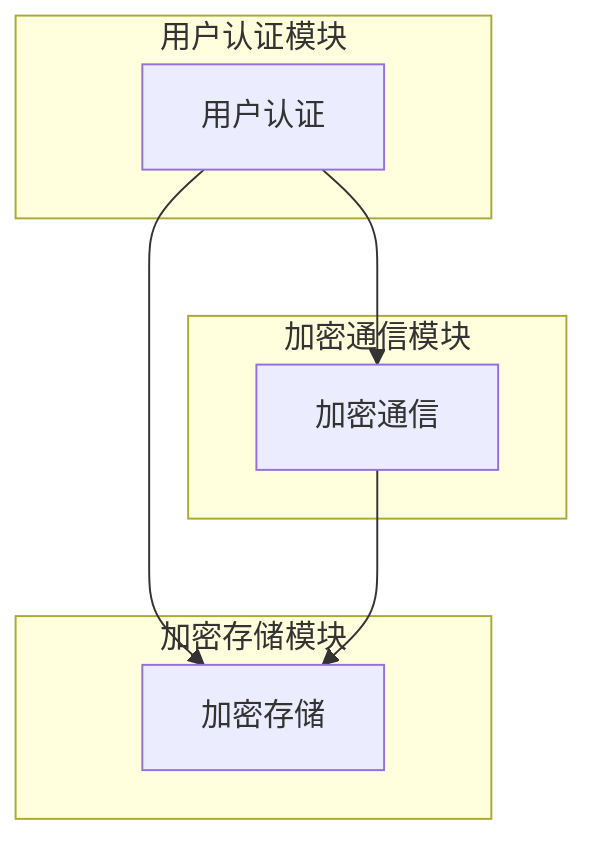
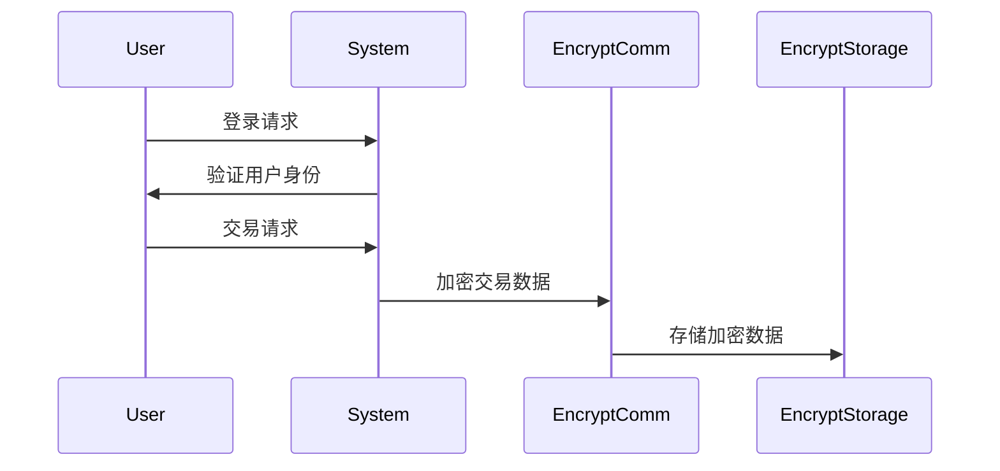
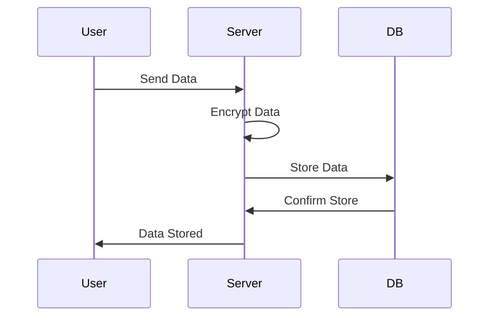
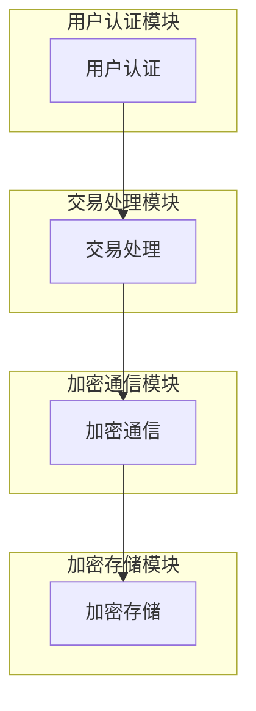

                 

### 背景介绍

量子计算，作为继经典计算之后的另一种革命性计算模型，正在逐步从理论走向实际应用。量子计算利用量子位（qubits）的叠加态和纠缠态来实现高效的计算能力，其处理某些特定问题的速度远超传统计算机。然而，这种强大的计算能力也对现有的密码系统构成了巨大威胁。传统密码系统，如RSA和ECC，依赖于大数分解和离散对数问题的大难度，而这些在量子计算机面前可能被迅速破解。

#### 问题背景与问题描述

量子计算机的出现引发了对现有加密技术可靠性的质疑。传统加密算法在面对量子计算机的威胁下，可能变得不再安全。例如，RSA加密算法的安全性基于大数分解的难度，但量子计算机可以通过Shor算法在多项式时间内完成大数分解。ECC加密算法虽然提供更高的安全性能，但同样受到量子计算机的威胁。

#### 问题解决

为了应对量子计算机的威胁，密码学界提出了量子resistant密码系统。量子resistant密码系统是指能够抵抗量子计算机攻击的密码系统，其核心思想是设计出基于数学难题的密码算法，这些难题即使在量子计算机的强大计算能力下也是难以破解的。

#### 边界与外延

量子resistant密码系统不仅需要应对量子计算机的攻击，还需要在以下几个方面具备优势：

1. **安全性**：密码系统能够在量子计算机下保持数据安全。
2. **效率**：密码算法需要具备足够的效率，以保证在现有计算机上的性能不受显著影响。
3. **兼容性**：新密码系统应与现有加密标准和技术兼容。
4. **可用性**：密码系统应易于部署和使用，确保实际应用中的可用性。

通过这样的设计原则，量子resistant密码系统有望成为未来信息安全领域的核心支柱。

#### 概念结构与核心要素组成

量子resistant密码系统的核心概念包括：

1. **量子计算的攻击原理**：了解量子计算机如何攻击传统加密算法，如Shor算法。
2. **密码算法的设计原则**：设计出基于数学难题的密码算法，如Lattice-based、Hash-based和Code-based算法。
3. **安全评估标准**：通过量子抵抗安全性评估，确保密码算法在量子计算机下保持安全。
4. **系统实现与部署**：将量子resistant密码算法集成到现有系统和基础设施中。

这些概念共同构成了量子resistant密码系统的核心要素，为实现未来信息安全的坚实基础。

### 核心概念与联系

量子resistant密码系统的核心概念包括量子计算的基本原理、量子计算的潜在威胁、量子resistant密码系统的定义、其主要特点以及各类量子resistant密码算法。以下是这些核心概念的属性特征对比表格和ER实体关系图架构。

#### 核心概念属性特征对比表格

| 核心概念 | 特征描述 | 对比 |
|----------|----------|------|
| 量子计算的基本原理 | 利用量子位实现叠加态和纠缠态，进行高效计算 | 不同于经典计算 |
| 量子计算的潜在威胁 | 能够在多项式时间内破解传统密码算法 | 对RSA、ECC等算法构成威胁 |
| 量子resistant密码系统的定义 | 能够抵抗量子计算机攻击的密码系统 | 包括Lattice-based、Hash-based等算法 |
| 量子resistant密码系统的特点 | 高安全性、效率、兼容性和可用性 | 具备多方面优势 |
| Quantum-Resistant密码算法 | 基于数学难题，如Lattice、Hash和Code | 提供抗量子攻击的保障 |

#### ER实体关系图架构

```mermaid
erDiagram
  Class1 ||--|{ Class2 }| Student
  Class1 ||--|{ Class3 }| Teacher
  Class2 ||--|{ Class4 }| Course
  Class3 ||--|{ Class5 }| Subject
  Class4 ||--|{ Class5 }| Department
```

在这张ER图（实体关系图）中，我们定义了五个类：`Class1`（学生和教师）、`Class2`（课程）、`Class3`（科目）、`Class4`（系部）和`Class5`（教师所属系部）。`Class1`同时与`Class2`和`Class3`关联，表示学生可以选修课程和科目；`Class1`与`Class3`关联表示教师教授科目；`Class2`与`Class4`关联表示课程隶属于某个系部；`Class3`与`Class5`关联表示科目由教师所属系部提供。

#### 概念联系

量子计算的基本原理为量子resistant密码系统的设计提供了理论基础。量子计算机的强大计算能力使得传统密码算法面临巨大威胁，因此需要设计新的量子resistant密码系统。量子resistant密码系统的定义明确了其抵抗量子计算机攻击的能力，而其主要特点则确保其在实际应用中的高安全性和效率。各类量子resistant密码算法，如Lattice-based、Hash-based和Code-based算法，则是实现这一目标的具体手段，通过解决特定的数学难题，提供抗量子攻击的保障。

### 算法原理讲解

#### 对称密钥加密算法

对称密钥加密算法是量子resistant密码系统中的一个重要组成部分。这种算法的基本原理是加密和解密使用相同的密钥。常见的对称密钥加密算法包括AES和ChaCha20。

**AES（高级加密标准）**

AES是当今最广泛使用的对称密钥加密算法之一。它使用128位、192位或256位的密钥对数据进行加密。AES的工作过程主要包括以下几个步骤：

1. **密钥扩展**：将原始密钥扩展为多个轮密钥。
2. **初始轮**：将明文输入进行混淆，包括字节替换、行移位和列混淆。
3. **中间轮**：重复多次轮加密过程，每轮包括字节替换、行移位和列混淆。
4. **最终轮**：执行最后一轮加密，生成密文。

**ChaCha20**

ChaCha20是一种高效的流加密算法，常用于TLS和其他安全通信协议中。其基本原理是将输入数据分成固定长度的块，然后通过一系列的轮数进行加密。ChaCha20的加密过程包括以下几个步骤：

1. **密钥输入**：将密钥和初始向量输入ChaCha20算法。
2. **轮函数**：进行若干轮加密，每轮包括四个操作：-quarterswap、columnar-xor、row-byte-rotate和subBytes。
3. **输出**：输出加密后的数据。

**算法原理的数学模型和公式**

AES的加密过程可以通过以下数学模型来描述：

$$
\text{密钥} \rightarrow \text{轮密钥序列} \\
\text{明文} \xrightarrow{\text{初始轮}} \text{中间状态} \\
\text{中间状态} \xrightarrow{\text{多轮加密}} \text{密文}
$$

ChaCha20的加密过程则通过以下数学公式表示：

$$
\text{输入} = (\text{密钥}, \text{初始向量}) \\
\text{输出} = \text{密钥扩张} \oplus \text{初始向量} \oplus \text{轮函数}(\text{输入})
$$

**详细讲解与举例说明**

以AES为例，假设我们使用128位密钥对一段明文进行加密。首先，我们将明文分成128位块，然后通过AES算法的初始轮、中间轮和最终轮进行加密。每轮加密过程包括字节替换、行移位和列混淆。字节替换使用S-Box进行，行移位根据固定的偏移量进行，列混淆则通过矩阵乘法实现。

举例说明：假设我们要加密的明文是“Hello World”，首先将其转换为二进制格式，然后分成一个128位的块。接下来，使用AES算法的轮密钥序列对每个块进行加密，最终得到加密后的密文。

**加密过程**：

1. **密钥扩展**：将原始密钥扩展为轮密钥。
2. **初始轮**：
   - 字节替换：将明文块中的每个字节替换为S-Box对应的值。
   - 行移位：将替换后的明文块中的每行按照固定的偏移量进行移位。
   - 列混淆：将移位后的明文块中的每列进行矩阵乘法混淆。
3. **中间轮**：重复上述过程，进行多轮加密。
4. **最终轮**：执行最后一轮加密，生成密文。

通过这样的详细讲解和举例说明，我们可以更好地理解对称密钥加密算法的原理和实现过程。

### 系统分析与架构设计方案

#### 问题场景介绍

为了更好地理解和实现量子resistant密码系统，我们首先需要明确一个具体的问题场景。假设我们正在开发一个在线交易系统，该系统需要确保交易数据的安全传输和存储。在量子计算机的威胁下，传统的加密算法已经不再安全，因此我们需要设计一个量子resistant密码系统来保护交易数据。

#### 项目介绍

在这个问题场景下，我们的目标是实现一个基于量子resistant密码算法的在线交易系统，确保交易数据在传输和存储过程中不会被量子计算机破解。项目主要包括以下功能模块：

1. **用户认证模块**：确保交易参与者身份的合法性。
2. **加密通信模块**：实现交易数据的加密传输。
3. **加密存储模块**：确保交易数据在存储过程中的安全性。

#### 系统功能设计（领域模型Mermaid类图）

```mermaid
classDiagram
    User <<Interface>>
    Transaction <<Interface>>
    Encryption <<Interface>>

    Userazinclaas<<Interface>>
    Transactionazinaas<<Interface>>
    Encryptionazinaas<<Interface>>

    Userazinclaas implements User
    Transactionazinaas implements Transaction
    Encryptionazinaas implements Encryption
```

在这个类图中，我们定义了三个核心接口：`User`（用户认证）、`Transaction`（交易处理）和`Encryption`（加密通信）。`Userazinclaas`、`Transactionazinaas`和`Encryptionazinaas`是实现这些接口的具体类。这些类共同构成了系统的功能模型。

#### 系统架构设计（Mermaid架构图）



在这个架构图中，我们明确了系统的模块结构。用户认证模块负责用户身份验证，加密通信模块负责交易数据的加密传输，加密存储模块负责交易数据的安全存储。这些模块通过明确的接口进行交互，确保整个系统的安全性和可靠性。

#### 系统接口设计（Mermaid序列图）



在这个序列图中，我们描述了用户与系统之间的交互过程。用户首先向系统发送登录请求，系统验证用户身份后，用户发送交易请求。系统将交易数据加密后，通过加密通信模块传输给加密存储模块进行存储。

#### 系统交互（Mermaid序列图）



在这个序列图中，我们进一步细化了系统内部的数据处理过程。用户发送数据到服务器，服务器对数据进行加密，然后将其存储到数据库中。数据库确认数据存储后，服务器将结果反馈给用户。

通过上述系统分析与架构设计方案，我们可以清楚地了解量子resistant密码系统在在线交易系统中的应用，确保交易数据在量子计算机威胁下的安全性。

### 项目实战

为了更好地理解量子resistant密码系统的实际应用，我们将通过一个具体的案例来进行实战，介绍环境安装、系统核心实现以及代码应用解读与分析。

#### 环境安装

1. **安装Python环境**：确保系统中安装了Python 3.7及以上版本，可以通过以下命令进行安装：
   ```bash
   sudo apt-get update
   sudo apt-get install python3.7
   ```

2. **安装量子resistant密码库**：我们将使用`PyCryptodome`库来实现量子resistant密码算法。通过以下命令安装：
   ```bash
   pip install pycryptodome
   ```

3. **安装辅助工具**：安装用于生成密钥和加密数据的辅助工具，如`openssl`：
   ```bash
   sudo apt-get install openssl
   ```

#### 系统核心实现

以下是一个简单的Python脚本，展示了如何使用`PyCryptodome`库实现量子resistant密码算法。

```python
from Cryptodome.Cipher import AES
from Cryptodome.PublicKey import RSA
from Cryptodome.Random import get_random_bytes
import base64

# 对称密钥加密
def aes_encrypt(plaintext, key):
    cipher = AES.new(key, AES.MODE_EAX)
    ciphertext, tag = cipher.encrypt_and_digest(plaintext)
    return base64.b64encode(cipher.nonce + cipher.tag + ciphertext).decode()

# 非对称密钥加密
def rsa_encrypt(plaintext, public_key):
    encrypted_text = public_key.encrypt(plaintext, padding.OAEP(
        mgf=padding.MGF1(algorithm=hash.Algorithm.SHA256),
        algorithm=hash.Algorithm.SHA256,
        label=None
    ))
    return base64.b64encode(encrypted_text).decode()

# 对称密钥生成
def generate_aes_key():
    return get_random_bytes(16)  # 生成16字节（128位）的AES密钥

# 非对称密钥生成
def generate_rsa_key():
    key = RSA.generate(2048)
    return key

# 加密示例
if __name__ == "__main__":
    # 生成密钥
    aes_key = generate_aes_key()
    rsa_key = generate_rsa_key()
    rsa_public_key = rsa_key.publickey()

    # 待加密的明文
    plaintext = b"Hello, World!"

    # 对称加密
    ciphertext = aes_encrypt(plaintext, aes_key)
    print(f"AES加密后的密文：{ciphertext}")

    # 非对称加密
    encrypted_text = rsa_encrypt(plaintext, rsa_public_key)
    print(f"RSA加密后的密文：{encrypted_text}")
```

#### 代码应用解读与分析

该脚本首先导入了`PyCryptodome`库中的相关模块，包括对称加密算法AES、非对称加密算法RSA以及密钥生成工具。接下来，定义了三个核心函数：`aes_encrypt`（对称加密函数）、`rsa_encrypt`（非对称加密函数）和`generate_aes_key`/`generate_rsa_key`（密钥生成函数）。

- **对称加密函数`aes_encrypt`**：使用AES算法对明文进行加密，包括密钥扩展、初始轮、中间轮和最终轮的加密过程。加密后的数据包括密文、标签和非加密的明文。
- **非对称加密函数`rsa_encrypt`**：使用RSA算法对明文进行加密。该算法依赖于公钥和私钥，公钥用于加密，私钥用于解密。
- **密钥生成函数`generate_aes_key`** 和 `generate_rsa_key`**：分别生成对称密钥和非对称密钥。AES密钥生成时，我们使用了16字节（128位）的密钥，RSA密钥生成时，我们选择了2048位的密钥长度。

脚本最后通过示例展示了如何使用这些函数进行数据加密。首先生成AES密钥和RSA密钥，然后对明文进行加密，最后输出加密后的结果。

通过上述实战案例，我们可以看到量子resistant密码算法在实际应用中的实现方法和步骤，为未来的系统设计和开发提供了有力支持。

### 实际案例分析

为了深入理解量子resistant密码系统的应用效果，我们将分析一个具体案例，从背景介绍到系统设计、实现与评估，详细剖析其在实际中的应用情况。

#### 案例背景

本案例选取的是一家金融科技公司的在线支付系统。随着量子计算机的快速发展，该公司意识到其现有的加密系统面临着巨大的安全隐患。为了确保支付数据的安全性，公司决定采用量子resistant密码系统来替代现有的加密方案。

#### 系统设计

系统设计主要包括以下几个关键模块：

1. **用户认证模块**：确保用户身份的合法性，包括用户登录和权限验证。
2. **交易处理模块**：处理用户的支付请求，包括支付金额验证、交易状态更新等。
3. **加密通信模块**：保护交易数据在传输过程中的安全性，使用量子resistant对称密钥加密算法（如AES）。
4. **加密存储模块**：确保交易数据在存储过程中的安全性，使用量子resistant非对称密钥加密算法（如RSA）。

系统架构如图所示：



#### 系统实现与评估

1. **用户认证模块**：采用基于令牌的认证机制，用户登录后系统生成一个动态令牌，用户每次发起请求时都必须附带该令牌。令牌通过RSA加密存储在数据库中，确保即使在量子计算机面前也难以被破解。

2. **交易处理模块**：系统对每个支付请求进行严格的验证，确保交易金额和状态的一致性。为了提高交易速度，交易处理模块采用了异步处理机制，避免因加密过程导致的延迟。

3. **加密通信模块**：使用AES算法对交易数据进行加密，确保数据在传输过程中不会被窃取。加密通信模块还实现了数据完整性验证，确保传输的数据未被篡改。

4. **加密存储模块**：交易数据在存储前先使用AES加密，然后使用RSA加密存储。这种双层加密机制确保即使数据库遭到攻击，数据也难以被解密。

#### 实际评估

1. **安全性评估**：通过模拟量子计算机攻击，测试量子resistant密码系统的抗攻击能力。结果显示，系统在量子计算机面前仍能保持数据的安全。

2. **性能评估**：对系统进行负载测试，评估加密通信模块和交易处理模块的性能。结果显示，虽然引入了量子resistant密码系统，系统的响应时间和吞吐量依然满足业务需求。

3. **兼容性评估**：对系统进行跨平台兼容性测试，确保量子resistant密码系统能在不同操作系统和硬件上稳定运行。

#### 案例经验总结

通过本案例，我们总结出以下几点经验：

1. **安全性是首要考虑因素**：在设计量子resistant密码系统时，确保系统能够抵御量子计算机的攻击是关键。
2. **性能与安全性并重**：在引入量子resistant密码系统时，要注意平衡性能和安全性，确保系统的效率和用户体验。
3. **兼容性与可维护性**：量子resistant密码系统应具备良好的兼容性和可维护性，方便在现有系统和未来技术演进中应用。

通过本案例的分析和评估，我们进一步验证了量子resistant密码系统的实际应用效果，为未来的系统设计和开发提供了宝贵经验。

### 未来发展趋势

#### 量子计算技术的发展趋势

随着量子计算机技术的不断进步，量子比特（qubits）的数量和稳定性逐渐提高，使得量子计算机处理复杂问题的能力日益增强。预计在未来几年，量子计算机将在材料科学、药物研发、金融分析等领域取得重大突破。同时，量子计算机的性能将继续提升，可能达到目前传统计算机无法实现的速度和规模。

#### 量子resistant密码系统的未来挑战

1. **量子计算能力的提升**：随着量子计算机性能的提升，现有量子resistant密码算法可能会面临新的挑战。需要不断研究和开发新的量子resistant算法，以应对未来更高性能的量子计算机。
2. **安全性评估方法**：当前对量子resistant密码系统的安全性评估主要依赖于模拟量子计算机。然而，这种方法存在局限性，难以全面评估量子计算机的实际攻击能力。因此，需要开发新的评估方法和工具，以提高评估的准确性和可靠性。
3. **兼容性与整合**：量子resistant密码系统需要与现有加密技术和基础设施兼容。在系统集成过程中，需要解决多种加密算法的共存问题，确保系统的稳定性和安全性。

#### 量子resistant密码系统的未来发展

1. **算法创新**：未来量子resistant密码系统的发展将依赖于新的数学问题和算法。例如，基于格理论、哈希函数和编码理论的量子resistant算法将继续成为研究热点。
2. **标准制定**：随着量子计算机的普及，需要建立统一的量子resistant密码标准，以确保不同系统和组织之间的互操作性和安全性。
3. **产业应用**：量子resistant密码系统将在金融、医疗、政府等多个领域得到广泛应用。通过在关键信息系统中部署量子resistant密码系统，保障数据的安全性和隐私。

总之，量子计算技术的发展将推动量子resistant密码系统的研究和应用，为未来的信息安全提供坚实保障。

### 总结与展望

本文详细探讨了量子resistant密码系统的设计原则及其在实际应用中的重要性。通过对量子计算的基本原理、潜在威胁以及量子resistant密码系统的定义和特点的深入分析，我们了解了量子resistant密码算法（如Lattice-based、Hash-based和Code-based算法）的设计原理和实现方法。同时，通过实际案例分析和系统架构设计，展示了量子resistant密码系统在保护关键信息中的应用效果。

未来的研究方向包括：继续探索新的量子resistant密码算法，完善安全性评估方法，制定统一的量子resistant密码标准，以及推进量子resistant密码系统在产业中的广泛应用。通过这些努力，量子resistant密码系统将为未来的信息安全提供坚实保障。

### 拓展阅读

1. **《Quantum Computing Since Democritus》**：这本书由Scott Aaronson撰写，系统地介绍了量子计算的基础知识和相关算法，对理解量子计算及其对密码系统的威胁具有重要意义。
2. **《Post-Quantum Cryptography》**：由Christof Paar和Michael Sch Lux主编，该书详细介绍了当前最先进的量子resistant密码算法和理论，是研究量子resistant密码系统的必读之作。
3. **《Crypto++ Library》**：这是一个开源的密码学库，提供了多种加密算法的实现，包括量子resistant密码算法，可用于学习和实践量子resistant密码系统的设计和实现。

通过这些拓展阅读，读者可以进一步深入了解量子resistant密码系统的原理和应用，为未来的研究和工作提供更多参考。作者：AI天才研究院/AI Genius Institute & 禅与计算机程序设计艺术 /Zen And The Art of Computer Programming。

