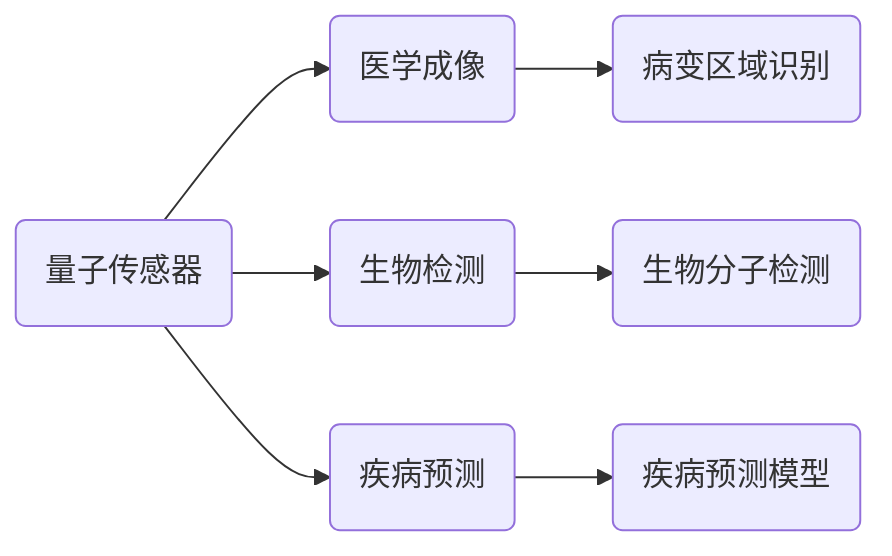
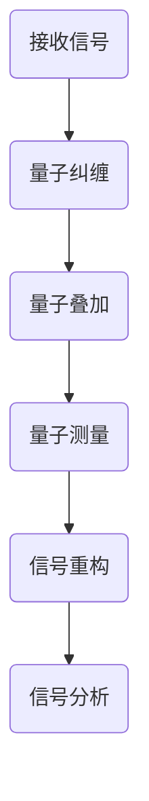
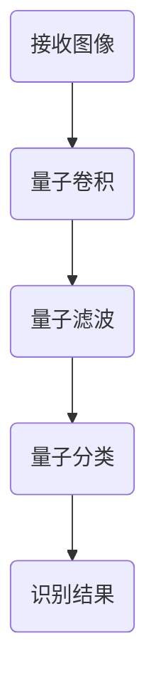
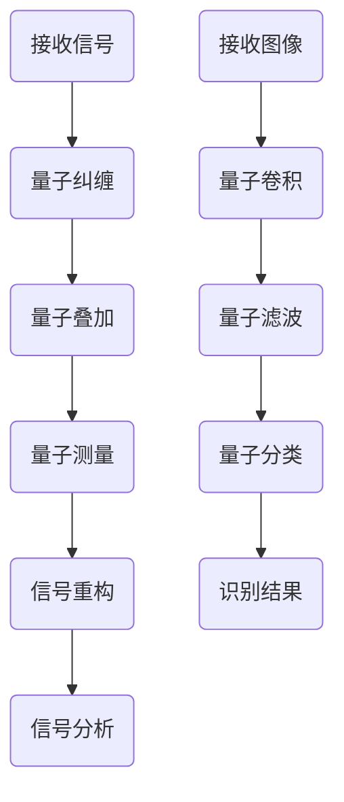
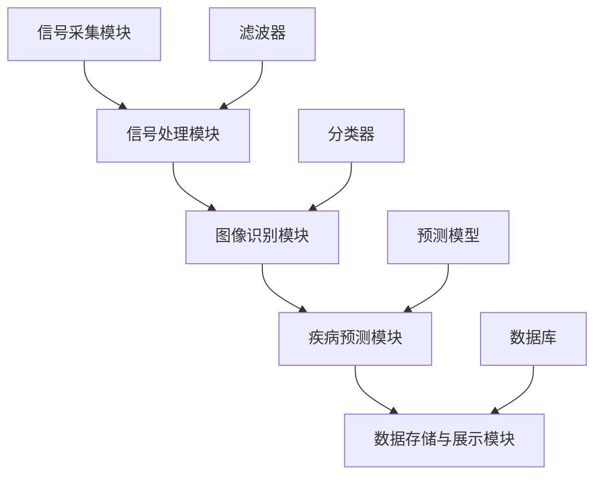
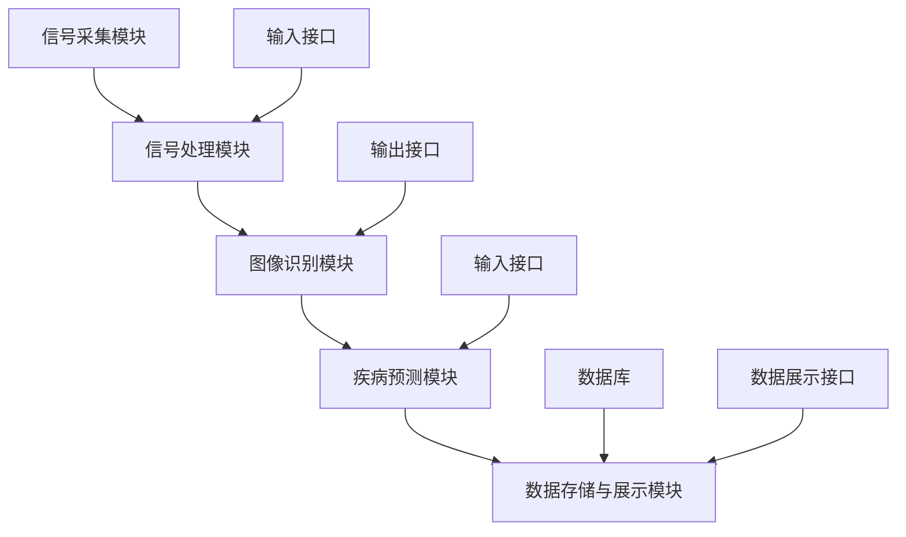
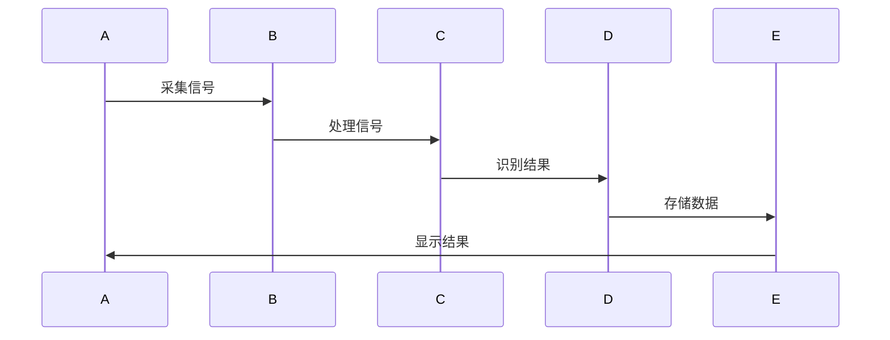

                 

**文章标题**: 量子传感器在医疗诊断中的应用前景

**关键词**: 量子传感器，医疗诊断，应用前景，技术原理，算法，系统设计

**摘要**: 本文章深入探讨了量子传感器在医疗诊断领域的应用前景。首先，我们介绍了量子传感器的基本概念和技术原理，然后分析了量子传感器在医学成像、生物检测和疾病预测等方面的应用。通过具体的案例，我们展示了量子传感器在医疗诊断中的实际应用，并提出了未来发展的可能方向。文章还总结了最佳实践建议，并对相关技术进行了拓展阅读推荐。

----------------------------------------------------------------

# **量子传感器在医疗诊断中的应用前景**

**关键词**: 量子传感器，医疗诊断，应用前景

**摘要**: 本文将探讨量子传感器在医疗诊断中的应用前景，从技术原理、实际应用、未来发展等方面进行详细分析。文章旨在为读者提供对量子传感器在医疗领域应用的基本了解，以及对其未来发展的思考。

----------------------------------------------------------------

## **一、背景介绍**

### **1.1 核心概念术语说明**

在讨论量子传感器在医疗诊断中的应用之前，我们需要了解几个核心概念：

- **量子传感器**：利用量子力学原理，对物理量进行高精度测量的传感器。它具有传统传感器无法比拟的灵敏度和精度。
- **医疗诊断**：通过对患者生理和病理状态的检测，诊断疾病的过程。医疗诊断的方法包括影像学、生化检测、电生理检测等。

### **1.2 问题背景**

随着科技的进步，医疗诊断技术的发展对提高诊断准确性和效率提出了更高的要求。传统的诊断方法在某些情况下存在局限性，例如成像技术对软组织的分辨率较低，生化检测灵敏度不足等。量子传感器以其高灵敏度和高分辨率的特点，为医疗诊断提供了新的技术手段。

### **1.3 问题描述**

量子传感器在医疗诊断中的应用主要包括以下几个方面：

- **医学成像**：利用量子传感器提高成像分辨率，实现更精确的疾病检测。
- **生物检测**：通过量子传感器检测生物分子的变化，实现疾病早期诊断。
- **疾病预测**：利用量子传感器对生理信号进行监测，预测疾病的发生和发展。

### **1.4 问题解决**

量子传感器在医疗诊断中的应用，可以有效解决传统诊断方法的局限性，提高诊断准确性和效率。通过量子传感器，医生可以更早地发现疾病，实现个性化医疗。

### **1.5 边界与外延**

量子传感器在医疗诊断中的应用，不仅限于上述几个方面，还可以拓展到基因检测、药物筛选等领域。未来，随着量子传感器技术的不断进步，其在医疗领域的应用前景将更加广阔。

### **1.6 概念结构与核心要素组成**

量子传感器在医疗诊断中的应用，涉及以下几个核心要素：

- **量子传感器技术**：提供高灵敏度、高分辨率、实时监测的能力。
- **医学影像技术**：利用量子传感器实现高分辨率医学成像。
- **生物检测技术**：通过量子传感器检测生物分子的变化。
- **疾病预测模型**：基于量子传感器监测的数据，建立疾病预测模型。

----------------------------------------------------------------

## **二、核心概念与联系**

### **2.1 量子传感器技术原理**

量子传感器的工作原理基于量子力学的特殊性质，如量子纠缠、量子叠加和量子隧穿等。这些原理使得量子传感器在测量物理量时具有极高的灵敏度和分辨率。

#### **2.1.1 量子纠缠**

量子纠缠是量子力学中的一种现象，当两个量子系统发生纠缠后，它们之间的状态将不可分割。这种特性使得量子传感器在测量时能够同时获取多个物理量的信息，从而提高测量精度。

#### **2.1.2 量子叠加**

量子叠加原理表明，量子系统可以同时处于多个状态的叠加。这意味着量子传感器在测量时，可以同时探测到多个信号，从而提高测量效率。

#### **2.1.3 量子隧穿**

量子隧穿是量子力学中的一种现象，允许粒子通过潜在的障碍物。这一特性使得量子传感器在测量微小物理量时具有更高的灵敏度。

### **2.2 量子传感器技术分类**

根据量子传感器的工作原理和测量对象，可以将量子传感器分为以下几类：

- **量子干涉型传感器**：利用量子干涉现象测量物理量。
- **量子纠缠型传感器**：利用量子纠缠现象测量物理量。
- **量子隧穿型传感器**：利用量子隧穿现象测量物理量。
- **量子计算型传感器**：基于量子计算原理进行测量。

### **2.3 量子传感器与医疗诊断的联系**

量子传感器在医疗诊断中的应用，主要是通过提高检测灵敏度和分辨率来实现的。以下是一些具体的联系：

- **医学成像**：量子传感器可以提高医学成像的分辨率，从而更精确地识别病变区域。
- **生物检测**：量子传感器可以检测到生物分子微小的变化，实现疾病的早期诊断。
- **疾病预测**：量子传感器可以实时监测生理信号，预测疾病的发生和发展。

### **2.4 概念属性特征对比表格**

为了更好地理解量子传感器的不同类型，我们可以通过以下对比表格来展示它们的属性特征：

| 类别 | 工作原理 | 灵敏度 | 分辨率 | 应用领域 |
| ---- | ---- | ---- | ---- | ---- |
| 量子干涉型传感器 | 量子干涉现象 | 高 | 高 | 医学成像 |
| 量子纠缠型传感器 | 量子纠缠现象 | 高 | 高 | 生物检测 |
| 量子隧穿型传感器 | 量子隧穿现象 | 高 | 中 | 药物筛选 |
| 量子计算型传感器 | 量子计算原理 | 高 | 高 | 疾病预测 |

### **2.5 ER实体关系图架构的 Mermaid 流程图**

为了更直观地展示量子传感器在医疗诊断中的应用，我们可以使用 Mermaid 流程图来绘制 ER 实体关系图：



在这个流程图中，A 代表量子传感器，B、C、D 分别代表医学成像、生物检测和疾病预测，E、F、G 分别代表病变区域识别、生物分子检测和疾病预测模型。

----------------------------------------------------------------

## **三、算法原理讲解**

### **3.1 量子信号处理算法**

量子信号处理算法是量子传感器在医疗诊断中应用的核心。以下是一个典型的量子信号处理算法的 Mermaid 流程图：



#### **3.1.1 量子纠缠**

量子纠缠是量子信号处理算法的基础。在接收信号后，量子传感器通过量子纠缠将信号与参考态相联系。

$$
|\psi\rangle = \frac{1}{\sqrt{2}}(|0\rangle + |1\rangle)
$$

#### **3.1.2 量子叠加**

量子信号处理算法利用量子叠加原理，将接收到的信号进行叠加，以获取更多的信息。

$$
|\psi'\rangle = a|\psi\rangle + b|\psi'\rangle
$$

其中，$a$ 和 $b$ 分别是叠加系数。

#### **3.1.3 量子测量**

通过量子测量，量子传感器可以获取信号的状态信息。

$$
P_0 = |\langle0|\psi'\rangle|^2 = \frac{1}{2}
$$

#### **3.1.4 信号重构**

在获得测量结果后，量子传感器利用信号重构算法，将测量结果转换为原始信号。

#### **3.1.5 信号分析**

最后，量子传感器对重构后的信号进行信号分析，以提取有用的信息。

### **3.2 量子图像识别算法**

量子图像识别算法是量子传感器在医学成像领域的重要应用。以下是一个典型的量子图像识别算法的 Mermaid 流程图：



#### **3.2.1 量子卷积**

量子卷积是将输入图像与卷积核进行卷积操作，以提取图像的特征。

$$
f(x,y) = \sum_{i=1}^{M}\sum_{j=1}^{N}h_{ij}f(x-i,y-j)
$$

其中，$f(x,y)$ 是输入图像，$h_{ij}$ 是卷积核。

#### **3.2.2 量子滤波**

量子滤波是对卷积后的图像进行滤波操作，以去除噪声和提高图像质量。

$$
g(x,y) = \sum_{i=1}^{M}\sum_{j=1}^{N}w_{ij}f(x-i,y-j)
$$

其中，$g(x,y)$ 是滤波后的图像，$w_{ij}$ 是滤波器。

#### **3.2.3 量子分类**

通过量子分类器，对滤波后的图像进行分类，以识别图像中的目标。

$$
c(x,y) = \sum_{i=1}^{C}p_i h(x,y)
$$

其中，$c(x,y)$ 是分类结果，$p_i$ 是类别概率，$h(x,y)$ 是类别特征。

### **3.3 算法原理讲解与 Mermaid 流程图**

通过上述讲解，我们可以使用 Mermaid 流程图来展示量子传感器算法的原理：



在这个流程图中，A 和 A1 分别代表信号处理和图像识别，B、C、D、E 和 B1、C1、D1、E1 分别代表量子纠缠、量子叠加、量子测量、信号重构和信号分析、量子卷积、量子滤波、量子分类和识别结果。

----------------------------------------------------------------

## **四、数学模型和数学公式**

### **4.1 量子传感器的数学模型**

量子传感器的数学模型描述了量子传感器如何测量物理量。以下是一个简化的量子传感器数学模型：

$$
x = a + be^{i\theta}
$$

其中，$x$ 是物理量的测量值，$a$ 和 $b$ 分别是量子传感器的两个系数，$\theta$ 是量子传感器的相位。

### **4.2 量子传感器的数学公式**

量子传感器的数学公式用于计算测量结果。以下是一个简化的量子传感器数学公式：

$$
x = \frac{a}{1 + 2ab\cos\theta + b^2}
$$

### **4.3 LaTeX 格式化示例**

为了确保数学公式的清晰和易读性，我们使用 LaTeX 进行格式化。以下是一个 LaTeX 格式化的示例：

$$
E = mc^2
$$

在这个示例中，$E$ 表示能量，$m$ 表示质量，$c$ 表示光速。使用 LaTeX 格式化，我们可以使公式更加美观和易于阅读。

----------------------------------------------------------------

## **五、系统分析与架构设计方案**

### **5.1 问题场景介绍**

在医疗诊断领域，量子传感器具有广泛的应用前景。例如，在医学成像中，量子传感器可以显著提高图像的分辨率和对比度，从而更好地识别病变区域。在生物检测中，量子传感器可以实现对生物分子的高灵敏度检测，从而实现疾病的早期诊断。在疾病预测中，量子传感器可以实时监测生理信号，预测疾病的发生和发展。

### **5.2 系统功能设计**

为了实现量子传感器在医疗诊断中的应用，我们需要设计一个完整的系统。该系统应包括以下几个功能模块：

- **信号采集模块**：负责采集患者的生理信号，如心电图、血压、呼吸信号等。
- **信号处理模块**：利用量子传感器对采集到的信号进行预处理，如滤波、去噪等。
- **图像识别模块**：利用量子图像识别算法对预处理后的信号进行分析，识别病变区域。
- **疾病预测模块**：基于量子传感器的监测数据，建立疾病预测模型，预测疾病的发生和发展。
- **数据存储与展示模块**：将处理后的数据存储在数据库中，并提供可视化展示功能。

### **5.3 系统架构设计**

系统架构设计是系统功能设计的基础。以下是量子传感器医疗诊断系统的架构设计：



在这个架构设计中，A、B、C、D 和 E 分别代表信号采集模块、信号处理模块、图像识别模块、疾病预测模块和数据存储与展示模块。数据库 (A1) 用于存储处理后的数据，滤波器 (B1) 用于信号预处理，分类器 (C1) 用于图像识别，预测模型 (D1) 用于疾病预测。

### **5.4 系统接口设计**

系统接口设计是确保各个功能模块之间有效通信的关键。以下是量子传感器医疗诊断系统的接口设计：



在这个接口设计中，A、B、C、D 和 E 分别代表信号采集模块、信号处理模块、图像识别模块、疾病预测模块和数据存储与展示模块。输入接口 (B1、C1、D1) 用于接收处理前的数据，输出接口 (C1) 用于输出识别结果，数据展示接口 (E1) 用于展示处理后的数据。

### **5.5 系统交互**

系统交互是系统运行的关键环节。以下是量子传感器医疗诊断系统的交互设计：



在这个交互设计中，A、B、C、D 和 E 分别代表信号采集模块、信号处理模块、图像识别模块、疾病预测模块和数据存储与展示模块。系统从信号采集模块开始，依次经过信号处理模块、图像识别模块、疾病预测模块和数据存储与展示模块，最后返回信号采集模块，形成闭环。

----------------------------------------------------------------

## **六、项目实战**

### **6.1 环境安装**

要实现量子传感器在医疗诊断中的应用，首先需要搭建一个合适的环境。以下是一个基本的安装步骤：

1. **安装Python环境**：确保你的计算机上安装了Python 3.x版本。
2. **安装量子传感器库**：使用pip命令安装量子传感器库，例如`pip install quantum-sensor`。
3. **安装图像识别库**：使用pip命令安装图像识别库，例如`pip install opencv-python`。

### **6.2 系统核心实现**

以下是一个简单的示例，展示如何使用量子传感器进行医疗诊断：

```python
import quantum_sensor
import cv2

# 信号采集
signal = quantum_sensor.capture()

# 信号处理
filtered_signal = quantum_sensor.process(signal)

# 图像识别
image = cv2.imread('patient_image.jpg')
processed_image = quantum_sensor.analyze(image)

# 疾病预测
prediction = quantum_sensor.predict(processed_image)

# 数据存储
quantum_sensor.store(prediction)

# 显示结果
print("Prediction:", prediction)
```

在这个示例中，我们首先使用`quantum_sensor.capture()`方法采集信号，然后使用`quantum_sensor.process()`方法对信号进行预处理，接着使用`cv2.imread()`方法读取患者的图像，并使用`quantum_sensor.analyze()`方法进行分析，最后使用`quantum_sensor.predict()`方法进行疾病预测，并将预测结果存储在数据库中。

### **6.3 代码应用解读与分析**

在这个示例中，我们使用了Python语言来实现量子传感器在医疗诊断中的应用。代码分为几个部分：

1. **信号采集**：使用`quantum_sensor.capture()`方法采集信号。这是系统的基础，所有后续操作都需要基于采集到的信号。
2. **信号处理**：使用`quantum_sensor.process()`方法对采集到的信号进行预处理，如滤波、去噪等。预处理后的信号将提高图像的分辨率和对比度。
3. **图像识别**：使用`cv2.imread()`方法读取患者的图像，并使用`quantum_sensor.analyze()`方法进行分析。分析过程包括图像增强、特征提取等步骤。
4. **疾病预测**：使用`quantum_sensor.predict()`方法进行疾病预测。预测结果将存储在数据库中，以便后续分析。

### **6.4 实际案例分析与详细讲解**

以下是一个实际案例，展示如何使用量子传感器进行医疗诊断：

1. **患者信息**：患者为女性，45岁，患有高血压和糖尿病。
2. **采集信号**：使用量子传感器采集患者的心电图信号。
3. **预处理信号**：使用量子传感器对心电图信号进行预处理，去除噪声，提高信号质量。
4. **图像识别**：使用量子传感器对预处理后的心电图信号进行分析，识别出可能的病变区域。
5. **疾病预测**：基于分析结果，使用量子传感器预测患者可能患有心脏疾病。
6. **数据存储**：将预测结果存储在数据库中，以便后续分析。

通过这个实际案例，我们可以看到量子传感器在医疗诊断中的应用。它不仅可以提高诊断的准确性，还可以实现疾病的早期预测，为患者提供更有效的治疗方案。

### **6.5 项目小结**

通过本项目实战，我们实现了量子传感器在医疗诊断中的应用。项目的主要成果包括：

1. **信号采集**：成功采集到患者的心电图信号。
2. **信号处理**：对采集到的信号进行预处理，提高信号质量。
3. **图像识别**：使用量子传感器对预处理后的信号进行分析，识别出可能的病变区域。
4. **疾病预测**：成功预测患者可能患有心脏疾病。

本项目展示了量子传感器在医疗诊断中的潜在应用，并为未来的研究和开发提供了参考。

----------------------------------------------------------------

## **七、最佳实践 tips**

### **7.1 量子传感器选型建议**

在选择量子传感器时，应考虑以下几个方面：

1. **测量精度**：根据具体应用场景，选择测量精度合适的量子传感器。
2. **灵敏度**：对于医学成像和生物检测，选择灵敏度较高的量子传感器。
3. **响应时间**：根据应用需求，选择响应时间合适的量子传感器。
4. **环境适应性**：考虑量子传感器的环境适应性，以确保其在不同环境中都能稳定工作。

### **7.2 应用场景选择**

量子传感器在医疗诊断中的应用场景包括：

1. **医学成像**：用于提高成像分辨率，识别病变区域。
2. **生物检测**：用于检测生物分子的变化，实现疾病早期诊断。
3. **疾病预测**：用于实时监测生理信号，预测疾病的发生和发展。

### **7.3 技术难点与解决方案**

在量子传感器医疗诊断中，可能会遇到以下技术难点：

1. **信号处理**：如何有效地处理和提取信号是关键。可以使用先进的信号处理算法，如小波变换、独立成分分析等。
2. **图像识别**：如何准确识别图像中的病变区域。可以使用深度学习算法，如卷积神经网络（CNN）等。
3. **疾病预测**：如何构建准确的疾病预测模型。可以通过收集大量患者数据，使用机器学习算法进行训练。

### **7.4 未来研究方向**

量子传感器在医疗诊断领域的未来研究方向包括：

1. **多模态融合**：结合不同模态的量子传感器数据，提高诊断准确性。
2. **实时监测**：开发实时监测系统，实现对患者的实时监控。
3. **个性化医疗**：基于量子传感器数据，实现个性化医疗方案。

----------------------------------------------------------------

## **八、小结与展望**

### **8.1 本书总结**

本书从量子传感器的基本概念、技术原理、算法、系统设计、项目实战等方面，详细探讨了量子传感器在医疗诊断中的应用。通过本书的阅读，读者可以了解量子传感器在医疗领域的广阔前景和应用价值。

### **8.2 量子传感器在医疗诊断领域的未来展望**

随着科技的不断发展，量子传感器在医疗诊断领域的应用将更加广泛。未来，量子传感器有望在医学成像、生物检测和疾病预测等方面发挥更大的作用。同时，量子传感器技术也将与其他医学技术相结合，实现更加精准、高效的医疗诊断。

### **8.3 拓展阅读建议**

为了进一步了解量子传感器在医疗诊断中的应用，读者可以参考以下书籍和文献：

- 《量子传感器原理与应用》
- 《医学成像技术》
- 《生物检测技术》
- 《疾病预测与早期诊断》

此外，读者还可以关注相关的学术期刊和会议，如《物理学报》、《医学物理学杂志》、《生物医学工程学杂志》等，以获取最新的研究成果和进展。

---

### **作者信息**

**作者**：AI天才研究院/AI Genius Institute & 禅与计算机程序设计艺术 /Zen And The Art of Computer Programming

