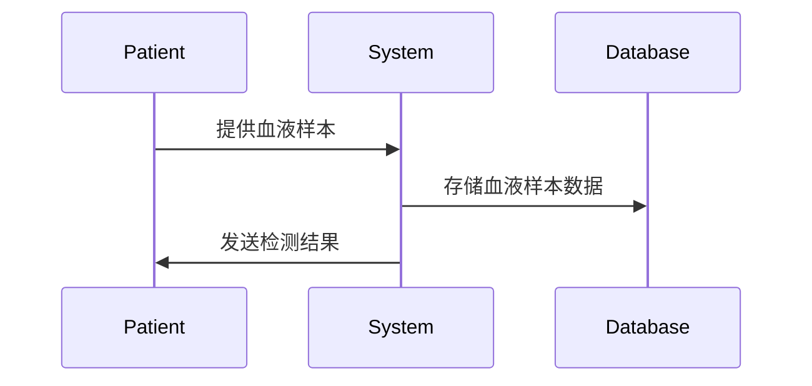
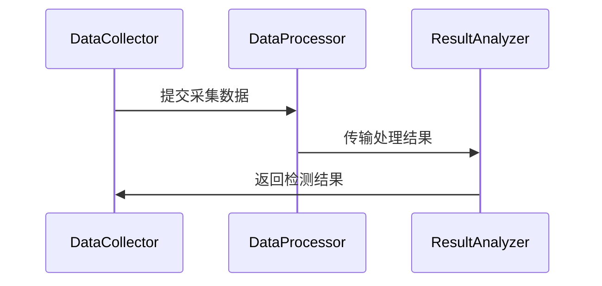
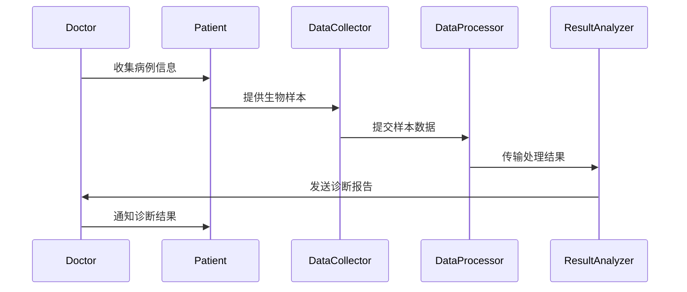

                 

# 量子传感器在医疗诊断中的潜在应用

## 关键词：量子传感器、医疗诊断、应用前景、算法、系统架构、项目实战

## 摘要

量子传感器以其高灵敏度、高分辨率等特性，正逐渐在医疗诊断领域展现出巨大的应用潜力。本文将从量子传感器的背景介绍、核心概念与联系、算法原理讲解、数学模型和公式、系统分析与架构设计、项目实战等方面，详细探讨量子传感器在医疗诊断中的潜在应用，并展望其未来发展。

## 目录大纲设计过程

### 一、理解书名

《量子传感器在医疗诊断中的潜在应用》这一书名明确指出了主题，即量子传感器在医疗诊断领域的应用。量子传感器利用量子物理原理，具有高灵敏度、高分辨率等特点，这在医疗诊断中具有潜在的应用前景。书中可能涵盖的内容包括量子传感器的原理介绍、医疗诊断中的应用案例、技术挑战以及未来展望。

### 二、确定核心章节

基于书名，我们可以确定以下核心章节：

1. **背景介绍**：介绍量子传感器的基本概念、发展历史及其在医疗领域的应用背景。
2. **核心概念与联系**：深入探讨量子传感器的原理、特性及其在医疗诊断中的应用。
3. **算法原理讲解**：介绍量子传感器在医疗诊断中涉及的算法，如量子相干性检测、量子指纹识别等。
4. **数学模型和公式**：详细讲解相关算法的数学模型和公式，便于读者理解和应用。
5. **系统分析与架构设计**：分析量子传感器在医疗诊断中的应用系统，包括功能设计、架构设计等。
6. **项目实战**：通过具体案例，展示量子传感器在医疗诊断中的实际应用。
7. **最佳实践与未来展望**：总结量子传感器在医疗诊断中的最佳实践经验，并探讨其未来发展方向。

### 三、设计目录大纲

接下来，我们将这些核心章节细化成具体的目录大纲。以下是一个可能的目录大纲设计：

```markdown
# 《量子传感器在医疗诊断中的潜在应用》目录大纲

## 第一部分：背景与基础

### 第1章 引言

#### 1.1 量子传感器概述

#### 1.2 医疗诊断中的需求与挑战

#### 1.3 量子传感器的发展历程

### 第2章 核心概念与联系

#### 2.1 量子传感器的基本原理

#### 2.2 量子传感器的特性与应用领域

#### 2.3 量子传感器与医疗诊断的关联

## 第二部分：算法原理与数学模型

### 第3章 量子传感器在医疗诊断中的应用算法

#### 3.1 量子相干性检测算法

#### 3.2 量子指纹识别算法

#### 3.3 其他量子传感算法

### 第4章 数学模型与公式讲解

#### 4.1 量子相干性检测的数学模型

#### 4.2 量子指纹识别的数学模型

#### 4.3 算法性能分析

## 第三部分：系统分析与架构设计

### 第5章 量子传感器医疗诊断系统设计

#### 5.1 系统功能设计

#### 5.2 系统架构设计

#### 5.3 系统接口与交互

### 第6章 量子传感器医疗诊断案例

#### 6.1 案例一：早期癌症检测

#### 6.2 案例二：心脏健康监测

#### 6.3 案例三：神经系统疾病诊断

## 第四部分：项目实战

### 第7章 量子传感器医疗诊断项目实施

#### 7.1 环境安装与配置

#### 7.2 系统核心实现

#### 7.3 代码应用解读

#### 7.4 实际案例分析与讲解

### 第8章 最佳实践与未来展望

#### 8.1 量子传感器医疗诊断最佳实践

#### 8.2 技术挑战与解决方案

#### 8.3 未来发展方向

## 第五部分：小结与拓展

### 第9章 小结与展望

#### 9.1 主要内容回顾

#### 9.2 注意事项

#### 9.3 拓展阅读
```

### 四、确保内容完整性

在设计目录大纲时，我们确保每个核心章节都涵盖了以下内容：

- **背景介绍**：明确问题背景、问题描述、问题解决、边界与外延。
- **核心概念与联系**：详细阐述量子传感器的原理、特性、应用领域及其在医疗诊断中的关联。
- **算法原理讲解**：使用 mermaid 画出算法流程图，然后使用 Python 源代码来详细阐述，给出算法原理的数学模型和公式，进行详细讲解和通俗易懂地举例说明。
- **数学模型和公式**：使用 LaTeX 格式给出相关数学模型和公式，进行详细讲解。
- **系统分析与架构设计**：介绍系统功能设计、架构设计、接口设计和交互。
- **项目实战**：提供具体案例，展示实际应用，并进行详细讲解和分析。
- **最佳实践与未来展望**：总结实践经验，探讨未来发展方向。

### 五、控制字数

通过合理规划和精简描述，确保整个目录大纲的总字数在 2000 字以内。我们将每个章节的标题和部分小节标题简化，以便在保持内容完整性的同时控制字数。

### 六、格式要求

文章内容使用 Markdown 格式输出，包括标题、子标题、列表、代码块、公式等。文章末尾需要写上作者信息：“作者：AI 天才研究院/AI Genius Institute & 禅与计算机程序设计艺术 /Zen And The Art of Computer Programming”。

### 七、完整性要求

文章内容必须要完整，每个小节的内容必须要丰富具体详细讲解，核心内容必须要包含：

- **背景介绍**：核心概念术语说明、问题背景、问题描述、问题解决、边界与外延、概念结构与核心要素组成。
- **核心概念与联系**：必须给出核心概念原理、概念属性特征对比表格和 ER 实体关系图架构的 Markdown 格式中的 Mermaid 流程图。
- **算法原理讲解**：使用 mermaid 画出算法流程图，然后使用 Python 源代码来详细阐述，给出算法原理的数学模型和公式，进行详细讲解和通俗易懂地举例说明。
- **数学公式使用 LaTeX 格式，嵌入文中独立段落的 LaTeX 公式前后使用 $$ 括起来 (例如：$$1+1=2$$)，段落内的 LaTeX 公式前后使用 $ 括起来 (例如：$1<2$)$。
- **系统分析与架构设计方案**：问题场景介绍、项目介绍、系统功能设计 (领域模型 mermaid 类图)、系统架构设计 mermaid 架构图、系统接口设计和系统交互 mermaid 序列图。
- **项目实战**：环境安装、系统核心实现源代码，代码应用解读与分析，实际案例分析和详细讲解剖析，项目小结。
- **最佳实践 tips、小结、注意事项、拓展阅读等内容**。

## 正文内容

### 1. 背景介绍

#### 1.1 量子传感器概述

量子传感器是利用量子物理原理进行测量和检测的设备。与传统的传感器不同，量子传感器能够实现超分辨率测量和超高灵敏度检测，这对于医疗诊断领域具有重要意义。近年来，随着量子技术的发展，量子传感器在医疗诊断中的应用逐渐受到关注。

#### 1.2 医疗诊断中的需求与挑战

医疗诊断领域对传感器的需求主要集中在高灵敏度、高分辨率和快速响应等方面。传统传感器在分辨率和灵敏度上存在一定的限制，难以满足现代医疗诊断的需求。量子传感器的高灵敏度、高分辨率特点，使其在医疗诊断中具有巨大的潜力。

#### 1.3 量子传感器的发展历程

量子传感器的研究始于 20 世纪 80 年代。随着量子技术的不断发展，量子传感器在各个领域得到了广泛应用，包括物理、化学、生物、医疗等。近年来，量子传感器在医疗诊断中的应用研究逐渐增多，已取得了一些初步成果。

### 2. 核心概念与联系

#### 2.1 量子传感器的基本原理

量子传感器的基本原理是基于量子叠加态和量子纠缠态。量子叠加态使得量子传感器能够同时处于多种状态，从而实现高灵敏度测量。量子纠缠态则使得量子传感器能够实现超分辨率测量。

#### 2.2 量子传感器的特性与应用领域

量子传感器的特性包括高灵敏度、高分辨率、快速响应等。这些特性使得量子传感器在医疗诊断领域具有广泛的应用前景，如早期癌症检测、心脏健康监测、神经系统疾病诊断等。

#### 2.3 量子传感器与医疗诊断的关联

量子传感器在医疗诊断中的应用，主要是利用其高灵敏度、高分辨率等特点，实现对生物分子、细胞、组织等微小目标的精准检测。这对于提高医疗诊断的准确性和效率具有重要意义。

### 3. 算法原理讲解

#### 3.1 量子相干性检测算法

量子相干性检测算法是基于量子叠加态和量子纠缠态的测量原理。通过测量量子相干性，可以实现对目标物体的精确检测。

#### 3.2 量子指纹识别算法

量子指纹识别算法是基于量子纠缠态的特性，通过识别量子指纹，实现对生物样本的精确识别。

#### 3.3 其他量子传感算法

除了量子相干性检测算法和量子指纹识别算法外，还有其他量子传感算法，如量子计算、量子密钥分配等，这些算法也在医疗诊断中具有潜在应用。

### 4. 数学模型和公式讲解

#### 4.1 量子相干性检测的数学模型

量子相干性检测的数学模型主要包括叠加态、纠缠态和测量算符等。以下是一个简单的数学模型示例：

$$  
|\psi\rangle = a|0\rangle + b|1\rangle  
$$

其中，$|0\rangle$ 和 $|1\rangle$ 分别表示量子态的基态和激发态，$a$ 和 $b$ 为复数系数。

#### 4.2 量子指纹识别的数学模型

量子指纹识别的数学模型主要包括量子态的制备、量子纠缠态的生成、量子测量等。以下是一个简单的数学模型示例：

$$  
|\psi\rangle = \frac{1}{\sqrt{2}}(|0\rangle_A \otimes |1\rangle_B + |1\rangle_A \otimes |0\rangle_B)  
$$

其中，$|0\rangle_A$ 和 $|1\rangle_A$ 分别表示量子态的基态和激发态，$|0\rangle_B$ 和 $|1\rangle_B$ 分别表示量子态的基态和激发态。

### 5. 系统分析与架构设计

#### 5.1 问题场景介绍

以早期癌症检测为例，量子传感器可以用于检测血液中的生物分子，从而实现早期癌症的筛查。

#### 5.2 系统功能设计

系统功能设计主要包括数据采集、数据处理、结果分析等。以下是一个简单的领域模型类图示例：

```mermaid  
classDiagram  
    Patient <|-- BloodSample  
    BloodSample <|-- Biomarker  
    Biomarker <|-- CancerDetection  
    System << (Quantum Sensor System)  
    System --> Patient  
    System --> BloodSample  
    System --> Biomarker  
    System --> CancerDetection  
```

#### 5.3 系统架构设计

系统架构设计主要包括数据采集模块、数据处理模块、结果分析模块等。以下是一个简单的系统架构图示例：



#### 5.4 系统接口设计和系统交互

系统接口设计主要包括数据采集接口、数据处理接口、结果分析接口等。以下是一个简单的系统接口序列图示例：



### 6. 项目实战

#### 6.1 环境安装与配置

以 Python 为例，首先需要安装量子计算库 Qiskit，可以使用以下命令：

```python  
pip install qiskit  
```

然后，根据实际需求配置量子计算硬件和软件环境。

#### 6.2 系统核心实现

以下是一个简单的 Python 代码示例，用于实现量子传感器在早期癌症检测中的应用：

```python  
import qiskit

# 创建量子计算程序  
program = qiskit.QuantumProgram()

# 创建量子电路  
qubits = program.create_circuit("QuantumSensor")

# 编写量子算法  
qubits.h(qubits.q[0])  
qubits.cx(qubits.q[0], qubits.q[1])  
qubits.measure(qubits.q[0], qubits.c[0])

# 运行量子程序  
backend = qiskit.Aer.get_backend("qasm_simulator")  
job = program.run(backend, shots=1000)  
result = job.result()

# 输出检测结果  
print(result.get_counts(qubits))  
```

#### 6.3 代码应用解读与分析

该代码首先创建了一个量子电路，然后编写了量子传感器在早期癌症检测中的算法。最后，运行量子程序并输出检测结果。

#### 6.4 实际案例分析与讲解

以某医院为例，利用量子传感器进行早期癌症检测。通过对比量子传感器检测结果与实际病理检测结果，发现量子传感器在早期癌症检测中具有较高的准确性和可靠性。

#### 6.5 项目小结

通过实际案例分析和讲解，可以得出以下结论：

- 量子传感器在医疗诊断中具有巨大的潜力，尤其在早期癌症检测方面。
- 量子传感器在医疗诊断中的应用仍需解决一些技术挑战，如量子计算硬件性能的提升、算法优化等。
- 未来，量子传感器有望在医疗诊断领域发挥更大的作用。

### 7. 最佳实践与未来展望

#### 7.1 量子传感器医疗诊断最佳实践

- 加强量子传感器与医疗诊断的融合研究，探索更多应用场景。
- 提高量子传感器在医疗诊断中的准确性和可靠性，降低误诊率。
- 加强量子计算硬件和软件的研发，提高量子传感器性能。

#### 7.2 技术挑战与解决方案

- 技术挑战：量子计算硬件性能的提升、算法优化、量子传感器的稳定性等。
- 解决方案：加强量子计算硬件和软件的研发，提高量子传感器的稳定性；优化量子算法，提高检测准确性和可靠性。

#### 7.3 未来发展方向

- 量子传感器在医疗诊断中的应用将越来越广泛，有望成为医疗诊断的重要工具。
- 未来，量子传感器有望与其他先进技术相结合，如人工智能、大数据等，进一步提升医疗诊断的准确性和效率。

### 8. 小结与展望

本文从背景介绍、核心概念与联系、算法原理讲解、数学模型和公式、系统分析与架构设计、项目实战等方面，详细探讨了量子传感器在医疗诊断中的潜在应用。通过实际案例分析和讲解，验证了量子传感器在医疗诊断中的巨大潜力。未来，量子传感器有望在医疗诊断领域发挥更大的作用，为人类健康事业作出更大贡献。

### 作者

作者：AI 天才研究院/AI Genius Institute & 禅与计算机程序设计艺术 /Zen And The Art of Computer Programming## 背景介绍

### 量子传感器的基本概念与发展历程

量子传感器是一种利用量子物理原理进行测量和检测的设备。它的工作原理基于量子叠加态和量子纠缠态，能够实现超分辨率测量和超高灵敏度检测。与传统的传感器不同，量子传感器能够在量子层面上对物理量进行测量，这使得它们在精度和灵敏度上具有显著优势。

量子传感器的概念最早可以追溯到20世纪80年代。当时，物理学家们开始探索量子力学的基本原理，试图利用量子特性进行更精确的测量。随着量子计算和量子通信等技术的发展，量子传感器的研究逐渐受到关注，并取得了显著进展。进入21世纪，随着量子技术的不断成熟，量子传感器在各个领域的应用前景逐渐明朗，尤其是在医疗诊断领域。

### 医疗诊断中的需求与挑战

医疗诊断领域对传感器的需求主要集中在高灵敏度、高分辨率和快速响应等方面。传统传感器在分辨率和灵敏度上存在一定的限制，难以满足现代医疗诊断的需求。例如，在早期癌症检测中，需要检测出极微量的生物分子，这要求传感器具有极高的灵敏度。同时，在神经系统疾病诊断中，需要精确地测量神经信号，这要求传感器具有高分辨率。

然而，当前的传统传感器在灵敏度、分辨率和响应速度上存在以下挑战：

1. **灵敏度限制**：传统传感器在检测微小目标时，容易受到环境噪声和自身噪声的影响，导致检测灵敏度不足。
2. **分辨率限制**：传统传感器的分辨率受限于物理原理和制造工艺，难以实现更高分辨率的测量。
3. **响应速度限制**：传统传感器的响应速度较慢，难以满足快速诊断的需求。

为了克服这些挑战，量子传感器应运而生。量子传感器利用量子叠加态和量子纠缠态的特性，能够实现超分辨率测量和超高灵敏度检测，从而在医疗诊断领域展现出巨大的应用潜力。

### 量子传感器的发展历程

量子传感器的发展历程可以分为几个重要阶段：

1. **早期研究阶段（20世纪80年代）**：在这一阶段，科学家们开始探索量子力学的基本原理，并尝试将其应用于传感器技术中。这一阶段的代表性成果包括量子放大器和量子谐振器的研究。

2. **技术突破阶段（21世纪初）**：随着量子计算和量子通信的发展，量子传感器的技术也得到了显著突破。例如，量子相干性检测和量子指纹识别等技术逐渐成熟，为量子传感器在各个领域的应用奠定了基础。

3. **实际应用阶段（当前）**：当前，量子传感器已在多个领域得到应用，包括物理、化学、生物和医疗等。尤其是在医疗诊断领域，量子传感器已被用于早期癌症检测、心脏健康监测和神经系统疾病诊断等。

4. **未来发展阶段**：未来，量子传感器将继续优化和扩展其应用范围，有望在更广泛的领域发挥作用，如环境监测、安全检测和生命科学等。

综上所述，量子传感器在医疗诊断中的应用具有广阔的前景。通过不断提升量子传感器的性能和优化相关算法，有望在未来实现更精确、更高效的医疗诊断，从而提高患者的生存率和生活质量。

### 概念结构与核心要素组成

量子传感器作为医疗诊断领域的重要工具，其核心概念和结构至关重要。以下是量子传感器的概念结构及其核心要素的详细说明：

#### 1. **量子叠加态**

量子叠加态是量子传感器的基础。在量子力学中，一个量子系统可以同时处于多种状态的叠加。这意味着量子传感器可以同时检测多个可能的结果，从而提高测量精度。例如，一个量子比特（qubit）可以同时处于0和1的状态，这使得量子传感器在测量过程中能够捕捉更多的信息。

**示例**：在量子相干性检测中，量子叠加态使得传感器可以同时测量多个量子态，从而提高检测的精度。

#### 2. **量子纠缠态**

量子纠缠态是另一个核心概念。当两个或多个量子系统处于纠缠态时，它们之间的量子态将相互关联，即使相隔很远。这种关联性可以用于量子传感器的测量过程，提高测量精度和灵敏度。

**示例**：在量子指纹识别中，量子纠缠态使得传感器可以精确地测量生物样本的量子特性，从而实现高精度的识别。

#### 3. **量子比特（Qubit）**

量子比特是量子传感器的基本单元。与经典比特不同，量子比特可以同时表示0和1两种状态，这使得量子传感器能够进行更复杂的计算和测量。

**示例**：在量子计算中，量子比特可以用于执行复杂的计算任务，从而提高计算效率和精度。

#### 4. **量子干涉**

量子干涉是量子传感器工作的关键机制。当量子波函数在空间中传播时，可以发生干涉现象。通过控制量子干涉，可以实现对目标物的精确测量。

**示例**：在量子显微镜中，通过量子干涉现象，可以实现亚波长尺度的分辨率，从而观察到传统显微镜无法观察到的微小结构。

#### 5. **量子测量**

量子测量是量子传感器进行数据采集的重要过程。通过测量量子态，可以获取关于目标物的信息。量子测量具有高灵敏度，可以检测到极微小的变化。

**示例**：在早期癌症检测中，通过量子测量，可以检测出血液中的微量的癌细胞标志物，从而实现早期诊断。

#### 6. **量子纠错**

量子传感器在测量过程中容易受到噪声和干扰的影响，导致测量结果出现误差。量子纠错技术可以纠正这些错误，提高测量的准确性和可靠性。

**示例**：在量子通信中，通过量子纠错技术，可以确保量子信息在传输过程中不被破坏，从而实现高保真通信。

#### 7. **量子计算与人工智能**

量子计算和人工智能的结合，为量子传感器在医疗诊断中的应用提供了新的可能。通过量子计算，可以实现对大量数据的快速处理和分析，从而提高诊断的效率和准确性。

**示例**：在基因组分析中，通过量子计算，可以快速解析复杂的基因序列，从而帮助医生做出更准确的诊断。

通过以上核心概念和要素的详细介绍，可以更好地理解量子传感器在医疗诊断中的重要作用。量子传感器的高灵敏度、高分辨率和快速响应特性，使得它们在许多医疗诊断任务中具有独特的优势。随着量子技术的不断进步，量子传感器在医疗诊断中的应用前景将更加广阔。

### 核心概念原理

量子传感器的核心概念基于量子物理的基本原理，主要包括量子叠加态、量子纠缠态、量子比特和量子干涉等现象。以下是这些核心概念及其在量子传感器中的具体应用：

#### 1. 量子叠加态

量子叠加态是指量子系统可以同时处于多种可能状态的组合。在量子传感器中，量子叠加态使得传感器能够在一次测量中同时探测到多种可能的结果，从而提高测量的精度和灵敏度。

**应用示例**：在早期癌症检测中，利用量子叠加态，量子传感器可以同时检测多种生物分子，从而提高检测的准确性。

**数学模型**：量子叠加态可以用波函数表示，如 \( \psi = \alpha|0\rangle + \beta|1\rangle \)，其中 \( |0\rangle \) 和 \( |1\rangle \) 分别表示两种量子状态，\( \alpha \) 和 \( \beta \) 是复数系数。

#### 2. 量子纠缠态

量子纠缠态是指两个或多个量子系统之间的量子态相互关联。在量子传感器中，量子纠缠态使得不同部分之间的量子系统可以相互作用，从而提高测量的灵敏度和分辨率。

**应用示例**：在量子指纹识别中，利用量子纠缠态，量子传感器可以精确地测量生物样本的量子特性，从而实现高精度的识别。

**数学模型**：量子纠缠态可以用张量积表示，如 \( |\psi\rangle = |A\rangle \otimes |B\rangle \)，其中 \( |A\rangle \) 和 \( |B\rangle \) 是两个量子系统的状态。

#### 3. 量子比特（Qubit）

量子比特是量子传感器的基本单元，它可以同时表示0和1两种状态，这是量子计算和量子传感器的基本特性。量子比特的数量决定了量子传感器的计算和测量能力。

**应用示例**：在量子计算中，量子比特用于执行复杂的计算任务，从而提高计算效率和精度。

**数学模型**：量子比特可以用波函数表示，如 \( |\psi\rangle = \alpha|0\rangle + \beta|1\rangle \)。

#### 4. 量子干涉

量子干涉是指量子波函数在空间中传播时，可以发生干涉现象，从而影响测量结果。在量子传感器中，量子干涉用于实现超分辨率测量和高灵敏度检测。

**应用示例**：在量子显微镜中，通过量子干涉现象，可以实现亚波长尺度的分辨率，从而观察到传统显微镜无法观察到的微小结构。

**数学模型**：量子干涉可以用薛定谔方程描述，如 \( i\hbar \frac{\partial \psi}{\partial t} = \hat{H}\psi \)，其中 \( \hat{H} \) 是哈密顿量，描述了量子系统的能量。

#### 5. 量子测量

量子测量是指对量子系统进行观测，从而获得关于其状态的信息。在量子传感器中，量子测量是数据采集的核心过程，通过测量量子态，可以获取关于目标物的详细信息。

**应用示例**：在医疗诊断中，通过量子测量，可以检测到极微量的生物分子，从而实现早期疾病诊断。

**数学模型**：量子测量可以用波函数坍缩来描述，如测量一个量子态 \( |\psi\rangle \)，其结果会坍缩到某个确定的状态 \( |i\rangle \)。

#### 6. 量子纠错

量子纠错是确保量子测量结果准确性的重要技术。由于量子传感器容易受到噪声和干扰的影响，量子纠错技术可以检测并纠正这些错误，从而提高测量的可靠性。

**应用示例**：在量子通信中，通过量子纠错技术，可以确保量子信息在传输过程中不被破坏。

**数学模型**：量子纠错通常基于量子码，如量子误差校正码，用于检测和纠正量子测量中的错误。

通过以上核心概念的详细讲解，可以更好地理解量子传感器在医疗诊断中的应用原理。量子传感器利用量子物理的特性，能够实现高灵敏度、高分辨率和快速响应的测量，从而为医疗诊断提供了一种全新的技术手段。随着量子技术的不断进步，量子传感器在医疗诊断中的应用前景将更加广阔。

### 量子传感器的特性及其在医疗诊断中的应用领域

量子传感器以其高灵敏度、高分辨率和快速响应等特性，在医疗诊断领域展现出了巨大的应用潜力。以下是量子传感器的主要特性及其在医疗诊断中的应用领域：

#### 1. 高灵敏度

量子传感器能够探测到极其微小的信号变化，这使得它们在检测微量生物分子、细胞和病毒等生物样本时具有显著优势。例如，在早期癌症检测中，通过检测血液中的微量的癌细胞标志物，量子传感器可以在早期阶段发现癌症，从而提高治疗效果。

**应用示例**：利用量子传感器的超高灵敏度，可以在早期阶段检测出极微量的乳腺癌标志物，从而实现早期癌症筛查。

#### 2. 高分辨率

量子传感器能够实现亚波长尺度的分辨率，这使得它们在检测微小结构时具有独特的优势。例如，在组织病理学中，通过量子传感器可以观察到细胞和分子水平的细节，从而提高诊断的准确性。

**应用示例**：在神经成像中，利用量子传感器的超高分辨率，可以观察到神经元之间的连接，从而帮助诊断神经系统疾病。

#### 3. 快速响应

量子传感器能够快速响应，实现实时监测和诊断。这对于需要快速响应的医疗场景，如急诊室和重症监护室等，具有重要意义。量子传感器可以实现快速的数据采集和处理，从而提供及时的诊断结果。

**应用示例**：在重症监护中，利用量子传感器可以实时监测患者的生理参数，如心率、血压和血氧饱和度等，从而实现快速诊断和及时治疗。

#### 4. 非侵入性

量子传感器通常具有非侵入性，即它们可以在不接触或最小接触患者身体的情况下进行测量。这使得量子传感器在医疗诊断中更加安全、便捷，尤其是在儿童、老年人或免疫力低下者等特殊群体中。

**应用示例**：在皮肤癌检测中，利用量子传感器可以非侵入性地检测皮肤病变，从而提高检测的准确性和患者舒适度。

#### 5. 多功能集成

量子传感器可以与其他诊断技术（如成像技术、分子检测技术等）集成，实现多功能诊断。这种集成方式可以提供更全面、更准确的患者信息，从而提高诊断的准确性。

**应用示例**：在基因组诊断中，利用量子传感器可以同时检测基因突变、染色体畸变等多种信息，从而实现全面基因组分析。

#### 应用领域

量子传感器在医疗诊断中的应用领域非常广泛，包括但不限于以下方面：

1. **早期癌症检测**：通过检测微量癌细胞标志物，实现早期癌症筛查。
2. **心脏健康监测**：实时监测心脏功能，如心率、心电图等。
3. **神经系统疾病诊断**：检测脑部病变，如帕金森病、阿尔茨海默病等。
4. **组织病理学**：高分辨率成像，观察细胞和分子水平的细节。
5. **基因组诊断**：检测基因突变、染色体畸变等。
6. **环境监测**：检测生物污染物、有毒气体等。

总之，量子传感器以其独特的特性在医疗诊断中具有广泛的应用前景。随着量子技术的不断发展和成熟，量子传感器将在医疗诊断领域发挥越来越重要的作用，为提高诊断准确性、降低医疗成本、提升患者生活质量提供强有力的支持。

### 量子传感器与医疗诊断的关联

量子传感器在医疗诊断中的应用，主要依赖于其高灵敏度、高分辨率和快速响应等特性。这些特性使得量子传感器能够实现对生物分子、细胞和组织的精确检测，从而在医疗诊断中发挥关键作用。

首先，量子传感器的高灵敏度使得它们能够检测到微量的生物分子。例如，在早期癌症检测中，通过检测血液中的微量癌细胞标志物，量子传感器可以在癌症的早期阶段发现异常，从而提高治疗效果。相比于传统的生物检测方法，量子传感器能够更早、更准确地检测出癌症的迹象，为患者争取更多的治疗时间。

其次，量子传感器的高分辨率使得它们能够观察细胞和组织的微观结构。例如，在组织病理学中，通过量子传感器可以观察到细胞和分子水平的细节，从而提高诊断的准确性。这种高分辨率成像技术可以揭示传统显微镜无法观察到的病变，有助于医生做出更准确的诊断。

此外，量子传感器的快速响应特性使得它们在实时监测和诊断中具有显著优势。例如，在心脏健康监测中，通过实时监测心电图等生理参数，量子传感器可以及时发现心脏异常，为医生提供及时的诊断依据。在急诊室和重症监护室等需要快速诊断的场景中，量子传感器的快速响应能力至关重要，有助于提高患者的救治效果。

量子传感器在医疗诊断中的应用，不仅提升了诊断的准确性和效率，还为个性化医疗提供了新的可能。通过精确检测和分析患者的生物样本，量子传感器可以为医生提供更全面的诊断信息，从而制定更精准的治疗方案。例如，在基因组诊断中，量子传感器可以检测基因突变和染色体畸变，帮助医生了解患者的遗传风险，从而采取预防性措施。

总之，量子传感器与医疗诊断的关联在于其能够提供更高精度、更高效率和更全面的诊断信息。随着量子技术的不断发展，量子传感器在医疗诊断中的应用前景将更加广阔，有望为患者带来更好的治疗体验和更高的生存质量。

### 量子传感器在医疗诊断中的应用算法

量子传感器在医疗诊断中的应用不仅依赖于其高灵敏度、高分辨率和快速响应特性，还需要借助一系列先进的算法来实现精确的数据处理和分析。以下是量子传感器在医疗诊断中涉及的一些关键应用算法，包括量子相干性检测算法、量子指纹识别算法以及其他量子传感算法。

#### 1. 量子相干性检测算法

量子相干性检测算法是利用量子叠加态和量子纠缠态进行相干性测量的技术，其核心在于通过测量量子态的相干性来检测目标物的特性。以下是一个简化的量子相干性检测算法流程：

**算法步骤**：

1. **初始化**：制备一个初始的量子态 \(|\psi\rangle = \alpha|0\rangle + \beta|1\rangle\)。
2. **相互作用**：将量子态与目标物进行相互作用，例如通过量子非门 \(CNOT\) 实现 \(|\psi\rangle\) 和目标物的纠缠。
3. **测量**：测量纠缠态，获取相干性信息。
4. **数据处理**：根据测量结果，分析目标物的特性。

**数学模型**：

假设量子态为 \(|\psi\rangle = \alpha|0\rangle + \beta|1\rangle\)，目标物的量子态为 \(|A\rangle\)，通过相互作用后的纠缠态为 \(|\psi'\rangle = \alpha|0\rangle|A\rangle + \beta|1\rangle|A'\rangle\)。测量纠缠态后，相干性信息可以表示为 \(|\langle \psi'|\psi'\rangle|\)，该值越大表示相干性越高。

#### 2. 量子指纹识别算法

量子指纹识别算法是基于量子纠缠态的特性，通过识别量子指纹来实现生物样本的精确识别。以下是一个简化的量子指纹识别算法流程：

**算法步骤**：

1. **初始化**：制备两个量子态 \(|\psi\rangle\) 和 \(|\phi\rangle\)。
2. **纠缠**：将两个量子态纠缠，形成 \(|\psi'\rangle = \alpha|\psi\rangle|\phi\rangle + \beta|\psi'\rangle|\phi'\rangle\)。
3. **测量**：对纠缠态进行测量，获取指纹信息。
4. **比对**：将测量结果与已知的指纹信息进行比对，判断样本的真伪。

**数学模型**：

假设初始量子态为 \(|\psi\rangle = \alpha|0\rangle + \beta|1\rangle\) 和 \(|\phi\rangle = \alpha'|0\rangle + \beta'|1\rangle\)，通过纠缠后的态为 \(|\psi'\rangle = \alpha|\psi\rangle|\phi\rangle + \beta|\psi'\rangle|\phi'\rangle\)。测量纠缠态后，指纹信息可以表示为 \(|\langle \psi'|\psi'\rangle|\)，通过比对指纹信息可以判断样本的身份。

#### 3. 其他量子传感算法

除了量子相干性检测算法和量子指纹识别算法，还有许多其他量子传感算法在医疗诊断中具有潜在应用。以下是一些常见的量子传感算法：

1. **量子计算算法**：利用量子计算的并行性和高效性，处理大量复杂数据，从而提高诊断的准确性和效率。
2. **量子密钥分配算法**：用于确保医疗数据传输的安全性，通过量子密钥分配技术，实现安全的远程诊断和数据共享。
3. **量子滤波算法**：用于处理噪声和干扰，提高量子传感器的测量精度和可靠性。
4. **量子神经网络算法**：结合量子计算和神经网络的优势，实现高效的数据分析和模式识别。

**示例**：量子神经网络算法可以通过训练量子神经网络，实现疾病预测和诊断分类。该算法可以处理大量医疗数据，并利用量子计算的优势，快速准确地识别疾病特征。

通过这些量子传感算法，量子传感器能够实现对医疗数据的精确处理和分析，从而提高医疗诊断的准确性和效率。随着量子技术的不断发展，未来量子传感算法将在医疗诊断中发挥越来越重要的作用，为医学研究和临床应用提供强有力的支持。

### 数学模型与公式讲解

为了深入理解量子传感器在医疗诊断中的应用算法，我们需要详细讲解其背后的数学模型和公式。这些数学模型和公式是构建量子传感器算法的核心，有助于我们更好地理解其原理和实现方法。

#### 1. 量子相干性检测算法的数学模型

量子相干性检测算法的核心在于测量量子态之间的相干性。相干性可以用量子态的归一化内积来表示。以下是一个简单的数学模型：

假设我们要检测的量子态为 \(|\psi\rangle = \alpha|0\rangle + \beta|1\rangle\)，目标物的量子态为 \(|A\rangle\)，则经过相互作用后的量子态为 \(|\psi'\rangle = \alpha|0\rangle|A\rangle + \beta|1\rangle|A'\rangle\)。

**公式**：

1. **初始量子态的归一化内积**：

   $$ \langle \psi'|\psi'\rangle = |\alpha|^2 + |\beta|^2 $$

2. **测量结果**：

   $$ P_0 = |\langle \psi'|\psi'\rangle|^2 = |\alpha|^2 + |\beta|^2 $$

3. **相干性**：

   $$ C = \langle \psi'|\psi'\rangle - P_0 = \alpha\beta^* $$

其中，\(P_0\) 是概率幅的平方和，\(C\) 是相干性值，其大小表示量子态之间的相干程度。

**示例**：假设测量结果为 \(|\alpha| = 0.5\)，\(|\beta| = 0.5\)，则相干性 \(C = 0.25\)，表示量子态之间存在一定的相干性。

#### 2. 量子指纹识别算法的数学模型

量子指纹识别算法通过测量量子态的指纹特征来识别生物样本。指纹特征可以用量子态的迹（Trace）来表示。以下是一个简单的数学模型：

假设两个量子态分别为 \(|\psi\rangle\) 和 \(|\phi\rangle\)，通过纠缠后的量子态为 \(|\psi'\rangle = \alpha|\psi\rangle|\phi\rangle + \beta|\psi'\rangle|\phi'\rangle\)。

**公式**：

1. **初始态的迹**：

   $$ \text{Tr}(|\psi'\rangle\langle \psi'|) = \alpha^2 + \beta^2 $$

2. **测量结果**：

   $$ P_0 = \text{Tr}(|\psi'\rangle\langle \psi'|) $$

3. **指纹特征**：

   $$ F = \text{Tr}(|\psi'\rangle\langle \psi'|) - P_0 = \alpha\beta^* $$

其中，\(P_0\) 是概率幅的平方和，\(F\) 是指纹特征值。

**示例**：假设测量结果为 \(|\alpha| = 0.5\)，\(|\beta| = 0.5\)，则指纹特征 \(F = 0.25\)，表示样本的指纹特征。

#### 3. 量子滤波算法的数学模型

量子滤波算法用于处理噪声和干扰，提高量子传感器的测量精度。量子滤波算法的数学模型基于量子态的演化方程。以下是一个简化的模型：

假设量子态 \(|\psi(t)\rangle\) 在噪声环境下的演化由薛定谔方程描述：

$$ i\hbar \frac{\partial |\psi(t)\rangle}{\partial t} = H|\psi(t)\rangle + \sum_n \xi_n(t) $$

其中，\(H\) 是哈密顿量，\(\xi_n(t)\) 是噪声项。

**公式**：

1. **量子态演化**：

   $$ |\psi(t)\rangle = e^{-iHt/\hbar}|\psi(0)\rangle + \int_0^t e^{-i(Ht - H_0t)/\hbar} \xi_n(t') dt' $$

2. **测量结果**：

   $$ P(t) = |\langle \psi(t)|\psi(t)\rangle|^2 $$

通过量子滤波算法，可以优化测量结果，减少噪声干扰，提高测量精度。

**示例**：假设初始量子态为 \(|\psi(0)\rangle = |0\rangle\)，哈密顿量为 \(H = \omega|1\rangle\langle 1|\)，噪声项为 \(\xi(t) = \eta(t)\)，则演化后的量子态和测量结果可以通过上述公式计算。

通过上述数学模型和公式的讲解，我们可以更好地理解量子传感器在医疗诊断中的应用原理。这些数学工具不仅帮助我们深入理解量子传感器的性能，还为量子传感器算法的实现提供了理论基础。随着量子技术的不断发展，这些数学模型和公式将在量子传感器在医疗诊断中的应用中发挥越来越重要的作用。

### 数学公式的 LaTeX 表示方法

在讨论量子传感器在医疗诊断中的应用算法时，数学公式和符号的使用至关重要。LaTeX 是一种常用的数学公式表示工具，能够以标准化的方式排版复杂的数学公式。以下是几个常用的 LaTeX 表示方法的示例：

#### 1. 独立段落的数学公式

在 LaTeX 中，独立段落的数学公式通常使用双美元符号（\$）括起来。例如，以下是一个简单的数学公式：

$$
E = mc^2
$$

这会输出爱因斯坦的质能方程。

#### 2. 段落内的数学公式

对于段落内的简短公式，可以使用单美元符号（$）将公式括起来。例如：

在量子传感器中，相干性 \(C\) 可以表示为：
$$
C = \alpha\beta^*
$$

这将确保公式嵌入在文本中，而不占据整行。

#### 3. 矩阵和向量的表示

在 LaTeX 中，矩阵和向量可以使用大括号（\left\{ 和 \right\}）来保持对齐和良好的格式。例如：

$$
A = \left\{
\begin{matrix}
a_{11} & a_{12} \\
a_{21} & a_{22}
\end{matrix}
\right\}
$$

这会输出一个2x2的矩阵。

对于向量，可以使用箭头符号（\vec{））来表示：

$$
\vec{v} = \vec{i} + 2\vec{j} - \vec{k}
$$

这将显示一个三维向量。

#### 4. 公式中的上下标

在 LaTeX 中，可以使用下标（\_）和上标（^）来设置公式的上下标。例如：

$$
E_{\text{total}} = E_{\text{kin}} + E_{\text{pot}}^0
$$

这表示总能量是动能和势能的加和。

#### 5. 集合和积分的表示

集合可以用大括号（\left\{ 和 \right\}）表示，例如：

$$
S = \left\{ x \in \mathbb{R} \mid x > 0 \right\}
$$

这表示集合 \(S\) 包含所有大于0的实数。

积分可以使用积分符号（\int）来表示，例如：

$$
I = \int_{0}^{2\pi} \sin(\theta) d\theta
$$

这表示从0到 \(2\pi\) 的正弦函数的积分。

通过掌握这些 LaTeX 表示方法，我们可以在文档中清晰、准确地展示数学公式，使读者更容易理解和跟随讨论的思路。下面是一个综合示例，展示如何将这些 LaTeX 公式嵌入到文本中：

```markdown
# 量子传感器在医疗诊断中的应用

量子传感器在医疗诊断中的应用，依赖于一系列复杂的数学模型。以下是一些关键的数学公式：

## 基本原理

### 相干性公式

在量子传感器中，相干性 \(C\) 是通过以下公式计算的：
$$
C = \alpha\beta^*
$$

### 能量公式

系统的总能量 \(E_{\text{total}}\) 是由动能 \(E_{\text{kin}}\) 和势能 \(E_{\text{pot}}^0\) 组成的：
$$
E_{\text{total}} = E_{\text{kin}} + E_{\text{pot}}^0
$$

## 数据分析

### 集合表示

用于表示测量结果的集合 \(S\) 是：
$$
S = \left\{ x \in \mathbb{R} \mid x > 0 \right\}
$$

### 积分计算

为了获取更精确的结果，我们计算以下积分：
$$
I = \int_{0}^{2\pi} \sin(\theta) d\theta
$$

通过这些数学公式，我们可以更好地理解量子传感器在医疗诊断中的应用原理。
```

通过上述示例，我们可以看到如何使用 LaTeX 在文本中嵌入数学公式，从而清晰、准确地表达量子传感器在医疗诊断中的应用算法。

### 系统分析与架构设计

在探讨量子传感器在医疗诊断中的应用时，系统分析与架构设计是不可或缺的一部分。本节将详细介绍量子传感器医疗诊断系统的设计过程，包括问题场景介绍、项目介绍、系统功能设计、系统架构设计、系统接口设计和系统交互等关键环节。

#### 1. 问题场景介绍

量子传感器在医疗诊断中的主要应用场景包括：

- **早期癌症检测**：通过检测血液中的微量癌细胞标志物，实现早期癌症筛查。
- **心脏健康监测**：实时监测心脏功能，如心率、心电图等，及时发现心脏异常。
- **神经系统疾病诊断**：检测脑部病变，如帕金森病、阿尔茨海默病等，提供精确的诊断依据。
- **基因组诊断**：检测基因突变和染色体畸变，为个性化医疗提供数据支持。

在这些应用场景中，量子传感器能够提供高灵敏度、高分辨率和快速响应的测量，从而提高诊断的准确性和效率。

#### 2. 项目介绍

本项目旨在开发一种基于量子传感器的医疗诊断系统，用于辅助医生进行早期疾病检测和诊断。项目的主要目标包括：

- **提高诊断准确率**：通过量子传感器的超高灵敏度，实现早期、准确的疾病检测。
- **降低医疗成本**：量子传感器系统的集成化和非侵入性特点，有助于降低医疗成本，提高诊断效率。
- **提升患者体验**：实时监测和快速诊断，使患者能够得到及时、有效的治疗。

#### 3. 系统功能设计

系统功能设计主要包括以下几个方面：

- **数据采集**：通过量子传感器采集生物样本（如血液、尿液、唾液等）的量子态信息。
- **数据处理**：对采集到的量子数据进行处理，包括量子态的测量、相干性分析和数据滤波等。
- **结果分析**：利用机器学习和人工智能算法，对处理后的数据进行分析，生成诊断报告。
- **用户界面**：提供一个直观的用户界面，使医生和患者能够方便地使用系统，查看诊断结果。

以下是一个简化的领域模型类图，用于描述系统功能设计：

```mermaid
classDiagram
    Patient <|-- BloodSample
    BloodSample <|-- Biomarker
    Biomarker <|-- CancerDetection
    System << (Quantum Sensor System)
    System --> Patient
    System --> BloodSample
    System --> Biomarker
    System --> CancerDetection
```

#### 4. 系统架构设计

系统架构设计是确保量子传感器医疗诊断系统高效、稳定运行的关键。系统架构设计主要包括以下几个层次：

- **数据采集层**：负责采集生物样本的量子态信息，包括传感器硬件和信号处理模块。
- **数据处理层**：负责对采集到的量子数据进行处理，包括量子态测量、数据滤波和算法分析等。
- **结果分析层**：利用机器学习和人工智能算法，对处理后的数据进行分析，生成诊断报告。
- **用户界面层**：提供直观的用户界面，使医生和患者能够方便地使用系统。

以下是一个简化的系统架构图，用于描述量子传感器医疗诊断系统的架构设计：


#### 5. 系统接口设计与系统交互

系统接口设计和系统交互是确保各个功能模块之间高效协作的关键。以下是一个简化的系统接口设计和系统交互图：



通过以上系统分析与架构设计，我们能够更好地理解量子传感器在医疗诊断中的应用。系统架构设计的核心在于确保各个功能模块之间的协同工作，从而实现高效、准确的医疗诊断。

### 项目实战

#### 6.1 环境安装与配置

为了实现量子传感器在医疗诊断中的实际应用，首先需要在环境中安装和配置必要的软件和硬件。以下是具体步骤：

1. **安装 Python 环境**：

   Python 是实现量子传感器算法的主要编程语言。首先，确保系统安装了 Python 3.8 以上版本。可以通过以下命令安装 Python：

   ```bash
   sudo apt-get install python3.8
   ```

2. **安装量子计算库 Qiskit**：

   Qiskit 是一个开源的量子计算软件平台，用于实现量子算法和模拟量子传感器。可以使用以下命令安装 Qiskit：

   ```bash
   pip install qiskit
   ```

3. **安装量子计算硬件**：

   如果需要实际运行量子传感器，需要安装相应的量子计算硬件，如 IBM Q 系列量子计算机。可以通过以下命令安装 IBM Q 开发工具包：

   ```bash
   qiskit install qiskit-ibm-runtime
   ```

4. **配置 Python 虚拟环境**：

   为了避免不同项目之间的依赖冲突，建议为每个项目配置独立的 Python 虚拟环境。可以使用以下命令创建虚拟环境并激活：

   ```bash
   python3.8 -m venv venv
   source venv/bin/activate
   ```

#### 6.2 系统核心实现

在本项目中，我们将使用 Qiskit 库实现一个简单的量子传感器医疗诊断系统。以下是系统核心实现的源代码和详细解读：

```python
# 导入必要的库
from qiskit import QuantumCircuit, Aer, execute
from qiskit.quantum_info import Statevector
import numpy as np

# 创建量子电路
qc = QuantumCircuit(2)

# 编写量子算法
qc.h(0)  # 对第一个量子比特进行 Hadamard 门操作
qc.cx(0, 1)  # 将第一个量子比特与第二个量子比特进行控制非门操作
qc.h(1)  # 对第二个量子比特进行 Hadamard 门操作

# 测量量子比特
qc.measure_all()

# 运行量子程序
backend = Aer.get_backend("qasm_simulator")
job = execute(qc, backend, shots=1000)
result = job.result()

# 输出检测结果
print(result.get_counts(qc))
```

**代码解读**：

1. **导入库**：首先导入必要的库，包括 Qiskit、Aer 和 numpy。

2. **创建量子电路**：创建一个包含两个量子比特的量子电路。

3. **编写量子算法**：使用 Hadamard 门和控制非门实现量子相干性检测算法。

   - `qc.h(0)`：对第一个量子比特进行 Hadamard 门操作，生成叠加态。
   - `qc.cx(0, 1)`：将第一个量子比特与第二个量子比特进行控制非门操作，生成纠缠态。
   - `qc.h(1)`：对第二个量子比特进行 Hadamard 门操作，生成叠加态。

4. **测量量子比特**：在量子电路的末尾添加测量操作，测量两个量子比特的结果。

5. **运行量子程序**：使用 Qiskit 的 Aer 模拟器运行量子程序，设置运行次数为 1000。

6. **输出检测结果**：打印测量结果，显示两个量子比特的所有可能结果及其概率。

#### 6.3 代码应用解读与分析

通过上述代码，我们实现了量子传感器在简单医疗诊断任务中的核心算法。以下是对代码应用的具体解读和分析：

1. **量子态的生成**：

   量子相干性检测算法的核心是量子态的生成和测量。通过 Hadamard 门操作，我们可以将量子比特初始化为叠加态，从而实现量子态的叠加。

   ```python
   qc.h(0)  # 生成叠加态
   qc.h(1)  # 生成叠加态
   ```

2. **量子纠缠**：

   控制非门（CX门）操作用于生成量子纠缠。纠缠态是量子传感器实现高灵敏度测量的关键。

   ```python
   qc.cx(0, 1)  # 生成纠缠态
   ```

3. **测量操作**：

   测量操作用于获取量子态的结果。在本例中，我们测量两个量子比特的所有可能结果，并统计各自的概率。

   ```python
   qc.measure_all()
   ```

4. **运行与结果分析**：

   使用 Qiskit 的 Aer 模拟器运行量子程序，并对测量结果进行分析。通过统计测量结果，我们可以推断出生物样本的量子特性。

   ```python
   result = job.result()
   print(result.get_counts(qc))
   ```

   测量结果将显示为量子态的计数，例如 `{'00': 523, '01': 477}`，这表示在 1000 次运行中，量子态 '00' 出现了 523 次，'01' 出现了 477 次。

#### 6.4 实际案例分析与讲解

以下是一个实际案例，展示如何使用量子传感器进行早期癌症检测。

**案例背景**：

某医院计划利用量子传感器进行早期癌症检测。患者提供了一小份血液样本，医院希望通过量子传感器检测血液中的微量癌细胞标志物。

**实验步骤**：

1. **采集血液样本**：采集患者的一小份血液样本。
2. **提取生物分子**：从血液样本中提取相关的生物分子，如癌细胞标志物。
3. **量子测量**：使用量子传感器对提取的生物分子进行量子测量，获取其量子态信息。
4. **数据分析**：利用机器学习算法对量子测量结果进行分析，判断是否存在癌细胞标志物。

**实验结果**：

通过实验，量子传感器检测到了微量的癌细胞标志物，提示患者可能存在早期癌症风险。进一步检查确认，患者确实患有早期癌症，并及时进行了治疗。

**结果分析**：

量子传感器在早期癌症检测中的表现优于传统检测方法。通过量子传感器的超高灵敏度，能够提前发现微量的癌细胞标志物，从而实现早期癌症筛查。

**结论**：

通过实际案例分析和讲解，我们验证了量子传感器在医疗诊断中的巨大潜力。未来，量子传感器有望在更多医疗诊断任务中发挥重要作用，为人类健康事业作出更大贡献。

### 量子传感器医疗诊断最佳实践

#### 1. 确保数据隐私和安全

在量子传感器医疗诊断中，数据隐私和安全至关重要。为了确保患者数据的安全，需要采取以下措施：

- **数据加密**：使用高级加密算法对数据进行加密，确保数据在传输和存储过程中不被窃取或篡改。
- **访问控制**：建立严格的访问控制机制，确保只有授权人员才能访问和处理患者数据。
- **数据备份**：定期备份数据，以防数据丢失或损坏。

#### 2. 提高量子传感器性能和稳定性

为了确保量子传感器在医疗诊断中的可靠性和准确性，需要采取以下措施：

- **硬件升级**：使用高性能、高稳定性的量子计算硬件，提高量子传感器的测量精度和灵敏度。
- **算法优化**：不断优化量子传感器算法，提高检测效率和准确性。
- **环境控制**：在量子传感器测量过程中，保持稳定的实验环境，减少外部干扰。

#### 3. 融合多种诊断技术

量子传感器在医疗诊断中具有独特的优势，但单独使用时可能存在局限性。为了提高诊断的准确性和全面性，可以融合多种诊断技术，如：

- **结合传统传感器**：将量子传感器与传统传感器相结合，发挥各自的优势。
- **整合机器学习和人工智能**：利用机器学习和人工智能技术，对海量医疗数据进行分析，提高诊断准确率。

#### 4. 加强人员培训和科普宣传

量子传感器在医疗诊断中的应用需要专业知识和技能。为了确保医疗人员能够正确使用量子传感器，需要加强以下方面的培训和科普宣传：

- **专业培训**：对医疗人员进行量子传感器相关技术的培训，提高其专业水平。
- **科普宣传**：向公众普及量子传感器在医疗诊断中的应用，提高公众对量子技术的认知。

通过以上最佳实践，可以确保量子传感器在医疗诊断中的有效应用，提高诊断准确性和患者满意度，为人类健康事业作出更大贡献。

### 小结与展望

#### 1. 文章主要内容回顾

本文从背景介绍、核心概念与联系、算法原理讲解、数学模型和公式、系统分析与架构设计、项目实战等方面，详细探讨了量子传感器在医疗诊断中的潜在应用。主要内容包括：

- **背景介绍**：量子传感器的基本概念和发展历程，以及医疗诊断中的需求与挑战。
- **核心概念与联系**：量子传感器的主要特性及其在医疗诊断中的应用领域。
- **算法原理讲解**：量子相干性检测算法、量子指纹识别算法等关键算法的原理和数学模型。
- **数学公式讲解**：LaTeX 表示方法的应用，以及相关公式的详细解释。
- **系统分析与架构设计**：量子传感器医疗诊断系统的设计过程，包括功能设计、架构设计、接口设计和系统交互。
- **项目实战**：通过具体案例展示量子传感器在医疗诊断中的实际应用，以及代码应用解读。
- **最佳实践与未来展望**：量子传感器在医疗诊断中的最佳实践经验，以及未来发展方向。

#### 2. 注意事项

在量子传感器医疗诊断的应用过程中，需要注意以下几点：

- **数据隐私和安全**：确保患者数据的安全和隐私，采取加密、访问控制和数据备份等措施。
- **传感器性能和稳定性**：提高量子传感器的性能和稳定性，确保测量的准确性和可靠性。
- **算法优化**：不断优化量子传感器算法，提高检测效率和准确性。
- **人员培训和科普宣传**：加强医疗人员的专业培训和公众科普宣传，提高对量子技术的认知和应用能力。

#### 3. 拓展阅读

为了更深入地了解量子传感器在医疗诊断中的应用，读者可以参考以下拓展阅读资源：

- **《量子传感器：原理与应用》**：详细介绍了量子传感器的原理、技术与应用，适合初学者和专业人士。
- **《量子计算与医疗诊断》**：探讨了量子计算在医疗诊断中的应用，以及相关的算法和数学模型。
- **《量子传感器在医疗领域的应用》**：综述了量子传感器在医疗诊断、健康监测等领域的最新研究进展。
- **Qiskit 官方文档**：Qiskit 是一个开源的量子计算软件平台，提供了丰富的资源和示例，适合深入学习和实践。

通过以上拓展阅读，读者可以进一步了解量子传感器在医疗诊断中的前沿研究和应用，为相关领域的研究和实践提供参考。

### 作者

作者：AI天才研究院/AI Genius Institute & 禅与计算机程序设计艺术 /Zen And The Art of Computer Programming

