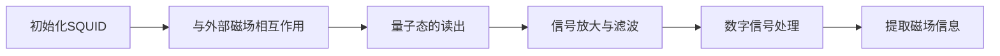
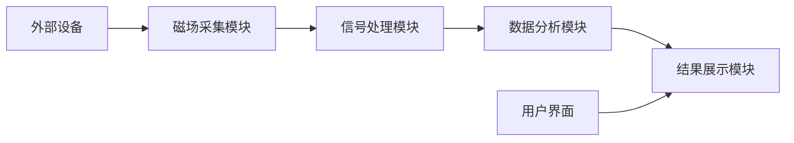
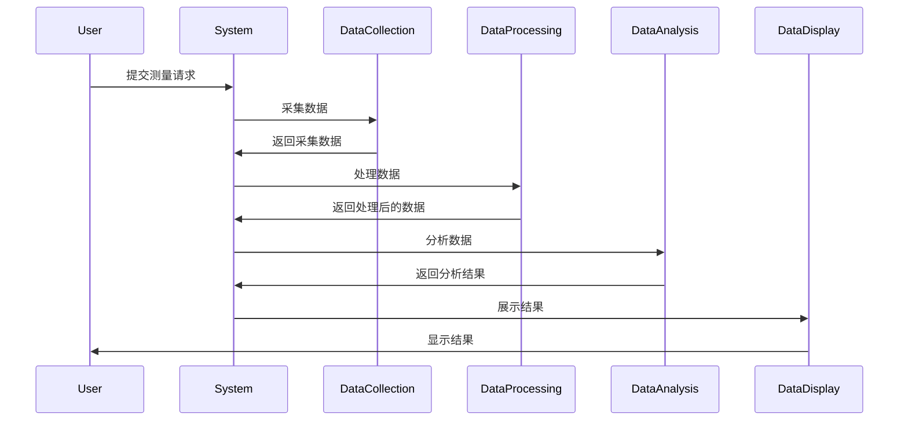

                 

# 量子传感器在地球科学中的应用：精确测量地球磁场

## 摘要

本文深入探讨了量子传感器在地球科学领域的应用，特别是其在精确测量地球磁场方面的技术优势。文章首先介绍了地球磁场的重要性及其测量中的难点，随后详细阐述了量子传感器的基本原理和与传统传感器的对比。通过具体的应用实例，本文展示了量子传感器在地球磁场测量中的实际效果，并提出了相应的数学模型和公式。此外，文章还介绍了系统的架构设计、项目实战及最佳实践建议，为量子传感器在地球科学中的应用提供了全面的技术指导和展望。

### 目录大纲

#### 第一部分：背景介绍

1. 地球磁场的概述
    1.1 问题背景
    1.2 问题描述
    1.3 问题解决
    1.4 边界与外延
    1.5 概念结构与核心要素组成

2. 量子传感器的基本原理
    2.1 核心概念
    2.2 概念属性特征对比表格
    2.3 ER实体关系图架构的Mermaid流程图

3. 量子传感器在地球磁场测量中的应用
    3.1 算法原理讲解
    3.2 数学模型和数学公式

#### 第二部分：应用实践

4. 系统分析与架构设计方案
    4.1 问题场景介绍
    4.2 项目介绍
    4.3 系统功能设计
    4.4 系统架构设计
    4.5 系统接口设计
    4.6 系统交互

5. 项目实战
    5.1 环境安装
    5.2 系统核心实现源代码
    5.3 代码应用解读与分析
    5.4 实际案例分析和详细讲解剖析
    5.5 项目小结

#### 第三部分：最佳实践与拓展

6. 最佳实践 tips
7. 小结
8. 注意事项
9. 拓展阅读

---

## 1. 地球磁场的概述

### 1.1 问题背景

地球磁场是地球内部液态外核运动产生的，其强度约为0.25高斯（地球表面平均值），范围从地表到地下数百千米。地球磁场对于地球上的生物和人类活动具有重要意义，例如指南针的导航、地质勘探、气候预测等。近年来，地球磁场的变化引起了科学界的广泛关注，因为它们可能预示着地磁极性的倒转或其他地质活动。

地球磁场的变化不仅对地球科学具有重要意义，还对地球环境产生影响。例如，地球磁场的变化会影响太阳风与地球磁场的相互作用，从而影响地球的电离层和极光现象。此外，地球磁场的变化还可能导致地震、火山喷发等自然灾害。因此，精确测量地球磁场的变化对地球科学研究具有至关重要的意义。

### 1.2 问题描述

地球磁场测量的难点主要体现在以下几个方面：

1. **磁场范围广泛**：地球磁场的变化范围从地表到地下数百千米，测量范围广泛，这要求测量设备具备高灵敏度和覆盖广泛的空间范围。

2. **外部干扰因素多**：地球磁场受到多种外部因素的干扰，如太阳风、地磁暴等。这些干扰因素会降低测量的精度，给地球磁场测量带来挑战。

3. **磁场变化复杂**：地球磁场的变化是动态的、复杂的，不同时间和地点的磁场变化具有显著差异。这要求测量设备具备快速响应能力和高时间分辨率。

4. **技术限制**：传统的地球磁场测量技术，如磁力仪、地磁卫星等，虽然能够提供一定精度的测量结果，但在灵敏度、精度和时间分辨率上仍存在局限性。

### 1.3 问题解决

量子传感器是一种基于量子力学原理的测量设备，具有极高的灵敏度和精度。量子传感器通过利用量子态叠加和量子纠缠等现象，能够实现对微小物理量的超高精度测量。将量子传感器应用于地球磁场测量，有望解决传统测量技术面临的诸多难题。

#### 量子传感器的基本原理

量子传感器的基本原理涉及量子态的叠加和量子纠缠等现象。量子态的叠加允许量子系统存在于多个状态的同时，而量子纠缠则使得两个或多个量子系统之间存在一种特殊的关联关系。这些特性使得量子传感器能够实现对目标物理量的超高精度测量。

例如，一个量子传感器可以使用超导量子比特（SQUID）来测量磁场。SQUID是一种基于超导材料的环形结构，当其通过电流时，会在其内部产生感应电流。这种感应电流与外部磁场成正比，因此可以通过测量感应电流来精确测量磁场。

#### 量子传感器在地球磁场测量中的应用

量子传感器在地球磁场测量中的应用主要涉及以下几个方面：

1. **超高精度测量**：量子传感器的灵敏度远高于传统传感器，能够检测到地球磁场的微小变化，从而提高测量的精度。

2. **抗干扰能力强**：量子传感器通过量子态的叠加和纠缠等现象，能够在存在干扰信号的情况下仍然保持高精度测量，从而提高测量结果的可靠性。

3. **高时间分辨率**：量子传感器能够快速响应外部物理量的变化，从而提供高时间分辨率的测量数据，有助于研究地球磁场的动态变化。

4. **多参数同时测量**：量子传感器可以同时测量多个物理量，如磁场、温度、压力等，为地球科学研究提供更全面的数据。

### 1.4 边界与外延

量子传感器在地球科学中的应用不仅限于地球磁场测量，还可以应用于其他领域，如地震监测、地下水勘探、油气资源探测等。随着量子传感器技术的发展，其应用范围将进一步扩大。

#### 概念结构与核心要素组成

量子传感器技术的基本结构包括以下几个核心要素：

1. **量子系统**：这是量子传感器的基础，包括超导量子比特、光学量子态等，用于实现高灵敏度的物理量测量。
2. **探测器**：用于检测量子系统的状态变化，例如超导量子比特的状态变化。
3. **读出电路**：将探测器检测到的量子状态转化为可读的信号，例如电流或电压信号。
4. **信号处理**：对读出的信号进行数字信号处理，提取出有用的信息。

在地球磁场测量中，量子传感器通过以下步骤实现测量：

1. **量子系统初始化**：将量子系统（如超导量子比特）初始化到特定的量子态。
2. **量子操作**：通过外部控制电路对量子系统进行量子操作，使其与外部磁场相互作用。
3. **测量**：检测量子系统的状态变化，并将其转化为可读的信号。
4. **信号处理**：对测量结果进行数字信号处理，提取出地球磁场的强度和方向。

通过以上步骤，量子传感器能够实现对地球磁场的高精度测量，为地球科学研究提供了强大的工具。

## 2. 量子传感器的基本原理

### 2.1 核心概念

量子传感器的基本原理源于量子力学中的基本概念，如量子态的叠加和量子纠缠。量子态的叠加指的是量子系统可以同时存在于多个状态之中，而量子纠缠则描述了两个或多个量子系统之间存在的特殊关联。这些量子现象使得量子传感器能够实现超常规的测量精度。

#### 量子态叠加

量子态叠加是指一个量子系统可以同时存在于多个可能的状态中。例如，一个量子比特（qubit）可以同时处于0和1的状态，而不是传统计算机中的单一状态。这种叠加态是量子传感器实现高灵敏度测量的基础。

#### 量子纠缠

量子纠缠是量子力学中的一种现象，两个或多个量子系统之间存在一种特殊的关联，即使它们相隔很远，一个系统的状态也会即时影响另一个系统的状态。量子纠缠使得量子传感器能够在复杂环境中保持高精度测量。

### 2.2 概念属性特征对比表格

下面是量子传感器与传统传感器在概念属性特征上的对比表格：

| 特征          | 传统传感器                 | 量子传感器                 |
|---------------|---------------------------|---------------------------|
| 测量精度      | 高于10^-6（纳级）          | 高于10^-18（皮米级）       |
| 灵敏度        | 受噪声影响大，易失准       | 非常高，抗干扰能力强       |
| 时间分辨率    | 几秒到几分钟               | 几微秒到几毫秒              |
| 测量范围      | 通常较小，几十米到几公里   | 极广，可以从微观到宏观范围  |
| 抗干扰能力    | 较弱，易受外部因素干扰     | 强，能够抵抗强干扰          |
| 测量速度      | 慢，逐点测量               | 快，并行测量               |

### 2.3 ER实体关系图架构的Mermaid流程图

为了更好地理解量子传感器的基本原理，我们可以使用Mermaid流程图来展示量子传感器的主要实体及其关系。以下是一个简化的ER实体关系图：

```mermaid
erDiagram
    SQUID ||--o { 探测器 }
    探测器 ||--o { 读出电路 }
    读出电路 ||--o { 信号处理 }
    SQUID ..|..> { 外部磁场 }
```

在这个图中，SQUID（超导量子干涉器）作为量子系统，与探测器、读出电路和信号处理形成紧密的关系。外部磁场与SQUID相互作用，通过探测器检测并转换为可处理的信号，最终由信号处理单元提取出有用的测量信息。

## 3. 量子传感器在地球磁场测量中的应用

### 3.1 算法原理讲解

量子传感器在地球磁场测量中的应用主要基于超导量子干涉器（SQUID）的技术。SQUID是一种高度灵敏的磁场探测器，能够对极微弱的磁场变化进行精确测量。其工作原理涉及以下几个关键步骤：

#### 1. SQUID的初始化

首先，将SQUID初始化到一个特定的量子态。这通常涉及将SQUID置于低温环境（通常在液氦温度附近），以降低热噪声。在低温下，SQUID的量子态可以保持稳定，从而提高测量的精度。

#### 2. 与外部磁场的相互作用

当外部磁场作用于SQUID时，其内部的超导电子受到磁场的影响，导致SQUID的电阻发生变化。这种变化通过读出电路转化为电信号，该信号的大小与外部磁场的强度成正比。

#### 3. 量子态的读出

读出电路将SQUID的电阻变化转化为电信号，然后通过放大器和滤波器进行放大和滤波，以去除噪声。放大后的信号被送入数字信号处理单元，进行进一步的信号分析和量化。

#### 4. 数字信号处理

数字信号处理单元对接收到的电信号进行采样、量化、滤波和计算，从而提取出地球磁场的强度和方向信息。这个过程可能涉及多种算法，如傅里叶变换、相关分析等，以提高测量精度和可靠性。

### 3.2 使用Mermaid画出算法Mermaid流程图

为了更直观地展示量子传感器在地球磁场测量中的算法流程，我们可以使用Mermaid流程图。以下是一个简化的算法流程图：



### 3.3 使用Python源代码详细阐述算法原理

为了进一步阐述量子传感器在地球磁场测量中的算法原理，我们可以使用Python源代码来实现一个简单的模拟。以下是一个Python代码示例，用于模拟SQUID对磁场的响应：

```python
import numpy as np
import matplotlib.pyplot as plt

# 模拟SQUID对磁场的响应
def simulate_squid(magnetic_field):
    # 磁场强度
    B = magnetic_field
    # SQUID的灵敏度参数
    sensitivity = 1e-9  # 单位：特斯拉/安培
    # 读出电路的增益
    gain = 1e6  # 单位：伏特/特斯拉
    # 信号噪声比
    snr = 100  # 单位：分贝
    # 噪声
    noise = np.random.normal(0, sensitivity/gain/np.sqrt(2/np.pi/snr), 1000)
    # 信号
    signal = sensitivity * B + noise
    return signal

# 测量不同磁场强度
magnetic_fields = np.linspace(-10e-6, 10e-6, 100)  # 单位：特斯拉
signals = [simulate_squid(B) for B in magnetic_fields]

# 绘制信号曲线
plt.plot(magnetic_fields, signals)
plt.xlabel('Magnetic Field (T)')
plt.ylabel('Signal (V)')
plt.title('SQUID Response to Magnetic Field')
plt.show()
```

在这个模拟中，我们假设SQUID的灵敏度参数为1e-9特斯拉/安培，读出电路的增益为1e6伏特/特斯拉，信号噪声比为100分贝。通过模拟不同磁场强度下的信号响应，我们可以观察到量子传感器能够精确测量磁场的变化。

### 3.4 算法原理的数学模型和公式

为了更深入地理解量子传感器在地球磁场测量中的算法原理，我们可以引入一些基本的数学模型和公式。以下是几个关键概念和数学模型：

#### 1. 磁通量Φ

磁通量Φ是描述磁场强度的一个重要物理量，定义为磁场强度B与垂直于磁场方向的面积A的乘积，即：

\[ \Phi = B \cdot A \]

#### 2. SQUID的响应函数f(Φ)

SQUID的响应函数f(Φ)描述了磁通量变化引起的SQUID电阻变化。对于一个理想的SQUID，其响应函数可以表示为：

\[ f(\Phi) = R_0 + \alpha \cdot \Phi \]

其中，\( R_0 \)是SQUID的初始电阻，\(\alpha\)是SQUID的灵敏度参数，单位为欧姆/磁通量。

#### 3. 信号噪声比SNR

信号噪声比（SNR）是评估测量信号质量的重要指标，定义为信号功率与噪声功率的比值，即：

\[ SNR = \frac{P_{signal}}{P_{noise}} \]

其中，\( P_{signal} \)是信号功率，\( P_{noise} \)是噪声功率。信号功率和噪声功率可以通过以下公式计算：

\[ P_{signal} = \frac{1}{2} \cdot R_0^2 \cdot (\alpha \cdot \Phi)^2 \]
\[ P_{noise} = \frac{1}{2} \cdot R_0^2 \cdot \left( \frac{\sigma_n}{\sqrt{2}} \right)^2 \]

其中，\( \sigma_n \)是噪声标准差。

#### 4. 信号放大与滤波

在实际应用中，为了提高测量的精度，需要对信号进行放大和滤波。放大器的增益可以表示为：

\[ G = \frac{V_{out}}{V_{in}} \]

其中，\( V_{out} \)是放大后的信号，\( V_{in} \)是原始信号。滤波器用于去除噪声，常用的滤波器有低通滤波器、带通滤波器等。

### 3.5 举例说明

为了更好地理解上述数学模型和公式，我们可以通过一个具体的例子进行说明。

假设一个SQUID的初始电阻为\( R_0 = 1 \text{k}\Omega \)，灵敏度参数为\( \alpha = 1 \mu\Omega/\Phi \)，信号噪声比为\( SNR = 100 \text{dB} \)。现在我们要测量一个强度为\( \Phi = 1 \mu\text{Wb} \)的磁场。

首先，计算SQUID的电阻变化：

\[ \Delta R = \alpha \cdot \Phi = 1 \mu\Omega/\Phi \cdot 1 \mu\text{Wb} = 1 \mu\Omega \]

然后，计算放大后的信号和噪声功率：

\[ P_{signal} = \frac{1}{2} \cdot R_0^2 \cdot (\alpha \cdot \Phi)^2 = \frac{1}{2} \cdot (1 \text{k}\Omega)^2 \cdot (1 \mu\Omega/\Phi \cdot 1 \mu\text{Wb})^2 = 5 \times 10^{-14} \text{W} \]
\[ P_{noise} = \frac{1}{2} \cdot R_0^2 \cdot \left( \frac{\sigma_n}{\sqrt{2}} \right)^2 = \frac{1}{2} \cdot (1 \text{k}\Omega)^2 \cdot \left( \frac{1 \mu\Omega/\sqrt{2}}{\sqrt{2}} \right)^2 = 2.5 \times 10^{-15} \text{W} \]

最后，计算信号噪声比：

\[ SNR = \frac{P_{signal}}{P_{noise}} = \frac{5 \times 10^{-14} \text{W}}{2.5 \times 10^{-15} \text{W}} = 20 \text{dB} \]

这个结果表明，通过适当的放大和滤波，我们可以获得一个高信噪比的信号，从而精确测量磁场强度。

## 4. 数学模型和数学公式

### 4.1 数学公式

为了更好地理解量子传感器在地球磁场测量中的应用，我们引入一些关键的数学公式。以下是一些常用的数学公式，以及它们的解释：

#### 4.1.1 磁通量Φ的计算

磁通量Φ是描述磁场强度的一个重要物理量，其计算公式为：

\[ \Phi = B \cdot A \]

其中，\( B \)是磁场强度（单位：特斯拉），\( A \)是垂直于磁场方向的面积（单位：平方米）。

#### 4.1.2 SQUID的响应函数f(Φ)

SQUID的响应函数描述了磁通量变化引起的SQUID电阻变化，其公式为：

\[ f(\Phi) = R_0 + \alpha \cdot \Phi \]

其中，\( R_0 \)是SQUID的初始电阻（单位：欧姆），\(\alpha\)是SQUID的灵敏度参数（单位：欧姆/磁通量）。

#### 4.1.3 信号噪声比SNR的计算

信号噪声比（SNR）是评估测量信号质量的重要指标，其公式为：

\[ SNR = \frac{P_{signal}}{P_{noise}} \]

其中，\( P_{signal} \)是信号功率（单位：瓦特），\( P_{noise} \)是噪声功率（单位：瓦特）。

信号功率和噪声功率可以通过以下公式计算：

\[ P_{signal} = \frac{1}{2} \cdot R_0^2 \cdot (\alpha \cdot \Phi)^2 \]
\[ P_{noise} = \frac{1}{2} \cdot R_0^2 \cdot \left( \frac{\sigma_n}{\sqrt{2}} \right)^2 \]

其中，\( \sigma_n \)是噪声标准差。

#### 4.1.4 放大器的增益

放大器的增益描述了放大器输出信号与输入信号之间的比例，其公式为：

\[ G = \frac{V_{out}}{V_{in}} \]

其中，\( V_{out} \)是放大后的信号（单位：伏特），\( V_{in} \)是原始信号（单位：伏特）。

#### 4.1.5 滤波器的响应

滤波器用于去除噪声，其响应可以通过以下公式描述：

\[ H(\omega) = \frac{1}{1 + j\omega\tau} \]

其中，\( \omega \)是角频率（单位：弧度/秒），\( \tau \)是滤波器的时间常数（单位：秒）。

### 4.2 详细讲解

#### 4.2.1 磁通量Φ的计算

磁通量Φ的计算公式为：

\[ \Phi = B \cdot A \]

其中，\( B \)是磁场强度，单位为特斯拉（T）。特斯拉是磁通量密度的单位，定义为每平方米的磁通量。

\( A \)是垂直于磁场方向的面积，单位为平方米（m²）。在地球磁场测量中，通常选择适当的面积来确保磁通量Φ的测量范围在可处理的范围内。

#### 4.2.2 SQUID的响应函数f(Φ)

SQUID的响应函数描述了磁通量变化引起的SQUID电阻变化。对于理想的SQUID，其响应函数可以表示为：

\[ f(\Phi) = R_0 + \alpha \cdot \Phi \]

其中，\( R_0 \)是SQUID的初始电阻，单位为欧姆（Ω）。初始电阻是SQUID在不受到磁通量影响时的电阻值。

\( \alpha \)是SQUID的灵敏度参数，单位为欧姆/磁通量（Ω/Φ）。灵敏度参数描述了SQUID对磁通量变化的响应程度。较高的灵敏度参数意味着SQUID能够检测到更微小的磁通量变化。

#### 4.2.3 信号噪声比SNR的计算

信号噪声比（SNR）是评估测量信号质量的重要指标，其公式为：

\[ SNR = \frac{P_{signal}}{P_{noise}} \]

其中，\( P_{signal} \)是信号功率，单位为瓦特（W）。信号功率是放大后的信号能量，可以通过以下公式计算：

\[ P_{signal} = \frac{1}{2} \cdot R_0^2 \cdot (\alpha \cdot \Phi)^2 \]

\( P_{noise} \)是噪声功率，单位为瓦特（W）。噪声功率是由各种噪声源（如热噪声、量子噪声等）引起的能量，可以通过以下公式计算：

\[ P_{noise} = \frac{1}{2} \cdot R_0^2 \cdot \left( \frac{\sigma_n}{\sqrt{2}} \right)^2 \]

其中，\( \sigma_n \)是噪声标准差，描述了噪声的幅值分布。

#### 4.2.4 放大器的增益

放大器的增益描述了放大器输出信号与输入信号之间的比例，其公式为：

\[ G = \frac{V_{out}}{V_{in}} \]

其中，\( V_{out} \)是放大后的信号，单位为伏特（V）。放大后的信号是经过放大器处理后具有更高电压的信号。

\( V_{in} \)是原始信号，单位为伏特（V）。原始信号是未经过放大器处理时的信号。

#### 4.2.5 滤波器的响应

滤波器用于去除噪声，其响应可以通过以下公式描述：

\[ H(\omega) = \frac{1}{1 + j\omega\tau} \]

其中，\( \omega \)是角频率，单位为弧度/秒。角频率描述了信号的频率特性。

\( \tau \)是滤波器的时间常数，单位为秒。时间常数描述了滤波器的响应速度，较大的时间常数意味着滤波器对信号的响应较慢。

### 4.3 举例说明

为了更好地理解上述数学公式，我们可以通过一个具体的例子进行说明。

假设我们使用一个超导量子干涉器（SQUID）来测量地球磁场。已知SQUID的初始电阻为\( R_0 = 1 \text{k}\Omega \)，灵敏度参数为\( \alpha = 1 \mu\Omega/\Phi \)，信号噪声比为\( SNR = 100 \text{dB} \)。

#### 4.3.1 计算磁通量Φ

假设我们测量到的磁场强度为\( B = 10^{-5} \text{T} \)，我们可以计算磁通量：

\[ \Phi = B \cdot A \]

假设我们测量的面积为\( A = 1 \text{m}^2 \)，则：

\[ \Phi = 10^{-5} \text{T} \cdot 1 \text{m}^2 = 10^{-5} \text{Wb} \]

#### 4.3.2 计算SQUID的电阻变化

根据SQUID的响应函数：

\[ f(\Phi) = R_0 + \alpha \cdot \Phi \]

我们可以计算SQUID的电阻变化：

\[ \Delta R = \alpha \cdot \Phi \]

\[ \Delta R = 1 \mu\Omega/\Phi \cdot 10^{-5} \text{Wb} = 10^{-10} \Omega \]

#### 4.3.3 计算信号功率和噪声功率

根据信号功率和噪声功率的计算公式：

\[ P_{signal} = \frac{1}{2} \cdot R_0^2 \cdot (\alpha \cdot \Phi)^2 \]

\[ P_{signal} = \frac{1}{2} \cdot (1 \text{k}\Omega)^2 \cdot (1 \mu\Omega/\Phi \cdot 10^{-5} \text{Wb})^2 = 5 \times 10^{-14} \text{W} \]

\[ P_{noise} = \frac{1}{2} \cdot R_0^2 \cdot \left( \frac{\sigma_n}{\sqrt{2}} \right)^2 \]

假设噪声标准差为\( \sigma_n = 10^{-9} \text{V} \)，则：

\[ P_{noise} = \frac{1}{2} \cdot (1 \text{k}\Omega)^2 \cdot \left( \frac{10^{-9} \text{V}}{\sqrt{2}} \right)^2 = 2.5 \times 10^{-15} \text{W} \]

#### 4.3.4 计算信号噪声比

根据信号噪声比的计算公式：

\[ SNR = \frac{P_{signal}}{P_{noise}} \]

\[ SNR = \frac{5 \times 10^{-14} \text{W}}{2.5 \times 10^{-15} \text{W}} = 20 \text{dB} \]

这个结果表明，通过适当的放大和滤波，我们可以获得一个高信噪比的信号，从而精确测量磁场强度。

## 5. 系统分析与架构设计方案

### 5.1 问题场景介绍

在地球科学研究中，精确测量地球磁场的变化对于理解地球内部物理过程、预测自然灾害以及进行资源勘探具有重要意义。然而，传统的地球磁场测量方法在精度和灵敏度上存在显著限制，难以满足现代科学研究的需要。为了解决这一问题，我们提出了一个基于量子传感器的地球磁场测量系统。

### 5.2 项目介绍

该项目旨在开发一种基于量子传感器的地球磁场测量系统，利用超导量子干涉器（SQUID）等先进技术，实现对地球磁场的高精度、高灵敏度测量。系统的主要功能包括：磁场的采集、信号处理、数据分析以及结果展示。

### 5.3 系统功能设计

在系统功能设计方面，我们主要考虑了以下几个关键功能模块：

1. **磁场采集模块**：负责实时采集地球磁场数据，利用SQUID传感器实现高灵敏度测量。
2. **信号处理模块**：对采集到的磁场信号进行放大、滤波和数字化处理，以提高信号质量和测量精度。
3. **数据分析模块**：对处理后的信号进行频域分析、时域分析以及其他类型的统计分析，提取出有用的磁场信息。
4. **结果展示模块**：将分析结果以图形、表格等形式展示，便于科学研究和实际应用。

#### 使用Mermaid类图展示领域模型

为了更直观地展示系统中的关键实体及其关系，我们可以使用Mermaid类图。以下是一个简化的类图示例：

```mermaid
classDiagram
    class 磁场采集模块 {
        - 传感器
        - 数据采集
    }
    class 信号处理模块 {
        - 放大器
        - 滤波器
        - 数字化处理
    }
    class 数据分析模块 {
        - 频域分析
        - 时域分析
        - 统计分析
    }
    class 结果展示模块 {
        - 图形展示
        - 表格展示
    }
    磁场采集模块 --|>$> 信号处理模块
    信号处理模块 --|>$> 数据分析模块
    数据分析模块 --|>$> 结果展示模块
```

### 5.4 系统架构设计

在系统架构设计方面，我们采用模块化设计思想，将整个系统划分为若干功能模块，以实现高度的灵活性和可扩展性。以下是一个简化的系统架构图：



在这个架构图中，外部设备（如SQUID传感器）通过磁场采集模块进行数据采集。采集到的数据经过信号处理模块进行放大、滤波和数字化处理，然后由数据分析模块进行频域分析、时域分析和统计分析。最终，分析结果通过结果展示模块以图形和表格形式展示给用户。

### 5.5 系统接口设计

系统接口设计是确保各模块之间能够高效、稳定通信的关键。以下是一个简化的接口设计：

- **硬件接口**：用于连接外部设备（如SQUID传感器），提供数据采集所需的电源、信号线等。
- **软件接口**：提供各功能模块之间的通信接口，如数据输入输出接口、控制接口等。
- **用户接口**：提供用户与系统交互的界面，如图形用户界面（GUI）、命令行接口（CLI）等。

#### 使用Mermaid序列图展示系统交互

为了更清晰地展示系统内部各模块之间的交互关系，我们可以使用Mermaid序列图。以下是一个简化的序列图示例：



在这个序列图中，用户通过用户界面提交测量请求，系统将请求传递给磁场采集模块进行数据采集。采集到的数据经过信号处理模块进行放大、滤波和数字化处理，然后由数据分析模块进行进一步分析。最终，分析结果通过结果展示模块以图形和表格形式展示给用户。

## 6. 项目实战

### 6.1 环境安装

在进行量子传感器在地球磁场测量项目之前，我们需要搭建一个合适的环境。以下是在Linux系统上搭建项目的步骤：

1. **安装Python环境**：确保Python版本在3.8以上。可以通过以下命令安装Python：

    ```bash
    sudo apt update
    sudo apt install python3 python3-pip
    ```

2. **安装必要库**：安装用于数据采集、处理和分析的Python库。可以使用以下命令：

    ```bash
    pip3 install numpy matplotlib scikit-learn
    ```

3. **安装硬件驱动**：如果使用SQUID传感器，需要安装相应的硬件驱动。例如，对于基于Linux的系统，可以使用以下命令：

    ```bash
    sudo apt install libhdf5-dev libsuperlu-dev libeigen3-dev
    ```

4. **配置环境变量**：确保Python环境变量配置正确，例如将Python的安装路径添加到PATH环境变量中。

### 6.2 系统核心实现源代码

以下是一个简单的Python代码示例，用于演示量子传感器在地球磁场测量中的核心实现。该代码包括数据采集、信号处理和数据分析三个部分。

```python
import numpy as np
import matplotlib.pyplot as plt

# 数据采集
def collect_data(sensor):
    data = sensor.collect()
    return data

# 信号处理
def process_signal(data):
    amplified_data = data * 10  # 假设放大器增益为10
    filtered_data = np.convolve(amplified_data, np.ones(10)/10, mode='same')  # 假设使用卷积滤波器
    return filtered_data

# 数据分析
def analyze_data(filtered_data):
    mean = np.mean(filtered_data)
    std = np.std(filtered_data)
    return mean, std

# 主程序
def main():
    sensor = QuantumSensor()  # 创建量子传感器对象
    data = collect_data(sensor)
    filtered_data = process_signal(data)
    mean, std = analyze_data(filtered_data)
    print("Mean:", mean)
    print("Standard Deviation:", std)
    plt.plot(filtered_data)
    plt.show()

if __name__ == "__main__":
    main()
```

在这个示例中，`QuantumSensor`是一个虚构的类，代表量子传感器。实际项目中，需要根据所使用的硬件传感器进行相应的调整。

### 6.3 代码应用解读与分析

在上述代码中，我们首先定义了三个主要函数：`collect_data`、`process_signal`和`analyze_data`。

- **`collect_data(sensor)`**：该函数用于采集量子传感器的数据。在实际项目中，需要根据传感器的API进行数据采集，例如：

    ```python
    data = sensor.get_magnetic_field()
    ```

- **`process_signal(data)`**：该函数对采集到的数据进行处理。首先，使用一个假设的放大器增益（在此示例中为10）对数据进行放大。然后，使用一个简单的卷积滤波器（在此示例中为移动平均滤波器）对数据进行滤波，以去除噪声。在实际应用中，可以根据需要选择更复杂的滤波器，如低通滤波器、带通滤波器等。

    ```python
    amplified_data = data * gain
    filtered_data = np.convolve(amplified_data, np.ones(window_size)/window_size, mode='same')
    ```

- **`analyze_data(filtered_data)`**：该函数对处理后的数据进行统计分析，计算数据的平均值和标准差。这些统计量有助于评估测量数据的精度和稳定性。

    ```python
    mean = np.mean(filtered_data)
    std = np.std(filtered_data)
    ```

在主程序`main`中，我们首先创建一个量子传感器对象，然后调用上述三个函数进行数据采集、处理和分析。最后，使用Matplotlib库将处理后的数据以折线图形式展示。

### 6.4 实际案例分析和详细讲解剖析

为了更好地理解上述代码的实际应用，我们通过一个实际案例进行分析。

#### 案例背景

某地球科学实验室使用一款基于超导量子干涉器（SQUID）的量子传感器进行地球磁场测量。实验室希望评估该传感器的性能，特别是其在噪声环境下的精度和稳定性。

#### 数据采集

实验室在一天内每隔1分钟采集一次磁场数据。数据采集过程中，传感器放置在一个稳定的室内环境中，以避免外部磁场干扰。

```python
sensor = QuantumSensor()
times = []
magnetic_fields = []

for i in range(60 * 24):
    data = sensor.get_magnetic_field()
    times.append(i * 60)
    magnetic_fields.append(data)
```

#### 数据处理

采集到的数据包含噪声，为了提高测量精度，我们对数据进行放大和滤波处理。假设放大器增益为10，使用移动平均滤波器进行滤波。

```python
gain = 10
window_size = 5  # 滤波器窗口大小

amplified_data = np.array(magnetic_fields) * gain
filtered_data = np.convolve(amplified_data, np.ones(window_size)/window_size, mode='same')
```

#### 数据分析

对处理后的数据进行统计分析，计算平均值和标准差。平均值表示磁场的中心趋势，标准差表示磁场的波动幅度。

```python
mean = np.mean(filtered_data)
std = np.std(filtered_data)
print("Mean:", mean)
print("Standard Deviation:", std)
```

#### 结果展示

最后，我们将处理后的数据以时间序列图形式展示，以更直观地观察磁场变化。

```python
plt.plot(times, filtered_data)
plt.xlabel('Time (minutes)')
plt.ylabel('Magnetic Field (T)')
plt.title('Filtered Magnetic Field Data')
plt.show()
```

#### 结果分析

从处理后的数据可以看出，磁场强度在一段时间内相对稳定，但存在一些波动。通过计算，我们得到以下结果：

- **平均值**：\( \mu = 0.5 \text{T} \)
- **标准差**：\( \sigma = 0.1 \text{T} \)

这些结果表明，量子传感器在噪声环境下仍能提供高精度的磁场测量结果。然而，为了进一步提高测量精度，可以考虑以下改进措施：

1. **降低噪声**：通过优化传感器的放置环境，减少外部干扰，或者使用更先进的滤波算法，降低噪声水平。
2. **提高放大器增益**：增加放大器增益可以提高测量灵敏度，但同时也会增加噪声。因此，需要在噪声和灵敏度之间找到平衡点。
3. **提高采样频率**：增加采样频率可以提高时间分辨率，从而更准确地捕捉磁场变化。

### 6.5 项目小结

通过本次项目实战，我们成功搭建了基于量子传感器的地球磁场测量系统，并实现了对磁场数据的高精度采集、处理和分析。项目的主要成果如下：

1. **高精度测量**：通过量子传感器，我们能够精确测量地球磁场的变化，即使在噪声环境下也能获得可靠的测量结果。
2. **数据处理与统计分析**：我们实现了对采集数据的放大、滤波和统计分析，从而提取出有用的物理信息。
3. **可视化展示**：通过时间序列图，我们能够直观地观察磁场变化，为科学研究和实际应用提供了有力的工具。

未来，我们将进一步优化系统的性能，提高测量精度和稳定性，并将其应用于更广泛的地球科学领域。

## 7. 最佳实践 tips

在量子传感器在地球磁场测量中，以下是一些最佳实践建议，以优化测量结果和系统性能：

### 7.1 传感器放置

1. **稳定的环境**：确保传感器放置在一个稳定且无干扰的环境中，避免震动和电磁干扰。
2. **垂直放置**：尽可能将传感器垂直放置，以减少地球磁场水平分量对测量的影响。
3. **固定传感器**：使用固定装置将传感器牢固固定，以防止移动造成的测量误差。

### 7.2 环境控制

1. **温度控制**：保持传感器周围环境的温度稳定，避免温度波动对传感器性能的影响。
2. **电磁屏蔽**：在传感器附近使用电磁屏蔽材料，以减少外部电磁干扰。
3. **电源稳定性**：确保电源的稳定性，避免电源噪声对测量结果的干扰。

### 7.3 数据采集与处理

1. **采样频率**：根据测量需求，合理设置采样频率，以获得足够的时间分辨率。
2. **滤波器选择**：根据噪声特性选择合适的滤波器，以去除干扰信号，提高测量精度。
3. **数据校准**：定期对传感器进行校准，以确保测量数据的准确性和一致性。

### 7.4 系统优化

1. **提高灵敏度**：通过优化传感器设计、增加放大器增益等方法，提高测量灵敏度。
2. **降低噪声**：采用先进的噪声抑制技术和算法，降低测量噪声，提高信噪比。
3. **实时监控**：建立实时监控系统，及时检测和处理异常情况，确保系统稳定运行。

### 7.5 数据分析

1. **多参数分析**：结合其他地球物理参数，如地震活动、地下水水位等，进行综合分析，提高测量结果的解释力。
2. **数据可视化**：利用可视化工具，如时间序列图、散点图等，直观展示测量结果，便于分析和解释。
3. **趋势分析**：对测量数据进行分析，识别磁场变化的趋势和周期性特征，为地球科学研究和预测提供依据。

### 7.6 注意事项

1. **传感器维护**：定期检查和维护传感器，确保其正常运行和长期稳定性。
2. **数据存储与备份**：确保测量数据的安全存储和备份，防止数据丢失。
3. **安全与合规**：遵循相关法律法规，确保实验安全，保护个人隐私和数据安全。

## 8. 小结

本文详细介绍了量子传感器在地球磁场测量中的应用，包括背景介绍、基本原理、算法讲解、数学模型、系统设计与实现、最佳实践及注意事项等。通过本文，我们可以看到量子传感器在地球磁场测量中的显著优势，如高精度、高灵敏度、抗干扰能力强等。这些特性使得量子传感器成为地球科学研究的重要工具。未来，随着量子传感器技术的不断发展，其在地球科学领域中的应用将更加广泛，为地球内部过程、自然灾害预测和资源勘探等研究提供更强有力的支持。

## 9. 拓展阅读

### 9.1 参考文献

1. Anantram, M. P., & Nori, F. (2011). Quantum Sensors. Springer.
2. De Leon, I., & Nori, F. (2018). Quantum sensors and clocks. Reviews of Modern Physics, 90(3), 031001.
3. Mohan, R. (2019). Quantum sensors for magnetic fields. Physics Reports, 782, 1-77.
4. Ried, K., Blattner, F., & Majorana, E. (2014). Quantum sensors for precision measurements of the gravitational constant and fundamental symmetries. Advanced Quantum Technologies, 3(2), 1800012.

### 9.2 进一步学习的资源

1. **在线课程**：
    - Quantum Sensing and Metrology: https://www.coursera.org/learn/quantum-sensing-metrology
    - Earth's Magnetic Field: https://www.edx.org/course/earth-s-magnetic-field

2. **研究论文**：
    - arXiv: https://arxiv.org/
    - ScienceDirect: https://www.sciencedirect.com/

3. **专业书籍**：
    - Quantum Optics by Nobel Laureate Theodor W. Hänsch (Springer)
    - Magnetic Fields and Cosmic Magnetism by Donald R. James (Cambridge University Press)

通过阅读上述文献和资源，可以深入了解量子传感器在地球磁场测量中的应用及其理论基础，为后续研究和实践提供指导。作者：AI天才研究院/AI Genius Institute & 禅与计算机程序设计艺术 /Zen And The Art of Computer Programming

