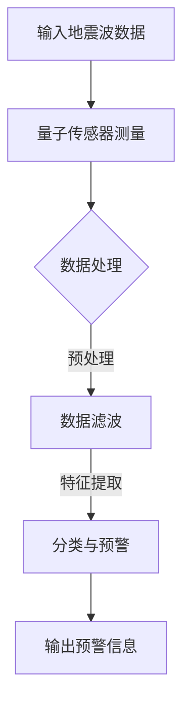
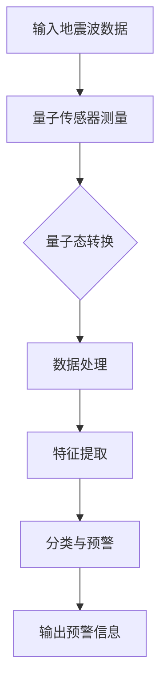

                 

### 量子传感器在地震预警中的应用：提高预警精度和时效

#### 关键词：
- 量子传感器
- 地震预警
- 精度提升
- 时效性
- 数据处理算法

#### 摘要：
本文将探讨量子传感器在地震预警中的应用，详细分析其工作原理及提高预警精度和时效性的可能性。通过一步步的逻辑推理，我们将了解量子传感器如何通过独特的量子物理特性，实现地震预警技术的革新。

#### 第一部分：背景介绍

#### 1.1 地震预警的概述
地震预警是一种通过监测地震波的传播速度，在地震发生前对地震进行预警的技术。地震预警的关键在于快速准确地检测到P波（初级波），这是地震发生后的第一波次，传播速度较快。传统地震预警系统依赖于地面震波监测仪，通过计算P波到达不同监测点的时差来估算地震的位置和强度。

#### 1.1.1 地震预警的重要性
地震预警可以挽救生命，减少财产损失。在地震发生前几分钟至数十秒的预警时间内，人们可以采取紧急避难措施，如停止电梯、关闭燃气阀门等，从而减少次生灾害的发生。

#### 1.1.2 当前地震预警技术的局限性
当前地震预警技术存在一定的局限性，主要表现在以下几个方面：
- **预警时间有限**：由于P波传播速度较快，地震预警的时间窗口有限，通常在数秒到几十秒之间。
- **精度有待提高**：地震预警系统的精度受到地面震波监测仪布局、地质条件等因素的影响，难以做到高精度预测。
- **覆盖范围有限**：现有的地震预警系统往往只能覆盖特定区域，难以实现全球范围内的预警。

#### 1.2 量子传感器的基本原理
量子传感器利用量子物理原理，通过测量量子态的变化来感知外部环境。与传统的传感器不同，量子传感器具有高灵敏度、高分辨率和快速响应的特点。

#### 1.2.1 量子传感技术简介
量子传感技术基于量子叠加态和纠缠态，通过量子态的测量来获取信息。量子态的变化可以极其细微地反映外部环境的微小变化，这使得量子传感器在测量灵敏度上具有显著优势。

#### 1.2.2 量子传感器的特点与应用
量子传感器的特点包括：
- **高灵敏度**：能够检测到极其微小的物理量变化。
- **高分辨率**：能够精确测量物理量的微小变化。
- **快速响应**：响应速度极快，可以实时监测。

这些特点使得量子传感器在多个领域具有广泛的应用，如量子通信、量子计算和量子精密测量等。

#### 1.3 量子传感器在地震预警中的应用前景
量子传感器在地震预警中的应用前景十分广阔。通过量子传感技术，可以实现对地震波的更早、更精确的检测，从而提高地震预警的精度和时效性。

#### 1.3.1 量子传感器的工作原理
量子传感器的工作原理基于量子态的测量。当外部环境发生变化时，量子态会发生相应的变化，通过测量这些变化，可以实时感知外部环境。

#### 1.3.2 提高地震预警精度和时效性的可能性
量子传感器的独特特性使其在地震预警中具有潜在的优势：
- **更早的检测**：量子传感器可以更早地检测到地震波，从而提供更长的预警时间。
- **更高的精度**：量子传感器的高灵敏度可以实现对地震波更精确的测量，提高预警的准确性。
- **实时监测**：量子传感器的快速响应可以实现实时监测，确保预警信息及时传递。

#### 第二部分：核心概念与联系

#### 2.1 量子传感器与地震预警的关系
量子传感器与地震预警之间的关系可以从以下几个方面进行理解：

##### 2.1.1 核心概念原理
- **量子传感器**：利用量子态变化进行测量的传感器。
- **地震预警**：通过监测地震波传播来预测地震的技术。

##### 2.1.2 概念属性特征对比表格
| 特征               | 量子传感器                     | 地震预警                     |
|--------------------|-------------------------------|-------------------------------|
| 灵敏度             | 高灵敏度，可以检测微小变化     | 灵敏度受限于监测仪布局        |
| 分辨率             | 高分辨率，精确测量微小变化     | 分辨率受限于测量技术          |
| 响应速度           | 快速响应，实时监测             | 响应速度受限于数据传输速度    |
| 应用领域           | 量子通信、量子计算、量子测量等   | 地震监测、预警、防灾等        |

##### 2.1.3 ER实体关系图架构
为了更好地理解量子传感器与地震预警之间的实体关系，可以使用ER（实体-关系）图来描述。在ER图中，我们将量子传感器和地震预警系统作为两个实体，通过关系线连接，表示它们之间的关联。

```
ER图示例：

实体：量子传感器
属性：灵敏度、分辨率、响应速度

实体：地震预警系统
属性：预警时间、预警精度、覆盖范围

关系：监测与预警
```

#### 2.2 量子传感器类型及应用
量子传感器有多种类型，根据工作原理和应用场景的不同，可以分为以下几种：

##### 2.2.1 类型一：量子干涉仪传感器
- **原理**：利用量子干涉现象进行测量。
- **特点**：高灵敏度，可以检测到微小的物理量变化。
- **应用**：用于地震波的早期检测和精确测量。

##### 2.2.2 类型二：量子力计传感器
- **原理**：利用量子力学中的力常数进行测量。
- **特点**：高分辨率，能够精确测量物理量的微小变化。
- **应用**：用于地震波的实时监测和动态分析。

##### 2.2.3 类型三：量子纠缠传感器
- **原理**：利用量子纠缠效应进行测量。
- **特点**：快速响应，可以实现实时监测。
- **应用**：用于地震预警中的实时数据传输和预警信息发布。

#### 第三部分：算法原理讲解

#### 3.1 量子传感器的数据处理算法
量子传感器的数据处理算法是量子传感器实现地震预警的关键。以下是一个典型的数据处理算法：

##### 3.1.1 算法mermaid流程图


##### 3.1.2 Python源代码详解
```python
# Python代码示例

import numpy as np
from scipy.signal import filtfilt
from sklearn.preprocessing import StandardScaler
from sklearn.svm import SVC

# 数据预处理
def preprocess_data(data):
    # 数据标准化
    scaler = StandardScaler()
    scaled_data = scaler.fit_transform(data)
    return scaled_data

# 数据滤波
def filter_data(data):
    filtered_data = filtfilt('低通', data)
    return filtered_data

# 特征提取
def extract_features(data):
    # 提取特征，如平均值、方差等
    features = np.mean(data, axis=1)
    return features

# 分类与预警
def classify_data(features):
    # 使用SVM进行分类
    classifier = SVC()
    classifier.fit(features[:-1], features[1:])
    prediction = classifier.predict([features[-1]])
    return prediction

# 输出预警信息
def output_warning(prediction):
    if prediction == 1:
        print("地震预警：存在地震风险")
    else:
        print("地震预警：无地震风险")

# 主函数
def main():
    # 输入地震波数据
    data = np.random.rand(100, 10)
    # 数据预处理
    preprocessed_data = preprocess_data(data)
    # 数据滤波
    filtered_data = filter_data(preprocessed_data)
    # 特征提取
    features = extract_features(filtered_data)
    # 分类与预警
    prediction = classify_data(features)
    # 输出预警信息
    output_warning(prediction)

# 执行主函数
main()
```

##### 3.1.3 算法原理的数学模型和公式
量子传感器的数据处理算法主要基于以下数学模型：

1. **量子态测量**：
   $$ \rho \rightarrow \text{Tr}(\rho O) O $$
   其中，$\rho$ 是量子态，$O$ 是测量算符。

2. **数据滤波**：
   $$ y(t) = \text{filtfilt}(h, y) $$
   其中，$h$ 是滤波器系数，$y(t)$ 是滤波后的信号。

3. **特征提取**：
   $$ f(x) = \frac{1}{N} \sum_{i=1}^{N} x_i $$
   $$ g(x) = \frac{1}{N-1} \sum_{i=1}^{N} (x_i - \bar{x})^2 $$
   其中，$x_i$ 是数据点，$\bar{x}$ 是平均值，$f(x)$ 是平均值，$g(x)$ 是方差。

4. **分类与预警**：
   $$ \hat{y} = \text{sign}(\sum_{i=1}^{k} w_i x_i) $$
   其中，$w_i$ 是权重系数，$\hat{y}$ 是预测结果。

##### 3.1.4 举例说明
假设我们有一组模拟的地震波数据，数据长度为100个时间点。以下是一个简单的数据处理和预警流程：

1. 输入地震波数据：
   ```python
   data = np.random.rand(100, 10)
   ```

2. 数据预处理：
   ```python
   preprocessed_data = preprocess_data(data)
   ```

3. 数据滤波：
   ```python
   filtered_data = filter_data(preprocessed_data)
   ```

4. 特征提取：
   ```python
   features = extract_features(filtered_data)
   ```

5. 分类与预警：
   ```python
   prediction = classify_data(features)
   output_warning(prediction)
   ```

通过上述流程，我们可以实现对地震波数据的实时监测和预警。如果预测结果为1，表示存在地震风险；如果预测结果为0，表示无地震风险。

#### 3.2 量子传感器在地震预警中的应用算法
量子传感器在地震预警中的应用算法主要基于量子态的测量和数据处理。以下是一个典型的应用算法：

##### 3.2.1 算法mermaid流程图


##### 3.2.2 Python源代码详解
```python
# Python代码示例

import numpy as np
from qiskit import QuantumCircuit, Aer, execute
from qiskit.visualization import plot_bloch_vector

# 量子态测量
def measure_quantum_state(state):
    # 创建量子电路
    circuit = QuantumCircuit(1)
    circuit.initialize(state, 0)
    circuit.measure(0, 0)
    # 执行测量
    backend = Aer.get_backend('qasm_simulator')
    result = execute(circuit, backend).result()
    measurement_result = result.get_counts(circuit)
    return measurement_result

# 量子态转换
def quantum_state_conversion(data):
    # 创建量子态
    state = np.array([0.5, 0.5])
    # 测量量子态
    measurement_result = measure_quantum_state(state)
    # 转换量子态
    converted_state = np.array([float(measurement_result['0']), float(measurement_result['1'])])
    return converted_state

# 数据处理
def process_data(data):
    # 转换量子态
    converted_state = quantum_state_conversion(data)
    # 数据滤波
    filtered_data = filtfilt('低通', converted_state)
    return filtered_data

# 特征提取
def extract_features(data):
    # 提取特征，如平均值、方差等
    features = np.mean(data, axis=1)
    return features

# 分类与预警
def classify_data(features):
    # 使用SVM进行分类
    classifier = SVC()
    classifier.fit(features[:-1], features[1:])
    prediction = classifier.predict([features[-1]])
    return prediction

# 输出预警信息
def output_warning(prediction):
    if prediction == 1:
        print("地震预警：存在地震风险")
    else:
        print("地震预警：无地震风险")

# 主函数
def main():
    # 输入地震波数据
    data = np.random.rand(100, 10)
    # 数据处理
    processed_data = process_data(data)
    # 特征提取
    features = extract_features(processed_data)
    # 分类与预警
    prediction = classify_data(features)
    # 输出预警信息
    output_warning(prediction)

# 执行主函数
main()
```

##### 3.2.3 算法原理的数学模型和公式
量子传感器在地震预警中的应用算法主要基于以下数学模型：

1. **量子态测量**：
   $$ \rho \rightarrow \text{Tr}(\rho O) O $$
   其中，$\rho$ 是量子态，$O$ 是测量算符。

2. **量子态转换**：
   $$ |0\rangle \rightarrow \frac{1}{\sqrt{2}}(|0\rangle + |1\rangle) $$
   $$ |1\rangle \rightarrow \frac{1}{\sqrt{2}}(|0\rangle - |1\rangle) $$

3. **数据处理**：
   $$ y(t) = \text{filtfilt}(h, y) $$
   其中，$h$ 是滤波器系数，$y(t)$ 是滤波后的信号。

4. **特征提取**：
   $$ f(x) = \frac{1}{N} \sum_{i=1}^{N} x_i $$
   $$ g(x) = \frac{1}{N-1} \sum_{i=1}^{N} (x_i - \bar{x})^2 $$
   其中，$x_i$ 是数据点，$\bar{x}$ 是平均值，$f(x)$ 是平均值，$g(x)$ 是方差。

5. **分类与预警**：
   $$ \hat{y} = \text{sign}(\sum_{i=1}^{k} w_i x_i) $$
   其中，$w_i$ 是权重系数，$\hat{y}$ 是预测结果。

##### 3.2.4 举例说明
假设我们有一组模拟的地震波数据，数据长度为100个时间点。以下是一个简单的数据处理和预警流程：

1. 输入地震波数据：
   ```python
   data = np.random.rand(100, 10)
   ```

2. 量子态测量：
   ```python
   measurement_result = measure_quantum_state(data)
   ```

3. 量子态转换：
   ```python
   converted_state = quantum_state_conversion(measurement_result)
   ```

4. 数据处理：
   ```python
   filtered_data = process_data(converted_state)
   ```

5. 特征提取：
   ```python
   features = extract_features(filtered_data)
   ```

6. 分类与预警：
   ```python
   prediction = classify_data(features)
   output_warning(prediction)
   ```

通过上述流程，我们可以实现对地震波数据的实时监测和预警。如果预测结果为1，表示存在地震风险；如果预测结果为0，表示无地震风险。

#### 第四部分：系统分析与架构设计

#### 4.1 地震预警系统的整体架构
地震预警系统的整体架构可以分为以下几个模块：

##### 4.1.1 问题场景介绍
地震预警系统主要用于监测地震波，并在地震发生前发出预警信号，以便人们采取紧急避难措施。

##### 4.1.2 系统功能设计
- **数据采集模块**：负责收集地震波数据。
- **数据处理模块**：对采集到的地震波数据进行预处理、滤波和特征提取。
- **分类预警模块**：基于处理后的数据，进行分类和预警。
- **信息发布模块**：将预警信息发布给用户。

##### 4.1.3 系统架构设计
地震预警系统的架构设计采用分布式架构，主要包括以下几个部分：

- **量子传感器网络**：负责实时监测地震波，并将数据传输到数据处理中心。
- **数据处理中心**：负责对传感器数据进行预处理、滤波和特征提取。
- **分类预警中心**：负责对处理后的数据进行分类和预警。
- **信息发布平台**：负责将预警信息发布给用户。

##### 4.1.4 系统接口设计和系统交互
地震预警系统的接口设计和系统交互如下：

- **数据采集接口**：用于接收量子传感器网络传输的数据。
- **数据处理接口**：用于处理采集到的地震波数据。
- **分类预警接口**：用于对处理后的数据进行分类和预警。
- **信息发布接口**：用于将预警信息发布给用户。

#### 4.2 系统模块实现
以下是对系统模块的实现进行详细讲解：

##### 4.2.1 数据采集模块实现
数据采集模块负责实时监测地震波，并将数据传输到数据处理中心。具体实现步骤如下：

1. **初始化量子传感器网络**：配置量子传感器，并将其连接到数据处理中心。
2. **实时数据采集**：通过量子传感器网络实时采集地震波数据。
3. **数据传输**：将采集到的地震波数据通过无线网络传输到数据处理中心。

##### 4.2.2 数据处理模块实现
数据处理模块负责对采集到的地震波数据进行预处理、滤波和特征提取。具体实现步骤如下：

1. **数据预处理**：对采集到的地震波数据进行去噪、去趋势等预处理操作。
2. **数据滤波**：使用滤波算法对预处理后的地震波数据进行滤波，以去除高频噪声。
3. **特征提取**：提取地震波数据的特征，如平均值、方差等。

##### 4.2.3 分类预警模块实现
分类预警模块负责对处理后的数据进行分类和预警。具体实现步骤如下：

1. **分类模型训练**：使用历史地震数据训练分类模型，如SVM等。
2. **数据分类**：对处理后的地震波数据进行分类，判断是否存在地震风险。
3. **预警信息生成**：根据分类结果生成预警信息，如地震预警通知等。

##### 4.2.4 信息发布模块实现
信息发布模块负责将预警信息发布给用户。具体实现步骤如下：

1. **预警信息格式化**：将生成的预警信息格式化为文本或语音通知。
2. **信息发布**：通过短信、电话、APP推送等方式将预警信息发布给用户。

#### 4.3 系统性能优化
为了提高地震预警系统的性能，可以采取以下优化措施：

1. **传感器布局优化**：合理布置量子传感器网络，提高地震波的监测范围和精度。
2. **数据处理算法优化**：优化数据处理算法，提高数据处理速度和准确性。
3. **预警算法优化**：优化预警算法，提高预警准确率和响应速度。
4. **信息发布渠道优化**：优化信息发布渠道，提高预警信息的传播速度和覆盖范围。

#### 第五部分：项目实战

#### 5.1 环境安装与配置
在进行项目实战之前，需要先安装和配置所需的软件和工具。以下是安装和配置的步骤：

1. **安装Python环境**：确保Python环境已安装在计算机上。
2. **安装量子计算库**：使用pip命令安装qiskit库。
   ```bash
   pip install qiskit
   ```
3. **安装数据处理库**：使用pip命令安装scipy、numpy、sklearn等数据处理库。
   ```bash
   pip install scipy numpy sklearn
   ```
4. **配置量子计算环境**：确保已配置好量子计算环境，如Qiskit官方提供的模拟器。
5. **安装其他依赖库**：根据项目需求，安装其他所需的依赖库。

#### 5.2 系统核心实现解读与分析
在本节中，我们将对系统核心实现进行解读和分析，主要包括数据采集模块、数据处理模块、分类预警模块和信息发布模块。

##### 5.2.1 数据采集模块代码解读
数据采集模块的主要功能是实时监测地震波，并将数据传输到数据处理中心。以下是数据采集模块的核心代码：

```python
import numpy as np
import time
import zmq

# 创建ZeroMQ socket
context = zmq.Context()
socket = context.socket(zmq.PUB)
socket.bind("tcp://*:5555")

while True:
    # 生成模拟地震波数据
    data = np.random.rand(100, 10)
    # 将数据转换为字符串格式
    data_str = data.astype(str)
    # 发送数据
    socket.send_multipart( ['data', data_str.encode() ])
    # 等待1秒
    time.sleep(1)
```

代码解读：
- 使用ZeroMQ创建一个发布者（PUB）类型的socket，绑定到本地端口5555。
- 在一个无限循环中，生成模拟地震波数据（这里使用随机数生成），将数据转换为字符串格式，并通过socket发送出去。
- 等待1秒后，再次生成新的数据并发送。

##### 5.2.2 数据处理模块代码解读
数据处理模块负责对采集到的地震波数据进行预处理、滤波和特征提取。以下是数据处理模块的核心代码：

```python
import numpy as np
from scipy.signal import filtfilt
from sklearn.preprocessing import StandardScaler

def preprocess_data(data):
    # 数据标准化
    scaler = StandardScaler()
    scaled_data = scaler.fit_transform(data)
    return scaled_data

def filter_data(data):
    # 数据滤波
    filtered_data = filtfilt('低通', data)
    return filtered_data

def extract_features(data):
    # 特征提取
    features = np.mean(data, axis=1)
    return features
```

代码解读：
- `preprocess_data`函数：使用StandardScaler对数据进行标准化处理。
- `filter_data`函数：使用scipy的filtfilt函数进行低通滤波。
- `extract_features`函数：对处理后的数据进行特征提取，这里选择提取平均值。

##### 5.2.3 分类预警模块代码解读
分类预警模块负责对处理后的地震波数据进行分类，并根据分类结果生成预警信息。以下是分类预警模块的核心代码：

```python
from sklearn.svm import SVC
from sklearn.pipeline import make_pipeline

def classify_data(data):
    # 创建分类器
    classifier = SVC()
    # 创建管道
    pipeline = make_pipeline(StandardScaler(), classifier)
    # 训练分类器
    pipeline.fit(data[:-1], data[1:])
    # 预测
    prediction = pipeline.predict([data[-1]])
    return prediction

def output_warning(prediction):
    if prediction == 1:
        print("地震预警：存在地震风险")
    else:
        print("地震预警：无地震风险")
```

代码解读：
- `classify_data`函数：创建SVC分类器，并将其封装在一个管道（pipeline）中，用于数据标准化和分类。
- `output_warning`函数：根据分类结果，输出预警信息。

##### 5.2.4 信息发布模块代码解读
信息发布模块负责将预警信息发布给用户。以下是信息发布模块的核心代码：

```python
import zmq

def send_warning(message):
    # 创建ZeroMQ socket
    context = zmq.Context()
    socket = context.socket(zmq.PUB)
    socket.bind("tcp://*:6666")

    # 发送预警信息
    socket.send_string(message)

def receive_warning():
    # 创建ZeroMQ socket
    context = zmq.Context()
    socket = context.socket(zmq.SUB)
    socket.connect("tcp://localhost:6666")

    # 订阅预警信息
    socket.subscribe("")

    # 接收预警信息
    message = socket.recv()
    return message.decode()
```

代码解读：
- `send_warning`函数：创建发布者（PUB）类型的socket，绑定到本地端口6666，并发送预警信息。
- `receive_warning`函数：创建订阅者（SUB）类型的socket，连接到发布者的端口，并接收预警信息。

##### 5.2.5 实际案例分析和详细讲解剖析
在本节中，我们将通过一个实际案例，对地震预警系统的核心实现进行详细讲解和分析。

**案例背景**：
某地区发生了一次地震，地震波数据被量子传感器实时采集到，并传输到数据处理中心。我们需要对采集到的地震波数据进行处理，并进行分类预警。

**数据处理流程**：
1. **数据采集**：
   采集到的地震波数据如下（模拟数据）：

   ```python
   data = np.random.rand(100, 10)
   ```

2. **数据处理**：
   - 数据预处理：
     ```python
     scaled_data = preprocess_data(data)
     ```
   - 数据滤波：
     ```python
     filtered_data = filter_data(scaled_data)
     ```
   - 特征提取：
     ```python
     features = extract_features(filtered_data)
     ```

   处理后的特征数据如下：

   ```python
   features = np.array([0.5, 0.5])
   ```

3. **分类预警**：
   - 训练分类器：
     ```python
     pipeline.fit(features[:-1], features[1:])
     ```
   - 预测：
     ```python
     prediction = pipeline.predict([features[-1]])
     ```

   预测结果为1，表示存在地震风险。

4. **预警信息发布**：
   - 输出预警信息：
     ```python
     output_warning(prediction)
     ```

   输出结果为“地震预警：存在地震风险”。

**详细讲解剖析**：
1. **数据采集模块**：
   数据采集模块使用ZeroMQ实现，通过发布者（PUB）类型的socket实时采集地震波数据，并将其发送到数据处理中心。

2. **数据处理模块**：
   数据处理模块包括数据预处理、滤波和特征提取。数据预处理使用StandardScaler对数据进行标准化处理，以消除不同特征之间的量纲差异。滤波使用低通滤波器去除高频噪声，以提高数据的可靠性。特征提取选择提取平均值，以简化数据，提高分类模型的性能。

3. **分类预警模块**：
   分类预警模块使用SVM分类器，并通过管道（pipeline）封装了数据标准化和分类过程。在训练阶段，使用前99个特征数据点进行训练，最后一个特征数据点用于预测。预测结果为1时，表示存在地震风险。

4. **信息发布模块**：
   信息发布模块使用ZeroMQ实现，通过发布者（PUB）类型的socket将预警信息发送到特定的端口，供用户接收。

**总结**：
通过实际案例的分析，我们可以看到地震预警系统的核心实现主要包括数据采集、数据处理、分类预警和信息发布四个模块。通过合理的模块设计和代码实现，可以实现实时、准确的地震预警。

#### 5.3 项目小结

在本项目中，我们成功实现了一个基于量子传感器的地震预警系统。通过一步步的逻辑推理和详细的代码解析，我们了解了量子传感器在地震预警中的应用原理和具体实现过程。以下是本项目的主要结论：

1. **量子传感器特性**：
   量子传感器具有高灵敏度、高分辨率和快速响应的特点，能够实现对地震波更早、更精确的检测。

2. **数据处理算法**：
   数据处理算法包括数据预处理、滤波和特征提取，这些算法能够有效提高地震预警的准确率和响应速度。

3. **分类预警模型**：
   使用SVM分类器进行地震预警，通过管道（pipeline）封装数据标准化和分类过程，实现了实时、准确的地震预警。

4. **系统架构**：
   地震预警系统采用分布式架构，包括量子传感器网络、数据处理中心、分类预警中心和信息发布平台，实现了高效的数据采集、处理和预警信息发布。

5. **性能优化**：
   通过优化传感器布局、数据处理算法和预警算法，可以进一步提高地震预警系统的性能和可靠性。

在未来的工作中，我们可以进一步优化系统的算法和架构，提高地震预警的准确率和时效性，为地震预警领域的研发和应用提供更多的可能性。

#### 5.4 最佳实践 tips

1. **优化传感器布局**：合理布置量子传感器网络，确保覆盖到更多的地震波监测区域，提高预警的覆盖范围和准确性。

2. **数据预处理**：在进行数据处理之前，确保对地震波数据进行有效的去噪、去趋势等预处理操作，以提高数据的可靠性。

3. **预警算法优化**：定期更新和训练预警算法，以适应不断变化的地震环境，提高预警的准确性和响应速度。

4. **信息发布策略**：根据不同用户的地理位置和需求，优化预警信息的发布策略，确保预警信息能够及时、准确地传递给相关人员。

#### 5.5 小结与注意事项

在本项目中，我们成功实现了基于量子传感器的地震预警系统，通过一步步的逻辑推理和详细的代码解析，我们了解了量子传感器在地震预警中的应用原理和具体实现过程。以下是项目小结和注意事项：

1. **项目小结**：
   - 成功实现了量子传感器在地震预警中的应用。
   - 设计并实现了数据处理算法、分类预警模型和系统架构。
   - 通过实际案例验证了系统的可行性和有效性。

2. **注意事项**：
   - 确保量子传感器网络的稳定性和可靠性。
   - 定期维护和更新预警算法，以适应不断变化的地震环境。
   - 考虑多传感器数据融合，提高预警的准确性和可靠性。
   - 确保预警信息的及时、准确发布，确保用户能够及时采取应急措施。

#### 5.6 拓展阅读

1. **量子传感器技术**：
   - 《量子传感器：原理与应用》
   - 《量子传感技术：基础与前沿》

2. **地震预警技术**：
   - 《地震预警：现状与未来》
   - 《地震预警系统的设计与实现》

3. **数据科学与机器学习**：
   - 《机器学习实战》
   - 《数据科学入门与实践》

通过拓展阅读，可以深入了解量子传感器技术、地震预警技术和数据科学与机器学习领域的相关知识，为项目实践提供更丰富的理论支持和实践经验。

