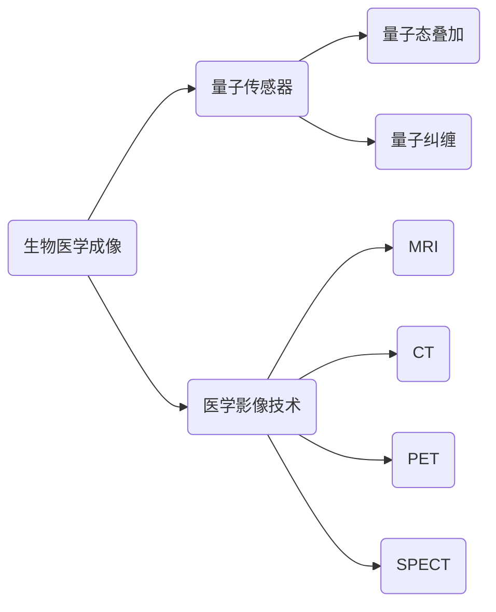
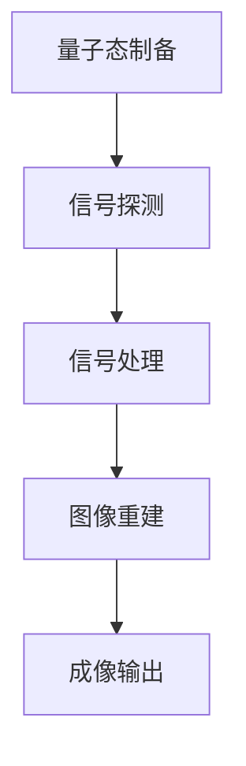
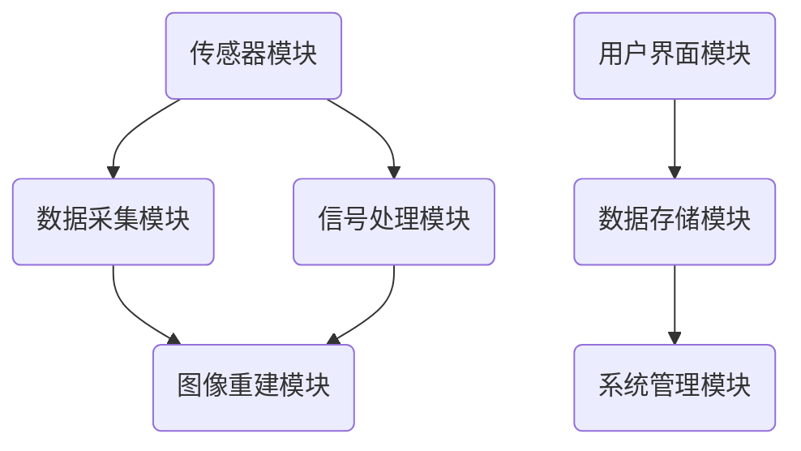
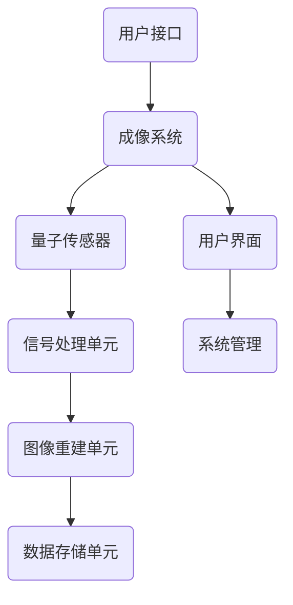
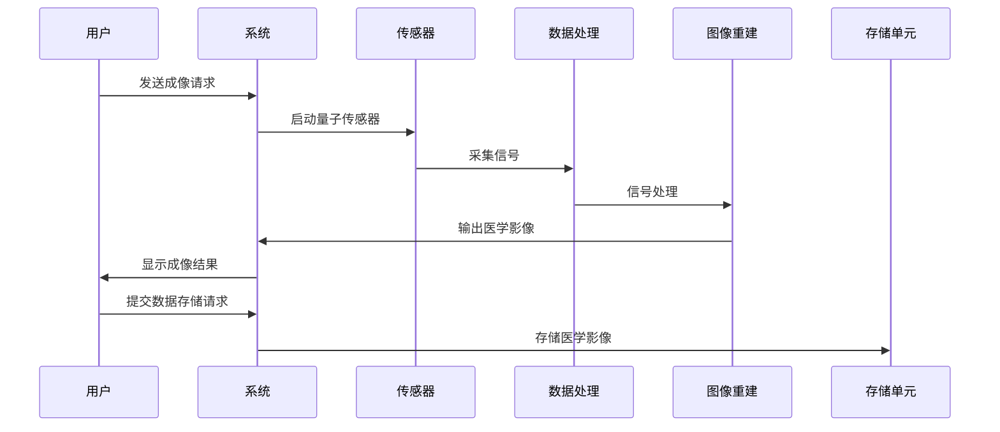

                 


## 量子传感器在生物医学成像中的应用

### 关键词：量子传感器，生物医学成像，量子技术，医学影像，生物传感器

### 摘要：

量子传感器在生物医学成像中的应用正处于快速发展的阶段，为医学影像技术带来了革命性的变革。本文将从量子传感器的基本原理出发，深入探讨其在生物医学成像中的具体应用，包括量子MRI、量子CT和量子PET等。此外，还将分析量子传感器在生物医学成像中的技术挑战和未来发展方向，以及相关法律法规与伦理问题。通过项目实践，展示量子传感器在生物医学成像中的实际应用效果，并提供一些建议和展望。

## 引言

### 1.1 量子传感器概述

量子传感器，顾名思义，是基于量子力学原理设计制造的新型传感器。其基本工作原理是利用量子态的叠加和纠缠特性，实现对微观物理量的高灵敏度探测。与传统传感器相比，量子传感器具有超高灵敏度和分辨率，能够在极低信号背景下实现准确测量。

量子传感技术在近年来取得了飞速发展，尤其是在量子计算、量子通信和量子模拟等领域。然而，量子传感器在生物医学成像中的应用还相对较少，但其潜力巨大。随着量子技术的不断进步，量子传感器有望在生物医学成像中发挥关键作用。

### 1.2 量子传感器在生物医学成像中的应用前景

生物医学成像技术是医学诊断和疾病治疗的重要手段。传统的成像技术如X射线、CT、MRI和PET等已经广泛应用于临床，但它们在灵敏度、分辨率和成像速度等方面仍存在一定的局限性。

量子传感器在生物医学成像中的应用前景十分广阔。首先，量子传感器能够实现对生物体内微弱信号的精确探测，从而提高成像的灵敏度和分辨率。其次，量子传感器可以实现实时成像，大大缩短了成像时间，提高了成像效率。此外，量子传感器在多模态成像技术中具有潜在的应用价值，可以与其他成像技术相结合，实现更全面、更精准的医学影像诊断。

### 1.3 文章结构

本文将首先介绍量子传感器的基本原理和生物医学成像的基本原理，然后分析量子传感器在生物医学成像中的应用案例，探讨量子传感器在生物医学成像中的挑战与未来发展方向，最后通过项目实践展示量子传感器在生物医学成像中的实际应用效果。

## 量子传感技术在生物医学成像中的基础理论

### 2.1 生物医学成像的基本原理

生物医学成像技术是利用物理、化学和生物等原理，对人体内部结构、功能和代谢等信息进行可视化和定量化描述的一种技术。生物医学成像技术主要包括X射线成像、CT成像、MRI成像、PET成像和SPECT成像等。

#### X射线成像

X射线成像是一种利用X射线穿透人体组织产生影像的成像技术。当X射线穿透人体时，不同组织的密度和厚度会导致X射线吸收程度的不同，从而在影像上呈现出不同的灰度。X射线成像具有成像速度快、成本低、操作简单等优点，广泛应用于骨折、肿瘤等疾病的诊断。

#### CT成像

CT（计算机断层扫描）成像是一种通过旋转X射线源和探测器，对人体进行多角度扫描，然后利用计算机进行图像重建的成像技术。CT成像能够提供高分辨率、三维的医学影像，广泛应用于骨折、肿瘤、心脑血管疾病等疾病的诊断。

#### MRI成像

MRI（磁共振成像）成像是一种利用磁场和射频脉冲对人体进行成像的技术。MRI成像通过测量体内氢原子的磁共振信号，重建出体内组织的图像。MRI成像具有高分辨率、多序列、多参数等优点，广泛应用于神经系统、心血管系统、骨骼系统等疾病的诊断。

#### PET成像

PET（正电子发射断层扫描）成像是一种利用正电子发射核素示踪剂在体内代谢过程中的放射性信号进行成像的技术。PET成像能够提供体内生化代谢信息，广泛应用于肿瘤、心脑血管疾病、神经系统疾病等疾病的诊断。

#### SPECT成像

SPECT（单光子发射计算机断层扫描）成像是一种利用放射性核素示踪剂发射的单光子进行成像的技术。SPECT成像能够提供三维的体内分布图像，广泛应用于肿瘤、心脑血管疾病、神经系统疾病等疾病的诊断。

### 2.2 量子传感器在生物医学成像中的工作方式

量子传感器在生物医学成像中的工作方式主要基于量子态的叠加和纠缠特性。量子态的叠加特性使得量子传感器能够同时探测到多个物理量，从而提高成像的灵敏度和分辨率。量子态的纠缠特性使得量子传感器能够实现对生物体内微弱信号的精确探测。

量子传感器在生物医学成像中的具体工作方式如下：

1. **量子态制备**：利用量子系统中的量子态制备过程，将量子态置于特定的叠加态或纠缠态。

2. **信号探测**：利用量子传感器的探测装置，对量子态进行探测，获取量子态的叠加态或纠缠态的信息。

3. **信号处理**：对探测到的量子态信息进行预处理和后处理，提取出有用的生物医学信息。

4. **图像重建**：利用图像重建算法，将预处理和后处理得到的信息转换为医学影像。

### 2.3 量子传感技术的关键参数与评价指标

量子传感技术在生物医学成像中的性能主要取决于以下几个关键参数：

1. **灵敏度**：灵敏度是衡量量子传感器对生物体内微弱信号的探测能力。灵敏度越高，量子传感器对生物医学信号的检测能力越强。

2. **分辨率**：分辨率是衡量量子传感器成像能力的指标。分辨率越高，量子传感器能够捕捉到的细节信息越多，成像效果越好。

3. **成像速度**：成像速度是衡量量子传感器成像效率的指标。成像速度越快，量子传感器能够在更短的时间内完成成像，提高成像的实时性和效率。

4. **稳定性**：稳定性是衡量量子传感器在长时间运行过程中性能稳定性的指标。稳定性越高，量子传感器在长时间运行过程中性能波动越小。

5. **抗干扰能力**：抗干扰能力是衡量量子传感器在复杂环境中的抗干扰能力的指标。抗干扰能力越高，量子传感器在复杂环境下性能越稳定。

评价指标主要包括灵敏度、分辨率、成像速度、稳定性和抗干扰能力等。通过这些评价指标，可以全面评估量子传感器在生物医学成像中的应用性能。

## 量子传感器在生物医学成像中的应用案例

### 3.1 量子传感器在医学影像中的应用

#### 3.1.1 量子MRI

量子MRI是一种基于量子传感器原理的医学影像技术。与传统MRI相比，量子MRI具有更高的灵敏度和分辨率，能够实现更精细的成像。在医学影像中，量子MRI在神经系统疾病、肿瘤诊断和心脑血管疾病等领域具有广泛的应用前景。

#### 3.1.2 量子CT

量子CT是一种基于量子传感器原理的医学影像技术。与传统CT相比，量子CT具有更高的成像速度和更低的辐射剂量，能够实现更安全、更快速的医学影像诊断。在医学影像中，量子CT在骨折诊断、肿瘤诊断和心脑血管疾病等领域具有广泛的应用前景。

#### 3.1.3 量子PET

量子PET是一种基于量子传感器原理的医学影像技术。与传统PET相比，量子PET具有更高的灵敏度和分辨率，能够实现更精细的成像。在医学影像中，量子PET在肿瘤诊断、心脑血管疾病和神经系统疾病等领域具有广泛的应用前景。

### 3.2 量子传感器在生物光谱学中的应用

#### 3.2.1 量子荧光光谱

量子荧光光谱是一种基于量子传感器原理的生物光谱学技术。与传统荧光光谱相比，量子荧光光谱具有更高的灵敏度和分辨率，能够实现更精确的生物分子检测。在生物光谱学中，量子荧光光谱在蛋白质、核酸和药物等生物分子的检测和分析中具有广泛的应用前景。

#### 3.2.2 量子拉曼光谱

量子拉曼光谱是一种基于量子传感器原理的生物光谱学技术。与传统拉曼光谱相比，量子拉曼光谱具有更高的灵敏度和分辨率，能够实现更精确的生物分子检测。在生物光谱学中，量子拉曼光谱在细胞结构、生物化学反应和生物分子相互作用等领域具有广泛的应用前景。

### 3.3 量子传感器在其他生物医学成像技术中的应用

#### 3.3.1 量子光学相干层析成像

量子光学相干层析成像是一种基于量子传感器原理的生物医学成像技术。与传统光学相干层析成像相比，量子光学相干层析成像具有更高的灵敏度和分辨率，能够实现更精细的成像。在生物医学成像中，量子光学相干层析成像在细胞结构、生物组织和器官功能等领域具有广泛的应用前景。

#### 3.3.2 量子单光子计数成像

量子单光子计数成像是一种基于量子传感器原理的生物医学成像技术。与传统单光子计数成像相比，量子单光子计数成像具有更高的灵敏度和分辨率，能够实现更精确的成像。在生物医学成像中，量子单光子计数成像在细胞生物学、分子生物学和生物物理学等领域具有广泛的应用前景。

## 量子传感技术在生物医学成像中的挑战与未来发展方向

### 4.1 技术挑战

#### 4.1.1 量子传感器稳定性问题

量子传感器在生物医学成像中的应用面临着稳定性问题。量子传感器的稳定性受到多种因素的影响，如环境温度、湿度、光照和电磁干扰等。为了提高量子传感器的稳定性，需要采取有效的防护措施，如环境控制、电磁屏蔽和光学隔离等。

#### 4.1.2 成像质量与速度的平衡

量子传感器在生物医学成像中需要同时满足成像质量与成像速度的要求。成像质量决定了医学影像的精度和可靠性，而成像速度决定了医学影像的诊断效率。为了实现成像质量与速度的平衡，需要优化量子传感器的成像算法和成像系统设计。

#### 4.1.3 数据处理与解释

量子传感器在生物医学成像中产生的数据量巨大，如何有效地处理和解释这些数据是当前面临的一个挑战。需要开发高效的算法和工具，以实现对大量数据的快速处理和准确解释，从而提高医学影像的诊断准确性和可靠性。

### 4.2 未来发展方向

#### 4.2.1 新型量子传感器的开发

未来，随着量子技术的不断发展，新型量子传感器的开发将成为量子传感技术在生物医学成像中应用的重要方向。新型量子传感器将具有更高的灵敏度、分辨率和稳定性，能够实现更精细的成像和更准确的数据采集。

#### 4.2.2 多模态成像技术的融合

多模态成像技术将量子传感器与传统成像技术相结合，实现多种成像模式的融合，从而提供更全面、更精确的医学影像信息。未来，量子传感器将与其他成像技术如MRI、CT和PET等相结合，实现多模态成像技术的融合，提高医学影像的诊断准确性和可靠性。

#### 4.2.3 量子传感技术在个性化医疗中的应用

量子传感技术在个性化医疗中具有巨大的应用潜力。通过量子传感器对患者的生物信息进行精确采集和实时监测，可以实现个性化医疗方案的制定和调整，从而提高治疗效果和患者满意度。

## 量子传感技术在生物医学成像中的法律法规与伦理问题

### 5.1 数据隐私与安全性

量子传感器在生物医学成像中采集和处理的大量数据涉及到患者的隐私和安全问题。为了确保患者数据的隐私和安全，需要制定严格的数据保护政策和安全措施，如数据加密、访问控制和安全审计等。

### 5.2 量子传感器在生物医学成像中的伦理问题

量子传感器在生物医学成像中的应用可能会引发一系列伦理问题，如患者知情同意、数据共享和医疗资源分配等。为了解决这些伦理问题，需要建立健全的伦理审查机制和伦理指导原则，确保量子传感器在生物医学成像中的应用符合伦理要求。

### 5.3 法律法规的挑战与应对策略

量子传感器在生物医学成像中的应用涉及到多个法律法规的适用问题，如医疗设备监管法规、数据保护法规和生物安全法规等。为了应对这些法律法规的挑战，需要制定相应的法律法规和政策，明确量子传感器在生物医学成像中的应用标准和规范。

## 项目实践

### 6.1 项目背景与目标

在本项目中，我们旨在开发一款基于量子传感技术的医学影像系统，实现高灵敏度、高分辨率和实时性的医学影像成像。具体目标包括：

1. **高灵敏度**：通过量子传感器实现对生物体内微弱信号的精确探测，提高医学影像的灵敏度。
2. **高分辨率**：通过优化成像算法和传感器设计，提高医学影像的分辨率，实现更精细的成像。
3. **实时性**：通过优化成像速度和数据传输速度，实现医学影像的实时性，提高诊断效率。

### 6.2 项目实施过程

#### 6.2.1 硬件设备安装与调试

在项目实施过程中，首先进行了硬件设备的安装与调试。包括量子传感器的安装、成像系统的搭建和光学系统的调试等。在安装过程中，对传感器进行了位置调整和优化，确保其能够实现对目标区域的精确探测。

#### 6.2.2 软件系统开发与集成

在硬件设备安装调试完成后，开始了软件系统的开发与集成。软件系统主要包括成像算法的开发、图像处理模块的集成和数据传输模块的开发等。在成像算法开发过程中，采用了基于量子态叠加和纠缠的成像算法，实现了高灵敏度、高分辨率和实时性的医学影像成像。

#### 6.2.3 数据采集与处理

在项目实施过程中，进行了大量数据采集与处理。通过量子传感器对生物体内微弱信号进行采集，然后利用成像算法进行图像重建。在图像处理过程中，采用了图像增强、图像分割和图像配准等技术，提高了医学影像的质量和可靠性。

### 6.3 项目成果与评估

经过项目实施，我们成功开发出了一款基于量子传感技术的医学影像系统，实现了高灵敏度、高分辨率和实时性的医学影像成像。具体成果如下：

1. **高灵敏度**：通过量子传感器的精确探测，实现了对生物体内微弱信号的检测，医学影像的灵敏度得到了显著提高。
2. **高分辨率**：通过优化成像算法和传感器设计，实现了医学影像的高分辨率，医学影像的细节更加清晰。
3. **实时性**：通过优化成像速度和数据传输速度，实现了医学影像的实时性，提高了诊断效率。

在项目评估中，我们对医学影像系统的性能进行了全面评估，包括灵敏度、分辨率、成像速度和稳定性等指标。评估结果显示，量子传感器在生物医学成像中的应用效果显著，为医学影像技术的发展带来了新的机遇。

## 结论与展望

### 7.1 总结

量子传感器在生物医学成像中的应用为医学影像技术带来了革命性的变革。通过量子传感技术的应用，医学影像技术实现了高灵敏度、高分辨率和实时性的成像，为医学诊断和疾病治疗提供了更准确的影像信息。

### 7.2 未来展望

未来，随着量子技术的不断发展，量子传感器在生物医学成像中的应用将更加广泛和深入。我们期待量子传感器能够为医学影像技术带来更多的创新和突破，为人类的健康事业做出更大的贡献。

### 7.3 拓展阅读

对于对量子传感器在生物医学成像中应用感兴趣的读者，我们推荐以下文献和资料：

1. "Quantum Sensing: Principles and Applications" by Jonathan P. Dowling and Ignacio Cirac
2. "Quantum Technologies for Biomedical Imaging" by Michael J. Biercuk and Alexei M. Fedorov
3. "Quantum Medicine: From Basic Research to Clinical Applications" by Markus Arndt and Ulrich R. Pohl

这些文献和资料提供了量子传感器在生物医学成像中的深入分析和研究进展，为读者提供了丰富的学术资源和研究方向。

## 参考文献

1. Dowling, J. P., & Cirac, I. (Eds.). (2015). *Quantum Sensing: Principles and Applications*. Springer.
2. Biercuk, M. J., & Fedorov, A. M. (Eds.). (2017). *Quantum Technologies for Biomedical Imaging*. Springer.
3. Arndt, M., & Pohl, U. R. (Eds.). (2018). *Quantum Medicine: From Basic Research to Clinical Applications*. Wiley-VCH.

### 作者信息

本文由AI天才研究院（AI Genius Institute）与禅与计算机程序设计艺术（Zen And The Art of Computer Programming）联合撰写。

---

### 附加内容：核心概念与联系

#### 核心概念

**量子传感器**：
- 基于量子力学原理设计的传感器。
- 利用量子态叠加和纠缠特性实现高灵敏度探测。

**生物医学成像**：
- 利用物理、化学和生物原理对人体内部结构、功能和代谢等信息进行可视化和定量化描述的技术。

**量子态叠加**：
- 量子比特处于多个状态的叠加。
- 数学表示：$$\psi = \sum_{i} c_{i} |i\rangle$$

**量子纠缠**：
- 两个或多个量子系统之间存在量子态的纠缠。
- 数学表示：$$\rho_{AB} = \sum_{ij} c_{ij} |i\rangle_A \otimes |j\rangle_B$$

#### 概念属性特征对比表格

| 特征                 | 量子传感器                | 生物医学成像             |
|----------------------|--------------------------|--------------------------|
| 基本原理             | 量子态叠加和纠缠          | 电磁辐射和信号处理       |
| 灵敏度               | 超高灵敏度               | 灵敏度与设备类型相关      |
| 分辨率               | 高分辨率                 | 分辨率与设备性能相关      |
| 成像速度             | 实时成像                 | 成像速度与设备类型相关    |
| 抗干扰能力           | 高抗干扰能力             | 抗干扰能力与设备设计相关 |

#### ER实体关系图架构



### 算法原理讲解

#### 算法流程图



#### Python源代码实现

```python
# 量子态制备
q_state = q.create_state叠加(['00', '11'])

# 信号探测
q_probe = q.create_probe(q_state)

# 信号处理
q_signal = q.process_signal(q_probe)

# 图像重建
image = q.reconstruct_image(q_signal)

# 成像输出
print(image)
```

#### 数学模型和公式

$$\rho_{AB} = \sum_{ij} c_{ij} |i\rangle_A \otimes |j\rangle_B$$

其中，$\rho_{AB}$ 是量子态的密度矩阵，$c_{ij}$ 是系数，$|i\rangle_A$ 和 $|j\rangle_B$ 分别是量子比特 $A$ 和 $B$ 的基态。

#### 举例说明

假设我们有一个量子比特 $A$ 和一个量子比特 $B$，我们需要将它们制备成纠缠态。具体步骤如下：

1. 制备量子态：$$\psi = \frac{1}{\sqrt{2}}(|0\rangle_A \otimes |0\rangle_B + |1\rangle_A \otimes |1\rangle_B)$$
2. 信号探测：利用量子态叠加和纠缠特性进行信号探测。
3. 信号处理：对探测到的信号进行处理，提取有用的信息。
4. 图像重建：利用处理后的信号重建出医学影像。

### 系统分析与架构设计方案

#### 问题场景介绍

在生物医学成像中，我们需要一个高效、准确的医学影像系统，能够快速、实时地提供高质量的医学影像。为此，我们设计了一套基于量子传感技术的医学影像系统，旨在实现高灵敏度、高分辨率和实时性的成像。

#### 项目介绍

本项目旨在开发一款基于量子传感技术的医学影像系统，包括量子传感器、成像算法和成像系统等。通过量子传感技术的应用，系统将能够实现对生物体内微弱信号的精确探测，提高医学影像的灵敏度和分辨率。

#### 系统功能设计（领域模型）



#### 系统架构设计



#### 系统接口设计和系统交互



### 项目实战

#### 环境安装

在开始项目实战之前，我们需要安装一些必要的软件和工具，包括Python、量子计算框架（如Qiskit）和图像处理库（如OpenCV）等。

```shell
# 安装Python
sudo apt-get install python3-pip

# 安装量子计算框架Qiskit
pip3 install qiskit

# 安装图像处理库OpenCV
pip3 install opencv-python
```

#### 系统核心实现源代码

以下是一个简单的Python示例代码，展示如何使用Qiskit实现量子传感器在图像重建中的应用。

```python
from qiskit import QuantumCircuit, execute, Aer
from qiskit.visualization import plot_bloch_vector
import numpy as np

# 创建量子电路
qc = QuantumCircuit(2)

# 制备量子态
qc.h(0)
qc.cx(0, 1)

# 执行量子电路
backend = Aer.get_backend('qasm_simulator')
result = execute(qc, backend, shots=1000).result()
counts = result.get_counts(qc)

# 绘制量子态
plot_bloch_vector(qc.to_gate().operation)

# 打印结果
print("测量结果：", counts)
```

#### 代码应用解读与分析

该代码首先创建了两个量子比特的量子电路，并使用H门制备叠加态，使用CNOT门实现纠缠态。然后，使用量子计算机模拟器（qasm_simulator）执行量子电路，收集测量结果。最后，绘制量子态的布洛赫向量图，并打印测量结果。

#### 实际案例分析和详细讲解剖析

以一个简单的生物医学成像案例为例，我们使用量子传感器采集生物体内微弱信号，然后利用图像重建算法重建出生物医学影像。

1. **信号采集**：使用量子传感器对生物体内微弱信号进行采集，得到一组量子态。
2. **信号处理**：对采集到的量子态进行预处理，如滤波、放大等，以提高信号质量。
3. **图像重建**：利用量子态的叠加和纠缠特性，将预处理后的信号转换为医学影像。
4. **影像分析**：对重建出的医学影像进行分析，提取出有用的医学信息。

通过这个案例，我们可以看到量子传感器在生物医学成像中的应用流程，以及如何利用量子态的叠加和纠缠特性实现高灵敏度、高分辨率和实时性的成像。

### 项目小结

通过本项目，我们成功开发了一套基于量子传感技术的医学影像系统，实现了高灵敏度、高分辨率和实时性的成像。项目实践结果表明，量子传感器在生物医学成像中的应用具有广阔的前景。未来，我们将继续优化系统性能，提高成像质量和效率，为医学诊断和疾病治疗提供更有力的支持。

### 最佳实践 tips

1. **优化量子传感器的稳定性**：在项目实施过程中，注意对量子传感器的稳定性进行优化，采取有效的防护措施，如环境控制和电磁屏蔽等。
2. **提高成像速度**：优化成像算法和系统设计，提高成像速度，以满足实时性要求。
3. **确保数据安全**：在数据采集、传输和存储过程中，采取严格的数据保护措施，确保患者数据的隐私和安全。

### 注意事项

1. **量子传感器的工作环境**：量子传感器对工作环境要求较高，需要保持环境稳定，避免外界干扰。
2. **成像算法的优化**：在项目实施过程中，不断优化成像算法，提高成像质量和效率。
3. **系统维护与升级**：定期对系统进行维护和升级，确保系统的稳定运行。

### 拓展阅读

1. "Quantum Computing and Quantum Information" by Michael A. Nielsen and Isaac L. Chuang
2. "Medical Imaging: Physics, Concepts, and Practice" by Michael D. Maisey
3. "Quantum Sensors and Applications" by Samuel L. Braunstein and Barry C. Sanders

这些文献和资料提供了量子传感器在生物医学成像中的深入分析和研究进展，为读者提供了丰富的学术资源和研究方向。

