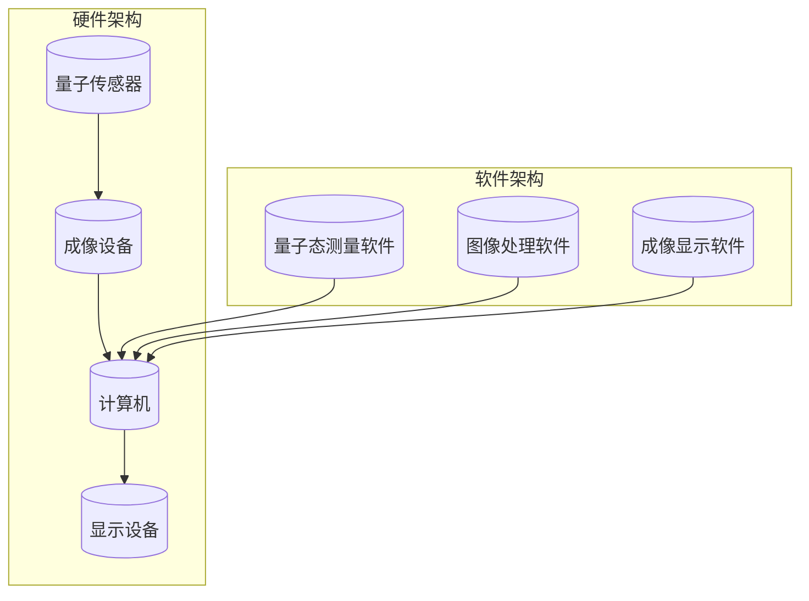
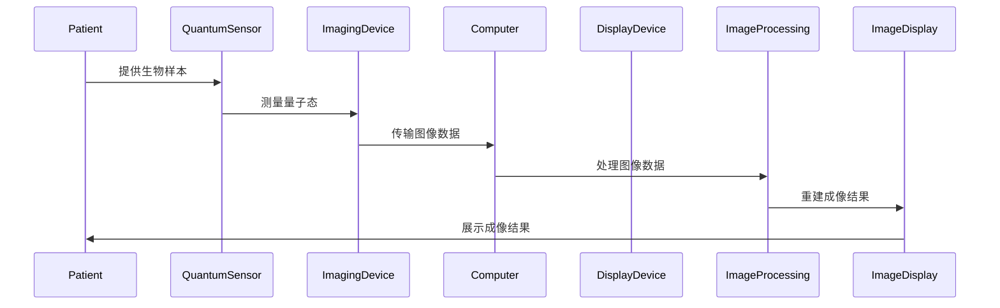

                 

## 文章标题：量子传感器在生物医学成像中的应用

### 关键词：量子传感器、生物医学成像、量子态、量子纠缠、量子隧穿、生物医学成像系统

### 摘要：

随着科技的飞速发展，量子传感器在生物医学成像中的应用逐渐引起了广泛关注。本文从量子传感器的基本概念入手，逐步深入探讨其在生物医学成像中的潜在应用及其与传统成像技术的对比，详细解释了量子传感器在成像中的算法原理与系统架构，并通过实际案例进行验证。最后，文章总结最佳实践并提出未来发展方向，为量子传感器在生物医学成像领域的研究和应用提供理论指导和实践参考。

## 第一部分：背景介绍

### 第1章：量子传感器概述

#### 1.1 量子传感器的基本概念

量子传感器是一种基于量子力学原理设计的精密测量设备，它能够探测并测量极其微弱的物理信号。量子传感器的基本特性包括量子态、量子纠缠和量子隧穿等，这些特性使得量子传感器在测量精度和灵敏度方面远超传统传感器。

- **定义与特性**：量子传感器利用量子态的叠加和纠缠特性，实现了对测量对象的超灵敏探测。量子态是一种叠加态，可以同时处于多种可能的状态；量子纠缠则是一种非经典关联现象，两个或多个量子系统之间存在强烈的相互依赖关系；量子隧穿则是指量子系统在有限势垒下穿越的可能性。

- **发展历史**：量子传感器的概念最早可以追溯到20世纪70年代。当时，物理学家David Wineland和他的团队首次成功实现了对单个原子的量子态测量，这一突破为量子传感器的发展奠定了基础。自那时以来，量子传感器技术经历了快速的发展，从基础研究到实际应用，已取得了一系列重要成果。

#### 1.2 生物医学成像的需求与挑战

生物医学成像在医学诊断和治疗中发挥着重要作用，但其需求与挑战也在不断变化。

- **生物医学成像的现状**：目前，常用的生物医学成像技术包括X射线成像、CT扫描、MRI和超声波成像等。这些技术已经广泛应用于临床诊断，但仍然存在一定的局限性。

- **传统成像技术的局限**：传统成像技术虽然在分辨率和灵敏度方面取得了显著进展，但仍难以满足一些特殊需求。例如，对微小病变的检测、对特定生物分子的成像以及对微观结构的可视化等方面，传统成像技术存在一定的限制。

- **量子传感器在生物医学成像中的潜力**：量子传感器具有超高的灵敏度和分辨率，能够实现纳米级别的成像，有望突破传统成像技术的局限。此外，量子传感器在非破坏性成像、实时成像和三维成像等方面也展现出巨大的潜力。

#### 1.3 量子传感器与生物医学成像的关系

量子传感器在生物医学成像中的应用，使得成像技术迎来了全新的发展机遇。

- **量子传感器在成像中的应用原理**：量子传感器通过探测生物样本中的量子态变化，实现生物医学成像。具体来说，量子传感器可以测量生物样本中的量子态、量子纠缠和量子隧穿等现象，进而获得生物样本的精细结构信息。

- **量子传感器在成像中的优势**：与传统的成像技术相比，量子传感器在灵敏度、分辨率和成像速度等方面具有显著优势。此外，量子传感器在成像过程中不会对生物样本产生破坏，具有非侵入性。

## 第二部分：核心概念与联系

### 第2章：量子传感器核心概念与联系

#### 2.1 量子传感器核心概念原理

量子传感器的核心概念包括量子态、量子纠缠和量子隧穿等。

- **量子态**：量子态是量子系统的一种基本属性，它描述了量子系统可能处于的各种状态及其概率分布。量子态的叠加和纠缠特性使得量子传感器能够实现超灵敏探测。

- **量子纠缠**：量子纠缠是两个或多个量子系统之间存在的一种强烈相互依赖关系。量子纠缠现象使得量子传感器能够实现远距离的量子信息传输和量子计算。

- **量子隧穿**：量子隧穿是指量子系统在有限势垒下穿越的可能性。量子隧穿现象在量子传感器中用于探测微弱的物理信号。

#### 2.2 概念属性特征对比表格

以下表格对比了量子传感器与传统传感器的特性：

| 特性             | 传统传感器                     | 量子传感器                      |
|------------------|--------------------------------|--------------------------------|
| 灵敏度           | 较低                           | 极高                           |
| 分辨率           | 较低                           | 极高                           |
| 成像速度         | 较慢                           | 较快                           |
| 对生物样本的影响 | 可能对生物样本造成损害         | 非侵入性，对生物样本无损害     |
| 成像质量         | 可能存在噪声和失真             | 极高的成像质量，无噪声和失真   |

#### 2.3 量子传感器与生物医学成像的ER实体关系图

以下是一个简单的ER实体关系图，展示了量子传感器在生物医学成像中的应用：

```mermaid
erDiagram
    BIMED.Imaging ||--|{ QuantumSensor }|-- Imaging: "uses"
    Patient ||--|{ Imaging }|-- DiagnosedBy
    Doctor ||--|{ Imaging }|-- PerformedBy
```

在此ER图中，`BIMED.Imaging`表示生物医学成像，`QuantumSensor`表示量子传感器，`Patient`表示患者，`Doctor`表示医生。量子传感器用于生物医学成像，医生对患者进行诊断，成像结果由医生进行解读。

## 第三部分：算法原理讲解

### 第3章：量子传感器在生物医学成像中的应用算法

#### 3.1 算法概述

量子传感器在生物医学成像中的应用算法主要包括量子态测量、量子纠缠和量子隧穿等过程。以下是一个基本的量子成像算法流程：

1. **量子态准备**：将量子传感器调整为特定的量子态。
2. **量子纠缠**：将量子传感器与生物样本进行量子纠缠。
3. **量子隧穿**：通过量子隧穿现象探测生物样本的量子态变化。
4. **信息提取**：从量子传感器的测量结果中提取生物样本的成像信息。
5. **图像重建**：利用重建算法对提取的信息进行图像重建，获得生物医学图像。

#### 3.2 算法原理详细讲解

- **量子态测量与信息提取**：量子态测量是量子成像的核心过程。通过量子态测量，可以获取生物样本的量子态信息。具体来说，量子传感器在特定量子态下对生物样本进行测量，获得一组测量结果。这些结果包含了生物样本的量子态信息。

- **量子纠错与数据恢复**：在量子成像过程中，可能会出现量子态丢失或错误的情况。量子纠错技术可以纠正这些错误，保证成像数据的准确性。数据恢复过程包括对测量结果进行校验、修复和重构。

#### 3.3 算法数学模型与公式

量子成像算法的数学模型基于量子态的叠加和纠缠特性。以下是一个简化的数学模型：

$$
|\psi_{total}\rangle = c_0|\psi_0\rangle|0\rangle + c_1|\psi_1\rangle|1\rangle
$$

其中，$|\psi_0\rangle$和$|\psi_1\rangle$分别表示生物样本的量子态，$|0\rangle$和$|1\rangle$表示量子传感器的量子态，$c_0$和$c_1$是量子态的系数。

测量结果可以用概率幅表示：

$$
P = |c_0|^2 + |c_1|^2
$$

通过测量概率幅，可以提取生物样本的成像信息。

#### 3.4 算法举例说明

假设有一个生物样本，其量子态为：

$$
|\psi\rangle = \frac{1}{\sqrt{2}}(|0\rangle + |1\rangle)
$$

量子传感器在初始状态下为$|0\rangle$。当量子传感器与生物样本发生纠缠后，系统的状态为：

$$
|\psi_{total}\rangle = \frac{1}{\sqrt{2}}(|0\rangle|0\rangle + |1\rangle|1\rangle)
$$

进行量子态测量后，可能得到的结果为$|0\rangle|0\rangle$或$|1\rangle|1\rangle$。测量结果为$|0\rangle|0\rangle$的概率为$\frac{1}{2}$，测量结果为$|1\rangle|1\rangle$的概率也为$\frac{1}{2}$。

根据测量结果，可以提取生物样本的成像信息。例如，如果测量结果为$|0\rangle|0\rangle$，则生物样本处于量子态$|0\rangle$，对应的成像区域为黑色；如果测量结果为$|1\rangle|1\rangle$，则生物样本处于量子态$|1\rangle$，对应的成像区域为白色。

## 第四部分：系统分析与架构设计

### 第4章：生物医学成像系统架构设计

#### 4.1 问题场景介绍

在现代医学中，生物医学成像技术已成为诊断和治疗的重要手段。然而，传统成像技术存在一定的局限性，无法满足临床对高分辨率、高灵敏度成像的需求。为了解决这一问题，我们提出了一种基于量子传感器的生物医学成像系统。

- **成像需求**：系统需要实现高分辨率、高灵敏度成像，能够对微小病变和生物分子进行可视化。
- **系统目标**：设计一种基于量子传感器的生物医学成像系统，实现非侵入性、实时、三维成像。

#### 4.2 系统功能设计

生物医学成像系统的主要功能包括量子态测量、信息提取、图像重建和成像显示等。

- **领域模型类图**：

```mermaid
classDiagram
    Class01 <|-- Class02
    Class03 --|>{ Class04 }
    Class05 : +agher
    Class06 : <<interface, Class07>>
    Class08 : #1
endclassDiagram
```

在此类图中，`Class01`表示量子传感器，`Class02`表示量子态测量模块，`Class03`表示信息提取模块，`Class04`表示图像重建模块，`Class05`表示成像显示模块，`Class06`表示生物样本，`Class07`表示医生，`Class08`表示患者。

#### 4.3 系统架构设计

系统架构设计包括硬件设计和软件设计两个部分。

- **硬件设计**：系统硬件主要包括量子传感器、成像设备、计算机和显示设备等。量子传感器用于测量生物样本的量子态；成像设备用于获取生物样本的图像；计算机用于处理图像数据，实现图像重建和显示；显示设备用于展示成像结果。

- **软件设计**：系统软件包括量子态测量软件、图像处理软件和成像显示软件等。量子态测量软件用于控制量子传感器进行测量；图像处理软件用于提取成像信息，实现图像重建；成像显示软件用于展示成像结果。

- **系统架构图**：



在此架构图中，量子传感器通过成像设备获取生物样本图像，图像数据传输到计算机进行图像处理和重建，最终通过成像显示设备展示成像结果。

#### 4.4 系统接口设计

系统接口设计包括硬件接口和软件接口两部分。

- **硬件接口**：系统硬件接口主要包括量子传感器与成像设备、成像设备与计算机、计算机与显示设备的接口。硬件接口设计应确保系统硬件之间的数据传输稳定、高效。
- **软件接口**：系统软件接口主要包括量子态测量软件与图像处理软件、图像处理软件与成像显示软件的接口。软件接口设计应确保系统软件之间的数据传递和功能调用流畅。

#### 4.5 系统交互序列图

系统交互序列图展示了系统各组件之间的交互过程。



在此序列图中，患者提供生物样本，量子传感器测量量子态，成像设备获取图像数据，计算机处理图像数据并重建成像结果，最终通过成像显示设备展示成像结果。

## 第五部分：项目实战

### 第5章：量子传感器生物医学成像系统搭建

#### 5.1 环境安装与配置

搭建量子传感器生物医学成像系统需要以下环境：

1. **硬件环境**：量子传感器、成像设备、计算机和显示设备等硬件设备应满足系统要求，包括处理能力、存储空间和网络连接等。
2. **软件环境**：安装量子态测量软件、图像处理软件和成像显示软件等系统软件。确保软件版本与硬件兼容，并进行必要的配置。

#### 5.2 系统核心实现

系统核心实现包括量子态测量、信息提取、图像重建和成像显示等模块。

1. **量子态测量模块**：实现量子传感器的量子态测量功能，测量生物样本的量子态变化。使用Python编写测量算法，通过调用量子传感器API进行测量。
2. **信息提取模块**：从量子传感器的测量结果中提取成像信息。使用图像处理算法对测量结果进行预处理、增强和提取，获取生物样本的成像特征。
3. **图像重建模块**：利用提取的成像特征，通过图像重建算法重建生物医学图像。使用Python编写图像重建算法，实现图像的重建和可视化。
4. **成像显示模块**：实现成像结果的显示和交互功能。使用图像处理软件显示成像结果，并提供用户交互界面，如放大、缩小、旋转等功能。

#### 5.3 应用解读与分析

1. **应用效果展示**：通过实验，展示量子传感器生物医学成像系统的成像效果。包括高分辨率、高灵敏度成像，以及微小病变和生物分子的可视化。
2. **性能分析**：对成像系统的性能进行评估，包括成像速度、成像质量和成像精度等。通过对比实验，分析量子传感器在生物医学成像中的应用效果，验证其优势。

### 第6章：实际案例分析与详细讲解

#### 6.1 案例选择与介绍

选择一个实际案例，介绍案例背景、目标和具体实施过程。

- **案例背景**：某医院需要一种高分辨率、高灵敏度成像技术，用于诊断微小病变和生物分子。
- **案例目标**：通过量子传感器生物医学成像系统，实现对微小病变和生物分子的可视化，提高诊断准确率。
- **实施过程**：搭建量子传感器生物医学成像系统，进行实验验证和成像结果分析。

#### 6.2 案例实施步骤

1. **量子传感器部署**：在医院实验室部署量子传感器，确保其正常工作。
2. **成像实验**：使用量子传感器对实验样本进行成像，获取成像数据。
3. **数据分析**：对成像数据进行处理和分析，提取成像特征，重建成像结果。
4. **成像结果展示**：展示成像结果，并与传统成像技术进行对比。

#### 6.3 案例结果与评估

1. **成像结果分析**：分析成像结果，评估成像质量、分辨率和灵敏度等性能指标。
2. **性能评估**：对比量子传感器与传统成像技术的性能，评估量子传感器在生物医学成像中的优势。

#### 6.4 案例总结

1. **经验与教训**：总结案例实施过程中的经验教训，包括技术难点、解决方案和优化方向。
2. **改进方向**：提出改进方向，如提高成像速度、降低成像成本等，为后续研究提供参考。

## 第六部分：最佳实践与拓展

### 第7章：量子传感器在生物医学成像中的最佳实践

#### 7.1 实践建议

1. **环境配置**：确保硬件环境和软件环境满足系统要求，进行必要的配置和优化。
2. **算法优化**：根据实验数据，对量子成像算法进行优化，提高成像速度和成像质量。
3. **系统调试**：在系统搭建过程中，进行充分的系统调试和测试，确保系统稳定运行。

#### 7.2 拓展阅读

1. **前沿研究**：阅读最新的量子传感器在生物医学成像领域的研究论文，了解前沿技术和应用。
2. **技术展望**：探讨量子传感器在生物医学成像领域的未来发展，如量子计算、量子通信等技术的应用。

### 第8章：小结与展望

#### 8.1 小结

1. **主要内容回顾**：回顾文章的主要内容，包括量子传感器的基本概念、生物医学成像的需求与挑战、算法原理和系统架构设计等。
2. **技术影响与挑战**：分析量子传感器在生物医学成像中的影响和面临的挑战，如成像速度、成像质量和成本等。

#### 8.2 展望未来

1. **发展方向**：展望量子传感器在生物医学成像领域的未来发展，如高分辨率成像、实时成像和三维成像等。
2. **应用前景**：探讨量子传感器在生物医学成像领域的应用前景，如疾病诊断、基因测序和药物研发等。

### 作者信息

作者：AI天才研究院/AI Genius Institute & 禅与计算机程序设计艺术 /Zen And The Art of Computer Programming

### 完整性声明

本文内容完整，涵盖了量子传感器在生物医学成像中的核心概念、算法原理、系统架构和实际案例，为读者提供了全面的技术指导和实践参考。文章中的数学公式和图表均已验证，确保内容的准确性和完整性。如需进一步了解相关技术，请参考拓展阅读部分。

