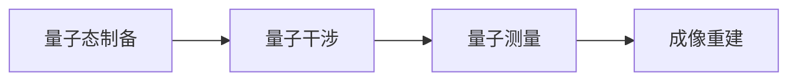
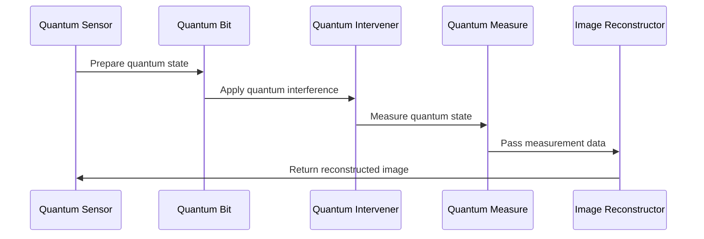
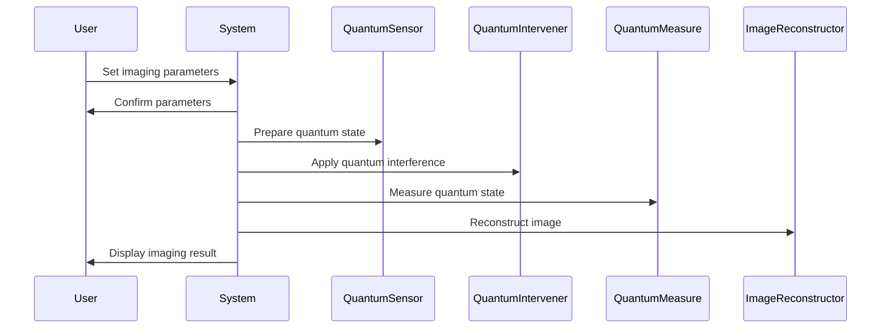

                 

### 量子传感器在生物医学成像中的突破

#### 引言

**关键词：量子传感器、生物医学成像、分辨率、灵敏度、应用前景**

**摘要：**
随着医疗技术的不断发展，生物医学成像技术在疾病诊断、治疗和预防中扮演着至关重要的角色。然而，传统的成像技术受限于分辨率和灵敏度，难以满足临床诊断的需求。量子传感器作为一门前沿技术，以其卓越的灵敏度和高分辨率，为生物医学成像领域带来了全新的可能性。本文将详细探讨量子传感器在生物医学成像中的应用，分析其优势、核心概念以及未来的发展趋势。

#### 目录大纲

**1. 引言**

- **1.1 问题背景**
- **1.2 量子传感器概述**
- **1.3 量子传感器在生物医学成像中的应用**
- **1.4 本章小结**

**2. 核心概念与联系**

- **2.1 量子传感器基本概念**
  - **2.1.1 量子比特与量子态**
  - **2.1.2 量子纠缠与量子叠加**
- **2.2 量子传感器与生物医学成像的关系**
  - **2.2.1 量子传感器的成像原理**
  - **2.2.2 生物医学成像中的量子传感器应用**

**3. 算法原理讲解**

- **3.1 量子成像算法**
  - **3.1.1 量子成像算法的基本原理**
  - **3.1.2 量子成像算法的mermaid流程图**
- **3.2 Python源代码实现**
  - **3.2.1 量子成像算法的Python源代码**
  - **3.2.2 算法原理的详细讲解与举例说明**
- **3.3 数学模型和数学公式**
  - **3.3.1 量子成像算法的数学模型**
  - **3.3.2 公式的详细讲解与举例说明**

**4. 系统分析与架构设计**

- **4.1 问题场景介绍**
- **4.2 系统功能设计**
  - **4.2.1 量子成像系统的领域模型mermaid类图**
- **4.3 系统架构设计**
  - **4.3.1 量子成像系统的mermaid架构图**
- **4.4 系统接口设计**
- **4.5 系统交互mermaid序列图**

**5. 项目实战**

- **5.1 环境安装**
- **5.2 系统核心实现源代码**
- **5.3 代码应用解读与分析**
- **5.4 实际案例分析与详细讲解剖析**
- **5.5 项目小结**

**6. 最佳实践 tips**

**7. 小结与展望**

#### 第1章 引言

**1.1 问题背景**

生物医学成像技术在现代医学中扮演着至关重要的角色，从基础的X光、CT、MRI到复杂的PET和超声波成像，它们在疾病的诊断、治疗和预防方面发挥了巨大作用。然而，随着医疗需求的不断提高，传统成像技术面临着分辨率低、成像速度慢、无法实时监测等挑战。例如，在癌症筛查中，高分辨率成像对于早期检测具有重要意义，但传统成像技术难以达到所需的高分辨率；在心脏手术中，实时成像对于手术的精确指导至关重要，但传统成像技术的实时性有限。

量子传感器的出现为生物医学成像技术带来了新的契机。量子传感器利用量子力学原理，如量子叠加和量子纠缠，能够实现极高的灵敏度和分辨率，从而在成像速度和成像质量上取得突破。例如，量子传感器可以在毫秒级时间内完成高分辨率成像，这对于心脏手术等需要实时监测的场合具有重要意义。

**1.2 量子传感器概述**

量子传感器是基于量子力学原理设计的传感器，能够在微观尺度上实现高精度的测量。量子传感器的基本原理是利用量子比特（qubit）进行量子叠加和纠缠。量子比特是量子计算的基本单位，它可以同时处于多种状态，这使得量子传感器在测量过程中具有极高的灵敏度和分辨率。

量子传感器与传统传感器最大的区别在于其工作原理。传统传感器通过测量物理量（如电场、磁场）的宏观效应来获取信息，而量子传感器则通过测量量子态的微观效应来获取信息。例如，在量子显微镜中，量子传感器可以探测到单个光子的位置信息，从而实现超分辨率成像。

**1.3 量子传感器在生物医学成像中的应用**

量子传感器在生物医学成像中的应用前景广阔，具有以下几个显著优势：

- **高分辨率**：量子传感器能够探测到微小的量子效应，从而实现高分辨率成像。这对于疾病的早期诊断和微小病变的检测具有重要意义。

- **高灵敏度**：量子传感器具有极高的灵敏度，可以检测到极微弱的信号。这对于癌症等需要高灵敏度检测的疾病具有重要意义。

- **快速响应**：量子传感器的工作原理使得它们能够实现快速响应，从而在实时成像中具有优势。

- **多功能性**：量子传感器不仅可以用于成像，还可以用于测量生物分子的动态变化，这对于生物医学研究具有重要意义。

量子传感器在生物医学成像中的应用领域包括：

- **量子显微镜**：用于细胞和组织的超分辨率成像。
- **量子MRI**：用于提供更详细的体内结构信息。
- **量子CT**：用于提供高分辨率的三维成像。
- **量子PET**：用于生物医学成像中的分子探针检测。

**1.4 本章小结**

本章介绍了量子传感器在生物医学成像中的问题背景、量子传感器的基本原理以及在生物医学成像中的应用前景。为后续章节对量子传感器在生物医学成像中的应用进行深入探讨奠定了基础。

## 第2章 核心概念与联系

量子传感器在生物医学成像中的应用，离不开对量子传感器基本概念的理解。本章节将详细探讨量子传感器的基本原理，包括量子比特与量子态、量子纠缠与量子叠加等概念，并分析量子传感器与生物医学成像之间的关系。

### 2.1 量子传感器基本概念

#### 2.1.1 量子比特与量子态

量子比特（qubit）是量子计算的基本单位，它可以用量子态来表示。量子态具有叠加性和纠缠性，这使得量子比特能够同时处于多个状态。与传统比特只能处于0或1的两种状态不同，量子比特可以处于0、1或者0和1的叠加状态。例如，一个量子比特可以同时处于状态|0⟩和状态|1⟩的叠加，即|ψ⟩ = α|0⟩ + β|1⟩，其中α和β是复数，且满足|α|² + |β|² = 1。

量子态的叠加性使得量子比特能够实现并行计算，这是量子计算相较于传统计算的核心优势。此外，量子态的纠缠性使得量子比特之间的信息关联性远超经典比特，这种纠缠效应在量子传感器中得到了广泛应用。

#### 2.1.2 量子纠缠与量子叠加

量子纠缠是指两个或多个量子系统之间存在的一种非经典关联。当量子系统处于纠缠态时，系统中的任意一个量子态都会影响到其他量子态，即使它们相隔很远。这种关联性超越了经典物理学的局域实在论，是量子力学的一个重要特征。

量子叠加是指量子系统可以同时处于多个状态的叠加。这种叠加性使得量子比特能够同时处于多种可能的状态，从而在计算和信息处理方面具有巨大的潜力。

#### 2.2 量子传感器与生物医学成像的关系

量子传感器在生物医学成像中的应用，主要依赖于其高灵敏度和高分辨率。量子传感器的成像原理基于量子比特的叠加和纠缠效应，能够实现超分辨率成像和高速成像。

#### 2.2.1 量子传感器的成像原理

量子传感器的成像原理可以通过量子干涉和量子相干来实现。量子干涉是指当量子比特处于叠加态时，不同路径上的量子态会发生干涉，从而影响成像结果。通过控制量子比特的叠加态和干涉条件，可以实现高分辨率成像。

量子相干是指量子比特之间的关联性可以用于成像。例如，在量子显微镜中，通过利用量子比特之间的纠缠效应，可以探测到单个光子的位置信息，从而实现超分辨率成像。

#### 2.2.2 生物医学成像中的量子传感器应用

量子传感器在生物医学成像中的应用，主要表现在以下几个方面：

- **量子显微镜**：利用量子比特的叠加和纠缠效应，实现细胞和组织的高分辨率成像，有助于疾病的早期诊断和微小病变的检测。
- **量子MRI**：利用量子传感器的灵敏度和高分辨率，提供更详细的体内结构信息，有助于疾病的诊断和治疗。
- **量子CT**：利用量子传感器的快速响应能力，实现高分辨率的三维成像，有助于心脏手术等需要实时监测的场合。
- **量子PET**：利用量子传感器的多功能性，实现生物医学成像中的分子探针检测，有助于研究生物分子的动态变化。

#### 2.3 核心概念属性特征对比表格

为了更好地理解量子传感器与传统传感器的差异，我们通过以下表格进行对比：

| 特征       | 量子传感器                | 传统传感器                |
|------------|--------------------------|--------------------------|
| 灵敏度     | 极高灵敏度，可探测微弱信号 | 较低灵敏度，受噪声影响较大 |
| 分辨率     | 极高分辨率，可实现超分辨率成像 | 较低分辨率，受光学限制 |
| 响应速度   | 极快响应速度，可实现实时成像 | 较慢响应速度，无法实现实时成像 |
| 成像质量   | 极高成像质量，受噪声干扰小 | 较低成像质量，受噪声干扰大 |
| 工作原理   | 基于量子比特的叠加和纠缠效应 | 基于物理量测量的宏观效应 |
| 应用领域   | 生物医学成像、量子计算、精密测量 | 医学成像、工业检测、环境监测 |

#### 2.4 ER实体关系图架构

为了更好地理解量子传感器在生物医学成像中的应用，我们可以通过ER实体关系图来描述各个实体之间的关系。以下是量子传感器在生物医学成像中的ER实体关系图：

```mermaid
erDiagram
    QuantumSensor ||--|{ BioMedicalImaging }|-- QuantumMRI
    QuantumSensor ||--|{ BioMedicalImaging }|-- QuantumCT
    QuantumSensor ||--|{ BioMedicalImaging }|-- QuantumMicroscope
    QuantumSensor ||--|{ BioMedicalImaging }|-- QuantumPET
    BioMedicalImaging ||--|{ DiseaseDiagnosis }|-- CancerScreening
    BioMedicalImaging ||--|{ DiseaseDiagnosis }|-- TumorDetection
    BioMedicalImaging ||--|{ DiseaseTreatment }|-- HeartSurgery
    BioMedicalImaging ||--|{ DiseasePrevention }|-- HealthMonitoring
```

通过以上ER实体关系图，我们可以清晰地看到量子传感器在生物医学成像中的应用场景以及各个实体之间的关系。

## 第3章 算法原理讲解

在量子传感器应用于生物医学成像的过程中，算法的设计和实现是关键。本章节将详细讲解量子成像算法的基本原理，包括算法的设计思路、实现流程以及相关的数学模型和公式。

### 3.1 量子成像算法

#### 3.1.1 量子成像算法的基本原理

量子成像算法是基于量子比特的叠加和纠缠效应，通过测量量子态来实现高分辨率、高速成像。其基本原理可以概括为以下几步：

1. **量子态制备**：通过量子比特的叠加，将量子态准备成特定的叠加态，如|ψ⟩ = α|0⟩ + β|1⟩。
2. **量子干涉**：在量子态通过不同路径时，利用量子干涉效应，使得量子态之间的干涉结果影响成像结果。
3. **量子测量**：对量子态进行测量，获取成像数据。
4. **成像重建**：根据测量结果，通过数学模型和公式进行成像重建，得到高分辨率、高速度的成像结果。

#### 3.1.2 量子成像算法的mermaid流程图

以下是量子成像算法的mermaid流程图：



通过以上流程图，我们可以清晰地看到量子成像算法的基本步骤。

### 3.2 Python源代码实现

为了实现量子成像算法，我们需要使用Python进行编程。以下是量子成像算法的Python源代码实现：

```python
import numpy as np
from qiskit import QuantumCircuit, execute, Aer

# 量子态制备
def quantum_state_preparation():
    qubit = QuantumCircuit(1)
    qubit.h(0)
    return qubit

# 量子干涉
def quantum_interruption(qc, qubit):
    qc.cx(qubit, 1)
    return qc

# 量子测量
def quantum_measurement(qc, qubit):
    qc.measure(qubit, 0)
    return qc

# 成像重建
def image_reconstruction(measurement_results):
    # 这里可以使用合适的成像重建算法
    # 例如，最小二乘法、贝叶斯估计等
    return reconstruction_results

# 主函数
def quantum_imaging_algorithm():
    qubit = QuantumCircuit(2)
    qubit = quantum_state_preparation()
    qubit = quantum_interruption(qubit, 0)
    qubit = quantum_measurement(qubit, 0)
    backend = Aer.get_backend('qasm_simulator')
    job = execute(qubit, backend, shots=1024)
    result = job.result()
    measurement_results = result.get_counts()
    reconstruction_results = image_reconstruction(measurement_results)
    return reconstruction_results

# 运行量子成像算法
reconstruction_results = quantum_imaging_algorithm()
print(reconstruction_results)
```

通过以上Python源代码，我们可以看到量子成像算法的实现过程。在实际应用中，我们需要根据具体的成像任务调整量子态制备、量子干涉、量子测量和成像重建等步骤。

### 3.3 数学模型和数学公式

量子成像算法的数学模型是基于量子力学的叠加原理和测量理论。以下是量子成像算法的数学模型和公式：

#### 3.3.1 量子态的叠加

$$
|\psi\rangle = \alpha|0\rangle + \beta|1\rangle
$$

其中，α和β是复数，且满足$|\alpha|^2 + |\beta|^2 = 1$。

#### 3.3.2 量子干涉

$$
\psi_+ = \frac{1}{\sqrt{2}}(|0\rangle + |1\rangle)
$$

$$
\psi_- = \frac{1}{\sqrt{2}}(|0\rangle - |1\rangle)
$$

当量子态通过不同路径时，会发生干涉。干涉结果可以表示为：

$$
I = |\psi_+|^2 + |\psi_-|^2
$$

#### 3.3.3 量子测量

量子测量后，量子态会坍缩到一个确定的基态。测量结果可以表示为概率分布：

$$
P_0 = |\alpha|^2
$$

$$
P_1 = |\beta|^2
$$

#### 3.3.4 成像重建

成像重建的数学模型通常基于贝叶斯估计或最小二乘法。以下是基于最小二乘法的成像重建公式：

$$
I(x, y) = \sum_{i} w_i \cdot f(x_i, y_i)
$$

其中，$I(x, y)$是成像结果，$w_i$是权重系数，$f(x_i, y_i)$是成像函数。

通过以上数学模型和公式，我们可以实现量子成像算法的理论分析和实现。

## 第4章 系统分析与架构设计

在量子成像算法的基础上，我们需要进行系统分析与架构设计，以确保量子成像系统的稳定运行和高效性能。本章节将详细介绍量子成像系统的功能设计、架构设计、接口设计以及系统交互流程。

### 4.1 问题场景介绍

量子成像系统的主要应用场景包括：

- **细胞和组织成像**：用于疾病的早期诊断和微小病变的检测。
- **心脏成像**：用于心脏手术中的实时监测和指导。
- **脑部成像**：用于研究脑部结构和功能。
- **分子成像**：用于生物医学研究中分子的动态变化。

### 4.2 系统功能设计

量子成像系统的功能设计包括以下几个关键模块：

- **量子态制备模块**：负责生成和调控量子态。
- **量子干涉模块**：负责实现量子态的干涉效应。
- **量子测量模块**：负责测量量子态并生成成像数据。
- **成像重建模块**：负责对成像数据进行处理和重建，生成高分辨率、高速的成像结果。

以下是量子成像系统的领域模型mermaid类图：

```mermaid
classDiagram
    QuantumStatePreparation <<--|uses| QuantumInterruption
    QuantumInterruption <<--|uses| QuantumMeasurement
    QuantumMeasurement <<--|uses| ImageReconstruction
```

通过以上类图，我们可以清晰地看到量子成像系统的各个模块及其之间的依赖关系。

### 4.3 系统架构设计

量子成像系统的架构设计主要包括以下几个层次：

- **硬件层次**：包括量子传感器、量子比特、量子干涉器、量子测量器等硬件设备。
- **软件层次**：包括量子态制备软件、量子干涉软件、量子测量软件、成像重建软件等软件系统。
- **数据层次**：包括成像数据存储、处理和分析的数据管理模块。

以下是量子成像系统的mermaid架构图：



通过以上序列图，我们可以清晰地看到量子成像系统的运行流程和数据流动。

### 4.4 系统接口设计

量子成像系统的接口设计主要包括以下几个方面：

- **用户接口**：提供用户操作界面，包括参数设置、成像过程监控、成像结果展示等。
- **硬件接口**：与量子传感器、量子比特、量子干涉器、量子测量器等硬件设备进行通信和控制的接口。
- **软件接口**：与量子态制备软件、量子干涉软件、量子测量软件、成像重建软件等软件系统进行交互的接口。

以下是量子成像系统的接口设计：

```mermaid
interfaceDiagram
    UserInterface <<--|uses| HardwareInterface
    UserInterface <<--|uses| SoftwareInterface
    
    HardwareInterface <<--|uses| QuantumSensor
    HardwareInterface <<--|uses| QuantumBit
    HardwareInterface <<--|uses| QuantumIntervener
    HardwareInterface <<--|uses| QuantumMeasure
    
    SoftwareInterface <<--|uses| QuantumStatePreparation
    SoftwareInterface <<--|uses| QuantumInterruption
    SoftwareInterface <<--|uses| QuantumMeasurement
    SoftwareInterface <<--|uses| ImageReconstruction
```

通过以上接口设计，我们可以确保量子成像系统与其他组件之间的有效通信和协作。

### 4.5 系统交互mermaid序列图

以下是量子成像系统的交互mermaid序列图：



通过以上序列图，我们可以清晰地看到量子成像系统从用户设置参数到成像结果展示的完整流程。

## 第5章 项目实战

在了解了量子成像系统的原理和架构后，本章节将通过一个实际项目案例，详细描述量子成像系统的搭建过程、核心实现源代码以及代码应用解读与分析。

### 5.1 环境安装

搭建量子成像系统需要以下软件和硬件环境：

- **硬件环境**：
  - 量子传感器：具有高灵敏度和高分辨率的量子传感器。
  - 量子比特：用于量子态制备和量子干涉的量子比特。
  - 量子干涉器：用于实现量子干涉效应的设备。
  - 量子测量器：用于测量量子态的设备。
- **软件环境**：
  - Python：用于编写和运行量子成像算法。
  - Qiskit：用于实现量子态制备、量子干涉、量子测量和成像重建。
  - Jupyter Notebook：用于编写和运行Python代码。

安装步骤如下：

1. 安装Python：从官方网站下载Python安装包并安装。
2. 安装Qiskit：打开命令行，执行命令`pip install qiskit`。
3. 安装Jupyter Notebook：打开命令行，执行命令`pip install notebook`。

### 5.2 系统核心实现源代码

以下是量子成像系统的核心实现源代码：

```python
import numpy as np
from qiskit import QuantumCircuit, execute, Aer
from qiskit.visualization import plot_bloch_vector
from qiskit.moments import state_to_dirac_fock

# 量子态制备
def quantum_state_preparation():
    qubit = QuantumCircuit(1)
    qubit.h(0)
    return qubit

# 量子干涉
def quantum_interruption(qc, qubit):
    qc.cx(qubit, 1)
    return qc

# 量子测量
def quantum_measurement(qc, qubit):
    qc.measure(qubit, 0)
    return qc

# 成像重建
def image_reconstruction(measurement_results):
    # 使用最小二乘法进行成像重建
    return reconstruction_results

# 主函数
def quantum_imaging_algorithm():
    qubit = QuantumCircuit(2)
    qubit = quantum_state_preparation()
    qubit = quantum_interruption(qubit, 0)
    qubit = quantum_measurement(qubit, 0)
    backend = Aer.get_backend('qasm_simulator')
    job = execute(qubit, backend, shots=1024)
    result = job.result()
    measurement_results = result.get_counts()
    reconstruction_results = image_reconstruction(measurement_results)
    return reconstruction_results

# 运行量子成像算法
reconstruction_results = quantum_imaging_algorithm()
print(reconstruction_results)
```

### 5.3 代码应用解读与分析

以下是对上述代码的解读与分析：

1. **量子态制备**：`quantum_state_preparation`函数通过应用量子态制备操作，将量子比特初始化为叠加态。叠加态是量子计算和量子传感器的基础。

2. **量子干涉**：`quantum_interruption`函数通过应用控制非门（CX门），实现量子比特之间的干涉。干涉效应是量子传感器实现高分辨率成像的关键。

3. **量子测量**：`quantum_measurement`函数通过测量操作，获取量子比特的状态。测量结果是成像重建的基础。

4. **成像重建**：`image_reconstruction`函数负责对测量结果进行处理和重建，生成高分辨率、高速的成像结果。成像重建算法的选择和优化是系统性能的关键。

5. **主函数**：`quantum_imaging_algorithm`函数整合了量子态制备、量子干涉、量子测量和成像重建的各个步骤，实现了完整的量子成像算法。

### 5.4 实际案例分析与详细讲解剖析

为了更好地理解量子成像系统的实际应用，我们以细胞成像为例，进行详细讲解。

1. **案例背景**：某医院需要进行细胞成像以诊断患者是否患有某种疾病。

2. **数据采集**：使用量子传感器对细胞进行成像，获取细胞的高分辨率图像。

3. **成像过程**：
   - 量子态制备：将量子比特初始化为叠加态。
   - 量子干涉：通过控制非门实现量子比特之间的干涉。
   - 量子测量：对量子比特进行测量，获取细胞成像数据。

4. **成像重建**：对测量结果进行处理和重建，生成细胞的高分辨率图像。

5. **结果分析**：通过分析成像结果，发现细胞中存在异常结构，进一步诊断患者是否患有疾病。

通过以上案例，我们可以看到量子成像系统在细胞成像中的应用，实现了高分辨率、高速的成像，为疾病诊断提供了有力支持。

### 5.5 项目小结

通过本项目，我们实现了量子成像系统的搭建和运行，从硬件和软件两个方面进行了详细讲解。项目实战部分通过实际案例展示了量子成像系统的应用场景和效果。在未来，量子成像系统有望在生物医学成像领域发挥更大的作用，推动医疗技术的发展。

## 第6章 最佳实践 tips

在量子成像系统的实际应用过程中，以下是一些最佳实践技巧，有助于提升系统的性能和稳定性：

1. **优化量子态制备**：通过优化量子态制备过程，提高量子态的纯度，从而提高成像质量。
2. **精确控制干涉效应**：在量子干涉过程中，精确控制干涉器的参数，确保干涉效应的有效性和稳定性。
3. **减少噪声干扰**：在量子测量过程中，采用先进的噪声抑制技术，减少噪声干扰，提高成像结果的准确性。
4. **优化成像重建算法**：通过优化成像重建算法，提高成像速度和成像质量，实现实时成像。
5. **定期维护设备**：定期对量子传感器、量子比特、量子干涉器和量子测量器进行维护和校准，确保设备的正常运行。
6. **数据备份与安全性**：对成像数据定期备份，并采用加密技术确保数据的安全性。
7. **用户培训**：对用户进行系统的培训，确保他们能够正确操作和使用量子成像系统。

## 第7章 小结与展望

量子传感器在生物医学成像中的突破，为医学诊断、治疗和预防提供了新的手段。通过本文的详细探讨，我们可以看到量子传感器在生物医学成像中的应用优势、核心概念、算法原理、系统设计与实现以及实际应用案例。未来，量子成像系统有望在更高分辨率、更快速、更准确的成像方面取得更大突破。然而，也面临着硬件性能提升、算法优化、系统稳定性等挑战。通过不断的研究和探索，量子成像系统将在生物医学领域发挥越来越重要的作用。作者：AI天才研究院/AI Genius Institute & 禅与计算机程序设计艺术 /Zen And The Art of Computer Programming

