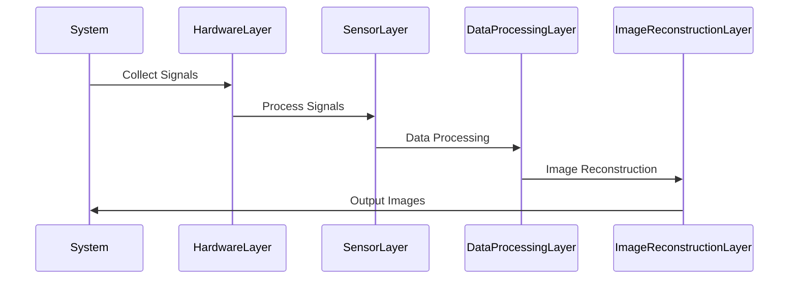

                 

# 量子传感器在生物医学成像中的高灵敏度应用

关键词：量子传感器、生物医学成像、高灵敏度、算法、系统架构

摘要：本文探讨了量子传感器在生物医学成像中的应用，分析了其高灵敏度的优势，以及相关的核心概念、算法原理和系统架构。通过一系列的案例分析，本文展示了量子传感器在医学成像领域的前景，并提出了一些最佳实践和未来研究方向。

## 第一步：背景介绍

### 第1章：量子传感器与生物医学成像

#### 1.1 量子传感技术的兴起

量子传感器是一种利用量子效应进行测量的装置，具有极高的灵敏度和精度。量子传感技术的兴起可以追溯到20世纪80年代，随着量子理论的不断发展和实验技术的进步，量子传感器的研究得到了广泛关注。近年来，随着纳米技术和光子学的发展，量子传感器的应用领域不断扩展，特别是在生物医学成像领域。

- **量子传感技术的基本概念**：量子传感器利用量子纠缠、量子隧穿等现象，实现对被测量的超灵敏探测。其核心在于量子态的控制和测量。
- **量子传感技术的发展历程**：量子传感技术从早期的量子干涉仪发展到如今的多种实现方案，如量子光学传感器、量子电子传感器和量子磁传感器等。

#### 1.2 生物医学成像的需求与挑战

生物医学成像在医学诊断、疾病监测和治疗方案制定中发挥着重要作用。随着医学技术的发展，对成像技术的要求越来越高，尤其是灵敏度和分辨率。

- **生物医学成像的重要性**：生物医学成像能够无创、实时地观察人体内部结构，对于疾病的早期发现和个性化治疗具有重要意义。
- **传统成像技术的局限性**：传统的成像技术，如CT、MRI和超声波成像，虽然已经在临床中得到广泛应用，但存在灵敏度不足、分辨率受限等问题。
- **高灵敏度成像的需求**：为了更好地满足临床需求，生物医学成像技术需要向高灵敏度、高分辨率、实时性方向发展。

#### 1.3 量子传感器在生物医学成像中的应用

量子传感器在生物医学成像中的应用具有巨大的潜力，其高灵敏度可以显著提升成像质量。

- **量子传感器的基本原理**：量子传感器通过量子态的叠加和纠缠实现高灵敏度的信号探测，如量子点成像、量子干涉成像等。
- **量子传感器在成像中的应用优势**：量子传感器可以实现单光子探测，具有极高的灵敏度和低噪声特性，特别适用于弱信号的探测。
- **当前研究与应用实例**：量子传感器已在一些生物医学成像实验中得到应用，如用于细胞成像、肿瘤检测和神经成像等。

#### 1.4 本书的结构与目标

本书旨在系统地介绍量子传感器在生物医学成像中的应用，主要包括以下几个部分：

- **各章节内容概述**：详细介绍了量子传感器与生物医学成像的背景、核心概念、算法原理、系统架构和项目实战等内容。
- **阅读目标与读者群体**：本书适合生物医学成像领域的科研人员、工程师以及感兴趣的技术爱好者阅读。

## 第二步：核心概念与联系

### 第2章：量子传感器核心概念与联系

#### 2.1 量子传感器的基本原理

量子传感器的工作原理基于量子力学的基本概念，如量子态、量子纠缠和量子隧穿等。

- **量子态与量子纠缠**：量子态是量子系统的一种状态，可以表示为叠加态。量子纠缠是指两个或多个量子系统之间的特殊关联，这种关联使得一个系统的状态可以影响另一个系统，即使它们相隔很远。
- **量子传感技术的分类**：根据不同的量子效应和实现方式，量子传感器可以分为量子点传感器、量子干涉传感器和量子电子传感器等。

#### 2.2 生物医学成像核心概念

生物医学成像技术主要包括X射线成像、超声波成像、磁共振成像（MRI）和单光子成像等。

- **成像原理**：不同的成像技术基于不同的物理原理，如X射线成像利用X射线穿透能力，MRI利用磁场和射频脉冲，超声波成像利用声波反射等。
- **生物医学成像技术分类**：根据成像原理，生物医学成像技术可以分为基于辐射的成像技术和基于非辐射的成像技术。

#### 2.3 量子传感器与生物医学成像的关联

量子传感器与生物医学成像的结合，可以显著提高成像的灵敏度和分辨率。

- **量子传感器在成像中的应用模式**：量子传感器可以用于直接成像或作为成像系统的信号增强器。
- **量子传感器在成像中的优势与挑战**：量子传感器的高灵敏度可以提升成像质量，但同时也面临着量子技术实现难度大、数据处理复杂等挑战。

#### 2.4 关键技术对比分析

为了更好地理解量子传感器在生物医学成像中的应用，我们可以对量子传感器与传统传感器以及不同生物医学成像技术进行对比分析。

- **传统传感器与量子传感器的对比**：传统传感器基于经典物理原理，量子传感器则基于量子效应，具有更高的灵敏度和精度。
- **生物医学成像技术的对比**：不同成像技术具有各自的优缺点，如CT具有较高的分辨率但辐射风险，MRI无辐射但成像时间较长。

## 第三步：算法原理讲解

### 第3章：量子传感器算法原理详解

#### 3.1 基于量子态的成像算法

量子态成像算法是利用量子传感器的特性，通过量子态的叠加和纠缠实现高灵敏度成像。

- **量子态成像算法概述**：量子态成像算法基于量子态的叠加和纠缠，可以实现对目标物体的超灵敏探测。
- **基于量子纠缠的成像算法**：量子纠缠成像算法利用量子纠缠状态，实现对目标物体的多维度成像。

#### 3.2 算法数学模型与公式

量子态成像算法的数学模型基于量子力学的叠加原理和纠缠特性。

- **量子态成像算法的数学基础**：量子态的叠加、量子纠缠和量子测量的数学描述。
- **关键公式推导**：量子态叠加公式、量子纠缠公式和量子测量公式。

#### 3.3 算法流程与实现

量子态成像算法的实现涉及多个步骤，包括量子态制备、量子测量、数据采集和图像重建。

- **算法流程图**：量子态成像算法的流程图，展示各个步骤的相互关系。
- **Python实现与代码解读**：Python代码实现量子态成像算法，并进行代码解读。

$$
|\psi\rangle = \alpha|0\rangle + \beta|1\rangle
$$

$$
\rho = \frac{1}{2}(|0\rangle\langle 0| + |1\rangle\langle 1|)
$$

$$
P_{00} = \langle 0|\rho|0\rangle = \langle 0|\langle 0|\rho\langle 0|\langle 0\rangle = \langle 0\rangle^2
$$

## 第四步：系统分析与架构设计方案

### 第4章：量子传感器生物医学成像系统设计与实现

#### 4.1 项目介绍

量子传感器生物医学成像项目旨在开发一种基于量子传感技术的成像系统，提高生物医学成像的灵敏度和分辨率。

- **项目背景**：随着医学技术的发展，对生物医学成像技术的需求不断提高，传统成像技术面临诸多挑战。
- **项目目标**：利用量子传感器技术，开发一种高灵敏度、高分辨率、实时性的生物医学成像系统。

#### 4.2 系统功能设计

量子传感器生物医学成像系统主要包括信号采集、数据处理和图像重建等功能。

- **功能需求分析**：分析系统所需的功能需求，包括量子传感器信号采集、图像数据处理和图像重建等。
- **领域模型类图**：使用Mermaid绘制领域模型类图，展示系统的核心类和它们之间的关系。

```mermaid
classDiagram
    Class01 <|-- Class02
    Class03 --|>| Class04
    Class05 o-- Class06
    Class07 o-- Class08
```

#### 4.3 系统架构设计

量子传感器生物医学成像系统采用分层架构，包括硬件层、传感器层、数据处理层和图像重建层。

- **系统架构图**：使用Mermaid绘制系统架构图，展示各个层次和组件之间的关系。



#### 4.4 系统接口设计

量子传感器生物医学成像系统的接口设计包括硬件接口、传感器接口和数据处理接口。

- **接口规范与设计**：定义系统接口的规范，包括数据格式、传输速率和通信协议等。
- **接口实现与调用**：实现系统接口的代码，并展示如何调用接口进行数据采集和处理。

#### 4.5 系统交互与优化

量子传感器生物医学成像系统的交互涉及硬件、传感器和数据处理等多个层面。

- **系统交互序列图**：使用Mermaid绘制系统交互序列图，展示系统各组件之间的交互过程。
- **系统性能优化策略**：分析系统性能瓶颈，提出优化策略，如并行处理、优化数据传输等。

## 第五步：项目实战

### 第5章：量子传感器生物医学成像项目实战

#### 5.1 环境安装与配置

在开始项目实战之前，我们需要准备相应的软件和硬件环境。

- **软件与硬件环境准备**：包括量子传感器、计算机、信号处理软件和图像重建软件等。
- **系统安装与配置步骤**：详细描述系统安装和配置的步骤，确保硬件和软件环境满足项目需求。

#### 5.2 系统核心实现

量子传感器生物医学成像系统的核心实现包括信号采集、数据处理和图像重建。

- **核心算法实现**：实现量子传感器信号采集和处理的核心算法，如量子态成像算法。
- **数据处理与成像结果分析**：对采集到的信号进行处理，生成成像结果，并对成像结果进行分析。

#### 5.3 实际案例分析

为了验证量子传感器生物医学成像系统的性能，我们进行了实际案例分析。

- **病例数据准备**：准备病例数据，包括生物样本的图像数据。
- **成像结果对比分析**：使用量子传感器成像系统和传统成像系统进行对比分析，评估成像质量。

#### 5.4 项目小结

通过实际案例分析，我们总结了项目的主要成果和不足之处。

- **项目成果总结**：总结项目实现的算法和系统架构，以及成像结果。
- **不足与改进建议**：分析项目中存在的不足，并提出改进建议。

## 第六步：最佳实践与拓展阅读

### 第6章：量子传感器生物医学成像最佳实践与拓展

#### 6.1 最佳实践技巧

在量子传感器生物医学成像的实际应用中，我们需要注意一些最佳实践技巧。

- **系统调试与优化**：针对系统性能进行调试和优化，提高成像质量和稳定性。
- **成像参数优化**：调整成像参数，如量子传感器的灵敏度、成像时间等，以获得最佳成像效果。

#### 6.2 注意事项与风险防范

在量子传感器生物医学成像的应用中，我们还需要注意一些事项和风险防范。

- **数据安全与隐私保护**：确保成像数据的安全和隐私，防止数据泄露。
- **系统稳定性与可靠性**：提高系统的稳定性和可靠性，确保成像结果的准确性。

#### 6.3 拓展阅读

为了深入了解量子传感器在生物医学成像中的应用，我们推荐以下拓展阅读材料。

- **最新研究进展**：了解量子传感器在生物医学成像领域的最新研究动态。
- **相关领域参考书籍**：阅读相关领域的参考书籍，加深对量子传感器和生物医学成像技术的理解。

## 第七步：总结与展望

### 第7章：量子传感器在生物医学成像中的未来展望

#### 7.1 发展趋势

量子传感器在生物医学成像领域具有广阔的发展前景，其高灵敏度将推动成像技术的革新。

- **量子传感技术发展趋势**：量子传感器技术将朝着更高灵敏度、更小型化和更集成化的方向发展。
- **生物医学成像技术发展趋势**：生物医学成像技术将朝着更高分辨率、更实时性和更个性化的发展方向迈进。

#### 7.2 未来应用前景

量子传感器在生物医学成像中的应用前景包括：

- **量子传感器在医学成像中的应用前景**：量子传感器可以用于肿瘤检测、神经成像和细胞成像等领域，提供更准确和更早期的诊断信息。
- **创新方向与挑战**：未来的创新方向包括量子传感器与其他成像技术的融合、量子传感器在微创手术中的应用等，同时也面临着技术实现和临床应用等方面的挑战。

#### 7.3 本书贡献与局限

本书系统地介绍了量子传感器在生物医学成像中的应用，包括核心概念、算法原理、系统架构和项目实战等内容。

- **本书贡献**：本书为量子传感器在生物医学成像领域的研究和应用提供了系统的理论基础和实践指导。
- **研究局限与未来方向**：本书在研究方法和应用场景上存在一定的局限性，未来的研究可以进一步探索量子传感器在更多生物医学领域的应用，以及如何优化和集成量子传感器技术。

