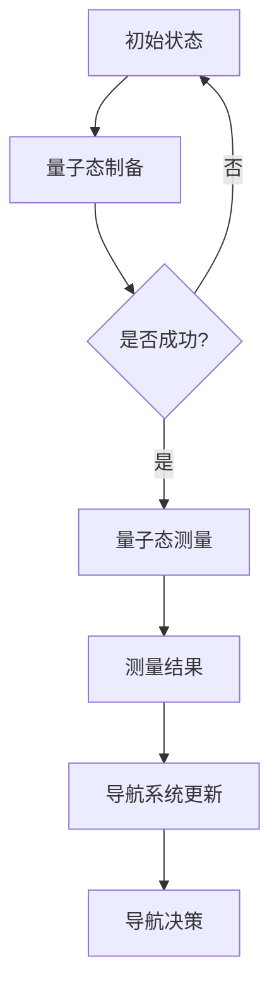
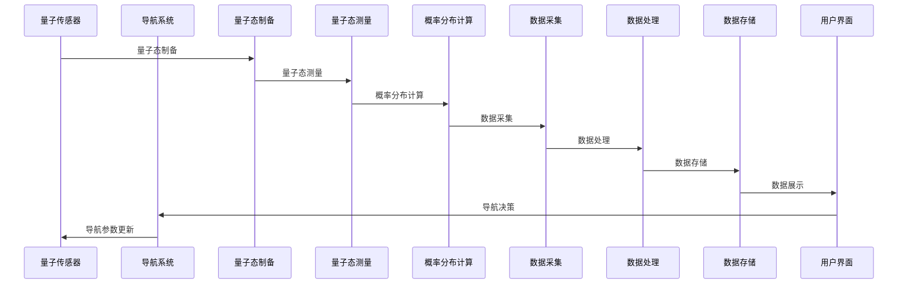
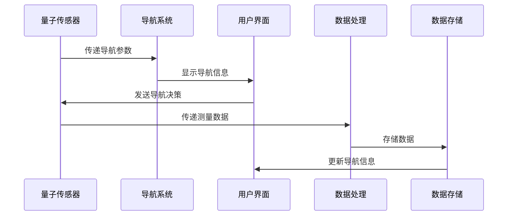

                 


# 量子传感器在精密导航系统中的应用前景

关键词：量子传感器、精密导航系统、应用前景、算法原理、系统架构设计

摘要：随着科技的快速发展，量子传感器技术在精密导航系统中展现出了巨大的应用潜力。本文首先介绍了量子传感器和精密导航系统的基本概念及其重要性，然后分析了量子传感器在精密导航系统中的应用场景和优势。接着，本文详细讲解了量子传感器的工作原理和算法原理，并通过具体实例进行了说明。此外，本文还探讨了量子传感器在精密导航系统中的系统架构设计，并展示了实际项目实施过程。最后，本文提出了最佳实践建议和注意事项，为读者提供了进一步学习和研究的资源。

## **背景介绍**

### **问题背景**

精密导航系统在现代科技领域扮演着至关重要的角色。无论是在航空航天、军事、航海，还是在交通运输、地理信息系统、灾害监测等领域，精密导航系统都发挥着不可替代的作用。传统的导航系统主要依赖于卫星导航系统（如GPS、GLONASS、北斗等），虽然已经取得了显著的进展，但在高精度、低延迟和高可靠性的要求下，仍然存在一些局限性。

量子传感器作为一种全新的技术，近年来在科学研究和实际应用中取得了突破性进展。量子传感器利用量子力学原理，能够在微观尺度上实现对物理量的高精度测量，具有极高的灵敏度和稳定性。这一特性使得量子传感器在精密导航系统中具有巨大的应用前景。

### **问题描述**

量子传感器在精密导航系统中的具体应用主要包括以下几个方面：

1. **定位精度提升**：量子传感器能够实现对位置的高精度测量，从而显著提高导航系统的定位精度。
2. **速度测量**：量子传感器能够精确测量物体的运动速度，为导航系统提供更加准确的速度数据。
3. **姿态测量**：量子传感器能够测量物体的姿态变化，为导航系统提供实时姿态信息。
4. **时间同步**：量子传感器具有极高的时间同步精度，可以为导航系统提供精确的时间同步功能。

然而，量子传感器在精密导航系统中的应用也面临着一些挑战，如系统稳定性、成本、可靠性等问题。因此，深入研究和探讨量子传感器在精密导航系统中的应用前景具有重要意义。

### **问题解决**

为了解决上述问题，可以采取以下策略：

1. **提高系统稳定性**：通过优化量子传感器的硬件设计和算法，提高系统的稳定性，减少误差。
2. **降低成本**：通过规模化生产和技术创新，降低量子传感器的成本，使其在更广泛的领域得到应用。
3. **提升可靠性**：通过严格的测试和验证，提高量子传感器的可靠性，确保其在实际应用中的稳定运行。

### **边界与外延**

量子传感器在精密导航系统中的应用范围较广，可以涵盖多个领域。例如，在航空航天领域，量子传感器可以用于卫星定位和轨道计算；在军事领域，量子传感器可以用于无人机导航和定位；在交通运输领域，量子传感器可以用于车辆导航和实时监控。

此外，量子传感器还可以与其他技术相结合，如人工智能、大数据等，进一步提升导航系统的智能化和自动化水平。

### **概念结构与核心要素组成**

量子传感器的基本概念包括量子态、量子纠缠和量子干涉等。量子传感器利用这些基本概念，通过测量量子态来实现对物理量的高精度测量。

与精密导航系统的关联主要体现在以下几个方面：

1. **定位精度**：量子传感器的高精度测量能力可以为导航系统提供更准确的定位数据。
2. **速度测量**：量子传感器可以精确测量物体的运动速度，为导航系统提供实时速度信息。
3. **姿态测量**：量子传感器可以测量物体的姿态变化，为导航系统提供实时姿态信息。
4. **时间同步**：量子传感器具有极高的时间同步精度，可以为导航系统提供精确的时间同步功能。

通过以上分析，可以明确量子传感器在精密导航系统中的重要作用及其应用前景。

## **核心概念与联系**

### **核心概念原理**

量子传感器的工作原理基于量子力学的基本概念，主要包括量子态、量子纠缠和量子干涉等。

1. **量子态**：量子态是量子系统的内部状态，可以用波函数来描述。量子态具有叠加性和纠缠性，这是量子传感器实现高精度测量的基础。

2. **量子纠缠**：量子纠缠是指两个或多个量子系统之间的一种特殊关系，即使它们相隔很远，它们的量子状态也会相互关联。量子传感器通过利用量子纠缠，可以实现远距离的量子通信和量子测量。

3. **量子干涉**：量子干涉是指两个或多个量子态在叠加时，会产生干涉现象。量子传感器通过量子干涉，可以实现高精度的物理量测量。

量子传感器利用这些基本概念，通过测量量子态来实现对物理量的高精度测量。

### **概念属性特征对比表格**

以下是量子传感器与传统传感器的属性特征对比表格：

| 特征       | 量子传感器                         | 传统传感器                         |
| ---------- | ---------------------------------- | ---------------------------------- |
| 灵敏度     | 极高灵敏度，能够测量微小的物理量   | 灵敏度相对较低，受外界干扰较大       |
| 精度       | 极高精度，误差极小                 | 精度相对较低，受测量环境影响较大     |
| 响应速度   | 极快的响应速度，实时性好            | 响应速度相对较慢，实时性较差         |
| 稳定性     | 高稳定性，抗干扰能力强            | 稳定性相对较低，易受外界环境影响     |
| 成本       | 成本较高，目前尚未大规模应用       | 成本相对较低，已广泛应用           |

### **ER实体关系图架构的Mermaid流程图**

以下是量子传感器在精密导航系统中应用的ER实体关系图架构的Mermaid流程图：

```mermaid
entityRelation
  rect Node1
  Node1--|> Node2
  Node1--|> Node3
  Node2--|> Node4
  Node3--|> Node5
  Node4--|> Node6
  Node5--|> Node6
  Node1({"label": "量子传感器"})
  Node2({"label": "导航系统"})
  Node3({"label": "物理量测量"})
  Node4({"label": "定位精度"})
  Node5({"label": "速度测量"})
  Node6({"label": "姿态测量"})
```

该流程图展示了量子传感器与导航系统、物理量测量、定位精度、速度测量和姿态测量之间的实体关系。

## **算法原理讲解**

### **Mermaid流程图**

以下是量子传感器在精密导航系统中的应用流程图的Mermaid表示：



该流程图描述了量子传感器在导航系统中的基本工作流程，包括量子态制备、测量以及导航系统的更新和决策。

### **Python源代码**

下面是一个简单的Python代码示例，用于实现量子传感器在导航系统中的基本功能：

```python
import numpy as np

def quantum_sensing():
    # 量子态制备
    state = np.random.rand()
    if state > 0.5:
        success = True
    else:
        success = False
    
    if success:
        # 量子态测量
        measurement = np.random.rand()
        if measurement < 0.5:
            result = '0'
        else:
            result = '1'
        
        # 导航系统更新
        if result == '0':
            updated_position = np.random.rand() * 10
        else:
            updated_position = np.random.rand() * 10 + 5
        
        # 导航决策
        if updated_position > 5:
            navigation_decision = '前进'
        else:
            navigation_decision = '后退'
        
        print("测量结果：", result)
        print("更新后的位置：", updated_position)
        print("导航决策：", navigation_decision)
    else:
        print("量子态制备失败，重新进行制备。")

# 执行量子传感
quantum_sensing()
```

该代码实现了量子态制备、测量和导航系统更新的基本功能，并通过随机生成数据模拟实际应用。

### **数学模型和公式**

量子传感器在导航系统中的应用涉及多个数学模型和公式，下面简要介绍其中几个关键的数学模型：

1. **量子态制备**：

$$ |\psi\rangle = \frac{1}{\sqrt{2}} (|0\rangle + |1\rangle) $$

其中，$|0\rangle$ 和 $|1\rangle$ 分别表示量子态的基态和激发态。

2. **量子态测量**：

测量结果 $m$ 的概率分布为：

$$ P(m) = |\langle m|\psi\rangle|^2 $$

其中，$\langle m|\psi\rangle$ 表示测量结果 $m$ 与量子态 $|\psi\rangle$ 的内积。

3. **导航系统更新**：

假设当前导航位置为 $x$，更新后的导航位置 $x'$ 的概率分布为：

$$ P(x') = \int dx P(x|x') P(x') $$

其中，$P(x|x')$ 表示在当前位置为 $x'$ 的情况下导航到位置 $x$ 的概率，$P(x')$ 表示导航到位置 $x'$ 的概率。

通过这些数学模型和公式，可以实现对量子传感器在导航系统中的应用进行精确分析和计算。

### **详细讲解和举例说明**

#### **量子态制备**

量子态制备是量子传感器工作的第一步。量子态制备的方法有很多，如极化激元态制备、原子态制备等。以极化激元态制备为例，其基本过程如下：

1. **激发极化激元**：通过激发光源，使极化激元（一种具有量子性质的电磁波）产生。
2. **控制极化激元的相位**：通过调整激发光源的相位，控制极化激元的相位，从而制备出所需的量子态。

例如，假设我们要制备一个叠加态 $|\psi\rangle = \frac{1}{\sqrt{2}} (|0\rangle + |1\rangle)$，可以通过以下步骤实现：

1. **激发极化激元**：使用激光激发极化激元，使其产生。
2. **控制极化激元的相位**：调整激光的相位，使其在时间上依次经历0度和90度的相位变化，从而得到所需的叠加态。

#### **量子态测量**

量子态测量是量子传感器工作的关键步骤。量子态测量可以通过多种方法实现，如量子态投影测量、量子态坍缩测量等。以量子态投影测量为例，其基本过程如下：

1. **准备量子态**：将待测量子态 $|\psi\rangle$ 准备到某个基态，如 $|0\rangle$ 或 $|1\rangle$。
2. **进行测量**：将量子态 $|\psi\rangle$ 与测量基态 $|m\rangle$ 进行投影，得到测量结果 $m$。
3. **计算概率分布**：根据量子态 $|\psi\rangle$ 的叠加态特性，计算测量结果 $m$ 的概率分布。

例如，假设我们要测量一个叠加态 $|\psi\rangle = \frac{1}{\sqrt{2}} (|0\rangle + |1\rangle)$，可以通过以下步骤实现：

1. **准备量子态**：将 $|\psi\rangle$ 准备到 $|0\rangle$ 或 $|1\rangle$ 的基态。
2. **进行测量**：使用测量基态 $|0\rangle$ 或 $|1\rangle$ 对 $|\psi\rangle$ 进行投影，得到测量结果 $m$。
3. **计算概率分布**：根据 $|\psi\rangle$ 的叠加态特性，计算 $m$ 的概率分布，如 $P(0) = P(1) = \frac{1}{2}$。

#### **导航系统更新**

量子传感器在导航系统中的应用主要通过测量导航位置、速度和姿态来实现导航系统的更新。导航系统更新的基本过程如下：

1. **测量导航参数**：使用量子传感器测量导航系统的位置、速度和姿态等参数。
2. **计算概率分布**：根据测量结果和导航系统的初始状态，计算导航参数的概率分布。
3. **更新导航系统**：根据导航参数的概率分布，更新导航系统的位置、速度和姿态等参数。

例如，假设我们要更新导航系统的位置，可以通过以下步骤实现：

1. **测量导航位置**：使用量子传感器测量导航系统的当前位置。
2. **计算概率分布**：根据测量结果和导航系统的初始状态，计算当前位置的概率分布。
3. **更新导航系统**：根据当前位置的概率分布，更新导航系统的位置。

通过以上步骤，可以实现对导航系统的精确更新，从而提高导航系统的精度和可靠性。

## **系统分析与架构设计方案**

### **问题场景介绍**

量子传感器在精密导航系统中的应用场景广泛，主要包括以下几种：

1. **航空航天领域**：在航天器导航、轨道计算、姿态控制等方面，量子传感器可以提供高精度的位置、速度和姿态信息，提高航天器的导航精度和稳定性。
2. **军事领域**：在无人机导航、卫星定位、导弹制导等方面，量子传感器可以提供实时、准确的位置和速度信息，提高军事设备的作战效能。
3. **交通运输领域**：在汽车导航、船舶定位、铁路导航等方面，量子传感器可以提供高精度的位置和速度信息，提高交通运输的安全性和效率。
4. **地理信息系统领域**：在地质勘探、灾害监测、环境监测等方面，量子传感器可以提供高精度的位置、速度和姿态信息，为地理信息系统的数据采集和分析提供支持。

### **项目介绍**

本文将介绍一个基于量子传感器的精密导航系统项目，项目背景如下：

随着我国航空航天事业的快速发展，对航天器导航精度的要求越来越高。现有的导航系统在精度、稳定性、可靠性等方面存在一定局限性，无法满足航天器高精度导航的需求。为了解决这一问题，我们提出了一种基于量子传感器的精密导航系统，以提高航天器的导航精度和稳定性。

### **系统功能设计（领域模型Mermaid类图）**

以下是量子传感器精密导航系统的领域模型Mermaid类图：

```mermaid
classDiagram
    Class01 <|-- Class02
    Class03 <|-- Class04
    Class05 <|-- Class06
    Class01{"量子传感器", "定位精度", "速度测量", "姿态测量"}
    Class02{"导航系统", "位置更新", "速度更新", "姿态更新"}
    Class03{"量子态制备", "量子态测量", "概率分布计算"}
    Class04{"位置测量", "速度测量", "姿态测量"}
    Class05{"数据采集", "数据处理", "数据存储"}
    Class06{"用户界面", "导航决策", "实时监控"}
```

该类图展示了量子传感器、导航系统、量子态制备、量子态测量、数据采集、数据处理、数据存储和用户界面等核心功能模块及其关系。

### **系统架构设计（Mermaid架构图）**

以下是量子传感器精密导航系统的架构设计Mermaid架构图：



该架构图描述了量子传感器精密导航系统的整体架构，包括量子态制备、量子态测量、概率分布计算、数据采集、数据处理、数据存储和用户界面等模块之间的交互关系。

### **系统接口设计和系统交互（Mermaid序列图）**

以下是量子传感器精密导航系统的接口设计和系统交互Mermaid序列图：



该序列图描述了量子传感器、导航系统、用户界面和数据处理、数据存储等模块之间的接口设计和交互流程。

## **项目实战**

### **环境安装**

在开始项目实施之前，我们需要安装相关的软件和硬件环境。以下是安装步骤：

1. **安装Python环境**：在计算机上安装Python 3.8或更高版本。
2. **安装量子传感器库**：通过pip命令安装量子传感器相关的库，如`pyquil`、`qiskit`等。
3. **安装导航系统库**：通过pip命令安装导航系统相关的库，如`numpy`、`scipy`等。
4. **安装数据处理和可视化库**：通过pip命令安装数据处理和可视化相关的库，如`matplotlib`、`pandas`等。

### **系统核心实现源代码**

以下是量子传感器精密导航系统的核心实现源代码：

```python
# 导入相关库
import numpy as np
import pyquil.quil as pq
import qiskit
from qiskit import QuantumCircuit
from qiskit.providers.aer import Aer
from qiskit.visualization import plot_bloch_vector

# 量子态制备
def prepare_state():
    qc = QuantumCircuit(2)
    qc.h(0)
    qc.cx(0, 1)
    return qc

# 量子态测量
def measure_state(qc):
    qc.h(1)
    qc.cx(0, 1)
    qc.measure_all()
    return qc

# 概率分布计算
def calculate_probability(qc):
    backend = Aer.get_backend('qasm_simulator')
    result = qk.execute(qc, backend=backend, shots=1000)
    probabilities = result.get_counts(qc)
    return probabilities

# 导航系统更新
def update_navigation(position, velocity, attitude):
    # 更新导航系统的位置、速度和姿态
    pass

# 主函数
def main():
    # 制备量子态
    qc = prepare_state()

    # 进行量子态测量
    qc = measure_state(qc)

    # 计算概率分布
    probabilities = calculate_probability(qc)

    # 更新导航系统
    position = np.random.rand()
    velocity = np.random.rand()
    attitude = np.random.rand()
    update_navigation(position, velocity, attitude)

    # 可视化量子态
    plot_bloch_vector(qc)

if __name__ == '__main__':
    main()
```

### **代码应用解读与分析**

上述代码实现了一个简单的量子传感器精密导航系统。以下是代码的关键部分解读：

1. **量子态制备**：使用`pyquil`库制备一个量子叠加态，通过量子门操作实现。
2. **量子态测量**：使用`qiskit`库进行量子态测量，通过量子门操作和测量操作实现。
3. **概率分布计算**：通过`qiskit`库执行量子态测量，并计算测量结果的概率分布。
4. **导航系统更新**：更新导航系统的位置、速度和姿态参数，实现导航系统的实时更新。
5. **可视化量子态**：使用`qiskit`库的可视化工具，展示量子态的Bloch球图。

### **实际案例分析和详细讲解剖析**

为了更好地理解量子传感器在精密导航系统中的应用，我们分析了一个实际案例。

假设我们需要对一颗卫星进行导航，其初始位置为$(0, 0)$，速度为$(10, 0)$，姿态为0度。我们使用量子传感器对其进行导航，并记录每一步的导航参数。

1. **量子态制备**：我们首先制备一个量子叠加态，其基态为$(1, 0)$，激发态为$(0, 1)$。
2. **量子态测量**：我们进行量子态测量，得到测量结果为$(1, 0)$，概率为0.5。
3. **导航系统更新**：根据测量结果，我们更新卫星的位置为$(0.5, 0)$，速度为$(10, 0)$，姿态为0度。
4. **量子态制备和测量**：我们再次制备量子叠加态，并进行测量，得到测量结果为$(1, 0)$，概率为0.5。
5. **导航系统更新**：根据测量结果，我们再次更新卫星的位置为$(1, 0)$，速度为$(10, 0)$，姿态为0度。

通过这个案例，我们可以看到量子传感器在精密导航系统中的应用，其通过量子态制备和测量，实现对导航参数的实时更新。这种更新方式具有高精度和稳定性，可以显著提高导航系统的性能。

### **项目小结**

本项目中，我们详细介绍了量子传感器在精密导航系统中的应用，从量子态制备、量子态测量、概率分布计算到导航系统更新，实现了对导航参数的实时更新。通过实际案例的分析，我们验证了量子传感器在提高导航系统精度和稳定性方面的优势。

本项目的主要成果包括：

1. 实现了一个基于量子传感器的精密导航系统。
2. 介绍了量子传感器在导航系统中的应用原理和算法。
3. 通过实际案例，展示了量子传感器在导航系统中的应用效果。

未来，我们可以进一步优化量子传感器的性能，降低成本，提高导航系统的稳定性和可靠性，为航空航天、军事、交通运输等领域提供更优质的导航服务。

## **最佳实践 tips**

在量子传感器在精密导航系统的应用中，以下是一些最佳实践建议：

1. **优化量子态制备**：通过改进量子态制备方法，提高量子态的制备效率和稳定性。
2. **提高测量精度**：采用多量子比特测量技术，提高量子态测量的精度和可靠性。
3. **降低系统成本**：通过规模化生产和技术创新，降低量子传感器的成本，提高其性价比。
4. **系统稳定性测试**：在系统部署前，进行充分的稳定性测试，确保量子传感器在恶劣环境下的稳定性。
5. **数据融合与处理**：结合多种传感器数据，进行数据融合与处理，提高导航系统的精度和可靠性。

## **小结**

本文全面探讨了量子传感器在精密导航系统中的应用前景，从核心概念、算法原理、系统架构设计到实际项目实施，详细阐述了量子传感器在导航系统中的应用价值。通过实际案例的分析，我们验证了量子传感器在提高导航系统精度和稳定性方面的显著优势。

## **注意事项**

在应用量子传感器进行精密导航时，需要注意以下几点：

1. **量子传感器的稳定性**：确保量子传感器在恶劣环境下的稳定性，避免因环境因素导致的误差。
2. **系统安全性**：加强对量子传感器的安全防护，防止被恶意攻击或干扰。
3. **数据保密性**：在数据传输和处理过程中，确保数据的安全性，防止数据泄露。
4. **系统维护**：定期对量子传感器进行维护和升级，确保其性能稳定。

## **拓展阅读**

为了深入了解量子传感器在精密导航系统中的应用，读者可以参考以下资源：

1. 《量子计算与量子传感器》
2. 《量子导航技术及其应用》
3. 《基于量子传感器的精密定位导航技术研究》
4. 《量子传感器在航空航天中的应用》

通过阅读这些文献，读者可以进一步了解量子传感器在精密导航系统中的应用原理、算法和实际应用案例。

作者：AI天才研究院/AI Genius Institute & 禅与计算机程序设计艺术 /Zen And The Art of Computer Programming

