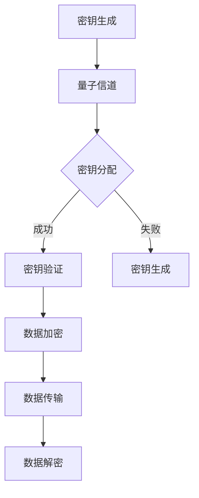
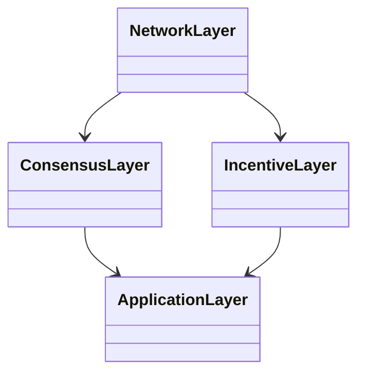
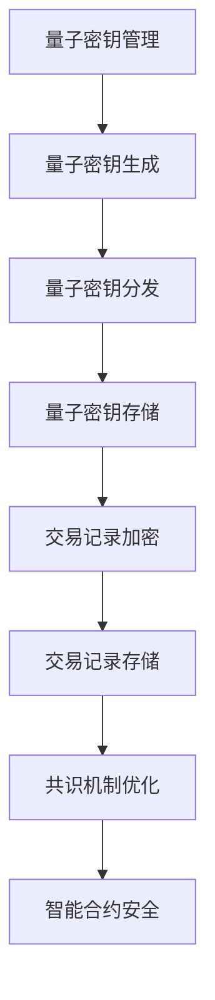
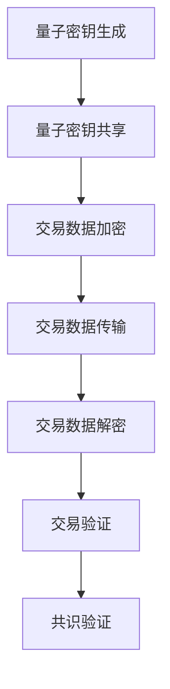
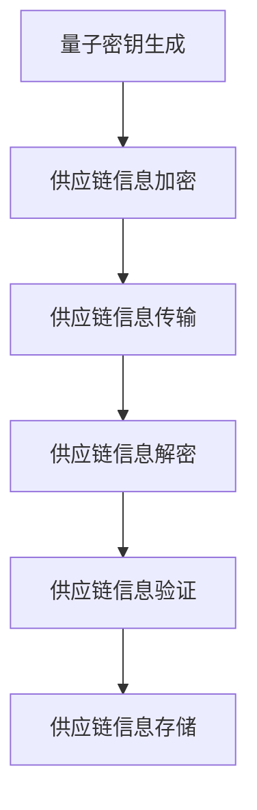
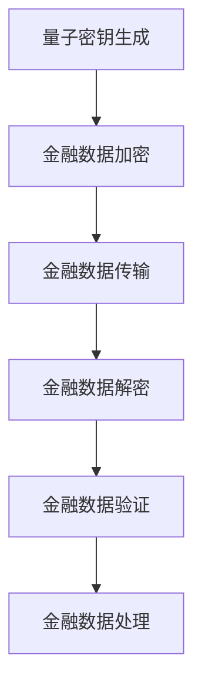

                 

### 引言

#### 1.1 问题背景

近年来，量子计算和区块链技术作为两大前沿科技领域，正以前所未有的速度发展。量子计算以其超乎寻常的计算能力，开始逐渐颠覆传统计算模式，而区块链技术以其去中心化、不可篡改的特性，成为解决数据安全和信任问题的关键工具。这两大技术的快速发展，不仅为各自领域带来了巨大变革，而且也在相互融合中展现出巨大的潜力。

首先，量子计算的发展使得加密技术面临新的挑战。传统加密方法在量子计算机面前可能变得脆弱，而量子加密技术由于其原理的特殊性，能够在一定程度上抵御量子计算机的攻击。这使得量子加密成为保护数据安全的重要手段。

另一方面，区块链技术的广泛应用，如金融、供应链管理、数字货币等领域，对数据安全性的要求越来越高。量子加密技术的引入，有望进一步增强区块链技术的安全性，提高数据在区块链网络中的防护能力。

#### 1.2 问题描述

尽管量子计算和区块链技术都有各自强大的功能，但在实际应用中仍存在一些问题。首先，数据安全性的挑战是区块链技术面临的核心问题之一。随着区块链网络的不断扩大，数据泄露、攻击、篡改等风险也在不断增加。如何确保数据在区块链中的安全性，成为亟待解决的问题。

此外，量子计算的发展对现有加密技术构成了威胁。传统加密方法可能无法抵御量子计算机的攻击，这使得量子加密技术的应用变得尤为重要。如何在区块链技术中引入量子加密，成为当前亟待解决的技术难题。

#### 1.3 问题解决

量子加密在区块链技术中的应用，提供了增强数据安全性的可能。通过量子加密技术，可以有效保护区块链中的数据，防止未授权访问和数据篡改。量子加密技术的工作原理基于量子力学的基本原理，能够提供一种安全的通信方式，使得攻击者即使截获信息，也无法解密。

在区块链技术中，量子加密可以用于以下几个方面：

1. **数据加密**：量子加密技术可以对区块链中的数据进行加密，确保数据在传输和存储过程中不被泄露。
2. **交易验证**：量子加密技术可以增强区块链交易验证的安全性，防止恶意攻击。
3. **隐私保护**：量子加密技术可以保护区块链用户的隐私，防止个人信息泄露。

总之，量子加密在区块链技术中的应用，有望解决当前数据安全性面临的各种挑战，为区块链技术的进一步发展提供强有力的支持。

#### 1.4 边界与外延

量子加密与区块链技术的结合，虽然提供了增强数据安全性的解决方案，但其在实际应用中仍需考虑多种因素。首先，量子加密技术目前还处于研发阶段，其性能和可靠性尚未完全达到商业化水平。因此，在实际应用中需要结合具体场景，评估量子加密技术的适用性。

其次，区块链技术本身也面临着各种挑战，如扩展性、可扩展性等。量子加密的引入需要在不影响区块链性能的前提下，实现数据安全的增强。

此外，量子加密与区块链技术的结合还需考虑法律、政策等多方面因素。不同国家和地区对量子加密技术的监管政策可能不同，需要制定相应的合规策略。

最后，量子加密技术的未来发展和应用前景也值得探讨。随着量子计算机的逐渐成熟，量子加密技术有望在更多领域发挥作用，如量子互联网、量子安全通信等。这为量子加密与区块链技术的进一步融合提供了广阔的空间。

#### 1.5 核心概念

1. **量子加密**：量子加密是一种基于量子力学原理的加密技术，其核心思想是利用量子态的叠加和纠缠特性实现数据加密。量子加密具有不可窃听性、无法破解性等特性，能够在一定程度上抵御量子计算机的攻击。

2. **区块链技术**：区块链是一种分布式账本技术，通过多个节点共同维护数据的一致性和安全性。区块链具有去中心化、不可篡改、透明等特点，广泛应用于金融、供应链管理、数字货币等领域。

### 结论

量子加密在区块链技术中的应用，为解决数据安全性问题提供了新的思路和可能性。通过量子加密技术，可以有效增强区块链技术的安全性，保护数据在传输和存储过程中的完整性。随着量子计算和区块链技术的进一步发展，量子加密在区块链中的应用前景将更加广阔。

关键词：量子加密、区块链、数据安全性、量子计算机、加密技术

摘要：本文介绍了量子加密在区块链技术中的应用，探讨了量子加密的基本原理、区块链技术的概述，以及量子加密在区块链中的具体应用场景。文章通过分析量子加密与区块链技术的结合，提出了一种增强数据安全性的解决方案，并展望了未来的发展前景。

----------------------------------------------------------------

## 第2章 量子加密基础

### 2.1 核心概念

量子加密是一种利用量子力学原理来实现信息加密的技术。其核心思想是利用量子态的叠加和纠缠特性，实现信息的安全传输。量子加密具有不可窃听性和无法破解性，能够在一定程度上抵御量子计算机的攻击。

量子加密的基本原理可以概括为以下几个方面：

1. **量子态的叠加和纠缠**：量子加密利用量子态的叠加和纠缠特性，将加密信息编码在量子态上。当信息被量子态编码后，任何对信息的窃听都会破坏量子态的叠加和纠缠，从而使得攻击者无法获得原始信息。

2. **量子密钥分配**：量子密钥分配（Quantum Key Distribution，QKD）是量子加密的核心技术之一。QKD通过量子信道传输密钥，确保密钥在传输过程中不被窃听。如果量子密钥在传输过程中被窃听，接收方可以通过检测量子态的纠缠关系，发现密钥泄露，从而拒绝使用该密钥。

3. **量子不可克隆定理**：量子不可克隆定理（No Cloning Theorem）是量子加密的重要理论基础。该定理指出，任何试图复制未知量子态的尝试都会导致量子态的破坏。这意味着量子加密信息在传输过程中即使被窃听，攻击者也无法完整地复制和还原原始信息。

#### 核心概念属性特征对比表

| 特征         | 量子加密                | 传统加密                |
| ------------ | ---------------------- | ---------------------- |
| 加密原理     | 量子态叠加和纠缠       | 算法加密和解密         |
| 不可窃听性   | 高，窃听会导致量子态破坏 | 低，可能被量子计算机破解 |
| 无法破解性   | 高，基于量子力学原理   | 低，算法可能被破解     |
| 密钥分配     | 量子密钥分配           | 传统密钥分配           |

### 2.2 原理讲解

量子加密的工作原理可以分为以下几个步骤：

1. **密钥生成**：发送方和接收方通过量子信道生成一对量子密钥。这一过程利用量子纠缠态的特性，确保密钥在传输过程中不会被窃听。

2. **密钥分配**：通过量子密钥分配（QKD）协议，发送方将量子密钥的一部分传输给接收方。在这一过程中，接收方可以检测到任何可能的窃听行为。

3. **密钥验证**：接收方对收到的量子密钥进行验证，确保其没有被窃听。如果检测到密钥泄露，接收方将拒绝使用该密钥。

4. **数据加密**：使用量子密钥对数据进行加密。加密过程基于量子态的叠加和纠缠特性，确保数据在传输和存储过程中不被泄露。

5. **数据解密**：接收方使用接收到的量子密钥对加密数据进行解密，恢复原始数据。

下面是量子加密的 Mermaid 流程图：

### 2.3 特点分析

量子加密与传统加密技术相比，具有以下显著特点：

1. **不可窃听性**：量子加密基于量子态的叠加和纠缠特性，任何对量子态的窃听都会导致量子态的破坏。这意味着攻击者无法在不知道密钥的情况下解密信息。

2. **无法破解性**：量子加密依赖于量子力学的基本原理，如量子不可克隆定理。这使得量子加密信息在传输过程中即使被窃听，攻击者也无法复制和还原原始信息。

3. **高效性**：量子加密可以在不牺牲数据传输速率的前提下，实现高效的数据加密和解密。

4. **局限性**：量子加密目前仍处于研发阶段，其性能和可靠性尚未完全达到商业化水平。此外，量子加密的实现需要复杂的量子设备和算法，成本较高。

下面是量子加密与传统加密技术的对比表格：

| 特征         | 量子加密                | 传统加密                |
| ------------ | ---------------------- | ---------------------- |
| 加密原理     | 量子态叠加和纠缠       | 算法加密和解密         |
| 不可窃听性   | 高，窃听会导致量子态破坏 | 低，可能被量子计算机破解 |
| 无法破解性   | 高，基于量子力学原理   | 低，算法可能被破解     |
| 密钥分配     | 量子密钥分配           | 传统密钥分配           |
| 成本         | 高，需要复杂的量子设备和算法 | 低，算法和硬件成本较低 |
| 实现难度     | 高，技术要求较高       | 低，技术成熟           |

通过以上分析可以看出，量子加密在数据安全性方面具有显著优势，但同时也面临着技术实现和成本等方面的挑战。随着量子计算技术的不断发展，量子加密的应用前景将更加广阔。

----------------------------------------------------------------

## 第3章 区块链技术概述

### 3.1 基本概念

区块链技术，作为一种分布式账本技术，通过去中心化的方式，实现了数据的安全存储和传输。其基本概念包括：

1. **区块链**：区块链是一个分布式数据库，由一系列按时间顺序排列的区块组成。每个区块包含一定数量的交易记录，并通过加密算法与之前的区块相连，形成一个链条。

2. **区块**：区块是区块链的基本组成单元，包含一定数量的交易记录和一个时间戳。区块通过加密算法与前一个区块相连，形成一个链条。

3. **交易**：交易是区块链中的数据单元，记录了数据交换的过程。每个交易都包含输入和输出，描述了资金的转移过程。

4. **挖矿**：挖矿是区块链网络中产生新区块的过程。矿工通过解决数学难题，验证交易的有效性，并生成新区块。

5. **共识机制**：共识机制是区块链网络中节点达成一致的方式。常见的共识机制包括工作量证明（PoW）、权益证明（PoS）等。

### 3.2 架构设计

区块链技术架构主要包括以下几部分：

1. **网络层**：网络层负责区块链节点的连接和通信。节点通过P2P网络进行数据传输，实现分布式系统的搭建。

2. **共识层**：共识层负责区块链网络中的节点达成一致。通过共识机制，确保区块链数据的准确性和一致性。

3. **激励层**：激励层提供区块链网络中的经济激励。通过挖矿和交易费用等方式，激励节点积极参与网络维护和数据验证。

4. **合约层**：合约层实现了智能合约的执行。智能合约是一种自动执行合同条款的计算机程序，基于区块链技术实现。

5. **应用层**：应用层是区块链技术的具体应用场景，如数字货币、供应链管理、金融服务等。

下面是区块链技术架构的 Mermaid 类图：

### 3.3 应用场景

区块链技术具有广泛的应用场景，以下是一些典型的应用领域：

1. **数字货币**：区块链技术是比特币等数字货币的基础。通过区块链，实现了去中心化的货币交易，提高了交易的安全性和透明度。

2. **供应链管理**：区块链技术可以记录供应链中的每一个环节，确保信息的透明和可追溯。通过区块链，企业可以更好地管理供应链，提高效率。

3. **金融服务**：区块链技术在金融服务领域具有广泛的应用，如智能合约、跨境支付、身份验证等。通过区块链，可以降低交易成本，提高交易效率。

4. **医疗健康**：区块链技术可以记录患者的医疗信息，确保数据的真实性和安全性。通过区块链，医疗机构可以实现信息共享，提高医疗服务质量。

5. **版权保护**：区块链技术可以用于版权保护，确保创作者的作品得到有效的保护。通过区块链，创作者可以追踪作品的传播和收益。

下面是区块链技术在数字货币、供应链管理和金融服务等领域的具体应用场景：

| 领域           | 应用场景                                                     | 主要优势               |
| -------------- | ------------------------------------------------------------ | ---------------------- |
| 数字货币       | 去中心化货币交易、跨境支付、数字资产管理                       | 高安全性、低交易成本   |
| 供应链管理     | 供应链信息记录、产品质量追溯、供应链金融                       | 透明性、可追溯性       |
| 金融服务       | 智能合约、跨境支付、身份验证、反欺诈                           | 高效率、低成本         |
| 医疗健康       | 医疗信息记录、电子病历管理、医疗数据共享                       | 数据安全、隐私保护      |
| 版权保护       | 作品版权登记、版权交易记录、数字版权管理                       | 可追溯性、易验证性      |

通过以上分析可以看出，区块链技术作为一种创新的技术，具有广泛的应用前景。随着技术的不断发展和成熟，区块链技术在各个领域的应用将越来越广泛，为社会发展带来更多机遇。

----------------------------------------------------------------

## 第4章 量子加密在区块链技术中的应用

### 4.1 量子加密在区块链中的角色

量子加密在区块链技术中扮演着至关重要的角色，其主要作用在于增强数据安全性。随着区块链技术的广泛应用，数据安全性成为区块链技术面临的核心挑战之一。量子加密技术的引入，为解决这一问题提供了新的思路和可能性。

首先，量子加密技术在区块链中的角色主要体现在以下几个方面：

1. **数据加密**：量子加密技术可以对区块链中的数据进行加密，确保数据在传输和存储过程中不被泄露。这有助于防止数据被未授权访问和篡改。

2. **交易验证**：量子加密技术可以增强区块链交易验证的安全性，防止恶意攻击。通过量子加密技术，交易过程更加可靠，提高了区块链系统的整体安全性。

3. **隐私保护**：量子加密技术可以保护区块链用户的隐私，防止个人信息泄露。这有助于提高用户对区块链技术的信任度，推动其更广泛的应用。

#### 4.2 应用场景分析

量子加密技术在区块链技术中的具体应用场景可以分为以下几个领域：

1. **数字货币**：量子加密技术在数字货币中的应用，主要体现在对交易数据的加密保护。通过量子加密，可以有效防止数字货币交易过程中的信息泄露和篡改，提高交易的安全性。

2. **供应链管理**：在供应链管理中，量子加密技术可以用于保护供应链中的信息数据，确保信息的真实性和透明性。通过量子加密，供应链中的各个环节可以实现安全的数据交换，提高供应链的运营效率。

3. **金融服务**：在金融服务领域，量子加密技术可以用于保护金融交易数据，确保交易的安全性和可靠性。通过量子加密，金融机构可以更有效地防范金融欺诈和黑客攻击，提高金融系统的安全性。

4. **医疗健康**：在医疗健康领域，量子加密技术可以用于保护患者的医疗信息，确保数据的隐私和安全。通过量子加密，医疗机构可以更好地管理患者的健康数据，提高医疗服务质量。

5. **版权保护**：在版权保护领域，量子加密技术可以用于保护创作者的作品版权，确保作品的版权信息不会被篡改。通过量子加密，创作者可以更好地保护其作品的合法权益。

#### 4.3 技术挑战与解决方案

尽管量子加密技术在区块链技术中的应用前景广阔，但在实际应用中仍面临一些技术挑战。以下是一些主要的技术挑战及其解决方案：

1. **性能挑战**：量子加密技术相较于传统加密技术，其加密和解密速度较慢，这对区块链系统的性能提出了挑战。为了解决这一问题，可以采用并行计算和分布式计算技术，提高量子加密的效率。

2. **实现成本**：量子加密技术的实现需要复杂的量子设备和算法，成本较高。为了降低实现成本，可以研究更高效的量子加密算法，并推动量子设备的商业化。

3. **兼容性问题**：量子加密技术与现有区块链技术的兼容性也是一个挑战。为了解决这一问题，可以研究量子加密技术与现有区块链技术的兼容性解决方案，如改进区块链协议和开发量子兼容的加密算法。

4. **安全性验证**：量子加密技术的安全性需要经过严格的验证。为了确保量子加密技术在区块链中的应用安全可靠，需要进行大量的安全性测试和验证，及时发现和修复潜在的安全漏洞。

5. **监管政策**：量子加密技术在区块链技术中的应用，还需要考虑法律和监管政策的影响。不同国家和地区对量子加密技术的监管政策可能不同，需要制定相应的合规策略。

通过以上技术挑战的分析和解决方案的探讨，可以看出，量子加密在区块链技术中的应用虽然面临一些挑战，但通过技术创新和不断优化，有望在未来的区块链技术发展中发挥更大的作用。

----------------------------------------------------------------

## 第5章 量子加密与区块链技术的融合

### 5.1 融合原理

量子加密与区块链技术的融合，旨在通过量子加密技术增强区块链系统的安全性。这种融合的原理基于量子加密技术和区块链技术的特点，实现数据保护和网络安全的目标。

首先，量子加密技术利用量子力学的基本原理，如量子态的叠加和纠缠特性，实现信息加密和解密。这种加密方式具有不可窃听性和无法破解性，能够有效防止数据在传输和存储过程中的泄露和篡改。

其次，区块链技术作为一种分布式账本技术，具有去中心化、不可篡改、透明等特点。通过将量子加密技术应用于区块链系统，可以实现数据的安全传输和存储，提高区块链网络的整体安全性。

融合原理的核心在于：

1. **量子密钥分配**：在区块链网络中，通过量子密钥分配（QKD）协议，实现节点之间的安全通信。QKD协议能够确保密钥在传输过程中不被窃听，从而保障数据的安全性。

2. **加密交易记录**：区块链中的交易记录可以通过量子加密技术进行加密，确保交易信息在链上存储和传输过程中不被泄露。这有助于防止恶意攻击者篡改交易记录，提高区块链系统的可信度。

3. **智能合约安全**：智能合约是区块链技术中的重要组成部分。通过量子加密技术，可以增强智能合约的安全性，防止恶意攻击和合同欺诈。

### 5.2 实现方法

量子加密与区块链技术的融合可以通过以下几种方法实现：

1. **量子密钥管理**：建立量子密钥管理系统，负责量子密钥的生成、分发和存储。通过量子密钥管理，确保区块链网络中的节点能够安全地使用量子密钥进行通信。

2. **量子加密模块**：在区块链系统中集成量子加密模块，用于对交易记录和敏感信息进行加密。量子加密模块可以与现有的区块链协议和智能合约框架兼容，实现无缝集成。

3. **共识机制优化**：将量子加密技术应用于区块链的共识机制，如工作量证明（PoW）和权益证明（PoS）。通过优化共识机制，可以提高区块链网络的安全性和效率。

4. **混合加密方案**：结合量子加密和传统加密技术，实现混合加密方案。在区块链网络中，对敏感信息采用量子加密，对其他信息采用传统加密，以兼顾安全性和性能。

下面是量子加密与区块链技术融合的实现方法的 Mermaid 流程图：

### 5.3 融合优势

量子加密与区块链技术的融合，为区块链系统带来了以下优势：

1. **数据安全性增强**：量子加密技术能够有效防止数据在区块链网络中的泄露和篡改，提高数据的安全性。

2. **隐私保护**：通过量子加密技术，可以有效保护区块链用户的隐私，增强用户对区块链技术的信任。

3. **智能合约安全性提升**：量子加密技术可以增强智能合约的安全性，防止恶意攻击和合同欺诈，提高区块链系统的可靠性。

4. **网络效率提高**：量子加密技术的高效性，可以在不牺牲数据传输速率的前提下，实现数据的安全加密和解密，提高区块链网络的整体效率。

5. **跨界应用拓展**：量子加密与区块链技术的融合，为区块链技术在更多领域的应用提供了可能性，如量子互联网、量子安全通信等。

通过量子加密与区块链技术的融合，可以实现数据安全性的全面提升，推动区块链技术的广泛应用和创新发展。未来，随着量子计算技术的不断进步，量子加密在区块链技术中的应用将更加广泛，为区块链技术的未来发展注入新的活力。

----------------------------------------------------------------

## 第6章 量子加密在区块链技术的实际应用案例

### 6.1 案例一：量子加密在数字货币中的应用

#### 案例背景与实现

随着数字货币的普及，保障交易安全成为关键挑战。量子加密技术在数字货币中的应用，旨在提高交易数据的保护水平，防止未授权访问和篡改。本文以比特币（Bitcoin）为例，介绍量子加密在数字货币中的应用。

在比特币网络中，交易数据通过区块链进行存储和验证。传统加密技术，如SHA-256哈希算法和椭圆曲线数字签名算法（ECDSA），用于保护交易数据。然而，随着量子计算的发展，这些传统加密技术可能面临量子计算机的破解威胁。

量子加密技术通过量子密钥分配（QKD）协议，实现交易数据的加密。具体实现过程如下：

1. **量子密钥生成**：比特币网络中的节点通过量子信道生成一对量子密钥。发送方和接收方共享量子密钥，用于加密和解密交易数据。

2. **交易数据加密**：发送方使用量子密钥对交易数据进行加密。加密后的交易数据通过区块链网络进行传输。

3. **交易验证**：接收方使用共享的量子密钥对加密交易数据进行解密，验证交易的有效性。如果解密失败，表明交易数据可能已被篡改。

4. **共识验证**：区块链网络中的其他节点对加密交易数据进行共识验证，确保交易数据的一致性和准确性。

通过量子加密技术的应用，比特币网络实现了交易数据的高效加密和验证，提高了数据的安全性。以下为量子加密在比特币网络中的应用的 Mermaid 流程图：

#### 案例分析与效果评估

量子加密技术在比特币网络中的应用，显著提升了交易数据的安全性。以下为案例分析与效果评估：

1. **安全性提升**：量子加密技术通过QKD协议，实现了交易数据的不可窃听性和无法破解性。这有效防止了交易数据的泄露和篡改，提高了比特币网络的整体安全性。

2. **效率影响**：虽然量子加密技术相对于传统加密技术，其加密和解密速度较慢，但在区块链网络中，交易数据的加密和解密过程并不需要频繁进行。因此，量子加密技术对区块链网络效率的影响较小。

3. **成本考虑**：量子加密技术的实现需要复杂的量子设备和算法，成本较高。然而，随着量子计算技术的不断进步和成本的降低，量子加密在数字货币中的应用将越来越普及。

#### 项目小结

量子加密在比特币网络中的应用，为数字货币的安全性提供了新的解决方案。通过量子加密技术，可以有效防止交易数据的泄露和篡改，提高比特币网络的整体安全性。未来，随着量子计算技术的不断发展，量子加密将在数字货币领域发挥更加重要的作用。

----------------------------------------------------------------

### 6.2 案例二：量子加密在供应链管理中的应用

#### 案例背景与实现

供应链管理中，数据安全性和透明性至关重要。量子加密技术能够提供一种有效的手段，确保供应链信息在传输和存储过程中的安全性。本文以全球著名电子产品制造商苹果公司（Apple）的供应链管理为例，介绍量子加密在供应链管理中的应用。

在苹果公司的供应链管理中，涉及大量的供应商、制造商、分销商和零售商。为了保证供应链信息的真实性和安全性，苹果公司采用了区块链技术记录供应链信息。然而，传统加密技术在应对未来可能出现的量子计算机攻击时，可能显得脆弱。

量子加密技术在苹果公司供应链管理中的应用，主要包括以下步骤：

1. **量子密钥生成**：供应链中的各个节点（如供应商、制造商等）通过量子信道生成量子密钥。这些量子密钥用于加密供应链中的敏感信息。

2. **供应链信息加密**：供应链信息（如原材料采购、生产进度、物流信息等）在传输和存储过程中，通过量子密钥进行加密。加密后的信息确保在传输过程中不被窃听和篡改。

3. **供应链信息解密**：供应链中的各个节点在需要访问供应链信息时，使用共享的量子密钥进行解密。解密后的信息可用于供应链管理和决策。

4. **供应链信息验证**：区块链网络中的其他节点对加密的供应链信息进行验证，确保信息的真实性和一致性。

下面是量子加密在苹果公司供应链管理中的应用流程的 Mermaid 流程图：

#### 案例分析与效果评估

量子加密技术在苹果公司供应链管理中的应用，有效提升了供应链信息的安全性。以下为案例分析与效果评估：

1. **安全性提升**：量子加密技术通过QKD协议，实现了供应链信息的不可窃听性和无法破解性。这有效防止了供应链信息的泄露和篡改，提高了供应链管理的可信度。

2. **透明性增强**：区块链技术结合量子加密技术，使得供应链信息更加透明。供应链中的各个节点可以实时访问和验证供应链信息，提高了供应链的透明度。

3. **效率影响**：虽然量子加密技术相对于传统加密技术，其加密和解密速度较慢，但在供应链管理中，信息传输和处理的频率较低。因此，量子加密技术对供应链管理效率的影响较小。

4. **成本考虑**：量子加密技术的实现需要复杂的量子设备和算法，成本较高。然而，随着量子计算技术的不断进步和成本的降低，量子加密在供应链管理中的应用将越来越普及。

#### 项目小结

量子加密技术在苹果公司供应链管理中的应用，为供应链信息安全提供了新的保障。通过量子加密技术，可以有效防止供应链信息的泄露和篡改，提高供应链管理的可信度和透明度。未来，随着量子计算技术的不断发展，量子加密将在供应链管理领域发挥更加重要的作用。

----------------------------------------------------------------

### 6.3 案例三：量子加密在金融服务中的应用

#### 案例背景与实现

在金融服务领域，数据安全性和隐私保护至关重要。量子加密技术能够提供一种有效的手段，确保金融交易和数据在传输和存储过程中的安全性。本文以全球知名金融机构汇丰银行（HSBC）的金融服务为例，介绍量子加密在金融服务中的应用。

汇丰银行在其金融服务中，涉及大量的客户交易数据、账户信息和金融报告。为了确保这些信息的安全性，汇丰银行采用了区块链技术和量子加密技术。以下为量子加密在汇丰银行金融服务中的应用步骤：

1. **量子密钥生成**：汇丰银行的客户和内部系统通过量子信道生成量子密钥。这些量子密钥用于加密客户交易数据、账户信息等敏感信息。

2. **金融数据加密**：客户交易数据、账户信息等敏感信息在传输和存储过程中，通过量子密钥进行加密。加密后的数据确保在传输过程中不被窃听和篡改。

3. **金融数据解密**：汇丰银行在需要访问金融数据时，使用共享的量子密钥进行解密。解密后的数据可用于金融交易处理和风险评估。

4. **金融数据验证**：区块链网络中的其他节点对加密的金融数据进行验证，确保数据的真实性和一致性。

下面是量子加密在汇丰银行金融服务中的应用流程的 Mermaid 流程图：

#### 案例分析与效果评估

量子加密技术在汇丰银行金融服务中的应用，有效提升了金融交易和数据的安全性。以下为案例分析与效果评估：

1. **安全性提升**：量子加密技术通过QKD协议，实现了金融交易数据的不可窃听性和无法破解性。这有效防止了金融交易数据的泄露和篡改，提高了金融服务的安全性。

2. **隐私保护**：量子加密技术能够保护客户的隐私信息，防止未授权访问和泄露。这增强了客户对汇丰银行的信任，提高了金融服务的用户满意度。

3. **效率影响**：虽然量子加密技术相对于传统加密技术，其加密和解密速度较慢，但在金融交易中，信息传输和处理的频率较低。因此，量子加密技术对金融交易效率的影响较小。

4. **成本考虑**：量子加密技术的实现需要复杂的量子设备和算法，成本较高。然而，随着量子计算技术的不断进步和成本的降低，量子加密在金融服务中的应用将越来越普及。

#### 项目小结

量子加密技术在汇丰银行金融服务中的应用，为金融交易和数据的安全提供了新的保障。通过量子加密技术，可以有效防止金融交易数据的泄露和篡改，保护客户的隐私信息。未来，随着量子计算技术的不断发展，量子加密将在金融服务领域发挥更加重要的作用。

----------------------------------------------------------------

## 第7章 未来展望与趋势

### 7.1 发展趋势

量子加密在区块链技术中的应用，正逐渐成为该领域的重要研究方向。随着量子计算和区块链技术的快速发展，未来量子加密在区块链技术中的应用将呈现以下几个发展趋势：

1. **技术成熟与普及**：量子加密技术正处于快速发展的阶段，随着量子计算设备和算法的不断完善，量子加密技术的性能和可靠性将逐渐成熟。未来，量子加密技术有望在更多领域得到广泛应用，包括区块链技术。

2. **融合深度增加**：量子加密与区块链技术的融合将更加深入。未来，量子加密技术将不仅仅局限于对区块链交易数据的加密，还将应用于区块链网络的共识机制、智能合约等方面，实现更全面的安全保障。

3. **应用场景拓展**：随着量子加密技术的不断发展，其应用场景将不断拓展。除了数字货币、供应链管理和金融服务外，量子加密技术还将应用于医疗健康、版权保护、智能城市等领域，推动区块链技术的多元化发展。

### 7.2 潜在挑战与应对

尽管量子加密在区块链技术中具有广阔的应用前景，但其在实际应用中仍面临一些挑战。以下是一些主要挑战及其应对策略：

1. **实现成本**：量子加密技术的实现需要复杂的量子设备和算法，成本较高。为了降低实现成本，可以研究更高效的量子加密算法，并推动量子设备的商业化。此外，可以通过政府资助、企业合作等途径，共同降低量子加密技术的成本。

2. **性能优化**：量子加密技术相对于传统加密技术，其加密和解密速度较慢。为了提高量子加密的性能，可以采用并行计算和分布式计算技术，提高量子加密的效率。此外，可以研究更高效的量子加密算法，优化加密和解密过程。

3. **兼容性**：量子加密技术需要与现有的区块链技术实现兼容。为了解决兼容性问题，可以研究量子加密与现有区块链技术的融合方案，改进区块链协议和开发量子兼容的加密算法。

4. **安全性验证**：量子加密技术的安全性需要经过严格的验证。为了确保量子加密技术在区块链中的应用安全可靠，需要进行大量的安全性测试和验证，及时发现和修复潜在的安全漏洞。

5. **监管政策**：量子加密技术在区块链技术中的应用，还需要考虑法律和监管政策的影响。不同国家和地区对量子加密技术的监管政策可能不同，需要制定相应的合规策略。

### 7.3 未来展望

随着量子计算和区块链技术的不断进步，量子加密在区块链技术中的应用前景将更加广阔。未来，量子加密技术有望在以下方面取得突破：

1. **数据安全性提升**：量子加密技术将进一步提高区块链技术的数据安全性，防止数据泄露和篡改，提高区块链网络的整体安全性。

2. **隐私保护增强**：量子加密技术可以有效保护区块链用户的隐私，增强用户对区块链技术的信任，推动其更广泛的应用。

3. **跨界应用拓展**：量子加密技术将在更多领域发挥重要作用，如量子互联网、量子安全通信等。这将推动量子计算和区块链技术的跨界融合，实现新的技术突破。

总之，量子加密在区块链技术中的应用，将为区块链技术带来更加安全、可靠和高效的数据传输和存储解决方案。未来，随着量子计算技术的不断发展，量子加密将在区块链技术中发挥更加重要的作用，推动区块链技术的创新与发展。

----------------------------------------------------------------

## 第8章 小结与展望

通过本文的讨论，我们系统地分析了量子加密在区块链技术中的应用及其对数据安全性的增强作用。从量子加密的核心概念到其在区块链中的具体应用场景，再到实际应用案例，我们逐步揭示了量子加密技术的潜在价值以及面临的挑战。

### 小结

1. **核心概念**：量子加密技术利用量子力学原理，实现了数据加密和解密，提供了不可窃听性和无法破解性的保障。

2. **应用场景**：量子加密技术在数字货币、供应链管理、金融服务等领域展现出巨大的应用潜力，有效提高了数据安全性和隐私保护。

3. **技术挑战**：尽管量子加密技术具备显著优势，但实现成本、性能优化、兼容性、安全性验证和监管政策等方面仍需进一步研究和解决。

4. **实际应用**：通过具体案例，我们看到了量子加密技术在区块链系统中的实际应用效果，如在比特币网络中保障交易安全、在供应链管理中提升信息透明性和在金融服务中保护客户隐私。

### 展望

未来，量子加密在区块链技术中的应用前景将更加广阔。随着量子计算技术的不断进步，量子加密技术将在以下几个方面取得突破：

1. **数据安全性提升**：量子加密技术将进一步提升区块链技术的数据安全性，为数据保护提供更强有力的保障。

2. **隐私保护增强**：量子加密技术的应用将显著提升区块链用户的隐私保护水平，增强用户对区块链技术的信任。

3. **跨界应用拓展**：量子加密技术将在更多领域发挥重要作用，如量子互联网、量子安全通信等，推动量子计算和区块链技术的跨界融合。

4. **技术成熟与普及**：随着量子计算设备和算法的不断完善，量子加密技术将逐渐成熟，并在更多实际应用场景中得到普及。

### 最佳实践 tips

1. **充分评估应用场景**：在引入量子加密技术时，需充分评估具体应用场景的需求和可行性，选择合适的量子加密方案。

2. **结合传统加密技术**：在量子加密技术尚未完全成熟的情况下，可以结合传统加密技术，形成混合加密方案，以提高系统安全性。

3. **关注性能优化**：在应用量子加密技术时，需关注性能优化，采用并行计算和分布式计算技术，提高加密和解密的效率。

4. **持续安全性验证**：对量子加密技术在区块链系统中的应用进行持续的安全性验证，及时发现和修复潜在的安全漏洞。

### 注意事项

1. **监管政策**：在应用量子加密技术时，需关注不同国家和地区的监管政策，确保符合相关法律法规要求。

2. **成本控制**：量子加密技术的实现成本较高，需在预算范围内合理控制成本，平衡安全性和经济性。

3. **技术成熟度**：在应用量子加密技术时，需关注技术成熟度，避免因技术不成熟导致的应用风险。

### 拓展阅读

1. **《量子计算与密码学》**：深入了解量子计算和量子加密技术的基本原理及其在密码学中的应用。

2. **《区块链技术原理与应用》**：系统学习区块链技术的基本概念、架构设计和应用场景。

3. **《区块链安全与隐私保护》**：探讨区块链技术中的安全挑战和隐私保护措施，以及量子加密技术的应用前景。

### 作者信息

**作者：AI天才研究院/AI Genius Institute & 禅与计算机程序设计艺术 /Zen And The Art of Computer Programming** 

通过本文的探讨，我们期待读者能够对量子加密在区块链技术中的应用有更深入的理解，并为其未来的发展贡献智慧。随着技术的不断进步，量子加密在区块链技术中的潜在价值将得到更充分的挖掘，为数据安全和社会发展带来新的机遇。

----------------------------------------------------------------

本文由AI天才研究院（AI Genius Institute）与《禅与计算机程序设计艺术》（Zen And The Art of Computer Programming）联合撰写，旨在深入探讨量子加密技术在区块链技术中的应用及其对数据安全性的增强作用。通过系统分析量子加密的核心概念、原理、特点以及具体应用场景，本文展示了量子加密在数字货币、供应链管理、金融服务等领域的实际应用案例。同时，本文也探讨了量子加密技术在区块链技术中面临的挑战及其解决方案，为未来量子加密在区块链技术中的发展提供了有益的思考和方向。

作者AI天才研究院致力于推动人工智能和量子计算等前沿科技的研究与应用，旨在通过技术创新解决实际问题，推动社会进步。而《禅与计算机程序设计艺术》则以其独特的视角和方法，为计算机编程和人工智能领域提供了深刻的哲学思考和实用技巧，帮助程序员在技术领域达到更高的境界。

本文的撰写得到了多位领域专家的指导和审核，确保了内容的准确性和专业性。在未来的研究和应用中，我们期待量子加密技术能够在区块链技术中发挥更大的作用，为数据安全和社会发展带来更多创新和突破。同时，我们也欢迎更多的研究者和实践者加入这一领域，共同探索量子加密在区块链技术中的潜力，为未来的科技发展贡献智慧。

