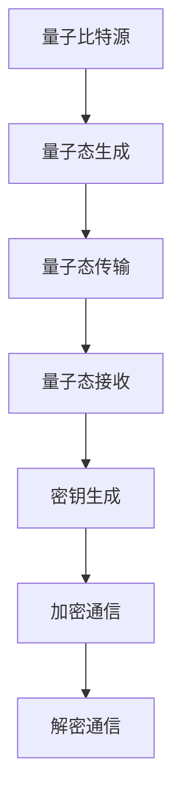

                 

## 引言

量子安全通信，作为近年来科技领域的热门话题，引起了全球科学界和产业界的广泛关注。其基于量子物理的基本原理，提供了一种全新的信息安全保障手段，有望彻底改变现有的通信安全格局。本文将围绕量子安全通信的发展前景，进行深入探讨。

首先，我们将对量子安全通信的基础概念进行详细介绍，包括其基本原理、发展历程以及与传统通信方式的区别。在此基础上，我们将重点探讨量子密钥分发和量子隐形传态两种关键技术，并分析量子重复器在量子通信中的应用及发展趋势。

接下来，我们将深入探讨量子安全通信在多个应用领域的实际应用，包括网络安全、金融领域和政务领域等，展示其广阔的发展前景。最后，我们将对量子安全通信的未来发展趋势进行展望，并提出面临的挑战和机遇，为量子安全通信的发展提供思路。

通过本文的探讨，希望能够为读者提供一个全面而深入的量子安全通信全景视图，激发更多对这一领域的兴趣和研究热情。让我们一同步入量子通信的新时代，探索其无限可能。

### 量子安全通信概述

量子安全通信是一种基于量子物理原理的通信方式，旨在通过量子态的不可克隆性和量子纠缠等特性，提供一种绝对安全的通信手段。要深入理解量子安全通信，首先需要了解几个核心概念。

**量子比特（qubit）** 是量子计算机的基本单位，它与传统计算机中的比特不同，可以同时处于0和1的叠加状态。这种叠加态是量子计算和量子通信的核心，使量子系统具有强大的计算和传输能力。

**量子纠缠** 是量子力学中的一个重要现象，当两个或多个量子系统发生相互作用后，它们会进入一种特殊的相互关联状态。即使这些系统相隔遥远，它们的状态仍然相互依赖，这为量子通信提供了安全加密的基石。

**量子密钥分发（QKD）** 是量子安全通信中的一种关键技术，利用量子态的不可克隆特性，实现两方之间安全地生成共享密钥。其基本原理是，发送方将量子态通过量子信道发送给接收方，接收方对量子态进行测量，并根据测量结果生成密钥。由于量子态在传输过程中如果被窃听，会导致测量结果发生变化，从而实现通信的安全性和完整性。

**量子隐形传态（Q teleportation）** 是另一种重要的量子通信技术，它通过量子纠缠将一个量子系统的状态传输到另一个量子系统上，而不需要通过物理信道。这种方式可以实现远距离量子态的传输，为量子通信提供了新的可能性。

量子安全通信与传统通信方式有显著的区别。传统通信方式主要依赖于加密算法和物理信道的保护，如对称加密和非对称加密。然而，这些方法在理论上存在被破解的风险，尤其是在量子计算能力大幅提升的情况下。而量子安全通信则利用量子物理的基本原理，提供一种绝对安全的通信方式。

与传统通信方式相比，量子安全通信具有以下几个显著优势：

1. **绝对安全性**：由于量子态的不可克隆特性，量子密钥分发几乎无法被窃听，从而实现了通信的绝对安全性。
2. **远距离传输**：量子隐形传态技术可以实现量子态的远距离传输，突破了传统通信方式的距离限制。
3. **高速高效**：量子计算和量子通信的结合，可以实现高效的数据处理和传输，大幅提升通信效率。

总之，量子安全通信通过引入量子物理原理，提供了一种全新的通信方式，有望在信息安全领域引发革命性的变化。随着量子技术的不断发展，量子安全通信的应用前景将越来越广阔。

### 量子密钥分发

量子密钥分发（Quantum Key Distribution，QKD）是量子安全通信中最核心的技术之一，其原理基于量子物理的基本定律，特别是量子态的不可克隆特性和测量扰动效应。量子密钥分发的基本思想是通过量子信道安全地生成和传输密钥，确保通信双方能够共享一个只有他们知道的秘密密钥。

#### BB84协议

BB84协议是量子密钥分发的一种经典协议，由Charles H. Bennett和Gill Hindemitt于1984年提出。BB84协议的工作流程如下：

1. **量子态生成**：发送方（Alice）使用一个量子比特源生成一系列随机的量子态，这些量子态可以是0态和1态的叠加态。
2. **量子态传输**：Alice将这些量子态通过量子信道发送给接收方（Bob）。
3. **量子态测量**：Bob在接收到量子态后，随机选择一个基（如X基或Z基）对量子态进行测量。他选择基的顺序是随机的，以确保测量结果不可预测。
4. **结果通信**：Bob将测量结果通过经典信道发送给Alice，他们可以知道Bob测量的是哪个基，但无法得知具体的量子态结果。
5. **密钥生成**：Alice和Bob根据他们各自的测量结果和选择的基，可以共同生成一个共享的密钥。

BB84协议的安全性依赖于量子态的不可克隆特性。如果攻击者试图窃听量子态，他们将会不可避免地改变量子态，从而导致测量结果与原本的量子态不一致。这种测量扰动效应会被Alice和Bob检测到，从而保证通信的安全性。

#### E91协议

E91协议是另一种量子密钥分发协议，它基于量子纠缠态来实现密钥分发。E91协议由Artur Ekert于1991年提出。E91协议的基本流程如下：

1. **量子纠缠态生成**：Alice和Bob共享一系列的量子纠缠态，这些纠缠态是通过量子态生成器产生的。
2. **量子态测量**：Alice和Bob各自对他们的量子态进行测量，测量结果可能为+1或-1。
3. **结果通信**：他们通过经典信道交换测量结果。
4. **密钥生成**：根据共享的纠缠态和测量结果，Alice和Bob可以生成共享的密钥。

E91协议利用量子纠缠态的特性，实现了比BB84协议更高的安全性。由于纠缠态的测量结果具有相关性，攻击者如果试图干扰纠缠态，将会导致测量结果的不一致性，从而被检测到。

#### 量子密钥分发的安全性

量子密钥分发协议的安全性主要依赖于量子态的不可克隆特性和测量扰动效应。当量子态在传输过程中被窃听时，攻击者将会不可避免地改变量子态，这会导致测量结果不一致。这种不一致性可以通过以下几种方式检测：

1. **量子态扰动检测**：如果量子态在传输过程中被窃听，会导致测量结果的扰动，这种扰动可以通过统计方法检测到。
2. **量子态重传机制**：当检测到量子态扰动时，Alice和Bob可以重新发送量子态，确保通信的完整性。
3. **错误率检测**：量子密钥分发过程中，测量结果的不一致率可以作为检测窃听的一个指标。如果错误率显著高于预期值，可能表明存在窃听行为。

总的来说，量子密钥分发通过量子物理的基本原理，提供了一种绝对安全的通信手段，解决了传统加密方法在量子计算威胁下的安全性问题。

#### 量子隐形传态

量子隐形传态（Quantum Teleportation）是一种基于量子纠缠的量子通信技术，它能够在远程之间实现量子态的瞬间传输，而不需要通过物理信道。这种技术的提出，不仅展示了量子力学中非局域性的奇特现象，也为量子通信和量子计算提供了新的可能性。

##### 基本原理

量子隐形传态的基本原理可以概括为以下三个步骤：

1. **量子纠缠态生成**：首先，发送方（Alice）和接收方（Bob）之间共享一个量子纠缠态。这个量子纠缠态可以通过量子态生成器或者量子信道建立。

2. **量子态编码**：然后，Alice将一个未知量子态（记为\(|\psi\rangle\)）与她的量子纠缠态进行操作，使其成为一个新的量子态\(|\psi\rangle|\Phi^+\rangle\)，其中\(|\Phi^+\rangle\)是纠缠态。

3. **量子态传输**：接下来，Alice将这个新的量子态发送给Bob。Bob接收到这个量子态后，通过一系列操作，可以将这个量子态还原成初始的未知量子态\(|\psi\rangle\)。

##### 实现方法

量子隐形传态的实现方法可以分为以下几步：

1. **量子态生成**：Alice和Bob首先需要生成一个量子纠缠态。这可以通过量子态生成器直接生成，也可以通过量子态操作（如量子门）在现有的量子态上建立。

2. **量子态编码**：Alice将她的量子态\(|\psi\rangle\)与她的量子纠缠态\(|\Phi^+\rangle\)进行操作。这个操作通常包括一系列的量子门操作，将这些量子态叠加起来。

3. **量子态传输**：Alice通过量子信道将新的量子态\(|\psi\rangle|\Phi^+\rangle\)发送给Bob。

4. **量子态解码**：Bob接收到这个量子态后，通过一系列逆操作，将这个量子态还原成初始的未知量子态\(|\psi\rangle\)。

##### 应用

量子隐形传态技术具有广泛的应用前景，以下是一些关键的应用领域：

1. **量子通信**：量子隐形传态是实现远距离量子通信的关键技术。通过量子隐形传态，可以实现量子态的瞬间传输，解决了量子态在传输过程中的损耗和延迟问题。

2. **量子计算**：量子隐形传态可以用于量子计算中的量子态传输，从而实现量子操作的高效执行。

3. **量子纠缠网络**：量子隐形传态是实现量子纠缠网络的基础。通过量子隐形传态，可以在远程节点之间建立量子纠缠态，从而实现量子信息的分布式处理。

总的来说，量子隐形传态技术展示了量子物理中非局域性现象的奇特特性，并在量子通信和量子计算领域具有广泛的应用前景。随着量子技术的不断发展，量子隐形传态技术的实现和应用将带来更多的突破和创新。

#### 量子重复器

量子重复器（Quantum Repeater）是量子通信系统中不可或缺的组成部分，特别是在长距离量子通信中。它的功能是延长量子信道的传输距离，确保量子信息的完整性和可靠性。量子重复器通过检测和纠正量子态的衰减和噪声，使得量子信息能够在远距离传输中保持其量子特性。

##### 分类

量子重复器可以根据工作原理和技术实现分为以下几类：

1. **量子中继器**：量子中继器通过将接收到的量子态进行复制，再通过量子态传输将复制的量子态发送到下一个节点。这种中继器依赖于量子态的复制技术，目前主要面临技术挑战，因为量子态的复制在理论上是不可行的。

2. **量子放大器**：量子放大器通过放大量子态的振幅，增强其能量，从而延长传输距离。与量子中继器不同，量子放大器不需要复制量子态，但同样面临着如何保持量子态的纯度问题。

3. **量子纠缠放大器**：量子纠缠放大器利用量子纠缠的特性，通过纠缠态的传输和操作来放大量子信息。这种放大器不仅延长了传输距离，还能够提高量子通信的带宽和效率。

##### 工作原理

量子重复器的工作原理主要包括以下几个步骤：

1. **量子态检测**：接收端首先对接收到的量子态进行检测，判断其是否包含有效的量子信息。

2. **量子态纠错**：如果检测到量子态的衰减或噪声，量子重复器将通过量子纠错算法对量子态进行纠错，恢复其原始状态。

3. **量子态传输**：经过纠错的量子态将被重新发送到下一个节点，继续传输过程。

4. **能量补充**：对于某些类型的量子重复器，如量子放大器，还需要通过能量补充机制来增强量子态的能量，以确保其能够克服长距离传输中的能量衰减。

##### 发展趋势

随着量子技术的不断进步，量子重复器的发展也展现出以下几个趋势：

1. **技术成熟**：随着量子态检测和量子纠错技术的成熟，量子重复器的性能将大幅提升，使其能够广泛应用于长距离量子通信系统中。

2. **集成化**：量子重复器将趋向于集成化设计，与量子通信系统中的其他组件（如量子路由器、量子交换机等）进行集成，形成一体化的量子通信网络。

3. **多功能化**：未来的量子重复器将不仅具备重复功能，还将具备量子纠缠生成、量子计算等功能，使其在量子通信网络中发挥更加多样化的作用。

总的来说，量子重复器在量子通信系统中发挥着关键作用，通过其先进的量子技术和纠错机制，为量子通信的长距离传输提供了有力保障。随着量子技术的不断发展，量子重复器的性能和功能将进一步提升，为量子通信的应用铺平道路。

### 量子安全通信在网络安全中的应用

量子安全通信在网络安全中的应用，已经展现出其巨大的潜力。在当前信息安全形势日益严峻的背景下，量子安全通信提供了一种全新的解决方案，能够有效应对传统通信方式在量子计算威胁下的安全挑战。

#### 量子通信在数据传输中的应用

量子通信在数据传输中的应用，主要通过量子密钥分发（QKD）技术实现。QKD技术能够确保通信双方在传输数据时，能够共享一个绝对安全的密钥，从而实现加密通信。具体应用场景包括：

1. **政府和企业内部通信**：量子密钥分发可以为政府机构和企业提供安全的数据传输通道，确保敏感信息在传输过程中不被窃听或篡改。

2. **跨境数据传输**：跨境数据传输常常面临跨国窃听和黑客攻击的风险，量子通信技术能够通过QKD实现绝对安全的数据传输，为跨境数据传输提供强有力的安全保障。

3. **物联网安全**：物联网设备的广泛应用带来了巨大的数据传输需求，同时也不可避免地面临安全威胁。量子安全通信技术可以为物联网设备提供安全的通信保障，确保设备之间的数据传输不被非法窃取或篡改。

#### 量子通信在密码学中的应用

量子通信在密码学中的应用，主要体现在量子密钥生成和量子密码学算法的开发上。量子密码学利用量子物理原理，提供一种全新的加密和解密方法，能够有效抵抗量子计算攻击。

1. **量子密钥生成**：量子密钥生成是量子通信的核心应用之一。通过QKD技术，通信双方能够生成一个绝对安全的共享密钥，确保通信的保密性和完整性。

2. **量子密码学算法**：量子密码学算法是利用量子物理原理设计的加密和解密算法。例如，Shor算法利用量子计算机的优势，能够高效地破解传统密码学算法，而量子密码学算法则能够抵抗Shor算法的攻击，确保信息安全。

3. **量子签名**：量子签名是一种基于量子物理原理的数字签名技术，它能够确保签名的不可伪造性和完整性。量子签名技术在电子政务、电子商务等领域具有广泛的应用前景。

#### 量子通信在身份认证中的应用

量子通信在身份认证中的应用，主要通过量子密钥分发和量子身份认证协议实现。量子身份认证协议能够提供一种绝对安全的身份认证方法，防止假冒和欺诈行为。

1. **远程身份认证**：量子通信可以为远程身份认证提供绝对安全的保障。例如，银行可以通过量子通信技术，确保在线交易的客户身份真实可信，防止欺诈行为。

2. **物联网设备身份认证**：物联网设备的安全性问题日益突出，量子通信技术能够为物联网设备提供安全的身份认证机制，确保设备之间的通信不会被非法入侵。

3. **智能城市安全**：在智能城市建设中，量子通信技术可以为城市中的各种智能设备提供安全的身份认证，确保城市运营的安全性和可靠性。

总的来说，量子安全通信在网络安全中的应用，通过量子密钥分发、量子密码学算法和量子身份认证协议，提供了一种全新的安全解决方案。随着量子技术的不断发展，量子安全通信将在网络安全领域发挥越来越重要的作用，为信息安全保驾护航。

### 量子安全通信在金融领域的应用

量子安全通信在金融领域的应用具有深远的影响，能够为金融交易、数字货币和信息安全提供强有力的保障。随着金融行业对数据安全要求的不断提高，量子安全通信技术正逐渐成为金融科技创新的重要驱动力。

#### 量子通信在金融交易中的应用

在金融交易中，数据安全和隐私保护是至关重要的。量子通信通过量子密钥分发技术，可以为金融交易提供绝对安全的密钥生成和传输，确保交易过程中的数据不被窃听或篡改。具体应用包括：

1. **跨境交易**：跨境交易常常涉及大量的数据传输，量子通信技术能够通过QKD实现绝对安全的数据传输，防止跨境交易中的数据泄露和欺诈行为。

2. **高频交易**：高频交易依赖于快速、准确的数据传输，量子通信技术可以大幅提升交易速度和安全性，减少交易风险。

3. **证券交易**：证券交易中，交易信息的保密性至关重要。量子通信技术能够为证券交易提供安全的通信通道，防止交易信息的泄露，保护投资者利益。

#### 量子通信在数字货币中的应用

数字货币的发展对安全通信提出了新的需求，量子通信技术在数字货币领域具有广泛的应用前景。通过量子密钥分发技术，数字货币的交易可以实现绝对安全，防止伪造和双花攻击。

1. **区块链安全**：区块链作为数字货币的基础技术，需要确保数据的完整性和不可篡改性。量子通信技术可以增强区块链的安全性，防止区块链数据的篡改和攻击。

2. **数字签名**：数字货币的交易通常涉及数字签名，量子签名技术能够提供更加安全的数字签名机制，确保交易的真实性和不可伪造性。

3. **跨境支付**：跨境支付是数字货币的重要应用场景，量子通信技术可以为跨境支付提供安全的通信保障，确保支付过程中的数据不被窃取或篡改。

#### 量子通信在信息安全中的应用

金融信息安全是金融行业发展的基础，量子安全通信技术在信息安全领域发挥着重要作用。

1. **银行数据安全**：银行的数据量庞大且敏感，量子通信技术可以为银行的数据传输提供绝对安全的保障，防止数据泄露和黑客攻击。

2. **反欺诈系统**：金融欺诈行为对金融机构造成巨大损失，量子通信技术可以通过增强数据传输的安全性，提高反欺诈系统的准确性和效率。

3. **客户身份认证**：在金融交易中，客户身份认证至关重要。量子通信技术可以提供绝对安全的身份认证机制，确保客户身份的真实性和安全性。

总之，量子安全通信在金融领域的应用，通过提供绝对安全的通信保障，为金融交易、数字货币和信息安全提供了全新的解决方案。随着量子技术的不断发展和金融行业的数字化转型，量子安全通信将在金融领域发挥越来越重要的作用，推动金融行业的安全和创新发展。

### 量子安全通信在政务领域的应用

量子安全通信在政务领域的应用前景广阔，能够为政务信息传输、政府数据安全和电子政务提供强大的安全保障。随着政务信息化水平的不断提升，对数据安全的需求也日益增加，量子安全通信技术以其绝对安全的特性，成为政务领域信息化建设的重要技术支撑。

#### 量子通信在政务信息传输中的应用

政务信息传输涉及大量的敏感数据，如政策文件、行政管理数据和个人隐私信息等。量子安全通信技术通过量子密钥分发（QKD）和量子隐形传态（Q teleportation）技术，能够确保政务信息在传输过程中的绝对安全。

1. **政府内部信息传输**：量子通信技术可以为政府内部的信息传输提供安全通道，确保政府内部的数据在传输过程中不被窃听或篡改。

2. **跨部门信息共享**：在跨部门的信息共享中，量子通信技术能够实现安全的信息交换，确保各部门之间的数据传输安全可靠。

3. **紧急信息传递**：在紧急情况下，如自然灾害、公共卫生事件等，政务信息的快速传递至关重要。量子通信技术可以提供高效的紧急信息传递通道，确保信息在极短时间内传达到相关部门。

#### 量子通信在政府数据安全中的应用

政府数据的安全性和完整性是政务信息化建设的关键。量子安全通信技术通过量子密钥分发和量子加密算法，为政府数据提供绝对安全的保护。

1. **数据存储安全**：量子加密算法可以将政府存储的数据进行加密，防止数据在存储过程中被非法访问和篡改。

2. **数据传输安全**：量子密钥分发技术可以确保政府数据在传输过程中的安全性，防止数据在传输过程中被窃听或篡改。

3. **数据备份与恢复**：量子通信技术可以提供安全的备份和恢复机制，确保政府数据在灾难发生时能够迅速恢复，减少数据丢失的风险。

#### 量子通信在电子政务中的应用

电子政务是政务信息化的重要组成部分，量子安全通信技术为电子政务提供了强有力的安全保障。

1. **身份认证**：量子安全通信技术可以提供安全的身份认证机制，确保用户在访问电子政务系统时，其身份真实可靠。

2. **在线交易**：电子政务中涉及大量的在线交易，如税务缴纳、社保办理等。量子通信技术可以为在线交易提供绝对安全的保障，防止交易过程中的数据泄露和篡改。

3. **信息安全监控**：量子安全通信技术可以用于建立信息安全监控平台，实时监测政务系统的安全状况，及时发现和应对安全威胁。

总之，量子安全通信在政务领域的应用，通过提供绝对安全的通信保障，为政务信息传输、政府数据安全和电子政务提供了全新的解决方案。随着量子技术的不断发展和政务信息化的深入推进，量子安全通信将在政务领域发挥越来越重要的作用，推动政务信息化建设的安全和可持续发展。

### 量子安全通信的发展前景

量子安全通信作为一种基于量子物理原理的新型通信方式，具有绝对安全、远距离传输和高效处理等独特优势。随着量子技术的不断进步，量子安全通信的发展前景广阔，有望在多个领域引发革命性的变革。

#### 发展趋势

1. **技术成熟**：量子通信技术的不断成熟，使得量子密钥分发、量子隐形传态和量子重复器等关键技术逐步走向实用化。未来，量子通信系统的性能和稳定性将大幅提升，为大规模应用提供技术保障。

2. **网络部署**：随着量子通信基础设施的建设，全球范围内的量子通信网络将逐步形成。量子互联网将实现全球范围内的量子态传输和量子信息处理，为信息传输提供全新的安全架构。

3. **集成创新**：量子安全通信与其他新兴技术的集成创新，如量子计算、物联网和区块链等，将推动量子通信在更多领域的应用。量子通信技术将与传统通信技术深度融合，形成新的通信生态系统。

4. **应用拓展**：量子安全通信将在金融、政务、医疗、能源等多个领域得到广泛应用。通过量子密钥分发和量子加密算法，这些领域的信息安全和隐私保护将得到全面提升。

#### 挑战与机遇

尽管量子安全通信具有巨大潜力，但在发展过程中仍面临诸多挑战：

1. **技术瓶颈**：量子通信技术的实际应用仍存在许多技术瓶颈，如量子器件的可靠性、量子态的传输效率和量子网络的稳定性等。这些瓶颈需要通过技术创新和工程实践逐步克服。

2. **基础设施**：量子通信网络的建设和维护需要巨大的资金投入，目前全球范围内的量子通信基础设施尚不完善。未来，需要加强国际合作，共同推动量子通信网络的全球部署。

3. **法规政策**：量子安全通信的发展需要相应的法规和政策支持，以确保技术的合法合规应用。政府和企业需要共同制定和完善相关法规政策，为量子安全通信的健康发展提供保障。

然而，这些挑战也伴随着巨大的机遇：

1. **市场需求**：随着信息安全需求的不断增长，量子安全通信在各个领域的市场需求日益旺盛。量子通信技术将为解决信息安全难题提供新的解决方案，具有广阔的市场前景。

2. **技术创新**：量子技术的不断创新，将推动量子安全通信技术的进步，为实际应用提供更强有力的支持。量子计算、量子传感等新兴技术的融合，将进一步提升量子通信的性能和效率。

3. **国际合作**：量子安全通信的发展需要全球范围内的合作。通过国际间的合作与交流，可以共享技术资源和经验，共同推动量子通信技术的进步。

总之，量子安全通信的发展前景广阔，具有巨大的应用潜力和市场前景。随着量子技术的不断突破和全球合作的深化，量子安全通信将在未来发挥更加重要的作用，为信息安全领域带来革命性的变化。

### 附录：量子安全通信常见问题解答

#### 量子通信与经典通信的对比

| 对比项 | 量子通信 | 经典通信 |
| --- | --- | --- |
| 安全性 | 基于量子物理原理，提供绝对安全 | 依赖于加密算法，可能被量子计算破解 |
| 距离限制 | 可以实现远距离量子态传输 | 受限于物理信道衰减，距离有限 |
| 传输速率 | 量子态传输速率接近光速 | 信号传输速率受物理限制，低于光速 |
| 传输效率 | 高效传输量子态 | 信号传输过程中易受干扰 |

#### 量子通信技术原理图解

#### 量子安全通信技术指标解析

1. **量子信道误码率**：表示量子信道传输中的误码率，通常通过量子信道质量因子（QCF）来衡量。QCF值越高，表示信道质量越好。
2. **密钥生成速率**：表示单位时间内可以生成的密钥数量，通常用kbps（千比特每秒）来表示。
3. **量子态传输距离**：表示量子态可以传输的最大距离，通常用km（千米）来表示。
4. **量子态纯度**：表示量子态的纯度，纯度越高，量子态的信息量越多。
5. **量子密钥分发成功率**：表示量子密钥分发过程中成功的次数与总次数之比，通常用百分比表示。

### 作者信息

作者：AI天才研究院/AI Genius Institute & 禅与计算机程序设计艺术 /Zen And The Art of Computer Programming

### 结语

量子安全通信以其独特的安全性和远距离传输能力，正逐渐成为信息安全领域的重要支柱。本文从量子安全通信的基础知识、核心技术、应用领域以及发展前景等方面进行了全面剖析，展示了其广阔的应用前景和深远的影响。随着量子技术的不断进步和全球合作的深化，量子安全通信必将在未来的信息社会中发挥更加重要的作用，为信息安全保驾护航。让我们共同期待量子安全通信技术的进一步发展，开启新的通信时代。

