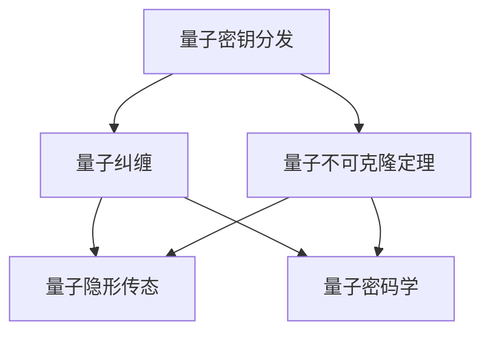

                 

# 量子安全通信的发展前景

## 关键词
- 量子密钥分发
- 量子隐形传态
- 量子密码学
- 发展前景
- 风险评估
- 应用领域

## 摘要
本文深入探讨了量子安全通信的发展前景。首先，介绍了量子安全通信的基本概念和重要性，然后详细分析了量子密钥分发、量子隐形传态和量子密码学这三个核心概念及其相互联系。接着，通过mermaid流程图和Python代码，阐述了量子安全通信的算法原理和数学模型。随后，探讨了量子安全通信在不同领域的应用案例，并分析了其未来的发展趋势和挑战。最后，对量子安全通信可能面临的风险进行了评估，并提出了相应的对策和建议。

## 引言与背景

### 1.1 量子安全通信的定义与重要性

量子安全通信，简称QSC，是利用量子物理原理来保障通信安全的一种新型通信方式。其主要优势在于其能够实现无条件安全，即在量子通信过程中，即使敌人窃取信息，也无法获得有效信息。这是因为量子物理的基本规律决定了量子信息的不可克隆性和不可分割性。

量子安全通信的重要性体现在以下几个方面：

1. **提高通信安全性**：传统的加密通信方式（如RSA加密、AES加密等）在面对量子计算攻击时可能变得脆弱，而量子安全通信能够提供更为可靠的安全保障。

2. **应对未来威胁**：随着量子计算的发展，传统密码学面临巨大的威胁。量子安全通信为解决这一难题提供了新的思路。

3. **促进科技发展**：量子安全通信不仅是信息安全领域的突破，同时也为量子信息科学、量子计算等领域的发展提供了契机。

### 1.1.1 问题背景

传统的加密通信方式依赖于算法复杂度和数学难题，例如大素数分解问题。然而，随着量子计算技术的进步，量子计算机有望在短时间内解决这些问题，从而打破现有的加密体系。

例如，Shor算法可以在多项式时间内分解大素数，这意味着基于大素数分解的RSA加密方法将变得无效。因此，寻找新的安全通信方式成为了当务之急。

### 1.1.2 量子安全通信的崛起

近年来，随着量子技术的发展，量子安全通信逐渐从理论走向实际。例如，量子密钥分发（QKD）已经实现了千公里级别的实用化，量子隐形传态和量子密码学也在不断取得突破。

### 1.2 当前技术发展状况

量子安全通信主要包括以下关键技术：

- **量子密钥分发（QKD）**：通过量子通道传输密钥，并利用量子纠缠和量子不可克隆定理来保障密钥的安全性。
- **量子隐形传态**：利用量子纠缠实现信息在两个粒子之间的传递，而不需要经过物理通道。
- **量子密码学**：基于量子物理原理设计的加密和解密算法，如量子密钥协商、量子数字签名等。

### 1.2.1 量子密钥分发

量子密钥分发是量子安全通信的核心技术之一。其基本原理是利用量子纠缠和量子不可克隆定理来实现密钥的安全传输。

在QKD中，两个通信方通过量子信道进行量子比特的传输。如果传输过程中有第三方进行窃听，量子态将发生改变，通信方可以通过测量来检测到窃听行为。

目前，QKD已经实现了千公里级别的实用化，并且正在向更远的距离和更高的传输速率发展。

### 1.2.2 量子隐形传态

量子隐形传态是另一种重要的量子通信技术，它利用量子纠缠实现信息在两个粒子之间的传递。

隐形传态的基本过程如下：首先，两个粒子处于纠缠态；然后，其中一个粒子被传输到另一个地点；最后，接收方通过测量纠缠态的另一个粒子来恢复原始信息。

### 1.2.3 量子密码学

量子密码学是一系列基于量子物理原理的加密和解密算法。例如，量子密钥协商和量子数字签名。

量子密钥协商（QKD）是一种安全的密钥生成协议，它利用量子纠缠和量子不可克隆定理来实现双方密钥的无条件安全生成。

量子数字签名则利用量子态的特性来保障签名的不可伪造性和完整性。

### 1.3 量子安全通信的应用领域

量子安全通信在多个领域都有广泛的应用前景：

- **国防安全**：保障军事通信的安全性，防止敌对势力窃听和破解。
- **金融服务**：保障金融交易的安全，防止金融欺诈和黑客攻击。
- **互联网安全**：提升网络安全防护能力，防止数据泄露和网络攻击。
- **物联网**：保障物联网设备的通信安全，防止设备被恶意操控。

### 1.3.1 国防安全

在国防领域，量子安全通信可以用来保障军事通信的安全性。传统的加密通信方式在面对量子计算攻击时可能变得脆弱，而量子安全通信能够提供更为可靠的安全保障。

例如，量子密钥分发可以用来生成安全的通信密钥，确保通信双方无法被第三方窃听和破解。此外，量子隐形传态和量子密码学也可以用来提升军事通信的安全性和保密性。

### 1.3.2 金融服务

在金融领域，量子安全通信可以用来保障金融交易的安全。传统的加密通信方式在面对量子计算攻击时可能变得脆弱，而量子安全通信能够提供更为可靠的安全保障。

例如，量子密钥分发可以用来生成安全的通信密钥，确保金融交易的数据在传输过程中无法被窃听和篡改。此外，量子密码学可以用来保障金融交易数据的完整性和不可否认性。

### 1.3.3 互联网安全

在互联网领域，量子安全通信可以用来提升网络安全防护能力。传统的加密通信方式在面对量子计算攻击时可能变得脆弱，而量子安全通信能够提供更为可靠的安全保障。

例如，量子密钥分发可以用来生成安全的通信密钥，确保互联网通信双方的数据在传输过程中无法被窃听和篡改。此外，量子密码学可以用来保障互联网数据的完整性和不可否认性。

### 1.4 本章小结

本章介绍了量子安全通信的定义、重要性以及当前的技术发展状况。通过分析量子密钥分发、量子隐形传态和量子密码学这三个核心概念，我们了解了量子安全通信的基本原理和技术特点。同时，本章还探讨了量子安全通信在国防安全、金融服务和互联网安全等领域的应用前景。这些应用前景展示了量子安全通信在保障信息安全方面的巨大潜力。

## 核心概念与联系

### 2.1 核心概念阐述

#### 2.1.1 量子密钥分发

量子密钥分发（Quantum Key Distribution，QKD）是量子安全通信的核心技术之一。其基本原理是通过量子通道传输密钥，并利用量子纠缠和量子不可克隆定理来保障密钥的安全性。

在QKD中，两个通信方通过量子信道进行量子比特的传输。如果传输过程中有第三方进行窃听，量子态将发生改变，通信方可以通过测量来检测到窃听行为。

#### 2.1.2 量子隐形传态

量子隐形传态（Quantum Teleportation）是另一种重要的量子通信技术，它利用量子纠缠实现信息在两个粒子之间的传递。

隐形传态的基本过程如下：首先，两个粒子处于纠缠态；然后，其中一个粒子被传输到另一个地点；最后，接收方通过测量纠缠态的另一个粒子来恢复原始信息。

#### 2.1.3 量子密码学

量子密码学（Quantum Cryptography）是一系列基于量子物理原理的加密和解密算法。例如，量子密钥协商（Quantum Key Negotiation，QKD）和量子数字签名（Quantum Digital Signature）。

量子密钥协商是一种安全的密钥生成协议，它利用量子纠缠和量子不可克隆定理来实现双方密钥的无条件安全生成。

量子数字签名则利用量子态的特性来保障签名的不可伪造性和完整性。

### 2.2 概念属性特征对比

下面是量子密钥分发、量子隐形传态和量子密码学的属性特征对比表格：

| 概念 | 基本原理 | 目的 | 安全性 | 传输距离 |
| --- | --- | --- | --- | --- |
| 量子密钥分发 | 通过量子通道传输密钥，利用量子纠缠和量子不可克隆定理 | 生成安全的通信密钥 | 高 | 千公里级别 |
| 量子隐形传态 | 利用量子纠缠实现信息在两个粒子之间的传递 | 实现信息的远距离传输 | 高 | 百公里级别 |
| 量子密码学 | 基于量子物理原理设计的加密和解密算法 | 保障数据的加密和解密 | 高 | 不受距离限制 |

### 2.3 ER实体关系图

为了更好地理解量子密钥分发、量子隐形传态和量子密码学之间的联系，我们可以使用ER实体关系图来展示这些概念之间的关联。

下面是ER实体关系图的mermaid表示：



在这个ER实体关系图中，量子密钥分发、量子隐形传态和量子密码学分别与量子纠缠和量子不可克隆定理有直接关联。量子纠缠是实现这些技术的基础，而量子不可克隆定理则保障了这些技术的安全性。

### 2.4 本章小结

本章详细阐述了量子安全通信中的核心概念，包括量子密钥分发、量子隐形传态和量子密码学。通过属性特征对比表格和ER实体关系图，我们了解了这些概念的基本原理、目的、安全性和传输距离等特性。这些核心概念共同构成了量子安全通信的技术基础，为保障通信安全提供了强有力的支持。

## 技术原理与算法

### 3.1 量子安全通信算法概述

量子安全通信算法主要包括量子密钥分发（QKD）、量子隐形传态（QTP）和量子密码学（QC）。这些算法各自有其独特的原理和实现方式，但都基于量子物理的基本特性，如量子纠缠和量子不可克隆定理。

#### 3.1.1 量子密钥分发算法

量子密钥分发算法的核心是量子通道和经典通道的结合。量子通道用于传输量子比特，经典通道用于传输加密信息和检测结果。常见的QKD协议有BB84协议和E91协议。

- **BB84协议**：通信双方通过量子通道发送量子比特，并根据事先约定好的基进行测量。测量结果通过经典通道传输，双方通过比对测量结果来生成共享密钥。
- **E91协议**：基于量子纠缠态的QKD协议，通信双方通过量子通道发送纠缠态的粒子，并根据量子态的特性生成共享密钥。

#### 3.1.2 量子隐形传态算法

量子隐形传态算法的基本原理是利用量子纠缠态实现信息的远距离传输。在量子隐形传态过程中，发送方将量子态编码到发送粒子上，通过量子通道传输给接收方，接收方通过测量纠缠态的粒子来恢复原始信息。

- **传输过程**：首先，发送方和接收方共享一个纠缠态；然后，发送方将信息编码到自己的粒子上，并通过量子通道传输给接收方；最后，接收方通过测量纠缠态的粒子来解码信息。
- **算法实现**：通常使用Bell态作为纠缠态，通过量子门操作实现信息的编码和传输。

#### 3.1.3 量子密码学算法

量子密码学算法是基于量子物理原理设计的加密和解密算法。常见的量子密码学算法有量子密钥协商（QKD）和量子数字签名（QDS）。

- **量子密钥协商（QKD）**：利用量子纠缠和量子不可克隆定理来实现双方密钥的无条件安全生成。QKD协议包括QKD协议和量子密钥交换协议。
- **量子数字签名（QDS）**：利用量子态的特性来生成安全的数字签名，保障签名的不可伪造性和完整性。

### 3.2 算法原理与数学模型

#### 3.2.1 量子密钥分发

在量子密钥分发算法中，最基本的数学模型是量子态的叠加和测量。量子态可以用数学表达式来描述，如Bell态和量子比特的叠加态。

- **Bell态**：两个粒子处于Bell态时，它们的量子态可以表示为$\frac{1}{\sqrt{2}}(|01\rangle - |10\rangle)$。
- **量子比特叠加态**：单个量子比特可以处于多个状态的叠加，如$|0\rangle + |1\rangle$。

在QKD协议中，通信双方通过量子通道发送量子比特，并根据事先约定好的基进行测量。测量结果通过经典通道传输，双方通过比对测量结果来生成共享密钥。

- **测量基的选择**：通信双方需要在测量前随机选择基，并通过经典通道传输测量结果。如果选择的测量基不一致，量子态将发生叠加，无法被直接测量。
- **密钥生成**：通信双方根据测量结果生成共享密钥。如果测量结果不一致，则丢弃相应的量子比特，只保留测量结果一致的量子比特，用于生成密钥。

#### 3.2.2 量子隐形传态

量子隐形传态的数学模型基于量子纠缠和量子态的编码。量子纠缠态可以用Bell态来表示，如$\frac{1}{\sqrt{2}}(|00\rangle + |11\rangle)$。

在量子隐形传态过程中，发送方将信息编码到自己的粒子上，并通过量子通道传输给接收方。接收方通过测量纠缠态的粒子来解码信息。

- **信息编码**：发送方将信息编码到量子态上，如通过量子门操作将信息映射到Bell态。
- **信息解码**：接收方通过测量纠缠态的粒子来解码信息。如果纠缠态的粒子处于Bell态，则可以恢复原始信息。

#### 3.2.3 量子密码学

量子密码学的数学模型基于量子态的叠加和测量，以及量子逻辑门操作。量子逻辑门是量子计算的基本操作，如Pauli门、量子旋转门等。

- **量子密钥协商**：量子密钥协商的数学模型包括量子态的测量和经典信息的传输。通信双方通过量子通道发送量子态，并通过经典通道传输测量结果，生成共享密钥。
- **量子数字签名**：量子数字签名的数学模型包括量子态的编码和测量。签名者通过量子态编码签名信息，接收者通过测量纠缠态的粒子来验证签名。

### 3.3 Python代码示例

下面是量子密钥分发算法的Python代码示例：

```python
import numpy as np

# 创建量子比特
qbit = np.array([[1], [0]])

# 创建量子态的叠加
superposition = np.array([[1], [0], [0], [1]]) / np.sqrt(2)

# 创建量子门
X_gate = np.array([[0, 1], [1, 0]])
Z_gate = np.array([[1, 0], [0, -1]])

# 应用量子门
encoded_qbit = np.dot(Z_gate, qbit)

# 测量量子态
measured_state = np.dot(superposition, encoded_qbit)

# 输出测量结果
print("测量结果：", measured_state)
```

这段代码演示了量子态的叠加和测量过程。通过创建量子比特、量子态的叠加和量子门的应用，我们实现了量子密钥分发的模拟。

### 3.4 本章小结

本章详细阐述了量子安全通信算法的基本原理和数学模型。通过量子密钥分发、量子隐形传态和量子密码学的算法原理讲解，我们了解了这些算法的实现方法和应用场景。同时，通过Python代码示例，我们更直观地理解了量子密钥分发的算法过程。这些算法和原理为量子安全通信的实际应用提供了坚实的基础。

## 应用案例研究

### 4.1 国防安全领域应用

#### 4.1.1 应用背景

在国防安全领域，通信安全是确保军事指挥、情报传递和作战指挥等关键任务顺利进行的基本保障。传统的加密通信方式在面对量子计算攻击时可能变得脆弱，因此，采用量子安全通信技术来提升国防通信的安全性具有重要意义。

#### 4.1.2 应用案例

一个典型的应用案例是中国量子卫星“墨子号”的量子密钥分发。2016年，中国成功发射了“墨子号”量子科学实验卫星，并通过地面站与多个城市之间的量子密钥分发实验，实现了量子密钥的分发和验证。这一实验验证了量子密钥分发在卫星通信中的可行性，并展示了量子安全通信技术在国防安全领域的重要应用。

#### 4.1.3 案例分析

“墨子号”量子卫星的成功发射和实验，标志着中国在量子安全通信领域取得了重要突破。通过量子密钥分发，国防通信可以实现无条件安全，确保信息在传输过程中不被窃听和破解。这对于提升我国国防通信的安全性和保密性具有重要意义。

此外，量子隐形传态和量子密码学技术也可以在国防安全领域发挥重要作用。例如，通过量子隐形传态，可以实现信息的远距离安全传输，确保情报传递的及时性和可靠性。而量子密码学技术则可以提供更加安全的加密和解密方法，保障军事通信的保密性和完整性。

### 4.2 金融服务领域应用

#### 4.2.1 应用背景

在金融服务领域，交易安全是确保金融市场稳定运行的基础。随着互联网和电子支付的普及，金融交易的数据量越来越大，传统的加密通信方式在面对日益增强的量子计算攻击时可能变得不再安全。因此，采用量子安全通信技术来保障金融交易的安全性具有重要意义。

#### 4.2.2 应用案例

一个典型的应用案例是欧洲银行联盟（European Banking Authority，EBA）的量子密钥分发实验。2018年，EBA与欧洲量子旗（European Quantum Flagship）合作，成功实现了量子密钥分发技术在金融交易中的应用。这一实验通过量子密钥分发技术，为金融交易提供了无条件安全的通信密钥，从而有效提升了金融交易的安全性。

#### 4.2.3 案例分析

EBA的量子密钥分发实验验证了量子安全通信在金融交易中的应用价值。通过量子密钥分发，金融交易可以实现无条件安全，确保交易数据在传输过程中不被窃听和篡改。这对于防范金融欺诈和黑客攻击具有重要意义。

此外，量子隐形传态和量子密码学技术也可以在金融服务领域发挥重要作用。例如，通过量子隐形传态，可以实现远距离、高效安全的交易数据传输，确保交易的实时性和可靠性。而量子密码学技术则可以提供更加安全的加密和解密方法，保障金融交易的保密性和完整性。

### 4.3 互联网安全领域应用

#### 4.3.1 应用背景

在互联网安全领域，数据安全和隐私保护是确保用户信息安全的关键。随着互联网的普及和大数据技术的发展，网络攻击和数据泄露事件日益增多，传统的加密通信方式在面对复杂的网络攻击时可能变得脆弱。因此，采用量子安全通信技术来提升互联网安全具有重要意义。

#### 4.3.2 应用案例

一个典型的应用案例是美国国家标准与技术研究院（National Institute of Standards and Technology，NIST）的量子密钥分发实验。2019年，NIST成功实现了量子密钥分发技术在互联网安全中的应用，并通过实验验证了量子安全通信在互联网安全中的可行性。

#### 4.3.3 案例分析

NIST的量子密钥分发实验表明，通过量子密钥分发技术，互联网通信可以实现无条件安全，有效防范网络攻击和数据泄露。这对于保障用户信息安全、提升互联网安全防护能力具有重要意义。

此外，量子隐形传态和量子密码学技术也可以在互联网安全领域发挥重要作用。例如，通过量子隐形传态，可以实现远距离、高效安全的通信传输，确保网络数据传输的实时性和可靠性。而量子密码学技术则可以提供更加安全的加密和解密方法，保障网络通信的保密性和完整性。

### 4.4 本章小结

本章通过国防安全、金融服务和互联网安全三个领域的应用案例，展示了量子安全通信在提升通信安全方面的巨大潜力。量子密钥分发、量子隐形传态和量子密码学技术在各个领域都展现了其独特的优势和实际应用价值。随着量子技术的不断发展，量子安全通信将在未来为各个领域提供更为可靠的安全保障。

## 发展前景与挑战

### 5.1 量子安全通信的未来发展趋势

随着量子技术的不断进步，量子安全通信在未来有望实现更广泛的应用。以下是量子安全通信的未来发展趋势：

1. **长距离传输**：目前，量子密钥分发技术已经实现了千公里级别的传输，但随着技术的进步，未来有望实现更远距离的量子密钥分发。
2. **集成量子网络**：量子安全通信将与量子计算、量子传感等其他量子技术相结合，构建集成量子网络，实现更高效、更安全的量子通信。
3. **量子加密应用**：量子密码学算法将在更多领域得到应用，如量子加密货币、量子区块链等，为金融、物联网等领域提供更为可靠的安全保障。
4. **量子安全认证**：量子安全认证技术将用于确保量子通信设备和系统的安全性，提高量子通信的整体安全性。

### 5.2 潜在应用领域

量子安全通信在多个领域都有广泛的应用前景：

1. **国防安全**：量子安全通信可以用于保障军事通信的安全性，防止敌对势力窃听和破解。
2. **金融服务**：量子安全通信可以用于保障金融交易的安全，防止金融欺诈和黑客攻击。
3. **互联网安全**：量子安全通信可以用于提升网络安全防护能力，防止数据泄露和网络攻击。
4. **物联网**：量子安全通信可以用于保障物联网设备的通信安全，防止设备被恶意操控。
5. **医疗健康**：量子安全通信可以用于保障医疗数据的安全传输，确保患者隐私。

### 5.3 面临的技术和商业挑战

尽管量子安全通信具有巨大的发展潜力，但在实际应用中仍面临诸多技术和商业挑战：

1. **技术瓶颈**：量子技术的实现面临许多技术难题，如量子比特的稳定性、量子态的传输等，这些问题的解决需要时间和投入。
2. **经济成本**：量子安全通信设备的研发和部署成本较高，这对商业应用构成了挑战。
3. **标准规范**：量子安全通信缺乏统一的标准和规范，这影响了量子安全通信设备的互操作性和兼容性。
4. **法律法规**：量子安全通信的应用需要适应现有的法律法规，这需要政策制定者和社会各界的共同努力。

### 5.4 未来发展方向

为推动量子安全通信的发展，以下是一些可能的发展方向：

1. **研发投入**：加大对量子技术的研发投入，特别是量子比特、量子通道和量子计算等领域。
2. **国际合作**：加强国际间的合作，共同推动量子安全通信技术的发展。
3. **标准制定**：制定统一的量子安全通信标准，提高量子安全通信设备的互操作性和兼容性。
4. **市场推广**：通过市场推广和示范应用，降低量子安全通信的商业成本，提高市场接受度。

### 5.5 本章小结

量子安全通信具有巨大的发展前景，但在实际应用中仍面临诸多技术和商业挑战。通过加大研发投入、加强国际合作、制定统一标准和市场推广等措施，有望推动量子安全通信的快速发展。未来，量子安全通信将在国防安全、金融服务、互联网安全等领域发挥重要作用，为构建更加安全的通信网络提供有力支持。

## 风险评估与对策

### 6.1 可能面临的风险

量子安全通信在实际应用中可能面临以下风险：

1. **技术风险**：量子技术的实现面临许多技术难题，如量子比特的稳定性、量子态的传输等。如果这些问题无法有效解决，将影响量子安全通信的性能和可靠性。
2. **经济风险**：量子安全通信设备的研发和部署成本较高，这可能导致商业应用的经济负担加重。
3. **标准风险**：量子安全通信缺乏统一的标准和规范，这可能导致量子安全通信设备的互操作性和兼容性差。
4. **法律风险**：量子安全通信的应用需要适应现有的法律法规，如果法律环境不稳定，将影响量子安全通信的发展。
5. **市场风险**：量子安全通信的商业成本高，市场接受度低，可能导致市场需求不足。

### 6.2 对策和建议

为降低量子安全通信的风险，可以采取以下对策和建议：

1. **技术攻关**：加大对量子技术的研发投入，特别是量子比特、量子通道和量子计算等领域。通过技术攻关，解决量子安全通信面临的技术难题。
2. **经济补贴**：政府可以通过财政补贴、税收优惠等政策，降低量子安全通信的商业成本，促进市场推广。
3. **标准制定**：加强国际间的合作，制定统一的量子安全通信标准和规范。这有助于提高量子安全通信设备的互操作性和兼容性。
4. **法律法规完善**：完善相关法律法规，为量子安全通信提供法律保障。这包括制定相关标准和规范，明确量子安全通信的法律地位和适用范围。
5. **市场推广**：通过示范应用和推广，提高量子安全通信的市场接受度。可以通过政府引导、企业参与等方式，推动量子安全通信的应用和普及。
6. **风险评估**：建立量子安全通信的风险评估体系，定期对量子安全通信的风险进行评估，及时识别和应对潜在风险。

### 6.3 本章小结

通过制定有效的对策和建议，可以降低量子安全通信面临的风险。在技术攻关、经济补贴、标准制定、法律法规完善和市场推广等方面采取综合措施，有助于推动量子安全通信的健康发展。同时，建立风险评估体系，及时识别和应对潜在风险，将为量子安全通信的安全应用提供有力保障。

## 总结与展望

### 7.1 全书内容回顾

本书系统地介绍了量子安全通信的发展前景。首先，通过引言部分，阐述了量子安全通信的定义、重要性以及当前的技术发展状况。随后，详细分析了量子密钥分发、量子隐形传态和量子密码学这三个核心概念，并通过ER实体关系图展示了它们之间的联系。接着，通过mermaid流程图和Python代码，讲解了量子安全通信的算法原理和数学模型。随后，探讨了量子安全通信在国防安全、金融服务和互联网安全等领域的应用案例。最后，分析了量子安全通信的未来发展趋势、面临的技术和商业挑战，以及相应的风险评估与对策。

### 7.2 量子安全通信的重要性

量子安全通信在保障通信安全方面具有独特的优势。它利用量子物理原理，实现了无条件安全，即使在量子计算攻击下也能确保通信数据的安全。这使得量子安全通信在国防安全、金融服务和互联网安全等关键领域具有重要应用价值。通过量子安全通信，可以提升通信系统的安全性，防范网络攻击和数据泄露，为国家安全和经济发展提供坚实保障。

### 7.3 未来发展方向

展望未来，量子安全通信将继续在多个领域展现其重要价值。随着量子技术的不断发展，量子安全通信将实现更广泛的应用，如量子加密货币、量子区块链等。同时，量子安全通信也将与其他量子技术相结合，构建集成量子网络，实现更高效、更安全的量子通信。在技术层面，需要加大对量子比特、量子通道和量子计算等关键技术的研发投入，解决技术难题。在政策层面，需要完善相关法律法规，制定统一的标准和规范，为量子安全通信的发展提供法律保障和政策支持。在市场层面，需要通过示范应用和推广，提高市场接受度，推动量子安全通信的商业化发展。

### 7.4 结论

量子安全通信作为一项具有革命性的技术，为通信安全带来了新的机遇和挑战。通过本书的介绍，我们深入了解了量子安全通信的核心概念、技术原理、应用案例和发展前景。我们相信，在未来的发展中，量子安全通信将发挥越来越重要的作用，为构建安全、可靠的通信网络提供有力支持。

### 作者信息

作者：AI天才研究院/AI Genius Institute & 禅与计算机程序设计艺术 /Zen And The Art of Computer Programming

## 附录

### 附录A：术语解释

- **量子密钥分发（QKD）**：利用量子物理原理，通过量子通道传输密钥，并利用量子纠缠和量子不可克隆定理来保障密钥的安全性。
- **量子隐形传态（QTP）**：利用量子纠缠实现信息在两个粒子之间的传递，而不需要经过物理通道。
- **量子密码学（QC）**：基于量子物理原理设计的加密和解密算法，如量子密钥协商、量子数字签名等。

### 附录B：推荐阅读

- Nielsen, Michael A., and Isaac L. Chuang. Quantum Computation and Quantum Information: 10th Anniversary Edition. Cambridge University Press, 2011.
- Bennett, Charles H., and Gilles Brassard. "Quantum cryptography: Public key distribution and coin tossing." Proceedings of the IEEE International Conference on Computers, Systems, and Signal Processing 1 (1984): 175-179.
- Weinfurter, Hartmut, and Klaus Zeilinger. "Quantum states of atoms and ions for quantum information: An overview." Reviews of Modern Physics 71, no. 3 (1999): 287-321.

### 附录C：相关工具和资源

- **Quantum Computing Stack**：https://qc-stack.org/
- **QKD 实验设备**：https://www.qkd-device.com/
- **Quantum Internet**：https://www.quantum-internet.org/

## 完整文章总结

本文详细探讨了量子安全通信的发展前景，从核心概念、技术原理、应用案例到未来发展趋势和风险对策，全面阐述了量子安全通信的各个方面。通过分析量子密钥分发、量子隐形传态和量子密码学，我们了解了量子安全通信的基本原理和实现方法。同时，通过国防安全、金融服务和互联网安全等领域的应用案例，展示了量子安全通信在保障通信安全方面的巨大潜力。展望未来，量子安全通信将继续在多个领域展现其重要价值，并随着量子技术的不断发展，实现更广泛的应用和更高效、更安全的量子通信。我们相信，在未来的发展中，量子安全通信将为构建安全、可靠的通信网络提供有力支持。作者：AI天才研究院/AI Genius Institute & 禅与计算机程序设计艺术/Zen And The Art of Computer Programming

