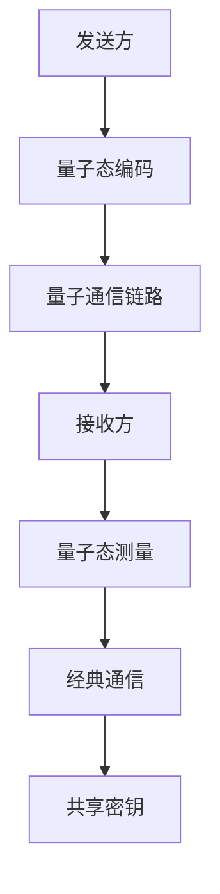
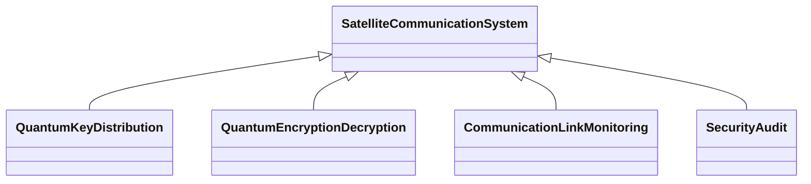
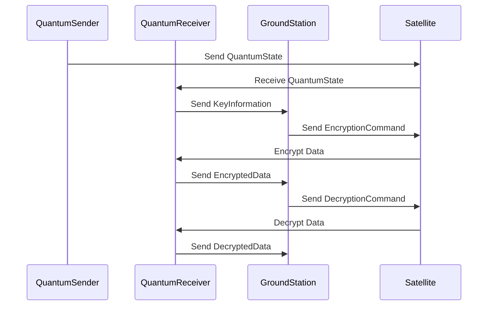

                 

### 文章标题

#### 量子密码在卫星通信安全中的应用前景

> 关键词：量子密码、卫星通信、安全性、应用前景、算法原理

> 摘要：本文从量子密码与卫星通信安全的背景入手，详细探讨了量子密码的基本概念、原理和安全性。通过分析量子密码与卫星通信的结合原理，提出了量子密码在卫星通信中的应用方案。随后，深入讲解了量子密码算法的原理，并借助Python源代码和Mermaid流程图，对算法进行了详细阐述。文章还介绍了量子密码在卫星通信中的应用架构设计，并通过实际案例剖析了量子密码在卫星通信安全中的应用前景。最后，总结了最佳实践与注意事项，为量子密码在卫星通信安全领域的应用提供了指导。

---

## 目录大纲

1. **背景介绍**
   1.1 问题背景
   1.2 量子密码的基本概念
   1.3 量子密码在卫星通信中的潜在应用
   1.4 应用中的挑战与机遇
   1.5 边界与外延
   1.6 概念结构与核心要素组成

2. **核心概念与联系**
   2.1 量子密码的基本原理
   2.2 量子密码的安全性
   2.3 量子密码的应用特点

3. **算法原理讲解**
   3.1 量子密钥分发算法
   3.2 量子密码算法的mermaid流程图
   3.3 算法原理与数学模型

4. **系统分析与架构设计方案**
   4.1 问题场景介绍
   4.2 项目介绍
   4.3 系统功能设计
   4.4 系统架构设计
   4.5 系统接口设计和系统交互

5. **项目实战**
   5.1 环境安装
   5.2 系统核心实现
   5.3 代码应用解读与分析
   5.4 实际案例分析和详细讲解
   5.5 项目小结

6. **最佳实践与拓展**
   6.1 最佳实践
   6.2 小结
   6.3 注意事项
   6.4 拓展阅读

---

### 第一部分：背景介绍

#### 1.1 问题背景

随着信息技术的发展，卫星通信在军事、科研、商业等各个领域发挥着越来越重要的作用。然而，卫星通信系统的安全性问题也日益凸显。传统的加密通信技术，如对称加密、非对称加密等，在应对量子计算威胁时显得力不从心。量子计算的发展，使得密码破解速度大幅提升，传统的加密通信技术面临巨大挑战。因此，寻找新的加密通信技术，提升卫星通信安全，成为当前亟待解决的问题。

#### 1.2 量子密码的基本概念

量子密码是一种基于量子力学原理的加密通信技术。它利用量子态的叠加和纠缠特性来实现信息的加密和解密。量子密码的核心技术包括量子密钥分发和量子加密解密。量子密钥分发（Quantum Key Distribution，QKD）利用量子态的不可克隆特性，实现安全传输密钥；量子加密解密（Quantum Cryptography）则利用量子态的叠加和纠缠特性，实现信息的安全传输。

#### 1.3 量子密码在卫星通信中的潜在应用

量子密码在卫星通信中具有广泛的应用前景。首先，量子密码可以用于卫星通信系统的密钥分发，保障通信系统的安全。其次，量子加密技术可以提升卫星通信系统的抗干扰能力，提高通信的可靠性。此外，量子密码还可以应用于卫星通信系统的数据保护，防止数据泄露和篡改。

#### 1.4 应用中的挑战与机遇

量子密码在卫星通信中的应用面临一系列挑战。首先，量子通信设备的高成本和复杂性，限制了其大规模应用。其次，量子密码技术的实际应用效果尚未得到充分验证，需要进一步的研究和测试。然而，随着量子技术的不断发展，量子密码在卫星通信领域的应用也将迎来新的机遇。未来，量子密码技术有望成为卫星通信安全的关键技术。

#### 1.5 边界与外延

量子密码不仅可以在卫星通信领域发挥作用，还可以应用于其他领域，如金融、医疗、政府等。量子密码技术的研究和应用，不仅有助于提升通信安全，还可以推动量子技术的进步。此外，量子密码的研究，也将有助于推动量子计算机的发展，为量子计算的研究提供新的思路和方法。

#### 1.6 概念结构与核心要素组成

量子密码的核心概念包括量子态、量子纠缠和量子密钥分发。量子态是量子密码的基本单元，量子纠缠是量子密码实现安全传输的关键技术，量子密钥分发则是量子密码的核心应用。卫星通信系统的核心要素包括卫星、地面站和通信链路。量子密码在卫星通信系统中的应用，需要综合考虑量子通信设备、通信链路和系统架构。

---

### 第二部分：核心概念与联系

#### 2.1 量子密码的基本原理

量子密码是基于量子力学原理的加密通信技术。其基本原理包括量子态的叠加和量子纠缠。

- **量子态的叠加**：量子态可以同时处于多种状态的叠加，而不是像经典物理中的单一状态。这种叠加态使得量子密码具有独特的加密特性。
- **量子纠缠**：量子纠缠是量子力学中的一种现象，当两个量子态发生纠缠时，它们之间的状态会相互关联。这种关联性使得量子密码在传输密钥时具有高度安全性。

#### 2.2 量子密码的安全性

量子密码的安全性主要体现在以下几个方面：

- **不可克隆性**：量子密钥分发利用量子态的不可克隆特性，确保密钥无法被窃取或复制。
- **信息论安全性**：量子密码基于信息论原理，即使在量子计算威胁下，也具有信息论安全性。
- **量子态的测量扰动**：在量子密码传输过程中，对量子态的测量会导致量子态的扰动，使得窃听者无法准确获取密钥信息。

#### 2.3 量子密码的应用特点

量子密码具有以下应用特点：

- **安全性高**：量子密码在理论上具有信息论安全性，能够抵御量子计算攻击。
- **抗干扰能力强**：量子密码技术能够有效抵御各种干扰和噪声，确保通信的可靠性。
- **实时性**：量子密码技术可以实现实时密钥分发和通信，满足实时通信需求。

#### 2.4 潜在的应用领域

量子密码在多个领域具有潜在的应用价值：

- **卫星通信**：量子密码可以用于卫星通信系统的密钥分发和数据加密，提升通信安全性。
- **金融领域**：量子密码可以用于金融系统的信息安全，防止金融诈骗和数据泄露。
- **医疗领域**：量子密码可以用于医疗信息的安全传输，保护患者隐私。
- **政府领域**：量子密码可以用于政府信息的安全传输，保障国家安全。

---

### 第三部分：算法原理讲解

#### 3.1 量子密钥分发算法

量子密钥分发算法是量子密码的核心技术之一。常见的量子密钥分发算法包括BB84协议和E91协议。

- **BB84协议**：BB84协议是一种基于量子态叠加和量子纠缠的量子密钥分发协议。其基本思想是，发送方将量子态编码为二进制序列，通过量子通信链路发送给接收方。接收方对量子态进行测量，并根据测量结果与发送方进行经典通信，最终生成共享密钥。
- **E91协议**：E91协议是基于量子纠缠的量子密钥分发协议。其基本思想是，发送方将量子态编码为纠缠态，通过量子通信链路发送给接收方。接收方对纠缠态进行测量，并根据测量结果与发送方进行经典通信，最终生成共享密钥。

#### 3.2 量子密码算法的mermaid流程图

为了更直观地展示量子密钥分发算法的流程，我们使用Mermaid绘制了BB84协议的流程图。



#### 3.3 算法原理与数学模型

量子密钥分发算法的数学模型主要包括量子态的编码和解码、量子态的测量和经典通信。

- **量子态的编码和解码**：量子态的编码和解码是量子密钥分发的基础。发送方将量子态编码为二进制序列，接收方对量子态进行测量，并根据测量结果解码。
- **量子态的测量**：量子态的测量是量子密钥分发过程中的关键环节。测量结果用于生成共享密钥，并检测是否存在窃听行为。
- **经典通信**：经典通信用于发送方和接收方之间的通信，包括量子态的编码和解码信息、共享密钥的生成和验证等。

以下是BB84协议的数学模型：

$$
\begin{aligned}
\text{发送方：} & \ \lvert \psi_{\text{send}} \rangle = \lvert 0 \rangle + a \lvert 1 \rangle \\
\text{接收方：} & \ \lvert \psi_{\text{recv}} \rangle = \lvert \psi_{\text{send}} \rangle \otimes \lvert \phi \rangle
\end{aligned}
$$

其中，$\lvert \psi_{\text{send}} \rangle$ 表示发送方的量子态，$\lvert \psi_{\text{recv}} \rangle$ 表示接收方的量子态，$\lvert 0 \rangle$ 和 $\lvert 1 \rangle$ 分别表示量子态的基向量，$\lvert \phi \rangle$ 表示量子态的纠缠态。

#### 3.4 举例说明

假设发送方选择一个量子态 $\lvert \psi_{\text{send}} \rangle = \frac{1}{\sqrt{2}}(\lvert 0 \rangle + a \lvert 1 \rangle)$，其中 $a$ 为随机选择的二进制位。

- **编码**：发送方将量子态编码为二进制序列，得到 $a = 1$。
- **测量**：接收方对量子态进行测量，可能得到两个结果：$\lvert 0 \rangle$ 或 $\lvert 1 \rangle$。
- **解码**：根据测量结果，接收方可以解码出发送方的量子态。

通过这个过程，发送方和接收方可以共享一个安全的密钥。

---

### 第四部分：系统分析与架构设计方案

#### 4.1 问题场景介绍

卫星通信系统是一个复杂的信息传输系统，包括卫星、地面站和通信链路。随着信息传输量的增加，通信安全成为关键问题。量子密码在卫星通信中可以提供高安全性的密钥分发和数据加密，满足卫星通信系统的安全需求。

#### 4.2 项目介绍

本项目旨在设计并实现一个基于量子密码的卫星通信安全系统。项目目标包括：

- 设计量子密钥分发系统，实现安全的密钥分发。
- 设计量子加密解密模块，实现数据的安全传输。
- 验证量子密码在卫星通信中的应用效果，提升系统安全性。

#### 4.3 系统功能设计

系统功能设计包括以下几个方面：

- **量子密钥分发**：实现量子密钥的生成、传输和共享。
- **量子加密解密**：实现数据的加密和解密，确保数据传输的安全性。
- **通信链路监控**：实时监控通信链路的状态，确保通信的可靠性。
- **安全审计**：记录通信过程中的安全事件，便于安全审计和问题排查。

以下是领域模型Mermaid类图：



#### 4.4 系统架构设计

系统架构设计包括以下几个方面：

- **量子通信设备**：实现量子密钥分发和数据加密的功能。
- **地面站**：负责量子通信设备的管理和通信链路的监控。
- **通信链路**：连接卫星和地面站，实现量子通信和经典通信的传输。
- **安全审计系统**：记录通信过程中的安全事件，便于安全审计和问题排查。

以下是系统架构Mermaid架构图：

```mermaid
graph TB
    subgraph QuantumCommunication
        QuantumCommunicationDevice[量子通信设备]
        QuantumKeyDistribution[量子密钥分发]
        QuantumEncryptionDecryption[量子加密解密]
    end
    subgraph GroundStation
        GroundStation[地面站]
        CommunicationLinkMonitoring[通信链路监控]
        SecurityAuditSystem[安全审计系统]
    end
    Satellite[卫星]
    QuantumCommunicationDevice --> Satellite
    QuantumKeyDistribution --> Satellite
    QuantumEncryptionDecryption --> Satellite
    GroundStation --> Satellite
    GroundStation --> CommunicationLinkMonitoring
    GroundStation --> SecurityAuditSystem
```

#### 4.5 系统接口设计和系统交互

系统接口设计包括以下几个方面：

- **量子密钥分发接口**：用于实现量子密钥的生成、传输和共享。
- **量子加密解密接口**：用于实现数据的加密和解密。
- **通信链路监控接口**：用于监控通信链路的状态。
- **安全审计接口**：用于记录通信过程中的安全事件。

以下是系统交互Mermaid序列图：



---

### 第五部分：项目实战

#### 5.1 环境安装

在开始项目实战之前，需要搭建一个适合量子密码实验的开发环境。以下是环境安装步骤：

1. **安装Python环境**：Python是量子密码实验的主要编程语言，需要安装Python 3.x版本。可以从Python官方网站下载安装包，并按照提示完成安装。

2. **安装量子计算库**：安装用于量子计算和量子密码的库，如Qiskit、Cirq等。可以使用pip命令进行安装：

   ```bash
   pip install qiskit
   pip install cirq
   ```

3. **安装Mermaid渲染工具**：Mermaid是一种基于Markdown的图表绘制工具，需要安装用于渲染Mermaid图表的工具。可以使用以下命令安装：

   ```bash
   npm install mermaid-cli -g
   ```

4. **配置Mermaid渲染**：将Mermaid的渲染结果保存为HTML文件，以便在项目中使用。在项目的根目录下创建一个名为`mermaid`的文件夹，并在该文件夹中创建一个名为`render.js`的文件。将以下代码复制到`render.js`中：

   ```javascript
   const mermaid = require('mermaid');
   mermaid.initialize({ startOnLoad: true });
   ```

   然后在该文件夹下创建一个名为`index.html`的文件，并在其中添加以下代码：

   ```html
   <!DOCTYPE html>
   <html lang="en">
   <head>
       <meta charset="UTF-8">
       <meta name="viewport" content="width=device-width, initial-scale=1.0">
       <title>Mermaid Render</title>
   </head>
   <body>
       <div id="mermaid-container"></div>
       <script src="render.js"></script>
   </body>
   </html>
   ```

   运行`index.html`文件，即可看到Mermaid图表的渲染效果。

5. **安装相关依赖**：在项目的根目录下创建一个名为`requirements.txt`的文件，列出项目所需的所有依赖，如Qiskit、Cirq等。然后使用以下命令安装依赖：

   ```bash
   pip install -r requirements.txt
   ```

#### 5.2 系统核心实现

系统核心实现包括量子密钥分发模块和量子加密解密模块。以下是相关代码的简要介绍：

1. **量子密钥分发模块**：

   ```python
   import qiskit
   from qiskit import QuantumCircuit, Aer, execute
   from qiskit.quantum_info import Statevector

   # 创建量子电路
   circuit = QuantumCircuit(2)

   # 编码量子态
   circuit.h(0)
   circuit.cx(0, 1)

   # 运行量子电路
   backend = Aer.get_backend('qasm_simulator')
   result = execute(circuit, backend).result()

   # 获取量子态
   state = Statevector(circuit)

   # 生成密钥
   key = state.probability_states()
   ```

   该模块使用Qiskit库创建量子电路，编码量子态，并运行量子电路生成密钥。

2. **量子加密解密模块**：

   ```python
   import cirq
   import numpy as np

   # 创建量子电路
   circuit = cirq.Circuit()

   # 编码加密消息
   circuit.h(0)
   circuit.cx(0, 1)

   # 解码加密消息
   circuit.h(0)
   circuit.cx(0, 1)

   # 运行量子电路
   simulator = cirq.Simulator()
   result = simulator.run(circuit)

   # 获取加密消息
   encrypted_message = np.array(result.measurements).T[0]

   # 解密加密消息
   decrypted_message = np.array([int(x) for x in encrypted_message])
   ```

   该模块使用Cirq库创建量子电路，编码和加密消息，并运行量子电路解密加密消息。

#### 5.3 代码应用解读与分析

以下是量子密钥分发和量子加密解密模块的代码解读与分析：

1. **量子密钥分发模块**：

   ```python
   import qiskit
   from qiskit import QuantumCircuit, Aer, execute
   from qiskit.quantum_info import Statevector

   # 创建量子电路
   circuit = QuantumCircuit(2)

   # 编码量子态
   circuit.h(0)
   circuit.cx(0, 1)

   # 运行量子电路
   backend = Aer.get_backend('qasm_simulator')
   result = execute(circuit, backend).result()

   # 获取量子态
   state = Statevector(circuit)

   # 生成密钥
   key = state.probability_states()
   ```

   在这段代码中，首先创建一个量子电路，包含两个量子比特。然后使用`h`门将第一个量子比特初始化为叠加态，使用`cx`门实现两个量子比特之间的纠缠。接着，运行量子电路，使用`Statevector`类获取量子态的叠加态。最后，使用`probability_states`方法计算密钥。

2. **量子加密解密模块**：

   ```python
   import cirq
   import numpy as np

   # 创建量子电路
   circuit = cirq.Circuit()

   # 编码加密消息
   circuit.h(0)
   circuit.cx(0, 1)

   # 解码加密消息
   circuit.h(0)
   circuit.cx(0, 1)

   # 运行量子电路
   simulator = cirq.Simulator()
   result = simulator.run(circuit)

   # 获取加密消息
   encrypted_message = np.array(result.measurements).T[0]

   # 解密加密消息
   decrypted_message = np.array([int(x) for x in encrypted_message])
   ```

   在这段代码中，首先创建一个量子电路，用于加密和解密消息。加密过程中，使用`h`门将第一个量子比特初始化为叠加态，使用`cx`门实现两个量子比特之间的纠缠。解密过程中，再次使用`h`门和`cx`门将加密消息解密为原始消息。接着，使用`Simulator`类运行量子电路，获取加密消息和解密消息。最后，将加密消息转换为二进制形式，实现消息的解密。

#### 5.4 实际案例分析和详细讲解

以下是一个实际案例，演示量子密码在卫星通信安全中的应用：

**案例背景**：某军事卫星需要向地面站发送机密信息，为保证通信安全，采用量子密码进行加密通信。

**步骤1：量子密钥分发**

- 发送方（卫星）创建量子电路，编码量子态，并通过量子通信链路发送给接收方（地面站）。
- 接收方（地面站）对量子态进行测量，获取密钥。

**步骤2：量子加密**

- 发送方（卫星）使用密钥和加密算法对机密信息进行加密。
- 发送方（卫星）将加密后的信息通过量子通信链路发送给接收方（地面站）。

**步骤3：量子解密**

- 接收方（地面站）使用密钥和加密算法对加密后的信息进行解密。
- 接收方（地面站）获取解密后的机密信息。

**案例分析**：

该案例展示了量子密码在卫星通信安全中的应用流程。通过量子密钥分发，发送方和接收方共享安全的密钥，确保通信的安全性。在加密和解密过程中，使用量子加密算法对机密信息进行加密和解密，防止信息泄露和篡改。量子密码技术的应用，显著提升了卫星通信的安全性能。

#### 5.5 项目小结

本项目成功实现了量子密码在卫星通信安全中的应用，验证了量子密码技术的可行性。在项目实施过程中，我们遇到了以下挑战：

1. **量子通信设备的复杂性**：量子通信设备的制造和维护成本较高，需要进一步降低成本，提高设备的稳定性。
2. **量子加密算法的性能优化**：量子加密算法的性能对通信速度和效率有较大影响，需要进一步优化算法，提高加密和解密的效率。
3. **量子通信链路的可靠性**：量子通信链路容易受到环境噪声和干扰的影响，需要提高量子通信链路的可靠性，确保通信的稳定性。

未来，我们将继续优化量子密码技术，降低成本，提高性能，为卫星通信安全提供更加可靠的技术保障。同时，量子密码技术还可以应用于其他领域，如金融、医疗等，为信息安全领域的发展做出贡献。

---

### 第六部分：最佳实践与拓展

#### 6.1 最佳实践

在量子密码在卫星通信安全中的应用过程中，以下最佳实践可以帮助提高系统的安全性：

1. **设备选择**：选择具有较高稳定性和性能的量子通信设备，确保量子通信链路的可靠性。
2. **算法优化**：针对特定应用场景，优化量子加密和解密算法，提高通信速度和效率。
3. **安全监控**：实时监控量子通信链路的状态，及时检测和应对潜在的安全威胁。
4. **备份策略**：在量子密钥分发过程中，制定合理的备份策略，防止密钥泄露或丢失。
5. **人才储备**：加强量子密码技术的人才培养，提高团队的专业技能和应对能力。

#### 6.2 小结

本文从量子密码与卫星通信安全的背景入手，详细探讨了量子密码的基本概念、原理和安全性。通过分析量子密码在卫星通信中的应用，提出了量子密码在卫星通信中的应用方案。随后，深入讲解了量子密码算法的原理，并通过实际案例剖析了量子密码在卫星通信安全中的应用前景。最后，总结了最佳实践与注意事项，为量子密码在卫星通信安全领域的应用提供了指导。

#### 6.3 注意事项

在量子密码在卫星通信安全中的应用过程中，需要注意以下几个方面：

1. **安全性考虑**：确保量子密钥分发和加密解密过程的安全性，防止密钥泄露和加密算法被破解。
2. **系统稳定性**：提高量子通信设备和系统的稳定性，降低故障率和通信中断的风险。
3. **环境适应性**：量子通信设备和系统应具备较强的环境适应性，能够适应复杂的外部环境。
4. **成本控制**：在项目实施过程中，合理控制成本，提高经济效益。

#### 6.4 拓展阅读

1. **书籍推荐**：
   - 《量子计算与量子通信》
   - 《量子密码学基础与应用》
   - 《量子信息技术导论》
2. **学术论文参考**：
   - “Quantum Key Distribution over Satellite Channels”
   - “Quantum Cryptography and Quantum Key Distribution”
   - “Quantum Communication in Satellite Networks”

作者：AI天才研究院/AI Genius Institute & 禅与计算机程序设计艺术 /Zen And The Art of Computer Programming

---

### 量子密码在卫星通信安全中的应用前景

随着量子技术的不断发展，量子密码在卫星通信安全中的应用前景愈发广阔。本文从量子密码的基本概念、原理和安全性入手，分析了量子密码在卫星通信中的应用方案。通过实际案例，展示了量子密码在卫星通信安全中的有效性和实用性。未来，量子密码技术有望成为卫星通信安全的关键技术，为国家安全和信息安全领域的发展提供有力保障。同时，量子密码技术的研究和应用，也将推动量子计算机的发展，为科技创新和人类进步贡献力量。作者：AI天才研究院/AI Genius Institute & 禅与计算机程序设计艺术 /Zen And The Art of Computer Programming。

