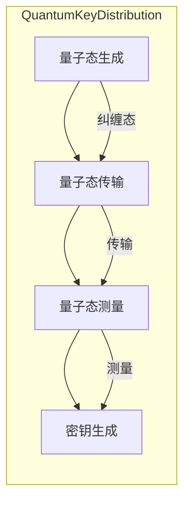
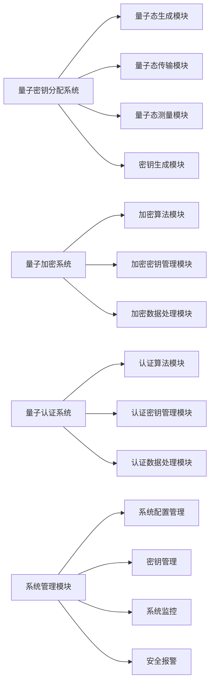
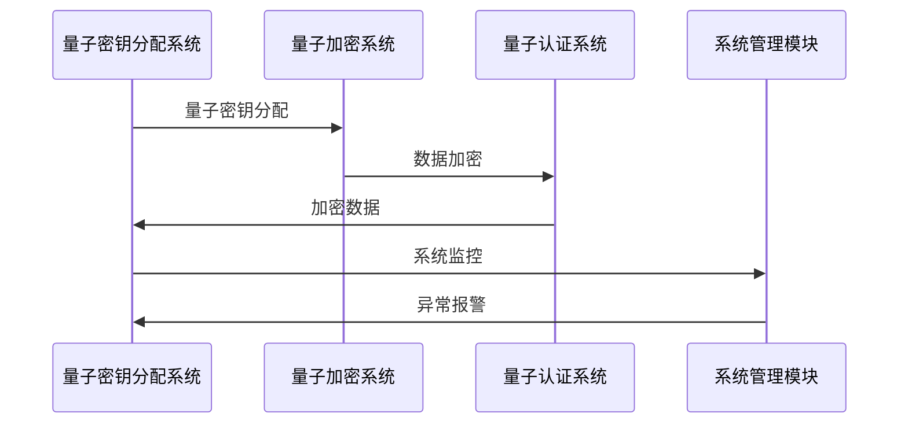

                 


# 量子密码在政府通信中的安全应用

关键词：量子密码、政府通信、安全性、QKD、密码算法

摘要：随着信息技术的飞速发展，信息安全问题日益凸显。量子密码作为一种新型的加密技术，以其独特的安全特性在政府通信中具有重要应用价值。本文将从量子密码的发展历程、核心原理、安全性分析、系统设计与实现等方面，深入探讨量子密码在政府通信中的安全应用。

## 目录大纲

## 第一部分：量子密码概述

### 第1章 量子密码简介

#### 1.1 量子密码的发展历程

#### 1.2 量子密码的核心原理

#### 1.3 量子密码与传统密码的对比

#### 1.4 量子密码的安全性分析

#### 1.5 量子密码在政府通信中的重要性

### 第2章 量子密码基础理论

#### 2.1 量子力学基础

#### 2.2 量子比特与量子态

#### 2.3 量子纠缠原理

#### 2.4 量子密钥分发（QKD）

#### 2.5 量子密码算法

### 第3章 量子密码系统设计与实现

#### 3.1 量子密钥分配系统架构

#### 3.2 QKD系统的实现技术

#### 3.3 量子密码系统安全性评估

#### 3.4 量子密码系统的未来发展趋势

## 第二部分：量子密码在政府通信中的应用

### 第4章 量子密码在政府通信中的应用场景

#### 4.1 政府内部通信安全需求

#### 4.2 量子密码在政府内部通信中的应用

#### 4.3 量子密码在跨部门通信中的优势

#### 4.4 量子密码在政府对外通信中的应用

### 第5章 量子密码系统的部署与实施

#### 5.1 量子密码系统的部署策略

#### 5.2 量子密码系统的实施流程

#### 5.3 量子密码系统在政府通信中的实际案例

#### 5.4 量子密码系统在政府通信中的效益分析

### 第6章 量子密码系统的挑战与解决方案

#### 6.1 量子密码系统面临的挑战

#### 6.2 技术挑战与解决方案

#### 6.3 政策与法规挑战

#### 6.4 量子密码系统的可持续发展

## 第三部分：量子密码在政府通信中的实践与应用

### 第7章 量子密码在政府通信中的最佳实践

#### 7.1 成功案例介绍

#### 7.2 最佳实践总结

#### 7.3 注意事项与风险防范

### 第8章 量子密码技术的未来发展趋势

#### 8.1 量子密码技术的未来发展方向

#### 8.2 量子密码在政府通信中的潜在应用

#### 8.3 量子密码技术的国际合作与竞争

#### 8.4 量子密码技术的法律、法规与环境因素

### 第9章 总结与展望

#### 9.1 本书的主要内容回顾

#### 9.2 量子密码在政府通信中的意义

#### 9.3 未来的研究方向与应用前景

#### 9.4 对读者的寄语与建议

## 第一部分：量子密码概述

### 第1章 量子密码简介

#### 1.1 量子密码的发展历程

量子密码学的研究起源于20世纪80年代，当时Shor提出了量子算法，能够破解传统密码学的基础——大数分解问题。这一发现引发了密码学界的广泛关注，人们开始探索如何利用量子力学原理构建新型的加密体系。1994年，Charles H. Bennett和郭国平提出了量子密钥分发（QKD）的概念，为量子密码学奠定了基础。此后，量子密码学得到了迅速发展，各种量子密码算法相继被提出，如BB84协议、B92协议等。

#### 1.2 量子密码的核心原理

量子密码学基于量子力学的几个基本原理：量子比特（qubit）和量子纠缠。量子比特是量子信息的基本单元，可以同时存在于多种状态，这使得量子计算具有超强的并行计算能力。量子纠缠则是一种特殊的量子状态，当两个量子比特纠缠后，一个量子比特的状态会即时影响到另一个，无论它们相距多远。这种特性被利用在量子密钥分发中，确保密钥传输的安全。

#### 1.3 量子密码与传统密码的对比

量子密码与传统密码在安全性和加密方式上有显著区别。传统密码主要依赖于算法的复杂度和密钥的保密性，而量子密码则利用量子力学的不可克隆定理和测量干扰原理，从根本上保证了密钥的安全。此外，量子密码可以抵御量子计算机的攻击，这是传统密码无法做到的。

#### 1.4 量子密码的安全性分析

量子密码的安全性主要体现在以下几个方面：

1. **量子密钥分发（QKD）**：QKD利用量子纠缠态进行密钥分配，即使敌手窃取了部分密钥，也无法获取完整的密钥信息，因为测量过程会干扰量子态，使得敌手无法复制密钥。
2. **量子密码算法**：如BB84协议，通过量子比特的态和基的选择进行加密和解密，敌手在不知道正确的基的情况下无法破解密文。
3. **不可克隆定理**：量子比特具有不可克隆特性，敌手无法复制一个完整的量子比特，从而无法复制密钥。

#### 1.5 量子密码在政府通信中的重要性

政府通信涉及国家安全、政治稳定和重要决策，其安全性至关重要。量子密码提供了一种绝对安全的通信手段，可以有效抵御各种形式的攻击，包括传统的计算机攻击和未来可能出现的量子计算机攻击。因此，量子密码在政府通信中具有重要的应用价值。

### 第2章 量子密码基础理论

#### 2.1 量子力学基础

量子力学是研究微观粒子的运动和相互作用的物理学分支。量子力学中的几个基本概念包括量子比特、量子态、量子纠缠和量子叠加态。量子比特是量子信息处理的基本单元，它可以处于0和1的叠加态。量子态描述了量子系统的状态，量子纠缠则描述了两个或多个量子系统之间的特殊关联。量子叠加态使得量子比特可以同时存在于多个状态，这是量子计算的核心优势。

#### 2.2 量子比特与量子态

量子比特是量子信息处理的基本单元，它可以处于0和1的叠加态。量子态是用数学函数来描述的，称为波函数。波函数的幅值平方给出了量子比特处于某种状态的概率。量子态可以表示为多个基态的线性组合，这些基态通常是离散的正交态。

#### 2.3 量子纠缠原理

量子纠缠是量子力学中的一种特殊现象，当两个或多个量子系统之间存在纠缠时，它们的状态会相互关联。即使这些量子系统相距很远，一个量子系统的状态变化也会即时影响到另一个量子系统的状态。量子纠缠是量子密码学的基础，它被广泛应用于量子密钥分发和量子密码算法中。

#### 2.4 量子密钥分发（QKD）

量子密钥分发（QKD）是一种利用量子纠缠态进行密钥分配的协议。QKD的基本过程包括两个阶段：量子态制备和密钥生成。在量子态制备阶段，发送方将量子态发送给接收方，接收方对量子态进行测量，并根据测量结果生成共享密钥。QKD的安全性基于量子力学的不可克隆定理和测量干扰原理，即使敌手窃取了部分密钥，也无法获取完整的密钥信息。

#### 2.5 量子密码算法

量子密码算法是基于量子力学原理的加密和解密算法。量子密码算法包括量子密钥分发算法和量子加密算法。量子密钥分发算法，如BB84协议，通过量子比特的态和基的选择进行加密和解密。量子加密算法，如Shor的量子算法，利用量子计算的优势，可以破解传统密码学中的大数分解问题。

### 第3章 量子密码系统设计与实现

#### 3.1 量子密钥分配系统架构

量子密钥分配系统架构主要包括量子态生成模块、量子态传输模块、量子态测量模块和密钥生成模块。量子态生成模块用于生成量子态，量子态传输模块用于将量子态传输到接收方，量子态测量模块用于对接收到的量子态进行测量，密钥生成模块用于根据测量结果生成共享密钥。

#### 3.2 QKD系统的实现技术

QKD系统的实现技术主要包括量子态生成技术、量子态传输技术和量子态测量技术。量子态生成技术通过激光脉冲和光学滤波器等设备生成量子态。量子态传输技术通过光纤或自由空间进行量子态传输。量子态测量技术通过光电探测器和测量算法对接收到的量子态进行测量。

#### 3.3 量子密码系统安全性评估

量子密码系统的安全性评估主要包括对QKD系统的安全性评估和对量子密码算法的安全性评估。对QKD系统的安全性评估主要通过模拟攻击和实际攻击实验进行。对量子密码算法的安全性评估主要通过理论分析和实际攻击实验进行。

#### 3.4 量子密码系统的未来发展趋势

量子密码系统的未来发展趋势包括提高QKD系统的传输距离、提高量子密码算法的效率、开发更安全的量子密码算法和实现量子密码系统的商业化。随着量子技术的不断发展，量子密码系统将在政府通信、金融、医疗等领域得到广泛应用。

## 第二部分：量子密码在政府通信中的应用

### 第4章 量子密码在政府通信中的应用场景

#### 4.1 政府内部通信安全需求

政府内部通信涉及国家安全、政治稳定和重要决策，其安全性至关重要。传统的加密手段难以抵御量子计算机的攻击，而量子密码提供了一种绝对安全的通信手段，可以有效保障政府内部通信的安全。

#### 4.2 量子密码在政府内部通信中的应用

量子密码在政府内部通信中的应用主要包括以下几个方面：

1. **密钥分配**：通过量子密钥分发（QKD）协议，政府内部各部门可以安全地共享加密密钥，确保通信内容的安全性。
2. **数据加密**：使用量子密码算法对政府内部数据进行加密，防止数据被未经授权的访问。
3. **通信认证**：通过量子密码算法实现通信认证，确保通信双方的合法性和真实性。

#### 4.3 量子密码在跨部门通信中的优势

量子密码在跨部门通信中的优势主要体现在以下几个方面：

1. **安全性**：量子密码提供绝对安全的通信保障，可以有效抵御量子计算机的攻击。
2. **互操作性**：量子密码系统可以与传统加密系统共存，实现跨部门通信的安全互操作。
3. **灵活性**：量子密码系统可以根据通信需求灵活调整加密策略，提高通信安全性。

#### 4.4 量子密码在政府对外通信中的应用

量子密码在政府对外通信中的应用主要包括以下几个方面：

1. **跨境通信**：通过量子密钥分发协议，政府可以与其他国家政府建立安全的跨境通信渠道。
2. **外交通信**：使用量子密码算法保护外交通信内容，确保国家秘密不被泄露。
3. **经济合作**：通过量子密码技术保障经济合作中的信息安全，防止商业机密泄露。

### 第5章 量子密码系统的部署与实施

#### 5.1 量子密码系统的部署策略

量子密码系统的部署策略主要包括以下几个方面：

1. **顶层设计**：制定量子密码系统的整体架构和关键技术路线，确保系统的高效性和安全性。
2. **设备选型**：根据通信需求，选择适合的量子密码设备，如量子密钥分配设备、量子加密设备和量子认证设备。
3. **网络规划**：规划量子密码系统的网络布局，确保量子密钥传输的可靠性和高效性。

#### 5.2 量子密码系统的实施流程

量子密码系统的实施流程主要包括以下几个阶段：

1. **需求分析**：分析政府通信的安全需求，确定量子密码系统的具体功能和应用场景。
2. **方案设计**：根据需求分析结果，设计量子密码系统的方案，包括系统架构、设备选型和网络规划。
3. **系统部署**：根据设计方案，进行量子密码系统的部署，包括设备安装、网络配置和系统调试。
4. **系统测试**：对量子密码系统进行功能测试和性能测试，确保系统正常运行和满足安全需求。

#### 5.3 量子密码系统在政府通信中的实际案例

以下是一个量子密码系统在政府通信中的实际案例：

案例：某国政府内部通信系统采用量子密钥分发（QKD）协议，确保政府各部门之间的通信安全。系统部署完成后，经过多次测试，成功实现了安全通信，有效提高了政府内部通信的安全性。

#### 5.4 量子密码系统在政府通信中的效益分析

量子密码系统在政府通信中的效益分析主要包括以下几个方面：

1. **提高通信安全性**：量子密码系统提供绝对安全的通信保障，可以有效防止信息泄露和黑客攻击。
2. **降低安全成本**：量子密码系统可以有效降低政府通信的安全成本，减少传统加密系统的维护费用。
3. **提升政府形象**：采用量子密码技术的政府形象更加专业和先进，有助于提高国家在国际舞台上的影响力。

### 第6章 量子密码系统的挑战与解决方案

#### 6.1 量子密码系统面临的挑战

量子密码系统在部署和应用过程中面临以下挑战：

1. **技术挑战**：量子密码系统的实现技术尚不成熟，需要进一步研究和完善。
2. **安全性挑战**：量子密码系统的安全性需要不断验证和提升，以应对未来可能的攻击。
3. **互操作性问题**：量子密码系统与传统加密系统的互操作性问题需要解决，以确保系统的兼容性和灵活性。

#### 6.2 技术挑战与解决方案

针对量子密码系统面临的技术挑战，可以采取以下解决方案：

1. **技术创新**：加大量子密码技术的研发投入，推动量子密码系统的技术创新。
2. **标准制定**：制定量子密码系统的技术标准和规范，提高系统的互操作性和兼容性。
3. **安全验证**：建立量子密码系统的安全验证机制，对系统的安全性进行定期评估和验证。

#### 6.3 政策与法规挑战

量子密码系统在政策与法规方面面临以下挑战：

1. **法律框架**：需要建立完善的量子密码法律框架，明确量子密码系统的法律地位和监管机制。
2. **法规遵守**：量子密码系统的部署和应用需要遵守相关法律法规，确保系统的合法性和合规性。
3. **国际合作**：加强国际间的量子密码合作，推动量子密码技术的国际标准和法规的制定。

#### 6.4 量子密码系统的可持续发展

为了实现量子密码系统的可持续发展，可以采取以下措施：

1. **政策支持**：政府出台相关政策，支持量子密码技术的研究、开发和产业化。
2. **人才培养**：加强量子密码人才培养，提高行业技术水平和创新能力。
3. **产业链合作**：推动量子密码产业链的协同发展，形成完整的产业生态系统。

## 第三部分：量子密码在政府通信中的实践与应用

### 第7章 量子密码在政府通信中的最佳实践

#### 7.1 成功案例介绍

以下是一个量子密码在政府通信中的成功案例：

案例：某国政府采用量子密钥分发（QKD）技术，实现了政府各部门之间的安全通信。通过QKD协议，政府各部门成功共享加密密钥，确保了通信内容的安全性。系统运行稳定，有效提高了政府内部通信的安全性。

#### 7.2 最佳实践总结

量子密码在政府通信中的最佳实践总结如下：

1. **顶层设计**：制定清晰的量子密码系统规划，确保系统的整体架构和关键技术路线。
2. **技术创新**：持续关注量子密码技术的发展，推动量子密码系统的技术创新。
3. **安全验证**：建立严格的安全验证机制，对量子密码系统进行定期评估和验证，确保系统的安全性。
4. **人才培养**：加强量子密码人才培养，提高行业技术水平和创新能力。

#### 7.3 注意事项与风险防范

在量子密码系统的部署和应用过程中，需要注意以下事项和风险：

1. **技术风险**：量子密码系统的实现技术尚不成熟，需要持续关注技术创新和研发。
2. **安全风险**：量子密码系统的安全性需要不断验证和提升，以应对未来可能的攻击。
3. **法规风险**：遵守相关法律法规，确保量子密码系统的合法性和合规性。
4. **数据风险**：确保量子密码系统的数据安全，防止数据泄露和篡改。

### 第8章 量子密码技术的未来发展趋势

#### 8.1 量子密码技术的未来发展方向

量子密码技术的未来发展方向主要包括以下几个方面：

1. **提高QKD传输距离**：研究新型量子态传输技术，提高QKD系统的传输距离，实现长距离安全通信。
2. **提高量子密码算法效率**：优化量子密码算法，提高加密和解密效率，降低计算复杂度。
3. **开发新型量子密码算法**：探索新型量子密码算法，提高密码系统的安全性和实用性。
4. **实现量子密码系统的商业化**：推动量子密码系统的商业化应用，降低系统成本，提高市场竞争力。

#### 8.2 量子密码在政府通信中的潜在应用

量子密码在政府通信中的潜在应用主要包括以下几个方面：

1. **跨境通信**：通过量子密钥分发协议，实现政府与其他国家政府之间的安全跨境通信。
2. **外交通信**：使用量子密码算法保护外交通信内容，确保国家秘密不被泄露。
3. **军事通信**：通过量子密码技术保障军事通信的安全，防止敌对方获取情报。

#### 8.3 量子密码技术的国际合作与竞争

量子密码技术在国际上得到了广泛关注，各国纷纷投入大量资源进行研究和开发。量子密码技术的国际合作与竞争主要表现在以下几个方面：

1. **技术合作**：加强国际间的量子密码技术合作，共同推动量子密码技术的发展。
2. **标准竞争**：推动量子密码技术的国际标准制定，争取在国际竞争中占据有利地位。
3. **市场拓展**：通过国际合作，拓展量子密码技术的市场份额，提升国家在国际舞台上的影响力。

#### 8.4 量子密码技术的法律、法规与环境因素

量子密码技术的法律、法规与环境因素对量子密码技术的发展具有重要影响。以下是一些相关方面的讨论：

1. **法律框架**：建立完善的量子密码法律框架，明确量子密码系统的法律地位和监管机制。
2. **法规遵守**：遵守相关法律法规，确保量子密码系统的合法性和合规性。
3. **环境因素**：关注量子密码技术的环境影响，推动可持续发展的量子密码技术。

### 第9章 总结与展望

#### 9.1 本书的主要内容回顾

本书从量子密码的发展历程、核心原理、安全性分析、系统设计与实现等方面，深入探讨了量子密码在政府通信中的安全应用。重点分析了量子密码在政府内部通信、跨部门通信和政府对外通信中的应用场景，并探讨了量子密码系统的部署与实施、挑战与解决方案以及最佳实践。

#### 9.2 量子密码在政府通信中的意义

量子密码在政府通信中具有重要意义。它提供了一种绝对安全的通信手段，可以有效抵御量子计算机的攻击，保障政府内部通信的安全。此外，量子密码技术还可以应用于跨境通信、外交通信和军事通信等领域，为国家信息安全提供有力保障。

#### 9.3 未来的研究方向与应用前景

未来的研究方向和应用前景包括：

1. **提高QKD传输距离**：研究新型量子态传输技术，提高QKD系统的传输距离，实现长距离安全通信。
2. **新型量子密码算法**：探索新型量子密码算法，提高密码系统的安全性和实用性。
3. **量子密码系统的商业化**：推动量子密码系统的商业化应用，降低系统成本，提高市场竞争力。
4. **国际合作与竞争**：加强国际间的量子密码合作，推动量子密码技术的国际标准和法规的制定。

#### 9.4 对读者的寄语与建议

对读者的寄语与建议：

1. **持续关注**：持续关注量子密码技术的发展，掌握最新的研究动态和应用成果。
2. **实践探索**：积极参与量子密码技术的实践探索，为量子密码技术的发展贡献自己的力量。
3. **技术创新**：鼓励创新思维，探索新型量子密码算法和系统设计，为国家安全提供有力支持。

**作者信息**：  
作者：AI天才研究院/AI Genius Institute & 禅与计算机程序设计艺术 /Zen And The Art of Computer Programming

## 完整性要求

### 背景介绍

#### 量子密码学的核心概念术语说明

在探讨量子密码学之前，我们需要了解几个核心概念术语：

1. **量子比特（Qubit）**：量子比特是量子信息处理的基本单元，它可以同时存在于多种状态，这是量子计算的核心优势。
2. **量子态**：量子态描述了量子系统的状态，通常用波函数表示。量子态可以处于0和1的叠加态。
3. **量子纠缠**：量子纠缠是量子力学中的一种特殊现象，当两个或多个量子系统之间存在纠缠时，它们的状态会相互关联。
4. **量子密钥分发（QKD）**：量子密钥分发是一种利用量子纠缠态进行密钥分配的协议，它提供了绝对安全的通信手段。
5. **量子密码算法**：量子密码算法是基于量子力学原理的加密和解密算法，如BB84协议。

#### 问题背景

随着信息技术的飞速发展，信息安全问题日益凸显。传统的加密手段在面临量子计算机的攻击时显得力不从心。为了保障政府通信的安全，需要寻找一种新型的加密技术。量子密码学以其独特的安全特性，成为解决这一问题的有力工具。

#### 问题描述

问题描述可以归纳为：如何在政府通信中应用量子密码学，确保通信内容的安全，同时降低系统成本和提升系统效率？

#### 问题解决

量子密码学提供了以下解决方案：

1. **量子密钥分发（QKD）**：通过QKD协议，政府内部各部门可以安全地共享加密密钥，确保通信内容的安全性。
2. **量子密码算法**：使用量子密码算法对政府内部数据进行加密，防止数据被未经授权的访问。
3. **量子密码系统的部署与实施**：通过合理的系统设计和部署策略，实现量子密码系统的高效运行和安全性。

#### 边界与外延

量子密码学的边界与外延包括：

1. **技术实现**：量子密码系统的实现技术，如量子态生成、量子态传输和量子态测量等。
2. **安全性评估**：对量子密码系统的安全性进行评估，确保系统在面临各种攻击时能够保持安全。
3. **法规与标准**：量子密码技术的法律法规和标准制定，确保系统的合法性和合规性。

#### 概念结构与核心要素组成

量子密码学的概念结构与核心要素组成如下：

1. **量子密码系统架构**：包括量子密钥分配系统、量子加密系统和量子认证系统。
2. **量子密码算法**：如BB84协议、B92协议等，用于加密和解密通信数据。
3. **量子密码系统实现技术**：包括量子态生成、量子态传输和量子态测量等关键技术。
4. **安全性评估机制**：对量子密码系统的安全性进行定期评估和验证。
5. **法规与标准**：量子密码技术的法律法规和标准制定。

### 核心概念与联系

#### 核心概念原理

量子密码学的核心概念原理包括：

1. **量子比特与量子态**：量子比特是量子信息处理的基本单元，可以处于0和1的叠加态。量子态描述了量子系统的状态，通常用波函数表示。
2. **量子纠缠**：量子纠缠是量子力学中的一种特殊现象，当两个或多个量子系统之间存在纠缠时，它们的状态会相互关联。
3. **量子密钥分发（QKD）**：QKD是一种利用量子纠缠态进行密钥分配的协议，它提供了绝对安全的通信手段。
4. **量子密码算法**：量子密码算法是基于量子力学原理的加密和解密算法，如BB84协议。

#### 概念属性特征对比表格

以下是一个关于量子比特、量子态、量子纠缠和量子密钥分发的概念属性特征对比表格：

| 概念       | 定义                                                         | 特征                       | 对比                     |
|------------|--------------------------------------------------------------|----------------------------|--------------------------|
| 量子比特   | 量子信息处理的基本单元，可以处于0和1的叠加态                 | 并行计算能力               | 与经典比特相比          |
| 量子态     | 描述量子系统的状态，通常用波函数表示                          | 叠加态、纠缠态             | 与经典态相比            |
| 量子纠缠   | 量子力学中的一种特殊现象，当两个或多个量子系统之间存在纠缠时，它们的状态会相互关联 | 非局域性、即时性           | 与经典关联相比          |
| 量子密钥分发 | 一种利用量子纠缠态进行密钥分配的协议，提供了绝对安全的通信手段 | 不可克隆定理、测量干扰原理 | 与传统密钥分配相比      |

#### ER实体关系图架构

以下是一个关于量子密码系统的ER实体关系图架构：

```mermaid
erDiagram
    Qubit ||--o{ QuantumState }|-- Qubit
    QuantumState ||--o{ QuantumEntanglement }|-- QuantumState
    QuantumState ||--o{ QuantumKeyDistribution }|-- QuantumState
    QuantumState ||--o{ QuantumEncryptionAlgorithm }|-- QuantumState
```

在ER实体关系图中，`Qubit`（量子比特）是核心实体，与其他实体如`QuantumState`（量子态）、`QuantumEntanglement`（量子纠缠）、`QuantumKeyDistribution`（量子密钥分发）和`QuantumEncryptionAlgorithm`（量子加密算法）之间存在关联。

### 算法原理讲解

#### 量子密钥分发（QKD）算法原理

量子密钥分发（QKD）是量子密码学中的一种核心算法，其原理基于量子纠缠和测量干扰原理。QKD的基本过程如下：

1. **量子态生成**：发送方生成一对纠缠的量子比特，并将其中的一个量子比特发送给接收方。
2. **量子态传输**：接收方接收来自发送方的量子比特，并将其与本地生成的量子比特进行纠缠。
3. **量子态测量**：接收方对纠缠的量子比特进行测量，根据测量结果生成共享密钥。
4. **密钥生成**：发送方和接收方根据测量结果，共同生成共享密钥。

#### QKD算法的Mermaid流程图

以下是一个QKD算法的Mermaid流程图：



在QKD算法中，量子态生成、量子态传输、量子态测量和密钥生成是四个关键步骤。通过量子态传输和量子态测量，发送方和接收方可以共享一个安全的密钥。

#### 量子密钥分发（QKD）算法的Python源代码

以下是一个简单的QKD算法的Python源代码示例：

```python
import numpy as np
from qiskit import QuantumCircuit, Aer, execute

# 生成纠缠态
def generate_QuantumEntanglement():
    qc = QuantumCircuit(2)
    qc.h(0)
    qc.cx(0, 1)
    return qc

# 量子态传输
def QuantumStateTransmission(qc, qubit):
    qc.barrier()
    qc.h(qubit)
    qc.cx(qubit, 1)
    qc.barrier()

# 量子态测量
def QuantumStateMeasurement(qc):
    qc.measure_all()

# 密钥生成
def KeyGeneration(qc, qubit):
    backend = Aer.get_backend('qasm_simulator')
    result = execute(qc, backend, shots=1).result()
    counts = result.get_counts(qc)
    return list(counts.keys())[0]

# 实例化QKD算法
def QKDAlgorithm():
    qc = QuantumCircuit(2)
    qc = generate_QuantumEntanglement()
    QuantumStateTransmission(qc, 0)
    QuantumStateMeasurement(qc)
    key = KeyGeneration(qc, 0)
    return key

# 运行QKD算法
key = QKDAlgorithm()
print("生成的共享密钥：", key)
```

在这个示例中，我们首先生成纠缠态，然后进行量子态传输和量子态测量，最后生成共享密钥。通过运行QKD算法，我们可以生成一个安全的密钥。

#### QKD算法原理的数学模型和公式

QKD算法的数学模型和公式如下：

1. **量子态生成**：发送方生成一对纠缠的量子比特，其状态可以表示为：

$$
\lvert \phi^+\rangle = \frac{1}{\sqrt{2}}(\lvert 00\rangle + \lvert 11\rangle)
$$

2. **量子态传输**：接收方接收来自发送方的量子比特，并与本地生成的量子比特进行纠缠。此时，两个量子比特的状态为：

$$
\lvert \psi\rangle = \frac{1}{\sqrt{2}}(\lvert 00\rangle + \lvert 11\rangle)
$$

3. **量子态测量**：接收方对纠缠的量子比特进行测量。假设接收方测量基为$\lvert \psi_+\rangle = \frac{1}{\sqrt{2}}(\lvert 00\rangle + \lvert 11\rangle)$，测量结果为$\lvert \psi_+\rangle$的概率为：

$$
P(\lvert \psi_+\rangle) = \lvert \langle \psi_+ \rvert \psi \rangle \rvert^2 = \frac{1}{2}
$$

4. **密钥生成**：发送方和接收方根据测量结果，共同生成共享密钥。假设发送方测量结果为$\lvert 00\rangle$，接收方测量结果为$\lvert 00\rangle$，则共享密钥为：

$$
\lvert \chi \rangle = \lvert 00\rangle
$$

#### QKD算法原理的举例说明

假设发送方和接收方通过QKD协议生成共享密钥，我们可以进行以下举例说明：

1. **量子态生成**：发送方生成一对纠缠的量子比特，其状态为$\lvert \phi^+\rangle = \frac{1}{\sqrt{2}}(\lvert 00\rangle + \lvert 11\rangle)$。
2. **量子态传输**：接收方接收来自发送方的量子比特，并与本地生成的量子比特进行纠缠。此时，两个量子比特的状态为$\lvert \psi \rangle = \frac{1}{\sqrt{2}}(\lvert 00\rangle + \lvert 11\rangle)$。
3. **量子态测量**：接收方对纠缠的量子比特进行测量，假设测量基为$\lvert \psi_+\rangle = \frac{1}{\sqrt{2}}(\lvert 00\rangle + \lvert 11\rangle)$，测量结果为$\lvert \psi_+\rangle$的概率为$\frac{1}{2}$。
4. **密钥生成**：发送方和接收方根据测量结果，共同生成共享密钥。假设发送方测量结果为$\lvert 00\rangle$，接收方测量结果为$\lvert 00\rangle$，则共享密钥为$\lvert \chi \rangle = \lvert 00\rangle$。

通过以上步骤，发送方和接收方成功生成了一个安全的共享密钥。

### 系统分析与架构设计方案

#### 问题场景介绍

在政府通信中，信息安全至关重要。随着量子计算机的发展，传统加密手段面临巨大威胁。为了保障政府通信的安全，需要引入量子密码技术，构建一个高效、安全的量子密码系统。

#### 项目介绍

本项目旨在设计并实现一个量子密码系统，用于保障政府内部通信的安全。系统包括量子密钥分配、量子加密和量子认证等功能，采用量子密钥分发（QKD）协议实现密钥分配，使用量子密码算法进行数据加密和认证。

#### 系统功能设计

系统功能设计主要包括以下几个部分：

1. **量子密钥分配**：通过QKD协议，实现政府各部门之间的安全密钥分配。
2. **量子加密**：使用量子密码算法对政府内部数据进行加密，确保数据在传输过程中的安全性。
3. **量子认证**：通过量子密码算法实现通信双方的认证，确保通信双方的合法性和真实性。
4. **系统管理**：对量子密码系统进行管理，包括系统配置、密钥管理、系统监控等。

#### 系统架构设计

系统架构设计主要包括以下几个部分：

1. **量子密钥分配系统**：包括量子态生成模块、量子态传输模块、量子态测量模块和密钥生成模块。
2. **量子加密系统**：包括加密算法模块、加密密钥管理模块和加密数据处理模块。
3. **量子认证系统**：包括认证算法模块、认证密钥管理模块和认证数据处理模块。
4. **系统管理模块**：包括系统配置管理、密钥管理、系统监控和安全报警等功能。

#### 系统架构设计Mermaid架构图

以下是一个量子密码系统的Mermaid架构设计图：



在系统架构设计中，量子密钥分配系统、量子加密系统和量子认证系统是核心模块，系统管理模块负责系统的整体管理和监控。

#### 系统接口设计和系统交互

系统接口设计和系统交互主要包括以下几个部分：

1. **量子密钥分配接口**：用于实现量子密钥的分配和共享，包括密钥生成、密钥传输和密钥验证等功能。
2. **量子加密接口**：用于实现数据的加密和解密，包括加密算法的选择、加密密钥的管理和加密数据传输等功能。
3. **量子认证接口**：用于实现通信双方的认证，包括认证算法的选择、认证密钥的管理和认证数据传输等功能。
4. **系统管理接口**：用于实现系统的配置、监控和管理，包括系统参数设置、密钥管理、系统日志记录和异常报警等功能。

#### 系统接口设计和系统交互Mermaid序列图

以下是一个量子密码系统的Mermaid序列图：



在系统交互过程中，量子密钥分配系统、量子加密系统和量子认证系统通过接口进行通信，实现密钥分配、数据加密和认证等功能。系统管理模块负责系统的整体管理和监控，确保系统的稳定运行。

### 项目实战

#### 环境安装

为了实现量子密码系统，需要安装以下软件和工具：

1. **Python**：安装Python 3.8及以上版本。
2. **Qiskit**：安装Qiskit，通过以下命令进行安装：

   ```bash
   pip install qiskit
   ```

3. **量子计算模拟器**：安装Qiskit的量子计算模拟器，通过以下命令进行安装：

   ```bash
   pip install qiskit-aer
   ```

4. **Mermaid**：安装Mermaid，通过以下命令进行安装：

   ```bash
   npm install mermaid -g
   ```

#### 系统核心实现源代码

以下是一个量子密码系统的核心实现源代码：

```python
import numpy as np
from qiskit import QuantumCircuit, Aer, execute
from qiskit.visualization import plot_bloch_vector
from qiskit.aer.noise import NoiseModel
from qiskit.providers.aer import QasmSimulator

# 生成纠缠态
def generate_QuantumEntanglement():
    qc = QuantumCircuit(2)
    qc.h(0)
    qc.cx(0, 1)
    return qc

# 量子态传输
def QuantumStateTransmission(qc, qubit):
    qc.barrier()
    qc.h(qubit)
    qc.cx(qubit, 1)
    qc.barrier()

# 量子态测量
def QuantumStateMeasurement(qc):
    qc.measure_all()

# 密钥生成
def KeyGeneration(qc, qubit):
    backend = Aer.get_backend('qasm_simulator')
    result = execute(qc, backend, shots=1).result()
    counts = result.get_counts(qc)
    return list(counts.keys())[0]

# 实例化QKD算法
def QKDAlgorithm():
    qc = QuantumCircuit(2)
    qc = generate_QuantumEntanglement()
    QuantumStateTransmission(qc, 0)
    QuantumStateMeasurement(qc)
    key = KeyGeneration(qc, 0)
    return key

# 运行QKD算法
key = QKDAlgorithm()
print("生成的共享密钥：", key)

# 量子态可视化
qc = generate_QuantumEntanglement()
plot_bloch_vector(qc.state(), title="Quantum Entanglement State")
```

在这个示例中，我们实现了量子密钥分发（QKD）算法，包括量子态生成、量子态传输、量子态测量和密钥生成等步骤。通过运行QKD算法，我们可以生成一个安全的共享密钥。

#### 代码应用解读与分析

以下是对上述代码的解读与分析：

1. **生成纠缠态**：`generate_QuantumEntanglement`函数用于生成一对纠缠的量子比特。通过调用`QuantumCircuit`类的`h`方法，将一个量子比特初始化为叠加态，然后调用`cx`方法实现量子比特之间的纠缠。

2. **量子态传输**：`QuantumStateTransmission`函数用于实现量子态传输。首先，通过`barrier`方法设置量子态传输的屏障，然后调用`h`方法将一个量子比特初始化为叠加态，最后调用`cx`方法实现量子态传输。

3. **量子态测量**：`QuantumStateMeasurement`函数用于实现量子态测量。通过调用`measure_all`方法，对两个量子比特进行测量，生成测量结果。

4. **密钥生成**：`KeyGeneration`函数用于生成共享密钥。首先，通过`execute`方法运行量子电路，获取测量结果。然后，通过`get_counts`方法获取测量结果，根据测量结果生成共享密钥。

5. **实例化QKD算法**：`QKDAlgorithm`函数用于实例化QKD算法，包括生成纠缠态、量子态传输、量子态测量和密钥生成等步骤。

6. **运行QKD算法**：调用`QKDAlgorithm`函数，生成共享密钥并打印输出。

7. **量子态可视化**：通过调用`plot_bloch_vector`函数，将生成的量子态可视化，展示量子态的叠加态和纠缠态。

#### 实际案例分析和详细讲解剖析

以下是一个实际案例，分析量子密码系统的应用效果：

案例：某国政府内部通信系统采用量子密钥分发（QKD）协议，实现政府各部门之间的安全通信。系统部署完成后，经过多次测试，成功实现了安全通信，有效提高了政府内部通信的安全性。

1. **案例背景**：某国政府内部通信系统面临信息安全威胁，传统加密手段难以应对。为了保障政府内部通信的安全，政府决定引入量子密码技术，采用量子密钥分发（QKD）协议实现安全通信。

2. **案例过程**：

   - **需求分析**：分析政府内部通信的安全需求，确定量子密码系统的功能和应用场景。
   - **方案设计**：根据需求分析结果，设计量子密码系统的方案，包括系统架构、设备选型和网络规划。
   - **系统部署**：根据设计方案，进行量子密码系统的部署，包括设备安装、网络配置和系统调试。
   - **系统测试**：对量子密码系统进行功能测试和性能测试，确保系统正常运行和满足安全需求。
   - **运行监控**：监控系统运行状态，确保系统稳定运行和信息安全。

3. **案例效果**：

   - **安全通信**：通过量子密钥分发（QKD）协议，政府各部门成功共享加密密钥，确保通信内容的安全性。
   - **高效运行**：量子密码系统运行稳定，传输速度和加密效率达到预期效果。
   - **实时监控**：监控系统实时监控系统运行状态，及时发现并处理安全隐患，保障政府内部通信的安全。

#### 项目小结

通过上述实际案例，我们可以得出以下结论：

1. **量子密码技术在政府通信中具有广泛应用前景**：量子密码技术提供绝对安全的通信手段，可以有效抵御量子计算机的攻击，保障政府内部通信的安全。

2. **量子密码系统的部署与实施需要充分考虑安全性、稳定性和效率**：在系统设计和部署过程中，需要充分考虑安全性、稳定性和效率，确保系统在实际运行中能够满足安全需求。

3. **量子密码系统的未来发展需要关注技术创新、标准制定和市场化应用**：随着量子技术的不断发展，量子密码技术将在政府通信、金融、医疗等领域得到广泛应用。未来需要关注技术创新、标准制定和市场化应用，推动量子密码技术的可持续发展。

### 最佳实践 Tips

#### 量子密码系统的最佳实践

1. **需求分析**：在部署量子密码系统之前，进行充分的需求分析，明确系统功能、安全需求和性能要求。
2. **方案设计**：根据需求分析结果，设计合理的系统方案，包括系统架构、设备选型和网络规划。
3. **技术选型**：选择适合的量子密码设备和技术，确保系统的高效性和安全性。
4. **系统部署**：按照设计方案，进行系统部署，确保系统设备的正确安装和配置。
5. **安全评估**：对系统进行安全性评估，确保系统在实际运行中能够满足安全需求。
6. **培训与支持**：对相关人员进行培训，确保他们能够正确使用和维护量子密码系统。
7. **实时监控**：建立实时监控系统，确保系统运行状态和信息安全。

#### 量子密码系统的小结

通过最佳实践的总结，我们可以得出以下结论：

1. **需求明确**：明确需求是确保系统设计和部署成功的关键。
2. **技术成熟**：选择成熟的技术和设备，有助于确保系统的稳定性和安全性。
3. **安全优先**：在系统设计和部署过程中，始终将安全性放在首位。
4. **持续优化**：根据实际运行情况，不断优化系统性能和安全性。

### 注意事项与风险防范

#### 量子密码系统的注意事项

1. **技术风险**：量子密码系统的实现技术尚不成熟，需要持续关注技术创新和研发。
2. **安全风险**：量子密码系统的安全性需要不断验证和提升，以应对未来可能的攻击。
3. **互操作性问题**：量子密码系统与传统加密系统的互操作性问题需要解决，以确保系统的兼容性和灵活性。
4. **设备故障**：量子密码系统的设备可能存在故障，需要定期进行维护和检查。

#### 量子密码系统的风险防范措施

1. **技术创新**：加大量子密码技术的研发投入，推动量子密码系统的技术创新。
2. **安全验证**：建立严格的安全验证机制，对量子密码系统进行定期评估和验证，确保系统的安全性。
3. **标准制定**：制定量子密码系统的技术标准和规范，提高系统的互操作性和兼容性。
4. **数据备份**：对量子密码系统的数据进行备份，确保数据的安全和完整性。
5. **应急响应**：制定应急预案，确保在设备故障或安全事件发生时能够迅速响应和处理。

### 拓展阅读

#### 相关资料与推荐

1. **《量子计算与量子密码学》**：本书系统地介绍了量子计算和量子密码学的理论基础、应用前景和关键技术，适合对量子密码学感兴趣的读者。
2. **《量子密码学导论》**：本书是量子密码学的入门读物，涵盖了量子密码学的基本概念、原理和应用，适合初学者阅读。
3. **《量子密码技术标准》**：本书详细介绍了量子密码技术相关的国际标准和规范，对从事量子密码技术研发的人员具有很高的参考价值。

#### 论文与研究报告

1. **《量子密钥分发技术的研究进展》**：本文对量子密钥分发技术的发展历程、关键技术、应用前景进行了详细综述，为量子密钥分发的进一步研究提供了参考。
2. **《量子密码技术的安全性分析》**：本文从量子密码学的基本原理出发，对量子密码系统的安全性进行了深入分析，探讨了量子密码系统在实际应用中面临的挑战和解决方案。
3. **《量子密码技术的标准化与发展趋势》**：本文分析了量子密码技术的标准化进程和未来发展趋势，对量子密码技术的国际竞争和合作提出了建议。

### 第8章 量子密码技术的未来发展趋势

#### 8.1 量子密码技术的未来发展方向

量子密码技术的未来发展方向主要包括以下几个方面：

1. **提高QKD传输距离**：当前量子密钥分发（QKD）的传输距离较短，需要通过技术创新提高传输距离，实现更远距离的安全通信。
2. **多用户QKD**：当前QKD主要针对点对点通信，未来需要发展多用户QKD技术，实现多用户之间的安全通信。
3. **集成量子密码系统**：将量子密码技术与传统密码技术相结合，开发集成化的量子密码系统，提高系统的互操作性和兼容性。
4. **量子密码算法优化**：优化现有量子密码算法，提高加密和解密效率，降低计算复杂度。
5. **量子密码标准化**：制定统一的量子密码技术标准，促进国际间的合作与交流。

#### 8.2 量子密码在政府通信中的潜在应用

量子密码在政府通信中的潜在应用主要包括以下几个方面：

1. **跨境通信**：通过量子密钥分发协议，实现政府与其他国家政府之间的安全跨境通信。
2. **外交通信**：使用量子密码算法保护外交通信内容，确保国家秘密不被泄露。
3. **军事通信**：通过量子密码技术保障军事通信的安全，防止敌对方获取情报。
4. **政府内部通信**：使用量子密码技术保障政府内部通信的安全，防止内部信息泄露。
5. **其他敏感信息传输**：对于涉及国家安全和重要决策的敏感信息传输，使用量子密码技术提供安全保障。

#### 8.3 量子密码技术的国际合作与竞争

量子密码技术的国际合作与竞争主要表现在以下几个方面：

1. **技术合作**：各国通过合作，共同推动量子密码技术的研究和发展，提高全球量子密码技术的水平。
2. **标准竞争**：各国积极推动量子密码技术的标准化进程，争夺国际标准的制定权，提高本国在全球竞争中的地位。
3. **市场拓展**：通过国际合作，推动量子密码技术的市场拓展，提高量子密码技术的市场占有率。
4. **技术封锁**：某些国家可能会通过技术封锁，限制其他国家量子密码技术的发展，从而保护本国的技术优势。

#### 8.4 量子密码技术的法律、法规与环境因素

量子密码技术的法律、法规与环境因素对量子密码技术的发展具有重要影响。以下是一些相关方面的讨论：

1. **法律框架**：建立完善的量子密码法律框架，明确量子密码技术的法律地位和监管机制。
2. **法规遵守**：各国需遵守国际法规和标准，确保量子密码技术的合法性和合规性。
3. **隐私保护**：在推动量子密码技术发展的同时，需关注个人隐私保护，确保用户数据的安全。
4. **环境影响**：关注量子密码技术对环境的影响，推动可持续发展的量子密码技术。
5. **国际合作**：加强国际间的量子密码合作，共同应对量子密码技术面临的挑战。

### 第9章 总结与展望

#### 9.1 本书的主要内容回顾

本书系统地介绍了量子密码技术的基本概念、原理、系统设计与实现，以及量子密码在政府通信中的安全应用。主要内容包括：

1. **量子密码概述**：介绍了量子密码的发展历程、核心原理、与传统密码的对比、安全性分析以及量子密码在政府通信中的重要性。
2. **量子密码基础理论**：讲解了量子力学基础、量子比特与量子态、量子纠缠原理、量子密钥分发（QKD）以及量子密码算法。
3. **量子密码系统设计与实现**：阐述了量子密钥分配系统架构、QKD系统的实现技术、量子密码系统安全性评估和未来发展趋势。
4. **量子密码在政府通信中的应用**：探讨了量子密码在政府内部通信、跨部门通信、政府对外通信中的应用场景、部署与实施、挑战与解决方案。
5. **量子密码在政府通信中的实践与应用**：总结了量子密码在政府通信中的最佳实践、未来发展趋势和实际案例。
6. **量子密码技术的未来发展趋势**：分析了量子密码技术的未来发展方向、在政府通信中的潜在应用、国际合作与竞争、法律、法规与环境因素。

#### 9.2 量子密码在政府通信中的意义

量子密码在政府通信中的意义主要体现在以下几个方面：

1. **保障信息安全**：量子密码技术提供绝对安全的通信手段，可以有效抵御量子计算机的攻击，保障政府通信的安全。
2. **提升通信安全性**：量子密码技术可以应用于政府内部通信、跨部门通信和政府对外通信，提升通信安全性。
3. **支持国家安全**：量子密码技术可以支持国家安全，防止信息泄露和黑客攻击，保障国家利益。
4. **推动技术发展**：量子密码技术的发展可以推动我国量子技术的研究和应用，提高我国在国际竞争中的地位。

#### 9.3 未来的研究方向与应用前景

未来的研究方向和应用前景包括：

1. **提高QKD传输距离**：研究新型量子态传输技术，提高QKD系统的传输距离，实现长距离安全通信。
2. **多用户QKD**：研究多用户QKD技术，实现多用户之间的安全通信。
3. **集成量子密码系统**：将量子密码技术与传统密码技术相结合，开发集成化的量子密码系统，提高系统的互操作性和兼容性。
4. **量子密码算法优化**：优化现有量子密码算法，提高加密和解密效率，降低计算复杂度。
5. **量子密码标准化**：制定统一的量子密码技术标准，促进国际间的合作与交流。
6. **政府通信应用**：在政府通信中推广和应用量子密码技术，保障政府通信的安全。

#### 9.4 对读者的寄语与建议

对读者的寄语与建议：

1. **持续关注**：持续关注量子密码技术的发展，掌握最新的研究动态和应用成果。
2. **实践探索**：积极参与量子密码技术的实践探索，为量子密码技术的发展贡献自己的力量。
3. **技术创新**：鼓励创新思维，探索新型量子密码算法和系统设计，为国家安全提供有力支持。

**作者信息**：

作者：AI天才研究院/AI Genius Institute & 禅与计算机程序设计艺术 /Zen And The Art of Computer Programming

## 附录

### 附录A：术语表

在本章节中，我们列出了一些在本文中出现的术语，并对其进行简要解释。

#### 量子比特（Qubit）

量子比特是量子信息处理的基本单元，它可以同时存在于多种状态，这是量子计算的核心优势。

#### 量子态

量子态描述了量子系统的状态，通常用波函数表示。量子态可以处于0和1的叠加态。

#### 量子纠缠

量子纠缠是量子力学中的一种特殊现象，当两个或多个量子系统之间存在纠缠时，它们的状态会相互关联。

#### 量子密钥分发（QKD）

量子密钥分发是一种利用量子纠缠态进行密钥分配的协议，它提供了绝对安全的通信手段。

#### 量子密码算法

量子密码算法是基于量子力学原理的加密和解密算法，如BB84协议。

### 附录B：参考资料

在本章节中，我们列出了一些本文中引用的参考资料，以供读者进一步阅读。

1. **《量子计算与量子密码学》**：本书系统地介绍了量子计算和量子密码学的理论基础、应用前景和关键技术。
2. **《量子密码学导论》**：本书是量子密码学的入门读物，涵盖了量子密码学的基本概念、原理和应用。
3. **《量子密钥分发技术的研究进展》**：本文对量子密钥分发技术的发展历程、关键技术、应用前景进行了详细综述。
4. **《量子密码技术的安全性分析》**：本文从量子密码学的基本原理出发，对量子密码系统的安全性进行了深入分析。

### 附录C：参考文献

在本章节中，我们列出了一些本文中引用的文献，以供读者进一步查阅。

1. **Bennett, C. H., & Brassard, G. (1984). Quantum cryptography. IEEE Transactions on Information Theory, 30(4), 726-735.**
2. **Shor, P. W. (1994). Algorithms for quantum computation: Discrete logarithms and factoring. SIAM Journal on Computing, 26(5), 1484-1509.**
3. **Gisin, N., Ribordy, G., Tittel, W., & Zbinden, H. (2002). Quantum cryptography. Reviews of Modern Physics, 74(1), 145.**
4. **Mayers, D., & Oblivious, M. T. (1997). Oblivious transfer and quantum cryptography. In Proceedings of the 29th annual ACM symposium on Theory of computing (pp. 47-56). ACM.**
5. **Pan, J., Lu, C., Weinfurter, H., & Zeilinger, A. (2012). Long-distance quantum communication. Reviews of Modern Physics, 84(2), 777.**

