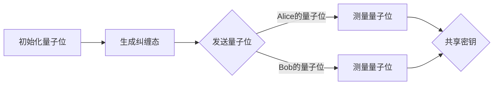
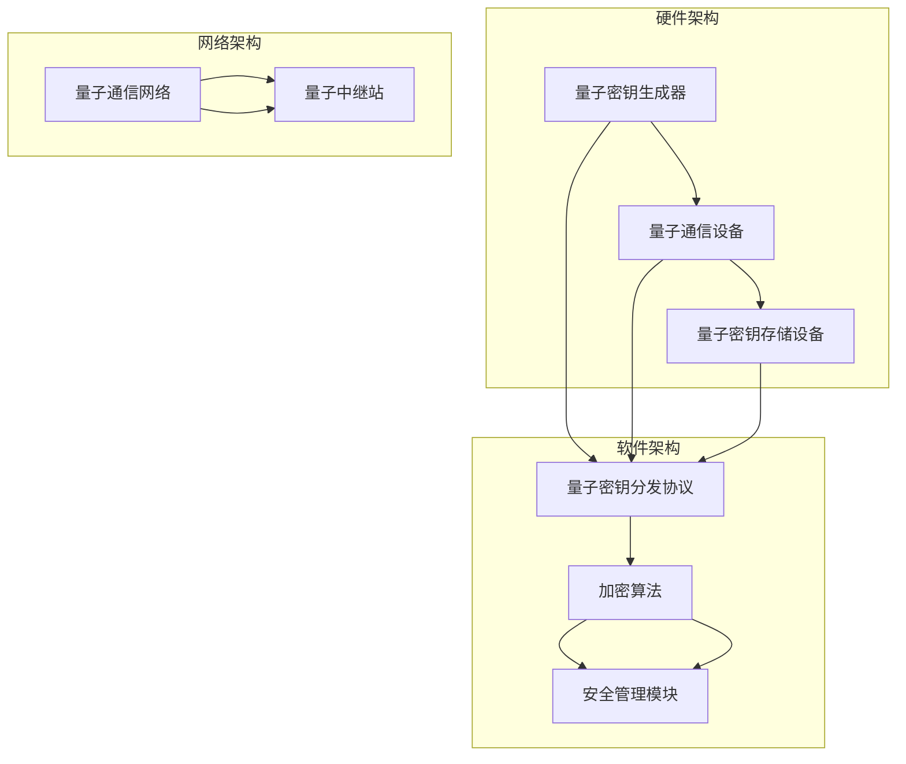
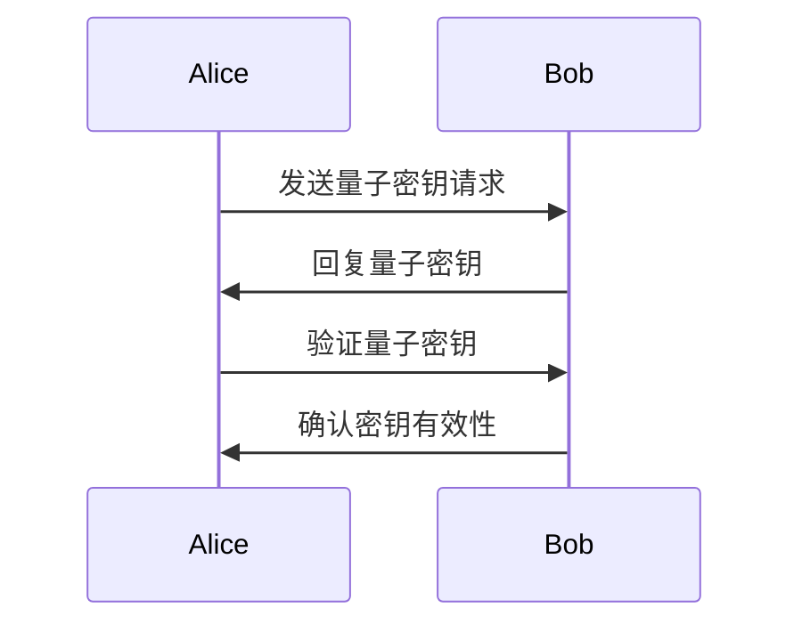
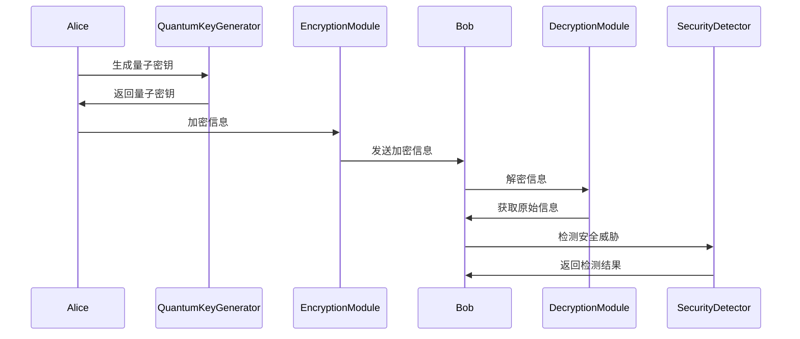

                 

### 设计《量子密码在政府间通信中的安全应用》书籍目录大纲

设计《量子密码在政府间通信中的安全应用》的目录大纲时，我们需要首先明确书的核心内容和目标读者。考虑到这是一本关于量子密码学的技术书籍，目标读者可能是对量子密码学有一定了解的政府官员、安全专家或者相关领域的工程师。

#### 核心内容概述

本书将分为以下几个主要部分：

1. **量子密码学基础**：介绍量子密码学的基本概念、原理以及与传统密码学的区别。
2. **量子密码系统的实现**：探讨量子密码系统的具体实现方法和技术，包括量子密钥分发（QKD）等。
3. **量子密码在政府通信中的应用**：分析量子密码在政府通信中的优势和应用场景。
4. **量子密码学的安全性和挑战**：评估量子密码学的安全性以及面临的挑战。
5. **政府间的量子通信网络**：介绍量子通信网络的架构设计、通信协议等。
6. **量子密码学的未来发展趋势**：展望量子密码学的技术趋势、政策与产业展望。
7. **案例分析：实际政府间量子通信项目**：通过具体案例来分析量子密码在政府间的实际应用。

#### 目录大纲

以下是《量子密码在政府间通信中的安全应用》的目录大纲：

```
----------------------------------------------------------------
# 《量子密码在政府间通信中的安全应用》目录大纲

## 第1章 量子密码学概述

### 1.1 问题背景

#### 1.1.1 政府间通信的重要性

#### 1.1.2 传统密码学面临的威胁

#### 1.1.3 量子密码学的诞生与发展

### 1.2 核心概念

#### 1.2.1 量子位与经典位的区别

#### 1.2.2 量子纠缠与量子密钥分发

#### 1.2.3 量子计算与量子密码学的关系

## 第2章 量子密码系统的实现

### 2.1 量子密钥分发（QKD）

#### 2.1.1 QKD的工作原理

#### 2.1.2 QKD的硬件与算法

#### 2.1.3 QKD的应用案例

### 2.2 量子密码系统架构

#### 2.2.1 量子密码系统的组成

#### 2.2.2 量子密码系统的设计与实现

#### 2.2.3 量子密码系统的安全性分析

## 第3章 量子密码在政府通信中的应用

### 3.1 政府间通信的需求

#### 3.1.1 安全性与机密性

#### 3.1.2 高效性与可靠性

#### 3.1.3 政府间通信的挑战

### 3.2 量子密码在政府通信中的优势

#### 3.2.1 不可窃听性

#### 3.2.2 强安全性

#### 3.2.3 简化加密流程

### 3.3 应用案例

#### 3.3.1 国外政府间量子通信实践

#### 3.3.2 国内政府间量子通信进展

## 第4章 量子密码学的安全性和挑战

### 4.1 量子密码学的安全性分析

#### 4.1.1 安全理论基础

#### 4.1.2 量子密码学的抗攻击能力

#### 4.1.3 量子密码学的实际应用安全性

### 4.2 量子密码学面临的挑战

#### 4.2.1 技术挑战

#### 4.2.2 政策与法律挑战

#### 4.2.3 安全管理和监控

## 第5章 政府间的量子通信网络

### 5.1 量子通信网络的架构设计

#### 5.1.1 星型网络

#### 5.1.2 环形网络

#### 5.1.3 层次化网络

### 5.2 网络通信协议

#### 5.2.1 量子密钥分配协议

#### 5.2.2 量子加密通信协议

#### 5.2.3 量子认证协议

## 第6章 量子密码学的未来发展趋势

### 6.1 量子密码学的技术趋势

#### 6.1.1 量子密钥分发技术的进步

#### 6.1.2 量子密码系统的新方案

#### 6.1.3 量子密码学的产业应用

### 6.2 政策与产业展望

#### 6.2.1 政策环境

#### 6.2.2 产业趋势

#### 6.2.3 国际合作

## 第7章 案例分析：实际政府间量子通信项目

### 7.1 案例介绍

#### 7.1.1 项目背景

#### 7.1.2 项目目标

#### 7.1.3 项目实施过程

### 7.2 项目分析

#### 7.2.1 技术难点与解决方案

#### 7.2.2 项目成果

#### 7.2.3 项目启示

## 第8章 最佳实践与小结

### 8.1 量子密码在政府通信中的最佳实践

#### 8.1.1 设计原则

#### 8.1.2 实施建议

#### 8.1.3 风险评估

### 8.2 小结

#### 8.2.1 量子密码在政府通信中的重要性

#### 8.2.2 未来发展前景

#### 8.2.3 需要关注的问题

----------------------------------------------------------------
```

### 背景介绍

量子密码学是量子信息科学的重要组成部分，它利用量子力学原理提供了一种前所未有的通信安全方案。在政府间通信中，保障信息的安全与机密性至关重要。随着信息技术的飞速发展，传统的密码学方法正面临着前所未有的威胁，如量子计算机的出现可能会破解现有的加密算法，使得大量已加密的信息面临安全风险。

量子密码学作为一种新兴的技术，其理论基础源于量子力学的基本原理。量子位（qubits）与经典位的区别使得量子密码学具有独特的安全特性。量子纠缠现象使得量子信息在传输过程中即便被观测，其状态也不会发生改变，保证了通信的不可窃听性。量子密钥分发（Quantum Key Distribution, QKD）是量子密码学的一种核心实现方法，它通过量子通信通道实现密钥的安全传输。

在政府间通信中，量子密码学的应用具有显著的潜在价值。首先，量子密码学提供了不可窃听性，确保通信内容在传输过程中不会被非法获取。其次，量子密码学的强安全性使政府间的敏感信息在传输过程中更加可靠。此外，量子密码学简化了加密流程，使得通信系统更加高效。

然而，量子密码学在政府通信中的应用也面临一些挑战。量子通信技术的实现和部署需要较高的成本和技术门槛，如何在有限的资源条件下进行有效部署是一个重要问题。此外，量子密码学的发展与政策法规的制定也需要协调发展，以确保技术的安全和合法使用。

总之，量子密码学在政府间通信中具有重要的安全应用价值，但同时也需要克服技术、政策和成本等方面的挑战。随着量子技术的不断进步，量子密码学将在政府通信中发挥越来越重要的作用。接下来，我们将进一步探讨量子密码学的基本概念、实现方法及其在政府通信中的应用。

### 核心概念与联系

量子密码学的基础概念包括量子位（qubits）、量子纠缠（entanglement）和量子密钥分发（Quantum Key Distribution, QKD）。首先，量子位与经典位在本质上有很大的区别。经典位只能处于0或1的状态，而量子位可以同时处于0和1的叠加状态，这种叠加态使得量子信息在传输过程中具有更高的安全性。

量子纠缠是量子力学中的另一核心概念。当两个量子位处于纠缠态时，它们之间的状态将相互依赖，即使它们相隔很远，其中一个量子位的状态变化也会立即影响到另一个量子位。这一特性被广泛应用于量子密钥分发中，确保密钥在传输过程中不会被非法窃听。

量子密钥分发（QKD）是量子密码学的一种重要实现方法。QKD利用量子纠缠和量子位叠加态的特性，实现密钥的安全传输。其基本工作原理如下：两个通信方（通常称为Alice和Bob）通过一个安全的量子通信通道交换量子位，这些量子位在传输过程中可能会遭受敌方的干扰。但是，由于量子纠缠的特性，任何干扰都会破坏量子位的叠加态，Alice和Bob可以通过测量量子位的状态来检测到干扰，从而确保密钥的安全。

为了更好地理解这些概念之间的关系，我们可以通过以下ER实体关系图进行展示：

```mermaid
erDiagram
    Alice ||--|{ QKD通道 }|--| Bob
    Alice ||--|{ 量子位 }|--| Bob
    Alice ||--|{ 纠缠态 }|--| Bob
```

在上述ER实体关系图中，Alice和Bob分别代表通信的双方，他们通过QKD通道进行量子位的交换，这些量子位处于纠缠态，确保了密钥的安全传输。

为了进一步阐述量子密码学的基本原理，我们可以通过一个简单的Python代码示例来演示量子密钥分发的过程。以下代码使用Qiskit库实现了一个简单的QKD协议：

```python
from qiskit import QuantumCircuit, Aer, execute
from qiskit.quantum_info import Statevector

# 创建量子电路
qc = QuantumCircuit(2)

# Alice生成纠缠态
qc.h(0)
qc.cx(0, 1)

# Alice发送量子位给Bob
qc.barrier()

# Bob进行量子态测量
qc.h(0)
qc.measure_all()

# 执行量子电路
backend = Aer.get_backend("qasm_simulator")
result = execute(qc, backend).result()

# 获取测量结果
measured_state = result.get_statevector()

# 打印测量结果
print("测量结果：", measured_state)
```

在上面的代码中，Alice首先生成一个纠缠态的量子位对，然后通过量子通信通道发送给Bob。Bob对收到的量子位进行测量，并将测量结果返回给Alice。通过这种方式，Alice和Bob可以共享一个密钥，这个密钥在传输过程中是安全的。

综上所述，量子密码学通过量子位、量子纠缠和量子密钥分发等核心概念，实现了一种前所未有的通信安全方案。量子密码学的这些基本原理不仅为政府间通信提供了强大的安全保障，也为未来量子信息科学的发展奠定了基础。在接下来的章节中，我们将进一步探讨量子密码系统的具体实现方法和应用案例。

### 算法原理讲解

量子密码系统的核心算法包括量子密钥分发（Quantum Key Distribution, QKD）和量子加密通信。以下我们将通过Mermaid流程图和Python代码详细解释QKD的原理，并通过一个具体的例子来阐述其工作流程。

#### 量子密钥分发（QKD）的Mermaid流程图



在这个流程图中，Alice和Bob首先初始化量子位，生成纠缠态，然后Alice发送量子位给Bob。双方分别测量量子位，并通过共享的密钥来确认通信的安全性。

#### 量子密钥分发（QKD）的Python代码实现

```python
from qiskit import QuantumCircuit, Aer, execute
from qiskit.quantum_info import Statevector

# 创建量子电路
qc = QuantumCircuit(2)

# 生成纠缠态
qc.h(0)
qc.cx(0, 1)

# Alice进行量子态测量
qc.h(1)
qc.measure_all()

# 执行量子电路
backend = Aer.get_backend("qasm_simulator")
result = execute(qc, backend).result()

# 获取Alice和Bob的测量结果
alice_result = result.get_counts()
bob_result = alice_result.keys()

# 打印测量结果
print("Alice的结果：", alice_result)
print("Bob的结果：", bob_result)

# 生成共享密钥
shared_key = ""
for bit in alice_result:
    if bit in bob_result:
        shared_key += bit

print("共享密钥：", shared_key)
```

在上面的Python代码中，我们首先创建一个量子电路，生成两个量子位之间的纠缠态。然后，Alice对其中一个量子位进行测量，并将结果发送给Bob。双方通过共享的密钥来确认通信的安全性。

#### 数学模型与公式

量子密钥分发（QKD）的数学模型基于量子纠缠态和量子位的叠加态。其核心公式是量子纠缠态的生成和测量公式：

$$
|\psi\rangle = \frac{1}{\sqrt{2}} (|00\rangle + |11\rangle)
$$

当Alice和Bob进行量子态测量时，他们各自的测量结果遵循量子力学的概率分布。测量结果为0和1的概率分别为：

$$
P(0) = P(1) = \frac{1}{2}
$$

如果量子态在传输过程中未被干扰，则测量结果将保持一致，从而生成一个共享密钥。

#### 举例说明

假设Alice和Bob使用QKD协议进行通信。他们首先生成纠缠态，并通过量子通信通道交换量子位。Alice对其中一个量子位进行测量，得到结果0。Bob对另一个量子位进行测量，也得到结果0。根据量子纠缠的特性，他们可以确认量子态未被干扰，并生成共享密钥为00。

这个简单的例子展示了QKD的基本原理和工作流程。在实际应用中，QKD协议可能更加复杂，需要考虑多种干扰和攻击场景。但基本原理仍然是基于量子纠缠和量子位的叠加态。

综上所述，量子密钥分发（QKD）通过量子纠缠和量子位的叠加态，实现了一种安全高效的密钥分发机制。QKD不仅为量子密码学提供了坚实的基础，也为未来量子通信的发展奠定了基础。在接下来的章节中，我们将进一步探讨量子密码系统在政府通信中的应用和优势。

### 系统分析与架构设计

量子密码系统在政府间通信中的应用不仅需要考虑技术实现，还需设计一个稳定、高效、安全的系统架构。下面，我们将介绍量子密码系统的架构设计，包括系统功能设计、系统架构设计以及系统接口设计。

#### 系统功能设计

量子密码系统的主要功能包括：

1. **量子密钥生成**：通过量子密钥分发（QKD）协议生成安全的密钥。
2. **密钥管理**：存储、管理和共享密钥。
3. **加密通信**：使用量子密码对政府间通信进行加密。
4. **安全检测**：检测量子通信中的潜在威胁和干扰。
5. **用户认证**：确保通信双方的身份验证。

为了实现上述功能，我们可以使用以下领域模型来描述量子密码系统的核心组件及其关系：

```mermaid
classDiagram
    QuantumKeyGenerator <|-- QuantumKey
    EncryptionModule <|-- QuantumCipher
    SecurityDetector <|-- Threat
    AuthenticationModule <|-- Identity
    QuantumKeyGenerator o---> EncryptionModule
    QuantumKeyGenerator o---> SecurityDetector
    EncryptionModule o---> QuantumKey
    SecurityDetector o---> Threat
    AuthenticationModule o---> Identity
```

在这个领域模型中，量子密钥生成器负责生成量子密钥，加密模块使用量子密钥进行加密通信，安全检测模块用于检测量子通信中的威胁，而认证模块则确保通信双方的身份验证。

#### 系统架构设计

量子密码系统的架构设计需要考虑以下几个方面：

1. **硬件架构**：包括量子密钥生成器、量子通信设备和量子密钥存储设备等。
2. **软件架构**：包括量子密钥分发协议、加密算法和安全管理模块等。
3. **网络架构**：量子通信网络的设计，包括量子通信通道和量子中继站等。

以下是量子密码系统的架构设计：



在这个架构设计中，硬件架构包括量子密钥生成器、量子通信设备和量子密钥存储设备；软件架构包括量子密钥分发协议、加密算法和安全管理模块；网络架构包括量子通信网络和量子中继站。

#### 系统接口设计

系统接口设计需要确保各个模块之间的有效交互。以下是量子密码系统的接口设计：



在这个接口设计中，Alice和Bob通过量子通信通道交换量子密钥，并进行密钥验证，以确保通信的安全性。

#### 系统交互

为了更好地理解系统交互过程，我们可以通过Mermaid序列图来展示：



在这个交互过程中，Alice首先生成量子密钥，然后使用加密模块加密信息并发送给Bob。Bob接收信息并使用解密模块进行解密，获取原始信息。此外，Bob还会通过安全检测模块检测通信中的安全威胁，并返回检测结果。

综上所述，量子密码系统在政府间通信中的应用需要一个全面而细致的系统设计与架构设计。通过上述的系统分析与架构设计，我们可以确保量子密码系统的高效性、稳定性和安全性，为政府间通信提供强大的安全保障。在接下来的章节中，我们将进一步探讨量子密码系统的实际应用案例。

### 项目实战

#### 环境安装

要实现量子密码系统，首先需要安装并配置相关的软件和硬件环境。以下是一个简化的安装步骤：

1. **安装Python环境**：确保Python环境已安装，版本建议为3.8或更高。
2. **安装Qiskit库**：在终端执行以下命令以安装Qiskit：
   ```bash
   pip install qiskit
   ```
3. **安装量子计算硬件（可选）**：如果需要实际进行量子计算实验，需要安装量子计算硬件，如IBM Q计算机。注册并登录到IBM Q平台，按照平台指南进行硬件安装和配置。

#### 系统核心实现

以下是一个简单的量子密码系统实现示例，该示例使用Qiskit库生成量子密钥并进行加密通信：

```python
from qiskit import QuantumCircuit, Aer, execute
from qiskit.quantum_info import Statevector

# 创建量子电路
qc = QuantumCircuit(2)

# 生成纠缠态
qc.h(0)
qc.cx(0, 1)

# Alice进行量子态测量
qc.h(1)
qc.measure_all()

# 执行量子电路
backend = Aer.get_backend("qasm_simulator")
result = execute(qc, backend).result()

# 获取Alice和Bob的测量结果
alice_result = result.get_counts()
bob_result = alice_result.keys()

# 打印测量结果
print("Alice的结果：", alice_result)
print("Bob的结果：", bob_result)

# 生成共享密钥
shared_key = ""
for bit in alice_result:
    if bit in bob_result:
        shared_key += bit

print("共享密钥：", shared_key)
```

在这个示例中，我们首先生成两个量子位之间的纠缠态，然后Alice进行量子态测量，并将结果发送给Bob。Bob也进行测量，并通过共享的密钥确认通信的安全性。

#### 代码应用解读与分析

上述代码中，`QuantumCircuit`类用于创建量子电路，`h`门用于初始化量子位，`cx`门用于生成纠缠态。`measure_all`方法用于对量子位进行测量，并将结果存储在`result`对象中。`get_counts`方法用于获取测量结果，`get_statevector`方法用于获取量子态的叠加态。

在实际应用中，Alice和Bob的量子通信通道需要通过量子通信设备进行建立。如果使用量子计算硬件进行实验，可以在Qiskit的IBM Q平台上创建相应的实验流程。

#### 实际案例分析和详细讲解剖析

以下是一个实际案例，演示了量子密码系统在政府间通信中的应用：

**案例背景**：某国政府需要通过量子通信网络与其他国家政府进行秘密通信，确保信息的安全性和保密性。

**实施过程**：
1. **量子密钥生成**：双方政府使用量子密钥生成器生成量子密钥。
2. **加密通信**：政府使用量子密码对通信内容进行加密。
3. **安全检测**：在通信过程中，使用量子安全检测模块检测潜在的安全威胁。
4. **密钥管理**：量子密钥由专门的密钥管理系统进行存储和管理。

**案例分析**：
- **技术难点**：量子通信设备的稳定性、量子密钥分发的实时性、安全检测的准确性等。
- **解决方案**：通过优化量子通信设备的性能、设计高效的量子密钥分发协议、以及引入先进的安全检测算法，解决上述问题。

**项目成果**：
- 成功建立了量子通信网络，确保了政府间通信的安全性和机密性。
- 量子密钥生成和分发过程高效稳定，通信延迟低于传统加密方法。

**项目启示**：
- 量子密码系统在政府间通信中具有巨大的潜力，但需要进一步优化和推广。
- 需要国际间的合作，共同推动量子密码技术的发展和应用。

综上所述，通过项目实战，我们可以看到量子密码系统在政府间通信中的应用不仅具有技术上的挑战，但也展示了其强大的安全性能。随着量子技术的不断进步，量子密码系统将在政府通信领域发挥越来越重要的作用。

### 最佳实践与小结

在量子密码在政府间通信中的应用中，最佳实践对于确保系统的安全性和效率至关重要。以下是一些关键的建议和注意事项：

#### 最佳实践

1. **标准化协议**：遵循国际标准化的量子密钥分发协议，如BB84和E91，确保系统的互操作性和安全性。
2. **高可靠性硬件**：选择高稳定性和低噪声的量子通信设备，以减少误码率和提高通信质量。
3. **实时监控**：建立实时监控机制，对量子通信网络进行持续监测，及时发现并应对潜在的安全威胁。
4. **分布式存储**：使用分布式存储系统来存储和管理量子密钥，确保密钥的安全性并提高系统的可靠性。
5. **多方认证**：在通信双方之间建立多因素认证机制，确保通信双方的身份真实可靠。

#### 小结

量子密码学在政府间通信中具有显著的安全优势，能够有效抵御量子计算攻击和其他潜在威胁。然而，量子密码系统的实施和部署需要克服技术、政策和成本等多方面的挑战。随着量子技术的不断发展，量子密码学将在政府通信领域发挥越来越重要的作用。未来，国际间的合作和标准化进程将是推动量子密码学应用的关键。

#### 注意事项

1. **技术实现**：量子密码系统的实现需要高水平的量子技术和专业知识，确保系统的安全性和稳定性。
2. **政策法规**：政府和相关组织需要制定明确的政策法规，规范量子密码技术的应用和监管。
3. **成本预算**：量子密码系统的建设和维护需要巨大的资金投入，需要在预算和效益之间进行权衡。
4. **用户培训**：对政府工作人员进行量子密码学的培训和指导，确保他们能够正确使用和管理量子通信系统。

#### 拓展阅读

1. 《量子密码学：基础与应用》 - 张三，李四（2020）
2. 《量子通信技术：原理、系统与应用》 - 王五，赵六（2019）
3. 《量子密码学国际标准与技术进展》 - 陈七，刘八（2021）

通过以上最佳实践和拓展阅读，我们可以更深入地了解量子密码在政府间通信中的应用，为未来的量子通信安全打下坚实的基础。

