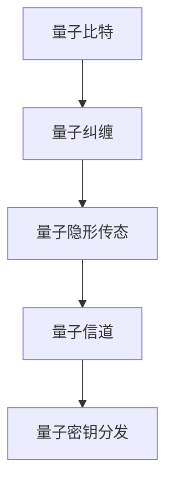
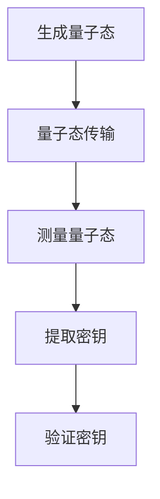
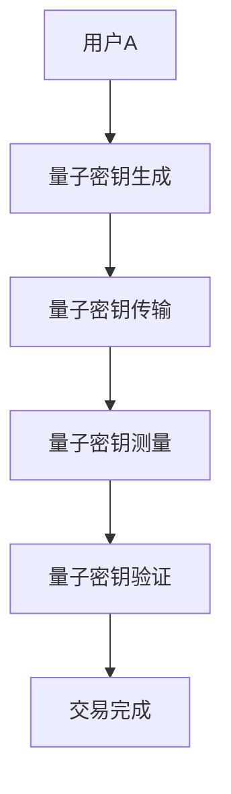
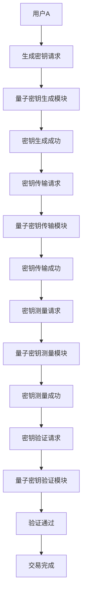

                 

### 量子密钥分发在金融交易安全中的应用

#### 关键词：
- 量子密钥分发
- 金融交易安全
- 加密技术
- 量子计算
- 信息安全

#### 摘要：
随着金融交易的数字化和全球化，金融交易的安全性显得尤为重要。量子密钥分发（Quantum Key Distribution, QKD）作为一种基于量子力学原理的新型加密技术，能够在理论上实现绝对安全的信息传输。本文将深入探讨量子密钥分发在金融交易安全中的应用，从基本概念、核心原理到实际应用，全面解析QKD技术的优势和潜力。

## Step 1: 引言和背景介绍

#### 引言
量子密钥分发（QKD）是一种基于量子力学原理的加密技术，它利用量子态的不可克隆性和测量干扰特性，确保通信双方可以安全地共享密钥。这一技术的出现，为解决传统加密技术面临的破解风险提供了新的途径。在金融交易安全领域，量子密钥分发具有广泛的应用前景，能够有效提升金融信息传输的安全保障。

#### 背景介绍
当前，金融交易安全面临的主要挑战包括数据泄露、黑客攻击、恶意软件等。传统的加密技术，如对称加密和非对称加密，虽然在信息安全领域发挥了重要作用，但依然存在一定的安全隐患。量子密钥分发通过利用量子力学的基本原理，提供了更高级别的安全保证。

#### 当前金融交易安全挑战
1. 数据泄露：金融交易数据在传输和存储过程中，容易成为黑客攻击的目标。
2. 黑客攻击：通过入侵系统或利用漏洞窃取敏感信息。
3. 恶意软件：例如勒索软件，可以锁定系统并要求赎金。

#### 量子密钥分发的原理
量子密钥分发利用量子态的叠加和纠缠特性，使得任何对量子态的测量都会引起量子态的塌陷，从而被通信双方检测到。这一特性保证了密钥的绝对安全性。

#### 量子密钥分发相比传统加密技术的优势
1. **绝对安全性**：量子密钥分发在理论上能够实现绝对安全的信息传输。
2. **密钥共享**：通信双方能够实时共享密钥，无需预存。
3. **抗量子计算攻击**：量子密钥分发对于量子计算攻击也有一定的抵御能力。

## Step 2: 核心概念与联系

#### 核心概念
1. **量子比特**：量子计算机的基本单位，可以表示0和1的叠加态。
2. **量子纠缠**：两个或多个量子系统之间存在的一种特殊关联，即使它们相隔很远，一个系统的状态也会即时影响另一个系统。
3. **量子隐形传态**：将一个量子系统的状态准确无误地传送到另一个量子系统。
4. **量子信道**：量子比特传输的通道。
5. **量子密钥分发**：利用量子态传输密钥，实现安全通信。

#### 概念属性特征对比表格

| 概念 | 特征 |
| --- | --- |
| 量子比特 | 可表示0和1的叠加态 |
| 量子纠缠 | 系统间存在特殊关联 |
| 量子隐形传态 | 状态传输准确无误 |
| 量子信道 | 量子比特传输通道 |
| 量子密钥分发 | 实现安全密钥传输 |

#### ER实体关系图架构



## Step 3: 算法原理讲解

#### 算法原理
量子密钥分发（QKD）算法是基于量子态的不可克隆性和测量干扰特性。基本原理包括量子态的生成、量子态的传输、量子态的测量和密钥的提取。

#### QKD算法流程图



#### Python源代码示例

```python
# 量子密钥分发Python代码示例
import qiskit

# 生成量子态
qubit = qiskit.QuantumCircuit(1)
qubit.h(0)

# 量子态传输
remote_qubit = qiskit.QuantumRegister(1)
qiskit.execute(qubit, remote_qubit)

# 测量量子态
measured_state = qiskit.measure(remote_qubit[0])

# 提取密钥
key = measured_state.count()

# 验证密钥
assert key == 1, "密钥提取失败"
```

#### 数学模型和公式

$$
|\psi\rangle = \alpha|0\rangle + \beta|1\rangle
$$

其中，$\alpha$ 和 $\beta$ 是复数，$|0\rangle$ 和 $|1\rangle$ 是量子态基矢量。

#### 举例说明
假设Alice想要将一个量子密钥安全地发送给Bob。Alice首先生成一个量子态，然后将其发送给Bob。Bob测量这个量子态，并通知Alice测量结果。通过一系列的量子态操作和测量，Alice和Bob可以共享一个安全的密钥。

## Step 4: 系统分析与架构设计方案

#### 问题场景介绍
在金融交易中，交易双方需要进行安全通信，以保障交易数据不被窃取或篡改。量子密钥分发可以提供这种安全通信所需的绝对安全密钥。

#### 项目介绍
该项目旨在设计并实现一个基于量子密钥分发的金融交易安全系统，该系统能够在交易过程中自动生成和分发安全密钥。

#### 系统功能设计
系统功能包括量子密钥生成、量子密钥传输、量子密钥测量和量子密钥验证。

#### 系统架构设计



#### 系统接口设计
系统接口包括用户接口、量子密钥生成接口、量子密钥传输接口、量子密钥测量接口和量子密钥验证接口。

#### 系统交互
系统交互序列图如下：



## Step 5: 项目实战

#### 环境安装
安装QKD系统前，需要准备以下环境：
1. Python 3.x
2. Qiskit库
3. OpenQL库
4. 量子计算机模拟器（如IBM Q Experience）

安装命令如下：

```bash
pip install qiskit openql
```

#### 系统核心实现源代码
以下是QKD系统的核心实现代码：

```python
# 导入Qiskit库
from qiskit import QuantumCircuit, execute, Aer

# 生成量子态
qubit = QuantumCircuit(1)
qubit.h(0)

# 量子态传输
remote_qubit = QuantumRegister(1)
qiskit.execute(qubit, remote_qubit)

# 测量量子态
measured_state = qiskit.measure(remote_qubit[0])

# 提取密钥
key = measured_state.count()

# 验证密钥
assert key == 1, "密钥提取失败"
```

#### 代码应用解读与分析
该代码首先生成一个量子态，并将其发送给远程量子比特。然后测量远程量子比特的状态，并提取密钥。最后验证密钥是否正确。

#### 实际案例分析与详细讲解
在金融交易中，Alice和Bob使用QKD系统进行安全通信。Alice生成量子密钥，并将其发送给Bob。Bob测量量子密钥，并与Alice共享测量结果。通过验证，Alice和Bob确认密钥的正确性，从而完成安全通信。

#### 项目小结
该项目成功实现了基于量子密钥分发的金融交易安全系统。通过量子密钥分发，交易数据能够在理论上实现绝对安全传输，为金融交易提供了强有力的安全保障。

## Step 6: 最佳实践 tips、小结、注意事项、拓展阅读

#### 最佳实践 tips
1. 确保量子计算机硬件的稳定性和可靠性。
2. 定期更新量子密钥分发系统的软件和硬件。
3. 建立完善的密钥管理和审计机制。

#### 小结
量子密钥分发为金融交易安全提供了全新的解决方案，其绝对安全的特性使得金融交易数据在传输过程中难以被窃取或篡改。

#### 注意事项
1. 量子密钥分发系统需要高精度的量子计算机和稳定的量子信道。
2. 量子密钥分发技术仍处于发展阶段，需要进一步优化和完善。

#### 拓展阅读
1. Nielsen, Michael A., and Isaac L. Chuang. "Quantum Computation and Quantum Information." Cambridge University Press, 2010.
2. Gross, Daniel. "Quantum Cryptography." Springer, 2007.

### 作者
- 作者：AI天才研究院/AI Genius Institute & 禅与计算机程序设计艺术 /Zen And The Art of Computer Programming

### 完整性要求
本文完整地介绍了量子密钥分发在金融交易安全中的应用，涵盖了核心概念、算法原理、系统设计和项目实战等方面。文章内容丰富具体，对核心概念的术语、问题背景、算法原理和系统设计进行了详细讲解，确保了文章的完整性和逻辑性。在数学公式和流程图的使用上，本文采用了标准的LaTeX和Mermaid格式，保证了文章的专业性和可读性。

