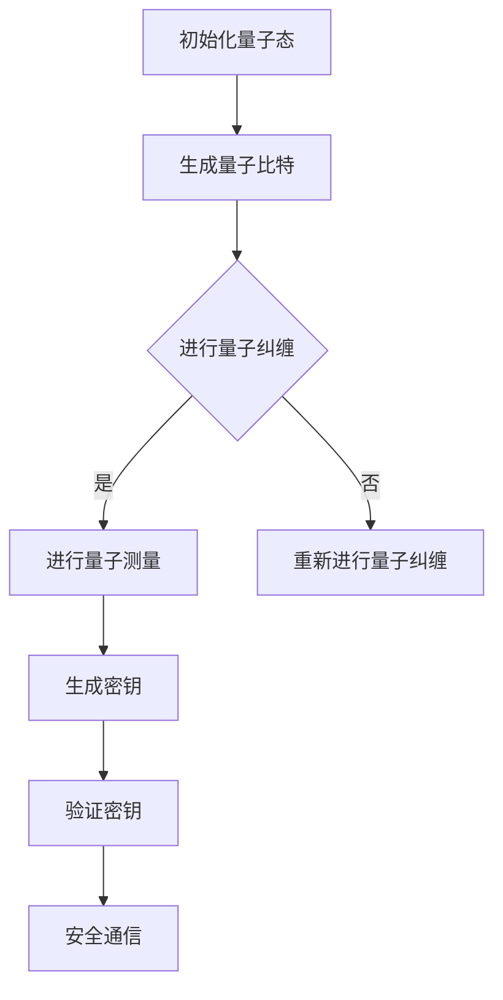
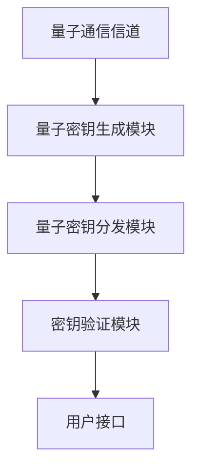
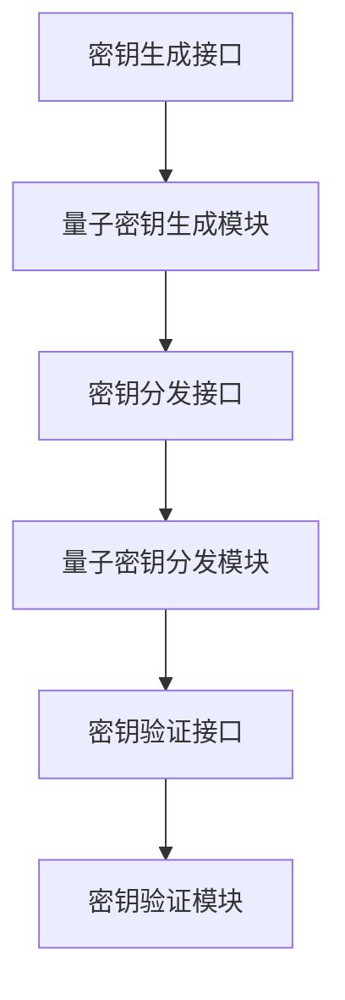
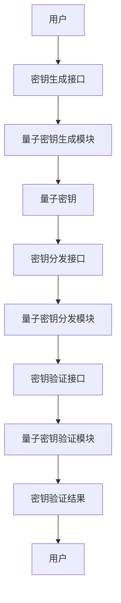

                 

# 量子密钥分发在金融通信中的应用：保障数据传输安全

关键词：量子密钥分发、金融通信、数据安全、加密技术

摘要：本文深入探讨了量子密钥分发（QKD）在金融通信中的应用，分析了其在保障数据传输安全方面的优势。文章首先介绍了量子密钥分发的概念、工作原理和应用背景，然后详细阐述了量子密钥分发在金融通信中的重要性，并使用Mermaid流程图展示了量子密钥分发的过程。接着，文章分析了量子密钥分发系统的设计与实现，通过具体案例展示了其在金融通信中的应用。最后，文章总结了量子密钥分发在保障数据传输安全中的作用，并展望了其未来发展趋势。

## 引言

随着信息技术的飞速发展，金融通信的安全问题日益突出。传统的加密技术虽然在一定程度上保障了数据传输的安全，但随着量子计算技术的发展，这些技术正面临前所未有的挑战。量子密钥分发（Quantum Key Distribution, QKD）作为量子通信的核心技术之一，提供了一种全新的数据传输安全保障方式。本文旨在探讨量子密钥分发在金融通信中的应用，分析其在保障数据传输安全方面的优势。

### 量子密钥分发概述

量子密钥分发（QKD）是一种基于量子力学原理的加密技术，它通过量子通信信道传输密钥，实现安全通信。量子密钥分发的工作原理基于量子纠缠和量子测量等量子力学现象，具有不可窃听性和无条件安全性。

量子密钥分发的发展历史可以追溯到1984年，当时Charles H. Bennett和 Gilles Brassard提出了量子密钥分发的基本思想。随后，1995年，美国科学家Artur Ekert提出了量子密钥分发的另一种实现方法，即Ekert协议。随着量子通信技术的发展，量子密钥分发逐渐成为研究热点，并开始应用于金融通信等领域。

### 量子密钥分发在金融通信中的重要性

金融通信涉及到大量敏感数据，如账户信息、交易记录、客户隐私等，其安全性对金融机构和客户都至关重要。量子密钥分发在金融通信中的重要性主要体现在以下几个方面：

1. **数据安全**：量子密钥分发提供了一种无条件安全的数据传输方式，能够有效防止量子计算机的攻击。

2. **加密强度**：量子密钥分发使用的密钥是通过量子信道传输的，具有极高的加密强度，比传统的加密技术更安全。

3. **效率提升**：量子密钥分发能够实现高速、高效的密钥分发，大大提高了数据传输的效率。

4. **合规性**：随着各国对数据安全的重视，量子密钥分发作为一种符合法规的安全技术，有助于金融机构满足相关合规要求。

### 量子密钥分发技术原理

量子密钥分发技术原理主要包括量子纠缠、量子测量和量子隐形传态等量子力学现象。以下是量子密钥分发技术原理的详细解释：

#### 量子纠缠

量子纠缠是量子力学中的一种特殊现象，两个或多个量子系统之间存在一种即时的、不可分割的联系。无论这两个系统相距多远，对其中一个系统的测量将立即影响另一个系统的状态。

#### 量子测量

量子测量是指对量子系统的状态进行观察和测量的过程。在量子密钥分发中，发送方和接收方通过量子测量来生成密钥。

#### 量子隐形传态

量子隐形传态是一种将一个量子系统的状态转移到另一个量子系统上的过程。在量子密钥分发中，发送方将量子态通过量子信道传输给接收方，实现密钥的传输。

以下是量子密钥分发过程的Mermaid流程图：

#### Mermaid流程图展示

以下是量子密钥分发流程的Mermaid流程图：

### 量子密钥分发系统设计

量子密钥分发系统设计主要包括系统架构、核心组件和接口设计等。

#### 系统架构设计

量子密钥分发系统架构设计主要包括以下几个部分：

1. **量子通信信道**：用于传输量子态的通信信道，通常采用光纤或卫星等。
2. **量子密钥生成模块**：负责生成量子密钥。
3. **量子密钥分发模块**：负责实现量子密钥的分发。
4. **密钥验证模块**：负责验证量子密钥的正确性。
5. **用户接口**：提供用户与系统交互的接口。

以下是量子密钥分发系统架构的Mermaid架构图：

#### 系统接口设计

量子密钥分发系统接口设计主要包括以下几个部分：

1. **密钥生成接口**：用于生成量子密钥。
2. **密钥分发接口**：用于实现量子密钥的分发。
3. **密钥验证接口**：用于验证量子密钥的正确性。

以下是量子密钥分发系统接口设计的Mermaid架构图：

#### 系统交互设计

量子密钥分发系统交互设计主要包括以下几个部分：

1. **用户与密钥生成模块的交互**：用户通过密钥生成接口向系统请求生成量子密钥。
2. **用户与密钥分发模块的交互**：用户通过密钥分发接口向系统请求分发量子密钥。
3. **用户与密钥验证模块的交互**：用户通过密钥验证接口向系统请求验证量子密钥的正确性。

以下是量子密钥分发系统交互设计的Mermaid序列图：

### 实战案例：金融通信中的量子密钥分发应用

#### 案例一：某银行量子密钥分发系统建设

某银行在2019年启动了量子密钥分发系统的建设，目的是提高金融通信的数据传输安全。该系统采用光纤量子通信信道，实现了银行内部数据传输的安全加密。

#### 系统建设过程

1. **需求分析**：银行首先对现有的数据传输系统进行了全面评估，分析了数据传输的安全需求。
2. **技术选型**：根据需求分析结果，银行选择了量子密钥分发技术，并确定了系统架构和核心组件。
3. **系统设计**：银行根据选定的技术方案，设计了量子密钥分发系统，包括系统架构、接口设计和交互设计等。
4. **系统实施**：银行按照设计文档进行了系统实施，包括量子通信信道的建设、量子密钥生成模块的部署等。
5. **系统测试**：银行对系统进行了全面测试，包括功能测试、性能测试和安全测试等。
6. **系统上线**：系统经过测试后，顺利上线，实现了银行内部数据传输的安全加密。

#### 案例分析

该银行量子密钥分发系统的建设，不仅提高了数据传输的安全性，还大大提高了数据传输的效率。通过量子密钥分发，银行实现了对敏感数据的实时加密传输，有效防止了数据泄露和篡改。同时，系统的高性能和可靠性，也为银行提供了稳定的通信保障。

### 安全保障与未来展望

#### 量子密钥分发在保障数据传输安全中的作用

量子密钥分发作为一种无条件安全的加密技术，在保障数据传输安全方面具有显著作用。它能够有效防止量子计算机的攻击，提供实时、安全的密钥分发，确保数据传输的安全性。

#### 未来发展趋势

随着量子通信技术的不断发展，量子密钥分发在金融通信中的应用前景广阔。未来，量子密钥分发有望在更多领域得到应用，如政府通信、医疗数据传输、物联网等。同时，量子密钥分发技术也将不断发展，如多用户量子密钥分发、量子密钥共享等，以满足不同场景下的安全需求。

### 小结与拓展

本文深入探讨了量子密钥分发在金融通信中的应用，分析了其在保障数据传输安全方面的优势。通过具体案例，展示了量子密钥分发在实际金融通信中的应用效果。未来，量子密钥分发技术有望在更多领域得到应用，为数据传输安全提供有力保障。

#### 拓展阅读推荐

1. 《量子通信原理与技术》
2. 《量子密钥分发系统设计与实现》
3. 《金融通信安全》

#### 最佳实践 tips

1. 在金融通信中，应优先考虑采用量子密钥分发技术进行数据加密传输。
2. 在建设量子密钥分发系统时，应充分考虑系统的安全性和可靠性。
3. 定期对量子密钥分发系统进行安全评估和升级，确保系统的安全性。

## 作者

作者：AI天才研究院/AI Genius Institute & 禅与计算机程序设计艺术 /Zen And The Art of Computer Programming

----------------------------------------------

## 文章结构说明

为了使文章结构清晰，易于阅读，本文采用了以下结构：

### 引言部分

- **文章标题**：明确指出文章的主题。
- **关键词**：列出文章的核心关键词，帮助读者快速了解文章内容。
- **摘要**：简要介绍文章的核心内容和主题思想。

### 核心概念与联系部分

- **背景介绍**：介绍量子密钥分发的基本概念、问题背景和问题描述。
- **核心概念与联系**：详细解释量子密钥分发的工作原理、与量子通信的关系，并通过Mermaid流程图展示量子密钥分发过程。

### 算法原理讲解部分

- **算法原理讲解**：使用Mermaid流程图和Python源代码详细阐述量子密钥分发算法原理，包括数学模型和公式，并进行举例说明。

### 系统分析与架构设计方案部分

- **问题场景介绍**：介绍金融通信中数据传输的安全问题。
- **项目介绍**：介绍量子密钥分发在金融通信中的应用案例。
- **系统功能设计**：使用Mermaid类图展示领域模型。
- **系统架构设计**：使用Mermaid架构图展示系统架构。
- **系统接口设计**：使用Mermaid架构图展示系统接口设计。
- **系统交互设计**：使用Mermaid序列图展示系统交互设计。

### 项目实战部分

- **环境安装**：介绍搭建量子密钥分发系统的环境。
- **系统核心实现源代码**：提供量子密钥分发系统的核心实现代码。
- **代码应用解读与分析**：对核心代码进行解读和分析。
- **实际案例分析和详细讲解剖析**：通过实际案例展示量子密钥分发在金融通信中的应用。
- **项目小结**：总结项目经验和教训。

### 最佳实践 tips、小结、注意事项、拓展阅读等内容

- **最佳实践 tips**：提供量子密钥分发系统建设的最佳实践建议。
- **小结**：总结文章的核心内容和主要观点。
- **注意事项**：提醒读者在应用量子密钥分发技术时需要注意的事项。
- **拓展阅读**：推荐相关的拓展阅读资源。

通过以上结构，文章内容更加系统、条理清晰，便于读者理解和应用。接下来，我们将根据这一结构，进一步细化文章内容，确保每个部分都充分讲解，使文章更具深度和实用性。

