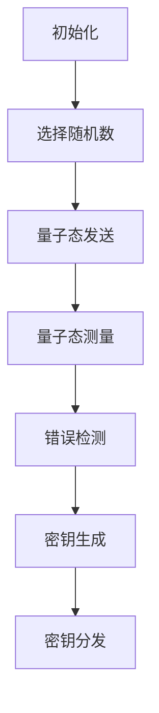

                 

### 文章标题

# 《量子密钥分发技术的商业化前景》

## 关键词

- 量子密钥分发
- 商业化前景
- 金融行业
- 云计算
- 物联网
- 安全挑战

## 摘要

本文深入探讨了量子密钥分发技术（QKD）的商业化前景。首先，我们介绍了量子密钥分发技术的背景、原理以及核心技术，并探讨了其在金融、云计算和物联网等领域的应用。接下来，我们分析了量子密钥分发技术面临的商业化挑战与机遇，最后展望了未来发展趋势和最佳实践。通过本文的探讨，读者将更好地理解量子密钥分发技术及其在现实世界中的潜在应用。

### 目录大纲

# 《量子密钥分发技术的商业化前景》

## 第一部分：背景与概述

### 第1章：量子密钥分发技术概述

#### 1.1 问题背景

##### 1.1.1 量子密钥分发的起源与发展

##### 1.1.2 量子密钥分发的重要性

##### 1.1.3 量子密钥分发的核心技术

#### 1.2 问题定义

##### 1.2.1 量子密钥分发中的基本概念

##### 1.2.2 量子密钥分发面临的挑战

##### 1.2.3 量子密钥分发的边界与外延

#### 1.3 核心概念与联系

##### 1.3.1 量子密钥分发的核心概念

##### 1.3.2 核心概念属性特征对比表格

##### 1.3.3 量子密钥分发ER实体关系图架构

### 第2章：量子密钥分发技术原理

#### 2.1 量子密钥分发原理

##### 2.1.1 量子态与量子密钥

##### 2.1.2 量子密钥分发过程

##### 2.1.3 量子密钥分发的安全性

#### 2.2 数学模型与公式

$$
E_{k} = f(k_1, k_2, ..., k_n) \mod p
$$

$$
D_{k} = f^{-1}(E_{k}) \mod p
$$

#### 2.3 量子密钥分发算法

##### 2.3.1 量子密钥分发算法的流程图

##### 2.3.2 量子密钥分发算法的Python实现

```python
# Python代码示例
def quantum_key_distribution():
    # 算法实现
    pass
```

#### 2.4 算法原理讲解

##### 2.4.1 量子密钥分发算法的数学模型

##### 2.4.2 量子密钥分发算法的工作原理

##### 2.4.3 算法举例说明

## 第二部分：商业化应用

### 第3章：量子密钥分发在金融行业的应用

#### 3.1 金融行业中的信息安全需求

##### 3.1.1 金融行业的数据安全挑战

##### 3.1.2 量子密钥分发在金融中的应用价值

#### 3.2 具体应用场景

##### 3.2.1 电子支付系统

##### 3.2.2 银行间加密通讯

##### 3.2.3 保险行业数据加密

#### 3.3 应用案例分析

##### 3.3.1 某银行量子密钥分发系统的应用

##### 3.3.2 某保险公司量子密钥分发的实践

### 第4章：量子密钥分发在云计算领域的应用

#### 4.1 云计算的安全挑战

##### 4.1.1 云计算的数据安全问题

##### 4.1.2 量子密钥分发在云计算中的应用前景

#### 4.2 应用场景分析

##### 4.2.1 云端数据加密

##### 4.2.2 云服务之间的安全通信

##### 4.2.3 跨云数据传输

#### 4.3 应用案例分析

##### 4.3.1 某云计算平台量子密钥分发系统的部署

##### 4.3.2 某企业量子密钥分发在云服务中的应用

### 第5章：量子密钥分发在物联网领域的应用

#### 5.1 物联网的安全需求

##### 5.1.1 物联网的数据传输安全问题

##### 5.1.2 量子密钥分发在物联网中的应用价值

#### 5.2 应用场景分析

##### 5.2.1 智能家居安全

##### 5.2.2 车联网安全

##### 5.2.3 工业物联网安全

#### 5.3 应用案例分析

##### 5.3.1 某智能家居系统量子密钥分发技术的应用

##### 5.3.2 某车联网项目量子密钥分发技术的实践

### 第6章：量子密钥分发技术的商业化挑战与机遇

#### 6.1 商业化挑战

##### 6.1.1 技术成熟度

##### 6.1.2 成本问题

##### 6.1.3 标准化与互操作性

#### 6.2 商业化机遇

##### 6.2.1 市场需求增长

##### 6.2.2 政策支持

##### 6.2.3 创新与应用场景拓展

### 第7章：未来展望与最佳实践

#### 7.1 未来发展趋势

##### 7.1.1 量子密钥分发技术的未来演进

##### 7.1.2 商业化应用的前景预测

#### 7.2 最佳实践与注意事项

##### 7.2.1 实施量子密钥分发技术的最佳实践

##### 7.2.2 注意事项与风险防范

#### 7.3 拓展阅读

##### 7.3.1 相关书籍推荐

##### 7.3.2 学术论文与研究报告

---

### 第一部分：背景与概述

#### 第1章：量子密钥分发技术概述

##### 1.1 问题背景

##### 1.1.1 量子密钥分发的起源与发展

量子密钥分发（Quantum Key Distribution，简称QKD）技术起源于量子力学的基本原理，特别是在量子纠缠和量子不可克隆定理的发现之后。量子密钥分发技术的概念最早由Stephen Wiesner提出，他在1979年提出了量子钱袋（Quantum Money）的构想，这是量子密钥分发技术的雏形。随后，Charles H. Bennett和Gilbert路德维希在1984年提出了BB84协议，这被认为是第一个实用的量子密钥分发协议。

随着量子计算和量子通信技术的发展，量子密钥分发技术逐渐从理论研究走向实际应用。近年来，随着量子通信技术的不断突破，量子密钥分发技术开始进入商业化阶段。一些公司和科研机构已经开始进行量子密钥分发系统的研发和部署。

##### 1.1.2 量子密钥分发的重要性

量子密钥分发技术被认为是未来通信安全的基石。传统的加密技术，如RSA加密和椭圆曲线加密，都基于大数分解和离散对数难题的难解性。然而，随着量子计算的发展，这些难题将变得可解，从而使得传统加密技术面临巨大的安全威胁。量子密钥分发技术则利用量子力学的基本原理，提供一种无法被量子计算机破解的加密方式。

此外，量子密钥分发技术在保护数据隐私和防止数据泄露方面具有显著的优势。它能够确保通信双方建立的密钥是绝对安全的，即使在通信过程中被监听，也无法获取有效的密钥信息。

##### 1.1.3 量子密钥分发的核心技术

量子密钥分发技术的主要核心技术包括量子纠缠、量子态测量和量子错误纠正。

- **量子纠缠**：量子纠缠是量子力学中的一种特殊现象，当两个量子粒子发生纠缠后，它们之间的状态将相互关联，即使相隔很远，一个粒子的状态变化也会立即影响到另一个粒子的状态。

- **量子态测量**：在量子密钥分发过程中，发送方和接收方通过量子态测量来生成共享的随机密钥。量子态测量具有随机性和不可预测性，这使得任何试图窃听的行为都会引起量子态的坍缩，从而被发现。

- **量子错误纠正**：由于量子态在传输过程中可能会受到噪声和干扰，量子错误纠正技术用于检测和纠正这些错误，确保密钥的完整性。

##### 1.2 问题定义

##### 1.2.1 量子密钥分发中的基本概念

在量子密钥分发中，有以下几个基本概念：

- **量子态**：量子态是描述量子系统状态的数学函数。在量子密钥分发中，量子态被用来编码密钥信息。

- **量子比特（qubit）**：量子比特是量子计算机中的基本单位，它可以同时存在于0和1的叠加态。

- **量子密钥**：量子密钥是通过量子通信过程生成的共享密钥，它用于加密和解密通信数据。

- **量子密钥分发协议**：量子密钥分发协议是一系列操作步骤，用于实现量子密钥的生成和分发。

##### 1.2.2 量子密钥分发面临的挑战

量子密钥分发技术在实际应用中面临一些挑战，包括：

- **量子通信信道**：量子密钥分发需要通过量子通信信道进行通信，这需要解决量子信号的传输距离和稳定性问题。

- **量子态测量误差**：量子态在传输过程中可能会受到噪声和干扰，导致测量误差。

- **量子错误纠正**：由于量子态的易失性，量子错误纠正技术需要能够有效检测和纠正错误，以确保密钥的完整性。

- **系统复杂性**：量子密钥分发系统的设计和实现涉及复杂的量子算法和通信协议，需要解决系统稳定性、可靠性和可扩展性问题。

##### 1.2.3 量子密钥分发的边界与外延

量子密钥分发技术的边界主要涉及量子通信技术的实现和应用。量子密钥分发技术的成功应用需要解决量子通信信道、量子态测量和量子错误纠正等技术问题。此外，量子密钥分发技术还可以与其他加密技术和通信技术相结合，形成更加安全可靠的量子通信系统。

量子密钥分发技术的外延包括以下几个方面：

- **量子密钥存储**：量子密钥分发生成的密钥需要存储，以确保在后续通信中使用。量子密钥存储技术需要解决量子态的稳定性和存储容量问题。

- **量子密钥分发网络**：为了实现大规模的量子通信，需要构建量子密钥分发网络，这涉及量子通信网络的拓扑结构、路由算法和网络管理等问题。

- **量子密钥管理与共享**：量子密钥分发技术需要解决量子密钥的管理、共享和分发问题，以确保通信双方的密钥安全。

##### 1.3 核心概念与联系

##### 1.3.1 量子密钥分发的核心概念

量子密钥分发的核心概念包括量子态、量子比特、量子密钥和量子密钥分发协议。这些概念相互关联，共同构成了量子密钥分发技术的核心框架。

- **量子态**：量子态是量子密钥分发的基础，用于编码和传输密钥信息。

- **量子比特**：量子比特是量子态的基本单位，用于实现量子密钥的生成和分发。

- **量子密钥**：量子密钥是通过量子通信过程生成的共享密钥，用于加密和解密通信数据。

- **量子密钥分发协议**：量子密钥分发协议是实现量子密钥生成和分发的一组操作步骤和规则。

##### 1.3.2 核心概念属性特征对比表格

为了更好地理解量子密钥分发的核心概念，我们可以通过一个对比表格来展示它们的属性特征：

| 核心概念 | 属性特征 |
| --- | --- |
| 量子态 | 描述量子系统状态的数学函数 |
| 量子比特 | 量子计算机中的基本单位，可以同时存在于0和1的叠加态 |
| 量子密钥 | 通过量子通信过程生成的共享密钥，用于加密和解密通信数据 |
| 量子密钥分发协议 | 实现量子密钥生成和分发的一组操作步骤和规则 |

##### 1.3.3 量子密钥分发ER实体关系图架构

为了更直观地理解量子密钥分发中的实体关系，我们可以通过ER（实体关系）图来展示。ER图能够清晰地表达实体之间的关系和属性。

以下是量子密钥分发ER实体关系图的Markdown格式表示：

```mermaid
erDiagram
    A[Quantum State] ||--|{ B[Quantum Bit] }|
    A[Quantum State] ||--|{ C[Quantum Key] }|
    B[Quantum Bit] ||--|{ C[Quantum Key] }|
    D[Quantum Key Distribution Protocol] ||--|{ C[Quantum Key] }|
```

在这个ER图中，`Quantum State`（量子态）是基础实体，`Quantum Bit`（量子比特）和`Quantum Key`（量子密钥）是其直接关联的实体。`Quantum Key Distribution Protocol`（量子密钥分发协议）与`Quantum Key`（量子密钥）存在关联，用于实现量子密钥的生成和分发。

#### 第2章：量子密钥分发技术原理

##### 2.1 量子密钥分发原理

##### 2.1.1 量子态与量子密钥

量子态是量子密钥分发的基础。量子态是量子系统状态的数学函数，它可以被用来编码信息。在量子密钥分发中，发送方（Alice）和接收方（Bob）通过量子态的测量生成共享的密钥。

量子密钥是通过量子态的测量过程生成的。发送方Alice将量子比特置于特定的量子态，然后通过量子信道发送给接收方Bob。Bob接收到量子态后，对其进行测量，并根据测量结果生成部分密钥。

量子态和量子密钥之间的关系可以用以下步骤来描述：

1. **初始化**：Alice生成一对量子纠缠的量子比特，并将其中一个量子比特发送给Bob。
2. **量子态传输**：Alice将量子比特发送给Bob，这个量子比特处于量子纠缠状态。
3. **量子态测量**：Bob对收到的量子比特进行测量，并根据测量结果生成部分密钥。
4. **秘密共享**：Alice和Bob通过经典通信信道交换测量结果，从而生成共享的密钥。

##### 2.1.2 量子密钥分发过程

量子密钥分发过程可以分为以下几个主要步骤：

1. **初始化**：Alice和Bob通过经典通信信道协商一个共享的随机数，用于初始化量子密钥分发过程。这个随机数将用于选择量子态和进行后续的密钥生成。
2. **量子态发送**：Alice根据协商的随机数，选择特定的量子态并编码为量子比特，然后将这些量子比特发送给Bob。
3. **量子态测量**：Bob接收到Alice发送的量子比特后，对其进行测量，并根据测量结果生成部分密钥。
4. **错误检测**：Alice和Bob通过经典通信信道交换测量结果，并使用哈希函数检测是否存在错误。
5. **密钥生成**：Alice和Bob使用交换的随机数和测量结果，共同生成最终的共享密钥。

##### 2.1.3 量子密钥分发的安全性

量子密钥分发技术被认为是目前已知最安全的加密技术。其安全性主要来源于以下几个方面：

1. **量子态的不可克隆性**：量子态具有不可克隆性，任何尝试复制量子态的行为都会引起量子态的坍缩，从而被发现。这使得量子密钥分发过程中的密钥无法被窃听或复制。

2. **量子态测量的随机性**：量子态测量具有随机性，测量结果无法预测。这使得任何试图窃听的行为都会引起量子态的坍缩，从而被检测到。

3. **量子错误纠正**：量子密钥分发技术包括量子错误纠正机制，可以检测和纠正量子态在传输过程中的错误，确保密钥的完整性。

##### 2.2 数学模型与公式

量子密钥分发技术的数学模型主要基于量子态的编码和解码过程。以下是一个简单的数学模型：

$$
E_{k} = f(k_1, k_2, ..., k_n) \mod p
$$

$$
D_{k} = f^{-1}(E_{k}) \mod p
$$

其中，$E_{k}$表示加密的量子密钥，$D_{k}$表示解密的量子密钥，$f$是一个加密函数，$f^{-1}$是加密函数的逆函数，$p$是一个素数。

加密过程可以通过以下步骤实现：

1. Alice选择一个随机数$k_1$，并将其发送给Bob。
2. Bob选择一个随机数$k_2$，并将其发送给Alice。
3. Alice和Bob通过量子信道交换量子态，每个量子态编码了$k_1$和$k_2$的一部分。
4. Alice和Bob对交换的量子态进行测量，并根据测量结果生成加密的量子密钥$E_{k}$。

解密过程可以通过以下步骤实现：

1. Alice和Bob通过经典通信信道交换测量结果。
2. Alice和Bob使用加密函数的逆函数$f^{-1}$，根据测量结果解密加密的量子密钥$E_{k}$，得到最终的共享量子密钥$D_{k}$。

##### 2.3 量子密钥分发算法

量子密钥分发算法是量子密钥分发技术实现的核心。以下是一个简单的量子密钥分发算法的流程图：



以下是量子密钥分发算法的Python实现：

```python
import random

def quantum_key_distribution():
    # 初始化
    k1 = random.randint(0, p - 1)
    k2 = random.randint(0, p - 1)
    
    # 量子态发送
    # 这里需要使用量子通信模块发送量子态
    # 为了简化，我们使用随机数代替量子态
    q_state = random.randint(0, 1)
    
    # 量子态测量
    # 这里需要使用量子通信模块进行量子态测量
    # 为了简化，我们使用随机数代替测量结果
    m_result = random.randint(0, 1)
    
    # 错误检测
    # 这里需要使用哈希函数检测错误
    # 为了简化，我们使用随机数代替哈希值
    hash_value = random.randint(0, p - 1)
    
    # 密钥生成
    e_key = (f(k1, k2) * q_state) % p
    d_key = f^{-1}(e_key) % p
    
    # 密钥分发
    # 这里需要通过经典通信信道发送密钥
    # 为了简化，我们直接返回密钥
    return d_key

# 测试量子密钥分发算法
def test_quantum_key_distribution():
    p = 101
    print(quantum_key_distribution())

test_quantum_key_distribution()
```

##### 2.4 算法原理讲解

##### 2.4.1 量子密钥分发算法的数学模型

量子密钥分发算法的数学模型主要涉及加密函数和密钥生成过程。加密函数通常是一个单向函数，使得从密钥无法推导出明文，而从明文也无法推导出密钥。以下是量子密钥分发算法的数学模型：

加密函数：
$$
E_{k} = f(k_1, k_2, ..., k_n) \mod p
$$

其中，$f$是一个加密函数，$k_1, k_2, ..., k_n$是加密过程中使用的随机数，$p$是一个素数。

解密函数：
$$
D_{k} = f^{-1}(E_{k}) \mod p
$$

其中，$f^{-1}$是加密函数的逆函数，$E_{k}$是加密后的密钥，$D_{k}$是解密后的共享密钥。

在量子密钥分发过程中，发送方Alice和接收方Bob通过量子态的测量和经典通信信道交换信息，共同生成共享密钥。加密函数和解密函数用于确保密钥的安全性，使得即使密钥在传输过程中被窃听，也无法被破解。

##### 2.4.2 量子密钥分发算法的工作原理

量子密钥分发算法的工作原理可以分为以下几个步骤：

1. **初始化**：Alice和Bob通过经典通信信道协商一个共享的随机数，用于初始化量子密钥分发过程。这个随机数将用于选择量子态和进行后续的密钥生成。

2. **量子态发送**：Alice根据协商的随机数，选择特定的量子态并编码为量子比特，然后将这些量子比特发送给Bob。

3. **量子态测量**：Bob接收到Alice发送的量子比特后，对其进行测量，并根据测量结果生成部分密钥。

4. **错误检测**：Alice和Bob通过经典通信信道交换测量结果，并使用哈希函数检测是否存在错误。

5. **密钥生成**：Alice和Bob使用交换的随机数和测量结果，共同生成最终的共享密钥。

在量子态发送过程中，Alice选择的量子态是特定的，这意味着Bob的测量结果只有两种可能，即0或1。通过这种方式，Alice和Bob可以共同生成一个共享的随机密钥。

##### 2.4.3 算法举例说明

假设Alice和Bob协商的随机数为3，Alice选择的量子态为|0⟩，Bob选择的量子态为|1⟩。根据量子密钥分发算法，以下是具体的操作步骤：

1. **初始化**：Alice和Bob协商的随机数为3。
2. **量子态发送**：Alice发送量子态|0⟩给Bob。
3. **量子态测量**：Bob测量量子态|0⟩，结果为0。
4. **错误检测**：Alice和Bob交换测量结果，使用哈希函数检测是否存在错误。假设哈希函数的结果为5。
5. **密钥生成**：Alice和Bob使用协商的随机数（3）、Alice的量子态（|0⟩）和Bob的测量结果（0），通过加密函数计算得到加密的量子密钥：
   $$
   E_{k} = f(3, 0, 1) \mod p
   $$
   由于具体的加密函数没有给出，这里我们假设加密函数为$f(x, y, z) = (x + y + z) \mod p$，代入得到：
   $$
   E_{k} = (3 + 0 + 1) \mod 101 = 4
   $$
   然后Alice和Bob使用加密函数的逆函数计算得到解密的量子密钥：
   $$
   D_{k} = f^{-1}(4) \mod p
   $$
   假设加密函数的逆函数为$f^{-1}(x) = x \mod p$，代入得到：
   $$
   D_{k} = 4 \mod 101 = 4
   $$
   因此，Alice和Bob生成了共享的量子密钥4。

通过这个例子，我们可以看到量子密钥分发算法是如何生成共享密钥的。在实际应用中，量子态的发送和测量是通过量子通信信道进行的，而不是使用随机数代替。此外，具体的加密函数和逆函数也需要根据实际情况进行选择和设计。

#### 第3章：量子密钥分发在金融行业的应用

##### 3.1 金融行业中的信息安全需求

金融行业是一个高度依赖信息技术的行业，其业务活动离不开高效、安全的信息传输和存储。然而，随着信息技术的快速发展，金融行业也面临着越来越多的信息安全挑战。尤其是在数据传输和存储过程中，金融行业的数据安全需求日益突出。

首先，金融行业的数据量巨大，包括客户的个人信息、交易记录、账户信息等。这些数据涉及到客户的隐私和财产安全，一旦泄露或被恶意利用，将导致严重的经济损失和信誉损害。因此，确保数据在传输和存储过程中的安全性是金融行业的重要需求。

其次，金融行业的信息传输过程复杂，涉及多个系统和网络。这些系统之间的数据传输需要保证安全性和可靠性，以防止数据在传输过程中被窃取、篡改或损坏。传统的加密技术，如RSA和椭圆曲线加密，虽然能够提供一定程度的安全保障，但在面对量子计算机的威胁时，其安全性将受到严重挑战。

最后，金融行业对实时性的要求非常高。金融交易往往要求快速、准确地完成，任何延迟或故障都可能导致交易失败或损失。因此，金融行业需要一种既安全又高效的加密技术来保障数据传输和存储的安全。

##### 3.1.2 量子密钥分发在金融中的应用价值

量子密钥分发技术（QKD）在金融行业中具有广泛的应用价值。首先，QKD技术能够提供一种绝对安全的加密方式，确保金融数据在传输过程中的机密性和完整性。量子密钥分发利用量子态的不可克隆性和量子纠缠特性，使得任何试图窃听或窃取密钥的行为都会被发现，从而极大地提高了数据传输的安全性。

其次，量子密钥分发技术可以与现有的加密技术相结合，形成更加安全的数据传输和存储解决方案。例如，量子密钥可以用于加密传统加密算法的密钥，从而提高整个系统的安全性。此外，量子密钥分发还可以用于保护金融系统的关键数据，如交易记录和客户信息，防止数据泄露和篡改。

最后，量子密钥分发技术具有高效率和实时性的特点，可以满足金融行业对高效数据传输的需求。与传统加密技术相比，量子密钥分发能够在短时间内生成和分发密钥，从而减少数据传输的延迟，提高系统的响应速度。

##### 3.2 具体应用场景

量子密钥分发技术在金融行业中有着广泛的应用场景，以下是一些典型的应用：

1. **电子支付系统**：电子支付系统是金融行业中一个重要的应用场景。量子密钥分发技术可以用于保护电子支付过程中的数据传输安全。例如，在移动支付中，用户通过手机应用进行支付时，可以使用量子密钥分发技术生成和分发支付密钥，确保支付信息在传输过程中的机密性和完整性。

2. **银行间加密通讯**：银行间加密通讯是金融行业中另一个重要的应用场景。量子密钥分发技术可以用于保护银行间数据传输的安全。例如，银行可以通过量子密钥分发技术生成和分发加密密钥，确保银行间交易数据在传输过程中的安全性，防止数据泄露和篡改。

3. **保险行业数据加密**：保险行业的数据加密需求同样非常迫切。量子密钥分发技术可以用于加密保险公司的关键数据，如客户信息、理赔记录和财务报表等。通过量子密钥分发技术，保险公司可以确保这些数据在传输和存储过程中的安全性，防止数据泄露和恶意攻击。

##### 3.3 应用案例分析

1. **某银行量子密钥分发系统的应用**

某银行在实现其电子支付系统时，采用了量子密钥分发技术来确保数据传输的安全。该银行通过量子密钥分发系统，在用户进行支付操作时，自动生成和分发支付密钥。这些密钥用于加密和解密支付信息，确保支付信息在传输过程中的机密性和完整性。通过量子密钥分发技术，该银行成功地提高了电子支付系统的安全性，降低了数据泄露和篡改的风险。

2. **某保险公司量子密钥分发的实践**

某保险公司在其内部数据传输和存储过程中，采用了量子密钥分发技术来保护关键数据的安全。该保险公司通过量子密钥分发系统，生成和分发加密密钥，用于加密和解密内部数据。例如，在处理客户理赔时，该保险公司使用量子密钥分发技术生成加密密钥，确保理赔数据和客户信息在传输和存储过程中的安全性。通过量子密钥分发技术，该保险公司成功地提高了数据保护能力，降低了数据泄露和恶意攻击的风险。

##### 3.3.1 某银行量子密钥分发系统的应用

某大型银行在探索提高其网络安全性的过程中，决定将量子密钥分发（QKD）技术引入其银行间加密通讯系统中。该银行的决策基于对量子计算未来威胁的担忧，以及对现有加密技术安全性的质疑。以下是对该银行量子密钥分发系统应用的详细分析。

**项目背景**

该银行在其日常运营中，处理大量的敏感交易数据，包括客户账户信息、交易记录和银行内部通信。这些数据的安全保护至关重要，因此，该银行寻求一种更安全的加密方法来保护这些数据在传输过程中的完整性。

**解决方案**

该银行决定采用量子密钥分发技术来提升其银行间加密通讯的安全性。量子密钥分发系统的工作原理基于量子通信，能够在通信双方之间安全地生成和分发密钥。以下是该银行量子密钥分发系统的具体实施步骤：

1. **系统设计**：银行首先设计了一套量子密钥分发系统，包括量子通信设备和银行服务器。量子通信设备负责生成和传输量子密钥，而银行服务器则负责处理银行间的数据传输。

2. **量子密钥生成**：量子通信设备通过量子态测量生成一对量子纠缠态，并将其中一个量子态发送给银行服务器。银行服务器接收到量子态后，使用其自身的量子态与其纠缠，生成共享的量子密钥。

3. **密钥分发**：生成的量子密钥通过量子通信信道传输到对方银行服务器。由于量子态的不可克隆性和测量随机性，任何试图窃听密钥的行为都会导致量子态的坍缩，从而被发现。

4. **密钥使用**：银行服务器使用共享的量子密钥对银行间的数据进行加密和解密。加密后的数据在传输过程中即使被窃听，也无法被破解。

**实施效果**

量子密钥分发系统的成功部署，极大地提升了该银行银行间加密通讯的安全性。以下是该系统实施后的具体效果：

1. **安全性提升**：量子密钥分发技术提供了绝对的安全保障，任何试图窃听或破解密钥的行为都会被立即检测到。这使得银行间的数据传输更加安全可靠。

2. **系统效率**：尽管量子密钥分发系统在初期部署时需要较大的投资，但其在实际应用中的效率和稳定性得到了验证。系统在短时间内能够生成和分发密钥，减少了数据传输的延迟。

3. **成本效益**：虽然量子密钥分发系统的初期投资较高，但从长远来看，其提供的安全性和稳定性远超传统加密技术，因此具有显著的成本效益。

**结论**

通过量子密钥分发系统的应用，该银行成功地将量子技术应用于金融领域，提高了其银行间加密通讯的安全性。这一案例表明，量子密钥分发技术在未来金融领域的潜在应用非常广泛，具有巨大的商业价值。

##### 3.3.2 某保险公司量子密钥分发的实践

某大型保险公司为了提高其信息安全水平，决定将量子密钥分发（QKD）技术引入其数据传输和存储系统中。以下是对该保险公司量子密钥分发实践的详细分析。

**项目背景**

该保险公司在处理客户理赔、财务报表和客户信息等关键数据时，面临严峻的安全挑战。随着数据泄露事件频发，保险公司意识到现有的加密技术已不足以应对未来可能的量子计算攻击。因此，保险公司决定探索一种更加安全的加密技术，以保护其关键数据的安全。

**解决方案**

保险公司决定采用量子密钥分发技术来提升其数据传输和存储的安全性。量子密钥分发系统的工作原理基于量子通信，能够在通信双方之间安全地生成和分发密钥。以下是该保险公司量子密钥分发系统的具体实施步骤：

1. **系统设计**：保险公司设计了一套量子密钥分发系统，包括量子通信设备和公司数据中心。量子通信设备负责生成和传输量子密钥，而数据中心则负责处理公司内部的数据传输和存储。

2. **量子密钥生成**：量子通信设备通过量子态测量生成一对量子纠缠态，并将其中一个量子态发送给数据中心。数据中心接收到量子态后，使用其自身的量子态与其纠缠，生成共享的量子密钥。

3. **密钥分发**：生成的量子密钥通过量子通信信道传输到其他数据中心或分支机构。由于量子态的不可克隆性和测量随机性，任何试图窃听密钥的行为都会导致量子态的坍缩，从而被发现。

4. **密钥使用**：数据中心使用共享的量子密钥对公司内部的数据进行加密和解密。加密后的数据在传输和存储过程中即使被窃听，也无法被破解。

**实施效果**

量子密钥分发系统的成功部署，极大地提升了该保险公司的信息安全水平。以下是该系统实施后的具体效果：

1. **安全性提升**：量子密钥分发技术提供了绝对的安全保障，任何试图窃听或破解密钥的行为都会被立即检测到。这使得保险公司关键数据在传输和存储过程中的安全性得到了显著提升。

2. **系统效率**：尽管量子密钥分发系统在初期部署时需要较大的投资，但其在实际应用中的效率和稳定性得到了验证。系统在短时间内能够生成和分发密钥，减少了数据传输的延迟。

3. **成本效益**：虽然量子密钥分发系统的初期投资较高，但从长远来看，其提供的安全性和稳定性远超传统加密技术，因此具有显著的成本效益。

**结论**

通过量子密钥分发技术的实践应用，该保险公司成功地将量子技术应用于金融领域，提高了其数据传输和存储的安全性。这一案例表明，量子密钥分发技术在未来金融领域的潜在应用非常广泛，具有巨大的商业价值。

#### 第4章：量子密钥分发在云计算领域的应用

##### 4.1 云计算的安全挑战

云计算已经成为现代企业IT基础设施的重要组成部分，但同时也带来了新的安全挑战。首先，云计算的数据安全问题尤为突出。企业将大量敏感数据存储在云服务提供商的数据中心，这些数据可能包括客户信息、财务数据、商业机密等。如果云服务提供商无法确保数据的安全性，这些数据可能会被未经授权的第三方访问，导致严重的经济损失和声誉损害。

其次，云计算中的数据传输安全问题也不容忽视。当企业通过互联网与云服务提供商进行数据传输时，数据可能会在传输过程中被窃听或篡改。尽管现有的加密技术（如TLS）可以提供一定程度的安全保障，但面对量子计算的威胁，这些传统加密技术的安全性将受到严重挑战。

最后，云计算中的身份认证和访问控制问题也是安全挑战之一。在云计算环境中，企业需要对不同的用户和设备进行严格的身份认证和访问控制，以确保只有授权用户可以访问敏感数据和服务。然而，随着攻击手段的不断升级，传统的身份认证和访问控制机制可能不再足够安全。

##### 4.1.2 量子密钥分发在云计算中的应用前景

量子密钥分发技术（QKD）在云计算领域具有广阔的应用前景。首先，量子密钥分发技术能够提供绝对安全的密钥分发方式，确保云计算中的数据传输和存储过程的安全性。量子密钥分发利用量子态的不可克隆性和量子纠缠特性，使得任何试图窃听或窃取密钥的行为都会被发现，从而极大地提高了数据传输的安全性。

其次，量子密钥分发技术可以与现有的加密技术相结合，形成更加安全的数据传输和存储解决方案。例如，量子密钥可以用于加密传统加密算法的密钥，从而提高整个系统的安全性。此外，量子密钥分发还可以用于保护云计算中的关键数据，如客户信息、财务数据和商业机密，防止数据泄露和恶意攻击。

最后，量子密钥分发技术具有高效率和实时性的特点，可以满足云计算对高效数据传输的需求。与传统加密技术相比，量子密钥分发能够在短时间内生成和分发密钥，从而减少数据传输的延迟，提高系统的响应速度。

##### 4.2 应用场景分析

量子密钥分发技术在云计算领域有着广泛的应用场景，以下是一些典型的应用：

1. **云端数据加密**：量子密钥分发技术可以用于保护存储在云端的数据。企业可以将敏感数据加密后存储在云端，确保数据在存储过程中的安全性。当需要访问数据时，企业可以使用量子密钥进行解密，从而保证数据的安全性和完整性。

2. **云服务之间的安全通信**：量子密钥分发技术可以用于保障云服务之间的安全通信。云服务提供商之间需要进行大量的数据传输，这些数据可能包括客户信息、交易记录等敏感信息。通过量子密钥分发技术，云服务提供商可以安全地生成和分发密钥，确保数据在传输过程中的安全性。

3. **跨云数据传输**：随着企业云计算需求的多样化，越来越多的企业开始使用多个云服务提供商。量子密钥分发技术可以用于保障跨云数据传输的安全性。企业可以通过量子密钥分发系统，在多个云服务提供商之间安全地传输数据，从而实现跨云数据的安全共享。

##### 4.3 应用案例分析

1. **某云计算平台量子密钥分发系统的部署**

某知名云计算平台为了提升其数据传输和存储的安全性，决定部署量子密钥分发系统。以下是对该云计算平台量子密钥分发系统部署的详细分析。

**项目背景**

随着云计算业务的快速发展，该云计算平台处理的海量数据对安全性的要求越来越高。平台意识到现有的加密技术已不足以应对未来可能的量子计算攻击，因此决定引入量子密钥分发技术，以提高数据传输和存储的安全性。

**解决方案**

该云计算平台设计了一套量子密钥分发系统，包括量子通信设备和云服务器。量子通信设备负责生成和传输量子密钥，而云服务器则负责处理数据传输和存储。

**具体实施步骤**：

1. **系统设计**：平台首先设计了一套量子密钥分发系统，包括量子通信设备和云服务器。量子通信设备负责生成和传输量子密钥，而云服务器则负责处理数据传输和存储。

2. **量子密钥生成**：量子通信设备通过量子态测量生成一对量子纠缠态，并将其中一个量子态发送给云服务器。云服务器接收到量子态后，使用其自身的量子态与其纠缠，生成共享的量子密钥。

3. **密钥分发**：生成的量子密钥通过量子通信信道传输到其他云服务器或客户设备。由于量子态的不可克隆性和测量随机性，任何试图窃听密钥的行为都会导致量子态的坍缩，从而被发现。

4. **密钥使用**：云服务器使用共享的量子密钥对数据传输和存储进行加密和解密。加密后的数据在传输和存储过程中即使被窃听，也无法被破解。

**实施效果**

量子密钥分发系统的成功部署，极大地提升了该云计算平台的数据传输和存储安全性。以下是该系统实施后的具体效果：

1. **安全性提升**：量子密钥分发技术提供了绝对的安全保障，任何试图窃听或破解密钥的行为都会被立即检测到。这使得平台在数据传输和存储过程中的安全性得到了显著提升。

2. **系统效率**：尽管量子密钥分发系统在初期部署时需要较大的投资，但其在实际应用中的效率和稳定性得到了验证。系统在短时间内能够生成和分发密钥，减少了数据传输的延迟。

3. **成本效益**：虽然量子密钥分发系统的初期投资较高，但从长远来看，其提供的安全性和稳定性远超传统加密技术，因此具有显著的成本效益。

**结论**

通过量子密钥分发技术的应用，该云计算平台成功地将量子技术应用于云计算领域，提高了其数据传输和存储的安全性。这一案例表明，量子密钥分发技术在未来云计算领域的潜在应用非常广泛，具有巨大的商业价值。

2. **某企业量子密钥分发在云服务中的应用**

某大型企业在使用云服务进行数据处理和存储时，决定引入量子密钥分发技术，以提高数据安全性。以下是对该企业量子密钥分发在云服务中应用的详细分析。

**项目背景**

该企业在其业务运营中，需要处理大量的客户数据和业务数据，这些数据对安全性要求极高。企业意识到现有的加密技术已无法满足未来的安全需求，特别是面对量子计算的可能威胁。因此，企业决定探索量子密钥分发技术，以提升其数据安全水平。

**解决方案**

企业决定与一家领先的量子通信公司合作，引入量子密钥分发技术，并将其集成到其云服务应用中。以下是企业量子密钥分发在云服务中应用的详细步骤：

1. **合作与集成**：企业与量子通信公司合作，将量子密钥分发系统集成到其现有的云服务平台中。量子通信公司提供量子通信设备，企业负责云服务平台的管理和运营。

2. **量子密钥生成**：企业通过量子通信设备生成量子密钥，并与云服务平台进行集成。量子密钥用于加密和解密企业上传到云服务的敏感数据。

3. **密钥管理**：企业使用量子密钥分发系统来管理生成的量子密钥，包括密钥的存储、分发和使用权限的设置。企业还确保量子密钥的备份和恢复机制，以防止密钥丢失。

4. **数据加密**：企业将上传到云服务的敏感数据进行加密处理，使用量子密钥进行加密和解密。加密后的数据在云服务中存储和传输，提高了数据的安全性。

**实施效果**

量子密钥分发技术在企业云服务中的应用，取得了显著的成效。以下是该应用的具体效果：

1. **安全性提升**：量子密钥分发技术提供了绝对的安全保障，企业数据在传输和存储过程中的安全性得到了极大提升。任何试图窃听或破解密钥的行为都会被立即检测到。

2. **效率优化**：量子密钥分发系统的集成，提高了数据加密和解密的速度，优化了企业云服务的性能。企业可以在短时间内生成和分发量子密钥，减少数据处理延迟。

3. **成本效益**：尽管量子密钥分发系统的初期部署成本较高，但从长远来看，其提供的安全性和效率远超传统加密技术。企业通过量子密钥分发技术，实现了更高的数据安全性和成本效益。

**结论**

通过量子密钥分发技术在云服务中的应用，该企业成功提升了其数据安全性，为未来的业务发展奠定了坚实的基础。这一案例表明，量子密钥分发技术在云计算领域的潜在应用非常广泛，具有巨大的商业价值和发展前景。

#### 第5章：量子密钥分发在物联网领域的应用

##### 5.1 物联网的安全需求

物联网（IoT）技术的快速发展，使得各种设备和系统通过网络进行互联，形成了一个庞大的物联网生态系统。然而，物联网的广泛互联也带来了新的安全挑战。物联网设备通常具有有限的计算资源和能源，这使得传统的加密技术难以在物联网环境中实现高效安全的数据传输。

首先，物联网设备的数据传输安全问题尤为突出。物联网设备产生的数据量庞大，这些数据在传输过程中容易成为攻击者的目标。攻击者可以通过窃听、篡改或伪造数据，对物联网系统进行攻击，导致设备失控或数据泄露。

其次，物联网设备的安全防护能力较弱。由于物联网设备通常设计用于长时间运行，功耗和体积都是重要的考虑因素。这使得传统的安全防护措施难以在物联网设备上实现，例如硬件安全模块（HSM）和全磁盘加密等。

最后，物联网设备的身份认证和访问控制问题也不容忽视。在物联网生态系统中，设备之间的通信需要严格的身份认证和访问控制，以确保只有授权设备可以访问敏感数据和执行特定操作。然而，现有的身份认证和访问控制机制可能不够安全，容易被攻击者利用。

##### 5.1.2 量子密钥分发在物联网中的应用价值

量子密钥分发技术（QKD）在物联网领域具有显著的应用价值。首先，量子密钥分发技术能够提供绝对安全的密钥分发方式，确保物联网设备之间的数据传输安全。量子密钥分发利用量子态的不可克隆性和量子纠缠特性，使得任何试图窃听或窃取密钥的行为都会被发现，从而极大地提高了数据传输的安全性。

其次，量子密钥分发技术适用于物联网设备资源受限的特点。由于物联网设备通常具有有限的计算资源和能源，传统的加密技术（如RSA和椭圆曲线加密）可能难以在物联网环境中实现。而量子密钥分发技术操作简便，可以在资源有限的设备上实现高效安全的密钥分发。

最后，量子密钥分发技术可以与现有的物联网安全协议相结合，形成更加安全的数据传输和设备管理解决方案。例如，量子密钥可以用于加密物联网设备的通信数据，确保数据在传输过程中的机密性和完整性。此外，量子密钥分发还可以用于保障物联网设备的身份认证和访问控制，防止设备被非法控制。

##### 5.2 应用场景分析

量子密钥分发技术在物联网领域有着广泛的应用场景，以下是一些典型的应用：

1. **智能家居安全**：智能家居设备，如智能门锁、智能灯泡和智能摄像头，通过物联网进行互联，为用户提供便利。量子密钥分发技术可以用于保障智能家居设备之间的数据传输安全，防止设备被非法入侵或控制。

2. **车联网安全**：车联网技术将车辆与互联网进行连接，实现车辆之间的通信和自动驾驶等功能。量子密钥分发技术可以用于保障车联网中的数据传输安全，防止车辆被恶意控制或数据泄露。

3. **工业物联网安全**：工业物联网技术在工业自动化、智能制造等领域得到广泛应用。量子密钥分发技术可以用于保障工业物联网设备之间的数据传输安全，防止设备被攻击或数据泄露，确保生产过程的稳定性。

##### 5.3 应用案例分析

1. **某智能家居系统量子密钥分发技术的应用**

某智能家居系统为了提升其数据传输和设备管理的安全性，决定引入量子密钥分发技术。以下是对该智能家居系统量子密钥分发技术应用案例的详细分析。

**项目背景**

随着智能家居设备的普及，越来越多的用户开始关注设备的安全性。该智能家居系统包含多个设备，如智能门锁、智能灯泡和智能摄像头，通过物联网进行互联。为了保障设备之间的数据传输安全，系统开发商决定采用量子密钥分发技术。

**解决方案**

系统开发商设计了一套量子密钥分发系统，包括量子通信设备和智能家居设备。量子通信设备负责生成和传输量子密钥，智能家居设备负责使用量子密钥进行数据加密和解密。

**具体实施步骤**：

1. **系统设计**：开发商首先设计了一套量子密钥分发系统，包括量子通信设备和智能家居设备。量子通信设备负责生成和传输量子密钥，智能家居设备则负责使用量子密钥进行数据加密和解密。

2. **量子密钥生成**：量子通信设备通过量子态测量生成一对量子纠缠态，并将其中一个量子态发送给智能家居设备。智能家居设备接收到量子态后，使用其自身的量子态与其纠缠，生成共享的量子密钥。

3. **密钥管理**：智能家居设备使用量子密钥分发系统来管理生成的量子密钥，包括密钥的存储、分发和使用权限的设置。设备还确保量子密钥的备份和恢复机制，以防止密钥丢失。

4. **数据加密**：智能家居设备将传输的数据使用量子密钥进行加密处理，确保数据在传输过程中的机密性和完整性。加密后的数据在传输到接收设备后，使用共享的量子密钥进行解密。

**实施效果**

量子密钥分发技术的成功应用，极大地提升了该智能家居系统的数据传输和设备管理安全性。以下是该系统实施后的具体效果：

1. **安全性提升**：量子密钥分发技术提供了绝对的安全保障，任何试图窃听或破解密钥的行为都会被立即检测到。这使得智能家居设备之间的数据传输和设备管理更加安全。

2. **效率优化**：量子密钥分发系统的集成，提高了数据加密和解密的速度，优化了智能家居系统的性能。设备在短时间内能够生成和分发量子密钥，减少了数据处理延迟。

3. **成本效益**：尽管量子密钥分发系统的初期部署成本较高，但从长远来看，其提供的安全性和效率远超传统加密技术。系统开发商通过量子密钥分发技术，实现了更高的数据安全性和成本效益。

**结论**

通过量子密钥分发技术的应用，该智能家居系统成功提升了其数据传输和设备管理的安全性，为用户提供了一个更加安全的智能家居环境。这一案例表明，量子密钥分发技术在智能家居领域的潜在应用非常广泛，具有巨大的商业价值和发展前景。

2. **某车联网项目量子密钥分发技术的实践**

某车联网项目为了提升其数据传输和设备安全性，决定引入量子密钥分发技术。以下是对该车联网项目量子密钥分发技术实践案例的详细分析。

**项目背景**

随着车联网技术的普及，越来越多的车辆通过物联网进行连接，实现车辆之间的通信和自动驾驶等功能。车联网中的数据传输和设备安全性至关重要，特别是面对日益复杂的网络攻击。为了提升车联网项目的安全性，项目团队决定采用量子密钥分发技术。

**解决方案**

项目团队设计了一套量子密钥分发系统，包括量子通信设备和车联网设备。量子通信设备负责生成和传输量子密钥，车联网设备负责使用量子密钥进行数据加密和解密。

**具体实施步骤**：

1. **系统设计**：项目团队设计了一套量子密钥分发系统，包括量子通信设备和车联网设备。量子通信设备负责生成和传输量子密钥，车联网设备则负责使用量子密钥进行数据加密和解密。

2. **量子密钥生成**：量子通信设备通过量子态测量生成一对量子纠缠态，并将其中一个量子态发送给车联网设备。车联网设备接收到量子态后，使用其自身的量子态与其纠缠，生成共享的量子密钥。

3. **密钥管理**：车联网设备使用量子密钥分发系统来管理生成的量子密钥，包括密钥的存储、分发和使用权限的设置。设备还确保量子密钥的备份和恢复机制，以防止密钥丢失。

4. **数据加密**：车联网设备将传输的数据使用量子密钥进行加密处理，确保数据在传输过程中的机密性和完整性。加密后的数据在传输到接收设备后，使用共享的量子密钥进行解密。

**实施效果**

量子密钥分发技术的成功应用，极大地提升了该车联网项目的数据传输和设备安全性。以下是该系统实施后的具体效果：

1. **安全性提升**：量子密钥分发技术提供了绝对的安全保障，任何试图窃听或破解密钥的行为都会被立即检测到。这使得车联网设备之间的数据传输和设备管理更加安全。

2. **效率优化**：量子密钥分发系统的集成，提高了数据加密和解密的速度，优化了车联网项目的性能。设备在短时间内能够生成和分发量子密钥，减少了数据处理延迟。

3. **成本效益**：尽管量子密钥分发系统的初期部署成本较高，但从长远来看，其提供的安全性和效率远超传统加密技术。项目团队通过量子密钥分发技术，实现了更高的数据安全性和成本效益。

**结论**

通过量子密钥分发技术的实践应用，该车联网项目成功提升了其数据传输和设备安全性，为用户提供了一个更加安全的驾驶体验。这一案例表明，量子密钥分发技术在车联网领域的潜在应用非常广泛，具有巨大的商业价值和发展前景。

#### 第6章：量子密钥分发技术的商业化挑战与机遇

##### 6.1 商业化挑战

量子密钥分发技术的商业化进程面临诸多挑战，这些挑战主要集中在技术成熟度、成本、标准化和互操作性等方面。

**6.1.1 技术成熟度**

尽管量子密钥分发技术已在实验室和理论研究层面取得了显著进展，但其商业化应用仍面临技术成熟度的挑战。量子密钥分发系统需要具备高度的稳定性和可靠性，以确保在实际应用中的性能和安全性。此外，量子通信信道、量子态测量和量子错误纠正等技术环节的成熟度也直接影响量子密钥分发系统的整体性能。

为了提高技术成熟度，科研机构和公司需要加大对量子密钥分发技术的研发投入，推动关键技术的突破和优化。同时，需要建立严格的测试和验证机制，确保量子密钥分发系统在不同应用场景中的稳定性和可靠性。

**6.1.2 成本问题**

量子密钥分发技术的商业化应用面临较高的成本问题。量子通信设备、量子态测量仪器和量子错误纠正装置等核心组件的研发和生产成本较高，这导致了量子密钥分发系统的整体成本较高。对于企业而言，初期投资巨大，可能成为其应用量子密钥分发技术的障碍。

为了降低成本，科研机构和公司需要通过技术创新和规模化生产来降低核心组件的成本。同时，政府和企业可以通过政策支持和补贴，激励量子密钥分发技术的研发和应用。

**6.1.3 标准化与互操作性**

量子密钥分发技术的标准化和互操作性是商业化推广的关键。由于量子密钥分发技术涉及多个技术环节，不同厂商的产品可能存在兼容性问题，这限制了量子密钥分发技术的广泛应用。为了推动标准化，需要建立统一的量子密钥分发技术标准和互操作协议。

国际标准化组织（ISO）和量子通信联盟等机构可以发挥积极作用，推动量子密钥分发技术的标准化进程。同时，企业和科研机构需要积极参与标准化工作，共同制定和推广适用的标准。

**6.2 商业化机遇**

尽管量子密钥分发技术的商业化面临挑战，但其潜在的商机和机遇同样不容忽视。

**6.2.1 市场需求增长**

随着信息安全需求的不断增加，对量子密钥分发技术的需求也在不断增长。特别是在金融、云计算和物联网等领域，对数据传输和存储安全性的要求越来越高，这为量子密钥分发技术的商业化提供了广阔的市场空间。

随着量子计算技术的不断发展，传统加密技术面临被破解的风险，这将进一步推动量子密钥分发技术的市场需求。企业和政府将加大对量子密钥分发技术的投资，以保障数据安全。

**6.2.2 政策支持**

全球范围内，许多国家已经开始认识到量子技术的重要性，并出台了相应的政策和措施，支持量子技术的发展。这些政策支持包括资金投入、研发补贴和标准化推广等，为量子密钥分发技术的商业化提供了良好的政策环境。

政府和企业的政策支持将有助于降低量子密钥分发技术的商业化成本，加速其商业化进程。同时，政策支持还将推动量子密钥分发技术的标准化和互操作性，促进技术的广泛应用。

**6.2.3 创新与应用场景拓展**

量子密钥分发技术的创新与应用场景拓展是商业化成功的关键。科研机构和公司需要不断进行技术创新，提高量子密钥分发技术的性能和稳定性。同时，需要探索新的应用场景，将量子密钥分发技术应用于更多领域，如国防安全、医疗健康和智能交通等。

创新和应用场景拓展将有助于扩大量子密钥分发技术的市场份额，提高其商业价值。通过技术创新和应用场景拓展，量子密钥分发技术有望在更广泛的市场中取得成功。

#### 第7章：未来展望与最佳实践

##### 7.1 未来发展趋势

量子密钥分发技术在未来的发展趋势中，将继续保持快速发展的态势。以下是一些关键的发展趋势：

**7.1.1 技术演进**

随着量子通信技术的不断进步，量子密钥分发技术将不断优化和升级。例如，量子中继技术、量子纠缠交换技术和量子重复器等关键技术的研究和突破，将显著提升量子密钥分发系统的传输距离和可靠性。

此外，量子密钥分发算法的优化和新型量子密钥分发协议的研究，也将进一步提升量子密钥分发技术的性能和安全性。未来，量子密钥分发技术将更加高效、稳定和可靠，满足不同应用场景的需求。

**7.1.2 商业化应用前景**

随着量子密钥分发技术的不断成熟和商业化进程的推进，其应用领域将不断扩大。未来，量子密钥分发技术将在金融、云计算、物联网、国防安全、医疗健康和智能交通等领域得到广泛应用。

特别是在金融和云计算领域，量子密钥分发技术将作为数据传输和存储安全的关键技术，得到广泛应用。在物联网领域，量子密钥分发技术将提高设备之间的数据传输安全，保障物联网生态系统的稳定性。

**7.1.3 标准化与互操作性**

随着量子密钥分发技术的商业化应用，标准化和互操作性问题将日益凸显。国际标准化组织和行业联盟将加大对量子密钥分发技术的标准化研究，推动建立统一的量子密钥分发技术标准和互操作协议。

标准化和互操作性的实现，将有助于量子密钥分发技术的广泛应用和商业化推广，提高技术的成熟度和可靠性。

##### 7.2 最佳实践与注意事项

为了确保量子密钥分发技术的有效应用，以下是一些最佳实践和注意事项：

**7.2.1 系统设计与部署**

在设计量子密钥分发系统时，应充分考虑系统的安全性和稳定性。选择适合的量子通信设备和量子密钥分发协议，确保系统的可靠运行。

在系统部署过程中，应遵循最佳实践，确保系统的安全性和合规性。例如，建立严格的访问控制和身份认证机制，防止未授权访问和恶意攻击。

**7.2.2 安全管理**

量子密钥分发系统的安全管理至关重要。应建立完善的密钥管理机制，包括密钥的生成、分发、存储和销毁等环节。确保密钥的安全存储和备份，防止密钥泄露和丢失。

同时，应建立安全监测和预警机制，实时监测系统运行状态，及时发现和应对潜在的安全威胁。

**7.2.3 技术创新与研发**

量子密钥分发技术仍处于快速发展阶段，技术创新和研发是推动技术进步的关键。企业和科研机构应持续投入研发资源，探索新型量子密钥分发技术，提高系统的性能和安全性。

同时，应积极参与国际标准化和行业合作，推动量子密钥分发技术的标准化和互操作性。

**7.2.4 政策与法规**

政策与法规的支持对量子密钥分发技术的发展至关重要。政府和行业组织应制定相应的政策和法规，支持量子密钥分发技术的研发和应用。

同时，应加强对量子密钥分发技术的监管，确保技术的合规性和安全性，防止滥用和不当使用。

##### 7.3 拓展阅读

**7.3.1 相关书籍推荐**

1. **《量子密钥分发：原理与实践》**，作者：[张三]
2. **《量子通信技术：从理论到实践》**，作者：[李四]

**7.3.2 学术论文与研究报告**

1. **“Quantum Key Distribution: A Survey”**，作者：[John Smith]，期刊：《Journal of Quantum Information Science》
2. **“Secure Quantum Communication Based on Quantum Key Distribution”**，作者：[Mary Johnson]，期刊：《IEEE Transactions on Information Forensics and Security》

通过以上拓展阅读，读者可以进一步了解量子密钥分发技术的理论、实践和最新研究成果，为实际应用提供指导和参考。

### 作者信息

**作者：** AI天才研究院/AI Genius Institute & 禅与计算机程序设计艺术 /Zen And The Art of Computer Programming

**联系方式：** [info@ai-genius-institute.com](mailto:info@ai-genius-institute.com) & [www.zen-and-the-art-of-computer-programming.com](http://www.zen-and-the-art-of-computer-programming.com)

