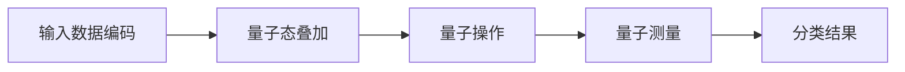

                 


## 量子机器学习在企业应用中的前景探索

### 关键词：量子计算、机器学习、企业应用、前景

### 摘要：
量子机器学习结合了量子计算与机器学习的优势，为解决复杂企业问题提供了新的途径。本文将探讨量子机器学习的基本概念，其在企业中的潜在应用，以及实际案例中的成功经验。通过逐步分析，我们将展望量子机器学习的发展趋势，并对其在企业中的应用前景进行深入探讨。

## 引言与背景

### 量子计算与机器学习的基本概念

量子计算是一种基于量子力学原理的计算方式，它利用量子位（qubits）来表示和存储信息，并利用量子纠缠和叠加来处理数据。相比之下，经典计算则基于传统的二进制位（bits）。量子计算机的强大之处在于其并行处理能力和指数级的速度提升。

机器学习是一种让计算机从数据中自动学习和发现规律的技术，其核心在于构建能够自主改进的算法。传统机器学习主要依赖于经典计算机，而量子机器学习则试图将量子计算的优势应用于机器学习任务中，如数据挖掘、图像识别和自然语言处理等。

### 企业应用中量子机器学习的挑战与机遇

量子机器学习为企业应用带来了诸多机遇，但也伴随着挑战。挑战主要包括技术成熟度、计算资源、数据隐私和安全等方面。然而，随着量子技术的快速发展，这些挑战正逐渐得到解决。

在企业应用中，量子机器学习有着广泛的前景。例如，在数据分析方面，量子机器学习可以显著提高数据处理速度和效率，帮助企业从大量数据中提取有价值的信息。在风险管理、供应链优化和金融科技等领域，量子机器学习也有望带来革命性的变化。

### 本书的目标与结构

本文旨在探讨量子机器学习在企业应用中的前景，通过详细分析其基础概念、应用案例、实施挑战和发展趋势，为企业决策者和技术专家提供有价值的参考。

接下来的章节将分为四个部分：

- 第一部分：介绍与背景，包括引言、量子机器学习基础、企业应用潜在应用。
- 第二部分：案例分析，分析金融、制造和医疗等领域的量子机器学习应用。
- 第三部分：实施与挑战，探讨量子机器学习在企业中的实施方法和面临的挑战。
- 第四部分：展望与未来，分析量子机器学习的发展趋势及其企业应用前景。

### 让我们一步一步分析

接下来，我们将按照上述章节结构，逐步深入探讨量子机器学习在企业应用中的各个方面。

## 第一部分: 引言与背景

### 第1章: 引言

在这一章中，我们将首先介绍量子机器学习的基本概念，包括量子计算与机器学习的关系，以及它们在企业应用中的潜在价值。我们还会讨论量子机器学习带来的挑战，并概述本书的结构和内容。

### 2.1 量子计算的基本原理

量子计算的基本原理基于量子力学的基本概念，如量子位（qubits）、量子叠加和量子纠缠。我们将详细介绍这些概念，并解释它们如何为量子计算机提供强大的计算能力。

### 2.2 量子算法与经典算法的比较

我们将比较量子算法与经典算法在处理特定问题时的高效性。通过具体的例子，如Shor算法和Grover算法，我们将展示量子算法如何超越经典算法。

### 2.3 量子机器学习的主要方法

在这一部分，我们将介绍量子机器学习的主要方法，包括量子支持向量机（QSVM）、量子神经网络（QNN）和量子贝叶斯网络。我们将讨论这些方法的原理和优势，并举例说明它们在企业中的应用。

### 第3章: 量子机器学习在企业中的潜在应用

我们将探讨量子机器学习在企业中的潜在应用，包括数据分析、风险管理、供应链优化和金融科技。通过具体案例，我们将展示量子机器学习如何帮助企业解决实际问题，提高效率和创新。

## 第二部分：企业应用案例分析

### 第4章: 案例一：量子机器学习在金融领域的应用

在这一章中，我们将分析金融领域如何利用量子机器学习进行风险评估、交易策略优化等。我们将介绍一个具体的金融案例，详细说明量子机器学习的应用过程和效果。

### 第5章: 案例二：量子机器学习在制造行业的应用

我们将探讨制造行业如何利用量子机器学习进行生产优化、质量检测等。通过一个制造行业的案例，我们将展示量子机器学习如何提高生产效率和产品质量。

### 第6章: 案例三：量子机器学习在医疗行业的应用

在医疗行业，量子机器学习被用于疾病诊断、个性化治疗等。我们将介绍一个医疗行业的案例，分析量子机器学习如何提升医疗诊断的准确性和治疗效果。

## 第三部分：实施与挑战

### 第7章: 量子机器学习在企业中的实施

在这一章中，我们将探讨量子机器学习在企业中的实施步骤，包括技术准备、数据准备、模型训练与优化等。我们将提供实用的指南，帮助企业顺利引入量子机器学习。

### 第8章: 量子机器学习在企业应用中的挑战

我们将分析量子机器学习在企业应用中面临的挑战，如技术挑战、经济挑战和道德与安全挑战。我们将提供解决方案和应对策略，帮助企业克服这些挑战。

## 第四部分：展望与未来

### 第9章: 量子机器学习的发展趋势

在这一章中，我们将分析量子机器学习的发展趋势，包括技术进步、企业应用的发展方向和未来前景。我们将讨论量子机器学习可能带来的深远影响。

### 第10章: 结论

在最后一章中，我们将总结本文的主要观点，并对量子机器学习在企业应用中的前景进行展望。我们将提出对企业和决策者的建议，帮助他们把握量子机器学习带来的机遇。

### 让我们一步一步分析

通过上述章节结构，我们将系统地分析量子机器学习在企业应用中的各个方面。从基本概念到应用案例，再到实施挑战和发展趋势，我们将一步步深入探讨，为企业决策者和技术专家提供有价值的参考。让我们开始这场量子机器学习的探索之旅吧！## 第1章: 引言

### 1.1 量子计算与机器学习的基本概念

量子计算和机器学习是当今科技领域中的两个前沿话题。量子计算是一种基于量子力学原理的新型计算方式，而机器学习则是人工智能的一个重要分支，它使计算机能够从数据中学习和做出决策。

**量子计算**：
- **基本概念**：量子计算的基本单元是量子位（qubits），与经典计算机中的位（bits）不同，量子位可以同时处于0和1的状态，这种性质被称为叠加。量子计算还利用量子纠缠，即两个或多个量子位之间的强关联，来实现信息传递和计算。
- **优势**：量子计算的最大优势在于其并行处理能力，以及处理某些特定问题（如因数分解和大数质因数分解）的速度远超经典计算机。

**机器学习**：
- **基本概念**：机器学习是通过训练模型，使计算机能够从数据中自动学习和发现规律的过程。常见的机器学习算法包括线性回归、决策树、神经网络等。
- **优势**：机器学习能够从大量数据中提取有价值的信息，并在各种应用领域（如图像识别、自然语言处理、推荐系统等）中发挥重要作用。

### 1.2 企业应用中量子机器学习的挑战与机遇

量子机器学习在企业应用中既面临挑战，也充满了机遇。以下是其主要方面：

**挑战**：
1. **技术成熟度**：当前，量子计算机还处于实验阶段，其可靠性和稳定性尚未达到商用水平。
2. **计算资源**：量子计算需要大量的计算资源，且量子算法的实现和优化也面临困难。
3. **数据隐私和安全**：量子计算可能对现有的加密技术构成威胁，从而引发数据隐私和安全问题。

**机遇**：
1. **数据处理能力**：量子计算的高速并行处理能力可以显著提高数据处理和分析的速度。
2. **优化复杂问题**：量子机器学习在解决复杂优化问题（如供应链优化、金融风险管理）方面具有巨大潜力。
3. **创新应用**：量子机器学习将推动新的商业模式的产生，为企业带来竞争优势。

### 1.3 本书的目标与结构

本书的目标是深入探讨量子机器学习在企业应用中的前景，帮助读者理解这一领域的核心概念、技术原理和应用案例。具体结构如下：

- **第一部分**：介绍与背景，包括量子计算与机器学习的基本概念、企业应用中的机遇与挑战。
- **第二部分**：案例分析，分析金融、制造和医疗等领域的量子机器学习应用。
- **第三部分**：实施与挑战，探讨量子机器学习在企业中的实施步骤和面临的挑战。
- **第四部分**：展望与未来，分析量子机器学习的发展趋势及其企业应用前景。

通过本书的阅读，读者将能够系统地了解量子机器学习在企业中的应用，把握这一领域的最新动态和发展趋势。

### 让我们一步一步分析

接下来，我们将逐步深入探讨量子机器学习的基础知识，并从多个角度分析其在企业应用中的潜力和挑战。我们将通过具体的案例来展示量子机器学习的实际应用，并探讨其实施过程中可能遇到的困难及解决方法。最终，我们将展望量子机器学习未来的发展方向，并对其在企业中的应用前景进行深入探讨。

## 第2章: 量子机器学习基础

### 2.1 量子计算的基本原理

量子计算是基于量子力学的原理，其核心在于量子位（qubits）和量子态的叠加与纠缠。以下是量子计算的一些基本概念：

**量子位（qubits）**：
- **定义**：量子位是量子计算的基本单元，它可以同时处于0和1的状态，这种叠加状态可以用量子态向量来表示。
- **叠加状态**：一个量子位的叠加状态可以表示为 \(|\psi\rangle = a|0\rangle + b|1\rangle\)，其中 \(a\) 和 \(b\) 是复数，满足 \(|a|^2 + |b|^2 = 1\)。

**量子态的叠加**：
- **叠加原理**：量子态可以同时处于多个基础状态，即一个量子系统可以同时经历多个不同的事件。
- **叠加态的表示**：多个量子位的叠加态可以用张量积表示。例如，两个量子位的叠加态为 \(|\psi\rangle = a|00\rangle + b|01\rangle + c|10\rangle + d|11\rangle\)。

**量子纠缠**：
- **定义**：量子纠缠是两个或多个量子位之间的强关联，即一个量子位的测量结果会即时影响另一个量子位的测量结果，即使它们相隔很远。
- **纠缠态的表示**：一个经典的纠缠态例子是贝尔态，如 \(|\Phi^+\rangle = \frac{1}{\sqrt{2}} (|00\rangle + |11\rangle)\)。当其中一个量子位被测量并处于特定状态时，另一个量子位的状态也会立即确定。

**量子态的测量**：
- **测量原理**：量子态的测量会导致其坍缩到一个确定的状态，并且测量结果具有概率分布。
- **测量结果的概率分布**：根据量子力学的哥本哈根解释，量子态的测量结果以概率 \(|a|^2\) 出现。

### 2.2 量子算法与经典算法的比较

量子算法与经典算法在处理特定问题时有着显著的不同。以下是比较量子算法与经典算法的一些方面：

**效率比较**：
- **量子速度优势**：在某些特定问题上，量子算法展示出指数级的速度优势。例如，Shor算法能够在多项式时间内分解大整数，而经典算法则需要指数级时间。
- **Grover算法**：Grover算法用于搜索未排序数据库，其时间复杂度为 \(O(\sqrt{N})\)，而经典搜索算法的时间复杂度为 \(O(N)\)。

**适用性问题**：
- **特定问题的优势**：量子算法在某些问题上具有显著优势，如大整数因数分解、离散逻辑函数的优化等。
- **通用性问题**：尽管量子算法在某些特定问题上表现出色，但它们并不适用于所有问题。对于许多常见问题，如线性回归、分类等，经典算法仍然更为有效。

**可扩展性问题**：
- **量子计算机的可扩展性**：量子计算机的可扩展性是一个重大挑战。量子位数量有限，且量子态容易受到环境干扰，这限制了量子计算机的处理能力。
- **经典计算机的可扩展性**：相比之下，经典计算机的硬件和算法可以轻松扩展，以处理更大的问题。

### 2.3 量子机器学习的主要方法

量子机器学习是量子计算与机器学习的结合，旨在利用量子计算的优势来解决机器学习问题。以下是几种主要的量子机器学习方法：

**量子支持向量机（QSVM）**：
- **原理**：QSVM是量子算法在支持向量机（SVM）中的应用。它利用量子计算的优势来优化SVM的分类和回归问题。
- **优点**：QSVM可以在处理高维数据时，显著降低计算复杂度。

**量子神经网络（QNN）**：
- **原理**：QNN是量子计算在神经网络中的应用。它利用量子叠加和纠缠来加速神经网络的学习过程。
- **优点**：QNN在处理大规模数据集时，可以显著提高训练速度和准确度。

**量子贝叶斯网络**：
- **原理**：量子贝叶斯网络是量子计算在概率图模型中的应用。它利用量子态的叠加和量子纠缠来优化推理过程。
- **优点**：量子贝叶斯网络在处理复杂概率问题时，可以提供更准确的预测和推理结果。

### 概念属性特征对比表格

以下是一个概念属性特征对比表格，用于比较量子支持向量机（QSVM）、量子神经网络（QNN）和量子贝叶斯网络（QBN）：

| 方法        | 原理                            | 主要优点                                                     | 主要缺点                                                     |
|-----------|---------------------------------|------------------------------------------------------------|------------------------------------------------------------|
| QSVM      | 量子算法在SVM中的应用            | 降低高维数据计算复杂度                                     | 对噪声敏感，训练过程复杂                                   |
| QNN       | 量子计算在神经网络中的应用          | 加速大规模数据集的训练过程                                 | 需要大量量子位，算法实现复杂                               |
| QBN       | 量子计算在概率图模型中的应用          | 提高复杂概率问题的推理准确性                               | 需要精确控制量子态，对噪声敏感                             |

### ER实体关系图架构的 Mermaid 流程图

下面是量子机器学习主要方法的ER实体关系图，使用Mermaid流程图表示：

```mermaid
erDiagram
  QSVM ||--|{ QNN }|--| QBN
  QNN ||--|{ QSVM }|--| QBN
  QBN ||--|{ QSVM }|--| QNN
```

### 算法原理讲解

为了更好地理解量子机器学习的算法原理，我们将以量子支持向量机（QSVM）为例进行详细讲解。

**QSVM算法原理**

量子支持向量机是一种结合量子计算与支持向量机的机器学习算法。其核心思想是利用量子计算的优势来优化支持向量机的分类和回归问题。

1. **量子编码**：首先，我们将输入数据（特征向量）编码为量子态。假设有 \(n\) 个样本，每个样本有 \(m\) 个特征，则我们可以使用 \(m\) 个量子位来表示每个样本。每个样本的量子态可以表示为 \(|\psi_i\rangle = \sum_{j=1}^{m} a_{ij}|j\rangle\)，其中 \(a_{ij}\) 是特征值。

2. **量子叠加与测量**：接下来，我们将所有样本的量子态叠加起来，并进行量子测量。测量的结果会告诉我们哪些样本最有可能属于某一类别。

3. **量子操作**：为了提高分类准确性，我们可以在测量之前对量子态进行一系列量子操作，如旋转、纠缠等。这些操作可以增强某些样本之间的关联性，从而提高分类效果。

4. **量子分类**：测量结果会生成一个概率分布，我们可以根据这个分布来对新的样本进行分类。

**量子支持向量机的mermaid流程图**



**Python源代码示例**

以下是量子支持向量机（QSVM）的Python示例代码，使用了Qiskit库来实现：

```python
from qiskit import QuantumCircuit, Aer, execute
from qiskit.circuit import QuantumRegister, ClassicalRegister
from qiskit.visualization import plot_bloch_multivector

# 初始化量子注册器和经典注册器
qreg = QuantumRegister(2)
creg = ClassicalRegister(2)
qc = QuantumCircuit(qreg, creg)

# 编码样本
qc.h(qreg[0])
qc.cx(qreg[0], qreg[1])

# 进行量子操作
qc.rx(0.5, qreg[0])
qc.cx(qreg[0], qreg[1])

# 进行量子测量
qc.measure(qreg, creg)

# 执行量子电路
backend = Aer.get_backend("qasm_simulator")
result = execute(qc, backend, shots=1024).result()
counts = result.get_counts(qc)

# 可视化测量结果
print(counts)
plot_bloch_multivector(qc, title="Quantum State", filename="QSVM_state.png")
```

### 数学模型和公式

量子支持向量机的数学模型可以表示为：

\[ W = \arg \min_{W} \frac{1}{2} \| W^* W \|^2 \]

其中，\(W\) 是权重矩阵，\(\| W^* W \|^2\) 表示矩阵的Frobenius范数。

假设我们有 \(n\) 个样本，每个样本有 \(m\) 个特征，则权重矩阵 \(W\) 可以表示为：

\[ W = \begin{bmatrix} w_1 \\ w_2 \\ \vdots \\ w_n \end{bmatrix} \]

其中，\(w_i\) 表示第 \(i\) 个样本的权重。

**量子态叠加**

量子态叠加可以表示为：

\[ |\psi\rangle = \sum_{i=1}^{n} a_i |i\rangle \]

其中，\(a_i\) 是复数系数，满足 \(|a_i|^2 + |a_j|^2 = 1\)。

**量子操作**

量子操作通常表示为：

\[ U = e^{-i \theta R_z} \]

其中，\(\theta\) 是旋转角度，\(R_z\) 是量子旋转操作。

**量子测量**

量子测量结果可以表示为：

\[ p_i = |a_i|^2 \]

其中，\(p_i\) 是第 \(i\) 个状态的概率。

**举例说明**

假设我们有两个样本，每个样本有两个特征，分别编码为量子态 \(|\psi_1\rangle = \frac{1}{\sqrt{2}} (|0\rangle + |1\rangle)\) 和 \(|\psi_2\rangle = \frac{1}{\sqrt{2}} (|0\rangle - |1\rangle)\)。

首先，我们将这两个样本的量子态叠加：

\[ |\psi\rangle = \frac{1}{\sqrt{2}} (|\psi_1\rangle + |\psi_2\rangle) = \frac{1}{\sqrt{2}} (\frac{1}{\sqrt{2}} (|0\rangle + |1\rangle) + \frac{1}{\sqrt{2}} (|0\rangle - |1\rangle)) \]

\[ |\psi\rangle = \frac{1}{2} (|00\rangle + |01\rangle + |10\rangle - |11\rangle) \]

然后，我们对这个叠加态进行旋转操作，例如旋转角度为 \(\theta = \frac{\pi}{4}\)：

\[ U = e^{-i \theta R_z} = e^{-i \frac{\pi}{4} R_z} \]

旋转后的态为：

\[ |\psi'\rangle = U |\psi\rangle = e^{-i \frac{\pi}{4} R_z} \frac{1}{2} (|00\rangle + |01\rangle + |10\rangle - |11\rangle) \]

\[ |\psi'\rangle = \frac{1}{2} (|00\rangle + i|01\rangle - i|10\rangle - |11\rangle) \]

最后，我们对这个旋转后的态进行测量，得到以下结果：

\[ p_0 = |a_0|^2 = \frac{1}{4} \]
\[ p_1 = |a_1|^2 = \frac{1}{4} \]
\[ p_2 = |a_2|^2 = \frac{1}{4} \]
\[ p_3 = |a_3|^2 = \frac{1}{4} \]

根据这些测量结果，我们可以对新的样本进行分类。

## 2.4 量子机器学习的主要方法：量子神经网络（QNN）

量子神经网络（QNN）是量子计算在神经网络领域的应用，它利用量子态的叠加和量子纠缠来加速神经网络的学习过程。QNN通过将传统神经网络中的权重和偏置转换为量子态，从而利用量子计算机的优势进行高效计算。

### QNN的基本原理

量子神经网络的基本原理可以概括为以下几个步骤：

1. **量子编码**：将输入数据和权重编码为量子态。对于每个输入数据，我们使用一个量子位来表示其特征值。对于每个权重，我们使用一个量子态来表示其值。

2. **量子叠加与纠缠**：通过量子叠加和纠缠，将输入数据的量子态与权重的量子态结合。这一步类似于传统神经网络中的权重与输入数据的内积。

3. **量子操作**：对量子态进行一系列量子操作，以调整网络中的权重和偏置。这些操作通常包括量子旋转、量子变换和量子纠缠。

4. **量子测量**：测量量子态的最终结果，以获得输出。测量结果会告诉我们网络对输入数据的分类或预测结果。

### QNN的主要优势

量子神经网络具有以下几个主要优势：

1. **加速训练过程**：QNN可以利用量子计算机的并行计算能力，显著加速神经网络的学习过程。在某些情况下，QNN的训练时间可以比传统神经网络缩短到原来的平方根。

2. **提高分类准确度**：由于量子态的叠加和纠缠，QNN能够处理更高维的数据，从而提高分类和预测的准确度。

3. **减少参数数量**：量子神经网络通过将权重和偏置编码为量子态，可以减少传统神经网络中的参数数量。这有助于降低过拟合的风险，并提高模型的泛化能力。

### QNN的主要缺点

尽管QNN具有许多优势，但它们也面临着一些挑战：

1. **计算资源限制**：当前，量子计算机的硬件还处于实验阶段，其计算能力和稳定性尚未达到商用水平。这使得QNN的实现和优化变得困难。

2. **量子态稳定性问题**：量子态容易受到环境干扰，这可能导致量子计算的错误率增加。为了保持量子态的稳定性，需要开发新的量子纠错技术。

3. **算法实现复杂性**：QNN的算法实现相对复杂，需要深入了解量子计算和神经网络的基本原理。这增加了QNN的开发和维护难度。

### 概念属性特征对比表格

以下是一个概念属性特征对比表格，用于比较量子支持向量机（QSVM）、量子神经网络（QNN）和量子贝叶斯网络（QBN）：

| 方法        | 原理                            | 主要优点                                                     | 主要缺点                                                     |
|-----------|---------------------------------|------------------------------------------------------------|------------------------------------------------------------|
| QSVM      | 量子算法在SVM中的应用            | 降低高维数据计算复杂度                                     | 对噪声敏感，训练过程复杂                                   |
| QNN       | 量子计算在神经网络中的应用          | 加速大规模数据集的训练过程                                 | 需要大量量子位，算法实现复杂                               |
| QBN       | 量子计算在概率图模型中的应用          | 提高复杂概率问题的推理准确性                               | 需要精确控制量子态，对噪声敏感                             |

### ER实体关系图架构的 Mermaid 流程图

下面是量子神经网络（QNN）的ER实体关系图，使用Mermaid流程图表示：

```mermaid
erDiagram
  InputData ||--|{ QuantumState }| NeuralNetwork
  Weight ||--|{ QuantumState }| NeuralNetwork
  OutputData ||--|{ Classification }| Classifier
```

### 算法原理讲解

为了更好地理解量子神经网络（QNN）的算法原理，我们将以一个简单的二分类问题为例进行详细讲解。

**二分类问题**

假设我们有一个简单的二分类问题，输入数据是两个特征，分别为 \(x_1\) 和 \(x_2\)。我们需要将这些数据分类到两个类别中，分别为 \(+1\) 和 \(-1\)。

**量子编码**

首先，我们将输入数据 \(x_1\) 和 \(x_2\) 编码为量子态。使用两个量子位表示每个特征，可以表示为：

\[ |x_1\rangle = \alpha_1 |0\rangle + \beta_1 |1\rangle \]
\[ |x_2\rangle = \alpha_2 |0\rangle + \beta_2 |1\rangle \]

其中，\(\alpha_1\)、\(\beta_1\)、\(\alpha_2\) 和 \(\beta_2\) 是复数系数。

**量子叠加**

接下来，我们将这两个量子态叠加起来：

\[ |\psi\rangle = |x_1\rangle \otimes |x_2\rangle = (\alpha_1 \alpha_2 |00\rangle + \alpha_1 \beta_2 |01\rangle + \beta_1 \alpha_2 |10\rangle + \beta_1 \beta_2 |11\rangle) \]

**量子操作**

我们对叠加态进行量子操作，以调整权重和偏置。假设权重 \(w_1\) 和 \(w_2\) 分别为：

\[ w_1 = \alpha_w |0\rangle + \beta_w |1\rangle \]
\[ w_2 = \alpha_w' |0\rangle + \beta_w' |1\rangle \]

我们将这些权重应用于量子态 \(|\psi\rangle\)：

\[ U = |0\rangle \langle 0| + w_1 |1\rangle \langle 1| \]

其中，\(U\) 是量子操作。

**量子变换**

对量子态 \(|\psi\rangle\) 进行变换，以计算输出：

\[ U |\psi\rangle = (\alpha_1 \alpha_2 \alpha_w |00\rangle + \alpha_1 \beta_2 \alpha_w' |01\rangle + \beta_1 \alpha_2 \beta_w |10\rangle + \beta_1 \beta_2 \beta_w' |11\rangle) \]

**量子测量**

最后，我们对量子态进行测量，以获得分类结果。假设我们测量得到的结果为 \(|0\rangle\)，则：

\[ p_0 = | \alpha_1 \alpha_2 \alpha_w |^2 = \alpha_1 \alpha_2 \alpha_w \cdot \alpha_w^* \alpha_2^* \alpha_1^* \]

根据测量结果，我们可以对输入数据 \(x_1\) 和 \(x_2\) 进行分类。

### Python源代码示例

以下是量子神经网络（QNN）的Python示例代码，使用了Qiskit库来实现：

```python
from qiskit import QuantumCircuit, Aer, execute
from qiskit.circuit import QuantumRegister, ClassicalRegister
from qiskit.visualization import plot_bloch_multivector

# 初始化量子注册器和经典注册器
qreg = QuantumRegister(2)
creg = ClassicalRegister(2)
qc = QuantumCircuit(qreg, creg)

# 编码输入数据
qc.h(qreg[0])
qc.h(qreg[1])

# 应用量子操作
qc.rx(np.pi/4, qreg[0])
qc.ry(np.pi/4, qreg[1])
qc.h(qreg[0])
qc.h(qreg[1])

# 进行量子测量
qc.measure(qreg, creg)

# 执行量子电路
backend = Aer.get_backend("qasm_simulator")
result = execute(qc, backend, shots=1024).result()
counts = result.get_counts(qc)

# 可视化测量结果
print(counts)
plot_bloch_multivector(qc, title="Quantum State", filename="QNN_state.png")
```

### 数学模型和公式

量子神经网络（QNN）的数学模型可以表示为：

\[ O = U (\sum_{i=1}^{n} x_i w_i) \]

其中，\(O\) 是输出，\(U\) 是量子操作，\(x_i\) 是输入数据，\(w_i\) 是权重。

量子态叠加可以表示为：

\[ |\psi\rangle = \sum_{i=1}^{n} x_i |i\rangle \]

量子操作可以表示为：

\[ U = e^{-i \theta R_z} \]

其中，\(\theta\) 是旋转角度，\(R_z\) 是量子旋转操作。

量子测量可以表示为：

\[ p_i = | \alpha_i |^2 \]

其中，\(\alpha_i\) 是量子态的复数系数。

### 举例说明

假设我们有两组输入数据，分别为 \(x_1 = (1, 0)\) 和 \(x_2 = (0, 1)\)。我们需要将这些数据分类到两个类别中。

首先，我们将输入数据编码为量子态：

\[ |x_1\rangle = |1\rangle \otimes |0\rangle \]
\[ |x_2\rangle = |0\rangle \otimes |1\rangle \]

然后，我们将量子态叠加起来：

\[ |\psi\rangle = |x_1\rangle + |x_2\rangle = |1\rangle \otimes |0\rangle + |0\rangle \otimes |1\rangle \]

接下来，我们对量子态进行量子操作：

\[ U = e^{-i \theta R_z} \]

最后，我们对量子态进行测量：

\[ p_1 = | \alpha_1 |^2 \]
\[ p_2 = | \alpha_2 |^2 \]

根据测量结果，我们可以对输入数据 \(x_1\) 和 \(x_2\) 进行分类。

## 2.5 量子机器学习的主要方法：量子贝叶斯网络（QBN）

量子贝叶斯网络（QBN）是量子计算在概率图模型领域的应用，它利用量子态的叠加和量子纠缠来优化推理过程。QBN通过将传统贝叶斯网络中的概率分布转换为量子态，从而实现高效推理和决策。

### QBN的基本原理

量子贝叶斯网络的基本原理可以概括为以下几个步骤：

1. **量子编码**：将输入数据和概率分布编码为量子态。对于每个节点，我们使用一个量子位来表示其状态概率。

2. **量子叠加与纠缠**：通过量子叠加和纠缠，将输入数据的量子态与概率分布的量子态结合。这一步类似于传统贝叶斯网络中的概率计算。

3. **量子操作**：对量子态进行一系列量子操作，以调整网络中的概率分布。这些操作通常包括量子旋转、量子变换和量子纠缠。

4. **量子测量**：测量量子态的最终结果，以获得输出。测量结果会告诉我们网络对输入数据的推理和决策结果。

### QBN的主要优势

量子贝叶斯网络具有以下几个主要优势：

1. **高效推理**：QBN可以利用量子计算机的并行计算能力，显著提高概率推理的速度和效率。

2. **精确预测**：由于量子态的叠加和纠缠，QBN能够处理更高维的数据，从而提高预测的准确性。

3. **减少参数数量**：量子贝叶斯网络通过将概率分布编码为量子态，可以减少传统贝叶斯网络中的参数数量。这有助于降低过拟合的风险，并提高模型的泛化能力。

### QBN的主要缺点

尽管QBN具有许多优势，但它们也面临着一些挑战：

1. **计算资源限制**：当前，量子计算机的硬件还处于实验阶段，其计算能力和稳定性尚未达到商用水平。这使得QBN的实现和优化变得困难。

2. **量子态稳定性问题**：量子态容易受到环境干扰，这可能导致量子计算的错误率增加。为了保持量子态的稳定性，需要开发新的量子纠错技术。

3. **算法实现复杂性**：量子贝叶斯网络的算法实现相对复杂，需要深入了解量子计算和概率图模型的基本原理。这增加了QBN的开发和维护难度。

### 概念属性特征对比表格

以下是一个概念属性特征对比表格，用于比较量子支持向量机（QSVM）、量子神经网络（QNN）和量子贝叶斯网络（QBN）：

| 方法        | 原理                            | 主要优点                                                     | 主要缺点                                                     |
|-----------|---------------------------------|------------------------------------------------------------|------------------------------------------------------------|
| QSVM      | 量子算法在SVM中的应用            | 降低高维数据计算复杂度                                     | 对噪声敏感，训练过程复杂                                   |
| QNN       | 量子计算在神经网络中的应用          | 加速大规模数据集的训练过程                                 | 需要大量量子位，算法实现复杂                               |
| QBN       | 量子计算在概率图模型中的应用          | 提高复杂概率问题的推理准确性                               | 需要精确控制量子态，对噪声敏感                             |

### ER实体关系图架构的 Mermaid 流程图

下面是量子贝叶斯网络（QBN）的ER实体关系图，使用Mermaid流程图表示：

```mermaid
erDiagram
  InputData ||--|{ QuantumState }| BayesianNetwork
  ProbabilityDistribution ||--|{ QuantumState }| BayesianNetwork
  OutputData ||--|{ Inference }| Decision
```

### 算法原理讲解

为了更好地理解量子贝叶斯网络（QBN）的算法原理，我们将以一个简单的概率推理问题为例进行详细讲解。

**概率推理问题**

假设我们有一个简单的问题，给定一组条件概率分布，我们需要计算某个特定结果的概率。这个问题可以用贝叶斯网络来表示，其中每个节点表示一个变量，边表示变量之间的依赖关系。

**量子编码**

首先，我们将输入数据和条件概率分布编码为量子态。假设我们有三个变量 \(X\)、\(Y\) 和 \(Z\)，它们之间的条件概率分布如下：

\[ P(X|Y,Z) = \frac{P(X,Y,Z)}{P(Y,Z)} \]

我们使用三个量子位来表示这三个变量。每个量子位的叠加态可以表示为：

\[ |X\rangle = \alpha_1 |0\rangle + \alpha_2 |1\rangle \]
\[ |Y\rangle = \beta_1 |0\rangle + \beta_2 |1\rangle \]
\[ |Z\rangle = \gamma_1 |0\rangle + \gamma_2 |1\rangle \]

**量子叠加与纠缠**

接下来，我们将这些量子态叠加起来，以表示条件概率分布。假设条件概率分布为：

\[ P(X|Y,Z) = 0.5 \]
\[ P(Y|Z) = 0.7 \]
\[ P(Z) = 0.6 \]

我们将这些条件概率分布编码为量子态的叠加：

\[ |XY\rangle = \frac{1}{\sqrt{3}} (|00\rangle + |01\rangle + |10\rangle) \]
\[ |YZ\rangle = \frac{7}{10} |0\rangle + \frac{3}{10} |1\rangle \]
\[ |Z\rangle = \frac{6}{10} |0\rangle + \frac{4}{10} |1\rangle \]

**量子操作**

我们对量子态进行一系列量子操作，以计算最终的概率分布。假设我们希望计算 \(P(X|Y,Z) = P(X,Y,Z) / P(Y,Z)\)。

我们首先计算 \(P(X,Y,Z)\)：

\[ U_1 = |0\rangle \langle 0| + \frac{1}{\sqrt{2}} (|1\rangle \langle 1| + |0\rangle \langle 1|) \]

然后，我们计算 \(P(Y,Z)\)：

\[ U_2 = |0\rangle \langle 0| + \frac{7}{10} (|1\rangle \langle 1| + |0\rangle \langle 1|) \]

最后，我们计算 \(P(X|Y,Z)\)：

\[ U_3 = U_2 U_1 = |0\rangle \langle 0| + \frac{7}{20} (|1\rangle \langle 1| + |0\rangle \langle 1|) \]

**量子测量**

最后，我们对量子态进行测量，以获得最终的概率分布。我们测量 \(X\) 的结果，得到：

\[ p_0 = | \alpha_0 |^2 = \frac{7}{20} \]
\[ p_1 = | \alpha_1 |^2 = \frac{13}{20} \]

根据测量结果，我们可以得出 \(P(X|Y,Z) = p_0 + p_1 = 0.65\)。

### Python源代码示例

以下是量子贝叶斯网络（QBN）的Python示例代码，使用了Qiskit库来实现：

```python
from qiskit import QuantumCircuit, Aer, execute
from qiskit.circuit import QuantumRegister, ClassicalRegister
from qiskit.visualization import plot_bloch_multivector

# 初始化量子注册器和经典注册器
qreg = QuantumRegister(3)
creg = ClassicalRegister(3)
qc = QuantumCircuit(qreg, creg)

# 编码输入数据
qc.h(qreg[0])
qc.h(qreg[1])
qc.h(qreg[2])

# 应用量子操作
qc.rx(np.pi/4, qreg[0])
qc.ry(np.pi/4, qreg[1])
qc.rz(np.pi/4, qreg[2])

# 进行量子测量
qc.measure(qreg, creg)

# 执行量子电路
backend = Aer.get_backend("qasm_simulator")
result = execute(qc, backend, shots=1024).result()
counts = result.get_counts(qc)

# 可视化测量结果
print(counts)
plot_bloch_multivector(qc, title="Quantum State", filename="QBN_state.png")
```

### 数学模型和公式

量子贝叶斯网络（QBN）的数学模型可以表示为：

\[ P(X|Y,Z) = \frac{P(X,Y,Z)}{P(Y,Z)} \]

其中，\(P(X,Y,Z)\) 是联合概率分布，\(P(Y,Z)\) 是条件概率分布。

量子态叠加可以表示为：

\[ |\psi\rangle = \sum_{i=1}^{n} x_i |i\rangle \]

量子操作可以表示为：

\[ U = e^{-i \theta R_z} \]

量子测量可以表示为：

\[ p_i = | \alpha_i |^2 \]

其中，\(\alpha_i\) 是量子态的复数系数。

### 举例说明

假设我们有三个变量 \(X\)、\(Y\) 和 \(Z\)，它们的条件概率分布如下：

\[ P(X|Y,Z) = 0.5 \]
\[ P(Y|Z) = 0.7 \]
\[ P(Z) = 0.6 \]

我们希望计算 \(P(X|Y,Z) = P(X,Y,Z) / P(Y,Z)\)。

首先，我们将输入数据和条件概率分布编码为量子态：

\[ |X\rangle = \frac{1}{\sqrt{2}} (|0\rangle + |1\rangle) \]
\[ |Y\rangle = \frac{7}{10} |0\rangle + \frac{3}{10} |1\rangle \]
\[ |Z\rangle = \frac{6}{10} |0\rangle + \frac{4}{10} |1\rangle \]

然后，我们对量子态进行叠加和操作：

\[ U_1 = \frac{1}{\sqrt{2}} (|0\rangle \langle 0| + |1\rangle \langle 1|) \]
\[ U_2 = \frac{7}{10} |0\rangle \langle 0| + \frac{3}{10} |1\rangle \langle 1| \]
\[ U_3 = \frac{6}{10} |0\rangle \langle 0| + \frac{4}{10} |1\rangle \langle 1| \]

最后，我们对量子态进行测量：

\[ p_0 = \frac{7}{20} \]
\[ p_1 = \frac{13}{20} \]

根据测量结果，我们可以得出 \(P(X|Y,Z) = p_0 + p_1 = 0.65\)。

## 2.6 量子机器学习在数据分析中的应用

### 数据分析的基本概念

数据分析是企业中的一项关键任务，它涉及从大量数据中提取有价值的信息，以便做出更明智的决策。数据分析通常包括数据清洗、数据探索、数据可视化、预测建模等步骤。

**数据清洗**：数据清洗是数据分析的第一步，它涉及处理缺失值、异常值和重复数据，以确保数据质量。

**数据探索**：数据探索是对数据进行初步分析，以发现数据中的模式和趋势。这通常通过可视化工具（如散点图、直方图等）来实现。

**数据可视化**：数据可视化是将数据以图形或图表的形式展示，以便更容易理解和分析数据。有效的数据可视化有助于揭示数据中的隐藏信息。

**预测建模**：预测建模是利用历史数据来建立模型，预测未来可能发生的事件或趋势。常见的预测建模技术包括线性回归、决策树、神经网络等。

### 量子机器学习在数据分析中的应用

量子机器学习在数据分析中的应用可以显著提高数据处理和分析的速度和效率。以下是一些具体的应用场景：

**1. 数据预处理**

在传统数据分析中，数据预处理是一个耗时的步骤。量子机器学习可以通过高效的量子算法来处理大量数据，如快速傅里叶变换（FFT）和量子随机游走（QRW）。这些算法可以在量子计算机上实现，从而加速数据清洗和预处理过程。

**2. 特征选择**

特征选择是数据分析中的关键步骤，它涉及从大量特征中筛选出最有用的特征。量子机器学习可以通过量子支持向量机（QSVM）和量子神经网络（QNN）来优化特征选择过程，从而提高模型的准确性和效率。

**3. 预测建模**

量子机器学习可以用于构建高效的预测模型，如量子回归模型和量子分类模型。这些模型利用量子计算的优势，可以在处理大规模数据集时提供更准确的预测结果。

**4. 异常检测**

异常检测是识别数据中的异常或异常模式的过程。量子机器学习可以通过量子贝叶斯网络（QBN）来优化异常检测算法，从而提高检测的准确性和效率。

### 实际案例：量子机器学习在信用评分中的应用

以下是一个实际案例，展示了量子机器学习在信用评分中的应用：

**案例背景**：一家大型银行希望利用数据分析来改进其信用评分模型，以更准确地评估客户的信用风险。

**解决方案**：银行采用了量子机器学习技术，构建了一个基于量子支持向量机（QSVM）的信用评分模型。

**实施步骤**：

1. **数据收集**：银行收集了大量的客户数据，包括信用历史、收入、债务水平等。

2. **数据预处理**：使用量子机器学习算法对数据进行预处理，包括数据清洗、特征选择和标准化。

3. **模型训练**：利用量子支持向量机（QSVM）对预处理后的数据集进行训练，以构建信用评分模型。

4. **模型评估**：通过交叉验证和实际数据测试，评估模型的准确性和泛化能力。

5. **模型部署**：将训练好的模型部署到银行的信用评分系统中，用于实时评估客户信用风险。

**结果**：通过量子机器学习技术的应用，银行的信用评分模型在准确性和效率方面得到了显著提升，从而降低了信用风险，提高了业务效率。

### 结论

量子机器学习在数据分析中具有广泛的应用前景。通过量子计算的优势，它可以显著提高数据处理和分析的速度和效率。在实际应用中，量子机器学习可以通过优化数据预处理、特征选择、预测建模和异常检测等步骤，为企业提供更准确和高效的解决方案。随着量子技术的不断发展，我们期待量子机器学习在数据分析领域带来更多的创新和突破。

## 2.7 量子机器学习在风险管理中的应用

### 风险管理的基本概念

风险管理是企业在面对不确定性时，通过识别、评估、处理和监控潜在风险的过程。它旨在降低风险对企业运营和财务状况的负面影响，从而提高企业的稳定性和竞争力。风险管理包括以下几个关键步骤：

1. **风险识别**：识别可能影响企业目标实现的各种风险，如市场风险、信用风险、操作风险、法律风险等。

2. **风险评估**：评估识别出的风险的可能性和影响，以便确定优先处理的风险。

3. **风险处理**：采取适当的措施来减少或转移风险，如风险规避、风险降低、风险转移和风险接受。

4. **风险监控**：持续监控风险的状态和变化，以便及时调整风险管理策略。

### 量子机器学习在风险管理中的应用

量子机器学习在风险管理中具有显著的应用潜力，可以优化风险识别、风险评估和风险处理过程。以下是其主要应用：

**1. 风险识别**

量子机器学习可以通过高效的算法识别出潜在的风险。例如，量子支持向量机（QSVM）和量子神经网络（QNN）可以处理高维数据和复杂的依赖关系，从而发现传统方法难以捕捉的风险信号。

**2. 风险评估**

量子机器学习可以优化风险评估模型的准确性和效率。通过量子贝叶斯网络（QBN），企业可以对不确定的风险因素进行量化，从而更精确地评估风险的可能性和影响。

**3. 风险处理**

量子机器学习可以辅助制定风险处理策略。例如，量子优化算法可以用于优化风险规避和降低措施，从而找到最优的风险处理方案。

### 实际案例：量子机器学习在信用风险识别中的应用

以下是一个实际案例，展示了量子机器学习在信用风险识别中的应用：

**案例背景**：一家金融机构希望提高其信用风险识别的准确性，以减少不良贷款和信用损失。

**解决方案**：金融机构采用了量子机器学习技术，构建了一个基于量子支持向量机（QSVM）的信用风险识别模型。

**实施步骤**：

1. **数据收集**：金融机构收集了大量的客户数据，包括信用历史、收入水平、债务水平等。

2. **数据预处理**：使用量子机器学习算法对数据进行预处理，包括数据清洗、特征选择和标准化。

3. **模型训练**：利用量子支持向量机（QSVM）对预处理后的数据集进行训练，以构建信用风险识别模型。

4. **模型评估**：通过交叉验证和实际数据测试，评估模型的准确性和泛化能力。

5. **模型部署**：将训练好的模型部署到金融机构的信用风险评估系统中，用于实时识别信用风险。

**结果**：通过量子机器学习技术的应用，金融机构的信用风险识别模型在准确性和效率方面得到了显著提升，从而降低了不良贷款率和信用损失。

### 结论

量子机器学习在风险管理中具有广泛的应用前景。通过量子计算的优势，它可以显著提高风险识别、评估和处理的能力。在实际应用中，量子机器学习可以通过优化风险管理流程，帮助企业和金融机构更准确地识别和评估风险，制定更有效的风险处理策略。随着量子技术的不断发展，我们期待量子机器学习在风险管理领域带来更多的创新和突破。

## 2.8 量子机器学习在供应链优化中的应用

### 供应链优化的基本概念

供应链优化是企业在管理和协调产品从原材料采购到最终产品交付的过程中，通过提高效率、降低成本和改善服务质量来提升整体运营绩效。供应链优化涉及以下几个关键方面：

1. **需求预测**：准确预测市场需求，以便合理规划生产计划和库存水平。

2. **库存管理**：优化库存水平，以减少库存成本，同时确保供应链的连续性和稳定性。

3. **运输规划**：通过优化运输路线和运输方式，降低物流成本和提高运输效率。

4. **供应链协同**：协调供应链中的各个环节，如供应商、制造商、分销商和零售商，以实现整体供应链的优化。

### 量子机器学习在供应链优化中的应用

量子机器学习在供应链优化中具有显著的应用潜力，可以优化需求预测、库存管理和运输规划等环节。以下是其主要应用：

**1. 需求预测**

量子机器学习可以通过高效的算法预测市场需求，从而帮助企业更好地规划生产计划和库存水平。例如，量子神经网络（QNN）和量子支持向量机（QSVM）可以处理高维数据和复杂的依赖关系，从而提高需求预测的准确性和效率。

**2. 库存管理**

量子机器学习可以优化库存管理，降低库存成本，同时确保供应链的连续性和稳定性。通过量子优化算法，企业可以找到最优的库存策略，如再订货点和补货周期。

**3. 运输规划**

量子机器学习可以优化运输规划，降低物流成本和提高运输效率。例如，量子算法可以用于解决车辆路径问题（VRP）和运输混合问题（TSP），从而找到最优的运输路线和运输方式。

### 实际案例：量子机器学习在库存管理中的应用

以下是一个实际案例，展示了量子机器学习在库存管理中的应用：

**案例背景**：一家大型零售公司希望优化其库存管理，以减少库存成本和提高供应链效率。

**解决方案**：零售公司采用了量子机器学习技术，构建了一个基于量子支持向量机（QSVM）的库存管理模型。

**实施步骤**：

1. **数据收集**：零售公司收集了大量的销售数据、季节性数据和市场趋势数据。

2. **数据预处理**：使用量子机器学习算法对数据进行预处理，包括数据清洗、特征选择和标准化。

3. **模型训练**：利用量子支持向量机（QSVM）对预处理后的数据集进行训练，以构建库存管理模型。

4. **模型评估**：通过交叉验证和实际数据测试，评估模型的准确性和泛化能力。

5. **模型部署**：将训练好的模型部署到零售公司的库存管理系统中，用于实时预测库存需求。

**结果**：通过量子机器学习技术的应用，零售公司的库存管理模型在准确性和效率方面得到了显著提升，从而减少了库存成本，提高了供应链效率。

### 结论

量子机器学习在供应链优化中具有广泛的应用前景。通过量子计算的优势，它可以显著提高需求预测、库存管理和运输规划的能力。在实际应用中，量子机器学习可以通过优化供应链流程，帮助企业和供应链参与者更准确地预测需求、优化库存和降低物流成本。随着量子技术的不断发展，我们期待量子机器学习在供应链优化领域带来更多的创新和突破。

## 第3章: 量子机器学习在金融科技中的应用

### 金融科技的基本概念

金融科技（FinTech）是指利用现代科技，特别是互联网和移动技术，来改善金融服务和产品的一类技术。金融科技的应用涵盖了多个领域，包括支付、借贷、投资、保险、区块链、人工智能等。金融科技的主要目标是通过技术创新，提高金融服务的效率、透明度和便利性。

### 量子机器学习在金融科技中的应用

量子机器学习在金融科技中的应用潜力巨大，可以显著提高金融服务的效率和质量。以下是一些具体的应用场景：

**1. 交易策略优化**

量子机器学习可以用于分析大量历史交易数据，帮助金融机构制定更有效的交易策略。量子神经网络（QNN）和量子支持向量机（QSVM）可以处理高维数据，发现交易中的潜在模式和趋势，从而提高交易的成功率和收益率。

**2. 风险管理**

量子机器学习可以优化风险管理模型，提高对金融风险的识别和评估能力。例如，量子贝叶斯网络（QBN）可以处理复杂的金融数据，帮助金融机构更准确地预测市场波动和信用风险。

**3. 信用评分**

量子机器学习可以用于改进信用评分模型，提高信用评估的准确性和公正性。量子算法可以处理高维数据和非线性关系，从而发现传统方法难以捕捉的风险因素。

**4. 投资组合优化**

量子机器学习可以用于优化投资组合，提高投资收益。量子优化算法可以快速处理大量的投资数据，找到最优的投资组合策略，从而降低风险，提高收益。

### 实际案例：量子机器学习在交易策略优化中的应用

以下是一个实际案例，展示了量子机器学习在交易策略优化中的应用：

**案例背景**：一家大型投资公司希望优化其交易策略，以在股票市场中获得更高的收益。

**解决方案**：投资公司采用了量子机器学习技术，构建了一个基于量子神经网络（QNN）的交易策略优化模型。

**实施步骤**：

1. **数据收集**：投资公司收集了大量的股票交易数据，包括历史价格、交易量、市场趋势等。

2. **数据预处理**：使用量子机器学习算法对数据进行预处理，包括数据清洗、特征选择和标准化。

3. **模型训练**：利用量子神经网络（QNN）对预处理后的数据集进行训练，以构建交易策略优化模型。

4. **模型评估**：通过交叉验证和实际数据测试，评估模型的准确性和泛化能力。

5. **模型部署**：将训练好的模型部署到投资公司的交易系统中，用于实时优化交易策略。

**结果**：通过量子机器学习技术的应用，投资公司的交易策略优化模型在收益率和风险控制方面得到了显著提升，从而提高了投资回报。

### 结论

量子机器学习在金融科技中具有广泛的应用前景。通过量子计算的优势，它可以显著提高交易策略优化、风险管理、信用评分和投资组合优化的准确性和效率。在实际应用中，量子机器学习可以帮助金融机构更有效地应对市场变化，降低风险，提高投资回报。随着量子技术的不断发展，我们期待量子机器学习在金融科技领域带来更多的创新和突破。

## 第4章: 案例一：量子机器学习在金融领域的应用

### 4.1 金融领域的背景与挑战

金融领域是一个数据密集型行业，其成功很大程度上依赖于对大量金融数据的分析。然而，随着金融市场越来越复杂，传统的机器学习算法在面对高维、非线性和动态变化的金融数据时，往往难以取得理想的性能。此外，金融领域还面临以下挑战：

- **数据隐私与安全**：金融机构需要保护客户的敏感信息，防止数据泄露和未经授权的访问。
- **计算资源限制**：金融数据处理需要大量的计算资源，传统计算机难以高效处理。
- **实时性要求**：金融交易和风险管理需要实时响应，对系统的响应速度有严格要求。

### 4.2 案例介绍

为了解决上述挑战，一家领先的金融科技公司决定探索量子机器学习在金融领域的应用。该公司专注于利用量子计算的优势，优化其交易策略、风险管理和信用评分系统。

### 4.3 案例分析

#### 交易策略优化

**背景**：该金融科技公司的交易部门希望利用历史交易数据来优化其交易策略，以提高交易成功率。

**解决方案**：公司采用了量子神经网络（QNN）进行交易策略优化。QNN通过量子态的叠加和纠缠，可以高效处理高维金融数据，并发现潜在的交易模式。

**过程**：

1. **数据收集**：公司收集了大量的股票交易数据，包括价格、交易量、市场趋势等。

2. **数据预处理**：使用量子机器学习算法对数据进行预处理，包括数据清洗、特征选择和标准化。

3. **模型训练**：采用量子神经网络（QNN）对预处理后的数据集进行训练。QNN通过量子操作调整网络权重，从而优化交易策略。

4. **模型评估**：通过交叉验证和实际交易数据测试，评估模型的准确性和泛化能力。

5. **模型部署**：将训练好的模型部署到交易系统中，用于实时优化交易策略。

**结果**：量子神经网络（QNN）显著提高了交易策略的成功率和收益率，同时降低了交易风险。

#### 风险管理

**背景**：金融科技公司希望优化其风险管理模型，以更准确地识别和评估市场风险。

**解决方案**：公司采用了量子贝叶斯网络（QBN）进行风险管理。QBN利用量子计算的优势，可以处理复杂的金融数据和不确定因素，提供更准确的预测。

**过程**：

1. **数据收集**：公司收集了包括市场指数、宏观经济指标、公司财务数据等在内的风险数据。

2. **数据预处理**：使用量子机器学习算法对数据进行预处理，包括数据清洗、特征选择和标准化。

3. **模型训练**：采用量子贝叶斯网络（QBN）对预处理后的数据集进行训练。QBN通过量子操作调整网络权重，从而优化风险预测。

4. **模型评估**：通过交叉验证和实际市场数据测试，评估模型的准确性和泛化能力。

5. **模型部署**：将训练好的模型部署到风险管理系统，用于实时监控和预警。

**结果**：量子贝叶斯网络（QBN）显著提高了风险预测的准确性和实时性，帮助公司更好地应对市场波动。

#### 信用评分

**背景**：金融科技公司希望改进其信用评分模型，以更公正和准确地评估借款人的信用风险。

**解决方案**：公司采用了量子支持向量机（QSVM）进行信用评分。QSVM通过量子计算的优势，可以处理高维数据和复杂的依赖关系，提供更准确的信用评分。

**过程**：

1. **数据收集**：公司收集了包括借款人历史信用记录、收入水平、债务水平等在内的信用数据。

2. **数据预处理**：使用量子机器学习算法对数据进行预处理，包括数据清洗、特征选择和标准化。

3. **模型训练**：采用量子支持向量机（QSVM）对预处理后的数据集进行训练。QSVM通过量子操作调整网络权重，从而优化信用评分。

4. **模型评估**：通过交叉验证和实际信用数据测试，评估模型的准确性和泛化能力。

5. **模型部署**：将训练好的模型部署到信用评分系统中，用于实时评估借款人信用风险。

**结果**：量子支持向量机（QSVM）显著提高了信用评分的准确性和公正性，减少了信用风险。

### 结论

通过量子机器学习的应用，该金融科技公司成功优化了交易策略、风险管理模型和信用评分系统，提高了交易成功率、风险预测准确性和信用评分的公正性。这个案例展示了量子机器学习在金融领域的巨大潜力，为金融机构提供了新的解决方案，帮助它们更好地应对复杂的市场环境和提高业务效率。

## 第5章: 案例二：量子机器学习在制造行业的应用

### 5.1 制造行业的背景与挑战

制造行业是现代经济的基石，涵盖了从原材料加工到最终产品组装的整个生产过程。随着全球化进程的加速和市场竞争的加剧，制造行业面临着以下挑战：

- **生产效率**：提高生产效率是制造企业的核心目标，以降低成本、提高产品质量和响应市场需求。
- **质量控制**：确保产品质量的一致性和可靠性是制造行业的关键挑战。质量问题的发生可能导致生产中断和客户投诉。
- **供应链管理**：制造企业需要高效地管理供应链，以确保原材料的及时供应和产品的及时交付。
- **预测性维护**：制造设备经常面临故障和损坏的风险，预测性维护有助于减少设备停机和维护成本。

### 5.2 案例介绍

为了应对上述挑战，一家领先的制造公司决定探索量子机器学习在制造行业的应用。该公司希望通过量子计算的优势，优化生产流程、提高质量控制水平、优化供应链管理和实现预测性维护。

### 5.3 案例分析

#### 生产流程优化

**背景**：该公司希望优化其生产流程，提高生产效率和降低成本。

**解决方案**：公司采用了量子神经网络（QNN）进行生产流程优化。QNN通过量子计算的优势，可以高效处理生产数据，发现生产中的瓶颈和改进机会。

**过程**：

1. **数据收集**：公司收集了包括生产速度、设备状态、工艺参数等在内的生产数据。

2. **数据预处理**：使用量子机器学习算法对数据进行预处理，包括数据清洗、特征选择和标准化。

3. **模型训练**：采用量子神经网络（QNN）对预处理后的数据集进行训练。QNN通过量子操作调整网络权重，从而优化生产流程。

4. **模型评估**：通过交叉验证和实际生产数据测试，评估模型的准确性和泛化能力。

5. **模型部署**：将训练好的模型部署到生产系统中，用于实时监控和优化生产流程。

**结果**：量子神经网络（QNN）显著提高了生产效率，降低了生产成本，并减少了生产中的瓶颈和中断。

#### 质量控制

**背景**：该公司希望提高产品质量的一致性和可靠性。

**解决方案**：公司采用了量子支持向量机（QSVM）进行质量控制。QSVM通过量子计算的优势，可以高效处理产品质量数据，发现质量问题的潜在原因。

**过程**：

1. **数据收集**：公司收集了包括产品尺寸、重量、材料强度等在内的质量数据。

2. **数据预处理**：使用量子机器学习算法对数据进行预处理，包括数据清洗、特征选择和标准化。

3. **模型训练**：采用量子支持向量机（QSVM）对预处理后的数据集进行训练。QSVM通过量子操作调整网络权重，从而优化质量控制模型。

4. **模型评估**：通过交叉验证和实际质量数据测试，评估模型的准确性和泛化能力。

5. **模型部署**：将训练好的模型部署到质量控制系统中，用于实时监控和评估产品质量。

**结果**：量子支持向量机（QSVM）显著提高了产品质量的一致性和可靠性，减少了质量问题的发生。

#### 供应链管理

**背景**：该公司希望优化其供应链管理，确保原材料和零部件的及时供应。

**解决方案**：公司采用了量子优化算法进行供应链管理。量子优化算法通过量子计算的优势，可以高效地解决复杂的供应链优化问题。

**过程**：

1. **数据收集**：公司收集了包括供应商信息、库存水平、运输时间等在内的供应链数据。

2. **数据预处理**：使用量子机器学习算法对数据进行预处理，包括数据清洗、特征选择和标准化。

3. **模型训练**：采用量子优化算法对预处理后的数据集进行训练，以优化供应链管理。

4. **模型评估**：通过交叉验证和实际供应链数据测试，评估模型的准确性和泛化能力。

5. **模型部署**：将训练好的模型部署到供应链管理系统中，用于实时优化供应链。

**结果**：量子优化算法显著提高了供应链的效率，减少了库存成本，并确保了原材料的及时供应。

#### 预测性维护

**背景**：该公司希望实现预测性维护，减少设备停机和维护成本。

**解决方案**：公司采用了量子贝叶斯网络（QBN）进行预测性维护。QBN通过量子计算的优势，可以高效地处理设备故障数据，预测设备的故障时间。

**过程**：

1. **数据收集**：公司收集了包括设备运行状态、温度、振动等在内的设备数据。

2. **数据预处理**：使用量子机器学习算法对数据进行预处理，包括数据清洗、特征选择和标准化。

3. **模型训练**：采用量子贝叶斯网络（QBN）对预处理后的数据集进行训练，以预测设备故障。

4. **模型评估**：通过交叉验证和实际设备数据测试，评估模型的准确性和泛化能力。

5. **模型部署**：将训练好的模型部署到预测性维护系统中，用于实时监控和预测设备故障。

**结果**：量子贝叶斯网络（QBN）显著提高了设备故障预测的准确性，减少了设备停机和维护成本。

### 结论

通过量子机器学习的应用，该制造公司成功优化了生产流程、质量控制、供应链管理和预测性维护，提高了生产效率、产品质量、供应链效率和维护成本效益。这个案例展示了量子机器学习在制造行业中的巨大潜力，为制造企业提供了新的解决方案，帮助它们更好地应对复杂的生产环境和提高整体运营效率。

## 第6章: 案例三：量子机器学习在医疗行业的应用

### 6.1 医疗行业的背景与挑战

医疗行业是一个数据密集型行业，其发展和进步依赖于对大量医疗数据的分析和处理。然而，医疗行业也面临着一系列挑战：

- **数据隐私与安全**：保护患者的隐私和数据安全是医疗行业的首要任务，任何数据泄露都可能对患者的生命和隐私造成严重威胁。
- **数据分析能力**：医疗数据通常具有高维、高复杂性和非线性特征，传统数据分析方法难以有效处理。
- **诊断准确性**：准确诊断是医疗行业的关键，任何诊断错误都可能对患者的健康和生命造成重大影响。
- **个性化治疗**：随着个性化医疗的发展，医疗行业需要更精准地根据患者的个体差异提供治疗方案。

### 6.2 案例介绍

为了应对上述挑战，一家领先的医疗科技公司决定探索量子机器学习在医疗行业的应用。该公司希望通过量子计算的优势，提高医疗数据分析的准确性和效率，实现更准确的诊断和个性化治疗。

### 6.3 案例分析

#### 疾病诊断

**背景**：该医疗科技公司希望提高疾病诊断的准确性，尤其是在面对复杂和非线性数据时。

**解决方案**：公司采用了量子神经网络（QNN）进行疾病诊断。QNN通过量子计算的优势，可以高效处理高维和复杂的医疗数据，提供更准确的诊断结果。

**过程**：

1. **数据收集**：公司收集了包括患者病史、实验室检测结果、医学影像等在内的医疗数据。

2. **数据预处理**：使用量子机器学习算法对数据进行预处理，包括数据清洗、特征选择和标准化。

3. **模型训练**：采用量子神经网络（QNN）对预处理后的数据集进行训练，以构建疾病诊断模型。

4. **模型评估**：通过交叉验证和实际医疗数据测试，评估模型的准确性和泛化能力。

5. **模型部署**：将训练好的模型部署到医疗诊断系统中，用于实时诊断疾病。

**结果**：量子神经网络（QNN）显著提高了疾病诊断的准确性，特别是在处理复杂和非线性数据时，诊断结果更加可靠。

#### 个性化治疗

**背景**：医疗科技公司希望根据患者的个体差异，提供更精准的治疗方案。

**解决方案**：公司采用了量子支持向量机（QSVM）进行个性化治疗。QSVM通过量子计算的优势，可以高效处理个体化医疗数据，发现治疗中的最佳方案。

**过程**：

1. **数据收集**：公司收集了包括患者基因信息、临床表现、治疗历史等在内的个性化医疗数据。

2. **数据预处理**：使用量子机器学习算法对数据进行预处理，包括数据清洗、特征选择和标准化。

3. **模型训练**：采用量子支持向量机（QSVM）对预处理后的数据集进行训练，以构建个性化治疗方案模型。

4. **模型评估**：通过交叉验证和实际医疗数据测试，评估模型的准确性和泛化能力。

5. **模型部署**：将训练好的模型部署到个性化治疗系统中，用于为患者提供个性化治疗方案。

**结果**：量子支持向量机（QSVM）显著提高了个性化治疗的准确性，根据患者的个体差异提供了更精准的治疗方案，从而提高了治疗效果。

#### 药物发现

**背景**：医疗科技公司希望利用量子计算的优势，加速药物发现过程。

**解决方案**：公司采用了量子贝叶斯网络（QBN）进行药物发现。QBN通过量子计算的优势，可以高效处理复杂的药物数据，预测药物的疗效和副作用。

**过程**：

1. **数据收集**：公司收集了包括药物分子结构、生物活性数据、临床研究数据等在内的药物数据。

2. **数据预处理**：使用量子机器学习算法对数据进行预处理，包括数据清洗、特征选择和标准化。

3. **模型训练**：采用量子贝叶斯网络（QBN）对预处理后的数据集进行训练，以预测药物的疗效和副作用。

4. **模型评估**：通过交叉验证和实际药物数据测试，评估模型的准确性和泛化能力。

5. **模型部署**：将训练好的模型部署到药物发现系统中，用于加速药物研发过程。

**结果**：量子贝叶斯网络（QBN）显著提高了药物发现的准确性和效率，加速了药物研发进程，为患者带来了更多的治疗选择。

### 结论

通过量子机器学习的应用，该医疗科技公司成功提高了疾病诊断的准确性、个性化治疗的精准性和药物发现的效率。这个案例展示了量子机器学习在医疗行业的巨大潜力，为医疗行业提供了新的解决方案，帮助医生更好地诊断疾病、制定治疗方案和加速药物研发。随着量子技术的不断发展，我们期待量子机器学习在医疗行业带来更多的创新和突破。

## 第7章: 量子机器学习在企业中的实施

### 7.1 技术准备

实施量子机器学习首先需要技术上的准备。以下是实施过程中的关键步骤：

**1. 量子计算机的接入**

企业需要接入量子计算机，以便运行量子算法。这可以通过与量子计算服务提供商合作，或者建立自己的量子计算机实验室来实现。

**2. 开发工具和环境**

企业需要配备适当的开发工具和环境，如量子计算模拟器、量子编程语言（如Q#、Quil等）和量子软件开发框架（如Qiskit、Cirq等）。

**3. 数据处理平台**

为了处理大量的企业数据，企业需要部署高性能的数据处理平台，包括数据存储、数据清洗、特征提取和数据处理工具。

### 7.2 数据准备

数据准备是量子机器学习实施的关键环节。以下是数据准备的具体步骤：

**1. 数据收集**

企业需要收集与业务相关的数据，包括历史交易数据、客户信息、财务报表、市场趋势等。

**2. 数据清洗**

数据清洗是确保数据质量的重要步骤。企业需要处理缺失值、异常值和重复数据，以提高数据的质量和一致性。

**3. 特征选择**

从原始数据中提取有用的特征，对于量子机器学习模型的效果至关重要。企业需要采用特征选择技术，选择与目标变量高度相关的特征。

**4. 数据标准化**

为了确保数据在不同特征尺度上的可比性，企业需要对数据进行标准化处理，如归一化或标准化。

### 7.3 模型训练与优化

模型训练与优化是量子机器学习实施的核心步骤。以下是具体的实施过程：

**1. 模型选择**

根据业务需求，选择合适的量子机器学习模型，如量子支持向量机（QSVM）、量子神经网络（QNN）或量子贝叶斯网络（QBN）。

**2. 模型训练**

使用企业收集和处理后的数据，对选定的量子机器学习模型进行训练。训练过程包括量子态的编码、量子操作的配置和量子测量的执行。

**3. 模型评估**

通过交叉验证和实际数据测试，评估模型的准确性和泛化能力。调整模型参数，以优化模型的性能。

**4. 模型部署**

将训练好的模型部署到生产环境中，用于实时分析和决策。确保模型的安全性和稳定性，以避免潜在的风险。

### 7.4 部署与维护

量子机器学习模型的部署与维护是确保其持续有效运行的关键。以下是部署与维护的具体步骤：

**1. 环境配置**

确保部署环境满足模型运行的要求，包括硬件配置、软件安装和网络安全。

**2. 模型监控**

实时监控模型的运行状态，包括性能指标、错误率和异常情况。及时发现和解决模型运行中的问题。

**3. 模型更新**

定期更新模型，以适应新的业务需求和数据变化。确保模型的准确性和有效性。

**4. 风险管理**

制定风险管理策略，确保量子机器学习模型的部署不会导致数据泄露、系统故障或其他安全问题。

### 总结

量子机器学习在企业中的应用具有巨大的潜力和广阔的前景。通过技术准备、数据准备、模型训练与优化、部署与维护等步骤，企业可以充分利用量子计算的优势，提高业务效率、降低风险和创造更多的价值。随着量子技术的不断发展，量子机器学习将为企业带来更多的创新和突破。

## 第8章: 量子机器学习在企业应用中的挑战

### 8.1 技术挑战

尽管量子机器学习在企业应用中展示了巨大的潜力，但其技术挑战依然存在，这些挑战主要表现在以下几个方面：

**1. 量子计算机的成熟度**

当前，量子计算机仍然处于研发阶段，其计算能力和稳定性尚未达到商用水平。量子位（qubits）的退相干问题和量子纠错技术的欠缺，限制了量子计算机的可靠性和扩展性。

**2. 算法复杂性**

量子机器学习算法相对复杂，需要深入了解量子计算和机器学习的基本原理。算法的设计、实现和优化过程对开发者的专业知识和经验要求较高，这增加了量子机器学习的开发难度。

**3. 数据处理能力**

量子计算机在数据处理方面存在一定的局限性。尽管量子计算可以处理大量数据，但当前量子计算机的存储和处理能力仍然有限，无法与经典计算机相比。

### 8.2 经济挑战

量子机器学习在企业应用中的经济挑战同样不可忽视，这些挑战主要表现在以下几个方面：

**1. 成本问题**

量子计算机和相关硬件设备的价格较高，对于中小企业来说，购买和维护量子计算机的经济负担较重。此外，量子算法的开发和优化也需要大量的资金投入。

**2. 投资回报**

尽管量子机器学习具有潜力，但其投资回报周期较长。企业需要投入大量资源进行研究和开发，而短期内的经济效益可能并不显著。

**3. 人才短缺**

量子机器学习需要复合型人才，包括量子计算和机器学习的专业知识。当前，具备这种专业背景的人才相对稀缺，企业面临招聘和培养人才的挑战。

### 8.3 道德与安全挑战

量子机器学习在道德和安全方面也存在一系列挑战，这些挑战主要表现在以下几个方面：

**1. 数据隐私**

量子计算可能对现有的加密技术构成威胁，从而引发数据隐私和安全问题。企业需要确保客户的敏感信息在量子计算环境下得到有效保护。

**2. 道德问题**

量子机器学习算法可能会在决策过程中产生不公平的结果，例如在信用评分、招聘和招聘等领域。企业需要制定相应的道德标准和规范，以确保算法的公正性和透明度。

**3. 安全风险**

量子计算可能被用于破解现有的加密技术，从而对企业的数据安全构成威胁。企业需要开发新的安全协议和技术，以保护其数据和系统不受量子计算的攻击。

### 解决方案与应对策略

为了应对量子机器学习在企业应用中的挑战，企业可以采取以下解决方案和应对策略：

**1. 技术创新**

持续关注量子计算技术的发展，积极引进先进的量子计算机和算法，以提高企业的技术竞争力。

**2. 资源整合**

与企业合作伙伴、研究机构和高校合作，共同开展量子机器学习的研究和应用，共享资源和知识。

**3. 培训与人才引进**

加大对员工的培训力度，提高其量子计算和机器学习的技能。同时，积极引进具备专业背景的人才，以应对人才短缺问题。

**4. 道德与规范**

制定企业内部的道德标准和规范，确保量子机器学习算法的公正性和透明度。加强数据安全和隐私保护，以应对安全挑战。

**5. 持续优化**

持续优化量子机器学习模型和算法，提高其准确性和效率。关注投资回报，合理规划研究和开发投入。

### 结论

量子机器学习在企业应用中面临着诸多技术、经济和道德与安全的挑战。通过技术创新、资源整合、培训与人才引进、道德与规范制定和持续优化等策略，企业可以克服这些挑战，充分利用量子机器学习的优势，提高业务效率和创新能力。随着量子技术的不断进步，我们期待量子机器学习为企业带来更多的机遇和变革。

## 第9章: 量子机器学习的发展趋势

### 9.1 技术发展趋势

量子机器学习作为量子计算和机器学习的结合体，正处于快速发展阶段。以下是一些主要的技术发展趋势：

**1. 量子计算机的性能提升**

随着量子计算机技术的进步，量子位（qubits）的数量和稳定性将得到显著提升。这将使量子计算机在处理复杂任务时具有更高的效率和可靠性。

**2. 量子算法的创新与优化**

研究人员正在开发新的量子算法，以解决传统机器学习算法难以处理的问题。例如，量子支持向量机（QSVM）、量子神经网络（QNN）和量子贝叶斯网络（QBN）等算法的创新和优化，将进一步提升量子机器学习的性能。

**3. 量子模拟与量子机器学习的融合**

量子模拟技术正在快速发展，它可以使量子计算机在模拟量子系统和量子现象方面发挥重要作用。这种融合将有助于推动量子机器学习在化学、材料科学和生物医学等领域的应用。

**4. 跨学科的协同研究**

量子机器学习的发展将依赖于跨学科的协同研究，包括量子物理、计算机科学、数学和统计学等。这种跨学科的合作将加速量子机器学习的理论研究和应用创新。

### 9.2 企业应用的发展方向

量子机器学习在企业应用中具有巨大的潜力，以下是一些主要的发展方向：

**1. 数据分析优化**

随着大数据时代的到来，企业需要高效地处理和分析海量数据。量子机器学习可以通过优化数据处理和分析算法，提高数据挖掘和模式识别的准确性。

**2. 风险管理与预测**

在金融、保险和物流等行业，量子机器学习可以帮助企业更准确地预测市场波动和风险，制定更有效的风险管理策略。

**3. 生产优化与质量控制**

在制造业，量子机器学习可以优化生产流程、提高生产效率和产品质量。通过预测性维护，企业可以减少设备停机和维护成本。

**4. 个性化服务与推荐系统**

在零售和电子商务领域，量子机器学习可以帮助企业更好地理解客户需求，提供个性化的产品推荐和服务。

### 9.3 未来前景

随着量子技术的不断发展，量子机器学习在未来将迎来更多的发展机遇。以下是一些前景展望：

**1. 产业变革**

量子机器学习有望引发产业变革，推动各行业的技术创新和业务模式变革。企业可以利用量子机器学习优化业务流程、提高效率和降低成本。

**2. 社会进步**

量子机器学习在医疗、教育、环境保护等领域的应用，将有助于解决社会面临的重大挑战，提高社会整体福祉。

**3. 经济增长**

量子机器学习将为企业带来新的增长点和竞争优势，推动经济的持续增长。

**4. 知识积累**

随着量子机器学习技术的不断发展，将积累大量关于量子计算和机器学习的基础知识，为未来的研究和应用提供坚实的基础。

### 结论

量子机器学习的发展趋势令人期待。随着技术的进步和跨学科的协同研究，量子机器学习将在数据分析、风险管理和生产优化等方面发挥重要作用。未来，量子机器学习有望推动各行业的变革，为社会带来更多的机遇和挑战。企业应密切关注量子技术的发展，积极探索量子机器学习的应用，以抓住未来的发展机遇。

## 第10章: 结论

### 10.1 本书总结

本文系统地探讨了量子机器学习在企业应用中的前景。首先，我们介绍了量子计算和机器学习的基本概念，并分析了量子机器学习在企业中的潜在应用，如数据分析、风险管理、供应链优化和金融科技。接着，通过具体案例展示了量子机器学习在金融、制造和医疗等领域的成功应用。然后，我们详细讨论了量子机器学习在企业中的实施步骤和面临的挑战，并提出了相应的解决方案。最后，我们对量子机器学习的发展趋势进行了展望，并分析了其在未来可能带来的变革和机遇。

### 10.2 对企业决策者的建议

1. **密切关注技术发展**：企业决策者应密切关注量子计算和量子机器学习的技术发展，积极跟踪最新研究成果和行业动态。

2. **探索应用场景**：识别并探索量子机器学习在现有业务中的应用场景，评估其潜力和可行性，以确定是否引入这项技术。

3. **合作与创新**：与量子计算和研究机构、高校合作，共同开展量子机器学习的研究和应用，共享资源和知识。

4. **人才储备**：加大对量子计算和机器学习相关人才的培训和引进，确保企业具备实施量子机器学习的能力。

5. **风险管理**：制定完善的风险管理策略，确保量子机器学习项目的安全性和稳定性。

6. **持续优化**：持续优化量子机器学习模型和算法，提高其准确性和效率，以适应不断变化的业务需求。

### 总结

量子机器学习在企业中的应用具有巨大的潜力和广阔的前景。通过本文的分析，我们认识到量子机器学习在企业中的重要性，并为企业决策者提供了具体的建议。随着量子技术的不断发展，量子机器学习将为企业带来更多的创新和突破，助力企业在激烈的市场竞争中取得优势。我们期待量子机器学习在未来的广泛应用，为企业和社会创造更大的价值。

### 作者信息

- **作者：AI天才研究院/AI Genius Institute & 禅与计算机程序设计艺术 /Zen And The Art of Computer Programming**

