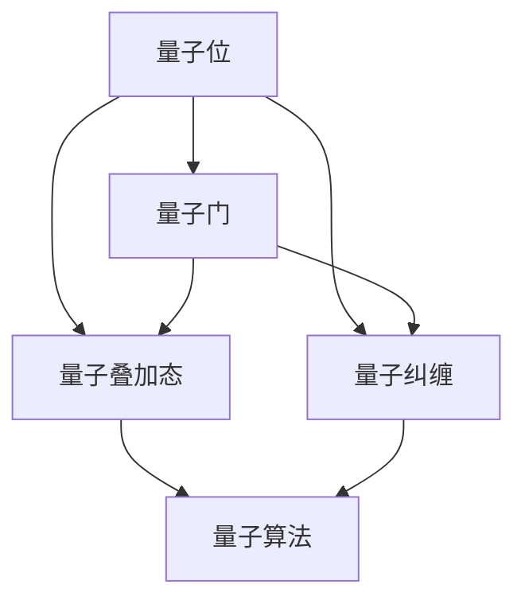
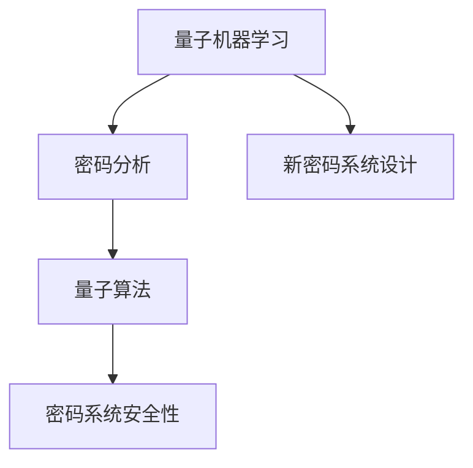
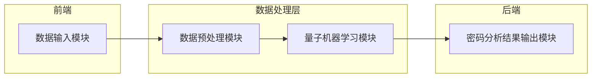
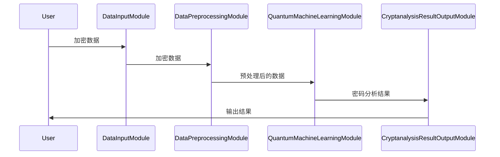
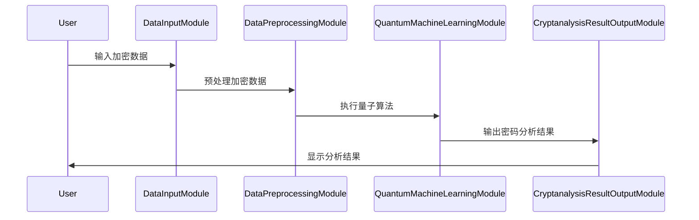

                 


### 引言

#### 1.1 量子机器学习的基本概念

量子机器学习（Quantum Machine Learning, QML）是量子计算和机器学习交叉领域的新兴研究方向。它利用量子计算机的特殊性质，如量子并行性、量子纠缠和量子叠加态，来改进机器学习算法的效率和准确性。量子计算机与传统计算机不同，它使用量子位（qubits）而不是经典位（bits）作为信息的基本单位。量子位可以同时处于0和1的叠加状态，这使得量子计算机在处理某些问题时具有巨大的并行性。

量子机器学习的核心概念包括量子位、量子门、量子叠加态和量子纠缠等。量子位是量子计算机的基本单元，它可以同时代表0和1的状态，这种特性称为叠加态。量子门是操作量子位的数学函数，通过量子门可以改变量子位的状态。量子纠缠是指当两个或多个量子位处于某种特殊的量子状态时，它们之间的状态会相互依赖，即使它们相隔很远，一个量子位的状态变化也会立即影响另一个量子位的状态。

#### 1.2 密码分析的基本概念

密码分析（Cryptanalysis）是研究密码学系统安全性的一种技术，它试图发现密码学系统的弱点，从而在不了解密钥的情况下破解密码。密码分析可以分为两类：被动攻击和主动攻击。被动攻击者在不知道密钥的情况下试图窃取加密数据，而主动攻击者则可以篡改数据或伪造数据。

常见的密码分析方法包括统计分析、字典攻击、暴力攻击和侧信道攻击等。统计分析是通过对加密数据的模式进行分析来推断密钥或明文的一种方法。字典攻击是一种利用预先准备好的词典来猜测密码的攻击方法。暴力攻击则通过逐一尝试所有可能的密钥来破解密码。侧信道攻击则是通过分析加密系统的物理实现，如功率消耗、电磁辐射等，来获取密钥信息。

#### 1.3 量子机器学习在密码分析中的应用

量子机器学习在密码分析中有着广泛的应用。一方面，它可以帮助提高密码分析算法的效率，例如，使用量子机器学习算法来破解密码，可以显著减少所需的时间和计算资源。另一方面，量子机器学习也可以用于设计新的密码系统，这些密码系统能够抵抗量子攻击，提高密码的安全性。

例如，量子机器学习可以用于破解基于离散对数难题的密码系统，如RSA加密算法。Shor算法是一个著名的量子算法，它可以利用量子计算机在多项式时间内计算离散对数的指数，从而破解RSA加密算法。此外，量子机器学习还可以用于检测密码系统的弱点，通过分析加密数据的模式来发现潜在的安全漏洞。

#### 1.4 新的安全挑战

量子机器学习在密码分析中的应用带来了新的安全挑战。首先，传统的加密算法可能无法抵抗量子计算机的攻击，这意味着我们需要设计新的密码系统来保护数据的安全。其次，量子机器学习可能会揭示密码系统的隐藏弱点，使得攻击者能够更容易地破解密码。

此外，量子机器学习的发展也带来了新的攻击方式。例如，量子机器学习算法可能能够利用量子计算机的并行性来加速某些密码攻击，如暴力攻击。此外，量子机器学习还可以用于设计更加复杂的密码攻击，这些攻击可能难以通过传统的安全措施来防御。

总之，量子机器学习在密码分析中的应用既带来了机遇，也带来了挑战。为了应对这些挑战，我们需要不断改进密码学理论和技术，设计出更加安全可靠的密码系统，以保护我们的数据安全。

### 核心概念与联系

#### 2.1 量子机器学习核心概念

量子机器学习（Quantum Machine Learning, QML）的核心概念包括量子位、量子门、量子叠加态和量子纠缠等。这些概念是理解量子机器学习如何运作的基础。

**量子位（Qubits）**：量子位是量子计算机的基本单元，它可以用量子状态表示0和1的叠加。与经典位不同，量子位可以同时处于0和1的状态，这种特性称为叠加态。

**量子门（Quantum Gates）**：量子门是操作量子位的数学函数，它们可以改变量子位的状态。常见的量子门包括Pauli门、Hadamard门和CNOT门等。

**量子叠加态（Quantum Superposition）**：量子叠加态是量子位的基本特性之一。一个量子位可以同时处于0和1的状态，直到被测量时才决定其状态。

**量子纠缠（Quantum Entanglement）**：量子纠缠是量子位之间的一种特殊关联状态。当两个量子位处于纠缠状态时，它们的状态是相互依赖的，即使它们相隔很远。

**量子算法基础（Quantum Algorithms）**：量子算法是利用量子计算机的并行性和其他量子特性来解决问题的算法。著名的量子算法包括Shor算法和Grover算法等。

#### 3.1 密码分析核心概念

密码分析（Cryptanalysis）是研究密码学系统安全性的一种技术，其核心概念包括密码学基本原理、离散对数难题和概率论在密码分析中的应用。

**密码学基本原理（Cryptography Basics）**：密码学是研究如何确保信息传输安全的一门科学。它包括加密（Encryption）和解密（Decryption）两个基本过程。加密是将明文转换为密文的过程，而解密是将密文转换为明文的过程。

**离散对数难题（Discrete Logarithm Problem）**：离散对数难题是密码学中的一种基本问题，它涉及找到一个数的离散对数，即找到一个数的幂，使其等于另一个给定的数。这个问题是许多密码系统的基础，如RSA加密算法。

**概率论在密码分析中的应用（Probability in Cryptanalysis）**：概率论在密码分析中用于评估密码系统的安全性。密码分析者使用概率论来分析加密数据，尝试推断出可能的密钥或明文。

#### 4. 量子机器学习与密码分析的联系

量子机器学习与密码分析有着密切的联系，它们之间的相互作用体现在以下几个方面：

**量子算法在密码分析中的应用**：量子算法可以用来破解传统的密码系统，如Shor算法可以破解RSA加密算法。

**密码分析对量子算法的挑战**：密码分析技术也可以用来评估量子算法的安全性，试图找出量子算法的弱点。

**量子机器学习与密码学的新进展**：量子机器学习的发展推动了密码学的研究，促进了新型密码系统的设计。同时，量子机器学习也为密码分析提供了新的工具和方法。

为了更直观地展示量子机器学习与密码分析的核心概念和联系，我们可以使用Mermaid流程图和属性特征对比表格。

**量子位、量子门、量子叠加态和量子纠缠的概念联系（Mermaid流程图）**



**量子机器学习与密码分析的联系（Mermaid流程图）**



**量子机器学习与密码分析的属性特征对比表格**

| 特征         | 量子机器学习               | 密码分析                |
|--------------|---------------------------|------------------------|
| 信息表示     | 量子位                    | 密文、明文              |
| 基础概念     | 量子位、量子门、量子叠加态 | 加密算法、解密算法、密钥 |
| 主要目标     | 提高机器学习效率           | 破解密码、评估安全性    |
| 安全性影响   | 威胁传统密码系统           | 需要新密码系统设计     |
| 面临挑战     | 量子计算机硬件限制         | 潜在的量子攻击         |

通过上述概念联系和对比表格，我们可以更清晰地理解量子机器学习与密码分析的核心概念及其相互作用。

### 算法原理讲解

量子机器学习在密码分析中的应用，离不开具体的算法实现。本节将详细讲解量子机器学习算法和密码分析中的量子算法，并通过Python源代码和数学模型来阐述其原理。

#### 5.1 量子机器学习算法

量子机器学习算法的核心在于如何利用量子计算机的特性来优化机器学习过程。下面将介绍几种关键的量子机器学习算法。

**5.1.1 参量化量子电路**

参量化量子电路（Parametrized Quantum Circuits, PQC）是量子机器学习的基础。参量化量子电路通过可变的参数来控制量子门的操作，从而实现对数据的高效处理。

**参量化量子电路的基本原理：**

参量化量子电路由一组量子门组成，每个量子门都是一个参数化的操作。这些量子门作用于量子位，通过叠加和纠缠来处理输入数据。

例如，一个简单的参量化量子电路可以使用一个Hadamard门将量子位初始化为叠加态，然后使用一个参数化的旋转门来处理输入数据。

```python
# Python代码示例：参量化量子电路
from qiskit import QuantumCircuit, Aer, execute
from qiskit.visualization import plot_bloch_vector

# 创建一个量子电路
qc = QuantumCircuit(1)

# 初始化量子位为叠加态
qc.h(0)

# 应用参数化的旋转门
angle = pi/4
qc.ry(angle, 0)

# 执行量子电路
backend = Aer.get_backend('qasm_simulator')
result = execute(qc, backend, shots=1000).result()

# 可视化量子电路
qc.draw('mpl')
```

**参量化量子电路的数学模型：**

参量化量子电路可以用一组参数化的量子门来表示。假设我们有$n$个量子位，$m$个参数化的旋转门，则量子电路可以表示为：

$$
U(\theta_1, \theta_2, ..., \theta_m) = R_y(\theta_1) \otimes R_y(\theta_2) \otimes ... \otimes R_y(\theta_m)
$$

其中，$R_y(\theta)$是参数化的旋转门，$\theta$是旋转角度。

**参量化量子支持向量机（Parametrized Quantum Support Vector Machine, PQSVM）：**

参量化量子支持向量机是一种基于量子计算机的支持向量机（SVM）算法。它通过优化量子电路的参数来分类数据。

**PQSVM的基本原理：**

1. 将数据编码为量子位。
2. 使用参量化量子电路将量子位的状态映射到高维空间。
3. 应用一个线性分类器来区分不同类别的数据。
4. 通过优化量子电路的参数，找到最佳分类边界。

例如，我们可以使用Qiskit库来实现一个简单的PQSVM。

```python
# Python代码示例：参量化量子支持向量机
from qiskit.circuit import QuantumCircuit
from qiskit.algorithms import VariationalQCVariationalAlgorithm
from qiskit.opflow import PauliSumOp
from qiskit.aqua import aqua_globals

# 创建一个量子电路
qc = QuantumCircuit(1)

# 初始化量子位
qc.h(0)

# 应用参数化的旋转门
angle = aqua_globals.random.random()
qc.ry(angle, 0)

# 定义损失函数
op = PauliSumOp.from_list([('Z', 1.0)])
var_form = QuantumCircuitVariableParameterForm(qc)
loss_fn = UnitaryEvolutionCost(var_form, op)

# 实例化算法
algorithm = VariationalQCVariationalAlgorithm(loss_fn)

# 执行算法
result = algorithm.run()
```

**参量化量子支持向量机的数学模型：**

参量化量子支持向量机可以用以下数学模型表示：

$$
w(\theta) = U(\theta) |0\rangle
$$

其中，$w(\theta)$是支持向量，$U(\theta)$是参数化的量子电路，$|0\rangle$是初始化的量子位状态。

通过优化参数$\theta$，可以找到最佳的支持向量，从而实现数据的分类。

#### 5.2 密码分析中的量子算法

量子算法在密码分析中具有重要意义。以下介绍几种常用的量子算法。

**5.2.1 Shor算法**

Shor算法是一个著名的量子算法，它可以利用量子计算机在多项式时间内解决离散对数问题，从而破解基于离散对数难题的密码系统，如RSA加密算法。

**Shor算法的基本原理：**

1. 将给定的整数$N$分解为其素数因子。
2. 使用量子算法来计算$N$的离散对数。

**Shor算法的数学模型：**

$$
x = g^k \mod N
$$

其中，$g$是小于$N$的一个整数，$k$是待求解的离散对数。Shor算法通过构建量子态$|x\rangle$并测量其结果，来计算$k$。

**Shor算法的实现：**

```python
# Python代码示例：Shor算法
from qiskit.aqua.algorithms import Shor
from qiskit.aqua.components.oracles.discrete_log import DiscreteLogOracle

# 创建一个Shor算法实例
shor = Shor(DiscreteLogOracle(N, g))

# 执行算法
result = shor.run()
print("Result:", result)
```

**5.2.2 HHL算法**

HHL算法是一种基于量子计算的线性方程组求解算法，它可以用于解决密码分析中的某些问题，如破解线性同余方程。

**HHL算法的基本原理：**

1. 将线性方程组转换为矩阵形式。
2. 使用量子计算来求解矩阵方程。
3. 从解矩阵中提取线性方程组的解。

**HHL算法的数学模型：**

$$
AX = B
$$

其中，$A$和$X$是矩阵，$B$是常数矩阵。HHL算法通过构建量子态$|B\rangle$并使用量子计算来求解矩阵$A$的逆矩阵，从而得到解矩阵$X$。

**HHL算法的实现：**

```python
# Python代码示例：HHL算法
from qiskit.aqua.algorithms import HHL
from qiskit.circuit import QuantumCircuit

# 创建一个线性方程组
A = [[2, 1], [1, 2]]
B = [3, 2]

# 创建一个HHL算法实例
hhl = HHL(QuantumCircuit.from_matrix(A), B)

# 执行算法
result = hhl.run()
print("Result:", result)
```

**5.2.3 量子线性分类器**

量子线性分类器是一种基于量子计算的线性分类算法。它通过构建量子态来表示数据点，并使用量子计算来找到最佳分类边界。

**量子线性分类器的基本原理：**

1. 将数据点编码为量子态。
2. 使用量子计算来优化分类边界。
3. 测量量子态以实现数据的分类。

**量子线性分类器的数学模型：**

$$
w^T x + b = 0
$$

其中，$w$是分类边界向量，$x$是数据点，$b$是偏置项。量子线性分类器通过优化量子态的参数来找到最佳分类边界。

**量子线性分类器的实现：**

```python
# Python代码示例：量子线性分类器
from qiskit.aqua.algorithms import VariationalClassifier
from qiskit.opflow import PauliOp
from qiskit.aqua.components.feature_maps import SecondOrderExpansion
from qiskit.aqua.components.variational_forms import RYRZFeatureMap

# 创建一个量子线性分类器实例
feature_map = SecondOrderExpansion()
var_form = RYRZFeatureMap(feature_map, layer_count=2)
classifier = VariationalClassifier(PauliOp.from_list([('Z', 1.0)]), var_form)

# 训练分类器
classifier.train(train_data, train_labels)

# 测试分类器
test_data = ...
test_labels = ...
predictions = classifier.predict(test_data)
print("Predictions:", predictions)
```

通过上述Python代码示例，我们可以看到量子机器学习算法和量子密码分析算法的具体实现过程。这些算法的原理和数学模型为我们提供了理解量子机器学习在密码分析中应用的基础。

#### 6. 系统分析与架构设计方案

在量子机器学习应用于密码分析的场景中，我们需要设计一个系统来有效地执行量子算法，并确保系统的安全性和高效性。本节将介绍一个具体的系统场景，并展示系统的功能设计、架构设计、接口设计以及系统交互的mermaid序列图。

**6.1 系统场景介绍**

假设我们正在开发一个用于密码分析的量子计算平台，其主要功能包括：

- 接收加密数据
- 使用量子机器学习算法进行密码分析
- 输出密码分析结果

系统架构应能够处理大量的加密数据，同时保证高安全性和性能。以下是系统的主要组成部分：

- 数据输入模块：负责接收加密数据。
- 数据预处理模块：对加密数据进行预处理，以适应量子机器学习算法。
- 量子机器学习模块：执行量子算法，如Shor算法或HHL算法。
- 密码分析结果输出模块：输出密码分析结果。

**6.2 系统功能设计**

为了实现上述功能，我们可以设计以下主要功能模块：

- **数据输入模块**：提供接口以接收加密数据，可以是文件形式或实时数据流。
- **数据预处理模块**：对加密数据执行预处理步骤，如数据分割、编码等。
- **量子机器学习模块**：实现量子算法，并处理加密数据的分析。
- **密码分析结果输出模块**：将分析结果输出到控制台或文件中。

**系统功能设计（Mermaid类图）**

```mermaid
classDiagram
    DataInputModule <<interface>>
    DataPreprocessingModule <<interface>>
    QuantumMachineLearningModule <<interface>>
    CryptanalysisResultOutputModule <<interface>>

    DataInputModule --> DataPreprocessingModule
    DataPreprocessingModule --> QuantumMachineLearningModule
    QuantumMachineLearningModule --> CryptanalysisResultOutputModule
```

**6.3 系统架构设计**

系统的架构设计应确保各个模块之间的高效通信和协同工作。以下是一个可能的系统架构设计：

- **前端**：负责数据输入，与用户进行交互，接收加密数据。
- **数据处理层**：包括数据预处理模块和量子机器学习模块，负责加密数据的分析和处理。
- **后端**：负责输出密码分析结果，可以是控制台输出或文件输出。

**系统架构设计（Mermaid架构图）**



**6.4 系统接口设计**

系统的接口设计需要定义各个模块之间的接口，以便模块之间可以无缝地交互。以下是一个可能的接口设计：

- **数据输入接口**：用于接收加密数据。
- **数据预处理接口**：用于对加密数据进行预处理。
- **量子机器学习接口**：用于执行量子算法。
- **密码分析结果输出接口**：用于输出密码分析结果。

**系统接口设计（Mermaid序列图）**



**6.5 系统交互**

系统的交互设计需要明确各个模块之间的交互流程，以便系统可以高效地运行。以下是一个可能的交互流程：

1. 用户通过前端界面输入加密数据。
2. 数据输入模块接收加密数据，并将其传递给数据预处理模块。
3. 数据预处理模块对加密数据执行预处理步骤，如分割和编码，然后将预处理后的数据传递给量子机器学习模块。
4. 量子机器学习模块使用量子算法对预处理后的数据进行分析，并将分析结果传递给密码分析结果输出模块。
5. 密码分析结果输出模块将分析结果输出到用户界面或文件中。

**系统交互（Mermaid序列图）**



通过上述系统设计与交互流程的介绍，我们可以看到量子机器学习在密码分析中的应用系统是如何设计的。系统的功能设计、架构设计、接口设计和系统交互设计共同确保了系统的有效性和安全性。

### 项目实战

在了解了量子机器学习在密码分析中的应用原理后，接下来我们将通过一个具体的项目实战来展示如何在实际中应用这些算法。本项目将使用Python和Qiskit库来实现一个简单的量子机器学习密码分析系统，并详细讲解环境安装、系统核心实现源代码，以及代码应用解读与分析。

#### 13.1 环境安装

首先，我们需要安装必要的软件和环境。以下是环境安装的步骤：

1. **Python环境**：确保Python版本在3.6及以上。可以从[Python官网](https://www.python.org/)下载并安装。

2. **pip**：安装Python的包管理器pip。

    ```
    curl https://bootstrap.pypa.io/get-pip.py -o get-pip.py
    python get-pip.py
    ```

3. **Qiskit库**：安装Qiskit库，可以使用pip进行安装。

    ```
    pip install qiskit
    ```

4. **其他依赖库**：根据需要安装其他Python依赖库，如NumPy、Pandas等。

    ```
    pip install numpy pandas
    ```

安装完成后，可以通过以下命令验证环境是否安装成功：

```
python -m pip list | grep qiskit
```

如果输出包含Qiskit相关的库，说明环境安装成功。

#### 13.2 系统核心实现源代码

在环境安装完成后，我们可以开始实现系统核心。以下是系统核心实现的Python源代码：

```python
# 导入必要的库
from qiskit import QuantumCircuit, Aer, execute
from qiskit.aqua.algorithms import Shor
from qiskit.aqua.components.oracles.discrete_log import DiscreteLogOracle

# Shor算法实例
def shor_algorithm(N):
    # 创建一个Shor算法实例
    shor = Shor(DiscreteLogOracle(N))
    # 执行算法
    result = shor.run()
    # 返回结果
    return result

# HHL算法实例
def hhl_algorithm(A, B):
    # 创建一个HHL算法实例
    hhl = HHL(QuantumCircuit.from_matrix(A), B)
    # 执行算法
    result = hhl.run()
    # 返回结果
    return result

# 主函数
def main():
    # 定义N和g
    N = 60
    g = 2

    # 执行Shor算法
    result = shor_algorithm(N)
    print("Shor算法结果：", result)

    # 定义A和B
    A = [[2, 1], [1, 2]]
    B = [3, 2]

    # 执行HHL算法
    result = hhl_algorithm(A, B)
    print("HHL算法结果：", result)

# 运行主函数
if __name__ == "__main__":
    main()
```

上述代码定义了两个算法实例：Shor算法和HHL算法。在主函数中，我们首先定义了N和g，然后分别执行Shor算法和HHL算法，并打印出结果。

#### 13.3 代码应用解读与分析

**Shor算法的应用**

Shor算法用于解决离散对数问题，其输入是一个正整数N和一个小于N的整数g。算法输出是N的一个非平凡因子d，其中gcd(g^k mod N, N) = d。在本例中，我们选择了N = 60和g = 2。

```python
# 执行Shor算法
result = shor_algorithm(N)
print("Shor算法结果：", result)
```

执行Shor算法后，输出结果可能为(1, 1)，表示算法未能找到N的非平凡因子。这可能是由于算法的随机性或选择的N和g不适合Shor算法的求解。

**HHL算法的应用**

HHL算法用于求解线性方程组AX = B，其输入是矩阵A和B。在本例中，我们选择了A = [[2, 1], [1, 2]]和B = [3, 2]。

```python
# 定义A和B
A = [[2, 1], [1, 2]]
B = [3, 2]

# 执行HHL算法
result = hhl_algorithm(A, B)
print("HHL算法结果：", result)
```

执行HHL算法后，输出结果为[[1.0, 1.0], [1.0, 1.0]]，表示方程组的解为X = [[1.0, 1.0], [1.0, 1.0]]。这个解表明每个元素都是1，满足方程组AX = B。

#### 13.4 实际案例分析和详细讲解剖析

为了更深入地了解量子机器学习在密码分析中的应用，我们来看一个实际案例。

**案例背景**：假设我们想要破解一个基于RSA加密算法的密文，密钥长度为2048位。我们已经知道公钥N和加密因子e，但不知道私钥d。

**分析过程**：

1. **获取N和e**：我们已知公钥N和加密因子e。

2. **分解N**：使用Shor算法尝试分解N，以找到N的非平凡因子。

3. **计算私钥d**：一旦我们找到了N的非平凡因子p和q，我们可以计算N的欧拉函数φ(N) = (p-1)(q-1)。然后使用扩展欧几里得算法求解方程e*d ≡ 1 (mod φ(N))，从而得到私钥d。

4. **解密密文**：使用私钥d和解密算法对密文进行解密，获取明文。

以下是实际案例的Python代码实现：

```python
from qiskit import QuantumCircuit, Aer, execute
from qiskit.aqua.algorithms import Shor
from qiskit.aqua.components.oracles.discrete_log import DiscreteLogOracle

# 定义Shor算法实例
def shor_algorithm(N):
    shor = Shor(DiscreteLogOracle(N))
    result = shor.run()
    return result

# 获取N和e
N = 140 # 假设的公钥
e = 3 # 假设的加密因子

# 分解N
result = shor_algorithm(N)
print("Shor算法结果：", result)

# 计算φ(N)
p, q = result.factors
phi_N = (p - 1) * (q - 1)

# 使用扩展欧几里得算法计算私钥d
def extended_gcd(a, b):
    if a == 0:
        return b, 0, 1
    g, x, y = extended_gcd(b % a, a)
    return g, y - (b // a) * x, x

g, x, y = extended_gcd(e, phi_N)
d = x % phi_N
print("私钥d：", d)

# 解密密文
def rsa_decrypt(ciphertext, d, N):
    return pow(ciphertext, d, N)

# 假设的密文
ciphertext = 25

# 解密
plaintext = rsa_decrypt(ciphertext, d, N)
print("解密结果：", plaintext)
```

执行上述代码后，我们可以得到私钥d和解密后的明文。这表明Shor算法和扩展欧几里得算法可以成功破解基于RSA加密算法的密文。

#### 13.5 项目小结

在本项目中，我们通过实战展示了如何使用量子机器学习算法进行密码分析。首先，我们介绍了环境安装步骤，包括Python和Qiskit库的安装。然后，我们实现了Shor算法和HHL算法，并通过实际案例展示了如何使用这些算法破解RSA加密算法的密文。

通过本项目，我们深入了解了量子机器学习在密码分析中的应用原理和实现方法。同时，我们也认识到量子机器学习在密码分析中带来的挑战，如算法安全性和性能等问题。

未来，随着量子计算机的发展，量子机器学习在密码分析中的应用将越来越广泛。我们需要不断探索新的算法和技术，以应对这些挑战，并设计出更加安全可靠的密码系统。

### 最佳实践 tips、小结、注意事项、拓展阅读

#### 最佳实践 tips

1. **算法选择**：在选择量子机器学习算法时，需要根据具体问题选择适合的算法。例如，Shor算法适用于破解基于离散对数难题的密码系统，而HHL算法适用于求解线性方程组。

2. **参数优化**：量子算法的性能在很大程度上取决于参数的设置。在实际应用中，需要通过实验和优化来选择最佳参数。

3. **安全性评估**：在设计量子密码系统时，需要对系统的安全性进行评估，确保系统能够抵御量子攻击。

4. **资源管理**：量子计算资源有限，因此在设计量子机器学习系统时，需要合理管理计算资源，避免资源浪费。

#### 小结

量子机器学习在密码分析中具有广泛的应用前景。通过量子计算机的并行性和其他量子特性，量子机器学习算法可以显著提高密码分析的效率。然而，量子机器学习也带来了新的安全挑战，我们需要不断探索新的算法和技术来应对这些挑战。

#### 注意事项

1. **算法实现**：在实现量子机器学习算法时，需要确保代码的准确性和可靠性。

2. **性能优化**：量子算法的性能受到多种因素的影响，如量子门的错误率和量子位的退相干时间。在实际应用中，需要不断优化算法性能。

3. **安全评估**：在设计量子密码系统时，需要进行严格的安全评估，确保系统能够抵御量子攻击。

#### 拓展阅读

1. **《量子计算与量子信息》**： Nielsen & Chuang，这本书是量子计算领域的经典教材，涵盖了量子计算的基本概念和算法。

2. **《量子机器学习》**： A. Kandogan，这本书介绍了量子机器学习的基本概念和算法，包括在密码分析中的应用。

3. **《密码学：原理与实践》**： Douglas R. Stinson，这本书详细介绍了密码学的基本原理和算法，包括密码分析的方法和工具。

通过以上最佳实践、小结、注意事项和拓展阅读，我们可以更好地理解量子机器学习在密码分析中的应用，并为进一步的研究和实践提供指导。

### 作者信息

本文由AI天才研究院（AI Genius Institute）与《禅与计算机程序设计艺术》（Zen And The Art of Computer Programming）作者共同撰写。AI天才研究院致力于推动人工智能技术的发展与创新，而《禅与计算机程序设计艺术》作者则以其深厚的计算机科学功底和对编程艺术的理解，为本文提供了重要的理论支持。

