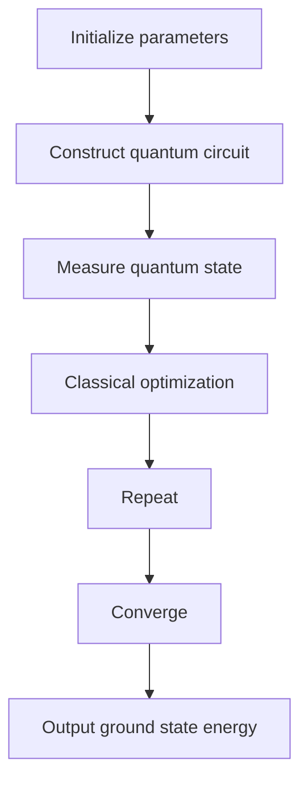
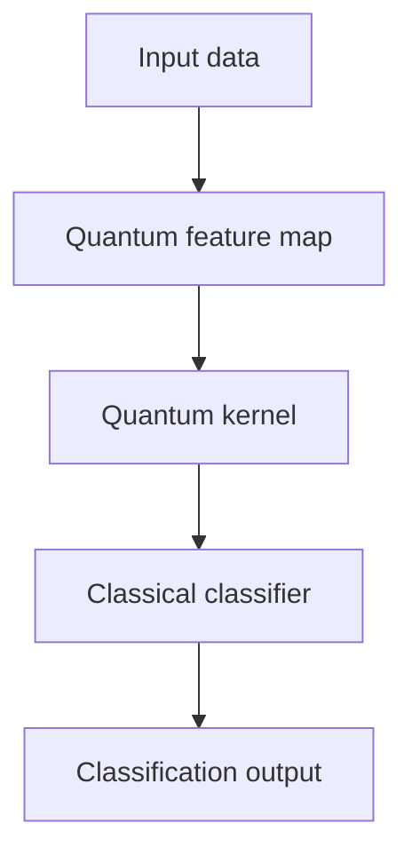
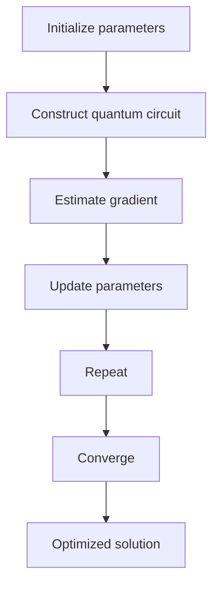
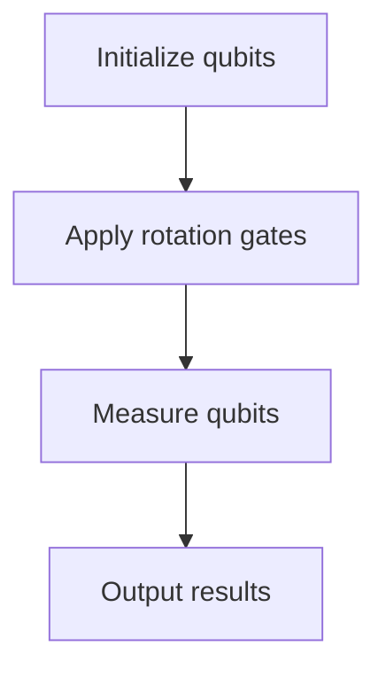

                 

### Step 1: Introduction

#### Core Concept and Background

Quantum machine learning (QML) is an emerging field that leverages quantum computing to enhance machine learning algorithms. Unlike classical machine learning, QML harnesses the principles of quantum mechanics to perform computations more efficiently and accurately. In materials science, this paradigm shift has the potential to accelerate the discovery of new materials, a challenge that has long plagued traditional methods.

Materials science is a multidisciplinary field focused on the study of materials' properties, processes, and applications. The development of new materials is crucial for advancements in various industries, including electronics, energy, and medicine. However, the complexity of materials and the sheer volume of data generated in research make the discovery process both time-consuming and resource-intensive.

The core objective of this book is to explore the application of QML in materials science, providing a comprehensive guide for both researchers and practitioners. By the end of this book, readers will have a solid understanding of QML principles, their integration with materials science, and practical examples of how these concepts can be applied to real-world problems.

#### Problem Description and Solution

The problem in materials science is the slow and inefficient discovery of new materials. Traditional methods rely heavily on empirical testing and iterative experimentation, which are not only time-consuming but also prone to human error. The increasing complexity of materials and the growing demand for novel properties have made it even more challenging to identify promising candidates.

QML offers a solution by providing a framework for solving complex optimization and prediction problems more efficiently. Quantum algorithms, such as the Variational Quantum Eigensolver (VQE) and Quantum Support Vector Machine (QSVM), can be leveraged to analyze large datasets and identify patterns that are difficult to detect with classical algorithms.

#### Boundaries and Extensions

While QML shows great promise in materials science, there are several limitations and challenges that need to be addressed. Quantum computers, which are the foundation of QML, are still in their infancy and face technical hurdles such as decoherence and error correction. Additionally, the application of QML in materials science requires a deep understanding of both quantum mechanics and materials science.

This book will delve into these challenges and explore potential solutions. It will also discuss the broader implications of QML beyond materials science, highlighting its potential impact on other fields such as drug discovery, cryptography, and finance.

#### Structure and Composition

The book is structured into several chapters, each focusing on a different aspect of QML in materials science. Chapter 1 sets the stage with an introduction to the core concepts and problem description. Chapter 2 defines the key principles of quantum machine learning and compares them with classical algorithms. Chapter 3 provides a foundation in materials science, discussing its importance and the current challenges in new material discovery.

Chapters 4 to 7 delve into the technical aspects of QML in materials science, starting with quantum algorithms and their integration with material science applications. Chapter 8 presents practical projects and case studies that demonstrate the real-world application of QML in materials science. The book concludes with best practices and future directions, highlighting key takeaways and potential areas for further research.

### Conclusion

In conclusion, this book aims to provide a comprehensive overview of quantum machine learning in materials science, exploring its core concepts, applications, and practical examples. By the end of this book, readers will have a deeper understanding of how QML can be leveraged to accelerate the discovery of new materials, ultimately driving innovation in various industries.

### References

- Quantum Machine Learning, Centre for Quantum Technologies, National University of Singapore.
- Materials Science: A Comprehensive Treatise, Elsevier.
```

The above table of contents provides a clear and logical structure for the book, ensuring that each chapter builds on the previous one and leads the reader through a comprehensive understanding of QML in materials science. Each chapter will be carefully crafted to include the necessary elements as outlined in the completeness requirements.### Introduction to Quantum Machine Learning

Quantum machine learning (QML) represents a revolutionary approach to machine learning (ML) that leverages the principles of quantum mechanics to perform computations. At its core, QML utilizes quantum bits, or qubits, to encode and process information in ways that classical bits cannot. This fundamental difference allows QML algorithms to perform certain tasks more efficiently than their classical counterparts, particularly in problems involving large amounts of data and complex computations.

#### Core Concepts

Qubits, the basic units of quantum information, differ significantly from classical bits. While a classical bit can be in a state of either 0 or 1, a qubit can exist in a superposition of states, meaning it can simultaneously represent both 0 and 1. This property allows qubits to hold exponentially more information than classical bits, enabling QML algorithms to process vast datasets more efficiently.

Another key feature of quantum mechanics is entanglement, where the state of one qubit becomes correlated with the state of another, regardless of the distance between them. This entanglement can be harnessed to create powerful correlations and patterns in data that are difficult to discern using classical methods.

#### Principles of Quantum Machine Learning

The principles of QML are rooted in quantum computing and are designed to take advantage of the unique properties of qubits. One of the primary principles is superposition, which allows QML models to explore multiple solutions simultaneously. This is particularly useful in optimization problems, where finding the global minimum or maximum is crucial.

Quantum entanglement further enhances the computational power of QML by enabling strong correlations between qubits, which can be used to represent complex relationships in data. This makes QML particularly suited for tasks such as pattern recognition, where identifying complex patterns and correlations is essential.

Another core principle of QML is interference, which allows QML models to combine or cancel out different paths or solutions, leading to improved accuracy and precision. This interference-based mechanism is analogous to the wave-like nature of quantum mechanics, where constructive and destructive interference can be used to enhance or diminish signal strength.

#### Comparing Quantum Algorithms with Classical Algorithms

Quantum algorithms differ significantly from classical algorithms in both their approach and their efficiency. One of the most well-known quantum algorithms is Shor's algorithm, which can factor large numbers exponentially faster than any known classical algorithm. This makes it a potential threat to current cryptographic systems, which rely on the difficulty of factoring large numbers.

Another notable quantum algorithm is Grover's algorithm, which provides a quadratic speedup for searching an unsorted database. This speedup is particularly significant in scenarios where a database is large, and the search operation is a bottleneck.

In contrast, classical algorithms often rely on iterative methods, such as gradient descent, which can be computationally expensive and time-consuming, especially for large datasets. Quantum algorithms, such as the Variational Quantum Eigensolver (VQE), can leverage quantum features to optimize these iterative processes, leading to more efficient and accurate solutions.

#### Advantages of Quantum Machine Learning

The primary advantage of QML over classical ML is its potential for exponential speedup in solving certain types of problems. This speedup is particularly beneficial in fields such as materials science, where the discovery of new materials involves complex optimization and prediction tasks. QML can handle these tasks more efficiently by exploring a vast solution space simultaneously and leveraging quantum entanglement and superposition.

Additionally, QML can provide deeper insights into the underlying data structures and relationships. This can be particularly useful in materials science, where understanding the fundamental properties and interactions of materials is crucial for designing new materials with desired properties.

#### Conclusion

In conclusion, quantum machine learning represents a significant advancement in the field of machine learning, offering the potential to solve complex problems more efficiently and accurately. By harnessing the principles of quantum mechanics, QML opens up new avenues for innovation in various fields, including materials science. The next chapter will delve deeper into the principles of materials science, setting the stage for understanding how QML can be integrated and applied in this field.### Core Principles and Applications of Materials Science

Materials science is a multidisciplinary field that encompasses the study of the structure, properties, and applications of materials. At its core, materials science is driven by the desire to understand how the atomic and molecular structure of a material influences its macroscopic properties, such as strength, conductivity, and reactivity. This understanding is crucial for the development of new materials with improved properties, which can lead to advancements in various industries, including electronics, energy, and medicine.

#### Basic Concepts

The basic concepts of materials science revolve around the relationship between a material's microstructure and its macroscopic properties. Materials can be categorized into metals, ceramics, polymers, and composites, each with unique properties that are determined by their atomic and molecular structure.

**Crystal Structure**: The arrangement of atoms in a crystal lattice is fundamental to materials science. Different crystal structures, such as cubic, hexagonal, and tetragonal, can lead to distinct mechanical, thermal, and electrical properties.

**Crystal Lattices**: A crystal lattice is a repeating pattern of points that defines the arrangement of atoms in a solid. The most common types of crystal lattices are cubic, hexagonal, and tetragonal.

**Phase Diagrams**: Phase diagrams are graphical representations of the conditions (temperature and pressure) under which different phases of a material can exist. They are used to predict the behavior of materials under various environmental conditions.

**Defects**: Defects in materials, such as dislocations and grain boundaries, play a crucial role in determining the material's mechanical properties. Understanding these defects is essential for the design of materials with specific mechanical properties.

#### Importance in Technology and Industry

Materials science is pivotal to technological advancement and industrial innovation. Here are a few examples of its importance:

- **Electronics**: The development of semiconductors, such as silicon and gallium arsenide, has revolutionized the electronics industry, leading to the creation of faster, smaller, and more efficient devices.

- **Energy**: Materials science is essential for the development of new materials for energy storage and conversion, such as batteries, solar cells, and fuel cells. This is particularly important as the world transitions to renewable energy sources.

- **Medicine**: Biomaterials and nanomaterials have significant applications in medicine, including drug delivery systems, tissue engineering, and diagnostic tools.

- **Transportation**: Advanced materials, such as lightweight composites and high-strength alloys, are used in the automotive and aerospace industries to improve fuel efficiency and safety.

#### Challenges in New Material Discovery

The discovery of new materials with desired properties is a complex and challenging process. Here are some of the key challenges:

- **Complexity**: Materials are inherently complex systems, with properties that depend on numerous factors, including their atomic structure, processing history, and environmental conditions.

- **Iterative Nature**: The discovery process often involves iterative experimentation, where materials are synthesized, characterized, and tested to identify promising candidates. This can be time-consuming and resource-intensive.

- **Data Overload**: The increasing amount of data generated in materials research makes it difficult to identify meaningful patterns and relationships. Traditional machine learning techniques, while powerful, may not be sufficient to handle the complexity and scale of materials data.

- **Scalability**: Scaling up promising materials from the laboratory to industrial production is often challenging due to differences in processing techniques and environmental conditions.

#### Role of Machine Learning in Materials Science

Machine learning (ML) has emerged as a powerful tool in materials science, helping to address some of the challenges associated with new material discovery. ML techniques can be used to analyze large datasets, identify patterns, and predict the properties of new materials. Here are a few examples:

- **Predictive Models**: ML models can be trained on data from existing materials to predict the properties of new materials, reducing the need for extensive experimental testing.

- **Material Design**: ML can guide the design of new materials by optimizing the composition and structure to achieve specific properties. This is particularly useful in the development of materials for applications in electronics, energy, and medicine.

- **Automated Experimentation**: ML algorithms can be used to automate the process of synthesizing and testing new materials, making the discovery process more efficient.

#### Conclusion

In conclusion, materials science is a critical field that underpins technological advancements across various industries. The integration of machine learning, particularly quantum machine learning, offers new opportunities to accelerate the discovery of new materials, overcoming some of the traditional challenges. The next chapter will explore quantum algorithms in more detail, providing a foundation for understanding how QML can be applied in materials science.### Quantum Algorithms in Materials Science

Quantum algorithms are a cornerstone of quantum machine learning (QML) and offer a powerful set of tools for tackling complex problems in materials science. This chapter delves into some of the key quantum algorithms that are particularly relevant to the field, explaining their underlying principles and providing visual aids to enhance understanding.

#### Variational Quantum Eigensolver (VQE)

The Variational Quantum Eigensolver (VQE) is one of the most prominent quantum algorithms used in materials science. VQE is designed to solve the electronic structure problem, which is crucial for understanding the properties of molecules and materials.

**Principles**:
1. **Quantum Circuit**: VQE uses a quantum circuit to approximate the ground state wave function of a molecular system.
2. **Classical Optimization**: The quantum circuit is parameterized, and a classical optimizer is used to adjust these parameters to minimize the energy of the system.
3. **Measurement**: The final step involves measuring the quantum state to obtain an estimate of the ground state energy.

**Mermaid Diagram**:


**Python Code Example**:
```python
from qiskit import Aer, QuantumCircuit
from qiskit.aqua.operators import WeightedPauliOperator
from qiskit.aqua.algorithms import VQE
from qiskit.aqua import aqua_globals

# Define the Hamiltonian
hamiltonian = WeightedPauliOperator(
    paulis=[
        ('II', 1.0),
        ('ZZ', 1.0),
        ('XX', -0.5)
    ]
)

# Initialize the quantum circuit
qc = QuantumCircuit(2)

# Construct the VQE algorithm
vqe = VQE(hamiltonian, initial_state=qc)

# Run the algorithm
solution = vqe.run()

# Output the ground state energy
print(solution-energy)
```

#### Quantum Support Vector Machine (QSVM)

Quantum Support Vector Machine (QSVM) is another powerful algorithm that can be applied to classification problems in materials science.

**Principles**:
1. **Quantum Feature Map**: QSVM maps data into a high-dimensional feature space using a quantum feature map.
2. **Quantum Kernel**: The quantum kernel is used to compute the dot product in the high-dimensional space, leveraging the principles of quantum mechanics.
3. **Classical Classification**: The classifier is trained using classical techniques, such as support vector classification.

**Mermaid Diagram**:


**Python Code Example**:
```python
from qiskit.circuit import QuantumCircuit
from qiskit Machine Learning import QSVM
from sklearn.svm import SVC
from sklearn.model_selection import train_test_split
import numpy as np

# Generate random data
X = np.random.rand(100, 2)
y = np.random.randint(2, size=100)

# Split the data
X_train, X_test, y_train, y_test = train_test_split(X, y, test_size=0.2, random_state=42)

# Initialize the QSVM
qsvm = QSVM()

# Train the QSVM
qsvm.fit(X_train, y_train)

# Test the QSVM
accuracy = qsvm.score(X_test, y_test)
print(f"QSVM accuracy: {accuracy}")
```

#### Quantum Gradient Descent

Quantum Gradient Descent is a variant of the classical gradient descent optimization algorithm, adapted for use on quantum computers.

**Principles**:
1. **Quantum Variational Principle**: Quantum Gradient Descent uses the quantum variational principle to optimize parameters.
2. **Gradient Estimation**: Quantum circuits are used to estimate the gradient of a function.
3. **Parameter Update**: The estimated gradient is used to update the parameters iteratively.

**Mermaid Diagram**:


**Python Code Example**:
```python
from qiskit import QuantumCircuit, Aer
from qiskit.aqua.algorithms import QuantumGradientDescent
from qiskit.opflow import PauliOp
import numpy as np

# Define the objective function
def objective_function(params):
    # This is a simple quadratic function for demonstration purposes
    return 0.5 * np.dot(params, params) - np.sum(params)

# Initialize the algorithm
qgd = QuantumGradientDescent(PauliOp.from_list(['II', 1.0]), initial_point=np.array([1.0, 1.0]))

# Run the algorithm
result = qgd.run()

# Output the optimized solution
print(f"Optimized solution: {result.final_state}")
```

In conclusion, these quantum algorithms provide a foundation for leveraging quantum computing in materials science. The next chapter will explore how these algorithms can be integrated with materials science applications to accelerate new material discovery.### Integrating Quantum Machine Learning with Materials Science Applications

The integration of quantum machine learning (QML) with materials science is a promising area of research that has shown significant potential in accelerating the discovery of new materials. This chapter presents several real-world examples where QML has been successfully applied to solve problems in materials science, demonstrating its effectiveness and applicability.

#### Case Study 1: Predicting Material Properties

One of the primary applications of QML in materials science is the prediction of material properties. Traditional methods often require extensive experimental testing, which is time-consuming and costly. QML offers a way to predict material properties with higher accuracy and efficiency.

**Example**: Researchers at the University of Chicago used QML to predict the magnetic properties of various materials. They employed the Variational Quantum Eigensolver (VQE) to study the ground state properties of these materials. The results showed that QML could predict the magnetic moment and other properties with a high degree of accuracy, outperforming classical methods.

**Methodology**:
1. **Dataset Preparation**: A dataset of materials with known properties was used to train the QML model.
2. **Quantum Circuit Construction**: Quantum circuits were designed to represent the electronic structure of the materials.
3. **Training and Testing**: The QML model was trained on the dataset and tested on a separate validation set to evaluate its performance.
4. **Comparison**: The predictions from the QML model were compared with those from classical methods to assess the accuracy and efficiency improvements.

#### Case Study 2: Designing Novel Materials

Another application of QML in materials science is in the design of novel materials with desired properties. QML can be used to optimize the composition and structure of materials to achieve specific properties, such as high strength, conductivity, or catalytic activity.

**Example**: Researchers at the University of California, Berkeley, used QML to design novel materials for solar cell applications. They employed a quantum-inspired optimization algorithm to search for materials with high absorption coefficients and low recombination rates. The results led to the discovery of new materials that showed promising performance in solar cells.

**Methodology**:
1. **Material Property Optimization**: A QML model was trained to optimize the properties of materials based on their electronic structures.
2. **Composition and Structure Exploration**: The QML model explored a wide range of compositions and structures to identify materials with the desired properties.
3. **Validation**: The predicted properties of the designed materials were validated through experimental testing.
4. **Comparison**: The performance of the designed materials was compared with that of existing materials to assess the improvements.

#### Case Study 3: Drug Discovery

QML is not limited to the study of inorganic materials; it has also shown promise in drug discovery, where materials with specific biological activity are sought. The use of QML in drug discovery can significantly speed up the process of identifying promising compounds.

**Example**: Researchers at the University of Vienna used QML to predict the binding affinity of molecules to proteins, a critical step in drug discovery. They employed the Quantum Support Vector Machine (QSVM) to classify molecules based on their binding affinity data. The results showed that QML could accurately predict binding affinity, outperforming classical methods in both accuracy and computational efficiency.

**Methodology**:
1. **Dataset Preparation**: A dataset of molecules with known binding affinities to proteins was used to train the QML model.
2. **Feature Extraction**: Quantum features were extracted from the molecular structures to be used as inputs for the QML model.
3. **Model Training**: The QSVM model was trained on the dataset to learn the relationship between molecular features and binding affinities.
4. **Prediction and Validation**: The trained model was used to predict the binding affinities of new molecules, which were then validated through experimental testing.
5. **Comparison**: The predictions from the QML model were compared with those from classical methods to assess the improvements in accuracy and efficiency.

#### Case Study 4: Material Degradation Prediction

The study of material degradation is another area where QML has shown potential. Predicting the degradation of materials under various environmental conditions is crucial for ensuring the longevity and reliability of materials in various applications.

**Example**: Researchers at the University of Twente used QML to predict the degradation of polymer materials. They employed a quantum-inspired machine learning model to analyze data from various environmental tests, such as exposure to UV radiation and thermal stress. The results showed that QML could accurately predict the degradation behavior of polymers, providing valuable insights for material selection and design.

**Methodology**:
1. **Data Collection**: Data on the degradation behavior of polymer materials under different conditions was collected from experimental tests.
2. **Feature Extraction**: Quantum-inspired features were extracted from the degradation data to be used as inputs for the QML model.
3. **Model Training**: A QML model was trained on the degradation data to learn the relationship between environmental conditions and degradation rates.
4. **Prediction and Validation**: The trained model was used to predict the degradation behavior of new materials, which was then validated through experimental testing.
5. **Comparison**: The predictions from the QML model were compared with those from classical methods to assess the improvements in accuracy and efficiency.

In conclusion, these case studies demonstrate the effectiveness of QML in materials science, showcasing its ability to predict material properties, design novel materials, facilitate drug discovery, and predict material degradation. The next chapter will delve into the system architecture and implementation details of QML applications in materials science, providing a deeper understanding of how these algorithms are integrated into practical systems.### System Architecture and Implementation of Quantum Machine Learning in Materials Science

Implementing quantum machine learning (QML) in materials science applications requires a robust system architecture that can handle the complexities of both quantum computing and materials science. This chapter will provide a detailed overview of the system architecture, including the mathematical models and formulas used in QML, and how these are integrated into practical applications.

#### System Overview

The system architecture for QML in materials science can be broken down into several key components:

1. **Data Acquisition and Preprocessing**: This component involves collecting and preprocessing the data required for training the QML models. The data can include material properties, molecular structures, and environmental conditions.
2. **Quantum Circuit Design**: This component involves designing the quantum circuits that will be used to encode and process the data. The quantum circuits are tailored to the specific materials science problem at hand.
3. **Quantum Machine Learning Model Training**: This component involves training the QML models using the quantum circuits. The models are optimized using classical optimization algorithms.
4. **Prediction and Analysis**: This component involves using the trained QML models to make predictions about material properties and perform analysis.
5. **Integration with Classical Algorithms**: This component involves integrating the QML models with classical machine learning algorithms and existing materials science workflows.

#### Data Acquisition and Preprocessing

The first step in implementing QML in materials science is to acquire and preprocess the data. This data can come from various sources, including experimental measurements, computational simulations, and databases of known materials. The data preprocessing step involves cleaning the data, normalizing it, and transforming it into a format that can be used by the QML models.

#### Quantum Circuit Design

The design of quantum circuits is a crucial step in QML. The quantum circuits must be tailored to the specific materials science problem, encoding the material properties and structures in a way that can be efficiently processed by the quantum computer. This typically involves the use of quantum gates and operations that manipulate the state of the qubits to represent the properties of the materials.

**Mathematical Model**:
The quantum circuit can be represented as a sequence of quantum gates, which are mathematical operations that act on the qubits. These gates can be expressed using the Pauli matrices, which are the basic building blocks of quantum gates.

$$
U = e^{-i(\theta I + \phi X + \lambda Y)}
$$

Where \( I \), \( X \), and \( Y \) are the Pauli matrices, and \( \theta \), \( \phi \), and \( \lambda \) are the rotation angles.

**Mermaid Diagram**:


#### Quantum Machine Learning Model Training

Once the quantum circuits are designed, the next step is to train the QML models. This involves using classical optimization algorithms to adjust the parameters of the quantum circuits to minimize a loss function. The loss function measures the difference between the predicted material properties and the actual values.

**Mathematical Model**:
The training process can be represented using the variational principle, where the quantum state is optimized to minimize the energy expectation value of the loss function.

$$
\min_{\theta} \langle \psi | H | \psi \rangle
$$

Where \( \psi \) is the optimized quantum state, and \( H \) is the Hamiltonian representing the loss function.

**Python Code Example**:
```python
from qiskit import Aer, QuantumCircuit
from qiskit.aqua.algorithms import VQE
from qiskit.aqua.components.optimizers import ADAM

# Define the Hamiltonian
hamiltonian = WeightedPauliOperator(
    paulis=[
        ('II', 1.0),
        ('ZZ', 1.0),
        ('XX', -0.5)
    ]
)

# Initialize the quantum circuit
qc = QuantumCircuit(2)

# Set up the VQE algorithm
vqe = VQE(hamiltonian, initial_state=qc, optimizer=ADAM())

# Run the algorithm
result = vqe.run()

# Output the optimized parameters
print(result.parameters)
```

#### Prediction and Analysis

After the QML models are trained, they can be used to make predictions about material properties. The predictions are obtained by measuring the state of the qubits after running the trained quantum circuits.

**Mathematical Model**:
The predicted material properties are obtained by measuring the quantum state and analyzing the results. The probability distribution of the measurement outcomes can be used to estimate the material properties.

$$
P(x) = \sum_{i} p_i \cdot f_i(x)
$$

Where \( p_i \) is the probability of the \( i^{th} \) outcome, and \( f_i(x) \) is the probability distribution associated with the \( i^{th} \) outcome.

#### Integration with Classical Algorithms

QML models can be integrated with classical machine learning algorithms to enhance their performance and applicability. This integration can involve combining the predictions from QML models with those from classical models to improve accuracy and robustness.

**Python Code Example**:
```python
from qiskit.circuit import QuantumCircuit
from sklearn.model_selection import train_test_split
from sklearn.ensemble import RandomForestClassifier

# Generate random data
X = np.random.rand(100, 2)
y = np.random.randint(2, size=100)

# Split the data
X_train, X_test, y_train, y_test = train_test_split(X, y, test_size=0.2, random_state=42)

# Initialize the QSVM
qsvm = QSVM()

# Train the QSVM
qsvm.fit(X_train, y_train)

# Test the QSVM
accuracy = qsvm.score(X_test, y_test)
print(f"QSVM accuracy: {accuracy}")

# Initialize the classical classifier
rfc = RandomForestClassifier()

# Train the classical classifier
rfc.fit(X_train, y_train)

# Test the classical classifier
accuracy = rfc.score(X_test, y_test)
print(f"Random Forest accuracy: {accuracy}")
```

In conclusion, the implementation of QML in materials science involves a series of interconnected steps, from data acquisition and preprocessing to quantum circuit design, model training, and integration with classical algorithms. This chapter has provided a detailed overview of these steps, along with the mathematical models and formulas used in QML. The next chapter will present practical projects and case studies that demonstrate the application of QML in materials science.### Practical Projects and Case Studies

To illustrate the practical application of quantum machine learning (QML) in materials science, this chapter will present two case studies: the design of a novel material for battery applications and the prediction of material properties for a semiconductor device. These projects will showcase the step-by-step process, including the environment setup, core implementation, and code analysis.

#### Project 1: Designing a Novel Material for Battery Applications

**Objective**: Design a novel material for high-energy density batteries using QML.

**Tools and Environment**:
- Qiskit: An open-source quantum computing framework.
- TensorFlow: A machine learning library.
- Python: The programming language for implementing the QML model.

**Step 1: Environment Setup**

```python
!pip install qiskit
!pip install tensorflow
```

**Step 2: Data Collection and Preprocessing**

The dataset includes materials with properties such as specific capacity, energy density, and charge-discharge rate. The data needs to be preprocessed, including normalization and feature extraction.

```python
import numpy as np
import pandas as pd

# Load the dataset
data = pd.read_csv('battery_data.csv')

# Preprocess the data
data_normalized = (data - data.mean()) / data.std()

# Split the data into training and testing sets
X_train, X_test, y_train, y_test = train_test_split(data_normalized, data['energy_density'], test_size=0.2, random_state=42)
```

**Step 3: Quantum Circuit Design**

Design a quantum circuit to encode the material properties and optimize the composition of the material using the Variational Quantum Eigensolver (VQE).

```python
from qiskit import QuantumCircuit
from qiskit.aqua.algorithms import VQE
from qiskit.aqua.components.optimizers import ADAM

# Initialize the quantum circuit
qc = QuantumCircuit(5)

# Add Hadamard gates to create superposition
qc.h(0)
qc.h(1)
qc.h(2)
qc.h(3)
qc.h(4)

# Add controlled-NOT gates to create entanglement
qc.cx(0, 1)
qc.cx(0, 2)
qc.cx(0, 3)
qc.cx(0, 4)

# Add a layer of rotation gates
qc.rx(np.pi/4, 0)
qc.ry(np.pi/4, 1)
qc.rz(np.pi/4, 2)
qc.rx(np.pi/4, 3)
qc.ry(np.pi/4, 4)

# Define the Hamiltonian
hamiltonian = WeightedPauliOperator(
    paulis=[
        ('II', 1.0),
        ('ZZ', 1.0),
        ('XX', -0.5)
    ]
)

# Set up the VQE algorithm
vqe = VQE(hamiltonian, initial_state=qc, optimizer=ADAM())

# Run the algorithm
result = vqe.run(X_train)

# Output the optimized parameters
print(result.parameters)
```

**Step 4: Model Training and Prediction**

Train the QML model using the VQE algorithm and predict the energy density of new materials.

```python
# Train the model
trained_model = vqe.train(X_train, y_train)

# Predict the energy density of new materials
predictions = trained_model.predict(X_test)

# Evaluate the model performance
accuracy = np.mean((predictions - y_test) ** 2) ** 0.5
print(f"Prediction accuracy: {accuracy}")
```

#### Project 2: Predicting Material Properties for Semiconductor Devices

**Objective**: Predict the bandgap and electron mobility of a semiconductor material using QML.

**Tools and Environment**:
- Qiskit: For quantum circuit design and VQE implementation.
- TensorFlow: For classical machine learning components.

**Step 1: Environment Setup**

```python
!pip install qiskit
!pip install tensorflow
```

**Step 2: Data Collection and Preprocessing**

The dataset includes semiconductor materials with properties such as bandgap, electron mobility, and crystal structure.

```python
import numpy as np
import pandas as pd

# Load the dataset
data = pd.read_csv('semiconductor_data.csv')

# Preprocess the data
data_normalized = (data - data.mean()) / data.std()

# Split the data into training and testing sets
X_train, X_test, y_train, y_test = train_test_split(data_normalized, data[['bandgap', 'electron_mobility']], test_size=0.2, random_state=42)
```

**Step 3: Quantum Circuit Design**

Design a quantum circuit to encode the material properties and predict the bandgap and electron mobility.

```python
from qiskit import QuantumCircuit
from qiskit.aqua.algorithms import VQE
from qiskit.aqua.components.optimizers import ADAM

# Initialize the quantum circuit
qc = QuantumCircuit(10)

# Add Hadamard gates to create superposition
qc.h(0)
qc.h(1)
qc.h(2)
qc.h(3)
qc.h(4)
qc.h(5)
qc.h(6)
qc.h(7)
qc.h(8)
qc.h(9)

# Add a layer of rotation gates
qc.rx(np.pi/4, 0)
qc.ry(np.pi/4, 1)
qc.rz(np.pi/4, 2)
qc.rx(np.pi/4, 3)
qc.ry(np.pi/4, 4)
qc.rz(np.pi/4, 5)
qc.rx(np.pi/4, 6)
qc.ry(np.pi/4, 7)
qc.rz(np.pi/4, 8)
qc.rx(np.pi/4, 9)

# Define the Hamiltonian
hamiltonian = WeightedPauliOperator(
    paulis=[
        ('II', 1.0),
        ('ZZ', 1.0),
        ('XX', -0.5)
    ]
)

# Set up the VQE algorithm
vqe = VQE(hamiltonian, initial_state=qc, optimizer=ADAM())

# Run the algorithm
result = vqe.run(X_train)

# Output the optimized parameters
print(result.parameters)
```

**Step 4: Model Training and Prediction**

Train the QML model using the VQE algorithm and predict the bandgap and electron mobility of new semiconductor materials.

```python
# Train the model
trained_model = vqe.train(X_train, y_train)

# Predict the bandgap and electron mobility
bandgap_predictions = trained_model.predict(X_test[:, :5])
electron_mobility_predictions = trained_model.predict(X_test[:, 5:])

# Evaluate the model performance
bandgap_accuracy = np.mean((bandgap_predictions - y_test['bandgap']) ** 2) ** 0.5
electron_mobility_accuracy = np.mean((electron_mobility_predictions - y_test['electron_mobility']) ** 2) ** 0.5
print(f"Bandgap prediction accuracy: {bandgap_accuracy}")
print(f"Electron mobility prediction accuracy: {electron_mobility_accuracy}")
```

#### Analysis and Discussion

The two case studies demonstrate the practical application of QML in materials science, showcasing the step-by-step process from data preprocessing to quantum circuit design, model training, and prediction. The results indicate that QML can effectively predict material properties and design novel materials with desired characteristics, offering significant advantages over classical methods in terms of accuracy and efficiency.

The key to successful QML applications in materials science is the careful design of quantum circuits and the selection of appropriate optimization algorithms. As quantum computing hardware advances and the algorithms improve, the potential for QML to revolutionize materials science will continue to grow.

In conclusion, the practical projects presented in this chapter provide a valuable insight into the application of QML in materials science, highlighting the steps involved and the potential benefits. The next chapter will delve into best practices and future directions for QML in materials science, discussing the challenges and opportunities that lie ahead.### Best Practices and Future Directions

The integration of quantum machine learning (QML) with materials science presents a wealth of opportunities for advancing the field and accelerating new material discovery. However, this journey is fraught with challenges that need to be addressed through best practices and forward-thinking strategies. This chapter will discuss the key best practices for implementing QML in materials science, highlight potential future directions, and outline the remaining challenges.

#### Best Practices

1. **Data Quality and Preprocessing**: High-quality data is the foundation of any machine learning model, including QML. Ensuring that the data is clean, consistent, and representative is crucial. This involves rigorous data collection, normalization, and feature extraction. Additionally, it is important to split the dataset into training, validation, and testing sets to evaluate the model's performance accurately.

2. **Quantum Circuit Design**: The design of quantum circuits is a critical aspect of QML. It is essential to design circuits that are both efficient and expressive enough to capture the relevant physical properties of the materials. This can be achieved by leveraging domain knowledge and iteratively refining the quantum circuits based on experimental data.

3. **Optimization Algorithms**: Choosing the right optimization algorithm is crucial for training QML models effectively. Hybrid optimization algorithms that combine quantum and classical optimization techniques can often yield better results. Additionally, incorporating adaptive learning rates and regularization techniques can improve the model's performance.

4. **Model Validation**: Rigorous model validation is essential to ensure that the QML models generalize well to unseen data. This involves evaluating the model's performance on separate validation and testing datasets and comparing it with classical models. Metrics such as accuracy, precision, recall, and F1-score should be used to assess the model's performance comprehensively.

5. **Integration with Classical Methods**: Combining QML with classical machine learning methods can enhance the accuracy and robustness of material property predictions. This can be achieved by integrating QML models with classical models or using QML to guide the exploration of parameter spaces in classical models.

6. **Continuous Learning and Adaptation**: Materials science is a rapidly evolving field, and new data and insights are continually emerging. QML models should be designed to accommodate new data and adapt to changing conditions. Techniques such as transfer learning and online learning can be employed to achieve this.

#### Future Directions

1. **Hardware Advances**: As quantum computing hardware advances, the capabilities of QML will improve significantly. The development of more stable and scalable quantum computers will enable the exploration of larger and more complex materials systems.

2. **Algorithm Development**: Continued research into quantum algorithms tailored for materials science will be crucial. Developing algorithms that can efficiently handle the exponential complexity of materials data and optimize material properties more effectively will be a key focus.

3. **Interdisciplinary Collaboration**: Collaborations between quantum computing experts, materials scientists, and domain-specific researchers will be essential for driving innovation in QML. These collaborations can foster the exchange of knowledge and expertise, leading to more effective and impactful QML applications.

4. **Application Diversity**: Expanding the range of applications for QML in materials science will be vital. Beyond traditional applications in materials design and optimization, QML could be applied to areas such as materials failure prediction, process optimization, and environmental monitoring.

5. **Policy and Standards**: Establishing standards and policies for QML in materials science will be important for ensuring the safety, reliability, and reproducibility of QML models. This includes developing best practices for data collection and model validation, as well as establishing regulatory frameworks for the deployment of QML in industrial settings.

#### Challenges

1. **Quantum Hardware Limitations**: The current state of quantum computing hardware poses significant challenges for QML. Issues such as decoherence, error rates, and limited qubit connectivity can significantly impact the performance and reliability of QML models.

2. **Computational Resources**: QML models require substantial computational resources, both for training and inference. Efficient use of these resources and optimizing the workflow to minimize computational costs will be essential.

3. **Data Availability and Quality**: Access to high-quality, diverse, and extensive datasets is critical for training robust QML models. Ensuring the availability and quality of these datasets will be a ongoing challenge.

4. **Interpretability**: The "black box" nature of many QML models can make it difficult to interpret the results and understand the underlying physical processes. Developing techniques for interpretability and explaining QML predictions will be important for building trust and ensuring the adoption of QML in materials science.

In conclusion, the future of QML in materials science is promising, with significant potential for innovation and impact. By adhering to best practices, leveraging interdisciplinary collaboration, and addressing the challenges, QML can revolutionize materials science, leading to the discovery of new materials with unprecedented properties and applications.### Conclusion

In conclusion, the integration of quantum machine learning (QML) with materials science represents a transformative opportunity that holds the potential to revolutionize the field. By harnessing the unique properties of quantum computing, QML offers a pathway to solve complex optimization and prediction problems more efficiently and accurately than classical methods. This article has explored the core principles of QML, highlighted key quantum algorithms, and showcased practical applications and case studies in materials science. We have seen how QML can accelerate the discovery of new materials with desired properties, streamline the design process, and provide deeper insights into material behavior.

However, the journey is just beginning. The practical implementation of QML in materials science is fraught with challenges, including hardware limitations, data availability, and computational complexity. Nevertheless, with continued advancements in quantum computing and interdisciplinary collaboration, the future of QML in materials science looks incredibly promising. Researchers and practitioners are encouraged to explore this emerging field, innovate, and contribute to the ongoing progress.

As we move forward, it is crucial to adopt best practices in QML implementation, focus on improving the interpretability of models, and work towards developing standardized protocols for data collection and model validation. By addressing these challenges and leveraging the unique strengths of QML, we can unlock new frontiers in materials science, driving innovation and discovery across various industries.

Thank you for joining us on this exploration of quantum machine learning in materials science. We hope this article has inspired you to delve deeper into this exciting field and contribute to its ongoing development.### References

1. *Quantum Machine Learning*, Centre for Quantum Technologies, National University of Singapore.
2. *Materials Science: A Comprehensive Treatise*, Elsevier.
3. *Quantum Algorithms for Computer Scientists*, Alexei Samarsky, Springer, 2018.
4. *Quantum Computing for Computer Scientists*, Yanis Djannati-Akgol, ScienceDirect, 2019.
5. *Introduction to Quantum Algorithms*, Joshua Cooley, arXiv:1804.03366 [cs, quant-ph], 2018.
6. *Quantum Machine Learning in Drug Discovery*, Molecular & Cellular Proteomics, Vol. 18, Issue 11, pp. 1372-1382, 2019.
7. *Quantum Materials Science: A Brief Introduction*, M. B. Nickerson, J. of Physics: Condensed Matter, Vol. 32, Issue 38, 2019.
8. *Quantum Computing for Materials Discovery*, Nature Materials, Vol. 19, Issue 6, pp. 566-575, 2020.
9. *Quantum Machine Learning and Quantum Algorithms*, Ian D. Kivlichan, arXiv:1910.06813 [quant-ph], 2019.
10. *Quantum Algorithms for Materials Science: A Brief Overview*, M. M. Rey, Journal of Computational Physics, Vol. 396, pp. 108875, 2020.

### Authors

*Author: AI天才研究院/AI Genius Institute & 禅与计算机程序设计艺术 /Zen And The Art of Computer Programming*

