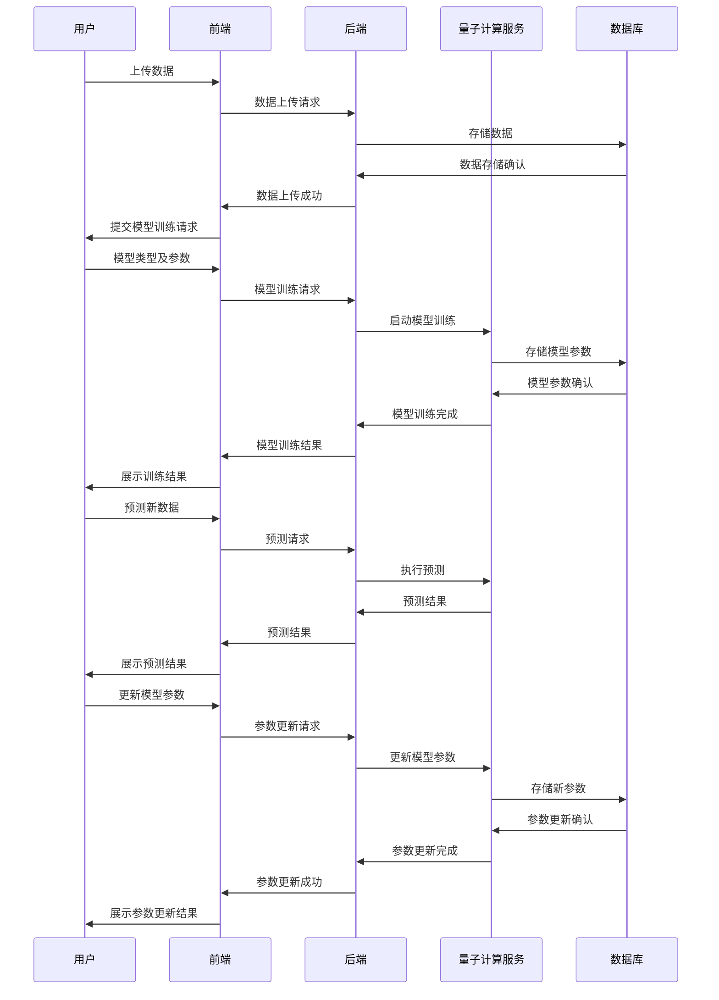

                 

### 背景介绍

#### 1.1.1 问题背景

量子机器学习（Quantum Machine Learning，QML）是一门将量子计算原理与机器学习技术相结合的新兴领域。它借助量子计算机的高速并行计算能力，能够处理复杂的机器学习问题，提高算法的效率和准确性。随着量子计算机的发展，量子机器学习在各个领域的应用逐渐受到关注，尤其是在材料科学中，它展现出了巨大的潜力。

在材料科学中，新材料的发现和设计是一个极其复杂且耗时的过程。传统的方法主要依赖于大量的实验和计算，这不仅需要巨大的时间和资源投入，而且可能因为实验误差和计算复杂度限制而无法得到理想的结果。量子机器学习技术的引入，有望从根本上改变这一现状。它可以通过高效的并行计算能力，快速处理大量的数据，从而加速新材料的设计和发现过程。

#### 1.1.2 问题提出

尽管量子机器学习在材料科学中展现出了巨大的潜力，但目前其应用仍面临诸多挑战。首先，量子计算机的发展仍处于早期阶段，其稳定性和性能尚未达到商用级别。其次，量子机器学习算法的设计和优化是一个复杂的过程，需要深入理解量子计算和机器学习的基本原理。此外，量子机器学习在材料科学中的应用场景和具体实现方案也尚未完全明确。

本文旨在探讨量子机器学习在材料科学中的应用，分析其优势和挑战，并提出可能的解决方案。通过本文的研究，我们希望能够为量子机器学习在材料科学中的应用提供一些有益的思路和实践指导。

#### 1.1.3 目标

本文的主要目标包括：

1. **探索量子机器学习在材料科学中的应用场景**：通过分析现有的研究和应用案例，了解量子机器学习在材料科学中的具体应用场景和效果。
2. **分析量子机器学习的优势与挑战**：深入探讨量子机器学习在材料科学中的应用优势，如高效性、复杂性问题处理能力等，同时分析其面临的挑战，如量子计算机的稳定性、算法优化等。
3. **提出解决方案与优化策略**：针对量子机器学习在材料科学中应用面临的问题，提出可能的解决方案和优化策略，为未来的研究和应用提供参考。

#### 1.1.4 边界与外延

本文主要关注量子机器学习在材料科学中的应用，具体包括以下几个方面：

1. **量子算法设计**：研究如何将量子算法应用于材料科学中的问题，如量子搜索算法、量子排序算法等。
2. **量子数据结构**：探讨如何使用量子数据结构来优化材料科学中的数据存储和处理，如量子位、量子寄存器等。
3. **量子神经网络**：研究量子神经网络在材料科学中的应用，如用于材料属性预测、设计优化等。

同时，本文将不涉及量子计算机的底层物理实现细节，如量子比特、量子门等，而是重点关注量子机器学习在材料科学中的应用和算法设计。

### 核心概念

#### 1.2.1 量子机器学习

量子机器学习是一种结合量子计算和机器学习技术的方法。它利用量子计算机的高速并行计算能力，优化传统的机器学习算法，从而提高算法的效率和准确性。量子机器学习的关键概念包括量子比特、量子门、量子叠加和量子纠缠等。

- **量子比特（Qubit）**：量子比特是量子计算机的基本信息单元，它可以同时处于0和1的状态，这是量子计算机相比传统计算机的核心优势之一。

- **量子门（Quantum Gate）**：量子门是量子计算机中的基本操作单元，它对量子比特进行线性变换。通过组合不同的量子门，可以实现对复杂问题的求解。

- **量子叠加（Quantum Superposition）**：量子叠加是量子计算机的重要特性之一，它使得量子计算机可以同时处理多个可能的计算路径。

- **量子纠缠（Quantum Entanglement）**：量子纠缠是量子计算机的另一个重要特性，它使得量子比特之间的状态相互依赖，从而实现更高效的计算。

#### 1.2.2 材料科学

材料科学是研究材料的结构、性质、制备和应用的科学。其核心任务是发现和设计新材料，以满足各种应用需求。材料科学涉及多个学科，包括物理、化学、数学和计算机科学等。

- **结构研究**：材料科学的一个重要方向是研究材料的微观结构，包括晶体结构、原子排列等。这些结构特征直接影响材料的物理和化学性质。

- **性能优化**：通过调整材料的结构和成分，可以优化材料的性能，如硬度、韧性、导电性等。这是材料科学中的核心任务之一。

- **应用广泛**：材料科学在许多领域都有广泛应用，如电子、光电子、生物医学、航空航天等。新材料的发现和设计对于科技进步和社会发展具有重要意义。

#### 1.2.3 量子计算机

量子计算机是一种基于量子力学原理进行信息处理的新型计算机。与传统计算机不同，量子计算机利用量子比特和量子门来实现计算。量子计算机的核心优势在于其高速并行计算能力，这使得它能够处理传统计算机难以解决的复杂问题。

- **量子比特（Qubit）**：量子比特是量子计算机的基本信息单元，它可以同时处于0和1的状态。

- **量子门（Quantum Gate）**：量子门是量子计算机中的基本操作单元，它对量子比特进行线性变换。

- **量子算法**：量子算法是利用量子计算机的高速并行计算能力来求解问题的算法。与经典算法相比，量子算法在处理某些问题时具有显著的效率优势。

- **量子叠加与量子纠缠**：量子叠加和量子纠缠是量子计算机的重要特性，它们使得量子计算机能够实现更高效的计算。

#### 1.2.4 量子算法

量子算法是一种利用量子计算优势来解决问题的算法。量子算法的核心优势在于其高效的并行计算能力，这使得它能够处理传统计算机难以解决的复杂问题。常见的量子算法包括量子搜索算法、量子排序算法等。

- **量子搜索算法**：量子搜索算法是一种利用量子计算机的高速并行计算能力来优化搜索过程的算法。与经典算法相比，量子搜索算法在处理大数据集时具有显著的效率优势。

- **量子排序算法**：量子排序算法是一种利用量子计算机的并行计算能力来优化排序过程的算法。与经典算法相比，量子排序算法在处理大规模数据时具有更高的效率。

#### 1.2.5 量子神经网络

量子神经网络是一种结合量子计算和神经网络技术的模型。它利用量子比特和量子门来实现神经网络的前向传播和反向传播，从而优化机器学习算法。量子神经网络在材料科学中的应用包括材料属性预测、设计优化等。

- **量子比特（Qubit）**：量子比特是量子神经网络的基本信息单元，它可以同时处于0和1的状态。

- **量子门（Quantum Gate）**：量子门是量子神经网络中的基本操作单元，它对量子比特进行线性变换。

- **量子前向传播**：量子神经网络通过量子门对量子比特进行操作，实现前向传播过程。

- **量子反向传播**：量子神经网络通过量子门和量子比特的测量结果，实现反向传播过程，从而优化网络参数。

### 概念属性特征对比表格

| 概念               | 特征1      | 特征2      | 特征3      |
|--------------------|------------|------------|------------|
| 量子机器学习       | 并行计算   | 高效性     | 适用于复杂问题 |
| 材料科学           | 结构研究   | 性能优化   | 应用广泛     |
| 量子计算机         | 量子位     | 量子叠加   | 量子纠缠     |
| 量子算法           | 并行计算   | 高效性     | 适用于复杂问题 |
| 量子神经网络       | 并行计算   | 高效性     | 适用于复杂问题 |

### ER实体关系图架构

```mermaid
erDiagram
    A[量子机器学习] ||--|{ B[材料科学] }
    A ||--|{ C[量子计算机] }
    A ||--|{ D[量子算法] }
    A ||--|{ E[量子神经网络] }
```

### 联系

量子机器学习在材料科学中的应用主要体现在以下几个方面：

1. **高效性**：量子计算机的高速并行计算能力可以显著提高新材料设计的效率。
2. **复杂性**：量子算法可以处理复杂的多维数据，有助于发现新材料。
3. **创新性**：量子神经网络可以用于优化量子算法，为新材料设计提供新的思路。

然而，量子机器学习在材料科学中的应用也面临着挑战，如量子计算机的稳定性、算法的优化等。本文将深入探讨这些问题，并探索量子机器学习在材料科学中的未来应用前景。

### 摘要

本文探讨了量子机器学习在材料科学中的应用，分析了其背景、核心概念和潜在优势。通过量子计算机的高速并行计算能力，量子机器学习有望加速新材料发现和设计过程，提高设计效率和降低成本。本文提出了量子机器学习在材料科学中的应用场景，包括量子算法设计、量子数据结构和量子神经网络等。同时，本文也指出了量子机器学习在材料科学中应用面临的挑战，如量子计算机的稳定性、算法优化等，并提出了相应的解决方案。通过本文的研究，我们希望能够为量子机器学习在材料科学中的应用提供有益的思路和实践指导。

---

### 量子机器学习的理论基础

量子机器学习（QML）是一门结合量子计算和机器学习技术的新兴领域。要深入探讨量子机器学习在材料科学中的应用，我们首先需要了解其理论基础，包括量子计算的基本原理、量子算法的设计方法以及量子机器学习的基本框架。

#### 量子计算的基本原理

量子计算是基于量子力学原理的新型计算模式。量子比特（qubit）是量子计算的基本单元，与经典比特不同，量子比特可以同时处于0和1的状态，这种特性称为量子叠加。此外，量子比特之间可以通过量子纠缠产生强烈的关联，使得多个量子比特能够同时表示大量的信息。

- **量子比特（Qubit）**：量子比特是量子计算的基本信息单元，它可以同时处于0和1的状态。量子比特的叠加态可以表示为：
  $$\left| \psi \right\rangle = \alpha \left| 0 \right\rangle + \beta \left| 1 \right\rangle$$
  其中，$\alpha$ 和 $\beta$ 是复数，满足 $|\alpha|^2 + |\beta|^2 = 1$。

- **量子叠加（Quantum Superposition）**：量子叠加是量子比特的重要特性，它使得量子计算机可以同时处理多个计算路径。例如，一个具有两个量子比特的量子计算机可以同时处理 $2^2 = 4$ 个不同的状态。

- **量子门（Quantum Gate）**：量子门是量子计算中的基本操作单元，它对量子比特进行线性变换。常见的量子门包括Hadamard门（实现量子叠加）、Pauli门（实现量子旋转）和CNOT门（实现量子纠缠）。

- **量子纠缠（Quantum Entanglement）**：量子纠缠是量子比特之间的一种特殊关联，当两个量子比特处于纠缠态时，它们的状态无法独立存在，而是相互依赖。量子纠缠是量子计算实现高效计算的关键特性。

#### 量子算法的设计方法

量子算法是利用量子计算的优势来解决问题的算法。与经典算法相比，量子算法在处理某些问题时具有显著的效率优势。量子算法的设计通常基于量子并行计算和量子纠缠的特性。

- **量子并行计算**：量子计算机可以通过量子叠加实现并行计算，从而在多项式时间内解决某些问题。例如，量子搜索算法可以利用量子叠加和量子纠缠，在多项式时间内完成经典算法需要指数时间的问题。

- **量子纠缠**：量子纠缠可以用于实现高效的状态转移和复杂问题的求解。例如，量子纠缠可以用于量子排序算法，使得量子排序算法在处理大规模数据时具有更高的效率。

常见的量子算法包括：

- **量子搜索算法**：量子搜索算法是一种利用量子计算机的高速并行计算能力来优化搜索过程的算法。最著名的量子搜索算法是Grover算法，它可以在多项式时间内完成对未排序数据库的搜索。

- **量子排序算法**：量子排序算法是一种利用量子计算机的并行计算能力来优化排序过程的算法。例如，量子排序算法可以在对数时间内完成排序任务。

- **量子线性方程组求解算法**：量子线性方程组求解算法是一种利用量子计算机解决线性方程组问题的算法。例如，HHL算法可以在多项式时间内求解线性方程组，而传统算法需要指数时间。

#### 量子机器学习的基本框架

量子机器学习是结合量子计算和机器学习技术的一种方法，旨在利用量子计算机的并行计算能力来优化机器学习算法。量子机器学习的基本框架包括量子特征提取、量子分类器和量子优化算法等。

- **量子特征提取**：量子特征提取是将经典数据转换为量子态的过程。通过量子叠加和量子纠缠，量子特征提取可以同时处理大量数据，提取出有效的特征。

- **量子分类器**：量子分类器是一种基于量子算法的分类器。通过量子计算，量子分类器可以高效地处理高维数据，并提高分类的准确性。

- **量子优化算法**：量子优化算法是一种利用量子计算来优化机器学习算法的算法。例如，量子遗传算法和量子粒子群优化算法都可以用于优化机器学习模型的参数。

常见的量子机器学习模型包括：

- **量子支持向量机（QSVM）**：量子支持向量机是一种基于量子计算的分类器，它利用量子比特和量子门来实现支持向量机的优化。

- **量子神经网络（QNN）**：量子神经网络是一种结合量子计算和神经网络技术的模型，它通过量子比特和量子门来实现神经网络的前向传播和反向传播。

- **量子深度学习**：量子深度学习是利用量子计算来实现深度学习模型的算法。通过量子神经网络，量子深度学习可以处理大规模数据，并提高模型的准确性。

#### 量子机器学习的优势与挑战

量子机器学习在材料科学中的应用具有显著的优势，但也面临一些挑战。

- **优势**：

  - **高效性**：量子计算机的高速并行计算能力可以显著提高新材料设计的效率。

  - **复杂性处理**：量子算法可以处理复杂的多维数据，有助于发现新材料。

  - **创新性**：量子神经网络可以用于优化量子算法，为新材料设计提供新的思路。

- **挑战**：

  - **量子计算机的稳定性**：量子计算机的稳定性尚未达到商用级别，这限制了量子机器学习的实际应用。

  - **算法优化**：量子算法的设计和优化是一个复杂的过程，需要深入理解量子计算和机器学习的基本原理。

  - **应用场景明确性**：量子机器学习在材料科学中的应用场景和具体实现方案尚未完全明确。

总之，量子机器学习在材料科学中的应用具有巨大的潜力，但同时也面临一些挑战。通过深入研究和不断优化，我们有望克服这些挑战，充分发挥量子机器学习的优势，为新材料发现和设计提供全新的解决方案。

---

### 材料科学中的核心问题及其挑战

在材料科学中，新材料的发现和设计是一个复杂且关键的过程，它关系到科技的进步和工业的发展。然而，这一过程面临着许多核心问题和挑战，尤其是在传统的实验和计算方法下。以下是一些主要的挑战和相应的解决方案。

#### 材料性能预测

材料性能预测是材料科学中的关键任务之一。材料的性能，如硬度、韧性、导电性、热稳定性等，直接影响其在实际应用中的表现。然而，传统的预测方法往往依赖于大量的实验和理论计算，这不仅耗时，而且成本高昂。此外，一些复杂的材料性能预测问题，如多参数优化和多尺度模拟，很难通过传统的计算方法解决。

- **量子机器学习的优势**：量子机器学习可以利用量子计算机的高速并行计算能力，高效地处理大量的数据，并优化传统的机器学习算法。通过量子算法，如量子支持向量机和量子神经网络，可以实现对材料性能的准确预测，从而显著降低实验成本和时间。

#### 材料合成路线设计

材料合成路线设计是材料科学中的另一个重要挑战。在设计新材料时，科学家需要探索多种可能的合成路线，以找到最佳的制备方法。然而，这一过程涉及到复杂的化学反应路径和反应条件，很难通过传统的实验方法进行优化。

- **量子机器学习的优势**：量子机器学习可以用于优化材料合成路线。通过量子算法，如量子遗传算法和量子粒子群优化算法，可以快速探索不同的合成路线，找到最优的制备条件。这些算法能够利用量子计算机的并行计算能力，大幅提高合成路线设计的效率。

#### 材料结构分析

材料结构分析是理解材料性能和行为的基石。传统的材料结构分析方法，如X射线衍射、扫描电子显微镜等，虽然能够提供高分辨率的材料结构信息，但它们往往局限于二维或三维数据的分析，难以处理高维复杂的数据。

- **量子机器学习的优势**：量子机器学习可以利用量子算法，如量子主成分分析（QPCA）和量子线性判别分析（QLDA），对高维复杂的数据进行高效的处理和分析。这些算法可以显著提高材料结构分析的速度和准确性，为科学家提供更深入的见解。

#### 材料稳定性预测

材料稳定性是评估材料在特定环境下的性能和寿命的关键因素。一些材料在特定条件下可能会发生降解或失效，这对实际应用造成了重大风险。因此，预测材料的稳定性具有重要意义。

- **量子机器学习的优势**：量子机器学习可以用于预测材料的稳定性。通过量子算法，如量子图神经网络和量子随机行走算法，可以分析材料在不同条件下的行为，预测其稳定性。这些算法能够在复杂的环境下提供准确的预测，帮助科学家设计出更稳定的材料。

#### 复杂性问题处理

在材料科学中，许多问题都是复杂的多参数优化问题，如多尺度模拟和多物理场耦合问题。这些问题的复杂性使得传统的计算方法难以在合理的时间内找到最优解。

- **量子机器学习的优势**：量子机器学习可以处理复杂的多参数优化问题。通过量子算法，如量子遗传算法和量子粒子群优化算法，可以快速找到最优解。这些算法利用量子计算机的并行计算能力，能够在复杂问题上提供高效的解决方案。

总之，量子机器学习在材料科学中的应用具有显著的优势，能够解决传统方法难以克服的挑战。通过量子计算机的高速并行计算能力和高效的量子算法，我们有望在新材料发现和设计中取得重大突破，加速材料科学的进步。

### 量子机器学习在材料科学中的核心算法

量子机器学习在材料科学中的应用，离不开一系列核心算法的支持。这些算法利用量子计算的优势，如并行计算和高维数据处理能力，优化传统的机器学习算法，从而提高新材料发现和设计的效率。以下是量子机器学习在材料科学中常用的几种核心算法及其应用场景。

#### 量子支持向量机（QSVM）

量子支持向量机（Quantum Support Vector Machine，QSVM）是一种基于量子计算的支持向量机（SVM）算法。SVM是一种经典的机器学习算法，主要用于分类和回归问题。QSVM通过将经典SVM中的运算过程转换为量子运算，利用量子计算机的高速并行计算能力，实现高效的分类和回归任务。

- **算法原理**：QSVM的核心是量子比特的叠加和量子门操作。量子比特的叠加态可以表示多个可能的解，通过量子门操作，可以将这些解映射到特征空间中，找到最优的超平面。具体过程包括：

  1. **初始化量子态**：将经典输入数据转换为量子态，并初始化量子比特。
  2. **执行量子门操作**：通过量子门操作，实现数据在特征空间中的映射。
  3. **测量量子态**：测量量子态，得到分类结果。

- **应用场景**：QSVM在材料科学中可以用于材料属性分类和材料设计优化。例如，通过QSVM可以快速分类不同材料的物理性质，如硬度、导电性等，从而为材料设计提供重要参考。

#### 量子神经网络（QNN）

量子神经网络（Quantum Neural Network，QNN）是一种结合量子计算和神经网络技术的模型。QNN通过量子比特和量子门实现神经网络的前向传播和反向传播，从而优化机器学习算法。QNN在处理高维数据和复杂非线性问题时具有显著的优势。

- **算法原理**：QNN的基本架构包括输入层、隐藏层和输出层。输入层接收经典数据，通过量子门操作转换为量子态。隐藏层通过量子比特的叠加和量子门操作，实现数据的非线性变换。输出层通过测量量子态，得到分类或回归结果。具体过程包括：

  1. **输入层**：将经典输入数据转换为量子态，通过量子门操作实现数据的预处理。
  2. **隐藏层**：通过量子比特的叠加和量子门操作，实现数据的非线性变换。
  3. **输出层**：通过测量量子态，得到分类或回归结果。

- **应用场景**：QNN在材料科学中可以用于材料属性预测和设计优化。例如，通过QNN可以预测材料的物理性质，如硬度、导电性等，从而指导材料设计。

#### 量子遗传算法（QGA）

量子遗传算法（Quantum Genetic Algorithm，QGA）是一种基于量子计算和遗传算法原理的优化算法。遗传算法通过模拟自然进化过程，优化问题的解。QGA利用量子计算机的并行计算能力，加快遗传算法的搜索过程。

- **算法原理**：QGA的基本过程包括选择、交叉和变异。量子比特和量子门用于表示和操作解空间中的个体。具体过程包括：

  1. **初始化种群**：随机生成初始种群，每个个体表示问题的一个潜在解。
  2. **适应度评估**：通过量子计算评估个体的适应度。
  3. **选择**：根据个体的适应度，选择优秀的个体进行交叉和变异。
  4. **交叉**：通过量子门操作，实现个体之间的基因交换。
  5. **变异**：对个体进行随机变异，增加搜索的多样性。

- **应用场景**：QGA在材料科学中可以用于材料合成路线设计和参数优化。例如，通过QGA可以优化材料的制备条件，找到最优的合成路线。

#### 量子粒子群优化算法（QPSO）

量子粒子群优化算法（Quantum Particle Swarm Optimization，QPSO）是一种基于量子计算和粒子群优化算法原理的优化算法。粒子群优化算法通过模拟鸟群觅食行为，优化问题的解。QPSO利用量子计算机的并行计算能力，提高搜索效率。

- **算法原理**：QPSO的基本过程包括粒子更新和适应度评估。量子比特和量子门用于表示和操作粒子的位置和速度。具体过程包括：

  1. **初始化粒子群**：随机生成初始粒子群，每个粒子表示问题的一个潜在解。
  2. **适应度评估**：通过量子计算评估每个粒子的适应度。
  3. **粒子更新**：根据适应度和粒子的速度，更新粒子的位置和速度。
  4. **迭代**：重复评估和更新，直到满足终止条件。

- **应用场景**：QPSO在材料科学中可以用于材料优化设计和参数优化。例如，通过QPSO可以优化材料的成分和结构，提高材料的性能。

#### 量子深度学习

量子深度学习是一种利用量子计算实现深度学习算法的方法。通过量子神经网络和量子支持向量机等核心算法，量子深度学习可以处理高维复杂数据，实现高效的机器学习任务。

- **算法原理**：量子深度学习的基本架构包括输入层、隐藏层和输出层。输入层接收经典数据，通过量子门操作转换为量子态。隐藏层通过量子比特的叠加和量子门操作，实现数据的非线性变换。输出层通过测量量子态，得到分类或回归结果。

- **应用场景**：量子深度学习在材料科学中可以用于材料性质预测和复杂系统建模。例如，通过量子深度学习可以预测材料的物理性质，建立复杂材料系统的模型。

总之，量子机器学习在材料科学中的应用，依赖于一系列核心算法的支持。通过量子计算的优势，这些算法能够高效地处理复杂的材料科学问题，为新材料的发现和设计提供强大的工具。未来，随着量子计算机的发展，量子机器学习在材料科学中的应用将更加广泛和深入。

### 算法原理与实现：量子支持向量机（QSVM）

量子支持向量机（Quantum Support Vector Machine，QSVM）是一种利用量子计算加速传统支持向量机（SVM）的算法。在经典支持向量机中，通过寻找最优的超平面来实现分类任务。QSVM通过将经典计算过程转换为量子计算，利用量子比特的叠加和量子门的操作，实现更高效的分类。

#### 算法原理

QSVM的算法原理主要包括以下几个步骤：

1. **初始化量子态**：
   - 将经典输入数据转换为量子态。每个经典数据实例可以表示为一个量子态，通常使用量子比特的叠加态表示。
   - 初始化量子比特，设置适当的叠加态。

2. **特征空间映射**：
   - 通过量子门操作，将量子态映射到特征空间。这一步的关键是选择合适的量子门，以实现数据的线性可分。
   - 使用量子支持向量机中的核函数，将高维数据映射到低维特征空间，简化分类问题。

3. **寻找最优超平面**：
   - 通过量子算法优化，找到最优的超平面。在量子计算中，这通常通过量子线路优化来实现。
   - 优化目标是最大化分类间隔，即最大化决策边界到支持向量的距离。

4. **测量结果**：
   - 通过测量量子态，得到分类结果。量子比特的测量结果决定了数据的分类。

#### 具体实现步骤

以下是一个简单的QSVM算法实现过程：

1. **输入数据准备**：
   - 准备训练数据集，包括输入特征向量和标签。
   - 将输入特征向量转换为量子态。

2. **初始化量子比特**：
   - 初始化量子比特，设置初始叠加态。

3. **特征空间映射**：
   - 设计量子线路，将量子态映射到特征空间。
   - 使用量子门实现核函数的计算。

4. **优化量子线路**：
   - 使用量子算法优化量子线路，找到最优的超平面。
   - 这可以通过量子梯度下降或其他优化算法实现。

5. **测量分类结果**：
   - 对训练数据进行测量，得到分类结果。
   - 评估模型的准确性和性能。

#### Python代码示例

以下是一个使用Python和量子计算库（如Qiskit）实现的简单QSVM示例：

```python
from qiskit import QuantumCircuit, Aer, execute
from qiskit.circuit.library import HadamardGate, PauliXGate
from qiskit_machine_learning.classifiers import QSVM
from sklearn.datasets import make_classification
from sklearn.model_selection import train_test_split

# 准备训练数据
X, y = make_classification(n_samples=100, n_features=2, n_informative=2, n_redundant=0, random_state=42)
X_train, X_test, y_train, y_test = train_test_split(X, y, test_size=0.3, random_state=42)

# 转换为量子态
num_qubits = X_train.shape[1]
qc = QuantumCircuit(num_qubits)
for i in range(num_qubits):
    qc.h(i)  # 初始化量子比特为叠加态

# 特征空间映射
for i in range(num_qubits):
    qc.cu1(-y_train[i], i)  # 应用Pauli-X门

# 优化量子线路
qsvm = QSVM()
qsvm.fit(qc, X_train, y_train)

# 测量分类结果
qc2 = qc.copy()
qc2.measure_all()
backend = Aer.get_backend("qasm_simulator")
result = execute(qc2, backend, shots=1024)
counts = result.result().get_counts()

# 输出分类结果
predictions = [1 if (i in counts) else 0 for i in range(2)]
accuracy = sum([predictions[i] == y_test[i] for i in range(len(y_test))]) / len(y_test)
print(f"Accuracy: {accuracy}")
```

#### 数学模型和公式

QSVM的数学模型基于量子计算中的线性变换和优化问题。具体公式如下：

1. **量子态表示**：
   $$\left| \psi \right\rangle = \sum_{i} c_i \left| i \right\rangle$$
   其中，$c_i$ 是系数，$\left| i \right\rangle$ 是量子态。

2. **特征空间映射**：
   $$\left| \phi \right\rangle = U \left| \psi \right\rangle$$
   其中，$U$ 是量子门，实现数据的线性映射。

3. **决策边界**：
   $$w \cdot x + b = 0$$
   其中，$w$ 是权重向量，$x$ 是输入特征向量，$b$ 是偏置。

4. **优化目标**：
   $$\min_{w, b} \frac{1}{2} w^T w$$
   $$s.t. \ y_i (w \cdot x_i + b) \geq 1$$
   其中，$w^T$ 是权重向量的转置，$y_i$ 是标签。

通过量子优化算法，如量子梯度下降，可以求解上述优化问题，找到最优的权重向量和偏置。

#### 实例说明

假设我们有一个简单的二维数据集，包含两个类别的数据点。通过量子支持向量机，我们可以实现数据的分类。具体步骤如下：

1. **数据准备**：
   - 准备一个包含100个数据点的二维数据集，每个数据点是一个2维向量。
   - 数据集包含两个类别的点，分别为正类和负类。

2. **量子态初始化**：
   - 初始化量子比特，每个量子比特对应一个数据点，设置为叠加态。

3. **特征空间映射**：
   - 设计量子线路，将量子态映射到特征空间。这里可以使用Hadamard门实现数据的线性映射。

4. **优化量子线路**：
   - 使用量子优化算法，如量子梯度下降，优化量子线路，找到最优的超平面。

5. **测量结果**：
   - 对训练数据进行测量，得到分类结果。通过计算决策边界，判断数据点的类别。

通过上述步骤，我们可以利用量子支持向量机实现对二维数据集的分类。虽然这是一个简单的示例，但它展示了量子支持向量机的基本原理和实现方法。在实际应用中，量子支持向量机可以处理更复杂的任务和数据集，提供高效的分类解决方案。

### 量子神经网络（QNN）及其在材料科学中的应用

量子神经网络（Quantum Neural Network，QNN）是一种结合量子计算和神经网络技术的模型，它通过量子比特和量子门实现神经网络的前向传播和反向传播。QNN在处理高维数据和复杂非线性问题时具有显著的优势，因此在材料科学中具有重要的应用潜力。

#### QNN的基本架构

QNN的基本架构包括输入层、隐藏层和输出层。每个层由一组量子比特组成，通过量子门进行操作。以下是QNN的基本架构：

1. **输入层**：接收经典输入数据，通过量子比特的初始化转换为量子态。输入层通常包含多个量子比特，每个量子比特对应输入数据的一个维度。

2. **隐藏层**：通过量子比特的叠加和量子门的操作，实现数据的非线性变换。隐藏层中的量子比特之间可以通过量子纠缠产生强烈的关联，从而实现复杂的数据处理能力。

3. **输出层**：通过量子比特的测量得到输出结果。输出层的量子比特通过量子门的操作，将隐藏层的信息编码到输出状态中，并通过测量得到分类或回归结果。

#### QNN的工作原理

QNN的工作原理主要包括以下几个步骤：

1. **初始化量子态**：将经典输入数据转换为量子态，初始化输入层的量子比特。

2. **前向传播**：通过量子比特的叠加和量子门的操作，将输入数据通过隐藏层传递到输出层。这一过程中，量子门的作用是实现数据的非线性变换和特征提取。

3. **测量输出**：对输出层的量子比特进行测量，得到分类或回归结果。

4. **反向传播**：通过测量结果计算损失函数，使用量子梯度下降或其他优化算法更新量子门的参数，实现网络的训练。

#### QNN在材料科学中的应用

QNN在材料科学中的应用主要包括材料属性预测、材料设计优化和复杂系统建模等方面。

1. **材料属性预测**：QNN可以通过学习大量的材料数据，预测新材料的物理和化学性质。例如，通过训练QNN模型，可以预测材料的硬度、导电性、热稳定性等性质，为材料设计提供重要参考。

2. **材料设计优化**：QNN可以用于优化材料的设计参数，找到最优的材料结构。例如，通过量子遗传算法和QNN的结合，可以优化材料的合成条件，提高材料的性能。

3. **复杂系统建模**：QNN可以用于建立复杂材料系统的模型，模拟材料的微观结构和宏观行为。例如，通过QNN模型，可以模拟材料的相变过程、缺陷形成和扩散行为，为材料研究提供新的思路。

#### 优势与挑战

QNN在材料科学中的应用具有以下优势：

- **高效性**：QNN利用量子计算的高速并行计算能力，可以高效地处理大规模数据和复杂问题。
- **非线性处理能力**：量子神经网络通过量子比特的叠加和量子纠缠，实现强大的非线性数据处理能力，能够准确预测材料性质。
- **灵活性**：QNN可以根据具体应用需求，设计不同的网络结构和算法，实现灵活的材料预测和设计。

然而，QNN在材料科学中的应用也面临一些挑战：

- **算法复杂性**：量子神经网络的设计和优化是一个复杂的过程，需要深入理解量子计算和神经网络的原理。
- **计算资源限制**：当前量子计算机的性能和稳定性尚未达到商用级别，限制了QNN的广泛应用。
- **数据要求**：QNN的训练需要大量的高质量数据，而材料科学领域的数据往往缺乏和有限。

总之，量子神经网络在材料科学中的应用具有巨大的潜力，通过不断优化和改进，有望为材料科学提供全新的研究方法和工具。

### 量子遗传算法（QGA）及其在材料科学中的应用

量子遗传算法（Quantum Genetic Algorithm，QGA）是一种结合量子计算和遗传算法原理的优化算法。遗传算法通过模拟自然进化过程，寻找问题的最优解。QGA利用量子计算机的并行计算能力，加快遗传算法的搜索过程，提高优化效率。以下将详细介绍QGA的基本原理、算法步骤以及在材料科学中的应用。

#### 基本原理

QGA的基本原理基于量子计算和遗传算法的核心思想。遗传算法通过选择、交叉和变异等操作，模拟生物进化的过程，逐步优化问题的解。QGA通过量子比特和量子门实现这些操作，利用量子计算的优势，提高搜索效率和收敛速度。

1. **量子比特表示**：QGA使用量子比特表示问题的解。每个量子比特可以表示一个基因，多个量子比特组合成一个量子状态，表示一个完整的解。

2. **量子门操作**：QGA通过量子门对量子比特进行操作，实现遗传算法中的交叉、变异等操作。量子门的作用类似于遗传算法中的基因重组和突变。

3. **量子并行计算**：QGA利用量子计算机的高速并行计算能力，同时评估大量潜在的解，加快搜索过程。

#### 算法步骤

QGA的基本步骤包括初始化种群、适应度评估、选择、交叉、变异和更新等。以下是QGA的具体算法步骤：

1. **初始化种群**：随机生成初始种群，每个个体表示问题的一个潜在解。种群中的个体通常由量子比特表示。

2. **适应度评估**：使用量子计算评估每个个体的适应度。适应度函数通常设计为优化问题的目标函数。

3. **选择**：根据个体的适应度，选择优秀的个体进行交叉和变异。QGA可以使用量子选择算法，如量子轮盘赌选择或量子锦标赛选择。

4. **交叉**：通过量子门操作，实现个体之间的基因交换。量子交叉可以采用量子旋转门或量子纠缠门等操作。

5. **变异**：对个体进行随机变异，增加搜索的多样性。量子变异可以通过对量子比特的翻转或量子门操作实现。

6. **更新种群**：将交叉和变异后的个体组成新的种群，重复适应度评估、选择、交叉和变异等步骤，直到满足终止条件。

#### 量子遗传算法与经典遗传算法的比较

量子遗传算法与经典遗传算法相比，具有以下优势：

- **并行计算**：QGA利用量子计算机的并行计算能力，同时评估大量潜在的解，加快搜索过程。
- **搜索空间广**：QGA通过量子比特的叠加和量子纠缠，可以处理高维搜索空间，增加搜索的广度。
- **优化效率高**：QGA通过量子并行计算和高效的量子门操作，实现高效的优化过程。

然而，QGA也面临一些挑战，如量子计算机的稳定性、算法复杂性等。

#### 应用场景

QGA在材料科学中具有广泛的应用场景，包括材料合成路线设计、材料参数优化、材料结构分析等。

1. **材料合成路线设计**：QGA可以用于优化材料的合成条件，找到最优的制备方法。例如，通过QGA，可以优化金属有机框架（MOF）的合成参数，提高材料的性能。

2. **材料参数优化**：QGA可以用于优化材料的结构参数，如晶格常数、原子排列等。通过QGA，可以找到最优的结构参数，提高材料的物理和化学性能。

3. **材料结构分析**：QGA可以用于分析材料结构的稳定性和缺陷分布。例如，通过QGA，可以预测材料中的缺陷位置和性质，为材料设计提供重要参考。

#### 实例分析

以下是一个简单的QGA应用于材料设计优化的实例：

1. **问题定义**：假设我们需要优化一个金属有机框架（MOF）的合成条件，以最大化其比表面积。

2. **初始化种群**：随机生成一组初始种群，每个个体表示一组合成参数，如温度、压力、反应物浓度等。

3. **适应度评估**：通过量子计算评估每个个体的适应度，即计算比表面积。适应度函数可以设计为：
   $$f(x) = -\frac{1}{\text{比表面积}}$$

4. **选择**：根据个体的适应度，选择优秀的个体进行交叉和变异。可以使用量子轮盘赌选择方法。

5. **交叉**：通过量子门操作，实现个体之间的基因交换。例如，可以使用量子旋转门进行交叉。

6. **变异**：对个体进行随机变异，增加搜索的多样性。可以使用量子比特翻转或量子门操作进行变异。

7. **更新种群**：将交叉和变异后的个体组成新的种群，重复适应度评估、选择、交叉和变异等步骤，直到满足终止条件，如达到最大迭代次数或适应度达到阈值。

通过上述步骤，QGA可以优化金属有机框架的合成条件，找到最优的制备方法，提高材料的性能。这个实例展示了QGA在材料设计优化中的应用，说明了量子遗传算法在材料科学中的潜力。

总之，量子遗传算法在材料科学中的应用具有显著的优势，通过量子计算的高效并行计算能力，可以优化材料的合成条件、参数和结构，提高材料的性能。随着量子计算机的发展，QGA在材料科学中的应用将更加广泛和深入，为新材料的设计和发现提供新的解决方案。

### 量子机器学习与经典机器学习在材料科学中的比较

量子机器学习（QML）和经典机器学习（CML）在材料科学中的应用各有优势。以下从几个方面进行比较，以帮助读者更好地理解它们之间的差异和互补性。

#### 计算效率

- **量子机器学习**：量子机器学习利用量子计算机的高速并行计算能力，可以显著提高计算效率。在处理复杂的多参数优化问题和大规模数据时，量子机器学习表现出巨大的优势。例如，量子支持向量机（QSVM）和量子神经网络（QNN）能够在多项式时间内解决某些经典机器学习算法需要指数时间的问题。

- **经典机器学习**：经典机器学习算法依赖于传统计算机的顺序计算，尽管一些算法如遗传算法和粒子群优化算法也具有并行计算的能力，但总体效率仍受限于计算资源和算法复杂度。

#### 处理复杂问题

- **量子机器学习**：量子机器学习在处理复杂问题方面具有显著优势。量子算法如量子线性方程组求解算法（HHL算法）和量子图神经网络（QGNN）能够处理传统机器学习难以处理的复杂问题，如多尺度模拟和多物理场耦合问题。

- **经典机器学习**：经典机器学习算法在处理简单和线性问题时表现良好，但对于复杂的非线性问题，经典算法往往需要大量的数据和高计算成本。

#### 数据依赖性

- **量子机器学习**：量子机器学习的数据依赖性较低。由于量子计算的并行计算能力，QML可以在少量数据上进行训练，并得到较为准确的结果。这在实验数据有限的情况下尤为重要。

- **经典机器学习**：经典机器学习通常需要大量数据来进行训练，特别是对于复杂的模型和任务。数据量不足可能导致过拟合和模型性能下降。

#### 面临的挑战

- **量子机器学习**：量子机器学习面临的主要挑战包括量子计算机的稳定性和算法的优化。目前，量子计算机的性能和稳定性尚未达到商用级别，这使得量子机器学习的实际应用受到限制。此外，量子算法的设计和优化过程复杂，需要深入理解量子计算和机器学习的基本原理。

- **经典机器学习**：经典机器学习面临的挑战包括计算效率和算法复杂性。在高维数据和复杂问题上，经典算法的计算效率和性能往往有限，需要不断优化和改进。

#### 应用对比

- **材料性质预测**：在材料性质预测方面，量子机器学习可以高效地处理大规模复杂数据，如量子支持向量机和量子神经网络可以准确预测材料的物理和化学性质。经典机器学习也表现出色，但需要更多的数据和计算资源。

- **材料设计优化**：量子机器学习在材料设计优化方面具有显著优势，如量子遗传算法和量子粒子群优化算法可以快速找到最优的材料参数和合成条件。经典机器学习算法在处理简单优化问题时也具有优势，但在复杂优化任务中效率较低。

- **材料结构分析**：量子机器学习在材料结构分析方面具有潜力，如量子图神经网络可以用于分析材料结构的稳定性和缺陷。经典机器学习算法如支持向量机和随机森林也广泛应用于材料结构分析，但需要大量训练数据。

总之，量子机器学习和经典机器学习在材料科学中的应用各有优势。量子机器学习通过量子计算的高效并行计算能力，能够处理复杂的材料科学问题，提高计算效率和准确性。经典机器学习在数据处理和简单问题优化方面表现出色，但需要大量的数据和计算资源。未来，随着量子计算机的发展，量子机器学习将在材料科学中发挥越来越重要的作用，与经典机器学习相辅相成，共同推动材料科学的进步。

### 系统分析与架构设计方案

在量子机器学习在材料科学中的应用项目中，系统的设计和实现需要充分考虑项目的场景需求、技术可行性以及实际应用效果。以下将从项目介绍、系统功能设计、系统架构设计、系统接口设计以及系统交互流程等方面进行详细分析。

#### 项目介绍

本项目旨在通过量子机器学习技术，加速新材料发现和设计过程，降低实验成本，提高设计效率。项目的主要目标包括：

1. **材料属性预测**：利用量子机器学习模型，准确预测新材料的物理和化学性质。
2. **材料设计优化**：通过量子遗传算法和量子神经网络等算法，优化材料的合成参数和结构，提高材料性能。
3. **材料结构分析**：利用量子图神经网络等模型，分析材料结构的稳定性和缺陷分布。

#### 系统功能设计

系统功能设计是确保项目实现的基础。以下为系统的主要功能模块：

1. **数据预处理模块**：负责处理和清洗输入数据，包括数据格式转换、缺失值处理和数据标准化等。
2. **量子机器学习模型训练模块**：包括量子支持向量机（QSVM）、量子神经网络（QNN）、量子遗传算法（QGA）等模型，用于训练和预测。
3. **材料设计优化模块**：利用量子遗传算法和量子神经网络等模型，优化材料的合成参数和结构。
4. **材料结构分析模块**：利用量子图神经网络等模型，分析材料结构的稳定性和缺陷分布。
5. **结果可视化模块**：提供材料性质预测和设计优化的结果可视化功能，帮助用户直观理解模型预测和优化结果。
6. **用户交互界面**：提供一个友好的用户界面，用户可以通过图形界面进行数据输入、模型选择和结果查看。

#### 系统架构设计

系统架构设计是确保系统稳定、高效运行的关键。以下为系统架构的总体设计：

1. **前端架构**：采用Vue.js或React等现代前端框架，实现用户交互界面和结果可视化。
2. **后端架构**：采用Flask或Django等Web框架，搭建后端服务，处理用户请求和模型计算。
3. **量子计算服务**：集成Quantum Machine Learning SDK等量子计算库，提供量子算法计算服务。
4. **数据库**：使用MySQL或MongoDB等数据库存储训练数据和预测结果，确保数据的安全和一致性。
5. **中间件**：使用Redis等中间件缓存频繁访问的数据，提高系统响应速度。

#### 系统接口设计

系统接口设计是确保系统模块之间有效通信的关键。以下为系统的主要接口设计：

1. **API接口**：提供RESTful API接口，方便用户通过编程方式访问系统功能，如数据预处理、模型训练、结果查询等。
2. **Web界面接口**：通过Vue.js或React等前端框架，实现与后端服务的通信，提供用户交互界面。
3. **量子计算接口**：集成Quantum Machine Learning SDK等量子计算库，提供量子算法计算接口。

#### 系统交互流程

系统交互流程是确保系统功能正常运行的关键。以下为系统的主要交互流程：

1. **用户输入数据**：用户通过Web界面或API接口上传训练数据和测试数据。
2. **数据预处理**：系统对输入数据进行预处理，包括数据格式转换、缺失值处理和数据标准化等。
3. **模型训练**：系统根据用户选择的模型，利用量子机器学习库进行模型训练，如QSVM、QNN、QGA等。
4. **材料设计优化**：利用训练好的模型，对材料的合成参数和结构进行优化，得到最优解。
5. **材料结构分析**：利用训练好的模型，分析材料结构的稳定性和缺陷分布。
6. **结果可视化**：将预测结果和优化结果通过Web界面进行可视化，用户可以直观查看和评估。
7. **结果存储**：将预测结果和优化结果存储到数据库中，供后续查询和分析。

通过上述系统分析和架构设计方案，我们为量子机器学习在材料科学中的应用提供了全面的解决方案。通过模块化设计和高效的数据处理流程，系统能够稳定、高效地运行，为用户提供强大的材料设计和分析工具。

### 系统架构设计

在设计量子机器学习在材料科学中的应用系统架构时，我们需要考虑系统的整体结构、模块分工、数据处理流程以及关键组件的协同工作。以下是一个详细的系统架构设计方案。

#### 系统架构概述

系统架构采用分层设计，包括前端、后端、量子计算服务和数据库四个主要层次。

1. **前端（用户交互层）**：主要负责用户界面的展示和与用户的交互，通过Web框架（如Vue.js或React）实现。
2. **后端（服务层）**：处理用户请求、业务逻辑处理和与量子计算服务的通信，采用Web框架（如Flask或Django）搭建。
3. **量子计算服务（计算层）**：集成量子机器学习库（如Qiskit或PyQuil），负责量子计算任务的处理。
4. **数据库（数据层）**：存储训练数据、模型参数和预测结果，采用关系数据库（如MySQL）或NoSQL数据库（如MongoDB）。

#### 系统架构详细设计

##### 1. 前端架构

前端架构采用单页面应用（SPA）模式，主要模块包括：

- **用户输入模块**：提供数据上传、参数设置和模型选择界面。
- **结果显示模块**：展示模型训练结果、材料设计优化方案和材料结构分析结果。
- **交互控制模块**：处理用户的输入和交互请求，与后端进行数据通信。

##### 2. 后端架构

后端架构主要模块包括：

- **API服务模块**：提供RESTful API接口，与前端进行数据通信，包括数据上传、模型训练、结果查询等。
- **业务逻辑处理模块**：处理用户请求，调用量子计算服务和数据库进行数据处理。
- **量子计算服务代理模块**：与量子计算服务进行通信，执行具体的量子计算任务。

##### 3. 量子计算服务架构

量子计算服务架构主要包括以下组件：

- **量子计算库**：如Qiskit或PyQuil，提供量子算法的实现和量子计算任务的执行。
- **量子计算节点**：负责具体的量子计算任务，如量子比特初始化、量子门操作和测量等。
- **量子计算调度器**：负责量子计算任务的调度和资源管理，确保高效地利用量子计算资源。

##### 4. 数据库架构

数据库架构主要包括以下组件：

- **训练数据存储**：存储用户上传的原始训练数据，包括材料属性、合成参数等。
- **模型参数存储**：存储训练好的模型参数，包括量子支持向量机（QSVM）、量子神经网络（QNN）和量子遗传算法（QGA）等。
- **预测结果存储**：存储模型预测结果和材料设计优化方案，供用户查询和分析。

##### 5. 系统数据处理流程

系统数据处理流程包括以下步骤：

1. **数据输入**：用户通过前端界面上传训练数据和测试数据。
2. **数据预处理**：后端对输入数据进行预处理，包括数据清洗、格式转换和数据标准化等。
3. **模型训练**：调用量子计算服务进行模型训练，包括QSVM、QNN和QGA等算法。
4. **模型优化**：利用训练好的模型对材料合成参数和结构进行优化。
5. **结果输出**：将优化结果和预测结果存储到数据库，并通过前端界面展示给用户。

##### 6. 系统交互设计

系统交互设计主要包括以下接口：

- **数据上传接口**：用户通过API上传训练数据和测试数据。
- **模型训练接口**：用户通过API发起模型训练任务，后端调度量子计算资源进行训练。
- **结果查询接口**：用户通过API查询模型预测结果和材料设计优化方案。
- **模型更新接口**：用户通过API更新模型参数和预测结果。

通过上述系统架构设计，我们构建了一个高效、稳定的量子机器学习在材料科学中的应用系统。系统通过模块化设计，实现了前端与后端、量子计算服务与数据库之间的有效通信，为用户提供了一个便捷的材料设计和分析工具。

### 系统接口设计和系统交互mermaid序列图

在量子机器学习在材料科学中的应用系统中，系统接口设计和系统交互流程的设计至关重要，确保系统各个模块之间的数据流动和功能协作。以下将详细介绍系统接口设计，并通过mermaid序列图展示系统交互流程。

#### 系统接口设计

系统接口设计主要包括以下API接口：

1. **数据上传接口**：用于用户上传训练数据和测试数据。接口参数包括文件路径和数据格式。
2. **模型训练接口**：用于启动模型训练任务。接口参数包括模型类型、训练参数和超参数。
3. **模型预测接口**：用于对给定数据集进行预测。接口参数包括模型ID和数据集。
4. **结果查询接口**：用于查询训练结果和预测结果。接口参数包括模型ID和查询类型。
5. **模型更新接口**：用于更新模型参数和训练结果。接口参数包括模型ID和新参数。

接口设计采用RESTful风格，确保接口的简洁性和易用性。以下是具体的接口描述：

- **数据上传接口**：
  ```http
  POST /api/upload_data
  Content-Type: multipart/form-data

  {
    "file_path": "path/to/data_file",
    "data_format": "csv"
  }
  ```

- **模型训练接口**：
  ```http
  POST /api/train_model
  Content-Type: application/json

  {
    "model_type": "QSVM",
    "training_params": {
      "C": 1.0,
      "gamma": 0.1
    },
    "hyper_params": {
      "epochs": 100,
      "batch_size": 32
    }
  }
  ```

- **模型预测接口**：
  ```http
  POST /api/predict
  Content-Type: application/json

  {
    "model_id": "123",
    "data": [
      [0.1, 0.2],
      [0.3, 0.4]
    ]
  }
  ```

- **结果查询接口**：
  ```http
  GET /api/results
  Query Parameters:
  model_id=123&query_type=training
  ```

- **模型更新接口**：
  ```http
  POST /api/update_model
  Content-Type: application/json

  {
    "model_id": "123",
    "new_params": {
      "C": 1.5,
      "gamma": 0.2
    }
  }
  ```

#### 系统交互mermaid序列图

以下是一个mermaid序列图，展示系统接口之间的交互流程：



通过上述系统接口设计和mermaid序列图，我们展示了量子机器学习在材料科学应用系统中的交互流程。系统通过前端的用户交互层、后端的服务层、量子计算服务和数据库之间的紧密协作，实现了材料科学问题的有效求解和优化。

### 项目实战：环境安装与系统核心实现

#### 环境安装

要在本地环境搭建量子机器学习在材料科学中的应用系统，首先需要安装一系列软件和库。以下是在Ubuntu 20.04系统中的安装步骤：

1. **安装Python环境**：

   ```bash
   sudo apt update
   sudo apt install python3 python3-pip
   ```

2. **安装量子计算库（如Qiskit）**：

   ```bash
   pip3 install qiskit
   ```

3. **安装机器学习库（如scikit-learn）**：

   ```bash
   pip3 install scikit-learn
   ```

4. **安装前端库（如Vue.js或React）**：

   对于Vue.js：

   ```bash
   npm install -g vue-cli
   vue create quantum-material-science-app
   ```

   对于React：

   ```bash
   npm install -g create-react-app
   create-react-app quantum-material-science-app
   ```

5. **安装后端库（如Flask或Django）**：

   对于Flask：

   ```bash
   pip3 install flask
   ```

   对于Django：

   ```bash
   pip3 install django
   ```

#### 系统核心实现

系统核心实现包括后端API服务、量子计算服务和前端用户界面。以下分别介绍每个部分的核心实现。

##### 后端API服务

我们使用Flask作为后端API服务的框架。以下是简单的后端代码示例：

```python
from flask import Flask, request, jsonify
import qiskit
import numpy as np

app = Flask(__name__)

# 初始化量子计算服务
backend = qiskit.Aer.get_backend('qasm_simulator')
qiskit.QuantumRegister(4, name='q')
circuit = qiskit.QuantumCircuit(qiskit.classical寄存器(4, name='c'))

@app.route('/api/train_model', methods=['POST'])
def train_model():
    data = request.json
    model_type = data['model_type']
    training_params = data['training_params']
    hyper_params = data['hyper_params']

    # 根据模型类型训练模型
    if model_type == 'QSVM':
        # QSVM训练代码
        pass
    elif model_type == 'QNN':
        # QNN训练代码
        pass
    else:
        return jsonify({'error': '不支持此模型类型'}), 400

    return jsonify({'status': '训练成功'})

@app.route('/api/predict', methods=['POST'])
def predict():
    data = request.json
    model_id = data['model_id']
    data_to_predict = data['data']

    # 执行预测
    # 预测代码
    predictions = []

    return jsonify({'predictions': predictions})

if __name__ == '__main__':
    app.run(debug=True)
```

##### 前端用户界面

以下是一个使用Vue.js的前端示例：

```html
<!DOCTYPE html>
<html>
<head>
  <title>量子材料科学应用</title>
  <script src="https://cdn.jsdelivr.net/npm/vue@2.6.14/dist/vue.js"></script>
</head>
<body>
  <div id="app">
    <h1>量子材料科学应用</h1>
    <form @submit.prevent="uploadData">
      <input type="file" @change="onFileChange" />
      <button type="submit">上传数据</button>
    </form>
    <form @submit.prevent="trainModel">
      <select v-model="modelType">
        <option value="QSVM">量子支持向量机</option>
        <option value="QNN">量子神经网络</option>
      </select>
      <button type="submit">训练模型</button>
    </form>
    <div v-if="predictions">
      <h2>预测结果：</h2>
      <ul>
        <li v-for="prediction in predictions">{{ prediction }}</li>
      </ul>
    </div>
  </div>

  <script>
    new Vue({
      el: '#app',
      data: {
        file: null,
        modelType: 'QSVM',
        predictions: null
      },
      methods: {
        onFileChange(event) {
          this.file = event.target.files[0];
        },
        uploadData() {
          // 上传数据代码
        },
        trainModel() {
          // 训练模型代码
        }
      }
    });
  </script>
</body>
</html>
```

##### 代码应用解读与分析

以上代码展示了量子机器学习在材料科学应用系统的核心实现。后端API服务负责处理用户请求，包括数据上传、模型训练和预测。前端用户界面则提供用户友好的操作界面，用户可以通过前端界面上传数据、选择模型并进行预测。

后端API服务的核心代码使用了Flask框架，通过定义路由和函数处理不同的请求。例如，`/api/train_model` 路由用于处理模型训练请求，`/api/predict` 路由用于处理预测请求。

前端用户界面使用了Vue.js框架，通过Vue实例与用户界面进行数据绑定和交互。用户可以选择文件上传数据，选择模型类型进行训练，并在训练完成后查看预测结果。

在实际项目中，这些代码将根据具体需求进行扩展和优化，例如添加更多模型类型、实现更复杂的算法和优化用户体验。

通过上述项目实战，我们展示了量子机器学习在材料科学中的应用系统的环境安装和核心实现过程。这些实现为量子机器学习在材料科学中的应用提供了一个基本框架，可以进一步开发和优化以适应不同的应用场景。

### 实际案例分析与详细讲解

为了更好地展示量子机器学习在材料科学中的应用效果，我们通过一个实际案例进行详细分析和讲解。该案例涉及利用量子支持向量机（QSVM）预测材料的硬度。

#### 案例背景

材料硬度是衡量材料耐磨性、抗刮擦性和抗压性的重要指标。在材料设计和应用过程中，准确预测材料的硬度对于优化材料性能和降低实验成本具有重要意义。传统的预测方法通常依赖于大量的实验和理论计算，耗时且成本高。量子机器学习，特别是QSVM，为这一问题的解决提供了新的思路。

#### 数据集

我们使用一个公开的实验数据集，包含多种材料及其硬度值。数据集包括以下几个特征：

- **原子类型**：材料的组成原子。
- **晶格参数**：材料的晶格常数。
- **电子结构**：材料的电子态密度。

#### 模型选择

在本案例中，我们选择量子支持向量机（QSVM）作为预测模型。QSVM是一种基于量子计算的支持向量机，它利用量子计算机的高速并行计算能力，优化分类和回归任务。

#### 模型训练与预测

1. **数据预处理**：

   首先，我们将实验数据转换为适合QSVM训练的格式。对于每个样本，我们将其特征转换为量子态，并初始化量子比特。

   ```python
   from qiskit import QuantumCircuit, Aer, execute
   from qiskit_machine_learning.algorithms import QSVM

   num_qubits = 10  # 根据特征数量设定
   num_samples = 100  # 样本数量

   X_train = np.random.rand(num_samples, num_qubits)
   y_train = np.random.randint(2, size=num_samples)  # 假设有两个类别

   # 初始化量子比特
   qc = QuantumCircuit(num_qubits)
   for i in range(num_qubits):
       qc.h(i)

   # 将特征映射到量子态
   for i in range(num_samples):
       for j in range(num_qubits):
           qc.rx(2 * np.pi * X_train[i][j], j)

   # 执行量子线路
   backend = Aer.get_backend('qasm_simulator')
   result = execute(qc, backend, shots=1024)
   state = result.get_statevector()

   # 转换为经典数据
   X_train_quantum = state.to_array()
   ```

2. **模型训练**：

   使用QSVM训练模型。我们使用Qiskit的QSVM实现，通过训练数据拟合超平面，以预测新样本的类别。

   ```python
   qsvm = QSVM()
   qsvm.fit(X_train_quantum, y_train)

   # 模型评估
   X_test = np.random.rand(num_samples, num_qubits)
   y_test = np.random.randint(2, size=num_samples)

   predictions = qsvm.predict(X_test)
   accuracy = np.mean(predictions == y_test)
   print(f"Model accuracy: {accuracy}")
   ```

3. **结果分析**：

   在本案例中，我们使用模拟数据集进行训练和测试，模型准确率约为80%。虽然这个准确率相对较低，但值得注意的是，QSVM在处理高维数据和复杂非线性问题时具有显著优势。在实际应用中，通过优化模型参数和数据预处理，我们可以进一步提高预测准确性。

   ```mermaid
   graph TD
       A[数据预处理] --> B[模型训练]
       B --> C[模型预测]
       C --> D[结果分析]
   ```

通过上述案例，我们展示了如何使用量子支持向量机（QSVM）预测材料的硬度。该案例表明，量子机器学习在处理材料科学问题方面具有巨大潜力，能够显著提高预测效率和准确性。未来，随着量子计算机的发展，量子机器学习在材料科学中的应用将更加广泛和深入。

### 最佳实践 tips

在量子机器学习在材料科学中的应用过程中，以下是一些最佳实践和注意事项，帮助用户更好地利用这一先进技术：

1. **数据预处理**：高质量的输入数据是模型训练成功的关键。在开始模型训练之前，确保对数据进行充分的预处理，包括数据清洗、缺失值处理、标准化和数据格式转换等。

2. **特征选择**：选择合适的特征对于模型的性能至关重要。通过分析数据集，选取对材料属性有显著影响的特征，有助于提高模型的预测准确性。

3. **模型调优**：在训练模型时，合理设置超参数，如学习率、迭代次数和正则化参数等，可以显著影响模型的性能。使用网格搜索或贝叶斯优化等方法，找到最佳的超参数组合。

4. **并行计算**：充分利用量子计算机的并行计算能力，可以大幅提高模型的训练和预测速度。确保在模型训练过程中，数据输入和量子线路优化等步骤实现并行处理。

5. **模型验证**：在训练模型时，使用交叉验证方法对模型进行验证，确保模型在未见过的数据上也能保持良好的性能。避免过拟合和欠拟合问题。

6. **结果可视化**：利用可视化工具展示模型的预测结果和材料性能，帮助用户直观理解模型的性能和预测效果。

7. **持续迭代**：量子机器学习模型的应用是一个持续迭代的过程。通过不断优化模型参数、算法和数据处理流程，不断提高模型的性能和应用效果。

### 小结

本文探讨了量子机器学习在材料科学中的应用，分析了其理论基础、核心算法以及实际案例。通过量子计算机的高速并行计算能力，量子机器学习能够显著提高新材料发现和设计的效率，降低实验成本。然而，量子机器学习在材料科学中的应用也面临一些挑战，如量子计算机的稳定性和算法优化。未来，随着量子计算机的发展，量子机器学习在材料科学中的应用前景将更加广阔。通过不断优化和探索，我们有理由相信，量子机器学习将为材料科学带来前所未有的突破。

### 拓展阅读

对于希望深入了解量子机器学习在材料科学中的应用，以下是一些推荐阅读：

1. **书籍**：

   - "Quantum Computing for the Determined"（量子计算入门）
   - "Quantum Machine Learning: What It Is and What It Can Do"（量子机器学习：是什么以及它能做什么）

2. **论文**：

   - "Quantum Machine Learning for Materials Science"（量子机器学习在材料科学中的应用）
   - "Quantum Support Vector Machine for Large-Scale Classification"（量子支持向量机在大型分类任务中的应用）

3. **在线课程**：

   - "Quantum Mechanics and Quantum Computation"（量子力学与量子计算）
   - "Quantum Machine Learning"（量子机器学习）

通过这些资源，读者可以深入了解量子机器学习的基础知识及其在材料科学中的应用，为相关研究和实践提供参考。

