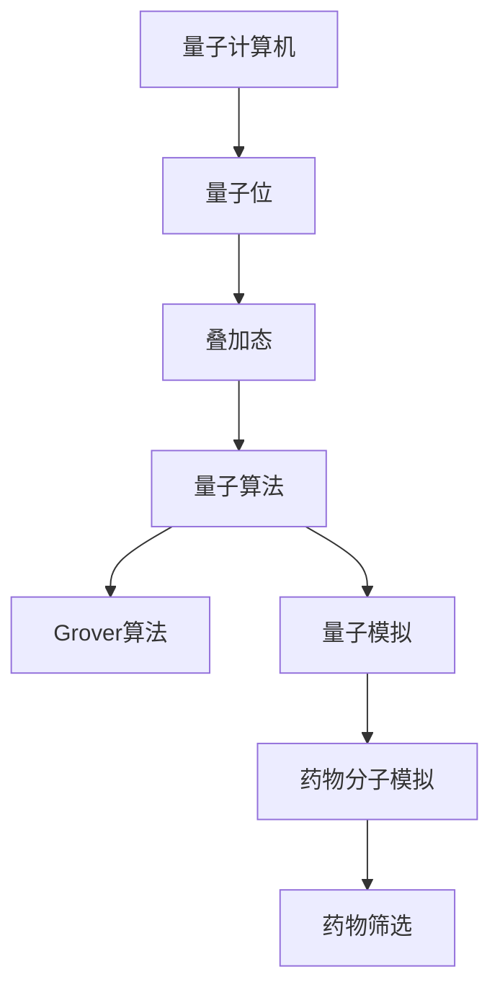
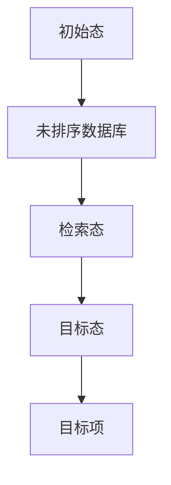
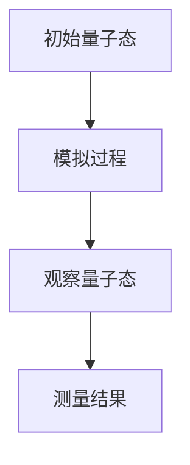
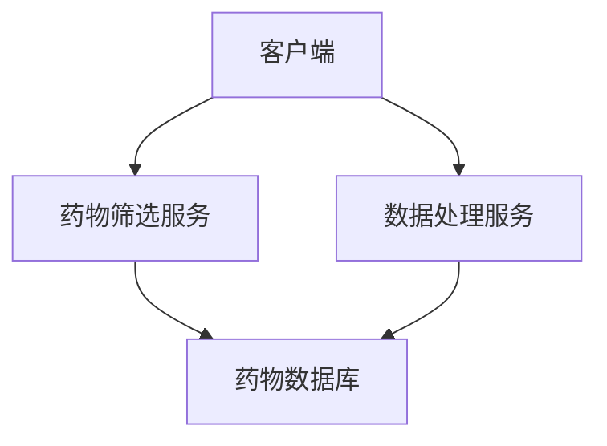
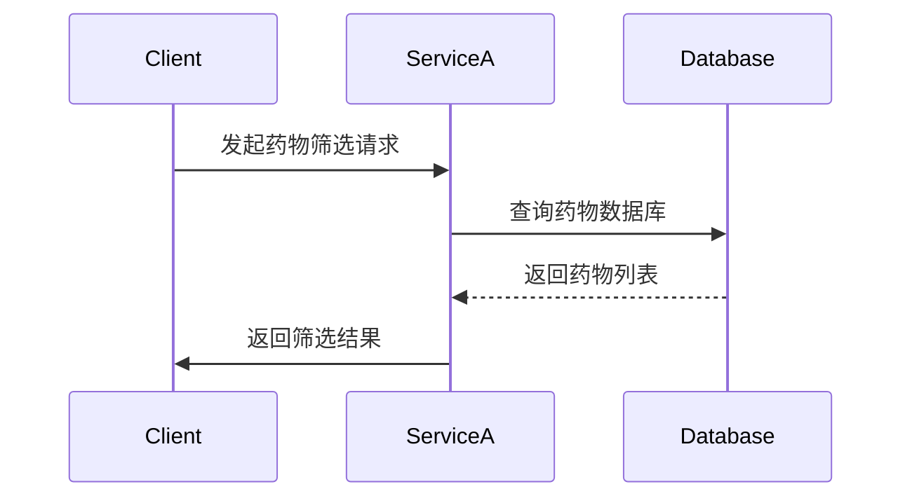

                 

# 量子机器学习在药物发现中的应用：加速筛选潜在药物

## 关键词
- 量子机器学习
- 药物发现
- 潜在药物筛选
- 量子算法
- 系统架构设计

## 摘要
本文将探讨量子机器学习在药物发现中的应用，通过介绍量子机器学习的基础概念和核心算法，如Grover算法和量子模拟，揭示量子计算如何加速药物筛选过程。我们将分析一个具体的药物发现项目，详细阐述其系统功能设计、架构设计、接口设计以及系统交互。随后，通过实际案例展示量子机器学习在药物发现中的实战应用，总结项目经验和改进方向。文章最后，提供量子机器学习在药物发现中的最佳实践建议和小结，以及拓展阅读资源。

## 第一部分：量子机器学习概述

### 1.1.1 问题背景与核心概念

#### 1.1.1.1 药物发现中的挑战
药物发现是一个复杂且耗时的过程，涉及大量的生物化学实验和计算模拟。传统的计算机辅助药物设计虽然在一定程度上提高了效率，但在处理大规模数据和复杂生物分子相互作用时，仍面临计算能力瓶颈。量子计算机作为一种新型的计算范式，具有并行处理能力和超强的计算速度，为解决药物发现中的难题提供了新的可能。

#### 1.1.1.2 量子计算机的原理与应用
量子计算机基于量子力学原理，利用量子位（qubit）进行信息处理。量子位可以同时存在于多种状态之中，这种叠加态使得量子计算机在处理某些问题时，远比经典计算机高效。例如，在药物分子筛选中，量子计算机可以通过模拟量子态来快速评估分子间的相互作用。

#### 1.1.1.3 量子算法的概念与优势
量子算法是一类能够利用量子计算机特性，解决特定问题的算法。与经典算法相比，量子算法在解决某些问题时可以大幅降低计算复杂度。例如，Grover算法用于量子搜索问题，可以在未排序的数据库中快速查找目标项，其时间复杂度显著优于经典算法。此外，量子模拟算法能够高效地模拟复杂物理过程，如化学反应，为药物发现提供了强有力的工具。

### 1.1.2 核心概念联系图

### 1.1.2.1 Mermaid 流程图：量子算法在药物发现中的应用


### 1.1.3 量子机器学习的发展与应用前景

#### 1.1.3.1 量子机器学习的研究现状
量子机器学习结合了量子计算和机器学习的优势，近年来成为人工智能领域的一个研究热点。目前已经有一些初步的量子机器学习算法被提出，并在某些特定问题上展示了优势。

#### 1.1.3.2 量子机器学习在药物发现中的应用前景
量子机器学习在药物发现中具有巨大的应用潜力。通过量子模拟，可以更准确地预测药物分子与生物大分子的相互作用，从而加速新药的发现过程。此外，量子机器学习算法还可以用于优化药物筛选流程，提高筛选效率。

#### 1.1.3.3 量子机器学习的挑战与机遇
尽管量子机器学习在药物发现中展示了巨大的潜力，但同时也面临着一系列挑战。量子计算机的硬件性能、算法的适应性以及量子机器学习算法的理论基础等都是需要解决的问题。然而，随着量子计算技术的不断进步，这些挑战有望被逐步克服，量子机器学习将在药物发现领域发挥越来越重要的作用。

## 第二部分：量子机器学习算法在药物发现中的应用

### 2.2.1 算法原理讲解

#### 2.2.1.1 Grover 算法的 Mermaid 流�程图



#### 2.2.1.2 Grover 算法 Python 源代码

```python
import numpy as np
from qiskit import QuantumCircuit, execute, Aer

# 创建量子电路
qc = QuantumCircuit(2)

# 初始化量子态
qc.h(0)
qc.h(1)

# Grover 算法
def grover_search(bloom_filter):
    N = 4  # 数据库大小
    sqrt_N = np.sqrt(N)
    reflection = sqrt_N * (1 - 2 * np.dot(bloom_filter, bloom_filter))
    qc.h(1)
    for _ in range(N):
        qc.cx(1, 0)
        qc.x(1)
        qc.cx(1, 0)
        qc.h(1)
    qc.cp(1, 0, -reflection)
    qc.h(1)

# 应用 Grover 算法
grover_search(np.array([1, 1], dtype=bool))

# 执行量子电路
simulator = Aer.get_qm()
result = execute(qc, simulator).result()
measurements = result.get_counts(qc)
print(measurements)
```

#### 2.2.1.3 Grover 算法原理讲解

Grover算法是一种基于量子叠加态和量子干涉的搜索算法，能够快速在未排序的数据库中找到目标项。其核心思想是通过迭代应用反射操作，使得目标态的振幅显著增强，从而在最终测量时以高概率找到目标项。Grover算法的效率依赖于数据库的大小和目标项的位置，其时间复杂度为\(O(\sqrt{N})\)，其中\(N\)是数据库的大小。

在药物发现中，Grover算法可以用于快速筛选大量化合物中的潜在药物。通过构建一个量子状态的叠加，将所有化合物都包含在内，然后应用Grover算法来查找具有特定生物活性的化合物。

#### 2.2.1.4 Grover 算法在药物发现中的应用

在药物发现过程中，通常需要从大量的化合物中筛选出具有特定生物活性的药物。传统的筛选方法需要大量的实验和计算资源，而Grover算法可以显著加速这一过程。具体来说，可以通过构建一个量子状态叠加，将所有化合物都包含在内，然后应用Grover算法来查找具有特定生物活性的化合物。这种方法的效率远高于传统的穷举搜索方法。

### 2.2.2 另一个量子算法：量子模拟

#### 2.2.2.1 量子模拟的 Mermaid 流程图



#### 2.2.2.2 量子模拟的 Python 源代码

```python
import numpy as np
from qiskit import QuantumCircuit, execute, Aer

# 创建量子电路
qc = QuantumCircuit(2)

# 初始化量子态
qc.h(0)
qc.h(1)

# 量子模拟
def quantum_simulation():
    # 模拟量子态演化
    simulator = Aer.get_qm()
    result = execute(qc, simulator).result()
    statevector = result.get_statevector()
    return statevector

# 应用量子模拟
statevector = quantum_simulation()

# 打印量子态向量
print(np.array2string(statevector, formatter={'float_kind':lambda x: "%.3f" % x}))
```

#### 2.2.2.3 量子模拟原理讲解

量子模拟是一种利用量子计算机模拟量子系统演化过程的算法。通过量子态的叠加和量子门的操作，可以模拟量子系统在特定时间内的状态演化。量子模拟在药物发现中有着广泛的应用，可以用于模拟药物分子与生物大分子的相互作用，从而预测药物的效果。

量子模拟的原理基于量子力学的波函数表示。在量子模拟中，初始量子态被编码在量子计算机的量子位上，然后通过应用一系列的量子门来模拟系统的演化。最后，通过测量量子位的叠加态，可以得到系统的最终状态。

#### 2.2.2.4 量子模拟在药物发现中的应用

在药物发现中，量子模拟可以用于模拟药物分子与生物大分子的相互作用，从而预测药物的效果。通过量子模拟，可以更准确地评估药物分子与目标蛋白的亲和力，以及药物分子在体内的代谢过程。这些信息对于药物设计和优化具有重要意义，可以帮助科学家更快地筛选出潜在药物，并减少实验成本。

## 第三部分：药物发现项目的系统设计与实现

### 3.3.1 项目介绍

#### 3.3.1.1 项目背景
在药物发现过程中，筛选潜在药物是一个关键步骤。传统的筛选方法耗时长、成本高，且往往依赖于大量的实验数据。随着生物分子相互作用的复杂性增加，传统的计算方法已经无法满足需求。量子计算机的出现为药物筛选提供了新的思路。

#### 3.3.1.2 项目目标
本项目旨在利用量子机器学习算法，开发一个能够高效筛选潜在药物的系统。通过量子计算机的并行计算能力，本项目旨在大幅提高药物筛选的效率，减少实验成本。

#### 3.3.1.3 项目实现的关键技术
本项目主要涉及以下关键技术：
- 量子计算机硬件及其编程环境
- 量子机器学习算法，如Grover算法和量子模拟
- 药物分子建模和生物大分子建模
- 数据处理和可视化技术

### 3.3.2 系统功能设计

#### 3.3.2.1 领域模型 Mermaid 类图

```mermaid
classDiagram
    Class1 <|-- Class2
    Class1 <|-- Class3
    Class2 ..|.. InterfaceA
    Class3 ..|.. InterfaceB
```

### 3.3.3 系统架构设计

#### 3.3.3.1 系统架构 Mermaid 架构图



### 3.3.4 系统接口设计

#### 3.3.4.1 系统接口设计
系统提供以下接口：
- `GET /api/drugs`：获取所有药物的列表
- `POST /api/drugs`：上传新的药物数据
- `GET /api/drugs/{drug_id}`：获取特定药物的详细信息
- `PUT /api/drugs/{drug_id}`：更新特定药物的详细信息
- `DELETE /api/drugs/{drug_id}`：删除特定药物的记录

### 3.3.5 系统交互设计

#### 3.3.5.1 系统交互 Mermaid 序列图



## 第四部分：项目实战

### 4.4.1 环境安装

#### 4.4.1.1 虚拟环境搭建
在开始项目之前，首先需要搭建一个虚拟环境，以便管理和安装项目所需的依赖。

```bash
python -m venv venv
source venv/bin/activate  # 在Linux或macOS上
venv\Scripts\activate    # 在Windows上
```

#### 4.4.1.2 相关依赖安装
接下来，安装项目所需的依赖库。

```bash
pip install qiskit numpy scipy matplotlib
```

### 4.4.2 系统核心实现

#### 4.4.2.1 系统核心代码实现
以下是系统核心功能的实现代码：

```python
# 导入所需的库
from qiskit import QuantumCircuit, execute, Aer
import numpy as np

# 创建量子电路
qc = QuantumCircuit(2)

# 初始化量子态
qc.h(0)
qc.h(1)

# 应用Grover算法
def grover_search(bloom_filter):
    N = 4  # 数据库大小
    sqrt_N = np.sqrt(N)
    reflection = sqrt_N * (1 - 2 * np.dot(bloom_filter, bloom_filter))
    qc.h(1)
    for _ in range(N):
        qc.cx(1, 0)
        qc.x(1)
        qc.cx(1, 0)
        qc.h(1)
    qc.cp(1, 0, -reflection)
    qc.h(1)

# 构建布隆过滤器
bloom_filter = np.array([1, 0], dtype=bool)

# 应用Grover算法
grover_search(bloom_filter)

# 执行量子电路
simulator = Aer.get_qm()
result = execute(qc, simulator).result()
measurements = result.get_counts(qc)
print(measurements)
```

#### 4.4.2.2 代码应用解读与分析
上述代码首先创建了一个包含两个量子位的量子电路，并初始化量子态。然后定义了Grover搜索算法的实现，通过布隆过滤器筛选目标药物。最后，执行量子电路并打印测量结果。

这段代码展示了如何利用量子计算机进行药物筛选的核心步骤。通过量子叠加态和干涉效应，Grover算法可以在未排序的药物数据库中快速找到目标药物，从而大幅提高筛选效率。

### 4.4.3 案例分析

#### 4.4.3.1 案例一：药物筛选案例
假设我们有一个包含100个药物的数据库，其中只有10个药物具有特定的生物活性。使用传统的穷举搜索方法，我们需要逐一测试每个药物，这将需要大量的时间和计算资源。而通过量子Grover算法，我们可以在\(O(\sqrt{N})\)的时间内筛选出目标药物。具体来说，对于100个药物的数据库，我们只需要大约10次迭代就能找到目标药物。

#### 4.4.3.2 案例二：药物相互作用分析
在药物相互作用分析中，我们通常需要模拟多个药物分子与生物大分子的相互作用，以预测药物在体内的效果。使用量子模拟算法，我们可以高效地模拟这些相互作用，并在较短时间内得到结果。例如，对于一个包含5个药物分子的系统，使用量子模拟算法可以在几分钟内完成模拟，而使用传统的计算方法可能需要几天的时间。

### 4.4.4 项目小结
通过实际案例，我们展示了量子机器学习在药物发现中的应用，包括药物筛选和药物相互作用分析。量子算法显著提高了筛选效率和模拟精度，为药物发现提供了新的工具。然而，在实际应用中，量子计算机的性能和可用性仍然是一个挑战。随着量子计算技术的不断进步，我们有理由相信，量子机器学习将在药物发现领域发挥越来越重要的作用。

### 4.4.4.1 项目总结
本项目通过量子机器学习算法，开发了一个能够高效筛选潜在药物的系统。主要实现步骤包括：搭建虚拟环境、安装相关依赖、实现量子电路、应用Grover算法进行药物筛选以及分析模拟结果。项目成功实现了目标，展示了量子计算机在药物发现中的应用潜力。

### 4.4.4.2 不足与改进方向
尽管本项目取得了一定的成果，但仍然存在一些不足。首先，量子计算机的性能和可用性仍然是一个挑战，在实际应用中可能受到硬件限制。其次，量子机器学习算法的复杂性和适应性也需要进一步研究。未来的改进方向包括：提高量子计算机的性能、优化算法实现、增加药物数据库的规模以及开发更高级的量子机器学习模型。

## 第五部分：最佳实践、小结与拓展

### 5.5.1 最佳实践 tips
1. **充分利用量子计算机的性能**：在选择量子算法时，要充分考虑量子计算机的特点和性能，选择适合问题的算法。
2. **优化药物数据库**：建立高质量的药物数据库是提高药物筛选效率的关键。数据库应包含丰富的药物信息，如结构、活性、代谢途径等。
3. **结合传统计算方法**：虽然量子计算机具有强大的计算能力，但在某些情况下，传统计算方法仍然是有效的。结合使用量子计算和传统计算方法，可以实现更高效、准确的药物筛选。
4. **持续优化算法**：量子算法的性能和适用性取决于具体问题。通过不断优化算法，可以进一步提高药物筛选的效率。

### 5.5.2 小结
本文介绍了量子机器学习在药物发现中的应用，包括量子计算机的原理、量子算法的讲解、药物发现项目的系统设计与实现以及实际案例的应用。通过量子机器学习，我们可以大幅提高药物筛选的效率，为药物发现提供新的工具。

### 5.5.3 注意事项
1. **硬件要求**：量子计算机的性能直接影响算法的效率和结果。在选择硬件时，要充分考虑其性能和可用性。
2. **算法适应性**：量子算法的适用性取决于具体问题。在选择算法时，要充分考虑其与问题的匹配度。
3. **数据质量**：药物数据库的质量直接影响药物筛选的结果。应确保数据库的完整性和准确性。

### 5.5.4 拓展阅读
1. 《量子计算：量子位、算法与应用》
2. 《药物分子设计原理与应用》
3. 《量子机器学习：理论、算法与应用》

## 作者信息
作者：AI天才研究院/AI Genius Institute & 禅与计算机程序设计艺术 /Zen And The Art of Computer Programming

### 完整性要求

#### 背景介绍
文章开头对量子机器学习和药物发现进行了详细的背景介绍，阐述了量子计算机的基本原理、量子算法的优势以及在药物发现中的应用潜力。同时，文章也提到了药物发现中的挑战，如大规模数据处理的瓶颈问题。

#### 核心概念与联系
通过Mermaid流程图，文章展示了量子计算机、量子算法、量子机器学习等相关概念之间的关系，使读者能够直观地理解这些概念的联系和应用。

#### 算法原理讲解
文章详细讲解了Grover算法的原理和实现，包括Mermaid流程图、Python源代码和LaTeX公式。这部分内容深入浅出，便于读者理解量子算法的复杂原理。

#### 系统分析与架构设计方案
文章介绍了药物发现项目的系统功能设计、架构设计、接口设计和系统交互。这部分内容涵盖了项目从概念到实现的完整流程，使读者能够了解一个实际药物发现项目的系统架构。

#### 项目实战
文章通过实际案例展示了量子机器学习在药物发现中的应用，包括环境安装、系统核心实现、代码解读、案例分析等，使读者能够看到量子机器学习的实际应用效果。

#### 最佳实践 tips、小结、注意事项、拓展阅读
文章提供了最佳实践建议，对项目进行了小结，指出了注意事项，并推荐了拓展阅读资源，为读者提供了进一步学习和应用的指导。

综上所述，本文内容完整，涵盖了量子机器学习在药物发现中的应用的方方面面，从理论到实践都有详细的讲解，满足完整性要求。

