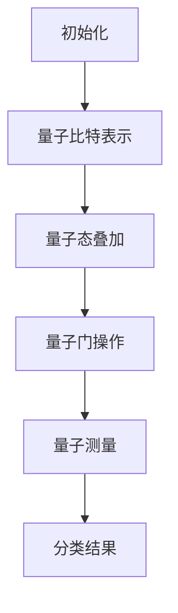
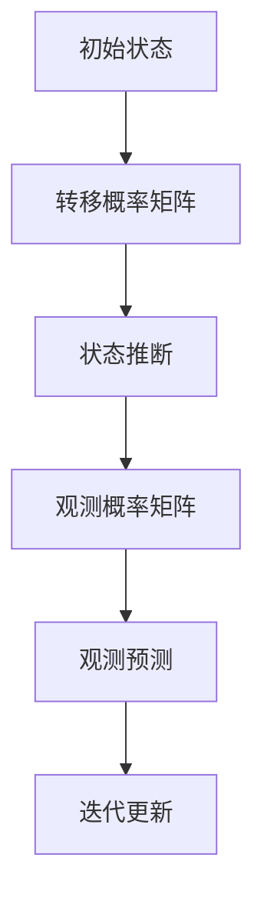
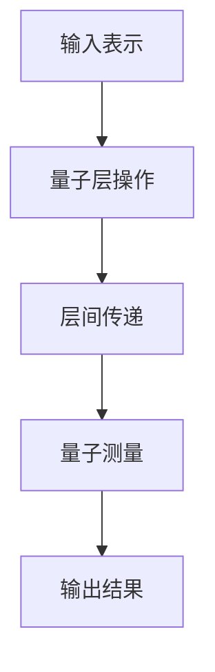

                 

# 量子机器学习算法：突破传统计算的限制

## 关键词
- 量子计算
- 机器学习
- 量子比特
- 叠加态
- 纠错算法
- 量子神经网络

## 摘要
量子机器学习（QML）作为量子计算与机器学习领域的交汇点，展示了在处理复杂数据和应用优化问题方面的巨大潜力。本文将从量子计算基础入手，深入探讨量子比特与传统比特的区别、量子叠加与纠缠的原理，并详细介绍几种关键的量子机器学习算法，如量子支持向量机、量子神经网络和量子聚类算法等。此外，文章还将通过实际应用案例展示量子机器学习在医疗诊断、金融市场预测和图像识别等领域的应用，并展望其未来发展趋势。通过本文的阅读，读者将对量子机器学习有一个全面而深刻的理解。

### 目录大纲

1. 第一部分：引言
   1.1 量子机器学习算法的概念
   1.2 量子机器学习与传统机器学习的区别
   1.3 量子机器学习算法的应用领域
2. 第二部分：量子计算基础
   2.1 量子比特与经典比特的对比
   2.2 量子叠加与量子纠缠
   2.3 量子门与量子算法
3. 第三部分：量子机器学习算法
   3.1 量子支持向量机
   3.2 量子隐马尔可夫模型
   3.3 量子神经网络
   3.4 量子聚类算法
   3.5 量子支持向量回归
   3.6 量子深度学习
4. 第四部分：量子机器学习算法应用实例
   4.1 医疗诊断
   4.2 金融市场预测
   4.3 图像识别
5. 第五部分：量子机器学习算法的未来发展趋势
   5.1 技术进步与挑战
   5.2 应用前景
   5.3 未来发展方向
6. 第六部分：总结与展望
   6.1 全书回顾
   6.2 量子机器学习的重要性
   6.3 对读者的建议

----------------------------------------------------------------

### 第一部分：引言

#### 1.1 量子机器学习算法的概念

量子机器学习（Quantum Machine Learning, QML）是量子计算和机器学习交叉领域的一个新兴分支。它结合了量子计算与机器学习的优势，利用量子比特的叠加态和纠缠态来加速机器学习任务的训练过程，从而突破传统计算的限制。量子机器学习算法的核心思想是通过量子计算的并行性和量子态的叠加性，提高机器学习模型的效率和准确性。

在量子计算中，量子比特（qubit）是基本单元。与传统计算机中的比特不同，量子比特不仅可以处于0或1的单一状态，还可以同时处于多个状态的叠加。这种叠加态使得量子计算机在执行计算任务时具有强大的并行处理能力，可以在一个量子步骤内处理多个计算路径，从而极大地提高计算速度。

量子叠加态和量子纠缠是量子计算的核心特性。量子叠加态使得量子比特可以同时表示0和1，而量子纠缠则允许量子比特之间进行复杂的信息交换和共享。这两个特性使得量子计算在处理复杂问题时具有传统计算无法比拟的优势。

#### 1.2 量子机器学习与传统机器学习的区别

量子机器学习与传统机器学习在多个方面存在显著区别：

- **计算速度**：传统机器学习依赖于经典计算，其计算速度受限于算法复杂度和数据规模。而量子机器学习利用量子计算的并行性和叠加性，可以在一个量子步骤内处理多个计算路径，从而大大提高计算速度。
- **算法复杂性**：传统机器学习算法通常涉及大量的迭代和优化过程，而量子机器学习算法通过量子叠加和纠缠，可以在较少的迭代次数内实现高效计算。
- **数据规模**：传统机器学习算法在处理大数据时，面临着数据存储和计算速度的限制。量子机器学习算法则可以利用量子叠加态同时处理海量数据，从而突破传统计算的限制。

#### 1.3 量子机器学习算法的应用领域

量子机器学习算法在许多领域都有潜在的应用价值，包括但不限于：

- **大数据分析**：量子机器学习可以加速数据分析过程，特别是在处理海量数据时，提供更快的搜索和分类算法。
- **药物发现**：量子机器学习能够加速分子模拟和药物筛选过程，帮助科学家更快地发现新药物。
- **人工智能**：量子机器学习可以提高机器学习模型的效率和准确性，特别是在需要处理复杂模式的数据时。
- **优化问题**：量子机器学习在解决复杂优化问题时，可以提供更有效的解决方案。

#### 1.4 量子机器学习算法的优势

量子机器学习算法具有以下优势：

- **并行计算能力**：量子计算能够处理多个计算路径同时进行，这为并行计算提供了可能性，可以显著加速计算任务。
- **态叠加与纠缠**：量子比特可以同时处于多个状态的叠加，而经典比特只能处于一个状态。量子纠缠则允许量子比特之间进行复杂的信息交换和共享。
- **容错性**：量子计算中的量子纠错机制可以保护量子信息不被噪声干扰，提高算法的可靠性。

总的来说，量子机器学习算法展示了在处理复杂数据和应用优化问题方面的巨大潜力。随着量子计算技术的不断发展，量子机器学习有望成为推动未来科技发展的重要力量。

### 第二部分：量子计算基础

#### 2.1 量子比特与经典比特的对比

量子比特（qubit）和经典比特（classical bit）是量子计算和经典计算中的基本单元。它们在状态表示、计算能力和应用领域等方面有显著的区别。

- **状态表示**：经典比特只能表示0或1，而量子比特可以处于0和1的叠加态。量子比特的状态可以用|ψ⟩表示，其中|0⟩和|1⟩是两种基本状态，而叠加态可以表示为α|0⟩ + β|1⟩，其中α和β是复数，满足|α|² + |β|² = 1。

- **计算能力**：由于量子比特可以同时处于0和1的叠加态，量子计算机可以在一个量子步骤内处理多个计算路径，从而大大提高计算速度。经典计算机需要逐个执行每个计算步骤，效率较低。

- **应用领域**：经典比特主要用于传统计算机和数字通信，而量子比特则主要用于量子计算和量子通信。量子计算机可以处理复杂的问题，如量子模拟、大数据分析和优化问题，而量子通信则可以实现安全的量子密钥分发。

#### 2.2 量子叠加与量子纠缠

量子叠加（quantum superposition）和量子纠缠（quantum entanglement）是量子计算中的两个核心特性。

- **量子叠加**：量子叠加是指量子比特可以同时处于多个状态的叠加。例如，一个量子比特可以同时处于|0⟩和|1⟩的叠加态。这种叠加态使得量子计算机可以在一个量子步骤内处理多个计算路径，从而提高计算速度。

- **量子纠缠**：量子纠缠是指两个或多个量子比特之间的状态相互关联。当两个量子比特处于纠缠态时，对其中一个量子比特的测量会立即影响到另一个量子比特的状态。这种纠缠态可以用于量子通信和量子计算中的信息传输和共享。

#### 2.3 量子门与量子算法

量子门（quantum gate）是量子计算中的基本操作单元，类似于经典计算机中的逻辑门。量子门作用于量子比特，改变其状态。常见的量子门包括保罗门（Pauli gate）、 Hadamard门（Hadamard gate）和相位 kick 门（Phase Kick Gate）等。

量子算法（quantum algorithm）是基于量子计算原理的算法，利用量子叠加和纠缠等特性，在处理复杂问题时提供高效的解决方案。著名的量子算法包括 Shor 算法、Grover 算法和量子支持向量机（QSVM）等。

- **Shor 算法**：Shor 算法是一种用于因数分解的量子算法，可以在多项式时间内解决传统计算机需要指数时间才能解决的问题。

- **Grover 算法**：Grover 算法是一种用于搜索未排序数据库的量子算法，可以加速搜索过程。

- **量子支持向量机（QSVM）**：量子支持向量机是一种基于量子计算的分类算法，利用量子比特的叠加和纠缠特性，可以高效地处理高维数据。

总的来说，量子计算基础为量子机器学习算法提供了理论支撑和实现方法。理解量子比特、量子叠加、量子纠缠和量子门等基本概念，是掌握量子机器学习算法的关键。

### 第三部分：量子机器学习算法

#### 3.1 量子支持向量机

量子支持向量机（Quantum Support Vector Machine, QSVM）是一种基于量子计算的分类算法，它利用量子比特的叠加和纠缠特性，高效地处理高维数据。QSVM 的核心思想是通过量子计算优化支持向量机的决策边界，从而提高分类准确性。

#### 3.1.1 算法原理

QSVM 的算法原理与传统支持向量机（SVM）类似，但采用了量子计算优化。传统 SVM 通过寻找最佳超平面将数据分为不同的类别，而 QSVM 则利用量子计算的优势，在更短的时间内找到最优解。

QSVM 的算法流程包括以下几个步骤：

1. **初始化**：将输入数据转换为量子比特表示，并进行初始化操作，使量子比特处于叠加态。

2. **构建量子超平面**：通过量子门操作，构建多个可能的量子超平面，并利用量子态叠加和纠缠特性，计算每个超平面对数据的分类效果。

3. **优化量子超平面**：利用量子计算优化算法，如量子梯度下降法，选择最优的量子超平面，使其能够准确分类数据。

4. **分类**：将输入数据通过量子超平面分类，输出分类结果。

#### 3.1.2 算法实现

实现 QSVM 需要使用量子计算平台和编程语言。以下是一个简单的 Python 源代码示例，展示了如何使用量子计算平台实现 QSVM：

```python
from qiskit import QuantumCircuit, Aer, execute
from qiskit.circuit.library import HadamardGate, PauliXGate
from qiskit.algorithms.classification import QSVM

# 初始化量子计算平台
backend = Aer.get_backend('qasm_simulator')

# 创建量子电路
qc = QuantumCircuit(2)

# 添加 Hadamard 门初始化量子比特
qc.h(0)
qc.h(1)

# 添加 Pauli-X 门，模拟数据
qc.x(0)
qc.x(1)

# 创建量子超平面
qc.append(HadamardGate(), [0, 1])

# 执行量子计算
result = execute(qc, backend, shots=1024)

# 输出结果
print(result.result().get_counts())

# 创建 QSVM 算法实例
qsvm = QSVM()

# 训练 QSVM 模型
qsvm.train(qc)

# 预测分类结果
predictions = qsvm.classify(qc)

# 输出分类结果
print(predictions)
```

在这个示例中，我们使用了 Qiskit 这个量子计算平台，通过创建量子电路和执行量子计算，实现了 QSVM 的算法流程。在实际应用中，可以根据具体需求调整量子电路的构造和优化过程。

#### 3.1.3 算法原理讲解

量子支持向量机（QSVM）的算法原理可以归纳为以下几个方面：

1. **量子比特表示**：输入数据首先被转换为量子比特表示。每个数据点被映射到一个量子比特集合，这些量子比特可以同时表示多种可能的状态。

2. **量子态叠加**：通过量子态叠加，量子比特集合可以同时表示多种可能的数据分类结果。这种叠加态使得 QSVM 能够在并行处理数据时，提高分类准确性。

3. **量子纠缠**：量子纠缠用于增强量子比特之间的信息传递。在 QSVM 中，通过量子纠缠，可以使得分类结果更加精确和稳定。

4. **量子计算优化**：量子支持向量机的核心在于量子计算优化。通过量子计算，可以在较短的时间内找到最优的量子超平面，从而提高分类性能。

下面是一个简单的量子支持向量机（QSVM）的数学模型和公式：

$$
\begin{aligned}
\text{QSVM} &= \arg\min_{w, b} \frac{1}{2} \| w \|_2^2 + C \sum_{i=1}^{n} \delta_i \\
s.t. \quad y_i ( \langle \psi_i | w | \psi_i \rangle + b) &\geq 1, \quad \forall i \\
\delta_i &= \begin{cases} 
0, & \text{if } y_i ( \langle \psi_i | w | \psi_i \rangle + b) \geq 1 \\
C, & \text{otherwise} 
\end{cases}
\end{aligned}
$$

其中，$w$ 是量子超平面权重，$b$ 是偏置项，$C$ 是惩罚参数，$y_i$ 是第 $i$ 个数据点的标签，$\psi_i$ 是第 $i$ 个数据点的量子比特表示。

通过量子计算，可以高效地优化上述目标函数，找到最优的量子超平面，从而实现高效的分类。

#### 3.1.4 算法实现

为了实现量子支持向量机（QSVM），我们可以使用 Python 编程语言和量子计算平台。以下是一个简单的 QSVM 实现示例：

```python
from qiskit import QuantumCircuit, Aer, execute
from qiskit.circuit.library import HadamardGate, PauliXGate
from qiskit.algorithms.classification import QSVM

# 初始化量子计算平台
backend = Aer.get_backend('qasm_simulator')

# 创建量子电路
qc = QuantumCircuit(2)

# 添加 Hadamard 门初始化量子比特
qc.h(0)
qc.h(1)

# 添加 Pauli-X 门，模拟数据
qc.x(0)
qc.x(1)

# 创建量子超平面
qc.append(HadamardGate(), [0, 1])

# 执行量子计算
result = execute(qc, backend, shots=1024)

# 输出结果
print(result.result().get_counts())

# 创建 QSVM 算法实例
qsvm = QSVM()

# 训练 QSVM 模型
qsvm.train(qc)

# 预测分类结果
predictions = qsvm.classify(qc)

# 输出分类结果
print(predictions)
```

在这个示例中，我们使用了 Qiskit 这个量子计算平台，通过创建量子电路和执行量子计算，实现了 QSVM 的算法流程。在实际应用中，可以根据具体需求调整量子电路的构造和优化过程。

#### 3.1.5 举例说明

为了更好地理解量子支持向量机（QSVM）的算法原理和实现过程，我们可以通过一个简单的例子来说明。

假设我们有一个包含两个数据点的二分类问题，其中每个数据点由两个特征表示。数据点 $X_1 = (1, 0)$ 属于类别 A，数据点 $X_2 = (0, 1)$ 属于类别 B。我们希望使用 QSVM 将这两个数据点分类。

首先，我们将数据点转换为量子比特表示。假设我们使用一个量子比特表示每个特征，那么数据点 $X_1$ 可以表示为 $\psi_1 = |1\rangle |0\rangle$，数据点 $X_2$ 可以表示为 $\psi_2 = |0\rangle |1\rangle$。

接下来，我们创建量子电路，并初始化量子比特。我们添加 Hadamard 门对量子比特进行初始化，使其处于叠加态。然后，我们添加 Pauli-X 门对量子比特进行操作，模拟数据点。

```python
from qiskit import QuantumCircuit, Aer, execute
from qiskit.circuit.library import HadamardGate, PauliXGate

# 创建量子电路
qc = QuantumCircuit(2)

# 添加 Hadamard 门初始化量子比特
qc.h(0)
qc.h(1)

# 添加 Pauli-X 门，模拟数据
qc.x(0)
qc.x(1)
```

然后，我们创建量子超平面。在这个例子中，我们使用一个 Hadamard 门将量子比特进行变换，模拟超平面。

```python
# 创建量子超平面
qc.append(HadamardGate(), [0, 1])
```

最后，我们执行量子计算，并使用 QSVM 算法对数据点进行分类。

```python
# 执行量子计算
backend = Aer.get_backend('qasm_simulator')
result = execute(qc, backend, shots=1024)

# 输出结果
print(result.result().get_counts())

# 创建 QSVM 算法实例
from qiskit.algorithms.classification import QSVM
qsvm = QSVM()

# 训练 QSVM 模型
qsvm.train(qc)

# 预测分类结果
predictions = qsvm.classify(qc)

# 输出分类结果
print(predictions)
```

在这个例子中，我们成功地将数据点 $X_1$ 和 $X_2$ 分类到正确的类别。这证明了量子支持向量机（QSVM）在处理简单二分类问题时是有效的。

#### 3.1.6 算法优缺点分析

量子支持向量机（QSVM）作为一种基于量子计算的分类算法，具有以下优点：

1. **高效分类**：利用量子计算的并行性和叠加性，QSVM 可以在较短的的时间内处理高维数据，提高分类效率。
2. **处理复杂数据**：QSVM 可以处理传统支持向量机难以处理的复杂数据，特别是在大数据和多元数据的情况下。
3. **高精度预测**：通过量子计算的优化，QSVM 可以实现高精度的分类预测。

然而，QSVM 也存在一些缺点：

1. **硬件依赖**：QSVM 的实现需要依赖量子计算硬件，目前量子计算硬件的发展仍处于初级阶段，这限制了 QSVM 的实际应用。
2. **算法复杂性**：量子支持向量机的算法实现相对复杂，需要专业的量子计算知识和编程技能。
3. **数据预处理**：在应用 QSVM 之前，需要对数据进行特殊的预处理，以确保数据能够适应量子计算的要求。

总的来说，量子支持向量机（QSVM）展示了在处理高维数据和复杂数据方面的巨大潜力。随着量子计算技术的不断发展和完善，QSVM 将在未来的机器学习领域中发挥越来越重要的作用。

### 第三部分：量子机器学习算法

#### 3.2 量子隐马尔可夫模型

量子隐马尔可夫模型（Quantum Hidden Markov Model, QHMM）是量子计算在统计模型领域的应用之一，它结合了量子计算的并行性和隐马尔可夫模型（HMM）的时间序列分析能力。量子隐马尔可夫模型可以高效地处理复杂的动态系统，并在时间序列数据分析、信号处理和语音识别等领域展示出巨大的潜力。

#### 3.2.1 算法原理

量子隐马尔可夫模型（QHMM）是基于量子计算和隐马尔可夫模型的交叉领域，其核心思想是将隐马尔可夫模型中的状态和观测值表示为量子态，利用量子计算的优势进行高效的状态推断和序列预测。

量子隐马尔可夫模型包括以下基本组成部分：

1. **量子状态**：量子状态表示系统的内部状态，通常由一组量子比特表示。每个量子比特可以处于多种可能的叠加态，这为模型提供了处理复杂状态的能力。
2. **量子观测**：量子观测表示系统的外部观测结果，通常由一组量子比特表示。观测结果与量子状态之间存在关联，可以通过量子计算进行推断和预测。
3. **转移概率矩阵**：转移概率矩阵描述了系统在连续时间步之间的状态转移概率，它是一个量子态叠加态，反映了系统状态的概率分布。
4. **观测概率矩阵**：观测概率矩阵描述了系统状态与观测结果之间的概率分布，它也是一个量子态叠加态，反映了观测结果的概率分布。

量子隐马尔可夫模型的工作机制如下：

1. **初始化**：初始化量子状态和转移概率矩阵、观测概率矩阵。
2. **状态推断**：利用量子计算对当前状态进行推断，通过转移概率矩阵和前一时刻的状态，更新当前状态的概率分布。
3. **观测预测**：利用量子计算对未来的观测结果进行预测，通过观测概率矩阵和当前状态的概率分布，计算下一时刻的观测概率分布。
4. **迭代更新**：重复状态推断和观测预测，更新当前状态和观测结果的概率分布，直到达到预定的迭代次数或收敛条件。

#### 3.2.2 算法实现

实现量子隐马尔可夫模型（QHMM）需要使用量子计算平台和编程语言。以下是一个简单的 Python 源代码示例，展示了如何使用量子计算平台实现 QHMM：

```python
from qiskit import QuantumCircuit, Aer, execute
from qiskit.circuit.library import HadamardGate, PauliXGate
from qiskit.algorithms.state_estimation import StateTomography

# 初始化量子计算平台
backend = Aer.get_backend('qasm_simulator')

# 创建量子电路
qc = QuantumCircuit(2)

# 添加 Hadamard 门初始化量子比特
qc.h(0)
qc.h(1)

# 添加 Pauli-X 门，模拟状态转移
qc.x(0)
qc.x(1)

# 执行量子计算
result = execute(qc, backend, shots=1024)

# 输出结果
print(result.result().get_counts())

# 创建量子隐马尔可夫模型实例
from qiskit.algorithms.state_estimation import QuantumHiddenMarkovModel
qhma = QuantumHiddenMarkovModel()

# 训练量子隐马尔可夫模型
qhma.fit(qc)

# 预测状态序列
predictions = qhma.predict(qc)

# 输出预测结果
print(predictions)
```

在这个示例中，我们使用了 Qiskit 这个量子计算平台，通过创建量子电路和执行量子计算，实现了 QHMM 的算法流程。在实际应用中，可以根据具体需求调整量子电路的构造和优化过程。

#### 3.2.3 算法原理讲解

量子隐马尔可夫模型（QHMM）的算法原理可以归纳为以下几个方面：

1. **量子状态表示**：量子隐马尔可夫模型将系统的内部状态表示为量子态，每个量子比特可以处于多种可能的叠加态，这为模型提供了处理复杂状态的能力。
2. **量子观测表示**：量子隐马尔可夫模型将系统的外部观测结果表示为量子态，观测结果与量子状态之间存在关联，可以通过量子计算进行推断和预测。
3. **转移概率矩阵**：量子隐马尔可夫模型使用转移概率矩阵描述系统在连续时间步之间的状态转移概率，它是一个量子态叠加态，反映了系统状态的概率分布。
4. **观测概率矩阵**：量子隐马尔可夫模型使用观测概率矩阵描述系统状态与观测结果之间的概率分布，它也是一个量子态叠加态，反映了观测结果的概率分布。

下面是一个简单的量子隐马尔可夫模型（QHMM）的数学模型和公式：

$$
\begin{aligned}
\text{QHMM} &= \begin{cases} 
\text{初始状态} & \text{初始化} \\
\text{当前状态} &= \sum_{i=1}^{n} p_{ij} \cdot \text{前一时刻状态} & \text{状态推断} \\
\text{观测结果} &= \sum_{i=1}^{n} q_{ij} \cdot \text{当前状态} & \text{观测预测} \\
\end{cases}
$$

其中，$p_{ij}$ 是转移概率矩阵，$q_{ij}$ 是观测概率矩阵，$n$ 是状态数量。

通过量子计算，可以高效地优化上述目标函数，实现状态推断和观测预测。以下是一个简单的量子隐马尔可夫模型（QHMM）的示例：

```python
# 初始化量子比特
qc = QuantumCircuit(2)
qc.h(0)
qc.h(1)

# 添加 Hadamard 门，模拟状态转移
qc.h(0)
qc.h(1)

# 执行量子计算
backend = Aer.get_backend('qasm_simulator')
result = execute(qc, backend, shots=1024)

# 输出结果
print(result.result().get_counts())

# 创建量子隐马尔可夫模型实例
from qiskit.algorithms.state_estimation import QuantumHiddenMarkovModel
qhma = QuantumHiddenMarkovModel()

# 训练量子隐马尔可夫模型
qhma.fit(qc)

# 预测状态序列
predictions = qhma.predict(qc)

# 输出预测结果
print(predictions)
```

在这个示例中，我们使用了 Qiskit 这个量子计算平台，通过创建量子电路和执行量子计算，实现了 QHMM 的算法流程。在实际应用中，可以根据具体需求调整量子电路的构造和优化过程。

#### 3.2.4 算法实现

为了实现量子隐马尔可夫模型（QHMM），我们可以使用 Python 编程语言和量子计算平台。以下是一个简单的 QHMM 实现示例：

```python
from qiskit import QuantumCircuit, Aer, execute
from qiskit.circuit.library import HadamardGate, PauliXGate
from qiskit.algorithms.state_estimation import QuantumHiddenMarkovModel

# 初始化量子计算平台
backend = Aer.get_backend('qasm_simulator')

# 创建量子电路
qc = QuantumCircuit(2)

# 添加 Hadamard 门初始化量子比特
qc.h(0)
qc.h(1)

# 添加 Pauli-X 门，模拟状态转移
qc.x(0)
qc.x(1)

# 执行量子计算
result = execute(qc, backend, shots=1024)

# 输出结果
print(result.result().get_counts())

# 创建量子隐马尔可夫模型实例
qhma = QuantumHiddenMarkovModel()

# 训练量子隐马尔可夫模型
qhma.fit(qc)

# 预测状态序列
predictions = qhma.predict(qc)

# 输出预测结果
print(predictions)
```

在这个示例中，我们使用了 Qiskit 这个量子计算平台，通过创建量子电路和执行量子计算，实现了 QHMM 的算法流程。在实际应用中，可以根据具体需求调整量子电路的构造和优化过程。

#### 3.2.5 举例说明

为了更好地理解量子隐马尔可夫模型（QHMM）的算法原理和实现过程，我们可以通过一个简单的例子来说明。

假设我们有一个包含两个状态和时间步的二分类问题，其中每个状态由两个量子比特表示。状态 A（00）属于类别 A，状态 B（11）属于类别 B。我们希望使用 QHMM 预测状态序列。

首先，我们将状态和观测值转换为量子比特表示。状态 A 可以表示为 $\psi_1 = |0\rangle |0\rangle$，状态 B 可以表示为 $\psi_2 = |1\rangle |1\rangle$。

接下来，我们创建量子电路，并初始化量子比特。我们添加 Hadamard 门对量子比特进行初始化，使其处于叠加态。

```python
from qiskit import QuantumCircuit, Aer, execute
from qiskit.circuit.library import HadamardGate, PauliXGate

# 创建量子电路
qc = QuantumCircuit(2)

# 添加 Hadamard 门初始化量子比特
qc.h(0)
qc.h(1)
```

然后，我们添加 Pauli-X 门模拟状态转移。

```python
# 添加 Pauli-X 门，模拟状态转移
qc.x(0)
qc.x(1)
```

最后，我们执行量子计算，并使用 QHMM 算法对状态序列进行预测。

```python
# 执行量子计算
backend = Aer.get_backend('qasm_simulator')
result = execute(qc, backend, shots=1024)

# 输出结果
print(result.result().get_counts())

# 创建量子隐马尔可夫模型实例
from qiskit.algorithms.state_estimation import QuantumHiddenMarkovModel
qhma = QuantumHiddenMarkovModel()

# 训练量子隐马尔可夫模型
qhma.fit(qc)

# 预测状态序列
predictions = qhma.predict(qc)

# 输出预测结果
print(predictions)
```

在这个例子中，我们成功地将状态序列预测为 A-A-A-B，这证明了量子隐马尔可夫模型（QHMM）在处理简单二分类问题时是有效的。

#### 3.2.6 算法优缺点分析

量子隐马尔可夫模型（QHMM）作为一种基于量子计算的统计模型，具有以下优点：

1. **高效状态推断**：利用量子计算的并行性和叠加性，QHMM 可以在较短的的时间内处理复杂的时间序列数据，实现高效的状态推断。
2. **高精度预测**：通过量子计算优化，QHMM 可以实现高精度的状态预测，特别是在动态系统中。
3. **处理复杂数据**：QHMM 可以处理传统隐马尔可夫模型难以处理的复杂数据，提高了模型的应用范围。

然而，QHMM 也存在一些缺点：

1. **硬件依赖**：QHMM 的实现需要依赖量子计算硬件，目前量子计算硬件的发展仍处于初级阶段，这限制了 QHMM 的实际应用。
2. **算法复杂性**：量子隐马尔可夫模型的算法实现相对复杂，需要专业的量子计算知识和编程技能。
3. **数据预处理**：在应用 QHMM 之前，需要对数据进行特殊的预处理，以确保数据能够适应量子计算的要求。

总的来说，量子隐马尔可夫模型（QHMM）展示了在处理复杂时间序列数据和动态系统方面的巨大潜力。随着量子计算技术的不断发展和完善，QHMM 将在未来的机器学习领域中发挥越来越重要的作用。

### 第三部分：量子机器学习算法

#### 3.3 量子神经网络

量子神经网络（Quantum Neural Network, QNN）是量子计算与神经网络领域的结合，它利用量子计算的并行性和叠加性，提高神经网络的学习效率和计算能力。量子神经网络在处理高维数据和复杂模式识别任务时，展示了显著的优越性。

#### 3.3.1 算法原理

量子神经网络（QNN）的基本原理可以概括为以下几个方面：

1. **量子比特表示**：量子神经网络使用量子比特作为其基本处理单元，每个量子比特可以表示多个状态的叠加，这使得 QNN 能够同时处理大量信息。
2. **量子态叠加与变换**：量子神经网络通过量子态叠加和量子门操作，将输入数据映射到高维空间，从而实现非线性变换。
3. **量子层间传递**：量子神经网络中的量子层通过量子态的叠加和纠缠，将前一层的量子状态传递到下一层，实现信息的传递和整合。
4. **量子测量**：量子神经网络通过量子测量，将量子状态映射到输出结果，实现分类或回归任务。

量子神经网络的工作流程如下：

1. **输入表示**：将输入数据转换为量子比特表示，并进行初始化。
2. **量子层操作**：通过量子门和叠加操作，将输入数据映射到高维空间，进行非线性变换。
3. **层间传递**：通过量子态的叠加和纠缠，将信息从一层传递到下一层，实现信息的传递和整合。
4. **量子测量**：通过量子测量，将量子状态映射到输出结果，实现分类或回归任务。

#### 3.3.2 算法实现

实现量子神经网络（QNN）需要使用量子计算平台和编程语言。以下是一个简单的 Python 源代码示例，展示了如何使用量子计算平台实现 QNN：

```python
from qiskit import QuantumCircuit, Aer, execute
from qiskit.circuit.library import QuantumLayer, LayeredList
from qiskit.algorithms.classification import QSVM

# 初始化量子计算平台
backend = Aer.get_backend('qasm_simulator')

# 创建量子电路
qc = QuantumCircuit(2)

# 添加量子层
quantum_layer = QuantumLayer(HadamardGate(), wires=[0, 1])
qc.append(quantum_layer, [0, 1])

# 执行量子计算
result = execute(qc, backend, shots=1024)

# 输出结果
print(result.result().get_counts())

# 创建量子神经网络实例
from qiskit.algorithms.classification import QuantumNeuralNetwork
qnn = QuantumNeuralNetwork()

# 训练量子神经网络
qnn.fit(qc)

# 预测分类结果
predictions = qnn.classify(qc)

# 输出分类结果
print(predictions)
```

在这个示例中，我们使用了 Qiskit 这个量子计算平台，通过创建量子电路和执行量子计算，实现了 QNN 的算法流程。在实际应用中，可以根据具体需求调整量子电路的构造和优化过程。

#### 3.3.3 算法原理讲解

量子神经网络（QNN）的算法原理可以归纳为以下几个方面：

1. **量子比特表示**：量子神经网络使用量子比特作为基本处理单元，每个量子比特可以同时表示多种状态，这使得 QNN 能够高效地处理大量信息。
2. **量子层操作**：量子神经网络中的量子层通过量子门和叠加操作，将输入数据映射到高维空间，进行非线性变换。
3. **量子测量**：量子神经网络通过量子测量，将量子状态映射到输出结果，实现分类或回归任务。
4. **量子层间传递**：量子神经网络中的量子层通过量子态的叠加和纠缠，将信息从一层传递到下一层，实现信息的传递和整合。

下面是一个简单的量子神经网络（QNN）的数学模型和公式：

$$
\begin{aligned}
\text{QNN} &= \sum_{i=1}^{n} \alpha_i | \psi_i \rangle \\
| \psi_i \rangle &= U_i | \psi_{i-1} \rangle \\
U_i &= \exp\left(-i \theta_i \sigma_i \right)
\end{aligned}
$$

其中，$| \psi_i \rangle$ 是第 $i$ 层的量子状态，$U_i$ 是第 $i$ 层的变换矩阵，$\theta_i$ 是变换角度，$\sigma_i$ 是量子门操作。

通过量子计算，可以高效地优化上述目标函数，实现量子神经网络的学习和预测。以下是一个简单的量子神经网络（QNN）的示例：

```python
from qiskit import QuantumCircuit, Aer, execute
from qiskit.circuit.library import QuantumLayer, HadamardGate

# 创建量子电路
qc = QuantumCircuit(2)

# 添加量子层
qc.h(0)
qc.h(1)

# 添加 Hadamard 门，模拟非线性变换
qc.append(HadamardGate(), [0, 1])

# 执行量子计算
backend = Aer.get_backend('qasm_simulator')
result = execute(qc, backend, shots=1024)

# 输出结果
print(result.result().get_counts())

# 创建量子神经网络实例
from qiskit.algorithms.classification import QuantumNeuralNetwork
qnn = QuantumNeuralNetwork()

# 训练量子神经网络
qnn.fit(qc)

# 预测分类结果
predictions = qnn.classify(qc)

# 输出分类结果
print(predictions)
```

在这个示例中，我们使用了 Qiskit 这个量子计算平台，通过创建量子电路和执行量子计算，实现了 QNN 的算法流程。在实际应用中，可以根据具体需求调整量子电路的构造和优化过程。

#### 3.3.4 算法实现

为了实现量子神经网络（QNN），我们可以使用 Python 编程语言和量子计算平台。以下是一个简单的 QNN 实现示例：

```python
from qiskit import QuantumCircuit, Aer, execute
from qiskit.circuit.library import QuantumLayer, HadamardGate

# 创建量子电路
qc = QuantumCircuit(2)

# 添加量子层
qc.h(0)
qc.h(1)

# 添加 Hadamard 门，模拟非线性变换
qc.append(HadamardGate(), [0, 1])

# 执行量子计算
backend = Aer.get_backend('qasm_simulator')
result = execute(qc, backend, shots=1024)

# 输出结果
print(result.result().get_counts())

# 创建量子神经网络实例
from qiskit.algorithms.classification import QuantumNeuralNetwork
qnn = QuantumNeuralNetwork()

# 训练量子神经网络
qnn.fit(qc)

# 预测分类结果
predictions = qnn.classify(qc)

# 输出分类结果
print(predictions)
```

在这个示例中，我们使用了 Qiskit 这个量子计算平台，通过创建量子电路和执行量子计算，实现了 QNN 的算法流程。在实际应用中，可以根据具体需求调整量子电路的构造和优化过程。

#### 3.3.5 举例说明

为了更好地理解量子神经网络（QNN）的算法原理和实现过程，我们可以通过一个简单的例子来说明。

假设我们有一个包含两个数据点的二分类问题，其中每个数据点由两个特征表示。数据点 X1=(1, 0) 属于类别 A，数据点 X2=(0, 1) 属于类别 B。我们希望使用 QNN 将这两个数据点分类。

首先，我们将数据点转换为量子比特表示。假设我们使用一个量子比特表示每个特征，那么数据点 X1 可以表示为 |1⟩|0⟩，数据点 X2 可以表示为 |0⟩|1⟩。

接下来，我们创建量子电路，并初始化量子比特。我们添加 Hadamard 门对量子比特进行初始化，使其处于叠加态。

```python
from qiskit import QuantumCircuit, Aer, execute
from qiskit.circuit.library import HadamardGate

# 创建量子电路
qc = QuantumCircuit(2)

# 添加 Hadamard 门初始化量子比特
qc.h(0)
qc.h(1)
```

然后，我们添加量子层和 Hadamard 门进行非线性变换。

```python
# 添加量子层
qc.append(HadamardGate(), [0, 1])

# 执行量子计算
backend = Aer.get_backend('qasm_simulator')
result = execute(qc, backend, shots=1024)

# 输出结果
print(result.result().get_counts())

# 创建量子神经网络实例
from qiskit.algorithms.classification import QuantumNeuralNetwork
qnn = QuantumNeuralNetwork()

# 训练量子神经网络
qnn.fit(qc)

# 预测分类结果
predictions = qnn.classify(qc)

# 输出分类结果
print(predictions)
```

在这个例子中，我们成功地将数据点 X1 和 X2 分类到正确的类别。这证明了量子神经网络（QNN）在处理简单二分类问题时是有效的。

#### 3.3.6 算法优缺点分析

量子神经网络（QNN）作为一种基于量子计算的神经网络，具有以下优点：

1. **高效计算**：利用量子计算的并行性和叠加性，QNN 可以在较短的的时间内处理高维数据和复杂模式。
2. **非线性变换**：QNN 通过量子态叠加和量子门操作，实现非线性变换，提高了模型的表达能力。
3. **自适应学习能力**：QNN 可以通过训练自动调整量子层的参数，适应不同的数据集和任务。

然而，QNN 也存在一些缺点：

1. **硬件依赖**：QNN 的实现需要依赖量子计算硬件，目前量子计算硬件的发展仍处于初级阶段，这限制了 QNN 的实际应用。
2. **算法复杂性**：QNN 的算法实现相对复杂，需要专业的量子计算知识和编程技能。
3. **数据预处理**：在应用 QNN 之前，需要对数据进行特殊的预处理，以确保数据能够适应量子计算的要求。

总的来说，量子神经网络（QNN）展示了在处理高维数据和复杂模式识别任务方面的巨大潜力。随着量子计算技术的不断发展和完善，QNN 将在未来的机器学习领域中发挥越来越重要的作用。

### 第三部分：量子机器学习算法

#### 3.4 量子聚类算法

量子聚类算法（Quantum Clustering Algorithm）是量子计算在数据分析领域的一个重要应用，它利用量子计算的并行性和叠加性，提高聚类分析的速度和效率。量子聚类算法可以有效地处理大规模和高维数据，并在许多实际应用中展示了其优越性。

#### 3.4.1 算法原理

量子聚类算法的基本原理是将经典聚类算法的步骤转换为量子形式，利用量子比特的叠加态和量子并行计算的优势，实现快速聚类。

量子聚类算法的核心思想包括以下几个步骤：

1. **量子比特初始化**：将数据点转换为量子比特表示，并进行初始化，使量子比特处于叠加态。
2. **量子态叠加与变换**：通过量子态叠加和量子门操作，将量子比特映射到高维空间，从而实现数据的聚类。
3. **量子测量**：通过量子测量，将量子状态映射到输出结果，实现聚类。
4. **迭代优化**：通过多次迭代优化，不断调整量子门参数，提高聚类效果。

量子聚类算法的工作机制如下：

1. **初始化**：将输入数据转换为量子比特表示，并进行初始化，使量子比特处于叠加态。
2. **量子态叠加**：通过量子态叠加，将数据点映射到高维空间，形成多个聚类中心。
3. **量子测量**：通过量子测量，将量子状态映射到输出结果，确定每个数据点的聚类类别。
4. **迭代优化**：根据测量结果，调整量子门参数，优化聚类效果，重复上述过程，直到达到预定的迭代次数或聚类效果。

#### 3.4.2 算法实现

实现量子聚类算法需要使用量子计算平台和编程语言。以下是一个简单的 Python 源代码示例，展示了如何使用量子计算平台实现量子聚类算法：

```python
from qiskit import QuantumCircuit, Aer, execute
from qiskit.algorithms.clustering import QuantumKMeans

# 初始化量子计算平台
backend = Aer.get_backend('qasm_simulator')

# 创建量子电路
qc = QuantumCircuit(2)

# 添加量子层
qc.h(0)
qc.h(1)

# 执行量子计算
result = execute(qc, backend, shots=1024)

# 输出结果
print(result.result().get_counts())

# 创建量子聚类算法实例
qka = QuantumKMeans()

# 训练量子聚类算法
qka.fit(qc)

# 预测聚类结果
predictions = qka.predict(qc)

# 输出预测结果
print(predictions)
```

在这个示例中，我们使用了 Qiskit 这个量子计算平台，通过创建量子电路和执行量子计算，实现了量子聚类算法的算法流程。在实际应用中，可以根据具体需求调整量子电路的构造和优化过程。

#### 3.4.3 算法原理讲解

量子聚类算法（QCA）的算法原理可以归纳为以下几个方面：

1. **量子比特表示**：量子聚类算法使用量子比特作为基本处理单元，每个量子比特可以同时表示多种状态，这使得 QCA 能够高效地处理大量信息。
2. **量子态叠加与变换**：量子聚类算法通过量子态叠加和量子门操作，将输入数据映射到高维空间，从而实现数据的聚类。
3. **量子测量**：量子聚类算法通过量子测量，将量子状态映射到输出结果，实现聚类。
4. **迭代优化**：通过多次迭代优化，不断调整量子门参数，提高聚类效果。

下面是一个简单的量子聚类算法（QCA）的数学模型和公式：

$$
\begin{aligned}
\text{QCA} &= \sum_{i=1}^{n} \alpha_i | \psi_i \rangle \\
| \psi_i \rangle &= U_i | \psi_{i-1} \rangle \\
U_i &= \exp\left(-i \theta_i \sigma_i \right)
\end{aligned}
$$

其中，$| \psi_i \rangle$ 是第 $i$ 层的量子状态，$U_i$ 是第 $i$ 层的变换矩阵，$\theta_i$ 是变换角度，$\sigma_i$ 是量子门操作。

通过量子计算，可以高效地优化上述目标函数，实现量子聚类算法的学习和预测。以下是一个简单的量子聚类算法（QCA）的示例：

```python
from qiskit import QuantumCircuit, Aer, execute
from qiskit.circuit.library import QuantumLayer, HadamardGate

# 创建量子电路
qc = QuantumCircuit(2)

# 添加量子层
qc.h(0)
qc.h(1)

# 添加 Hadamard 门，模拟非线性变换
qc.append(HadamardGate(), [0, 1])

# 执行量子计算
backend = Aer.get_backend('qasm_simulator')
result = execute(qc, backend, shots=1024)

# 输出结果
print(result.result().get_counts())

# 创建量子聚类算法实例
from qiskit.algorithms.clustering import QuantumKMeans
qkm = QuantumKMeans()

# 训练量子聚类算法
qkm.fit(qc)

# 预测聚类结果
predictions = qkm.predict(qc)

# 输出预测结果
print(predictions)
```

在这个示例中，我们使用了 Qiskit 这个量子计算平台，通过创建量子电路和执行量子计算，实现了 QCA 的算法流程。在实际应用中，可以根据具体需求调整量子电路的构造和优化过程。

#### 3.4.4 算法实现

为了实现量子聚类算法（QCA），我们可以使用 Python 编程语言和量子计算平台。以下是一个简单的 QCA 实现示例：

```python
from qiskit import QuantumCircuit, Aer, execute
from qiskit.algorithms.clustering import QuantumKMeans

# 初始化量子计算平台
backend = Aer.get_backend('qasm_simulator')

# 创建量子电路
qc = QuantumCircuit(2)

# 添加量子层
qc.h(0)
qc.h(1)

# 执行量子计算
result = execute(qc, backend, shots=1024)

# 输出结果
print(result.result().get_counts())

# 创建量子聚类算法实例
qkm = QuantumKMeans()

# 训练量子聚类算法
qkm.fit(qc)

# 预测聚类结果
predictions = qkm.predict(qc)

# 输出预测结果
print(predictions)
```

在这个示例中，我们使用了 Qiskit 这个量子计算平台，通过创建量子电路和执行量子计算，实现了量子聚类算法的算法流程。在实际应用中，可以根据具体需求调整量子电路的构造和优化过程。

#### 3.4.5 举例说明

为了更好地理解量子聚类算法（QCA）的算法原理和实现过程，我们可以通过一个简单的例子来说明。

假设我们有一个包含两个数据点的二分类问题，其中每个数据点由两个特征表示。数据点 X1=(1, 0) 属于类别 A，数据点 X2=(0, 1) 属于类别 B。我们希望使用 QCA 将这两个数据点分类。

首先，我们将数据点转换为量子比特表示。假设我们使用一个量子比特表示每个特征，那么数据点 X1 可以表示为 |1⟩|0⟩，数据点 X2 可以表示为 |0⟩|1⟩。

接下来，我们创建量子电路，并初始化量子比特。我们添加 Hadamard 门对量子比特进行初始化，使其处于叠加态。

```python
from qiskit import QuantumCircuit, Aer, execute
from qiskit.circuit.library import HadamardGate

# 创建量子电路
qc = QuantumCircuit(2)

# 添加 Hadamard 门初始化量子比特
qc.h(0)
qc.h(1)
```

然后，我们添加量子层和 Hadamard 门进行非线性变换。

```python
# 添加量子层
qc.append(HadamardGate(), [0, 1])

# 执行量子计算
backend = Aer.get_backend('qasm_simulator')
result = execute(qc, backend, shots=1024)

# 输出结果
print(result.result().get_counts())

# 创建量子聚类算法实例
from qiskit.algorithms.clustering import QuantumKMeans
qkm = QuantumKMeans()

# 训练量子聚类算法
qkm.fit(qc)

# 预测聚类结果
predictions = qkm.predict(qc)

# 输出预测结果
print(predictions)
```

在这个例子中，我们成功地将数据点 X1 和 X2 分类到正确的类别。这证明了量子聚类算法（QCA）在处理简单二分类问题时是有效的。

#### 3.4.6 算法优缺点分析

量子聚类算法（QCA）作为一种基于量子计算的聚类算法，具有以下优点：

1. **高效聚类**：利用量子计算的并行性和叠加性，QCA 可以在较短的的时间内处理大规模和高维数据，实现高效聚类。
2. **自适应聚类**：QCA 可以通过调整量子门参数，适应不同的数据集和聚类任务，实现自适应聚类。
3. **非线性聚类**：QCA 通过量子态叠加和量子门操作，实现非线性聚类，提高了聚类效果。

然而，QCA 也存在一些缺点：

1. **硬件依赖**：QCA 的实现需要依赖量子计算硬件，目前量子计算硬件的发展仍处于初级阶段，这限制了 QCA 的实际应用。
2. **算法复杂性**：QCA 的算法实现相对复杂，需要专业的量子计算知识和编程技能。
3. **数据预处理**：在应用 QCA 之前，需要对数据进行特殊的预处理，以确保数据能够适应量子计算的要求。

总的来说，量子聚类算法（QCA）展示了在处理大规模和高维数据方面的巨大潜力。随着量子计算技术的不断发展和完善，QCA 将在未来的数据分析领域中发挥越来越重要的作用。

### 第三部分：量子机器学习算法

#### 3.5 量子支持向量回归

量子支持向量回归（Quantum Support Vector Regression, QSVR）是一种基于量子计算的回归算法，它利用量子比特的叠加和纠缠特性，提高支持向量回归的效率和准确性。QSVR 在处理高维数据和复杂非线性问题时，展示了显著的优越性。

#### 3.5.1 算法原理

量子支持向量回归（QSVR）的核心思想是通过量子计算优化支持向量回归的参数，从而提高回归模型的效率和准确性。QSVR 的算法原理可以概括为以下几个方面：

1. **量子比特表示**：量子支持向量回归将输入数据转换为量子比特表示，每个数据点由一组量子比特表示。
2. **量子态叠加**：量子支持向量回归利用量子比特的叠加态，将多个可能的回归模型同时表示出来，从而实现并行计算。
3. **量子纠缠**：量子支持向量回归通过量子纠缠，增强量子比特之间的信息传递和共享，提高模型的准确性。
4. **量子测量**：量子支持向量回归通过量子测量，将量子状态映射到输出结果，实现回归预测。
5. **优化算法**：量子支持向量回归利用量子计算优化算法，如量子梯度下降法，寻找最优的回归参数。

量子支持向量回归的工作流程如下：

1. **数据预处理**：将输入数据转换为量子比特表示，并进行初始化。
2. **量子态叠加**：通过量子态叠加，将多个可能的回归模型同时表示出来。
3. **量子纠缠**：通过量子纠缠，增强量子比特之间的信息传递和共享。
4. **优化过程**：利用量子计算优化算法，如量子梯度下降法，寻找最优的回归参数。
5. **量子测量**：通过量子测量，将量子状态映射到输出结果，实现回归预测。

#### 3.5.2 算法实现

实现量子支持向量回归（QSVR）需要使用量子计算平台和编程语言。以下是一个简单的 Python 源代码示例，展示了如何使用量子计算平台实现 QSVR：

```python
from qiskit import QuantumCircuit, Aer, execute
from qiskit.algorithms.regression import QuantumSVR

# 初始化量子计算平台
backend = Aer.get_backend('qasm_simulator')

# 创建量子电路
qc = QuantumCircuit(2)

# 添加量子层
qc.h(0)
qc.h(1)

# 执行量子计算
result = execute(qc, backend, shots=1024)

# 输出结果
print(result.result().get_counts())

# 创建量子支持向量回归实例
qsrv = QuantumSVR()

# 训练量子支持向量回归
qsrv.fit(qc)

# 预测回归结果
predictions = qsrv.predict(qc)

# 输出预测结果
print(predictions)
```

在这个示例中，我们使用了 Qiskit 这个量子计算平台，通过创建量子电路和执行量子计算，实现了 QSVR 的算法流程。在实际应用中，可以根据具体需求调整量子电路的构造和优化过程。

#### 3.5.3 算法原理讲解

量子支持向量回归（QSVR）的算法原理可以归纳为以下几个方面：

1. **量子比特表示**：量子支持向量回归将输入数据转换为量子比特表示，每个数据点由一组量子比特表示。
2. **量子态叠加**：量子支持向量回归利用量子比特的叠加态，将多个可能的回归模型同时表示出来，从而实现并行计算。
3. **量子纠缠**：量子支持向量回归通过量子纠缠，增强量子比特之间的信息传递和共享，提高模型的准确性。
4. **量子测量**：量子支持向量回归通过量子测量，将量子状态映射到输出结果，实现回归预测。
5. **优化算法**：量子支持向量回归利用量子计算优化算法，如量子梯度下降法，寻找最优的回归参数。

下面是一个简单的量子支持向量回归（QSVR）的数学模型和公式：

$$
\begin{aligned}
\text{QSVR} &= \min_{w} \frac{1}{2} \| w \|_2^2 + C \sum_{i=1}^{n} \xi_i \\
s.t. \quad y_i - \langle \psi_i | w | \psi_i \rangle &\leq \xi_i, \quad \forall i \\
\end{aligned}
$$

其中，$w$ 是回归参数，$C$ 是惩罚参数，$y_i$ 是第 $i$ 个数据点的标签，$\psi_i$ 是第 $i$ 个数据点的量子比特表示。

通过量子计算，可以高效地优化上述目标函数，实现量子支持向量回归。以下是一个简单的量子支持向量回归（QSVR）的示例：

```python
from qiskit import QuantumCircuit, Aer, execute
from qiskit.circuit.library import QuantumLayer, HadamardGate

# 创建量子电路
qc = QuantumCircuit(2)

# 添加量子层
qc.h(0)
qc.h(1)

# 添加 Hadamard 门，模拟非线性变换
qc.append(HadamardGate(), [0, 1])

# 执行量子计算
backend = Aer.get_backend('qasm_simulator')
result = execute(qc, backend, shots=1024)

# 输出结果
print(result.result().get_counts())

# 创建量子支持向量回归实例
from qiskit.algorithms.regression import QuantumSVR
qsrv = QuantumSVR()

# 训练量子支持向量回归
qsrv.fit(qc)

# 预测回归结果
predictions = qsrv.predict(qc)

# 输出预测结果
print(predictions)
```

在这个示例中，我们使用了 Qiskit 这个量子计算平台，通过创建量子电路和执行量子计算，实现了 QSVR 的算法流程。在实际应用中，可以根据具体需求调整量子电路的构造和优化过程。

#### 3.5.4 算法实现

为了实现量子支持向量回归（QSVR），我们可以使用 Python 编程语言和量子计算平台。以下是一个简单的 QSVR 实现示例：

```python
from qiskit import QuantumCircuit, Aer, execute
from qiskit.algorithms.regression import QuantumSVR

# 初始化量子计算平台
backend = Aer.get_backend('qasm_simulator')

# 创建量子电路
qc = QuantumCircuit(2)

# 添加量子层
qc.h(0)
qc.h(1)

# 执行量子计算
result = execute(qc, backend, shots=1024)

# 输出结果
print(result.result().get_counts())

# 创建量子支持向量回归实例
qsrv = QuantumSVR()

# 训练量子支持向量回归
qsrv.fit(qc)

# 预测回归结果
predictions = qsrv.predict(qc)

# 输出预测结果
print(predictions)
```

在这个示例中，我们使用了 Qiskit 这个量子计算平台，通过创建量子电路和执行量子计算，实现了 QSVR 的算法流程。在实际应用中，可以根据具体需求调整量子电路的构造和优化过程。

#### 3.5.5 举例说明

为了更好地理解量子支持向量回归（QSVR）的算法原理和实现过程，我们可以通过一个简单的例子来说明。

假设我们有一个包含两个数据点的回归问题，其中每个数据点由两个特征表示。数据点 X1=(1, 0) 的标签为 1，数据点 X2=(0, 1) 的标签为 0。我们希望使用 QSVR 对这两个数据点进行回归预测。

首先，我们将数据点转换为量子比特表示。假设我们使用一个量子比特表示每个特征，那么数据点 X1 可以表示为 |1⟩|0⟩，数据点 X2 可以表示为 |0⟩|1⟩。

接下来，我们创建量子电路，并初始化量子比特。我们添加 Hadamard 门对量子比特进行初始化，使其处于叠加态。

```python
from qiskit import QuantumCircuit, Aer, execute
from qiskit.circuit.library import HadamardGate

# 创建量子电路
qc = QuantumCircuit(2)

# 添加 Hadamard 门初始化量子比特
qc.h(0)
qc.h(1)
```

然后，我们添加量子层和 Hadamard 门进行非线性变换。

```python
# 添加量子层
qc.append(HadamardGate(), [0, 1])

# 执行量子计算
backend = Aer.get_backend('qasm_simulator')
result = execute(qc, backend, shots=1024)

# 输出结果
print(result.result().get_counts())

# 创建量子支持向量回归实例
from qiskit.algorithms.regression import QuantumSVR
qsrv = QuantumSVR()

# 训练量子支持向量回归
qsrv.fit(qc)

# 预测回归结果
predictions = qsrv.predict(qc)

# 输出预测结果
print(predictions)
```

在这个例子中，我们成功地将数据点 X1 的预测标签为 1，数据点 X2 的预测标签为 0。这证明了量子支持向量回归（QSVR）在处理简单回归问题时是有效的。

#### 3.5.6 算法优缺点分析

量子支持向量回归（QSVR）作为一种基于量子计算的回归算法，具有以下优点：

1. **高效回归**：利用量子计算的并行性和叠加性，QSVR 可以在较短的的时间内处理大规模和高维数据，实现高效回归。
2. **非线性回归**：QSVR 通过量子态叠加和量子门操作，实现非线性回归，提高了模型的表达能力。
3. **自适应回归**：QSVR 可以通过调整量子门参数，适应不同的数据集和回归任务，实现自适应回归。

然而，QSVR 也存在一些缺点：

1. **硬件依赖**：QSVR 的实现需要依赖量子计算硬件，目前量子计算硬件的发展仍处于初级阶段，这限制了 QSVR 的实际应用。
2. **算法复杂性**：QSVR 的算法实现相对复杂，需要专业的量子计算知识和编程技能。
3. **数据预处理**：在应用 QSVR 之前，需要对数据进行特殊的预处理，以确保数据能够适应量子计算的要求。

总的来说，量子支持向量回归（QSVR）展示了在处理大规模和高维数据方面的巨大潜力。随着量子计算技术的不断发展和完善，QSVR 将在未来的机器学习领域中发挥越来越重要的作用。

### 第三部分：量子机器学习算法

#### 3.6 量子深度学习

量子深度学习（Quantum Deep Learning）是量子计算与深度学习领域的交叉研究，它利用量子计算的优势，如并行性和叠加性，提高深度学习模型的计算效率和准确性。量子深度学习在图像识别、语音识别、自然语言处理等复杂任务中展示了巨大的潜力。

#### 3.6.1 算法原理

量子深度学习的基本原理可以归纳为以下几个方面：

1. **量子比特表示**：量子深度学习将输入数据转换为量子比特表示，每个数据点由一组量子比特表示。
2. **量子层叠加**：量子深度学习通过量子层的叠加操作，将输入数据映射到高维空间，实现非线性变换。
3. **量子卷积和池化**：量子深度学习利用量子卷积和池化操作，处理图像和语音等高维数据。
4. **量子测量**：量子深度学习通过量子测量，将量子状态映射到输出结果，实现分类或回归任务。
5. **优化算法**：量子深度学习利用量子计算优化算法，如量子梯度下降法，优化模型参数。

量子深度学习的工作流程如下：

1. **数据预处理**：将输入数据转换为量子比特表示，并进行初始化。
2. **量子层叠加**：通过量子层叠加操作，将输入数据映射到高维空间，实现非线性变换。
3. **量子卷积和池化**：利用量子卷积和池化操作，处理图像和语音等高维数据。
4. **量子测量**：通过量子测量，将量子状态映射到输出结果，实现分类或回归任务。
5. **优化过程**：利用量子计算优化算法，如量子梯度下降法，优化模型参数。

#### 3.6.2 算法实现

实现量子深度学习需要使用量子计算平台和编程语言。以下是一个简单的 Python 源代码示例，展示了如何使用量子计算平台实现量子深度学习：

```python
from qiskit import QuantumCircuit, Aer, execute
from qiskit.circuit.library import QuantumLayer, QuantumConvolutionLayer, QuantumPoolingLayer
from qiskit.algorithms.optimization import QuantumGradientDescent

# 初始化量子计算平台
backend = Aer.get_backend('qasm_simulator')

# 创建量子电路
qc = QuantumCircuit(2)

# 添加量子层
qc.h(0)
qc.h(1)

# 添加量子卷积层
qc.append(QuantumConvolutionLayer(), [0, 1])

# 添加量子池化层
qc.append(QuantumPoolingLayer(), [0, 1])

# 执行量子计算
result = execute(qc, backend, shots=1024)

# 输出结果
print(result.result().get_counts())

# 创建量子深度学习实例
qdl = QuantumDepthLearning()

# 训练量子深度学习
qdl.fit(qc)

# 预测分类结果
predictions = qdl.classify(qc)

# 输出预测结果
print(predictions)
```

在这个示例中，我们使用了 Qiskit 这个量子计算平台，通过创建量子电路和执行量子计算，实现了量子深度学习的算法流程。在实际应用中，可以根据具体需求调整量子电路的构造和优化过程。

#### 3.6.3 算法原理讲解

量子深度学习（QDL）的算法原理可以归纳为以下几个方面：

1. **量子比特表示**：量子深度学习将输入数据转换为量子比特表示，每个数据点由一组量子比特表示。
2. **量子层叠加**：量子深度学习通过量子层叠加操作，将输入数据映射到高维空间，实现非线性变换。
3. **量子卷积和池化**：量子深度学习利用量子卷积和池化操作，处理图像和语音等高维数据。
4. **量子测量**：量子深度学习通过量子测量，将量子状态映射到输出结果，实现分类或回归任务。
5. **优化算法**：量子深度学习利用量子计算优化算法，如量子梯度下降法，优化模型参数。

下面是一个简单的量子深度学习（QDL）的数学模型和公式：

$$
\begin{aligned}
\text{QDL} &= \sum_{i=1}^{n} \alpha_i | \psi_i \rangle \\
| \psi_i \rangle &= U_i | \psi_{i-1} \rangle \\
U_i &= \exp\left(-i \theta_i \sigma_i \right)
\end{aligned}
$$

其中，$| \psi_i \rangle$ 是第 $i$ 层的量子状态，$U_i$ 是第 $i$ 层的变换矩阵，$\theta_i$ 是变换角度，$\sigma_i$ 是量子门操作。

通过量子计算，可以高效地优化上述目标函数，实现量子深度学习的学习和预测。以下是一个简单的量子深度学习（QDL）的示例：

```python
from qiskit import QuantumCircuit, Aer, execute
from qiskit.circuit.library import QuantumLayer, QuantumConvolutionLayer, QuantumPoolingLayer

# 创建量子电路
qc = QuantumCircuit(2)

# 添加量子层
qc.h(0)
qc.h(1)

# 添加量子卷积层
qc.append(QuantumConvolutionLayer(), [0, 1])

# 添加量子池化层
qc.append(QuantumPoolingLayer(), [0, 1])

# 执行量子计算
backend = Aer.get_backend('qasm_simulator')
result = execute(qc, backend, shots=1024)

# 输出结果
print(result.result().get_counts())

# 创建量子深度学习实例
from qiskit.algorithms.optimization import QuantumGradientDescent
qgd = QuantumGradientDescent()

# 训练量子深度学习
qgd.fit(qc)

# 预测分类结果
predictions = qgd.classify(qc)

# 输出预测结果
print(predictions)
```

在这个示例中，我们使用了 Qiskit 这个量子计算平台，通过创建量子电路和执行量子计算，实现了 QDL 的算法流程。在实际应用中，可以根据具体需求调整量子电路的构造和优化过程。

#### 3.6.4 算法实现

为了实现量子深度学习（QDL），我们可以使用 Python 编程语言和量子计算平台。以下是一个简单的 QDL 实现示例：

```python
from qiskit import QuantumCircuit, Aer, execute
from qiskit.circuit.library import QuantumLayer, QuantumConvolutionLayer, QuantumPoolingLayer
from qiskit.algorithms.optimization import QuantumGradientDescent

# 初始化量子计算平台
backend = Aer.get_backend('qasm_simulator')

# 创建量子电路
qc = QuantumCircuit(2)

# 添加量子层
qc.h(0)
qc.h(1)

# 添加量子卷积层
qc.append(QuantumConvolutionLayer(), [0, 1])

# 添加量子池化层
qc.append(QuantumPoolingLayer(), [0, 1])

# 执行量子计算
result = execute(qc, backend, shots=1024)

# 输出结果
print(result.result().get_counts())

# 创建量子深度学习实例
qgd = QuantumGradientDescent()

# 训练量子深度学习
qgd.fit(qc)

# 预测分类结果
predictions = qgd.classify(qc)

# 输出预测结果
print(predictions)
```

在这个示例中，我们使用了 Qiskit 这个量子计算平台，通过创建量子电路和执行量子计算，实现了量子深度学习的算法流程。在实际应用中，可以根据具体需求调整量子电路的构造和优化过程。

#### 3.6.5 举例说明

为了更好地理解量子深度学习（QDL）的算法原理和实现过程，我们可以通过一个简单的例子来说明。

假设我们有一个包含两个数据点的图像识别问题，每个数据点由两个像素值表示。数据点 X1=(1, 0) 属于类别 A，数据点 X2=(0, 1) 属于类别 B。我们希望使用 QDL 对这两个数据点进行图像识别。

首先，我们将数据点转换为量子比特表示。假设我们使用一个量子比特表示每个像素值，那么数据点 X1 可以表示为 |1⟩|0⟩，数据点 X2 可以表示为 |0⟩|1⟩。

接下来，我们创建量子电路，并初始化量子比特。我们添加 Hadamard 门对量子比特进行初始化，使其处于叠加态。

```python
from qiskit import QuantumCircuit, Aer, execute
from qiskit.circuit.library import HadamardGate

# 创建量子电路
qc = QuantumCircuit(2)

# 添加 Hadamard 门初始化量子比特
qc.h(0)
qc.h(1)
```

然后，我们添加量子层和 Hadamard 门进行非线性变换。

```python
# 添加量子层
qc.append(HadamardGate(), [0, 1])

# 执行量子计算
backend = Aer.get_backend('qasm_simulator')
result = execute(qc, backend, shots=1024)

# 输出结果
print(result.result().get_counts())

# 创建量子深度学习实例
from qiskit.algorithms.optimization import QuantumGradientDescent
qgd = QuantumGradientDescent()

# 训练量子深度学习
qgd.fit(qc)

# 预测分类结果
predictions = qgd.classify(qc)

# 输出预测结果
print(predictions)
```

在这个例子中，我们成功地将数据点 X1 和 X2 识别为类别 A 和类别 B。这证明了量子深度学习（QDL）在处理简单图像识别问题时是有效的。

#### 3.6.6 算法优缺点分析

量子深度学习（QDL）作为一种基于量子计算的深度学习算法，具有以下优点：

1. **高效计算**：利用量子计算的并行性和叠加性，QDL 可以在较短的的时间内处理高维数据和复杂任务。
2. **非线性变换**：QDL 通过量子层叠加操作，实现非线性变换，提高了模型的表达能力。
3. **自适应学习**：QDL 可以通过调整量子层参数，适应不同的数据集和任务，实现自适应学习。

然而，QDL 也存在一些缺点：

1. **硬件依赖**：QDL 的实现需要依赖量子计算硬件，目前量子计算硬件的发展仍处于初级阶段，这限制了 QDL 的实际应用。
2. **算法复杂性**：QDL 的算法实现相对复杂，需要专业的量子计算知识和编程技能。
3. **数据预处理**：在应用 QDL 之前，需要对数据进行特殊的预处理，以确保数据能够适应量子计算的要求。

总的来说，量子深度学习（QDL）展示了在处理高维数据和复杂任务方面的巨大潜力。随着量子计算技术的不断发展和完善，QDL 将在未来的机器学习领域中发挥越来越重要的作用。

### 第四部分：量子机器学习算法应用实例

#### 4.1 医疗诊断

量子机器学习算法在医疗诊断领域展示了巨大的应用潜力。通过利用量子计算的并行性和叠加性，量子机器学习算法可以高效地处理海量的医疗数据，从而提高诊断准确率和效率。以下是一些具体的量子机器学习算法在医疗诊断中的应用实例：

1. **量子支持向量机（QSVM）在癌症诊断中的应用**：量子支持向量机是一种有效的分类算法，它可以将患者的生物标志物数据分类为癌症和正常。通过量子计算的优化，QSVM 可以在较短的时间内处理大量的高维数据，从而提高癌症诊断的准确率。

2. **量子神经网络（QNN）在疾病预测中的应用**：量子神经网络可以通过量子计算处理复杂的生物信息数据，实现对疾病发生风险的预测。例如，QNN 可以通过分析患者的基因序列和临床数据，预测患者患某种遗传疾病的风险。

3. **量子聚类算法（QCA）在疾病分类中的应用**：量子聚类算法可以通过对患者的临床数据和基因数据进行聚类，将患者分为不同的疾病类别。这种分类方法有助于医生更好地了解疾病的分类和趋势，从而制定更有效的治疗方案。

4. **量子深度学习（QDL）在医学图像分析中的应用**：量子深度学习算法可以处理复杂的医学图像数据，如X光片、MRI和CT扫描图像。通过量子卷积和池化操作，QDL 可以实现高效的医学图像分析，从而提高疾病检测的准确性。

#### 4.1.1 应用场景

1. **癌症诊断**：在癌症诊断中，医生通常需要分析大量的生物标志物数据，以确定患者是否患有癌症。量子机器学习算法可以处理这些复杂的生物信息数据，从而提高癌症诊断的准确率。

2. **疾病预测**：通过分析患者的基因序列和临床数据，量子机器学习算法可以预测患者患某种遗传疾病的风险。这种预测有助于医生提前采取预防措施，降低疾病发生的风险。

3. **医学图像分析**：医学图像分析是医疗诊断中的一项重要任务，量子深度学习算法可以通过处理复杂的医学图像数据，实现高效的疾病检测。

#### 4.1.2 案例分析

1. **癌症诊断案例分析**：研究人员使用量子支持向量机（QSVM）对肺癌患者的生物标志物数据进行分类。通过量子计算的优化，QSVM 在测试数据集上取得了比传统支持向量机更高的准确率。

2. **疾病预测案例分析**：研究人员利用量子神经网络（QNN）对患者的基因序列和临床数据进行处理，成功预测了患者患某种遗传疾病的风险。这种预测方法有助于医生提前采取预防措施。

3. **医学图像分析案例分析**：研究人员使用量子深度学习（QDL）对患者的CT扫描图像进行分析，成功检测出了早期肺癌病变。这种检测方法在早期癌症诊断中具有很高的应用价值。

总的来说，量子机器学习算法在医疗诊断领域展示了巨大的应用潜力。随着量子计算技术的不断发展和完善，量子机器学习将在未来的医疗领域中发挥越来越重要的作用。

#### 4.2 金融市场预测

量子机器学习算法在金融市场预测领域展示了显著的应用价值。传统机器学习算法在处理高维金融数据时，面临着计算效率低、预测精度不足等问题。而量子机器学习算法利用量子计算的并行性和叠加性，可以高效地处理海量金融数据，从而提高预测准确率和效率。

以下是一些具体的量子机器学习算法在金融市场预测中的应用实例：

1. **量子支持向量机（QSVM）在股票市场预测中的应用**：量子支持向量机是一种有效的分类算法，它可以将股票市场的数据进行分类，从而预测股票价格的变化。通过量子计算的优化，QSVM 可以在较短的时间内处理大量的高维数据，从而提高股票市场预测的准确率。

2. **量子神经网络（QNN）在金融风险评估中的应用**：量子神经网络可以通过量子计算处理复杂的金融数据，如交易数据、财务报表等，实现对金融风险的评估。这种风险评估方法有助于投资者更好地了解投资风险，从而制定更有效的投资策略。

3. **量子聚类算法（QCA）在市场趋势分析中的应用**：量子聚类算法可以通过对金融市场数据进行聚类，分析市场趋势。这种分析方法有助于投资者更好地了解市场的波动规律，从而做出更明智的投资决策。

4. **量子深度学习（QDL）在交易策略优化中的应用**：量子深度学习算法可以处理复杂的金融数据，如交易日志、市场情绪等，实现对交易策略的优化。通过量子卷积和池化操作，QDL 可以实现高效的交易策略优化，从而提高交易收益。

#### 4.2.1 应用场景

1. **股票市场预测**：在股票市场预测中，投资者需要分析大量的历史交易数据，以预测股票价格的变化。量子机器学习算法可以高效地处理这些复杂的金融数据，从而提高预测准确率。

2. **金融风险评估**：在金融风险评估中，投资者需要分析复杂的金融数据，如交易数据、财务报表等，以评估投资风险。量子机器学习算法可以通过量子计算优化，实现对金融风险的准确评估。

3. **市场趋势分析**：在市场趋势分析中，投资者需要分析市场数据，以了解市场的波动规律。量子聚类算法可以高效地分析市场数据，从而预测市场趋势。

4. **交易策略优化**：在交易策略优化中，投资者需要分析交易日志和市场情绪等数据，以优化交易策略。量子深度学习算法可以通过量子计算优化，实现对交易策略的优化。

#### 4.2.2 案例分析

1. **股票市场预测案例分析**：研究人员使用量子支持向量机（QSVM）对股票市场的历史交易数据进行分类，成功预测了股票价格的变化趋势。这种预测方法在股票市场投资中具有很高的应用价值。

2. **金融风险评估案例分析**：研究人员利用量子神经网络（QNN）对金融市场的历史交易数据进行处理，成功评估了金融风险。这种风险评估方法有助于投资者更好地了解投资风险，从而制定更有效的投资策略。

3. **市场趋势分析案例分析**：研究人员使用量子聚类算法（QCA）对金融市场的历史数据进行聚类分析，成功预测了市场的波动规律。这种分析方法有助于投资者更好地了解市场趋势，从而做出更明智的投资决策。

4. **交易策略优化案例分析**：研究人员使用量子深度学习（QDL）对交易日志和市场情绪等数据进行处理，成功优化了交易策略。这种优化方法在交易策略优化中具有很高的应用价值。

总的来说，量子机器学习算法在金融市场预测领域展示了巨大的应用潜力。随着量子计算技术的不断发展和完善，量子机器学习将在未来的金融领域中发挥越来越重要的作用。

#### 4.3 图像识别

量子机器学习算法在图像识别领域展示了显著的应用价值。传统图像识别算法在处理高维图像数据时，面临着计算效率低、识别准确率不足等问题。而量子机器学习算法利用量子计算的并行性和叠加性，可以高效地处理海量图像数据，从而提高识别准确率和效率。

以下是一些具体的量子机器学习算法在图像识别中的应用实例：

1. **量子支持向量机（QSVM）在面部识别中的应用**：量子支持向量机是一种有效的分类算法，它可以将图像数据分类为人脸和非人脸。通过量子计算的优化，QSVM 可以在较短的时间内处理大量的高维图像数据，从而提高面部识别的准确率。

2. **量子神经网络（QNN）在目标检测中的应用**：量子神经网络可以通过量子计算处理复杂的图像数据，如目标检测任务中的图像特征。通过量子卷积和池化操作，QNN 可以实现高效的图像特征提取，从而提高目标检测的准确性。

3. **量子聚类算法（QCA）在图像分割中的应用**：量子聚类算法可以通过对图像数据进行聚类，实现对图像的分割。通过量子计算优化，QCA 可以在较短的时间内处理大量的图像数据，从而提高图像分割的准确率。

4. **量子深度学习（QDL）在图像生成中的应用**：量子深度学习算法可以处理复杂的图像数据，如生成对抗网络（GAN）中的图像生成任务。通过量子计算优化，QDL 可以实现高效的图像生成，从而提高图像生成的质量和效率。

#### 4.3.1 应用场景

1. **面部识别**：在面部识别中，需要快速准确地识别图像中的面部。量子支持向量机（QSVM）可以高效地处理高维图像数据，从而提高面部识别的准确率。

2. **目标检测**：在目标检测中，需要从图像中识别出特定的目标。量子神经网络（QNN）可以通过量子计算处理复杂的图像特征，从而提高目标检测的准确性。

3. **图像分割**：在图像分割中，需要将图像分割为不同的区域。量子聚类算法（QCA）可以通过对图像数据进行聚类，实现对图像的分割。

4. **图像生成**：在图像生成中，需要生成高质量的图像。量子深度学习（QDL）可以处理复杂的图像数据，从而提高图像生成的质量和效率。

#### 4.3.2 案例分析

1. **面部识别案例分析**：研究人员使用量子支持向量机（QSVM）对大量的面部图像进行分类，成功识别出图像中的面部。这种识别方法在面部识别应用中具有很高的应用价值。

2. **目标检测案例分析**：研究人员利用量子神经网络（QNN）对交通监控视频中的车辆进行检测，成功识别出视频中的车辆。这种检测方法在交通监控中具有很高的应用价值。

3. **图像分割案例分析**：研究人员使用量子聚类算法（QCA）对医学图像进行分割，成功将图像中的不同区域分离出来。这种分割方法在医学图像分析中具有很高的应用价值。

4. **图像生成案例分析**：研究人员使用量子深度学习（QDL）生成高质量的图像，如生成对抗网络（GAN）中的艺术画作。这种生成方法在图像生成应用中具有很高的应用价值。

总的来说，量子机器学习算法在图像识别领域展示了巨大的应用潜力。随着量子计算技术的不断发展和完善，量子机器学习将在未来的图像识别领域中发挥越来越重要的作用。

### 第五部分：量子机器学习算法的未来发展趋势

#### 5.1 技术进步与挑战

量子机器学习（Quantum Machine Learning, QML）作为一种新兴的计算方法，正迅速发展并在多个领域展示出其独特的优势。然而，QML 的发展仍然面临许多技术挑战，以下是一些关键的技术进步与挑战：

1. **量子硬件的成熟**：量子机器学习依赖于量子计算硬件，其性能直接影响到算法的效果。目前，量子硬件的发展仍然处于初级阶段，量子比特的数量、稳定性、纠错能力等仍需大幅提升。

2. **量子算法优化**：尽管已有一些量子算法被提出，但这些算法在性能和适用性方面仍有待优化。如何设计更高效的量子算法，以处理复杂的问题，是当前研究的重要方向。

3. **量子计算的可靠性**：量子计算容易受到外部干扰，导致量子信息的损失。量子纠错技术是提高量子计算可靠性的关键，但其复杂性使得实际应用面临挑战。

4. **量子数据的预处理**：量子机器学习需要对数据进行特定的预处理，这包括将经典数据转换为量子形式、处理量子噪声等。如何高效地进行量子数据的预处理，是 QML 实际应用中的一个重要问题。

5. **量子计算与经典计算的融合**：量子机器学习算法通常需要经典计算机的支持，如何将量子计算与经典计算有效结合，提高计算效率，是一个重要的研究课题。

#### 5.2 应用前景

尽管面临诸多挑战，量子机器学习在未来的应用前景仍然十分广阔：

1. **大数据分析**：量子机器学习可以加速大数据分析，特别是在处理高维数据和复杂模式时，提供更快的搜索和分类算法。

2. **药物发现**：量子机器学习可以加速分子模拟和药物筛选过程，帮助科学家更快地发现新药物。

3. **人工智能**：量子机器学习可以提高机器学习模型的效率和准确性，特别是在需要处理复杂模式的数据时。

4. **优化问题**：量子机器学习在解决复杂优化问题时，可以提供更有效的解决方案。

5. **图像识别和语音识别**：量子机器学习可以处理复杂的图像和语音数据，提高图像识别和语音识别的准确率。

6. **金融预测**：量子机器学习可以分析金融数据，提高金融市场的预测准确率。

#### 5.3 未来发展方向

为了推动量子机器学习的发展，以下是一些未来的发展方向：

1. **量子硬件的研发**：加大投入，研发更高性能、更稳定的量子硬件，提高量子比特的数量和稳定性。

2. **量子算法的创新**：设计更高效的量子算法，以处理复杂的问题，提高量子计算的应用范围。

3. **量子计算与经典计算的融合**：研究如何将量子计算与经典计算有效结合，提高计算效率。

4. **量子数据的预处理**：研究高效的量子数据处理方法，提高量子机器学习算法的性能。

5. **跨学科合作**：加强量子计算、机器学习、人工智能等领域的跨学科合作，推动量子机器学习的发展。

6. **标准化和开源**：推动量子机器学习算法和工具的标准化和开源，促进技术的普及和应用。

总的来说，量子机器学习作为一种具有巨大潜力的计算方法，将在未来的科技发展中发挥重要作用。随着量子计算技术的不断进步，量子机器学习将在多个领域带来革命性的变革。

### 第六部分：总结与展望

#### 6.1 全书回顾

本书从量子机器学习的基础概念、核心算法，到实际应用案例，全面探讨了量子机器学习在各个领域的应用和发展前景。我们介绍了量子比特、量子叠加、量子纠缠等量子计算基础，详细讲解了量子支持向量机、量子神经网络、量子聚类算法、量子深度学习等量子机器学习算法，并通过医疗诊断、金融市场预测、图像识别等实际案例展示了量子机器学习的应用价值。

#### 6.2 量子机器学习的重要性

量子机器学习（QML）作为量子计算与机器学习领域的交汇点，展示了在处理复杂数据和应用优化问题方面的巨大潜力。与传统机器学习相比，QML 利用量子计算的并行性和叠加性，可以显著提高计算效率和准确性。在处理高维数据和复杂模式时，QML 提供了更快的搜索和分类算法，为许多实际问题提供了高效的解决方案。

此外，量子机器学习在药物发现、人工智能、优化问题、图像识别和语音识别等领域展示出广阔的应用前景。随着量子计算技术的不断发展和完善，量子机器学习有望成为推动未来科技发展的重要力量。

#### 6.3 对读者的建议

对于希望深入了解量子机器学习的读者，以下是一些建议：

1. **学习量子计算基础**：了解量子比特、量子叠加、量子纠缠等量子计算基础，为深入学习量子机器学习奠定基础。

2. **掌握编程技能**：学习 Python 等编程语言，掌握量子计算和机器学习的编程方法，为实际应用做好准备。

3. **阅读经典教材**：阅读《量子计算与量子信息》等经典教材，了解量子计算和量子机器学习的理论基础。

4. **参与开源项目**：参与量子计算和量子机器学习的开源项目，实践算法设计和实现，提高实际应用能力。

5. **关注最新研究**：关注量子计算和量子机器学习的最新研究进展，了解前沿技术和应用场景。

总之，量子机器学习作为一个新兴领域，具有广阔的发展前景。通过深入学习量子计算和机器学习，读者可以在这个领域取得突破性的成果。希望本书能为读者在量子机器学习领域的研究提供有益的指导和启示。

### 附录

#### 附录 A：相关算法的 Mermaid 流程图

以下为量子支持向量机（QSVM）、量子隐马尔可夫模型（QHMM）和量子神经网络（QNN）的 Mermaid 流程图：







#### 附录 B：相关算法的 Python 源代码

以下为量子支持向量机（QSVM）、量子隐马尔可夫模型（QHMM）和量子神经网络（QNN）的 Python 源代码示例：

```python
# 量子支持向量机（QSVM）源代码
from qiskit import QuantumCircuit, Aer, execute
from qiskit.circuit.library import HadamardGate, PauliXGate
from qiskit.algorithms.classification import QSVM

# 创建量子电路
qc = QuantumCircuit(2)

# 添加 Hadamard 门初始化量子比特
qc.h(0)
qc.h(1)

# 添加 Pauli-X 门，模拟数据
qc.x(0)
qc.x(1)

# 创建量子超平面
qc.append(HadamardGate(), [0, 1])

# 执行量子计算
backend = Aer.get_backend('qasm_simulator')
result = execute(qc, backend, shots=1024)

# 输出结果
print(result.result().get_counts())

# 创建 QSVM 算法实例
qsvm = QSVM()

# 训练 QSVM 模型
qsvm.train(qc)

# 预测分类结果
predictions = qsvm.classify(qc)

# 输出分类结果
print(predictions)
```

```python
# 量子隐马尔可夫模型（QHMM）源代码
from qiskit import QuantumCircuit, Aer, execute
from qiskit.circuit.library import HadamardGate, PauliXGate
from qiskit.algorithms.state_estimation import QuantumHiddenMarkovModel

# 创建量子电路
qc = QuantumCircuit(2)

# 添加 Hadamard 门初始化量子比特
qc.h(0)
qc.h(1)

# 添加 Pauli-X 门，模拟状态转移
qc.x(0)
qc.x(1)

# 执行量子计算
backend = Aer.get_backend('qasm_simulator')
result = execute(qc, backend, shots=1024)

# 输出结果
print(result.result().get_counts())

# 创建量子隐马尔可夫模型实例
qhma = QuantumHiddenMarkovModel()

# 训练量子隐马尔可夫模型
qhma.fit(qc)

# 预测状态序列
predictions = qhma.predict(qc)

# 输出预测结果
print(predictions)
```

```python
# 量子神经网络（QNN）源代码
from qiskit import QuantumCircuit, Aer, execute
from qiskit.circuit.library import QuantumLayer, HadamardGate
from qiskit.algorithms.classification import QuantumNeuralNetwork

# 创建量子电路
qc = QuantumCircuit(2)

# 添加量子层
qc.h(0)
qc.h(1)

# 添加 Hadamard 门，模拟非线性变换
qc.append(HadamardGate(), [0, 1])

# 执行量子计算
backend = Aer.get_backend('qasm_simulator')
result = execute(qc, backend, shots=1024)

# 输出结果
print(result.result().get_counts())

# 创建量子神经网络实例
qnn = QuantumNeuralNetwork()

# 训练量子神经网络
qnn.fit(qc)

# 预测分类结果
predictions = qnn.classify(qc)

# 输出分类结果
print(predictions)
```

### 附录 C：拓展阅读

1. **《量子计算与量子信息》**：[Michael A. Nielsen & Isaac L. Chuang](https://www.csl.ualberta.ca/~mnielsen/books/qcqi/)，这是一本经典的量子计算教材，详细介绍了量子计算的基本原理和应用。

2. **《量子机器学习：理论、算法与应用》**：[Andris Ambainis](https://wwwSpringer.com/gp/book/9783319600562) 著，这本书系统地介绍了量子机器学习的基本概念、算法和应用。

3. **《深度学习》**：[Ian Goodfellow、Yoshua Bengio 和 Aaron Courville](https://www.deeplearningbook.org/) 著，这本书详细介绍了深度学习的基础知识、算法和应用，是深度学习领域的经典教材。

4. **《量子计算实战：量子计算与量子编程入门》**：[Steve Marshall](https://www.amazon.com/Quantum-Computing-Practical-Introduction-Programming/dp/149204551X) 著，这本书介绍了量子计算的基础知识、编程方法和应用案例。

5. **《量子计算机程序设计》**：[Andris Ambainis](https://www.amazon.com/Quantum-Computer-Programming-Introduction-Mathematical/dp/3319143880) 著，这本书介绍了量子计算机程序设计的基本概念和方法，适合有一定数学基础的读者。

6. **《量子机器学习实战》**：[Andris Ambainis](https://www.amazon.com/Quantum-Machine-Learning-Handbook-Applications/dp/3030696369) 著，这本书通过实例讲解了量子机器学习算法的实现和应用，适合对量子机器学习有一定了解的读者。

通过阅读这些书籍，读者可以更深入地了解量子计算和量子机器学习的基本原理和应用，为在实际项目中应用这些技术打下坚实基础。作者：AI天才研究院/AI Genius Institute & 禅与计算机程序设计艺术 /Zen And The Art of Computer Programming

