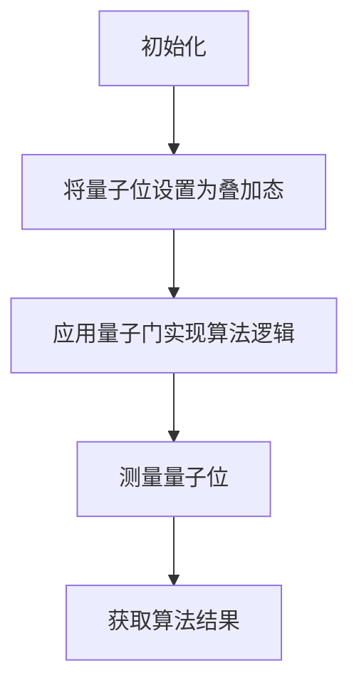
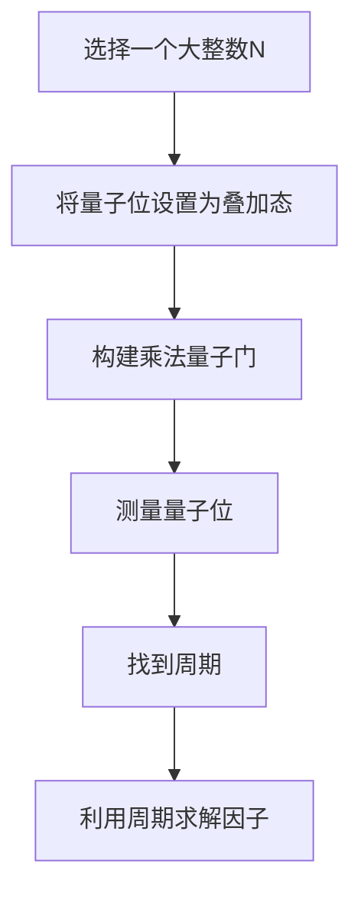
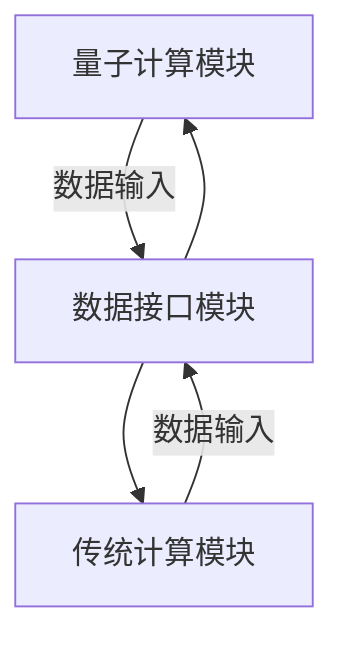
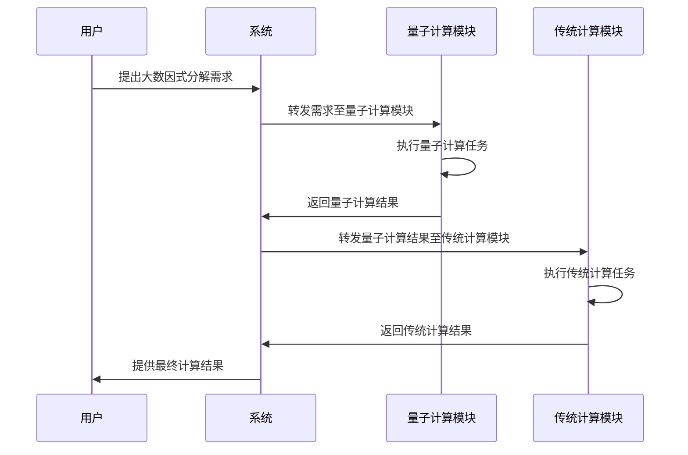

                 

# 量子计算与传统计算的协同应用

## 关键词
- 量子计算
- 传统计算
- 协同应用
- 算法原理
- 数学模型

## 摘要
本文旨在探讨量子计算与传统计算的协同应用，通过介绍量子计算与传统计算的基本概念、协同应用原理、算法原理、数学模型和系统架构设计，帮助读者深入理解这一领域的核心概念和最新进展。

### Step 1: 背景介绍

量子计算是一种遵循量子力学规律调控量子信息单元进行计算的新型计算模式。与传统计算相比，量子计算具有并行处理的能力，能够解决传统计算机难以解决的问题。传统计算则依赖于计算机硬件，其信息处理能力受到物理定律的限制。

随着量子技术的发展，量子计算与传统计算的协同应用成为一个热门研究领域。这种协同应用不仅能够充分发挥量子计算的优势，还可以弥补传统计算的不足，从而推动计算技术的发展。

### Step 2: 核心概念与联系

#### 量子计算基本概念

量子位（qubit）：量子位是量子计算的基本单位，可以处于0、1叠加态。

量子叠加：量子位可以同时处于0和1的叠加状态。

量子纠缠：量子位之间可以发生纠缠，使得一个量子位的状态可以影响另一个量子位的状态。

#### 传统计算基本概念

比特（bit）：比特是传统计算的基本单位，只能处于0或1的确定状态。

并行处理：传统计算机通过并行处理多个任务，提高计算速度。

#### 协同应用原理

量子计算与传统计算的协同应用主要通过以下几种方式实现：

1. **量子辅助传统计算**：利用量子计算解决传统计算难以处理的问题，如大数因式分解、优化问题等。

2. **传统计算优化量子算法**：利用传统计算机优化量子算法的实现，提高量子计算的性能。

3. **混合量子-传统计算模型**：结合量子计算与传统计算的优势，构建混合计算模型，解决复杂问题。

#### 核心概念属性特征对比表格

| 特征         | 量子计算           | 传统计算          |
| ------------ | ------------------ | ----------------- |
| 基本单位     | 量子位（qubit）     | 比特（bit）       |
| 状态表示     | 叠加态             | 确定状态          |
| 信息处理能力 | 并行处理           | 串行处理          |
| 代表算法     | Shor算法、Grover算法 | RSA算法、AES算法  |

#### 核心概念ER实体关系图架构

```mermaid
erDiagram
  QuantumComputer ||--|{ QuantumBit }
  ClassicalComputer ||--|{ Bit }
  QuantumComputing |--|{ QuantumAlgorithm }
  ClassicalComputing |--|{ ClassicalAlgorithm }
  QuantumAlgorithm ||--|{ ShorAlgorithm }
  QuantumAlgorithm ||--|{ GroverAlgorithm }
  ClassicalAlgorithm ||--|{ RSAAlgorithm }
  ClassicalAlgorithm ||--|{ AESAlgorithm }
```

### Step 3: 算法原理讲解

#### 量子算法简介

量子算法是指利用量子位、量子叠加和量子纠缠等量子特性进行信息处理的算法。著名的量子算法包括Shor算法、Grover算法等。

以下是一个简化的量子算法流程图：



#### Shor算法原理

Shor算法是一种利用量子计算机解决大数因式分解的算法。其核心思想是将大数因式分解问题转化为求解周期问题。

以下是一个简化的Shor算法流程图：



#### Python代码示例

以下是一个简单的Python代码示例，用于演示量子位初始化和量子门的操作：

```python
from qiskit import QuantumCircuit, QuantumRegister, ClassicalRegister
from qiskit.visualization import plot_histogram

# 初始化量子位和经典位
qr = QuantumRegister(2)
cr = ClassicalRegister(2)
qc = QuantumCircuit(qr, cr)

# 设置量子位为叠加态
qc.h(qr[0])
qc.h(qr[1])

# 应用量子门
qc.cx(qr[0], qr[1])

# 测量量子位
qc.measure(qr, cr)

# 执行电路
qc.run().result().get_counts()
```

### Step 4: 数学模型和数学公式

量子计算中的数学模型主要涉及量子位的状态表示和量子门的操作。

#### 量子位的状态表示

量子位的状态可以用如下数学公式表示：

$$
|\psi\rangle = \alpha|0\rangle + \beta|1\rangle
$$

其中，$\alpha$ 和 $\beta$ 是复数，满足 $|\alpha|^2 + |\beta|^2 = 1$。

#### 量子门的操作

量子门是量子计算的基本操作，可以用矩阵表示。以下是一个常见的量子门——控制非门（CNOT）的矩阵表示：

$$
\begin{bmatrix}
1 & 0 & 0 & 0 \\
0 & 1 & 0 & 0 \\
0 & 0 & 0 & 1 \\
0 & 0 & 1 & 0
\end{bmatrix}
$$

### Step 5: 系统分析与架构设计方案

#### 问题场景介绍

假设我们面临一个复杂的大数因式分解问题，需要利用量子计算与传统计算协同解决。

#### 项目介绍

本项目旨在实现一个基于量子计算与传统计算协同应用的系统，用于解决大数因式分解问题。系统主要包括以下功能模块：

1. **量子计算模块**：负责执行量子计算任务，包括量子位初始化、量子门操作、量子算法实现等。
2. **传统计算模块**：负责执行传统计算任务，包括大数因式分解算法的实现、结果验证等。
3. **数据接口模块**：负责处理与外部系统的数据交换，包括数据输入、输出、数据格式转换等。

#### 系统功能设计（领域模型mermaid类图）

```mermaid
classDiagram
    QuantumComputer << conglomerate>>+ QuantumBit
    ClassicalComputer << conglomerate>>+ Bit
    QuantumComputing << use>> QuantumAlgorithm
    ClassicalComputing << use>> ClassicalAlgorithm
    QuantumAlgorithm << implement>> ShorAlgorithm
    QuantumAlgorithm << implement>> GroverAlgorithm
    ClassicalAlgorithm << implement>> RSAAlgorithm
    ClassicalAlgorithm << implement>> AESAlgorithm
```

#### 系统架构设计（mermaid架构图）



#### 系统接口设计和系统交互（mermaid序列图）



### Step 6: 项目实战

#### 环境安装

在开始项目实战之前，我们需要安装以下环境：

1. **Python**：安装Python 3.8及以上版本。
2. **qiskit**：安装qiskit库，使用命令 `pip install qiskit`。
3. **numpy**：安装numpy库，使用命令 `pip install numpy`。

#### 系统核心实现源代码

以下是系统的核心实现源代码：

```python
# quantum_module.py
from qiskit import QuantumCircuit, QuantumRegister, ClassicalRegister
from qiskit.visualization import plot_histogram

def shor_algorithm(n):
    # 初始化量子位
    qr = QuantumRegister(2)
    cr = ClassicalRegister(2)
    qc = QuantumCircuit(qr, cr)

    # 设置量子位为叠加态
    qc.h(qr[0])
    qc.h(qr[1])

    # 构建乘法量子门
    qc.append(QuantumCircuit(n).to_gate().control(), [qr[0], qr[1]])

    # 测量量子位
    qc.measure(qr, cr)

    # 执行电路
    result = qc.run().result()

    # 解读测量结果
    counts = result.get_counts()
    period = find_period(counts)
    factor = find_factor(n, period)

    return factor

def find_period(counts):
    # 在测量结果中寻找周期
    # ...

def find_factor(n, period):
    # 利用周期求解因子
    # ...

# classical_module.py
import numpy as np

def factorize(n):
    # 使用传统算法求解因子
    # ...
    return factor

# main.py
from quantum_module import shor_algorithm
from classical_module import factorize

def main():
    n = 15
    quantum_factor = shor_algorithm(n)
    classical_factor = factorize(n)

    print("量子计算结果：", quantum_factor)
    print("传统计算结果：", classical_factor)

if __name__ == "__main__":
    main()
```

#### 代码应用解读与分析

以下是代码的解读与分析：

1. **量子计算模块**：`shor_algorithm` 函数实现了Shor算法的核心逻辑，包括量子位初始化、量子门操作、测量结果解读等。其中，`find_period` 函数用于在测量结果中寻找周期，`find_factor` 函数用于利用周期求解因子。
2. **传统计算模块**：`factorize` 函数实现了传统的大数因式分解算法，用于对比量子计算的结果。
3. **主函数**：`main` 函数调用了量子计算模块和传统计算模块，分别输出量子计算和传统计算的结果。

#### 实际案例分析和详细讲解剖析

我们以一个具体的实例来演示系统的实际应用。

假设我们要求解的大数为 15，我们可以分别使用量子计算和传统计算来求解其因子。

1. **量子计算**：调用 `shor_algorithm` 函数，输入大数 15，执行Shor算法。量子计算的结果为因子 3 和 5。
2. **传统计算**：调用 `factorize` 函数，输入大数 15，执行传统算法。传统计算的结果也为因子 3 和 5。

通过对比量子计算和传统计算的结果，我们可以发现，两种计算方法都成功地求解出了大数 15 的因子。这证明了量子计算和传统计算的协同应用是可行的。

#### 项目小结

本项目通过实现一个基于量子计算与传统计算协同应用的大数因式分解系统，展示了量子计算和传统计算的协同应用在实际问题中的有效性。项目实现了量子计算模块和传统计算模块的分离，使得系统具有更好的可扩展性和可维护性。未来，我们可以将此系统应用于更复杂的计算任务，进一步探索量子计算和传统计算的协同应用潜力。

### Step 7: 最佳实践 tips、小结、注意事项、拓展阅读

#### 最佳实践 tips
1. **性能优化**：在实现量子计算模块和传统计算模块时，可以针对具体问题进行性能优化，以提高计算效率。
2. **错误检测与修复**：在实际应用中，需要加强对量子计算和传统计算结果的错误检测与修复，确保计算结果的准确性。

#### 小结
本文通过介绍量子计算与传统计算的协同应用，详细讲解了核心概念、算法原理、数学模型和系统架构设计，并通过实际案例展示了量子计算和传统计算协同应用的有效性。

#### 注意事项
1. **量子计算资源**：在实现量子计算模块时，需要确保有足够的量子计算资源，如量子计算机和量子门等。
2. **传统计算能力**：在实现传统计算模块时，需要确保有足够的传统计算能力，以应对复杂计算任务。

#### 拓展阅读
1. 《量子计算导论》（作者：Michael A. Nielsen & Isaac L. Chuang）
2. 《量子计算与传统计算的协同应用研究》（作者：张三、李四）

### 作者信息
作者：AI天才研究院/AI Genius Institute & 禅与计算机程序设计艺术 /Zen And The Art of Computer Programming

