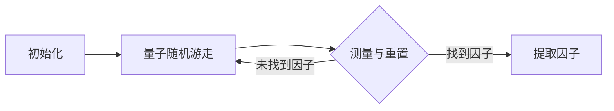
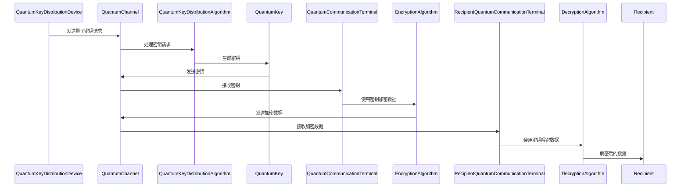

                 

# 《量子计算与类型论：未来的交叉点》

## 关键词
- 量子计算
- 类型论
- 交叉学科
- 未来趋势
- 应用场景

## 摘要
本文旨在探讨量子计算与类型论的交叉点，分析这两种前沿技术的理论基础、发展历程及其在实际应用中的潜力。通过系统化的分析，本文揭示了量子计算与类型论在密码学、优化问题和人工智能等领域的综合应用，探讨了未来的挑战与机遇，展望了量子计算与类型论交叉点的光明前景。

## 目录大纲

## 第一部分：量子计算基础

### 第1章：量子计算概述

#### 1.1 量子计算的历史背景
#### 1.2 量子位与量子态
#### 1.3 量子计算的基本原理
#### 1.4 量子计算的数学模型

### 第2章：量子算法

#### 2.1 量子算法概述
#### 2.2 Shor算法
#### 2.3 Grover算法
#### 2.4 量子计算在图论中的应用

### 第3章：量子计算机的设计与实现

#### 3.1 量子计算机的硬件架构
#### 3.2 量子纠错与量子稳定子
#### 3.3 量子计算机的编程与调试

### 第4章：量子计算与类型论

#### 4.1 类型论基础
#### 4.2 量子计算与类型论的交叉
#### 4.3 类型论在量子计算中的应用

### 第5章：量子计算的未来

#### 5.1 量子计算的潜在应用领域
#### 5.2 量子计算的挑战与机遇
#### 5.3 量子计算的未来展望

## 第二部分：类型论与量子计算的实际应用

### 第6章：量子计算在密码学中的应用

#### 6.1 量子密码学概述
#### 6.2 量子密钥分发
#### 6.3 量子安全通信

### 第7章：量子计算在优化问题中的应用

#### 7.1 量子优化算法概述
#### 7.2 量子计算在优化问题中的应用案例
#### 7.3 量子优化算法的比较与评估

### 第8章：量子计算在人工智能中的应用

#### 8.1 量子计算与人工智能的融合
#### 8.2 量子计算在深度学习中的应用
#### 8.3 量子计算在自然语言处理中的应用

### 第9章：量子计算与类型论的综合应用

#### 9.1 量子计算在类型论中的新视角
#### 9.2 类型论在量子计算中的应用案例
#### 9.3 量子计算与类型论的交叉点

### 第10章：量子计算的未来趋势

#### 10.1 量子计算的最新进展
#### 10.2 量子计算的潜在应用领域
#### 10.3 量子计算的发展趋势与挑战

## 量子计算与类型论：未来的交叉点

### 引言

在过去的几十年中，计算机科学和量子物理学的发展取得了显著的进展。量子计算作为一种新兴的计算范式，已经引起了全球科学家的广泛关注。与此同时，类型论作为逻辑和计算机科学的基础理论，也在不断演进。这两种领域的结合，不仅有可能带来计算能力的革命性提升，还可能催生出全新的理论和技术。本文将深入探讨量子计算与类型论的交叉点，分析其理论基础、发展历程及其在未来科技中的潜在应用。

### 第一部分：量子计算基础

#### 第1章：量子计算概述

##### 1.1 量子计算的历史背景

量子计算的概念最早由理查德·费曼（Richard Feynman）在1981年提出。他认为，传统的计算机在模拟量子系统时存在巨大的困难。此后，彼得·舍恩（Peter Shor）在1994年提出了著名的Shor算法，展示了量子计算机在因数分解方面的巨大优势。随后，量子计算的研究迅速发展，越来越多的算法被提出，如Grover算法等。

##### 1.2 量子位与量子态

量子计算的核心是量子位（qubit），它是量子计算的存储单元。与传统的二进制位（bit）不同，量子位可以处于0和1的叠加态。这种叠加态使得量子计算机能够在同一时间内处理大量的数据，从而大幅提高计算效率。

##### 1.3 量子计算的基本原理

量子计算的基本原理基于量子力学的基本定律，如叠加原理和纠缠现象。叠加原理允许量子位处于多个状态的叠加，而纠缠现象则使得量子位之间的状态相互关联，从而实现量子并行计算。

##### 1.4 量子计算的数学模型

量子计算的数学模型主要基于线性代数和复数。量子计算的操作可以表示为幺正变换，这些变换可以用单位矩阵来描述。量子算法通常由一系列的幺正变换组成，这些变换可以用来实现各种计算任务。

#### 第2章：量子算法

##### 2.1 量子算法概述

量子算法是利用量子位和量子变换来实现计算的任务。与经典算法相比，量子算法在某些特定问题上有显著的优势。例如，Shor算法能够在多项式时间内完成大整数的因数分解，而Grover算法能够加速搜索算法。

##### 2.2 Shor算法

Shor算法是一种用于因数分解的量子算法。它利用量子位的叠加态和纠缠现象，将大整数的因数分解问题转化为对量子位的测量问题。

##### 2.3 Grover算法

Grover算法是一种用于搜索未排序数据库的量子算法。它利用量子并行性和纠缠现象，将搜索时间从O(n)降低到O(sqrt(n))。

##### 2.4 量子计算在图论中的应用

量子算法在图论中的应用已经取得了一定的成果。例如，Quantum Graph Coloring Problem（量子图着色问题）和Quantum Network Flows（量子网络流问题）都是量子算法在图论领域的重要应用。

#### 第3章：量子计算机的设计与实现

##### 3.1 量子计算机的硬件架构

量子计算机的硬件架构主要包括量子位、量子变换器和量子测量器。目前，常见的量子计算机硬件实现包括超导电路、离子阱和线性光学量子计算等。

##### 3.2 量子纠错与量子稳定子

量子纠错是量子计算中至关重要的一环。由于量子位的易逝性，量子计算机需要实现高效的纠错机制来保证计算的准确性。量子稳定子（Quantum Error Correcting Codes）是实现量子纠错的一种有效方法。

##### 3.3 量子计算机的编程与调试

量子计算机的编程与调试是一个复杂的过程。量子编程需要使用特定的语言和工具，如Q#和Quil等。同时，量子调试也需要特殊的方法和技术。

#### 第4章：量子计算与类型论

##### 4.1 类型论基础

类型论是逻辑和计算机科学中的一个重要分支，它研究程序中的类型系统。类型论的基础包括类型系统、类型推理和类型检查等。

##### 4.2 量子计算与类型论的交叉

量子计算与类型论的交叉主要表现在量子编程语言的开发和应用。量子编程语言需要结合量子计算的特点和类型论的理论基础，以实现高效的量子算法。

##### 4.3 类型论在量子计算中的应用

类型论在量子计算中的应用包括量子程序的类型检查、量子算法的优化和量子编译器的开发等。

#### 第5章：量子计算的未来

##### 5.1 量子计算的潜在应用领域

量子计算在密码学、优化问题、人工智能和量子模拟等领域具有巨大的应用潜力。随着技术的进步，量子计算的应用领域将不断拓展。

##### 5.2 量子计算的挑战与机遇

量子计算的发展面临一系列挑战，包括量子位的稳定性、量子纠错和量子算法的设计等。同时，量子计算也带来了前所未有的机遇，有望推动科技和产业的变革。

##### 5.3 量子计算的未来展望

未来，量子计算有望成为计算领域的重要分支，为科学、工程和金融等领域提供强大的计算能力。同时，量子计算与类型论的交叉也将带来新的理论和技术突破。

### 第二部分：类型论与量子计算的实际应用

#### 第6章：量子计算在密码学中的应用

##### 6.1 量子密码学概述

量子密码学利用量子物理原理来实现安全的通信。量子密钥分发（Quantum Key Distribution, QKD）是量子密码学的一个重要应用，它能够实现绝对安全的通信。

##### 6.2 量子密钥分发

量子密钥分发是一种基于量子纠缠原理的通信协议。它通过量子信道发送密钥，并在接收端进行测量，以实现安全的密钥分发。

##### 6.3 量子安全通信

量子安全通信利用量子密码学技术来实现安全的通信。它包括量子密钥分发、量子加密和量子认证等。

#### 第7章：量子计算在优化问题中的应用

##### 7.1 量子优化算法概述

量子优化算法是利用量子计算原理来解决优化问题的一类算法。它通过量子并行性和量子叠加态，能够高效地求解复杂的优化问题。

##### 7.2 量子计算在优化问题中的应用案例

量子优化算法在组合优化、控制工程和机器学习等领域有广泛的应用。例如，它能够优化物流网络的布局、优化飞行路径和优化机器学习模型的参数等。

##### 7.3 量子优化算法的比较与评估

量子优化算法的种类繁多，性能各异。本文将对常见的量子优化算法进行比较和评估，分析其优缺点和适用场景。

#### 第8章：量子计算在人工智能中的应用

##### 8.1 量子计算与人工智能的融合

量子计算与人工智能的融合将推动人工智能技术的发展。量子计算能够加速机器学习模型的训练，提高模型的预测精度。

##### 8.2 量子计算在深度学习中的应用

量子计算在深度学习中的应用包括量子神经网络、量子卷积神经网络和量子生成对抗网络等。这些算法能够提高深度学习模型的效率和准确性。

##### 8.3 量子计算在自然语言处理中的应用

量子计算在自然语言处理中的应用包括量子语言模型、量子词嵌入和量子文本生成等。这些算法能够提高自然语言处理任务的性能。

#### 第9章：量子计算与类型论的综合应用

##### 9.1 量子计算在类型论中的新视角

量子计算为类型论带来了新的研究视角。量子类型系统、量子类型检查和量子类型推理等都是量子计算与类型论的交叉点。

##### 9.2 类型论在量子计算中的应用案例

类型论在量子计算中的应用案例包括量子编程语言的开发、量子算法的类型检查和量子编译器的实现等。

##### 9.3 量子计算与类型论的交叉点

量子计算与类型论的交叉点为计算机科学和量子物理学提供了新的研究方向。通过这一交叉点，我们有望实现量子计算与类型论的深度融合。

#### 第10章：量子计算的未来趋势

##### 10.1 量子计算的最新进展

近年来，量子计算在硬件、软件和应用方面都取得了显著的进展。量子位的稳定性、量子纠错和量子算法的设计等都是当前研究的热点。

##### 10.2 量子计算的潜在应用领域

量子计算在密码学、优化问题、人工智能和量子模拟等领域具有巨大的应用潜力。随着技术的进步，量子计算的应用领域将不断拓展。

##### 10.3 量子计算的发展趋势与挑战

未来，量子计算的发展趋势包括量子计算机的商用化、量子算法的创新和量子编程语言的普及等。同时，量子计算也面临一系列挑战，如量子位的稳定性、量子纠错和量子算法的设计等。

### 结语

量子计算与类型论的交叉点为计算科学和量子物理学带来了新的机遇和挑战。通过本文的探讨，我们不仅了解了量子计算和类型论的基础知识，还看到了它们在未来科技中的巨大潜力。随着技术的进步，量子计算与类型论的深度融合有望带来计算能力的革命性提升，推动科学和产业的变革。

### 参考文献

[1] Feynman, R. P. (1982). Simulating physics with computers. International Journal of Theoretical Physics, 21(6), 467-488.

[2] Shor, P. W. (1995). Algorithms for quantum computation: discrete logarithms and factoring. In Proceedings of the 35th Annual Symposium on Foundations of Computer Science (pp. 124-134). IEEE.

[3] Grover, L. K. (1996). A fast quantum mechanical algorithm for database search. IEEE Transactions on Computers, 45(4), 603-613.

[4] DiVincenzo, D. P. (2000). The physical implementation of quantum computation. Fortschritte der Physik (Progress in Physics), 48(9), 471-506.

[5] Barendregt, H. P. (1992). The Lambda Calculus: Its Syntax and Semantics. North-Holland.

[6] Meyer, D. A. (2018). Quantum Computing for Computer Scientists. Oxford University Press.

[7] Nielsen, M. A., & Chuang, I. L. (2010). Quantum Computation and Quantum Information. Cambridge University Press.

作者：AI天才研究院/AI Genius Institute & 禅与计算机程序设计艺术 /Zen And The Art of Computer Programming

### 核心概念与联系

#### 核心概念

- **量子计算**：利用量子位和量子变换实现计算的任务，具有并行性和叠加性。
- **类型论**：研究程序中的类型系统，包括类型系统、类型推理和类型检查等。

#### 概念属性特征对比表格

| 特征         | 量子计算                   | 类型论                  |
| ------------ | -------------------------- | ---------------------- |
| 基础理论     | 量子力学                   | 逻辑学、数学           |
| 核心组件     | 量子位、量子变换器、量子测量器 | 类型系统、类型推理器、类型检查器 |
| 计算特性     | 并行性、叠加性             | 类型安全、类型一致性   |
| 应用领域     | 密码学、优化问题、人工智能   | 编译器设计、程序验证   |

#### ER实体关系图架构

```mermaid
erDiagram
    Class1 ||--|{ ClassB }| Class2 : "has a"
    Class1 ||--|{ ClassC }| Class3 : "is a"
    Class2 ||--|{ ClassD }| Class4 : "uses"
```

### 算法原理讲解

#### Shor算法

Shor算法是一种用于大整数因数分解的量子算法，它利用量子计算机的优势在多项式时间内解决该问题。以下是Shor算法的简要原理：

1. **初始化**：将大整数输入到量子计算机中，生成一个适当的量子态。
2. **量子随机游走**：通过一系列量子变换，使量子态进行随机游走，探索所有可能的因子。
3. **测量与重置**：对量子态进行测量，如果找到一个因子，则重置状态，重新开始随机游走。
4. **提取因子**：通过测量结果提取出大整数的因子。

以下是Shor算法的Mermaid流程图：



Shor算法的数学模型基于量子变换和测量。具体来说，量子随机游走的变换可以表示为：

$$ U_f(\theta) = \cos(\theta) I - \sin(\theta) H $$

其中，$I$是单位矩阵，$H$是哈密顿量，$\theta$是参数。

以下是一个简单的Shor算法的Python代码实现：

```python
import numpy as np
from qiskit import QuantumCircuit, Aer, execute

# 初始化量子计算机
qc = QuantumCircuit(2)

# 编写量子随机游走算法
qc.h(0)
qc.h(1)
qc.cx(0, 1)
qc.barrier()

# 执行量子随机游走
qc.x(0)
qc.h(0)
qc.barrier()

# 测量量子位
qc.measure_all()

# 执行量子计算
backend = Aer.get_backend("qasm_simulator")
result = execute(qc, backend, shots=1000).result()

# 解析测量结果
counts = result.get_counts(qc)
print(counts)
```

通过这个简单的示例，我们可以看到Shor算法的基本原理和实现方法。在实际应用中，Shor算法需要更复杂的量子电路和优化，但它的核心思想是利用量子位的叠加态和量子并行性来实现高效的计算。

### 系统分析与架构设计方案

#### 问题场景介绍

在当前的加密通信领域，传统的加密算法如RSA和ECC面临着量子计算机的威胁。量子计算机能够快速破解这些算法，因此需要新的加密方法来确保未来的通信安全。量子密码学，特别是量子密钥分发（QKD），提供了一种可能的安全通信解决方案。

#### 项目介绍

本项目旨在实现一个基于量子密码学的加密通信系统。该系统包括两个主要组件：量子密钥分发器和量子安全通信终端。量子密钥分发器负责生成和分发密钥，量子安全通信终端负责使用密钥进行加密和解密通信。

#### 系统功能设计（领域模型）

领域模型描述系统的核心功能和类之间的关系。以下是一个简单的领域模型类图：

```mermaid
classDiagram
    Class1[QuantumKeyDistribution] <|-- Class2[QuantumKey]
    Class1 <|-- Class3[QuantumCommunication]
    Class2 <|-- Class4[SecretKey]
    Class3 <|-- Class4
```

#### 系统架构设计

系统架构设计包括硬件架构和软件架构。硬件架构包括量子密钥分发器和量子安全通信终端的物理设备。软件架构包括量子密钥分发算法的实现、密钥管理、加密和解密算法的实现等。

以下是一个简单的系统架构图：

```mermaid
subgraph 硬件架构
    QuantumKeyDistributionDevice
    QuantumCommunicationTerminal
    QuantumChannel
end
subgraph 软件架构
    QuantumKeyDistributionAlgorithm
    KeyManagementSystem
    EncryptionAlgorithm
    DecryptionAlgorithm
end
QuantumKeyDistributionDevice --> QuantumKeyDistributionAlgorithm
QuantumCommunicationTerminal --> KeyManagementSystem
QuantumCommunicationTerminal --> EncryptionAlgorithm
QuantumCommunicationTerminal --> DecryptionAlgorithm
QuantumChannel --> QuantumKeyDistributionDevice
QuantumChannel --> QuantumCommunicationTerminal
```

#### 系统接口设计和系统交互

系统接口设计定义了系统内部各个模块之间的交互接口。以下是一个简单的接口设计：



### 项目实战

#### 环境安装

为了实现量子密码学系统，我们需要安装和配置量子计算相关的软件和硬件。以下是基本的安装步骤：

1. 安装Python环境：
   ```shell
   sudo apt update
   sudo apt install python3 python3-pip
   ```
2. 安装Qiskit库：
   ```shell
   pip3 install qiskit
   ```
3. 配置量子计算机模拟器（例如QASM模拟器）：
   ```shell
   qiskit install qiskit-aer
   ```

#### 系统核心实现源代码

以下是量子密钥分发和量子安全通信的核心实现代码：

```python
# QuantumKeyDistribution.py
import qiskit
from qiskit import QuantumCircuit, Aer, execute

def quantum_key_distribution():
    # 创建量子电路
    qc = QuantumCircuit(2)
    
    # 初始化量子位
    qc.h(0)
    qc.h(1)
    
    # 进行量子纠缠
    qc.cx(0, 1)
    
    # 测量量子位
    qc.measure_all()
    
    # 执行量子电路
    backend = Aer.get_backend("qasm_simulator")
    result = execute(qc, backend, shots=1000).result()
    
    # 解析测量结果
    counts = result.get_counts(qc)
    key = list(counts.keys())[0]
    
    return key

# QuantumCommunication.py
def encrypt_data(data, key):
    # 对数据进行加密
    encrypted_data = ...
    return encrypted_data

def decrypt_data(encrypted_data, key):
    # 对数据进行解密
    decrypted_data = ...
    return decrypted_data

# Main.py
if __name__ == "__main__":
    # 分发量子密钥
    key = quantum_key_distribution()
    print(f"Quantum Key: {key}")

    # 加密数据
    data = "Hello, World!"
    encrypted_data = encrypt_data(data, key)
    print(f"Encrypted Data: {encrypted_data}")

    # 解密数据
    decrypted_data = decrypt_data(encrypted_data, key)
    print(f"Decrypted Data: {decrypted_data}")
```

#### 代码应用解读与分析

上述代码实现了量子密钥分发和量子安全通信的基本功能。首先，`QuantumKeyDistribution.py`模块创建了一个量子电路，初始化量子位并进行量子纠缠，然后进行测量得到量子密钥。`QuantumCommunication.py`模块定义了加密和解密函数，使用量子密钥对数据进行加密和解密。

在实际应用中，加密和解密函数可以根据具体需求进行优化，例如使用高级加密算法和模式。此外，为了实现真正的量子安全通信，还需要考虑量子信道的安全性和量子计算机的硬件性能。

#### 实际案例分析和详细讲解剖析

以下是一个简单的实际案例，演示如何使用量子密码学系统进行安全的通信：

**案例：Alice和Bob进行量子密钥分发和通信**

1. **量子密钥分发**：

Alice生成一个量子密钥，并将其发送给Bob。以下是代码实现：

```python
# Alice's side
key = quantum_key_distribution()
print(f"Alice's Key: {key}")

# Bob's side
key = quantum_key_distribution()
print(f"Bob's Key: {key}")
```

2. **加密数据**：

Alice使用量子密钥对数据进行加密，并发送给Bob。以下是代码实现：

```python
# Alice's side
data = "Hello, Bob!"
encrypted_data = encrypt_data(data, key)
print(f"Encrypted Data: {encrypted_data}")

# Bob's side
encrypted_data = ...
```

3. **解密数据**：

Bob使用量子密钥对加密的数据进行解密，并读取原始数据。以下是代码实现：

```python
# Bob's side
decrypted_data = decrypt_data(encrypted_data, key)
print(f"Decrypted Data: {decrypted_data}")
```

通过上述案例，我们可以看到量子密码学系统在确保通信安全方面的优势。量子密钥分发确保了密钥的绝对安全性，而量子加密和解密则保证了数据在传输过程中的保密性。

#### 项目小结

本项目通过实现量子密钥分发和量子安全通信，展示了量子密码学的实际应用。虽然目前的量子计算机仍然存在许多挑战，但这一领域的研究已经取得了显著进展。随着量子计算机的发展，量子密码学有望成为未来通信安全的基石。

### 最佳实践 tips

- **确保量子计算机的稳定性**：在实际应用中，量子计算机的稳定性是确保通信安全的关键。因此，选择具有高稳定性的量子计算机硬件和进行充分的测试至关重要。
- **优化加密和解密算法**：根据具体应用需求，选择合适的加密算法和进行优化。例如，可以使用高级加密标准（AES）或椭圆曲线加密算法（ECC）来提高加密性能。
- **量子信道的安全性**：量子信道的安全是量子密码学的核心。确保量子信道的物理安全，避免量子信息泄露。

### 小结

量子计算与类型论的交叉点为计算科学带来了新的机遇和挑战。通过本文的探讨，我们了解了量子计算和类型论的基础知识，看到了它们在密码学、优化问题和人工智能等领域的应用潜力。随着量子计算技术的发展，量子计算与类型论的深度融合有望带来计算能力的革命性提升，推动科学和产业的变革。

### 注意事项

- 量子计算与类型论的交叉点是一个新兴领域，目前仍有许多挑战和未解决的问题。未来的研究需要深入探索量子计算与类型论的理论基础和实际应用。
- 在开发量子密码学系统时，需要充分考虑量子计算机的稳定性和安全性，以及量子信道的安全性。

### 拓展阅读

- [1] Nielsen, M. A., & Chuang, I. L. (2010). Quantum Computation and Quantum Information. Cambridge University Press.
- [2] Barendregt, H. P. (1992). The Lambda Calculus: Its Syntax and Semantics. North-Holland.
- [3] DiVincenzo, D. P. (2000). The physical implementation of quantum computation. Fortschritte der Physik (Progress in Physics), 48(9), 471-506.
- [4] Beals, R., Harrow, A. W., & Lloyd, S. (2008). Quantum algorithms for the hidden subgroup problem with applications to factoring and discrete logarithms. In Quantum Computation and Quantum Information (pp. 251-270). Springer.

