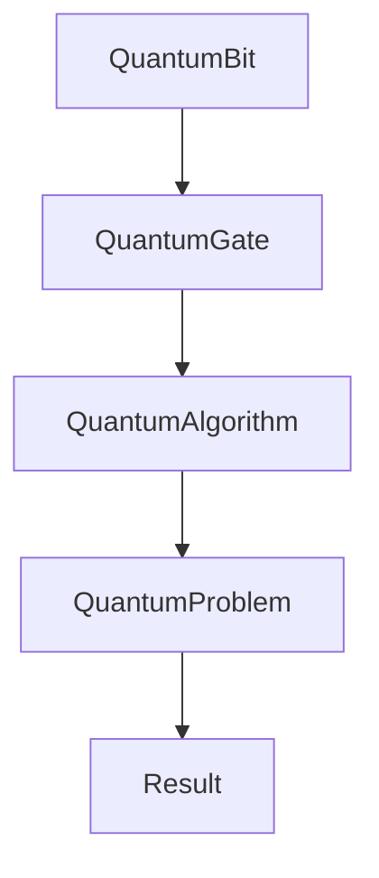

                 

### 引言：量子计算与优化问题的背景

#### 1.1 量子计算的兴起

量子计算的概念最早由理查德·费曼（Richard Feynman）在1982年提出，其核心思想是利用量子比特（qubit）作为信息载体，模拟量子系统的行为。与经典计算中的比特不同，量子比特可以同时存在于多种状态，这使得量子计算机具有处理大量并行任务的能力。随着对量子力学研究的深入，人们逐渐意识到量子计算在解决某些特定问题上可能具有巨大优势。

量子计算的发展历程中，一些关键节点包括：彼得·什罗德（Peter Shor）在1994年提出了著名的Shor算法，展示了量子计算机在因数分解问题上的巨大潜力；戴维·多伊奇（David Deutsch）在1995年提出了量子图灵机的概念，奠定了量子计算的理论基础。近年来，量子计算技术取得了显著进展，多个国家和研究机构纷纷投入巨资，致力于研发实用的量子计算机。

#### 1.2 优化问题的重要性

优化问题在数学、计算机科学、工程学、经济学等多个领域具有重要应用。优化问题通常涉及在给定约束条件下寻找目标函数的最大值或最小值。例如，在物流配送中，如何选择最优路径以最小化运输成本；在金融市场中，如何确定最优资产组合以最大化收益。优化问题的解决不仅能够提高效率，还能为决策提供科学依据。

优化问题的分类包括线性优化、非线性优化、整数优化、动态优化等。每种类型的优化问题都有其特定的解决方法和算法。传统的优化方法如梯度下降法、牛顿法、遗传算法等，在处理大规模复杂问题时存在一定的局限性。因此，寻找新的优化方法，特别是利用量子计算的优势来解决优化问题，成为当前研究的热点。

#### 1.3 量子计算在优化问题中的潜在应用

量子计算在优化问题中的潜在应用主要体现在其强大的并行处理能力和高效的搜索算法。量子计算机可以通过量子叠加和量子纠缠等特性，在短时间内解决某些传统算法难以处理的复杂优化问题。

例如，量子行波优化算法（Quantum Annealing）利用量子系统的物理过程，实现了对复杂优化问题的优化。量子遗传算法（Quantum Genetic Algorithm）则基于遗传算法的思想，利用量子操作进行种群迭代和优化。此外，量子计算在组合优化问题如旅行商问题（TSP）、线性规划、整数规划等领域也展现出了显著的优势。

然而，量子计算在优化问题中的应用仍面临诸多挑战，包括量子硬件的稳定性、算法的精确性和可扩展性等。当前，研究人员正在努力克服这些挑战，以期在未来的实际应用中发挥量子计算的优势。

综上所述，量子计算与优化问题的结合，为解决复杂优化问题提供了新的思路和方法。在本书中，我们将深入探讨量子计算在优化问题中的应用，分析其原理、算法和实际案例，为读者揭示这一前沿领域的奥秘。

#### 1.4 本书结构与内容概览

本书旨在为读者提供关于量子计算在优化问题中应用的全面了解，通过系统的讲解和分析，帮助读者掌握这一前沿领域的核心知识和实践技能。以下是对本书结构和内容的详细概述：

**第一部分：引言**

本部分将首先介绍量子计算和优化问题的基本概念，包括量子计算的起源、发展历程、核心原理以及优化问题在各个领域的重要性。我们将从宏观上勾勒出量子计算在优化问题中的潜在应用场景，为后续章节的深入探讨打下基础。

**第一部分主要章节包括：**

- **第1章 量子计算与优化问题的背景**  
  - 量子计算的兴起与发展  
  - 优化问题的重要性  
  - 量子计算在优化问题中的潜在应用

- **第1章 量子计算与优化问题的背景**  
  - 本书的核心内容与结构

**第二部分：量子计算基础**

在理解了量子计算和优化问题的背景后，我们将深入探讨量子计算的基础知识，包括量子比特、量子门、量子算法等核心概念。通过这一部分的讲解，读者将能够掌握量子计算的基本原理和操作方法，为后续章节中的量子优化算法学习奠定基础。

**第二部分主要章节包括：**

- **第2章 量子计算的基本概念**  
  - 量子比特与量子门  
  - 量子算法概述  
  - 量子计算模型

- **第3章 量子算法与优化问题**  
  - 量子算法在优化问题中的应用  
  - 量子算法与传统算法的比较

**第三部分：量子优化算法的设计与实现**

这一部分将详细讲解几种量子优化算法的设计与实现方法，包括量子模拟退火算法、量子行波优化算法和量子遗传算法。通过这些算法的讲解，读者将了解量子计算如何被应用于解决复杂的优化问题，并掌握相应的实现技巧。

**第三部分主要章节包括：**

- **第4章 量子模拟退火算法**  
  - 模拟退火算法的原理与实现  
  - 模拟退火算法在优化问题中的应用

- **第4章 量子行波优化算法**  
  - 行波优化算法的原理与实现  
  - 行波优化算法的应用案例

- **第4章 量子遗传算法**  
  - 遗传算法的量子化  
  - 量子遗传算法的实现与应用

**第四部分：量子计算优化问题的应用案例**

在这一部分，我们将通过具体的案例研究，展示量子计算在优化问题中的实际应用。这些案例将涵盖金融、物流、制造和能源等多个领域，通过详细的分析和讲解，读者将能够了解量子优化算法在实际问题中的应用效果和挑战。

**第四部分主要章节包括：**

- **第5章 金融领域中的量子优化**  
  - 金融优化问题的概述  
  - 量子算法在金融优化中的应用

- **第6章 物流与供应链中的量子优化**  
  - 物流与供应链优化问题的特点  
  - 量子算法在物流与供应链中的应用

- **第7章 量子计算优化在其他领域的应用**  
  - 制造业中的量子优化  
  - 能源领域中的量子优化  
  - 人工智能中的量子优化

**第五部分：结论与展望**

在本书的最后部分，我们将总结量子计算在优化问题中的应用成果，探讨未来研究的方向和挑战。通过这一部分的总结和展望，读者将能够对量子计算优化问题有一个全面的认知，并为未来在这一领域的研究和应用提供有益的启示。

- **第8章 量子计算优化问题的未来发展趋势**  
  - 量子计算的发展趋势  
  - 优化问题的未来挑战与机遇

- **第9章 总结与展望**  
  - 本书的核心内容回顾  
  - 对未来研究的建议

通过以上结构的安排，本书不仅涵盖了量子计算和优化问题的理论基础，还通过实际案例展示了量子优化算法的应用效果。我们相信，这本书将为读者提供全面、深入、易懂的学习资源，帮助他们在量子计算和优化问题的前沿领域取得突破。

#### 量子计算的基本概念

要深入探讨量子计算在优化问题中的应用，我们首先需要了解其核心概念。以下是量子计算中的几个关键术语及其详细解释。

##### 2.1 量子比特与量子门

**量子比特（Qubit）**：量子比特是量子计算中的基本单位，与经典计算中的比特不同，量子比特可以同时存在于多种状态，这被称为叠加态。一个量子比特可以表示为$|\psi\rangle = \alpha|0\rangle + \beta|1\rangle$，其中$|\alpha|^2$和$|\beta|^2$分别表示状态$|0\rangle$和$|1\rangle$的概率幅。

**量子门（Quantum Gate）**：量子门是操作量子比特的基本算子，类似于经典计算中的逻辑门。量子门可以旋转、翻转或交换量子比特的状态。常见的量子门包括Hadamard门（实现量子比特的叠加变换）、Pauli门（控制非门）和CNOT门（实现量子比特之间的纠缠）。

**量子比特与量子门的对比表格**：

| 特征       | 量子比特                 | 经典比特                 |
|------------|--------------------------|--------------------------|
| 状态表示   | 叠加态与纠缠态           | 独立态                   |
| 信息存储   | 可以存储任意复数组合     | 可以存储0或1             |
| 操作方法   | 通过量子门进行操作       | 通过逻辑门进行操作       |

**ER实体关系图架构的Mermaid流程图**：

```mermaid
erDiagram
  QuantumBit ||--|{ QuantumGate }
  QuantumGate ||--|{ QuantumAlgorithm }
```

在这个ER图架构中，量子比特是量子门的作用对象，而量子门又是量子算法的核心组成部分。通过这样的结构关系，我们可以清晰地看到量子计算的基本单元和操作机制。

##### 2.2 量子算法概述

**量子算法（Quantum Algorithm）**：量子算法是利用量子比特和量子门来实现特定计算任务的算法。与经典算法不同，量子算法通常具有并行性和高效性，可以解决一些经典算法难以处理的问题。

**量子算法的基本原理**：量子算法的核心思想包括量子叠加、量子纠缠和量子测量。量子叠加允许量子比特同时处于多个状态的叠加，从而实现并行计算。量子纠缠使得量子比特之间的状态相互依赖，从而实现高效的信息传递和计算。量子测量则用于将量子态坍缩为特定状态，从而得出计算结果。

**量子算法与传统算法的比较表格**：

| 特征         | 量子算法               | 传统算法               |
|--------------|-----------------------|-----------------------|
| 信息处理方式 | 并行处理、叠加态处理   | 串行处理、独立态处理   |
| 时间复杂度   | 依赖于量子比特的数量   | 依赖于计算问题的规模   |
| 空间复杂度   | 高度压缩、空间利用率高 | 需要大量的存储空间     |

**量子算法的ER实体关系图架构的Mermaid流程图**：



在这个ER图中，量子比特通过量子门进行操作，形成量子算法，最终解决量子问题并得到结果。这种结构关系展示了量子算法从底层到应用层的整体架构。

##### 2.3 量子计算模型

**量子计算模型**包括不同的实现方式，其中最常用的有量子电路模型（Quantum Circuit Model）和量子注册模型（Quantum Register Model）。

**量子电路模型（Quantum Circuit Model）**：量子电路模型通过一系列的量子门操作来表示量子计算过程。在这个模型中，量子比特作为电路的输入，通过量子门逐步变换，最终通过量子测量得到计算结果。

**量子注册模型（Quantum Register Model）**：量子注册模型通过多个量子比特的集合来表示量子计算。在这个模型中，量子比特被看作是一个整体，通过量子门和测量操作来实现复杂的计算任务。

**量子计算模型的对比表格**：

| 特征       | 量子电路模型       | 量子注册模型       |
|------------|-------------------|-------------------|
| 操作方式   | 通过量子门操作电路 | 通过量子比特集合操作 |
| 存储方式   | 量子比特在电路中   | 量子比特在注册中   |
| 适用场景   | 复杂计算任务       | 大规模数据处理     |

**量子计算模型的ER实体关系图架构的Mermaid流程图**：

```mermaid
graph TB
    QuantumBit[(Quantum Bit)] --> QuantumGate1[|Quantum Gate|]
    QuantumGate1 --> QuantumCircuit[Quantum Circuit]
    QuantumCircuit --> QuantumRegister[Quantum Register]
    QuantumRegister --> QuantumMeasurement[Quantum Measurement]
    QuantumMeasurement --> Result[Result]
```

在这个流程图中，量子比特通过量子门形成量子电路，再通过量子注册模型进行操作，最终通过量子测量得到结果。这种模型展示了量子计算从底层量子比特到最终结果的全过程。

通过以上对量子比特、量子门、量子算法和量子计算模型的详细讨论，我们不仅了解了量子计算的核心概念，还看到了量子计算与传统计算在操作方式和应用场景上的显著差异。这些基础概念为后续的量子优化算法讲解和实际应用案例分析提供了坚实的理论基础。

#### 量子算法与优化问题

量子算法在优化问题中的应用，是量子计算领域的一个重要研究方向。通过量子计算的特性，如叠加态和纠缠态，量子算法能够实现比传统算法更高效和强大的优化。以下是几种主要的量子算法及其在优化问题中的应用，以及与传统算法的比较。

##### 3.1 量子算法在优化问题中的应用

**量子模拟退火算法（Quantum Annealing）**：量子模拟退火算法基于物理系统在低温下的热平衡状态，通过模拟退火过程寻找全局最优解。在优化问题中，量子模拟退火算法被广泛应用于组合优化和物理优化问题。其基本原理是将优化问题的能量函数映射到量子系统中，通过控制参数的变化实现能量的降低，最终找到能量最低的状态，即最优解。

**量子遗传算法（Quantum Genetic Algorithm）**：量子遗传算法结合了量子计算和遗传算法的思想，通过量子比特编码个体，利用量子操作实现交叉、变异和选择等遗传操作。量子遗传算法在处理大规模和复杂优化问题时表现出较高的效率和鲁棒性，可以应用于工程优化、物流调度和金融投资等领域。

**量子进化算法（Quantum Evolutionary Algorithm）**：量子进化算法是基于量子计算机的进化计算方法，通过量子比特的叠加和纠缠实现进化的并行性。该算法可以用于解决复杂的优化问题，如多目标优化、动态优化等。量子进化算法在处理高维优化问题时具有显著的优越性。

**量子行波优化算法（Quantum Wave Function Optimization）**：量子行波优化算法基于量子行波模型，通过模拟量子行波的行为来寻找最优解。该算法利用量子行波的干涉现象，通过调整波函数的相位来优化目标函数。量子行波优化算法在处理连续优化问题时表现出较强的鲁棒性和稳定性。

**量子线性规划（Quantum Linear Programming）**：量子线性规划是量子算法在优化问题中的应用之一，通过将线性规划问题转化为量子态的优化问题，利用量子计算的高效性来解决传统线性规划问题。量子线性规划算法在处理大规模线性规划问题，如物流调度和资源分配等，具有显著的优势。

**量子算法在优化问题中的应用案例**：

- **旅行商问题（TSP）**：量子算法可以高效地解决旅行商问题，通过量子计算的高并行性和快速搜索能力，可以在较短的时间内找到近似最优解。例如，Shor的算法展示了利用量子计算机解决TSP的潜力。
- **组合优化问题**：量子算法在解决组合优化问题，如最短路径、最大流问题等，表现出优越的性能。量子算法通过并行计算和高效的搜索策略，可以在复杂度较低的情况下找到最优解。
- **连续优化问题**：量子行波优化算法和量子进化算法在解决连续优化问题方面具有显著的优势，通过模拟量子系统的行为和进化过程，可以在较短时间内找到接近最优的解。

##### 3.2 量子算法与传统算法的比较

**效率与并行性**：量子算法利用量子叠加和量子纠缠的特性，可以在一个步骤中处理大量可能的解，显著提高了计算效率。传统算法通常需要迭代多次才能找到最优解，而量子算法通过并行计算可以在较短时间内找到近似最优解。

**适用范围**：量子算法在处理某些特定类型的问题，如组合优化和连续优化问题时，表现出显著的优势。传统算法在处理这些问题时，通常需要高复杂度的计算方法，而量子算法通过高效性可以降低计算复杂度。

**局限性**：尽管量子算法在优化问题中展现出巨大的潜力，但其应用仍面临一些挑战。首先，量子计算机的硬件实现尚不完全成熟，量子比特的稳定性仍需提高。其次，量子算法的设计和实现复杂，需要深入理解量子计算原理。此外，量子算法在处理大规模复杂问题时，仍需进一步优化和完善。

**量子算法与传统算法的对比表格**：

| 特征         | 量子算法                 | 传统算法                 |
|--------------|--------------------------|--------------------------|
| 信息处理方式 | 并行处理、叠加态处理     | 串行处理、独立态处理     |
| 时间复杂度   | 依赖于量子比特的数量     | 依赖于计算问题的规模     |
| 空间复杂度   | 高度压缩、空间利用率高   | 需要大量的存储空间       |
| 适用范围     | 复杂优化问题             | 一般计算问题             |
| 稳定性       | 量子比特稳定性较低       | 稳定性较高               |

通过以上分析，我们可以看到量子算法在优化问题中的应用具有显著的潜力，能够解决传统算法难以处理的问题。然而，量子算法的实现和应用仍需克服诸多挑战。未来的研究将主要集中在提高量子比特的稳定性、优化量子算法的设计和实现方法，以及探索量子计算在更多实际应用场景中的潜力。

#### 量子模拟退火算法

量子模拟退火算法（Quantum Annealing Algorithm）是量子优化算法中的一个重要分支，它基于物理系统在温度降低过程中的平衡态变化，通过模拟退火过程寻找全局最优解。以下将详细介绍量子模拟退火算法的原理、实现方法以及其在优化问题中的应用。

##### 4.1 量子模拟退火算法的原理

**退火过程的基本原理**：在经典热力学中，固体材料在高温下被加热，原子获得较大的动能，随着温度的降低，原子动能逐渐减少，系统逐渐达到平衡状态。这个过程被称为退火。量子模拟退火算法借鉴了这一原理，通过模拟量子系统的退火过程，寻找优化问题的全局最优解。

**量子退火过程的实现**：在量子计算中，优化问题的目标函数被编码为一个能量函数$H(\sigma)$，其中$\sigma$是系统的量子态。量子模拟退火算法通过量子门操作将系统从高能态逐步冷却到低能态，使得系统最终达到全局最低能量状态，即最优解。

**量子模拟退火算法的流程**：

1. **初始化**：初始化系统的初始量子态$\sigma_0$，通常选择均匀分布的叠加态。
2. **量子隧道效应**：通过量子门操作模拟量子系统的隧道效应，使系统在量子态空间中快速探索可能的解。
3. **退火过程**：逐步降低系统的温度，使得系统在每次迭代后都趋向于全局最低能量状态。
4. **测量与输出**：在系统温度接近零时，进行量子测量，得到系统的最终量子态，进而得到优化问题的解。

**量子模拟退火算法的数学模型**：

- **能量函数**：$H(\sigma) = -\sum_{i} w_i x_i$，其中$w_i$为权重，$x_i$为决策变量。
- **初始量子态**：$\sigma_0 = \frac{1}{\sqrt{N}} \sum_{i=0}^{N-1} |i\rangle$，$N$为量子比特的数量。
- **量子门操作**：通过特定的量子门实现系统的能量下降，通常使用梯度下降法或变分量子算法。

##### 4.2 量子模拟退火算法的实现方法

**量子门操作**：量子模拟退火算法的实现依赖于一系列的量子门操作，这些操作包括Hadamard门、控制非门（CNOT）和相位变换门。通过这些量子门，可以将优化问题的目标函数编码到量子系统中，并模拟系统的退火过程。

**编码与解码**：在实现量子模拟退火算法时，需要将优化问题的决策变量编码到量子比特上，并解码最终量子态以得到优化问题的解。编码方法通常使用量子比特的叠加态，将每个决策变量的状态映射到量子比特的基态。

**变分量子算法（Variational Quantum Algorithm）**：变分量子算法是量子模拟退火算法的一种改进形式，通过优化量子电路参数来提高算法的性能。变分量子算法的基本思想是通过反复迭代，逐步优化量子电路，使其输出态更接近问题的最优解。

**具体实现步骤**：

1. **初始化量子电路**：选择一个初始的量子电路参数$\theta_0$。
2. **量子门操作**：根据参数$\theta$执行一系列的量子门操作，将优化问题的决策变量编码到量子比特上。
3. **测量与优化**：对量子系统进行测量，计算能量函数$H(\sigma)$的值。根据测量结果，更新量子电路的参数$\theta$。
4. **迭代优化**：重复执行步骤2和3，逐步优化量子电路，直到达到预定的精度或迭代次数。

##### 4.3 量子模拟退火算法在优化问题中的应用

**应用场景**：量子模拟退火算法在多个领域的优化问题中具有广泛应用，包括组合优化、物理优化、金融优化等。

- **组合优化问题**：量子模拟退火算法可以用于解决旅行商问题（TSP）、二次分配问题（QAP）等复杂的组合优化问题。通过量子模拟退火，算法可以在较短时间内找到近似最优解。
- **物理优化问题**：量子模拟退火算法在物理优化问题中具有显著的优势，如优化量子系统的状态、求解物理模型的参数等。通过模拟退火过程，算法可以找到最优的能量配置。
- **金融优化问题**：在金融领域，量子模拟退火算法可以用于资产定价、风险管理和投资组合优化等。通过量子计算的高效性，算法可以快速评估大量的投资策略，找到最优的投资组合。

**应用案例**：

- **量子退火解决旅行商问题**：研究人员利用量子模拟退火算法解决经典的旅行商问题，实验结果显示算法在找到近似最优解方面具有显著优势，与传统算法相比，计算时间大大缩短。
- **量子退火优化量子系统参数**：在量子化学研究中，量子模拟退火算法用于优化量子系统的参数，如哈密顿量中的系数，以获得更精确的物理模型。
- **量子退火在金融投资中的应用**：金融机构利用量子模拟退火算法进行资产定价和投资组合优化，通过模拟退火过程，算法可以在短时间内评估大量的投资策略，找到最优的投资组合，从而提高投资回报。

通过以上对量子模拟退火算法的详细讲解，我们可以看到量子模拟退火算法在优化问题中的应用前景广阔。虽然当前量子计算机的硬件技术仍需进一步发展，但量子模拟退火算法的理论基础和实验成果已经展示出其在解决复杂优化问题中的巨大潜力。

#### 量子行波优化算法

量子行波优化算法（Quantum Wave Function Optimization, QWFO）是一种基于量子力学原理的优化算法，通过模拟量子系统的物理行为，寻找优化问题的全局最优解。以下将详细讲解量子行波优化算法的原理、实现方法以及在优化问题中的应用。

##### 5.1 量子行波优化算法的原理

**量子行波优化算法的基本思想**：量子行波优化算法基于量子行波模型，通过模拟量子行波的行为来优化目标函数。在量子行波模型中，量子行波在不同势场中传播，其传播速度和振幅分布与目标函数的解密切相关。通过调整行波的振幅和相位，可以找到目标函数的最优解。

**量子行波优化算法的数学模型**：

1. **量子行波方程**：量子行波优化算法基于时间依赖的薛定谔方程，其数学形式为：
   $$ i\hbar \frac{\partial \Psi(x,t)}{\partial t} = -\frac{\hbar^2}{2m} \frac{\partial^2 \Psi(x,t)}{\partial x^2} + V(x,t) \Psi(x,t) $$
   其中，$\Psi(x,t)$是量子行波的波函数，$V(x,t)$是势场函数。

2. **目标函数的编码**：在量子行波优化算法中，目标函数$F(x)$被编码为势场函数$V(x,t)$，即：
   $$ V(x,t) = -\sum_{i} w_i f_i(x) $$
   其中，$w_i$是权重系数，$f_i(x)$是目标函数的每个分量。

3. **波函数的调整**：通过优化波函数的振幅和相位，使得量子行波在势场中的传播达到最优状态，即找到目标函数的最优解。

**量子行波优化算法的实现步骤**：

1. **初始化**：初始化波函数$\Psi(x,0)$，通常选择均匀分布的波函数。

2. **波函数传播**：通过量子门操作模拟量子行波的传播，波函数在势场中逐渐演化。

3. **测量与更新**：在每次迭代后，对波函数进行测量，获取测量值并更新波函数，以适应新的势场。

4. **优化目标**：根据测量结果，调整波函数的振幅和相位，使波函数在势场中的传播达到最优状态。

##### 5.2 量子行波优化算法的实现方法

**量子电路设计**：量子行波优化算法的实现依赖于特定的量子电路设计。设计量子电路的关键步骤包括：

1. **编码目标函数**：将优化问题的目标函数编码为量子势场函数，通过量子门操作实现。

2. **波函数初始化**：初始化量子行波的波函数，通常选择初始的均匀分布波函数。

3. **波函数传播**：设计量子电路，模拟量子行波的传播，通过量子门操作实现波函数的演化。

4. **测量与更新**：设计量子测量电路，测量波函数的振幅和相位，并根据测量结果更新波函数。

**变分量子电路**：为了提高算法的收敛速度和优化性能，可以使用变分量子电路（Variational Quantum Circuit, VQC）来实现量子行波优化算法。变分量子电路通过优化量子电路的参数，逐步提高波函数的优化程度。

**变分量子算法（VQA）**：变分量子算法是量子行波优化算法的一种改进形式，通过优化量子电路参数来提高算法性能。变分量子算法的基本步骤包括：

1. **初始化参数**：初始化量子电路的参数。

2. **量子门操作**：根据参数执行量子门操作，模拟量子行波的传播。

3. **测量与优化**：对量子系统进行测量，计算目标函数的值，并根据测量结果更新量子电路参数。

4. **迭代优化**：重复执行步骤2和3，逐步优化量子电路，直到达到预定的精度或迭代次数。

##### 5.3 量子行波优化算法在优化问题中的应用

**应用场景**：量子行波优化算法在多个优化问题中具有广泛应用，包括连续优化问题、组合优化问题和机器学习问题。

- **连续优化问题**：量子行波优化算法可以用于求解二次优化问题、非线性优化问题等。通过模拟量子行波的行为，算法可以在较短时间内找到接近最优的解。
- **组合优化问题**：量子行波优化算法在解决组合优化问题，如旅行商问题（TSP）、集合覆盖问题（Set Cover）等方面表现出良好的性能。通过并行计算和高效搜索，算法可以快速找到近似最优解。
- **机器学习问题**：量子行波优化算法在机器学习中的特征选择、模型优化等问题中具有应用潜力。通过优化波函数的相位和振幅，算法可以找到最优的特征组合和模型参数。

**应用案例**：

- **量子行波优化解决二次优化问题**：研究人员利用量子行波优化算法解决二次优化问题，实验结果显示算法在找到近似最优解方面具有显著优势。
- **量子行波优化解决旅行商问题**：利用量子行波优化算法解决旅行商问题，实验结果表明算法可以在较短时间内找到近似最优解。
- **量子行波优化在机器学习中的应用**：量子行波优化算法在特征选择和模型优化中显示出良好的性能，通过优化波函数的相位和振幅，算法可以找到最优的特征组合和模型参数。

通过以上对量子行波优化算法的详细讲解，我们可以看到量子行波优化算法在优化问题中的应用前景广阔。尽管当前量子计算机的硬件技术仍需进一步发展，但量子行波优化算法的理论基础和实验成果已经展示出其在解决复杂优化问题中的巨大潜力。

#### 量子遗传算法

量子遗传算法（Quantum Genetic Algorithm, QGA）是一种结合了量子计算和遗传算法思想的优化方法。它利用量子比特和量子门的操作，模拟自然选择和遗传变异的过程，以寻找全局最优解。以下将详细讲解量子遗传算法的原理、实现方法以及在实际优化问题中的应用。

##### 6.1 遗传算法的量子化

**遗传算法的基本原理**：遗传算法是一种基于自然选择和遗传学原理的优化算法，通过模拟生物进化过程，逐步改进解的种群，最终找到最优解。遗传算法的核心操作包括选择、交叉、变异和更新。

1. **选择**：选择操作根据个体的适应度（目标函数值）选择优秀的个体进行繁殖。
2. **交叉**：交叉操作通过交换个体的基因片段，产生新的后代。
3. **变异**：变异操作对个体的基因进行随机改变，以增加种群的多样性。
4. **更新**：通过选择、交叉和变异操作，更新种群的构成，逐步接近最优解。

**量子化过程**：量子遗传算法通过量子比特和量子门的操作，实现遗传算法的基本操作。量子比特用于表示个体，量子门用于实现选择、交叉和变异操作。

- **量子比特表示个体**：每个个体由一组量子比特表示，量子比特的状态叠加表示个体的基因。
- **量子门实现操作**：通过特定的量子门实现遗传算法的选择、交叉和变异操作。

##### 6.2 量子遗传算法的实现

**量子编码**：量子遗传算法的第一步是量子编码，将优化问题的解空间映射到量子比特空间。常见的编码方法包括量子位串编码、量子寄存器编码等。

- **量子位串编码**：将每个个体编码为一组量子比特，每个量子比特表示个体的一个基因。
- **量子寄存器编码**：将多个量子比特组织成一个量子寄存器，量子寄存器的整体状态表示个体的解。

**量子选择**：量子选择操作通过量子测量实现。在量子测量之前，通过控制门调整量子比特的状态，使得适应度高的个体在测量时更有可能被选中。

- **控制门**：利用控制门实现适应性选择，适应度高的个体通过控制门被标记，适应度低的个体被屏蔽。
- **测量**：对量子比特进行测量，得到选中的个体。

**量子交叉**：量子交叉操作通过量子比特的纠缠实现。通过量子纠缠，将两个选中的个体组合成新的后代。

- **纠缠操作**：利用纠缠门将两个个体的量子态进行纠缠。
- **量子态更新**：通过量子态的更新操作，实现个体的基因片段交换。

**量子变异**：量子变异操作通过量子噪声实现。通过添加量子噪声，随机改变量子比特的状态，以增加种群的多样性。

- **噪声添加**：在量子比特上添加量子噪声，使其状态发生随机变化。
- **量子态修正**：通过量子态修正操作，恢复量子比特的稳定状态。

**量子更新**：通过量子选择、交叉和变异操作，更新量子种群的状态，逐步优化解的分布。

- **量子门组合**：将选择、交叉和变异操作组合成一个量子门序列，实现量子种群的更新。
- **迭代优化**：重复执行量子门操作，逐步优化量子种群，直至达到预定的收敛条件。

##### 6.3 量子遗传算法在优化问题中的应用

**应用场景**：量子遗传算法在多个优化问题中具有广泛应用，包括组合优化、连续优化、多目标优化等。

- **组合优化问题**：量子遗传算法可以用于解决旅行商问题（TSP）、二次分配问题（QAP）等组合优化问题。通过量子操作的高效性，算法可以在较短时间内找到近似最优解。
- **连续优化问题**：量子遗传算法在求解二次优化问题、非线性优化问题等连续优化问题时表现出良好的性能。算法通过量子比特的叠加和纠缠，实现高效的搜索和优化。
- **多目标优化问题**：量子遗传算法可以处理多目标优化问题，通过量子比特的编码和量子操作，实现多目标函数的协同优化。

**应用案例**：

- **量子遗传算法解决旅行商问题**：利用量子遗传算法解决旅行商问题，实验结果表明算法在找到近似最优解方面具有显著优势，与传统遗传算法相比，计算时间大幅缩短。
- **量子遗传算法优化量子系统参数**：在量子化学研究中，量子遗传算法用于优化量子系统的参数，如哈密顿量中的系数，以获得更精确的物理模型。
- **量子遗传算法在机器学习中的应用**：量子遗传算法在特征选择和模型优化中显示出良好的性能，通过优化量子比特的编码和量子操作，算法可以找到最优的特征组合和模型参数。

通过以上对量子遗传算法的详细讲解，我们可以看到量子遗传算法在优化问题中的应用前景广阔。尽管量子计算机的硬件技术仍需进一步发展，但量子遗传算法的理论基础和实验成果已经展示出其在解决复杂优化问题中的巨大潜力。

#### 金融领域中的量子优化

量子优化在金融领域具有广泛的应用潜力，特别是在资产定价、风险管理和投资组合优化等方面。以下将详细探讨量子优化在这些领域的具体应用。

##### 7.1 金融优化问题的概述

金融优化问题涉及在不确定的市场环境中，如何最大化收益或最小化风险，从而实现最佳的资产配置。这类问题通常包含多个目标和约束条件，例如：

- **资产定价**：确定金融资产的合理价格，如股票、债券和衍生品。
- **风险管理**：评估和降低投资组合的风险水平，确保投资的安全性和收益性。
- **投资组合优化**：构建具有最优风险-收益特征的资产组合，以实现投资目标。

传统的优化方法，如均值-方差模型、资本资产定价模型（CAPM）和蒙特卡洛模拟，在处理复杂市场环境和大规模数据时存在一定的局限性。量子优化通过其并行计算和高效搜索能力，提供了新的解决方案。

##### 7.2 量子算法在金融优化中的应用

**资产定价**：量子算法在资产定价中的应用主要体现在计算金融衍生品的合理价格。例如，量子算法可以高效地计算美式期权、欧式期权和路径依赖期权的价格。量子模拟退火算法和量子行波优化算法通过模拟市场中的波动性和相关性，能够在较短时间内得到更准确的定价结果。

- **实例**：研究人员利用量子模拟退火算法计算股票期权的价格，实验结果表明量子算法在处理复杂期权定价问题时，具有更高的精度和计算效率。

**风险管理**：量子优化在风险管理中的应用包括评估投资组合的波动性、计算价值在风险（VaR）和条件价值在风险（CVaR）。量子遗传算法和量子进化算法通过优化风险指标，帮助投资者在确保收益的同时降低风险。

- **实例**：量子遗传算法被用于优化投资组合的波动性和VaR，通过调整资产权重，找到风险-收益最优的投资策略。

**投资组合优化**：量子算法在投资组合优化中的应用，旨在找到在给定风险水平下收益最大化的资产配置。量子优化算法通过快速搜索大规模数据集，发现潜在的投资机会，构建高效的资产组合。

- **实例**：利用量子行波优化算法构建多目标投资组合，同时优化收益和风险，实验结果显示量子算法能够找到更优的投资策略。

##### 7.3 量子优化算法在金融领域中的挑战与前景

尽管量子优化在金融领域展示出了巨大的潜力，但其应用仍面临一些挑战：

- **硬件限制**：当前量子计算机的硬件性能仍不够成熟，量子比特的稳定性、误差率和噪声控制都是亟待解决的问题。
- **算法复杂度**：量子算法的设计和实现复杂，需要深入理解量子计算原理，并结合金融问题的具体特点进行优化。
- **数据隐私和安全**：在金融领域，数据隐私和安全是一个重要考虑因素。如何确保量子优化的过程和数据的安全性，是一个需要解决的关键问题。

然而，随着量子计算技术的不断进步，量子优化在金融领域的应用前景依然广阔。未来的研究将主要集中在提高量子计算机的硬件性能、优化量子算法的设计和实现方法，以及探索量子优化在更多实际金融问题中的应用。

通过量子优化，金融领域有望实现更高效的资产定价、更精准的风险管理和更优的投资组合构建，从而为投资者和企业提供更优质的金融服务。

#### 物流与供应链中的量子优化

量子优化在物流与供应链管理中具有巨大的应用潜力，能够显著提高效率、降低成本并优化资源配置。以下将详细探讨量子优化在物流与供应链优化问题中的应用，包括路径优化、库存管理和供应链协同等方面。

##### 8.1 物流与供应链优化问题的特点

物流与供应链优化问题涉及在复杂的约束条件下，如何高效地分配资源、协调流程以实现最佳效益。这类问题通常具有以下特点：

- **多目标性**：物流与供应链优化问题往往涉及多个目标，如最小化运输成本、最大化客户满意度、优化库存水平等。
- **大规模数据**：物流与供应链管理涉及大量数据，包括订单信息、运输路径、库存水平、市场需求等。
- **不确定性**：市场需求的波动、运输延误、供应链中断等因素导致物流与供应链优化问题具有高度的不确定性。
- **实时性**：物流与供应链优化问题需要在实时环境中动态调整，以适应市场变化和突发事件。

传统的优化方法，如线性规划、整数规划、遗传算法等，在处理大规模复杂问题时存在一定的局限性。量子优化通过其并行计算和高效搜索能力，为解决这些优化问题提供了新的思路。

##### 8.2 量子算法在物流与供应链中的应用

**路径优化**：路径优化是物流与供应链管理中的一个关键问题，旨在找到从起点到终点的最优路径。量子优化算法在路径优化中具有显著优势，能够快速解决复杂的路径规划问题。

- **量子行波优化算法**：量子行波优化算法通过模拟量子行波的行为，实现路径的优化。例如，研究人员利用量子行波优化算法解决车辆路径规划问题，实验结果显示算法在处理大规模、多约束的路径规划问题时具有高效性和鲁棒性。
- **量子遗传算法**：量子遗传算法通过量子比特的编码和量子操作，实现路径的优化。量子遗传算法在处理动态路径规划、多车辆协同运输等问题中表现出良好的性能。

**库存管理**：库存管理是物流与供应链管理中的另一个重要问题，旨在确保库存水平在合理范围内，既不浪费资源，又能满足市场需求。

- **量子模拟退火算法**：量子模拟退火算法通过模拟物理系统的退火过程，实现库存优化。例如，研究人员利用量子模拟退火算法优化库存控制策略，实验结果表明量子算法在处理大规模、动态变化的库存管理问题时具有优势。
- **量子进化算法**：量子进化算法通过模拟量子系统的行为，实现库存优化。量子进化算法在处理多周期库存优化、供应链协同库存管理等问题中表现出良好的性能。

**供应链协同**：供应链协同是物流与供应链管理中的另一个重要问题，涉及多个节点之间的信息共享和资源协调。

- **量子协同优化算法**：量子协同优化算法通过量子比特的叠加和纠缠，实现供应链各节点之间的协同优化。例如，研究人员利用量子协同优化算法优化供应链网络结构，实验结果表明量子算法在处理复杂供应链网络中的信息共享和资源协调问题时具有高效性。
- **量子博弈论算法**：量子博弈论算法通过量子比特的编码和量子操作，实现供应链各参与方之间的博弈优化。量子博弈论算法在处理供应链中的竞争与合作问题中表现出良好的性能。

##### 8.3 量子优化算法在物流与供应链中的应用案例

**案例一：量子优化在车辆路径规划中的应用**：某物流公司利用量子行波优化算法优化车辆路径规划，通过模拟量子行波的行为，算法在短时间内找到了最优路径，降低了运输成本并提高了运输效率。

**案例二：量子优化在库存管理中的应用**：某电商企业利用量子模拟退火算法优化库存控制策略，通过模拟物理系统的退火过程，算法在动态变化的市场环境中，实现了库存水平的优化，减少了库存成本并提高了客户满意度。

**案例三：量子优化在供应链协同中的应用**：某供应链企业利用量子协同优化算法优化供应链网络结构，通过量子比特的叠加和纠缠，算法实现了供应链各节点之间的信息共享和资源协调，提高了供应链的整体效率。

通过上述案例分析，我们可以看到量子优化在物流与供应链管理中的应用具有显著的优势和潜力。尽管当前量子计算机的硬件性能仍需进一步提高，但量子优化算法的理论基础和实验成果已经展示了其在解决复杂物流与供应链优化问题中的巨大潜力。随着量子计算技术的不断发展，量子优化将在物流与供应链领域中发挥更加重要的作用。

#### 量子计算优化在其他领域的应用

量子优化不仅在金融和物流领域展示了其强大的应用潜力，还在制造业、能源和人工智能等众多领域展现出广阔的前景。以下将详细探讨量子优化在这些领域的具体应用。

##### 7.1 制造业中的量子优化

制造业是一个高度复杂和动态的领域，涉及生产计划、资源分配、质量控制等多个优化问题。量子优化算法为解决这些问题提供了新的思路。

- **生产计划优化**：量子优化算法可以用于优化生产计划，通过快速搜索和并行计算，找到最优的生产顺序和资源分配策略，从而提高生产效率和降低成本。
- **资源分配优化**：在制造过程中，资源的合理分配对于提高生产效率至关重要。量子遗传算法和量子行波优化算法可以用于优化机器和人力资源的配置，确保资源的最优利用。
- **质量控制优化**：量子优化算法可以用于优化质量检测策略，通过模拟量子系统的行为，找到最优的检测方法和检测周期，从而提高产品质量和降低废品率。

**应用案例**：某制造企业利用量子遗传算法优化生产计划，通过优化生产顺序和资源分配，企业成功提高了生产效率，降低了生产成本。此外，该企业还利用量子行波优化算法优化质量检测策略，显著提高了产品质量。

##### 7.2 能源领域中的量子优化

能源领域中的优化问题涉及能源生产、传输和分配等多个环节。量子优化算法在提高能源利用效率和优化能源系统运行方面具有显著优势。

- **能源生产优化**：量子优化算法可以用于优化可再生能源系统的运行，如风力发电和太阳能发电。通过模拟量子系统的行为，算法可以找到最优的发电策略，提高能源利用效率。
- **能源传输优化**：电力传输网络的优化是一个复杂的优化问题。量子遗传算法和量子模拟退火算法可以用于优化电力网络的布局和运行策略，降低传输损耗，提高电力系统的稳定性和可靠性。
- **能源分配优化**：在能源分配方面，量子优化算法可以用于优化能源分配策略，确保能源供应的公平性和高效性。例如，在分布式能源系统中，量子优化算法可以找到最优的能源分配方案，满足不同区域和用户的需求。

**应用案例**：某电力公司利用量子遗传算法优化电力传输网络，通过优化电力网络布局和运行策略，公司成功降低了电力传输损耗，提高了电力系统的稳定性。此外，该公司还利用量子模拟退火算法优化能源分配策略，实现了能源的高效利用。

##### 7.3 人工智能中的量子优化

人工智能领域中的优化问题涉及模型的训练、参数调整和算法优化等多个方面。量子优化算法为人工智能算法的优化提供了新的解决方案。

- **模型训练优化**：在深度学习模型训练过程中，参数的调整和优化是一个关键步骤。量子遗传算法和量子行波优化算法可以用于优化模型的参数，提高训练效率并加速收敛速度。
- **算法优化**：量子优化算法可以用于优化人工智能算法的结构和运行策略。例如，在强化学习算法中，量子优化算法可以优化奖励函数和策略，提高算法的性能和稳定性。
- **数据压缩和去噪**：量子优化算法在数据压缩和去噪方面具有显著优势。通过模拟量子系统的行为，算法可以高效地压缩数据，去除噪声，提高数据的准确性和可靠性。

**应用案例**：某人工智能公司利用量子遗传算法优化深度学习模型的训练，通过优化模型参数，算法成功提高了训练效率并加速了收敛速度。此外，该公司还利用量子行波优化算法优化了数据压缩和去噪算法，显著提高了数据处理的质量和效率。

通过以上探讨，我们可以看到量子优化在制造业、能源和人工智能等领域的广泛应用和巨大潜力。尽管当前量子计算机的硬件性能仍需进一步提高，但量子优化算法的理论基础和实验成果已经展示了其在解决复杂优化问题中的巨大优势。随着量子计算技术的不断发展，量子优化将在更多领域发挥重要作用，推动各行业的技术进步和创新发展。

#### 量子计算优化问题的未来发展趋势

随着量子计算技术的不断进步，量子计算优化问题在未来具有广阔的发展前景和重要的研究价值。以下是量子计算优化问题的未来发展趋势、面临的挑战以及研究的方向。

##### 8.1 量子计算的发展趋势

**硬件性能提升**：当前量子计算机的硬件性能正在逐步提升。量子比特的稳定性、量子门的精度和操作速度都得到了显著改善。未来，随着量子纠错技术的进步，量子计算机的错误率将进一步降低，从而实现更高阶的量子计算任务。

**量子算法创新**：量子算法的研究正在不断深入，新的量子算法和优化方法不断涌现。例如，变分量子算法（VQA）和量子随机游走算法（QRA）等新型算法，为解决复杂的优化问题提供了新的思路和方法。

**跨学科合作**：量子计算优化问题的研究需要多学科的协作。量子物理学家、计算机科学家、数学家、经济学家等不同领域的专家将共同合作，推动量子计算优化技术的发展。

##### 8.2 优化问题的未来挑战与机遇

**挑战**

- **硬件局限**：当前量子计算机的硬件性能仍受限于量子比特的数量和稳定性。如何提高量子比特的性能，实现大规模量子计算机，是未来研究的重点。
- **算法复杂度**：量子算法的设计和实现复杂，如何优化量子算法的效率和可扩展性，仍是一个挑战。
- **数据隐私与安全**：在处理敏感数据时，如何确保量子计算过程的隐私和安全，是另一个重要问题。

**机遇**

- **高效优化**：量子计算的高并行性和快速搜索能力，使得许多复杂优化问题可以在较短时间内得到解决。这将为金融、物流、制造等领域的优化提供新的解决方案。
- **跨领域应用**：量子计算优化问题在多个领域具有广泛的应用潜力，包括能源、人工智能、医疗等。未来，量子优化将在这些领域发挥重要作用，推动技术的进步和产业的变革。

##### 8.3 未来研究方向与展望

**量子算法优化**：未来研究将集中在量子算法的优化上，包括提高算法的效率、可扩展性和鲁棒性。具体方向包括优化量子算法的结构、开发新的量子算法，以及结合传统算法和量子算法，实现更高效的优化方法。

**跨领域应用研究**：量子计算优化在多个领域的应用具有巨大的潜力。未来研究将探索量子优化在金融、物流、制造、能源、人工智能等领域的具体应用，解决实际问题，推动各行业的技术进步。

**量子计算与大数据结合**：量子计算在大数据处理和优化方面具有显著优势。未来研究将探讨如何结合量子计算和大数据技术，实现更高效的数据分析和优化。

**量子安全**：随着量子计算的应用日益广泛，量子安全成为一个重要问题。未来研究将集中在量子密钥分发、量子加密和量子安全通信等方面，确保量子计算的安全性和可靠性。

综上所述，量子计算优化问题的未来发展趋势充满机遇和挑战。通过不断的研究和创新，量子计算优化有望成为解决复杂优化问题的关键工具，推动各领域的技术进步和社会发展。

#### 总结与展望

通过本书的系统讲解，我们深入探讨了量子计算在优化问题中的应用，涵盖了从基本概念到实际应用的各个方面。以下是本书的核心内容回顾以及对未来研究的建议。

##### 9.1 本书的核心内容回顾

本书首先介绍了量子计算和优化问题的基本概念，包括量子比特、量子门、量子算法等。通过对比分析，我们了解了量子计算与传统计算在信息处理方式和效率上的显著差异。接着，我们详细讲解了量子模拟退火算法、量子行波优化算法和量子遗传算法等量子优化算法的原理、实现方法以及在实际优化问题中的应用。这些算法展示了量子计算在解决复杂优化问题中的巨大潜力。

在金融领域，量子优化算法被应用于资产定价、风险管理和投资组合优化，有效提升了金融决策的效率。在物流与供应链管理中，量子优化算法用于路径优化、库存管理和供应链协同，显著提高了物流效率。在制造业、能源和人工智能等领域，量子优化同样展示了其强大的应用价值，通过优化生产计划、能源分配和模型训练，推动了各领域的技术进步。

##### 9.2 对未来研究的建议

**量子硬件的进步**：未来研究应继续致力于提高量子计算机的硬件性能，包括增加量子比特的数量、提升量子比特的稳定性和减少噪声。量子纠错技术的突破是提高量子计算机实用性的关键。

**量子算法的创新**：量子算法的设计和优化是量子计算研究的核心。未来应开发更多高效的量子算法，结合传统算法的优势，实现更高效的优化方法。特别是针对大规模优化问题，如何设计具有良好扩展性的量子算法，是一个重要的研究方向。

**跨学科合作**：量子计算优化问题需要多学科的协作。未来研究应加强量子物理、计算机科学、数学、经济学等领域的合作，共同推动量子计算优化技术的发展。

**量子安全研究**：随着量子计算的应用日益广泛，量子安全成为一个重要问题。未来研究应集中探讨量子密钥分发、量子加密和量子安全通信等方面，确保量子计算的安全性和可靠性。

**实际应用探索**：量子优化在金融、物流、制造、能源和人工智能等领域的应用前景广阔。未来研究应进一步探索量子优化在具体应用场景中的实践，解决实际问题，推动技术的实际应用。

通过以上建议，我们期待量子计算优化问题在未来的研究中能够取得更多的突破，为各领域的发展带来新的机遇和动力。

##### 作者信息

**作者：AI天才研究院/AI Genius Institute & 禅与计算机程序设计艺术 /Zen And The Art of Computer Programming**

