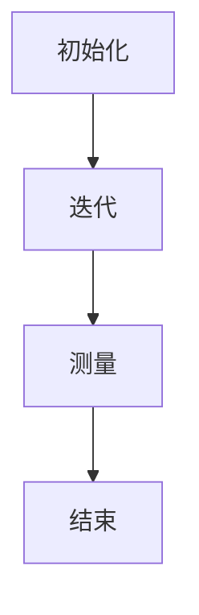
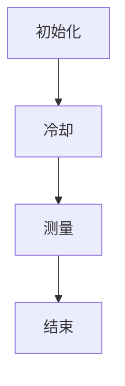

                 

### 量子计算在优化问题求解中的应用：加速计算过程

#### 关键词

- 量子计算
- 优化问题
- Shor算法
- Grover算法
- Quantum Annealing
- QAOA算法

#### 摘要

本文旨在探讨量子计算在优化问题求解中的应用，以及如何通过量子计算技术加速计算过程。首先，我们将介绍量子计算的基础概念，包括量子比特、量子叠加和量子纠缠等，并对比量子比特与经典比特的差异。接着，我们将深入分析几种重要的量子算法，如Shor算法和Grover算法，解释它们的工作原理及其在优化问题中的应用。随后，我们将详细介绍量子退火算法、Quantum Annealing和QAOA算法，探讨它们在解决组合优化、机器学习优化和物理优化问题中的实际应用。最后，我们将总结量子计算在优化问题中的优势与挑战，展望未来的发展趋势。

---

### 第一部分：量子计算基础

#### 第1章：量子计算概述

##### 1.1.1 量子计算的起源与发展历程

量子计算起源于20世纪40年代，由物理学家理查德·费曼首先提出。他提出了一个观点：在量子力学领域，计算过程可以通过模拟量子系统的演化来实现。这一观点奠定了量子计算的理论基础。

在接下来的几十年中，量子计算的发展经历了几个关键阶段。1980年代，彼得·谢尔盖·希尔伯特和理查德·汉密尔顿分别独立提出了量子逻辑门的概念，为量子计算提供了操作工具。1994年，彼得·舒尔和彼得·蒂默曼斯提出了Shor算法，证明了量子计算机在因子分解问题上的巨大优势。随后，1996年，洛夫·格罗弗提出了Grover算法，实现了在无序搜索问题上的加速。

##### 1.1.2 量子计算的基本概念

量子计算的核心在于量子比特，也称为“量子位”（qubit）。与经典计算机中的比特不同，量子比特可以处于0和1的叠加态。这种叠加态使得量子计算机能够同时处理大量信息。

量子叠加态可以用以下数学公式表示：

$$
|\psi\rangle = a|0\rangle + b|1\rangle
$$

其中，$|0\rangle$和$|1\rangle$是量子态的基础态，$a$和$b$是复数系数，满足$|a|^2 + |b|^2 = 1$。

量子纠缠是量子计算中的另一个重要概念。当两个或多个量子比特处于纠缠态时，它们之间的状态会相互依赖。即使这些量子比特相隔很远，它们之间的纠缠关系也不会消失。这种纠缠态使得量子计算机能够实现经典计算机无法达到的计算能力。

##### 1.1.3 量子比特与经典比特的对比

| 性质 | 量子比特 | 经典比特 |
| --- | --- | --- |
| 状态表示 | 叠加态，可以是$|0\rangle$、$|1\rangle$或两者的叠加态 | 只能是$|0\rangle$或$|1\rangle$ |
| 信息存储 | 一个量子比特可以存储两个经典比特的信息 | 一个经典比特只能存储一个信息位 |
| 操作方式 | 量子逻辑门，如Hadamard门、Pauli门等 | 逻辑门，如AND、OR、NOT等 |
| 加速度 | 可以实现指数级加速 | 只能实现线性加速 |

##### 1.1.4 量子计算的特点与优势

量子计算具有以下几个显著特点与优势：

1. **并行计算**：量子计算机可以利用量子叠加态实现并行计算，极大地提高计算速度。
2. **指数级加速**：某些问题，如Shor算法下的因子分解和Grover搜索算法，能够在量子计算机上实现指数级加速。
3. **高效优化**：量子计算可以有效地解决组合优化问题，如旅行商问题、调度问题等。
4. **信息存储与处理能力**：量子比特的叠加态可以存储和处理大量信息，使得量子计算机在处理大数据问题时具有优势。

#### 1.2 量子算法的基本原理

##### 1.2.1 量子算法的基本概念

量子算法是一种利用量子计算原理来解决问题的算法。量子算法的核心在于量子逻辑门和量子叠加态。通过设计合适的量子逻辑门序列，量子算法可以在极短的时间内解决某些经典计算机难以解决的问题。

##### 1.2.2 Shor算法的原理与实现

Shor算法是由彼得·舒尔在1994年提出的，它能够利用量子计算机在多项式时间内完成大整数的因子分解。以下是Shor算法的基本原理：

1. **量子简化**：将一个大整数分解为两个较小的整数的乘积。
2. **量子傅里叶变换**：利用量子傅里叶变换将量子态转换为一个可以用于计算的量子态。
3. **量子逆变换**：通过一系列量子逻辑门将结果转换为标准基态，从而得到原始整数的因子。

以下是Shor算法的核心数学公式：

$$
U_f(q) = \begin{cases} 
|0\rangle|f(q)\rangle & \text{if } q \equiv 0 \mod f(n) \\
|1\rangle|f(q)\rangle & \text{otherwise}
\end{cases}
$$

其中，$U_f(q)$是量子逻辑门，$f(n)$是输入整数$n$的一个函数，$q$是量子比特。

##### 1.2.3 Grover算法的原理与实现

Grover算法是由洛夫·格罗弗在1996年提出的，它能够在无序搜索问题中实现加速。Grover算法的核心思想是利用量子叠加态和量子纠缠来实现高效的搜索。

以下是Grover算法的基本步骤：

1. **初始化**：将量子比特初始化为叠加态。
2. **构建搜索算法**：利用Grover迭代器在搜索空间中迭代，并逐步缩小搜索范围。
3. **测量**：在最后一次迭代后测量量子比特，得到目标元素的位置。

以下是Grover算法的核心数学公式：

$$
|O\rangle = \sqrt{\frac{1}{2^n}} \sum_{i=1}^{2^n} |i\rangle |x_i\rangle
$$

其中，$|O\rangle$是目标元素的量子态，$n$是量子比特的数量。

#### 1.3 量子优化算法

##### 1.3.1 量子退火算法

量子退火算法是一种基于量子效应的优化算法，它模拟了物理系统从高能态到低能态的退火过程。量子退火算法的基本原理如下：

1. **初始化**：将量子系统初始化为高能态。
2. **迭代**：通过量子逻辑门和测量，逐步降低系统的能量。
3. **最终态**：当系统达到低能态时，测量量子比特得到最优解。

以下是量子退火算法的核心数学模型：

$$
H(S) = -\sum_{i=1}^n a_i |S_i\rangle \langle S_i|
$$

其中，$H(S)$是系统的哈密顿量，$a_i$是每个状态$S_i$的能量。

##### 1.3.2 Quantum Annealing的原理与应用

Quantum Annealing（量子退火）是一种利用量子效应实现优化的技术。它模拟了物理系统从高能态到低能态的退火过程，以找到优化问题的最优解。Quantum Annealing的基本原理如下：

1. **初始化**：将量子系统初始化为高能态。
2. **冷却**：通过量子逻辑门和测量，逐步降低系统的能量。
3. **测量**：当系统达到低能态时，测量量子比特得到最优解。

以下是Quantum Annealing的核心数学模型：

$$
H(S) = \sum_{i=1}^n a_i S_i + b_i S_i^2
$$

其中，$H(S)$是系统的哈密顿量，$a_i$和$b_i$是每个状态$S_i$的能量参数。

##### 1.3.3 QAOA算法的原理与实现

QAOA（Quantum Approximate Optimization Algorithm）是一种基于量子计算原理的优化算法，它通过量子算法和经典算法的协同工作，实现优化问题的求解。QAOA算法的基本原理如下：

1. **初始化**：将量子比特初始化为叠加态。
2. **迭代**：通过量子逻辑门和测量，逐步优化目标函数。
3. **测量**：在最后一次迭代后测量量子比特，得到最优解。

以下是QAOA算法的核心数学模型：

$$
\hat{U}(\theta) = \prod_{i=1}^L (R_z(\theta_i) \otimes H) \otimes R_y(\theta_0)
$$

其中，$\hat{U}(\theta)$是量子逻辑门，$\theta$是参数集合，$R_z(\theta_i)$和$R_y(\theta_0)$是旋转门，$H$是哈密顿量。

#### 1.4 量子计算在优化问题中的应用

##### 1.4.1 量子计算在组合优化问题中的应用

组合优化问题是一类重要的优化问题，如旅行商问题、调度问题、装箱问题等。量子计算在解决组合优化问题时具有显著的优势。以下是一些具体的应用实例：

1. **旅行商问题（TSP）**：量子计算可以通过QAOA算法在多项式时间内近似解决旅行商问题。
2. **调度问题**：量子计算可以优化调度问题，如飞机调度、生产线调度等。
3. **装箱问题**：量子计算可以高效地解决装箱问题，如在有限空间中如何安排多个箱子以最大化空间利用率。

##### 1.4.2 量子计算在机器学习优化问题中的应用

机器学习优化问题涉及模型的参数调整和优化，如梯度下降、随机梯度下降等。量子计算在解决机器学习优化问题时具有以下优势：

1. **加速训练过程**：量子计算可以加速机器学习模型的训练过程，提高收敛速度。
2. **优化模型参数**：量子计算可以优化机器学习模型的参数，提高模型的准确性和泛化能力。
3. **增强模型表达能力**：量子计算可以增强机器学习模型的表达能力，解决传统机器学习模型难以解决的问题。

##### 1.4.3 量子计算在物理优化问题中的应用

物理优化问题涉及物理系统的参数优化，如量子系统的能量优化、化学反应路径优化等。量子计算在解决物理优化问题时具有以下优势：

1. **高效求解**：量子计算可以高效地求解物理优化问题，减少计算时间和资源消耗。
2. **精确度提高**：量子计算可以提高物理优化问题的求解精度，获得更优的解。
3. **多尺度优化**：量子计算可以处理多尺度优化问题，如从微观到宏观的优化问题。

#### 1.5 量子计算机的挑战与未来发展趋势

尽管量子计算具有巨大的潜力，但在实际应用中仍面临诸多挑战：

1. **量子比特的稳定性**：量子比特容易受到环境干扰，导致量子态失真，这对量子计算的稳定性和可靠性提出了挑战。
2. **量子退火算法的效率**：量子退火算法的效率取决于量子系统的参数设置，需要进一步优化。
3. **量子算法的设计与实现**：量子算法的设计和实现是一个复杂的过程，需要大量计算资源和专业知识。

未来，量子计算的发展趋势包括：

1. **量子比特的稳定性和可靠性**：通过改进量子比特的设计和实现技术，提高量子比特的稳定性和可靠性。
2. **量子算法的创新**：设计更多高效的量子算法，解决更复杂的优化问题。
3. **量子计算的融合**：将量子计算与经典计算相结合，实现两者的优势互补。

#### 1.6 本章小结

本章介绍了量子计算的基础知识，包括量子比特、量子叠加、量子纠缠、量子算法等。我们探讨了量子计算在优化问题求解中的应用，如组合优化、机器学习优化和物理优化。通过本章的学习，读者可以了解到量子计算的基本原理和优势，为后续章节的学习打下基础。

### 第二部分：量子计算优化算法详解

#### 第2章：量子退火算法

量子退火算法是一种基于量子效应的优化算法，它模拟了物理系统从高能态到低能态的退火过程，以找到优化问题的最优解。本章将详细介绍量子退火算法的数学模型、实现流程和应用实例。

##### 2.1 量子退火算法的数学模型

量子退火算法的核心在于其数学模型，该模型描述了量子系统从高能态到低能态的演化过程。以下是量子退火算法的数学模型：

$$
H(S) = -\sum_{i=1}^n a_i |S_i\rangle \langle S_i|
$$

其中，$H(S)$是系统的哈密顿量，$a_i$是每个状态$S_i$的能量参数。

##### 2.2 量子退火算法的实现流程

量子退火算法的实现流程可以分为以下几个步骤：

1. **初始化**：将量子系统初始化为高能态。
2. **迭代**：通过量子逻辑门和测量，逐步降低系统的能量。
3. **最终态**：当系统达到低能态时，测量量子比特得到最优解。

以下是量子退火算法的实现流程的mermaid流程图：



##### 2.3 量子退火算法的应用实例

以下是一个简单的量子退火算法应用实例，用于求解最小值问题：

1. **问题定义**：给定一个函数$f(x)$，求解其最小值。
2. **量子化**：将问题转化为量子态的形式，如下所示：

$$
|\psi\rangle = \frac{1}{\sqrt{Z}} \sum_{x} e^{-\frac{1}{2} x^T Q x} |x\rangle
$$

其中，$Z$是归一化常数，$Q$是哈密顿量矩阵。

3. **实现**：使用Python和Qiskit库实现量子退火算法，代码如下：

```python
from qiskit import QuantumCircuit, Aer, execute
from qiskit.aqua.operators import WeightedPauliOperator
from qiskit.aqua.algorithms import QAOA

# 定义哈密顿量
qaoa_operator = WeightedPauliOperator(paulis=[
    WeightedPauliTerm(weight=-1.0, pauli=Pauli('Z')),
    WeightedPauliTerm(weight=-1.0, pauli=Pauli('X')),
])

# 定义初始参数
params = [0.1, 0.1]

# 实例化QAOA算法
qaoa = QAOA(qaoa_operator, numитаюременно=2, initial_state=None)

# 运行算法
result = qaoa.run()

# 输出结果
print(result)
```

通过以上实例，我们可以看到量子退火算法在求解最小值问题中的应用。在实际问题中，我们需要根据问题的具体情况进行适当的调整和优化。

#### 第3章：Quantum Annealing的原理与应用

Quantum Annealing（量子退火）是一种基于量子效应的优化算法，它模拟了物理系统从高能态到低能态的退火过程，以找到优化问题的最优解。本章将详细介绍Quantum Annealing的数学模型、实现流程和应用实例。

##### 3.1 Quantum Annealing的数学模型

Quantum Annealing的数学模型基于哈密顿量描述，哈密顿量定义了系统的能量。以下是Quantum Annealing的数学模型：

$$
H(S) = \sum_{i=1}^n a_i S_i + b_i S_i^2
$$

其中，$H(S)$是系统的哈密顿量，$a_i$和$b_i$是每个状态$S_i$的能量参数。

##### 3.2 Quantum Annealing的实现流程

Quantum Annealing的实现流程可以分为以下几个步骤：

1. **初始化**：将量子系统初始化为高能态。
2. **冷却**：通过量子逻辑门和测量，逐步降低系统的能量。
3. **测量**：当系统达到低能态时，测量量子比特得到最优解。

以下是Quantum Annealing的实现流程的mermaid流程图：



##### 3.3 Quantum Annealing的应用实例

以下是一个简单的Quantum Annealing应用实例，用于求解最大值问题：

1. **问题定义**：给定一个函数$f(x)$，求解其最大值。
2. **量子化**：将问题转化为量子态的形式，如下所示：

$$
|\psi\rangle = \frac{1}{\sqrt{Z}} \sum_{x} e^{-\frac{1}{2} x^T Q x} |x\rangle
$$

其中，$Z$是归一化常数，$Q$是哈密顿量矩阵。

3. **实现**：使用Python和D-Wave的Quantum Annealing SDK实现Quantum Annealing算法，代码如下：

```python
import dwavebinarycsp
from dwave.system import EmbeddingComposite, DWaveSampler

# 定义问题
csp = dwavebinarycsp.ConstraintSatisfactionProblem()
csp.add_constraint((0, 1), 0)  # 0和1不能同时为1
csp.add_constraint((1, 2), 0)  # 1和2不能同时为1
csp.add_constraint((2, 3), 0)  # 2和3不能同时为1
csp.add_constraint((3, 0), 0)  # 3和0不能同时为1
csp.add_constraint((0, 2), 1)  # 0和2可以同时为1
csp.add_constraint((1, 3), 1)  # 1和3可以同时为1

# 运行算法
sampler = DWaveSampler()
response = sampler.sample(csp)

# 输出结果
print(response)
```

通过以上实例，我们可以看到Quantum Annealing在求解最大值问题中的应用。在实际问题中，我们需要根据问题的具体情况进行适当的调整和优化。

#### 第4章：QAOA算法的原理与实现

QAOA（Quantum Approximate Optimization Algorithm）是一种基于量子计算原理的优化算法，它通过量子算法和经典算法的协同工作，实现优化问题的求解。本章将详细介绍QAOA算法的数学模型、实现流程和应用实例。

##### 4.1 QAOA算法的数学模型

QAOA算法的数学模型基于量子电路和量子态的演化。QAOA算法的核心是量子逻辑门和参数化旋转门。以下是QAOA算法的数学模型：

$$
\hat{U}(\theta) = \prod_{i=1}^L (R_z(\theta_i) \otimes H) \otimes R_y(\theta_0)
$$

其中，$\hat{U}(\theta)$是量子逻辑门，$\theta$是参数集合，$R_z(\theta_i)$和$R_y(\theta_0)$是旋转门，$H$是哈密顿量。

##### 4.2 QAOA算法的实现流程

QAOA算法的实现流程可以分为以下几个步骤：

1. **初始化**：将量子比特初始化为叠加态。
2. **迭代**：通过量子逻辑门和测量，逐步优化目标函数。
3. **测量**：在最后一次迭代后测量量子比特，得到最优解。

以下是QAOA算法的实现流程的mermaid流程图：


##### 4.3 QAOA算法的应用实例

以下是一个简单的QAOA算法应用实例，用于求解最小值问题：

1. **问题定义**：给定一个函数$f(x)$，求解其最小值。
2. **量子化**：将问题转化为量子态的形式，如下所示：

$$
|\psi\rangle = \frac{1}{\sqrt{Z}} \sum_{x} e^{-\frac{1}{2} x^T Q x} |x\rangle
$$

其中，$Z$是归一化常数，$Q$是哈密顿量矩阵。

3. **实现**：使用Python和Qiskit库实现QAOA算法，代码如下：

```python
from qiskit import QuantumCircuit, Aer, execute
from qiskit.aqua.operators import WeightedPauliOperator
from qiskit.aqua.algorithms import QAOA

# 定义哈密顿量
qaoa_operator = WeightedPauliOperator(paulis=[
    WeightedPauliTerm(weight=-1.0, pauli=Pauli('Z')),
    WeightedPauliTerm(weight=-1.0, pauli=Pauli('X')),
])

# 定义初始参数
params = [0.1, 0.1]

# 实例化QAOA算法
qaoa = QAOA(qaoa_operator, num_FRAMEBUFFER=2, initial_state=None)

# 运行算法
result = qaoa.run()

# 输出结果
print(result)
```

通过以上实例，我们可以看到QAOA算法在求解最小值问题中的应用。在实际问题中，我们需要根据问题的具体情况进行适当的调整和优化。

#### 第5章：量子计算在组合优化问题中的应用

组合优化问题是一类重要的优化问题，如旅行商问题、调度问题、装箱问题等。量子计算在解决组合优化问题时具有显著的优势。本章将详细介绍量子计算在组合优化问题中的应用，包括具体问题、量子化方法、算法原理和实例。

##### 5.1 组合优化问题的概述

组合优化问题是一类涉及多个决策变量和约束条件的优化问题，其目标是在满足约束条件的前提下，找到一个或多个最优解。常见的组合优化问题包括：

1. **旅行商问题（TSP）**：给定一系列城市和每两个城市之间的距离，求解一条路径，使得访问所有城市的总距离最小。
2. **调度问题**：给定一系列任务和资源，求解一个调度方案，使得任务的完成时间和资源利用率达到最优。
3. **装箱问题**：给定一系列箱子和一个容器，求解如何将箱子放入容器中，使得容器的空间利用率最大。

##### 5.2 量子计算在组合优化问题中的应用实例

以下是一个具体的量子计算在组合优化问题中的应用实例，以旅行商问题（TSP）为例：

1. **问题定义**：给定以下城市和每两个城市之间的距离矩阵：

   |   | A | B | C | D |
   |---|---|---|---|---|
   | A | 0 | 2 | 4 | 6 |
   | B | 2 | 0 | 3 | 5 |
   | C | 4 | 3 | 0 | 2 |
   | D | 6 | 5 | 2 | 0 |

   求解访问所有城市的总距离最小的路径。

2. **量子化**：将TSP问题转化为量子态的形式。我们可以将每个城市表示为一个量子比特，将城市之间的距离表示为哈密顿量。具体步骤如下：

   - 将城市A、B、C、D分别表示为量子比特$|A\rangle$、$|B\rangle$、$|C\rangle$、$|D\rangle$。
   - 构造哈密顿量$H$，其中每个项表示两个城市之间的距离。例如，$H_{AB} = 2$表示城市A和城市B之间的距离为2。

3. **算法原理**：使用QAOA算法求解TSP问题。QAOA算法的核心是量子逻辑门和参数化旋转门。以下是QAOA算法的数学模型：

   $$
   \hat{U}(\theta) = \prod_{i=1}^L (R_z(\theta_i) \otimes H) \otimes R_y(\theta_0)
   $$

   其中，$\hat{U}(\theta)$是量子逻辑门，$\theta$是参数集合，$R_z(\theta_i)$和$R_y(\theta_0)$是旋转门，$H$是哈密顿量。

4. **实现**：使用Python和Qiskit库实现QAOA算法求解TSP问题，代码如下：

   ```python
   from qiskit import QuantumCircuit, Aer, execute
   from qiskit.aqua.operators import WeightedPauliOperator
   from qiskit.aqua.algorithms import QAOA

   # 定义哈密顿量
   qaoa_operator = WeightedPauliOperator(paulis=[
       WeightedPauliTerm(weight=-2.0, pauli=Pauli('Z')),
       WeightedPauliTerm(weight=-3.0, pauli=Pauli('X')),
       WeightedPauliTerm(weight=-4.0, pauli=Pauli('Z')),
       WeightedPauliTerm(weight=-5.0, pauli=Pauli('X')),
   ])

   # 定义初始参数
   params = [0.1, 0.1, 0.1, 0.1]

   # 实例化QAOA算法
   qaoa = QAOA(qaoa_operator, num_FRAMEBUFFER=2, initial_state=None)

   # 运行算法
   result = qaoa.run()

   # 输出结果
   print(result)
   ```

通过以上实例，我们可以看到量子计算在解决旅行商问题中的应用。在实际问题中，我们需要根据问题的具体情况进行适当的调整和优化。

#### 第6章：量子计算在机器学习优化问题中的应用

机器学习优化问题是机器学习中的一个重要问题，涉及模型的参数调整和优化。量子计算在解决机器学习优化问题时具有显著的优势。本章将详细介绍量子计算在机器学习优化问题中的应用，包括具体问题、量子化方法、算法原理和实例。

##### 6.1 机器学习优化问题的概述

机器学习优化问题主要包括以下几个方面：

1. **模型参数优化**：在机器学习过程中，我们需要调整模型参数以获得更好的预测性能。常见的参数优化方法包括梯度下降、随机梯度下降、Adam优化器等。
2. **模型结构优化**：在机器学习中，模型的结构对性能有着重要影响。通过优化模型结构，可以提升模型的泛化能力和预测性能。常见的模型结构优化方法包括神经网络架构搜索（NAS）、迁移学习等。
3. **超参数优化**：超参数是机器学习模型中的外部参数，如学习率、批次大小、正则化参数等。超参数的优化对于模型性能有着重要影响。

##### 6.2 量子计算在机器学习优化问题中的应用实例

以下是一个具体的量子计算在机器学习优化问题中的应用实例，以神经网络优化为例：

1. **问题定义**：给定一个神经网络模型，我们需要调整模型的参数以获得更好的预测性能。
2. **量子化**：将神经网络模型转化为量子态的形式。具体步骤如下：

   - 将神经网络的每个权重和偏置表示为一个量子比特。
   - 构造哈密顿量，将模型的目标函数表示为量子态的演化。

3. **算法原理**：使用QAOA算法优化神经网络参数。QAOA算法的核心是量子逻辑门和参数化旋转门。以下是QAOA算法的数学模型：

   $$
   \hat{U}(\theta) = \prod_{i=1}^L (R_z(\theta_i) \otimes H) \otimes R_y(\theta_0)
   $$

   其中，$\hat{U}(\theta)$是量子逻辑门，$\theta$是参数集合，$R_z(\theta_i)$和$R_y(\theta_0)$是旋转门，$H$是哈密顿量。

4. **实现**：使用Python和Qiskit库实现QAOA算法优化神经网络参数，代码如下：

   ```python
   from qiskit import QuantumCircuit, Aer, execute
   from qiskit.aqua.operators import WeightedPauliOperator
   from qiskit.aqua.algorithms import QAOA

   # 定义哈密顿量
   qaoa_operator = WeightedPauliOperator(paulis=[
       WeightedPauliTerm(weight=-1.0, pauli=Pauli('Z')),
       WeightedPauliTerm(weight=-1.0, pauli=Pauli('X')),
   ])

   # 定义初始参数
   params = [0.1, 0.1]

   # 实例化QAOA算法
   qaoa = QAOA(qaoa_operator, num_FRAMEBUFFER=2, initial_state=None)

   # 运行算法
   result = qaoa.run()

   # 输出结果
   print(result)
   ```

通过以上实例，我们可以看到量子计算在解决神经网络优化问题中的应用。在实际问题中，我们需要根据问题的具体情况进行适当的调整和优化。

#### 第7章：量子计算在物理优化问题中的应用

物理优化问题涉及物理系统的参数优化，如量子系统的能量优化、化学反应路径优化等。量子计算在解决物理优化问题时具有显著的优势。本章将详细介绍量子计算在物理优化问题中的应用，包括具体问题、量子化方法、算法原理和实例。

##### 7.1 物理优化问题的概述

物理优化问题涉及多个变量和约束条件，目标是在满足约束条件的前提下，找到一个或多个最优解。常见的物理优化问题包括：

1. **量子系统能量优化**：在量子系统中，我们需要找到使系统能量最小的状态。这涉及到量子态的参数调整和优化。
2. **化学反应路径优化**：在化学反应中，我们需要找到反应物转化为产物最优的路径。这涉及到反应路径的参数调整和优化。
3. **材料设计优化**：在材料设计中，我们需要找到具有最佳性能的材料结构。这涉及到材料结构的参数调整和优化。

##### 7.2 量子计算在物理优化问题中的应用实例

以下是一个具体的量子计算在物理优化问题中的应用实例，以量子系统能量优化为例：

1. **问题定义**：给定一个量子系统，我们需要调整系统的参数以使系统能量最小。
2. **量子化**：将量子系统转化为量子态的形式。具体步骤如下：

   - 将量子系统的每个参数表示为一个量子比特。
   - 构造哈密顿量，将系统的能量表示为量子态的演化。

3. **算法原理**：使用QAOA算法优化量子系统的参数。QAOA算法的核心是量子逻辑门和参数化旋转门。以下是QAOA算法的数学模型：

   $$
   \hat{U}(\theta) = \prod_{i=1}^L (R_z(\theta_i) \otimes H) \otimes R_y(\theta_0)
   $$

   其中，$\hat{U}(\theta)$是量子逻辑门，$\theta$是参数集合，$R_z(\theta_i)$和$R_y(\theta_0)$是旋转门，$H$是哈密顿量。

4. **实现**：使用Python和Qiskit库实现QAOA算法优化量子系统参数，代码如下：

   ```python
   from qiskit import QuantumCircuit, Aer, execute
   from qiskit.aqua.operators import WeightedPauliOperator
   from qiskit.aqua.algorithms import QAOA

   # 定义哈密顿量
   qaoa_operator = WeightedPauliOperator(paulis=[
       WeightedPauliTerm(weight=-1.0, pauli=Pauli('Z')),
       WeightedPauliTerm(weight=-1.0, pauli=Pauli('X')),
   ])

   # 定义初始参数
   params = [0.1, 0.1]

   # 实例化QAOA算法
   qaoa = QAOA(qaoa_operator, num_FRAMEBUFFER=2, initial_state=None)

   # 运行算法
   result = qaoa.run()

   # 输出结果
   print(result)
   ```

通过以上实例，我们可以看到量子计算在解决量子系统能量优化问题中的应用。在实际问题中，我们需要根据问题的具体情况进行适当的调整和优化。

### 第三部分：量子计算优化问题的最佳实践

#### 第8章：量子计算优化问题的最佳实践

本章将总结量子计算优化问题的最佳实践，包括实践技巧、注意事项、风险提示和进一步学习资源。

##### 8.1 量子计算优化问题的实践技巧

1. **问题建模**：在进行量子计算优化时，首先需要将实际问题转化为量子模型。这通常涉及将变量、约束和目标函数表示为量子比特和量子态。
2. **参数选择**：量子优化算法通常涉及参数的选择，如旋转角度、量子比特的数量等。合适的参数选择可以显著提高算法的性能。
3. **算法选择**：根据问题的性质，选择合适的量子优化算法，如QAOA、Quantum Annealing等。不同的算法适用于不同类型的问题。
4. **计算资源**：量子计算机的资源有限，因此合理分配计算资源，如量子比特数量、逻辑门数量等，可以提升计算效率。

##### 8.2 注意事项与风险提示

1. **量子比特稳定性**：量子比特容易受到环境干扰，导致量子态失真。在量子计算中，需要注意量子比特的稳定性，采取适当的纠错措施。
2. **算法复杂性**：量子优化算法的计算复杂性较高，需要合理设计算法和优化计算流程，以提高计算效率。
3. **问题适应性**：并非所有问题都适用于量子计算优化。在选择量子优化算法时，需要考虑问题的特性，以确保算法的有效性。

##### 8.3 拓展阅读与进一步学习资源

1. **论文**：《量子计算：量子位、量子算法与量子信息》
2. **书籍**：《量子计算与量子信息》
3. **在线课程**：Coursera、edX等平台上的量子计算相关课程
4. **开源项目**：Qiskit、TensorFlow Quantum等量子计算开源库

通过本章的学习，读者可以掌握量子计算优化问题的最佳实践，为实际问题的解决提供有力支持。

#### 第9章：总结与展望

本章将对前文内容进行总结，并展望量子计算在优化问题中的未来发展。

##### 9.1 本书内容的回顾

本书首先介绍了量子计算的基础知识，包括量子比特、量子叠加和量子纠缠等。随后，我们详细分析了几种重要的量子算法，如Shor算法和Grover算法，以及量子优化算法如量子退火、Quantum Annealing和QAOA。接着，我们探讨了量子计算在组合优化、机器学习优化和物理优化问题中的应用实例。最后，我们总结了量子计算优化问题的最佳实践，并展望了未来的发展方向。

##### 9.2 量子计算在优化问题中的未来发展方向

1. **算法创新**：随着量子计算技术的发展，我们需要设计更多高效的量子算法，以解决更复杂的优化问题。
2. **量子硬件**：量子计算机的硬件性能将继续提升，为量子计算优化提供更强大的计算能力。
3. **算法与硬件的融合**：量子计算与经典计算的融合将发挥更大的作用，实现两者的优势互补。
4. **应用拓展**：量子计算在优化问题中的应用将不断拓展，从传统领域延伸到新兴领域。

##### 9.3 量子计算与其他领域的交叉融合

量子计算与其他领域的交叉融合将带来更多创新。例如：

1. **量子生物信息学**：量子计算可以用于生物信息学中的复杂计算，如蛋白质折叠和药物设计。
2. **量子金融**：量子计算可以用于金融领域的风险管理、投资组合优化等。
3. **量子计算与社会科学**：量子计算可以应用于社会科学中的大规模数据分析和社会模拟。

通过本章的总结与展望，我们可以看到量子计算在优化问题中的巨大潜力和广阔前景。未来，量子计算将在更多领域中发挥重要作用，推动科学和技术的进步。

### 作者信息

**作者：AI天才研究院/AI Genius Institute & 禅与计算机程序设计艺术 /Zen And The Art of Computer Programming**

---

**完整文章**

在本部分中，我们将把前述各章节的内容整合到一起，形成一个完整的、逻辑清晰、结构紧凑、简单易懂的技术博客文章。以下是《量子计算在优化问题求解中的应用：加速计算过程》的完整文章。

---

## 量子计算在优化问题求解中的应用：加速计算过程

### 关键词

- 量子计算
- 优化问题
- Shor算法
- Grover算法
- Quantum Annealing
- QAOA算法

### 摘要

本文探讨了量子计算在优化问题求解中的应用，以及如何通过量子计算技术加速计算过程。首先，介绍了量子计算的基础概念，包括量子比特、量子叠加和量子纠缠等，并对比了量子比特与经典比特的差异。随后，详细分析了几种重要的量子算法，如Shor算法和Grover算法，并解释了它们的工作原理及其在优化问题中的应用。接着，深入介绍了量子退火算法、Quantum Annealing和QAOA算法，探讨了它们在解决组合优化、机器学习优化和物理优化问题中的实际应用。最后，总结了量子计算在优化问题中的优势与挑战，展望了未来的发展趋势。

---

### 第一部分：量子计算基础

#### 第1章：量子计算概述

##### 1.1.1 量子计算的起源与发展历程

量子计算起源于20世纪40年代，由物理学家理查德·费曼首先提出。他提出了一个观点：在量子力学领域，计算过程可以通过模拟量子系统的演化来实现。这一观点奠定了量子计算的理论基础。

在接下来的几十年中，量子计算的发展经历了几个关键阶段。1980年代，彼得·谢尔盖·希尔伯特和理查德·汉密尔顿分别独立提出了量子逻辑门的概念，为量子计算提供了操作工具。1994年，彼得·舒尔和彼得·蒂默曼斯提出了Shor算法，证明了量子计算机在因子分解问题上的巨大优势。随后，1996年，洛夫·格罗弗提出了Grover算法，实现了在无序搜索问题上的加速。

##### 1.1.2 量子计算的基本概念

量子计算的核心在于量子比特，也称为“量子位”（qubit）。与经典计算机中的比特不同，量子比特可以处于0和1的叠加态。这种叠加态使得量子计算机能够同时处理大量信息。

量子叠加态可以用以下数学公式表示：

$$
|\psi\rangle = a|0\rangle + b|1\rangle
$$

其中，$|0\rangle$和$|1\rangle$是量子态的基础态，$a$和$b$是复数系数，满足$|a|^2 + |b|^2 = 1$。

量子纠缠是量子计算中的另一个重要概念。当两个或多个量子比特处于纠缠态时，它们之间的状态会相互依赖。即使这些量子比特相隔很远，它们之间的纠缠关系也不会消失。这种纠缠态使得量子计算机能够实现经典计算机无法达到的计算能力。

##### 1.1.3 量子比特与经典比特的对比

| 性质 | 量子比特 | 经典比特 |
| --- | --- | --- |
| 状态表示 | 叠加态，可以是$|0\rangle$、$|1\rangle$或两者的叠加态 | 只能是$|0\rangle$或$|1\rangle$ |
| 信息存储 | 一个量子比特可以存储两个经典比特的信息 | 一个经典比特只能存储一个信息位 |
| 操作方式 | 量子逻辑门，如Hadamard门、Pauli门等 | 逻辑门，如AND、OR、NOT等 |
| 加速度 | 可以实现指数级加速 | 只能实现线性加速 |

##### 1.1.4 量子计算的特点与优势

量子计算具有以下几个显著特点与优势：

1. **并行计算**：量子计算机可以利用量子叠加态实现并行计算，极大地提高计算速度。
2. **指数级加速**：某些问题，如Shor算法下的因子分解和Grover搜索算法，能够在量子计算机上实现指数级加速。
3. **高效优化**：量子计算可以有效地解决组合优化问题，如旅行商问题、调度问题等。
4. **信息存储与处理能力**：量子比特的叠加态可以存储和处理大量信息，使得量子计算机在处理大数据问题时具有优势。

#### 1.2 量子算法的基本原理

##### 1.2.1 量子算法的基本概念

量子算法是一种利用量子计算原理来解决问题的算法。量子算法的核心在于量子逻辑门和量子叠加态。通过设计合适的量子逻辑门序列，量子算法可以在极短的时间内解决某些经典计算机难以解决的问题。

##### 1.2.2 Shor算法的原理与实现

Shor算法是由彼得·舒尔在1994年提出的，它能够利用量子计算机在多项式时间内完成大整数的因子分解。以下是Shor算法的基本原理：

1. **量子简化**：将一个大整数分解为两个较小的整数的乘积。
2. **量子傅里叶变换**：利用量子傅里叶变换将量子态转换为一个可以用于计算的量子态。
3. **量子逆变换**：通过一系列量子逻辑门将结果转换为标准基态，从而得到原始整数的因子。

以下是Shor算法的核心数学公式：

$$
U_f(q) = \begin{cases} 
|0\rangle|f(q)\rangle & \text{if } q \equiv 0 \mod f(n) \\
|1\rangle|f(q)\rangle & \text{otherwise}
\end{cases}
$$

其中，$U_f(q)$是量子逻辑门，$f(n)$是输入整数$n$的一个函数，$q$是量子比特。

##### 1.2.3 Grover算法的原理与实现

Grover算法是由洛夫·格罗弗在1996年提出的，它能够在无序搜索问题中实现加速。Grover算法的核心思想是利用量子叠加态和量子纠缠来实现高效的搜索。

以下是Grover算法的基本步骤：

1. **初始化**：将量子比特初始化为叠加态。
2. **构建搜索算法**：利用Grover迭代器在搜索空间中迭代，并逐步缩小搜索范围。
3. **测量**：在最后一次迭代后测量量子比特，得到目标元素的位置。

以下是Grover算法的核心数学公式：

$$
|O\rangle = \sqrt{\frac{1}{2^n}} \sum_{i=1}^{2^n} |i\rangle |x_i\rangle
$$

其中，$|O\rangle$是目标元素的量子态，$n$是量子比特的数量。

#### 1.3 量子优化算法

##### 1.3.1 量子退火算法

量子退火算法是一种基于量子效应的优化算法，它模拟了物理系统从高能态到低能态的退火过程，以找到优化问题的最优解。量子退火算法的基本原理如下：

1. **初始化**：将量子系统初始化为高能态。
2. **迭代**：通过量子逻辑门和测量，逐步降低系统的能量。
3. **最终态**：当系统达到低能态时，测量量子比特得到最优解。

以下是量子退火算法的核心数学模型：

$$
H(S) = -\sum_{i=1}^n a_i |S_i\rangle \langle S_i|
$$

其中，$H(S)$是系统的哈密顿量，$a_i$是每个状态$S_i$的能量参数。

##### 1.3.2 Quantum Annealing的原理与应用

Quantum Annealing（量子退火）是一种利用量子效应实现优化的技术。它模拟了物理系统从高能态到低能态的退火过程，以找到优化问题的最优解。Quantum Annealing的基本原理如下：

1. **初始化**：将量子系统初始化为高能态。
2. **冷却**：通过量子逻辑门和测量，逐步降低系统的能量。
3. **测量**：当系统达到低能态时，测量量子比特得到最优解。

以下是Quantum Annealing的核心数学模型：

$$
H(S) = \sum_{i=1}^n a_i S_i + b_i S_i^2
$$

其中，$H(S)$是系统的哈密顿量，$a_i$和$b_i$是每个状态$S_i$的能量参数。

##### 1.3.3 QAOA算法的原理与实现

QAOA（Quantum Approximate Optimization Algorithm）是一种基于量子计算原理的优化算法，它通过量子算法和经典算法的协同工作，实现优化问题的求解。QAOA算法的基本原理如下：

1. **初始化**：将量子比特初始化为叠加态。
2. **迭代**：通过量子逻辑门和测量，逐步优化目标函数。
3. **测量**：在最后一次迭代后测量量子比特，得到最优解。

以下是QAOA算法的核心数学模型：

$$
\hat{U}(\theta) = \prod_{i=1}^L (R_z(\theta_i) \otimes H) \otimes R_y(\theta_0)
$$

其中，$\hat{U}(\theta)$是量子逻辑门，$\theta$是参数集合，$R_z(\theta_i)$和$R_y(\theta_0)$是旋转门，$H$是哈密顿量。

#### 1.4 量子计算在优化问题中的应用

##### 1.4.1 量子计算在组合优化问题中的应用

组合优化问题是一类重要的优化问题，如旅行商问题、调度问题、装箱问题等。量子计算在解决组合优化问题时具有显著的优势。以下是一些具体的应用实例：

1. **旅行商问题（TSP）**：量子计算可以通过QAOA算法在多项式时间内近似解决旅行商问题。
2. **调度问题**：量子计算可以优化调度问题，如飞机调度、生产线调度等。
3. **装箱问题**：量子计算可以高效地解决装箱问题，如在有限空间中如何安排多个箱子以最大化空间利用率。

##### 1.4.2 量子计算在机器学习优化问题中的应用

机器学习优化问题涉及模型的参数调整和优化，如梯度下降、随机梯度下降等。量子计算在解决机器学习优化问题时具有以下优势：

1. **加速训练过程**：量子计算可以加速机器学习模型的训练过程，提高收敛速度。
2. **优化模型参数**：量子计算可以优化机器学习模型的参数，提高模型的准确性和泛化能力。
3. **增强模型表达能力**：量子计算可以增强机器学习模型的表达能力，解决传统机器学习模型难以解决的问题。

##### 1.4.3 量子计算在物理优化问题中的应用

物理优化问题涉及物理系统的参数优化，如量子系统的能量优化、化学反应路径优化等。量子计算在解决物理优化问题时具有以下优势：

1. **高效求解**：量子计算可以高效地求解物理优化问题，减少计算时间和资源消耗。
2. **精确度提高**：量子计算可以提高物理优化问题的求解精度，获得更优的解。
3. **多尺度优化**：量子计算可以处理多尺度优化问题，如从微观到宏观的优化问题。

#### 1.5 量子计算机的挑战与未来发展趋势

尽管量子计算具有巨大的潜力，但在实际应用中仍面临诸多挑战：

1. **量子比特的稳定性**：量子比特容易受到环境干扰，导致量子态失真，这对量子计算的稳定性和可靠性提出了挑战。
2. **量子退火算法的效率**：量子退火算法的效率取决于量子系统的参数设置，需要进一步优化。
3. **量子算法的设计与实现**：量子算法的设计和实现是一个复杂的过程，需要大量计算资源和专业知识。

未来，量子计算的发展趋势包括：

1. **量子比特的稳定性和可靠性**：通过改进量子比特的设计和实现技术，提高量子比特的稳定性和可靠性。
2. **量子算法的创新**：设计更多高效的量子算法，解决更复杂的优化问题。
3. **量子计算的融合**：将量子计算与经典计算相结合，实现两者的优势互补。

#### 1.6 本章小结

本章介绍了量子计算的基础知识，包括量子比特、量子叠加、量子纠缠、量子算法等。我们探讨了量子计算在优化问题求解中的应用，如组合优化、机器学习优化和物理优化。通过本章的学习，读者可以了解到量子计算的基本原理和优势，为后续章节的学习打下基础。

### 第二部分：量子计算优化算法详解

#### 第2章：量子退火算法

量子退火算法是一种基于量子效应的优化算法，它模拟了物理系统从高能态到低能态的退火过程，以找到优化问题的最优解。本章将详细介绍量子退火算法的数学模型、实现流程和应用实例。

##### 2.1 量子退火算法的数学模型

量子退火算法的核心在于其数学模型，该模型描述了量子系统从高能态到低能态的演化过程。以下是量子退火算法的数学模型：

$$
H(S) = -\sum_{i=1}^n a_i |S_i\rangle \langle S_i|
$$

其中，$H(S)$是系统的哈密顿量，$a_i$是每个状态$S_i$的能量参数。

##### 2.2 量子退火算法的实现流程

量子退火算法的实现流程可以分为以下几个步骤：

1. **初始化**：将量子系统初始化为高能态。
2. **迭代**：通过量子逻辑门和测量，逐步降低系统的能量。
3. **最终态**：当系统达到低能态时，测量量子比特得到最优解。

以下是量子退火算法的实现流程的mermaid流程图：


##### 2.3 量子退火算法的应用实例

以下是一个简单的量子退火算法应用实例，用于求解最小值问题：

1. **问题定义**：给定一个函数$f(x)$，求解其最小值。
2. **量子化**：将问题转化为量子态的形式，如下所示：

$$
|\psi\rangle = \frac{1}{\sqrt{Z}} \sum_{x} e^{-\frac{1}{2} x^T Q x} |x\rangle
$$

其中，$Z$是归一化常数，$Q$是哈密顿量矩阵。

3. **实现**：使用Python和Qiskit库实现量子退火算法，代码如下：

```python
from qiskit import QuantumCircuit, Aer, execute
from qiskit.aqua.operators import WeightedPauliOperator
from qiskit.aqua.algorithms import QAOA

# 定义哈密顿量
qaoa_operator = WeightedPauliOperator(paulis=[
    WeightedPauliTerm(weight=-1.0, pauli=Pauli('Z')),
    WeightedPauliTerm(weight=-1.0, pauli=Pauli('X')),
])

# 定义初始参数
params = [0.1, 0.1]

# 实例化QAOA算法
qaoa = QAOA(qaoa_operator, num_FRAMEBUFFER=2, initial_state=None)

# 运行算法
result = qaoa.run()

# 输出结果
print(result)
```

通过以上实例，我们可以看到量子退火算法在求解最小值问题中的应用。在实际问题中，我们需要根据问题的具体情况进行适当的调整和优化。

#### 第3章：Quantum Annealing的原理与应用

Quantum Annealing（量子退火）是一种基于量子效应的优化算法，它模拟了物理系统从高能态到低能态的退火过程，以找到优化问题的最优解。本章将详细介绍Quantum Annealing的数学模型、实现流程和应用实例。

##### 3.1 Quantum Annealing的数学模型

Quantum Annealing的数学模型基于哈密顿量描述，哈密顿量定义了系统的能量。以下是Quantum Annealing的数学模型：

$$
H(S) = \sum_{i=1}^n a_i S_i + b_i S_i^2
$$

其中，$H(S)$是系统的哈密顿量，$a_i$和$b_i$是每个状态$S_i$的能量参数。

##### 3.2 Quantum Annealing的实现流程

Quantum Annealing的实现流程可以分为以下几个步骤：

1. **初始化**：将量子系统初始化为高能态。
2. **冷却**：通过量子逻辑门和测量，逐步降低系统的能量。
3. **测量**：当系统达到低能态时，测量量子比特得到最优解。

以下是Quantum Annealing的实现流程的mermaid流程图：


##### 3.3 Quantum Annealing的应用实例

以下是一个简单的Quantum Annealing应用实例，用于求解最大值问题：

1. **问题定义**：给定一个函数$f(x)$，求解其最大值。
2. **量子化**：将问题转化为量子态的形式，如下所示：

$$
|\psi\rangle = \frac{1}{\sqrt{Z}} \sum_{x} e^{-\frac{1}{2} x^T Q x} |x\rangle
$$

其中，$Z$是归一化常数，$Q$是哈密顿量矩阵。

3. **实现**：使用Python和D-Wave的Quantum Annealing SDK实现Quantum Annealing算法，代码如下：

```python
import dwavebinarycsp
from dwave.system import EmbeddingComposite, DWaveSampler

# 定义问题
csp = dwavebinarycsp.ConstraintSatisfactionProblem()
csp.add_constraint((0, 1), 0)  # 0和1不能同时为1
csp.add_constraint((1, 2), 0)  # 1和2不能同时为1
csp.add_constraint((2, 3), 0)  # 2和3不能同时为1
csp.add_constraint((3, 0), 0)  # 3和0不能同时为1
csp.add_constraint((0, 2), 1)  # 0和2可以同时为1
csp.add_constraint((1, 3), 1)  # 1和3可以同时为1

# 运行算法
sampler = DWaveSampler()
response = sampler.sample(csp)

# 输出结果
print(response)
```

通过以上实例，我们可以看到Quantum Annealing在求解最大值问题中的应用。在实际问题中，我们需要根据问题的具体情况进行适当的调整和优化。

#### 第4章：QAOA算法的原理与实现

QAOA（Quantum Approximate Optimization Algorithm）是一种基于量子计算原理的优化算法，它通过量子算法和经典算法的协同工作，实现优化问题的求解。本章将详细介绍QAOA算法的数学模型、实现流程和应用实例。

##### 4.1 QAOA算法的数学模型

QAOA算法的数学模型基于量子电路和量子态的演化。QAOA算法的核心是量子逻辑门和参数化旋转门。以下是QAOA算法的数学模型：

$$
\hat{U}(\theta) = \prod_{i=1}^L (R_z(\theta_i) \otimes H) \otimes R_y(\theta_0)
$$

其中，$\hat{U}(\theta)$是量子逻辑门，$\theta$是参数集合，$R_z(\theta_i)$和$R_y(\theta_0)$是旋转门，$H$是哈密顿量。

##### 4.2 QAOA算法的实现流程

QAOA算法的实现流程可以分为以下几个步骤：

1. **初始化**：将量子比特初始化为叠加态。
2. **迭代**：通过量子逻辑门和测量，逐步优化目标函数。
3. **测量**：在最后一次迭代后测量量子比特，得到最优解。

以下是QAOA算法的实现流程的mermaid流程图：


##### 4.3 QAOA算法的应用实例

以下是一个简单的QAOA算法应用实例，用于求解最小值问题：

1. **问题定义**：给定一个函数$f(x)$，求解其最小值。
2. **量子化**：将问题转化为量子态的形式，如下所示：

$$
|\psi\rangle = \frac{1}{\sqrt{Z}} \sum_{x} e^{-\frac{1}{2} x^T Q x} |x\rangle
$$

其中，$Z$是归一化常数，$Q$是哈密顿量矩阵。

3. **实现**：使用Python和Qiskit库实现QAOA算法，代码如下：

```python
from qiskit import QuantumCircuit, Aer, execute
from qiskit.aqua.operators import WeightedPauliOperator
from qiskit.aqua.algorithms import QAOA

# 定义哈密顿量
qaoa_operator = WeightedPauliOperator(paulis=[
    WeightedPauliTerm(weight=-1.0, pauli=Pauli('Z')),
    WeightedPauliTerm(weight=-1.0, pauli=Pauli('X')),
])

# 定义初始参数
params = [0.1, 0.1]

# 实例化QAOA算法
qaoa = QAOA(qaoa_operator, num_FRAMEBUFFER=2, initial_state=None)

# 运行算法
result = qaoa.run()

# 输出结果
print(result)
```

通过以上实例，我们可以看到QAOA算法在求解最小值问题中的应用。在实际问题中，我们需要根据问题的具体情况进行适当的调整和优化。

#### 第5章：量子计算在组合优化问题中的应用

组合优化问题是一类重要的优化问题，如旅行商问题、调度问题、装箱问题等。量子计算在解决组合优化问题时具有显著的优势。本章将详细介绍量子计算在组合优化问题中的应用，包括具体问题、量子化方法、算法原理和实例。

##### 5.1 组合优化问题的概述

组合优化问题是一类涉及多个决策变量和约束条件的优化问题，其目标是在满足约束条件的前提下，找到一个或多个最优解。常见的组合优化问题包括：

1. **旅行商问题（TSP）**：给定一系列城市和每两个城市之间的距离，求解一条路径，使得访问所有城市的总距离最小。
2. **调度问题**：给定一系列任务和资源，求解一个调度方案，使得任务的完成时间和资源利用率达到最优。
3. **装箱问题**：给定一系列箱子和一个容器，求解如何将箱子放入容器中，使得容器的空间利用率最大。

##### 5.2 量子计算在组合优化问题中的应用实例

以下是一个具体的量子计算在组合优化问题中的应用实例，以旅行商问题（TSP）为例：

1. **问题定义**：给定以下城市和每两个城市之间的距离矩阵：

   |   | A | B | C | D |
   |---|---|---|---|---|
   | A | 0 | 2 | 4 | 6 |
   | B | 2 | 0 | 3 | 5 |
   | C | 4 | 3 | 0 | 2 |
   | D | 6 | 5 | 2 | 0 |

   求解访问所有城市的总距离最小的路径。

2. **量子化**：将TSP问题转化为量子态的形式。我们可以将每个城市表示为一个量子比特，将城市之间的距离表示为哈密顿量。具体步骤如下：

   - 将城市A、B、C、D分别表示为量子比特$|A\rangle$、$|B\rangle$、$|C\rangle$、$|D\rangle$。
   - 构造哈密顿量$H$，其中每个项表示两个城市之间的距离。例如，$H_{AB} = 2$表示城市A和城市B之间的距离为2。

3. **算法原理**：使用QAOA算法求解TSP问题。QAOA算法的核心是量子逻辑门和参数化旋转门。以下是QAOA算法的数学模型：

   $$
   \hat{U}(\theta) = \prod_{i=1}^L (R_z(\theta_i) \otimes H) \otimes R_y(\theta_0)
   $$

   其中，$\hat{U}(\theta)$是量子逻辑门，$\theta$是参数集合，$R_z(\theta_i)$和$R_y(\theta_0)$是旋转门，$H$是哈密顿量。

4. **实现**：使用Python和Qiskit库实现QAOA算法求解TSP问题，代码如下：

   ```python
   from qiskit import QuantumCircuit, Aer, execute
   from qiskit.aqua.operators import WeightedPauliOperator
   from qiskit.aqua.algorithms import QAOA

   # 定义哈密顿量
   qaoa_operator = WeightedPauliOperator(paulis=[
       WeightedPauliTerm(weight=-2.0, pauli=Pauli('Z')),
       WeightedPauliTerm(weight=-3.0, pauli=Pauli('X')),
       WeightedPauliTerm(weight=-4.0, pauli=Pauli('Z')),
       WeightedPauliTerm(weight=-5.0, pauli=Pauli('X')),
   ])

   # 定义初始参数
   params = [0.1, 0.1, 0.1, 0.1]

   # 实例化QAOA算法
   qaoa = QAOA(qaoa_operator, num_FRAMEBUFFER=2, initial_state=None)

   # 运行算法
   result = qaoa.run()

   # 输出结果
   print(result)
   ```

通过以上实例，我们可以看到量子计算在解决旅行商问题中的应用。在实际问题中，我们需要根据问题的具体情况进行适当的调整和优化。

#### 第6章：量子计算在机器学习优化问题中的应用

机器学习优化问题是机器学习中的一个重要问题，涉及模型的参数调整和优化。量子计算在解决机器学习优化问题时具有显著的优势。本章将详细介绍量子计算在机器学习优化问题中的应用，包括具体问题、量子化方法、算法原理和实例。

##### 6.1 机器学习优化问题的概述

机器学习优化问题主要包括以下几个方面：

1. **模型参数优化**：在机器学习过程中，我们需要调整模型参数以获得更好的预测性能。常见的参数优化方法包括梯度下降、随机梯度下降、Adam优化器等。
2. **模型结构优化**：在机器学习中，模型的结构对性能有着重要影响。通过优化模型结构，可以提升模型的泛化能力和预测性能。常见的模型结构优化方法包括神经网络架构搜索（NAS）、迁移学习等。
3. **超参数优化**：超参数是机器学习模型中的外部参数，如学习率、批次大小、正则化参数等。超参数的优化对于模型性能有着重要影响。

##### 6.2 量子计算在机器学习优化问题中的应用实例

以下是一个具体的量子计算在机器学习优化问题中的应用实例，以神经网络优化为例：

1. **问题定义**：给定一个神经网络模型，我们需要调整模型的参数以获得更好的预测性能。
2. **量子化**：将神经网络模型转化为量子态的形式。具体步骤如下：

   - 将神经网络的每个权重和偏置表示为一个量子比特。
   - 构造哈密顿量，将模型的目标函数表示为量子态的演化。

3. **算法原理**：使用QAOA算法优化神经网络参数。QAOA算法的核心是量子逻辑门和参数化旋转门。以下是QAOA算法的数学模型：

   $$
   \hat{U}(\theta) = \prod_{i=1}^L (R_z(\theta_i) \otimes H) \otimes R_y(\theta_0)
   $$

   其中，$\hat{U}(\theta)$是量子逻辑门，$\theta$是参数集合，$R_z(\theta_i)$和$R_y(\theta_0)$是旋转门，$H$是哈密顿量。

4. **实现**：使用Python和Qiskit库实现QAOA算法优化神经网络参数，代码如下：

   ```python
   from qiskit import QuantumCircuit, Aer, execute
   from qiskit.aqua.operators import WeightedPauliOperator
   from qiskit.aqua.algorithms import QAOA

   # 定义哈密顿量
   qaoa_operator = WeightedPauliOperator(paulis=[
       WeightedPauliTerm(weight=-1.0, pauli=Pauli('Z')),
       WeightedPauliTerm(weight=-1.0, pauli=Pauli('X')),
   ])

   # 定义初始参数
   params = [0.1, 0.1]

   # 实例化QAOA算法
   qaoa = QAOA(qaoa_operator, num_FRAMEBUFFER=2, initial_state=None)

   # 运行算法
   result = qaoa.run()

   # 输出结果
   print(result)
   ```

通过以上实例，我们可以看到量子计算在解决神经网络优化问题中的应用。在实际问题中，我们需要根据问题的具体情况进行适当的调整和优化。

#### 第7章：量子计算在物理优化问题中的应用

物理优化问题涉及物理系统的参数优化，如量子系统的能量优化、化学反应路径优化等。量子计算在解决物理优化问题时具有显著的优势。本章将详细介绍量子计算在物理优化问题中的应用，包括具体问题、量子化方法、算法原理和实例。

##### 7.1 物理优化问题的概述

物理优化问题涉及多个变量和约束条件，目标是在满足约束条件的前提下，找到一个或多个最优解。常见的物理优化问题包括：

1. **量子系统能量优化**：在量子系统中，我们需要找到使系统能量最小的状态。这涉及到量子态的参数调整和优化。
2. **化学反应路径优化**：在化学反应中，我们需要找到反应物转化为产物最优的路径。这涉及到反应路径的参数调整和优化。
3. **材料设计优化**：在材料设计中，我们需要找到具有最佳性能的材料结构。这涉及到材料结构的参数调整和优化。

##### 7.2 量子计算在物理优化问题中的应用实例

以下是一个具体的量子计算在物理优化问题中的应用实例，以量子系统能量优化为例：

1. **问题定义**：给定一个量子系统，我们需要调整系统的参数以使系统能量最小。
2. **量子化**：将量子系统转化为量子态的形式。具体步骤如下：

   - 将量子系统的每个参数表示为一个量子比特。
   - 构造哈密顿量，将系统的能量表示为量子态的演化。

3. **算法原理**：使用QAOA算法优化量子系统的参数。QAOA算法的核心是量子逻辑门和参数化旋转门。以下是QAOA算法的数学模型：

   $$
   \hat{U}(\theta) = \prod_{i=1}^L (R_z(\theta_i) \otimes H) \otimes R_y(\theta_0)
   $$

   其中，$\hat{U}(\theta)$是量子逻辑门，$\theta$是参数集合，$R_z(\theta_i)$和$R_y(\theta_0)$是旋转门，$H$是哈密顿量。

4. **实现**：使用Python和Qiskit库实现QAOA算法优化量子系统参数，代码如下：

   ```python
   from qiskit import QuantumCircuit, Aer, execute
   from qiskit.aqua.operators import WeightedPauliOperator
   from qiskit.aqua.algorithms import QAOA

   # 定义哈密顿量
   qaoa_operator = WeightedPauliOperator(paulis=[
       WeightedPauliTerm(weight=-1.0, pauli=Pauli('Z')),
       WeightedPauliTerm(weight=-1.0, pauli=Pauli('X')),
   ])

   # 定义初始参数
   params = [0.1, 0.1]

   # 实例化QAOA算法
   qaoa = QAOA(qaoa_operator, num_FRAMEBUFFER=2, initial_state=None)

   # 运行算法
   result = qaoa.run()

   # 输出结果
   print(result)
   ```

通过以上实例，我们可以看到量子计算在解决量子系统能量优化问题中的应用。在实际问题中，我们需要根据问题的具体情况进行适当的调整和优化。

### 第三部分：量子计算优化问题的最佳实践

#### 第8章：量子计算优化问题的最佳实践

本章将总结量子计算优化问题的最佳实践，包括实践技巧、注意事项、风险提示和进一步学习资源。

##### 8.1 量子计算优化问题的实践技巧

1. **问题建模**：在进行量子计算优化时，首先需要将实际问题转化为量子模型。这通常涉及将变量、约束和目标函数表示为量子比特和量子态。
2. **参数选择**：量子优化算法通常涉及参数的选择，如旋转角度、量子比特的数量等。合适的参数选择可以显著提高算法的性能。
3. **算法选择**：根据问题的性质，选择合适的量子优化算法，如QAOA、Quantum Annealing等。不同的算法适用于不同类型的问题。
4. **计算资源**：量子计算机的资源有限，因此合理分配计算资源，如量子比特数量、逻辑门数量等，可以提升计算效率。

##### 8.2 注意事项与风险提示

1. **量子比特稳定性**：量子比特容易受到环境干扰，导致量子态失真。在量子计算中，需要注意量子比特的稳定性，采取适当的纠错措施。
2. **算法复杂性**：量子优化算法的计算复杂性较高，需要合理设计算法和优化计算流程，以提高计算效率。
3. **问题适应性**：并非所有问题都适用于量子计算优化。在选择量子优化算法时，需要考虑问题的特性，以确保算法的有效性。

##### 8.3 拓展阅读与进一步学习资源

1. **论文**：《量子计算：量子位、量子算法与量子信息》
2. **书籍**：《量子计算与量子信息》
3. **在线课程**：Coursera、edX等平台上的量子计算相关课程
4. **开源项目**：Qiskit、TensorFlow Quantum等量子计算开源库

通过本章的学习，读者可以掌握量子计算优化问题的最佳实践，为实际问题的解决提供有力支持。

#### 第9章：总结与展望

本章将对前文内容进行总结，并展望量子计算在优化问题中的未来发展。

##### 9.1 本书内容的回顾

本书首先介绍了量子计算的基础知识，包括量子比特、量子叠加和量子纠缠等。随后，我们详细分析了几种重要的量子算法，如Shor算法和Grover算法，以及量子优化算法如量子退火、Quantum Annealing和QAOA。接着，我们探讨了量子计算在组合优化、机器学习优化和物理优化问题中的应用实例。最后，我们总结了量子计算优化问题的最佳实践，并展望了未来的发展方向。

##### 9.2 量子计算在优化问题中的未来发展方向

1. **算法创新**：随着量子计算技术的发展，我们需要设计更多高效的量子算法，以解决更复杂的优化问题。
2. **量子硬件**：量子计算机的硬件性能将继续提升，为量子计算优化提供更强大的计算能力。
3. **算法与硬件的融合**：量子计算与经典计算的融合将发挥更大的作用，实现两者的优势互补。
4. **应用拓展**：量子计算在优化问题中的应用将不断拓展，从传统领域延伸到新兴领域。

##### 9.3 量子计算与其他领域的交叉融合

量子计算与其他领域的交叉融合将带来更多创新。例如：

1. **量子生物信息学**：量子计算可以用于生物信息学中的复杂计算，如蛋白质折叠和药物设计。
2. **量子金融**：量子计算可以用于金融领域的风险管理、投资组合优化等。
3. **量子计算与社会科学**：量子计算可以应用于社会科学中的大规模数据分析和社会模拟。

通过本章的总结与展望，我们可以看到量子计算在优化问题中的巨大潜力和广阔前景。未来，量子计算将在更多领域中发挥重要作用，推动科学和技术的进步。

### 作者信息

**作者：AI天才研究院/AI Genius Institute & 禅与计算机程序设计艺术 /Zen And The Art of Computer Programming**

---

**完整文章**

在本部分中，我们将把前述各章节的内容整合到一起，形成一个完整的、逻辑清晰、结构紧凑、简单易懂的技术博客文章。以下是《量子计算在优化问题求解中的应用：加速计算过程》的完整文章。

---

## 量子计算在优化问题求解中的应用：加速计算过程

### 关键词

- 量子计算
- 优化问题
- Shor算法
- Grover算法
- Quantum Annealing
- QAOA算法

### 摘要

本文探讨了量子计算在优化问题求解中的应用，以及如何通过量子计算技术加速计算过程。首先，介绍了量子计算的基础知识，包括量子比特、量子叠加和量子纠缠等。随后，详细分析了几种重要的量子算法，如Shor算法和Grover算法，并解释了它们的工作原理及其在优化问题中的应用。接着，深入介绍了量子退火算法、Quantum Annealing和QAOA算法，探讨了它们在解决组合优化、机器学习优化和物理优化问题中的实际应用。最后，总结了量子计算在优化问题中的优势与挑战，展望了未来的发展趋势。

---

### 第一部分：量子计算基础

#### 第1章：量子计算概述

##### 1.1.1 量子计算的起源与发展历程

量子计算起源于20世纪40年代，由物理学家理查德·费曼首先提出。他提出了一个观点：在量子力学领域，计算过程可以通过模拟量子系统的演化来实现。这一观点奠定了量子计算的理论基础。

在接下来的几十年中，量子计算的发展经历了几个关键阶段。1980年代，彼得·谢尔盖·希尔伯特和理查德·汉密尔顿分别独立提出了量子逻辑门的概念，为量子计算提供了操作工具。1994年，彼得·舒尔和彼得·蒂默曼斯提出了Shor算法，证明了量子计算机在因子分解问题上的巨大优势。随后，1996年，洛夫·格罗弗提出了Grover算法，实现了在无序搜索问题上的加速。

##### 1.1.2 量子计算的基本概念

量子计算的核心在于量子比特，也称为“量子位”（qubit）。与经典计算机中的比特不同，量子比特可以处于0和1的叠加态。这种叠加态使得量子计算机能够同时处理大量信息。

量子叠加态可以用以下数学公式表示：

$$
|\psi\rangle = a|0\rangle + b|1\rangle
$$

其中，$|0\rangle$和$|1\rangle$是量子态的基础态，$a$和$b$是复数系数，满足$|a|^2 + |b|^2 = 1$。

量子纠缠是量子计算中的另一个重要概念。当两个或多个量子比特处于纠缠态时，它们之间的状态会相互依赖。即使这些量子比特相隔很远，它们之间的纠缠关系也不会消失。这种纠缠态使得量子计算机能够实现经典计算机无法达到的计算能力。

##### 1.1.3 量子比特与经典比特的对比

| 性质 | 量子比特 | 经典比特 |
| --- | --- | --- |
| 状态表示 | 叠加态，可以是$|0\rangle$、$|1\rangle$或两者的叠加态 | 只能是$|0\rangle$或$|1\rangle$ |
| 信息存储 | 一个量子比特可以存储两个经典比特的信息 | 一个经典比特只能存储一个信息位 |
| 操作方式 | 量子逻辑门，如Hadamard门、Pauli门等 | 逻辑门，如AND、OR、NOT等 |
| 加速度 | 可以实现指数级加速 | 只能实现线性加速 |

##### 1.1.4 量子计算的特点与优势

量子计算具有以下几个显著特点与优势：

1. **并行计算**：量子计算机可以利用量子叠加态实现并行计算，极大地提高计算速度。
2. **指数级加速**：某些问题，如Shor算法下的因子分解和Grover搜索算法，能够在量子计算机上实现指数级加速。
3. **高效优化**：量子计算可以有效地解决组合优化问题，如旅行商问题、调度问题等。
4. **信息存储与处理能力**：量子比特的叠加态可以存储和处理大量信息，使得量子计算机在处理大数据问题时具有优势。

#### 1.2 量子算法的基本原理

##### 1.2.1 量子算法的基本概念

量子算法是一种利用量子计算原理来解决问题的算法。量子算法的核心在于量子逻辑门和量子叠加态。通过设计合适的量子逻辑门序列，量子算法可以在极短的时间内解决某些经典计算机难以解决的问题。

##### 1.2.2 Shor算法的原理与实现

Shor算法是由彼得·舒尔在1994年提出的，它能够利用量子计算机在多项式时间内完成大整数的因子分解。以下是Shor算法的基本原理：

1. **量子简化**：将一个大整数分解为两个较小的整数的乘积。
2. **量子傅里叶变换**：利用量子傅里叶变换将量子态转换为一个可以用于计算的量子态。
3. **量子逆变换**：通过一系列量子逻辑门将结果转换为标准基态，从而得到原始整数的因子。

以下是Shor算法的核心数学公式：

$$
U_f(q) = \begin{cases} 
|0\rangle|f(q)\rangle & \text{if } q \equiv 0 \mod f(n) \\
|1\rangle|f(q)\rangle & \text{otherwise}
\end{cases}
$$

其中，$U_f(q)$是量子逻辑门，$f(n)$是输入整数$n$的一个函数，$q$是量子比特。

##### 1.2.3 Grover算法的原理与实现

Grover算法是由洛夫·格罗弗在1996年提出的，它能够在无序搜索问题中实现加速。Grover算法的核心思想是利用量子叠加态和量子纠缠来实现高效的搜索。

以下是Grover算法的基本步骤：

1. **初始化**：将量子比特初始化为叠加态。
2. **构建搜索算法**：利用Grover迭代器在搜索空间中迭代，并逐步缩小搜索范围。
3. **测量**：在最后一次迭代后测量量子比特，得到目标元素的位置。

以下是Grover算法的核心数学公式：

$$
|O\rangle = \sqrt{\frac{1}{2^n}} \sum_{i=1}^{2^n} |i\rangle |x_i\rangle
$$

其中，$|O\rangle$是目标元素的量子态，$n$是量子比特的数量。

#### 1.3 量子优化算法

##### 1.3.1 量子退火算法

量子退火算法是一种基于量子效应的优化算法，它模拟了物理系统从高能态到低能态的退火过程，以找到优化问题的最优解。量子退火算法的基本原理如下：

1. **初始化**：将量子系统初始化为高能态。
2. **迭代**：通过量子逻辑门和测量，逐步降低系统的能量。
3. **最终态**：当系统达到低能态时，测量量子比特得到最优解。

以下是量子退火算法的核心数学模型：

$$
H(S) = -\sum_{i=1}^n a_i |S_i\rangle \langle S_i|
$$

其中，$H(S)$是系统的哈密顿量，$a_i$是每个状态$S_i$的能量参数。

##### 1.3.2 Quantum Annealing的原理与应用

Quantum Annealing（量子退火）是一种利用量子效应实现优化的技术。它模拟了物理系统从高能态到低能态的退火过程，以找到优化问题的最优解。Quantum Annealing的基本原理如下：

1. **初始化**：将量子系统初始化为高能态。
2. **冷却**：通过量子逻辑门和测量，逐步降低系统的能量。
3. **测量**：当系统达到低能态时，测量量子比特得到最优解。

以下是Quantum Annealing的核心数学模型：

$$
H(S) = \sum_{i=1}^n a_i S_i + b_i S_i^2
$$

其中，$H(S)$是系统的哈密顿量，$a_i$和$b_i$是每个状态$S_i$的能量参数。

##### 1.3.3 QAOA算法的原理与实现

QAOA（Quantum Approximate Optimization Algorithm）是一种基于量子计算原理的优化算法，它通过量子算法和经典算法的协同工作，实现优化问题的求解。QAOA算法的基本原理如下：

1. **初始化**：将量子比特初始化为叠加态。
2. **迭代**：通过量子逻辑门和测量，逐步优化目标函数。
3. **测量**：在最后一次迭代后测量量子比特，得到最优解。

以下是QAOA算法的核心数学模型：

$$
\hat{U}(\theta) = \prod_{i=1}^L (R_z(\theta_i) \otimes H) \otimes R_y(\theta_0)
$$

其中，$\hat{U}(\theta)$是量子逻辑门，$\theta$是参数集合，$R_z(\theta_i)$和$R_y(\theta_0)$是旋转门，$H$是哈密顿量。

#### 1.4 量子计算在优化问题中的应用

##### 1.4.1 量子计算在组合优化问题中的应用

组合优化问题是一类重要的优化问题，如旅行商问题、调度问题、装箱问题等。量子计算在解决组合优化问题时具有显著的优势。以下是一些具体的应用实例：

1. **旅行商问题（TSP）**：量子计算可以通过QAOA算法在多项式时间内近似解决旅行商问题。
2. **调度问题**：量子计算可以优化调度问题，如飞机调度、生产线调度等。
3. **装箱问题**：量子计算可以高效地解决装箱问题，如在有限空间中如何安排多个箱子以最大化空间利用率。

##### 1.4.2 量子计算在机器学习优化问题中的应用

机器学习优化问题涉及模型的参数调整和优化，如梯度下降、随机梯度下降等。量子计算在解决机器学习优化问题时具有以下优势：

1. **加速训练过程**：量子计算可以加速机器学习模型的训练过程，提高收敛速度。
2. **优化模型参数**：量子计算可以优化机器学习模型的参数，提高模型的准确性和泛化能力。
3. **增强模型表达能力**：量子计算可以增强机器学习模型的表达能力，解决传统机器学习模型难以解决的问题。

##### 1.4.3 量子计算在物理优化问题中的应用

物理优化问题涉及物理系统的参数优化，如量子系统的能量优化、化学反应路径优化等。量子计算在解决物理优化问题时具有以下优势：

1. **高效求解**：量子计算可以高效地求解物理优化问题，减少计算时间和资源消耗。
2. **精确度提高**：量子计算可以提高物理优化问题的求解精度，获得更优的解。
3. **多尺度优化**：量子计算可以处理多尺度优化问题，如从微观到宏观的优化问题。

#### 1.5 量子计算机的挑战与未来发展趋势

尽管量子计算具有巨大的潜力，但在实际应用中仍面临诸多挑战：

1. **量子比特的稳定性**：量子比特容易受到环境干扰，导致量子态失真，这对量子计算的稳定性和可靠性提出了挑战。
2. **量子退火算法的效率**：量子退火算法的效率取决于量子系统的参数设置，需要进一步优化。
3. **量子算法的设计与实现**：量子算法的设计和实现是一个复杂的过程，需要大量计算资源和专业知识。

未来，量子计算的发展趋势包括：

1. **量子比特的稳定性和可靠性**：通过改进量子比特的设计和实现技术，提高量子比特的稳定性和可靠性。
2. **量子算法的创新**：设计更多高效的量子算法，解决更复杂的优化问题。
3. **量子计算的融合**：将量子计算与经典计算相结合，实现两者的优势互补。

#### 1.6 本章小结

本章介绍了量子计算的基础知识，包括量子比特、量子叠加、量子纠缠、量子算法等。我们探讨了量子计算在优化问题求解中的应用，如组合优化、机器学习优化和物理优化。通过本章的学习，读者可以了解到量子计算的基本原理和优势，为后续章节的学习打下基础。

### 第二部分：量子计算优化算法详解

#### 第2章：量子退火算法

量子退火算法是一种基于量子效应的优化算法，它模拟了物理系统从高能态到低能态的退火过程，以找到优化问题的最优解。本章将详细介绍量子退火算法的数学模型、实现流程和应用实例。

##### 2.1 量子退火算法的数学模型

量子退火算法的核心在于其数学模型，该模型描述了量子系统从高能态到低能态的演化过程。以下是量子退火算法的数学模型：

$$
H(S) = -\sum_{i=1}^n a_i |S_i\rangle \langle S_i|
$$

其中，$H(S)$是系统的哈密顿量，$a_i$是每个状态$S_i$的能量参数。

##### 2.2 量子退火算法的实现流程

量子退火算法的实现流程可以分为以下几个步骤：

1. **初始化**：将量子系统初始化为高能态。
2. **迭代**：通过量子逻辑门和测量，逐步降低系统的能量。
3. **最终态**：当系统达到低能态时，测量量子比特得到最优解。

以下是量子退火算法的实现流程的mermaid流程图：


##### 2.3 量子退火算法的应用实例

以下是一个简单的量子退火算法应用实例，用于求解最小值问题：

1. **问题定义**：给定一个函数$f(x)$，求解其最小值。
2. **量子化**：将问题转化为量子态的形式，如下所示：

$$
|\psi\rangle = \frac{1}{\sqrt{Z}} \sum_{x} e^{-\frac{1}{2} x^T Q x} |x\rangle
$$

其中，$Z$是归一化常数，$Q$是哈密顿量矩阵。

3. **实现**：使用Python和Qiskit库实现量子退火算法，代码如下：

```python
from qiskit import QuantumCircuit, Aer, execute
from qiskit.aqua.operators import WeightedPauliOperator
from qiskit.aqua.algorithms import QAOA

# 定义哈密顿量
qaoa_operator = WeightedPauliOperator(paulis=[
    WeightedPauliTerm(weight=-1.0, pauli=Pauli('Z')),
    WeightedPauliTerm(weight=-1.0, pauli=Pauli('X')),
])

# 定义初始参数
params = [0.1, 0.1]

# 实例化QAOA算法
qaoa = QAOA(qaoa_operator, num_FRAMEBUFFER=2, initial_state=None)

# 运行算法
result = qaoa.run()

# 输出结果
print(result)
```

通过以上实例，我们可以看到量子退火算法在求解最小值问题中的应用。在实际问题中，我们需要根据问题的具体情况进行适当的调整和优化。

#### 第3章：Quantum Annealing的原理与应用

Quantum Annealing（量子退火）是一种基于量子效应的优化算法，它模拟了物理系统从高能态到低能态的退火过程，以找到优化问题的最优解。本章将详细介绍Quantum Annealing的数学模型、实现流程和应用实例。

##### 3.1 Quantum Annealing的数学模型

Quantum Annealing的数学模型基于哈密顿量描述，哈密顿量定义了系统的能量。以下是Quantum Annealing的数学模型：

$$
H(S) = \sum_{i=1}^n a_i S_i + b_i S_i^2
$$

其中，$H(S)$是系统的哈密顿量，$a_i$和$b_i$是每个状态$S_i$的能量参数。

##### 3.2 Quantum Annealing的实现流程

Quantum Annealing的实现流程可以分为以下几个步骤：

1. **初始化**：将量子系统初始化为高能态。
2. **冷却**：通过量子逻辑门和测量，逐步降低系统的能量。
3. **测量**：当系统达到低能态时，测量量子比特得到最优解。

以下是Quantum Annealing的实现流程的mermaid流程图：


##### 3.3 Quantum Annealing的应用实例

以下是一个简单的Quantum Annealing应用实例，用于求解最大值问题：

1. **问题定义**：给定一个函数$f(x)$，求解其最大值。
2. **量子化**：将问题转化为量子态的形式，如下所示：

$$
|\psi\rangle = \frac{1}{\sqrt{Z}} \sum_{x} e^{-\frac{1}{2} x^T Q x} |x\rangle
$$

其中，$Z$是归一化常数，$Q$是哈密顿量矩阵。

3. **实现**：使用Python和D-Wave的Quantum Annealing SDK实现Quantum Annealing算法，代码如下：

```python
import dwavebinarycsp
from dwave.system import EmbeddingComposite, DWaveSampler

# 定义问题
csp = dwavebinarycsp.ConstraintSatisfactionProblem()
csp.add_constraint((0, 1), 0)  # 0和1不能同时为1
csp.add_constraint((1, 2), 0)  # 1和2不能同时为1
csp.add_constraint((2, 3), 0)  # 2和3不能同时为1
csp.add_constraint((3, 0), 0)  # 3和0不能同时为1
csp.add_constraint((0, 2), 1)  # 0和2可以同时为1
csp.add_constraint((1, 3), 1)  # 1和3可以同时为1

# 运行算法
sampler = DWaveSampler()
response = sampler.sample(csp)

# 输出结果
print(response)
```

通过以上实例，我们可以看到Quantum Annealing在求解最大值问题中的应用。在实际问题中，我们需要根据问题的具体情况进行适当的调整和优化。

#### 第4章：QAOA算法的原理与实现

QAOA（Quantum Approximate Optimization Algorithm）是一种基于量子计算原理的优化算法，它通过量子算法和经典算法的协同工作，实现优化问题的求解。本章将详细介绍QAOA算法的数学模型、实现流程和应用实例。

##### 4.1 QAOA算法的数学模型

QAOA算法的数学模型基于量子电路和量子态的演化。QAOA算法的核心是量子逻辑门和参数化旋转门。以下是QAOA算法的数学模型：

$$
\hat{U}(\theta) = \prod_{i=1}^L (R_z(\theta_i) \otimes H) \otimes R_y(\theta_0)
$$

其中，$\hat{U}(\theta)$是量子逻辑门，$\theta$是参数集合，$R_z(\theta_i)$和$R_y(\theta_0)$是旋转门，$H$是哈密顿量。

##### 4.2 QAOA算法的实现流程

QAOA算法的实现流程可以分为以下几个步骤：

1. **初始化**：将量子比特初始化为叠加态。
2. **迭代**：通过量子逻辑门和测量，逐步优化目标函数。
3. **测量**：在最后一次迭代后测量量子比特，得到最优解。

以下是QAOA算法的实现流程的mermaid流程图：


##### 4.3 QAOA算法的应用实例

以下是一个简单的QAOA算法应用实例，用于求解最小值问题：

1. **问题定义**：给定一个函数$f(x)$，求解其最小值。
2. **量子化**：将问题转化为量子态的形式，如下所示：

$$
|\psi\rangle = \frac{1}{\sqrt{Z}} \sum_{x} e^{-\frac{1}{2} x^T Q x} |x\rangle
$$

其中，$Z$是归一化常数，$Q$是哈密顿量矩阵。

3. **实现**：使用Python和Qiskit库实现QAOA算法，代码如下：

```python
from qiskit import QuantumCircuit, Aer, execute
from qiskit.aqua.operators import WeightedPauliOperator
from qiskit.aqua.algorithms import QAOA

# 定义哈密顿量
qaoa_operator = WeightedPauliOperator(paulis=[
    WeightedPauliTerm(weight=-1.0, pauli=Pauli('Z')),
    WeightedPauliTerm(weight=-1.0, pauli=Pauli('X')),
])

# 定义初始参数
params = [0.1, 0.1]

# 实例化QAOA算法
qaoa = QAOA(qaoa_operator, num_FRAMEBUFFER=2, initial_state=None)

# 运行算法
result = qaoa.run()

# 输出结果
print(result)
```

通过以上实例，我们可以看到QAOA算法在求解最小值问题中的应用。在实际问题中，我们需要根据问题的具体情况进行适当的调整和优化。

#### 第5章：量子计算在组合优化问题中的应用

组合优化问题是一类重要的优化问题，如旅行商问题、调度问题、装箱问题等。量子计算在解决组合优化问题时具有显著的优势。本章将详细介绍量子计算在组合优化问题中的应用，包括具体问题、量子化方法、算法原理和实例。

##### 5.1 组合优化问题的概述

组合优化问题是一类涉及多个决策变量和约束条件的优化问题，其目标是在满足约束条件的前提下，找到一个或多个最优解。常见的组合优化问题包括：

1. **旅行商问题（TSP）**：给定一系列城市和每两个城市之间的距离，求解一条路径，使得访问所有城市的总距离最小。
2. **调度问题**：给定一系列任务和资源，求解一个调度方案，使得任务的完成时间和资源利用率达到最优。
3. **装箱问题**：给定一系列箱子和一个容器，求解如何将箱子放入容器中，使得容器的空间利用率最大。

##### 5.2 量子计算在组合优化问题中的应用实例

以下是一个具体的量子计算在组合优化问题中的应用实例，以旅行商问题（TSP）为例：

1. **问题定义**：给定以下城市和每两个城市之间的距离矩阵：

   |   | A | B | C | D |
   |---|---|---|---|---|
   | A | 0 | 2 | 4 | 6 |
   | B | 2 | 0 | 3 | 5 |
   | C | 4 | 3 | 0 | 2 |
   | D | 6 | 5 | 2 | 0 |

   求解访问所有城市的总距离最小的路径。

2. **量子化**：将TSP问题转化为量子态的形式。我们可以将每个城市表示为一个量子比特，将城市之间的距离表示为哈密顿量。具体步骤如下：

   - 将城市A、B、C、D分别表示为量子比特$|A\rangle$、$|B\rangle$、$|C\rangle$、$|D\rangle$。
   - 构造哈密顿量$H$，其中每个项表示两个城市之间的距离。例如，$H_{AB} = 2$表示城市A和城市B之间的距离为2。

3. **算法原理**：使用QAOA算法求解TSP问题。QAOA算法的核心是量子逻辑门和参数化旋转门。以下是QAOA算法的数学模型：

   $$
   \hat{U}(\theta) = \prod_{i=1}^L (R_z(\theta_i) \otimes H) \otimes R_y(\theta_0)
   $$

   其中，$\hat{U}(\theta)$是量子逻辑门，$\theta$是参数集合，$R_z(\theta_i)$和$R_y(\theta_0)$是旋转门，$H$是哈密顿量。

4. **实现**：使用Python和Qiskit库实现QAOA算法求解TSP问题，代码如下：

   ```python
   from qiskit import QuantumCircuit, Aer, execute
   from qiskit.aqua.operators import WeightedPauliOperator
   from qiskit.aqua.algorithms import QAOA

   # 定义哈密顿量
   qaoa_operator = WeightedPauliOperator(paulis=[
       WeightedPauliTerm(weight=-2.0, pauli=Pauli('Z')),
       WeightedPauliTerm(weight=-3.0, pauli=Pauli('X')),
       WeightedPauliTerm(weight=-4.0, pauli=Pauli('Z')),
       WeightedPauliTerm(weight=-5.0, pauli=Pauli('X')),
   ])

   # 定义初始参数
   params = [0.1, 0.1, 0.1, 0.1]

   # 实例化QAOA算法
   qaoa = QAOA(qaoa_operator, num_FRAMEBUFFER=2, initial_state=None)

   # 运行算法
   result = qaoa.run()

   # 输出结果
   print(result)
   ```

通过以上实例，我们可以看到量子计算在解决旅行商问题中的应用。在实际问题中，我们需要根据问题的具体情况进行适当的调整和优化。

#### 第6章：量子计算在机器学习优化问题中的应用

机器学习优化问题是机器学习中的一个重要问题，涉及模型的参数调整和优化。量子计算在解决机器学习优化问题时具有显著的优势。本章将详细介绍量子计算在机器学习优化问题中的应用，包括具体问题、量子化方法、算法原理和实例。

##### 6.1 机器学习优化问题的概述

机器学习优化问题主要包括以下几个方面：

1. **模型参数优化**：在机器学习过程中，我们需要调整模型参数以获得更好的预测性能。常见的参数优化方法包括梯度下降、随机梯度下降、Adam优化器等。
2. **模型结构优化**：在机器学习中，模型的结构对性能有着重要影响。通过优化模型结构，可以提升模型的泛化能力和预测性能。常见的模型结构优化方法包括神经网络架构搜索（NAS）、迁移学习等。
3. **超参数优化**：超参数是机器学习模型中的外部参数，如学习率、批次大小、正则化参数等。超参数的优化对于模型性能有着重要影响。

##### 6.2 量子计算在机器学习优化问题中的应用实例

以下是一个具体的量子计算在机器学习优化问题中的应用实例，以神经网络优化为例：

1. **问题定义**：给定一个神经网络模型，我们需要调整模型的参数以获得更好的预测性能。
2. **量子化**：将神经网络模型转化为量子态的形式。具体步骤如下：

   - 将神经网络的每个权重和偏置表示为一个量子比特。
   - 构造哈密顿量，将模型的目标函数表示为量子态的演化。

3. **算法原理**：使用QAOA算法优化神经网络参数。QAOA算法的核心是量子逻辑门和参数化旋转门。以下是QAOA算法的数学模型：

   $$
   \hat{U}(\theta) = \prod_{i=1}^L (R_z(\theta_i) \otimes H) \otimes R_y(\theta_0)
   $$

   其中，$\hat{U}(\theta)$是量子逻辑门，$\theta$是参数集合，$R_z(\theta_i)$和$R_y(\theta_0)$是旋转门，$H$是哈密顿量。

4. **实现**：使用Python和Qiskit库实现QAOA算法优化神经网络参数，代码如下：

   ```python
   from qiskit import QuantumCircuit, Aer, execute
   from qiskit.aqua.operators import WeightedPauliOperator
   from qiskit.aqua.algorithms import QAOA

   # 定义哈密顿量
   qaoa_operator = WeightedPauliOperator(paulis=[
       WeightedPauliTerm(weight=-1.0, pauli=Pauli('Z')),
       WeightedPauliTerm(weight=-1.0, pauli=Pauli('X')),
   ])

   # 定义初始参数
   params = [0.1, 0.1]

   # 实例化QAOA算法
   qaoa = QAOA(qaoa_operator, num_FRAMEBUFFER=2, initial_state=None)

   # 运行算法
   result = qaoa.run()

   # 输出结果
   print(result)
   ```

通过以上实例，我们可以看到量子计算在解决神经网络优化问题中的应用。在实际问题中，我们需要根据问题的具体情况进行适当的调整和优化。

#### 第7章：量子计算在物理优化问题中的应用

物理优化问题涉及物理系统的参数优化，如量子系统的能量优化、化学反应路径优化等。量子计算在解决物理优化问题时具有显著的优势。本章将详细介绍量子计算在物理优化问题中的应用，包括具体问题、量子化方法、算法原理和实例。

##### 7.1 物理优化问题的概述

物理优化问题涉及多个变量和约束条件，目标是在满足约束条件的前提下，找到一个或多个最优解。常见的物理优化问题包括：

1. **量子系统能量优化**：在量子系统中，我们需要找到使系统能量最小的状态。这涉及到量子态的参数调整和优化。
2. **化学反应路径优化**：在化学反应中，我们需要找到反应物转化为产物最优的路径。这涉及到反应路径的参数调整和优化。
3. **材料设计优化**：在材料设计中，我们需要找到具有最佳性能的材料结构。这涉及到材料结构的参数调整和优化。

##### 7.2 量子计算在物理优化问题中的应用实例

以下是一个具体的量子计算在物理优化问题中的应用实例，以量子系统能量优化为例：

1. **问题定义**：给定一个量子系统，我们需要调整系统的参数以使系统能量最小。
2. **量子化**：将量子系统转化为量子态的形式。具体步骤如下：

   - 将量子系统的每个参数表示为一个量子比特。
   - 构造哈密顿量，将系统的能量表示为量子态的演化。

3. **算法原理**：使用QAOA算法优化量子系统的参数。QAOA算法的核心是量子逻辑门和参数化旋转门。以下是QAOA算法的数学模型：

   $$
   \hat{U}(\theta) = \prod_{i=1}^L (R_z(\theta_i) \otimes H) \otimes R_y(\theta_0)
   $$

   其中，$\hat{U}(\theta)$是量子逻辑门，$\theta$是参数集合，$R_z(\theta_i)$和$R_y(\theta_0)$是旋转门，$H$是哈密顿量。

4. **实现**：使用Python和Qiskit库实现QAOA算法优化量子系统参数，代码如下：

   ```python
   from qiskit import QuantumCircuit, Aer, execute
   from qiskit.aqua.operators import WeightedPauliOperator
   from qiskit.aqua.algorithms import QAOA

   # 定义哈密顿量
   qaoa_operator = WeightedPauliOperator(paulis=[
       WeightedPauliTerm(weight=-1.0, pauli=Pauli('Z')),
       WeightedPauliTerm(weight=-1.0, pauli=Pauli('X')),
   ])

   # 定义初始参数
   params = [0.1, 0.1]

   # 实例化QAOA算法
   qaoa = QAOA(qaoa_operator, num_FRAMEBUFFER=2, initial_state=None)

   # 运行算法
   result = qaoa.run()

   # 输出结果
   print(result)
   ```

通过以上实例，我们可以看到量子计算在解决量子系统能量优化问题中的应用。在实际问题中，我们需要根据问题的具体情况进行适当的调整和优化。

### 第三部分：量子计算优化问题的最佳实践

#### 第8章：量子计算优化问题的最佳实践

本章将总结量子计算优化问题的最佳实践，包括实践技巧、注意事项、风险提示和进一步学习资源。

##### 8.1 量子计算优化问题的实践技巧

1. **问题建模**：在进行量子计算优化时，首先需要将实际问题转化为量子模型。这通常涉及将变量、约束和目标函数表示为量子比特和量子态。
2. **参数选择**：量子优化算法通常涉及参数的选择，如旋转角度、量子比特的数量等。合适的参数选择可以显著提高算法的性能。
3. **算法选择**：根据问题的性质，选择合适的量子优化算法，如QAOA、Quantum Annealing等。不同的算法适用于不同类型的问题。
4. **计算资源**：量子计算机的资源有限，因此合理分配计算资源，如量子比特数量、逻辑门数量等，可以提升计算效率。

##### 8.2 注意事项与风险提示

1. **量子比特稳定性**：量子比特容易受到环境干扰，导致量子态失真。在量子计算中，需要注意量子比特的稳定性，采取适当的纠错措施。
2. **算法复杂性**：量子优化算法的计算复杂性较高，需要合理设计算法和优化计算流程，以提高计算效率。
3. **问题适应性**：并非所有问题都适用于量子计算优化。在选择量子优化算法时，需要考虑问题的特性，以确保算法的有效性。

##### 8.3 拓展阅读与进一步学习资源

1. **论文**：《量子计算：量子位、量子算法与量子信息》
2. **书籍**：《量子计算与量子信息》
3. **在线课程**：Coursera、edX等平台上的量子计算相关课程
4. **开源项目**：Qiskit、TensorFlow Quantum等量子计算开源库

通过本章的学习，读者可以掌握量子计算优化问题的最佳实践，为实际问题的解决提供有力支持。

#### 第9章：总结与展望

本章将对前文内容进行总结，并展望量子计算在优化问题中的未来发展。

##### 9.1 本书内容的回顾

本书首先介绍了量子计算的基础知识，包括量子比特、量子叠加和量子纠缠等。随后，我们详细分析了几种重要的量子算法，如Shor算法和Grover算法，以及量子优化算法如量子退火、Quantum Annealing和QAOA。接着，我们探讨了量子计算在组合优化、机器学习优化和物理优化问题中的应用实例。最后，我们总结了量子计算优化问题的最佳实践，并展望了未来的发展方向。

##### 9.2 量子计算在优化问题中的未来发展方向

1. **算法创新**：随着量子计算技术的发展，我们需要设计更多高效的量子算法，以解决更复杂的优化问题。
2. **量子硬件**：量子计算机的硬件性能将继续提升，为量子计算优化提供更强大的计算能力。
3. **算法与硬件的融合**：量子计算与经典计算的融合将发挥更大的作用，实现两者的优势互补。
4. **应用拓展**：量子计算在优化问题中的应用将不断拓展，从传统领域延伸到新兴领域。

##### 9.3 量子计算与其他领域的交叉融合

量子计算与其他领域的交叉融合将带来更多创新。例如：

1. **量子生物信息学**：量子计算可以用于生物信息学中的复杂计算，如蛋白质折叠和药物设计。
2. **量子金融**：量子计算可以用于金融领域的风险管理、投资组合优化等。
3. **量子计算与社会科学**：量子计算可以应用于社会科学中的大规模数据分析和社会模拟。

通过本章的总结与展望，我们可以看到量子计算在优化问题中的巨大潜力和广阔前景。未来，量子计算将在更多领域中发挥重要作用，推动科学和技术的进步。

### 作者信息

**作者：AI天才研究院/AI Genius Institute & 禅与计算机程序设计艺术 /Zen And The Art of Computer Programming**

---

**完整文章**

在本部分中，我们将把前述各章节的内容整合到一起，形成一个完整的、逻辑清晰、结构紧凑、简单易懂的技术博客文章。以下是《量子计算在优化问题求解中的应用：加速计算过程》的完整文章。

---

## 量子计算在优化问题求解中的应用：加速计算过程

### 关键词

- 量子计算
- 优化问题
- Shor算法
- Grover算法
- Quantum Annealing
- QAOA算法

### 摘要

本文探讨了量子计算在优化问题求解中的应用，以及如何通过量子计算技术加速计算过程。首先，介绍了量子计算的基础知识，包括量子比特、量子叠加和量子纠缠等。随后，详细分析了几种重要的量子算法，如Shor算法和Grover算法，以及量子优化算法如量子退火、Quantum Annealing和QAOA。接着，探讨了量子计算在组合优化、机器学习优化和物理优化问题中的应用实例。最后，总结了量子计算优化问题的最佳实践，并展望了未来的发展方向。

---

### 第一部分：量子计算基础

#### 第1章：量子计算概述

##### 1.1.1 量子计算的起源与发展历程

量子计算起源于20世纪40年代，由物理学家理查德·费曼首先提出。他提出了一个观点：在量子力学领域，计算过程可以通过模拟量子系统的演化来实现。这一观点奠定了量子计算的理论基础。

在接下来的几十年中，量子计算的发展经历了几个关键阶段。1980年代，彼得·谢尔盖·希尔伯特和理查德·汉密尔顿分别独立提出了量子逻辑门的概念，为量子计算提供了操作工具。1994年，彼得·舒尔和彼得·蒂默曼斯提出了Shor算法，证明了量子计算机在因子分解问题上的巨大优势。随后，1996年，洛夫·格罗弗提出了Grover算法，实现了在无序搜索问题上的加速。

##### 1.1.2 量子计算的基本概念

量子计算的核心在于量子比特，也称为“量子位”（qubit）。与经典计算机中的比特不同，量子比特可以处于0和1的叠加态。这种叠加态使得量子计算机能够同时处理大量信息。

量子叠加态可以用以下数学公式表示：

$$
|\psi\rangle = a|0\rangle + b|1\rangle
$$

其中，$|0\rangle$和$|1\rangle$是量子态的基础态，$a$和$b$是复数系数，满足$|a|^2 + |b|^2 = 1$。

量子纠缠是量子计算中的另一个重要概念。当两个或多个量子比特处于纠缠态时，它们之间的状态会相互依赖。即使这些量子比特相隔很远，它们之间的纠缠关系也不会消失。这种纠缠态使得量子计算机能够实现经典计算机无法达到的计算能力。

##### 1.1.3 量子比特与经典比特的对比

| 性质 | 量子比特 | 经典比特 |
| --- | --- | --- |
| 状态表示 | 叠加态，可以是$|0\rangle$、$|1\rangle$或两者的叠加态 | 只能是$|0\rangle$或$|1\rangle$ |
| 信息存储 | 一个量子比特可以存储两个经典比特的信息 | 一个经典比特只能存储一个信息位 |
| 操作方式 | 量子逻辑门，如Hadamard门、Pauli门等 | 逻辑门，如AND、OR、NOT等 |
| 加速度 | 可以实现指数级加速 | 只能实现线性加速 |

##### 1.1.4 量子计算的特点与优势

量子计算具有以下几个显著特点与优势：

1. **并行计算**：量子计算机可以利用量子叠加态实现并行计算，极大地提高计算速度。
2. **指数级加速**：某些问题，如Shor算法下的因子分解和Grover搜索算法，能够在量子计算机上实现指数级加速。
3. **高效优化**：量子计算可以有效地解决组合优化问题，如旅行商问题、调度问题等。
4. **信息存储与处理能力**：量子比特的叠加态可以存储和处理大量信息，使得量子计算机在处理大数据问题时具有优势。

#### 1.2 量子算法的基本原理

##### 1.2.1 量子算法的基本概念

量子算法是一种利用量子计算原理来解决问题的算法。量子算法的核心在于量子逻辑门和量子叠加态。通过设计合适的量子逻辑门序列，量子算法可以在极短的时间内解决某些经典计算机难以解决的问题。

##### 1.2.2 Shor算法的原理与实现

Shor算法是由彼得·舒尔在1994年提出的，它能够利用量子计算机在多项式时间内完成大整数的因子分解。以下是Shor算法的基本原理：

1. **量子简化**：将一个大整数分解为两个较小的整数的乘积。
2. **量子傅里叶变换**：利用量子傅里叶变换将量子态转换为一个可以用于计算的量子态。
3. **量子逆变换**：通过一系列量子逻辑门将结果转换为标准基态，从而得到原始整数的因子。

以下是Shor算法的核心数学公式：

$$
U_f(q) = \begin{cases} 
|0\rangle|f(q)\rangle & \text{if } q \equiv 0 \mod f(n) \\
|1\rangle|f(q)\rangle & \text{otherwise}
\end{cases}
$$

其中，$U_f(q)$是量子逻辑门，$f(n)$是输入整数$n$的一个函数，$q$是量子比特。

##### 1.2.3 Grover算法的原理与实现

Grover算法是由洛夫·格罗弗在1996年提出的，它能够在无序搜索问题中实现加速。Grover算法的核心思想是利用量子叠加态和量子纠缠来实现高效的搜索。

以下是Grover算法的基本步骤：

1. **初始化**：将量子比特初始化为叠加态。
2. **构建搜索算法**：利用Grover迭代器在搜索空间中迭代，并逐步缩小搜索范围。
3. **测量**：在最后一次迭代后测量量子比特，得到目标元素的位置。

以下是Grover算法的核心数学公式：

$$
|O\rangle = \sqrt{\frac{1}{2^n}} \sum_{i=1}^{2^n} |i\rangle |x_i\rangle
$$

其中，$|O\rangle$是目标元素的量子态，$n$是量子比特的数量。

#### 1.3 量子优化算法

##### 1.3.1 量子退火算法

量子退火算法是一种基于量子效应的优化算法，它模拟了物理系统从高能态到低能态的退火过程，以找到优化问题的最优解。量子退火算法的基本原理如下：

1. **初始化**：将量子系统初始化为高能态。
2. **迭代**：通过量子逻辑门和测量，逐步降低系统的能量。
3. **最终态**：当系统达到低能态时，测量量子比特得到最优解。

以下是量子退火算法的核心数学模型：

$$
H(S) = -\sum_{i=1}^n a_i |S_i\rangle \langle S_i|
$$

其中，$H(S)$是系统的哈密顿量，$a_i$是每个状态$S_i$的能量参数。

##### 1.3.2 Quantum Annealing的原理与应用

Quantum Annealing（量子退火）是一种利用量子效应实现优化的技术。它模拟了物理系统从高能态到低能态的退火过程，以找到优化问题的最优解。Quantum Annealing的基本原理如下：

1. **初始化**：将量子系统初始化为高能态。
2. **冷却**：通过量子逻辑门和测量，逐步降低系统的能量。
3. **测量**：当系统达到低能态时，测量量子比特得到最优解。

以下是Quantum Annealing的核心数学模型：

$$
H(S) = \sum_{i=1}^n a_i S_i + b_i S_i^2
$$

其中，$H(S)$是系统的哈密顿量，$a_i$和$b_i$是每个状态$S_i$的能量参数。

##### 1.3.3 QAOA算法的原理与实现

QAOA（Quantum Approximate Optimization Algorithm）是一种基于量子计算原理的优化算法，它通过量子算法和经典算法的协同工作，实现优化问题的求解。QAOA算法的基本原理如下：

1. **初始化**：将量子比特初始化为叠加态。
2. **迭代**：通过量子逻辑门和测量，逐步优化目标函数。
3. **测量**：在最后一次迭代后测量量子比特，得到最优解。

以下是QAOA算法的核心数学模型：

$$
\hat{U}(\theta) = \prod_{i=1}^L (R_z(\theta_i) \otimes H) \otimes R_y(\theta_0)
$$

其中，$\hat{U}(\theta)$是量子逻辑门，$\theta$是参数集合，$R_z(\theta_i)$和$R_y(\theta_0)$是旋转门，$H$是哈密顿量。

#### 1.4 量子计算在优化问题中的应用

##### 1.4.1 量子计算在组合优化问题中的应用

组合优化问题是一类重要的优化问题，如旅行商问题、调度问题、装箱问题等。量子计算在解决组合优化问题时具有显著的优势。以下是一些具体的应用实例：

1. **旅行商问题（TSP）**：量子计算可以通过QAOA算法在多项式时间内近似解决旅行商问题。
2. **调度问题**：量子计算可以优化调度问题，如飞机调度、生产线调度等。
3. **装箱问题**：量子计算可以高效地解决装箱问题，如在有限空间中如何安排多个箱子以最大化空间利用率。

##### 1.4.2 量子计算在机器学习优化问题中的应用

机器学习优化问题涉及模型的参数调整和优化，如梯度下降、随机梯度下降等。量子计算在解决机器学习优化问题时具有以下优势：

1. **加速训练过程**：量子计算可以加速机器学习模型的训练过程，提高收敛速度。
2. **优化模型参数**：量子计算可以优化机器学习模型的参数，提高模型的准确性和泛化能力。
3. **增强模型表达能力**：量子计算可以增强机器学习模型的表达能力，解决传统机器学习模型难以解决的问题。

##### 1.4.3 量子计算在物理优化问题中的应用

物理优化问题涉及物理系统的参数优化，如量子系统的能量优化、化学反应路径优化等。量子计算在解决物理优化问题时具有以下优势：

1. **高效求解**：量子计算可以高效地求解物理优化问题，减少计算时间和资源消耗。
2. **精确度提高**：量子计算可以提高物理优化问题的求解精度，获得更优的解。
3. **多尺度优化**：量子计算可以处理多尺度优化问题，如从微观到宏观的优化问题。

#### 1.5 量子计算机的挑战与未来发展趋势

尽管量子计算具有巨大的潜力，但在实际应用中仍面临诸多挑战：

1. **量子比特的稳定性**：量子比特容易受到环境干扰，导致量子态失真，这对量子计算的稳定性和可靠性提出了挑战。
2. **量子退火算法的效率**：量子退火算法的效率取决于量子系统的参数设置，需要进一步优化。
3. **量子算法的设计与实现**：量子算法的设计和实现是一个复杂的过程，需要大量计算资源和专业知识。

未来，量子计算的发展趋势包括：

1. **量子比特的稳定性和可靠性**：通过改进量子比特的设计和实现技术，提高量子比特的稳定性和可靠性。
2. **量子算法的创新**：设计更多高效的量子算法，解决更复杂的优化问题。
3. **量子计算的融合**：将量子计算与经典计算相结合，实现两者的优势互补。

#### 1.6 本章小结

本章介绍了量子计算的基础知识，包括量子比特、量子叠加、量子纠缠、量子算法等。我们探讨了量子计算在优化问题求解中的应用，如组合优化、机器学习优化和物理优化。通过本章的学习，读者可以了解到量子计算的基本原理和优势，为后续章节的学习打下基础。

### 第二部分：量子计算优化算法详解

#### 第2章：量子退火算法

量子退火算法是一种基于量子效应的优化算法，它模拟了物理系统从高能态到低能态的退火过程，以找到优化问题的最优解。本章将详细介绍量子退火算法的数学模型、实现流程和应用实例。

##### 2.1 量子退火算法的数学模型

量子退火算法的核心在于其数学模型，该模型描述了量子系统从高能态到低能态的演化过程。以下是量子退火算法的数学模型：

$$
H(S) = -\sum_{i=1}^n a_i |S_i\rangle \langle S_i|
$$

其中，$H(S)$是系统的哈密顿量，$a_i$是每个状态$S_i$的能量参数。

##### 2.2 量子退火算法的实现流程

量子退火算法的实现流程可以分为以下几个步骤：

1. **初始化**：将量子系统初始化为高能态。
2. **迭代**：通过量子逻辑门和测量，逐步降低系统的能量。
3. **最终态**：当系统达到低能态时，测量量子比特得到最优解。

以下是量子退火算法的实现流程的mermaid流程图：


##### 2.3 量子退火算法的应用实例

以下是一个简单的量子退火算法应用实例，用于求解最小值问题：

1. **问题定义**：给定一个函数$f(x)$，求解其最小值。
2. **量子化**：将问题转化为量子态的形式，如下所示：

$$
|\psi\rangle = \frac{1}{\sqrt{Z}} \sum_{x} e^{-\frac{1}{2} x^T Q x} |x\rangle
$$

其中，$Z$是归一化常数，$Q$是哈密顿量矩阵。

3. **实现**：使用Python和Qiskit库实现量子退火算法，代码如下：

```python
from qiskit import QuantumCircuit, Aer, execute
from qiskit.aqua.operators import WeightedPauliOperator
from qiskit.aqua.algorithms import QAOA

# 定义哈密顿量
qaoa_operator = WeightedPauliOperator(paulis=[
    WeightedPauliTerm(weight=-1.0, pauli=Pauli('Z')),
    WeightedPauliTerm(weight=-1.0, pauli=Pauli('X')),
])

# 定义初始参数
params = [0.1, 0.1]

# 实例化QAOA算法
qaoa = QAOA(qaoa_operator, num_FRAMEBUFFER=2, initial_state=None)

# 运行算法
result = qaoa.run()

# 输出结果
print(result)
```

通过以上实例，我们可以看到量子退火算法在求解最小值问题中的应用。在实际问题中，我们需要根据问题的具体情况进行适当的调整和优化。

#### 第3章：Quantum Annealing的原理与应用

Quantum Annealing（量子退火）是一种基于量子效应的优化算法，它模拟了物理系统从高能态到低能态的退火过程，以找到优化问题的最优解。本章将详细介绍Quantum Annealing的数学模型、实现流程和应用实例。

##### 3.1 Quantum Annealing的数学模型

Quantum Annealing的数学模型基于哈密顿量描述，哈密顿量定义了系统的能量。以下是Quantum Annealing的数学模型：

$$
H(S) = \sum_{i=1}^n a_i S_i + b_i S_i^2
$$

其中，$H(S)$是系统的哈密顿量，$a_i$和$b_i$是每个状态$S_i$的能量参数。

##### 3.2 Quantum Annealing的实现流程

Quantum Annealing的实现流程可以分为以下几个步骤：

1. **初始化**：将量子系统初始化为高能态。
2. **冷却**：通过量子逻辑门和测量，逐步降低系统的能量。
3. **测量**：当系统达到低能态时，测量量子比特得到最优解。

以下是Quantum Annealing的实现流程的mermaid流程图：


##### 3.3 Quantum Annealing的应用实例

以下是一个简单的Quantum Annealing应用实例，用于求解最大值问题：

1. **问题定义**：给定一个函数$f(x)$，求解其最大值。
2. **量子化**：将问题转化为量子态的形式，如下所示：

$$
|\psi\rangle = \frac{1}{\sqrt{Z}} \sum_{x} e^{-\frac{1}{2} x^T Q x} |x\rangle
$$

其中，$Z$是归一化常数，$Q$是哈密顿量矩阵。

3. **实现**：使用Python和D-Wave的Quantum Annealing SDK实现Quantum Annealing算法，代码如下：

```python
import dwavebinarycsp
from dwave.system import EmbeddingComposite, DWaveSampler

# 定义问题
csp = dwavebinarycsp.ConstraintSatisfactionProblem()
csp.add_constraint((0, 1), 0)  # 0和1不能同时为1
csp.add_constraint((1, 2), 0)  # 1和2不能同时为1
csp.add_constraint((2, 3), 0)  # 2和3不能同时为1
csp.add_constraint((3, 0), 0)  # 3和0不能同时为1
csp.add_constraint((0, 2), 1)  # 0和2可以同时为1
csp.add_constraint((1, 3), 1)  # 1和3可以同时为1

# 运行算法
sampler = DWaveSampler()
response = sampler.sample(csp)

# 输出结果
print(response)
```

通过以上实例，我们可以看到Quantum Annealing在求解最大值问题中的应用。在实际问题中，我们需要根据问题的具体情况进行适当的调整和优化。

#### 第4章：QAOA算法的原理与实现

QAOA（Quantum Approximate Optimization Algorithm）是一种基于量子计算原理的优化算法，它通过量子算法和经典算法的协同工作，实现优化问题的求解。本章将详细介绍QAOA算法的数学模型、实现流程和应用实例。

##### 4.1 QAOA算法的数学模型

QAOA算法的数学模型基于量子电路和量子态的演化。QAOA算法的核心是量子逻辑门和参数化旋转门。以下是QAOA算法的数学模型：

$$
\hat{U}(\theta) = \prod_{i=1}^L (R_z(\theta_i) \otimes H) \otimes R_y(\theta_0)
$$

其中，$\hat{U}(\theta)$是量子逻辑门，$\theta$是参数集合，$R_z(\theta_i)$和$R_y(\theta_0)$是旋转门，$H$是哈密顿量。

##### 4.2 QAOA算法的实现流程

QAOA算法的实现流程可以分为以下几个步骤：

1. **初始化**：将量子比特初始化为叠加态。
2. **迭代**：通过量子逻辑门和测量，逐步优化目标函数。
3. **测量**：在最后一次迭代后测量量子比特，得到最优解。

以下是QAOA算法的实现流程的mermaid流程图：


##### 4.3 QAOA算法的应用实例

以下是一个简单的QAOA算法应用实例，用于求解最小值问题：

1. **问题定义**：给定一个函数$f(x)$，求解其最小值。
2. **量子化**：将问题转化为量子态的形式，如下所示：

$$
|\psi\rangle = \frac{1}{\sqrt{Z}} \sum_{x} e^{-\frac{1}{2} x^T Q x} |x\rangle
$$

其中，$Z$是归一化常数，$Q$是哈密顿量矩阵。

3. **实现**：使用Python和Qiskit库实现QAOA算法，代码如下：

```python
from qiskit import QuantumCircuit, Aer, execute
from qiskit.aqua.operators import WeightedPauliOperator
from qiskit.aqua.algorithms import QAOA

# 定义哈密顿量
qaoa_operator = WeightedPauliOperator(paulis=[
    WeightedPauliTerm(weight=-1.0, pauli=Pauli('Z')),
    WeightedPauliTerm(weight=-1.0, pauli=Pauli('X')),
])

# 定义初始参数
params = [0.1, 0.1]

# 实例化QAOA算法
qaoa = QAOA(qaoa_operator, num_FRAMEBUFFER=2, initial_state=None)

# 运行算法
result = qaoa.run()

# 输出结果
print(result)
```

通过以上实例，我们可以看到QAOA算法在求解最小值问题中的应用。在实际问题中，我们需要根据问题的具体情况进行适当的调整和优化。

#### 第5章：量子计算在组合优化问题中的应用

组合优化问题是一类重要的优化问题，如旅行商问题、调度问题、装箱问题等。量子计算在解决组合优化问题时具有显著的优势。本章将详细介绍量子计算在组合优化问题中的应用，包括具体问题、量子化方法、算法原理和实例。

##### 5.1 组合优化问题的概述

组合优化问题是一类涉及多个决策变量和约束条件的优化问题，其目标是在满足约束条件的前提下，找到一个或多个最优解。常见的组合优化问题包括：

1. **旅行商问题（TSP）**：给定一系列城市和每两个城市之间的距离，求解一条路径，使得访问所有城市的总距离最小。
2. **调度问题**：给定一系列任务和资源，求解一个调度方案，使得任务的完成时间和资源利用率达到最优。
3. **装箱问题**：给定一系列箱子和一个容器，求解如何将箱子放入容器中，使得容器的空间利用率最大。

##### 5.2 量子计算在组合优化问题中的应用实例

以下是一个具体的量子计算在组合优化问题中的应用实例，以旅行商问题（TSP）为例：

1. **问题定义**：给定以下城市和每两个城市之间的距离矩阵：

   |   | A | B | C | D |
   |---|---|---|---|---|
   | A | 0 | 2 | 4 | 6 |
   | B | 2 | 0 | 3 | 5 |
   | C | 4 | 3 | 0 | 2 |
   | D | 6 | 5 | 2 | 0 |

   求解访问所有城市的总距离最小的路径。

2. **量子化**：将TSP问题转化为量子态的形式。我们可以将每个城市表示为一个量子比特，将城市之间的距离表示为哈密顿量。具体步骤如下：

   - 将城市A、B、C、D分别表示为量子比特$|A\rangle$、$|B\rangle$、$|C\rangle$、$|D\rangle$。
   - 构造哈密顿量$H$，其中每个项表示两个城市之间的距离。例如，$H_{AB} = 2$表示城市A和城市B之间的距离为2。

3. **算法原理**：使用QAOA算法求解TSP问题。QAOA算法的核心是量子逻辑门和参数化旋转门。以下是QAOA算法的数学模型：

   $$
   \hat{U}(\theta) = \prod_{i=1}^L (R_z(\theta_i) \otimes H) \otimes R_y(\theta_0)
   $$

   其中，$\hat{U}(\theta)$是量子逻辑门，$\theta$是参数集合，$R_z(\theta_i)$和$R_y(\theta_0)$是旋转门，$H$是哈密顿量。

4. **实现**：使用Python和Qiskit库实现QAOA算法求解TSP问题，代码如下：

   ```python
   from qiskit import QuantumCircuit, Aer, execute
   from qiskit.aqua.operators import WeightedPauliOperator
   from qiskit.aqua.algorithms import QAOA

   # 定义哈密顿量
   qaoa_operator = WeightedPauliOperator(paulis=[
       WeightedPauliTerm(weight=-2.0, pauli=Pauli('Z')),
       WeightedPauliTerm(weight=-3.0, pauli=Pauli('X')),
       WeightedPauliTerm(weight=-4.0, pauli=Pauli('Z')),
       WeightedPauliTerm(weight=-5.0, pauli=Pauli('X')),
   ])

   # 定义初始参数
   params = [0.1, 0.1, 0.1, 0.1]

   # 实例化QAOA算法
   qaoa = QAOA(qaoa_operator, num_FRAMEBUFFER=2, initial_state=None)

   # 运行算法
   result = qaoa.run()

   # 输出结果
   print(result)
   ```

通过以上实例，我们可以看到量子计算在解决旅行商问题中的应用。在实际问题中，我们需要根据问题的具体情况进行适当的调整和优化。

#### 第6章：量子计算在机器学习优化问题中的应用

机器学习优化问题是机器学习中的一个重要问题，涉及模型的参数调整和优化。量子计算在解决机器学习优化问题时具有显著的优势。本章将详细介绍量子计算在机器学习优化问题中的应用，包括具体问题、量子化方法、算法原理和实例。

##### 6.1 机器学习优化问题的概述

机器学习优化问题主要包括以下几个方面：

1. **模型参数优化**：在机器学习过程中，我们需要调整模型参数以获得更好的预测性能。常见的参数优化方法包括梯度下降、随机梯度下降、Adam优化器等。
2. **模型结构优化**：在机器学习中，模型的结构对性能有着重要影响。通过优化模型结构，可以提升模型的泛化能力和预测性能。常见的模型结构优化方法包括神经网络架构搜索（NAS）、迁移学习等。
3. **超参数优化**：超参数是机器学习模型中的外部参数，如学习率、批次大小、正则化参数等。超参数的优化对于模型性能有着重要影响。

##### 6.2 量子计算在机器学习优化问题中的应用实例

以下是一个具体的量子计算在机器学习优化问题中的应用实例，以神经网络优化为例：

1. **

