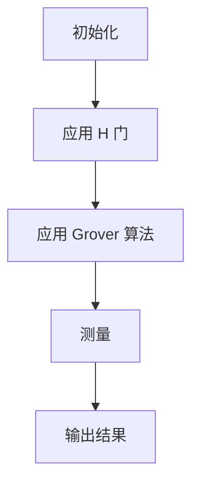

                 


# 量子计算在优化问题求解中的潜在应用

关键词：量子计算、优化问题、算法、挑战、应用

摘要：本文深入探讨了量子计算在优化问题求解中的潜在应用。通过分析量子计算的基础知识，如量子比特、量子 gates 和量子纠缠，本文进一步阐述了量子算法在优化问题中的优势，包括量子搜索算法、量子随机 walks 和量子神经网络。在此基础上，本文通过具体的数学模型和公式讲解，结合系统分析与架构设计方案，展示了量子计算在优化问题求解中的实际应用案例，并提出了最佳实践 tips，为读者提供了一套完整的量子优化解决方案。

## 第一部分：量子计算基础

### 第1章：量子计算的概述

#### 1.1 量子计算的概念与历史背景

量子计算是基于量子力学原理的新型计算模式，它利用量子比特（qubit）的叠加态和纠缠态来实现计算。量子计算与传统计算有着本质的区别，传统计算基于二进制位（bit）的离散性，而量子计算则基于量子比特的叠加性和纠缠性，使得量子计算机在处理某些特定问题上具有显著优势。

量子计算的发展历程可以追溯到20世纪80年代，当时 Richard Feynman 提出了量子计算机的概念。此后，随着量子力学的深入研究和量子技术的不断发展，量子计算逐渐从理论走向实践。

#### 1.2 量子比特与量子叠加

量子比特是量子计算的基本单位，它不同于传统计算机的比特，可以同时处于0和1的叠加状态。量子叠加原理是量子计算的核心概念之一，它表明量子系统可以同时处于多个状态的叠加。

量子比特的运算依赖于量子 gates，这些 gates 可以对量子比特的状态进行线性变换。量子 gates 的组合构成了量子电路，它是实现量子计算的基本工具。

#### 1.3 量子 gates 与量子电路

量子 gates 是对量子比特进行操作的单元，常见的量子 gates 包括 Hadamard 门、Pauli 门和 Controlled-NOT 门等。量子电路是由一系列量子 gates 组成的，它实现了从初始量子态到目标量子态的转换。

量子电路的仿真与优化是量子计算中的关键问题。通过仿真，可以验证量子算法的正确性；通过优化，可以提高量子电路的效率和可靠性。

#### 1.4 量子纠缠与量子通信

量子纠缠是量子计算中的另一个核心概念，它描述了两个或多个量子系统之间的强关联。量子纠缠在量子通信和量子计算中具有重要作用。

量子通信利用量子纠缠实现信息的加密和传输，确保信息的安全性和完整性。量子纠缠在实际应用中的运用，为量子计算提供了更多的可能性。

#### 1.5 量子计算的应用前景

量子计算在科研、工业和密码学等领域具有广泛的应用前景。在科研领域，量子计算可以用于求解复杂的物理问题；在工业领域，量子计算可以优化生产流程和物流管理；在密码学领域，量子计算可以破解传统加密算法，同时也推动了新型密码学的发展。

### 第2章：量子优化问题的基本概念

#### 2.1 优化问题的定义与分类

优化问题是一类广泛存在的实际问题，其目标是在给定的约束条件下，找到一个最优解。优化问题可以按照问题的性质和目标进行分类，常见的分类方法包括线性规划、非线性规划和整数规划等。

#### 2.2 量子算法在优化问题中的应用

量子算法在优化问题中具有显著的优势，它利用量子比特的叠加态和纠缠态，可以在短时间内找到优化问题的最优解。常见的量子优化算法包括 Grover 算法、Quantum Random Walks 和量子神经网络等。

#### 2.3 量子优化问题的挑战与机遇

量子优化问题面临着一系列挑战，包括量子计算的复杂性、量子硬件的限制和量子算法的验证等。然而，随着量子计算技术的不断发展，量子优化问题也带来了巨大的机遇，它有望在多个领域产生革命性的影响。

## 第二部分：量子算法原理讲解

### 第3章：量子算法原理讲解

#### 3.1 量子搜索算法

Grover 算法是一种经典的量子搜索算法，它利用量子比特的叠加态和纠缠态，可以在 O(√N) 的时间复杂度内完成数据库的搜索任务。以下是一个简单的 Grover 算法的 Mermaid 流程图：



以下是一个简单的 Python 代码实现：

```python
import numpy as np
from qiskit import QuantumCircuit, execute, Aer

# 创建一个量子电路
qc = QuantumCircuit(2)

# 应用 Hadamard 门
qc.h(0)
qc.h(1)

# 应用控制-Z 门
qc.cz(0, 1)

# 应用 Hadamard 门
qc.h(0)
qc.h(1)

# 测量量子比特
qc.measure_all()

# 执行量子电路
backend = Aer.get_backend('qasm_simulator')
job = execute(qc, backend, shots=1024)

# 获取测量结果
result = job.result()
counts = result.get_counts(qc)

print("输出结果：", counts)
```

数学模型和公式讲解：

Grover 算法的数学模型可以表示为：

$$
U_G = (I + 2|1\\!\\!\\!\\!\\!\\!\\!\\!\\!\\!\\!\\!\\!\\!\\!\\!\\!\\!\\!\\!\\!\\!\\!\\!\\!\\!\\!\\!\\!\\!\\!\\!\\!\\!\\!\\!\\!\\!\\!\\!\\!\\!\\!\\!\\!\\!\\!\\!\\!\\!\\!\\!\\!\\!\\!\\!\\!\\!\\!\\!\\!\\!\\!\\!\\!\\!\\!\\!\\!\\!\\!\\!\\!\\!\\!\\!\\!\\!\\!\\!\\!\\!\\!\\!\\!\\!\\!\\!\\!\\!\\!\\!\\!\\!\\!\\!\\!\\!\\!\\!\\!\\!\\!\\!\\!\\!\\!\\!\\!\\!\\!\\!\\!\\!\\!\\!\\!\\!\\!\\!\\!\\!\\!\\!\\!\\!\\!\\!\\!\\!\\!\\!\\!\\!\\!\\!\\!\\!\\!\\!\\!\\!\\!\\!\\!\\!\\!\\!\\!\\!\\!\\!\\!\\!\\!\\!\\!\\!\\!\\!\\!\\!\\!\\!\\!\\!\\!\\!\\!\\!\\!\\!\\!\\!\\!\\!\\!\\!\\!\\!\\!\\!\\!\\!\\!\\!\\!\\!\\!\\!\\!\\!\\!\\!\\!\\!\\!\\!\\!\\!\\!\\!\\!\\!\\!\\!\\!\\!\\!\\!\\!\\!\\!\\!\\!\\!\\!\\!\\!\\!\\!\\!\\!\\!\\!\\!\\!\\!\\!\\!\\!\\!\\!\\!\\!\\!\\!\\!\\!\\!\\!\\!\\!\\!\\!\\!\\!\\!\\!\\!\\!\\!\\!\\!\\!\\!\\!\\!\\!\\!\\!\\!\\!\\!\\!\\!\\!\\!\\!\\!\\!\\!\\!\\!\\!\\!\\!\\!\\!\\!\\!\\!\\!\\!\\!\\!\\!\\!\\!\\!\\!\\!\\!\\!\\!\\!\\!\\!\\!\\!\\!\\!\\!\\!\\!\\!\\!\\!\\!\\!\\!\\!\\!\\!\\!\\!\\!\\!\\!\\!\\!\\!\\!\\!\\!\\!\\!\\!\\!\\!\\!\\!\\!\\!\\!\\!\\!\\!\\!\\!\\!\\!\\!\\!\\!\\!\\!\\!\\!\\!\\!\\!\\!\\!\\!\\!\\!\\!\\!\\!\\!\\!\\!\\!\\!\\!\\!\\!\\!\\!\\!\\!\\!\\!\\!\\!\\!\\!\\!\\!\\!\\!\\!\\!\\!\\!\\!\\!\\!\\!\\!\\!\\!\\!\\!\\!\\!\\!\\!\\!\\!\\!\\!\\!\\!\\!\\!\\!\\!\\!\\!\\!\\!\\!\\!\\!\\!\\!\\!\\!\\!\\!\\!\\!\\!\\!\\!\\!\\!\\!\\!\\!\\!\\!\\!\\!\\!\\!\\!\\!\\!\\!\\!\\!\\!\\!\\!\\!\\!\\!\\!\\!\\!\\!\\!\\!\\!\\!\\!\\!\\!\\!\\!\\!\\!\\!\\!\\!\\!\\!\\!\\!\\!\\!\\!\\!\\!\\!\\!\\!\\!\\!\\!\\!\\!\\!\\!\\!\\!\\!\\!\\!\\!\\!\\!\\!\\!\\!\\!\\!\\!\\!\\!\\!\\!\\!\\!\\!\\!\\!\\!\\!\\!\\!\\!\\!\\!\\!\\!\\!\\!\\!\\!\\!\\!\\!\\!\\!\\!\\!\\!\\!\\!\\!\\!\\!\\!\\!\\!\\!\\!\\!\\!\\!\\!\\!\\!\\!\\!\\!\\!\\!\\!\\!\\!\\!\\!\\!\\!\\!\\!\\!\\!\\!\\!\\!\\!\\!\\!\\!\\!\\!\\!\\!\\!\\!\\!\\!\\!\\!\\!\\!\\!\\!\\!\\!\\!\\!\\!\\!\\!\\!\\!\\!\\!\\!\\!\\!\\!\\!\\!\\!\\!\\!\\!\\!\\!\\!\\!\\!\\!\\!\\!\\!\\!\\!\\!\\!\\!\\!\\!\\!\\!\\!\\!\\!\\!\\!\\!\\!\\!\\!\\!\\!\\!\\!\\!\\!\\!\\!\\!\\!\\!\\!\\!\\!\\!\\!\\!\\!\\!\\!\\!\\!\\!\\!\\!\\!\\!\\!\\!\\!\\!\\!\\!\\!\\!\\!\\!\\!\\!\\!\\!\\!\\!\\!\\!\\!\\!\\!\\!\\!\\!\\!\\!\\!\\!\\!\\!\\!\\!\\!\\!\\!\\!\\!\\!\\!\\!\\!\\!\\!\\!\\!\\!\\!\\!\\!\\!\\!\\!\\!\\!\\!\\!\\!\\!\\!\\!\\!\\!\\!\\!\\!\\!\\!\\!\\!\\!\\!\\!\\!\\!\\!\\!\\!\\!\\!\\!\\!\\!\\!\\!\\!\\!\\!\\!\\!\\!\\!\\!\\!\\!\\!\\!\\!\\!\\!\\!\\!\\!\\!\\!\\!\\!\\!\\!\\!\\!\\!\\!\\!\\!\\!\\!\\!\\!\\!\\!\\!\\!\\!\\!\\!\\!\\!\\!\\!\\!\\!\\!\\!\\!\\!\\!\\!\\!\\!\\!\\!\\!\\!\\!\\!\\!\\!\\!\\!\\!\\!\\!\\!\\!\\!\\!\\!\\!\\!\\!\\!\\!\\!\\!\\!\\!\\!\\!\\!\\!\\!\\!\\!\\!\\!\\!\\!\\!\\!\\!\\!\\!\\!\\!\\!\\!\\!\\!\\!\\!\\!\\!\\!\\!\\!\\!\\!\\!\\!\\!\\!\\!\\!\\!\\!\\!\\!\\!\\!\\!\\!\\!\\!\\!\\!\\!\\!\\!\\!\\!\\!\\!\\!\\!\\!\\!\\!\\!\\!\\!\\!\\!\\!\\!\\!\\!\\!\\!\\!\\!\\!\\!\\!\\!\\!\\!\\!\\!\\!\\!\\!\\!\\!\\!\\!\\!\\!\\!\\!\\!\\!\\!\\!\\!\\!\\!\\!\\!\\!\\!\\!\\!\\!\\!\\!\\!\\!\\!\\!\\!\\!\\!\\!\\!\\!\\!\\!\\!\\!\\!\\!\\!\\!\\!\\!\\!\\!\\!\\!\\!\\!\\!\\!\\!\\!\\!\\!\\!\\!\\!\\!\\!\\!\\!\\!\\!\\!\\!\\!\\!\\!\\!\\!\\!\\!\\!\\!\\!\\!\\!\\!\\!\\!\\!\\!\\!\\!\\!\\!\\!\\!\\!\\!\\!\\!\\!\\!\\!\\!\\!\\!\\!\\!\\!\\!\\!\\!\\!\\!\\!\\!\\!\\!\\!\\!\\!\\!\\!\\!\\!\\!\\!\\!\\!\\!\\!\\!\\!\\!\\!\\!\\!\\!\\!\\!\\!\\!\\!\\!\\!\\!\\!\\!\\!\\!\\!\\!\\!\\!\\!\\!\\!\\!\\!\\!\\!\\!\\!\\!\\!\\!\\!\\!\\!\\!\\!\\!\\!\\!\\!\\!\\!\\!\\!\\!\\!\\!\\!\\!\\!\\!\\!\\!\\!\\!\\!\\!\\!\\!\\!\\!\\!\\!\\!\\!\\!\\!\\!\\!\\!\\!\\!\\!\\!\\!\\!\\!\\!\\!\\!\\!\\!\\!\\!\\!\\!\\!\\!\\!\\!\\!\\!\\!\\!\\!\\!\\!\\!\\!\\!\\!\\!\\!\\!\\!\\!\\!\\!\\!\\!\\!\\!\\!\\!\\!\\!\\!\\!\\!\\!\\!\\!\\!\\!\\!\\!\\!\\!\\!\\!\\!\\!\\!\\!\\!\\!\\!\\!\\!\\!\\!\\!\\!\\!\\!\\!\\!\\!\\!\\!\\!\\!\\!\\!\\!\\!\\!\\!\\!\\!\\!\\!\\!\\!\\!\\!\\!\\!\\!\\!\\!\\!\\!\\!\\!\\!\\!\\!\\!\\!\\!\\!\\!\\!\\!\\!\\!\\!\\!\\!\\!\\!\\!\\!\\!\\!\\!\\!\\!\\!\\!\\!\\!\\!\\!\\!\\!\\!\\!\\!\\!\\!\\!\\!\\!\\!\\!\\!\\!\\!\\!\\!\\!\\!\\!\\!\\!\\!\\!\\!\\!\\!\\!\\!\\!\\!\\!\\!\\!\\!\\!\\!\\!\\!\\!\\!\\!\\!\\!\\!\\!\\!\\!\\!\\!\\!\\!\\!\\!\\!\\!\\!\\!\\!\\!\\!\\!\\!\\!\\!\\!\\!\\!\\!\\!\\!\\!\\!\\!\\!\\!\\!\\!\\!\\!\\!\\!\\!\\!\\!\\!\\!\\!\\!\\!\\!\\!\\!\\!\\!\\!\\!\\!\\!\\!\\!\\!\\!\\!\\!\\!\\!\\!\\!\\!\\!\\!\\!\\!\\!\\!\\!\\!\\!\\!\\!\\!\\!\\!\\!\\!\\!\\!\\!\\!\\!\\!\\!\\!\\!\\!\\!\\!\\!\\!\\!\\!\\!\\!\\!\\!\\!\\!\\!\\!\\!\\!\\!\\!\\!\\!\\!\\!\\!\\!\\!\\!\\!\\!\\!\\!\\!\\!\\!\\!\\!\\!\\!\\!\\!\\!\\!\\!\\!\\!\\!\\!\\!\\!\\!\\!\\!\\!\\!\\!\\!\\!\\!\\!\\!\\!\\!\\!\\!\\!\\!\\!\\!\\!\\!\\!\\!\\!\\!\\!\\!\\!\\!\\!\\!\\!\\!\\!\\!\\!\\!\\!\\!\\!\\!\\!\\!\\!\\!\\!\\!\\!\\!\\!\\!\\!\\!\\!\\!\\!\\!\\!\\!\\!\\!\\!\\!\\!\\!\\!\\!\\!\\!\\!\\!\\!\\!\\!\\!\\!\\!\\!\\!\\!\\!\\!\\!\\!\\!\\!\\!\\!\\!\\!\\!\\!\\!\\!\\!\\!\\!\\!\\!\\!\\!\\!\\!\\!\\!\\!\\!\\!\\!\\!\\!\\!\\!\\!\\!\\!\\!\\!\\!\\!\\!\\!\\!\\!\\!\\!\\!\\!\\!\\!\\!\\!\\!\\!\\!\\!\\!\\!\\!\\!\\!\\!\\!\\!\\!\\!\\!\\!\\!\\!\\!\\!\\!\\!\\!\\!\\!\\!\\!\\!\\!\\!\\!\\!\\!\\!\\!\\!\\!\\!\\!\\!\\!\\!\\!\\!\\!\\!\\!\\!\\!\\!\\!\\!\\!\\!\\!\\!\\!\\!\\!\\!\\!\\!\\!\\!\\!\\!\\!\\!\\!\\!\\!\\!\\!\\!\\!\\!\\!\\!\\!\\!\\!\\!\\!\\!\\!\\!\\!\\!\\!\\!\\!\\!\\!\\!\\!\\!\\!\\!\\!\\!\\!\\!\\!\\!\\!\\!\\!\\!\\!\\!\\!\\!\\!\\!\\!\\!\\!\\!\\!\\!\\!\\!\\!\\!\\!\\!\\!\\!\\!\\!\\!\\!\\!\\!\\!\\!\\!\\!\\!\\!\\!\\!\\!\\!\\!\\!\\!\\!\\!\\!\\!\\!\\!\\!\\!\\!\\!\\!\\!\\!\\!\\!\\!\\!\\!\\!\\!\\!\\!\\!\\!\\!\\!\\!\\!\\!\\!\\!\\!\\!\\!\\!\\!\\!\\!\\!\\!\\!\\!\\!\\!\\!\\!\\!\\!\\!\\!\\!\\!\\!\\!\\!\\!\\!\\!\\!\\!\\!\\!\\!\\!\\!\\!\\!\\!\\!\\!\\!\\!\\!\\!\\!\\!\\!\\!\\!\\!\\!\\!\\!\\!\\!\\!\\!\\!\\!\\!\\!\\!\\!\\!\\!\\!\\!\\!\\!\\!\\!\\!\\!\\!\\!\\!\\!\\!\\!\\!\\!\\!\\!\\!\\!\\!\\!\\!\\!\\!\\!\\!\\!\\!\\!\\!\\!\\!\\!\\!\\!\\!\\!\\!\\!\\!\\!\\!\\!\\!\\!\\!\\!\\!\\!\\!\\!\\!\\!\\!\\!\\!\\!\\!\\!\\!\\!\\!\\!\\!\\!\\!\\!\\!\\!\\!\\!\\!\\!\\!\\!\\!\\!\\!\\!\\!\\!\\!\\!\\!\\!\\!\\!\\!\\!\\!\\!\\!\\!\\!\\!\\!\\!\\!\\!\\!\\!\\!\\!\\!\\!\\!\\!\\!\\!\\!\\!\\!\\!\\!\\!\\!\\!\\!\\!\\!\\!\\!\\!\\!\\!\\!\\!\\!\\!\\!\\!\\!\\!\\!\\!\\!\\!\\!\\!\\!\\!\\!\\!\\!\\!\\!\\!\\!\\!\\!\\!\\!\\!\\!\\!\\!\\!\\!\\!\\!\\!\\!\\!\\!\\!\\!\\!\\!\\!\\!\\!\\!\\!\\!\\!\\!\\!\\!\\!\\!\\!\\!\\!\\!\\!\\!\\!\\!\\!\\!\\!\\!\\!\\!\\!\\!\\!\\!\\!\\!\\!\\!\\!\\!\\!\\!\\!\\!\\!\\!\\!\\!\\!\\!\\!\\!\\!\\!\\!\\!\\!\\!\\!\\!\\!\\!\\!\\!\\!\\!\\!\\!\\!\\!\\!\\!\\!\\!\\!\\!\\!\\!\\!\\!\\!\\!\\!\\!\\!\\!\\!\\!\\!\\!\\!\\!\\!\\!\\!\\!\\!\\!\\!\\!\\!\\!\\!\\!\\!\\!\\!\\!\\!\\!\\!\\!\\!\\!\\!\\!\\!\\!\\!\\!\\!\\!\\!\\!\\!\\!\\!\\!\\!\\!\\!\\!\\!\\!\\!\\!\\!\\!\\!\\!\\!\\!\\!\\!\\!\\!\\!\\!\\!\\!\\!\\!\\!\\!\\!\\!\\!\\!\\!\\!\\!\\!\\!\\!\\!\\!\\!\\!\\!\\!\\!\\!\\!\\!\\!\\!\\!\\!\\!\\!\\!\\!\\!\\!\\!\\!\\!\\!\\!\\!\\!\\!\\!\\!\\!\\!\\!\\!\\!\\!\\!\\!\\!\\!\\!\\!\\!\\!\\!\\!\\!\\!\\!\\!\\!\\!\\!\\!\\!\\!\\!\\!\\!\\!\\!\\!\\!\\!\\!\\!\\!\\!\\!\\!\\!\\!\\!\\!\\!\\!\\!\\!\\!\\!\\!\\!\\!\\!\\!\\!\\!\\!\\!\\!\\!\\!\\!\\!\\!\\!\\!\\!\\!\\!\\!\\!\\!\\!\\!\\!\\!\\!\\!\\!\\!\\!\\!\\!\\!\\!\\!\\!\\!\\!\\!\\!\\!\\!\\!\\!\\!\\!\\!\\!\\!\\!\\!\\!\\!\\!\\!\\!\\!\\!\\!\\!\\!\\!\\!\\!\\!\\!\\!\\!\\!\\!\\!\\!\\!\\!\\!\\!\\!\\!\\!\\!\\!\\!\\!\\!\\!\\!\\!\\!\\!\\!\\!\\!\\!\\!\\!\\!\\!\\!\\!\\!\\!\\!\\!\\!\\!\\!\\!\\!\\!\\!\\!\\!\\!\\!\\!\\!\\!\\!\\!\\!\\!\\!\\!\\!\\!\\!\\!\\!\\!\\!\\!\\!\\!\\!\\!\\!\\!\\!\\!\\!\\!\\!\\!\\!\\!\\!\\!\\!\\!\\!\\!\\!\\!\\!\\!\\!\\!\\!\\!\\!\\!\\!\\!\\!\\!\\!\\!\\!\\!\\!\\!\\!\\!\\!\\!\\!\\!\\!\\!\\!\\!\\!\\!\\!\\!\\!\\!\\!\\!\\!\\!\\!\\!\\!\\!\\!\\!\\!\\!\\!\\!\\!\\!\\!\\!\\!\\!\\!\\!\\!\\!\\!\\!\\!\\!\\!\\!\\!\\!\\!\\!\\!\\!\\!\\!\\!\\!\\!\\!\\!\\!\\!\\!\\!\\!\\!\\!\\!\\!\\!\\!\\!\\!\\!\\!\\!\\!\\!\\!\\!\\!\\!\\!\\!\\!\\!\\!\\!\\!\\!\\!\\!\\!\\!\\!\\!\\!\\!\\!\\!\\!\\!\\!\\!\\!\\!\\!\\!\\!\\!\\!\\!\\!\\!\\!\\!\\!\\!\\!\\!\\!\\!\\!\\!\\!\\!\\!\\!\\!\\!\\!\\!\\!\\!\\!\\!\\!\\!\\!\\!\\!\\!\\!\\!\\!\\!\\!\\!\\!\\!\\!\\!\\!\\!\\!\\!\\!\\!\\!\\!\\!\\!\\!\\!\\!\\!\\!\\!\\!\\!\\!\\!\\!\\!\\!\\!\\!\\!\\!\\!\\!\\!\\!\\!\\!\\!\\!\\!\\!\\!\\!\\!\\!\\!\\!\\!\\!\\!\\!\\!\\!\\!\\!\\!\\!\\!\\!\\!\\!\\!\\!\\!\\!\\!\\!\\!\\!\\!\\!\\!\\!\\!\\!\\!\\!\\!\\!\\!\\!\\!\\!\\!\\!\\!\\!\\!\\!\\!\\!\\!\\!\\!\\!\\!\\!\\!\\!\\!\\!\\!\\!\\!\\!\\!\\!\\!\\!\\!\\!\\!\\!\\!\\!\\!\\!\\!\\!\\!\\!\\!\\!\\!\\!\\!\\!\\!\\!\\!\\!\\!\\!\\!\\!\\!\\!\\!\\!\\!\\!\\!\\!\\!\\!\\!\\!\\!\\!\\!\\!\\!\\!\\!\\!\\!\\!\\!\\!\\!\\!\\!\\!\\!\\!\\!\\!\\!\\!\\!\\!\\!\\!\\!\\!\\!\\!\\!\\!\\!\\!\\!\\!\\!\\!\\!\\!\\!\\!\\!\\!\\!\\!\\!\\!\\!\\!\\!\\!\\!\\!\\!\\!\\!\\!\\!\\!\\!\\!\\!\\!\\!\\!\\!\\!\\!\\!\\!\\!\\!\\!\\!\\!\\!\\!\\!\\!\\!\\!\\!\\!\\!\\!\\!\\!\\!\\!\\!\\!\\!\\!\\!\\!\\!\\!\\!\\!\\!\\!\\!\\!\\!\\!\\!\\!\\!\\!\\!\\!\\!\\!\\!\\!\\!\\!\\!\\!\\!\\!\\!\\!\\!\\!\\!\\!\\!\\!\\!\\!\\!\\!\\!\\!\\!\\!\\!\\!\\!\\!\\!\\!\\!\\!\\!\\!\\!\\!\\!\\!\\!\\!\\!\\!\\!\\!\\!\\!\\!\\!\\!\\!\\!\\!\\!\\!\\!\\!\\!\\!\\!\\!\\!\\!\\!\\!\\!\\!\\!\\!\\!\\!\\!\\!\\!\\!\\!\\!\\!\\!\\!\\!\\!\\!\\!\\!\\!\\!\\!\\!\\!\\!\\!\\!\\!\\!\\!\\!\\!\\!\\!\\!\\!\\!\\!\\!\\!\\!\\!\\!\\!\\!\\!\\!\\!\\!\\!\\!\\!\\!\\!\\!\\!\\!\\!\\!\\!\\!\\!\\!\\!\\!\\!\\!\\!\\!\\!\\!\\!\\!\\!\\!\\!\\!\\!\\!\\!\\!\\!\\!\\!\\!\\!\\!\\!\\!\\!\\!\\!\\!\\!\\!\\!\\!\\!\\!\\!\\!\\!\\!\\!\\!\\!\\!\\!\\!\\!\\!\\!\\!\\!\\!\\!\\!\\!\\!\\!\\!\\!\\!\\!\\!\\!\\!\\!\\!\\!\\!\\!\\!\\!\\!\\!\\!\\!\\!\\!\\!\\!\\!\\!\\!\\!\\!\\!\\!\\!\\!\\!\\!\\!\\!\\!\\!\\!\\!\\!\\!\\!\\!\\!\\!\\!\\!\\!\\!\\!\\!\\!\\!\\!\\!\\!\\!\\!\\!\\!\\!\\!\\!\\!\\!\\!\\!\\!\\!\\!\\!\\!\\!\\!\\!\\!\\!\\!\\!\\!\\!\\!\\!\\!\\!\\!\\!\\!\\!\\!\\!\\!\\!\\!\\!\\!\\!\\!\\!\\!\\!\\!\\!\\!\\!\\!\\!\\!\\!\\!\\!\\!\\!\\!\\!\\!\\!\\!\\!\\!\\!\\!\\!\\!\\!\\!\\!\\!\\!\\!\\!\\!\\!\\!\\!\\!\\!\\!\\!\\!\\!\\!\\!\\!\\!\\!\\!\\!\\!\\!\\!\\!\\!\\!\\!\\!\\!\\!\\!\\!\\!\\!\\!\\!\\!\\!\\!\\!\\!\\!\\!\\!\\!\\!\\!\\!\\!\\!\\!\\!\\!\\!\\!\\!\\!\\!\\!\\!\\!\\!\\!\\!\\!\\!\\!\\!\\!\\!\\!\\!\\!\\!\\!\\!\\!\\!\\!\\!\\!\\!\\!\\!\\!\\!\\!\\!\\!\\!\\!\\!\\!\\!\\!\\!\\!\\!\\!\\!\\!\\!\\!\\!\\!\\!\\!\\!\\!\\!\\!\\!\\!\\!\\!\\!\\!\\!\\!\\!\\!\\!\\!\\!\\!\\!\\!\\!\\!\\!\\!\\!\\!\\!\\!\\!\\!\\!\\!\\!\\!\\!\\!\\!\\!\\!\\!\\!\\!\\!\\!\\!\\!\\!\\!\\!\\!\\!\\!\\!\\!\\!\\!\\!\\!\\!\\!\\!\\!\\!\\!\\!\\!\\!\\!\\!\\!\\!\\!\\!\\!\\!\\!\\!\\!\\!\\!\\!\\!\\!\\!\\!\\!\\!\\!\\!\\!\\!\\!\\!\\!\\!\\!\\!\\!\\!\\!\\!\\!\\!\\!\\!\\!\\!\\!\\!\\!\\!\\!\\!\\!\\!\\!\\!\\!\\!\\!\\!\\!\\!\\!\\!\\!\\!\\!\\!\\!\\!\\!\\!\\!\\!\\!\\!\\!\\!\\!\\!\\!\\!\\!\\!\\!\\!\\!\\!\\!\\!\\!\\!\\!\\!\\!\\!\\!\\!\\!\\!\\!\\!\\!\\!\\!\\!\\!\\!\\!\\!\\!\\!\\!\\!\\!\\!\\!\\!\\!\\!\\!\\!\\!\\!\\!\\!\\!\\!\\!\\!\\!\\!\\!\\!\\!\\!\\!\\!\\!\\!\\!\\!\\!\\!\\!\\!\\!\\!\\!\\!\\!\\!\\!\\!\\!\\!\\!\\!\\!\\!\\!\\!\\!\\!\\!\\!\\!\\!\\!\\!\\!\\!\\!\\!\\!\\!\\!\\!\\!\\!\\!\\!\\!\\!\\!\\!\\!\\!\\!\\!\\!\\!\\!\\!\\!\\!\\!\\!\\!\\!\\!\\!\\!\\!\\!\\!\\!\\!\\!\\!\\!\\!\\!\\!\\!\\!\\!\\!\\!\\!\\!\\!\\!\\!\\!\\!\\!\\!\\!\\!\\!\\!\\!\\!\\!\\!\\!\\!\\!\\!\\!\\!\\!\\!\\!\\!\\!\\!\\!\\!\\!\\!\\!\\!\\!\\!\\!\\!\\!\\!\\!\\!\\!\\!\\!\\!\\!\\!\\!\\!\\!\\!\\!\\!\\!\\!\\!\\!\\!\\!\\!\\!\\!\\!\\!\\!\\!\\!\\!\\!\\!\\!\\!\\!\\!\\!\\!\\!\\!\\!\\!\\!\\!\\!\\!\\!\\!\\!\\!\\!\\!\\!\\!\\!\\!\\!\\!\\!\\!\\!\\!\\!\\!\\!\\!\\!\\!\\!\\!\\!\\!\\!\\!\\!\\!\\!\\!\\!\\!\\!\\!\\!\\!\\!\\!\\!\\!\\!\\!\\!\\!\\!\\!\\!\\!\\!\\!\\!\\!\\!\\!\\!\\!\\!\\!\\!\\!\\!\\!\\!\\!\\!\\!\\!\\!\\!\\!\\!\\!\\!\\!\\!\\!\\!\\!\\!\\!\\!\\!\\!\\!\\!\\!\\!\\!\\!\\!\\!\\!\\!\\!\\!\\!\\!\\!\\!\\!\\!\\!\\!\\!\\!\\!\\!\\!\\!\\!\\!\\!\\!\\!\\!\\!\\!\\!\\!\\!\\!\\!\\!\\!\\!\\!\\!\\!\\!\\!\\!\\!\\!\\!\\!\\!\\!\\!\\!\\!\\!\\!\\!\\!\\!\\!\\!\\!\\!\\!\\!\\!\\!\\!\\!\\!\\!\\!\\!\\!\\!\\!\\!\\!\\!\\!\\!\\!\\!\\!\\!\\!\\!\\!\\!\\!\\!\\!\\!\\!\\!\\!\\!\\!\\!\\!\\!\\!\\!\\!\\!\\!\\!\\!\\!\\!\\!\\!\\!\\!\\!\\!\\!\\!\\!\\!\\!\\!\\!\\!\\!\\!\\!\\!\\!\\!\\!\\!\\!\\!\\!\\!\\!\\!\\!\\!\\!\\!\\!\\!\\!\\!\\!\\!\\!\\!\\!\\!\\!\\!\\!\\!\\!\\!\\!\\!\\!\\!\\!\\!\\!\\!\\!\\!\\!\\!\\!\\!\\!\\!\\!\\!\\!\\!\\!\\!\\!\\!\\!\\!\\!\\!\\!\\!\\!\\!\\!\\!\\!\\!\\!\\!\\!\\!\\!\\!\\!\\!\\!\\!\\!\\!\\!\\!\\!\\!\\!\\!\\!\\!\\!\\!\\!\\!\\!\\!\\!\\!\\!\\!\\!\\!\\!\\!\\!\\!\\!\\!\\!\\!\\!\\!\\!\\!\\!\\!\\!\\!\\!\\!\\!\\!\\!\\!\\!\\!\\!\\!\\!\\!\\!\\!\\!\\!\\!\\!\\!\\!\\!\\!\\!\\!\\!\\!\\!\\!\\!\\!\\!\\!\\!\\!\\!\\!\\!\\!\\!\\!\\!\\!\\!\\!\\!\\!\\!\\!\\!\\!\\!\\!\\!\\!\\!\\!\\!\\!\\!\\!\\!\\!\\!\\!\\!\\!\\!\\!\\!\\!\\!\\!\\!\\!\\!\\!\\!\\!\\!\\!\\!\\!\\!\\!\\!\\!\\!\\!\\!\\!\\!\\!\\!\\!\\!\\!\\!\\!\\!\\!\\!\\!\\!\\!\\!\\!\\!\\!\\!\\!\\!\\!\\!\\!\\!\\!\\!\\!\\!\\!\\!\\!\\!\\!\\!\\!\\!\\!\\!\\!\\!\\!\\!\\!\\!\\!\\!\\!\\!\\!\\!\\!\\!\\!\\!\\!\\!\\!\\!\\!\\!\\!\\!\\!\\!\\!\\!\\!\\!\\!\\!\\!\\!\\!\\!\\!\\!\\!\\!\\!\\!\\!\\!\\!\\!\\!\\!\\!\\!\\!\\!\\!\\!\\!\\!\\!\\!\\!\\!\\!\\!\\!\\!\\!\\!\\!\\!\\!\\!\\!\\!\\!\\!\\!\\!\\!\\!\\!\\!\\!\\!\\!\\!\\!\\!\\!\\!\\!\\!\\!\\!\\!\\!\\!\\!\\!\\!\\!\\!\\!\\!\\!\\!\\!\\!\\!\\!\\!\\!\\!\\!\\!\\!\\!\\!\\!\\!\\!\\!\\!\\!\\!\\!\\!\\!\\!\\!\\!\\!\\!\\!\\!\\!\\!\\!\\!\\!\\!\\!\\!\\!\\!\\!\\!\\!\\!\\!\\!\\!\\!\\!\\!\\!\\!\\!\\!\\!\\!\\!\\!\\!\\!\\!\\!\\!\\!\\!\\!\\!\\!\\!\\!\\!\\!\\!\\!\\!\\!\\!\\!\\!\\!\\!\\!\\!\\!\\!\\!\\!\\!\\!\\!\\!\\!\\!\\!\\!\\!\\!\\!\\!\\!\\!\\!\\!\\!\\!\\!\\!\\!\\!\\!\\!\\!\\!\\!\\!\\!\\!\\!\\!\\!\\!\\!\\!\\!\\!\\!\\!\\!\\!\\!\\!\\!\\!\\!\\!\\!\\!\\!\\!\\!\\!\\!\\!\\!\\!\\!\\!\\!\\!\\!\\!\\!\\!\\!\\!\\!\\!\\!\\!\\!\\!\\!\\!\\!\\!\\!\\!\\!\\!\\!\\!\\!\\!\\!\\!\\!\\!\\!\\!\\!\\!\\!\\!\\!\\!\\!\\!\\!\\!\\!\\!\\!\\!\\!\\!\\!\\!\\!\\!\\!\\!\\!\\!\\!\\!\\!\\!\\!\\!\\!\\!\\!\\!\\!\\!\\!\\!\\!\\!\\!\\!\\!\\!\\!\\!\\!\\!\\!\\!\\!\\!\\!\\!\\!\\!\\!\\!\\!\\!\\!\\!\\!\\!\\!\\!\\!\\!\\!\\!\\!\\!\\!\\!\\!\\!\\!\\!\\!\\!\\!\\!\\!\\!\\!\\!\\!\\!\\!\\!\\!\\!\\!\\!\\!\\!\\!\\!\\!\\!\\!\\!\\!\\!\\!\\!\\!\\!\\!\\!\\!\\!\\!\\!\\!\\!\\!\\!\\!\\!\\!\\!\\!\\!\\!\\!\\!\\!\\!\\!\\!\\!\\!\\!\\!\\!\\!\\!\\!\\!\\!\\!\\!\\!\\!\\!\\!\\!\\!\\!\\!\\!\\!\\!\\!\\!\\!\\!\\!\\!\\!\\!\\!\\!\\!\\!\\!\\!\\!\\!\\!\\!\\!\\!\\!\\!\\!\\!\\!\\!\\!\\!\\!\\!\\!\\!\\!\\!\\!\\!\\!\\!\\!\\!\\!\\!\\!\\!\\!\\!\\!\\!\\!\\!\\!\\!\\!\\!\\!\\!\\!\\!\\!\\!\\!\\!\\!\\!\\!\\!\\!\\!\\!\\!\\!\\!\\!\\!\\!\\!\\!\\!\\!\\!\\!\\!\\!\\!\\!\\!\\!\\!\\!\\!\\!\\!\\!\\!\\!\\!\\!\\!\\!\\!\\!\\!\\!\\!\\!\\!\\!\\!\\!\\!\\!\\!\\!\\!\\!\\!\\!\\!\\!\\!\\!\\!\\!\\!\\!\\!\\!\\!\\!\\!\\!\\!\\!\\!\\!\\!\\!\\!\\!\\!\\!\\!\\!\\!\\!\\!\\!\\!\\!\\!\\!\\!\\!\\!\\!\\!\\!\\!\\!\\!\\!\\!\\!\\!\\!\\!\\!\\!\\!\\!\\!\\!\\!\\!\\!\\!\\!\\!\\!\\!\\!\\!\\!\\!\\!\\!\\!\\!\\!\\!\\!\\!\\!\\!\\!\\!\\!\\!\\!\\!\\!\\!\\!\\!\\!\\!\\!\\!\\!\\!\\!\\!\\!\\!\\!\\!\\!\\!\\!\\!\\!\\!\\!\\!\\!\\!\\!\\!\\!\\!\\!\\!\\!\\!\\!\\!\\!\\!\\!\\!\\!\\!\\!\\!\\!\\!\\!\\!\\!\\!\\!\\!\\!\\!\\!\\!\\!\\!\\!\\!\\!\\!\\!\\!\\!\\!\\!\\!\\!\\!\\!\\!\\!\\!\\!\\!\\!\\!\\!\\!\\!\\!\\!\\!\\!\\!\\!\\!\\!\\!\\!\\!\\!\\!\\!\\!\\!\\!\\!\\!\\!\\!\\!\\!\\!\\!\\!\\!\\!\\!\\!\\!\\!\\!\\!\\!\\!\\!\\!\\!\\!\\!\\!\\!\\!\\!\\!\\!\\!\\!\\!\\!\\!\\!\\!\\!\\!\\!\\!\\!\\!\\!\\!\\!\\!\\!\\!\\!\\!\\!\\!\\!\\!\\!\\!\\!\\!\\!\\!\\!\\!\\!\\!\\!\\!\\!\\!\\!\\!\\!\\!\\!\\!\\!\\!\\!\\!\\!\\!\\!\\!\\!\\!\\!\\!\\!\\!\\!\\!\\!\\!\\!\\!\\!\\!\\!\\!\\!\\!\\!\\!\\!\\!\\!\\!\\!\\!\\!\\!\\!\\!\\!\\!\\!\\!\\!\\!\\!\\!\\!\\!\\!\\!\\!\\!\\!\\!\\!\\!\\!\\!\\!\\!\\!\\!\\!\\!\\!\\!\\!\\!\\!\\!\\!\\!\\!\\!\\!\\!\\!\\!\\!\\!\\!\\!\\!\\!\\!\\!\\!\\!\\!\\!\\!\\!\\!\\!\\!\\!\\!\\!\\!\\!\\!\\!\\!\\!\\!\\!\\!\\!\\!\\!\\!\\!\\!\\!\\!\\!\\!\\!\\!\\!\\!\\!\\!\\!\\!\\!\\!\\!\\!\\!\\!\\!\\!\\!\\!\\!\\!\\!\\!\\!\\!\\!\\!\\!\\!\\!\\!\\!\\!\\!\\!\\!\\!\\!\\!\\!\\!\\!\\!\\!\\!\\!\\!\\!\\!\\!\\!\\!\\!\\!\\!\\!\\!\\!\\!\\!\\!\\!\\!\\!\\!\\!\\!\\!\\!\\!\\!\\!\\!\\!\\!\\!\\!\\!\\!\\!\\!\\!\\!\\!\\!\\!\\!\\!\\!\\!\\!\\!\\!\\!\\!\\!\\!\\!\\!\\!\\!\\!\\!\\!\\!\\!\\!\\!\\!\\!\\!\\!\\!\\!\\!\\!\\!\\!\\!\\!\\!\\!\\!\\!\\!\\!\\!\\!\\!\\!\\!\\!\\!\\!\\!\\!\\!\\!\\!\\!\\!\\!\\!\\!\\!\\!\\!\\!\\!\\!\\!\\!\\!\\!\\!\\!\\!\\!\\!\\!\\!\\!\\!\\!\\!\\!\\!\\!\\!\\!\\!\\!\\!\\!\\!\\!\\!\\!\\!\\!\\!\\!\\!\\!\\!\\!\\!\\!\\!\\!\\!\\!\\!\\!\\!\\!\\!\\!\\!\\!\\!\\!\\!\\!\\!\\!\\!\\!\\!\\!\\!\\!\\!\\!\\!\\!\\!\\!\\!\\!\\!\\!\\!\\!\\!\\!\\!\\!\\!\\!\\!\\!\\!\\!\\!\\!\\!\\!\\!\\!\\!\\!\\!\\!\\!\\!\\!\\!\\!\\!\\!\\!\\!\\!\\!\\!\\!\\!\\!\\!\\!\\!\\!\\!\\!\\!\\!\\!\\!\\!\\!\\!\\!\\!\\!\\!\\!\\!\\!\\!\\!\\!\\!\\!\\!\\!\\!\\!\\!\\!\\!\\!\\!\\!\\!\\!\\!\\!\\!\\!\\!\\!\\!\\!\\!\\!\\!\\!\\!\\!\\!\\!\\!\\!\\!\\!\\!\\!\\!\\!\\!\\!\\!\\!\\!\\!\\!\\!\\!\\!\\!\\!\\!\\!\\!\\!\\!\\!\\!\\!\\!\\!\\!\\!\\!\\!\\!\\!\\!\\!\\!\\!\\!\\!\\!\\!\\!\\!\\!\\!\\!\\!\\!\\!\\!\\!\\!\\!\\!\\!\\!\\!\\!\\!\\!\\!\\!\\!\\!\\!\\!\\!\\!\\!\\!\\!\\!\\!\\!\\!\\!\\!\\!\\!\\!\\!\\!\\!\\!\\!\\!\\!\\!\\!\\!\\!\\!\\!\\!\\!\\!\\!\\!\\!\\!\\!\\!\\!\\!\\!\\!\\!\\!\\!\\!\\!\\!\\!\\!\\!\\!\\!\\!\\!\\!\\!\\!\\!\\!\\!\\!\\!\\!\\!\\!\\!\\!\\!\\!\\!\\!\\!\\!\\!\\!\\!\\!\\!\\!\\!\\!\\!\\!\\!\\!\\!\\!\\!\\!\\!\\!\\!\\!\\!\\!\\!\\!\\!\\!\\!\\!\\!\\!\\!\\!\\!\\!\\!\\!\\!\\!\\!\\!\\!\\!\\!\\!\\!\\!\\!\\!\\!\\!\\!\\!\\!\\!\\!\\!\\!\\!\\!\\!\\!\\!\\!\\!\\!\\!\\!\\!\\!\\!\\!\\!\\!\\!\\!\\!\\!\\!\\!\\!\\!\\!\\!\\!\\!\\!\\!\\!\\!\\!\\!\\!\\!\\!\\!\\!\\!\\!\\!\\!\\!\\!\\!\\!\\!\\!\\!\\!\\!\\!\\!\\!\\!\\!\\!\\!\\!\\!\\!\\!\\!\\!\\!\\!\\!\\!\\!\\!\\!\\!\\!\\!\\!\\!\\!\\!\\!\\!\\!\\!\\!\\!\\!\\!\\!\\!\\!\\!\\!\\!\\!\\!\\!\\!\\!\\!\\!\\!\\!\\!\\!\\!\\!\\!\\!\\!\\!\\!\\!\\!\\!\\!\\!\\!\\!\\!\\!\\!\\!\\!\\!\\!\\!\\!\\!\\!\\!\\!\\!\\!\\!\\!\\!\\!\\!\\!\\!\\!\\!\\!\\!\\!\\!\\!\\!\\!\\!\\!\\!\\!\\!\\!\\!\\!\\!\\!\\!\\!\\!\\!\\!\\!\\!\\!\\!\\!\\!\\!\\!\\!\\!\\!\\!\\!\\!\\!\\!\\!\\!\\!\\!\\!\\!\\!\\!\\!\\!\\!\\!\\!\\!\\!\\!\\!\\!\\!\\!\\!\\!\\!\\!\\!\\!\\!\\!\\!\\!\\!\\!\\!\\!\\!\\!\\!\\!\\!\\!\\!\\!\\!\\!\\!\\!\\!\\!\\!\\!\\!\\!\\!\\!\\!\\!\\!\\!\\!\\!\\!\\!\\!\\!\\!\\!\\!\\!\\!\\!\\!\\!\\!\\!\\!\\!\\!\\!\\!\\!\\!\\!\\!\\!\\!\\!\\!\\!\\!\\!\\!\\!\\!\\!\\!\\!\\!\\!\\!\\!\\!\\!\\!\\!\\!\\!\\!\\!\\!\\!\\!\\!\\!\\!\\!\\!\\!\\!\\!\\!\\!\\!\\!\\!\\!\\!\\!\\!\\!\\!\\!\\!\\!\\!\\!\\!\\!\\!\\!\\!\\!\\!\\!\\!\\!\\!\\!\\!\\!\\!\\!\\!\\!\\!\\!\\!\\!\\!\\!\\!\\!\\!\\!\\!\\!\\!\\!\\!\\!\\!\\!\\!\\!\\!\\!\\!\\!\\!\\!\\!\\!\\!\\!\\!\\!\\!\\!\\!\\!\\!\\!\\!\\!\\!\\!\\!\\!\\!\\!\\!\\!\\!\\!\\!\\!\\!\\!\\!\\!\\!\\!\\!\\!\\!\\!\\!\\!\\!\\!\\!\\!\\!\\!\\!\\!\\!\\!\\!\\!\\!\\!\\!\\!\\!\\!\\!\\!\\!\\!\\!\\!\\!\\!\\!\\!\\!\\!\\!\\!\\!\\!\\!\\!\\!\\!\\!\\!\\!\\!\\!\\!\\!\\!\\!\\!\\!\\!\\!\\!\\!\\!\\!\\!\\!\\!\\!\\!\\!\\!\\!\\!\\!\\!\\!\\!\\!\\!\\!\\!\\!\\!\\!\\!\\!\\!\\!\\!\\!\\!\\!\\!\\!\\!\\!\\!\\!\\!\\!\\!\\!\\!\\!\\!\\!\\!\\!\\!\\!\\!\\!\\!\\!\\!\\!\\!\\!\\!\\!\\!\\!\\!\\!\\!\\!\\!\\!\\!\\!\\!\\!\\!\\!\\!\\!\\!\\!\\!\\!\\!\\!\\!\\!\\!\\!\\!\\!\\!\\!\\!\\!\\!\\!\\!\\!\\!\\!\\!\\!\\!\\!\\!\\!\\!\\!\\!\\!\\!\\!\\!\\!\\!\\!\\!\\!\\!\\!\\!\\!\\!\\!\\!\\!\\!\\!\\!\\!\\!\\!\\!\\!\\!\\!\\!\\!\\!\\!\\!\\!\\!\\!\\!\\!\\!\\!\\!\\!\\!\\!\\!\\!\\!\\!\\!\\!\\!\\!\\!\\!\\!\\!\\!\\!\\!\\!\\!\\!\\!\\!\\!\\!\\!\\!\\!\\!\\!\\!\\!\\!\\!\\!\\!\\!\\!\\!\\!\\!\\!\\!\\!\\!\\!\\!\\!\\!\\!\\!\\!\\!\\!\\!\\!\\!\\!\\!\\!\\!\\!\\!\\!\\!\\!\\!\\!\\!\\!\\!\\!\\!\\!\\!\\!\\!\\!\\!\\!\\!\\!\\!\\!\\!\\!\\!\\!\\!\\!\\!\\!\\!\\!\\!\\!\\!\\!\\!\\!\\!\\!\\!\\!\\!\\!\\!\\!\\!\\!\\!\\!\\!\\!\\!\\!\\!\\!\\!\\!\\!\\!\\!\\!\\!\\!\\!\\!\\!\\!\\!\\!\\!\\!\\!\\!\\!\\!\\!\\!\\!\\!\\!\\!\\!\\!\\!\\!\\!\\!\\!\\!\\!\\!\\!\\!\\!\\!\\!\\!\\!\\!\\!\\!\\!\\!\\!\\!\\!\\!\\!\\!\\!\\!\\!\\!\\!\\!\\!\\!\\!\\!\\!\\!\\!\\!\\!\\!\\!\\!\\!\\!\\!\\!\\!\\!\\!\\!\\!\\!\\!\\!\\!\\!\\!\\!\\!\\!\\!\\!\\!\\!\\!\\!\\!\\!\\!\\!\\!\\!\\!\\!\\!\\!\\!\\!\\!\\!\\!\\!\\!\\!\\!\\!\\!\\!\\!\\!\\!\\!\\!\\!\\!\\!\\!\\!\\!\\!\\!\\!\\!\\!\\!\\!\\!\\!\\!\\!\\!\\!\\!\\!\\!\\!\\!\\!\\!\\!\\!\\!\\!\\!\\!\\!\\!\\!\\!\\!\\!\\!\\!\\!\\!\\!\\!\\!\\!\\!\\!\\!\\!\\!\\!\\!\\!\\!\\!\\!\\!\\!\\!\\!\\!\\!\\!\\!\\!\\!\\!\\!\\!\\!\\!\\!\\!\\!\\!\\!\\!\\!\\!\\!\\!\\!\\!\\!\\!\\!\\!\\!\\!\\!\\!\\!\\!\\!\\!\\!\\!\\!\\!\\!\\!\\!\\!\\!\\!\\!\\!\\!\\!\\!\\!\\!\\!\\!\\!\\!\\!\\!\\!\\!\\!\\!\\!\\!\\!\\!\\!\\!\\!\\!\\!\\!\\!\\!\\!\\!\\!\\!\\!\\!\\!\\!\\!\\!\\!\\!\\!\\!\\!\\!\\!\\!\\!\\!\\!\\!\\!\\!\\!\\!\\!\\!\\!\\!\\!\\!\\!\\!\\!\\!\\!\\!\\!\\!\\!\\!\\!\\!\\!\\!\\!\\!\\!\\!\\!\\!\\!\\!\\!\\!\\!\\!\\!\\!\\!\\!\\!\\!\\!\\!\\!\\!\\!\\!\\!\\!\\!\\!\\!\\!\\!\\!\\!\\!\\!\\!\\!\\!\\!\\!\\!\\!\\!\\!\\!\\!\\!\\!\\!\\!\\!\\!\\!\\!\\!\\!\\!\\!\\!\\!\\!\\!\\!\\!\\!\\!\\!\\!\\!\\!\\!\\!\\!\\!\\!\\!\\!\\!\\!\\!\\!\\!\\!\\!\\!\\!\\!\\!\\!\\!\\!\\!\\!\\!\\!\\!\\!\\!\\!\\!\\!\\!\\!\\!\\!\\!\\!\\!\\!\\!\\!\\!\\!\\!\\!\\!\\!\\!\\!\\!\\!\\!\\!\\!\\!\\!\\!\\!\\!\\!\\!\\!\\!\\!\\!\\!\\!\\!\\!\\!\\!\\!\\!\\!\\!\\!\\!\\!\\!\\!\\!\\!\\!\\!\\!\\!\\!\\!\\!\\!\\!\\!\\!\\!\\!\\!\\!\\!\\!\\!\\!\\!\\!\\!\\!\\!\\!\\!\\!\\!\\!\\!\\!\\!\\!\\!\\!\\!\\!\\!\\!\\!\\!\\!\\!\\!\\!\\!\\!\\!\\!\\!\\!\\!\\!\\!\\!\\!\\!\\!\\!\\!\\!\\!\\!\\!\\!\\!\\!\\!\\!\\!\\!\\!\\!\\!\\!\\!\\!\\!\\!\\!\\!\\!\\!\\!\\!\\!\\!\\!\\!\\!\\!\\!\\!\\!\\!\\!\\!\\!\\!\\!\\!\\!\\!\\!\\!\\!\\!\\!\\!\\!\\!\\!\\!\\!\\!\\!\\!\\!\\!\\!\\!\\!\\!\\!\\!\\!\\!\\!\\!\\!\\!\\!\\!\\!\\!\\!\\!\\!\\!\\!\\!\\!\\!\\!\\!\\!\\!\\!\\!\\!\\!\\!\\!\\!\\!\\!\\!\\!\\!\\!\\!\\!\\!\\!\\!\\!\\!\\!\\!\\!\\!\\!\\!\\!\\!\\!\\!\\!\\!\\!\\!\\!\\!\\!\\!\\!\\!\\!\\!\\!\\!\\!\\!\\!\\!\\!\\!\\!\\!\\!\\!\\!\\!\\!\\!\\!\\!\\!\\!\\!\\!\\!\\!\\!\\!\\!\\!\\!\\!\\!\\!\\!\\!\\!\\!\\!\\!\\!\\!\\!\\!\\!\\!\\!\\!\\!\\!\\!\\!\\!\\!\\!\\!\\!\\!\\!\\!\\!\\!\\!\\!\\!\\!\\!\\!\\!\\!\\!\\!\\!\\!\\!\\!\\!\\!\\!\\!\\!\\!\\!\\!\\!\\!\\!\\!\\!\\!\\!\\!\\!\\!\\!\\!\\!\\!\\!\\!\\!\\!\\!\\!\\!\\!\\!\\!\\!\\!\\!\\!\\!\\!\\!\\!\\!\\!\\!\\!\\!\\!\\!\\!\\!\\!\\!\\!\\!\\!\\!\\!\\!\\!\\!\\!\\!\\!\\!\\!\\!\\!\\!\\!\\!\\!\\!\\!\\!\\!\\!\\!\\!\\!\\!\\!\\!\\!\\!\\!\\!\\!\\!\\!\\!\\!\\!\\!\\!\\!\\!\\!\\!\\!\\!\\!\\!\\!\\!\\!\\!\\!\\!\\!\\!\\!\\!\\!\\!\\!\\!\\!\\!\\!\\!\\!\\!\\!\\!\\!\\!\\!\\!\\!\\!\\!\\!\\!\\!\\!\\!\\!\\!\\!\\!\\!\\!\\!\\!\\!\\!\\!\\!\\!\\!\\!\\!\\!\\!\\!\\!\\!\\!\\!\\!\\!\\!\\!\\!\\!\\!\\!\\!\\!\\!\\!\\!\\!\\!\\!\\!\\!\\!\\!\\!\\!\\!\\!\\!\\!\\!\\!\\!\\!\\!\\!\\!\\!\\!\\!\\!\\!\\!\\!\\!\\!\\!\\!\\!\\!\\!\\!\\!\\!\\!\\!\\!\\!\\!\\!\\!\\!\\!\\!\\!\\!\\!\\!\\!\\!\\!\\!\\!\\!\\!\\!\\!\\!\\!\\!\\!\\!\\!\\!\\!\\!\\!\\!\\!\\!\\!\\!\\!\\!\\!\\!\\!\\!\\!\\!\\!\\!\\!\\!\\!\\!\\!\\!\\!\\!\\!\\!\\!\\!\\!\\!\\!\\!\\!\\!\\!\\!\\!\\!\\!\\!\\!\\!\\!\\!\\!\\!\\!\\!\\!\\!\\!\\!\\!\\!\\!\\!\\!\\!\\!\\!\\!\\!\\!\\!\\!\\!\\!\\!\\!\\!\\!\\!\\!\\!\\!\\!\\!\\!\\!\\!\\!\\!\\!\\!\\!\\!\\!\\!\\!\\!\\!\\!\\!\\!\\!\\!\\!\\!\\!\\!\\!\\!\\!\\!\\!\\!\\!\\!\\!\\!\\!\\!\\!\\!\\!\\!\\!\\!\\!\\!\\!\\!\\!\\!\\!\\!\\!\\!\\!\\!\\!\\!\\!\\!\\!\\!\\!\\!\\!\\!\\!\\!\\!\\!\\!\\!\\!\\!\\!\\!\\!\\!\\!\\!\\!\\!\\!\\!\\!\\!\\!\\!\\!\\!\\!\\!\\!\\!\\!\\!\\!\\!\\!\\!\\!\\!\\!\\!\\!\\!\\!\\!\\!\\!\\!\\!\\!\\!\\!\\!\\!\\!\\!\\!\\!\\!\\!\\!\\!\\!\\!\\!\\!\\!\\!\\!\\!\\!\\!\\!\\!\\!\\!\\!\\!\\!\\!\\!\\!\\!\\!\\!\\!\\!\\!\\!\\!\\!\\!\\!\\!\\!\\!\\!\\!\\!\\!\\!\\!\\!\\!\\!\\!\\!\\!\\!\\!\\!\\!\\!\\!\\!\\!\\!\\!\\!\\!\\!\\!\\!\\!\\!\\!\\!\\!\\!\\!\\!\\!\\!\\!\\!\\!\\!\\!\\!\\!\\!\\!\\!\\!\\!\\!\\!\\!\\!\\!\\!\\!\\!\\!\\!\\!\\!\\!\\!\\!\\!\\!\\!\\!\\!\\!\\!\\!\\!\\!\\!\\!\\!\\!\\!\\!\\!\\!\\!\\!\\!\\!\\!\\!\\!\\!\\!\\!\\!\\!\\!\\!\\!\\!\\!\\!\\!\\!\\!\\!\\!\\!\\!\\!\\!\\!\\!\\!\\!\\!\\!\\!\\!\\!\\!\\!\\!\\!\\!\\!\\!\\!\\!\\!\\!\\!\\!\\!\\!\\!\\!\\!\\!\\!\\!\\!\\!\\!\\!\\!\\!\\!\\!\\!\\!\\!\\!\\!\\!\\!\\!\\!\\!\\!\\!\\!\\!\\!\\!\\!\\!\\!\\!\\!\\!\\!\\!\\!\\!\\!\\!\\!\\!\\!\\!\\!\\!\\!\\!\\!\\!\\!\\!\\!\\!\\!\\!\\!\\!\\!\\!\\!\\!\\!\\!\\!\\!\\!\\!\\!\\!\\!\\!\\!\\!\\!\\!\\!\\!\\!\\!\\!\\!\\!\\!\\!\\!\\!\\!\\!\\!\\!\\!\\!\\!\\!\\!\\!\\!\\!\\!\\!\\!\\!\\!\\!\\!\\!\\!\\!\\!\\!\\!\\!\\!\\!\\!\\!\\!\\!\\!\\!\\!\\!\\!\\!\\!\\!\\!\\!\\!\\!\\!\\!\\!\\!\\!\\!\\!\\!\\!\\!\\!\\!\\!\\!\\!\\!\\!\\!\\!\\!\\!\\!\\!\\!\\!\\!\\!\\!\\!\\!\\!\\!\\!\\!\\!\\!\\!\\!\\!\\!\\!\\!\\!\\!\\!\\!\\!\\!\\!\\!\\!\\!\\!\\!\\!\\!\\!\\!\\!\\!\\!\\!\\!\\!\\!\\!\\!\\!\\!\\!\\!\\!\\!\\!\\!\\!\\!\\!\\!\\!\\!\\!\\!\\!\\!\\!\\!\\!\\!\\!\\!\\!\\!\\!\\!\\!\\!\\!\\!\\!\\!\\!\\!\\!\\!\\!\\!\\!\\!\\!\\!\\!\\!\\!\\!\\!\\!\\!\\!\\!\\!\\!\\!\\!\\!\\!\\!\\!\\!\\!\\!\\!\\!\\!\\!\\!\\!\\!\\!\\!\\!\\!\\!\\!\\!\\!\\!\\!\\!\\!\\!\\!\\!\\!\\!\\!\\!\\!\\!\\!\\!\\!\\!\\!\\!\\!\\!\\!\\!\\!\\!\\!\\!\\!\\!\\!\\!\\!\\!\\!\\!\\!\\!\\!\\!\\!\\!\\!\\!\\!\\!\\!\\!\\!\\!\\!\\!\\!\\!\\!\\!\\!\\!\\!\\!\\!\\!\\!\\!\\!\\!\\!\\!\\!\\!\\!\\!\\!\\!\\!\\!\\!\\!\\!\\!\\!\\!\\!\\!\\!\\!\\!\\!\\!\\!\\!\\!\\!\\!\\!\\!\\!\\!\\!\\!\\!\\!\\!\\!\\!\\!\\!\\!\\!\\!\\!\\!\\!\\!\\!\\!\\!\\!\\!\\!\\!\\!\\!\\!\\!\\!\\!\\!\\!\\!\\!\\!\\!\\!\\!\\!\\!\\!\\!\\!\\!\\!\\!\\!\\!\\!\\!\\!\\!\\!\\!\\!\\!\\!\\!\\!\\!\\!\\!\\!\\!\\!\\!\\!\\!\\!\\!\\!\\!\\!\\!\\!\\!\\!\\!\\!\\!\\!\\!\\!\\!\\!\\!\\!\\!\\!\\!\\!\\!\\!\\!\\!\\!\\!\\!\\!\\!\\!\\!\\!\\!\\!\\!\\!\\!\\!\\!\\!\\!\\!\\!\\!\\!\\!\\!\\!\\!\\!\\!\\!\\!\\!\\!\\!\\!\\!\\!\\!\\!\\!\\!\\!\\!\\!\\!\\!\\!\\!\\!\\!\\!\\!\\!\\!\\!\\!\\!\\!\\!\\!\\!\\!\\!\\!\\!\\!\\!\\!\\!\\!\\!\\!\\!\\!\\!\\!\\!\\!\\!\\!\\!\\!\\!\\!\\!\\!\\!\\!\\!\\!\\!\\!\\!\\!\\!\\!\\!\\!\\!\\!\\!\\!\\!\\!\\!\\!\\!\\!\\!\\!\\!\\!\\!\\!\\!\\!\\!\\!\\!\\!\\!\\!\\!\\!\\!\\!\\!\\!\\!\\!\\!\\!\\!\\!\\!\\!\\!\\!\\!\\!\\!\\!\\!\\!\\!\\!\\!\\!\\!\\!\\!\\!\\!\\!\\!\\!\\!\\!\\!\\!\\!\\!\\!\\!\\!\\!\\!\\!\\!\\!\\!\\!\\!\\!\\!\\!\\!\\!\\!\\!\\!\\!\\!\\!\\!\\!\\!\\!\\!\\!\\!\\!\\!\\!\\!\\!\\!\\!\\!\\!\\!\\!\\!\\!\\!\\!\\!\\!\\!\\!\\!\\!\\!\\!\\!\\!\\!\\!\\!\\!\\!\\!\\!\\!\\!\\!\\!\\!\\!\\!\\!\\!\\!\\!\\!\\!\\!\\!\\!\\!\\!\\!\\!\\!\\!\\!\\!\\!\\!\\!\\!\\!\\!\\!\\!\\!\\!\\!\\!\\!\\!\\!\\!\\!\\!\\!\\!\\!\\!\\!\\!\\!\\!\\!\\!\\!\\!\\!\\!\\!\\!\\!\\!\\!\\!\\!\\!\\!\\!\\!\\!\\!\\!\\!\\!\\!\\!\\!\\!\\!\\!\\!\\!\\!\\!\\!\\!\\!\\!\\!\\!\\!\\!\\!\\!\\!\\!\\!\\!\\!\\!\\!\\!\\!\\!\\!\\!\\!\\!\\!\\!\\!\\!\\!\\!\\!\\!\\!\\!\\!\\!\\!\\!\\!\\!\\!\\!\\!\\!\\!\\!\\!\\!\\!\\!\\!\\!\\!\\!\\!\\!\\!\\!\\!\\!\\!\\!\\!\\!\\!\\!\\!\\!\\!\\!\\!\\!\\!\\!\\!\\!\\!\\!\\!\\!\\!\\!\\!\\!\\!\\!\\!\\!\\!\\!\\!\\!\\!\\!\\!\\!\\!\\!\\!\\!\\!\\!\\!\\!\\!\\!\\!\\!\\!\\!\\!\\!\\!\\!\\!\\!\\!\\!\\!\\!\\!\\!\\!\\!\\!\\!\\!\\!\\!\\!\\!\\!\\!\\!\\!\\!\\!\\!\\!\\!\\!\\!\\!\\!\\!\\!\\!\\!\\!\\!\\!\\!\\!\\!\\!\\!\\!\\!\\!\\!\\!\\!\\!\\!\\!\\!\\!\\!\\!\\!\\!\\!\\!\\!\\!\\!\\!\\!\\!\\!\\!\\!\\!\\!\\!\\!\\!\\!\\!\\!\\!\\!\\!\\!\\!\\!\\!\\!\\!\\!\\!\\!\\!\\!\\!\\!\\!\\!\\!\\!\\!\\!\\!\\!\\!\\!\\!\\!\\!\\!\\!\\!\\!\\!\\!\\!\\!\\!\\!\\!\\!\\!\\!\\!\\!\\!\\!\\!\\!\\!\\!\\!\\!\\!\\!\\!\\!\\!\\!\\!\\!\\!\\!\\!\\!\\!\\!\\!\\!\\!\\!\\!\\!\\!\\!\\!\\!\\!\\!\\!\\!\\!\\!\\!\\!\\!\\!\\!\\!\\!\\!\\!\\!\\!\\!\\!\\!\\!\\!\\!\\!\\!\\!\\!\\!\\!\\!\\!\\!\\!\\!\\!\\!\\!\\!\\!\\!\\!\\!\\!\\!\\!\\!\\!\\!\\!\\!\\!\\!\\!\\!\\!\\!\\!\\!\\!\\!\\!\\!\\!\\!\\!\\!\\!\\!\\!\\!\\!\\!\\!\\!\\!\\!\\!\\!\\!\\!\\!\\!\\!\\!\\!\\!\\!\\!\\!\\!\\!\\!\\!\\!\\!\\!\\!\\!\\!\\!\\!\\!\\!\\!\\!\\!\\!\\!\\!\\!\\!\\!\\!\\!\\!\\!\\!\\!\\!\\!\\!\\!\\!\\!\\!\\!\\!\\!\\!\\!\\!\\!\\!\\!\\!\\!\\!\\!\\!\\!\\!\\!\\!\\!\\!\\!\\!\\!\\!\\!\\!\\!\\!\\!\\!\\!\\!\\!\\!\\!\\!\\!\\!\\!\\!\\!\\!\\!\\!\\!\\!\\!\\!\\!\\!\\!\\!\\!\\!\\!\\!\\!\\!\\!\\!\\!\\!\\!\\!\\!\\!\\!\\!\\!\\!\\!\\!\\!\\!\\!\\!\\!\\!\\!\\!\\!\\!\\!\\!\\!\\!\\!\\!\\!\\!\\!\\!\\!\\!\\!\\!\\!\\!\\!\\!\\!\\!\\!\\!\\!\\!\\!\\!\\!\\!\\!\\!\\!\\!\\!\\!\\!\\!\\!\\!\\!\\!\\!\\!\\!\\!\\!\\!\\!\\!\\!\\!\\!\\!\\!\\!\\!\\!\\!\\!\\!\\!\\!\\!\\!\\!\\!\\!\\!\\!\\!\\!\\!\\!\\!\\!\\!\\!\\!\\!\\!\\!\\!\\!\\!\\!\\!\\!\\!\\!\\!\\!\\!\\!\\!\\!\\!\\!\\!\\!\\!\\!\\!\\!\\!\\!\\!\\!\\!\\!\\!\\!\\!\\!\\!\\!\\!\\!\\!\\!\\!\\!\\!\\!\\!\\!\\!\\!\\!\\!\\!\\!\\!\\!\\!\\!\\!\\!\\!\\!\\!\\!\\!\\!\\!\\!\\!\\!\\!\\!\\!\\!\\!\\!\\!\\!\\!\\!\\!\\!\\!\\!\\!\\!\\!\\!\\!\\!\\!\\!\\!\\!\\!\\!\\!\\!\\!\\!\\!\\!\\!\\!\\!\\!\\!\\!\\!\\!\\!\\!\\!\\!\\!\\!\\!\\!\\!\\!\\!\\!\\!\\!\\!\\!\\!\\!\\!\\!\\!\\!\\!\\!\\!\\!\\!\\!\\!\\!\\!\\!\\!\\!\\!\\!\\!\\!\\!\\!\\!\\!\\!\\!\\!\\!\\!\\!\\!\\!\\!\\!\\!\\!\\!\\!\\!\\!\\!\\!\\!\\!\\!\\!\\!\\!\\!\\!\\!\\!\\!\\!\\!\\!\\!\\!\\!\\!\\!\\!\\!\\!\\!\\!\\!\\!\\!\\!\\!\\!\\!\\!\\!\\!\\!\\!\\!\\!\\!\\!\\!\\!\\!\\!\\!\\!\\!\\!\\!\\!\\!\\!\\!\\!\\!\\!\\!\\!\\!\\!\\!\\!\\!\\!\\!\\!\\!\\!\\!\\!\\!\\!\\!\\!\\!\\!\\!\\!\\!\\!\\!\\!\\!\\!\\!\\!\\!\\!\\!\\!\\!\\!\\!\\!\\!\\!\\!\\!\\!\\!\\!\\!\\!\\!\\!\\!\\!\\!\\!\\!\\!\\!\\!\\!\\!\\!\\!\\!\\!\\!\\!\\!\\!\\!\\!\\!\\!\\!\\!\\!\\!\\!\\!\\!\\!\\!\\!\\!\\!\\!\\!\\!\\!\\!\\!\\!\\!\\!\\!\\!\\!\\!\\!\\!\\!\\!\\!\\!\\!\\!\\!\\!\\!\\!\\!\\!\\!\\!\\!\\!\\!\\!\\!\\!\\!\\!\\!\\!\\!\\!\\!\\!\\!\\!\\!\\!\\!\\!\\!\\!\\!\\!\\!\\!\\!\\!\\!\\!\\!\\!\\!\\!\\!\\!\\!\\!\\!\\!\\!\\!\\!\\!\\!\\!\\!\\!\\!\\!\\!\\!\\!\\!\\!\\!\\!\\!\\!\\!\\!\\!\\!\\!\\!\\!\\!\\!\\!\\!\\!\\!\\!\\!\\!\\!\\!\\!\\!\\!\\!\\!\\!\\!\\!\\!\\!\\!\\!\\!\\!\\!\\!\\!\\!\\!\\!\\!\\!\\!\\!\\!\\!\\!\\!\\!\\!\\!\\!\\!\\!\\!\\!\\!\\!\\!\\!\\!\\!\\!\\!\\!\\!\\!\\!\\!\\!\\!\\!\\!\\!\\!\\!\\!\\!\\!\\!\\!\\!\\!\\!\\!\\!\\!\\!\\!\\!\\!\\!\\!\\!\\!\\!\\!\\!\\!\\!\\!\\!\\!\\!\\!\\!\\!\\!\\!\\!\\!\\!\\!\\!\\!\\!\\!\\!\\!\\!\\!\\!\\!\\!\\!\\!\\!\\!\\!\\!\\!\\!\\!\\!\\!\\!\\!\\!\\!\\!\\!\\!\\!\\!\\!\\!\\!\\!\\!\\!\\!\\!\\!\\!\\!\\!\\!\\!\\!\\!\\!\\!\\!\\!\\!\\!\\!\\!\\!\\!\\!\\!\\!\\!\\!\\!\\!\\!\\!\\!\\!\\!\\!\\!\\!\\!\\!\\!\\!\\!\\!\\!\\!\\!\\!\\!\\!\\!\\!\\!\\!\\!\\!\\!\\!\\!\\!\\!\\!\\!\\!\\!\\!\\!\\!\\!\\!\\!\\!\\!\\!\\!\\!\\!\\!\\!\\!\\!\\!\\!\\!\\!\\!\\!\\!\\!\\!\\!\\!\\!\\!\\!\\!\\!\\!\\!\\!\\!\\!\\!\\!\\!\\!\\!\\!\\!\\!\\!\\!\\!\\!\\!\\!\\!\\!\\!\\!\\!\\!\\!\\!\\!\\!\\!\\!\\!\\!\\!\\!\\!\\!\\!\\!\\!\\!\\!\\!\\!\\!\\!\\!\\!\\!\\!\\!\\!\\!\\!\\!\\!\\!\\!\\!\\!\\!\\!\\!\\!\\!\\!\\!\\!\\!\\!\\!\\!\\!\\!\\!\\!\\!\\!\\!\\!\\!\\!\\!\\!\\!\\!\\!\\!\\!\\!\\!\\!\\!\\!\\!\\!\\!\\!\\!\\!\\!\\!\\!\\!\\!\\!\\!\\!\\!\\!\\!\\!\\!\\!\\!\\!\\!\\!\\!\\!\\!\\!\\!\\!\\!\\!\\!\\!\\!\\!\\!\\!\\!\\!\\!\\!\\!\\!\\!\\!\\!\\!\\!\\!\\!\\!\\!\\!\\!\\!\\!\\!\\!\\!\\!\\!\\!\\!\\!\\!\\!\\!\\!\\!\\!\\!\\!\\!\\!\\!\\!\\!\\!\\!\\!\\!\\!\\!\\!\\!\\!\\!\\!\\!\\!\\!\\!\\!\\!\\!\\!\\!\\!\\!\\!\\!\\!\\!\\!\\!\\!\\!\\!\\!\\!\\!\\!\\!\\!\\!\\!\\!\\!\\!\\!\\!\\!\\!\\!\\!\\!\\!\\!\\!\\!\\!\\!\\!\\!\\!\\!\\!\\!\\!\\!\\!\\!\\!\\!\\!\\!\\!\\!\\!\\!\\!\\!\\!\\!\\!\\!\\!\\!\\!\\!\\!\\!\\!\\!\\!\\!\\!\\!\\!\\!\\!\\!\\!\\!\\!\\!\\!\\!\\!\\!\\!\\!\\!\\!\\!\\!\\!\\!\\!\\!\\!\\!\\!\\!\\!\\!\\!\\!\\!\\!\\!\\!\\!\\!\\!\\!\\!\\!\\!\\!\\!\\!\\!\\!\\!\\!\\!\\!\\!\\!\\!\\!\\!\\!\\!\\!\\!\\!\\!\\!\\!\\!\\!\\!\\!\\!\\!\\!\\!\\!\\!\\!\\!\\!\\!\\!\\!\\!\\!\\!\\!\\!\\!\\!\\!\\!\\!\\!\\!\\!\\!\\!\\!\\!\\!\\!\\!\\!\\!\\!\\!\\!\\!\\!\\!\\!\\!\\!\\!\\!\\!\\!\\!\\!\\!\\!\\!\\!\\!\\!\\!\\!\\!\\!\\!\\!\\!\\!\\!\\!\\!\\!\\!\\!\\!\\!\\!\\!\\!\\!\\!\\!\\!\\!\\!\\!\\!\\!\\!\\!\\!\\!\\!\\!\\!\\!\\!\\!\\!\\!\\!\\!\\!\\!\\!\\!\\!\\!\\!\\!\\!\\!\\!\\!\\!\\!\\!\\!\\!\\!\\!\\!\\!\\!\\!\\!\\!\\!\\!\\!\\!\\!\\!\\!\\!\\!\\!\\!\\!\\!\\!\\!\\!\\!\\!\\!\\!\\!\\!\\!\\!\\!\\!\\!\\!\\!\\!\\!\\!\\!\\!\\!\\!\\!\\!\\!\\!\\!\\!\\!\\!\\!\\!\\!\\!\\!\\!\\!\\!\\!\\!\\!\\!\\!\\!\\!\\!\\!\\!\\!\\!\\!\\!\\!\\!\\!\\!\\!\\!\\!\\!\\!\\!\\!\\!\\!\\!\\!\\!\\!\\!\\!\\!\\!\\!\\!\\!\\!\\!\\!\\!\\!\\!\\!\\!\\!\\!\\!\\!\\!\\!\\!\\!\\!\\!\\!\\!\\!\\!\\!\\!\\!\\!\\!\\!\\!\\!\\!\\!\\!\\!\\!\\!\\!\\!\\!\\!\\!\\!\\!\\!\\!\\!\\!\\!\\!\\!\\!\\!\\!\\!\\!\\!\\!\\!\\!\\!\\!\\!\\!\\!\\!\\!\\!\\!\\!\\!\\!\\!\\!\\!\\!\\!\\!\\!\\!\\!\\!\\!\\!\\!\\!\\!\\!\\!\\!\\!\\!\\!\\!\\!\\!\\!\\!\\!\\!\\!\\!\\!\\!\\!\\!\\!\\!\\!\\!\\!\\!\\!\\!\\!\\!\\!\\!\\!\\!\\!\\!\\!\\!\\!\\!\\!\\!\\!\\!\\!\\!\\!\\!\\!\\!\\!\\!\\!\\!\\!\\!\\!\\!\\!\\!\\!\\!\\!\\!\\!\\!\\!\\!\\!\\!\\!\\!\\!\\!\\!\\!\\!\\!\\!\\!\\!\\!\\!\\!\\!\\!\\!\\!\\!\\!\\!\\!\\!\\!\\!\\!\\!\\!\\!\\!\\!\\!\\!\\!\\!\\!\\!\\!\\!\\!\\!\\!\\!\\!\\!\\!\\!\\!\\!\\!\\!\\!\\!\\!\\!\\!\\!\\!\\!\\!\\!\\!\\!\\!\\!\\!\\!\\!\\!\\!\\!\\!\\!\\!\\!\\!\\!\\!\\!\\!\\!\\!\\!\\!\\!\\!\\!\\!\\!\\!\\!\\!\\!\\!\\!\\!\\!\\!\\!\\!\\!\\!\\!\\!\\!\\!\\!\\!\\!\\!\\!\\!\\!\\!\\!\\!\\!\\!\\!\\!\\!\\!\\!\\!\\!\\!\\!\\!\\!\\!\\!\\!\\!\\!\\!\\!\\!\\!\\!\\!\\!\\!\\!\\!\\!\\!\\!\\!\\!\\!\\!\\!\\!\\!\\!\\!\\!\\!\\!\\!\\!\\!\\!\\!\\!\\!\\!\\!\\!\\!\\!\\!\\!\\!\\!\\!\\!\\!\\!\\!\\!\\!\\!\\!\\!\\!\\!\\!\\!\\!\\!\\!\\!\\!\\!\\!\\!\\!\\!\\!\\!\\!\\!\\!\\!\\!\\!\\!\\!\\!\\!\\!\\!\\!\\!\\!\\!\\!\\!\\!\\!\\!\\!\\!\\!\\!\\!\\!\\!\\!\\!\\!\\!\\!\\!\\!\\!\\!\\!\\!\\!\\!\\!\\!\\!\\!\\!\\!\\!\\!\\!\\!\\!\\!\\!\\!\\!\\!\\!\\!\\!\\!\\!\\!\\!\\!\\!\\!\\!\\!\\!\\!\\!\\!\\!\\!\\!\\!\\!\\!\\!\\!\\!\\!\\!\\!\\!\\!\\!\\!\\!\\!\\!\\!\\!\\!\\!\\!\\!\\!\\!\\!\\!\\!\\!\\!\\!\\!\\!\\!\\!\\!\\!\\!\\!\\!\\!\\!\\!\\!\\!\\!\\!\\!\\!\\!\\!\\!\\!\\!\\!\\!\\!\\!\\!\\!\\!\\!\\!\\!\\!\\!\\!\\!\\!\\!\\!\\!\\!\\!\\!\\!\\!\\!\\!\\!\\!\\!\\!\\!\\!\\!\\!\\!\\!\\!\\!\\!\\!\\!\\!\\!\\!\\!\\!\\!\\!\\!\\!\\!\\!\\!\\!\\!\\!\\!\\!\\!\\!\\!\\!\\!\\!\\!\\!\\!\\!\\!\\!\\!\\!\\!\\!\\!\\!\\!\\!\\!\\!\\!\\!\\!\\!\\!\\!\\!\\!\\!\\!\\!\\!\\!\\!\\!\\!\\!\\!\\!\\!\\!\\!\\!\\!\\!\\!\\!\\!\\!\\!\\!\\!\\!\\!\\!\\!\\!\\!\\!\\!\\!\\!\\!\\!\\!\\!\\!\\!\\!\\!\\!\\!\\!\\!\\!\\!\\!\\!\\!\\!\\!\\!\\!\\!\\!\\!\\!\\!\\!\\!\\!\\!\\!\\!\\!\\!\\!\\!\\!\\!\\!\\!\\!\\!\\!\\!\\!\\!\\!\\!\\!\\!\\!\\!\\!\\!\\!\\!\\!\\!\\!\\!\\!\\!\\!\\!\\!\\!\\!\\!\\!\\!\\!\\!\\!\\!\\!\\!\\!\\!\\!\\!\\!\\!\\!\\!\\!\\!\\!\\!\\!\\!\\!\\!\\!\\!\\!\\!\\!\\!\\!\\!\\!\\!\\!\\!\\!\\!\\!\\!\\!\\!\\!\\!\\!\\!\\!\\!\\!\\!\\!\\!\\!\\!\\!\\!\\!\\!\\!\\!\\!\\!\\!\\!\\!\\!\\!\\!\\!\\!\\!\\!\\!\\!\\!\\!\\!\\!\\!\\!\\!\\!\\!\\!\\!\\!\\!\\!\\!\\!\\!\\!\\!\\!\\!\\!\\!\\!\\!\\!\\!\\!\\!\\!\\!\\!\\!\\!\\!\\!\\!\\!\\!\\!\\!\\!\\!\\!\\!\\!\\!\\!\\!\\!\\!\\!\\!\\!\\!\\!\\!\\!\\!\\!\\!\\!\\!\\!\\!\\!\\!\\!\\!\\!\\!\\!\\!\\!\\!\\!\\!\\!\\!\\!\\!\\!\\!\\!\\!\\!\\!\\!\\!\\!\\!\\!\\!\\!\\!\\!\\!\\!\\!\\!\\!\\!\\!\\!\\!\\!\\!\\!\\!\\!\\!\\!\\!\\!\\!\\!\\!\\!\\!\\!\\!\\!\\!\\!\\!\\!\\!\\!\\!\\!\\!\\!\\!\\!\\!\\!\\!\\!\\!\\!\\!\\!\\!\\!\\!\\!\\!\\!\\!\\!\\!\\!\\!\\!\\!\\!\\!\\!\\!\\!\\!\\!\\!\\!\\!\\!\\!\\!\\!\\!\\!\\!\\!\\!\\!\\!\\!\\!\\!\\!\\!\\!\\!\\!\\!\\!\\!\\!\\!\\!\\!\\!\\!\\!\\!\\!\\!\\!\\!\\!\\!\\!\\!\\!\\!\\!\\!\\!\\!\\!\\!\\!\\!\\!\\!\\!\\!\\!\\!\\!\\!\\!\\!\\!\\!\\!\\!\\!\\!\\!\\!\\!\\!\\!\\!\\!\\!\\!\\!\\!\\!\\!\\!\\!\\!\\!\\!\\!\\!\\!\\!\\!\\!\\!\\!\\!\\!\\!\\!\\!\\!\\!\\!\\!\\!\\!\\!\\!\\!\\!\\!\\!\\!\\!\\!\\!\\!\\!\\!\\!\\!\\!\\!\\!\\!\\!\\!\\!\\!\\!\\!\\!\\!\\!\\!\\!\\!\\!\\!\\!\\!\\!\\!\\!\\!\\!\\!\\!\\!\\!\\!\\!\\!\\!\\!\\!\\!\\!\\!\\!\\!\\!\\!\\!\\!\\!\\!\\!\\!\\!\\!\\!\\!\\!\\!\\!\\!\\!\\!\\!\\!\\!\\!\\!\\!\\!\\!\\!\\!\\!\\!\\!\\!\\!\\!\\!\\!\\!\\!\\!\\!\\!\\!\\!\\!\\!\\!\\!\\!\\!\\!\\!\\!\\!\\!\\!\\!\\!\\!\\!\\!\\!\\!\\!\\!\\!\\!\\!\\!\\!\\!\\!\\!\\!\\!\\!\\!\\!\\!\\!\\!\\!\\!\\!\\!\\!\\!\\!\\!\\!\\!\\!\\!\\!\\!\\!\\!\\!\\!\\!\\!\\!\\!\\!\\!\\!\\!\\!\\!\\!\\!\\!\\!\\!\\!\\!\\!\\!\\!\\!\\!\\!\\!\\!\\!\\!\\!\\!\\!\\!\\!\\!\\!\\!\\!\\!\\!\\!\\!\\!\\!\\!\\!\\!\\!\\!\\!\\!\\!\\!\\!\\!\\!\\!\\!\\!\\!\\!\\!\\!\\!\\!\\!\\!\\!\\!\\!\\!\\!\\!\\!\\!\\!\\!\\!\\!\\!\\!\\!\\!\\!\\!\\!\\!\\!\\!\\!\\!\\!\\!\\!\\!\\!\\!\\!\\!\\!\\!\\!\\!\\!\\!\\!\\!\\!\\!\\!\\!\\!\\!\\!\\!\\!\\!\\!\\!\\!\\!\\!\\!\\!\\!\\!\\!\\!\\!\\!\\!\\!\\!\\!\\!\\!\\!\\!\\!\\!\\!\\!\\!\\!\\!\\!\\!\\!\\!\\!\\!\\!\\!\\!\\!\\!\\!\\!\\!\\!\\!\\!\\!\\!\\!\\!\\!\\!\\!\\!\\!\\!\\!\\!\\!\\!\\!\\!\\!\\!\\!\\!\\!\\!\\!\\!\\!\\!\\!\\!\\!\\!\\!\\!\\!\\!\\!\\!\\!\\!\\!\\!\\!\\!\\!\\!\\!\\!\\!\\!\\!\\!\\!\\!\\!\\!\\!\\!\\!\\!\\!\\!\\!\\!\\!\\!\\!\\!\\!\\!\\!\\!\\!\\!\\!\\!\\!\\!\\!\\!\\!\\!\\!\\!\\!\\!\\!\\!\\!\\!\\!\\!\\!\\!\\!\\!\\!\\!\\!\\!\\!\\!\\!\\!\\!\\!\\!\\!\\!\\!\\!\\!\\!\\!\\!\\!\\!\\!\\!\\!\\!\\!\\!\\!\\!\\!\\!\\!\\!\\!\\!\\!\\!\\!\\!\\!\\!\\!\\!\\!\\!\\!\\!\\!\\!\\!\\!\\!\\!\\!\\!\\!\\!\\!\\!\\!\\!\\!\\!\\!\\!\\!\\!\\!\\!\\!\\!\\!\\!\\!\\!\\!\\!\\!\\!\\!\\!\\!\\!\\!\\!\\!\\!\\!\\!\\!\\!\\!\\!\\!\\!\\!\\!\\!\\!\\!\\!\\!\\!\\!\\!\\!\\!\\!\\!\\!\\!\\!\\!\\!\\!\\!\\!\\!\\!\\!\\!\\!\\!\\!\\!\\!\\!\\!\\!\\!\\!\\!\\!\\!\\!\\!\\!\\!\\!\\!\\!\\!\\!\\!\\!\\!\\!\\!\\!\\!\\!\\!\\!\\!\\!\\!\\!\\!\\!\\!\\!\\!\\!\\!\\!\\!\\!\\!\\!\\!\\!\\!\\!\\!\\!\\!\\!\\!\\!\\!\\!\\!\\!\\!\\!\\!\\!\\!\\!\\!\\!\\!\\!\\!\\!\\!\\!\\!\\!\\!\\!\\!\\!\\!\\!\\!\\!\\!\\!\\!\\!\\!\\!\\!\\!\\!\\!\\!\\!\\!\\!\\!\\!\\!\\!\\!\\!\\!\\!\\!\\!\\!\\!\\!\\!\\!\\!\\!\\!\\!\\!\\!\\!\\!\\!\\!\\!\\!\\!\\!\\!\\!\\!\\!\\!\\!\\!\\!\\!\\!\\!\\!\\!\\!\\!\\!\\!\\!\\!\\!\\!\\!\\!\\!\\!\\!\\!\\!\\!\\!\\!\\!\\!\\!\\!\\!\\!\\!\\!\\!\\!\\!\\!\\!\\!\\!\\!\\!\\!\\!\\!\\!\\!\\!\\!\\!\\!\\!\\!\\!\\!\\!\\!\\!\\!\\!\\!\\!\\!\\!\\!\\!\\!\\!\\!\\!\\!\\!\\!\\!\\!\\!\\!\\!\\!\\!\\!\\!\\!\\!\\!\\!\\!\\!\\!\\!\\!\\!\\!\\!\\!\\!\\!\\!\\!\\!\\!\\!\\!\\!\\!\\!\\!\\!\\!\\!\\!\\!\\!\\!\\!\\!\\!\\!\\!\\!\\!\\!\\!\\!\\!\\!\\!\\!\\!\\!\\!\\!\\!\\!\\!\\!\\!\\!\\!\\!\\!\\!\\!\\!\\!\\!\\!\\!\\!\\!\\!\\!\\!\\!\\!\\!\\!\\!\\!\\!\\!\\!\\!\\!\\!\\!\\!\\!\\!\\!\\!\\!\\!\\!\\!\\!\\!\\!\\!\\!\\!\\!\\!\\!\\!\\!\\!\\!\\!\\!\\!\\!\\!\\!\\!\\!\\!\\!\\!\\!\\!\\!\\!\\!\\!\\!\\!\\!\\!\\!\\!\\!\\!\\!\\!\\!\\!\\!\\!\\!\\!\\!\\!\\!\\!\\!\\!\\!\\!\\!\\!\\!\\!\\!\\!\\!\\!\\!\\!\\!\\!\\!\\!\\!\\!\\!\\!\\!\\!\\!\\!\\!\\!\\!\\!\\!\\!\\!\\!\\!\\!\\!\\!\\!\\!\\!\\!\\!\\!\\!\\!\\!\\!\\!\\!\\!\\!\\!\\!\\!\\!\\!\\!\\!\\!\\!\\!\\!\\!\\!\\!\\!\\!\\!\\!\\!\\!\\!\\!\\!\\!\\!\\!\\!\\!\\!\\!\\!\\!\\!\\!\\!\\!\\!\\!\\!\\!\\!\\!\\!\\!\\!\\!\\!\\!\\!\\!\\!\\!\\!\\!\\!\\!\\!\\!\\!\\!\\!\\!\\!\\!\\!\\!\\!\\!\\!\\!\\!\\!\\!\\!\\!\\!\\!\\!\\!\\!\\!\\!\\!\\!\\!\\!\\!\\!\\!\\!\\!\\!\\!\\!\\!\\!\\!\\!\\!\\!\\!\\!\\!\\!\\!\\!\\!\\!\\!\\!\\!\\!\\!\\!\\!\\!\\!\\!\\!\\!\\!\\!\\!\\!\\!\\!\\!\\!\\!\\!\\!\\!\\!\\!\\!\\!\\!\\!\\!\\!\\!\\!\\!\\!\\!\\!\\!\\!\\!\\!\\!\\!\\!\\!\\!\\!\\!\\!\\!\\!\\!\\!\\!\\!\\!\\!\\!\\!\\!\\!\\!\\!\\!\\!\\!\\!\\!\\!\\!\\!\\!\\!\\!\\!\\!\\!\\!\\!\\!\\!\\!\\!\\!\\!\\!\\!\\!\\!\\!\\!\\!\\!\\!\\!\\!\\!\\!\\!\\!\\!\\!\\!\\!\\!\\!\\!\\!\\!\\!\\!\\!\\!\\!\\!\\!\\!\\!\\!\\!\\!\\!\\!\\!\\!\\!\\!\\!\\!\\!\\!\\!\\!\\!\\!\\!\\!\\!\\!\\!\\!\\!\\!\\!\\!\\!\\!\\!\\!\\!\\!\\!\\!\\!\\!\\!\\!\\!\\!\\!\\!\\!\\!\\!\\!\\!\\!\\!\\!\\!\\!\\!\\!\\!\\!\\!\\!\\!\\!\\!\\!\\!\\!\\!\\!\\!\\!\\!\\!\\!\\!\\!\\!\\!\\!\\!\\!\\!\\!\\!\\!\\!\\!\\!\\!\\!\\!\\!\\!\\!\\!\\!\\!\\!\\!\\!\\!\\!\\!\\!\\!\\!\\!\\!\\!\\!\\!\\!\\!\\!\\!\\!\\!\\!\\!\\!\\!\\!\\!\\!\\!\\!\\!\\!\\!\\!\\!\\!\\!\\!\\!\\!\\!\\!\\!\\!\\!\\!\\!\\!\\!\\!\\!\\!\\!\\!\\!\\!\\!\\!\\!\\!\\!\\!\\!\\!\\!\\!\\!\\!\\!\\!\\!\\!\\!\\!\\!\\!\\!\\!\\!\\!\\!\\!\\!\\!\\!\\!\\!\\!\\!\\!\\!\\!\\!\\!\\!\\!\\!\\!\\!\\!\\!\\!\\!\\!\\!\\!\\!\\!\\!\\!\\!\\!\\!\\!\\!\\!\\!\\!\\!\\!\\!\\!\\!\\!\\!\\!\\!\\!\\!\\!\\!\\!\\!\\!\\!\\!\\!\\!\\!\\!\\!\\!\\!\\!\\!\\!\\!\\!\\!\\!\\!\\!\\!\\!\\!\\!\\!\\!\\!\\!\\!\\!\\!\\!\\!\\!\\!\\!\\!\\!\\!\\!\\!\\!\\!\\!\\!\\!\\!\\!\\!\\!\\!\\!\\!\\!\\!\\!\\!\\!\\!\\!\\!\\!\\!\\!\\!\\!\\!\\!\\!\\!\\!\\!\\!\\!\\!\\!\\!\\!\\!\\!\\!\\!\\!\\!\\!\\!\\!\\!\\!\\!\\!\\!\\!\\!\\!\\!\\!\\!\\!\\!\\!\\!\\!\\!\\!\\!\\!\\!\\!\\!\\!\\!\\!\\!\\!\\!\\!\\!\\!\\!\\!\\!\\!\\!\\!\\!\\!\\!\\!\\!\\!\\!\\!\\!\\!\\!\\!\\!\\!\\!\\!\\!\\!\\!\\!\\!\\!\\!\\!\\!\\!\\!\\!\\!\\!\\!\\!\\!\\!\\!\\!\\!\\!\\!\\!\\!\\!\\!\\!\\!\\!\\!\\!\\!\\!\\!\\!\\!\\!\\!\\!\\!\\!\\!\\!\\!\\!\\!\\!\\!\\!\\!\\!\\!\\!\\!\\!\\!\\!\\!\\!\\!\\!\\!\\!\\!\\!\\!\\!\\!\\!\\!\\!\\!\\!\\!\\!\\!\\!\\!\\!\\!\\!\\!\\!\\!\\!\\!\\!\\!\\!\\!\\!\\!\\!\\!\\!\\!\\!\\!\\!\\!\\!\\!\\!\\!\\!\\!\\!\\!\\!\\!\\!\\!\\!\\!\\!\\!\\!\\!\\!\\!\\!\\!\\!\\!\\!\\!\\!\\!\\!\\!\\!\\!\\!\\!\\!\\!\\!\\!\\!\\!\\!\\!\\!\\!\\!\\!\\!\\!\\!\\!\\!\\!\\!\\!\\!\\!\\!\\!\\!\\!\\!\\!\\!\\!\\!\\!\\!\\!\\!\\!\\!\\!\\!\\!\\!\\!\\!\\!\\!\\!\\!\\!\\!\\!\\!\\!\\!\\!\\!\\!\\!\\!\\!\\!\\!\\!\\!\\!\\!\\!\\!\\!\\!\\!\\!\\!\\!\\!\\!\\!\\!\\!\\!\\!\\!\\!\\!\\!\\!\\!\\!\\!\\!\\!\\!\\!\\!\\!\\!\\!\\!\\!\\!\\!\\!\\!\\!\\!\\!\\!\\!\\!\\!\\!\\!\\!\\!\\!\\!\\!\\!\\!\\!\\!\\!\\!\\!\\!\\!\\!\\!\\!\\!\\!\\!\\!\\!\\!\\!\\!\\!\\!\\!\\!\\!\\!\\!\\!\\!\\!\\!\\!\\!\\!\\!\\!\\!\\!\\!\\!\\!\\!\\!\\!\\!\\!\\!\\!\\!\\!\\!\\!\\!\\!\\!\\!\\!\\!\\!\\!\\!\\!\\!\\!\\!\\!\\!\\!\\!\\!\\!\\!\\!\\!\\!\\!\\!\\!\\!\\!\\!\\!\\!\\!\\!\\!\\!\\!\\!\\!\\!\\!\\!\\!\\!\\!\\!\\!\\!\\!\\!\\!\\!\\!\\!\\!\\!\\!\\!\\!\\!\\!\\!\\!\\!\\!\\!\\!\\!\\!\\!\\!\\!\\!\\!\\!\\!\\!\\!\\!\\!\\!\\!\\!\\!\\!\\!\\!\\!\\!\\!\\!\\!\\!\\!\\!\\!\\!\\!\\!\\!\\!\\!\\!\\!\\!\\!\\!\\!\\!\\!\\!\\!\\!\\!\\!\\!\\!\\!\\!\\!\\!\\!\\!\\!\\!\\!\\!\\!\\!\\!\\!\\!\\!\\!\\!\\!\\!\\!\\!\\!\\!\\!\\!\\!\\!\\!\\!\\!\\!\\!\\!\\!\\!\\!\\!\\!\\!\\!\\!\\!\\!\\!\\!\\!\\!\\!\\!\\!\\!\\!\\!\\!\\!\\!\\!\\!\\!\\!\\!\\!\\!\\!\\!\\!\\!\\!\\!\\!\\!\\!\\!\\!\\!\\!\\!\\!\\!\\!\\!\\!\\!\\!\\!\\!\\!\\!\\!\\!\\!\\!\\!\\!\\!\\!\\!\\!\\!\\!\\!\\!\\!\\!\\!\\!\\!\\!\\!\\!\\!\\!\\!\\!\\!\\!\\!\\!\\!\\!\\!\\!\\!\\!\\!\\!\\!\\!\\!\\!\\!\\!\\!\\!\\!\\!\\!\\!\\!\\!\\!\\!\\!\\!\\!\\!\\!\\!\\!\\!\\!\\!\\!\\!\\!\\!\\!\\!\\!\\!\\!\\!\\!\\!\\!\\!\\!\\!\\!\\!\\!\\!\\!\\!\\!\\!\\!\\!\\!\\!\\!\\!\\!\\!\\!\\!\\!\\!\\!\\!\\!\\!\\!\\!\\!\\!\\!\\!\\!\\!\\!\\!\\!\\!\\!\\!\\!\\!\\!\\!\\!\\!\\!\\!\\!\\!\\!\\!\\!\\!\\!\\!\\!\\!\\!\\!\\!\\!\\!\\!\\!\\!\\!\\!\\!\\!\\!\\!\\!\\!\\!\\!\\!\\!\\!\\!\\!\\!\\!\\!\\!\\!\\!\\!\\!\\!\\!\\!\\!\\!\\!\\!\\!\\!\\!\\!\\!\\!\\!\\!\\!\\!\\!\\!\\!\\!\\!\\!\\!\\!\\!\\!\\!\\!\\!\\!\\!\\!\\!\\!\\!\\!\\!\\!\\!\\!\\!\\!\\!\\!\\!\\!\\!\\!\\!\\!\\!\\!\\!\\!\\!\\!\\!\\!\\!\\!\\!\\!\\!\\!\\!\\!\\!\\!\\!\\!\\!\\!\\!\\!\\!\\!\\!\\!\\!\\!\\!\\!\\!\\!\\!\\!\\!\\!\\!\\!\\!\\!\\!\\!\\!\\!\\!\\!\\!\\!\\!\\!\\!\\!\\!\\!\\!\\!\\!\\!\\!\\!\\!\\!\\!\\!\\!\\!\\!\\!\\!\\!\\!\\!\\!\\!\\!\\!\\!\\!\\!\\!\\!\\!\\!\\!\\!\\!\\!\\!\\!\\!\\!\\!\\!\\!\\!\\!\\!\\!\\!\\!\\!\\!\\!\\!\\!\\!\\!\\!\\!\\!\\!\\!\\!\\!\\!\\!\\!\\!\\!\\!\\!\\!\\!\\!\\!\\!\\!\\!\\!\\!\\!\\!\\!\\!\\!\\!\\!\\!\\!\\!\\!\\!\\!\\!\\!\\!\\!\\!\\!\\!\\!\\!\\!\\!\\!\\!\\!\\!\\!\\!\\!\\!\\!\\!\\!\\!\\!\\!\\!\\!\\!\\!\\!\\!\\!\\!\\!\\!\\!\\!\\!\\!\\!\\!\\!\\!\\!\\!\\!\\!\\!\\!\\!\\!\\!\\!\\!\\!\\!\\!\\!\\!\\!\\!\\!\\!\\!\\!\\!\\!\\!\\!\\!\\!\\!\\!\\!\\!\\!\\!\\!\\!\\!\\!\\!\\!\\!\\!\\!\\!\\!\\!\\!\\!\\!\\!\\!\\!\\!\\!\\!\\!\\!\\!\\!\\!\\!\\!\\!\\!\\!\\!\\!\\!\\!\\!\\!\\!\\!\\!\\!\\!\\!\\!\\!\\!\\!\\!\\!\\!\\!\\!\\!\\!\\!\\!\\!\\!\\!\\!\\!\\!\\!\\!\\!\\!\\!\\!\\!\\!\\!\\!\\!\\!\\!\\!\\!\\!\\!\\!\\!\\!\\!\\!\\!\\!\\!\\!\\!\\!\\!\\!\\!\\!\\!\\!\\!\\!\\!\\!\\!\\!\\!\\!\\!\\!\\!\\!\\!\\!\\!\\!\\!\\!\\!\\!\\!\\!\\!\\!\\!\\!\\!\\!\\!\\!\\!\\!\\!\\!\\!\\!\\!\\!\\!\\!\\!\\!\\!\\!\\!\\!\\!\\!\\!\\!\\!\\!\\!\\!\\!\\!\\!\\!\\!\\!\\!\\!\\!\\!\\!\\!\\!\\!\\!\\!\\!\\!\\!\\!\\!\\!\\!\\!\\!\\!\\!\\!\\!\\!\\!\\!\\!\\!\\!\\!\\!\\!\\!\\!\\!\\!\\!\\!\\!\\!\\!\\!\\!\\!\\!\\!\\!\\!\\!\\!\\!\\!\\!\\!\\!\\!\\!\\!\\!\\!\\!\\!\\!\\!\\!\\!\\!\\!\\!\\!\\!\\!\\!\\!\\!\\!\\!\\!\\!\\!\\!\\!\\!\\!\\!\\!\\!\\!\\!\\!\\!\\!\\!\\!\\!\\!\\!\\!\\!\\!\\!\\!\\!\\!\\!\\!\\!\\!\\!\\!\\!\\!\\!\\!\\!\\!\\!\\!\\!\\!\\!\\!\\!\\!\\!\\!\\!\\!\\!\\!\\!\\!\\!\\!\\!\\!\\!\\!\\!\\!\\!\\!\\!\\!\\!\\!\\!\\!\\!\\!\\!\\!\\!\\!\\!\\!\\!\\!\\!\\!\\!\\!\\!\\!\\!\\!\\!\\!\\!\\!\\!\\!\\!\\!\\!\\!\\!\\!\\!\\!\\!\\!\\!\\!\\!\\!\\!\\!\\!\\!\\!\\!\\!\\!\\!\\!\\!\\!\\!\\!\\!\\!\\!\\!\\!\\!\\!\\!\\!\\!\\!\\!\\!\\!\\!\\!\\!\\!\\!\\!\\!\\!\\!\\!\\!\\!\\!\\!\\!\\!\\!\\!\\!\\!\\!\\!\\!\\!\\!\\!\\!\\!\\!\\!\\!\\!\\!\\!\\!\\!\\!\\!\\!\\!\\!\\!\\!\\!\\!\\!\\!\\!\\!\\!\\!\\!\\!\\!\\!\\!\\!\\!\\!\\!\\!\\!\\!\\!\\!\\!\\!\\!\\!\\!\\!\\!\\!\\!\\!\\!\\!\\!\\!\\!\\!\\!\\!\\!\\!\\!\\!\\!\\!\\!\\!\\!\\!\\!\\!\\!\\!\\!\\!\\!\\!\\!\\!\\!\\!\\!\\!\\!\\!\\!\\!\\!\\!\\!\\!\\!\\!\\!\\!\\!\\!\\!\\!\\!\\!\\!\\!\\!\\!\\!\\!\\!\\!\\!\\!\\!\\!\\!\\!\\!\\!\\!\\!\\!\\!\\!\\!\\!\\!\\!\\!\\!\\!\\!\\!\\!\\!\\!\\!\\!\\!\\!\\!\\!\\!\\!\\!\\!\\!\\!\\!\\!\\!\\!\\!\\!\\!\\!\\!\\!\\!\\!\\!\\!\\!\\!\\!\\!\\

