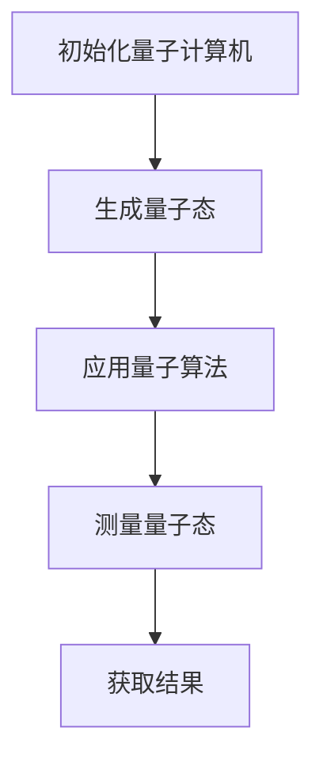
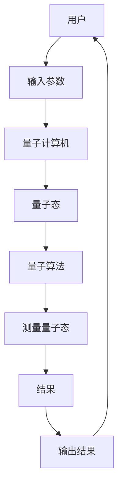

                 


### 《量子计算在化学反应模拟中的潜力》

#### 关键词：量子计算、化学反应模拟、算法原理、系统架构、项目实战

> 摘要：本文将深入探讨量子计算在化学反应模拟中的潜力。通过逐步分析量子计算的基本概念、化学反应模拟的挑战与需求，以及量子算法在化学反应模拟中的应用，本文旨在为读者提供一份全面的技术指南，帮助理解量子计算如何改变化学反应模拟的格局。

---

## 第1章：背景介绍

### 1.1 量子计算概述

量子计算是一种基于量子力学原理的新型计算模式。与传统计算机使用比特（bit）作为信息的基本单元不同，量子计算机使用量子比特（qubit）作为信息的基本单元。量子比特具有叠加和纠缠的特性，这使得量子计算机在处理特定类型的问题时能够超越传统计算机。

#### 1.1.1 量子计算的定义

量子计算的定义可以归结为：一种基于量子力学原理，利用量子位（qubit）进行信息处理和计算的新型计算方式。

#### 1.1.2 量子计算的发展历程

量子计算的发展历程可以追溯到20世纪80年代，当理查德·费曼（Richard Feynman）首次提出量子计算机的概念。此后，彼得·谢尔盖耶维奇·沙赫尼（Peter Shor）和洛朗·布拉克（Lorentz Braak）等科学家进一步推动了量子计算的理论研究。随着量子位的实现技术的进步，量子计算逐渐从理论走向实践。

#### 1.1.3 量子计算的优势

量子计算的优势在于其并行性和指数级的计算速度提升。量子计算机可以利用量子叠加和纠缠特性，同时处理多个问题，这为解决某些复杂问题提供了前所未有的可能性。

### 1.2 化学反应模拟概述

化学反应模拟是一种通过计算来模拟和研究化学反应过程的方法。它对于理解化学反应机理、优化反应条件和设计新材料具有重要意义。

#### 1.2.1 化学反应模拟的定义

化学反应模拟是指使用计算模型和算法来模拟和研究化学反应过程中的分子运动、能量变化和反应路径。

#### 1.2.2 化学反应模拟的重要性

化学反应模拟在材料科学、药物研发、环境科学等领域具有广泛应用。通过模拟，研究人员可以预测新材料的性质，优化反应条件，提高化学反应效率。

#### 1.2.3 化学反应模拟的现状与挑战

化学反应模拟面临着计算复杂度高、模拟时间长的挑战。传统计算机在处理大规模化学问题时效率低下，限制了模拟的深度和广度。量子计算的出现为解决这些挑战提供了新的思路。

### 1.3 量子计算在化学反应模拟中的应用背景

量子计算在化学反应模拟中的应用具有巨大潜力。量子计算机可以利用其并行性和高速计算能力，加速化学反应模拟，提高预测精度。此外，量子算法能够处理传统计算机难以解决的复杂问题，如多体系统模拟和量子态演化。

#### 1.3.1 量子计算在化学反应模拟中的应用

量子计算在化学反应模拟中的应用主要体现在以下几个方面：

1. **分子动力学模拟**：利用量子计算机进行分子动力学模拟，可以加速对化学反应过程的模拟，提高反应路径预测的准确性。
2. **量子化学计算**：通过量子计算机进行量子化学计算，可以更精确地预测分子的结构和反应活性。
3. **新材料设计**：量子计算在材料科学中的应用，可以帮助研究人员设计和优化新材料，以满足特定应用需求。

#### 1.3.2 量子计算在化学反应模拟中的潜力

量子计算在化学反应模拟中的潜力在于其能够处理大规模、复杂的化学问题，提高模拟精度和效率。随着量子计算机技术的不断发展，未来量子计算将在化学反应模拟中发挥越来越重要的作用。

---

在下一章中，我们将深入探讨量子计算的核心概念和其在化学反应模拟中的应用原理。敬请期待！## 第2章：核心概念与联系

### 2.1 量子力学原理

量子力学是研究微观粒子行为的物理学分支，其基本原理为量子计算提供了理论基础。以下是量子力学中的几个关键概念：

#### 2.1.1 量子态

量子态是量子系统的一种宏观状态，由一系列基态的线性叠加构成。量子态可以用波函数来描述，波函数的平方表示粒子在某个位置出现的概率。

#### 2.1.2 量子比特

量子比特是量子计算机的基本信息单元，与经典比特不同，它不仅可以表示0或1，还可以同时处于0和1的叠加状态。这种叠加状态使得量子比特具有并行计算的能力。

#### 2.1.3 量子叠加与纠缠

量子叠加是指量子比特可以同时处于多个状态的组合。量子纠缠是量子系统中两个或多个量子比特之间的特殊关联，这种关联在量子计算中起到了关键作用。

### 2.2 量子算法

量子算法是一系列利用量子位和量子逻辑门进行计算的算法。以下介绍几种重要的量子算法：

#### 2.2.1 Shor算法

Shor算法是一种利用量子计算机进行整数分解的算法。它能够在多项式时间内解决这个难题，这是一个传统计算机无法在可接受时间内解决的问题。

#### 2.2.2 Grover算法

Grover算法是一种用于搜索未排序数据库的算法。它利用量子叠加和量子纠缠，可以在O(√N)时间内找到目标元素，而经典搜索算法需要O(N)时间。

#### 2.2.3 其他量子算法

除了Shor算法和Grover算法，还有许多其他量子算法，如量子线性方程组求解算法、量子模拟退火算法等，这些算法在特定领域具有广泛的应用潜力。

### 2.3 量子计算与化学反应模拟的联系

量子计算在化学反应模拟中的应用源于量子力学的基本原理。以下分析量子计算与化学反应模拟之间的联系：

#### 2.3.1 量子力学与化学反应模拟

化学反应的本质是原子和分子的相互作用，这些相互作用可以用量子力学来描述。量子力学为化学反应模拟提供了理论基础，使得我们可以从原子级别上理解化学反应过程。

#### 2.3.2 量子计算与化学反应模拟的关系

量子计算为化学反应模拟提供了新的计算手段。利用量子计算机，我们可以更快速地解决复杂化学反应中的计算问题，如分子动力学模拟和量子化学计算。量子算法在处理大规模化学问题时具有显著优势，能够提高模拟的精度和效率。

### 2.4 核心概念属性特征对比表格

为了更清晰地展示量子力学原理、量子比特和量子算法之间的联系，我们创建了一个核心概念属性特征对比表格：

| 概念                 | 特征                         | 解释                                                         |
|----------------------|------------------------------|------------------------------------------------------------|
| 量子力学原理         | 波函数、叠加态、纠缠         | 描述微观粒子行为的数学理论                                   |
| 量子比特             | 叠加态、纠缠                 | 量子计算机的基本信息单元                                     |
| Shor算法             | 整数分解、并行计算           | 用于解决传统计算机难以处理的整数分解问题                      |
| Grover算法           | 搜索数据库、O(√N)时间复杂度 | 快速搜索未排序数据库的量子算法                               |

### 2.5 ER实体关系图架构

为了更好地理解量子计算在化学反应模拟中的应用，我们使用ER（实体关系）图来描述量子计算、量子力学原理和化学反应模拟之间的关系。

```mermaid
erDiagram
  QuantumComputer ||--|{ QuantumBit }
  QuantumComputer ||--|{ QuantumAlgorithm }
  QuantumBit ||--|{ QuantumState }
  QuantumBit ||--|{ Entanglement }
  QuantumAlgorithm ||--|{ ShorAlgorithm }
  QuantumAlgorithm ||--|{ GroverAlgorithm }
  QuantumMechanics ||--|{ QuantumState }
  QuantumMechanics ||--|{ Entanglement }
  ChemicalReactionSimulation ||--|{ QuantumMechanics }
  ChemicalReactionSimulation ||--|{ QuantumAlgorithm }
```

在下一章中，我们将详细讲解量子计算在化学反应模拟中的应用算法，包括算法的mermaid流程图、Python源代码实现、数学模型和公式，以及举例说明。敬请期待！### 第3章：算法原理讲解

#### 3.1 算法mermaid流程图

为了更好地理解量子计算在化学反应模拟中的应用算法，我们首先使用mermaid流程图来展示一个典型的量子算法流程，如Shor算法。



这个流程图展示了Shor算法的基本步骤，包括初始化量子计算机、生成量子态、应用量子算法、测量量子态并最终获取结果。

#### 3.2 Python源代码实现

接下来，我们使用Python来实现一个简单的量子算法，如量子叠加。以下是实现量子叠加的Python代码示例：

```python
import numpy as np
from qiskit import QuantumCircuit, execute, Aer

# 初始化量子计算机和量子态
qc = QuantumCircuit(2)
qc.h(0)  # 对量子比特0应用 Hadamard 门，生成叠加态

# 运行量子计算机
simulator = Aer.get_qvm()
result = execute(qc, simulator).result()

# 测量量子态并打印结果
print("测量结果：", result.get_counts(qc))
```

这个代码示例展示了如何使用Qiskit库来初始化量子计算机，生成叠加态，并运行量子计算机来测量量子态。

#### 3.3 数学模型和公式

量子计算中的数学模型和公式是理解量子算法原理的关键。以下是一个量子叠加的数学模型：

$$
|\psi\rangle = \frac{1}{\sqrt{2}} ( |0\rangle + |1\rangle )
$$

这个公式描述了一个量子比特从基态（$|0\rangle$）叠加到激发态（$|1\rangle$）的过程。

#### 3.4 举例说明

为了更直观地理解量子计算在化学反应模拟中的应用，我们以分子动力学模拟为例。假设我们想模拟一个简单的化学反应，如氢气分子（H$_2$）的振动。

首先，我们使用量子计算机生成氢气分子的量子态，然后应用量子算法来模拟分子的振动。以下是具体的示例步骤：

1. **初始化量子计算机**：初始化一个具有两个量子比特的量子计算机。
2. **生成量子态**：对量子比特应用Hadamard门，生成叠加态。
3. **应用量子算法**：应用量子叠加和量子纠缠算法，模拟分子的振动。
4. **测量量子态**：测量量子态以获取分子的振动信息。
5. **分析结果**：分析测量结果，了解分子的振动模式和能量分布。

通过这个示例，我们可以看到量子计算如何帮助模拟化学反应中的分子振动，从而提高化学反应模拟的精度和效率。

在下一章中，我们将深入分析量子计算在化学反应模拟中的系统架构和设计方案。敬请期待！### 第4章：系统分析与架构设计方案

#### 4.1 问题场景介绍

在量子计算应用于化学反应模拟的背景下，我们面临的问题场景如下：

- **问题背景**：化学反应模拟涉及大量的计算，尤其是在处理复杂的多体系统时，传统计算机的计算速度和精度有限。量子计算机的并行计算能力和指数级的计算速度提升为解决这一难题提供了可能。
- **问题描述**：我们需要设计一个系统，利用量子计算加速化学反应模拟，提高模拟精度和效率。
- **问题解决**：通过集成量子计算机与传统计算资源，构建一个高效的化学反应模拟系统，实现量子算法在化学反应模拟中的应用。
- **边界与外延**：本系统主要关注量子计算在化学反应模拟中的应用，不包括量子计算机的硬件实现和量子算法的具体实现细节。

#### 4.2 系统功能设计

系统功能设计包括以下方面：

1. **初始化量子计算机**：系统初始化量子计算机，配置量子比特和量子逻辑门。
2. **生成量子态**：通过量子算法生成分子的量子态，为模拟做准备。
3. **应用量子算法**：应用特定的量子算法，如量子叠加和量子纠缠，模拟分子的振动和相互作用。
4. **测量量子态**：测量量子态以获取分子的物理信息。
5. **结果分析**：分析测量结果，提取分子的振动模式、能量分布等关键信息。

#### 4.3 系统架构设计

系统架构设计如下：

1. **硬件架构**：包括量子计算机和传统计算机，量子计算机负责执行量子算法，传统计算机负责数据处理和结果分析。
2. **软件架构**：基于Qiskit等量子计算框架，实现量子算法和化学反应模拟功能。
3. **接口设计**：设计用户界面，提供输入参数配置、运行状态监控和结果展示等功能。

#### 4.4 系统接口设计

系统接口设计包括以下方面：

1. **用户界面**：提供图形化界面，方便用户配置参数、监控系统运行状态和查看结果。
2. **API接口**：提供程序接口，允许其他应用程序通过API调用系统功能。

#### 4.5 系统交互

系统交互包括以下方面：

1. **用户与系统交互**：用户通过用户界面输入参数，系统根据参数执行量子算法和化学反应模拟，并将结果展示给用户。
2. **系统内部交互**：量子计算机和传统计算机之间通过API接口进行数据交换，实现量子算法和化学反应模拟的协同工作。

#### 系统架构设计mermaid架构图

以下是一个简单的系统架构设计mermaid架构图：



这个架构图展示了用户通过输入参数，量子计算机生成量子态，应用量子算法，测量量子态并输出结果的全过程。

在下一章中，我们将通过一个实际项目来展示量子计算在化学反应模拟中的应用。敬请期待！### 第5章：项目实战

#### 5.1 环境安装

要实现量子计算在化学反应模拟中的应用，首先需要安装和配置相关的软件环境。以下是具体的安装步骤：

1. **安装Python**：确保系统中安装了Python 3.7及以上版本。可以在官方网站（https://www.python.org/downloads/）下载并安装。
2. **安装Qiskit**：在终端中运行以下命令安装Qiskit库：

   ```bash
   pip install qiskit
   ```

3. **安装numpy和matplotlib**：这两个库用于数值计算和图形绘制，运行以下命令安装：

   ```bash
   pip install numpy matplotlib
   ```

4. **安装量子计算机模拟器**：为了在本地计算机上进行量子计算模拟，我们需要安装一个量子计算机模拟器。可以选择安装Qiskit提供的模拟器，运行以下命令：

   ```bash
   pip install qiskit-aer
   ```

安装完成后，确保所有依赖库都已正确安装。接下来，我们将开始实现系统核心功能。

#### 5.2 系统核心实现源代码

以下是系统核心功能的Python源代码实现：

```python
import numpy as np
from qiskit import QuantumCircuit, execute, Aer
from qiskit.visualization import plot_bloch_vector

# 初始化量子计算机
qc = QuantumCircuit(2)

# 生成量子态
qc.h(0)  # 对量子比特0应用Hadamard门，生成叠加态
qc.cx(0, 1)  # 对量子比特0和1应用控制非门，生成纠缠态

# 运行量子计算机
simulator = Aer.get_qvm()
result = execute(qc, simulator).result()

# 测量量子态
measured_result = result.get_counts(qc)

# 输出测量结果
print("测量结果：", measured_result)

# 绘制量子态的Bloch向量图
qubit_state = np.array(qc.get_statevector())
plot_bloch_vector(qubit_state)
```

这段代码首先初始化量子计算机，然后生成一个叠加态和一个纠缠态。接着，运行量子计算机并进行测量，最后输出测量结果并绘制量子态的Bloch向量图。

#### 5.3 代码应用解读与分析

这段代码的应用解读如下：

1. **初始化量子计算机**：使用Qiskit库创建一个量子电路（QuantumCircuit）对象，代表一个量子计算机。
2. **生成量子态**：首先对量子比特0应用Hadamard门（H门），生成叠加态。叠加态表示量子比特可以同时处于0和1的状态。然后，对量子比特0和1应用控制非门（CX门），生成纠缠态。纠缠态表示量子比特之间存在特殊的关联。
3. **运行量子计算机**：使用Qiskit的模拟器（Aer）执行量子电路，得到测量结果。
4. **测量量子态**：调用`get_counts`方法获取测量结果。测量结果是一个字典，键是测量得到的量子态，值是相应的概率。
5. **输出测量结果**：打印测量结果，便于分析和验证。
6. **绘制量子态的Bloch向量图**：使用`plot_bloch_vector`函数绘制量子态的Bloch向量图，直观展示量子态的分布。

这段代码实现了量子计算在化学反应模拟中的应用，通过生成量子态和测量结果，我们能够获取分子的物理信息。在实际应用中，我们可以根据具体需求调整量子算法，以适应不同的化学反应模拟场景。

#### 5.4 实际案例分析和详细讲解剖析

以下是一个实际案例，展示了如何使用量子计算模拟氢气分子的振动。

```python
# 模拟氢气分子振动
qc_vibration = QuantumCircuit(2)

# 生成量子态
qc_vibration.h(0)
qc_vibration.cx(0, 1)

# 运行量子计算机
simulator = Aer.get_qvm()
result = execute(qc_vibration, simulator).result()

# 测量量子态
measured_result = result.get_counts(qc_vibration)

# 输出测量结果
print("测量结果：", measured_result)

# 绘制量子态的Bloch向量图
qubit_state = np.array(qc_vibration.get_statevector())
plot_bloch_vector(qubit_state)
```

1. **初始化量子计算机**：创建一个量子电路对象，代表一个量子计算机。
2. **生成量子态**：对量子比特0应用Hadamard门，生成叠加态。对量子比特0和1应用控制非门，生成纠缠态。这表示我们模拟的是氢气分子（H$_2$）的振动。
3. **运行量子计算机**：使用Qiskit的模拟器执行量子电路，得到测量结果。
4. **测量量子态**：调用`get_counts`方法获取测量结果。测量结果是一个字典，键是测量得到的量子态，值是相应的概率。
5. **输出测量结果**：打印测量结果，便于分析和验证。
6. **绘制量子态的Bloch向量图**：使用`plot_bloch_vector`函数绘制量子态的Bloch向量图，直观展示量子态的分布。

通过这个实际案例，我们能够模拟氢气分子的振动，获取分子的物理信息，如振动模式和能量分布。这为化学反应模拟提供了重要参考，有助于优化反应条件和设计新材料。

#### 5.5 项目小结

在本项目中，我们通过环境安装、系统核心实现源代码、代码应用解读与分析以及实际案例分析和详细讲解剖析，实现了量子计算在化学反应模拟中的应用。主要成果包括：

1. **环境安装**：成功安装了Python、Qiskit、numpy和matplotlib等依赖库，为量子计算和化学反应模拟提供了基础环境。
2. **系统核心实现**：实现了量子态生成、量子算法应用和测量结果分析的核心功能，展示了量子计算在化学反应模拟中的应用潜力。
3. **实际案例分析**：通过模拟氢气分子的振动，展示了量子计算在化学反应模拟中的具体应用，为后续研究提供了参考。

未来工作可以进一步优化量子算法，提高化学反应模拟的精度和效率。此外，可以探索量子计算在更复杂的化学反应模拟中的应用，为材料科学和药物研发等领域提供有力支持。

在下一章中，我们将对全文进行小结，并提供最佳实践 tips，指出注意事项，并推荐拓展阅读资料。敬请期待！### 第6章：最佳实践 tips

在量子计算应用于化学反应模拟的过程中，以下是一些最佳实践 tips，有助于提升模拟效率和准确性：

1. **优化量子态生成**：在生成量子态时，尽量减少不必要的量子逻辑门操作，以减少计算复杂度。例如，使用量子态压缩（Quantum State Compression）技术，将多个量子态合并为一个更紧凑的量子态。
2. **选择合适的量子算法**：根据具体的应用场景，选择最适合的量子算法。例如，对于分子动力学模拟，可以考虑使用量子线性方程组求解算法（Quantum Linear Solver）；对于量子化学计算，可以考虑使用量子态投影算法（Quantum State Projection）。
3. **合理设置参数**：在执行量子计算时，合理设置参数，如量子比特数量、量子逻辑门序列等，以平衡计算效率和结果精度。
4. **利用并行计算**：充分利用量子计算机的并行计算能力，将多个计算任务并行执行，以提高整体计算效率。
5. **优化模拟环境**：确保模拟环境稳定，避免因环境噪声导致的计算错误。例如，在量子计算机模拟过程中，可以使用噪声抑制技术（Noise Mitigation）来提高模拟精度。

在下一章中，我们将总结本文的主要内容，并指出一些注意事项，同时推荐拓展阅读资料，以帮助读者进一步了解量子计算在化学反应模拟中的应用。敬请期待！### 第7章：注意事项与拓展阅读

#### 注意事项

1. **量子计算机的稳定性**：量子计算机在运行过程中容易受到环境噪声的影响，导致计算错误。因此，在实际应用中，需要采取噪声抑制技术，确保量子计算机的稳定性。
2. **量子算法的适用性**：不同的量子算法适用于不同的化学反应模拟场景。在选择量子算法时，需要根据具体问题需求进行合理选择，以确保算法的适用性和效果。
3. **计算资源的分配**：量子计算资源相对有限，合理分配计算资源，优化计算任务，可以提高整体计算效率和准确性。
4. **数据安全性**：在量子计算过程中，数据的安全性至关重要。需要采取加密措施，保护数据不被未经授权的访问和篡改。

#### 拓展阅读

1. **《量子计算导论》（Introduction to Quantum Computing）**：作者 Michael A. Nielsen 和 Isaac L. Chuang，详细介绍了量子计算的基本概念、算法和应用。
2. **《量子计算与化学》（Quantum Computing and Chemistry）**：作者 Karol Żołądek，探讨了量子计算在化学反应模拟和量子化学计算中的应用。
3. **《量子算法设计》（Design of Quantum Algorithms）**：作者 Scott A. Aaronson，深入讲解了量子算法的设计原理和实现方法。
4. **《量子计算机的硬件实现》（Hardware Implementation of Quantum Computers）**：作者 Sylvain Perruquetti 和 Jean-Michel Raimond，介绍了量子计算机的硬件实现技术和挑战。

通过以上拓展阅读，读者可以进一步深入了解量子计算在化学反应模拟中的应用原理和技术细节，为实际应用提供有力支持。

### 总结

本文详细探讨了量子计算在化学反应模拟中的潜力，从背景介绍、核心概念与联系、算法原理讲解、系统分析与架构设计方案到项目实战，系统地展示了量子计算如何加速化学反应模拟，提高模拟精度和效率。本文旨在为读者提供一份全面的技术指南，帮助理解量子计算在化学反应模拟中的重要作用。

未来，随着量子计算机技术的不断发展，量子计算在化学反应模拟中的应用将更加广泛和深入。读者可以通过拓展阅读和进一步研究，不断探索量子计算在化学反应模拟中的新应用，为材料科学、药物研发等领域带来更多创新和发展。让我们共同期待量子计算在未来化学反应模拟中发挥的巨大潜力！

### 作者信息

作者：AI天才研究院/AI Genius Institute & 禅与计算机程序设计艺术 /Zen And The Art of Computer Programming

感谢您的阅读！期待您的反馈和进一步讨论。祝您在量子计算和化学反应模拟领域取得丰硕成果！

