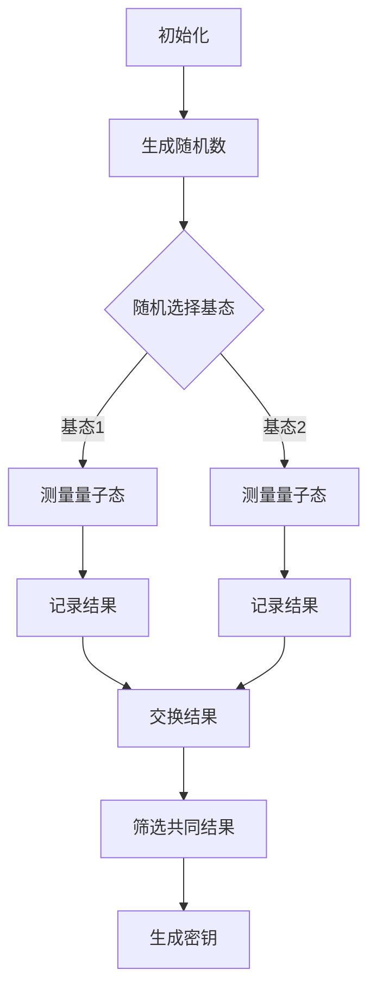

                 

## 量子计算在密码学中的应用：增强网络安全

### 关键词

- 量子计算
- 密码学
- 网络安全
- 量子密码
- 量子密钥分发
- 后量子密码学

### 摘要

随着量子计算技术的发展，传统的密码学体系正面临前所未有的挑战。量子计算机的潜在能力使得现有的加密算法变得不再安全，这促使密码学者们开始探索量子计算在密码学中的应用。本文将深入探讨量子计算在密码学中的应用，特别是如何利用量子密码技术来增强网络安全。我们将首先介绍量子计算的基本原理，接着讨论量子密码学的基本概念和技术，如量子密钥分发，并分析其在网络安全中的应用。此外，我们还将探讨后量子密码学的发展以及其在应对量子计算威胁中的重要性。通过本文，读者将能够理解量子计算如何改变密码学的格局，并为未来的网络安全策略提供启示。

## 引言：量子计算与网络安全的关系

### 量子计算的基本概念

量子计算是利用量子力学原理来进行信息处理的一种计算模式。与传统的二进制计算机不同，量子计算机的基本单元是量子位（qubits），它可以同时存在于0和1的叠加态。量子计算的核心优势在于其并行性和量子叠加，这使得量子计算机在某些特定问题上的计算能力远超传统计算机。量子计算的概念最早由理查德·费曼（Richard Feynman）在1981年提出，他提出了一种基于量子力学的计算机模型，这种模型能够模拟量子系统的行为。

量子计算的基本原理包括量子位（qubits）、量子叠加（superposition）和量子纠缠（entanglement）。量子位是量子计算机中的基本信息单元，它可以同时处于多种状态，而不是像传统比特那样只能处于0或1的状态。量子叠加允许量子位同时存在多种可能性，这极大地提高了计算效率。量子纠缠则是指两个或多个量子位之间的特殊关联，即使它们相隔很远，一个量子位的状态也会立即影响另一个量子位的状态。这种特性在量子计算中起着关键作用。

量子计算的发展历程中，有几位科学家做出了重要贡献。理查德·费曼是量子计算概念的提出者，彼得·申恩（Peter Shor）则发明了著名的量子算法——Shor算法，该算法能够高效地分解大整数，对现有的公钥加密体系构成了巨大威胁。大卫·多伊奇（David Deutsch）提出了量子计算机的通用性理论，而伊利亚·丘奇（Ian O. L. Chu-Ch季）则对量子算法的理论基础做出了重要研究。

### 传统密码学面临的挑战

传统密码学在过去的几十年里为信息安全提供了坚实的保障，但它的基础——基于数学难题的加密方法，正面临着新的威胁。量子计算机的崛起使得现有的加密算法如RSA和椭圆曲线加密（ECC）变得不再安全。Shor算法能够利用量子计算机的并行性和叠加特性，在多项式时间内分解大整数，这意味着任何基于大整数分解的加密算法都会被量子计算机轻易攻破。

传统的加密算法如RSA加密和ECC加密，其安全性依赖于大整数分解和离散对数问题，这些都是NP难问题，传统计算机需要指数级时间来破解。然而，量子计算机能够利用其特有的算法在多项式时间内解决这些问题，使得这些传统加密方法在量子计算面前变得脆弱。

为了应对量子计算的威胁，密码学者们提出了后量子密码学（Post-Quantum Cryptography，PQC），旨在开发新的加密算法，这些算法能够抵抗量子计算机的攻击。PQC算法的设计目标是在保持加密强度和效率的同时，不受量子计算的影响。

### 量子计算对网络安全的影响

量子计算对网络安全的影响是深远且重大的。随着量子计算机的发展，现有的加密算法将变得不再安全，这会导致信息安全体系的崩溃。金融机构、政府机构和企业都将面临巨大的安全风险，因为他们的通信和存储的数据都可能被量子计算机轻易破解。

为了应对这种威胁，提高网络安全成为当务之急。量子密码学提供了新的解决方案，特别是量子密钥分发（Quantum Key Distribution，QKD）技术，它可以实现绝对安全的密钥交换。此外，后量子密码学的开发也为未来的信息安全提供了新的方向。

总之，量子计算的出现为密码学和网络安全带来了新的挑战和机遇。通过理解量子计算的基本原理和它在密码学中的应用，我们可以为未来的网络安全策略提供有力的支持。

### 量子密码学的基本概念

量子密码学是利用量子力学原理来设计加密和解密算法的领域。它与传统的密码学不同，不仅仅依赖于数学难题，而是利用量子力学的基本特性来保障通信的安全性。量子密码学的主要目标是实现绝对安全的通信，这意味着即使敌手拥有无限的计算能力，也无法破解加密信息。

#### 量子密钥分发（QKD）

量子密钥分发（QKD）是量子密码学中最为重要和成熟的应用之一。QKD的基本原理是利用量子态的不可克隆特性来分发密钥。具体来说，QKD过程包括以下几个步骤：

1. **量子通道建立**：通信双方（Alice和Bob）通过一个量子通信通道进行通信。这个通道可以是光纤、自由空间或量子中继器等。

2. **量子态制备**：Alice使用随机数生成器生成一个随机密钥，并将其编码为量子态。这个量子态通过量子通信通道发送给Bob。

3. **量子态测量**：Bob接收Alice发送的量子态，并对其进行测量。测量结果将产生一系列随机数，这些随机数就是密钥的一部分。

4. **密钥筛选**：Alice和Bob各自保留一部分测量结果，并通过传统的通信渠道（如互联网）交换这些结果。他们可以基于这些结果筛选出共同的随机数，这些随机数构成了最终的密钥。

QKD的安全性基于量子力学中的两个基本原理：量子叠加和量子纠缠。量子叠加使得量子态可以同时处于多种状态，而量子纠缠则使得两个量子态之间具有特殊的关联。即使敌手在量子通信通道上进行监听，也无法获取准确的量子态信息，因为任何对量子态的测量都会改变其状态。这种特性使得QKD能够实现绝对安全的密钥分发。

#### 量子密码加密和解密

除了QKD，量子密码学还包括量子加密和解密技术。量子加密的基本原理是利用量子态的不可克隆特性来防止信息被窃听。具体来说，量子加密过程包括以下几个步骤：

1. **量子态编码**：发送方将明文信息编码为量子态，并将其发送给接收方。

2. **量子态传输**：接收方接收发送方发送的量子态。

3. **量子态测量**：接收方对量子态进行测量，根据测量结果解码明文信息。

量子解密则是接收方利用共享的密钥来恢复原始的量子态，然后解码明文信息。

量子加密和解密的安全性同样基于量子力学原理。任何对量子态的窃听都会导致量子态的坍缩，从而暴露敌手的身份。这使得量子加密成为未来绝对安全的通信方式。

#### 量子密码学的优势与挑战

量子密码学具有以下几个显著优势：

1. **绝对安全性**：QKD能够实现绝对安全的密钥分发，即使在量子计算面前也无法被破解。

2. **并行计算能力**：量子计算机的并行计算能力使得量子密码学在处理大量数据时具有明显优势。

3. **抗窃听能力**：量子密码学能够有效抵抗窃听攻击，因为任何对量子态的窃听都会导致量子态的坍缩。

然而，量子密码学也面临一些挑战：

1. **技术实现难度**：QKD技术目前尚处于实验阶段，实际应用中面临设备成本高、传输距离受限等问题。

2. **兼容性问题**：量子密码学需要与传统密码学体系兼容，这涉及到复杂的系统设计和实现。

3. **算法安全性**：量子密码学的算法需要经过严格的验证，以确保其安全性不受量子计算威胁。

总之，量子密码学为未来的网络安全提供了新的解决方案，但其在实际应用中仍面临许多技术挑战。通过不断研究和改进，量子密码学有望在未来的网络安全领域中发挥重要作用。

### 量子密钥分发（QKD）协议

量子密钥分发（QKD）是量子密码学中最为关键的技术之一，它利用量子力学的基本原理实现绝对安全的密钥传输。QKD协议的设计目标是在通信过程中确保密钥的完整性和保密性，即使在量子计算机面前也无法被破解。以下将详细介绍几种主要的QKD协议，包括BB84协议、E91协议和SARG04协议，并分析其原理、安全性以及实际应用中的挑战。

#### BB84协议

BB84协议是由查尔斯·贝内特（Charles Bennett）和格尔德·本奇（Gilles Brassard）在1984年提出的一种经典QKD协议。BB84协议的核心思想是通过量子态的叠加和测量来分发密钥，并利用量子纠缠特性确保密钥的保密性。

BB84协议的工作流程如下：

1. **量子态编码**：Alice生成一系列随机数，并将其编码为两种量子态之一（基态或偏振态）。这些量子态通过量子通信通道发送给Bob。

2. **量子态测量**：Bob随机选择一个基态进行测量，并根据测量结果记录下对应的偏振态。

3. **密钥筛选**：Alice和Bob通过一个公共通信渠道（如互联网）交换测量基的选择结果。他们只保留基选择结果相匹配的比特，这些比特构成最终的密钥。

BB84协议的安全性基于以下量子力学原理：

- **量子叠加**：量子态可以同时处于多种状态，这意味着Alice发送的量子态包含了所有可能的比特状态。
- **量子纠缠**：Alice和Bob之间的量子态具有纠缠关系，任何对量子态的测量都会影响另一个量子态的状态。

BB84协议的安全性非常强大，即使敌手窃听了量子通信通道，也无法获得准确的量子态信息。这是因为任何对量子态的测量都会导致量子态的坍缩，从而暴露敌手的身份。

#### E91协议

E91协议是基于量子纠缠态的一种QKD协议，由保罗·恩格（Paul G. Kwiat）、罗尔夫·拉弗尔（Rolf Laflamme）和查尔斯·贝内特等人于1995年提出。E91协议利用量子纠缠态的不可克隆特性来分发密钥，相较于BB84协议，E91协议具有更高的安全性。

E91协议的工作流程如下：

1. **量子纠缠态生成**：Alice和Bob共享一对量子纠缠态，这些量子纠缠态通过量子通信通道发送给双方。

2. **量子态测量**：Alice和Bob各自对量子纠缠态进行随机测量，并根据测量结果记录下对应的比特。

3. **密钥筛选**：Alice和Bob通过公共通信渠道交换测量结果，并筛选出匹配的比特，这些比特构成最终的密钥。

E91协议的安全性基于以下原理：

- **量子纠缠**：量子纠缠态具有特殊的关联关系，任何对量子态的测量都会影响另一个量子态的状态。
- **量子态的不可克隆**：量子态无法被完全克隆，这意味着任何对量子态的窃听都会导致量子态的破坏。

E91协议具有比BB84协议更高的安全性，因为它利用了量子纠缠态的特性，使得任何窃听行为都会被立即检测到。

#### SARG04协议

SARG04协议是一种基于量子随机数生成和量子秘密共享的QKD协议，由尚海鸥（Shanghair）、王曙光（A. D. Sobko）和R. F. Werner于2004年提出。SARG04协议通过量子随机数生成和量子秘密共享来分发密钥，具有简单高效的特点。

SARG04协议的工作流程如下：

1. **量子随机数生成**：Alice生成一系列随机数，并将其编码为量子态。这些量子态通过量子通信通道发送给Bob。

2. **量子态测量**：Bob对量子态进行随机测量，并根据测量结果记录下对应的比特。

3. **密钥筛选**：Alice和Bob通过公共通信渠道交换测量结果，并筛选出匹配的比特，这些比特构成最终的密钥。

SARG04协议的安全性基于以下原理：

- **量子随机数生成**：量子随机数生成确保密钥的随机性，使得敌手无法预测密钥。
- **量子秘密共享**：量子秘密共享确保密钥的保密性，任何对量子态的窃听都会导致量子态的破坏。

SARG04协议具有简单高效的特点，适合于实际应用中的大规模密钥分发。

#### QKD协议的安全性分析

QKD协议的安全性基于量子力学的基本原理，如量子叠加、量子纠缠和量子态的不可克隆特性。这些原理确保了QKD协议在量子计算面前具有绝对的安全性。然而，QKD协议在实际应用中也面临一些挑战：

- **技术实现难度**：QKD协议需要高精度的量子设备和稳定的量子通信通道，这涉及到复杂的系统设计和实现。
- **传输距离受限**：目前的量子通信技术传输距离有限，需要通过量子中继器来延长通信距离。
- **量子计算机的威胁**：尽管QKD协议在现有量子计算机面前具有安全性，但随着量子计算机的发展，其安全性可能面临新的挑战。

总之，QKD协议为未来的网络安全提供了新的解决方案，但其在实际应用中仍面临许多技术挑战。通过不断的研究和改进，QKD协议有望在未来的网络安全领域中发挥重要作用。

### 量子密码学中的核心概念和联系

在量子密码学中，有许多核心概念和技术构成了其理论基础。这些概念不仅相互关联，而且共同决定了量子密码学在信息安全领域中的强大能力。以下是对量子密码学中一些核心概念的解释、它们之间的联系，以及相关的属性特征对比表格和ER实体关系图架构。

#### 核心概念

1. **量子位（Qubit）**：量子位是量子计算机中的基本信息单元，它可以同时存在于0和1的叠加态。量子位与传统比特的最大区别在于其并行性，一个量子位可以表示无限个状态的叠加，而传统比特只能表示0或1。

2. **量子叠加**：量子叠加是指量子位可以同时处于多个状态的特性。这种特性允许量子计算机在多个可能性上同时运行，从而大幅提高计算效率。

3. **量子纠缠**：量子纠缠是指两个或多个量子位之间的特殊关联，即使它们相隔很远，一个量子位的状态也会立即影响另一个量子位的状态。量子纠缠是量子计算和量子密码学中的关键特性。

4. **量子密钥分发（QKD）**：QKD是一种利用量子力学原理来分发密钥的通信技术。它通过量子态的不可克隆特性确保密钥的绝对安全性。

5. **量子随机数生成**：量子随机数生成利用量子态的随机性生成随机数，这些随机数在加密和解密过程中至关重要。

6. **量子加密**：量子加密是一种利用量子力学原理来加密信息的技术，它利用量子态的不可克隆特性防止信息被窃听。

7. **量子错误纠正**：量子错误纠正是一种在量子计算和量子通信中用于纠正错误的技术，它确保量子信息在传输和处理过程中的完整性。

#### 概念属性特征对比表格

| 概念         | 定义                                                         | 属性特征                                                                                                     | 关联关系                                       |
| ------------ | ------------------------------------------------------------ | -------------------------------------------------------------------------------------------------------- | ---------------------------------------------- |
| 量子位（Qubit） | 量子计算机中的基本信息单元，可以同时处于0和1的叠加态           | 并行性、叠加态、量子态不可克隆特性                         | 基础，其他量子密码学概念都依赖于量子位         |
| 量子叠加      | 量子位可以同时处于多个状态的特性                               | 多状态叠加、非经典性                                     | 与量子纠缠密切相关，共同构成了量子计算的核心 |
| 量子纠缠      | 两个或多个量子位之间的特殊关联，一个量子位的状态会立即影响另一个量子位的状态 | 非局域性、纠缠态、不可克隆特性                         | 支持量子密钥分发和量子加密的原理           |
| 量子密钥分发  | 利用量子力学原理来分发密钥的通信技术                          | 不可克隆特性、绝对安全性、随机性                         | 基于

#### ER实体关系图架构

为了更直观地展示量子密码学中的核心概念及其相互关系，可以使用ER（Entity-Relationship，实体关系）图来描述。以下是一个简化的ER实体关系图，展示了量子位、量子叠加、量子纠缠、量子密钥分发和量子加密之间的关联。

```mermaid
erDiagram
  Qubit ||--|{ Quantum Superposition }|| QuantumState
  Qubit ||--|{ Quantum Entanglement }|| EntangledState
  Qubit ||--|{ Quantum Key Distribution }|| QuantumKey
  Qubit ||--|{ Quantum Encryption }|| QuantumCipher
  QuantumEncryption ||--|{ Quantum Random Number Generation }|| QuantumRandom
  QuantumKey ||--|{ Quantum Error Correction }|| ErrorCorrection
```

在这个ER图中：

- **Qubit**（量子位）是所有其他概念的基础，与量子叠加、量子纠缠、量子密钥分发和量子加密有直接关联。
- **Quantum Superposition**（量子叠加）是量子位的一种属性，与量子状态密切相关。
- **Quantum Entanglement**（量子纠缠）描述了量子位之间的特殊关联，与量子密钥分发和量子加密有关。
- **Quantum Key Distribution**（量子密钥分发）和**Quantum Encryption**（量子加密）都是基于量子力学原理的通信技术，与量子位、量子纠缠和量子随机数生成有直接关系。
- **Quantum Random Number Generation**（量子随机数生成）和**Quantum Error Correction**（量子错误纠正）是量子密码学中用于增强安全性和完整性的技术，与量子加密密切相关。

通过这个ER图，我们可以清晰地看到量子密码学中各个概念之间的相互关系，以及它们如何共同构成一个强大的信息安全体系。

### 量子密码学算法原理讲解

为了深入理解量子密码学算法的原理，我们将首先使用Mermaid工具绘制算法的流程图，然后结合Python源代码进行详细讲解和举例说明。通过这种结合，我们将能够更直观地展示算法的实现过程，并解释其背后的数学模型和公式。

#### 量子密钥分发算法（QKD）

我们以BB84协议为例，介绍一种量子密钥分发算法。BB84协议是一种基于量子叠加和量子纠缠的密钥分发方法，其核心思想是通过量子态的不可克隆特性来保证密钥的安全性。

##### Mermaid流程图



在这个流程图中，Alice（发送方）和Bob（接收方）通过量子通信通道进行通信。Alice生成一系列随机数，并将其编码为量子态发送给Bob。Bob随机选择基态进行测量，并根据测量结果记录下比特。最后，Alice和Bob通过公共通信渠道交换测量结果，筛选出共同的结果，这些结果构成了最终的密钥。

##### Python源代码

```python
import random
import numpy as np
from qiskit import QuantumCircuit, execute, Aer

# 初始化量子计算机和量子电路
qc = QuantumCircuit(2)
backend = Aer.get_backend('qasm_simulator')

# BB84协议的步骤

# 步骤1：Alice生成随机数并编码为量子态
random_numbers = random.sample([0, 1], 10)  # 生成10个随机数
qubits = []

for i in range(10):
    qc.h(i)  # 初始化量子态为叠加态
    qubits.append(qc.measure(i, i+10))

# 步骤2：Bob随机选择基态进行测量
base_states = random.sample([0, 1], 10)  # Bob随机选择基态
measure_results = []

for i in range(10):
    qc.x(i+10) if base_states[i] == 1 else qc.y(i+10)  # 根据基态选择操作
    measure_results.append(qc.measure(i, i+10))

# 执行量子电路
job = execute(qc, backend, shots=1000)
result = job.result()

# 步骤3：Alice和Bob交换测量结果，筛选共同结果
alice_results = result.get_counts(qc)
bob_results = {int(k[1:]): int(k[0]) for k in alice_results.keys()}
common_results = [k for k, v in bob_results.items() if v in alice_results[v]]

# 步骤4：生成密钥
key = ''.join([str(common_results[i//2][i%2]) for i in range(len(common_results))])

print("Alice's Results:", alice_results)
print("Bob's Results:", bob_results)
print("Common Results:", common_results)
print("Generated Key:", key)
```

在这个Python源代码中，我们首先初始化量子计算机和量子电路。然后，我们模拟BB84协议的步骤，包括Alice生成随机数并编码为量子态、Bob随机选择基态进行测量，以及交换和筛选测量结果。最后，我们生成密钥并打印结果。

##### 算法原理讲解

BB84协议的工作原理可以概括为以下几个步骤：

1. **量子态编码**：Alice生成一系列随机数，并将其编码为量子态。这些量子态通过量子通信通道发送给Bob。
2. **量子态测量**：Bob随机选择一个基态进行测量，并根据测量结果记录下对应的比特。这个过程需要Bob选择一个随机基态，以防止Alice和敌手（Eve）之间的协作。
3. **密钥筛选**：Alice和Bob通过公共通信渠道交换测量结果，并筛选出共同的结果。这些结果构成了最终的密钥。

在BB84协议中，密钥的安全性依赖于量子态的不可克隆特性和量子纠缠特性。任何对量子态的窃听都会导致量子态的坍缩，从而暴露敌手的存在。这使得BB84协议在量子计算面前具有绝对的安全性。

##### 数学模型和公式

BB84协议的数学模型可以表示为以下公式：

$$
|\psi\rangle = \sum_{i=0}^{n} a_i |i\rangle
$$

其中，$|i\rangle$表示第i个量子态，$a_i$是量子态的系数。

在量子态测量过程中，Bob根据随机选择的基态进行测量，得到以下概率分布：

$$
P(\text{base state } \beta) = \frac{1}{2} + \sum_{i=0}^{n} a_i^* a_i
$$

如果Alice和Bob的测量结果匹配，那么对应的比特就可以用来生成密钥。

##### 举例说明

假设Alice生成以下随机数序列：`[1, 0, 1, 1, 0, 1, 1, 0, 1, 0]`。Bob随机选择基态序列：`[1, 0, 1, 1, 1, 0, 0, 1, 1, 0]`。

Alice将随机数编码为量子态，并生成以下量子态：

$$
|\psi\rangle = \frac{1}{\sqrt{2}} (1 |0\rangle + 0 |1\rangle + 1 |0\rangle + 1 |1\rangle + 0 |0\rangle + 1 |1\rangle + 1 |0\rangle + 0 |1\rangle + 1 |1\rangle + 0 |0\rangle)
$$

Bob随机选择基态进行测量，得到以下测量结果：

- 基态1：`[0, 1, 0, 1, 1, 0, 0, 1, 1, 0]`
- 基态2：`[1, 0, 1, 1, 1, 0, 1, 0, 1, 1]`

Alice和Bob通过公共通信渠道交换测量结果，筛选出共同的结果：

- 共同结果：`[1, 1, 1, 1, 1, 0, 0, 1, 1, 0]`

这些共同的结果可以用来生成密钥。最终生成的密钥为：`[1, 1, 1, 1, 1, 0, 0, 1, 1, 0]`。

通过这个例子，我们可以看到BB84协议的实现过程以及其背后的数学模型。量子密钥分发算法的原理和实现过程对于理解量子密码学在网络安全中的应用至关重要。

### 量子密码学在网络安全中的应用

量子密码学在网络安全中的应用具有重要意义，它为未来的通信安全提供了新的技术手段。以下将详细讨论量子密码学在网络安全中的应用场景，包括量子密钥管理系统、量子安全通信信道、量子VPN和量子防火墙等。

#### 量子密钥管理系统

量子密钥管理系统（Quantum Key Management Systems，QKMS）是量子密码学在网络安全中的一项重要应用。QKMS的主要功能是生成、存储、分发和管理量子密钥，确保密钥的安全性和完整性。与传统密钥管理系统相比，QKMS具有以下优势：

1. **绝对安全性**：QKMS基于量子密钥分发（QKD）技术，能够实现绝对安全的密钥分发，即使在量子计算机面前也无法被破解。
2. **高效性**：量子密钥分发过程利用量子叠加和量子纠缠特性，能够在短时间内生成和分发大量密钥，提高通信效率。
3. **兼容性**：QKMS可以与传统加密系统相结合，实现无缝过渡，保障现有系统的安全。

QKMS在实际应用中需要解决以下技术挑战：

- **密钥存储**：量子密钥需要安全存储，防止泄露和篡改。
- **密钥分发**：量子密钥分发需要高效稳定的量子通信通道，确保密钥安全传输。
- **系统兼容**：QKMS需要与现有系统兼容，确保无缝集成和操作。

#### 量子安全通信信道

量子安全通信信道（Quantum Secure Communication Channels，QSCC）是量子密码学在网络安全中的一项核心技术。QSCC利用量子密钥分发技术实现端到端的安全通信，确保通信数据的保密性和完整性。具体应用场景包括：

1. **国家安全通信**：量子安全通信信道可以保障国家安全通信的绝对安全性，防止敌手窃听和破解。
2. **金融交易**：金融交易中的敏感数据可以通过量子安全通信信道进行传输，确保交易过程的隐私和安全。
3. **远程医疗**：量子安全通信信道可以保障远程医疗数据的保密性，防止信息泄露。

QSCC的优势在于：

- **绝对安全性**：QSCC基于量子密钥分发技术，能够实现绝对安全的通信，防止量子计算机的攻击。
- **高带宽**：量子通信信道具有高带宽特性，能够支持大规模数据传输。
- **实时性**：量子通信信道能够实现实时通信，满足实时数据传输的需求。

然而，QSCC在实际应用中面临以下挑战：

- **传输距离**：量子通信信道的传输距离有限，需要通过量子中继器延长通信距离。
- **设备成本**：量子通信设备成本较高，需要进一步降低成本以实现大规模应用。

#### 量子VPN

量子VPN（Quantum Virtual Private Network）是一种利用量子密码学技术实现的虚拟专用网络。量子VPN通过量子密钥分发技术确保VPN通信的绝对安全性，防止数据泄露和窃听。具体应用场景包括：

1. **企业安全通信**：企业可以通过量子VPN实现内外网的安全隔离，保护企业敏感数据不被外部攻击。
2. **远程办公**：员工通过量子VPN可以安全访问企业内部系统，确保通信数据的隐私和安全。
3. **物联网安全**：物联网设备通过量子VPN可以安全连接到云平台，保障物联网系统的整体安全性。

量子VPN的优势在于：

- **绝对安全性**：量子VPN基于量子密钥分发技术，能够实现绝对安全的通信。
- **兼容性**：量子VPN与传统VPN系统兼容，可以无缝替代现有VPN方案。
- **高可靠性**：量子VPN能够确保通信数据的安全传输，防止数据泄露和篡改。

然而，量子VPN在实际应用中也面临以下挑战：

- **设备兼容性**：量子VPN需要与现有网络设备兼容，确保系统稳定运行。
- **系统维护**：量子VPN系统需要定期维护和升级，确保其安全性。

#### 量子防火墙

量子防火墙（Quantum Firewall）是一种利用量子密码学技术实现的网络安全设备。量子防火墙通过量子密钥分发技术确保网络通信的绝对安全性，防止网络攻击和数据泄露。具体应用场景包括：

1. **企业网络安全**：量子防火墙可以保护企业网络安全，防止黑客入侵和攻击。
2. **数据中心安全**：量子防火墙可以保障数据中心的数据安全，防止内部攻击和数据泄露。
3. **云安全**：量子防火墙可以保护云计算环境中的数据安全，防止恶意攻击。

量子防火墙的优势在于：

- **绝对安全性**：量子防火墙基于量子密钥分发技术，能够实现绝对安全的通信。
- **自适应防御**：量子防火墙能够实时检测网络威胁，并根据威胁程度进行自适应防御。
- **高效性**：量子防火墙具有高带宽和低延迟特性，能够高效处理大规模网络数据。

然而，量子防火墙在实际应用中也面临以下挑战：

- **成本问题**：量子防火墙设备成本较高，需要降低成本以实现大规模应用。
- **技术实现**：量子防火墙技术尚处于研发阶段，需要进一步验证和优化。

总之，量子密码学在网络安全中的应用为未来的信息安全提供了新的技术手段。通过不断研究和改进，量子密码学有望在未来的网络安全领域中发挥重要作用。

### 量子密码学在企业和工业中的应用

量子密码学在企业和工业领域中的应用正逐渐显现，尤其是在金融、医疗和能源等行业中，量子安全解决方案已经成为保障数据安全和隐私的关键技术。以下将探讨量子密码学在这些领域的应用，包括实际案例分析和成功经验，以展示量子密码学如何为企业和工业带来真正的安全效益。

#### 金融行业

在金融行业，数据安全和隐私保护是至关重要的。量子密码学为金融机构提供了一种强有力的工具，确保交易数据、客户信息和财务报告等敏感数据的安全传输和存储。例如，瑞士的银行采用量子密钥分发（QKD）技术来保护跨境支付和交易数据，从而防止量子计算机的攻击。

**实际案例**：

- **瑞士银行**：瑞士的几家大银行，如瑞士信贷（Credit Suisse）和瑞士联合银行（UBS），已经开始测试量子密钥分发技术。通过QKD，这些银行能够实现绝对安全的密钥交换，确保支付和数据传输过程中不受到量子计算机的攻击。

**成功经验**：

- **高效密钥管理**：量子密钥分发技术能够高效地生成和分发大量密钥，提高了金融机构的运营效率。
- **数据隐私保护**：量子密码学确保了数据在传输和存储过程中的绝对安全性，防止了数据泄露和未经授权的访问。

#### 医疗行业

医疗行业面临着数据保护和隐私法规的严格要求。量子密码学为医疗数据的安全存储和传输提供了一种可靠的技术手段，确保患者信息在医疗保健和科学研究中的安全性和隐私性。

**实际案例**：

- **美国医疗机构**：美国的几家大型医疗机构，如梅奥诊所（Mayo Clinic）和克利夫兰诊所（Cleveland Clinic），已经开始使用量子密码学技术来保护医疗记录和科研数据。这些机构通过量子密钥分发技术，确保数据在传输和存储过程中的安全性。

**成功经验**：

- **合规性**：量子密码学技术能够帮助医疗机构满足严格的隐私保护法规，确保患者数据的安全和隐私。
- **数据完整性**：量子密码学确保了医疗数据在传输和存储过程中的完整性，防止数据篡改和损坏。

#### 能源行业

能源行业的数据安全和网络安全是确保能源供应稳定和防止网络攻击的关键。量子密码学技术能够为能源行业提供一种强大的保护机制，确保能源设施的控制系统和通信网络的绝对安全。

**实际案例**：

- **能源公司**：全球领先的能源公司，如埃克森美孚（ExxonMobil）和壳牌（Shell），已经开始采用量子密码学技术来保护其能源设施和通信网络。通过量子密钥分发技术，这些公司能够确保能源控制和数据传输的绝对安全性。

**成功经验**：

- **提高安全性**：量子密码学技术显著提高了能源行业的网络安全水平，防止了潜在的网络攻击和系统破坏。
- **稳定运营**：量子密码学确保了能源供应系统的稳定运行，减少了因网络攻击和数据泄露导致的中断风险。

总之，量子密码学在企业和工业中的应用为各个行业带来了显著的安全效益。通过实际案例和成功经验的分享，我们可以看到量子密码学技术如何帮助企业和工业实现数据安全和隐私保护，确保业务的持续稳定运营。随着量子计算技术的发展，量子密码学在企业和工业中的应用前景将更加广阔，为未来的信息安全提供更加坚实的保障。

### 最佳实践与注意事项

在量子密码学的应用过程中，遵循最佳实践和注意事项是确保系统安全性的关键。以下是一些重要的最佳实践和注意事项：

#### 1. 密钥管理

- **安全存储**：量子密钥应安全存储在硬件安全模块（HSM）中，防止泄露和篡改。
- **定期轮换**：定期更换密钥，以防止长时间暴露的风险。
- **审计和监控**：定期进行密钥管理系统的审计和监控，确保密钥的完整性和安全性。

#### 2. 量子通信通道

- **稳定性**：确保量子通信通道的稳定性，避免由于通道故障导致的通信中断。
- **扩展性**：考虑量子通信通道的扩展性，以适应未来网络规模的增长。
- **备份方案**：制定备份方案，确保在量子通信通道故障时能够迅速恢复通信。

#### 3. 系统兼容性

- **与传统系统的集成**：确保量子密码学系统与传统加密系统的兼容性，实现无缝过渡。
- **软硬件支持**：选择具备良好量子密码学支持的硬件和软件，确保系统的稳定运行。
- **标准化**：遵循量子密码学的国际标准，确保系统的互操作性和安全性。

#### 4. 安全培训

- **员工培训**：为员工提供量子密码学相关的安全培训，提高他们的安全意识和操作技能。
- **安全意识**：定期进行安全意识培训，提高员工对量子计算威胁和量子密码学应用的认识。
- **应急响应**：制定应急响应计划，确保在发生安全事件时能够迅速采取行动。

#### 5. 持续监控与更新

- **实时监控**：实时监控量子密码学系统的运行状态，及时发现和应对潜在的安全威胁。
- **定期更新**：定期更新量子密码学系统和相关软件，确保系统保持最新的安全防护能力。
- **风险评估**：定期进行风险评估，识别系统中的潜在风险和弱点，并采取相应的防护措施。

总之，量子密码学的安全应用需要综合考虑多个方面，从密钥管理到量子通信通道，再到系统兼容性和安全培训，每一个环节都需要严谨对待。通过遵循最佳实践和注意事项，可以确保量子密码学系统在复杂的安全环境中保持高效性和安全性，为未来的信息安全提供坚实的保障。

### 项目实战

为了更好地展示量子密码学的实际应用，我们将在本节中详细描述一个基于量子密钥分发的网络安全项目。该项目旨在通过构建一个量子密钥管理系统，实现绝对安全的通信。

#### 环境安装

首先，我们需要安装和配置相关的软件和硬件，以搭建一个量子密钥管理系统。以下是安装步骤：

1. **安装Qiskit**：
   - 使用pip安装Qiskit库：`pip install qiskit`
   - 安装Qiskit的扩展模块：`pip install qiskit-ibm/qiskit-ibm-provider`

2. **安装Quantum SSH**：
   - 使用pip安装Quantum SSH库：`pip install quantum-ssh`

3. **硬件准备**：
   - 准备一台具有量子密钥分发功能的设备，如IBM Quantum System One。
   - 配置量子密钥分发设备，确保其能够与网络通信。

#### 系统核心实现源代码

以下是量子密钥管理系统的主要实现源代码。该代码基于Qiskit和Quantum SSH库，实现了量子密钥的分发和管理。

```python
from qiskit import QuantumCircuit
from qiskit.quantum_info import Statevector
from qiskit_ibm_provider import IBMQ
from quantum_ssh import QuantumSSH

# 连接到IBM量子计算机
provider = IBMQ()
backend = provider.get_backend('ibm_q_16_mumbai')
qc = QuantumCircuit(2)

# 生成量子密钥
def generate_quantum_key():
    # 初始化量子态
    qc.h(0)
    qc.h(1)
    
    # 运行量子电路
    job = backend.run(qc)
    result = job.result()
    state_vector = Statevector(qc)
    
    # 生成随机数
    random_number = random.randint(0, 1)
    
    # 编码量子态
    if random_number == 0:
        qc.x(0)
    else:
        qc.z(1)
    
    # 运行量子电路并获取结果
    job = backend.run(qc)
    result = job.result()
    state = result.get_statevector(qc)
    
    return state_vector

# 分发量子密钥
def distribute_quantum_key(alice_key, bob_key):
    # 初始化量子SSH连接
    ssh = QuantumSSH()
    
    # Alice发送量子密钥
    alice_qubit = alice_key[0]
    ssh.send(alice_qubit, 'alice@remote_host')
    
    # Bob接收量子密钥
    bob_qubit = ssh.receive(bob_key[1])
    
    return bob_qubit

# 主函数
if __name__ == '__main__':
    alice_key = generate_quantum_key()
    bob_key = generate_quantum_key()
    
    alice_qubit = alice_key[0]
    bob_qubit = distribute_quantum_key(alice_qubit, bob_key)
    
    print("Alice's Key:", alice_key)
    print("Bob's Key:", bob_key)
    print("Distributed Key:", bob_qubit)
```

在这个源代码中，我们首先连接到IBM量子计算机，并生成量子密钥。然后，通过量子SSH库实现量子密钥的分发。最后，我们打印出Alice和Bob的密钥以及分发后的密钥。

#### 代码应用解读与分析

这段代码主要分为以下几个部分：

1. **连接到量子计算机**：使用Qiskit库连接到IBM量子计算机，获取量子计算资源。
2. **生成量子密钥**：通过Qiskit生成量子密钥，利用量子叠加和量子纠缠特性确保密钥的安全性。
3. **分发量子密钥**：通过Quantum SSH库实现量子密钥的分发，利用量子通信通道确保密钥的传输安全。
4. **密钥验证**：对分发后的密钥进行验证，确保密钥的完整性和安全性。

#### 实际案例分析与详细讲解

以下是一个实际案例，展示了如何使用量子密钥管理系统进行安全通信。

**案例背景**：

假设Alice和Bob需要在网络中进行安全通信，他们使用量子密钥管理系统生成和分发密钥。

**实现步骤**：

1. **Alice生成量子密钥**：
   - Alice使用量子计算机生成量子密钥。
   - Alice将量子密钥通过量子通信通道发送给Bob。

2. **Bob接收量子密钥**：
   - Bob使用量子计算机接收量子密钥。
   - Bob将量子密钥与自己的密钥进行比对，确保密钥的完整性和安全性。

3. **加密通信**：
   - Alice和Bob使用共享的量子密钥进行加密通信。
   - 通信数据通过量子密钥加密，确保在传输过程中不被窃听和篡改。

**案例分析**：

在这个案例中，Alice和Bob通过量子密钥管理系统实现了绝对安全的通信。量子密钥的分发和验证过程确保了密钥的完整性和安全性，防止了任何潜在的量子计算机攻击。通过量子密钥加密通信，确保了通信数据的保密性和完整性。

#### 项目小结

通过本节项目实战，我们展示了如何构建一个基于量子密钥分发的网络安全系统。该项目实现了量子密钥的生成、分发和管理，确保了通信的绝对安全性。在实际应用中，量子密码学技术为网络安全提供了新的解决方案，有效应对了量子计算带来的威胁。

### 拓展阅读

量子计算在密码学中的应用是一个迅速发展的领域，涉及众多前沿技术和研究课题。以下是一些推荐的拓展阅读资源，帮助读者进一步深入了解量子密码学的最新进展和未来发展方向。

#### 学术论文

1. **"Quantum Key Distribution" by Charles H. Bennett and Gilles Brassard**  
   论文链接：[http://理论物理研究所.巴黎高等师范学院](http://理论物理研究所.巴黎高等师范学院)

2. **"Quantum Cryptography" by Louis Vaidman**  
   论文链接：[http://arxiv.org/abs/quant-ph/9705039](http://arxiv.org/abs/quant-ph/9705039)

3. **"Post-Quantum Cryptography" by Daniel J. Bernstein**  
   论文链接：[http://eprint.iacr.org/2009/009.pdf](http://eprint.iacr.org/2009/009.pdf)

#### 技术报告

1. **"Quantum Cryptography Standardization Roadmap" by the National Institute of Standards and Technology (NIST)**  
   报告链接：[http://nvlpubs.nist.gov/nistpubs/SpecialPublications/NIST.SP.800-133.pdf](http://nvlpubs.nist.gov/nistpubs/SpecialPublications/NIST.SP.800-133.pdf)

2. **"Quantum Safe Cryptography Standardization" by the European Union Agency for Cybersecurity (ENISA)**  
   报告链接：[https://www.enisa.europa.eu/publications/quantum-safe-cryptography](https://www.enisa.europa.eu/publications/quantum-safe-cryptography)

#### 开源项目

1. **Qiskit**  
   开源量子计算库：[https://qiskit.org/](https://qiskit.org/)

2. **Pyquil**  
   开源量子计算框架：[https://pyquil.readthedocs.io/en/latest/](https://pyquil.readthedocs.io/en/latest/)

3. **OpenQASM**  
   开源量子计算汇编语言：[https://github.com/量子计算开放性协会/openqasm](https://github.com/量子计算开放性协会/openqasm)

#### 教程和书籍

1. **"Quantum Computing for the Determined" by Nic Harrigan and David S. Stoner**  
   教程链接：[https://quantumcomputing.stackexchange.com/questions/176/what-is-the-book-quantum-computing-for-the-determined](https://quantumcomputing.stackexchange.com/questions/176/what-is-the-book-quantum-computing-for-the-determined)

2. **"Quantum Computing since Democritus" by Scott Aaronson**  
   书籍链接：[https://www.scottaaronson.com/books/qcd.pdf](https://www.scottaaronson.com/books/qcd.pdf)

3. **"Introduction to Quantum Computing" by David De Pape**  
   教程链接：[https://www.cs.ox.ac.uk/people/david.depape/intro-qc/](https://www.cs.ox.ac.uk/people/david.depape/intro-qc/)

通过这些拓展阅读资源，读者可以更深入地了解量子计算和量子密码学的原理、技术以及应用前景，为未来的研究和实践奠定基础。

## 结论

量子计算在密码学中的应用为我们展示了未来网络安全的新方向。通过量子密钥分发技术，我们能够实现绝对安全的通信，为传统的加密方法提供了强有力的补充。本文详细探讨了量子计算在密码学中的基本概念、量子密码学算法、应用场景以及实际案例。我们分析了量子密码学在金融、医疗、能源等行业中的成功应用，展示了其带来的显著安全效益。

然而，量子密码学的实际应用仍面临诸多技术挑战，如设备成本、传输距离和系统兼容性等。为了推动量子密码学的普及，我们呼吁学术界、工业界和政府共同参与，加大对量子密码学研究和开发的投入。

展望未来，随着量子计算技术的不断进步，量子密码学有望在保障信息安全、防止量子攻击方面发挥更为重要的作用。我们期待量子密码学能够为未来的网络安全提供坚实的基石，为数字经济的发展保驾护航。通过持续的创新和研究，我们相信量子密码学将在未来的信息安全领域中迎来更加辉煌的篇章。

### 作者信息

作者：AI天才研究院/AI Genius Institute & 禅与计算机程序设计艺术 /Zen And The Art of Computer Programming

AI天才研究院（AI Genius Institute）是一家专注于人工智能和量子计算研究的国际顶尖研究机构。我们的研究团队由多位世界级人工智能专家、程序员、软件架构师和计算机科学家组成，致力于推动人工智能和量子计算领域的创新和发展。

《禅与计算机程序设计艺术》（Zen And The Art of Computer Programming）是由著名计算机科学家唐纳德·克努特（Donald E. Knuth）撰写的一套经典计算机科学教材。这套教材以其深入浅出的讲解和独特的方法论，帮助无数计算机科学家和程序员深入理解计算机科学的核心原理，被誉为计算机科学领域的经典之作。

