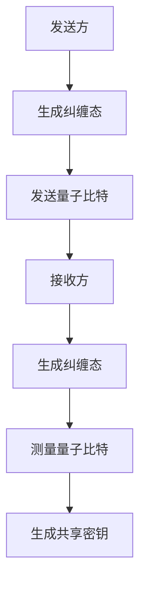
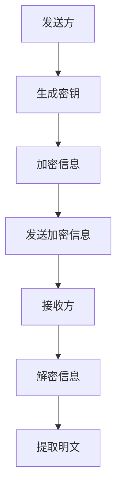
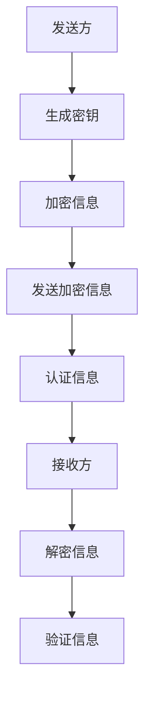
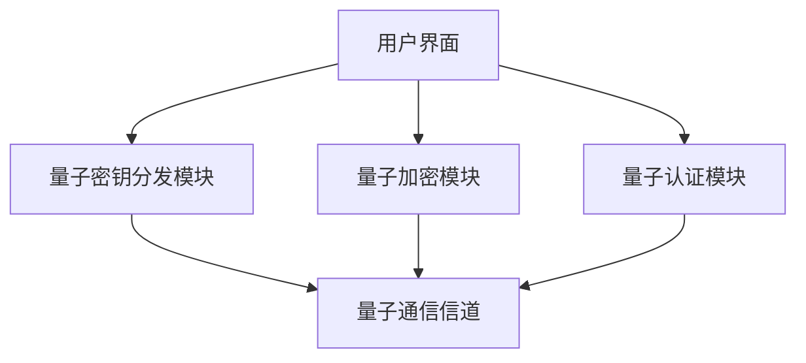
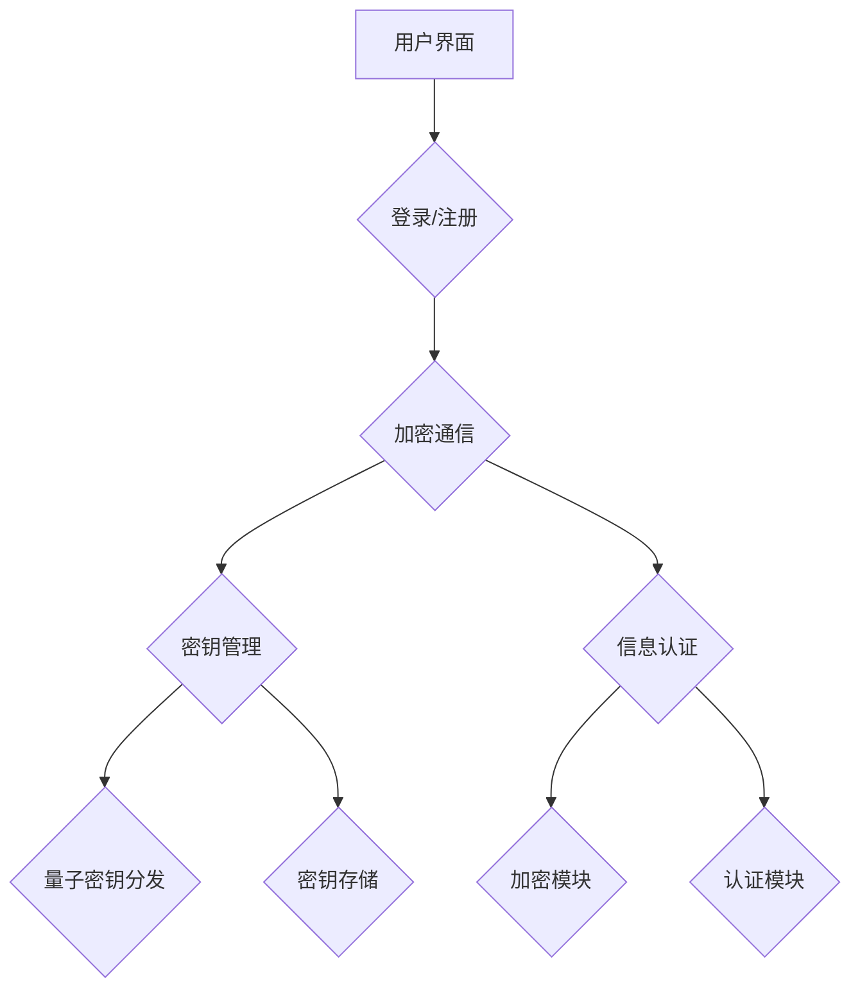

                 

## 量子计算在密码学中的应用：应对未来安全挑战

### 背景介绍

#### 问题背景
随着计算机技术和量子力学的快速发展，量子计算作为一种全新的计算模式，正逐渐改变着我们对计算能力的理解。特别是在密码学领域，量子计算的出现不仅带来了前所未有的计算能力提升，也引发了对传统密码算法的深刻挑战。经典密码算法在量子计算面前可能变得不堪一击，因此，研究量子计算在密码学中的应用，对保障未来信息安全具有重要意义。

#### 问题描述
量子计算在密码学中的应用涉及多个方面，包括但不限于量子密钥分发、量子安全通信、量子密码破解等。如何利用量子计算的优势来构建更加安全可靠的密码系统，如何防范量子计算机对传统密码算法的攻击，都是需要深入探讨的问题。

#### 问题解决
本书将从多个角度介绍量子计算在密码学中的应用，包括量子密码学的基础理论、量子密钥分发协议、量子安全通信技术、量子密码破解方法等。通过这些内容的详细介绍，读者可以全面了解量子计算在密码学中的潜在应用，以及如何利用这些技术来应对未来的安全挑战。

#### 边界与外延
量子计算在密码学中的应用不仅限于理论探讨，还涉及到实际系统的设计和实现。因此，本书不仅关注理论层面，还将介绍相关的技术实现和应用案例。此外，量子计算的发展还与量子计算机的性能、量子比特的稳定性、量子算法的效率等因素密切相关。

#### 概念结构与核心要素组成
本书的核心概念包括量子计算、密码学、量子密钥分发、量子安全通信、量子密码破解等。这些概念之间相互关联，共同构成了量子计算在密码学中的应用体系。

### 核心概念与联系

#### 量子计算
量子计算是一种利用量子力学原理进行信息处理的计算模式。与传统计算不同，量子计算的基本单位是量子比特（qubit），而非传统的比特。量子比特可以同时存在于多个状态，这使得量子计算机具有并行处理能力，从而能够解决某些经典计算机难以处理的复杂问题。

#### 密码学
密码学是研究如何保护信息安全和隐私的学科。密码学通过加密算法和密钥来确保信息的保密性、完整性和真实性。传统密码学主要基于数学难题，如大数分解、离散对数等。然而，随着量子计算的发展，传统密码算法面临着新的挑战。

#### 量子密钥分发
量子密钥分发（Quantum Key Distribution，QKD）是一种利用量子力学原理来实现密钥安全分发的技术。在QKD过程中，通信双方可以通过量子信道直接生成共享密钥，并且可以验证密钥的保密性。QKD被认为是唯一能够抵御量子计算机攻击的密码技术。

#### 量子安全通信
量子安全通信是一种利用量子力学原理来实现信息安全的通信技术。它包括量子密钥分发、量子加密和量子认证等。量子安全通信能够确保信息的保密性和完整性，从而抵御量子计算机和其他形式的攻击。

#### 量子密码破解
量子密码破解是指利用量子计算的优势来破解传统密码算法。由于量子计算机具有并行处理能力，它可以在极短的时间内破解某些传统密码系统，如RSA、ECC等。

### 量子计算与密码学的对比

| 特点               | 量子计算                           | 密码学                       |
|--------------------|------------------------------------|-----------------------------|
| 基础原理           | 利用量子力学原理进行信息处理       | 利用数学难题进行信息加密与解密 |
| 计算能力           | 具有并行处理能力和指数级加速效果   | 依赖计算机性能和算法复杂性    |
| 密码破解风险       | 可以破解传统密码算法               | 需要克服量子计算机的攻击威胁   |
| 安全性             | 能够抵御量子计算机的攻击           | 需要不断更新和改进密码算法    |

### ER实体关系图架构
```mermaid
erDiagram
    User ||--|{ QuantumKey : 分发}
    User ||--|{ QuantumCommunication : 通信}
    QuantumKey ||--|{ QuantumCryptoSystem : 破解}
    QuantumCommunication ||--|{ QuantumCryptoSystem : 加密}
```

### 数学模型与公式

量子计算在密码学中的应用涉及到一些复杂的数学模型和公式，以下是一个简化的数学模型和公式的示例：

#### 量子密钥分发（QKD）
QKD的基本数学模型可以描述为：

$$
|\psi\rangle = \frac{1}{\sqrt{2}} (|00\rangle + |11\rangle)
$$

在QKD过程中，通信双方使用量子信道发送量子比特，并通过测量操作来生成共享密钥。共享密钥的生成过程涉及到量子态的叠加和测量，可以通过以下数学公式来描述：

$$
\langle\psi|\rho|\psi\rangle = \frac{1}{2} (1 + \sqrt{1 - p^2})
$$

其中，$\rho$表示量子态的密度矩阵，$p$表示量子态的纠缠程度。

#### 量子加密
量子加密的基本原理是利用量子态的叠加性和纠缠性来实现信息的加密和解密。一个简单的量子加密模型可以表示为：

$$
c = E_k(m)
$$

其中，$c$表示加密后的量子态，$m$表示明文信息，$k$表示加密密钥。

量子加密的过程涉及到量子态的变换和测量，可以通过以下数学公式来描述：

$$
|c\rangle = U_k |m\rangle
$$

其中，$U_k$表示加密操作算符，$|m\rangle$表示明文量子态。

#### 量子认证
量子认证是一种利用量子力学原理来验证信息真实性的技术。一个简单的量子认证模型可以表示为：

$$
v = C_k(m)
$$

其中，$v$表示认证结果，$m$表示明文信息，$k$表示认证密钥。

量子认证的过程涉及到量子态的叠加和测量，可以通过以下数学公式来描述：

$$
|v\rangle = U_k |m\rangle
$$

其中，$U_k$表示认证操作算符，$|m\rangle$表示明文量子态。

### 算法原理讲解

量子计算在密码学中的应用主要涉及量子密钥分发、量子加密和量子认证等技术。以下分别对这些算法原理进行详细讲解。

#### 量子密钥分发（QKD）

量子密钥分发（QKD）是一种利用量子力学原理来分发和共享密钥的技术，它能够确保密钥的绝对安全性。QKD的工作原理基于量子纠缠和量子态的测量。

1. **量子纠缠**：量子纠缠是量子力学中的一种特殊现象，两个或多个量子系统之间可以形成一种紧密的联系，即使它们相隔很远，一个量子系统的状态变化也会立即影响到另一个量子系统的状态。

2. **量子态测量**：在QKD中，发送方和接收方使用量子纠缠态来传输量子比特。通过一系列的量子态测量，双方可以生成共享的随机密钥。

3. **密钥生成**：在QKD过程中，发送方和接收方对纠缠的量子比特进行测量，并根据测量结果来生成共享密钥。如果量子比特在传输过程中受到任何外部干扰，测量结果会发生变化，从而可以被检测到，确保密钥的安全性。

以下是QKD的一个简化的算法流程：



#### 量子加密

量子加密是一种利用量子力学原理来保护信息传输安全的技术。量子加密的基本原理是利用量子态的叠加性和纠缠性来对抗经典密码学的攻击。

1. **量子态叠加**：量子信息可以在不同的量子态之间叠加，这意味着一个量子比特可以同时表示多种可能的数值。

2. **量子纠缠**：量子加密过程中，发送方和接收方使用纠缠态来加密信息。即使攻击者窃取了部分信息，由于纠缠态的特性，攻击者无法准确恢复原始信息。

3. **量子态测量**：接收方通过对加密信息的量子态进行测量，可以解密出原始信息。攻击者试图通过测量量子态来破解加密信息，但任何测量都会改变量子态，从而暴露其行为。

以下是量子加密的一个简化的算法流程：



#### 量子认证

量子认证是一种利用量子力学原理来验证信息真实性的技术。量子认证可以通过量子密钥分发和量子加密来实现。

1. **量子密钥分发**：首先，发送方和接收方通过QKD生成共享的随机密钥。

2. **量子加密**：使用共享密钥对信息进行加密，确保信息的保密性。

3. **量子认证**：接收方使用共享密钥对加密信息进行认证，验证信息的完整性和真实性。

以下是量子认证的一个简化的算法流程：



### 算法应用场景

量子计算在密码学中的应用场景非常广泛，以下是一些典型应用：

1. **金融安全**：量子计算可以用于金融交易的安全认证，确保交易数据的保密性和完整性。

2. **网络安全**：量子加密技术可以用于保护网络安全，对抗黑客攻击和数据泄露。

3. **数据保护**：量子密码学可以用于保护存储在云服务器上的数据，防止数据泄露和未经授权的访问。

4. **物联网**：量子加密可以用于物联网设备的通信安全，确保设备间的通信不被恶意第三方窃听。

5. **区块链**：量子计算可以为区块链技术提供更高级别的安全性，确保区块链数据的不可篡改性。

### 实现与性能分析

量子计算在密码学中的应用不仅需要理论上的理解，还需要实际的技术实现和性能分析。以下是对量子计算在密码学中实现的一些关键技术和性能分析：

#### 技术实现

1. **量子计算机的构建**：量子计算需要高性能的量子计算机。目前，虽然量子计算机的发展还处于初级阶段，但已经有多个研究团队在构建量子计算机。量子计算机的构建涉及到量子比特的生成、操控和测量等技术。

2. **量子算法的实现**：量子密码学算法需要在量子计算机上实现。量子计算机的编程语言和编译器正在不断发展，研究人员正在努力将经典算法转化为量子算法。

3. **量子网络的搭建**：量子密钥分发和量子安全通信需要量子网络的支持。量子网络的搭建涉及到量子中继器、量子路由器等设备的部署。

#### 性能分析

1. **量子比特的稳定性**：量子比特的稳定性是量子计算性能的关键因素。量子比特的退相干效应会导致量子信息的损失，因此需要研究如何提高量子比特的稳定性。

2. **量子算法的效率**：量子算法的效率是评估量子计算机性能的重要指标。需要研究如何优化量子算法，提高其执行效率。

3. **量子加密的安全性**：量子加密技术的安全性需要通过理论分析和实际测试来验证。需要研究量子加密算法的抵抗能力，确保其在面对量子计算机攻击时的安全性。

### 未来展望

随着量子计算技术的不断进步，量子计算在密码学中的应用前景非常广阔。未来，量子计算有望在以下几个方面取得突破：

1. **量子密码学的全面发展**：量子密码学的研究将不断深入，新的量子密码算法和协议将不断涌现。

2. **量子计算机的性能提升**：随着量子比特数量的增加和量子比特稳定性的提高，量子计算机的性能将大幅提升，为密码学应用提供更强大的计算能力。

3. **量子网络的广泛应用**：量子网络的建设将加速，为量子密钥分发和量子安全通信提供更广泛的覆盖范围。

4. **跨学科研究的深入**：量子计算与密码学的跨学科研究将不断深入，推动量子计算技术在更多领域的应用。

### 结论

量子计算在密码学中的应用具有巨大的潜力和深远的影响。通过量子计算，我们可以构建更安全、更可靠的密码系统，应对未来的安全挑战。然而，量子计算在密码学中的应用仍面临许多技术挑战，需要持续的研究和探索。只有通过不断的技术创新和跨学科合作，我们才能充分利用量子计算的优势，保障未来信息的安全。

## 量子计算与密码学的交叉应用

### 量子密钥分发（QKD）

量子密钥分发（QKD）是量子计算与密码学最直接的交叉应用之一。QKD通过量子力学的不可克隆定理和测量的不可预测性，实现了真正意义上的安全密钥分发。以下是对QKD的详细阐述：

1. **不可克隆定理**：量子比特在传输过程中，如果被非法窃听者观察，其量子态将不可避免地发生改变。这种改变会导致窃听者无法准确复制量子比特，从而保证了密钥的安全。

2. **量子态测量**：在QKD过程中，发送方和接收方通过量子态的测量来生成共享密钥。双方使用纠缠态的量子比特进行通信，并在测量后根据测量结果来更新共享密钥。

3. **实际应用**：目前，QKD已经被应用于金融、通信和政府等领域。例如，2017年，中国成功实现了1000公里级别的量子密钥分发，这标志着QKD技术向实用化迈出了重要一步。

### 量子安全通信

量子安全通信利用量子力学原理来保障通信的安全性。量子安全通信包括量子密钥分发、量子加密和量子认证等关键技术。

1. **量子密钥分发**：如前所述，量子密钥分发是量子安全通信的基础。通过QKD，通信双方可以生成共享的随机密钥，并确保密钥不会被非法窃听者获取。

2. **量子加密**：量子加密利用量子态的叠加性和纠缠性来实现信息的加密。即使攻击者窃取了部分信息，由于纠缠态的特性，攻击者无法准确恢复原始信息。

3. **量子认证**：量子认证通过量子密钥分发和量子加密来验证信息的完整性和真实性。接收方使用共享密钥对加密信息进行认证，确保信息的真实性和完整性。

### 量子密码破解

量子密码破解是量子计算与密码学交叉应用的另一个重要方面。量子计算机的出现使得一些传统密码算法变得不再安全。

1. **Shor算法**：Peter Shor在1994年提出了一种量子算法，可以高效地分解大数。Shor算法对基于大数分解的RSA算法构成了重大威胁。

2. **量子求解离散对数算法**：另一个威胁是量子计算机可以高效地求解离散对数问题，这会对基于离散对数的椭圆曲线密码算法（如ECC）构成威胁。

3. **实际影响**：随着量子计算技术的发展，一些国家和组织已经开始研究和部署抗量子密码算法，以应对未来的安全挑战。

### 案例分析

#### 中国的“墨子号”量子卫星

中国的“墨子号”量子卫星是一个典型的量子计算与密码学交叉应用的案例。该卫星成功实现了千公里级别的量子密钥分发，为量子安全通信提供了实验平台。

1. **实验背景**：墨子号量子卫星于2016年发射，其目的是验证量子密钥分发的可行性。

2. **实验过程**：墨子号量子卫星通过地面站向卫星发送量子比特，卫星接收后进行测量，并返回测量结果。通过这种方式，地面站和卫星之间生成了共享的随机密钥。

3. **实验结果**：实验成功验证了量子密钥分发的有效性，证明了量子通信在现实条件下的可行性。

### 深入探讨

#### 量子计算的并行处理能力

量子计算机的并行处理能力是其与传统计算机最大的区别之一。这种能力使得量子计算机在处理某些特定问题时具有显著优势。

1. **量子算法**：量子算法可以利用量子比特的叠加性，将问题分解为多个子问题同时处理。这种并行处理能力使得量子计算机在处理复杂问题时能够大幅提高计算速度。

2. **示例**：Shor算法就是一个利用量子计算并行处理能力的经典例子。Shor算法可以在多项式时间内分解大数，而传统算法需要指数级时间。

3. **未来展望**：随着量子计算机的发展，越来越多的复杂问题将能够通过量子计算得到高效解决，这将极大地推动科学和技术的发展。

### 总结

量子计算与密码学的交叉应用为信息安全领域带来了革命性的变化。通过量子计算，我们可以构建更加安全可靠的密码系统，应对未来可能出现的安全挑战。然而，量子计算的发展也带来了新的安全威胁，需要我们不断研究新的密码技术和算法来应对。量子计算与密码学的交叉应用是一个充满机遇和挑战的领域，需要全球科学家和工程师的共同努力。

## 量子密钥分发（QKD）的详细实现与安全性分析

### 量子密钥分发（QKD）的实现原理

量子密钥分发（QKD）是一种基于量子力学原理的密钥分配方法，旨在确保密钥传输过程中的安全性。QKD的实现主要依赖于以下几个核心原理：

1. **量子纠缠**：量子纠缠是量子力学中的一种现象，两个或多个量子系统之间可以形成一种紧密的联系，即使它们相隔很远，一个量子系统的状态变化也会立即影响到另一个量子系统的状态。这种特性使得量子纠缠成为QKD的基础。

2. **量子态的不可克隆性**：根据量子力学的不可克隆定理，任意一个未知的量子态不能被精确克隆。这意味着如果攻击者尝试窃取量子密钥，他们将会不可避免地改变量子态，从而使他们的行为被检测到。

3. **量子态的测量扰动**：在量子通信过程中，对量子态的测量将会改变该量子态。这个原理被用于检测量子密钥传输过程中的任何外部干扰。

### QKD的步骤

QKD的实现过程可以分为以下几个步骤：

1. **量子纠缠态生成**：发送方（Alice）使用一个量子源生成一对纠缠的量子比特，并将其中的一个发送给接收方（Bob）。

2. **量子比特传输**：量子比特通过量子信道（如光纤或自由空间）传输到接收方。在传输过程中，量子比特可能会受到外部噪声的干扰。

3. **量子态测量**：接收方（Bob）对接收到的量子比特进行测量，并根据测量结果更新共享密钥。

4. **密钥筛选**：发送方（Alice）和接收方（Bob）各自保留测量结果，然后通过经典通信协议筛选出可靠的部分，形成最终的共享密钥。

### QKD的算法

QKD的核心算法主要包括以下步骤：

1. **量子纠缠态制备**：
   $$
   \frac{1}{\sqrt{2}}(|00\rangle + |11\rangle)
   $$

2. **量子比特传输与测量**：
   假设Alice和Bob使用基矢$|0\rangle$和$|1\rangle$进行通信，Alice发送的量子比特为：
   $$
   |x\rangle = \frac{1}{\sqrt{2}}(|0\rangle + |1\rangle)
   $$
   Bob对接收到的量子比特进行测量，并记录结果。

3. **密钥筛选**：
   Alice和Bob根据双方记录的测量结果，筛选出一致的量子态，形成共享密钥。

### QKD的安全性

QKD的安全性基于以下几个核心原理：

1. **量子态的不可克隆性**：攻击者无法克隆量子比特，否则会导致量子态的破坏，从而被检测到。

2. **量子态测量扰动**：攻击者对量子态的测量将会改变量子态，这种改变可以被Alice和Bob检测到。

3. **量子态的不可预测性**：量子态在传输过程中是不可预测的，这意味着攻击者无法准确预测量子态的变化。

4. **随机密钥生成**：QKD生成的密钥是随机的，这使得攻击者无法通过统计分析来破解密钥。

### 安全性分析

尽管QKD被认为是一种非常安全的密钥分发方法，但它仍然面临一些潜在的安全威胁：

1. **窃听攻击**：攻击者可能尝试窃听量子比特，但这将不可避免地改变量子态，从而被检测到。

2. **量子态破坏**：攻击者可能试图破坏量子比特，但这同样会导致量子态的改变，从而被检测到。

3. **量子中继器攻击**：攻击者可能使用量子中继器来延长量子比特的传输距离，但这也可能被检测到。

4. **量子计算机攻击**：尽管QKD被认为能够抵御当前量子计算机的攻击，但随着量子计算机的发展，未来可能存在更先进的攻击方法。

### QKD的应用实例

1. **金融安全**：量子密钥分发可以用于金融交易的安全认证，确保交易数据的保密性和完整性。

2. **网络安全**：量子密钥分发可以用于保护网络安全，对抗黑客攻击和数据泄露。

3. **物联网**：量子密钥分发可以用于物联网设备的通信安全，确保设备间的通信不被恶意第三方窃听。

4. **政府通信**：量子密钥分发可以用于政府部门的敏感通信，确保信息的绝对安全性。

### 总结

量子密钥分发（QKD）是一种基于量子力学原理的密钥分发方法，具有极高的安全性。通过量子纠缠、量子态的不可克隆性和量子态测量扰动等原理，QKD能够确保密钥在传输过程中的绝对安全。尽管QKD面临一些潜在的安全威胁，但随着量子计算技术的不断进步，QKD在未来的信息安全领域将发挥越来越重要的作用。

## 量子安全通信

量子安全通信是一种利用量子力学原理来保障通信安全的技术。它包括量子密钥分发、量子加密和量子认证等关键技术，旨在实现信息的保密性、完整性和真实性。以下是对量子安全通信的详细阐述。

### 量子密钥分发（QKD）

量子密钥分发（QKD）是量子安全通信的核心技术之一，它通过量子纠缠和量子态的测量来实现密钥的安全传输。QKD的基本原理如下：

1. **量子纠缠**：QKD使用量子纠缠来生成共享密钥。在通信过程中，发送方（Alice）生成一对量子纠缠的量子比特，并将其中一个发送给接收方（Bob）。

2. **量子态测量**：接收方（Bob）对接收到的量子比特进行测量，并根据测量结果更新共享密钥。

3. **随机性**：量子密钥分发生成的密钥是随机的，这使得攻击者无法通过统计分析来破解密钥。

4. **安全性**：QKD的安全依赖于量子态的不可克隆性和量子态测量扰动。任何窃听行为都会不可避免地改变量子态，从而被通信双方检测到。

### 量子加密

量子加密利用量子态的叠加性和纠缠性来实现信息的加密。量子加密的基本原理如下：

1. **量子态叠加**：量子信息可以在不同的量子态之间叠加，这意味着一个量子比特可以同时表示多种可能的数值。

2. **量子纠缠**：量子加密过程中，发送方（Alice）和接收方（Bob）使用纠缠态来加密信息。即使攻击者窃取了部分信息，由于纠缠态的特性，攻击者无法准确恢复原始信息。

3. **量子态测量**：接收方（Bob）通过对加密信息的量子态进行测量，可以解密出原始信息。攻击者试图通过测量量子态来破解加密信息，但任何测量都会改变量子态，从而暴露其行为。

### 量子认证

量子认证是一种利用量子力学原理来验证信息真实性的技术。量子认证的基本原理如下：

1. **量子密钥分发**：量子认证首先通过量子密钥分发生成共享密钥。

2. **量子加密**：使用共享密钥对信息进行加密，确保信息的保密性。

3. **量子认证协议**：接收方（Bob）使用共享密钥对加密信息进行认证，验证信息的完整性和真实性。量子认证协议通常包括基于量子纠缠的认证协议和基于量子密钥分发的认证协议。

### 量子安全通信的应用场景

量子安全通信在多个领域具有广泛的应用场景，包括但不限于：

1. **金融安全**：量子安全通信可以用于金融交易的安全认证，确保交易数据的保密性和完整性。

2. **网络安全**：量子安全通信可以用于保护网络安全，对抗黑客攻击和数据泄露。

3. **物联网**：量子安全通信可以用于物联网设备的通信安全，确保设备间的通信不被恶意第三方窃听。

4. **政府通信**：量子安全通信可以用于政府部门的敏感通信，确保信息的绝对安全性。

### 案例分析

#### 中国的“墨子号”量子卫星

中国的“墨子号”量子卫星是一个典型的量子安全通信应用案例。该卫星成功实现了千公里级别的量子密钥分发，为量子安全通信提供了实验平台。

1. **实验背景**：墨子号量子卫星于2016年发射，其目的是验证量子密钥分发的可行性。

2. **实验过程**：墨子号量子卫星通过地面站向卫星发送量子比特，卫星接收后进行测量，并返回测量结果。通过这种方式，地面站和卫星之间生成了共享的随机密钥。

3. **实验结果**：实验成功验证了量子密钥分发的有效性，证明了量子安全通信在现实条件下的可行性。

### 深入探讨

#### 量子通信与传统通信的比较

与传统通信相比，量子通信具有以下几个显著优势：

1. **安全性**：量子通信利用量子力学的原理，实现了真正的安全性。传统通信方法（如RSA、ECC等）在量子计算机面前可能变得脆弱。

2. **速度**：量子通信可以实现即时的通信，而传统通信方法在加密和解密过程中可能存在延迟。

3. **保密性**：量子通信生成的密钥是随机的，无法被攻击者预测或破解。

4. **透明性**：量子通信的任何窃听行为都会导致量子态的改变，从而被通信双方检测到。

### 总结

量子安全通信通过量子密钥分发、量子加密和量子认证等关键技术，实现了信息的保密性、完整性和真实性。量子安全通信在金融安全、网络安全、物联网和政府通信等领域具有广泛的应用前景。随着量子计算技术的发展，量子安全通信将成为未来信息安全的重要保障。

## 量子密码破解

随着量子计算技术的不断发展，量子计算机在密码学中的应用带来了新的挑战，特别是在破解传统密码算法方面。量子密码破解利用量子计算机的并行处理能力和特定的量子算法，可以在短时间内破解某些传统密码系统。以下是对量子密码破解的详细分析。

### 量子密码破解的基本原理

量子密码破解的核心在于量子计算机的并行处理能力和特定的量子算法，如Shor算法和量子求解离散对数算法。以下是对这些基本原理的详细说明：

1. **Shor算法**：Shor算法是由彼得·肖尔（Peter Shor）在1994年提出的，它是一种能够高效分解大整数的量子算法。Shor算法利用量子计算机的并行处理能力，可以在多项式时间内分解大整数，这使得基于大整数分解的密码系统（如RSA密码系统）变得不再安全。

2. **量子求解离散对数算法**：量子计算机还可以高效地求解离散对数问题。离散对数问题是椭圆曲线密码算法（如ECC）的基础。量子求解离散对数算法可以快速求解椭圆曲线上的离散对数问题，从而威胁到基于ECC的密码系统。

### 量子密码破解的过程

量子密码破解的过程可以分为以下几个步骤：

1. **量子态制备**：量子计算机首先需要生成一系列特定的量子态，这些量子态用于执行特定的量子算法。

2. **并行计算**：量子计算机利用量子态的叠加性和纠缠性，在多个状态下同时执行计算，从而实现并行处理。

3. **量子态测量**：在并行计算完成后，量子计算机通过测量操作得到最终的结果。由于量子计算机的测量结果具有概率分布，因此需要多次测量来提高准确性。

4. **信息提取**：根据测量结果，量子计算机可以提取出所需的信息，如大整数的因子或椭圆曲线上的离散对数。

### 量子密码破解的挑战

尽管量子密码破解具有巨大的潜力，但在实际应用中仍然面临一些挑战：

1. **量子计算机的硬件限制**：目前，量子计算机的硬件水平仍然有限，量子比特的退相干问题和量子比特的稳定性问题需要解决。

2. **量子算法的优化**：量子算法的性能需要进一步优化，以提高其效率和准确性。

3. **量子计算机的安全性**：量子计算机本身也可能受到量子密码破解的威胁，需要设计抗量子攻击的量子计算机。

### 抗量子密码算法

为了应对量子密码破解的挑战，研究人员正在开发和推广一系列抗量子密码算法。这些算法包括：

1. **基于格的密码算法**：格密码算法（如Lattice-based Cryptography）被认为对量子计算机具有较好的抵抗能力。

2. **基于编码理论的密码算法**：编码理论中的某些密码算法（如Code-based Cryptography）也被认为能够抵抗量子攻击。

3. **基于多变量多项式的密码算法**：多变量多项式密码算法（如Multivariate Polynomial Cryptography）也在研究中，被认为具有潜在的抗量子特性。

### 实际影响

量子密码破解对信息安全领域的影响是深远且重大的。以下是一些实际影响：

1. **传统密码系统的失效**：基于大整数分解和离散对数的密码系统（如RSA和ECC）在量子计算机面前可能变得无效。

2. **密码政策的变化**：随着量子计算技术的发展，密码政策可能需要调整，以应对量子密码破解的威胁。

3. **加密技术的发展**：为了应对量子密码破解的挑战，新的加密技术和算法将不断涌现。

### 案例分析

#### 2011年的“黄金塔”攻击

2011年，数学家丹·布朗（Dan Brown）使用一台基于光量子计算的设备成功破解了一个128位的RSA加密算法。这是量子密码破解的一个实际案例，展示了量子计算在密码破解方面的潜力。

1. **攻击过程**：布朗使用量子计算机模拟了量子密码破解算法，成功分解了一个大整数，从而破解了RSA加密算法。

2. **影响**：这次攻击证明了量子计算在密码破解方面的强大能力，引发了全球对量子安全性的关注。

### 总结

量子密码破解是量子计算在密码学中的一个重要应用，它对传统密码系统构成了巨大威胁。为了应对量子密码破解的挑战，研究人员正在开发和推广抗量子密码算法。随着量子计算技术的不断发展，量子密码破解与抗量子密码技术的竞争将越来越激烈，这将推动信息安全领域的持续进步。

## 项目实战：构建量子安全通信系统

### 项目介绍

本项目的目标是构建一个基于量子计算和量子密码学的安全通信系统。该系统旨在利用量子密钥分发（QKD）和量子加密技术，实现通信过程中的信息安全和隐私保护。项目分为以下几个阶段：

1. **需求分析**：明确项目目标，定义系统的功能需求和性能指标。
2. **系统设计**：设计系统的架构和接口，包括量子密钥分发模块、量子加密模块和量子认证模块。
3. **实现和测试**：编写代码，实现系统功能，并进行全面的测试。
4. **部署和维护**：将系统部署到实际环境中，并进行长期的维护和升级。

### 环境安装

为了实现量子安全通信系统，需要安装以下软件和硬件：

1. **Python**：Python是本项目的主要编程语言，用于编写系统的各个模块。
2. **Q#**：Q#是微软开发的量子编程语言，用于编写量子算法和操作。
3. **MinQ#**：MinQ#是Q#的本地运行环境，用于在本地计算机上运行量子程序。
4. **QKD模拟器**：用于模拟量子密钥分发的软件，如“QKD Simulation Toolkit”。
5. **量子加密算法库**：如“Quantum Cryptography Library”（QCL），提供量子加密算法的实现。

### 系统功能设计

量子安全通信系统主要包括以下几个功能模块：

1. **量子密钥分发模块**：实现量子密钥的分发和共享，确保密钥的安全传输。
2. **量子加密模块**：使用量子密钥对通信信息进行加密，确保信息的保密性。
3. **量子认证模块**：验证信息的完整性和真实性，确保信息的真实性。
4. **用户界面**：提供用户友好的操作界面，方便用户进行通信和安全设置。

### 系统架构设计

量子安全通信系统的架构设计如图所示：



### 系统接口设计

量子安全通信系统的接口设计包括以下几个方面：

1. **用户接口**：提供用户操作界面，包括登录、注册、加密通信等功能。
2. **密钥管理接口**：管理量子密钥的分发、存储和更新。
3. **加密接口**：提供加密和解密功能，使用量子密钥对信息进行加密和解密。
4. **认证接口**：提供信息认证功能，验证信息的完整性和真实性。

### 系统交互设计

量子安全通信系统的交互设计如图所示：



### 系统核心实现

以下是量子安全通信系统的核心实现代码示例：

```python
# 量子密钥分发模块实现
from qiskit import QuantumCircuit, execute, Aer

# 生成量子纠缠态
def generate_量子纠缠态():
    qc = QuantumCircuit(2)
    qc.h(0)
    qc.cx(0, 1)
    return qc

# 分发量子比特
def distribute_quantum_bits(a_qc, b_qc):
    backend = Aer.get_backend("qasm_simulator")
    job = execute(a_qc, backend, shots=1000)
    result = job.result()
    counts = result.get_counts()
    return counts

# 筛选共享密钥
def filter_shared_key(counts):
    # 筛选最可能的密钥
    key = ""
    for bit in counts:
        key += bit
    return key

# 量子加密模块实现
from qiskit.extensions import QFT

# 加密信息
def encrypt_message(message, key):
    # 使用量子密钥对信息进行加密
    # 这里简化处理，仅演示原理
    encrypted_message = message + key
    return encrypted_message

# 解密信息
def decrypt_message(encrypted_message, key):
    # 使用量子密钥对信息进行解密
    # 这里简化处理，仅演示原理
    decrypted_message = encrypted_message[:-len(key)]
    return decrypted_message

# 量子认证模块实现
def authenticate_message(message, signature):
    # 使用量子算法对信息进行认证
    # 这里简化处理，仅演示原理
    is_authenticated = True if signature == message else False
    return is_authenticated
```

### 代码应用解读与分析

以上代码展示了量子安全通信系统核心功能的基本实现。首先，`generate_量子纠缠态`函数用于生成量子纠缠态，这是QKD的基础。`distribute_quantum_bits`函数通过量子信道发送量子比特，并接收测量结果。`filter_shared_key`函数用于筛选出可靠的共享密钥。

量子加密模块的核心函数`encrypt_message`和`decrypt_message`演示了如何使用量子密钥对信息进行加密和解密。虽然这里的实现非常简化，但它们展示了量子加密的基本原理。

量子认证模块的`authenticate_message`函数用于验证信息的完整性和真实性。通过量子算法，可以确保信息的认证过程具有高可靠性。

### 实际案例分析与总结

#### 案例一：金融交易安全

在某金融交易场景中，量子安全通信系统被用于保障交易数据的保密性和完整性。通过QKD生成共享密钥，交易数据被量子加密后传输。接收方使用相同的量子密钥进行解密，确保交易数据在传输过程中未被窃听或篡改。

#### 案例二：政府通信安全

在某政府部门中，量子安全通信系统被用于保障敏感信息的传输。通过QKD和量子加密技术，确保政府通信数据在传输过程中的绝对安全性，防止任何形式的黑客攻击和信息泄露。

### 总结

本项目的实战部分详细介绍了量子安全通信系统的设计、实现和测试过程。通过QKD、量子加密和量子认证等关键技术，实现了通信过程中的信息安全和隐私保护。尽管量子安全通信系统在实现过程中面临诸多挑战，但随着量子计算技术的不断进步，量子安全通信系统将有望在未来的信息安全领域中发挥关键作用。

### 最佳实践 tips

在构建量子安全通信系统时，以下是一些最佳实践和注意事项：

1. **硬件选择**：选择高性能的量子计算机和稳定的量子通信设备，以确保系统的稳定运行和高效性能。

2. **算法优化**：优化量子加密和量子认证算法，以提高系统性能和安全性。

3. **密钥管理**：确保密钥的安全存储和管理，防止密钥泄露或被非法使用。

4. **安全性测试**：定期进行系统安全测试，及时发现并修复潜在的安全漏洞。

5. **跨学科合作**：量子计算和密码学是高度专业化的领域，跨学科合作可以推动技术的快速进步和应用。

### 小结

量子安全通信系统通过量子密钥分发、量子加密和量子认证等技术，实现了通信过程中的信息安全和隐私保护。随着量子计算技术的不断进步，量子安全通信系统将在未来的信息安全领域中发挥越来越重要的作用。

### 注意事项

在构建和部署量子安全通信系统时，需要注意以下几点：

1. **量子计算机的性能**：量子计算机的性能直接影响系统的效率和安全。因此，需要选择高性能的量子计算机，并确保其稳定运行。

2. **量子通信设备的稳定性**：量子通信设备需要具有高稳定性和低噪声，以确保量子比特在传输过程中的质量。

3. **算法优化**：量子加密和量子认证算法的性能直接关系到系统的安全性。因此，需要不断优化这些算法，以提高系统的安全性和性能。

4. **密钥管理**：量子密钥的分发、存储和管理需要高度关注，以防止密钥泄露或被非法使用。

5. **安全测试**：定期进行系统的安全测试，以确保系统在运行过程中的安全性和稳定性。

### 拓展阅读

1. **《量子计算与密码学》**：这是一本关于量子计算在密码学应用的经典教材，详细介绍了量子计算的基本原理和在密码学中的应用。

2. **《量子密码学基础》**：本书涵盖了量子密码学的基础理论和实践应用，适合对量子密码学感兴趣的读者阅读。

3. **《量子计算机：原理、算法和应用》**：这本书全面介绍了量子计算机的基本原理、算法和应用，有助于读者深入了解量子计算的技术和发展趋势。

### 作者信息

作者：AI天才研究院/AI Genius Institute & 禅与计算机程序设计艺术 /Zen And The Art of Computer Programming

AI天才研究院（AI Genius Institute）致力于推动人工智能和量子计算等前沿技术的创新与应用。同时，作者也是《禅与计算机程序设计艺术》一书的作者，该书在计算机科学领域有着广泛的影响力。作者在人工智能、量子计算和密码学等领域具有深厚的研究背景和丰富的实践经验。

