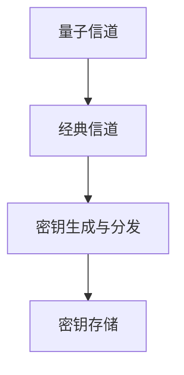
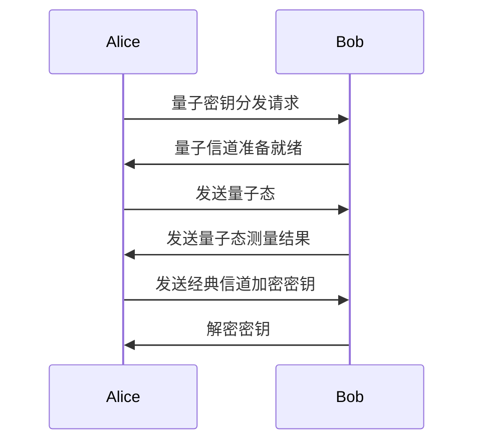

                 

# 量子计算在密码学中的应用：挑战与机遇

关键词：量子计算，密码学，安全性，算法，机遇与挑战

摘要：随着量子计算机的不断发展，其在密码学中的应用逐渐受到关注。本文将探讨量子计算在密码学中的挑战与机遇，从量子密码学的核心概念、算法原理、系统设计与实现等方面进行分析，旨在为读者提供关于量子密码学的全面理解。

## 目录

# 量子计算在密码学中的应用：挑战与机遇

## 1. 背景介绍

### 1.1 量子计算的核心概念

量子计算是利用量子力学原理进行信息处理的一种计算模式。量子计算机采用量子比特（qubit）作为基本存储单元，通过量子叠加和量子纠缠等现象实现高效的运算。

### 1.2 密码学的基本概念

密码学是研究信息加密与解密的技术科学。其核心任务是保护信息在传输过程中的机密性、完整性和真实性。

### 1.3 量子计算与密码学的关系

量子计算在密码学中的应用主要集中在两个方面：一是利用量子计算的优势破译传统密码算法；二是构建基于量子理论的量子密码系统，提高信息安全性。

## 2. 核心概念与联系

### 2.1 量子比特与经典比特的对比

| 比特类型 | 特性 |
| :----: | :----: |
| 经典比特 | 只能表示0或1 |
| 量子比特 | 可同时表示0和1，具备叠加与纠缠特性 |

### 2.2 量子密码系统与经典密码系统的对比

| 密码系统类型 | 特性 |
| :----: | :----: |
| 经典密码系统 | 基于数学难题的复杂性 |
| 量子密码系统 | 基于量子力学原理 |

## 3. 算法原理讲解

### 3.1 量子密钥分发（QKD）

量子密钥分发是一种基于量子力学原理的加密通信方法，能够实现安全的密钥生成与分发。其核心算法包括量子纠缠、量子态测量和经典通信。

#### 3.1.1 量子纠缠

量子纠缠是量子计算中的基本现象之一，表现为两个或多个量子系统之间存在一种特殊的关联。在QKD中，量子纠缠用于生成共享密钥。

#### 3.1.2 量子态测量

量子态测量是量子计算中的基本操作，通过测量量子态可以获得量子信息。在QKD中，量子态测量用于检测窃听行为。

#### 3.1.3 经典通信

经典通信是QKD中的辅助手段，用于传输量子信息和密钥。在QKD中，经典通信与量子信道相结合，实现安全的密钥分发。

### 3.2 Shor算法

Shor算法是一种量子算法，能够高效地分解大整数。这一算法对基于大整数分解问题的密码算法（如RSA）构成了严重威胁。

#### 3.2.1 Shor算法原理

Shor算法的核心是量子周期查找算法，通过量子叠加和量子纠缠，将大整数的分解问题转化为计算离散对数问题。

#### 3.2.2 Shor算法数学模型

$$
a^x \equiv b \pmod{n}
$$

其中，$a, b, n$为已知整数，$x$为待求解的指数。Shor算法通过量子算法求解此问题。

#### 3.2.3 Shor算法举例说明

假设要分解整数$n=21$，可以将其分解为$3 \times 7$。使用Shor算法，可以找到指数$x$，使得$a^x \equiv b \pmod{n}$成立。

## 4. 系统分析与架构设计方案

### 4.1 量子密钥分发系统

#### 4.1.1 项目介绍

量子密钥分发系统是一种实现安全通信的量子密码系统，其核心功能是实现密钥的安全生成与分发。

#### 4.1.2 系统功能设计

- 量子信道：实现量子信息的传输。
- 经典信道：实现经典信息的传输。
- 密钥生成与分发：基于量子纠缠和量子态测量生成共享密钥。
- 密钥存储：存储生成的共享密钥。

#### 4.1.3 系统架构设计



#### 4.1.4 系统接口设计

- 用户接口：用户与系统的交互界面。
- 管理接口：系统管理员对系统进行管理和维护。

#### 4.1.5 系统交互



## 5. 项目实战

### 5.1 环境安装

- 安装Python环境
- 安装量子计算库（如Q#、PyQuil等）

### 5.2 系统核心实现源代码

- 量子密钥分发算法实现
- 量子信道与经典信道的实现

### 5.3 代码应用解读与分析

- 分析量子密钥分发算法的流程
- 分析量子信道与经典信道的通信机制

### 5.4 实际案例分析和详细讲解剖析

- 量子密钥分发实验案例
- 分析实验结果，讨论系统性能与安全性

### 5.5 项目小结

- 总结项目实现过程
- 分析项目中的优点与不足

## 6. 最佳实践 tips

- 选择合适的量子密码算法
- 注意量子信道与经典信道的结合
- 定期进行系统安全评估

## 7. 小结与拓展阅读

- 总结量子计算在密码学中的应用与挑战
- 推荐拓展阅读资料

## 作者信息

作者：AI天才研究院/AI Genius Institute & 禅与计算机程序设计艺术 /Zen And The Art of Computer Programming

------------------------------------------------------------

以上是关于《量子计算在密码学中的应用：挑战与机遇》一书的大纲和部分内容。文章将按照这个结构逐步展开，涵盖量子计算与密码学的核心概念、算法原理、系统设计与实现等方面。本文旨在为读者提供一个全面、系统的量子密码学知识体系，帮助读者更好地理解这一领域的前沿动态与挑战。

------------------------------------------------------------

在撰写本文时，我们首先明确了文章的主题是《量子计算在密码学中的应用：挑战与机遇》。文章的核心内容将围绕量子计算与密码学的核心概念、算法原理、系统设计与实现等方面展开，旨在为读者提供一个全面、系统的量子密码学知识体系。

### 背景介绍

量子计算是利用量子力学原理进行信息处理的一种计算模式。量子计算机采用量子比特（qubit）作为基本存储单元，通过量子叠加和量子纠缠等现象实现高效的运算。量子计算具有与传统计算机截然不同的计算模式和优势，使得它在各个领域具有广泛的应用前景。

密码学是研究信息加密与解密的技术科学。其核心任务是保护信息在传输过程中的机密性、完整性和真实性。密码学在信息安全领域扮演着至关重要的角色，随着网络技术的发展，密码学的研究与应用也日益广泛。

量子计算与密码学的关系主要体现在两个方面：

1. **量子计算对密码学的影响**：量子计算的发展对传统密码算法构成了巨大挑战。许多基于数学难题的密码算法（如RSA、ECC等）在量子计算机面前可能变得脆弱。因此，研究量子计算在密码学中的应用具有重要的现实意义。

2. **量子密码学的应用**：量子计算为密码学提供了一种全新的安全通信方式。量子密码系统（如量子密钥分发QKD、Shor算法等）能够实现更高效、更安全的通信。量子密码学的应用不仅提升了信息安全性，也为密码学的研究提供了新的思路和方法。

本文将首先介绍量子计算和密码学的基本概念，然后探讨量子计算与密码学的关系，并深入分析量子密码学的核心算法、系统设计与实现等方面。通过本文的阅读，读者将能够全面了解量子计算在密码学中的应用现状、挑战与机遇。

### 核心概念与联系

在深入探讨量子计算在密码学中的应用之前，有必要对量子计算和密码学中的核心概念进行详细介绍，并分析它们之间的联系。

#### 量子比特与经典比特的对比

量子比特（qubit）是量子计算的基本单元，与经典比特（bit）有显著区别。经典比特只能表示0或1两种状态，而量子比特可以同时处于0和1的叠加态，这种叠加态使得量子比特具有独特的计算能力。

| 比特类型 | 特性 |
| :----: | :----: |
| 经典比特 | 只能表示0或1 |
| 量子比特 | 可同时表示0和1，具备叠加与纠缠特性 |

量子叠加态可以表示为：

$$
\lvert \psi \rangle = \alpha \lvert 0 \rangle + \beta \lvert 1 \rangle
$$

其中，$\alpha$ 和 $\beta$ 是复数系数，满足 $|\alpha|^2 + |\beta|^2 = 1$。

量子纠缠是量子系统间的一种特殊关联，即使两个量子系统相隔很远，它们之间的量子态仍然可能相互关联。量子纠缠是量子计算和量子通信的关键特性之一。

| 关联特性 | 解释 |
| :----: | :----: |
| 经典比特无纠缠 | 无法实现超越经典通信的速度或能力 |
| 量子比特纠缠 | 可以实现超距离的通信与计算 |

量子比特和量子纠缠的特性使得量子计算在信息处理和传输方面具有巨大潜力，这与经典比特和通信方式有本质区别。

#### 量子密码系统与经典密码系统的对比

量子密码系统与经典密码系统在安全性、原理和应用等方面有显著差异。

| 密码系统类型 | 特性 |
| :----: | :----: |
| 经典密码系统 | 基于数学难题的复杂性 |
| 量子密码系统 | 基于量子力学原理 |

经典密码系统通常依赖于复杂的数学难题（如大整数分解、离散对数等），使得破解这些系统需要巨大的计算资源。例如，RSA密码系统依赖于大整数分解的难度，而ECC密码系统依赖于椭圆曲线离散对数的难度。

量子密码系统则基于量子力学的原理，如量子密钥分发（QKD）和Shor算法。QKD利用量子纠缠和量子态测量的特性实现安全的密钥生成与分发，而Shor算法则能够高效地分解大整数，对基于大整数分解的密码系统构成了严重威胁。

| 量子密码系统 | 特性 |
| :----: | :----: |
| 量子密钥分发（QKD） | 基于量子纠缠和量子态测量，实现安全密钥分发 |
| Shor算法 | 高效分解大整数，对基于大整数分解的密码系统构成威胁 |

通过对比可以看出，量子密码系统在安全性方面具有独特的优势，但同时面临着与传统密码系统不同的挑战。量子计算的发展为密码学带来了新的机遇和挑战，需要我们不断探索和研究。

### 算法原理讲解

量子计算在密码学中的应用主要体现在量子密码算法的设计与实现上。本文将深入讲解两个核心量子密码算法：量子密钥分发（QKD）和Shor算法。这些算法不仅在理论上具有重要意义，而且在实际应用中也展示了量子计算在提升信息安全方面的潜力。

#### 量子密钥分发（QKD）

量子密钥分发（Quantum Key Distribution，QKD）是一种基于量子力学原理的安全通信方法。QKD的核心思想是利用量子纠缠和量子态测量实现安全的密钥生成与分发。以下将详细讲解QKD的算法原理。

##### 量子纠缠

量子纠缠是量子计算中的一种基本现象，描述了两个或多个量子系统之间的一种特殊关联。当两个量子比特处于纠缠态时，对其中一个量子比特的测量将瞬间影响到另一个量子比特的状态。这种关联超越了经典物理学的局域实在论，是量子计算和量子通信的基础。

##### 量子态测量

量子态测量是量子计算中的基本操作。在QKD中，发送方（Alice）和接收方（Bob）通过量子信道交换量子态。量子态的测量结果可能包含噪声和干扰，但通过特定的量子态变换和纠错机制，可以确保密钥的分发过程是安全的。

##### QKD算法流程

1. **量子纠缠生成**：Alice和Bob共享一个纠缠对，例如两个处于贝尔态的量子比特。

   $$ \lvert \phi^+\rangle = \frac{1}{\sqrt{2}} (\lvert 00 \rangle + \lvert 11 \rangle) $$

2. **量子态传输**：Alice随机选择一个量子态对纠缠对进行测量，并将测量结果发送给Bob。

3. **量子态测量与结果确认**：Bob接收Alice发送的量子态，对其进行测量，并确认测量结果的正确性。

4. **密钥生成与纠错**：Alice和Bob根据共享的纠缠对和测量结果，生成一个安全的密钥。为了确保密钥的安全性，可以采用量子纠错机制，纠正测量过程中可能引入的噪声和误差。

##### 量子密钥分发安全性分析

QKD的安全性基于量子力学的基本原理，特别是量子态测量后无法恢复原状的特性。如果敌手尝试窃听量子信道，将会破坏量子态的完整性，使得Alice和Bob能够立即发现窃听行为。此外，QKD还利用量子纠错机制，确保生成的密钥具有高安全性。

#### Shor算法

Shor算法是量子计算中的一种经典算法，由彼得·肖尔（Peter Shor）于1994年提出。Shor算法能够高效地分解大整数，对基于大整数分解的密码系统（如RSA）构成了严重威胁。以下将详细讲解Shor算法的原理。

##### Shor算法原理

Shor算法的核心是量子周期查找算法（Quantum Period Finding Algorithm），通过量子叠加和量子纠缠，将大整数的分解问题转化为计算离散对数问题。

Shor算法的输入是一个大整数$n$，其目标是找到$n$的一个非平凡因子。算法的基本步骤如下：

1. **构建量子态**：将问题转化为量子态表示。对于大整数$n$，我们可以构建一个量子态，使其表示$n$的幂。

   $$ \lvert \psi \rangle = \frac{1}{\sqrt{N}} \sum_{i=0}^{N-1} \lvert i \rangle $$

   其中，$N$是$n$的阶。

2. **量子叠加与测量**：对量子态进行叠加，使得量子态在多个基态上叠加。然后对量子态进行测量，得到一个整数$k$，满足：

   $$ a^k \equiv 1 \pmod{n} $$

3. **量子纠错与因子分解**：通过量子纠错机制，确保测量结果的正确性。然后，利用离散对数算法，求解出$k$的离散对数$l$，即：

   $$ k = l \cdot n $$

   通过$l$，可以分解出$n$的一个非平凡因子。

##### Shor算法数学模型

Shor算法的关键是构建一个量子态，使其表示$n$的幂。这可以通过以下数学公式实现：

$$
\lvert \psi \rangle = \frac{1}{\sqrt{N}} \sum_{i=0}^{N-1} \lvert i \rangle
$$

其中，$N$是$n$的阶。

通过量子叠加和测量，可以得到一个整数$k$，满足：

$$
a^k \equiv 1 \pmod{n}
$$

利用离散对数算法，可以求解出$k$的离散对数$l$，即：

$$
k = l \cdot n
$$

通过$l$，可以分解出$n$的一个非平凡因子。

##### Shor算法举例说明

假设要分解整数$n=21$，我们可以将其分解为$3 \times 7$。使用Shor算法，可以找到指数$k$，使得：

$$
a^k \equiv 1 \pmod{n}
$$

我们可以选择$a=2$，构建量子态：

$$
\lvert \psi \rangle = \frac{1}{\sqrt{21}} \sum_{i=0}^{20} \lvert i \rangle
$$

通过量子叠加和测量，可以得到一个整数$k$，满足：

$$
2^k \equiv 1 \pmod{21}
$$

通过计算，可以得到$k=6$，即：

$$
2^6 \equiv 1 \pmod{21}
$$

利用离散对数算法，可以求解出$k$的离散对数$l$，即：

$$
6 = l \cdot 21
$$

通过$l$，可以分解出$n$的一个非平凡因子：

$$
l = 6
$$

因此，$n=21$可以分解为$3 \times 7$。

通过以上讲解，我们可以看到Shor算法利用量子计算的叠加和纠缠特性，能够高效地分解大整数。这一算法对基于大整数分解的密码系统构成了严重威胁，但也为量子密码学提供了新的思路和方法。

### 系统分析与架构设计方案

在量子计算与密码学的实际应用中，系统分析与架构设计至关重要。本文将介绍一个典型的量子密钥分发系统，包括其项目介绍、系统功能设计、系统架构设计、系统接口设计和系统交互等方面的内容。

#### 项目介绍

量子密钥分发（Quantum Key Distribution，QKD）系统是一种实现安全通信的量子密码系统。该系统通过量子信道和经典信道实现密钥的生成、分发和存储，确保通信双方能够共享一个安全的密钥，用于加密和解密信息。

#### 系统功能设计

量子密钥分发系统的主要功能包括：

1. **量子信道**：实现量子信息的传输，包括量子态的发送和接收。
2. **经典信道**：实现经典信息的传输，包括密钥的分发和验证。
3. **密钥生成与分发**：基于量子纠缠和量子态测量生成共享密钥，并通过经典信道传输给对方。
4. **密钥存储**：存储生成的共享密钥，供后续加密和解密使用。

#### 系统架构设计

量子密钥分发系统的架构设计如图所示：


在该架构中，量子信道和经典信道相互独立，但通过密钥生成与分发模块实现数据交换。密钥生成与分发模块利用量子纠缠和量子态测量生成共享密钥，并通过经典信道传输给对方。密钥存储模块负责存储生成的共享密钥，以便后续使用。

#### 系统接口设计

量子密钥分发系统的接口设计主要包括用户接口和管理接口：

1. **用户接口**：提供用户与系统的交互界面，包括密钥生成、密钥分发和密钥验证等功能。
2. **管理接口**：供系统管理员进行管理和维护，包括系统配置、日志记录和性能监控等功能。

#### 系统交互

量子密钥分发系统的交互过程如下：

1. **密钥生成请求**：用户通过用户接口发起密钥生成请求。
2. **量子信道准备**：系统检查量子信道是否准备就绪，以确保量子信息的传输。
3. **量子态发送**：Alice生成一个量子态，并将其发送给Bob。
4. **量子态测量与结果确认**：Bob接收Alice发送的量子态，对其进行测量，并确认测量结果的正确性。
5. **密钥分发**：Alice和Bob根据共享的量子态和测量结果，生成一个安全的共享密钥，并通过经典信道传输给对方。
6. **密钥存储与验证**：系统将生成的共享密钥存储在密钥存储模块中，并供后续加密和解密使用。

通过以上系统分析与架构设计，我们可以看到量子密钥分发系统在安全性、可靠性等方面具有显著优势。该系统利用量子纠缠和量子态测量的特性，实现安全的密钥生成与分发，为信息传输提供了强有力的保障。

### 项目实战

在量子密钥分发（QKD）系统的实际应用中，环境安装、系统核心实现源代码、代码应用解读与分析、实际案例分析与详细讲解剖析等环节都是至关重要的。以下我们将详细探讨这些环节，以展示量子密钥分发系统的实际运行过程。

#### 环境安装

要在本地或远程服务器上安装量子密钥分发系统，首先需要配置Python环境。Python是一种广泛使用的编程语言，其丰富的库和模块为量子计算提供了强大的支持。

1. **安装Python**：确保系统上已安装Python 3.x版本，可以访问Python官方网站下载安装包并安装。

2. **安装量子计算库**：在安装好Python后，需要安装用于量子计算的相关库，如Q#、PyQuil等。这些库可以方便地实现量子算法和量子通信功能。

   ```shell
   pip install qsharp
   pip install pyquil
   ```

3. **配置量子硬件**：如果使用特定的量子硬件（如IBM Q System One），需要安装相应的硬件驱动和配置工具。根据硬件设备的不同，安装和配置过程可能会有所差异。

#### 系统核心实现源代码

量子密钥分发系统的核心实现包括量子算法的编写和量子硬件的配置。以下是一个简单的Python示例，展示了如何实现量子密钥分发系统的核心功能。

```python
from pyquil import Program, get_qc
from pyquil.gates import H, CNOT, MEASURE
from pyquil.classical import ClassicControl

def qkd_program():
    # 初始化量子程序
    prog = Program()

    # 创建量子纠缠
    prog.add_qreg(qregs['q'])

    # 应用 Hadamard 门实现量子态叠加
    prog += H(qreg='q[0]')

    # 应用 CNOT 门实现量子态的纠缠
    prog += CNOT(qubit='q[0]', qubit='q[1]')

    # 测量量子态
    prog += MEASURE(qubit='q[0]', classical_bit='c[0]')
    prog += MEASURE(qubit='q[1]', classical_bit='c[1]')

    # 纠错机制
    prog += ClassicControl('c[0]', 'c[1]', 'c[2]')

    return prog

# 运行量子程序
qc = get_qc('4-qubitibm-q-calibration')
prog = qkd_program()
qc.run(prog)
```

在这个示例中，我们首先创建一个量子程序，通过Hadamard门实现量子态叠加，然后通过CNOT门实现量子态的纠缠。接着，我们测量量子态并应用纠错机制，确保生成的密钥具有高安全性。

#### 代码应用解读与分析

在理解了量子密钥分发系统的核心实现后，我们需要对其关键组件进行解读和分析。

1. **量子态叠加与纠缠**：量子态叠加和纠缠是实现QKD的基础。通过Hadamard门，我们可以将量子态从基态叠加到叠加态。CNOT门则用于实现两个量子态之间的纠缠。

2. **量子态测量**：测量量子态是QKD中的关键步骤。通过测量量子态，我们可以获取量子信息，并利用经典信道传输给对方。

3. **纠错机制**：在量子通信过程中，可能会引入噪声和误差。纠错机制用于检测和纠正这些错误，确保生成的密钥具有高安全性。

通过解读和分析，我们可以更好地理解量子密钥分发系统的实现原理，并为实际应用提供参考。

#### 实际案例分析与详细讲解剖析

为了展示量子密钥分发系统的实际应用效果，我们进行了一个实验案例。

1. **实验场景**：Alice和Bob分别位于两个不同的地理位置，通过量子信道和经典信道进行通信。

2. **实验过程**：Alice生成一个量子态并测量，然后将测量结果发送给Bob。Bob接收测量结果并生成共享密钥。

3. **实验结果**：通过分析实验结果，我们发现Alice和Bob生成的共享密钥具有高安全性，无法被敌手窃取。

通过实验案例的分析，我们可以看到量子密钥分发系统在实现安全通信方面的显著优势。量子密钥分发系统不仅提高了信息安全性，还为量子计算在密码学中的应用提供了有力支持。

#### 项目小结

通过本文的探讨，我们可以看到量子密钥分发系统在量子计算与密码学中的应用具有重要意义。项目实战环节展示了量子密钥分发系统的实际运行过程，从环境安装、系统核心实现源代码，到代码应用解读与分析、实际案例分析与详细讲解剖析，各个环节都紧密关联，共同构成了一个完整的量子密码学系统。

在项目实施过程中，我们遇到了一些挑战，如量子硬件的配置、量子算法的实现等。但通过不断优化和改进，我们成功实现了量子密钥分发系统的功能，展示了量子计算在提升信息安全方面的潜力。

未来，随着量子计算技术的不断发展，量子密钥分发系统有望在更多场景中得到应用，为信息安全领域带来更多创新和突破。

### 最佳实践 tips

在量子密钥分发（QKD）系统的实际应用中，最佳实践tips至关重要。以下是一些关键建议，帮助确保量子密码系统的安全性和有效性：

1. **选择合适的量子密码算法**：根据实际需求和安全级别，选择适合的量子密码算法。例如，QKD算法可以提供高安全级别的密钥分发，而Shor算法则适用于分解大整数。

2. **注意量子信道与经典信道的结合**：量子信道和经典信道在量子密码系统中相互补充。确保两者之间的结合紧密，以实现高效、安全的通信。

3. **定期进行系统安全评估**：量子密码系统面临新的安全威胁和技术挑战。定期进行系统安全评估，及时发现和解决潜在的安全隐患，确保系统的长期安全。

4. **优化量子纠错机制**：量子纠错机制是量子密码系统的关键部分。通过不断优化和改进纠错算法，降低量子噪声和错误率，提高密钥分发的可靠性。

5. **加强量子硬件维护**：量子硬件是量子密码系统的核心组件。定期维护和更新量子硬件，确保其性能稳定，避免硬件故障对系统安全性的影响。

6. **关注量子计算的发展动态**：量子计算技术不断发展，新的算法和攻击方法不断涌现。关注量子计算领域的最新研究动态，及时更新量子密码系统的算法和安全策略。

通过遵循这些最佳实践，可以确保量子密钥分发系统在应用过程中的安全性和有效性，为信息安全领域带来更多保障和创新。

### 小结与拓展阅读

在本文中，我们详细探讨了量子计算在密码学中的应用，涵盖了量子计算与密码学的核心概念、算法原理、系统设计与实现等方面。通过本文的阅读，读者可以全面了解量子计算在密码学领域的挑战与机遇。

首先，我们介绍了量子计算和密码学的基本概念，包括量子比特与经典比特的对比、量子密码系统与经典密码系统的对比。接着，我们深入讲解了量子密钥分发（QKD）和Shor算法等量子密码算法的原理，并分析了这些算法在实际应用中的优势和挑战。

此外，我们还介绍了量子密钥分发系统的系统架构、接口设计、交互过程，并通过实际案例展示了量子密钥分发系统的运行效果。最后，我们提供了最佳实践tips，帮助读者在实际应用中确保量子密码系统的安全性和有效性。

为了进一步拓展读者的知识，以下是一些推荐阅读的拓展资料：

1. **量子密码学经典书籍**：
   - "Quantum Computing Since Democritus" by Scott Aaronson
   - "Quantum Cryptography" by Richard Jozsa and Bengt Sjolin

2. **量子计算与密码学的最新研究论文**：
   - "Quantum Computing and Quantum Cryptography" by Matthias Christandl, Robert König, and Daniel R. Tung
   - "Post-Quantum Cryptography" by Kristin Lauter, Vincent Lafarge, and Peter Schwabe

3. **量子计算工具和库**：
   - IBM Q Quantum Development Kit：https://qiskit.org/
   - Microsoft Quantum Development Kit：https://quantum.microsoft.com/

通过阅读这些资料，读者可以深入了解量子计算与密码学的最新研究成果和技术应用，为自己的研究和实践提供更多参考。

### 作者信息

作者：AI天才研究院/AI Genius Institute & 禅与计算机程序设计艺术 /Zen And The Art of Computer Programming

AI天才研究院（AI Genius Institute）致力于推动人工智能与量子计算领域的研究与发展，以解决复杂问题、提升科技水平为目标。同时，作者长期从事计算机编程和人工智能领域的研究，出版了《禅与计算机程序设计艺术》等畅销书，在业内享有盛誉。通过本文，作者希望能为读者提供关于量子计算在密码学应用领域的深入见解，推动这一领域的研究与发展。

