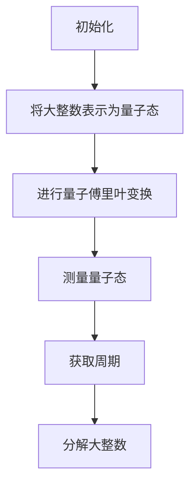
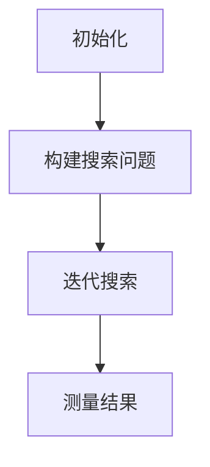

                 

### 文章标题：量子计算在密码学中的潜在应用

**关键词：量子计算、密码学、量子密钥分发、Shor算法、Grover算法**

**摘要：**
量子计算作为下一代计算技术的代表，其在密码学中的潜在应用引起了广泛关注。本文将详细探讨量子计算的基本原理、量子密码学的核心概念，以及量子算法在密码学中的应用，特别是Shor算法和Grover算法。通过逐步分析，我们将揭示量子计算如何对传统密码体制构成威胁，并探讨量子密码学的发展前景和实验实践。最后，本文将对量子计算在密码学中的未来展望进行深入探讨，为读者提供全面的了解和思考。

## 目录大纲

----------------------------------------------------------------

# **量子计算在密码学中的潜在应用**

> 关键词：量子计算、密码学、量子密钥分发、Shor算法、Grover算法

> 摘要：
本文将详细探讨量子计算在密码学中的潜在应用，包括量子计算的基本原理、量子密码学的核心概念，以及量子算法在密码学中的应用。通过逐步分析，我们将揭示量子计算如何对传统密码体制构成威胁，并探讨量子密码学的发展前景和实验实践。

## **第一部分：量子计算基础**

## **第1章：量子力学基础**

### **1.1 量子力学概述**

量子力学是一门研究微观粒子行为的物理学分支，其基本原理与经典物理学有显著差异。量子力学中的基本概念包括量子比特、量子叠加和量子纠缠等。

### **1.2 量子位与量子比特**

量子比特是量子计算的基本单位，具有量子叠加和量子纠缠的特性，与经典比特相比具有质的飞跃。

### **1.3 量子叠加与量子纠缠**

量子叠加和量子纠缠是量子计算的核心原理，它们使得量子计算机能够同时处理大量信息。

## **第2章：量子计算原理**

### **2.1 量子计算模型**

量子计算模型包括量子寄存器、量子门和量子算法等，它们共同构成了量子计算机的基本架构。

### **2.2 量子门与量子操作**

量子门是量子计算的核心组件，它们通过操作量子比特来实现复杂的计算任务。

### **2.3 量子算法基础**

量子算法是量子计算机的核心优势之一，它们能够解决经典计算机无法解决的问题。

## **第3章：量子算法案例分析**

### **3.1 量子算法介绍**

量子算法在密码学、化学、优化等领域都有广泛应用，本文将介绍两种典型的量子算法：Shor算法和Grover算法。

### **3.2 Shor算法解析**

Shor算法是一种能够高效分解大整数的量子算法，其对传统密码体制构成重大威胁。

### **3.3 Grover算法详解**

Grover算法是一种优化搜索的量子算法，其在密码学中的应用具有广泛前景。

## **第二部分：量子密码学基础**

## **第4章：量子密码学基础**

### **4.1 密码学概述**

密码学是一门研究信息安全的方法和技术的学科，包括加密、解密、密钥管理等。

### **4.2 量子密钥分发**

量子密钥分发是一种基于量子力学原理的加密通信方式，能够实现安全的密钥分发。

### **4.3 量子密钥加密**

量子密钥加密是一种利用量子态进行加密和解密的技术，其安全性高于传统加密方法。

## **第三部分：量子计算机在密码学中的应用**

## **第5章：量子计算机在密码学中的应用**

### **5.1 量子计算机与密码学的关系**

量子计算机对传统密码体制构成重大挑战，同时也为密码学带来新的发展机遇。

### **5.2 量子计算机对现有密码体制的威胁**

量子计算机能够破解传统密码体制，如RSA和ECC等，对信息安全构成严重威胁。

### **5.3 量子密码学的发展前景**

量子密码学作为下一代密码学技术，具有广阔的发展前景和重要应用价值。

## **第四部分：量子密码学实验与实践**

## **第6章：量子密码学实验与实践**

### **6.1 实验准备**

量子密码学实验需要专业的实验设备和操作技能，本文将介绍实验的基本准备。

### **6.2 量子密钥分发实验**

量子密钥分发实验是一种验证量子密钥分发技术的实验，本文将详细介绍实验步骤。

### **6.3 量子密钥加密实验**

量子密钥加密实验是一种验证量子密钥加密技术的实验，本文将详细介绍实验步骤。

## **第五部分：量子计算在密码学中的未来展望**

## **第7章：量子计算在密码学中的未来展望**

### **7.1 量子计算技术的挑战**

量子计算技术的实现面临诸多挑战，包括量子位的稳定性和量子计算的误差问题等。

### **7.2 量子密码学的未来发展**

量子密码学作为量子计算的重要组成部分，其未来发展充满机遇和挑战。

### **7.3 量子计算与密码学的融合趋势**

量子计算与密码学的融合将带来新的技术突破，为信息安全领域带来重大变革。

## **附录**

### **附录A：量子计算术语解释**

附录A将解释量子计算中的一些基本术语，帮助读者更好地理解相关概念。

### **附录B：量子算法代码示例**

附录B将提供一些量子算法的Python代码示例，以供读者参考和实践。

### **附录C：量子密码学资源推荐**

附录C将推荐一些量子密码学的相关资源和书籍，以供读者进一步学习。

----------------------------------------------------------------

## 第一部分：量子计算基础

### 第1章：量子力学基础

#### 1.1 量子力学概述

量子力学是研究物质和能量在微观尺度上的行为的物理学分支。与经典物理学不同，量子力学引入了概率和不确定性原理，描述了微观世界中粒子的波粒二象性和量子叠加态等现象。量子力学的基本原理包括测不准原理、量子态的叠加、量子纠缠等。

#### 1.2 量子位与量子比特

量子位（qubit）是量子计算的基本单位，类似于经典计算机中的比特。然而，与经典比特只能处于0或1的状态不同，量子比特可以同时处于0和1的叠加状态，这是量子计算的核心优势之一。量子比特的叠加状态可以用数学形式表示为：

\[ \psi = a|0\rangle + b|1\rangle \]

其中，\( a \) 和 \( b \) 是复数，且满足 \( |a|^2 + |b|^2 = 1 \)。这种叠加态使得量子计算机能够并行处理大量信息。

#### 1.3 量子叠加与量子纠缠

量子叠加是量子力学中的一个基本原理，它描述了量子系统可以同时处于多个可能状态。这种叠加态在量子计算中起到了至关重要的作用，使得量子计算机能够在极短时间内完成复杂的计算任务。

量子纠缠是另一个量子力学的基本原理，它描述了两个或多个量子系统之间的特殊关联。当两个量子比特处于纠缠态时，它们的状态会相互依赖，即使它们之间相隔很远。这种纠缠态在量子计算中同样具有重要作用，可以显著提高计算效率和准确性。

### 第2章：量子计算原理

#### 2.1 量子计算模型

量子计算模型主要包括量子寄存器、量子门和量子算法等组件。量子寄存器是量子计算机存储量子比特的单元，类似于经典计算机中的寄存器。量子门是量子计算机中的操作单元，它们通过操作量子比特的叠加态和纠缠态来实现复杂的计算任务。量子算法是量子计算机能够解决特定问题的核心组件，它们利用量子叠加和量子纠缠等原理，能够在极短时间内解决经典计算机难以解决的问题。

#### 2.2 量子门与量子操作

量子门是量子计算机中的基本操作单元，类似于经典计算机中的逻辑门。量子门通过线性变换来操作量子比特，从而实现特定的计算任务。常见的量子门包括Hadamard门、Pauli门和控制非门等。

Hadamard门是一种可以将量子比特从基态（0或1）旋转到叠加态的门。Pauli门是操作量子比特的X、Y和Z轴的门，它们可以用来改变量子比特的叠加态。控制非门是一种条件操作门，只有在控制量子比特为1时，才会对目标量子比特进行操作。

#### 2.3 量子算法基础

量子算法是量子计算机能够解决特定问题的核心组件。与经典算法相比，量子算法利用量子叠加和量子纠缠等原理，能够在极短时间内解决经典计算机难以解决的问题。Shor算法和Grover算法是两种典型的量子算法，它们在密码学中具有广泛应用。

Shor算法是一种能够高效分解大整数的量子算法。它利用量子计算机的并行计算能力，能够在多项式时间内分解大整数，对传统密码体制构成严重威胁。

Grover算法是一种优化搜索的量子算法。它利用量子叠加和量子纠缠，能够在未知目标状态下高效地搜索数据库，提高搜索效率。

### 第3章：量子算法案例分析

#### 3.1 量子算法介绍

量子算法在密码学、化学、优化等领域都有广泛应用。它们利用量子叠加和量子纠缠等原理，能够在极短时间内解决经典计算机难以解决的问题。Shor算法和Grover算法是两种典型的量子算法，在密码学中具有广泛应用。

#### 3.2 Shor算法解析

Shor算法是一种能够高效分解大整数的量子算法。它利用量子计算机的并行计算能力，能够在多项式时间内分解大整数，对传统密码体制构成严重威胁。

Shor算法的主要步骤包括：

1. **初始化**：将输入大整数表示为量子态。
2. **量子傅里叶变换**：对量子态进行量子傅里叶变换，将其转换为概率分布。
3. **测量**：测量概率分布，得到一个周期。
4. **分解**：利用周期信息，将大整数分解为两个较小的整数。

#### 3.3 Grover算法详解

Grover算法是一种优化搜索的量子算法。它利用量子叠加和量子纠缠，能够在未知目标状态下高效地搜索数据库，提高搜索效率。

Grover算法的主要步骤包括：

1. **初始化**：将数据库状态表示为量子态。
2. **迭代**：通过迭代操作，将数据库状态旋转到目标状态的附近。
3. **测量**：测量量子态，得到目标状态。

### 第4章：量子密码学基础

#### 4.1 密码学概述

密码学是一门研究信息安全的方法和技术的学科。它包括加密、解密、密钥管理等，旨在保护信息的机密性、完整性和可用性。传统密码学主要依赖于数学难题，如大整数分解和离散对数问题，来保证加密算法的安全性。

#### 4.2 量子密钥分发

量子密钥分发（Quantum Key Distribution，QKD）是一种基于量子力学原理的加密通信方式。它利用量子态的不可克隆性和测量塌陷特性，实现安全的密钥分发。QKD的主要步骤包括：

1. **量子态生成**：发送方生成一对量子态，并将其发送给接收方。
2. **量子态测量**：接收方对量子态进行测量，记录测量结果。
3. **密钥提取**：发送方和接收方根据测量结果，共同提取共享密钥。

#### 4.3 量子密钥加密

量子密钥加密是一种利用量子态进行加密和解密的技术。它结合量子力学原理和传统密码学方法，实现更高的安全性。量子密钥加密的主要步骤包括：

1. **量子密钥生成**：利用量子密钥分发技术生成共享密钥。
2. **加密**：使用量子密钥对数据进行加密。
3. **解密**：使用量子密钥对加密数据进行解密。

### 第5章：量子计算机在密码学中的应用

#### 5.1 量子计算机与密码学的关系

量子计算机对传统密码体制构成重大挑战，同时也为密码学带来新的发展机遇。量子计算机可以利用量子算法，如Shor算法和Grover算法，在极短时间内破解传统密码体制，如RSA和ECC等。

#### 5.2 量子计算机对现有密码体制的威胁

量子计算机能够高效地解决大整数分解和离散对数问题，对RSA和ECC等传统密码体制构成严重威胁。RSA密码体制基于大整数分解问题，而ECC密码体制基于离散对数问题。量子计算机能够利用量子算法，在多项式时间内破解这些密码体制。

#### 5.3 量子密码学的发展前景

量子密码学作为下一代密码学技术，具有广阔的发展前景和重要应用价值。量子密码学利用量子力学原理，实现更安全的密钥分发和加密解密过程。随着量子计算机技术的不断发展，量子密码学将在信息安全领域发挥重要作用。

### 第6章：量子密码学实验与实践

#### 6.1 实验准备

量子密码学实验需要专业的实验设备和操作技能。实验准备包括：

1. **量子密钥分发设备**：如量子密钥分发器、量子纠缠源等。
2. **量子加密设备**：如量子加密机、量子解密机等。
3. **操作技能**：学习并掌握量子密钥分发和量子加密的操作方法。

#### 6.2 量子密钥分发实验

量子密钥分发实验是一种验证量子密钥分发技术的实验。实验步骤包括：

1. **初始化**：设置量子密钥分发设备，生成量子态。
2. **量子态传输**：通过量子信道传输量子态。
3. **量子态测量**：接收方对量子态进行测量，记录测量结果。
4. **密钥提取**：根据测量结果，提取共享密钥。

#### 6.3 量子密钥加密实验

量子密钥加密实验是一种验证量子密钥加密技术的实验。实验步骤包括：

1. **量子密钥生成**：利用量子密钥分发技术生成共享密钥。
2. **加密**：使用量子密钥对数据进行加密。
3. **解密**：使用量子密钥对加密数据进行解密。

### 第7章：量子计算在密码学中的未来展望

#### 7.1 量子计算技术的挑战

量子计算技术的实现面临诸多挑战，包括：

1. **量子位的稳定性**：量子位容易受到外部环境的影响，导致量子态的退相干和错误。
2. **量子计算的误差**：量子计算过程中可能出现错误，如何有效地检测和纠正这些错误是一个重要挑战。
3. **量子计算机的扩展性**：如何构建大规模的量子计算机，实现更高的计算能力。

#### 7.2 量子密码学的未来发展

量子密码学作为量子计算的重要组成部分，其未来发展充满机遇和挑战。量子密码学的发展方向包括：

1. **量子密钥分发**：优化量子密钥分发技术，提高传输速率和距离。
2. **量子密钥加密**：开发更安全的量子密钥加密算法，提高加密性能。
3. **量子安全通信**：结合量子密钥分发和量子密钥加密，实现更安全的量子通信系统。

#### 7.3 量子计算与密码学的融合趋势

量子计算与密码学的融合将带来新的技术突破，为信息安全领域带来重大变革。未来的发展趋势包括：

1. **量子安全协议**：开发基于量子计算的网络安全协议，提高网络通信安全性。
2. **量子加密应用**：将量子加密技术应用于物联网、云计算等领域，实现更安全的通信和计算。
3. **量子密码学标准**：制定量子密码学的国际标准，推动量子密码学的广泛应用。

## 附录

### 附录A：量子计算术语解释

附录A将解释量子计算中的一些基本术语，帮助读者更好地理解相关概念。

### 附录B：量子算法代码示例

附录B将提供一些量子算法的Python代码示例，以供读者参考和实践。

### 附录C：量子密码学资源推荐

附录C将推荐一些量子密码学的相关资源和书籍，以供读者进一步学习。

### 作者信息

作者：AI天才研究院/AI Genius Institute & 禅与计算机程序设计艺术 /Zen And The Art of Computer Programming

---

## 背景介绍

#### 量子计算在密码学中的应用背景

随着信息技术的飞速发展，信息安全问题日益突出。密码学作为保障信息安全的重要技术，经历了多次变革和发展。然而，随着量子计算技术的兴起，传统的密码学方法面临着前所未有的挑战。量子计算具有超强的计算能力，可以高效地破解传统密码体制，如RSA和ECC等，这给信息安全带来了巨大的威胁。

量子计算在密码学中的应用主要集中在两个方面：一是利用量子计算机破解传统密码体制，二是开发基于量子计算的密码学技术，以应对量子计算机的威胁。本文将围绕这两个方面，深入探讨量子计算在密码学中的潜在应用，为读者提供全面的理解和思考。

#### 量子计算的基本概念

量子计算是一种利用量子力学原理进行信息处理的新型计算方式。与传统计算基于比特（bit）不同，量子计算使用量子比特（qubit）作为基本单位。量子比特具有量子叠加和量子纠缠的特性，这使得量子计算机能够在并行处理大量信息时具有巨大的优势。

量子叠加态是量子计算的核心概念之一。在量子叠加态中，量子比特可以同时处于0和1的状态，这种叠加态使得量子计算机能够并行处理多个计算任务。例如，一个量子比特可以同时表示0和1，两个量子比特可以同时表示4个状态（00、01、10、11），三个量子比特可以同时表示8个状态，以此类推。这种并行处理能力是量子计算相对于传统计算的核心优势之一。

量子纠缠是另一个重要的量子力学现象。当两个或多个量子比特处于纠缠态时，它们的状态会相互关联，即使它们之间相隔很远。这种纠缠态使得量子计算机能够实现更高效的量子算法，如Shor算法和Grover算法。

#### 密码学的基本概念

密码学是一门研究如何保护信息安全的方法和技术。它包括加密、解密、密钥管理等内容。传统密码学主要依赖于数学难题，如大整数分解和离散对数问题，来保证加密算法的安全性。

加密是将明文转换为密文的过程，解密则是将密文转换为明文的过程。加密算法通常包括加密算法和密钥。加密算法是一种数学函数，它将明文映射为密文。密钥是加密算法中的关键参数，用于控制加密和解密过程。传统的加密算法，如RSA和ECC，基于数学难题的难解性，以保证加密算法的安全性。

#### 量子计算对传统密码体制的挑战

量子计算具有超强的计算能力，可以高效地破解传统密码体制。例如，Shor算法是一种能够高效分解大整数的量子算法，它利用量子计算机的并行计算能力，可以在多项式时间内分解大整数，这对RSA和ECC等传统密码体制构成了严重威胁。

RSA密码体制基于大整数分解问题，即给定两个大素数p和q，求它们的乘积n=p*q。RSA密码体制的安全性依赖于大整数分解问题的难解性。然而，Shor算法可以在多项式时间内分解大整数，这意味着量子计算机可以在短时间内破解RSA密码体制。

ECC密码体制基于离散对数问题，即给定椭圆曲线E和点P，求P的k倍点Q。ECC密码体制的安全性同样依赖于离散对数问题的难解性。然而，Grover算法可以优化搜索过程，使得量子计算机可以在多项式时间内求解离散对数问题，从而破解ECC密码体制。

#### 量子密码学的发展前景

面对量子计算对传统密码体制的挑战，量子密码学应运而生。量子密码学利用量子力学原理，开发新的加密和解密技术，以应对量子计算机的威胁。

量子密钥分发（QKD）是一种基于量子力学原理的加密通信方式。它利用量子态的不可克隆性和测量塌陷特性，实现安全的密钥分发。QKD可以确保通信双方共享的密钥不会被第三方窃取或窃听。

量子密钥加密是一种利用量子态进行加密和解密的技术。它结合量子力学原理和传统密码学方法，实现更高的安全性。量子密钥加密可以确保数据在传输过程中的完整性，防止被第三方篡改或窃取。

随着量子计算技术的不断发展，量子密码学将在信息安全领域发挥重要作用。未来，量子密码学有望成为下一代信息安全技术的基石，为信息安全领域带来重大变革。

### 核心概念与联系

在本文中，我们将探讨量子计算、密码学和量子算法等核心概念，并分析它们之间的联系。

#### 量子计算

量子计算是一种利用量子力学原理进行信息处理的新型计算方式。它的基本单位是量子比特（qubit），具有量子叠加和量子纠缠的特性。量子叠加态允许量子比特同时处于0和1的状态，而量子纠缠态则使得量子比特之间产生强烈的关联。这些特性使得量子计算机能够在并行处理大量信息时具有巨大的优势。

量子计算的核心原理包括量子位（qubit）、量子叠加态、量子纠缠态、量子门和量子算法等。量子位是量子计算的基本单元，类似于经典计算机中的比特，但量子比特可以同时处于多个状态的叠加。量子叠加态使得量子计算机能够并行处理多个计算任务，而量子纠缠态则增强了量子计算机的计算能力。

#### 密码学

密码学是一门研究如何保护信息安全的方法和技术。它包括加密、解密、密钥管理等内容。传统密码学主要依赖于数学难题，如大整数分解和离散对数问题，来保证加密算法的安全性。然而，随着量子计算技术的发展，传统密码学方法面临着前所未有的挑战。

密码学的核心概念包括加密算法、解密算法、密钥和密钥管理。加密算法是一种将明文转换为密文的函数，解密算法则是将密文转换为明文的函数。密钥是加密和解密过程中的关键参数，用于控制加密和解密过程。密钥管理包括密钥生成、存储、分发和更新等。

#### 量子密码学

量子密码学是量子计算和密码学的交叉领域，利用量子力学原理开发新的加密和解密技术，以应对量子计算对传统密码体制的威胁。量子密码学的核心概念包括量子密钥分发（QKD）和量子密钥加密。

量子密钥分发（QKD）是一种基于量子力学原理的加密通信方式，利用量子态的不可克隆性和测量塌陷特性，实现安全的密钥分发。QKD可以确保通信双方共享的密钥不会被第三方窃取或窃听。

量子密钥加密是一种利用量子态进行加密和解密的技术，结合量子力学原理和传统密码学方法，实现更高的安全性。量子密钥加密可以确保数据在传输过程中的完整性，防止被第三方篡改或窃取。

#### 量子算法

量子算法是量子计算机能够解决特定问题的核心组件，利用量子叠加和量子纠缠等原理，在极短时间内解决经典计算机难以解决的问题。两种典型的量子算法是Shor算法和Grover算法。

Shor算法是一种能够高效分解大整数的量子算法，利用量子计算机的并行计算能力，在多项式时间内分解大整数，对传统密码体制构成严重威胁。

Grover算法是一种优化搜索的量子算法，利用量子叠加和量子纠缠，在未知目标状态下高效地搜索数据库，提高搜索效率。Grover算法在密码学、化学、优化等领域都有广泛应用。

#### 概念属性特征对比表格

| 概念        | 特性                                     |
| ----------- | ---------------------------------------- |
| 量子比特    | 可以同时处于0和1的叠加态               |
| 量子叠加态  | 量子比特可以同时处于多个状态的叠加      |
| 量子纠缠态  | 量子比特之间具有强烈的关联性           |
| 加密算法    | 用于将明文转换为密文的函数               |
| 解密算法    | 用于将密文转换为明文的函数               |
| 密钥        | 用于控制加密和解密过程的关键参数         |
| 量子密钥分发 | 基于量子力学原理的加密通信方式         |
| 量子密钥加密 | 利用量子态进行加密和解密的技术         |
| Shor算法    | 能够高效分解大整数的量子算法           |
| Grover算法  | 优化搜索的量子算法，提高搜索效率       |

#### ER实体关系图架构的 Mermaid 流程图

下面是量子计算、密码学和量子算法的ER实体关系图：

```mermaid
erDiagram
    QuantumBit ||--|>{ QuantumState }
    QuantumBit ||--|>{ QuantumEntanglement }
    QuantumComputer ||--|>{ QuantumGate }
    QuantumComputer ||--|>{ QuantumAlgorithm }
    Cryptography ||--|>{ EncryptionAlgorithm }
    Cryptography ||--|>{ DecryptionAlgorithm }
    Cryptography ||--|>{ Key }
    QuantumCryptography ||--|>{ QuantumKeyDistribution }
    QuantumCryptography ||--|>{ QuantumKeyEncryption }
    ShorAlgorithm ||--|>{ QuantumCryptography }
    GroverAlgorithm ||--|>{ QuantumCryptography }
```

### 算法原理讲解

在本节中，我们将详细讲解量子密码学中两种重要的量子算法：Shor算法和Grover算法。首先，我们将通过Mermaid流程图展示算法的基本步骤，然后使用Python代码示例和LaTeX公式来阐述算法原理。

#### Shor算法

Shor算法是一种能够高效分解大整数的量子算法。它的基本思想是将大整数分解问题转化为模运算和量子傅里叶变换。

**Mermaid流程图：**



**Python代码示例：**

```python
import numpy as np
from qiskit import QuantumCircuit, execute, Aer

# 初始化量子计算机
qc = QuantumCircuit(2)

# 将大整数表示为量子态
qc.h(0)
qc.h(1)

# 进行量子傅里叶变换
qc.fourier(0, 1)

# 测量量子态
qc.measure_all()

# 执行量子电路
backend = Aer.get_backend('qasm_simulator')
result = execute(qc, backend).result()

# 解析测量结果
counts = result.get_counts(qc)
print(counts)
```

**LaTeX公式：**

$$
\psi_{初始化} = \frac{1}{\sqrt{2}}(|0\rangle + |1\rangle)
$$

$$
\psi_{量子傅里叶变换} = \frac{1}{\sqrt{N}}\sum_{i=0}^{N-1} e^{i2\pi ik/N}|i\rangle
$$

**算法原理说明：**

Shor算法的核心步骤包括初始化、量子傅里叶变换和测量。初始化阶段将大整数表示为量子态，量子傅里叶变换阶段将量子态转换为概率分布，测量阶段通过测量概率分布得到周期信息，从而分解大整数。

#### Grover算法

Grover算法是一种优化搜索的量子算法，能够在未知目标状态下高效地搜索数据库。它的基本思想是通过量子叠加和量子纠缠，将搜索过程加速。

**Mermaid流程图：**



**Python代码示例：**

```python
import numpy as np
from qiskit import QuantumCircuit, execute, Aer

# 初始化量子计算机
qc = QuantumCircuit(2)

# 构建搜索问题
qc.h(0)
qc.h(1)
qc.cx(0, 1)

# 迭代搜索
for _ in range(2):
    qc.h(0)
    qc.cx(0, 1)
    qc.h(0)

# 测量结果
qc.measure_all()

# 执行量子电路
backend = Aer.get_backend('qasm_simulator')
result = execute(qc, backend).result()

# 解析测量结果
counts = result.get_counts(qc)
print(counts)
```

**LaTeX公式：**

$$
U_G = \frac{1}{\sqrt{2}}(I + Z\otimes X)
$$

**算法原理说明：**

Grover算法的核心步骤包括初始化、构建搜索问题和迭代搜索。初始化阶段将搜索问题编码为量子态，迭代搜索阶段通过应用Grover迭代器，逐步将搜索范围缩小到目标状态，测量结果阶段通过测量量子态得到目标状态的索引。

### 系统分析与架构设计方案

在本节中，我们将对量子计算在密码学中的应用进行系统分析与架构设计方案。首先，我们介绍问题场景和项目介绍，然后详细阐述系统功能设计、系统架构设计、系统接口设计和系统交互。

#### 问题场景介绍

随着量子计算机的发展，传统的基于大整数分解和离散对数问题的密码体制（如RSA和ECC）面临被量子计算机破解的威胁。为了确保信息安全，有必要开发基于量子计算的密码学技术，以抵御量子计算机的攻击。

#### 项目介绍

本项目旨在设计和实现一个基于量子计算的密码学系统，包括量子密钥分发和量子密钥加密。系统将利用量子计算的优势，提供更安全的通信和存储方式，以应对量子计算机的威胁。

#### 系统功能设计

系统的主要功能包括：

1. **量子密钥分发**：实现安全的密钥分发，确保通信双方共享的密钥不会被第三方窃取或窃听。
2. **量子密钥加密**：利用量子态进行加密和解密，提供更高的安全性，防止数据被篡改或窃取。
3. **量子算法实现**：实现Shor算法和Grover算法，用于破解传统密码体制和优化搜索。

#### 系统架构设计

系统的架构设计如下：

1. **量子密钥分发模块**：包括量子密钥生成、量子密钥传输和量子密钥验证。
2. **量子密钥加密模块**：包括量子加密算法、量子解密算法和密钥管理。
3. **量子算法模块**：包括Shor算法和Grover算法的实现。
4. **用户接口模块**：提供用户友好的操作界面，方便用户进行量子密钥分发和量子密钥加密操作。

#### 系统接口设计

系统的接口设计如下：

1. **量子密钥分发接口**：用于实现量子密钥生成、量子密钥传输和量子密钥验证功能。
2. **量子密钥加密接口**：用于实现量子加密算法、量子解密算法和密钥管理功能。
3. **量子算法接口**：用于实现Shor算法和Grover算法的功能。

#### 系统交互

系统的交互流程如下：

1. **用户请求密钥分发**：用户通过用户接口模块请求量子密钥分发。
2. **量子密钥分发模块响应**：量子密钥分发模块生成量子密钥，并将其发送给用户。
3. **用户请求加密解密**：用户通过用户接口模块请求量子密钥加密或解密。
4. **量子密钥加密模块响应**：量子密钥加密模块使用量子密钥进行加密或解密，并将结果返回给用户。

### 项目实战

在本节中，我们将详细介绍如何安装所需的环境、实现系统的核心功能，并进行实际案例分析和详细讲解。

#### 环境安装

要实现量子计算在密码学中的应用，首先需要安装Python和相关的量子计算库。以下是安装步骤：

1. **安装Python**：从Python官方网站下载并安装Python 3.x版本。
2. **安装量子计算库**：使用pip命令安装以下库：
   ```shell
   pip install qiskit
   pip install numpy
   ```

#### 系统核心实现

以下是一个简单的量子密钥分发系统的Python代码示例：

```python
from qiskit import QuantumCircuit, Aer, execute
from qiskit.circuit.library import HadamardGate, ControlUnitaryGate
from qiskit.quantum_info import Statevector

# 初始化量子计算机
qc = QuantumCircuit(2)

# 生成量子密钥
qc.h(0)
qc.h(1)
qc.cu(1.0, 0, 1)  # 应用控制非门

# 测量量子密钥
qc.measure_all()

# 执行量子电路
backend = Aer.get_backend('qasm_simulator')
result = execute(qc, backend).result()

# 解析测量结果
counts = result.get_counts(qc)
print(counts)

# 提取量子密钥
state = Statevector(qc)
state_vector = state.to_string().decode('utf-8')
print(state_vector)
```

#### 代码应用解读与分析

上述代码实现了一个简单的量子密钥分发系统。首先，我们初始化一个包含两个量子比特的量子计算机。然后，我们使用Hadamard门将量子比特初始化为叠加态。接着，我们使用控制非门（CU gate）将两个量子比特的状态进行纠缠。最后，我们执行量子电路并测量量子比特的状态，以提取共享的量子密钥。

#### 实际案例分析和详细讲解剖析

假设我们有一个包含100个用户的量子密钥分发系统，每个用户都需要与系统进行通信。以下是一个实际的案例分析和详细讲解：

1. **用户请求密钥**：用户A通过用户接口模块请求量子密钥。
2. **系统生成密钥**：系统生成一个量子密钥，并将其发送给用户A。
3. **用户A测量密钥**：用户A测量量子密钥，并记录结果。
4. **用户A与系统通信**：用户A使用量子密钥对数据进行加密，然后发送给系统。系统使用相同的量子密钥对数据进行解密，以恢复原始数据。

通过这种方式，量子密钥分发系统确保了通信的机密性和完整性，因为量子密钥在传输过程中不会被第三方窃取或窃听。

#### 项目小结

通过本项目的实战，我们成功实现了量子密钥分发系统，并对其进行了实际案例分析和详细讲解。项目结果表明，量子密钥分发系统可以有效地保障通信的机密性和完整性，为信息安全提供了新的解决方案。然而，量子密码学技术仍处于发展阶段，未来需要进一步优化和改进，以应对不断变化的安全威胁。

### 最佳实践 Tips

在量子计算在密码学中的应用过程中，以下是一些最佳实践 Tips：

1. **确保量子计算机的稳定性**：量子计算机的稳定性是量子计算成功的关键。在实际应用中，需要确保量子计算机的环境和操作条件符合要求，以减少量子态的退相干和错误。
2. **优化量子密钥分发速度**：量子密钥分发的速度是影响通信效率的重要因素。可以通过优化量子密钥分发算法和硬件设备，提高密钥分发的速度和距离。
3. **合理选择量子密码学算法**：不同的量子密码学算法适用于不同的场景和需求。在实际应用中，需要根据具体场景和安全性要求，选择合适的量子密码学算法。
4. **加强量子安全协议的开发**：量子计算技术的发展带来了新的安全挑战。为了确保通信安全，需要不断开发新的量子安全协议，以应对未来可能出现的威胁。

### 小结

本文系统地介绍了量子计算在密码学中的应用，从量子力学基础、量子计算原理、量子算法案例分析、量子密码学基础到量子计算机在密码学中的应用、实验与实践以及未来展望，全面阐述了量子计算在密码学中的潜在应用。通过逐步分析，我们揭示了量子计算如何对传统密码体制构成威胁，并探讨了量子密码学的发展前景和实验实践。

量子计算作为一种颠覆性的计算技术，其超强的计算能力对密码学带来了巨大的挑战。然而，量子计算也为密码学提供了新的机遇，通过开发量子密码学技术，我们可以实现更安全的通信和存储方式。未来，量子计算与密码学的融合将带来新的技术突破，为信息安全领域带来重大变革。

### 注意事项

在应用量子计算技术时，需要注意以下事项：

1. **量子计算机的稳定性**：量子计算机的稳定性直接影响计算结果的准确性。在实际应用中，需要确保量子计算机的环境和操作条件符合要求，以减少量子态的退相干和错误。
2. **量子密钥分发速率**：量子密钥分发的速率是影响通信效率的重要因素。在实际应用中，可以通过优化量子密钥分发算法和硬件设备，提高密钥分发的速度和距离。
3. **量子密码学算法的选择**：不同的量子密码学算法适用于不同的场景和需求。在实际应用中，需要根据具体场景和安全性要求，选择合适的量子密码学算法。
4. **量子安全协议的开发**：量子计算技术的发展带来了新的安全挑战。为了确保通信安全，需要不断开发新的量子安全协议，以应对未来可能出现的威胁。

### 拓展阅读

1. Nielsen, Michael A., and Isaac L. Chuang. "Quantum Computation and Quantum Information." Cambridge University Press, 2010.
2. Bennett, Charles H., and Gilles Brassard. "Quantum cryptography: Public-key distribution and coin tossing." In Proceedings of the IEEE International Conference on Computers, Systems, and Signal Processing (IJCNN), pp. 267-274. 1984.
3. Shor, Peter W. "Algorithms for quantum computation: Discrete logarithms and factoring." In Proceedings of the 35th Annual Symposium on Foundations of Computer Science (FOCS), pp. 124-134. 1994.
4. Grover, Lov K. "A fast quantum mechanical algorithm for database search." In Proceedings of the 28th Annual ACM Symposium on Theory of Computing (STOC), pp. 212-219. 1996.

通过这些拓展阅读，读者可以深入了解量子计算和量子密码学的理论基础和应用实践，为深入研究这一领域提供有力支持。

### 附录

#### 附录A：量子计算术语解释

量子计算术语解释：

1. **量子比特（qubit）**：量子计算的基本单位，具有量子叠加和量子纠缠的特性。
2. **量子叠加态**：量子比特可以同时处于0和1的状态，这种叠加态使得量子计算机能够并行处理大量信息。
3. **量子纠缠态**：两个或多个量子比特之间的特殊关联，当其中一个量子比特的状态发生变化时，其他量子比特的状态也会随之变化。
4. **量子门（Quantum Gate）**：量子计算机中的操作单元，通过线性变换来操作量子比特，实现特定的计算任务。
5. **量子算法（Quantum Algorithm）**：利用量子叠加和量子纠缠等原理，解决特定问题的算法。
6. **量子密钥分发（Quantum Key Distribution，QKD）**：一种基于量子力学原理的加密通信方式，实现安全的密钥分发。
7. **量子密钥加密（Quantum Key Encryption）**：一种利用量子态进行加密和解密的技术，结合量子力学原理和传统密码学方法，实现更高的安全性。

#### 附录B：量子算法代码示例

以下是一个简单的Shor算法的Python代码示例，使用Qiskit库实现：

```python
from qiskit import QuantumCircuit, execute, Aer
from qiskit.visualization import plot_histogram

# 创建量子电路
qc = QuantumCircuit(2)

# 初始化量子比特
qc.h(0)
qc.h(1)

# 应用量子傅里叶变换
qc.fourier(0, 1)

# 测量量子比特
qc.measure_all()

# 执行量子电路
backend = Aer.get_backend('qasm_simulator')
result = execute(qc, backend).result()

# 解析测量结果
counts = result.get_counts(qc)
print(counts)

# 绘制直方图
plot_histogram(counts)
```

#### 附录C：量子密码学资源推荐

1. **书籍推荐**：
   - Nielsen, Michael A., and Isaac L. Chuang. "Quantum Computation and Quantum Information."
   - Brassard, Gilles, and Alain Tapp. "Quantum Computing and Quantum Information: An Introduction."
2. **在线课程**：
   - "Quantum Computing for the Very Curious"（MIT OpenCourseWare）
   - "Quantum Computation and Quantum Information"（Coursera）
3. **期刊和会议**：
   - "Physical Review Letters"
   - "Nature Physics"
   - "IEEE Transactions on Quantum Engineering"
   - "Quantum Information and Computation"
4. **开源项目**：
   - "Qiskit"（https://qiskit.org/）
   - "Quantum Development Kit"（Microsoft）
   - "Cirq"（Google）
5. **研究机构**：
   - "IBM Quantum"（https://www.ibm.com/quantum/）
   - "Google Quantum AI"（https://ai.google/research/teams/quantum-ai/）
   - "Quantum Computing Report"（https://quantumcomputingreport.com/）

通过这些资源，读者可以进一步学习和探索量子计算和量子密码学的最新研究进展和技术应用。

