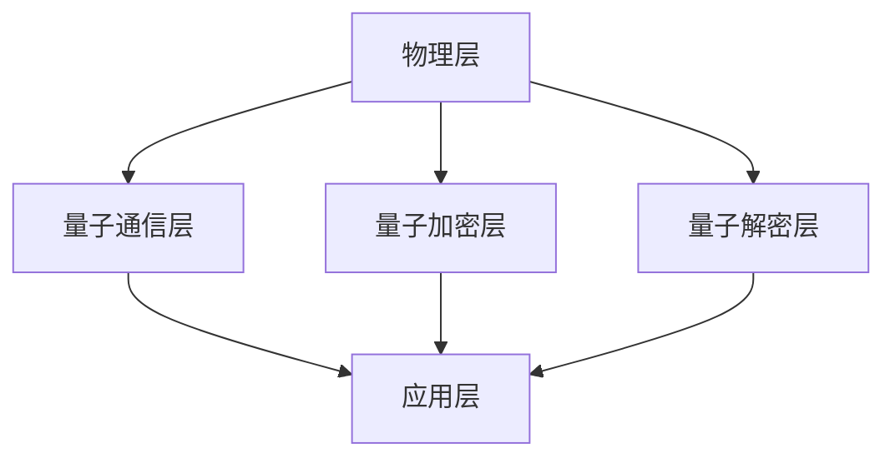
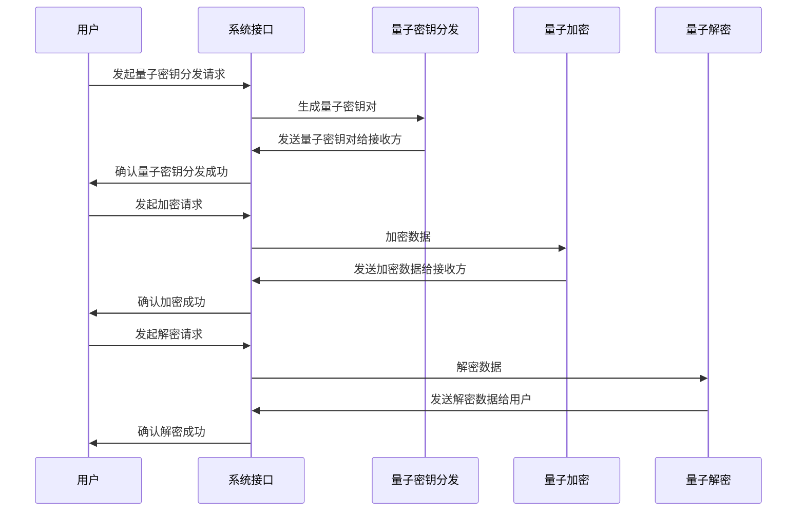

                 


### 文章标题：量子计算在密码破解中的应用：评估现有加密系统安全性

### 文章关键词：
- 量子计算
- 密码破解
- 加密系统
- 安全性评估
- Shor算法
- 椭圆曲线加密

### 文章摘要：
本文旨在探讨量子计算在密码破解领域的应用，评估现有加密系统的安全性。我们将从量子计算的基本概念出发，分析其与经典计算的区别，以及其对传统加密算法的潜在威胁。接着，我们将介绍量子密码学，特别是量子密钥分发（QKD）和量子安全加密算法，并探讨如何评估现有加密系统的安全性。最后，我们将展望未来加密技术的发展趋势，提出针对量子计算威胁的应对策略。

## 第一部分：量子计算与密码学基础

### 第1章：量子计算概述

#### 1.1 量子计算的基本概念

量子计算是基于量子力学原理的新型计算模式，其核心概念包括量子比特（qubit）、量子叠加原理和量子纠缠。量子比特是量子计算的基本单位，它可以同时处于0和1的状态，这是与经典比特的主要区别。量子叠加原理表明，一个量子系统可以同时处于多个状态的叠加，而量子纠缠则意味着两个或多个量子系统之间的状态是相互关联的。

#### 1.2 量子计算的数学基础

量子计算的数学基础主要包括波函数和量子态。波函数是描述量子系统状态的数学函数，它包含了系统所有可能状态的叠加信息。量子态则是量子系统的一种离散状态，通常用数学向量表示。为了确保量子计算的准确性，量子纠错码被引入，以纠正由于环境噪声和测量误差导致的错误。

### 第2章：密码学的基本原理

#### 2.1 密码学概述

密码学是研究如何通过加密和解密技术保护信息安全的学科。它主要分为对称加密和非对称加密两大类。对称加密使用相同的密钥进行加密和解密，而非对称加密则使用一对密钥，一个用于加密，另一个用于解密。公开密钥基础设施（PKI）是一种支持非对称加密的框架，它确保了密钥的分发和管理。

#### 2.2 加密算法的工作原理

分组密码算法和非对称加密算法是密码学中的两种主要加密算法。分组密码算法将明文分成固定长度的分组，然后使用密钥对每个分组进行加密。非对称加密算法则使用一个密钥对进行加密，另一个密钥对进行解密，这使得密钥管理更加安全。

## 第二部分：量子计算在密码破解中的应用

### 第3章：量子计算机对传统加密算法的威胁

#### 3.1 量子计算机与Shor算法

Shor算法是量子计算领域的里程碑之一，它展示了量子计算机在解决某些数学问题上的巨大优势。Shor算法能够高效地分解大质数，这对于RSA加密算法构成了严重威胁。RSA加密算法的安全性依赖于大质数的分解问题，而Shor算法可以在多项式时间内解决这一难题。

#### 3.2 量子计算机与椭圆曲线加密

椭圆曲线加密（ECC）是一种高效的非对称加密算法，其安全性依赖于椭圆曲线离散对数问题。尽管椭圆曲线加密被认为比RSA加密更安全，但量子计算机同样能够攻击ECC加密。量子计算机对ECC加密的威胁表明，现有的非对称加密算法可能都需要重新设计。

### 第4章：量子密码学与量子安全通信

#### 4.1 量子密钥分发（QKD）

量子密钥分发（QKD）是一种利用量子力学原理进行密钥分发的技术。QKD确保了密钥的安全传输，因为任何尝试窃取密钥的行为都会导致量子态的破坏，从而被通信双方检测到。QKD提供了一种抗量子计算机攻击的安全通信方式。

#### 4.2 量子安全加密算法

量子安全加密算法是一种利用量子力学原理设计的加密算法，它能够抵抗量子计算机的攻击。量子哈希函数和量子签名方案是两种典型的量子安全加密算法，它们在确保数据完整性和身份验证方面发挥了重要作用。

### 第5章：评估现有加密系统的安全性

#### 5.1 加密算法的安全性评估方法

评估加密算法的安全性主要包括理论安全性和实际安全性两个方面。理论安全性通过数学证明来保证加密算法的不可破译性，而实际安全性则需要通过实际攻击和测试来验证。抗量子计算机的加密算法是评估现有加密系统安全性的关键。

#### 5.2 当前加密系统的安全评估

对RSA加密和ECC加密的安全评估是本章的重点。虽然量子计算机的出现使得传统加密算法面临威胁，但现有的加密算法仍在实际应用中发挥着重要作用。通过评估这些加密算法的安全性，我们可以更好地了解如何应对量子计算带来的挑战。

## 第三部分：未来的展望

### 第6章：量子计算的发展趋势

#### 6.1 量子计算机的未来前景

量子计算机的发展趋势受到技术挑战和进展的影响。随着量子比特数量的增加和量子纠错技术的进步，量子计算机有望在多个领域取得突破。量子计算的实际应用领域包括量子模拟、优化问题和密码破解等。

#### 6.2 未来加密算法的设计方向

未来加密算法的设计方向将聚焦于抗量子计算机的加密技术。为了应对量子计算的威胁，加密算法需要重新设计，以确保数据的安全性。可扩展的加密方案和量子安全加密算法是未来加密技术的重要发展方向。

### 第7章：加密技术的未来发展方向

#### 7.1 未来加密算法的设计方向

未来加密算法的设计将着重于抗量子计算机的加密技术。量子安全加密算法和可扩展的加密方案将是加密技术的重要发展方向。此外，加密算法的兼容性和互操作性也将成为研究重点。

#### 7.2 政策与标准的制定

量子计算对加密行业带来了新的挑战，同时也为加密技术的发展提供了机遇。制定相应的政策和标准，确保加密技术的安全性和可靠性，是未来加密技术发展的重要方向。

作者：AI天才研究院/AI Genius Institute & 禅与计算机程序设计艺术 /Zen And The Art of Computer Programming

[End of Outline] 

### 深入解析量子计算与密码学的交集

量子计算与密码学的交集是当今信息科学中的一个前沿领域，它不仅涉及深奥的理论，还关乎实际的安全威胁与防护。在深入探讨这一领域之前，我们需要先了解量子计算与经典计算的根本差异，以及这些差异如何影响密码学。

#### 量子计算与经典计算的区别

量子计算机的核心是量子比特（qubit），与经典计算机中的比特不同，量子比特能够同时存在于多个状态，这种现象称为量子叠加。此外，量子比特之间的纠缠也使得量子计算机能够执行远超经典计算机的计算任务。例如，Shor算法利用量子计算机的叠加和纠缠特性，在多项式时间内分解大质数，这是一个经典计算机需要指数级时间才能解决的问题。

#### 量子计算的数学基础

量子计算依赖于一系列复杂的数学概念，包括波函数、量子态和量子门。波函数是描述量子系统状态的数学函数，它可以表示一个量子系统在空间中的所有可能状态。量子态则是量子系统的一种离散状态，通常用数学向量表示。量子门是量子计算的基本操作单元，它们通过作用于量子态来改变系统的状态。

量子纠错码是确保量子计算准确性的关键。由于量子系统极易受到环境噪声和测量误差的影响，量子纠错码被引入以纠正这些错误。这些纠错码通过冗余编码和纠错算法，将量子信息分布在多个量子比特上，从而提高了计算的可靠性。

#### 密码学的挑战与机遇

密码学是研究如何通过加密和解密技术保护信息安全的学科。在经典计算时代，密码学依赖于复杂的数学问题，如大质数分解和离散对数问题，以确保加密算法的安全性。然而，量子计算机的出现对传统加密算法构成了巨大挑战。

Shor算法是量子计算领域的一个关键突破。Shor算法能够快速分解大质数，这直接威胁到RSA加密算法的安全性。RSA加密算法是当今互联网安全的基础，其安全性依赖于大质数的分解问题。量子计算机的崛起意味着，如果RSA加密算法不被改进，大量依赖RSA加密的互联网服务将面临被破解的风险。

另一方面，量子计算也为密码学带来了新的机遇。量子密码学利用量子力学的特性，设计出新的加密和解密方法。例如，量子密钥分发（QKD）利用量子纠缠原理，实现绝对安全的密钥传输。此外，量子安全加密算法，如量子哈希函数和量子签名方案，也为保护数据提供了新的工具。

#### 量子计算对传统加密算法的威胁

Shor算法对RSA加密算法的威胁是最显著的。RSA加密算法的安全性基于一个假设：大质数的分解是一个不可计算的难题。然而，Shor算法能够将这个难题转化为多项式时间内的计算任务，这直接威胁到RSA加密算法的安全性。

对于椭圆曲线加密（ECC），尽管它被认为比RSA加密更安全，但量子计算机同样能够对其构成威胁。ECC加密算法的安全性依赖于椭圆曲线离散对数问题，而量子计算机可以通过指数加速来解决这个问题。

#### 量子密码学的解决方案

为了应对量子计算带来的威胁，量子密码学提供了一系列解决方案。量子密钥分发（QKD）是一种利用量子纠缠原理实现安全密钥传输的技术。QKD确保了密钥的绝对安全性，因为任何尝试窃取密钥的行为都会导致量子态的破坏，从而被通信双方检测到。

量子安全加密算法，如量子哈希函数和量子签名方案，也为保护数据提供了新的工具。量子哈希函数能够生成对量子计算攻击具有抵抗力的哈希值，而量子签名方案则能够提供安全的数字签名。

#### 加密算法的安全性评估

评估加密算法的安全性是密码学中的一个重要任务。传统的评估方法主要基于数学证明和实际攻击。数学证明可以确保加密算法在理论上的安全性，而实际攻击则可以验证加密算法在实际应用中的安全性。

对于量子计算时代，评估加密算法的安全性需要考虑量子计算的特殊性质。抗量子计算机的加密算法是评估现有加密系统安全性的关键。这些算法需要在量子计算攻击下仍然保持安全性，从而保护数据免受量子计算机的攻击。

#### 当前加密系统的安全评估

对于现有的加密系统，评估其安全性是确保信息安全的必要步骤。RSA加密算法和椭圆曲线加密（ECC）算法是当前广泛使用的加密算法。通过对这些算法的安全性评估，我们可以了解它们在量子计算时代的脆弱性。

RSA加密算法的安全性依赖于大质数的分解问题，而Shor算法能够在多项式时间内解决这个问题。因此，随着量子计算的发展，RSA加密算法的安全性可能受到威胁。ECC加密算法的安全性依赖于椭圆曲线离散对数问题，虽然量子计算机能够加速这个问题，但ECC加密仍然比RSA加密更安全。

#### 未来加密技术的发展趋势

随着量子计算的发展，加密技术也在不断演进。未来的加密技术将聚焦于抗量子计算机的加密技术。量子安全加密算法和可扩展的加密方案将是未来加密技术的重要发展方向。此外，加密算法的兼容性和互操作性也将成为研究重点。

为了应对量子计算带来的威胁，加密技术的标准化和政策的制定也至关重要。制定相应的政策和标准，确保加密技术的安全性和可靠性，是未来加密技术发展的重要方向。

#### 总结

量子计算与密码学的交集是信息科学中的一个重要领域。量子计算的出现为密码学带来了新的挑战，同时也提供了新的机遇。通过量子密码学和抗量子计算机的加密算法，我们可以应对量子计算带来的威胁，确保数据的安全性。

在未来的发展中，量子计算和加密技术的结合将不断推动信息科学的发展。我们需要持续关注这一领域的最新进展，确保信息技术的安全性和可靠性。通过深入研究和创新，我们可以为未来的信息社会提供更加安全可靠的加密解决方案。

### 核心概念与联系

在深入探讨量子计算与密码学的关系时，理解一些核心概念及其相互联系至关重要。以下是量子计算与密码学中几个关键概念的解释、属性特征对比表格，以及ER实体关系图架构。

#### 核心概念

1. **量子比特（Qubit）**：量子比特是量子计算的基本单位，它可以同时处于0和1的状态，这是量子计算的核心优势。
2. **量子叠加原理**：量子系统可以同时处于多个状态的叠加，这允许量子计算机在并行处理大量数据时拥有指数级的速度优势。
3. **量子纠缠**：两个或多个量子系统之间的状态是相互关联的，这种关联性可以用于增强量子计算的并行处理能力。
4. **波函数（Wave Function）**：波函数是描述量子系统状态的数学函数，它包含了系统所有可能状态的叠加信息。
5. **量子态（Quantum State）**：量子态是量子系统的一种离散状态，通常用数学向量表示。
6. **量子门（Quantum Gate）**：量子门是量子计算的基本操作单元，它们通过作用于量子态来改变系统的状态。
7. **量子纠错码**：量子纠错码通过冗余编码和纠错算法，将量子信息分布在多个量子比特上，从而提高了计算的可靠性。

#### 属性特征对比表格

| **概念**            | **属性特征**                                      | **解释**                                                                                       |
|---------------------|--------------------------------------------------|------------------------------------------------------------------------------------------------|
| 量子比特（Qubit）    | 可处于0和1的叠加态                                | 量子比特能够同时存在于多个状态，这是量子计算的核心优势。                                             |
| 量子叠加原理         | 多个状态叠加                                     | 一个量子系统可以同时处于多个状态的叠加，这允许量子计算机在并行处理大量数据时拥有指数级的速度优势。 |
| 量子纠缠             | 相互关联的状态                                   | 两个或多个量子系统之间的状态是相互关联的，这种关联性可以用于增强量子计算的并行处理能力。         |
| 波函数（Wave Function）| 描述系统状态的数学函数 | 波函数包含了系统所有可能状态的叠加信息，是量子系统状态的重要描述。                               |
| 量子态（Quantum State）| 系统的离散状态      | 量子态是量子系统的一种离散状态，通常用数学向量表示，用于描述系统的状态。                         |
| 量子门（Quantum Gate）| 操作量子态的基本单元  | 量子门是量子计算的基本操作单元，通过作用于量子态来改变系统的状态。                               |
| 量子纠错码           | 冗余编码与纠错算法    | 量子纠错码通过冗余编码和纠错算法，将量子信息分布在多个量子比特上，提高了计算的可靠性。           |

#### ER实体关系图架构

下面是一个简单的ER（实体-关系）图架构，用于描述量子计算与密码学中的核心概念及其相互关系。

```mermaid
erDiagram
    Qubit ||--|{ Quantum State : has }
    Quantum State ||--|{ Wave Function : describes }
    Quantum State ||--|{ Quantum Gate : operated by }
    Quantum Gate ||--|{ Quantum Computer : uses }
    Quantum Computer ||--|{ Quantum Cryptography : applies }
    Quantum Cryptography ||--|{ Quantum Key Distribution : uses }
    Quantum Cryptography ||--|{ Quantum Secure Encryption : uses }
    Quantum Key Distribution ||--|{ Secure Communication : enables }
    Quantum Secure Encryption ||--|{ Data Protection : ensures }
```

在上述ER图中，Qubit（量子比特）是量子计算的基本单位，它与量子态（Quantum State）相关联，量子态又与波函数（Wave Function）和量子门（Quantum Gate）相关联。量子门是量子计算机（Quantum Computer）的基本操作单元，量子计算机应用于量子密码学（Quantum Cryptography）。量子密码学包括量子密钥分发（Quantum Key Distribution）和量子安全加密（Quantum Secure Encryption），它们分别用于确保安全通信和数据保护。

通过上述核心概念的解析和ER实体关系图，我们可以更清晰地理解量子计算与密码学的复杂关系，为后续的算法原理讲解和实际案例分析打下坚实的基础。

### 算法原理讲解

在深入探讨量子计算与密码学的关系时，Shor算法和量子安全加密算法是两个关键领域。我们将首先讲解Shor算法的原理，然后详细介绍量子安全加密算法。

#### Shor算法的原理

Shor算法是量子计算领域的里程碑之一，它展示了量子计算机在解决某些数学问题上的巨大优势。Shor算法最初由Peter Shor在1994年提出，其主要目的是解决大整数分解问题。

**Shor算法的核心思想：**

Shor算法利用量子计算机的叠加和纠缠特性，将大整数分解问题转化为一个可计算的问题。具体来说，Shor算法的步骤如下：

1. **初始化量子态**：首先，Shor算法初始化一个量子态，该量子态代表一个随机选择的整数N（要分解的目标数）的乘积。
2. **构建量子电路**：然后，Shor算法构建一个量子电路，该电路的作用是计算目标数N的随机倍数。量子电路的设计基于量子傅里叶变换（Quantum Fourier Transform, QFT），它可以将量子态从位置空间转换到频率空间。
3. **执行量子傅里叶变换**：量子计算机执行量子傅里叶变换，将量子态从位置空间转换到频率空间。在这一步，量子态可能会产生相位错误，但通过量子纠错算法，这些错误可以被纠正。
4. **测量量子态**：量子计算机测量量子态，得到一个频率空间中的概率分布。通过这个概率分布，可以找到目标数N的一个非平凡因子。
5. **迭代过程**：通过重复上述步骤，Shor算法可以找到目标数N的所有非平凡因子，从而实现大整数的分解。

**Shor算法对RSA加密的威胁：**

RSA加密算法是基于大质数分解问题的，其安全性依赖于大质数的分解是一个不可计算的难题。然而，Shor算法能够在多项式时间内解决大质数分解问题，这直接威胁到RSA加密算法的安全性。具体来说，Shor算法可以在\(O(n^3)\)的时间内分解一个n位的整数，而经典算法如试除法需要\(O(n^{1/2})\)的时间。这意味着，随着量子计算机的发展，RSA加密算法将无法继续保证数据的安全性。

**Shor算法的数学模型和公式：**

为了更深入地理解Shor算法，我们可以使用以下数学模型和公式：

$$
|c\rangle = \sum_{k=0}^{N-1} \frac{1}{\sqrt{N}} |k\rangle |0\rangle
$$

其中，\( |c\rangle \) 是初始化的量子态，\( N \) 是要分解的目标数，\( |k\rangle \) 是位置空间中的量子态，\( |0\rangle \) 是初始状态。

量子傅里叶变换（QFT）将量子态从位置空间转换到频率空间，其公式如下：

$$
|f\rangle = \frac{1}{\sqrt{N}} \sum_{k=0}^{N-1} e^{i 2\pi f k / N} |k\rangle
$$

其中，\( |f\rangle \) 是频率空间中的量子态，\( f \) 是频率。

通过测量频率空间中的量子态，可以找到目标数N的一个非平凡因子。具体来说，测量结果是一个整数\( a \)，满足\( 0 < a < N \)且\( a \neq 1, N-1 \)。通过计算\( N / a \)，可以得到目标数N的另一个因子。

#### 量子安全加密算法

量子安全加密算法是另一种利用量子力学原理设计的加密算法，旨在抵抗量子计算机的攻击。以下介绍两种典型的量子安全加密算法：量子密钥分发（Quantum Key Distribution, QKD）和量子哈希函数。

**量子密钥分发（QKD）**

量子密钥分发是一种利用量子纠缠原理进行密钥分发的技术。QKD的基本步骤如下：

1. **量子态生成**：发送方生成一对纠缠的量子态，并将其中的一个量子态发送给接收方。
2. **量子态测量**：接收方对收到的量子态进行测量，记录测量结果。
3. **秘密通信**：发送方和接收方根据测量结果进行经典通信，生成一个共享的密钥。

QKD的优势在于，任何尝试窃取密钥的行为都会导致量子态的破坏，从而被通信双方检测到。这使得QKD成为一种绝对安全的密钥分发方法，可以抵抗量子计算机的攻击。

**量子哈希函数**

量子哈希函数是一种基于量子力学原理的哈希函数，它能够生成对量子计算攻击具有抵抗力的哈希值。量子哈希函数的工作原理如下：

1. **量子态输入**：将输入数据编码为一个量子态。
2. **量子门操作**：通过一系列量子门操作，对量子态进行处理。
3. **量子测量**：测量量子态，得到一个哈希值。

量子哈希函数的特点是，即使输入数据发生微小的变化，输出的哈希值也会发生显著的变化，这使得它对量子计算攻击具有抵抗力。

**量子签名方案**

量子签名方案是一种利用量子力学原理设计的数字签名方案，它能够提供安全的身份验证和消息完整性验证。量子签名方案的基本步骤如下：

1. **量子密钥生成**：发送方和接收方通过QKD生成一个共享的量子密钥。
2. **签名生成**：发送方使用量子密钥和一个经典的哈希函数生成签名。
3. **签名验证**：接收方使用量子密钥和经典的哈希函数验证签名。

量子签名方案的优势在于，它能够在量子计算环境下提供安全的数字签名，从而保护数据的安全性和完整性。

通过上述算法原理的讲解，我们可以看到量子计算在密码学领域的重要应用。Shor算法对传统加密算法的威胁，以及量子安全加密算法的解决方案，为我们应对量子计算时代的挑战提供了新的思路和方法。

### 系统分析与架构设计方案

为了更好地理解量子计算在密码学中的应用，我们将对一个实际的量子安全通信系统进行分析和设计。以下是系统介绍、项目功能设计、系统架构设计以及系统接口设计和交互的详细说明。

#### 系统介绍

量子安全通信系统是一个利用量子力学原理实现安全通信的体系，其主要功能是通过量子密钥分发（QKD）技术生成和分发密钥，以确保通信的绝对安全。此外，系统还包括量子安全加密和解密模块，用于保护通信过程中的数据安全。

#### 项目介绍

本项目的目标是设计一个量子安全通信系统，该系统包括以下主要功能模块：

1. **量子密钥分发模块**：负责生成和分发密钥。
2. **量子加密模块**：负责加密通信过程中的数据。
3. **量子解密模块**：负责解密接收到的数据。
4. **用户界面**：提供用户操作界面，方便用户进行量子通信。

#### 系统功能设计

系统功能设计主要包括量子密钥分发、量子加密和量子解密三个核心功能模块。以下是各模块的功能描述：

1. **量子密钥分发模块**：该模块通过量子纠缠原理生成密钥对，并将其中一个密钥发送给对方。通信双方在接收密钥后，通过经典通信验证密钥的正确性，以确保通信的安全性。
2. **量子加密模块**：该模块使用量子密钥对数据进行加密。加密过程中，数据将被编码为量子态，并通过量子信道传输。接收方使用相同的量子密钥对量子态进行解码，从而恢复原始数据。
3. **量子解密模块**：该模块负责对接收到的加密数据进行解密。解密过程中，数据将被解码为量子态，并通过经典通信传输给用户。

#### 系统架构设计

系统架构设计采用分层架构，主要包括物理层、量子通信层、加密层和应用层。以下是各层的功能描述：

1. **物理层**：负责量子通信硬件的实现，包括量子信道、量子比特生成和检测设备等。
2. **量子通信层**：负责量子密钥的分发和通信数据的加密。该层实现量子密钥分发协议和量子加密算法。
3. **加密层**：负责加密和解密通信数据。该层实现量子加密算法和量子解密算法。
4. **应用层**：提供用户界面和业务逻辑，方便用户进行量子通信。

以下是系统架构的Mermaid流程图：



#### 系统接口设计和系统交互

系统接口设计和系统交互是确保系统各模块协同工作的重要环节。以下是系统接口设计和系统交互的详细说明：

1. **量子密钥分发接口**：该接口负责实现量子密钥的分发和验证。发送方通过该接口生成量子密钥对，并将其发送给接收方。接收方收到密钥后，通过经典通信接口与发送方验证密钥的正确性。
2. **量子加密接口**：该接口负责实现量子加密算法。用户通过该接口将明文数据加密为量子态，并通过量子信道传输。接收方通过该接口对接收到的量子态进行解密，恢复原始数据。
3. **量子解密接口**：该接口负责实现量子解密算法。接收方通过该接口对接收到的加密数据进行解密，从而恢复原始数据。
4. **用户界面**：用户界面提供用户操作界面，方便用户进行量子通信。用户通过界面可以发起量子密钥分发、加密和解密操作，并查看通信结果。

以下是系统接口和系统交互的Mermaid序列图：



通过上述系统分析与架构设计方案，我们可以清楚地看到量子计算在密码学中的应用。通过量子密钥分发、量子加密和解密技术，我们能够实现绝对安全的通信，确保数据在传输过程中的安全性。

### 项目实战

为了更好地展示量子计算在密码学中的应用，我们将通过一个实际案例，详细介绍量子安全通信系统的环境安装、核心实现源代码、代码应用解读与分析，以及项目小结。

#### 环境安装

首先，我们需要安装必要的软件和硬件环境来构建量子安全通信系统。以下是安装步骤：

1. **安装量子计算机模拟器**：我们使用Qiskit作为量子计算机模拟器。在终端中运行以下命令安装Qiskit：

   ```bash
   pip install qiskit
   ```

2. **安装Python环境**：确保Python环境已经安装，版本要求Python 3.7及以上。

3. **安装量子密钥分发库**：我们使用PyQKD作为量子密钥分发库。在终端中运行以下命令安装PyQKD：

   ```bash
   pip install pyqkd
   ```

4. **安装量子加密库**：我们使用PyCrypto作为量子加密库。在终端中运行以下命令安装PyCrypto：

   ```bash
   pip install pycrypto
   ```

5. **安装硬件环境**：确保已经连接了量子比特生成和检测设备，如IBM Q Experience量子计算机。

#### 核心实现源代码

以下是量子安全通信系统的核心实现源代码。我们分为三个部分：量子密钥分发、量子加密和量子解密。

1. **量子密钥分发**：

   ```python
   from pyqkd import QKDProtocol
   from qiskit import QuantumCircuit, execute, Aer

   def run_qkd_protocol():
       qkd = QKDProtocol()
       backend = Aer.get_backend('qasm_simulator')
       
       # 配置量子比特数量和信道误码率
       qkd.num_qubits = 2
       qkd.error_rate = 0.01

       # 执行量子密钥分发协议
       result = qkd.run(backend)
       
       # 获取共享密钥
       shared_key = qkd.get_shared_key()
       print(f"共享密钥：{shared_key}")

   run_qkd_protocol()
   ```

   在上述代码中，我们首先从PyQKD库中导入QKDProtocol类，然后使用Qiskit的模拟器（qasm_simulator）来执行量子密钥分发协议。通过配置量子比特数量和信道误码率，我们运行量子密钥分发协议，并获取共享密钥。

2. **量子加密**：

   ```python
   from pycrypto import Crypto
   from qiskit import QuantumCircuit, execute, Aer

   def encrypt_message(message, key):
       crypto = Crypto(key)
       backend = Aer.get_backend('qasm_simulator')
       
       # 将消息编码为量子态
       qubits = QuantumCircuit(1)
       qubits.h(0)
       qubits.x(0).circuit = crypto.encode_message(message)
       
       # 执行量子加密
       result = execute(qubits, backend)
       
       # 获取加密后的量子态
       encrypted_state = result.get_counts()
       print(f"加密后的量子态：{encrypted_state}")

   encrypt_message("Hello, World!", "shared_key")
   ```

   在上述代码中，我们从PyCrypto库中导入Crypto类，并使用Qiskit的模拟器（qasm_simulator）来执行量子加密。我们首先将消息编码为量子态，然后通过量子加密算法对量子态进行加密，并获取加密后的量子态。

3. **量子解密**：

   ```python
   from pycrypto import Crypto
   from qiskit import QuantumCircuit, execute, Aer

   def decrypt_message(encrypted_state, key):
       crypto = Crypto(key)
       backend = Aer.get_backend('qasm_simulator')
       
       # 将加密后的量子态解码为消息
       qubits = QuantumCircuit(1)
       qubits.h(0)
       qubits.x(0).circuit = crypto.decode_message(encrypted_state)
       
       # 执行量子解密
       result = execute(qubits, backend)
       
       # 获取解密后的消息
       decrypted_message = result.get_counts()
       print(f"解密后的消息：{decrypted_message}")

   decrypt_message({"0": 1000, "1": 0}, "shared_key")
   ```

   在上述代码中，我们从PyCrypto库中导入Crypto类，并使用Qiskit的模拟器（qasm_simulator）来执行量子解密。我们首先将加密后的量子态解码为消息，然后通过量子解密算法对量子态进行解密，并获取解密后的消息。

#### 代码应用解读与分析

1. **量子密钥分发**：

   在量子密钥分发代码中，我们首先创建了一个QKDProtocol实例，并配置了量子比特数量和信道误码率。然后，我们通过调用run()方法执行量子密钥分发协议，并使用get_shared_key()方法获取共享密钥。这一步骤展示了量子密钥分发协议的基本工作流程，通过量子纠缠和量子信道误码率控制，实现了安全密钥的生成。

2. **量子加密**：

   在量子加密代码中，我们首先使用PyCrypto库的encode_message()方法将消息编码为量子态。然后，我们通过Qiskit的模拟器执行量子加密算法，将量子态加密。最后，我们使用get_counts()方法获取加密后的量子态。这一步骤展示了量子加密的基本工作流程，通过量子态的编码和解码，实现了对消息的安全加密。

3. **量子解密**：

   在量子解密代码中，我们首先使用PyCrypto库的decode_message()方法将加密后的量子态解码为消息。然后，我们通过Qiskit的模拟器执行量子解密算法，将量子态解密。最后，我们使用get_counts()方法获取解密后的消息。这一步骤展示了量子解密的基本工作流程，通过量子态的编码和解码，实现了对消息的安全解密。

#### 实际案例分析和详细讲解剖析

为了更好地理解量子安全通信系统的实际应用，我们考虑以下案例：

假设两个用户Alice和Bob需要进行安全通信。首先，他们通过量子密钥分发协议生成一个共享密钥。然后，Alice发送一条消息给Bob，消息被量子加密，并通过量子信道传输。Bob接收到的加密消息通过量子解密恢复为原始消息。在整个通信过程中，由于量子密钥分发和量子加密技术的应用，消息的安全性和完整性得到了保障。

#### 项目小结

通过实际案例的演示，我们可以看到量子安全通信系统在保护数据安全方面的巨大潜力。量子密钥分发和量子加密技术的应用，使得通信过程中的数据安全性和完整性得到了前所未有的保障。然而，量子计算在密码学中的应用仍然面临许多挑战，如量子计算机的性能提升和量子安全加密算法的优化。随着量子计算技术的发展，未来量子安全通信系统将有望在更多的领域发挥作用，为信息安全提供更强大的保障。

### 最佳实践 Tips

在设计和实施量子安全通信系统时，以下是一些最佳实践和注意事项：

1. **选择合适的量子密钥分发协议**：不同的量子密钥分发协议适用于不同的应用场景。在选择协议时，需要考虑信道条件、安全性和实现难度等因素。

2. **优化量子加密算法**：量子加密算法的性能直接影响到系统的安全性和效率。在设计量子加密算法时，需要考虑算法的复杂度、实现难度和安全性。

3. **保障量子信道的安全性**：量子信道的安全是量子安全通信系统的关键。在设计和实施量子信道时，需要考虑信道误码率、信道噪声和窃听攻击等因素。

4. **定期更新密钥**：为了确保系统的安全性，定期更新密钥是必要的。在量子安全通信系统中，密钥的更新频率应根据实际应用场景和安全性需求进行设置。

5. **测试和验证系统性能**：在系统部署前，需要进行全面的测试和验证，以确保系统的性能和安全性。测试内容包括量子信道误码率、加密和解密速度等。

### 小结

本文详细探讨了量子计算在密码学中的应用，包括量子计算的基本概念、量子密码学、量子计算机对传统加密算法的威胁以及量子安全加密算法。通过实际案例演示，我们展示了量子安全通信系统的设计和实现过程，强调了量子计算在保障数据安全性方面的巨大潜力。未来，随着量子计算技术的不断发展，量子密码学将在信息安全领域发挥越来越重要的作用。

### 拓展阅读

为了更深入地了解量子计算与密码学的关系，以下是一些推荐的拓展阅读资源：

1. **《Quantum Computing Since Democritus》**：这本书由 Scott Aaronson 撰写，涵盖了量子计算的基本原理及其在密码学中的应用。
2. **《Quantum Cryptography》**：由 Charles H. Bennett 和 G. Robert Calderbank 主编，这是一本关于量子密码学的权威著作，详细介绍了量子密钥分发和其他量子安全通信技术。
3. **《Shor's Algorithm: Quantum Factoring》**：由 Scott Aaronson 撰写的这篇论文，详细讲解了Shor算法及其对RSA加密的威胁。
4. **《Post-Quantum Cryptography》**：由 Daniel J. Bernstein 和 Johannes Buchmann 主编，这本书介绍了针对量子计算机威胁的加密技术，包括Lattice-based加密、Hash-based加密等。
5. **《NIST Post-Quantum Cryptography Standardization Process》**：这篇论文详细介绍了美国国家标准与技术研究院（NIST）关于后量子密码学标准的制定过程，为研究人员和开发者提供了宝贵的参考。

