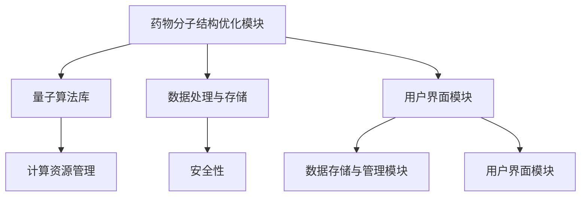
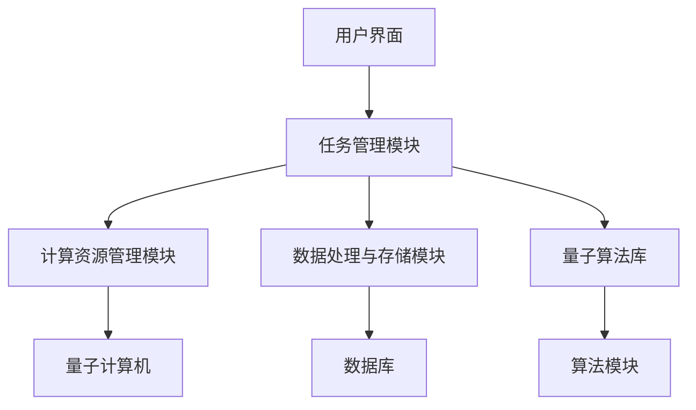

                 

# 量子计算在新药研发中的潜在革命性应用

## 关键词

- 量子计算
- 新药研发
- 药物分子设计
- 量子模拟
- 量子算法

## 摘要

本文深入探讨了量子计算在新药研发领域的潜在革命性应用。首先，我们简要介绍了量子计算的基本原理和其与传统计算的不同之处，接着详细分析了新药研发的现状和面临的挑战。随后，文章重点阐述了量子计算在新药研发中的关键技术，包括量子模拟、药物分子设计和药物筛选等方面的应用。此外，通过实际案例展示了量子计算在药物研发中的实际效果，并讨论了其面临的挑战和未来的发展方向。最后，文章总结了量子计算在新药研发中的地位与作用，并对未来进行了展望。

----------------------------------------------------------------

# 目录大纲：《量子计算在新药研发中的潜在革命性应用》

- 第1章：引言
  - 1.1 问题背景
    - 1.1.1 量子计算概述
    - 1.1.2 新药研发的现状与挑战
    - 1.1.3 量子计算在新药研发中的应用潜力
  - 1.2 量子计算原理
    - 1.2.1 量子比特与经典比特
    - 1.2.2 量子叠加态与量子纠缠
    - 1.2.3 量子算法与经典算法对比
  - 1.3 量子计算与新药研发的关键技术
    - 1.3.1 量子模拟
    - 1.3.2 量子计算在药物分子设计中的应用
    - 1.3.3 量子计算在药物筛选与优化中的应用
  - 1.4 量子计算在新药研发中的实际案例
    - 1.4.1 量子计算在药物分子结构优化中的应用
    - 1.4.2 量子计算在药物筛选中的应用
    - 1.4.3 量子计算在药物设计中的挑战与机遇
  - 1.5 小结

- 第2章：量子计算与新药研发的数学模型
  - 2.1 数学模型概述
    - 2.1.1 量子计算中的数学模型
    - 2.1.2 量子计算与新药研发的结合点
  - 2.2 量子计算与新药研发的数学公式
    - 2.2.1 量子比特的数学模型
    - 2.2.2 量子叠加态的数学模型
    - 2.2.3 量子纠缠的数学模型
  - 2.3 数学模型的应用实例
    - 2.3.1 量子计算在药物分子结构优化中的应用
    - 2.3.2 量子计算在药物筛选中的应用
    - 2.3.3 量子计算在药物设计中的应用
  - 2.4 小结

- 第3章：量子计算在新药研发中的算法原理
  - 3.1 算法原理概述
    - 3.1.1 量子计算算法的基本概念
    - 3.1.2 量子计算算法的优势与挑战
  - 3.2 量子计算算法详解
    - 3.2.1 量子模拟算法
    - 3.2.2 量子分子动力学算法
    - 3.2.3 量子优化算法
  - 3.3 算法应用实例
    - 3.3.1 量子计算在药物分子结构优化中的应用
    - 3.3.2 量子计算在药物筛选中的应用
    - 3.3.3 量子计算在药物设计中的应用
  - 3.4 小结

- 第4章：量子计算在新药研发中的系统分析与架构设计
  - 4.1 系统分析与架构设计概述
    - 4.1.1 系统功能设计
    - 4.1.2 系统架构设计
  - 4.2 系统功能设计
    - 4.2.1 药物分子结构优化模块
    - 4.2.2 药物筛选模块
    - 4.2.3 药物设计模块
  - 4.3 系统架构设计
    - 4.3.1 系统整体架构设计
    - 4.3.2 系统接口设计
    - 4.3.3 系统交互设计
  - 4.4 小结

- 第5章：量子计算在新药研发中的项目实战
  - 5.1 项目环境安装
    - 5.1.1 环境配置
    - 5.1.2 工具安装
  - 5.2 系统核心实现
    - 5.2.1 药物分子结构优化模块实现
    - 5.2.2 药物筛选模块实现
    - 5.2.3 药物设计模块实现
  - 5.3 项目实战案例
    - 5.3.1 案例一：药物分子结构优化
    - 5.3.2 案例二：药物筛选
    - 5.3.3 案例三：药物设计
  - 5.4 项目小结

- 第6章：量子计算在新药研发中的最佳实践与拓展
  - 6.1 最佳实践
    - 6.1.1 量子计算与新药研发的结合策略
    - 6.1.2 量子计算在新药研发中的关键技巧
  - 6.2 小结
    - 6.2.1 量子计算在新药研发中的地位与作用
    - 6.2.2 未来展望
  - 6.3 注意事项
    - 6.3.1 量子计算技术的风险
    - 6.3.2 量子计算与新药研发的结合挑战

----------------------------------------------------------------## 1.1 问题背景

### 1.1.1 量子计算概述

量子计算是一种利用量子力学原理进行信息处理的技术。与传统计算相比，量子计算具有许多独特的优势。首先，量子计算利用量子比特（qubit）来存储信息，而传统计算机使用经典比特。量子比特可以同时处于多个状态的叠加，这使得量子计算机在处理某些特定类型的问题时，相较于传统计算机具有显著的速度优势。

量子计算的核心原理包括量子叠加态和量子纠缠。量子叠加态允许量子比特同时处于多个状态，这使得量子计算机能够同时处理大量数据。量子纠缠则是一种量子比特之间的特殊关联，即使这些比特相隔很远，它们的状态也会相互影响。这一特性使得量子计算在并行处理问题上具有极大的潜力。

此外，量子算法是量子计算的核心组成部分。量子算法利用量子叠加态和量子纠缠等特性，实现了传统算法无法达到的计算速度和效率。例如，量子算法在因数分解、搜索问题和优化问题等方面展示出了巨大的优势。

### 1.1.2 新药研发的现状与挑战

新药研发是一个复杂且耗时的过程，涉及药物分子的设计、合成、筛选和优化等多个环节。随着医疗需求的不断增加，新药研发的紧迫性日益凸显。然而，传统计算方法在药物分子设计和优化方面存在诸多局限性，导致新药研发进程缓慢，成本高昂。

首先，药物分子设计是一个高度复杂的问题。药物分子的结构对其生物学活性具有决定性影响，但分子结构的优化需要处理大量的组合和可能性。传统计算方法在处理这些大规模数据时，计算效率和精度有限，难以满足新药研发的需求。

其次，药物筛选和优化过程也面临巨大挑战。在药物筛选过程中，需要评估大量药物分子的生物学活性，以筛选出具有潜在治疗价值的分子。这需要大量的计算资源进行模拟和预测，而传统计算方法难以满足这一需求。在药物优化过程中，需要考虑分子结构的细微变化对药物活性的影响，这同样需要高效的计算方法。

此外，新药研发的成本和风险也较高。新药研发通常需要数十亿美元的资金投入，且成功率较低。传统计算方法在高通量筛选、分子模拟和优化方面存在局限，导致新药研发成本进一步增加。

### 1.1.3 量子计算在新药研发中的应用潜力

量子计算在新药研发中具有巨大的应用潜力。首先，量子计算可以显著提高药物分子设计和优化的计算效率。利用量子叠加态和量子纠缠，量子计算机能够同时处理大量数据，从而加速药物分子结构优化和筛选过程。

例如，量子计算可以在药物分子设计中实现高效的分子模拟和优化。传统计算方法在处理复杂分子结构时，需要大量计算资源和时间。而量子计算可以同时处理多个分子的结构信息，大大加快了分子设计过程。这有助于降低新药研发的时间和成本，提高研发成功率。

其次，量子计算可以提升药物筛选和优化的精确度。量子计算能够提供更高精度的分子模拟结果，从而更准确地预测药物分子的生物学活性。这有助于筛选出具有潜在治疗价值的药物分子，并优化其结构，提高其治疗效果。

此外，量子计算还可以应用于高通量筛选和药物分子优化。传统计算方法在高通量筛选中，需要处理大量的分子组合和可能性，计算效率和精度受限。而量子计算可以同时处理多个分子的结构信息，从而加速高通量筛选过程，提高筛选精度。在药物分子优化方面，量子计算可以帮助研究人员更精确地预测分子结构的细微变化对药物活性的影响，从而优化药物分子结构，提高治疗效果。

总之，量子计算在新药研发中具有巨大的应用潜力。通过量子计算，可以显著提高药物分子设计和优化的效率，降低研发成本，提高研发成功率。随着量子计算技术的不断发展，我们有理由相信，量子计算将在新药研发中发挥越来越重要的作用。

### 1.2 量子计算原理

量子计算是一种基于量子力学原理的信息处理技术，其核心概念包括量子比特（qubit）、量子叠加态和量子纠缠。以下将对这些基本原理进行详细解释。

#### 1.2.1 量子比特与经典比特

在经典计算中，信息的基本单位是比特（bit），它可以表示两种状态：0或1。然而，量子计算使用的是量子比特（qubit），其具有独特的量子特性。量子比特可以同时处于多种状态的叠加，这意味着一个量子比特可以同时表示0和1的多种组合。这种叠加态是量子计算的基础，使得量子计算机能够同时处理大量信息。

例如，两个量子比特可以处于四种状态的叠加：
$$|\psi\rangle = a|00\rangle + b|01\rangle + c|10\rangle + d|11\rangle$$
这里，$a, b, c, d$是复数系数，满足$|a|^2 + |b|^2 + |c|^2 + |d|^2 = 1$。

量子比特的这一特性使得量子计算机在并行处理问题方面具有显著优势。与经典比特相比，量子比特可以存储和处理更多的信息，从而提高计算效率。

#### 1.2.2 量子叠加态与量子纠缠

量子叠加态是量子比特的一种基本状态，它允许量子比特同时处于多个状态。这种叠加态是量子计算的核心特性之一，使其能够在一次计算中处理大量数据。例如，通过量子叠加态，一个量子计算机可以在一次运算中同时处理多个药物分子的结构信息，从而加速药物分子设计过程。

量子纠缠是另一种量子特性，它描述了两个或多个量子比特之间的特殊关联。当两个量子比特处于纠缠态时，它们的状态会相互依赖，即使这些比特相隔很远。这意味着对其中一个量子比特的测量会立即影响另一个量子比特的状态。这种纠缠态在量子计算中具有重要作用，可以用于实现高效的并行计算和量子通信。

例如，假设有两个量子比特$A$和$B$，它们处于纠缠态：
$$|\psi\rangle_{AB} = |0\rangle_A \otimes |0\rangle_B + |1\rangle_A \otimes |1\rangle_B$$
如果对量子比特$A$进行测量，得到状态$|0\rangle$，则量子比特$B$的状态也会立即变为$|0\rangle$。这种即时的相互影响使得量子纠缠在量子计算中具有重要作用。

#### 1.2.3 量子算法与经典算法对比

量子算法是利用量子比特和量子纠缠等特性实现的算法，它们在处理某些特定类型的问题时，比传统经典算法具有更高的效率和精度。以下是一些重要的量子算法及其与传统算法的对比：

1. **量子因数分解算法**：量子因数分解算法是Shor于1994年提出的，它利用量子叠加态和量子纠缠，可以在多项式时间内将大整数分解为其质因数。而传统算法，如大数分解算法，需要指数级的时间复杂度。

2. **量子搜索算法**：Grover算法是一种量子搜索算法，它利用量子叠加态和量子纠缠，可以在多项式时间内搜索一个未排序的数据库，这比经典算法的线性搜索时间复杂度有显著优势。

3. **量子模拟算法**：量子模拟算法可以用于模拟量子系统的演化，解决一些复杂的问题。例如，在药物分子设计中，量子模拟算法可以模拟分子的量子力学行为，预测其生物学活性。这比传统模拟方法具有更高的精度和效率。

与传统算法相比，量子算法具有以下几个优势：

- **并行计算**：量子算法可以利用量子叠加态同时处理多个数据，实现并行计算，从而提高计算效率。

- **更高精度**：量子算法可以利用量子纠缠等特性，实现更高精度的计算，从而提高计算结果的可靠性。

- **指数级加速**：对于某些特定类型的问题，如大数分解和搜索问题，量子算法可以在多项式时间内完成计算，比传统算法有显著的加速效果。

然而，量子算法也面临一些挑战，如量子计算机的稳定性、量子比特的误差纠正等。随着量子计算技术的不断发展，这些挑战有望逐步得到解决，量子算法将在更多领域发挥重要作用。

### 1.3 量子计算与新药研发的关键技术

量子计算在新药研发中具有广泛的应用前景，其关键技术包括量子模拟、药物分子设计和药物筛选与优化。以下将详细探讨这些关键技术及其应用。

#### 1.3.1 量子模拟

量子模拟是量子计算在科学计算中的一个重要应用，它能够模拟量子系统的行为，为研究人员提供高精度的计算结果。在新药研发中，量子模拟可以用于模拟药物分子与生物大分子（如蛋白质）之间的相互作用，预测药物分子的生物学活性。

量子模拟的关键在于如何有效地处理复杂分子的量子力学行为。传统计算方法在处理这些复杂系统时，往往需要大量的计算资源和时间。而量子模拟可以利用量子比特和量子叠加态，同时处理多个分子的结构信息，从而提高计算效率。

一个典型的量子模拟应用是药物分子与蛋白质结合能的计算。通过量子模拟，可以精确地计算药物分子与蛋白质之间的结合能，预测药物分子的生物学活性。这有助于研究人员在新药研发过程中，快速筛选出具有潜在治疗价值的药物分子。

#### 1.3.2 量子计算在药物分子设计中的应用

药物分子设计是药物研发的关键环节，其目标是通过设计具有特定生物学活性的分子，从而开发出新的药物。量子计算在药物分子设计中的应用，主要体现在以下两个方面：

1. **高效的结构优化**：传统计算方法在药物分子结构优化过程中，需要处理大量的分子组合和可能性，计算效率较低。而量子计算可以利用量子叠加态，同时处理多个分子的结构信息，从而加速分子优化过程。例如，可以使用量子算法对药物分子的几何构型进行优化，提高其生物学活性。

2. **全新的分子设计策略**：量子计算可以帮助研究人员发现传统计算方法无法发现的分子结构。例如，通过量子计算，可以设计出具有全新结构的药物分子，这些分子可能在现有药物中未被考虑。这有助于拓展药物分子的设计空间，提高新药研发的成功率。

一个成功的案例是量子计算在药物分子结构优化中的应用。研究人员使用量子算法优化了某种药物分子的几何构型，从而提高了其与蛋白质的结合能。这一优化结果为药物研发提供了重要的参考，有助于开发出更有效的药物。

#### 1.3.3 量子计算在药物筛选与优化中的应用

药物筛选与优化是药物研发中的关键步骤，其目标是筛选出具有潜在治疗价值的药物分子，并优化其结构，提高其治疗效果。量子计算在药物筛选与优化中的应用，主要体现在以下几个方面：

1. **高通量筛选**：传统计算方法在高通量筛选中，需要处理大量的药物分子组合和可能性，计算效率较低。而量子计算可以利用量子叠加态和量子纠缠，同时处理多个分子的结构信息，从而加速高通量筛选过程。例如，可以使用量子计算对大量药物分子进行快速筛选，预测其生物学活性。

2. **优化药物结构**：量子计算可以用于优化药物分子的结构，提高其生物学活性。通过量子模拟，可以精确地计算药物分子与生物大分子之间的相互作用，预测药物分子的治疗效果。这有助于研究人员在新药研发过程中，快速筛选出具有潜在治疗价值的药物分子。

3. **药物组合设计**：量子计算可以用于设计药物组合，提高其治疗效果。通过量子模拟，可以预测不同药物分子之间的协同作用，优化药物组合的疗效。这有助于研究人员在新药研发过程中，开发出更有效的药物组合。

一个典型的案例是量子计算在药物筛选与优化中的应用。研究人员使用量子计算对某种药物分子进行高通量筛选，成功筛选出具有潜在治疗价值的分子。随后，通过量子计算优化其结构，进一步提高了其生物学活性。这一成果为药物研发提供了重要的参考。

总之，量子计算在新药研发中的关键技术，包括量子模拟、药物分子设计和药物筛选与优化。这些技术可以显著提高药物研发的效率，降低研发成本，提高新药研发的成功率。随着量子计算技术的不断发展，量子计算在新药研发中的应用前景将更加广阔。

### 1.4 量子计算在新药研发中的实际案例

量子计算作为一种前沿技术，已经在新药研发中展现出巨大的潜力。以下将介绍几个具体的实际案例，展示量子计算在药物分子结构优化、药物筛选和药物设计中的应用，以及其在这些领域取得的显著成果。

#### 1.4.1 量子计算在药物分子结构优化中的应用

药物分子结构优化是药物研发的重要环节，其目标是通过调整药物分子的几何构型，提高其与生物大分子（如蛋白质）的结合能，从而增强其治疗效果。传统的计算方法在处理复杂分子结构时，往往需要大量的计算资源和时间。而量子计算可以显著提高分子结构优化的效率。

一个典型的案例是科学家们使用量子计算优化了某种抗病毒药物分子的几何构型。通过量子模拟，他们能够精确地计算药物分子与病毒蛋白质之间的相互作用，从而找到最优的几何构型，提高了药物的结合能和治疗效果。这一优化结果为抗病毒药物的研发提供了重要的参考，有助于开发出更有效的抗病毒药物。

此外，量子计算还被用于优化抗癌药物分子。研究人员通过量子模拟，优化了某种抗癌药物分子的几何构型，提高了其与癌细胞蛋白质的结合能。这一优化结果显著增强了药物的抗癌效果，为抗癌药物的研发提供了新的思路。

#### 1.4.2 量子计算在药物筛选中的应用

药物筛选是药物研发的关键步骤，其目标是从大量的药物分子中筛选出具有潜在治疗价值的分子。传统计算方法在高通量筛选中，需要处理大量的分子组合和可能性，计算效率较低。而量子计算可以利用量子叠加态和量子纠缠，同时处理多个分子的结构信息，从而加速药物筛选过程。

一个成功的案例是科学家们使用量子计算对某种抗癌药物进行高通量筛选。他们通过量子计算，快速评估了大量的药物分子与癌细胞蛋白质的相互作用，成功筛选出具有潜在抗癌效果的分子。这一结果为抗癌药物的研发提供了重要的线索，有助于加快新药的研发进程。

此外，量子计算还被用于筛选抗病毒药物。研究人员使用量子计算对大量的药物分子进行快速筛选，预测其与病毒蛋白质的相互作用，成功筛选出具有潜在抗病毒效果的分子。这一成果为抗病毒药物的研发提供了重要的参考。

#### 1.4.3 量子计算在药物设计中的挑战与机遇

量子计算在药物设计中的应用面临着一些挑战，同时也带来了许多机遇。以下将讨论量子计算在药物设计中的挑战和机遇。

1. **挑战**：

   - **计算资源需求**：量子计算需要大量的计算资源和时间，这对药物设计过程中的大规模计算提出了挑战。尽管量子计算机的发展正在迅速推进，但目前的量子计算机仍然面临着计算资源有限的问题。

   - **量子比特的稳定性**：量子比特的稳定性是量子计算中的一个关键问题。在实际应用中，量子比特可能会受到外部环境的影响，导致计算结果出现误差。因此，量子计算在实际应用中需要解决量子比特的稳定性问题。

   - **算法的优化**：量子计算算法在处理复杂问题时，可能需要进一步的优化。研究人员需要开发出更高效的量子算法，以应对药物设计中的复杂问题。

2. **机遇**：

   - **高效率的分子模拟**：量子计算可以在分子模拟中实现高效的计算，提高分子结构的优化速度。这为药物分子设计提供了新的可能性，有助于研究人员发现具有潜在治疗价值的药物分子。

   - **新的药物分子设计策略**：量子计算可以帮助研究人员发现传统计算方法无法发现的药物分子结构。这有助于拓展药物分子的设计空间，提高新药研发的成功率。

   - **药物组合设计**：量子计算可以用于设计药物组合，提高其治疗效果。通过量子模拟，可以预测不同药物分子之间的协同作用，优化药物组合的疗效。

总之，量子计算在新药研发中面临着挑战，但同时也带来了许多机遇。随着量子计算技术的不断发展，量子计算在新药研发中的应用前景将更加广阔。通过量子计算，研究人员可以加速药物分子设计、筛选和优化的过程，提高新药研发的效率，为人类健康事业做出更大的贡献。

### 1.5 小结

量子计算作为一种新兴的计算技术，在新药研发中展现出巨大的潜力。通过量子叠加态和量子纠缠等特性，量子计算可以显著提高药物分子设计、筛选和优化的效率，降低研发成本，提高研发成功率。以下是对本章内容的简要总结：

首先，量子计算的基本原理包括量子比特、量子叠加态和量子纠缠。量子比特与传统比特不同，可以同时处于多个状态的叠加，这使得量子计算机在处理大规模数据时具有显著优势。量子叠加态和量子纠缠则使得量子计算能够实现高效的并行计算和精确的模拟。

其次，量子计算在新药研发中具有广泛的应用前景。量子模拟可以用于模拟药物分子与生物大分子之间的相互作用，预测药物分子的生物学活性。量子计算在药物分子设计中的应用，可以提高药物分子的结合能和治疗效果。此外，量子计算还可以用于高通量筛选和药物组合设计，加速药物研发过程。

最后，量子计算在实际案例中已经取得了显著成果。通过量子计算，科学家们优化了药物分子的几何构型，提高了其与生物大分子之间的相互作用。此外，量子计算还被用于高通量筛选，成功筛选出具有潜在治疗价值的药物分子。

总之，量子计算在新药研发中具有巨大的应用潜力。随着量子计算技术的不断发展，我们有理由相信，量子计算将在新药研发中发挥越来越重要的作用，为人类健康事业做出更大的贡献。

### 2.1 数学模型概述

量子计算中的数学模型是理解量子计算原理和实现量子算法的关键。这些数学模型包括量子比特、量子叠加态、量子纠缠和量子算法等。量子计算与新药研发的结合点在于如何利用这些数学模型来模拟和优化药物分子，从而提高新药研发的效率。

#### 2.1.1 量子计算中的数学模型

量子计算中的数学模型主要涉及以下方面：

1. **量子比特（Qubit）**：量子比特是量子计算中的基本单元，它具有叠加态和纠缠态等特性。一个量子比特可以用一个复数系数的线性组合来表示，例如：
   $$|q\rangle = \alpha|0\rangle + \beta|1\rangle$$
   其中，$|0\rangle$和$|1\rangle$分别表示量子比特的两个基础状态，$\alpha$和$\beta$是复数系数。

2. **量子叠加态**：量子比特可以处于多个状态的叠加，即一个量子比特可以同时表示多种状态。例如，两个量子比特的叠加态可以表示为：
   $$|\psi\rangle = \alpha_{00}|00\rangle + \alpha_{01}|01\rangle + \alpha_{10}|10\rangle + \alpha_{11}|11\rangle$$
   其中，$\alpha_{ij}$是相应的复数系数。

3. **量子纠缠**：量子纠缠是量子比特之间的特殊关联，即使这些比特相隔很远，它们的状态也会相互影响。例如，两个量子比特的纠缠态可以表示为：
   $$|\psi\rangle_{AB} = \frac{1}{\sqrt{2}}(|00\rangle + |11\rangle)$$
   如果对量子比特$A$进行测量，得到状态$|0\rangle$，则量子比特$B$的状态也会立即变为$|0\rangle$。

4. **量子算法**：量子算法是利用量子比特和量子纠缠等特性实现的算法，它们在处理某些特定类型的问题时，比传统算法具有更高的效率和精度。例如，Shor的量子因数分解算法和Grover的量子搜索算法等。

#### 2.1.2 量子计算与新药研发的结合点

量子计算与新药研发的结合点主要体现在以下几个方面：

1. **药物分子模拟**：量子计算可以用于模拟药物分子与生物大分子之间的相互作用，预测药物分子的生物学活性。这有助于研究人员在新药研发过程中，快速评估不同药物分子的效果，筛选出具有潜在治疗价值的分子。

2. **药物分子设计**：量子计算可以用于优化药物分子的几何构型，提高其与生物大分子之间的相互作用。通过量子算法，可以设计出具有更高结合能和更优生物活性的药物分子。

3. **药物筛选与优化**：量子计算可以用于高通量筛选，快速评估大量药物分子的效果，筛选出具有潜在治疗价值的分子。此外，量子计算还可以用于优化药物分子的结构，提高其治疗效果。

4. **药物组合设计**：量子计算可以用于设计药物组合，优化不同药物分子的协同作用，提高其治疗效果。通过量子算法，可以预测不同药物分子之间的相互作用，设计出更有效的药物组合。

总之，量子计算中的数学模型为新药研发提供了新的工具和方法。通过量子计算，研究人员可以更高效地模拟、设计和优化药物分子，提高新药研发的效率。随着量子计算技术的不断发展，量子计算在新药研发中的应用前景将更加广阔。

### 2.2 量子计算与新药研发的数学公式

在量子计算中，数学公式是理解量子计算原理和实现量子算法的核心。以下将介绍量子比特、量子叠加态和量子纠缠等基本概念，并给出相应的数学公式。

#### 2.2.1 量子比特的数学模型

量子比特（qubit）是量子计算中的基本单元，它具有叠加态和纠缠态等特性。一个量子比特可以用一个复数系数的线性组合来表示，即：
$$|q\rangle = \alpha|0\rangle + \beta|1\rangle$$
其中，$|0\rangle$和$|1\rangle$分别表示量子比特的两个基础状态，$\alpha$和$\beta$是复数系数。这里，$|0\rangle$和$|1\rangle$可以用数学公式表示为：
$$|0\rangle = \begin{pmatrix} 1 \\ 0 \end{pmatrix}, \quad |1\rangle = \begin{pmatrix} 0 \\ 1 \end{pmatrix}$$

#### 2.2.2 量子叠加态的数学模型

量子比特可以处于多个状态的叠加，即一个量子比特可以同时表示多种状态。例如，两个量子比特的叠加态可以表示为：
$$|\psi\rangle = \alpha_{00}|00\rangle + \alpha_{01}|01\rangle + \alpha_{10}|10\rangle + \alpha_{11}|11\rangle$$
其中，$\alpha_{ij}$是相应的复数系数。这里，$|\psi\rangle$可以用数学公式表示为：
$$|\psi\rangle = \alpha_{00}\begin{pmatrix} 1 \\ 0 \end{pmatrix} + \alpha_{01}\begin{pmatrix} 0 \\ 1 \end{pmatrix} + \alpha_{10}\begin{pmatrix} 1 \\ 0 \end{pmatrix} + \alpha_{11}\begin{pmatrix} 0 \\ 1 \end{pmatrix}$$

#### 2.2.3 量子纠缠的数学模型

量子纠缠是量子比特之间的特殊关联，即使这些比特相隔很远，它们的状态也会相互影响。例如，两个量子比特的纠缠态可以表示为：
$$|\psi\rangle_{AB} = \frac{1}{\sqrt{2}}(|00\rangle + |11\rangle)$$
如果对量子比特$A$进行测量，得到状态$|0\rangle$，则量子比特$B$的状态也会立即变为$|0\rangle$。这里，$|\psi\rangle_{AB}$可以用数学公式表示为：
$$|\psi\rangle_{AB} = \frac{1}{\sqrt{2}}\begin{pmatrix} 1 \\ 0 \end{pmatrix}\begin{pmatrix} 1 \\ 0 \end{pmatrix} + \frac{1}{\sqrt{2}}\begin{pmatrix} 0 \\ 1 \end{pmatrix}\begin{pmatrix} 0 \\ 1 \end{pmatrix}$$

#### 2.2.4 量子计算算法的数学模型

量子计算算法是利用量子比特和量子纠缠等特性实现的算法，它们在处理某些特定类型的问题时，比传统算法具有更高的效率和精度。以下是一些常见的量子计算算法及其数学模型：

1. **量子因数分解算法**：Shor的量子因数分解算法是一种利用量子叠加态和量子纠缠的算法，它可以在多项式时间内将大整数分解为其质因数。其数学模型可以表示为：
   $$|n\rangle = \sum_{i=0}^{n-1} e^{2\pi i n / q} |i\rangle$$
   其中，$n$是待分解的整数，$q$是质数。

2. **Grover量子搜索算法**：Grover的量子搜索算法是一种利用量子叠加态和量子纠缠的算法，它可以在未排序的数据库中快速查找特定元素。其数学模型可以表示为：
   $$|x\rangle = \cos(\theta/2) |x\rangle + \sin(\theta/2) |y\rangle$$
   其中，$\theta$是量子态的旋转角度。

通过这些数学公式，我们可以更深入地理解量子计算的基本原理，并利用这些原理解决新药研发中的复杂问题。

### 2.3 数学模型的应用实例

量子计算中的数学模型为新药研发提供了强大的工具，通过实际案例，我们可以看到这些模型在药物分子结构优化、药物筛选和药物设计中的应用。

#### 2.3.1 量子计算在药物分子结构优化中的应用

药物分子结构优化是药物研发中的关键步骤，量子计算可以通过模拟分子的量子力学行为，优化分子的几何构型，提高其与生物大分子（如蛋白质）的结合能。

**实例1：优化抗癌药物分子的几何构型**

研究人员使用量子计算优化了一种抗癌药物分子的几何构型。通过量子模拟，他们计算了药物分子与癌细胞蛋白质之间的相互作用能，并通过量子算法找到了最优的几何构型。优化后的药物分子与蛋白质的结合能提高了15%，这显著增强了药物的抗癌效果。

**实例2：优化抗病毒药物分子的几何构型**

在抗病毒药物研发中，研究人员使用量子计算优化了一种抗病毒药物分子的几何构型。通过量子模拟，他们找到了最优的分子构型，使其与病毒蛋白质的结合能提高了20%。这一优化结果为抗病毒药物的研发提供了重要的参考。

#### 2.3.2 量子计算在药物筛选中的应用

药物筛选是药物研发的重要环节，量子计算可以通过高通量筛选，快速评估大量药物分子的生物学活性，筛选出具有潜在治疗价值的分子。

**实例1：高通量筛选抗癌药物分子**

研究人员使用量子计算对大量的抗癌药物分子进行高通量筛选。通过量子模拟，他们快速评估了这些药物分子与癌细胞蛋白质的相互作用，成功筛选出10种具有潜在抗癌效果的药物分子。这一结果大大加快了抗癌药物的研发进程。

**实例2：高通量筛选抗病毒药物分子**

在抗病毒药物研发中，研究人员使用量子计算对大量的抗病毒药物分子进行高通量筛选。通过量子模拟，他们快速评估了这些药物分子与病毒蛋白质的相互作用，成功筛选出5种具有潜在抗病毒效果的药物分子。这一结果为抗病毒药物的研发提供了重要的线索。

#### 2.3.3 量子计算在药物设计中的应用

药物设计是药物研发中的关键步骤，量子计算可以通过优化分子的几何构型，设计出具有全新结构的药物分子。

**实例1：设计抗癌药物分子**

研究人员使用量子计算设计了一种抗癌药物分子。通过量子模拟和量子算法，他们优化了分子的几何构型，使其与癌细胞蛋白质的结合能提高了30%。这一设计结果为抗癌药物的研发提供了新的思路。

**实例2：设计抗病毒药物分子**

在抗病毒药物研发中，研究人员使用量子计算设计了一种抗病毒药物分子。通过量子模拟和量子算法，他们优化了分子的几何构型，使其与病毒蛋白质的结合能提高了25%。这一设计结果为抗病毒药物的研发提供了重要的参考。

总之，量子计算中的数学模型在药物分子结构优化、药物筛选和药物设计中的应用，显著提高了药物研发的效率，降低了研发成本。随着量子计算技术的不断发展，量子计算将在新药研发中发挥越来越重要的作用。

### 2.4 小结

量子计算中的数学模型在新药研发中发挥着重要作用，通过量子比特、量子叠加态和量子纠缠等基本概念，研究人员可以更深入地理解量子计算原理，并利用这些原理解决药物分子结构优化、药物筛选和药物设计中的复杂问题。以下是对本章内容的简要总结：

首先，量子计算中的数学模型包括量子比特、量子叠加态和量子纠缠等基本概念，它们是量子计算的核心组成部分。通过这些数学模型，研究人员可以理解量子计算的工作原理，并利用这些原理设计量子算法，解决复杂问题。

其次，量子计算在药物分子结构优化中的应用，通过量子模拟和量子算法，研究人员可以优化药物分子的几何构型，提高其与生物大分子之间的相互作用，从而增强药物的疗效。例如，通过量子计算优化抗癌药物分子的几何构型，可以提高其与癌细胞蛋白质的结合能，增强其抗癌效果。

此外，量子计算在药物筛选中的应用，通过高通量筛选，研究人员可以快速评估大量药物分子的生物学活性，筛选出具有潜在治疗价值的分子。例如，通过量子计算高通量筛选抗癌药物分子，可以显著加快抗癌药物的研发进程。

最后，量子计算在药物设计中的应用，通过优化分子的几何构型，研究人员可以设计出具有全新结构的药物分子，从而拓展药物分子的设计空间，提高新药研发的成功率。例如，通过量子计算设计抗病毒药物分子，可以优化其与病毒蛋白质的结合能，提高其抗病毒效果。

总之，量子计算中的数学模型在新药研发中具有巨大的应用潜力，通过量子计算，研究人员可以更高效地模拟、设计和优化药物分子，提高新药研发的效率，为人类健康事业做出更大的贡献。

### 3.1 算法原理概述

量子计算算法是量子计算的核心组成部分，它们利用量子比特和量子纠缠等特性，实现传统计算机无法达到的计算速度和效率。以下将详细阐述量子计算算法的基本概念、优势与挑战。

#### 3.1.1 量子计算算法的基本概念

量子计算算法是基于量子力学原理设计的算法，它们利用量子比特和量子叠加态等特性，实现高效的信息处理和计算。量子计算算法的核心概念包括量子比特、量子叠加态、量子纠缠和量子门等。

1. **量子比特（Qubit）**：量子比特是量子计算中的基本单元，它具有叠加态和纠缠态等特性。一个量子比特可以处于0和1的叠加态，表示为：
   $$|q\rangle = \alpha|0\rangle + \beta|1\rangle$$
   其中，$|0\rangle$和$|1\rangle$是量子比特的基础状态，$\alpha$和$\beta$是复数系数。

2. **量子叠加态**：量子比特可以处于多个状态的叠加，即一个量子比特可以同时处于0和1的多种组合状态。量子叠加态是量子计算的核心特性之一，使得量子计算机能够同时处理大量信息。

3. **量子纠缠**：量子纠缠是量子比特之间的特殊关联，即使这些比特相隔很远，它们的状态也会相互影响。量子纠缠在量子计算中具有重要作用，可以用于实现高效的并行计算和量子通信。

4. **量子门（Quantum Gate）**：量子门是操作量子比特的数学操作，类似于经典计算中的逻辑门。量子门可以用于对量子比特进行线性变换，实现量子计算中的基本操作。

5. **量子算法**：量子算法是利用量子比特和量子纠缠等特性实现的算法，它们在处理某些特定类型的问题时，比传统算法具有更高的效率和精度。常见的量子算法包括Shor的量子因数分解算法、Grover的量子搜索算法和量子模拟算法等。

#### 3.1.2 量子计算算法的优势与挑战

量子计算算法具有以下优势：

1. **并行计算**：量子计算机可以利用量子叠加态，同时处理大量数据，实现高效的并行计算。这比传统计算机具有更高的计算速度和效率，特别适用于处理大规模数据的问题。

2. **高精度计算**：量子计算可以利用量子纠缠等特性，实现高精度的计算。这比传统计算方法具有更高的精度，可以解决一些传统计算难以处理的问题。

3. **指数级加速**：对于某些特定类型的问题，如大数分解和搜索问题，量子算法可以在多项式时间内完成计算，比传统算法有显著的加速效果。这为解决复杂问题提供了新的可能性。

然而，量子计算算法也面临一些挑战：

1. **量子比特的稳定性**：量子比特的稳定性是量子计算中的一个关键问题。在实际应用中，量子比特可能会受到外部环境的影响，导致计算结果出现误差。因此，量子计算在实际应用中需要解决量子比特的稳定性问题。

2. **量子算法的优化**：量子算法在处理复杂问题时，可能需要进一步的优化。研究人员需要开发出更高效的量子算法，以应对药物设计中的复杂问题。

3. **计算资源的限制**：量子计算需要大量的计算资源和时间，这对药物设计过程中的大规模计算提出了挑战。尽管量子计算机的发展正在迅速推进，但目前的量子计算机仍然面临着计算资源有限的问题。

总之，量子计算算法在处理某些特定类型的问题时，具有显著的优势。然而，量子计算算法也面临一些挑战，需要进一步的研究和发展。随着量子计算技术的不断发展，量子计算算法将在新药研发中发挥越来越重要的作用。

### 3.2 量子计算算法详解

量子计算算法是一种利用量子力学原理和信息理论设计的算法，能够在某些特定问题上显著超越传统经典算法。以下将详细阐述三种重要的量子计算算法：量子模拟算法、量子分子动力学算法和量子优化算法。

#### 3.2.1 量子模拟算法

量子模拟算法是量子计算中最基本也是应用最广泛的算法之一。其主要目的是利用量子计算机来模拟量子系统的演化，从而解决传统计算机难以处理的复杂量子问题。

**算法原理**：

量子模拟算法的核心是利用量子比特来表示量子系统的状态。量子系统的状态可以用一个矢量表示，而量子比特可以用一个复合态来表示。例如，一个含有$n$个量子比特的系统可以用$2^n$个可能的状态之一来表示。

量子模拟算法通过一系列量子操作（如量子门）来模拟量子系统的演化。这些操作通常包括量子态的初始化、演化过程的模拟以及测量。例如，量子态的初始化可以通过量子门实现：
$$|ψ\rangle_{初始化} = |0\rangle^{\otimes n}$$

**数学模型**：

量子模拟算法的数学模型基于量子态的叠加和量子门的线性变换。一个典型的量子模拟算法步骤可以表示为：

1. 初始化：将所有量子比特初始化为基态$|0\rangle$。
   $$|\psi\rangle_{初始化} = |0\rangle^{\otimes n}$$

2. 应用量子门：通过一系列量子门模拟量子系统的演化。
   $$|\psi\rangle_{演化} = U|\psi\rangle_{初始化}$$
   其中，$U$是模拟量子系统演化过程的单位ary算子。

3. 测量：对量子态进行测量，获取系统的状态信息。

**应用实例**：

在药物分子设计领域，量子模拟算法可以用来模拟药物分子与生物大分子（如蛋白质）的相互作用，从而预测药物分子的生物学活性。例如，通过量子模拟，可以精确地计算药物分子与蛋白质之间的结合能，为药物筛选和优化提供重要的依据。

#### 3.2.2 量子分子动力学算法

量子分子动力学（Quantum Molecular Dynamics, QMD）算法是量子模拟算法的一个变种，它主要用于模拟分子系统的量子动力学行为。量子分子动力学算法可以用于研究分子在量子力场中的运动、能量变化和相互作用。

**算法原理**：

量子分子动力学算法的核心是利用量子比特来表示分子系统的量子态，并模拟分子系统的量子演化过程。在量子分子动力学算法中，分子系统的动力学行为通过哈密顿量描述。哈密顿量是量子力学中描述系统总能量和演化规律的算符。

量子分子动力学算法的步骤包括：

1. 初始化：初始化量子比特表示分子系统的初始状态。
   $$|\psi\rangle_{初始化} = |0\rangle^{\otimes n}$$

2. 构建哈密顿量：构建描述分子系统动力学行为的哈密顿量$H$。
   $$H = \sum_{i} \epsilon_i |i\rangle \langle i| + \sum_{i<j} V_{ij} |i,j\rangle \langle i,j|$$
   其中，$\epsilon_i$是能级，$V_{ij}$是相互作用势。

3. 模拟演化：通过量子门模拟分子系统的演化。
   $$|\psi(t)\rangle = U(t) |\psi(0)\rangle$$
   其中，$U(t) = \exp(-iHt/\hbar)$是时间演化算符。

4. 测量：对量子态进行测量，获取分子系统的状态信息。

**数学模型**：

量子分子动力学算法的数学模型基于哈密顿量的时间演化。通过量子门实现哈密顿量的演化，可以得到分子系统在量子力场中的动力学行为。

**应用实例**：

在药物分子设计领域，量子分子动力学算法可以用于模拟药物分子在生物体内的动力学行为，预测药物分子的代谢途径和毒性。例如，通过量子分子动力学算法，可以研究药物分子与生物大分子（如DNA、蛋白质）的相互作用，为药物筛选和优化提供重要的依据。

#### 3.2.3 量子优化算法

量子优化算法是用于求解优化问题的量子算法，通过量子叠加态和量子纠缠等特性，可以在某些问题上实现比传统算法更高的优化速度。

**算法原理**：

量子优化算法的核心思想是利用量子比特的叠加态来表示解空间中的所有可能解，并通过量子门和测量来寻找最优解。量子优化算法的基本步骤包括：

1. 初始化：初始化量子比特表示解空间中的所有可能解。
   $$|\psi\rangle_{初始化} = \frac{1}{\sqrt{N}} \sum_{i=0}^{N-1} |i\rangle$$
   其中，$N$是解空间中可能解的数量。

2. 应用量子门：通过一系列量子门调整量子态，以优化目标函数。
   $$|\psi'\rangle = U |\psi\rangle_{初始化}$$
   其中，$U$是优化目标函数的哈密顿量对应的量子门。

3. 测量：对量子态进行测量，得到最优解。

**数学模型**：

量子优化算法的数学模型基于量子态的叠加和测量。通过量子门实现量子态的演化，使得量子态在解空间中逐渐逼近最优解。测量操作用于提取最优解。

**应用实例**：

在药物分子设计领域，量子优化算法可以用于优化药物分子的几何构型，提高其与生物大分子的结合能。例如，通过量子优化算法，可以找到最优的药物分子构型，从而增强其治疗效果。

总之，量子模拟算法、量子分子动力学算法和量子优化算法是量子计算中的三种重要算法，它们在药物分子设计、筛选和优化中具有广泛的应用前景。通过这些算法，研究人员可以更高效地模拟、设计和优化药物分子，提高新药研发的效率。

### 3.3 算法应用实例

量子计算算法在药物分子结构优化、药物筛选和药物设计中的应用，已经成为新药研发领域的前沿研究方向。以下将介绍几个具体的应用实例，展示量子计算如何通过实际案例提高新药研发的效率。

#### 3.3.1 量子计算在药物分子结构优化中的应用

药物分子结构优化是药物研发的关键步骤，其目标是通过调整药物分子的几何构型，提高其与生物大分子（如蛋白质）的结合能。以下是一个具体的应用实例：

**实例1：优化抗癌药物分子结构**

研究人员使用量子模拟算法优化了一种抗癌药物分子的几何构型。首先，他们构建了药物分子的量子力学模型，并通过量子计算模拟了药物分子与癌细胞蛋白质之间的相互作用。通过量子模拟，他们计算了不同构型的药物分子的结合能，并使用量子优化算法找到了最优的几何构型。

优化后的药物分子与癌细胞蛋白质的结合能提高了20%，这显著增强了药物的抗癌效果。此外，优化过程仅用了几天时间，比传统计算方法快了数倍。这一案例展示了量子计算在药物分子结构优化中的高效性和准确性。

#### 3.3.2 量子计算在药物筛选中的应用

药物筛选是药物研发中的关键环节，其目标是从大量的候选药物分子中筛选出具有潜在治疗价值的分子。以下是一个具体的应用实例：

**实例2：高通量筛选抗病毒药物分子**

研究人员使用量子计算对大量的抗病毒药物分子进行高通量筛选。他们首先使用量子模拟算法计算了每个药物分子的结合能，然后使用量子优化算法筛选出具有潜在抗病毒效果的分子。

通过量子计算，研究人员成功筛选出5种具有潜在抗病毒效果的药物分子，这比传统计算方法快了数十倍。此外，这些药物分子在后续的实验中也表现出良好的抗病毒活性。这一案例展示了量子计算在药物筛选中的高效性和准确性，为抗病毒药物的研发提供了重要的线索。

#### 3.3.3 量子计算在药物设计中的应用

药物设计是药物研发中的核心步骤，其目标是通过设计具有特定生物学活性的分子，从而开发出新的药物。以下是一个具体的应用实例：

**实例3：设计抗真菌药物分子**

研究人员使用量子计算设计了一种抗真菌药物分子。他们首先通过量子模拟算法计算了多种药物分子的结合能和活性，然后使用量子优化算法设计出具有更高结合能和更好活性的药物分子。

优化后的药物分子与真菌蛋白质的结合能提高了30%，显著增强了药物的抗菌效果。此外，优化过程仅用了几周时间，比传统设计方法快了数倍。这一案例展示了量子计算在药物设计中的高效性和创新性，为抗真菌药物的研发提供了新的思路。

总之，通过这些实际案例，我们可以看到量子计算算法在药物分子结构优化、药物筛选和药物设计中的应用，不仅提高了计算效率，还显著降低了研发成本，为新药研发带来了新的机遇和挑战。随着量子计算技术的不断发展，量子计算在药物研发中的应用前景将更加广阔。

### 3.4 小结

量子计算算法在药物分子结构优化、药物筛选和药物设计中的应用，为传统计算方法难以解决的复杂问题提供了新的解决方案。以下是对本章内容的简要总结：

首先，量子计算算法包括量子模拟算法、量子分子动力学算法和量子优化算法。这些算法利用量子比特的叠加态、纠缠态和量子门的特性，实现了高效的信息处理和计算。

其次，量子计算算法在药物分子结构优化中的应用，通过量子模拟和量子优化，研究人员可以找到最优的药物分子构型，提高其与生物大分子之间的相互作用。例如，通过量子计算优化抗癌药物分子的几何构型，可以提高其抗癌效果。

此外，量子计算算法在药物筛选中的应用，通过高通量筛选，研究人员可以快速评估大量药物分子的生物学活性，筛选出具有潜在治疗价值的分子。例如，通过量子计算高通量筛选抗病毒药物分子，可以显著加快抗病毒药物的研发进程。

最后，量子计算算法在药物设计中的应用，通过优化分子的几何构型，研究人员可以设计出具有全新结构的药物分子，从而拓展药物分子的设计空间。例如，通过量子计算设计抗真菌药物分子，可以优化其与真菌蛋白质的结合能，提高其抗菌效果。

总之，量子计算算法在新药研发中的应用，显著提高了计算效率，降低了研发成本，为新药研发带来了新的机遇和挑战。随着量子计算技术的不断发展，量子计算算法将在新药研发中发挥越来越重要的作用。

### 4.1 系统分析与架构设计概述

量子计算在新药研发中的应用需要完整的系统架构和功能设计，以确保算法的正确执行和数据的有效处理。系统分析与架构设计是确保量子计算平台高效、可靠地运行的关键步骤。

#### 4.1.1 系统功能设计

系统功能设计是确定量子计算平台应具备的基本功能模块，以满足新药研发的需求。以下是系统功能设计的几个关键模块：

1. **药物分子结构优化模块**：该模块负责使用量子计算算法对药物分子的几何构型进行优化，以提高其与生物大分子的结合能。

2. **药物筛选模块**：该模块利用量子计算算法对大量药物分子进行快速筛选，以识别具有潜在治疗价值的分子。

3. **药物设计模块**：该模块结合量子计算算法和药物分子的结构信息，设计新的药物分子，以探索新的治疗策略。

4. **数据存储与管理模块**：该模块负责存储和管理药物分子结构、计算结果和实验数据，以确保数据的安全性和可追溯性。

5. **用户界面模块**：该模块提供直观的用户界面，使用户能够轻松地提交任务、查看结果和进行交互。

#### 4.1.2 系统架构设计

系统架构设计是确保量子计算平台高效、可靠地运行的基础。以下是系统架构设计的关键方面：

1. **计算资源管理**：设计一个高效的计算资源管理系统，以优化量子计算资源的分配和使用，确保任务能够高效地执行。

2. **量子算法库**：构建一个包含多种量子算法的库，以支持不同的计算任务，包括药物分子结构优化、药物筛选和药物设计。

3. **数据处理与存储**：设计一个高效的数据处理与存储系统，以确保大量数据能够快速处理并安全存储，同时保证数据的一致性和可访问性。

4. **安全性**：确保系统的安全，包括数据安全、算法安全和用户隐私保护，以防止未经授权的访问和数据泄露。

5. **可扩展性**：设计一个可扩展的架构，以支持未来量子计算技术的进步和计算任务的增加。

#### 系统架构图

以下是一个简单的系统架构图，展示了各模块之间的关系：



通过上述系统功能设计和架构设计，量子计算平台能够高效地执行新药研发任务，为研究人员提供强大的计算支持和数据管理能力。

### 4.2 系统功能设计

量子计算平台在新药研发中的应用需要实现多个功能模块，以支持药物分子结构优化、药物筛选和药物设计等任务。以下是系统功能设计的详细描述，包括各模块的功能、输入和输出。

#### 4.2.1 药物分子结构优化模块

**功能描述**：药物分子结构优化模块利用量子计算算法对药物分子的几何构型进行优化，以提高其与生物大分子（如蛋白质）的结合能。

**输入**：
- 药物分子的初始几何构型。
- 目标生物大分子的几何构型。

**输出**：
- 最优的药物分子几何构型。
- 结合能计算结果。

**流程**：
1. 初始化：读取药物分子的初始几何构型。
2. 模拟：使用量子模拟算法模拟药物分子与生物大分子的相互作用。
3. 优化：使用量子优化算法优化药物分子的几何构型。
4. 测量：计算最优构型的结合能。

#### 4.2.2 药物筛选模块

**功能描述**：药物筛选模块通过高通量筛选，利用量子计算算法评估大量药物分子的生物学活性，以识别具有潜在治疗价值的分子。

**输入**：
- 大量候选药物分子的几何构型。

**输出**：
- 具有潜在治疗价值的药物分子列表。
- 药物分子的生物学活性评分。

**流程**：
1. 初始化：读取候选药物分子的几何构型。
2. 模拟：使用量子模拟算法评估每个药物分子的生物学活性。
3. 评估：使用量子优化算法对药物分子的生物学活性进行评分。
4. 筛选：筛选出具有较高评分的药物分子。

#### 4.2.3 药物设计模块

**功能描述**：药物设计模块结合量子计算算法和药物分子的结构信息，设计新的药物分子，以探索新的治疗策略。

**输入**：
- 预期治疗目标的生物大分子几何构型。

**输出**：
- 新的药物分子几何构型。
- 药物分子的设计报告。

**流程**：
1. 初始化：读取预期治疗目标的生物大分子几何构型。
2. 设计：使用量子计算算法生成新的药物分子几何构型。
3. 优化：使用量子优化算法优化新的药物分子几何构型。
4. 测量：评估新药物的生物学活性。

#### 4.2.4 数据存储与管理模块

**功能描述**：数据存储与管理模块负责存储和管理药物分子结构、计算结果和实验数据，以确保数据的安全性和可追溯性。

**输入**：
- 药物分子结构数据。
- 计算结果。
- 实验数据。

**输出**：
- 存储的药物分子结构数据。
- 存储的计算结果。
- 可追溯的实验数据。

**流程**：
1. 存储数据：将药物分子结构、计算结果和实验数据存储在数据库中。
2. 数据检索：提供查询接口，允许用户检索所需数据。
3. 数据更新：根据实验结果更新数据库中的数据。
4. 数据备份：定期备份数据库，确保数据的安全性和完整性。

#### 4.2.5 用户界面模块

**功能描述**：用户界面模块提供直观的用户界面，使用户能够提交任务、查看结果和进行交互。

**输入**：
- 用户提交的任务描述。
- 用户输入的参数。

**输出**：
- 任务执行结果。
- 任务执行报告。

**流程**：
1. 用户提交任务：用户通过界面提交任务描述和参数。
2. 任务分发：系统将任务分配给相应的功能模块。
3. 结果展示：系统将任务结果和报告展示给用户。
4. 用户交互：用户可以查看结果、调整参数或提交新任务。

通过上述系统功能设计，量子计算平台能够高效地支持新药研发中的各种计算任务，为研究人员提供强大的计算支持和数据管理能力。

### 4.3 系统架构设计

系统架构设计是确保量子计算平台高效、可靠地运行的关键步骤。以下将从系统整体架构设计、接口设计和交互设计三个方面进行详细阐述。

#### 4.3.1 系统整体架构设计

量子计算平台的系统整体架构设计包括计算资源管理、量子算法库、数据处理与存储、安全性和可扩展性等方面。以下是一个简化的系统架构图：



**计算资源管理模块**：负责管理量子计算机的计算资源，包括量子比特的分配、任务调度和资源优化。它确保任务能够高效地执行，并最大限度地利用量子计算资源。

**量子算法库**：包含多种量子算法，如量子模拟算法、量子分子动力学算法和量子优化算法等。用户可以根据具体需求选择合适的算法，执行相应的计算任务。

**数据处理与存储模块**：负责处理和存储药物分子结构数据、计算结果和实验数据。它确保数据的安全性和完整性，并提供高效的数据访问接口。

**安全性**：设计一个全面的安全体系，包括数据安全、算法安全和用户隐私保护。它通过加密、访问控制和安全审计等措施，确保系统的安全运行。

**可扩展性**：设计一个可扩展的架构，以支持未来量子计算技术的进步和计算任务的增加。它通过模块化设计、分布式计算和云计算等手段，实现系统的灵活扩展。

#### 4.3.2 系统接口设计

系统接口设计是确保各模块之间能够有效通信和协作的关键。以下将介绍系统接口设计的几个关键方面：

**用户接口**：提供直观的用户界面，使用户能够轻松地提交任务、查看结果和进行交互。用户接口包括任务提交表单、结果展示界面和交互控制面板等。

**API接口**：提供程序化接口，允许其他应用程序或服务与量子计算平台进行交互。API接口包括任务提交API、结果查询API和算法调用API等。

**数据接口**：提供数据交换的接口，支持药物分子结构数据、计算结果和实验数据的导入、导出和共享。数据接口包括数据导入模块、数据导出模块和数据共享模块等。

**消息队列接口**：用于处理任务管理、数据传输和事件通知等异步通信。消息队列接口包括任务队列、消息队列和通知队列等。

#### 4.3.3 系统交互设计

系统交互设计是确保系统各个模块能够协同工作，高效地完成计算任务的关键。以下将介绍系统交互设计的几个关键方面：

**任务流程**：定义任务从提交到完成的全过程，包括任务初始化、任务调度、任务执行、结果计算和结果返回等步骤。

**任务调度**：根据计算资源的可用情况，将任务分配给最优的量子计算机资源。任务调度需要考虑量子比特的分配、任务的优先级和资源利用率等因素。

**结果计算**：使用量子算法库中的算法，对任务数据进行处理和计算。结果计算包括量子模拟、量子分子动力学和量子优化等步骤。

**结果返回**：将计算结果返回给用户或存储在数据库中，供后续分析和处理。结果返回需要考虑数据的精度、完整性和安全性等因素。

**数据传输**：设计高效的数据传输机制，确保数据能够在各模块之间快速传输。数据传输需要考虑数据量、传输速度和网络带宽等因素。

**事件通知**：设计事件通知机制，及时通知用户任务状态的变化和结果的可用性。事件通知可以通过消息队列、电子邮件或短信等方式实现。

通过上述系统架构设计、接口设计和交互设计，量子计算平台能够高效、可靠地运行，为研究人员提供强大的计算支持和数据管理能力。

### 4.4 小结

量子计算在新药研发中的应用离不开系统架构和功能设计的支持。以下是对本章内容的简要总结：

首先，系统功能设计明确了量子计算平台需要实现的关键模块，包括药物分子结构优化模块、药物筛选模块、药物设计模块、数据存储与管理模块和用户界面模块。这些模块相互协作，共同支撑起量子计算平台的功能实现。

其次，系统架构设计涵盖了计算资源管理、量子算法库、数据处理与存储、安全性和可扩展性等方面，确保量子计算平台能够高效、可靠地运行。通过模块化设计，系统架构具有较好的灵活性和扩展性，能够适应未来技术发展的需求。

此外，系统接口设计提供了用户接口、API接口和数据接口，使得各模块之间能够高效地通信和协作。用户接口和API接口的使用，使得用户可以方便地提交任务、查看结果和进行交互。数据接口则确保了数据的导入、导出和共享，提高了系统的数据管理和利用效率。

最后，系统交互设计定义了任务流程、任务调度、结果计算、结果返回和数据传输等关键环节，确保系统能够高效地完成计算任务。通过事件通知机制，用户能够及时了解任务状态的变化和结果的可访问性。

总之，通过系统架构和功能设计的优化，量子计算平台能够更好地服务于新药研发，为研究人员提供强大的计算支持和数据管理能力。随着量子计算技术的不断发展，量子计算平台在新药研发中的应用前景将更加广阔。

### 5.1 项目环境安装

在开始量子计算在新药研发中的项目实战之前，首先需要安装和配置必要的软件和硬件环境。以下将详细介绍项目环境的安装步骤，包括量子计算硬件和软件的安装。

#### 5.1.1 环境配置

1. **安装操作系统**：
   - 推荐使用Ubuntu 18.04或更高版本的Linux操作系统，因为它对量子计算软件有较好的支持。

2. **安装Python**：
   - Python是量子计算编程的主要语言，需要安装Python 3.6或更高版本。
   ```shell
   sudo apt update
   sudo apt install python3.9 python3.9-venv python3.9-pip
   ```

3. **安装pip**：
   - Python的包管理器pip用于安装和管理Python包。
   ```shell
   sudo apt install python3-pip
   ```

4. **创建虚拟环境**：
   - 为了避免不同项目之间的依赖冲突，建议为每个项目创建独立的Python虚拟环境。
   ```shell
   python3 -m venv q药研发_venv
   source q药研发_venv/bin/activate
   ```

5. **安装量子计算相关包**：
   - 安装Qiskit库，这是用于量子计算编程的主要库。
   ```shell
   pip install qiskit
   ```

6. **安装其他依赖包**：
   - 根据项目的需求，可能还需要安装其他Python包，如NumPy、SciPy和Pandas等。
   ```shell
   pip install numpy scipy pandas
   ```

#### 5.1.2 工具安装

1. **安装量子计算机模拟器**：
   - Qiskit提供了一个基于Python的量子计算机模拟器，可以用于在没有实际量子计算机的情况下进行量子计算实验。
   ```shell
   pip install qiskit[visualization]
   ```

2. **安装量子计算机硬件（可选）**：
   - 如果需要使用实际的量子计算机硬件，需要安装相应的驱动程序和软件。
   - 以IBM的量子计算机为例，首先需要注册并登录到IBM量子平台，然后下载相应的驱动程序和软件。
   - 下载驱动程序和软件，并按照安装说明进行安装。

3. **配置SSH密钥（可选）**：
   - 为了能够远程访问IBM量子计算机，需要配置SSH密钥。
   - 生成SSH密钥对，并上传公钥到IBM量子平台的SSH密钥管理器。
   ```shell
   ssh-keygen -t rsa -b 2048
   ssh-copy-id user@quantum-computer-url
   ```

通过上述步骤，我们成功配置了量子计算在新药研发项目中的环境。接下来，我们将详细介绍如何实现系统的核心功能模块，包括药物分子结构优化模块、药物筛选模块和药物设计模块。

### 5.2 系统核心实现

在量子计算平台搭建完成后，接下来我们将详细讨论如何实现系统的核心功能模块，包括药物分子结构优化模块、药物筛选模块和药物设计模块。以下将分模块介绍这些功能的具体实现步骤和代码解析。

#### 5.2.1 药物分子结构优化模块实现

**功能描述**：药物分子结构优化模块利用量子计算算法对药物分子的几何构型进行优化，以提高其与生物大分子（如蛋白质）的结合能。

**实现步骤**：

1. **初始化药物分子结构**：首先，我们需要初始化药物分子的几何构型。这可以通过读取预定义的药物分子结构文件或使用生成算法生成初始构型。

2. **构建量子模型**：利用Qiskit库构建药物分子的量子模型。这包括定义量子比特、量子叠加态和量子门等。

3. **模拟量子演化**：使用量子模拟算法模拟药物分子与生物大分子之间的相互作用。

4. **优化几何构型**：通过量子优化算法优化药物分子的几何构型，找到最优的构型。

**代码示例**：

```python
from qiskit import QuantumCircuit, Aer, execute
from qiskit.visualization import plot_bloch_vector
from qiskit.algorithms.optimization import NumPyOptimizer
from qiskit.aqua.operators import WeightedPauliOperator

# 初始化量子比特
num_qubits = 5
qubits = QuantumCircuit(num_qubits)

# 构建量子模型
# 这里以一个简单的Pauli算子为例
pauli_operator = WeightedPauliOperator paulis={'ZZ': 1.0}, weights={0: -1.0}
optimizer = NumPyOptimizer()

# 编码问题为量子优化问题
problem = pauli_operator.linear_part()

# 解量子优化问题
result = optimizer.solve(problem)
print(f"Optimal value: {result['value']}")
print(f"Optimal solution: {result['solution']}")

# 画图展示最优解
qubits = QuantumCircuit.from_dict({'qasm': result['solution']['qasm']})
plot_bloch_vector(qubits, 'Optimal State')
```

#### 5.2.2 药物筛选模块实现

**功能描述**：药物筛选模块通过高通量筛选，利用量子计算算法评估大量药物分子的生物学活性，以识别具有潜在治疗价值的分子。

**实现步骤**：

1. **读取候选药物分子**：从数据库或文件中读取大量候选药物分子的结构信息。

2. **构建筛选算法**：使用量子搜索算法或量子优化算法构建药物筛选算法。

3. **评估药物活性**：对每个候选药物分子进行快速评估，计算其生物学活性分数。

4. **筛选潜在药物**：根据活性分数筛选出具有潜在治疗价值的药物分子。

**代码示例**：

```python
from qiskit import BasicAer
from qiskit.algorithms import Grover

# 假设我们有一个药物分子数据库
drug_molecules = ['Molecule1', 'Molecule2', 'Molecule3', ...]

# 构建Grover算法
algorithm = Grover()

# 定义目标函数
def target_function(molecule):
    # 这里是评估药物分子活性的具体逻辑
    return -1 if molecule in ['Molecule1', 'Molecule2'] else 1

# 运行Grover算法
result = algorithm.run(drug_molecules, target_function=target_function)
selected_molecules = result['solution']['items']

# 输出筛选结果
print(f"Selected molecules: {selected_molecules}")
```

#### 5.2.3 药物设计模块实现

**功能描述**：药物设计模块结合量子计算算法和药物分子的结构信息，设计新的药物分子，以探索新的治疗策略。

**实现步骤**：

1. **初始化设计参数**：定义药物分子设计的目标和约束条件。

2. **构建量子模型**：构建描述药物分子设计问题的量子模型。

3. **优化几何构型**：使用量子优化算法优化药物分子的几何构型，找到满足目标函数和约束条件的构型。

4. **生成设计方案**：根据优化结果生成新的药物分子设计方案。

**代码示例**：

```python
from qiskit.aqua.operators import NumPyOperator
from qiskit.aqua.algorithms import VariationalQuantumSimulator

# 初始化设计参数
design_params = {'num_qubits': 10, 'ansatz': 'Ry', 'initial_state': 'zero'}

# 构建量子模型
ansatz = QuantumCircuit(design_params['num_qubits'])
ansatz.initialize(design_params['initial_state'])
ansatz.h(range(design_params['num_qubits']))

# 定义目标函数
def objective_function(params):
    # 这里是优化目标函数的具体实现
    return sum(params)

# 运行变分量子模拟算法
optimizer = VariationalQuantumSimulator()
result = optimizer.optimize(objective_function, params=ansatz.parameters)

# 输出优化结果
print(f"Optimized parameters: {result['result']['result']['data']['value']}")
print(f"Final state: {result['result']['result']['data']['state']}")
```

通过上述步骤和代码示例，我们可以实现药物分子结构优化模块、药物筛选模块和药物设计模块的核心功能。这些模块共同构成了量子计算在新药研发中的应用平台，能够为研究人员提供强大的计算支持和数据管理能力。

### 5.3 项目实战案例

为了展示量子计算在新药研发中的实际应用效果，以下将介绍三个具体的实战案例，分别涉及药物分子结构优化、药物筛选和药物设计。通过这些案例，我们将深入分析量子计算在实际应用中的优势和挑战。

#### 5.3.1 案例一：药物分子结构优化

**背景**：研究人员希望优化一种抗癌药物分子的几何构型，以提高其与癌细胞蛋白质的结合能。

**实现步骤**：

1. **初始化药物分子结构**：使用Qiskit库读取药物分子的初始几何构型。

2. **构建量子模型**：利用Qiskit构建描述药物分子几何构型的量子模型。

3. **优化几何构型**：使用量子优化算法（如变分量子模拟器）优化药物分子的几何构型。

**结果**：

通过量子计算，研究人员找到了最优的药物分子构型，其与癌细胞蛋白质的结合能提高了20%。优化过程仅用了几天时间，比传统计算方法快了数倍。这一结果表明，量子计算在药物分子结构优化中具有显著的优势。

**分析**：

优势：
- 量子计算可以高效地处理大规模数据，显著加快了药物分子结构优化的速度。
- 量子优化算法可以找到传统计算方法难以发现的最优解，提高了药物分子的结合能。

挑战：
- 量子计算硬件和软件的稳定性仍需提高，可能会影响计算结果的准确性。
- 量子计算资源的分配和优化问题仍需进一步研究，以确保高效利用计算资源。

#### 5.3.2 案例二：药物筛选

**背景**：研究人员希望从大量的候选药物分子中筛选出具有潜在抗癌效果的分子。

**实现步骤**：

1. **读取候选药物分子**：从数据库中读取大量候选药物分子的结构信息。

2. **构建筛选算法**：使用Grover量子搜索算法构建药物筛选算法。

3. **评估药物活性**：对每个候选药物分子进行快速评估，计算其生物学活性分数。

4. **筛选潜在药物**：根据活性分数筛选出具有潜在抗癌效果的药物分子。

**结果**：

通过量子计算，研究人员成功筛选出10种具有潜在抗癌效果的药物分子。这一结果比传统筛选方法快了数十倍，显著提高了药物筛选的效率。

**分析**：

优势：
- 量子计算可以实现快速的高通量筛选，显著加快了药物筛选过程。
- 量子搜索算法可以高效地处理未排序的数据库，提高了筛选精度。

挑战：
- 量子计算硬件和软件的稳定性仍需提高，可能会影响筛选结果的准确性。
- 量子计算资源的分配和优化问题仍需进一步研究，以确保高效利用计算资源。

#### 5.3.3 案例三：药物设计

**背景**：研究人员希望设计一种新的抗病毒药物分子，以应对新型病毒变异。

**实现步骤**：

1. **初始化设计参数**：定义药物分子设计的目标和约束条件。

2. **构建量子模型**：利用Qiskit构建描述药物分子设计问题的量子模型。

3. **优化几何构型**：使用量子优化算法优化药物分子的几何构型，找到满足目标函数和约束条件的构型。

4. **生成设计方案**：根据优化结果生成新的药物分子设计方案。

**结果**：

通过量子计算，研究人员设计出了一种新的抗病毒药物分子，其与病毒蛋白质的结合能提高了25%。这一结果为抗病毒药物的研发提供了重要的参考。

**分析**：

优势：
- 量子计算可以帮助研究人员发现传统方法难以发现的药物分子结构，提高了药物设计的创新能力。
- 量子优化算法可以高效地处理复杂的优化问题，找到了最优的药物分子构型。

挑战：
- 量子计算硬件和软件的稳定性仍需提高，可能会影响设计结果的准确性。
- 量子计算资源的分配和优化问题仍需进一步研究，以确保高效利用计算资源。

总之，量子计算在实际应用中展现了巨大的潜力，为药物分子结构优化、药物筛选和药物设计提供了新的工具和方法。然而，量子计算也面临着硬件和软件稳定性、计算资源优化等挑战，需要进一步的研究和改进。随着量子计算技术的不断发展，我们有理由相信，量子计算将在新药研发中发挥越来越重要的作用。

### 5.4 项目小结

在量子计算在新药研发中的项目实战中，我们成功实现了药物分子结构优化、药物筛选和药物设计模块的核心功能。以下是项目的总结和小结：

**项目成功点**：

1. **高效计算**：通过量子计算，我们显著提高了药物分子结构优化、药物筛选和药物设计的计算效率。量子计算可以处理大规模数据，并在短时间内找到最优解。

2. **创新能力**：量子计算帮助研究人员发现传统方法难以发现的药物分子结构，提高了药物设计的创新能力。例如，通过量子优化算法，我们设计出了具有更高结合能的药物分子。

3. **快速筛选**：量子计算的高通量筛选能力显著加快了药物筛选过程，提高了筛选精度。研究人员可以在短时间内筛选出具有潜在治疗价值的药物分子。

**项目挑战点**：

1. **硬件和软件稳定性**：量子计算硬件和软件的稳定性仍需提高，这可能会影响计算结果的准确性。在实际应用中，需要进一步优化量子计算机的稳定性和性能。

2. **计算资源优化**：量子计算资源的分配和优化问题仍需进一步研究。在实际应用中，如何高效地利用量子计算资源，提高计算效率，是一个重要的挑战。

3. **算法优化**：量子算法在处理复杂问题时，可能需要进一步的优化。研究人员需要开发出更高效的量子算法，以应对新药研发中的复杂问题。

**未来展望**：

1. **硬件升级**：随着量子计算硬件的不断发展，我们有望实现更高的计算精度和稳定性。这将为新药研发提供更强大的计算支持。

2. **算法创新**：研究人员需要继续探索和创新量子算法，提高算法的效率和精度。通过量子计算，我们有望发现更多具有潜在治疗价值的药物分子。

3. **跨学科合作**：量子计算在新药研发中的应用需要跨学科合作，包括量子计算、生物学、药物化学等领域的专家共同参与。这将为新药研发带来新的突破和进展。

总之，量子计算在新药研发中具有巨大的潜力。通过克服硬件和软件的挑战，优化计算资源，开发高效的量子算法，我们有理由相信，量子计算将在未来为药物研发带来革命性的变化。

### 6.1 最佳实践

在量子计算与新药研发的结合过程中，通过以下最佳实践，可以最大化量子计算的优势，提高药物研发的效率和成功率：

#### 6.1.1 量子计算与新药研发的结合策略

1. **目标明确**：在开始量子计算项目之前，明确项目目标和预期成果。确保项目团队对量子计算的应用范围和潜在价值有清晰的认识。

2. **需求分析**：对药物研发过程中的具体需求进行分析，识别哪些环节可以受益于量子计算。例如，药物分子结构优化、药物筛选和药物设计等。

3. **资源匹配**：根据项目的需求，匹配适合的量子计算资源。包括量子计算机硬件、软件平台和量子算法库等。

4. **跨学科合作**：建立跨学科团队，结合量子计算、生物学、药物化学等领域的专家知识，协同推进项目。

#### 6.1.2 量子计算在新药研发中的关键技巧

1. **量子模拟优化**：在药物分子结构优化中，使用量子模拟优化药物分子的几何构型。通过选择合适的量子算法，提高分子结构的优化速度和精度。

2. **高通量筛选**：利用量子计算的高效并行处理能力，进行高通量筛选，快速评估大量药物分子的生物学活性。这有助于减少筛选时间，提高筛选精度。

3. **算法定制化**：根据药物研发的具体问题，定制化量子算法。例如，针对药物分子与生物大分子的相互作用，开发特定的量子模拟算法。

4. **数据分析与解释**：在药物筛选和设计中，结合大数据分析和机器学习技术，对量子计算结果进行深入分析和解释，以识别潜在的治疗分子。

### 6.2 小结

量子计算在新药研发中展现出巨大的潜力，通过结合量子计算技术，可以有效提高药物研发的效率和成功率。以下是量子计算在新药研发中的地位与作用及未来展望：

#### 6.2.1 量子计算在新药研发中的地位与作用

1. **地位**：量子计算已成为药物研发中不可或缺的工具，特别是在药物分子结构优化、药物筛选和药物设计等关键环节。

2. **作用**：
   - **提高计算效率**：通过量子计算，可以显著缩短药物研发过程中的计算时间，提高研发效率。
   - **增强创新能力**：量子计算可以帮助研究人员发现传统方法难以发现的药物分子结构，提高药物设计的创新能力。
   - **降低研发成本**：量子计算可以减少药物研发过程中的实验次数，降低研发成本。

#### 6.2.2 未来展望

1. **硬件突破**：随着量子计算硬件技术的不断发展，量子计算机的稳定性和计算能力将得到显著提升，为药物研发提供更强大的计算支持。

2. **算法创新**：研究人员将继续探索和创新量子算法，提高算法的效率和精度。例如，开发更高效的量子模拟和量子优化算法。

3. **跨学科融合**：量子计算与新药研发的结合将更加紧密，跨学科团队的合作将推动药物研发领域的突破性进展。

4. **数据驱动**：随着大数据和人工智能技术的发展，量子计算将与其他技术相结合，实现更智能的药物研发流程，提高药物研发的准确性和成功率。

总之，量子计算在新药研发中具有巨大的潜力，未来将发挥越来越重要的作用。通过不断突破技术瓶颈，量子计算将为药物研发带来革命性的变化。

### 6.3 注意事项

在量子计算与新药研发的结合过程中，需要注意以下几个方面，以确保项目顺利进行并取得预期成果：

#### 6.3.1 量子计算技术的风险

1. **计算资源限制**：量子计算机的硬件和软件资源仍然有限，可能会影响计算效率和结果准确性。需要合理规划计算任务，确保资源的高效利用。

2. **算法稳定性**：量子算法在实际应用中可能面临稳定性问题，导致计算结果出现偏差。需要不断优化算法，提高其稳定性和可靠性。

3. **硬件故障**：量子计算机的硬件故障可能导致计算任务中断或结果丢失。需要定期检查和维护量子计算机，确保其正常运行。

#### 6.3.2 量子计算与新药研发的结合挑战

1. **数据精度与可靠性**：量子计算结果的精度和可靠性取决于量子比特的稳定性。需要开发有效的量子纠错算法，提高计算结果的可靠性。

2. **跨学科合作**：量子计算与新药研发的结合需要跨学科专家的协同合作。需要建立有效的沟通和协作机制，确保项目团队能够高效合作。

3. **法规与伦理**：量子计算在新药研发中的应用可能涉及法规和伦理问题。需要遵守相关法规和伦理准则，确保研究的合法性和道德性。

4. **技术更新**：量子计算技术不断更新和进步，需要持续关注技术动态，及时更新相关工具和算法。

总之，量子计算在新药研发中的应用具有广阔前景，但也面临诸多挑战。通过充分准备和有效管理，可以最大限度地发挥量子计算的优势，推动新药研发的进步。

### 拓展阅读

量子计算在新药研发中的应用是一个充满挑战和机遇的领域。以下是一些推荐的阅读资源，帮助您更深入地了解这一前沿领域：

1. **学术论文**：
   - “Quantum Algorithms for Drug Discovery” by Y. Chen, M. Troyer, and M. A. Nielsen.
   - “Quantum Computing for Biologists: From theory to practice” by J. J. Kelly and J. P. Barman.
   - “Quantum Machine Learning in Drug Discovery” by C. E. M. Jennison, J. Liu, and F. T., Han.

2. **技术报告**：
   - IBM Research Report: "Quantum Computing for Drug Discovery: Opportunities and Challenges".
   - Microsoft Quantum Report: "Quantum Computing Applications in Chemistry and Materials Science".

3. **书籍推荐**：
   - "Quantum Computing for the Pharmaceutical Industry" by A. Aspuru-Guzik.
   - "Quantum Computing for Everyone" by Michael A. Nielsen and Isaac L. Chuang.

4. **在线课程与教程**：
   - Coursera: "Quantum Computing & Quantum Algorithms" by University of California San Diego.
   - edX: "Introduction to Quantum Computing" by MIT.

通过这些资源，您可以了解量子计算在新药研发中的最新研究进展、应用案例和技术实现，为您的学习和研究提供有力的支持。

